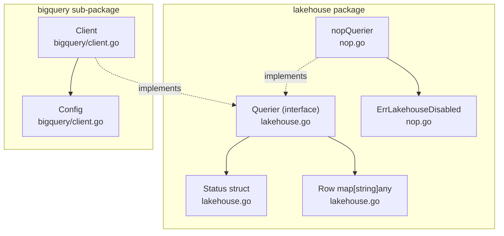
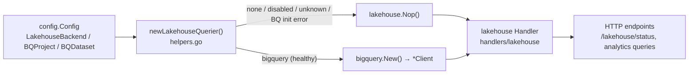
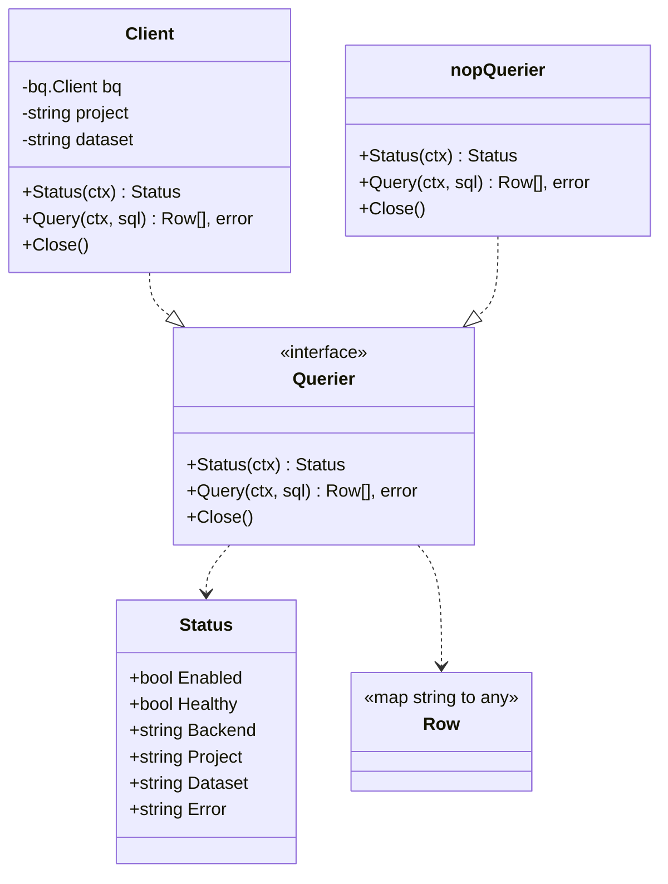
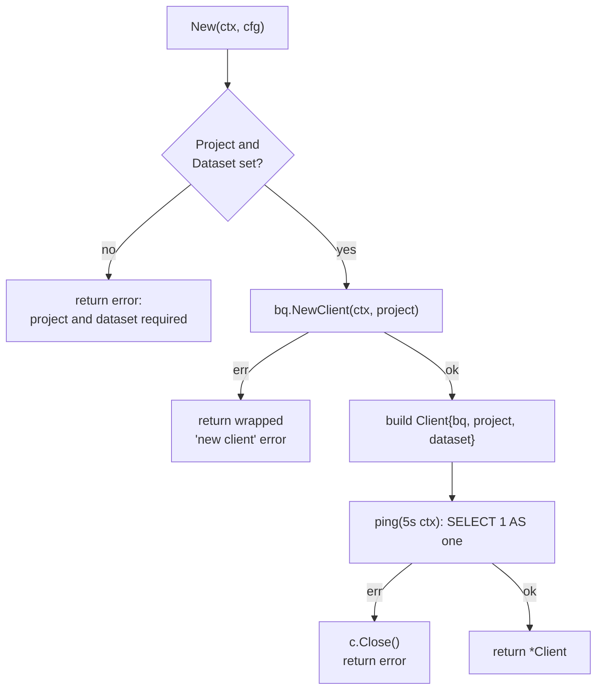
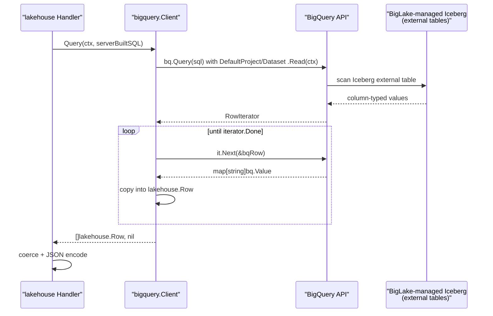
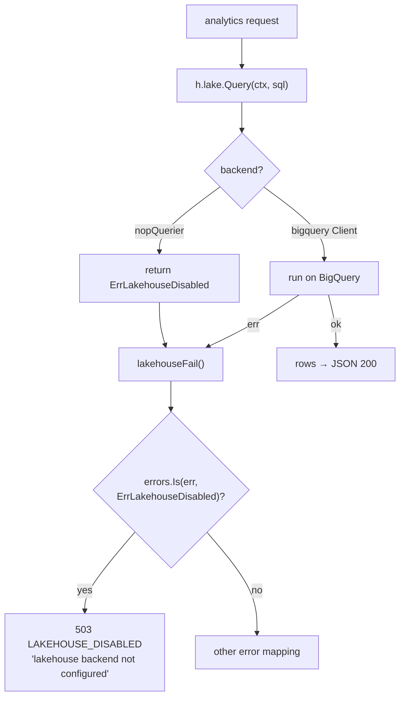
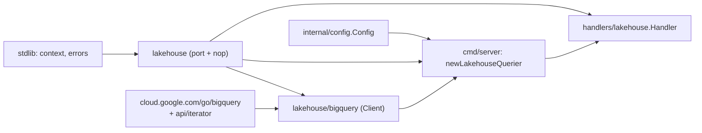

# BigQuery & BigLake

<cite>
**Referenced Files in This Document**

- [backend/internal/lakehouse/lakehouse.go](file://backend/internal/lakehouse/lakehouse.go)
- [backend/internal/lakehouse/nop.go](file://backend/internal/lakehouse/nop.go)
- [backend/internal/lakehouse/bigquery/client.go](file://backend/internal/lakehouse/bigquery/client.go)
- [backend/cmd/server/helpers.go](file://backend/cmd/server/helpers.go)
- [backend/internal/config/config.go](file://backend/internal/config/config.go)
- [backend/internal/handlers/lakehouse/handler.go](file://backend/internal/handlers/lakehouse/handler.go)
</cite>

## Table of Contents
1. [Introduction](#introduction)
2. [Project Structure](#project-structure)
3. [Core Components](#core-components)
4. [Architecture Overview](#architecture-overview)
5. [Detailed Component Analysis](#detailed-component-analysis)
6. [Dependency Analysis](#dependency-analysis)
7. [Performance Considerations](#performance-considerations)
8. [Troubleshooting Guide](#troubleshooting-guide)
9. [Conclusion](#conclusion)
10. [Appendices](#appendices)

## Introduction

The lakehouse module defines the analytical query port that the rest of the
backend uses to read curated, columnar data without binding itself to a
specific query engine. In the current deployment the engine is **Google
BigQuery** reading **BigLake-managed Iceberg tables** that are registered as
BigQuery external tables; an earlier iteration used Trino, which has since been
retired. The package documents this rationale inline and points at the
architecture decision record that selected the BigQuery + BigLake-managed
Iceberg pairing.

The module is intentionally small and port-shaped. It exposes a single
interface, `Querier`, and two implementations: the real BigQuery `Client` under
`bigquery/`, and a `nopQuerier` no-op that lets every dependent endpoint degrade
gracefully when the analytical layer is disabled or fails to initialize. The
handler and usecase layers depend only on the `lakehouse.Querier` interface, so
swapping or disabling the engine never ripples upward into HTTP code.

This page covers the three files that make up the port and its BigQuery adapter,
plus the two call sites that select an implementation at boot
(`backend/cmd/server/helpers.go`) and consume it over HTTP
(`backend/internal/handlers/lakehouse/handler.go`).

**Section sources**
- [backend/internal/lakehouse/lakehouse.go](file://backend/internal/lakehouse/lakehouse.go#L1-L37)
- [backend/internal/lakehouse/bigquery/client.go](file://backend/internal/lakehouse/bigquery/client.go#L1-L17)

## Project Structure

The analytical layer lives entirely under `backend/internal/lakehouse/`. The
package root holds the port definition and the no-op fallback; the BigQuery
adapter is isolated in its own sub-package so that the heavy
`cloud.google.com/go/bigquery` dependency is only imported by code that actually
talks to BigQuery.

- `lakehouse.go` — package doc, the `Status` health struct, the `Row` result
  type, and the `Querier` interface (the port).
- `nop.go` — `nopQuerier`, the disabled-backend fallback, plus the sentinel
  error `ErrLakehouseDisabled` that handlers map to HTTP 503.
- `bigquery/client.go` — `Client`, the BigQuery-backed `Querier`
  implementation, its `Config`, the `New` constructor with a startup health
  probe, and the `Status` / `Query` / `Close` methods.

Two files outside the package complete the picture: the server wiring in
`cmd/server/helpers.go` selects the implementation from configuration, and the
lakehouse HTTP handler consumes whatever `Querier` it is handed.

**Diagram sources**
- [backend/internal/lakehouse/lakehouse.go](file://backend/internal/lakehouse/lakehouse.go#L12-L37)
- [backend/internal/lakehouse/nop.go](file://backend/internal/lakehouse/nop.go#L10-L28)
- [backend/internal/lakehouse/bigquery/client.go](file://backend/internal/lakehouse/bigquery/client.go#L19-L51)

**Section sources**
- [backend/internal/lakehouse/lakehouse.go](file://backend/internal/lakehouse/lakehouse.go#L1-L37)
- [backend/internal/lakehouse/nop.go](file://backend/internal/lakehouse/nop.go#L1-L28)
- [backend/internal/lakehouse/bigquery/client.go](file://backend/internal/lakehouse/bigquery/client.go#L1-L119)

## Core Components

#### The `Querier` port

`Querier` is the minimum surface a lakehouse adapter must implement. It has
three methods: `Status` returns an engine-level health snapshot, `Query` runs an
arbitrary read-only SQL statement and returns rows, and `Close` releases engine
resources. The interface comment is explicit that `Query` is intended for
server-built SQL only — handlers must not interpolate untrusted user input;
parameterized inputs are validated on the handler side and embedded as typed
literals such as `DATE '2026-05-15'`.

#### `Status` and `Row`

`Status` is the JSON-tagged health struct surfaced by `GET /lakehouse/status`.
It carries `Enabled`, `Healthy`, `Backend`, `Project`, `Dataset`, and an
optional `Error` string. `Row` is a single result row keyed by column name; its
values use the engine's native Go types — `int64`, `float64`, `string`,
`time.Time`, and `civil.Date` for BigQuery — so the handler is responsible for
any coercion before JSON encoding.

#### The BigQuery `Client`

`Client` wraps a `*bq.Client` plus the resolved `project` and `dataset`
strings. It is constructed through `New`, which validates config, opens the BQ
client, and runs a `SELECT 1` ping so a broken configuration fails loudly at
boot rather than producing a silently-broken client.

#### The `nopQuerier` fallback

`nopQuerier` is an empty struct returned by `Nop()`. Its `Status` reports
`Enabled: false, Healthy: false, Backend: "none"`, its `Query` always returns
`ErrLakehouseDisabled`, and its `Close` is a no-op. This lets dependent
endpoints degrade to HTTP 503 instead of nil-panicking.

**Section sources**
- [backend/internal/lakehouse/lakehouse.go](file://backend/internal/lakehouse/lakehouse.go#L12-L37)
- [backend/internal/lakehouse/nop.go](file://backend/internal/lakehouse/nop.go#L8-L28)
- [backend/internal/lakehouse/bigquery/client.go](file://backend/internal/lakehouse/bigquery/client.go#L19-L51)

## Architecture Overview

At boot the server resolves a single `lakehouse.Querier` from configuration and
injects it into the lakehouse HTTP handler. The selection switch lives in
`newLakehouseQuerier`: `LAKEHOUSE_BACKEND` of empty/`none`/`disabled` yields
`lakehouse.Nop()`; `bigquery` attempts `bigquery.New`; an unknown value logs a
warning and also returns `Nop()`. Critically, even the `bigquery` branch falls
back to `Nop()` if `New` returns an error, logging the failure — the server
never refuses to start because the analytical layer is unavailable.

**Diagram sources**
- [backend/cmd/server/helpers.go](file://backend/cmd/server/helpers.go#L269-L291)
- [backend/internal/handlers/lakehouse/handler.go](file://backend/internal/handlers/lakehouse/handler.go#L46-L62)

**Section sources**
- [backend/cmd/server/helpers.go](file://backend/cmd/server/helpers.go#L269-L291)
- [backend/internal/config/config.go](file://backend/internal/config/config.go#L57-L65)
- [backend/internal/config/config.go](file://backend/internal/config/config.go#L183-L185)

## Detailed Component Analysis

### The `Querier` interface and contract

The port is deliberately narrow: only `Status`, `Query`, and `Close`. Both
implementations satisfy it structurally — there is no explicit `var _ Querier`
assertion in the source, but the constructor return types (`*Client` from
`bigquery.New`, `nopQuerier` from `Nop`) are assigned to `lakehouse.Querier`
variables at the call sites, which enforces conformance at compile time.

The `Query` contract is the most important detail. Its doc comment states that
SQL must be server-built and that untrusted user input must never be
interpolated; the handler layer is responsible for validating parameters and
embedding them as typed SQL literals. This keeps the SQL-injection surface in
one auditable place (the handler) rather than spread across the adapter.

**Diagram sources**
- [backend/internal/lakehouse/lakehouse.go](file://backend/internal/lakehouse/lakehouse.go#L12-L37)
- [backend/internal/lakehouse/bigquery/client.go](file://backend/internal/lakehouse/bigquery/client.go#L19-L30)
- [backend/internal/lakehouse/nop.go](file://backend/internal/lakehouse/nop.go#L15-L28)

**Section sources**
- [backend/internal/lakehouse/lakehouse.go](file://backend/internal/lakehouse/lakehouse.go#L26-L37)

### BigQuery adapter construction and the health probe

`Config` gates construction with two required fields, `Project` and `Dataset`.
`New` first rejects empty config with an error, then opens a `*bq.Client` for
the project. Before returning, it derives a 5-second timeout context and calls
`ping`, which runs `SELECT 1 AS one` and reads the first row, treating
`iterator.Done` as success. If the probe fails, `New` closes the BQ client and
returns the error — so callers never receive a half-initialized `Client`. This
is what allows `newLakehouseQuerier` to safely fall back to `Nop()` on init
failure.

**Diagram sources**
- [backend/internal/lakehouse/bigquery/client.go](file://backend/internal/lakehouse/bigquery/client.go#L35-L63)

**Section sources**
- [backend/internal/lakehouse/bigquery/client.go](file://backend/internal/lakehouse/bigquery/client.go#L26-L63)

### `Status` health reporting

`Client.Status` builds a `Status` pre-populated with `Enabled: true`,
`Backend: "bigquery"`, and the resolved project and dataset, then runs the same
`ping` under a fresh 5-second timeout. On probe failure it sets `Healthy: false`
and copies the error string into `Status.Error`; on success it sets
`Healthy: true`. This is the snapshot the handler returns verbatim from
`GET /lakehouse/status` (the handler simply JSON-encodes `h.lake.Status(...)`).

By contrast `nopQuerier.Status` reports the disabled triple
(`Enabled: false, Healthy: false, Backend: "none"`) with no project or dataset,
which is how the frontend distinguishes "analytical layer off" from "BigQuery
unhealthy."

**Section sources**
- [backend/internal/lakehouse/bigquery/client.go](file://backend/internal/lakehouse/bigquery/client.go#L65-L82)
- [backend/internal/lakehouse/nop.go](file://backend/internal/lakehouse/nop.go#L20-L22)
- [backend/internal/handlers/lakehouse/handler.go](file://backend/internal/handlers/lakehouse/handler.go#L96-L98)

### Query execution and row materialization

`Client.Query` builds a `bq.Query` from the supplied SQL, sets
`DefaultProjectID` and `DefaultDatasetID` so unqualified table names resolve
against the configured project/dataset, and calls `Read`. It then iterates the
result set: for each row it reads into a `map[string]bq.Value`, copies the
entries into a `lakehouse.Row` (`map[string]any`), and appends to the slice. The
loop terminates on `iterator.Done`; any other iterate error is wrapped and
returned. Native BQ Go types are preserved unchanged — coercion is the handler's
job.

The following sequence shows a typical analytics endpoint flow: the handler
builds SQL server-side, calls `Query`, BigQuery scans the BigLake-managed
Iceberg external tables, and rows are streamed back and re-keyed.

**Diagram sources**
- [backend/internal/lakehouse/bigquery/client.go](file://backend/internal/lakehouse/bigquery/client.go#L88-L112)
- [backend/internal/handlers/lakehouse/handler.go](file://backend/internal/handlers/lakehouse/handler.go#L472-L523)

**Section sources**
- [backend/internal/lakehouse/bigquery/client.go](file://backend/internal/lakehouse/bigquery/client.go#L84-L119)

### The nop fallback path

When the analytical layer is disabled, every `Query` call returns
`ErrLakehouseDisabled`. The handler's `lakehouseFail` helper recognizes this
sentinel via `errors.Is` and maps it to HTTP 503 with the
`LAKEHOUSE_DISABLED` error code and message "lakehouse backend not configured."
This is the graceful-degradation contract: analytics endpoints stay routable and
return a clean, typed 503 rather than crashing or returning misleading data.

**Diagram sources**
- [backend/internal/lakehouse/nop.go](file://backend/internal/lakehouse/nop.go#L8-L26)
- [backend/internal/handlers/lakehouse/handler.go](file://backend/internal/handlers/lakehouse/handler.go#L758-L760)

**Section sources**
- [backend/internal/lakehouse/nop.go](file://backend/internal/lakehouse/nop.go#L1-L28)
- [backend/internal/handlers/lakehouse/handler.go](file://backend/internal/handlers/lakehouse/handler.go#L758-L760)

### `Close` and resource cleanup

`Client.Close` is nil-safe at two levels: it guards both the receiver and the
embedded `bq` client before calling `bq.Close()`, ignoring the close error.
`nopQuerier.Close` does nothing. Because both implementations satisfy the same
`Close` method, the server shutdown path can call `Close` on the resolved
`Querier` uniformly without knowing which backend is active.

**Section sources**
- [backend/internal/lakehouse/bigquery/client.go](file://backend/internal/lakehouse/bigquery/client.go#L114-L119)
- [backend/internal/lakehouse/nop.go](file://backend/internal/lakehouse/nop.go#L28-L28)

## Dependency Analysis

The port package (`lakehouse`) depends only on the standard library
(`context`, `errors`). The BigQuery sub-package adds
`cloud.google.com/go/bigquery` and `google.golang.org/api/iterator`, and imports
the parent `lakehouse` package for `Status` and `Row`. This one-way dependency —
adapter imports port, never the reverse — keeps the heavy cloud SDK out of any
code that only needs the interface.

Upward, the consumers are the server entrypoint and the HTTP handler. The
backend selects the implementation in `newLakehouseQuerier` based on
`config.Config` fields, and the handler stores the result behind the
`lakehouse.Querier` field, guaranteeing it is always non-nil by substituting
`Nop()` when handed `nil`.

**Diagram sources**
- [backend/internal/lakehouse/bigquery/client.go](file://backend/internal/lakehouse/bigquery/client.go#L5-L17)
- [backend/cmd/server/helpers.go](file://backend/cmd/server/helpers.go#L269-L291)

**Section sources**
- [backend/internal/lakehouse/lakehouse.go](file://backend/internal/lakehouse/lakehouse.go#L8-L10)
- [backend/internal/lakehouse/bigquery/client.go](file://backend/internal/lakehouse/bigquery/client.go#L5-L17)
- [backend/internal/handlers/lakehouse/handler.go](file://backend/internal/handlers/lakehouse/handler.go#L46-L62)

## Performance Considerations

- **Startup probe cost.** `New` runs a synchronous `SELECT 1` under a 5-second
  timeout. This adds a small, bounded delay to boot but converts latent
  misconfiguration into an immediate, visible failure that the wiring layer
  turns into a `Nop()` fallback.
- **Status probe on every health check.** `Client.Status` issues a live
  `SELECT 1` per call (5-second timeout). The `/lakehouse/status` endpoint is
  therefore not free — frequent polling translates to repeated trivial BigQuery
  queries. Callers that poll aggressively should account for this.
- **Row materialization.** `Query` accumulates the entire result set into a
  `[]lakehouse.Row` in memory before returning; there is no streaming back to
  the caller. Large result sets are fully buffered, so handlers should constrain
  result size with `LIMIT`/aggregation in the server-built SQL.
- **Map copy per row.** Each row is read into a `map[string]bq.Value` and then
  copied entry-by-entry into a `map[string]any`. For wide tables and many rows
  this is two allocations and a copy per row — acceptable for analytics
  endpoints but not a hot per-request path.
- **Default project/dataset.** Setting `DefaultProjectID`/`DefaultDatasetID` on
  the query lets SQL use unqualified table names; it does not change scan cost,
  which is driven by the underlying BigLake-managed Iceberg tables.

**Section sources**
- [backend/internal/lakehouse/bigquery/client.go](file://backend/internal/lakehouse/bigquery/client.go#L44-L49)
- [backend/internal/lakehouse/bigquery/client.go](file://backend/internal/lakehouse/bigquery/client.go#L66-L82)
- [backend/internal/lakehouse/bigquery/client.go](file://backend/internal/lakehouse/bigquery/client.go#L88-L112)

## Troubleshooting Guide

#### `/lakehouse/status` reports `enabled: false, backend: "none"`

The active implementation is `nopQuerier`. Either `LAKEHOUSE_BACKEND` is
empty/`none`/`disabled`, the value is unrecognized, or `bigquery.New` failed at
boot and the wiring fell back to `Nop()`. Check the server logs for the
`lakehouse bigquery init failed; degrading to nop` warning (includes project and
dataset) or the `unknown lakehouse backend; using nop` warning.

#### `/lakehouse/status` reports `enabled: true, healthy: false`

The BigQuery client constructed successfully but the live `Status` probe failed.
The `error` field carries the wrapped message — typically `bigquery: ping read`
or `bigquery: ping next`. This points at credentials, IAM permissions on the
project/dataset, or BigQuery API availability rather than at configuration
plumbing.

#### Analytics endpoints return HTTP 503 `LAKEHOUSE_DISABLED`

A query reached `nopQuerier.Query`, which always returns
`ErrLakehouseDisabled`; `lakehouseFail` maps it to 503 with this code. Enable a
real backend by setting `LAKEHOUSE_BACKEND=bigquery` plus valid
`LAKEHOUSE_BQ_PROJECT` and `LAKEHOUSE_BQ_DATASET`.

#### `bigquery: project and dataset are required`

`New` rejected the `Config` because `Project` or `Dataset` was empty. `Project`
defaults from `LAKEHOUSE_BQ_PROJECT` then `GCS_PROJECT`; `Dataset` defaults to
`lakehouse_bronze`. If the project is unset in all sources, construction fails
and the layer degrades to nop.

#### Queries error with `bigquery: query read` / `bigquery: query iterate`

The SQL itself failed to plan/run, or iteration failed mid-stream. Because
`Query` is for server-built SQL only, inspect the exact statement the handler
constructed and confirm the referenced external tables exist in the configured
dataset.

**Section sources**
- [backend/internal/lakehouse/bigquery/client.go](file://backend/internal/lakehouse/bigquery/client.go#L35-L62)
- [backend/internal/lakehouse/bigquery/client.go](file://backend/internal/lakehouse/bigquery/client.go#L92-L104)
- [backend/cmd/server/helpers.go](file://backend/cmd/server/helpers.go#L269-L291)
- [backend/internal/config/config.go](file://backend/internal/config/config.go#L183-L185)
- [backend/internal/handlers/lakehouse/handler.go](file://backend/internal/handlers/lakehouse/handler.go#L758-L760)

## Conclusion

The lakehouse module is a clean port-and-adapter design: a three-method
`Querier` interface decouples HTTP and usecase code from the analytical engine,
the BigQuery adapter implements it against BigLake-managed Iceberg external
tables with a fail-fast health probe, and the `nopQuerier` guarantees every
dependent endpoint degrades to a typed 503 rather than crashing. Configuration
chooses the implementation at boot, and even the BigQuery branch falls back to
nop on initialization failure, so the server always starts. The narrow surface
and one-way dependency from adapter to port keep the heavy BigQuery SDK contained
and make the engine choice an implementation detail.

## Appendices

### Configuration keys

| Env var | Config field | Default | Purpose |
| --- | --- | --- | --- |
| `LAKEHOUSE_BACKEND` | `LakehouseBackend` | `bigquery` | Engine selector: `bigquery`, or `none`/`disabled` |
| `LAKEHOUSE_BQ_PROJECT` | `LakehouseBQProject` | falls back to `GCS_PROJECT`, else empty | GCP project hosting the BigQuery dataset |
| `LAKEHOUSE_BQ_DATASET` | `LakehouseBQDataset` | `lakehouse_bronze` | Dataset containing the Iceberg external tables |

**Section sources**
- [backend/internal/config/config.go](file://backend/internal/config/config.go#L57-L65)
- [backend/internal/config/config.go](file://backend/internal/config/config.go#L183-L185)

### `Status` JSON fields

| Field | JSON key | Type | Notes |
| --- | --- | --- | --- |
| `Enabled` | `enabled` | bool | `true` for BigQuery, `false` for nop |
| `Healthy` | `healthy` | bool | result of the live `SELECT 1` probe |
| `Backend` | `backend` | string | `"bigquery"` or `"none"`; omitempty |
| `Project` | `project` | string | resolved BQ project; omitempty |
| `Dataset` | `dataset` | string | resolved BQ dataset; omitempty |
| `Error` | `error` | string | probe error message; omitempty |

**Section sources**
- [backend/internal/lakehouse/lakehouse.go](file://backend/internal/lakehouse/lakehouse.go#L12-L20)

### Backend selection matrix

| `LAKEHOUSE_BACKEND` value | Resulting `Querier` | Notes |
| --- | --- | --- |
| `""`, `none`, `disabled` | `lakehouse.Nop()` | analytical layer off |
| `bigquery` (healthy) | `*bigquery.Client` | after successful `New` + ping |
| `bigquery` (init error) | `lakehouse.Nop()` | logs `degrading to nop` warning |
| any other value | `lakehouse.Nop()` | logs `unknown lakehouse backend` |

**Section sources**
- [backend/cmd/server/helpers.go](file://backend/cmd/server/helpers.go#L269-L291)
