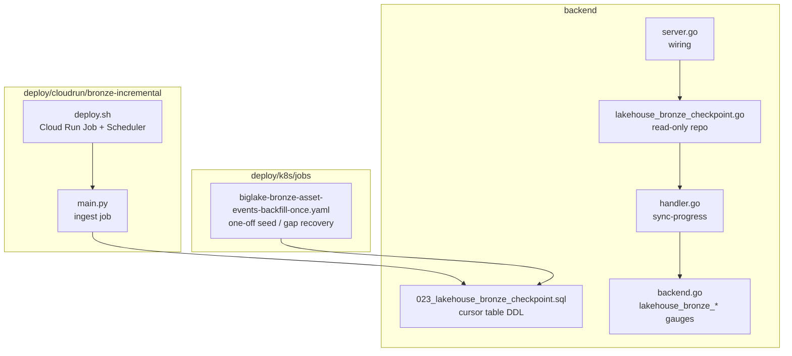
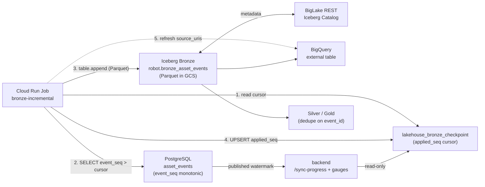
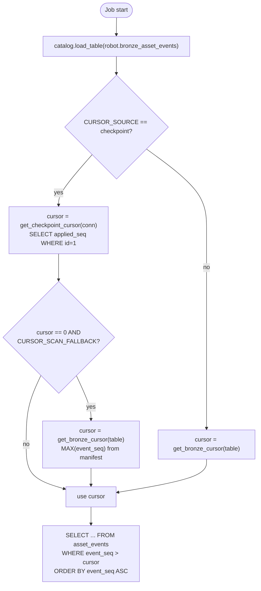
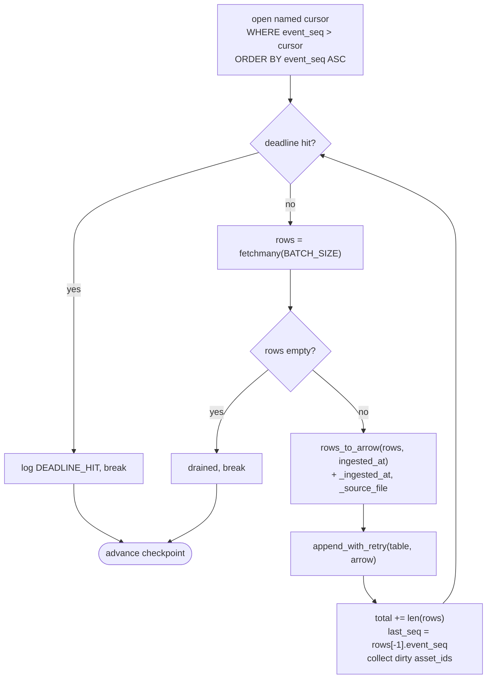
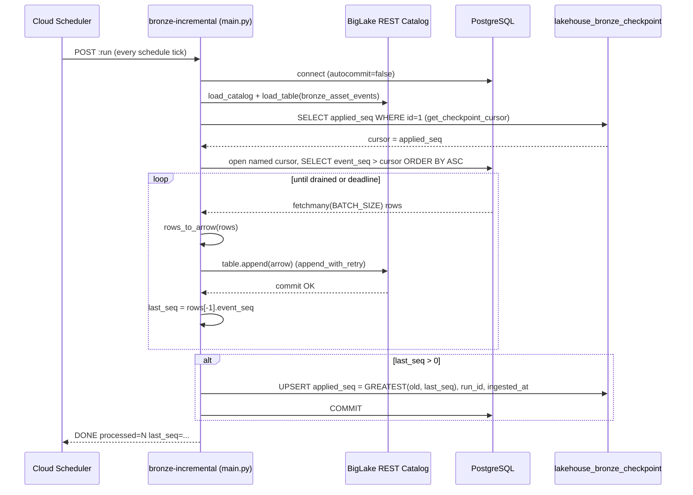
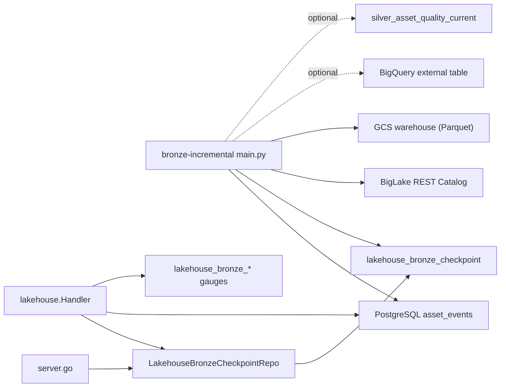

# Incremental Ingestion

<cite>
**Referenced Files in This Document**

- [backend/internal/postgres/lakehouse_bronze_checkpoint.go](file://backend/internal/postgres/lakehouse_bronze_checkpoint.go)
- [backend/migrations/archive/023_lakehouse_bronze_checkpoint.sql](file://backend/migrations/archive/023_lakehouse_bronze_checkpoint.sql)
- [backend/internal/handlers/lakehouse/handler.go](file://backend/internal/handlers/lakehouse/handler.go)
- [backend/internal/metrics/backend.go](file://backend/internal/metrics/backend.go)
- [backend/cmd/server/server.go](file://backend/cmd/server/server.go)
- [deploy/cloudrun/bronze-incremental/main.py](file://deploy/cloudrun/bronze-incremental/main.py)
- [deploy/cloudrun/bronze-incremental/deploy.sh](file://deploy/cloudrun/bronze-incremental/deploy.sh)
- [deploy/k8s/jobs/biglake-bronze-asset-events-backfill-once.yaml](file://deploy/k8s/jobs/biglake-bronze-asset-events-backfill-once.yaml)
- [docs/review/lakehouse-incremental-ingestion.md](file://docs/review/lakehouse-incremental-ingestion.md)
</cite>

## Table of Contents
1. [Introduction](#introduction)
2. [Project Structure](#project-structure)
3. [Core Components](#core-components)
4. [Architecture Overview](#architecture-overview)
5. [Detailed Component Analysis](#detailed-component-analysis)
6. [Dependency Analysis](#dependency-analysis)
7. [Performance Considerations](#performance-considerations)
8. [Troubleshooting Guide](#troubleshooting-guide)
9. [Conclusion](#conclusion)
10. [Appendices](#appendices)

## Introduction

Incremental ingestion is the pipeline that continuously copies the
`asset_events` event stream out of the OLTP PostgreSQL database and into the
Iceberg **Bronze** table (`robot.bronze_asset_events`) of the GCP-managed
lakehouse. It is the entry point of the Medallion (Bronze → Silver → Gold)
architecture: Bronze is the raw, append-only, replay-safe landing zone; Silver
and Gold are derived from it.

The pipeline is built around a single idea — a **monotonic high-water mark
(watermark) cursor** over the global `event_seq` column. Each ingest run reads
the cursor (the highest `event_seq` already in Bronze), pulls only the
PostgreSQL rows beyond it, appends them to Bronze as Parquet via the BigLake
REST Iceberg catalog, and then **advances the cursor** by persisting the new
high-water mark into the `lakehouse_bronze_checkpoint` single-row table. Because
the cursor is `MAX(event_seq)` and `event_seq` is strictly increasing, runs are
idempotent on coverage: a crash or re-run never *misses* an event — at worst it
*duplicates* one, which Silver de-duplicates on `event_id`.

The job is operated as a **Cloud Run Job** (`bronze-incremental`) triggered by
Cloud Scheduler. The backend never writes to Bronze; it only *reads* the
checkpoint table (read-only) to expose watermark health on
`GET /api/v1/lakehouse/sync-progress` and the `lakehouse_bronze_*` Prometheus
gauges. This design replaces the self-managed "Bronze Sink + GCS staging +
PyIceberg MERGE" two-stage blueprint with a simpler single-stage append, because
BigLake handles catalog and file layout for us.

**Section sources**
- [docs/review/lakehouse-incremental-ingestion.md](file://docs/review/lakehouse-incremental-ingestion.md#L1-L38)
- [backend/migrations/archive/023_lakehouse_bronze_checkpoint.sql](file://backend/migrations/archive/023_lakehouse_bronze_checkpoint.sql#L1-L9)
- [deploy/cloudrun/bronze-incremental/main.py](file://deploy/cloudrun/bronze-incremental/main.py#L1-L26)

## Project Structure

Incremental ingestion spans three areas of the repository: the **ingest job**
(Python, under `deploy/`), the **checkpoint schema + reader** (Go + SQL, under
`backend/`), and the **design record** (`docs/review/`).

- **Ingest job** — `deploy/cloudrun/bronze-incremental/`
  - `main.py` — the entire ingest program: cursor read, batched PG fetch,
    Arrow conversion, Iceberg append with retry, checkpoint upsert, optional
    Silver-quality rebuild, and a best-effort BigQuery external-table refresh.
  - `deploy.sh` — builds/pushes the image, deploys the Cloud Run Job, and
    creates/updates the Cloud Scheduler trigger that fires it.
  - `Dockerfile`, `requirements.txt` — runtime image (`python:3.11` + PyIceberg).
- **Checkpoint store** — `backend/`
  - `migrations/archive/023_lakehouse_bronze_checkpoint.sql` — defines the
    single-row `lakehouse_bronze_checkpoint` table (the durable cursor).
  - `internal/postgres/lakehouse_bronze_checkpoint.go` — the **read-only** Go
    repository the backend uses to read that row.
  - `internal/handlers/lakehouse/handler.go` — exposes the watermark snapshot
    over HTTP and updates the Prometheus gauges.
  - `internal/metrics/backend.go` — declares the `lakehouse_bronze_*` gauges.
  - `cmd/server/server.go` — wires the checkpoint repo into the handler.
- **One-off backfill** — `deploy/k8s/jobs/biglake-bronze-asset-events-backfill-once.yaml`
  — the proven K8s Job that seeds Bronze from empty and is also used for gap
  recovery; it shares the same cursor logic and 22+2 column schema.
- **Design doc** — `docs/review/lakehouse-incremental-ingestion.md` — the
  authoritative record of goals, the duplicate-tolerance decision, and the
  observability/alerting contract.



**Diagram sources**
- [deploy/cloudrun/bronze-incremental/main.py](file://deploy/cloudrun/bronze-incremental/main.py#L507-L644)
- [backend/cmd/server/server.go](file://backend/cmd/server/server.go#L44-L45)
- [backend/internal/handlers/lakehouse/handler.go](file://backend/internal/handlers/lakehouse/handler.go#L267-L293)

**Section sources**
- [deploy/cloudrun/bronze-incremental/main.py](file://deploy/cloudrun/bronze-incremental/main.py#L1-L77)
- [deploy/cloudrun/bronze-incremental/deploy.sh](file://deploy/cloudrun/bronze-incremental/deploy.sh#L20-L94)
- [backend/migrations/archive/023_lakehouse_bronze_checkpoint.sql](file://backend/migrations/archive/023_lakehouse_bronze_checkpoint.sql#L10-L23)

## Core Components

The pipeline is composed of four cooperating pieces.

#### The checkpoint table (`lakehouse_bronze_checkpoint`)

The durable cursor is a **single-row** PostgreSQL table. A `CHECK (id = 1)`
constraint enforces the singleton; `applied_seq` holds the highest `event_seq`
the job confirmed committed to Bronze, `ingested_at` is the wall-clock time of
that run, and `run_id` records the Cloud Run execution name for cross-referencing
logs.

```sql
CREATE TABLE IF NOT EXISTS lakehouse_bronze_checkpoint (
    id          INTEGER     PRIMARY KEY,
    applied_seq BIGINT      NOT NULL,
    ingested_at TIMESTAMPTZ NOT NULL,
    run_id      TEXT,
    updated_at  TIMESTAMPTZ NOT NULL DEFAULT now(),
    CONSTRAINT lakehouse_bronze_checkpoint_singleton CHECK (id = 1)
);
```

The migration comment explains *why* the cursor lives in PostgreSQL rather than
being derived from Trino/BigQuery: the backend's Trino catalog cannot see the
BigLake-managed Iceberg tables (different metastore), and the job "knows exactly
what it just committed", making it a strictly more accurate source than a
catalog scan.

**Section sources**
- [backend/migrations/archive/023_lakehouse_bronze_checkpoint.sql](file://backend/migrations/archive/023_lakehouse_bronze_checkpoint.sql#L1-L23)

#### The ingest job (`main.py`)

A stateless batch program. `main()` connects to PostgreSQL, loads the BigLake
REST catalog and the Bronze table, computes the cursor, streams new rows through
a server-side named cursor, appends each batch to Iceberg, and finally upserts
the checkpoint. Key knobs are environment-driven: `BATCH_SIZE` (default 2000),
`JOB_DEADLINE_SEC` (default 240s — leaves shutdown headroom under a 5-minute
schedule), and `CURSOR_SOURCE` (default `checkpoint`).

**Section sources**
- [deploy/cloudrun/bronze-incremental/main.py](file://deploy/cloudrun/bronze-incremental/main.py#L49-L77)
- [deploy/cloudrun/bronze-incremental/main.py](file://deploy/cloudrun/bronze-incremental/main.py#L507-L545)

#### The read-only checkpoint repository (`LakehouseBronzeCheckpointRepo`)

On the backend side, the table is consumed by `LakehouseBronzeCheckpointRepo`.
It is intentionally **read-only**: writes come from the Python job, never from
Go. Its single method `Get` selects the `id = 1` row and returns `(nil, nil)`
both when the row does not exist yet (fresh deployment) and when the table is
missing (migration not applied) — callers treat both as "Bronze empty /
unknown" rather than as errors.

```go
func (r *LakehouseBronzeCheckpointRepo) Get(ctx context.Context) (*LakehouseBronzeCheckpoint, error) {
	const q = `
SELECT applied_seq, ingested_at, COALESCE(run_id, ''), updated_at
FROM lakehouse_bronze_checkpoint
WHERE id = 1`
	...
	if errors.Is(err, pgx.ErrNoRows) {
		return nil, nil
	}
	if isMissingRelation(err) {
		return nil, nil
	}
	...
}
```

**Section sources**
- [backend/internal/postgres/lakehouse_bronze_checkpoint.go](file://backend/internal/postgres/lakehouse_bronze_checkpoint.go#L12-L54)

#### The watermark handler and gauges

`Handler.loadBronzeSyncProgress` joins the OLTP-side watermark
(`MAX(event_seq) WHERE publish_state='published'`) with the Bronze-side
`applied_seq` from the checkpoint to produce a `BronzeSyncProgress` snapshot,
including the derived lag (`outbox_published_max_seq - applied_seq`) and staleness.
`BronzeSyncProgress` (the `GET /sync-progress` endpoint) also pushes the values
into three Prometheus gauges.

**Section sources**
- [backend/internal/handlers/lakehouse/handler.go](file://backend/internal/handlers/lakehouse/handler.go#L188-L293)
- [backend/internal/metrics/backend.go](file://backend/internal/metrics/backend.go#L246-L269)

## Architecture Overview

PostgreSQL `asset_events` is the single source of truth, owned by the backend.
The ingest job reads from it and appends to the BigLake-managed Iceberg Bronze
table (Parquet in GCS). The backend reads the checkpoint to report health; it
does not participate in the write path. Silver/Gold consumers read Bronze and
de-duplicate.



**Diagram sources**
- [deploy/cloudrun/bronze-incremental/main.py](file://deploy/cloudrun/bronze-incremental/main.py#L507-L695)
- [docs/review/lakehouse-incremental-ingestion.md](file://docs/review/lakehouse-incremental-ingestion.md#L39-L78)
- [backend/internal/handlers/lakehouse/handler.go](file://backend/internal/handlers/lakehouse/handler.go#L267-L293)

**Section sources**
- [docs/review/lakehouse-incremental-ingestion.md](file://docs/review/lakehouse-incremental-ingestion.md#L26-L78)
- [deploy/cloudrun/bronze-incremental/main.py](file://deploy/cloudrun/bronze-incremental/main.py#L1-L26)

## Detailed Component Analysis

### Cursor resolution: checkpoint vs. table scan

The job supports two cursor sources, selected by `CURSOR_SOURCE`:

- **`checkpoint`** (default, set in `deploy.sh`): read `COALESCE(applied_seq, 0)`
  from the `lakehouse_bronze_checkpoint` row. This is a fast PG lookup and the
  authoritative cursor in production.
- **`scan`**: read `MAX(event_seq)` directly from the Bronze Iceberg table via
  `get_bronze_cursor`. Because Iceberg keeps per-column min/max in manifest
  metadata, this is effectively O(1) — no Parquet data is scanned.

When `CURSOR_SOURCE=checkpoint` returns `0` (a fresh deployment with no
checkpoint row) and `CURSOR_SCAN_FALLBACK=true`, the job falls back to scanning
Bronze. This lets the checkpoint cursor recover from an already-populated Bronze
table (e.g. seeded by the one-off backfill Job) without re-ingesting everything.



**Diagram sources**
- [deploy/cloudrun/bronze-incremental/main.py](file://deploy/cloudrun/bronze-incremental/main.py#L526-L575)
- [deploy/cloudrun/bronze-incremental/main.py](file://deploy/cloudrun/bronze-incremental/main.py#L127-L146)

**Section sources**
- [deploy/cloudrun/bronze-incremental/main.py](file://deploy/cloudrun/bronze-incremental/main.py#L65-L66)
- [deploy/cloudrun/bronze-incremental/main.py](file://deploy/cloudrun/bronze-incremental/main.py#L127-L146)
- [deploy/cloudrun/bronze-incremental/main.py](file://deploy/cloudrun/bronze-incremental/main.py#L526-L575)
- [deploy/cloudrun/bronze-incremental/deploy.sh](file://deploy/cloudrun/bronze-incremental/deploy.sh#L63-L63)

### Batched extraction and Iceberg append

After resolving the cursor, the job opens a **server-side named cursor**
(`bronze_incremental_cur`) with `itersize = BATCH_SIZE`, so PostgreSQL streams
rows rather than materializing the whole result set. The SELECT projects the 22
business columns of `asset_events` in a fixed order, filters `event_seq > cursor`,
and orders by `event_seq ASC` so that batches advance monotonically.

Each `fetchmany(BATCH_SIZE)` batch is converted to a PyArrow table by
`rows_to_arrow`, which appends the two lake-only columns `_ingested_at` (run
timestamp) and `_source_file` (`RUN_ID`), yielding the 24-column Bronze schema
(`REQUIRED_SCHEMA`). The batch is then written with `append_with_retry`. The
loop tracks `last_seq` (the largest `event_seq` appended) and accumulates the set
of touched `asset_id`s (`dirty_asset_ids`) for the optional Silver-quality step.
The loop exits when `fetchmany` returns no rows **or** when `JOB_DEADLINE_SEC`
is hit — a deadline hit simply means the next scheduled run continues from the
new checkpoint.

`append_with_retry` retries up to 5 times with exponential backoff + jitter on
transient REST/network errors, reloading the table handle after each failure to
avoid stale metadata refs. It fails fast (no retry) on deterministic 4xx errors
(`RESTError 400` / `INVALID_ARGUMENT`), since retrying a schema/argument error
only burns time.



**Diagram sources**
- [deploy/cloudrun/bronze-incremental/main.py](file://deploy/cloudrun/bronze-incremental/main.py#L542-L621)
- [deploy/cloudrun/bronze-incremental/main.py](file://deploy/cloudrun/bronze-incremental/main.py#L273-L330)

**Section sources**
- [deploy/cloudrun/bronze-incremental/main.py](file://deploy/cloudrun/bronze-incremental/main.py#L149-L176)
- [deploy/cloudrun/bronze-incremental/main.py](file://deploy/cloudrun/bronze-incremental/main.py#L201-L257)
- [deploy/cloudrun/bronze-incremental/main.py](file://deploy/cloudrun/bronze-incremental/main.py#L542-L621)

### Advancing the checkpoint (watermark commit)

After the batch loop, the job advances the durable cursor only when it made
progress (`last_seq > 0`). It performs an UPSERT into the single-row table that
**never rolls the watermark backward** — `applied_seq` is set to
`GREATEST(existing, EXCLUDED)`. This guarantees that an idle run (which processed
0 rows but still computed `last_seq = cursor`) refreshes `ingested_at` and
`run_id` without lowering the watermark, and a stale/late run cannot regress a
higher cursor written by another execution.

```sql
INSERT INTO lakehouse_bronze_checkpoint (id, applied_seq, ingested_at, run_id, updated_at)
VALUES (1, %s, %s, %s, now())
ON CONFLICT (id) DO UPDATE
  SET applied_seq = GREATEST(lakehouse_bronze_checkpoint.applied_seq, EXCLUDED.applied_seq),
      ingested_at = EXCLUDED.ingested_at,
      run_id      = EXCLUDED.run_id,
      updated_at  = now()
```

The sequence below shows a full successful run from trigger to checkpoint
advance.



**Diagram sources**
- [deploy/cloudrun/bronze-incremental/main.py](file://deploy/cloudrun/bronze-incremental/main.py#L507-L644)
- [deploy/cloudrun/bronze-incremental/main.py](file://deploy/cloudrun/bronze-incremental/main.py#L139-L146)

**Section sources**
- [deploy/cloudrun/bronze-incremental/main.py](file://deploy/cloudrun/bronze-incremental/main.py#L623-L644)
- [backend/migrations/archive/023_lakehouse_bronze_checkpoint.sql](file://backend/migrations/archive/023_lakehouse_bronze_checkpoint.sql#L10-L17)

### Idempotency and duplicate tolerance

Because the cursor is the highest committed `event_seq`, the pipeline is
**at-least-once** on rows but **never-miss** on coverage:

- A crash mid-run leaves a clean Iceberg state (commits are atomic) and the
  checkpoint un-advanced (the UPSERT runs only after the loop), so the next run
  re-reads from the same cursor.
- A 429 `RESOURCE_EXHAUSTED` mid-commit can cause PyIceberg's internal retry to
  commit while still surfacing the original exception, so `append_with_retry`
  re-appends the same batch — a duplicate. The design doc records the observed
  ~11.5% duplicate rate on the first production catch-up run and **accepts it**:
  the cursor is unaffected, and Silver de-duplicates with
  `ROW_NUMBER() OVER (PARTITION BY event_id ORDER BY event_seq DESC) = 1`.

The consumer contract is therefore: never `COUNT(*) FROM bronze_asset_events` to
count business events; use `COUNT(DISTINCT event_id)` or read through a deduped
Silver view.

**Section sources**
- [docs/review/lakehouse-incremental-ingestion.md](file://docs/review/lakehouse-incremental-ingestion.md#L80-L112)
- [deploy/cloudrun/bronze-incremental/main.py](file://deploy/cloudrun/bronze-incremental/main.py#L18-L25)
- [deploy/cloudrun/bronze-incremental/main.py](file://deploy/cloudrun/bronze-incremental/main.py#L299-L330)

### Backend consumption: sync-progress and gauges

The backend wires the read-only repo into the lakehouse handler in
`server.go` via `WithBronzeCheckpoint(...)`. `loadBronzeSyncProgress` reads the
OLTP published watermark and the Bronze checkpoint, computes lag and staleness,
and `BronzeSyncProgress` publishes them into the three gauges. When the checkpoint
row is absent (`Get` returns `nil`), the snapshot degrades gracefully to "Bronze
unknown" with `BronzeStaleSeconds = -1` and no lag.

```mermaid
sequenceDiagram
  participant FE as Frontend dashboard
  participant H as lakehouse.Handler
  participant PG as PostgreSQL
  participant R as LakehouseBronzeCheckpointRepo
  participant M as Prometheus gauges

  FE->>H: GET /api/v1/lakehouse/sync-progress
  H->>PG: MAX(event_seq) WHERE publish_state='published'
  PG-->>H: outbox_published_max_seq
  H->>R: Get(ctx)
  R->>PG: SELECT ... WHERE id=1
  alt row exists
    PG-->>R: applied_seq, ingested_at, run_id
    R-->>H: *LakehouseBronzeCheckpoint
    H->>H: lag = outbox - applied_seq; stale = now - ingested_at
  else no row / missing table
    R-->>H: (nil, nil)  -> Bronze unknown
  end
  H->>M: Set bronze_max_event_seq / lag_events / last_ingested
  H-->>FE: BronzeSyncProgress JSON
```

**Diagram sources**
- [backend/internal/handlers/lakehouse/handler.go](file://backend/internal/handlers/lakehouse/handler.go#L246-L293)
- [backend/internal/postgres/lakehouse_bronze_checkpoint.go](file://backend/internal/postgres/lakehouse_bronze_checkpoint.go#L36-L54)

**Section sources**
- [backend/cmd/server/server.go](file://backend/cmd/server/server.go#L44-L45)
- [backend/internal/handlers/lakehouse/handler.go](file://backend/internal/handlers/lakehouse/handler.go#L188-L293)
- [backend/internal/metrics/backend.go](file://backend/internal/metrics/backend.go#L246-L269)

### One-off backfill / gap recovery

The K8s Job `biglake-bronze-asset-events-backfill-once.yaml` is the proven
bootstrap and gap-recovery path. It uses the same cursor idea — `bronze_max_seq`
= `MAX(event_seq)` scanned from Bronze — and supports sharded backfills
(`MOD(event_seq, SHARD_COUNT) = SHARD_INDEX`) and an `UPPER_SEQ` ceiling. It
writes `_source_file = "pg_asset_events_backfill_once"` and uses the identical
24-column schema, so its output is indistinguishable from incremental output
downstream. It does **not** write the checkpoint table; after a backfill, the
incremental job picks up via `CURSOR_SCAN_FALLBACK` or by scanning Bronze.

**Section sources**
- [deploy/k8s/jobs/biglake-bronze-asset-events-backfill-once.yaml](file://deploy/k8s/jobs/biglake-bronze-asset-events-backfill-once.yaml#L39-L137)
- [deploy/k8s/jobs/biglake-bronze-asset-events-backfill-once.yaml](file://deploy/k8s/jobs/biglake-bronze-asset-events-backfill-once.yaml#L241-L265)

## Dependency Analysis

The write path depends on PostgreSQL (source), the BigLake REST Iceberg catalog
+ GCS warehouse (sink), and the checkpoint table (cursor). The read path
(backend) depends only on PostgreSQL: it reads both the outbox watermark and the
checkpoint row, so the backend's health view survives a BigQuery/BigLake outage.



Notable couplings and contracts:

- **Schema coupling**: `REQUIRED_SCHEMA` in `main.py` is duplicated in the
  backfill Job's `required_schema`. The design doc flags single-source-of-truth
  for the schema as an open question.
- **Cursor coupling**: backend's `bronze_max_event_seq` gauge documents itself as
  the "cursor for the next ingest run", but in production the job reads
  `applied_seq` from the checkpoint, not the gauge — the gauge is a *reflection*
  of the checkpoint, not its source.
- **Optional sinks**: BigQuery external-table refresh and the Silver-quality
  rebuild are best-effort/feature-gated and do not block the Bronze write path.

**Section sources**
- [backend/cmd/server/server.go](file://backend/cmd/server/server.go#L44-L45)
- [deploy/cloudrun/bronze-incremental/main.py](file://deploy/cloudrun/bronze-incremental/main.py#L149-L176)
- [deploy/k8s/jobs/biglake-bronze-asset-events-backfill-once.yaml](file://deploy/k8s/jobs/biglake-bronze-asset-events-backfill-once.yaml#L139-L166)
- [backend/internal/metrics/backend.go](file://backend/internal/metrics/backend.go#L250-L255)

## Performance Considerations

- **O(1) cursor read.** In `checkpoint` mode the cursor is a single-row PG
  lookup; in `scan` mode `get_bronze_cursor` reads Iceberg manifest min/max
  metadata without scanning Parquet, so it stays cheap even at billions of rows.
- **Server-side streaming.** The named cursor with `itersize = BATCH_SIZE` keeps
  memory bounded (~10 MB Arrow batch at `BATCH_SIZE`), avoiding loading the full
  result set; `event_seq ASC` ordering uses the monotonic sequence as the scan
  key.
- **Batch-friendly Iceberg writes.** Appending per batch (rather than per row)
  avoids the "millions of tiny Parquet files" problem; one Parquet file per
  append. This is the explicit reason the job is a batch job and not a Pub/Sub
  per-message subscriber.
- **Deadline guard.** `JOB_DEADLINE_SEC` (240s) keeps a run inside the schedule
  window; catch-up after a burst is spread across subsequent runs.
- **Steady-state has no duplicates.** Under normal load a run pulls ≤ 1 batch →
  1 commit → cannot collide with itself; duplicates only appear on
  backfill/catch-up bursts that trigger 429 retries.
- **Backend reads are cheap.** `loadBronzeSyncProgress` is two indexed PG reads
  (a `MAX` over `asset_events` and a single-row checkpoint select) — no Iceberg
  scan on the request path.

**Section sources**
- [deploy/cloudrun/bronze-incremental/main.py](file://deploy/cloudrun/bronze-incremental/main.py#L57-L64)
- [deploy/cloudrun/bronze-incremental/main.py](file://deploy/cloudrun/bronze-incremental/main.py#L127-L136)
- [deploy/cloudrun/bronze-incremental/main.py](file://deploy/cloudrun/bronze-incremental/main.py#L542-L575)
- [docs/review/lakehouse-incremental-ingestion.md](file://docs/review/lakehouse-incremental-ingestion.md#L93-L100)

## Troubleshooting Guide

#### `/sync-progress` shows Bronze unknown / lag = 0 forever

`Get` returned `(nil, nil)`. Either the `lakehouse_bronze_checkpoint` row does
not exist (the job has never advanced the cursor — `last_seq > 0` was never true)
or migration `023` was not applied (missing relation). Both are treated as
"Bronze empty / unknown", not errors. Verify the table exists and that at least
one run logged `CHECKPOINT_UPSERT`.

#### Lag (`lakehouse_bronze_lag_events`) keeps climbing

The job is not advancing the watermark. Check the Cloud Run execution: if runs
log `DEADLINE_HIT` every time, raise `JOB_DEADLINE_SEC` or `BATCH_SIZE`, or run
the backfill Job to close a large gap. If `Postgres down`, the job fails fast and
events queue in PG harmlessly; the alert fires on lag.

#### Bronze row count exceeds distinct `event_id` count

Expected after a catch-up/backfill burst due to 429-retry re-appends. Do not
"fix" Bronze — always read through Silver (`ROW_NUMBER() ... = 1`). See the
duplicate-tolerance decision.

#### `APPEND_FATAL_4XX` in logs

A deterministic schema/argument error (`RESTError 400` / `INVALID_ARGUMENT`).
The job does not retry these. Compare the Arrow batch schema against the Bronze
table DDL — usually a schema drift between `REQUIRED_SCHEMA` and the Iceberg
table.

#### Cursor stuck at 0 on a populated Bronze

`CURSOR_SOURCE=checkpoint` with no checkpoint row and `CURSOR_SCAN_FALLBACK=false`.
Set `CURSOR_SCAN_FALLBACK=true` (or run once with `CURSOR_SOURCE=scan`) so the
job seeds its cursor from Bronze's `MAX(event_seq)` instead of re-ingesting from 0.

**Section sources**
- [backend/internal/postgres/lakehouse_bronze_checkpoint.go](file://backend/internal/postgres/lakehouse_bronze_checkpoint.go#L32-L53)
- [deploy/cloudrun/bronze-incremental/main.py](file://deploy/cloudrun/bronze-incremental/main.py#L302-L330)
- [deploy/cloudrun/bronze-incremental/main.py](file://deploy/cloudrun/bronze-incremental/main.py#L526-L536)
- [docs/review/lakehouse-incremental-ingestion.md](file://docs/review/lakehouse-incremental-ingestion.md#L118-L149)

## Conclusion

Incremental ingestion turns a monotonic `event_seq` into a simple, robust
watermark pipeline: read the cursor, pull the tail of `asset_events`, append to
Iceberg Bronze, and advance the durable `lakehouse_bronze_checkpoint` cursor with
a forward-only `GREATEST` UPSERT. The design deliberately trades exactly-once
Bronze writes for operational simplicity, pushing de-duplication into Silver, and
keeps the backend strictly read-only over the checkpoint so health reporting
survives lake outages. The same cursor logic backs both the scheduled Cloud Run
Job and the one-off K8s backfill, giving the pipeline a single, well-understood
recovery story.

## Appendices

### `lakehouse_bronze_checkpoint` columns

| Column | Type | Meaning |
|---|---|---|
| `id` | INTEGER PK | Singleton key, always `1` (CHECK constraint). |
| `applied_seq` | BIGINT | `MAX(event_seq)` confirmed committed to Bronze on the latest run; the durable cursor. |
| `ingested_at` | TIMESTAMPTZ | Wall-clock time of the run that produced `applied_seq` (matches Bronze `_ingested_at`). |
| `run_id` | TEXT | Cloud Run execution name (e.g. `bronze-incremental-jvzkr`) for log cross-reference. |
| `updated_at` | TIMESTAMPTZ | Row last-write time (`now()`). |

**Section sources**
- [backend/migrations/archive/023_lakehouse_bronze_checkpoint.sql](file://backend/migrations/archive/023_lakehouse_bronze_checkpoint.sql#L10-L23)

### Key environment variables (ingest job)

| Variable | Default | Effect |
|---|---|---|
| `CURSOR_SOURCE` | `checkpoint` | Cursor source: `checkpoint` (PG row) or `scan` (Bronze manifest). |
| `CURSOR_SCAN_FALLBACK` | `false` | When checkpoint cursor is 0, fall back to scanning Bronze. |
| `BATCH_SIZE` | `2000` | Rows per server-side fetch / per Iceberg append. |
| `JOB_DEADLINE_SEC` | `240` | Hard ceiling for one execution; leaves shutdown headroom. |
| `SILVER_QUALITY_ENABLED` | `true` | Run the Silver-quality rebuild after Bronze append. |
| `SILVER_QUALITY_MODE` | `incremental` | `incremental` (dirty asset_ids) or `full` rebuild. |
| `BQ_DATASET` | `lakehouse_bronze` | Gates the best-effort BigQuery external-table refresh. |

**Section sources**
- [deploy/cloudrun/bronze-incremental/main.py](file://deploy/cloudrun/bronze-incremental/main.py#L49-L77)
- [deploy/cloudrun/bronze-incremental/deploy.sh](file://deploy/cloudrun/bronze-incremental/deploy.sh#L63-L63)

### Observability gauges and alerts

| Gauge | Source | Meaning |
|---|---|---|
| `lakehouse_bronze_max_event_seq` | checkpoint `applied_seq` | Bronze high-water mark. |
| `lakehouse_bronze_lag_events` | `outbox_published_max_seq - applied_seq` | PG-published events not yet in Bronze; primary alert signal. |
| `lakehouse_bronze_last_ingested_unix_seconds` | checkpoint `ingested_at` | Bronze freshness; `time() - this` = staleness. |

Recommended alerts (per design doc): `lakehouse-bronze-lag` (lag > 50k for 15m),
`lakehouse-bronze-stale` (staleness > 30m), `lakehouse-bronze-cronjob-failed`.

> **Note on schedule:** the design doc targets a `*/5 * * * *` (5-minute) trigger,
> while `deploy.sh` defaults `SCHEDULE` to `0 * * * *` (hourly); the deploy script
> is the source of truth for the currently provisioned Cloud Scheduler job and is
> overridable via the `SCHEDULE` env var.

**Section sources**
- [backend/internal/metrics/backend.go](file://backend/internal/metrics/backend.go#L246-L269)
- [docs/review/lakehouse-incremental-ingestion.md](file://docs/review/lakehouse-incremental-ingestion.md#L129-L149)
- [deploy/cloudrun/bronze-incremental/deploy.sh](file://deploy/cloudrun/bronze-incremental/deploy.sh#L25-L26)
