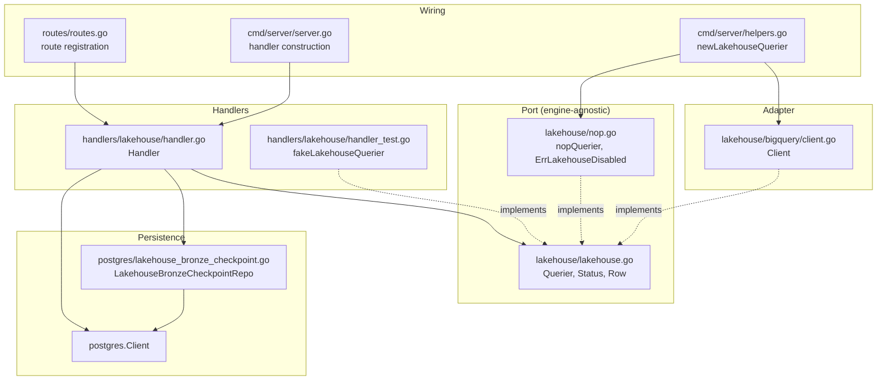
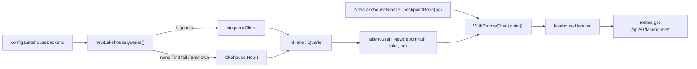
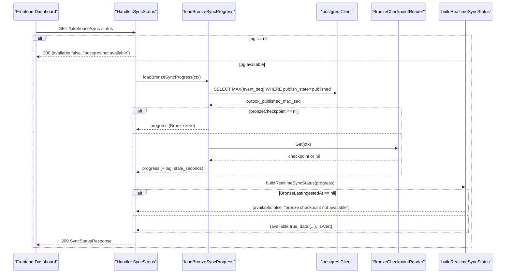
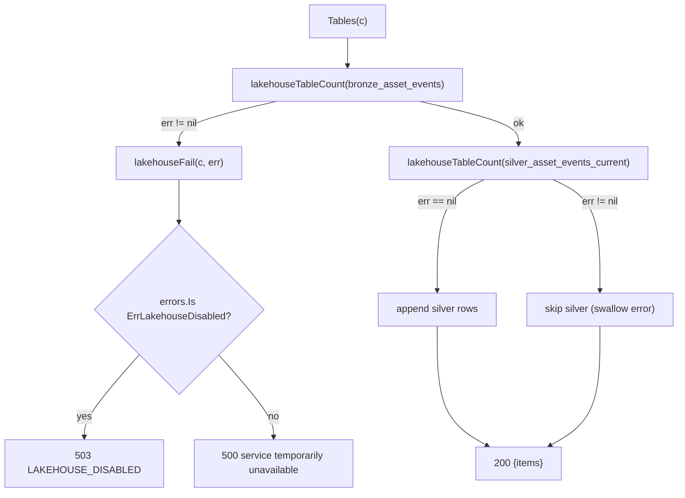
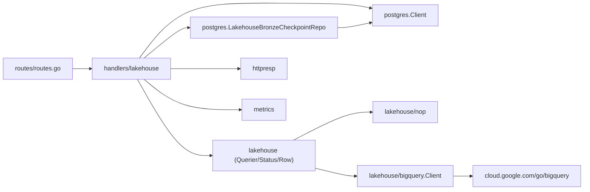

# Lakehouse Analytics Module

<cite>
**Referenced Files in This Document**

- [backend/internal/handlers/lakehouse/handler.go](file://backend/internal/handlers/lakehouse/handler.go)
- [backend/internal/handlers/lakehouse/handler_test.go](file://backend/internal/handlers/lakehouse/handler_test.go)
- [backend/internal/lakehouse/lakehouse.go](file://backend/internal/lakehouse/lakehouse.go)
- [backend/internal/lakehouse/nop.go](file://backend/internal/lakehouse/nop.go)
- [backend/internal/lakehouse/bigquery/client.go](file://backend/internal/lakehouse/bigquery/client.go)
- [backend/internal/postgres/lakehouse_bronze_checkpoint.go](file://backend/internal/postgres/lakehouse_bronze_checkpoint.go)
- [backend/routes/routes.go](file://backend/routes/routes.go)
- [backend/cmd/server/server.go](file://backend/cmd/server/server.go)
- [backend/cmd/server/helpers.go](file://backend/cmd/server/helpers.go)
- [api/openapi.yaml](file://api/openapi.yaml)
</cite>

## Table of Contents
1. [Introduction](#introduction)
2. [Project Structure](#project-structure)
3. [Core Components](#core-components)
4. [Architecture Overview](#architecture-overview)
5. [Detailed Component Analysis](#detailed-component-analysis)
6. [Dependency Analysis](#dependency-analysis)
7. [Performance Considerations](#performance-considerations)
8. [Troubleshooting Guide](#troubleshooting-guide)
9. [Conclusion](#conclusion)
10. [Appendices](#appendices)

## Introduction

The Lakehouse Analytics module exposes the read-only, dashboard-facing
analytics surface of cyber-databrew. It serves aggregate statistics about the
asset corpus, the event stream, data quality, and the health of the
PostgreSQL → Bronze (Iceberg) ingestion pipeline.

A distinguishing trait of this module is that it is a *hybrid* of three
backends rather than a single analytical engine. As documented at the top of
the handler package, the surfaces split as follows:

- **PG-backed** — `/overview`, `/asset-growth`, `/failure-clusters`,
  `/sync-progress`, `/customer-replay`. These read the OLTP source of truth
  directly, so they remain fast (indexed) and stay alive even when the
  analytical engine is offline.
- **BigQuery-backed** — `/event-daily`, `/event-type-share`, `/tables`,
  `/quality-distribution`. These run aggregations against BigLake-managed
  Iceberg external tables (`bronze_asset_events`,
  `silver_asset_events_current`, `silver_asset_quality_current`).
- **Static file** — `/report` serves a local notebook-based MVP snapshot from
  disk.

The module is consumed primarily by the frontend Dashboard, and is designed for
**graceful degradation**: any dependency may be missing — PostgreSQL, the
BigQuery analytical layer, the Bronze checkpoint row, or an as-yet-unmaterialized
Silver table — and the module returns a stable, well-typed response (a `503`,
an `available:false` envelope, or a partial result) rather than failing the
whole dashboard.

**Section sources**
- [backend/internal/handlers/lakehouse/handler.go](file://backend/internal/handlers/lakehouse/handler.go#L1-L62)
- [backend/internal/lakehouse/lakehouse.go](file://backend/internal/lakehouse/lakehouse.go#L1-L20)

## Project Structure

The module is split across an HTTP-handler package, an engine-agnostic port
package, a concrete BigQuery adapter, a no-op fallback adapter, and a
PostgreSQL repository for the Bronze checkpoint.



**Diagram sources**
- [backend/internal/handlers/lakehouse/handler.go](file://backend/internal/handlers/lakehouse/handler.go#L38-L70)
- [backend/internal/lakehouse/lakehouse.go](file://backend/internal/lakehouse/lakehouse.go#L33-L37)
- [backend/internal/lakehouse/nop.go](file://backend/internal/lakehouse/nop.go#L15-L28)
- [backend/internal/lakehouse/bigquery/client.go](file://backend/internal/lakehouse/bigquery/client.go#L19-L51)
- [backend/cmd/server/helpers.go](file://backend/cmd/server/helpers.go#L269-L290)

**Section sources**
- [backend/internal/handlers/lakehouse/handler.go](file://backend/internal/handlers/lakehouse/handler.go#L17-L62)
- [backend/routes/routes.go](file://backend/routes/routes.go#L252-L265)

## Core Components

### Handler

`Handler` is the gin HTTP handler that serves all lakehouse endpoints. It holds
four collaborators: the static `reportPath`, a `lakehouse.Querier` (`lake`), an
optional `*postgres.Client` (`pg`), and an optional `BronzeCheckpointReader`
(`bronzeCheckpoint`). Critically, `lake` is *always non-nil* — `New` substitutes
`lakehouse.Nop()` when its `lake` argument is nil, so handler code never has to
nil-check the analytical port.

```go
type Handler struct {
	reportPath       string
	lake             lakehouse.Querier
	pg               *postgres.Client
	bronzeCheckpoint BronzeCheckpointReader
}
```

`WithBronzeCheckpoint` is a builder that wires in the Bronze checkpoint reader.
When it is left unset, the handler degrades to "Bronze unknown" rather than
erroring.

**Section sources**
- [backend/internal/handlers/lakehouse/handler.go](file://backend/internal/handlers/lakehouse/handler.go#L46-L70)

### Querier (the analytical port)

`Querier` (in `lakehouse/lakehouse.go`) is the minimal surface a lakehouse
adapter must implement. It is deliberately tiny so the handler and usecase
layers do not depend on a specific engine (BigQuery today; historically Trino):

```go
type Querier interface {
	Status(ctx context.Context) Status
	Query(ctx context.Context, sql string) ([]Row, error)
	Close()
}
```

`Status` returns the engine-level health snapshot surfaced by
`GET /lakehouse/status`. `Query` runs an arbitrary read-only SQL string and
returns rows as `[]Row`, where `Row` is `map[string]any` keyed by column name
and carrying the engine's native Go types (`int64`, `float64`, `string`,
`time.Time`, `civil.Date`). The doc comment is explicit that `Query` is for
**server-built SQL only** — handlers must never interpolate untrusted user
input; validated parameters are embedded as typed literals.

**Section sources**
- [backend/internal/lakehouse/lakehouse.go](file://backend/internal/lakehouse/lakehouse.go#L12-L37)

### nopQuerier (graceful-degradation fallback)

`nopQuerier` implements `Querier` when the analytical layer is disabled
(`LAKEHOUSE_BACKEND=none`, missing BQ config, or a failed BigQuery init).
`Status` reports `Enabled:false, Healthy:false, Backend:"none"`, and `Query`
returns `ErrLakehouseDisabled`. This single sentinel error is the linchpin of
graceful degradation: handlers map it to HTTP 503.

**Section sources**
- [backend/internal/lakehouse/nop.go](file://backend/internal/lakehouse/nop.go#L8-L28)

### bigquery.Client (the production adapter)

`bigquery.Client` is the BigQuery-backed `Querier`. It queries BigLake-managed
Iceberg tables registered as BigQuery external tables. `New` validates that
`Project` and `Dataset` are present and runs a `SELECT 1` health probe so a
broken client surfaces immediately rather than silently. `Query` preserves
native BQ Go types in each `Row`, leaving JSON coercion to the handler.

**Section sources**
- [backend/internal/lakehouse/bigquery/client.go](file://backend/internal/lakehouse/bigquery/client.go#L19-L119)

### LakehouseBronzeCheckpointRepo

`LakehouseBronzeCheckpointRepo` reads the single-row `lakehouse_bronze_checkpoint`
table (written by the `bronze-incremental` Cloud Run Job, in Python — read-only
on the Go side). It satisfies the `BronzeCheckpointReader` interface declared in
the handler package. Its `Get` returns `(nil, nil)` both when the row is absent
(fresh deployment) *and* when the relation itself is missing (migration not yet
applied), so callers treat both as "Bronze empty / unknown" rather than as an
error.

**Section sources**
- [backend/internal/postgres/lakehouse_bronze_checkpoint.go](file://backend/internal/postgres/lakehouse_bronze_checkpoint.go#L12-L54)
- [backend/internal/handlers/lakehouse/handler.go](file://backend/internal/handlers/lakehouse/handler.go#L38-L44)

## Architecture Overview

The handler depends only on the `Querier` interface and on `*postgres.Client`.
Composition happens at startup: `cmd/server/helpers.go` selects an adapter via
`newLakehouseQuerier`, `cmd/server/server.go` constructs the `Handler` and
attaches the Bronze checkpoint reader, and `routes/routes.go` registers the
twelve `GET` routes under `/api/v1/lakehouse`.



The adapter-selection logic is the entry point for degradation: every
non-`bigquery` outcome — explicit `none`, a failed BigQuery init, or an unknown
backend string — funnels into `lakehouse.Nop()`, so the server always boots with
a working (if disabled) analytical port.

**Diagram sources**
- [backend/cmd/server/helpers.go](file://backend/cmd/server/helpers.go#L269-L290)
- [backend/cmd/server/server.go](file://backend/cmd/server/server.go#L44-L45)
- [backend/routes/routes.go](file://backend/routes/routes.go#L252-L265)

**Section sources**
- [backend/cmd/server/helpers.go](file://backend/cmd/server/helpers.go#L269-L290)
- [backend/cmd/server/server.go](file://backend/cmd/server/server.go#L44-L46)

## Detailed Component Analysis

### Status endpoint

`GET /lakehouse/status` is the thinnest endpoint: it simply forwards the
request context to `h.lake.Status(...)` and returns the resulting `Status`
struct as JSON. Against the BigQuery adapter this performs a 5-second `SELECT 1`
ping and reports `Enabled`, `Healthy`, `Backend`, `Project`, and `Dataset`;
against `nopQuerier` it returns `Enabled:false, Healthy:false, Backend:"none"`.

**Section sources**
- [backend/internal/handlers/lakehouse/handler.go](file://backend/internal/handlers/lakehouse/handler.go#L96-L99)
- [backend/internal/lakehouse/bigquery/client.go](file://backend/internal/lakehouse/bigquery/client.go#L66-L82)

### Overview endpoint (PG-only)

`GET /lakehouse/overview` produces the Dashboard top-card stats entirely from
PostgreSQL, so it survives a BigQuery outage. When `h.pg == nil` it returns a
`503 PG_DISABLED`. Otherwise it runs one filtered-aggregate query over `assets`
to compute `asset_total`, `active_assets`, `today_new_assets`, and
`week_new_assets`, derives `day7_avg_new_assets` from the weekly count, and
opportunistically adds `mcap_total`, `bronze_event_rows` (from
`MAX(event_seq)`, cheaper than `COUNT(*)` on the append-only event stream),
and `data_lag_hours` (from the Bronze checkpoint, when present).

Note the deliberate use of `if err == nil` for the optional fields: a failure
to read `mcap_files`, the event watermark, or the checkpoint silently omits that
key rather than failing the whole response.

**Section sources**
- [backend/internal/handlers/lakehouse/handler.go](file://backend/internal/handlers/lakehouse/handler.go#L329-L384)

### QualityDistribution endpoint (Silver-backed)

`GET /lakehouse/quality-distribution` is lakehouse-backed: it reads the Silver
current-state table `silver_asset_quality_current`. The `window` query
parameter is validated by `parseQualityWindow`, which accepts only
`7d`/`30d`/`60d`/`90d` (defaulting to `30d`) and maps each to a day count — the
validated integer is embedded as a typed literal in the BigQuery SQL.

The query uses a `ROW_NUMBER()` window partitioned by `asset_id` (ordered by
`updated_at DESC, _ingested_at DESC`) to pick the latest row per asset, then
filters `rn = 1 AND is_deleted = FALSE` and a rolling `created_at` window before
grouping by `quality`. Empty/NULL quality coalesces to `unknown`. The semantics
intentionally mirror PG's `NOT is_deleted` and current quality-tag value.

**Section sources**
- [backend/internal/handlers/lakehouse/handler.go](file://backend/internal/handlers/lakehouse/handler.go#L594-L662)

### CustomerReplay endpoint (PG-only)

`GET /lakehouse/customer-replay` returns recent deliveries for a customer with
status-timeline fields, read directly from the `deliveries` table (no
Silver/Gold dependency). It guards `h.pg == nil` with a `503`. Its most
distinctive behavior is *auto-selection*: when `customer_id` is empty — or names
a customer with no deliveries — it picks the customer with the most recent
activity, so the Dashboard tile is rarely empty in non-prod environments. The
result is capped at 100 rows ordered by `created_at DESC`. If no customer can be
found at all, it returns an empty-items envelope with `customer_id:""`.

**Section sources**
- [backend/internal/handlers/lakehouse/handler.go](file://backend/internal/handlers/lakehouse/handler.go#L664-L754)

### Sync-progress and sync-status endpoints

Two endpoints expose the PG → Bronze pipeline watermarks, both reading through
the shared helper `loadBronzeSyncProgress`:

- `GET /lakehouse/sync-progress` (`BronzeSyncProgress`) returns the raw
  watermark struct and also publishes three Prometheus gauges
  (`LakehouseBronzeMaxEventSeq`, `LakehouseBronzeLagEvents`,
  `LakehouseBronzeLastIngestedUnixSeconds`). It returns `503 PG_DISABLED` when
  PostgreSQL is absent.
- `GET /lakehouse/sync-status` (`SyncStatusResponse`) returns a lightweight,
  frontend-shaped realtime envelope built by `buildRealtimeSyncStatus`. When PG
  is absent or the Bronze checkpoint is missing, it returns
  `available:false, source:"realtime"` with a human message rather than an
  error.

`loadBronzeSyncProgress` first reads `outbox_published_max_seq` as
`MAX(event_seq) WHERE publish_state='published'`. If `bronzeCheckpoint` is unset
or returns `nil`, it returns the partial progress (Bronze numbers stay zero,
`BronzeStaleSeconds` stays `-1`). Otherwise it fills `BronzeMaxEventSeq`,
`BronzeLastIngestedAt`, `BronzeStaleSeconds`, and computes `BronzeLagEvents`
only when the outbox watermark exceeds the applied checkpoint.



**Diagram sources**
- [backend/internal/handlers/lakehouse/handler.go](file://backend/internal/handlers/lakehouse/handler.go#L225-L327)
- [backend/internal/postgres/lakehouse_bronze_checkpoint.go](file://backend/internal/postgres/lakehouse_bronze_checkpoint.go#L36-L54)

**Section sources**
- [backend/internal/handlers/lakehouse/handler.go](file://backend/internal/handlers/lakehouse/handler.go#L188-L327)

### Tables endpoint and graceful Silver fallback

`GET /lakehouse/tables` returns Iceberg row counts. It is the canonical example
of partial degradation: it queries `bronze_asset_events` first (Bronze is
*required* — failure here propagates through `lakehouseFail`), then attempts
`silver_asset_events_current`. If the Silver count query returns *any* error
(e.g. the external table has not been materialized), the result is simply the
Bronze row alone — the error is swallowed by the `if ... err == nil` guard.



This behavior is locked down by three tests: `TestTablesIncludesSilverWhenAvailable`
(both rows returned), `TestTablesToleratesMissingSilver` (Silver errors → only
the Bronze row), and `TestTablesFailsWhenBronzeUnavailable` (Bronze
`ErrLakehouseDisabled` → 503).

**Diagram sources**
- [backend/internal/handlers/lakehouse/handler.go](file://backend/internal/handlers/lakehouse/handler.go#L456-L486)
- [backend/internal/handlers/lakehouse/handler.go](file://backend/internal/handlers/lakehouse/handler.go#L756-L766)

**Section sources**
- [backend/internal/handlers/lakehouse/handler.go](file://backend/internal/handlers/lakehouse/handler.go#L456-L486)
- [backend/internal/handlers/lakehouse/handler_test.go](file://backend/internal/handlers/lakehouse/handler_test.go#L45-L137)

### Event endpoints and type coercion

`EventDaily` aggregates Bronze events by day × `event_type` over a clamped
window (default 14, max 90 days), keyed on `occurred_at`. `EventTypeShare`
returns the `event_type` distribution for a date; its `date` param is validated
by `parseEventTypeShareDate` (accepts `YYYY-MM-DD` or `latest`/empty), and the
SQL falls back to the most recent date with events within 30 days so the pie
chart stays populated. Both emit a legacy `asset_count` alias alongside `count`
for older SDKs and the Dashboard.

Because BigQuery returns native Go types inside each `Row`, the handler relies
on the coercion helpers `asString`, `asInt64`, `asFloat64`, and `asDateString`
(the latter handles `civil.Date` via `fmt.Stringer`) to produce JSON-safe
shapes.

**Section sources**
- [backend/internal/handlers/lakehouse/handler.go](file://backend/internal/handlers/lakehouse/handler.go#L488-L592)
- [backend/internal/handlers/lakehouse/handler.go](file://backend/internal/handlers/lakehouse/handler.go#L768-L821)

### FailureClusters and AssetGrowth (PG aggregations)

`FailureClusters` aggregates `algo_failed` events from `asset_events` over a
clamped window (default 7, max 90 days), extracting `failure_mode` and
`algo_name` from `event_payload->>...` and counting `DISTINCT asset_id` so
retries on the same asset don't inflate impact; it also computes each cluster's
`ratio` of the total. `AssetGrowth` returns per-day new asset counts plus a
running cumulative (default 30, max 365 days) using a `generate_series`
day-spine left-joined against daily counts on the `created_at` index. Both
return `503 PG_DISABLED` when PostgreSQL is absent.

**Section sources**
- [backend/internal/handlers/lakehouse/handler.go](file://backend/internal/handlers/lakehouse/handler.go#L101-L186)
- [backend/internal/handlers/lakehouse/handler.go](file://backend/internal/handlers/lakehouse/handler.go#L386-L454)

### Report endpoint (static file)

`GET /lakehouse/report` reads the pre-generated MVP JSON from `reportPath`,
parses it, and echoes it. A missing file maps to `404 LAKEHOUSE_REPORT_NOT_FOUND`
with a hint to run `make iceberg-mvp`; a parse error maps to `500`.

**Section sources**
- [backend/internal/handlers/lakehouse/handler.go](file://backend/internal/handlers/lakehouse/handler.go#L72-L94)

## Dependency Analysis

The handler package depends on the engine-agnostic `lakehouse` port, the
`postgres` client, `httpresp` for uniform error envelopes, and `metrics` for the
Bronze gauges. The concrete `bigquery` adapter depends on the Cloud BigQuery SDK;
the `nop` adapter depends on nothing beyond the port. Composition is one-way —
nothing inside the port or adapters imports the handler.



**Diagram sources**
- [backend/internal/handlers/lakehouse/handler.go](file://backend/internal/handlers/lakehouse/handler.go#L19-L36)
- [backend/internal/lakehouse/bigquery/client.go](file://backend/internal/lakehouse/bigquery/client.go#L7-L17)

**Section sources**
- [backend/internal/handlers/lakehouse/handler.go](file://backend/internal/handlers/lakehouse/handler.go#L19-L36)
- [backend/routes/routes.go](file://backend/routes/routes.go#L252-L265)

## Performance Considerations

- **Watermark over COUNT(\*)** — Both `Overview` (`bronze_event_rows`) and
  `loadBronzeSyncProgress` use `MAX(event_seq)` instead of `COUNT(*)` on the
  append-only `asset_events` stream; the result is identical but O(1) on the
  index rather than a full scan.
- **Window clamping** — Every day-windowed endpoint clamps its parameter:
  `FailureClusters`/`EventDaily` to 90 days, `AssetGrowth` to 365, and
  `QualityDistribution` to a fixed set (`7/30/60/90d`). This bounds the cost of
  the underlying scan and, for BigQuery, the bytes billed.
- **PG-only hot paths stay cheap** — `Overview`, `AssetGrowth`, and
  `FailureClusters` lean on existing `assets`/`asset_events` indexes
  (`created_at`, `event_type`, `occurred_at`) rather than scanning Iceberg.
- **BigQuery health probe** — adapter construction and `Status` use a 5-second
  `SELECT 1` so dashboard status checks fail fast instead of hanging.
- **Row caps** — `CustomerReplay` caps at 100 rows; aggregations return one row
  per group, keeping payloads small.

**Section sources**
- [backend/internal/handlers/lakehouse/handler.go](file://backend/internal/handlers/lakehouse/handler.go#L329-L384)
- [backend/internal/handlers/lakehouse/handler.go](file://backend/internal/handlers/lakehouse/handler.go#L267-L293)
- [backend/internal/lakehouse/bigquery/client.go](file://backend/internal/lakehouse/bigquery/client.go#L44-L63)

## Troubleshooting Guide

- **All BigQuery endpoints return `503 LAKEHOUSE_DISABLED`** — the active
  Querier is `nopQuerier`. Check `LakehouseBackend` config: `none`, a failed
  BigQuery init (missing/invalid project or dataset, failed `SELECT 1` ping), or
  an unknown backend string all fall back to `Nop()`. The startup log
  `"lakehouse bigquery init failed; degrading to nop"` confirms the init path.
- **PG-only endpoints return `503 PG_DISABLED`** — `h.pg` is nil. Affects
  `/overview`, `/asset-growth`, `/failure-clusters`, `/customer-replay`,
  `/sync-progress`. `/sync-status` instead returns `200 {available:false}`.
- **`/sync-status` shows `available:false` with "bronze checkpoint not
  available"** — PG is up but the Bronze checkpoint is missing. Either
  `WithBronzeCheckpoint` was never wired (handler degrades to "Bronze unknown"),
  or `Get` returned `(nil,nil)` because the single-row table is empty
  (`bronze-incremental` has not run) or the `lakehouse_bronze_checkpoint`
  migration is not applied.
- **`/tables` shows only `bronze_asset_events`** — the Silver external table
  `silver_asset_events_current` is not materialized; the Silver count error is
  swallowed by design. If even Bronze fails, the endpoint returns 503/500 via
  `lakehouseFail`.
- **`/quality-distribution` errors** — an invalid `window` returns
  `400 INVALID_ARGUMENT` (only `7d/30d/60d/90d` allowed); a BigQuery error (e.g.
  `silver_asset_quality_current` missing) returns 503/500 via `lakehouseFail`.
- **`/report` returns `404 LAKEHOUSE_REPORT_NOT_FOUND`** — run `make iceberg-mvp`
  to generate the snapshot at `reportPath`.

**Section sources**
- [backend/internal/handlers/lakehouse/handler.go](file://backend/internal/handlers/lakehouse/handler.go#L72-L94)
- [backend/internal/handlers/lakehouse/handler.go](file://backend/internal/handlers/lakehouse/handler.go#L756-L766)
- [backend/cmd/server/helpers.go](file://backend/cmd/server/helpers.go#L269-L290)

## Conclusion

The Lakehouse Analytics module is a pragmatic, degradation-first analytics layer.
By splitting endpoints across PostgreSQL, BigQuery-backed Iceberg, and a static
report — and by funneling every disabled/unconfigured state through a single
`Querier` interface, a `nopQuerier` fallback, and the `ErrLakehouseDisabled`
sentinel — it guarantees the Dashboard renders meaningful data whether or not the
full lakehouse stack is online. Watermark-based counters, clamped windows, and
swallowed Silver errors keep the hot paths cheap and resilient as new Silver/Gold
materializations come online.

## Appendices

### API endpoints

All routes are registered under `/api/v1/lakehouse` (tag `Lakehouse`) and are
only mounted when `lakehouseHandler != nil`.

| Method & Path | Handler | Backend | Notes |
| --- | --- | --- | --- |
| `GET /lakehouse/report` | `Report` | static file | 404 if snapshot missing |
| `GET /lakehouse/status` | `Status` | engine | forwards `lake.Status` |
| `GET /lakehouse/sync-status` | `SyncStatus` | PG + checkpoint | `available` envelope |
| `GET /lakehouse/sync-progress` | `BronzeSyncProgress` | PG + checkpoint | emits Prometheus gauges |
| `GET /lakehouse/failure-clusters` | `FailureClusters` | PG | `days` ≤ 90 |
| `GET /lakehouse/overview` | `Overview` | PG | top-card stats |
| `GET /lakehouse/asset-growth` | `AssetGrowth` | PG | `days` ≤ 365 |
| `GET /lakehouse/tables` | `Tables` | BigQuery | Bronze required, Silver optional |
| `GET /lakehouse/event-daily` | `EventDaily` | BigQuery | `days` ≤ 90 |
| `GET /lakehouse/event-type-share` | `EventTypeShare` | BigQuery | `date` = `YYYY-MM-DD`/`latest` |
| `GET /lakehouse/quality-distribution` | `QualityDistribution` | BigQuery (Silver) | `window` ∈ `7d/30d/60d/90d` |
| `GET /lakehouse/customer-replay` | `CustomerReplay` | PG | auto-selects customer; ≤ 100 rows |

**Section sources**
- [backend/routes/routes.go](file://backend/routes/routes.go#L252-L265)
- [api/openapi.yaml](file://api/openapi.yaml#L3378-L3510)

### Key types

| Type | File | Role |
| --- | --- | --- |
| `Querier` | `lakehouse/lakehouse.go` | Engine-agnostic analytical port |
| `Status` | `lakehouse/lakehouse.go` | Engine health (`/status`) |
| `Row` | `lakehouse/lakehouse.go` | `map[string]any` result row |
| `nopQuerier` | `lakehouse/nop.go` | Disabled fallback |
| `ErrLakehouseDisabled` | `lakehouse/nop.go` | 503 sentinel |
| `Handler` | `handlers/lakehouse/handler.go` | HTTP handler |
| `BronzeCheckpointReader` | `handlers/lakehouse/handler.go` | Checkpoint port |
| `BronzeSyncProgress` | `handlers/lakehouse/handler.go` | Watermark snapshot |
| `SyncStatusResponse` / `SyncStatusData` | `handlers/lakehouse/handler.go` | Realtime envelope |
| `FailureClusterItem` | `handlers/lakehouse/handler.go` | Failure-cluster row |
| `LakehouseBronzeCheckpoint(Repo)` | `postgres/lakehouse_bronze_checkpoint.go` | Reads checkpoint table |

**Section sources**
- [backend/internal/lakehouse/lakehouse.go](file://backend/internal/lakehouse/lakehouse.go#L12-L37)
- [backend/internal/lakehouse/nop.go](file://backend/internal/lakehouse/nop.go#L8-L28)
- [backend/internal/handlers/lakehouse/handler.go](file://backend/internal/handlers/lakehouse/handler.go#L38-L223)
- [backend/internal/postgres/lakehouse_bronze_checkpoint.go](file://backend/internal/postgres/lakehouse_bronze_checkpoint.go#L12-L30)
