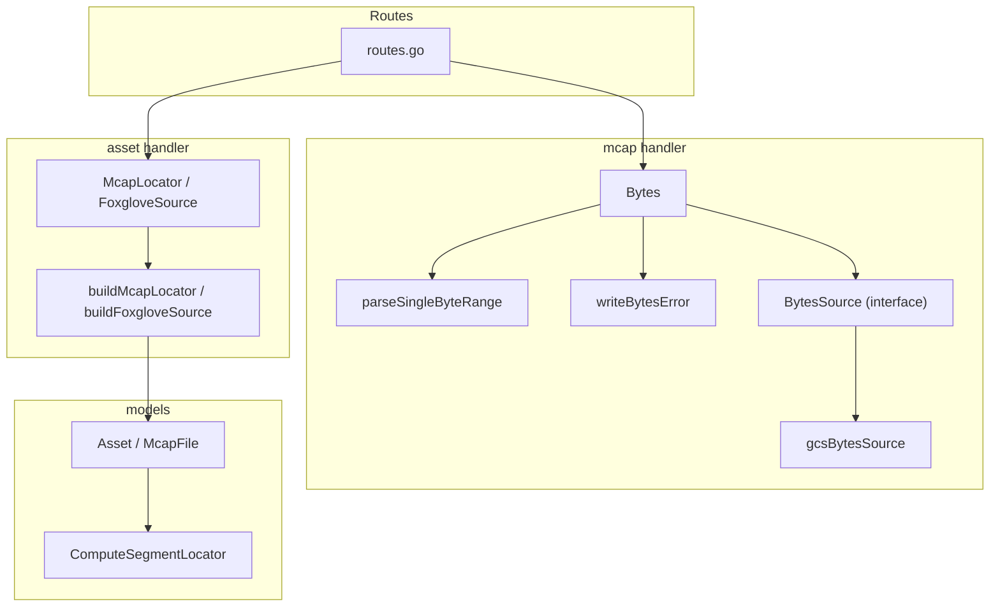
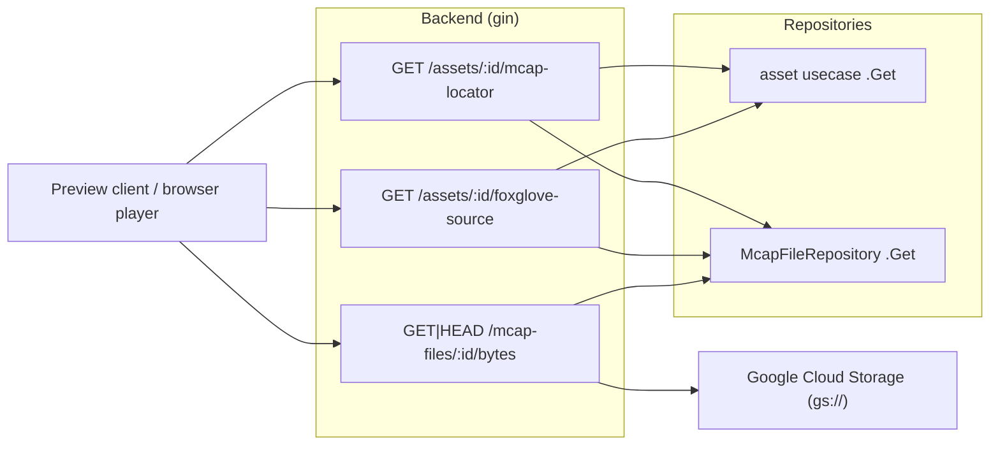
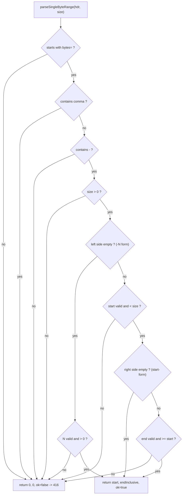
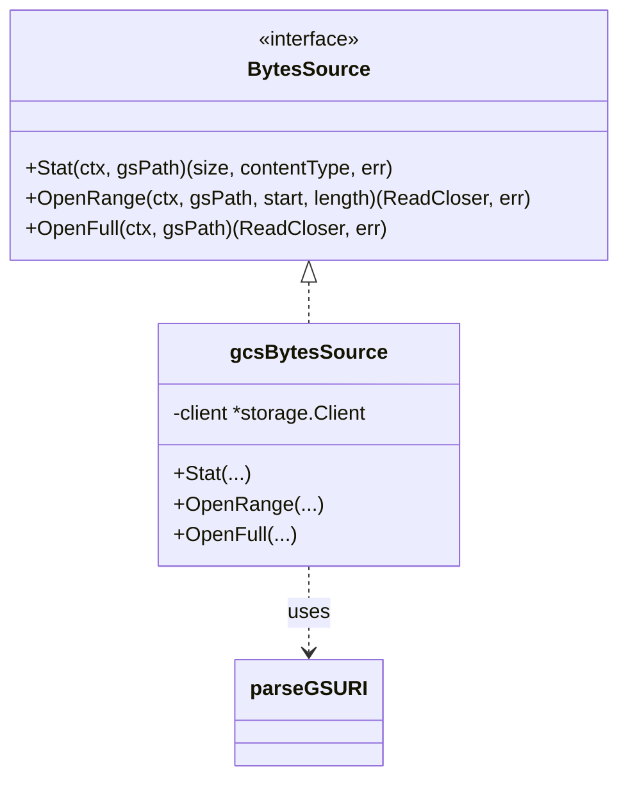
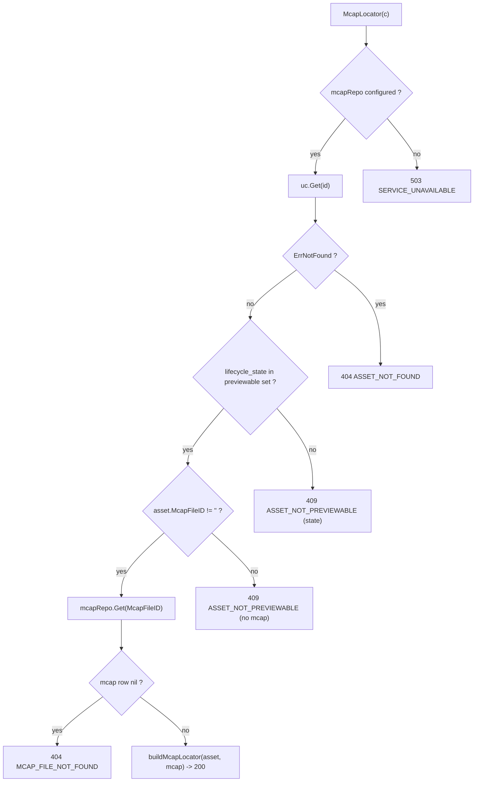
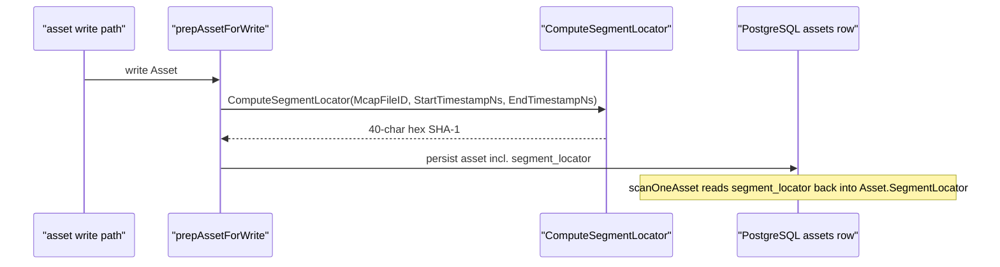
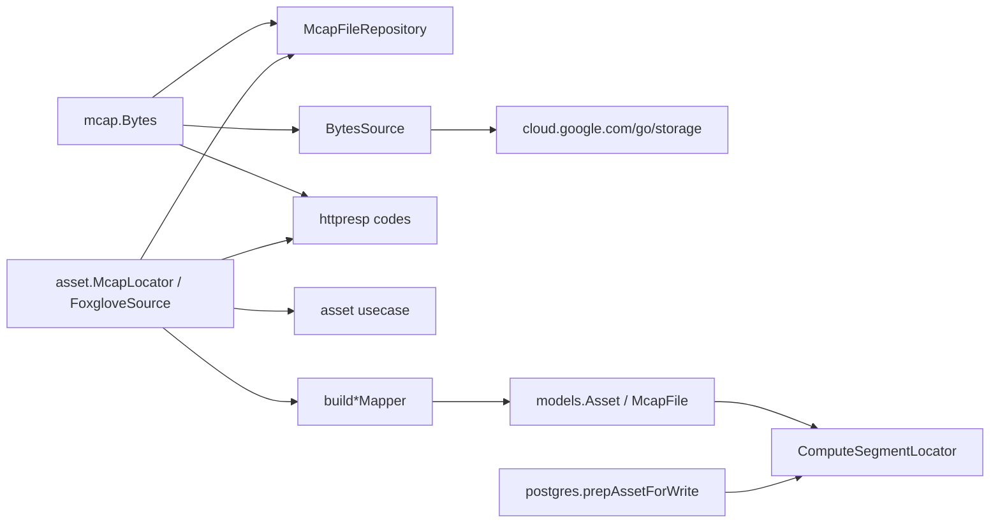

# Byte Serving & Locators

<cite>
**Referenced Files in This Document**

- [backend/internal/handlers/mcap/bytes.go](file://backend/internal/handlers/mcap/bytes.go)
- [backend/internal/handlers/mcap/bytes_source.go](file://backend/internal/handlers/mcap/bytes_source.go)
- [backend/internal/handlers/mcap/handler.go](file://backend/internal/handlers/mcap/handler.go)
- [backend/internal/handlers/asset/mcap_locator.go](file://backend/internal/handlers/asset/mcap_locator.go)
- [backend/internal/handlers/asset/handler.go](file://backend/internal/handlers/asset/handler.go)
- [backend/internal/models/segment_locator.go](file://backend/internal/models/segment_locator.go)
- [backend/internal/models/asset.go](file://backend/internal/models/asset.go)
- [backend/internal/postgres/repos.go](file://backend/internal/postgres/repos.go)
- [backend/routes/routes.go](file://backend/routes/routes.go)
- [backend/cmd/server/infra.go](file://backend/cmd/server/infra.go)
- [backend/cmd/server/core.go](file://backend/cmd/server/core.go)
- [backend/internal/httpresp/codes.go](file://backend/internal/httpresp/codes.go)
</cite>

## Table of Contents
1. [Introduction](#introduction)
2. [Project Structure](#project-structure)
3. [Core Components](#core-components)
4. [Architecture Overview](#architecture-overview)
5. [Detailed Component Analysis](#detailed-component-analysis)
6. [Dependency Analysis](#dependency-analysis)
7. [Performance Considerations](#performance-considerations)
8. [Troubleshooting Guide](#troubleshooting-guide)
9. [Conclusion](#conclusion)
10. [Appendices](#appendices)

## Introduction

This page documents two tightly related capabilities of the cyber-databrew
backend: **byte-range serving of MCAP objects** and **locator resolution** —
the mechanism that maps an *asset* to the underlying *MCAP object* and the time
window inside it.

The core problem these features solve is browser-driven MCAP playback. MCAP
recordings live in Google Cloud Storage (GCS) as `gs://bucket/object` blobs that
may be many gigabytes. A browser player (Foxglove / Lichtblick style) must be
able to seek inside such a file by issuing HTTP `Range` requests, without
downloading the whole object and without the browser ever seeing a GCS signed
URL. Two pieces cooperate to make this work:

- **`GET /api/v1/mcap-files/:id/bytes`** is a same-origin proxy that streams the
  bytes of a single MCAP object from GCS, honoring HTTP `Range` headers so the
  player can fetch only the chunks it needs. This is implemented in
  [bytes.go](file://backend/internal/handlers/mcap/bytes.go) and backed by the
  pluggable `BytesSource` interface in
  [bytes_source.go](file://backend/internal/handlers/mcap/bytes_source.go).

- **`GET /api/v1/assets/:id/mcap-locator`** and
  **`GET /api/v1/assets/:id/foxglove-source`** resolve a high-level asset (which
  carries a time window) into the concrete MCAP object (its `gs://` URI, total
  size, and hash) plus the byte-serving proxy URL. These are implemented in
  [mcap_locator.go](file://backend/internal/handlers/asset/mcap_locator.go).

A third, lower-level building block is the **segment locator** — a deterministic
SHA-1 digest of `(mcap_file_id, start_ns, end_ns)` computed by
[segment_locator.go](file://backend/internal/models/segment_locator.go). It
gives every asset a stable identity derived from its source MCAP file and time
slice, and is persisted alongside the asset row.

The typical consumer flow is: a preview client calls `mcap-locator` (or
`foxglove-source`) to learn *which* object and *what* window, then issues
ranged `GET`s against `/mcap-files/:id/bytes` to stream just the bytes inside
that window.

**Section sources**
- [backend/internal/handlers/mcap/bytes.go](file://backend/internal/handlers/mcap/bytes.go#L17-L26)
- [backend/internal/handlers/asset/mcap_locator.go](file://backend/internal/handlers/asset/mcap_locator.go#L27-L85)
- [backend/internal/models/segment_locator.go](file://backend/internal/models/segment_locator.go#L9-L19)

## Project Structure

The relevant code spans three packages plus route wiring and infrastructure
bootstrap:

- **`backend/internal/handlers/mcap/`** — the MCAP file handler.
  - [bytes.go](file://backend/internal/handlers/mcap/bytes.go) — the
    `Bytes` HTTP handler, the `parseSingleByteRange` helper, and
    `writeBytesError` error mapping.
  - [bytes_source.go](file://backend/internal/handlers/mcap/bytes_source.go) —
    the `BytesSource` interface and its GCS implementation `gcsBytesSource`,
    plus the `parseGSURI` helper.
  - [handler.go](file://backend/internal/handlers/mcap/handler.go) — the
    `Handler` struct, dependency setters (`SetBytesSource`), and the rest of the
    MCAP file CRUD surface.
- **`backend/internal/handlers/asset/`** — the asset handler.
  - [mcap_locator.go](file://backend/internal/handlers/asset/mcap_locator.go) —
    `McapLocator`, `FoxgloveSource`, their response types, and the
    `buildMcapLocator` / `buildFoxgloveSource` mappers.
  - [handler.go](file://backend/internal/handlers/asset/handler.go) — the asset
    `Handler` struct (holds `mcapRepo` for the join).
- **`backend/internal/models/`** — the domain models.
  - [segment_locator.go](file://backend/internal/models/segment_locator.go) —
    `ComputeSegmentLocator`.
  - [asset.go](file://backend/internal/models/asset.go) — the `Asset` and
    `McapFile` structs.
- **`backend/internal/postgres/repos.go`** — where the segment locator is
  recomputed on every asset write (`prepAssetForWrite`) and read back during
  scans.
- **`backend/routes/routes.go`** — registers the byte and locator routes.
- **`backend/cmd/server/infra.go`** + **`core.go`** — construct the GCS
  `BytesSource` and inject it into the MCAP handler.



**Diagram sources**
- [backend/routes/routes.go](file://backend/routes/routes.go#L194-L231)
- [backend/internal/handlers/mcap/bytes.go](file://backend/internal/handlers/mcap/bytes.go#L26-L221)
- [backend/internal/handlers/asset/mcap_locator.go](file://backend/internal/handlers/asset/mcap_locator.go#L86-L225)

**Section sources**
- [backend/routes/routes.go](file://backend/routes/routes.go#L194-L231)
- [backend/internal/handlers/mcap/handler.go](file://backend/internal/handlers/mcap/handler.go#L21-L58)
- [backend/internal/handlers/asset/handler.go](file://backend/internal/handlers/asset/handler.go#L30-L36)

## Core Components

#### The `Bytes` handler

`(*Handler).Bytes` is the entry point for `GET`/`HEAD
/api/v1/mcap-files/:id/bytes`. It performs five jobs:

1. Guards that both `h.repo` (the MCAP file repository) and `h.bytesSrc` (the
   byte source) are wired; if either is `nil` it returns `503`.
2. Looks up the MCAP file row by `:id` and validates that the row exists and
   carries a `gs://` `GCSPath`.
3. `Stat`s the object to discover its total size and content type.
4. Sets `Accept-Ranges: bytes` and a `Content-Type`.
5. Branches on whether a `Range` header is present — full `200` body, partial
   `206` body, or `416` for an unsatisfiable range — and streams bytes via
   `io.Copy`.

The handler is HTTP-method aware: for `HEAD` it writes the status and headers
but returns before opening any reader (lines covering both the no-range and
ranged branches).

#### The `BytesSource` interface

`BytesSource` decouples the handler from GCS so it can be unit-tested with a
fake. It exposes three operations: `Stat` (size + content type), `OpenRange`
(`[start, start+length)`), and `OpenFull` (the whole object). The production
implementation `gcsBytesSource` wraps a `*storage.Client` and translates each
call into a GCS object operation; `parseGSURI` splits `gs://bucket/object` into
its parts.

#### `parseSingleByteRange`

This pure function parses a *single* `bytes=...` range against a known object
size and returns an **inclusive** end offset. It supports `bytes=start-end`,
`bytes=start-` (open-ended), and `bytes=-N` (suffix / last-N-bytes). Multi-range
requests (comma-separated) and malformed/signed numbers are rejected, which the
caller turns into a `416`.

#### The locator handlers

`(*Handler).McapLocator` and `(*Handler).FoxgloveSource` on the *asset* handler
resolve an asset to its MCAP object. Both gate on lifecycle state, require a
linked `mcap_file_id`, load the `McapFile` row, and then serialize a response
via `buildMcapLocator` / `buildFoxgloveSource`.

#### `ComputeSegmentLocator`

A deterministic SHA-1 over `mcapFileID + start_ns + end_ns`, returned as a
40-char hex string. It is the canonical identity of a time-sliced segment and is
recomputed on every asset write.

**Section sources**
- [backend/internal/handlers/mcap/bytes.go](file://backend/internal/handlers/mcap/bytes.go#L26-L127)
- [backend/internal/handlers/mcap/bytes_source.go](file://backend/internal/handlers/mcap/bytes_source.go#L13-L76)
- [backend/internal/handlers/mcap/bytes.go](file://backend/internal/handlers/mcap/bytes.go#L129-L210)
- [backend/internal/handlers/asset/mcap_locator.go](file://backend/internal/handlers/asset/mcap_locator.go#L86-L200)
- [backend/internal/models/segment_locator.go](file://backend/internal/models/segment_locator.go#L9-L19)

## Architecture Overview

The two endpoints form a two-step contract. A preview client first calls the
asset-level locator to discover the object and window, then drives ranged reads
through the byte proxy. The byte proxy never returns a signed URL — it
streams through the backend so the browser uses a same-origin, CORS-free URL.



The locator endpoints read from PostgreSQL only (asset row + mcap_files row).
The byte proxy reads the mcap_files row from PostgreSQL for the `gs://` path,
then performs the actual data transfer against GCS via the `BytesSource`.

**Diagram sources**
- [backend/routes/routes.go](file://backend/routes/routes.go#L194-L231)
- [backend/internal/handlers/asset/mcap_locator.go](file://backend/internal/handlers/asset/mcap_locator.go#L86-L180)
- [backend/internal/handlers/mcap/bytes.go](file://backend/internal/handlers/mcap/bytes.go#L36-L126)

**Section sources**
- [backend/internal/handlers/asset/mcap_locator.go](file://backend/internal/handlers/asset/mcap_locator.go#L70-L180)
- [backend/internal/handlers/mcap/bytes.go](file://backend/internal/handlers/mcap/bytes.go#L17-L26)

## Detailed Component Analysis

### Byte-range serving sequence

The `Bytes` handler implements RFC-7233-style range semantics. The sequence
below traces a ranged request from header arrival through the GCS range read.

```mermaid
sequenceDiagram
  participant Client
  participant Bytes as "Bytes handler"
  participant Repo as "McapFileRepository"
  participant Src as "BytesSource (gcsBytesSource)"
  participant GCS

  Client->>Bytes: GET /mcap-files/:id/bytes (Range: bytes=a-b)
  Bytes->>Bytes: guard repo != nil and bytesSrc != nil
  Bytes->>Repo: Get(id)
  Repo-->>Bytes: McapFile{GCSPath}
  Bytes->>Bytes: require gs:// prefix
  Bytes->>Src: Stat(gsPath)
  Src->>GCS: Object.Attrs(ctx)
  GCS-->>Src: size, contentType
  Src-->>Bytes: size, contentType
  Bytes->>Bytes: set Accept-Ranges, Content-Type
  Bytes->>Bytes: parseSingleByteRange(hdr, size)
  alt range parses
    Bytes->>Bytes: Content-Range bytes start-end/size; 206
    Bytes->>Src: OpenRange(gsPath, start, length)
    Src->>GCS: Object.NewRangeReader(ctx, start, length)
    GCS-->>Src: ReadCloser
    Src-->>Bytes: ReadCloser
    Bytes->>Client: io.Copy stream (206 Partial Content)
  else range invalid / unsatisfiable
    Bytes->>Bytes: Content-Range bytes */size
    Bytes->>Client: 416 Requested Range Not Satisfiable
  end
```

The no-range path is simpler: the handler sets `Content-Length` to the full
`size`, writes `200`, and (for `GET`) opens `OpenFull` and copies the whole
object. `HEAD` requests short-circuit immediately after the status/headers in
both branches, so no GCS reader is opened.

**Diagram sources**
- [backend/internal/handlers/mcap/bytes.go](file://backend/internal/handlers/mcap/bytes.go#L36-L127)
- [backend/internal/handlers/mcap/bytes_source.go](file://backend/internal/handlers/mcap/bytes_source.go#L35-L61)

**Section sources**
- [backend/internal/handlers/mcap/bytes.go](file://backend/internal/handlers/mcap/bytes.go#L63-L127)

### Range parsing decision logic

`parseSingleByteRange` is the gate that decides `206` versus `416`. Its decision
tree:



Two clamping rules are notable. For the suffix form `-N`, if `N` exceeds the
object size it is clamped to `size` (so `start` becomes `0`). For the explicit
`start-end` form, if `end >= size` it is clamped to `size - 1`. A `start >= size`
is always rejected. `parseNonNegativeInt64` additionally rejects empty strings
and any value with a leading `+` or `-`, so `bytes=+5-` and `bytes=-` never parse.

**Diagram sources**
- [backend/internal/handlers/mcap/bytes.go](file://backend/internal/handlers/mcap/bytes.go#L134-L210)

**Section sources**
- [backend/internal/handlers/mcap/bytes.go](file://backend/internal/handlers/mcap/bytes.go#L129-L210)

### The `BytesSource` abstraction

`BytesSource` is injected at startup so the handler can be exercised in unit
tests with a fake source. The production `gcsBytesSource` is a thin shim over
the GCS client:



`NewGCSBytesSource` rejects a `nil` client. Each method calls `parseGSURI` to
split the `gs://bucket/object` URI; a URI without a `/` after the bucket, or
with the object portion empty, is rejected (`ok=false`) and surfaces as an
`invalid gs path` error. `OpenRange` maps directly onto GCS
`Object.NewRangeReader(ctx, start, length)`, and `OpenFull` onto
`Object.NewReader(ctx)`.

**Diagram sources**
- [backend/internal/handlers/mcap/bytes_source.go](file://backend/internal/handlers/mcap/bytes_source.go#L13-L76)

**Section sources**
- [backend/internal/handlers/mcap/bytes_source.go](file://backend/internal/handlers/mcap/bytes_source.go#L13-L76)

### Locator resolution flow

`McapLocator` resolves an asset id into the locator response. The control flow
covers four early-exit guards before the join:



`previewableLifecycleStates` allows `created`, `ready`, `delivered`,
`archived`, and `superseded`. The `created` state is deliberately included so
that assets registered with MCAP bytes before being promoted to `ready` (common
in dev / Cloud Run smoke assets) are still previewable.

`buildMcapLocator` joins the asset's **time window** (`StartTimestampNs`,
`EndTimestampNs`, `DurationMs`) with the MCAP object's **identity** (`McapFileID`,
`GCSPath` as `mcap_uri`, `SizeBytes`, `RawHashMD5`). It also echoes the asset's
optimistic-concurrency `Version` and an RFC-3339 `UpdatedAt`.

`FoxgloveSource` shares the same guards but emits a `ds=remote-file` source
contract. Critically, its `ds_params.url` is the **same-origin proxy path**
`"/api/v1/mcap-files/%s/bytes"` built from the MCAP file id — that is the link
between the locator response and the byte-serving endpoint. The browser player
fetches that path with `Range`, never the raw `gs://` URI.

**Diagram sources**
- [backend/internal/handlers/asset/mcap_locator.go](file://backend/internal/handlers/asset/mcap_locator.go#L86-L130)
- [backend/internal/handlers/asset/mcap_locator.go](file://backend/internal/handlers/asset/mcap_locator.go#L182-L225)

**Section sources**
- [backend/internal/handlers/asset/mcap_locator.go](file://backend/internal/handlers/asset/mcap_locator.go#L15-L225)

### Segment locator computation and persistence

The segment locator is the deterministic identity of an asset's time slice. It
is *not* used directly by the byte/locator endpoints, but it is the persistent
key that ties an asset row to a `(mcap_file, window)` pair and is recomputed on
every write.



`ComputeSegmentLocator` writes the `mcap_file_id` string, then the base-10
`start_ns`, then the base-10 `end_ns` into a single SHA-1 hash and hex-encodes
the digest. Because the inputs are identical to the locator window
(`StartTimestampNs` / `EndTimestampNs`) and the MCAP object id, two assets over
the same file and window collapse to the same `segment_locator`, giving a stable
dedupe / lookup key. `prepAssetForWrite` recomputes it on every write so it can
never drift from the row's current window, and `scanOneAsset` reads it back.

**Diagram sources**
- [backend/internal/models/segment_locator.go](file://backend/internal/models/segment_locator.go#L9-L19)
- [backend/internal/postgres/repos.go](file://backend/internal/postgres/repos.go#L141-L148)

**Section sources**
- [backend/internal/models/segment_locator.go](file://backend/internal/models/segment_locator.go#L1-L19)
- [backend/internal/postgres/repos.go](file://backend/internal/postgres/repos.go#L141-L148)
- [backend/internal/postgres/repos.go](file://backend/internal/postgres/repos.go#L308-L314)
- [backend/internal/models/asset.go](file://backend/internal/models/asset.go#L54-L61)

## Dependency Analysis

The byte path and locator path share the `McapFileRepository` and the `McapFile`
model, but otherwise depend on disjoint subsystems.



Wiring of the byte source happens at server bootstrap. `infra.go` attempts to
construct a GCS `storage.Client`; on success it builds a `BytesSource` via
`NewGCSBytesSource`; on any failure it logs a warning and leaves the source
unset (the proxy stays disabled and returns `503`). `core.go` injects the source
into the MCAP handler with `SetBytesSource` only when it is non-nil. The asset
handler receives its `mcapRepo` through its own constructor / configuration so
`McapLocator` can perform the cross-table read.

**Diagram sources**
- [backend/cmd/server/infra.go](file://backend/cmd/server/infra.go#L96-L116)
- [backend/cmd/server/core.go](file://backend/cmd/server/core.go#L75-L76)
- [backend/internal/handlers/mcap/handler.go](file://backend/internal/handlers/mcap/handler.go#L54-L58)

**Section sources**
- [backend/cmd/server/infra.go](file://backend/cmd/server/infra.go#L96-L116)
- [backend/cmd/server/core.go](file://backend/cmd/server/core.go#L75-L76)
- [backend/internal/handlers/mcap/handler.go](file://backend/internal/handlers/mcap/handler.go#L21-L58)
- [backend/internal/handlers/asset/handler.go](file://backend/internal/handlers/asset/handler.go#L30-L36)

## Performance Considerations

- **Range reads, not full downloads.** The whole point of the proxy is that a
  player fetches only the bytes it needs. `OpenRange` maps to GCS
  `NewRangeReader(ctx, start, length)`, so GCS transfers exactly the requested
  span. The handler computes `length = (endInclusive - start) + 1` and sets a
  precise `Content-Length`, allowing intermediaries to size buffers correctly.
- **Streaming copy.** Both branches stream with `io.Copy(c.Writer, rc)` and
  `defer rc.Close()`, so the backend does not buffer the whole object in memory.
  Memory cost is bounded by the copy buffer, not the object size.
- **One `Stat` per request.** Each request performs a GCS `Object.Attrs` call to
  learn the size and content type. This is an extra metadata round trip but is
  required to validate the range and produce `Content-Range`. There is no
  caching of size in this layer; a high request rate against the same object
  incurs one `Attrs` call each.
- **`HEAD` is cheap.** `HEAD` short-circuits before opening any reader, so it
  costs one `Stat` and no data transfer — useful for players probing size and
  `Accept-Ranges` support.
- **Locator endpoints are PostgreSQL-only.** `McapLocator` /
  `FoxgloveSource` do two indexed primary-key reads (asset by id, mcap_file by
  id) and never touch GCS, so they are inexpensive and can be called once per
  playback session rather than per seek.
- **Segment locator is O(1) per write.** `ComputeSegmentLocator` is a single
  SHA-1 over three short strings, recomputed in `prepAssetForWrite`. It is
  negligible relative to the surrounding DB write.

**Section sources**
- [backend/internal/handlers/mcap/bytes.go](file://backend/internal/handlers/mcap/bytes.go#L70-L127)
- [backend/internal/handlers/mcap/bytes_source.go](file://backend/internal/handlers/mcap/bytes_source.go#L35-L61)
- [backend/internal/handlers/asset/mcap_locator.go](file://backend/internal/handlers/asset/mcap_locator.go#L86-L130)

## Troubleshooting Guide

#### `503 SERVICE_UNAVAILABLE` from `/mcap-files/:id/bytes`

The handler returns `503` when `h.repo` or `h.bytesSrc` is `nil`. The most
common cause is that the GCS client failed to initialize at startup — check the
server logs for `gcs client unavailable; mcap bytes proxy disabled` or
`gcs bytes source init failed`. When GCS is unreachable, `infra.go` leaves the
byte source unset and `core.go` never calls `SetBytesSource`.

#### `404 MCAP_FILE_NOT_FOUND` from the byte proxy

Returned when the repository finds no row, the row has an empty `GCSPath`, or
the GCS object itself does not exist (`storage.ErrObjectNotExist`, mapped by
`writeBytesError`). Verify the `mcap_file_id`, that `gcs_path` was populated at
ingest, and that the object actually exists in the bucket.

#### `400 INVALID_ARGUMENT` "gcs_path must be a gs:// URI"

The row's `GCSPath` does not start with `gs://`. The proxy only serves GCS
objects; an `http(s)://` or empty path triggers this. Fix the stored
`gcs_path`.

#### `416 Requested Range Not Satisfiable`

`parseSingleByteRange` rejected the `Range` header. Causes include: a
multi-range request (comma-separated), a `start` at or past the object size, a
malformed or signed number, a bare `bytes=-`, or `size <= 0`. The response sets
`Content-Range: bytes */<size>` so the client can learn the real size and retry.

#### `409 ASSET_NOT_PREVIEWABLE` from `mcap-locator` / `foxglove-source`

Two distinct cases share this code: the asset's `lifecycle_state` is not in the
previewable set (`created`, `ready`, `delivered`, `archived`, `superseded`), or
the asset has no `mcap_file_id`. The `details` field distinguishes them
(`lifecycle_state` vs `asset_id`).

#### `404 ASSET_NOT_FOUND` vs `404 MCAP_FILE_NOT_FOUND` from the locator

`ASSET_NOT_FOUND` means `uc.Get` returned `ErrNotFound` — the asset id does not
exist. `MCAP_FILE_NOT_FOUND` means the asset references an `mcap_file_id` whose
row is missing — a dangling link; investigate ingest / referential integrity.

#### Player seeks the wrong window

If a browser player intersects the wrong chunks, the asset window and the MCAP
log_time base may use different epochs. `McapLocatorWindow` requires
`start_timestamp_ns` / `end_timestamp_ns` to share the MCAP recording time base
(typically POSIX ns from the Unix epoch) embedded in message `log_time`. A
mismatch breaks window intersection even though byte serving works.

**Section sources**
- [backend/internal/handlers/mcap/bytes.go](file://backend/internal/handlers/mcap/bytes.go#L26-L62)
- [backend/internal/handlers/mcap/bytes.go](file://backend/internal/handlers/mcap/bytes.go#L92-L106)
- [backend/internal/handlers/mcap/bytes.go](file://backend/internal/handlers/mcap/bytes.go#L212-L221)
- [backend/internal/handlers/asset/mcap_locator.go](file://backend/internal/handlers/asset/mcap_locator.go#L86-L127)
- [backend/internal/handlers/asset/mcap_locator.go](file://backend/internal/handlers/asset/mcap_locator.go#L47-L57)
- [backend/cmd/server/infra.go](file://backend/cmd/server/infra.go#L96-L116)

## Conclusion

Byte serving and locators are the read-side of MCAP storage. The locator
endpoints translate a high-level asset (with a time window) into the concrete
MCAP object and a same-origin proxy URL, performing only cheap PostgreSQL reads.
The byte proxy then streams that object from GCS with full HTTP `Range` support,
mapping ranged reads onto GCS `NewRangeReader` calls so a browser player can
seek inside large recordings without ever handling a signed URL or downloading
the whole file. The `BytesSource` interface keeps the handler testable, and the
deterministic segment locator gives every asset a stable identity derived from
its source file and time slice. Together they let preview clients go from
"asset id" to "exactly the right bytes" in two well-defined HTTP calls.

## Appendices

### API definitions

| Method | Path | Handler | Success | Notes |
| --- | --- | --- | --- | --- |
| GET | `/api/v1/mcap-files/:id/bytes` | `mcap.Bytes` | `200` / `206` | streams object; honors `Range` |
| HEAD | `/api/v1/mcap-files/:id/bytes` | `mcap.Bytes` | `200` / `206` | headers only, no body |
| GET | `/api/v1/assets/:id/mcap-locator` | `asset.McapLocator` | `200` | window + MCAP object identity |
| GET | `/api/v1/assets/:id/foxglove-source` | `asset.FoxgloveSource` | `200` | `ds=remote-file` proxy contract |

**Section sources**
- [backend/routes/routes.go](file://backend/routes/routes.go#L200-L231)

### Response shape: `McapLocatorResponse`

| Field | JSON | Source |
| --- | --- | --- |
| `asset_id` | string | `asset.AssetID` |
| `lifecycle_state` | string | `asset.LifecycleState` |
| `mcap.mcap_file_id` | string | `mcap.McapFileID` |
| `mcap.mcap_uri` | string | `mcap.GCSPath` |
| `mcap.size_bytes` | int64 | `mcap.SizeBytes` |
| `mcap.raw_hash_md5` | string (omitempty) | `mcap.RawHashMD5` |
| `window.start_timestamp_ns` | int64 | `asset.StartTimestampNs` |
| `window.end_timestamp_ns` | int64 | `asset.EndTimestampNs` |
| `window.duration_ms` | int64 | `asset.DurationMs` |
| `version` | int64 | `asset.Version` |
| `updated_at` | RFC-3339 | `asset.UpdatedAt` |

**Section sources**
- [backend/internal/handlers/asset/mcap_locator.go](file://backend/internal/handlers/asset/mcap_locator.go#L31-L57)
- [backend/internal/handlers/asset/mcap_locator.go](file://backend/internal/handlers/asset/mcap_locator.go#L182-L200)

### HTTP status / error codes used here

| Status | Code constant | Value | Where |
| --- | --- | --- | --- |
| 503 | `CodeServiceUnavailable` | `SERVICE_UNAVAILABLE` | byte proxy / locator not configured |
| 400 | `CodeInvalidArgument` | `INVALID_ARGUMENT` | non-`gs://` path |
| 416 | `CodeInvalidRange` | `INVALID_RANGE` | unparseable `Range` |
| 404 | `CodeMcapFileNotFound` | `MCAP_FILE_NOT_FOUND` | missing object / row |
| 404 | `CodeAssetNotFound` | `ASSET_NOT_FOUND` | unknown asset id |
| 409 | `CodeAssetNotPreviewable` | `ASSET_NOT_PREVIEWABLE` | bad state or no mcap link |

**Section sources**
- [backend/internal/httpresp/codes.go](file://backend/internal/httpresp/codes.go#L5-L31)

### Supported `Range` header forms

| Form | Meaning | Result |
| --- | --- | --- |
| (no `Range`) | whole object | `200`, `Content-Length = size`, `OpenFull` |
| `bytes=start-end` | inclusive span | `206`, clamps `end` to `size-1` |
| `bytes=start-` | from `start` to end | `206`, `end = size-1` |
| `bytes=-N` | last `N` bytes | `206`, clamps `N` to `size` |
| `bytes=a-b,c-d` | multi-range | `416` (rejected) |
| `bytes=-` / signed / `start>=size` | invalid | `416` |

**Section sources**
- [backend/internal/handlers/mcap/bytes.go](file://backend/internal/handlers/mcap/bytes.go#L129-L210)
