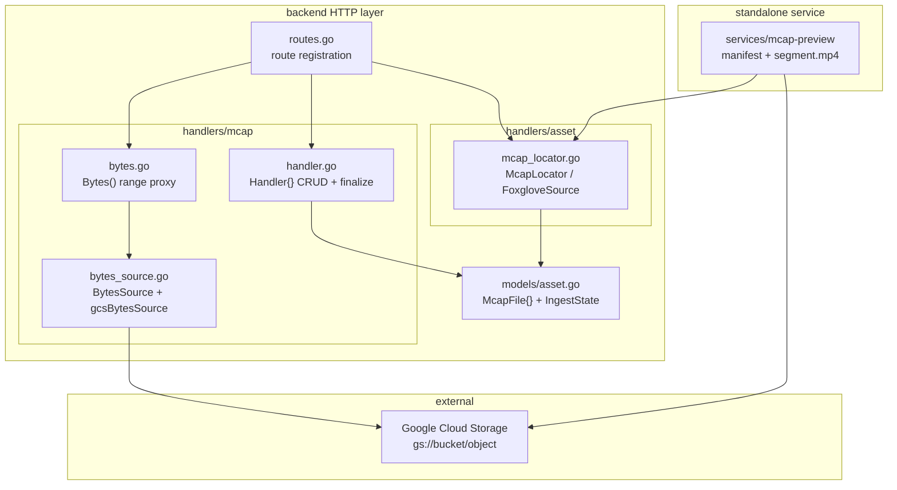
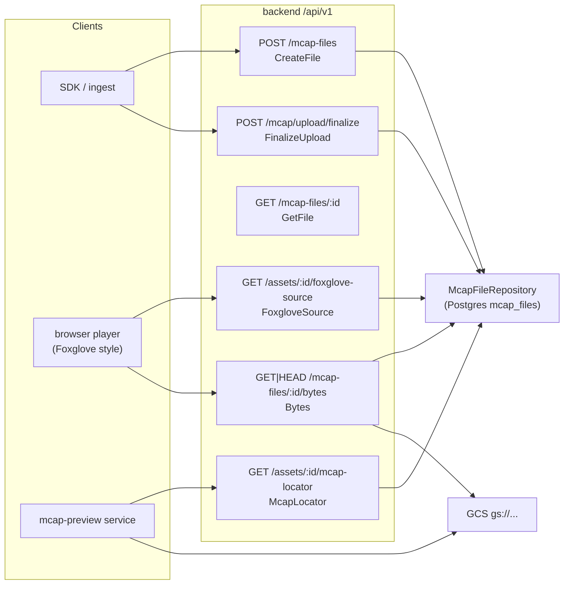
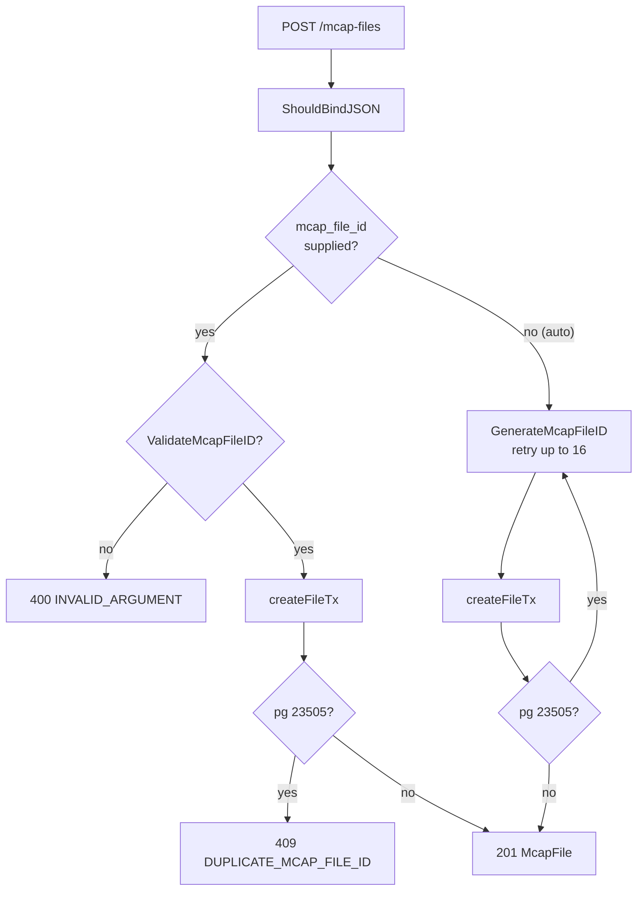
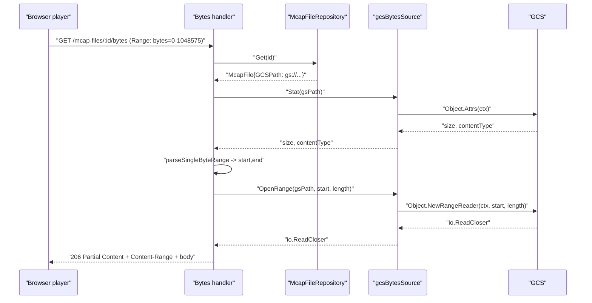
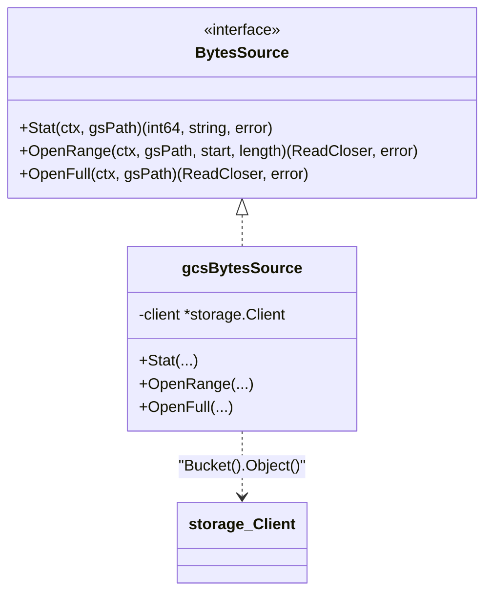
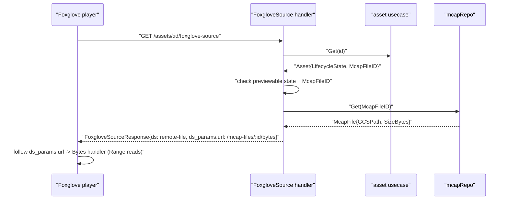
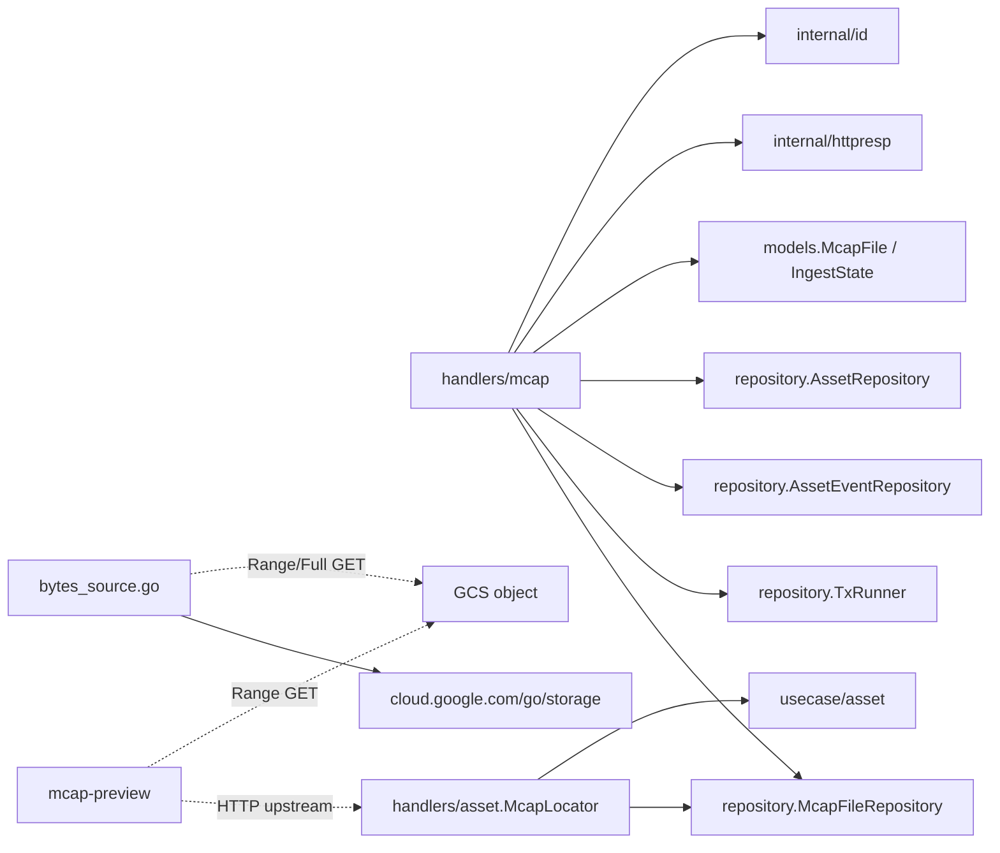

# MCAP & Object Storage Module

<cite>
**Referenced Files in This Document**

- [backend/internal/handlers/mcap/handler.go](file://backend/internal/handlers/mcap/handler.go)
- [backend/internal/handlers/mcap/bytes.go](file://backend/internal/handlers/mcap/bytes.go)
- [backend/internal/handlers/mcap/bytes_source.go](file://backend/internal/handlers/mcap/bytes_source.go)
- [backend/internal/handlers/asset/mcap_locator.go](file://backend/internal/handlers/asset/mcap_locator.go)
- [backend/internal/models/asset.go](file://backend/internal/models/asset.go)
- [backend/routes/routes.go](file://backend/routes/routes.go)
- [services/mcap-preview/README.md](file://services/mcap-preview/README.md)
</cite>

## Table of Contents
1. [Introduction](#introduction)
2. [Project Structure](#project-structure)
3. [Core Components](#core-components)
4. [Architecture Overview](#architecture-overview)
5. [Detailed Component Analysis](#detailed-component-analysis)
6. [Dependency Analysis](#dependency-analysis)
7. [Performance Considerations](#performance-considerations)
8. [Troubleshooting Guide](#troubleshooting-guide)
9. [Conclusion](#conclusion)
10. [Appendices](#appendices)

## Introduction

The MCAP & Object Storage module is the part of the cyber-databrew backend that
manages the lifecycle and byte-level access of recorded sensor data stored as
**MCAP** files in **Google Cloud Storage (GCS)**. An MCAP file is the raw,
canonical recording produced during data collection; every other artifact in the
platform (assets, segments, actions) is derived from it. This module owns three
responsibilities:

1. **Metadata management** — registering MCAP file rows (the `mcap_files` table),
   tracking their ingest state, recording structural summaries (channel/chunk
   counts, time window), and capturing provenance (vendor, collector, device,
   scene, etc.).
2. **Byte serving** — proxying the raw MCAP bytes out of GCS over HTTP with full
   `Range` support, so browser-based players can perform random-access reads
   without GCS credentials or CORS friction.
3. **Locator / source contracts** — exposing read-only "where is the MCAP and
   what is its time window" endpoints (`mcap-locator`, `foxglove-source`) that
   downstream preview consumers — including the standalone `mcap-preview` service
   and Foxglove/Lichtblick-style players — use to drive their own Range reads.

The module deliberately does **not** decode MCAP message payloads itself in the
backend (message iteration is still a placeholder). Heavy MCAP work — summary
parsing, video remux — lives either in the asynchronous indexer-worker (footer
parse on finalize) or in the standalone `mcap-preview` service. The backend's job
is to be the authoritative metadata store and a thin, range-aware byte gateway.

**Section sources**
- [backend/internal/handlers/mcap/handler.go](file://backend/internal/handlers/mcap/handler.go#L1-L58)
- [backend/internal/handlers/mcap/bytes.go](file://backend/internal/handlers/mcap/bytes.go#L17-L26)
- [services/mcap-preview/README.md](file://services/mcap-preview/README.md#L1-L26)

## Project Structure

The module is split across the backend HTTP layer and a sibling standalone
service. Within the backend, the `mcap` handler package owns metadata and byte
serving, while the `asset` handler package owns the locator/source contracts that
join an asset row to its MCAP file row.



**Diagram sources**
- [backend/routes/routes.go](file://backend/routes/routes.go#L195-L231)
- [backend/internal/handlers/mcap/bytes_source.go](file://backend/internal/handlers/mcap/bytes_source.go#L13-L33)
- [services/mcap-preview/README.md](file://services/mcap-preview/README.md#L8-L26)

Key files:

- `backend/internal/handlers/mcap/handler.go` — the `Handler` struct, its
  dependency setters, and the metadata endpoints (`CreateFile`, `FinalizeUpload`,
  `ListFiles`, `GetFile`, and the placeholder `IterMessages`).
- `backend/internal/handlers/mcap/bytes.go` — the `Bytes` HTTP handler and the
  RFC-7233 single-range parser `parseSingleByteRange`.
- `backend/internal/handlers/mcap/bytes_source.go` — the `BytesSource` interface
  and its GCS implementation `gcsBytesSource`, plus the `gs://` URI parser.
- `backend/internal/handlers/asset/mcap_locator.go` — `McapLocator` and
  `FoxgloveSource` handlers and their response builders.
- `backend/internal/models/asset.go` — the `McapFile` model and `IngestState`
  enum that back the metadata.
- `services/mcap-preview/README.md` — the contract and architecture of the
  standalone preview service that consumes the locator.

**Section sources**
- [backend/internal/handlers/mcap/handler.go](file://backend/internal/handlers/mcap/handler.go#L21-L58)
- [backend/routes/routes.go](file://backend/routes/routes.go#L223-L231)

## Core Components

#### The `Handler` struct and its wiring

The MCAP `Handler` holds a set of repositories and an injectable byte source.
Only the `McapFileRepository` is required at construction (`New`); the
transaction runner, asset-event repository, asset repository, and byte source are
all wired post-construction via setters. This keeps the handler testable —
endpoints can run without GCS or an outbox.

```go
type Handler struct {
    repo      repository.McapFileRepository
    tx        repository.TxRunner
    eventRepo repository.AssetEventRepository
    assetRepo repository.AssetRepository // CYB-1217: 1:1 raw_mcap asset creation
    bytesSrc  BytesSource
    nowFn     func() time.Time
}
```

The setters are `SetTxRunner`, `SetEventRepo`, `SetAssetRepo`, and
`SetBytesSource`. Notably, if `bytesSrc` is left unset the `/bytes` endpoint
returns `503` rather than panicking.

#### The `BytesSource` abstraction

`BytesSource` is the seam between the HTTP handler and the backing object store.
It exposes three operations — `Stat`, `OpenRange`, and `OpenFull` — and is
implemented for production by `gcsBytesSource`, which wraps a
`cloud.google.com/go/storage.Client`.

#### The `McapFile` model and `IngestState`

`McapFile` is the persisted metadata row. It bundles content identity
(`GCSPath`, `SizeBytes`, MD5/SHA256 hashes), a structural summary
(`FileDurationMs`, `StartTimestampNs`, `EndTimestampNs`, `ChannelCount`,
`ChunkCount`), provenance fields, and lifecycle/ownership columns. The
`IngestState` enum tracks the summary pipeline state: `pending`, `summarized`,
or `failed`.

#### Locator / source contracts

`McapLocator` and `FoxgloveSource` (in the asset handler) join an asset row with
its `mcap_files` row to produce the read-only contracts consumed by preview
clients. The locator never signs URLs; it hands back the raw `gs://` URI plus the
asset time window so callers can do their own Range reads.

**Section sources**
- [backend/internal/handlers/mcap/handler.go](file://backend/internal/handlers/mcap/handler.go#L21-L58)
- [backend/internal/handlers/mcap/bytes_source.go](file://backend/internal/handlers/mcap/bytes_source.go#L13-L33)
- [backend/internal/models/asset.go](file://backend/internal/models/asset.go#L18-L24)
- [backend/internal/models/asset.go](file://backend/internal/models/asset.go#L177-L216)
- [backend/internal/handlers/asset/mcap_locator.go](file://backend/internal/handlers/asset/mcap_locator.go#L86-L130)

## Architecture Overview

The module sits at the intersection of three planes: the metadata plane
(Postgres `mcap_files`), the byte plane (GCS via the `BytesSource`), and the
contract plane (locator/source responses). All MCAP HTTP routes are registered
under the same `/api/v1` group in `routes.go`.



**Diagram sources**
- [backend/routes/routes.go](file://backend/routes/routes.go#L200-L231)
- [backend/internal/handlers/mcap/bytes.go](file://backend/internal/handlers/mcap/bytes.go#L26-L50)
- [backend/internal/handlers/asset/mcap_locator.go](file://backend/internal/handlers/asset/mcap_locator.go#L86-L180)

The lifecycle of a single MCAP recording moves through these planes in order:

1. **Register** — the SDK PUTs the file to GCS, then calls `POST /mcap-files` to
   create the metadata row in `pending` state.
2. **Finalize** — once the GCS write completes, the SDK calls
   `FinalizeUpload`, which flips the row to `summarized` and emits a
   `mcap_upload_finalized` event that (in later phases) triggers the
   indexer-worker to parse the MCAP footer and backfill the structural summary.
3. **Consume** — preview clients call `mcap-locator`/`foxglove-source` to learn
   the `gs://` URI and time window, then read bytes either directly from GCS (the
   `mcap-preview` service) or through the backend's `/bytes` proxy (browser
   players).

## Detailed Component Analysis

### MCAP file registration (`CreateFile`)

`CreateFile` binds a large JSON body covering content identity, summary,
provenance, and lifecycle fields, then validates the optional `mcap_file_id`.
The ID, if supplied, must pass `id.ValidateMcapFileID` (exactly 8 alphanumeric
characters); if omitted, the handler generates one and retries on collision up
to `maxMcapFileIDRetries` (16) attempts. `gcs_path` falls back to the legacy
`mcap_uri` field when empty, and `ingest_state` defaults to `pending`.

Persistence happens inside `createFileTx`, which runs in a transaction so the
MCAP row, an optional placeholder `raw_mcap` asset (CYB-1217, sharing the same
ID for a 1:1 extension), and an `mcap_file_created` outbox event all commit
atomically. A unique-violation (`23505`) on a caller-supplied ID returns `409
DUPLICATE_MCAP_FILE_ID`; on an auto-generated ID it simply retries.



**Diagram sources**
- [backend/internal/handlers/mcap/handler.go](file://backend/internal/handlers/mcap/handler.go#L131-L247)

**Section sources**
- [backend/internal/handlers/mcap/handler.go](file://backend/internal/handlers/mcap/handler.go#L86-L247)

### Finalize and message iteration

`FinalizeUpload` is called by the SDK after the GCS PUT completes. It resolves
`mcap_file_id` from either the path param (route
`POST /mcap-files/:id/finalize`) or the JSON body (legacy route
`POST /mcap/upload/finalize`), validates it, then flips the ingest state to
`summarized` and appends a `mcap_upload_finalized` event — both inside one
transaction. The comment notes this is "Phase 0": no real footer parse happens
synchronously; the state flip is what (in Phase 0.5) triggers Pub/Sub →
indexer-worker → real MCAP footer parse.

`IterMessages` (`GET /mcap/:id/messages`) is an explicit placeholder. It returns
an empty `messages` array with a note that real iteration requires `go-mcap` and
is deferred. This confirms the backend does not decode MCAP message streams
itself; that work belongs to the indexer-worker and `mcap-preview`.

**Section sources**
- [backend/internal/handlers/mcap/handler.go](file://backend/internal/handlers/mcap/handler.go#L249-L297)

### Byte serving with HTTP Range (`Bytes`)

`Bytes` is the core of the byte plane. Wired to both `GET` and `HEAD` on
`/mcap-files/:id/bytes`, it proxies MCAP bytes out of GCS with RFC-7233 single
`Range` support. The handler:

1. Returns `503` if either the repository or the byte source is unconfigured.
2. Looks up the `McapFile` row; `404` if missing or `GCSPath` is empty.
3. Rejects non-`gs://` paths with `400 INVALID_ARGUMENT`.
4. Calls `bytesSrc.Stat` to learn the object size and content type, always sets
   `Accept-Ranges: bytes`, and defaults `Content-Type` to
   `application/octet-stream` when GCS reports none.
5. With **no** `Range` header: replies `200`, sets `Content-Length` to the full
   size, and (for `GET`) streams the whole object via `OpenFull` + `io.Copy`.
   `HEAD` returns after setting headers, copying no body.
6. With a `Range` header: parses it via `parseSingleByteRange`. On failure it
   replies `416` with `Content-Range: bytes */<size>`. On success it sets
   `Content-Range: bytes <start>-<end>/<size>` and the correct `Content-Length`,
   replies `206`, and (for `GET`) streams the slice via `OpenRange`.

GCS errors are mapped by `writeBytesError`: a `storage.ErrObjectNotExist`
becomes `404`, everything else falls through to `500`.



**Diagram sources**
- [backend/internal/handlers/mcap/bytes.go](file://backend/internal/handlers/mcap/bytes.go#L26-L127)
- [backend/internal/handlers/mcap/bytes_source.go](file://backend/internal/handlers/mcap/bytes_source.go#L35-L61)

**Section sources**
- [backend/internal/handlers/mcap/bytes.go](file://backend/internal/handlers/mcap/bytes.go#L26-L221)

### The Range parser (`parseSingleByteRange`)

`parseSingleByteRange` implements only the single-range forms of RFC-7233 and
deliberately rejects multi-range requests (any comma in the spec). It supports:

- `bytes=<start>-<end>` — explicit closed range; `end` is clamped to `size-1`.
- `bytes=<start>-` — open-ended from `start` to end of object.
- `bytes=-<suffixLen>` — last `suffixLen` bytes, clamped to the full size.

It returns an **inclusive** end. Signed values are rejected by
`parseNonNegativeInt64` (explicit `+`/`-` prefixes fail), as are
out-of-bounds starts (`start >= size`) and inverted ranges (`end < start`),
which is what produces the `416` path in the handler.

**Section sources**
- [backend/internal/handlers/mcap/bytes.go](file://backend/internal/handlers/mcap/bytes.go#L129-L210)

### The GCS byte source (`gcsBytesSource`)

`gcsBytesSource` implements `BytesSource` against the real GCS client.
`Stat` reads `Object.Attrs` for size and content type; `OpenRange` returns a
`NewRangeReader(ctx, start, length)`; `OpenFull` returns a `NewReader(ctx)`.
All three first split the `gs://` URI with `parseGSURI`, which is noted in the
source as copied from the preview service's `internal/gcsrs` package so the two
modules stay independent.



**Diagram sources**
- [backend/internal/handlers/mcap/bytes_source.go](file://backend/internal/handlers/mcap/bytes_source.go#L13-L76)

**Section sources**
- [backend/internal/handlers/mcap/bytes_source.go](file://backend/internal/handlers/mcap/bytes_source.go#L24-L76)

### Locator and Foxglove source contracts

`McapLocator` (`GET /assets/:id/mcap-locator`) joins the asset row with its
`mcap_files` row and returns a `McapLocatorResponse`: the MCAP file ID, the
`gs://` URI, size, MD5, the asset time window, and the asset version/updated-at.
Both `McapLocator` and `FoxgloveSource` first guard on `mcapRepo` being wired
(`503` otherwise), then require the asset to be in a previewable lifecycle state
(`created`, `ready`, `delivered`, `archived`, `superseded`) and to have a linked
`mcap_file_id` — otherwise they return `409 ASSET_NOT_PREVIEWABLE`.

`FoxgloveSource` (`GET /assets/:id/foxglove-source`) returns a direct-MCAP source
contract compatible with Foxglove/Lichtblick `ds=remote-file` URL state. Its
`ds_params.url` points at the **same-origin** byte proxy
`/api/v1/mcap-files/<id>/bytes`, so a browser player can issue CORS-free Range
reads, and its `hints.window` echoes the same POSIX-ns window as the locator.



**Diagram sources**
- [backend/internal/handlers/asset/mcap_locator.go](file://backend/internal/handlers/asset/mcap_locator.go#L136-L225)

**Section sources**
- [backend/internal/handlers/asset/mcap_locator.go](file://backend/internal/handlers/asset/mcap_locator.go#L15-L225)

### Relationship to the standalone `mcap-preview` service

`mcap-preview` is a separate Go service (Gin-based) that turns an asset's MCAP
into a browser-playable preview. It is **not** part of the backend binary; the
two deliberately stay independent and even duplicate small helpers like
`parseGSURI` rather than share code. The preview service:

- Resolves an asset's MCAP by calling the backend's
  `GET /api/v1/assets/:id/mcap-locator` upstream (forwarding the
  `X-Databrew-Token` and `X-Request-ID` headers), then reads the `gs://` object
  **directly** from GCS using its own page-cached, LRU `io.ReadSeeker`
  (`internal/gcsrs`) — coalescing the MCAP reader's many small seeks into a few
  Range GETs.
- Exposes `GET /api/v1/preview/assets/:id/manifest` (parses only the MCAP
  summary section via `mcap.Reader.Info()` — O(channels + chunk_indexes), no
  message scan) and `GET /api/v1/preview/assets/:id/segment.mp4` (remuxes a
  `foxglove.CompressedVideo` h264 window into fragmented MP4 on the fly).
- Is dispatched behind the same gateway hostname: the `/api/v1/preview/` path
  prefix routes to `mcap-preview`, everything else to `cyber-databrew-backend`.

The crucial architectural point is the division of labor: the backend is the
**source of truth** (locator + metadata + a thin byte proxy), while
`mcap-preview` is a **stateless transformer** that reads GCS directly and never
touches the database. Both depend on the locator contract as their shared seam.

**Section sources**
- [services/mcap-preview/README.md](file://services/mcap-preview/README.md#L1-L116)
- [services/mcap-preview/README.md](file://services/mcap-preview/README.md#L162-L178)
- [backend/internal/handlers/mcap/bytes_source.go](file://backend/internal/handlers/mcap/bytes_source.go#L63-L76)

## Dependency Analysis



**Diagram sources**
- [backend/internal/handlers/mcap/handler.go](file://backend/internal/handlers/mcap/handler.go#L3-L19)
- [backend/internal/handlers/mcap/bytes_source.go](file://backend/internal/handlers/mcap/bytes_source.go#L3-L11)
- [backend/internal/handlers/asset/mcap_locator.go](file://backend/internal/handlers/asset/mcap_locator.go#L3-L13)

Upstream dependencies:

- **`repository.McapFileRepository`** — required; backs all metadata reads/writes
  (`Set`, `Get`, `List`, `UpdateIngestState`).
- **`repository.TxRunner` / `AssetEventRepository` / `AssetRepository`** —
  optional; enable atomic writes, the outbox event stream, and the CYB-1217
  placeholder `raw_mcap` asset.
- **`cloud.google.com/go/storage`** — only the `gcsBytesSource` touches it; the
  handler depends on the `BytesSource` interface, never the concrete client.
- **`internal/id`** — MCAP file ID validation/generation.
- **`internal/httpresp`** — standard error envelope.

Downstream consumers:

- The byte proxy and the locator/foxglove contracts are consumed by browser
  players and the `mcap-preview` service. The preview service is coupled to the
  backend **only** through the `mcap-locator` HTTP contract.

**Section sources**
- [backend/internal/handlers/mcap/handler.go](file://backend/internal/handlers/mcap/handler.go#L30-L58)
- [backend/internal/handlers/mcap/bytes_source.go](file://backend/internal/handlers/mcap/bytes_source.go#L24-L33)

## Performance Considerations

- **Range-aware streaming, not buffering.** Both the no-Range and Range paths
  stream straight from a GCS reader to the response writer via `io.Copy`; the
  backend never buffers the whole object in memory, so memory use is bounded by
  the copy buffer regardless of file size.
- **`Stat` before read.** Every `/bytes` call issues an `Object.Attrs` request
  before opening the data reader. This is one extra GCS round-trip per request but
  is required to set `Content-Length`/`Content-Range` and to validate the Range
  against the true size. Browser players that probe with a small initial Range
  then seek will pay this `Stat` cost per request unless an upstream cache
  absorbs it.
- **Preview reader page cache.** The `mcap-preview` service avoids the
  death-by-a-thousand-seeks problem with an LRU-paged `io.ReadSeeker`
  (`GCS_PAGE_SIZE_BYTES` default 1 MiB, `GCS_PAGE_CACHE_BYTES` default 64 MiB),
  collapsing the MCAP reader's small seeks into a handful of Range GETs. The
  backend's `gcsBytesSource` does **not** cache — each call is a fresh reader —
  because the backend serves opaque byte ranges, not parsed structures.
- **Summary parse is offloaded.** `FinalizeUpload` only flips state and emits an
  event; the expensive MCAP footer parse runs asynchronously in the
  indexer-worker, keeping the finalize call O(1).
- **ID retry loop.** Auto-generated MCAP IDs retry up to 16 times on collision;
  with an 8-char alphanumeric space, collisions are rare and the loop is not a
  hot path.
- **Pagination.** `ListFiles` caps `page_size` at 100 and defaults to 20,
  bounding result-set size.

**Section sources**
- [backend/internal/handlers/mcap/bytes.go](file://backend/internal/handlers/mcap/bytes.go#L50-L127)
- [backend/internal/handlers/mcap/handler.go](file://backend/internal/handlers/mcap/handler.go#L300-L331)
- [services/mcap-preview/README.md](file://services/mcap-preview/README.md#L117-L131)

## Troubleshooting Guide

#### `/bytes` returns `503 SERVICE_UNAVAILABLE`

The byte source (or repository) is not wired. `Bytes` returns `503` when
`h.repo == nil` or `h.bytesSrc == nil`. Confirm `SetBytesSource` ran during
server startup (it requires a non-nil `storage.Client`; `NewGCSBytesSource`
errors on a nil client).

#### `/bytes` returns `404 MCAP_FILE_NOT_FOUND`

Either the `mcap_files` row does not exist / has an empty `GCSPath`, or GCS
reports `ErrObjectNotExist` (the metadata row points at an object that is not in
the bucket). `writeBytesError` maps the GCS not-exist error to `404`.

#### `/bytes` returns `400` "must be a gs:// URI"

The stored `GCSPath` is not a `gs://` URI. Only `gs://bucket/object` paths are
servable; `https://` or signed URLs are rejected up front.

#### `/bytes` returns `416 INVALID_RANGE`

The `Range` header failed `parseSingleByteRange`: a multi-range request, a
malformed spec, a start `>= size`, an inverted range, or a zero-size object.
The response carries `Content-Range: bytes */<size>` so the client can re-probe.

#### `mcap-locator` / `foxglove-source` returns `409 ASSET_NOT_PREVIEWABLE`

The asset is not in a previewable lifecycle state, or it has no linked
`mcap_file_id`. Previewable states are `created`, `ready`, `delivered`,
`archived`, `superseded`. A freshly created MCAP file gets a placeholder asset in
`created` state (CYB-1217), which is previewable.

#### `POST /mcap-files` returns `409 DUPLICATE_MCAP_FILE_ID`

A caller-supplied `mcap_file_id` already exists (Postgres unique violation
`23505`). Omit the field to let the server auto-generate a unique ID instead.

#### `GET /mcap/:id/messages` returns an empty array

This is expected — `IterMessages` is a placeholder; real iteration is deferred to
a later phase and requires `go-mcap`.

**Section sources**
- [backend/internal/handlers/mcap/bytes.go](file://backend/internal/handlers/mcap/bytes.go#L26-L48)
- [backend/internal/handlers/mcap/bytes.go](file://backend/internal/handlers/mcap/bytes.go#L92-L106)
- [backend/internal/handlers/mcap/bytes.go](file://backend/internal/handlers/mcap/bytes.go#L212-L221)
- [backend/internal/handlers/asset/mcap_locator.go](file://backend/internal/handlers/asset/mcap_locator.go#L19-L25)
- [backend/internal/handlers/asset/mcap_locator.go](file://backend/internal/handlers/asset/mcap_locator.go#L102-L117)
- [backend/internal/handlers/mcap/handler.go](file://backend/internal/handlers/mcap/handler.go#L214-L246)

## Conclusion

The MCAP & Object Storage module is intentionally thin and authoritative. The
backend owns the `mcap_files` metadata and ingest-state machine, serves opaque
MCAP bytes from GCS with correct HTTP Range semantics through a pluggable
`BytesSource`, and publishes two read-only contracts — `mcap-locator` and
`foxglove-source` — that decouple it from how previews are actually rendered.
Heavy MCAP work (footer parse, video remux, message iteration) is pushed to the
asynchronous indexer-worker and the independent `mcap-preview` service, which
read GCS directly and treat the backend purely as a metadata/locator source.
This separation keeps the byte path fast and memory-bounded while letting the
preview tier evolve its codec handling without touching the data plane.

## Appendices

### MCAP module routes

| Method | Path | Handler | Notes |
|---|---|---|---|
| POST | `/api/v1/mcap-files` | `CreateFile` | Create metadata row; `201` / `409` on dup |
| GET | `/api/v1/mcap-files` | `ListFiles` | Paginated; filters `ingest_state`, `owner` |
| GET | `/api/v1/mcap-files/:id` | `GetFile` | Single row; `404` if absent |
| GET | `/api/v1/mcap-files/:id/bytes` | `Bytes` | Range-aware GCS proxy |
| HEAD | `/api/v1/mcap-files/:id/bytes` | `Bytes` | Headers only, no body |
| POST | `/api/v1/mcap/upload/finalize` | `FinalizeUpload` | Legacy body-based finalize |
| GET | `/api/v1/mcap/:id/messages` | `IterMessages` | Placeholder, empty array |
| GET | `/api/v1/assets/:id/mcap-locator` | `McapLocator` | Time window + MCAP object |
| GET | `/api/v1/assets/:id/foxglove-source` | `FoxgloveSource` | `ds=remote-file` contract |

**Section sources**
- [backend/routes/routes.go](file://backend/routes/routes.go#L200-L231)

### `IngestState` values

| Value | Meaning |
|---|---|
| `pending` | Row created; GCS upload not yet finalized |
| `summarized` | Finalize received; summary parse triggered/done |
| `failed` | Summary pipeline failed |

**Section sources**
- [backend/internal/models/asset.go](file://backend/internal/models/asset.go#L18-L24)

### `McapFile` model field groups

| Group | Fields |
|---|---|
| Content identity | `GCSPath`, `SizeBytes`, `RawHashMD5`, `RawHashSHA256`, `IngestState` |
| Time / structure | `FileDurationMs`, `StartTimestampNs`, `EndTimestampNs`, `ChannelCount`, `ChunkCount` |
| Provenance | `VendorID`, `CollectorID`, `TaskID`, `DeviceID`, `CameraModel`, `DataSource`, `LocationID`, `SceneID`, `EnvironmentID`, `CollectionMethod` |
| Ownership / lifecycle | `Owner`, `RetentionTier`, `ExpireAt`, `TenantID`, `ProjectID` |
| Extension | `Metadata`, `ProcessState` |

**Section sources**
- [backend/internal/models/asset.go](file://backend/internal/models/asset.go#L177-L216)

### `mcap-preview` configuration keys

| Var | Default | Notes |
|---|---|---|
| `PORT` | `8090` | HTTP listen port |
| `UPSTREAM_BASE_URL` | *(required)* | Backend base, no `/api/v1` |
| `DATABREW_TOKEN_PASSTHROUGH` | `true` | Forward caller token upstream |
| `GCS_PAGE_SIZE_BYTES` | `1048576` | Range reader page size |
| `GCS_PAGE_CACHE_BYTES` | `67108864` | Per-reader cache footprint |
| `LOG_LEVEL` / `LOG_FORMAT` | `info` / `json` | slog handler |

**Section sources**
- [services/mcap-preview/README.md](file://services/mcap-preview/README.md#L117-L131)
