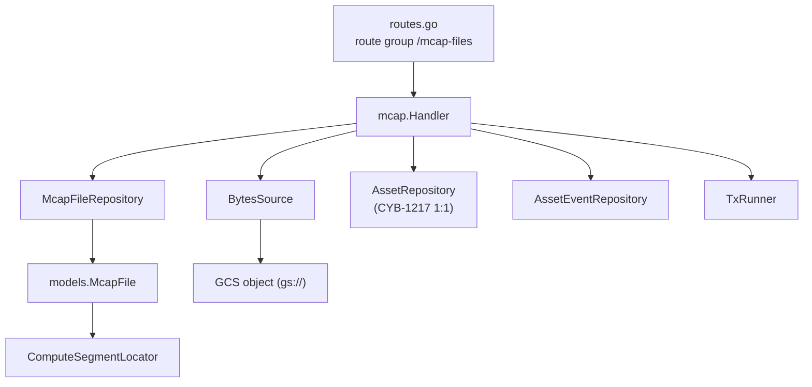
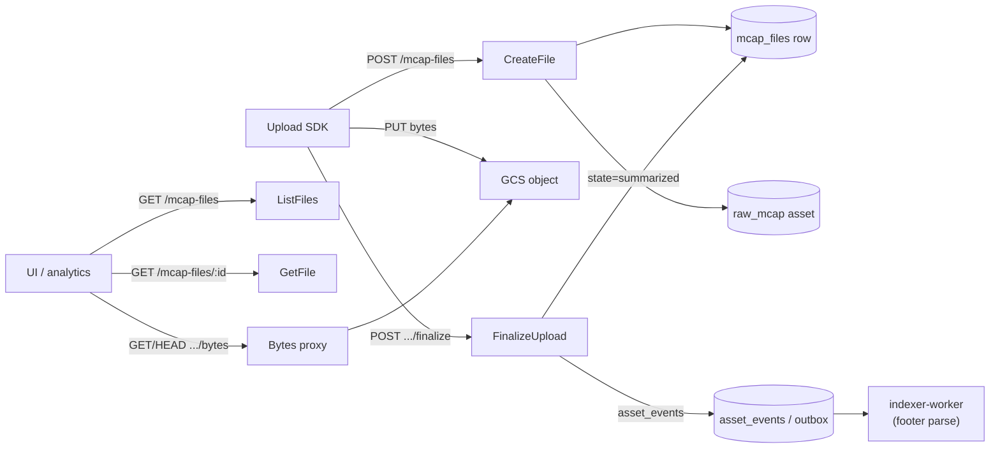
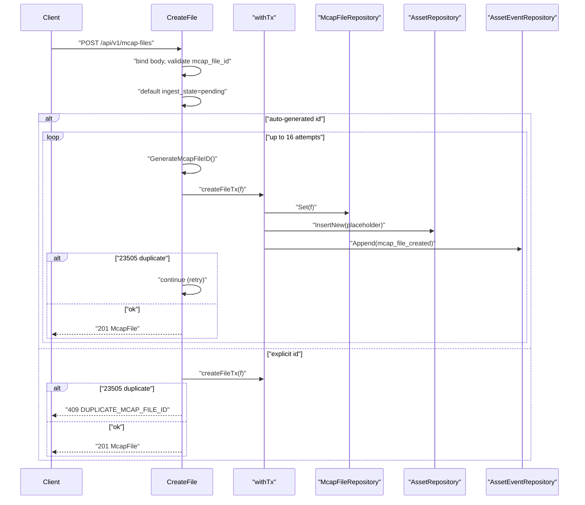
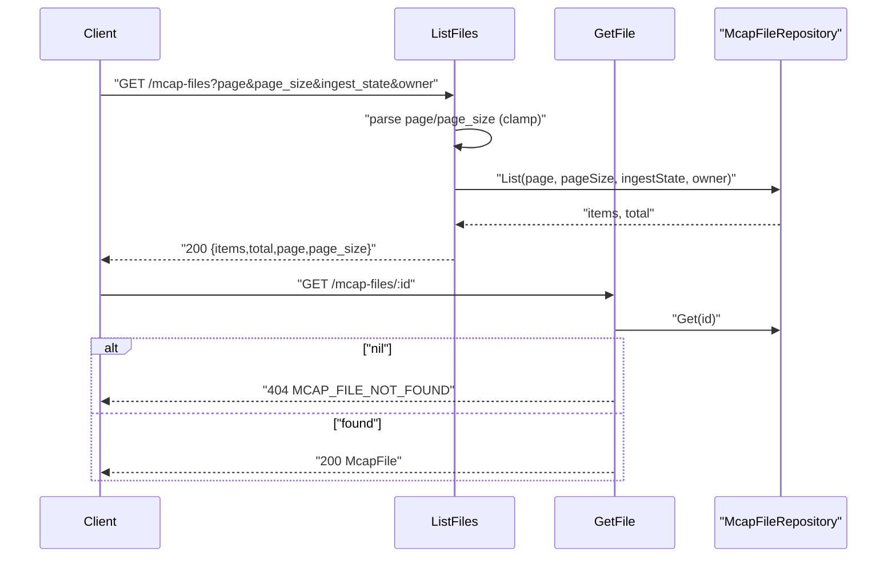
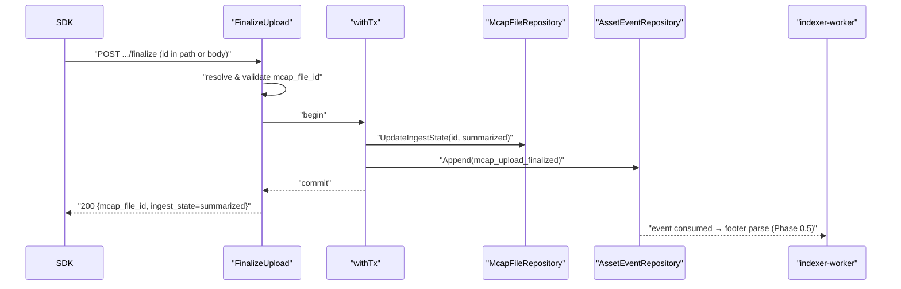
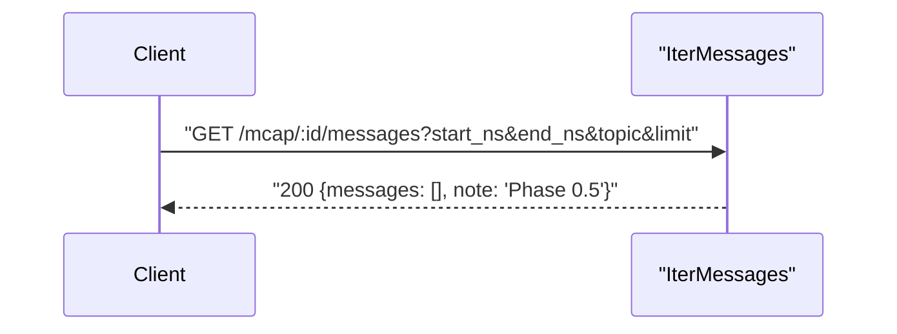
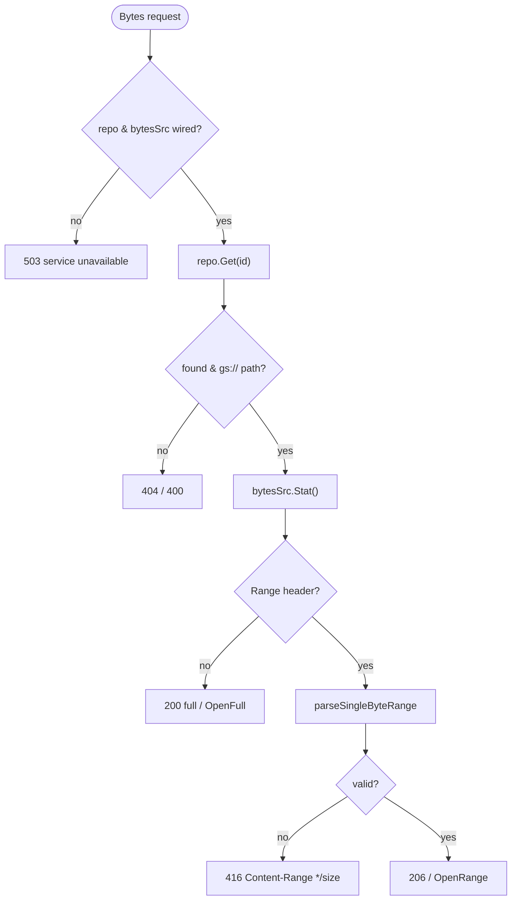
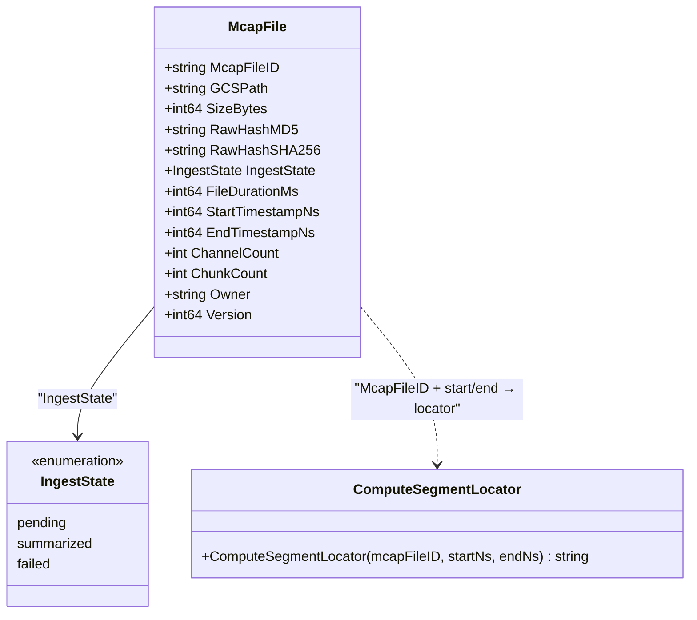
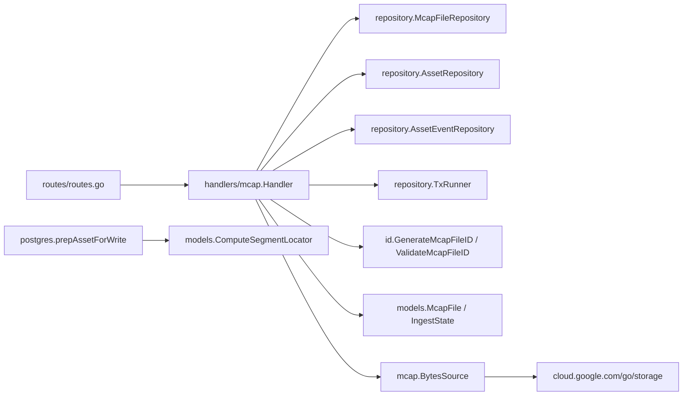

# MCAP Files & Messages

<cite>
**Referenced Files in This Document**

- [backend/internal/handlers/mcap/handler.go](file://backend/internal/handlers/mcap/handler.go)
- [backend/internal/handlers/mcap/bytes.go](file://backend/internal/handlers/mcap/bytes.go)
- [backend/internal/handlers/mcap/bytes_source.go](file://backend/internal/handlers/mcap/bytes_source.go)
- [backend/internal/models/segment_locator.go](file://backend/internal/models/segment_locator.go)
- [backend/internal/models/asset.go](file://backend/internal/models/asset.go)
- [backend/internal/id/assetid.go](file://backend/internal/id/assetid.go)
- [backend/internal/repository/common.go](file://backend/internal/repository/common.go)
- [backend/internal/postgres/repos.go](file://backend/internal/postgres/repos.go)
- [backend/routes/routes.go](file://backend/routes/routes.go)
- [api/openapi.yaml](file://api/openapi.yaml)
</cite>

## Table of Contents
1. [Introduction](#introduction)
2. [Project Structure](#project-structure)
3. [Core Components](#core-components)
4. [Architecture Overview](#architecture-overview)
5. [Detailed Component Analysis](#detailed-component-analysis)
6. [Dependency Analysis](#dependency-analysis)
7. [Performance Considerations](#performance-considerations)
8. [Troubleshooting Guide](#troubleshooting-guide)
9. [Conclusion](#conclusion)
10. [Appendices](#appendices)

## Introduction

The **MCAP Files & Messages** area is the metadata and access layer for raw MCAP
recordings managed by cyber-databrew. An MCAP file is the source-of-truth binary
artifact a collector uploads to Google Cloud Storage (GCS); the backend stores a
companion metadata row (`mcap_files`) describing where the bytes live, their
content identity (size, hashes), a time/structure summary, provenance fields, and
an ingest lifecycle state.

This page documents the four concerns implemented by the `mcap` HTTP handler
package:

1. **File metadata create** — `POST /api/v1/mcap-files`, which persists an
   `McapFile` row, optionally allocating a unique 8-character `mcap_file_id`, and
   (under CYB-1217) creates a paired placeholder `raw_mcap` asset in the same
   transaction.
2. **File listing and detail** — `GET /api/v1/mcap-files` (paginated, filterable)
   and `GET /api/v1/mcap-files/:id`.
3. **Upload finalize** — `POST /api/v1/mcap/upload/finalize` and the RESTful
   `POST /api/v1/mcap-files/:id/finalize`, called by the SDK after the GCS PUT
   completes; it flips the ingest state to `summarized` and emits an event that
   downstream workers consume.
4. **Message iteration** — `GET /api/v1/mcap/:id/messages`, currently a Phase 0.5
   placeholder, plus the byte-range proxy `GET|HEAD /api/v1/mcap-files/:id/bytes`
   that streams the underlying GCS object with HTTP `Range` support.

Cross-cutting all of this is the **segment locator**: a pure, deterministic SHA-1
digest of `mcap_file_id + start_ns + end_ns` that uniquely names a time segment of
a file. It is computed by `models.ComputeSegmentLocator` and assigned to assets
whenever they are written.

The primary consumers are the upload SDK (which creates metadata then finalizes),
the indexer-worker (which reacts to the finalize event to parse the real MCAP
footer), and any UI or analytics client that lists/inspects files or streams their
bytes.

**Section sources**
- [backend/internal/handlers/mcap/handler.go](file://backend/internal/handlers/mcap/handler.go#L1-L52)
- [backend/internal/models/segment_locator.go](file://backend/internal/models/segment_locator.go#L1-L19)

## Project Structure

The functionality is concentrated in the `internal/handlers/mcap` package, backed
by a repository interface, the shared model definitions, an ID generator, and the
route wiring.

- `internal/handlers/mcap/handler.go` — the `Handler` struct, its dependency
  setters, the transactional create helper, and the HTTP handlers `CreateFile`,
  `FinalizeUpload`, `IterMessages`, `ListFiles`, and `GetFile`.
- `internal/handlers/mcap/bytes.go` — the `Bytes` handler that proxies GCS object
  bytes with single-range HTTP `Range` support, plus `parseSingleByteRange` and
  the GCS error mapper `writeBytesError`.
- `internal/handlers/mcap/bytes_source.go` — the `BytesSource` interface and its
  GCS implementation (`gcsBytesSource`), abstracting storage so handlers are
  unit-testable.
- `internal/models/segment_locator.go` — the `ComputeSegmentLocator` pure
  function.
- `internal/models/asset.go` — the `McapFile` struct and the `IngestState` enum.
- `internal/id/assetid.go` — `GenerateMcapFileID` / `ValidateMcapFileID`
  (8-character alphanumeric IDs, shared with assets).
- `internal/repository/common.go` — the `McapFileRepository` interface contract.
- `internal/postgres/repos.go` — where `ComputeSegmentLocator` is applied during
  asset persistence (`prepAssetForWrite`).
- `routes/routes.go` — binds the handler methods to URL paths.
- `api/openapi.yaml` — the public contract for the endpoints and schemas.

**Diagram sources**
- [backend/internal/handlers/mcap/handler.go](file://backend/internal/handlers/mcap/handler.go#L21-L58)
- [backend/routes/routes.go](file://backend/routes/routes.go#L223-L231)

**Section sources**
- [backend/internal/handlers/mcap/handler.go](file://backend/internal/handlers/mcap/handler.go#L1-L84)
- [backend/routes/routes.go](file://backend/routes/routes.go#L223-L231)

## Core Components

### The `Handler` and its dependencies

The `Handler` struct holds a `McapFileRepository`, an optional `TxRunner`, an
optional `AssetEventRepository`, an optional `AssetRepository` (for CYB-1217 1:1
`raw_mcap` asset creation), an optional `BytesSource`, and an injectable `nowFn`
clock. The constructor `New` requires only the repository; the remaining
dependencies are wired via setters (`SetTxRunner`, `SetEventRepo`, `SetAssetRepo`,
`SetBytesSource`). When no `BytesSource` is wired, the bytes endpoint returns 503.

The `withTx` helper runs a closure inside a transaction when a `TxRunner` is wired,
falls back to a repository that itself implements `TxRunner`, and otherwise runs
the closure directly. The `appendMcapEvent` helper appends an `asset_events` row
(aggregate type `mcap_file`, schema `v1`) only when an event repository is wired.

### The `McapFile` model

`models.McapFile` is the metadata record. It groups: content identity (`GCSPath`,
`SizeBytes`, `RawHashMD5`, `RawHashSHA256`, `IngestState`); time/structure summary
(`FileDurationMs`, `StartTimestampNs`, `EndTimestampNs`, `ChannelCount`,
`ChunkCount`); provenance (`VendorID`, `CollectorID`, `TaskID`, `DeviceID`,
`CameraModel`, `DataSource`, `LocationID`, `SceneID`, `EnvironmentID`,
`CollectionMethod`); ownership/lifecycle (`Owner`, `RetentionTier`, `ExpireAt`,
`TenantID`, `ProjectID`); and extension maps (`Metadata`, `ProcessState`), plus
`CreatedAt`, `UpdatedAt`, and a `Version` counter.

### `IngestState`

`IngestState` is a string enum with three values: `pending`, `summarized`, and
`failed`. New files default to `pending` when the request omits the field.

### `McapFileRepository`

The repository contract exposes `Get`, `Set`, `UpdateIngestState`, and a paginated
`List(page, pageSize, ingestState, owner)`.

### `BytesSource`

`BytesSource` abstracts the backing store with three methods: `Stat` (total size +
content type), `OpenRange` (`[start, start+length)`), and `OpenFull` (whole
object). The GCS implementation parses `gs://bucket/object` and delegates to the
Cloud Storage client.

### `ComputeSegmentLocator`

A pure function returning the 40-character hex SHA-1 of `mcapFileID` concatenated
with the decimal forms of `startNs` and `endNs`. It is deterministic and used to
uniquely identify a segment by its source file and time range.

**Section sources**
- [backend/internal/handlers/mcap/handler.go](file://backend/internal/handlers/mcap/handler.go#L21-L84)
- [backend/internal/models/asset.go](file://backend/internal/models/asset.go#L19-L24)
- [backend/internal/models/asset.go](file://backend/internal/models/asset.go#L177-L220)
- [backend/internal/repository/common.go](file://backend/internal/repository/common.go#L33-L38)
- [backend/internal/handlers/mcap/bytes_source.go](file://backend/internal/handlers/mcap/bytes_source.go#L13-L22)
- [backend/internal/models/segment_locator.go](file://backend/internal/models/segment_locator.go#L13-L19)

## Architecture Overview

MCAP files move through a small lifecycle. A client (typically the SDK) first
creates the metadata row, uploads bytes directly to GCS, then finalizes. Finalize
flips the ingest state to `summarized` and emits an `mcap_upload_finalized` event;
the indexer-worker reacts to that event to parse the real MCAP footer (Phase 0.5).
Readers can list and inspect metadata at any time, and stream the underlying bytes
through the range proxy.

**Diagram sources**
- [backend/internal/handlers/mcap/handler.go](file://backend/internal/handlers/mcap/handler.go#L86-L125)
- [backend/internal/handlers/mcap/handler.go](file://backend/internal/handlers/mcap/handler.go#L251-L297)
- [backend/internal/handlers/mcap/bytes.go](file://backend/internal/handlers/mcap/bytes.go#L26-L48)

**Section sources**
- [backend/internal/handlers/mcap/handler.go](file://backend/internal/handlers/mcap/handler.go#L86-L345)
- [backend/routes/routes.go](file://backend/routes/routes.go#L223-L231)

## Detailed Component Analysis

### File metadata creation

`CreateFile` binds a JSON body, trims and (when present) validates the
`mcap_file_id` against the 8-alphanumeric rule, falls back from `gcs_path` to
`mcap_uri` when `gcs_path` is empty, defaults `ingest_state` to `pending`, and
builds the `McapFile`. Persistence runs through `createFileTx`, which inside a
single transaction calls `repo.Set`, optionally inserts a placeholder `raw_mcap`
asset sharing the same ID (CYB-1217 1:1 extension), and appends an
`mcap_file_created` event.

If the caller supplies an `mcap_file_id`, a unique-violation (`23505`) maps to a
`409 DUPLICATE_MCAP_FILE_ID`. If the caller omits the ID, the handler enters a
retry loop (up to `maxMcapFileIDRetries` = 16): it generates a random ID, attempts
the insert, and retries only on the duplicate-key error; any other error is fatal.
A successful create returns `201 Created` with the full `McapFile`.

**Diagram sources**
- [backend/internal/handlers/mcap/handler.go](file://backend/internal/handlers/mcap/handler.go#L86-L247)

**Section sources**
- [backend/internal/handlers/mcap/handler.go](file://backend/internal/handlers/mcap/handler.go#L86-L247)
- [backend/internal/id/assetid.go](file://backend/internal/id/assetid.go#L37-L46)

### Listing and detail retrieval

`ListFiles` reads `page` (default 1) and `page_size` (default 20, capped at 100)
from the query string, both guarded so invalid or out-of-range values keep the
defaults, plus optional `ingest_state` and `owner` filters. It delegates to
`repo.List`, normalizes a nil slice to an empty array, and returns an envelope of
`items`, `total`, `page`, and `page_size`.

`GetFile` fetches a single record by the `:id` path parameter. A repository error
is a `500`; a nil result is a `404 MCAP_FILE_NOT_FOUND`; otherwise the full
`McapFile` is returned with `200`.

**Diagram sources**
- [backend/internal/handlers/mcap/handler.go](file://backend/internal/handlers/mcap/handler.go#L299-L345)

**Section sources**
- [backend/internal/handlers/mcap/handler.go](file://backend/internal/handlers/mcap/handler.go#L299-L345)
- [backend/internal/repository/common.go](file://backend/internal/repository/common.go#L33-L38)

### Upload finalize

`FinalizeUpload` serves both `POST /api/v1/mcap/upload/finalize` (ID in the body)
and the RESTful `POST /api/v1/mcap-files/:id/finalize` (ID in the path). It first
reads the `:id` path parameter; when empty it falls back to a required
`mcap_file_id` JSON body field. The resolved ID must pass the 8-alphanumeric
validation. The handler then, inside a transaction, calls
`repo.UpdateIngestState(id, summarized)` and appends an `mcap_upload_finalized`
event. Phase 0 flips the state immediately without a real footer parse; the emitted
event is what triggers Pub/Sub → indexer-worker → the real MCAP footer parse in
Phase 0.5. On success it returns `200` with the `mcap_file_id` and the new
`ingest_state`.

**Diagram sources**
- [backend/internal/handlers/mcap/handler.go](file://backend/internal/handlers/mcap/handler.go#L249-L288)

**Section sources**
- [backend/internal/handlers/mcap/handler.go](file://backend/internal/handlers/mcap/handler.go#L249-L288)
- [backend/routes/routes.go](file://backend/routes/routes.go#L223-L231)

### Message iteration

`IterMessages` (`GET /api/v1/mcap/:id/messages`) is currently a placeholder that
returns an empty `messages` array and a note that real iteration arrives in
Phase 0.5. The OpenAPI contract already declares the intended query parameters —
`start_ns`, `end_ns`, `topic`, and `limit` — so the eventual implementation can
fill them in without breaking the surface.

**Diagram sources**
- [backend/internal/handlers/mcap/handler.go](file://backend/internal/handlers/mcap/handler.go#L290-L297)

**Section sources**
- [backend/internal/handlers/mcap/handler.go](file://backend/internal/handlers/mcap/handler.go#L290-L297)
- [api/openapi.yaml](file://api/openapi.yaml#L3135-L3158)

### Byte-range proxy

`Bytes` proxies the underlying GCS object for `GET|HEAD /api/v1/mcap-files/:id/bytes`.
It guards that both the repository and the `BytesSource` are wired (503 otherwise),
loads the file, and requires a `gs://` path. It then `Stat`s the object for size
and content type and always sets `Accept-Ranges: bytes`.

With no `Range` header it returns `200` with the full `Content-Length`, and for a
`HEAD` request returns headers only; otherwise it `OpenFull`s and copies the body.
With a `Range` header it parses a single byte range via `parseSingleByteRange`; an
unsatisfiable/invalid range yields `416` with `Content-Range: bytes */<size>`,
while a valid range yields `206` with `Content-Range`, the correct
`Content-Length`, and a body streamed from `OpenRange`. `writeBytesError` maps
`storage.ErrObjectNotExist` to `404`; unrecognized errors fall through to `500`.

`parseSingleByteRange` supports `bytes=<start>-<end>`, `bytes=<start>-`, and
`bytes=-<suffixLen>`, rejecting multi-range specs, signed numbers, and ranges where
`start >= size`, and clamping the suffix length and end to the object size.

**Diagram sources**
- [backend/internal/handlers/mcap/bytes.go](file://backend/internal/handlers/mcap/bytes.go#L26-L127)

**Section sources**
- [backend/internal/handlers/mcap/bytes.go](file://backend/internal/handlers/mcap/bytes.go#L26-L221)
- [backend/internal/handlers/mcap/bytes_source.go](file://backend/internal/handlers/mcap/bytes_source.go#L24-L76)

### Segment locator model

The segment locator is the deterministic identity of a `(mcap_file_id, start_ns,
end_ns)` triple. `ComputeSegmentLocator` writes the three components into a single
SHA-1 hasher (the file ID bytes, then the decimal `startNs`, then the decimal
`endNs`) and returns the 40-character hex digest. Because it is a pure function of
its inputs, the same segment always produces the same locator, which makes it
usable as an idempotency/dedup key.

It is applied during asset persistence: `prepAssetForWrite` sets
`a.SegmentLocator = models.ComputeSegmentLocator(a.McapFileID, a.StartTimestampNs,
a.EndTimestampNs)` on every write, so an asset's locator is always consistent with
its file and time range.

**Diagram sources**
- [backend/internal/models/asset.go](file://backend/internal/models/asset.go#L177-L220)
- [backend/internal/models/asset.go](file://backend/internal/models/asset.go#L19-L24)
- [backend/internal/models/segment_locator.go](file://backend/internal/models/segment_locator.go#L13-L19)

**Section sources**
- [backend/internal/models/segment_locator.go](file://backend/internal/models/segment_locator.go#L1-L19)
- [backend/internal/postgres/repos.go](file://backend/internal/postgres/repos.go#L141-L154)

## Dependency Analysis

The `mcap` handler depends inward on repository and model abstractions and on the
ID generator, and outward (at runtime) on GCS through the `BytesSource`. The route
layer is the only inbound dependency.

The `McapFileRepository` interface (`Get`, `Set`, `UpdateIngestState`, `List`) is
the seam between the handler and PostgreSQL. The `BytesSource` interface is the
seam to storage, letting tests inject a fake. `ComputeSegmentLocator` lives in
`models` and is consumed by the PostgreSQL asset write path, not by the MCAP
handler directly.

**Diagram sources**
- [backend/internal/handlers/mcap/handler.go](file://backend/internal/handlers/mcap/handler.go#L21-L58)
- [backend/internal/repository/common.go](file://backend/internal/repository/common.go#L33-L38)
- [backend/internal/postgres/repos.go](file://backend/internal/postgres/repos.go#L141-L154)

**Section sources**
- [backend/internal/handlers/mcap/handler.go](file://backend/internal/handlers/mcap/handler.go#L1-L84)
- [backend/internal/repository/common.go](file://backend/internal/repository/common.go#L33-L38)

## Performance Considerations

- **Range streaming, not buffering.** The `Bytes` proxy uses `io.Copy` straight
  from the GCS reader to the response writer for both full and partial responses,
  so it does not buffer the whole object in memory. `HEAD` short-circuits before
  any read, returning only headers.
- **Single-range only.** `parseSingleByteRange` rejects multi-range requests
  (those containing a comma), keeping the proxy logic simple and bounded.
- **Pagination caps.** `ListFiles` caps `page_size` at 100 and ignores
  non-positive or out-of-range values, preventing unbounded result sets.
- **ID-allocation retries.** Auto-ID creation retries up to 16 times on a
  duplicate key. With an 8-character alphanumeric space, collisions are rare, so
  the loop almost always succeeds on the first attempt; the bound prevents an
  unbounded loop under pathological conditions.
- **Transactional writes.** Create and finalize each run inside a single
  transaction so the metadata write, the paired asset insert, and the event append
  commit atomically, avoiding partial state and dual-write inconsistency.
- **Cheap locator computation.** `ComputeSegmentLocator` is a single SHA-1 over a
  few short byte slices — negligible cost on the asset write path.

**Section sources**
- [backend/internal/handlers/mcap/bytes.go](file://backend/internal/handlers/mcap/bytes.go#L70-L127)
- [backend/internal/handlers/mcap/handler.go](file://backend/internal/handlers/mcap/handler.go#L227-L331)

## Troubleshooting Guide

- **`503` on `/mcap-files/:id/bytes`.** Either the repository or the `BytesSource`
  is not wired. Confirm `SetBytesSource` was called during server bootstrap; an
  unset source explicitly returns 503.
- **`400 mcap file gcs_path must be a gs:// URI`.** The stored `gcs_path` is not a
  `gs://` URI. Bytes proxying only supports GCS-backed objects; verify the value
  written at create time (or the `mcap_uri` fallback).
- **`416` on a range request.** The `Range` header was invalid, multi-range, used
  a signed number, or its `start >= size`. The response includes
  `Content-Range: bytes */<size>`; re-issue with a satisfiable single range.
- **`409 DUPLICATE_MCAP_FILE_ID` on create.** The supplied `mcap_file_id` already
  exists. Either omit the field to let the server allocate a unique one or pick a
  different ID.
- **`400 mcap_file_id must be exactly 8 alphanumeric characters`.** The supplied
  ID failed `ValidateMcapFileID`. IDs share the asset format: exactly 8 ASCII
  alphanumerics.
- **Empty `messages` from `/mcap/:id/messages`.** This is expected — the endpoint
  is a Phase 0.5 placeholder and currently returns an empty array with a note.
- **`failed to allocate unique mcap_file_id`.** All 16 auto-ID attempts hit
  duplicate keys; effectively impossible in practice, so investigate ID-generation
  or a corrupted/seeded table if it occurs.
- **State stuck at `pending`.** Finalize was never called, or its event was not
  consumed. Confirm the SDK calls finalize after the GCS PUT and that the
  indexer-worker is processing `mcap_upload_finalized` events.

**Section sources**
- [backend/internal/handlers/mcap/bytes.go](file://backend/internal/handlers/mcap/bytes.go#L26-L127)
- [backend/internal/handlers/mcap/handler.go](file://backend/internal/handlers/mcap/handler.go#L168-L246)

## Conclusion

The MCAP Files & Messages area is a compact, transactional metadata layer over raw
recordings stored in GCS. Creation persists an `McapFile` row (with an optional
auto-allocated 8-character ID) and a paired placeholder `raw_mcap` asset; finalize
advances the ingest state to `summarized` and emits the event that drives the
indexer-worker's footer parse. Listing and detail provide paginated, filterable
read access, and the byte-range proxy streams the underlying object with proper
HTTP `Range` semantics. The deterministic `ComputeSegmentLocator` underpins segment
identity wherever assets are written. Message iteration is the one deliberately
deferred piece, scaffolded in the contract and stubbed in the handler for Phase 0.5.

## Appendices

### API definitions

| Method | Path | Handler | Notes |
|---|---|---|---|
| POST | `/api/v1/mcap-files` | `CreateFile` | 201; auto-ID with retry, or 409 on duplicate explicit ID |
| GET | `/api/v1/mcap-files` | `ListFiles` | paginated; `ingest_state`, `owner` filters |
| GET | `/api/v1/mcap-files/:id` | `GetFile` | 404 `MCAP_FILE_NOT_FOUND` if absent |
| GET / HEAD | `/api/v1/mcap-files/:id/bytes` | `Bytes` | GCS range proxy; 503 if source unset |
| POST | `/api/v1/mcap/upload/finalize` | `FinalizeUpload` | ID in body |
| POST | `/api/v1/mcap-files/:id/finalize` | `FinalizeUpload` | RESTful; ID in path |
| GET | `/api/v1/mcap/:id/messages` | `IterMessages` | Phase 0.5 placeholder |

**Section sources**
- [backend/routes/routes.go](file://backend/routes/routes.go#L223-L231)
- [api/openapi.yaml](file://api/openapi.yaml#L3038-L3158)

### `IngestState` values

| Value | Meaning |
|---|---|
| `pending` | Metadata created; bytes not yet finalized (default on create) |
| `summarized` | Finalize ran; event emitted for footer parse |
| `failed` | Ingest failed |

**Section sources**
- [backend/internal/models/asset.go](file://backend/internal/models/asset.go#L19-L24)

### `McapFile` schema (selected fields)

| Field | JSON | Type |
|---|---|---|
| `McapFileID` | `mcap_file_id` | string (8 alphanumeric) |
| `GCSPath` | `gcs_path` | string (`gs://...`) |
| `SizeBytes` | `size_bytes` | int64 |
| `RawHashMD5` / `RawHashSHA256` | `raw_hash_md5` / `raw_hash_sha256` | string |
| `IngestState` | `ingest_state` | enum |
| `StartTimestampNs` / `EndTimestampNs` | `start_timestamp_ns` / `end_timestamp_ns` | int64 |
| `Version` | `version` | int64 |

**Section sources**
- [backend/internal/models/asset.go](file://backend/internal/models/asset.go#L177-L220)
- [api/openapi.yaml](file://api/openapi.yaml#L1024-L1061)

### Segment locator formula

`segment_locator = hex(SHA-1(mcap_file_id || str(start_ns) || str(end_ns)))` — a
40-character hex string; deterministic and order-sensitive in the three inputs.

**Section sources**
- [backend/internal/models/segment_locator.go](file://backend/internal/models/segment_locator.go#L9-L19)
- [api/openapi.yaml](file://api/openapi.yaml#L120-L122)
