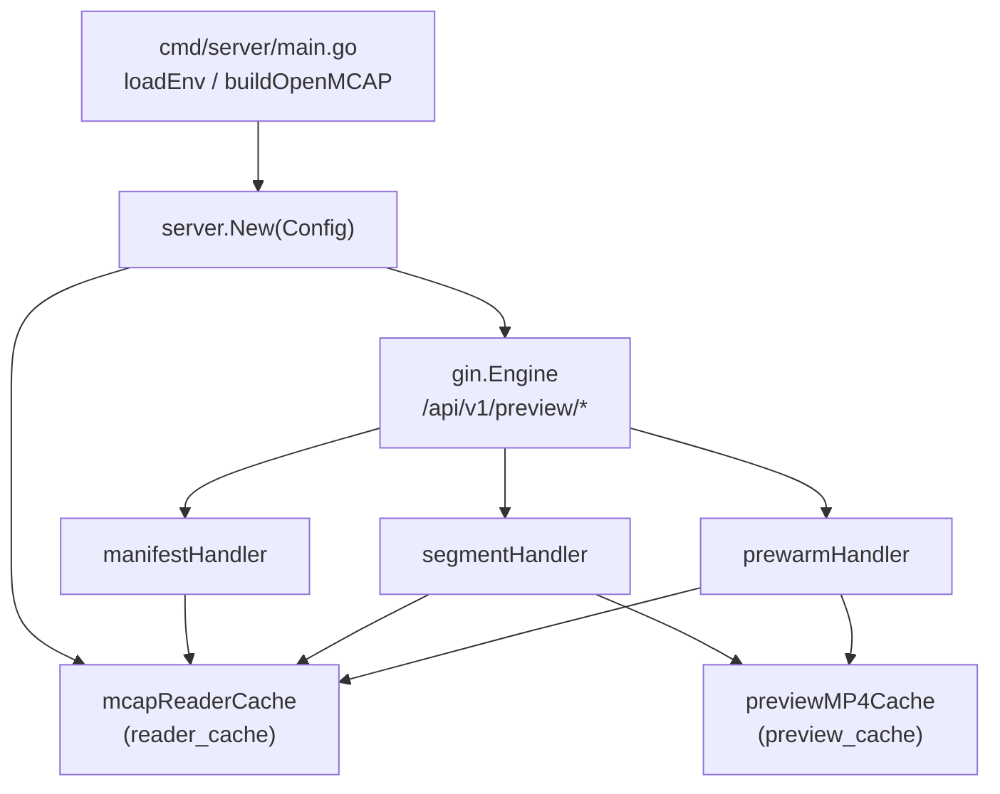
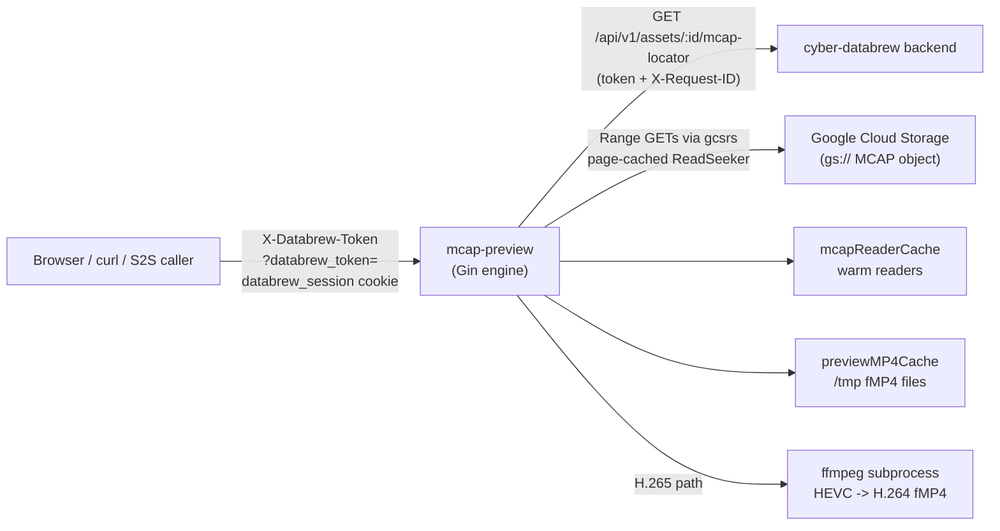
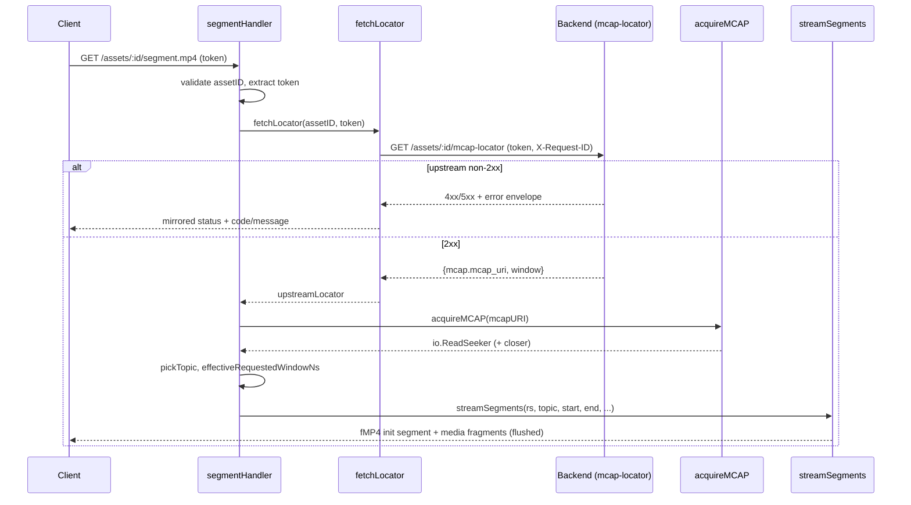
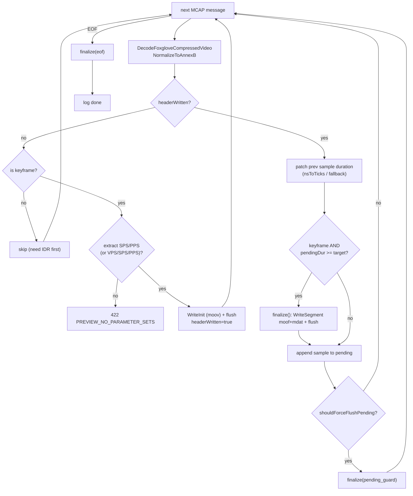
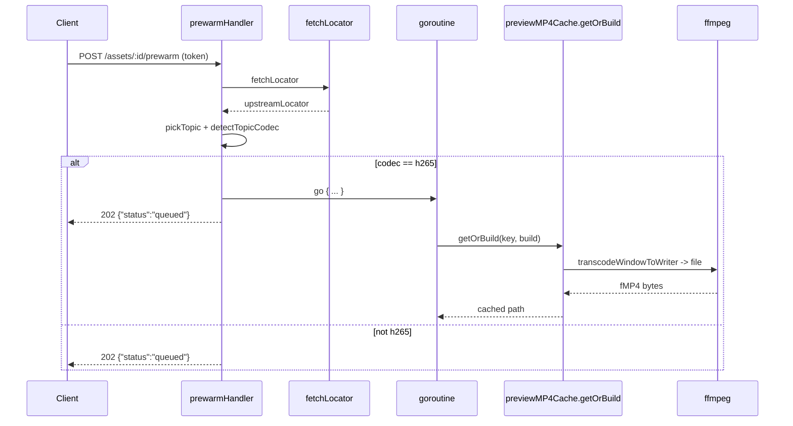
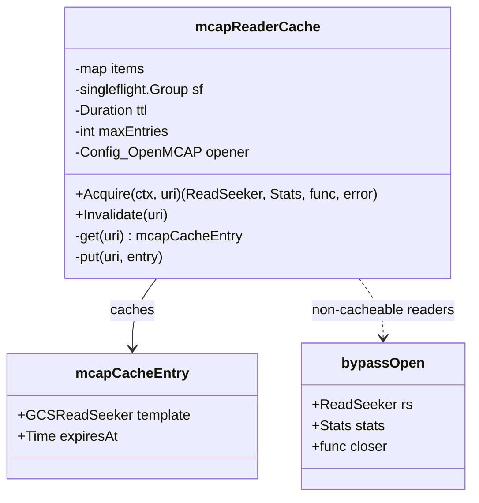
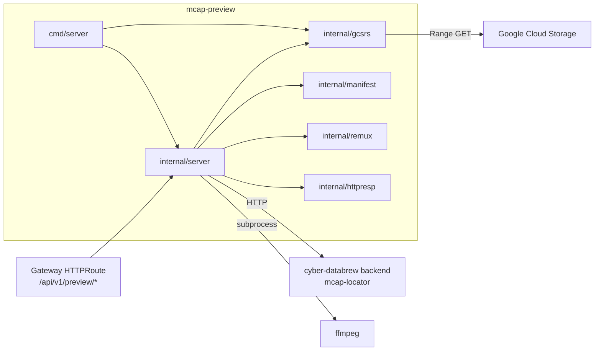

# MCAP Preview Service

<cite>
**Referenced Files in This Document**

- [services/mcap-preview/internal/server/server.go](file://services/mcap-preview/internal/server/server.go)
- [services/mcap-preview/internal/server/segment.go](file://services/mcap-preview/internal/server/segment.go)
- [services/mcap-preview/internal/server/preview_cache.go](file://services/mcap-preview/internal/server/preview_cache.go)
- [services/mcap-preview/internal/server/mcap_reader_cache.go](file://services/mcap-preview/internal/server/mcap_reader_cache.go)
- [services/mcap-preview/cmd/server/main.go](file://services/mcap-preview/cmd/server/main.go)
- [services/mcap-preview/README.md](file://services/mcap-preview/README.md)
</cite>

## Table of Contents
1. [Introduction](#introduction)
2. [Project Structure](#project-structure)
3. [Core Components](#core-components)
4. [Architecture Overview](#architecture-overview)
5. [Detailed Component Analysis](#detailed-component-analysis)
6. [Dependency Analysis](#dependency-analysis)
7. [Performance Considerations](#performance-considerations)
8. [Troubleshooting Guide](#troubleshooting-guide)
9. [Conclusion](#conclusion)
10. [Appendices](#appendices)

## Introduction

The **mcap-preview** service is a standalone Go microservice whose single job
is to turn the video tracks buried inside a large MCAP recording into
something a browser can play, without forcing the browser (or the caller) to
download multi-gigabyte files. It exposes three HTTP endpoints under
`/api/v1/preview`: a read-only **manifest** endpoint that inspects the MCAP
summary section and reports candidate video topics and chunk layout, a
**segment** endpoint that streams a fragmented MP4 (fMP4) of a time window, and
a **prewarm** endpoint that asynchronously primes the transcode cache.

The service is deliberately decoupled from the cyber-databrew backend. It does
not import backend types and does not own any authoritative state about assets.
Instead, for every request it calls the backend's **mcap-locator** endpoint
(`GET /api/v1/assets/{id}/mcap-locator`) to resolve an asset ID into a concrete
`gs://` MCAP URI plus a time window, then opens that object directly from Google
Cloud Storage through a page-cached `io.ReadSeeker`. The phase-0 authorization
model is pure pass-through: whatever `X-Databrew-Token` the caller presents is
forwarded verbatim to the backend, and the backend's accept/reject decision is
mirrored back to the client.

Two consumers drive the design. Server-to-server callers and `curl` use the
`X-Databrew-Token` header on every endpoint. Browser `<video>` elements, which
cannot attach custom headers, use the segment endpoint's fallback transports — a
`?databrew_token=` query parameter or a `databrew_session` cookie — so an
ordinary HTML `<video src="…/segment.mp4?databrew_token=…">` works without
JavaScript.

**Section sources**
- [services/mcap-preview/README.md](file://services/mcap-preview/README.md#L1-L116)
- [services/mcap-preview/internal/server/server.go](file://services/mcap-preview/internal/server/server.go#L1-L103)

## Project Structure

The service lives entirely under `services/mcap-preview/` and is split so that
HTTP routing can be unit-tested without a real GCS-backed reader. `cmd/server`
owns process lifecycle and environment wiring; `internal/server` owns the Gin
engine, handlers, the segmenting/remux logic, and the two in-process caches;
several sibling `internal/` packages (`gcsrs`, `httpresp`, `manifest`, `remux`)
supply the GCS reader, the response-envelope helpers, the summary-only manifest
builder, and the Annex-B/fMP4 codec helpers respectively.

- **`cmd/server/main.go`** — reads config from environment variables, builds a
  GCS-backed `OpenMCAP` opener (falling back to local files for dev), constructs
  the Gin engine via `server.New`, and runs an `http.Server`.
- **`internal/server/server.go`** — defines `Config`, `New`, the `manifest` and
  `prewarm` handlers, the upstream `fetchLocator` call, token extraction, and
  request-ID middleware.
- **`internal/server/segment.go`** — the `segment.mp4` handler, topic selection,
  window normalization, the native H.264 fMP4 segmenter (`streamSegments`), and
  the H.265 → H.264 ffmpeg transcode path.
- **`internal/server/preview_cache.go`** — the on-disk fMP4 cache used by the
  HEVC transcode path (`previewCache`), keyed by a SHA-1 of asset/topic/window.
- **`internal/server/mcap_reader_cache.go`** — the in-process page-cached MCAP
  reader cache (`mcapReaderCache`) that keeps GCS readers warm across requests.

**Diagram sources**
- [services/mcap-preview/cmd/server/main.go](file://services/mcap-preview/cmd/server/main.go#L26-L60)
- [services/mcap-preview/internal/server/server.go](file://services/mcap-preview/internal/server/server.go#L78-L103)
- [services/mcap-preview/internal/server/segment.go](file://services/mcap-preview/internal/server/segment.go#L60-L60)

**Section sources**
- [services/mcap-preview/cmd/server/main.go](file://services/mcap-preview/cmd/server/main.go#L1-L24)
- [services/mcap-preview/internal/server/server.go](file://services/mcap-preview/internal/server/server.go#L1-L24)
- [services/mcap-preview/README.md](file://services/mcap-preview/README.md#L162-L177)

## Core Components

The service is configured by the `Config` struct and instantiated by `New`.
`Config` carries the upstream backend root (`UpstreamBaseURL`, which must *not*
include `/api/v1`), a token-passthrough flag, an `HTTPClient` for the upstream
call, the `OpenMCAP` opener function, a strict-window-validation flag, and the
reader-cache TTL. The unexported `mcapCache` field is populated by `New` so
handlers can go through the cache-aware front door.

The key indirection is the `Config_OpenMCAP` type alias — a function returning
an `io.ReadSeeker` over the MCAP bytes plus an optional `*gcsrs.Stats` snapshot
and a `closer`. Production wires this to a GCS reader; tests inject an in-memory
fixture with a no-op closer. Every handler calls `cfg.acquireMCAP` rather than
`cfg.OpenMCAP` directly: `acquireMCAP` routes through `mcapCache.Acquire` when
the cache is wired, and transparently falls back to `cfg.OpenMCAP` otherwise.

`New` applies defaults (a 10-second upstream `HTTPClient` timeout, a 5-minute
reader-cache TTL when unset), registers `requestID`, `accessLogger`, and
`gin.Recovery` middleware, exposes `GET /healthz`, and mounts the three preview
endpoints. A negative `MCAPReaderCacheTTL` disables the reader cache entirely
(the legacy "open fresh every time" behaviour).

The upstream response is decoded into `upstreamLocator`, a minimal struct that
captures only the `mcap.mcap_uri` / `mcap.size_bytes` and the
`window.start_timestamp_ns` / `window.end_timestamp_ns` / `window.duration_ms`
fields. The service deliberately does not import the backend's full
`McapLocatorResponse` type so the two modules stay independent.

**Section sources**
- [services/mcap-preview/internal/server/server.go](file://services/mcap-preview/internal/server/server.go#L26-L103)
- [services/mcap-preview/internal/server/server.go](file://services/mcap-preview/internal/server/server.go#L231-L244)

## Architecture Overview

At runtime the service sits between an untrusted client and two trusted
backends: the cyber-databrew backend (for authorization and locator resolution)
and Google Cloud Storage (for the raw MCAP bytes). Every preview request follows
the same first two steps — extract the Databrew token, resolve the locator — and
then diverges depending on the endpoint and the codec.

The locator resolution is shared by all three handlers via `fetchLocator`,
which forwards the token (when `DatabrewTokenPassthrough` is set) and the
request ID, and — crucially — propagates upstream non-2xx status codes and error
envelopes verbatim, so a 404/409/503 from the backend reaches the client
unchanged.

After resolution, the manifest handler reads only the MCAP summary section and
returns JSON. The segment handler picks a topic, normalizes the window, detects
the codec, and then either runs the in-process Go fMP4 segmenter (H.264) or
shells out to ffmpeg (H.265). The prewarm handler runs the ffmpeg transcode in a
background goroutine purely to populate the on-disk cache.

**Diagram sources**
- [services/mcap-preview/internal/server/server.go](file://services/mcap-preview/internal/server/server.go#L98-L102)
- [services/mcap-preview/internal/server/server.go](file://services/mcap-preview/internal/server/server.go#L307-L348)
- [services/mcap-preview/internal/server/segment.go](file://services/mcap-preview/internal/server/segment.go#L459-L473)

**Section sources**
- [services/mcap-preview/internal/server/server.go](file://services/mcap-preview/internal/server/server.go#L78-L103)
- [services/mcap-preview/internal/server/server.go](file://services/mcap-preview/internal/server/server.go#L303-L348)
- [services/mcap-preview/README.md](file://services/mcap-preview/README.md#L7-L26)

## Detailed Component Analysis

### Manifest inspection

`manifestHandler` is the read-only entry point. It validates the asset ID
against `assetIDPattern` (`^[A-Za-z0-9_-]{1,128}$`), which rejects path
traversal early, then requires a non-empty token and a configured upstream and
opener. After `fetchLocator` resolves the URI it calls `acquireMCAP`, defers the
closer, and delegates to `manifest.Build` with the locator window and the GCS
`stats` snapshot. The result is the JSON manifest documented in the README,
including `candidate_video_topics`, `chunks_in_window`, and a `stats` block that
reports `gcs_range_requests` and `gcs_bytes_read`. Manifest construction touches
only the MCAP summary (`mcap.Reader.Info()`); it never scans messages, so the IO
cost is O(channels + chunk_indexes).

**Section sources**
- [services/mcap-preview/internal/server/server.go](file://services/mcap-preview/internal/server/server.go#L246-L301)
- [services/mcap-preview/README.md](file://services/mcap-preview/README.md#L33-L77)

### Locator resolution and error pass-through

`fetchLocator` builds the upstream URL as
`{UpstreamBaseURL}/api/v1/assets/{id}/mcap-locator`, attaches the token (when
passthrough is enabled) and the request ID, and issues the request on
`cfg.HTTPClient`. Its return contract is subtle: it returns `(nil, status, err)`
where a non-zero `status` means it *already wrote* an error envelope to the
client (so the caller must not write again), and `status == 0` with a non-nil
`err` means a transport failure that the caller turns into a `502`. On an
upstream 4xx/5xx it tries to decode the upstream `httpresp.ErrorBody`; if the
envelope has a `code`, it is mirrored exactly, otherwise a synthetic
`UPSTREAM_ERROR` envelope is emitted with the original status.

**Diagram sources**
- [services/mcap-preview/internal/server/segment.go](file://services/mcap-preview/internal/server/segment.go#L68-L135)
- [services/mcap-preview/internal/server/server.go](file://services/mcap-preview/internal/server/server.go#L303-L348)

**Section sources**
- [services/mcap-preview/internal/server/server.go](file://services/mcap-preview/internal/server/server.go#L303-L348)

### Token extraction

`extractDatabrewToken` accepts the token from three transports in priority
order: the `X-Databrew-Token` header (used by server-to-server callers and
curl), the `?databrew_token=` query parameter (the only way an HTML `<video>`
tag can carry it), and the `databrew_session` cookie (set by the backend's
`/auth/login`). The manifest and prewarm handlers require the header path in
practice, but they share the same extractor; the segment endpoint is the one
that meaningfully relies on the query and cookie fallbacks.

**Section sources**
- [services/mcap-preview/internal/server/server.go](file://services/mcap-preview/internal/server/server.go#L194-L210)
- [services/mcap-preview/internal/server/segment.go](file://services/mcap-preview/internal/server/segment.go#L75-L79)

### Topic selection

`pickTopic` chooses which video channel to stream. With an explicit `?topic=`
hint it verifies the topic exists, that its schema name contains
`compressedvideo` (case-insensitive), and — if the hint resolves to H.264 — uses
it directly. If the hinted topic exists but is, say, H.265, it falls through to
global selection so the preview still works. Without a hint (or after fallthrough)
it iterates all channels in sorted channel-ID order, filters to
`compressedvideo` schemas, scores each topic by name via
`topicPreferenceScore` (front=40, main=30, side=20, down/bottom=10, else 0), and
tracks both the best overall topic and the best *H.264* topic. It returns the
best H.264 topic when one exists, otherwise the best overall topic, otherwise an
error (`no foxglove.CompressedVideo channel found`, surfaced as
`NO_PREVIEW_TOPIC`/422).

`detectTopicCodec` probes up to the first 24 messages of a topic: it decodes each
`foxglove.CompressedVideo` payload, normalizes the declared `format`, and if the
format is empty, inspects the Annex-B NAL units — VPS/SPS/PPS implies `h265`,
SPS/PPS implies `h264`.

**Section sources**
- [services/mcap-preview/internal/server/segment.go](file://services/mcap-preview/internal/server/segment.go#L222-L345)

### Window normalization

`effectiveRequestedWindowNs` combines the locator window with the optional
`start_ns`/`end_ns`/`start_sec`/`end_sec` query parameters. Nanosecond params
are clamped so they can only narrow the window (`effectiveWindowStartNs`,
`effectiveWindowEndNs`); the `*_sec` params are interpreted relative to the
locator start and intentionally override the ns params. If the requested window
collapses (end ≤ start) it falls back to the full asset window. The result is
later passed to `manifest.NormalizeWindow`, which reconciles the requested range
against the MCAP `Statistics` and returns a `mode` string describing what it did.

`streamSegments` adds a defensive timebase reconciliation: when the requested
span exceeds the declared `duration_ms` by more than 4×, or when
`NormalizeWindow` reports a `stats_fallback_mismatch`, it re-anchors the window
at `Statistics.MessageStartTime` and treats `rawStart` as a nanosecond offset —
so two assets sharing one MCAP map to distinct sub-ranges instead of both
anchoring at the file head. Under `StrictWindowValidation`, a
`stats_fallback_mismatch` is instead rejected with
`422 WINDOW_TIMEBASE_MISMATCH`. The `clip_sec` query (capped at `maxClipSeconds`
= 30) can further truncate the window.

**Section sources**
- [services/mcap-preview/internal/server/segment.go](file://services/mcap-preview/internal/server/segment.go#L137-L220)
- [services/mcap-preview/internal/server/segment.go](file://services/mcap-preview/internal/server/segment.go#L394-L469)

### H.264 native fMP4 segmenting

For H.264 streams the service never shells out to ffmpeg; it remuxes Annex-B
samples into fragmented MP4 in-process with `remux.Remuxer`. The fMP4 media
timescale is fixed at 90 kHz (`videoTimescale`), the standard for H.264, which
expresses common frame intervals without rounding drift.

The streaming loop is a small state machine. It does not commit to a `200`
response until it knows the codec is supported *and* has the parameter sets
needed to build the `moov` box — that way it can still return a `415`/`422`
error envelope while `headerWritten` is false. On the first IDR keyframe it
extracts SPS/PPS (or VPS/SPS/PPS for HEVC auto-detect), writes the init segment
(`ftyp`+`moov`) with response headers (`Content-Type: video/mp4`,
`Cache-Control: no-store`, `X-Accel-Buffering: no`, `X-Preview-Codec`), flushes,
and begins accumulating samples.

Each subsequent sample's duration is computed from the log-time delta to the
*next* message (with `monotonicDelta` guarding against non-monotonic log times
and `nsToTicks` converting to 90 kHz ticks; a zero delta falls back to
`fallbackFrameDurTick` ≈ 30 fps). A fragment is cut at the next keyframe once at
least `targetFragmentDurTicks` (~1 s) has accumulated; the first fragment uses
the larger `minFirstFragmentDurTicks` (3 s) to reduce startup stalls on long-GOP
streams. A guard (`shouldForceFlushPending`) caps any single fragment at
`maxPendingSamples` (240), `maxPendingDurTicks` (~10 s), or `maxPendingBytes`
(32 MiB) so a missing-keyframe stream cannot accumulate unbounded memory. Each
cut flushes the HTTP writer so the browser can paint as bytes arrive. On client
disconnect (`ctx.Err()`) the loop drops out quietly.

**Diagram sources**
- [services/mcap-preview/internal/server/segment.go](file://services/mcap-preview/internal/server/segment.go#L493-L827)
- [services/mcap-preview/internal/server/segment.go](file://services/mcap-preview/internal/server/segment.go#L1185-L1211)

**Section sources**
- [services/mcap-preview/internal/server/segment.go](file://services/mcap-preview/internal/server/segment.go#L27-L58)
- [services/mcap-preview/internal/server/segment.go](file://services/mcap-preview/internal/server/segment.go#L363-L827)

### H.265 → H.264 transcode path

Browsers cannot reliably play in-band HEVC, so when `detectTopicCodec` reports
`h265` the segment handler routes to `streamSegmentsViaFFmpeg` instead of the
native segmenter. This path serves a previously transcoded clip from the on-disk
`previewMP4Cache` when one exists (with full `Accept-Ranges: bytes` support via
`http.ServeContent`), and otherwise streams a fresh ffmpeg transcode.

On a cache miss it sets streaming headers (`Accept-Ranges: none`,
`Cache-Control: no-store`), writes a `200`, and tees ffmpeg's output through an
`io.MultiWriter` into both the response and a cache temp file. The earlier
design built the whole clip before sending any bytes, which gave 30–90 s of
first-byte latency; the current fragmented-MP4 output
(`frag_keyframe+empty_moov+default_base_moof`) is playable as bytes arrive, so it
ships directly. `transcodeWindowToWriter` feeds Annex-B HEVC samples (with a 5 s
preroll so the first keyframe carries parameter sets) into ffmpeg's stdin and
copies ffmpeg's stdout into the sink concurrently. The ffmpeg profile is tuned
for cold-start latency over quality: `scale=640:-2,fps=8`, `libx264 -preset
ultrafast -tune zerolatency -crf 35 -g 8`, no B-frames — roughly a 33× reduction
in pixel throughput versus a 3840×1200@30 fps source.

When the transcode finishes cleanly, the temp file is committed to the cache in
a background goroutine and a `faststartRemux` pass rewrites it (in copy mode,
`-movflags +faststart`) so cache hits behave like a normal static asset. If the
transcode errors mid-stream (after headers are flushed) the client simply sees a
truncated MP4, which browsers handle by ending playback at the last good
fragment.

**Section sources**
- [services/mcap-preview/internal/server/segment.go](file://services/mcap-preview/internal/server/segment.go#L829-L1171)

### Prewarm endpoint

`prewarmHandler` (`POST /assets/:id/prewarm`) exists to hide transcode latency.
It resolves the locator, picks the topic, and — only when the topic is H.265 —
launches a background goroutine (5-minute timeout) that calls
`previewMP4Cache.getOrBuild` with the same cache key the streaming path uses
(`h265-to-h264-v2` variant). It returns `202 Accepted` immediately with
`{"status":"queued"}`. Each `getOrBuild` invocation funnels through
`singleflight` so a burst of prewarm calls for one window triggers a single
transcode.

**Diagram sources**
- [services/mcap-preview/internal/server/server.go](file://services/mcap-preview/internal/server/server.go#L105-L172)
- [services/mcap-preview/internal/server/preview_cache.go](file://services/mcap-preview/internal/server/preview_cache.go#L97-L128)

**Section sources**
- [services/mcap-preview/internal/server/server.go](file://services/mcap-preview/internal/server/server.go#L105-L172)

### The MCAP reader cache

`mcapReaderCache` keeps page-cached GCS readers warm across requests. Opening a
5+ GB MCAP costs roughly 1.5–2 s for the GCS `Attrs` call plus the summary Range
reads; without caching the service would pay that on every preview request. A
cache entry holds a "template" `*gcsrs.GCSReadSeeker`; each `Acquire` returns a
fresh `Clone(ctx)` with the caller's context and an independent seek cursor, but
sharing the page bytes and IO counters.

`Acquire` mirrors the `Config_OpenMCAP` signature so handlers can swap it in
one-for-one. On a hit it clones the template and returns a `nil` closer. On a
miss it runs the opener inside `singleflight` so concurrent acquires for the same
URI collapse to a single GCS open. If the opener returns something that is *not*
a `*gcsrs.GCSReadSeeker` (e.g. a `*bytes.Reader` fixture in tests), it cannot be
shared, so `Acquire` wraps it in a `bypassOpen` and returns it verbatim each time
with no caching and no clone — preserving identical semantics for those callers.

Entries expire after the configured TTL; `get` bumps the expiry on access so hot
MCAPs stay warm. `put` evicts already-expired entries first, then evicts the
entry with the soonest expiry when over `defaultMCAPReaderCacheMax` (16). With a
64 MiB page LRU per template, that caps memory at ~1 GiB worst case — chosen so a
sweep across many distinct MCAPs (a Dagster crawl, search paging) cannot pin
`N × 64 MiB` until process exit.

**Diagram sources**
- [services/mcap-preview/internal/server/mcap_reader_cache.go](file://services/mcap-preview/internal/server/mcap_reader_cache.go#L34-L66)
- [services/mcap-preview/internal/server/mcap_reader_cache.go](file://services/mcap-preview/internal/server/mcap_reader_cache.go#L189-L196)

**Section sources**
- [services/mcap-preview/internal/server/mcap_reader_cache.go](file://services/mcap-preview/internal/server/mcap_reader_cache.go#L14-L207)
- [services/mcap-preview/internal/server/server.go](file://services/mcap-preview/internal/server/server.go#L67-L88)

### The preview (fMP4) cache

`previewCache` is the on-disk store for transcoded HEVC clips, rooted at
`/tmp/mcap-preview-cache` with a 30-minute TTL (`previewMP4Cache`). Keys are a
SHA-1 over the supplied parts (asset, topic, start, end, a variant tag),
NUL-separated. `get` checks both the in-memory expiry and that the file still
exists on disk, deleting stale index entries. The cache supports two write
patterns: `getOrBuild` (build-to-temp-then-rename, used by prewarm, guarded by
`singleflight`) and the streaming `newTempFile` → `commit` pair (tee while
streaming, then atomic rename and index on success). `finalPath` is the canonical
`{dir}/{key}.mp4` resting place.

**Section sources**
- [services/mcap-preview/internal/server/preview_cache.go](file://services/mcap-preview/internal/server/preview_cache.go#L15-L128)
- [services/mcap-preview/internal/server/segment.go](file://services/mcap-preview/internal/server/segment.go#L60-L60)

### Process bootstrap and the GCS opener

`main` reads `appConfig` from environment variables (`loadEnv`), configures the
slog handler (`configureLogging`), builds the `OpenMCAP` opener
(`buildOpenMCAP`), constructs the engine via `server.New`, and serves on
`PORT` (default `8090`) with a 10 s `ReadHeaderTimeout`. Note the upstream
`HTTPClient` here is given a 15 s timeout, overriding the 10 s default in `New`.

`buildOpenMCAP` creates a GCS `storage.Client`. If credentials are unavailable
it logs a warning and returns `localOnlyOpener` (so boot succeeds for local dev,
and only `gs://` reads fail, surfacing as 502). Otherwise it returns an opener
that, for `gs://` URIs, fetches `Attrs` for the object size and wraps the object
in a `gcsrs.GCSReadSeeker` built from `GCS_PAGE_SIZE_BYTES` /
`GCS_PAGE_CACHE_BYTES`; for any non-`gs://` path it falls back to `openLocal`
(`os.Open`).

**Section sources**
- [services/mcap-preview/cmd/server/main.go](file://services/mcap-preview/cmd/server/main.go#L26-L179)

## Dependency Analysis

The service depends *outward* on two external systems and *inward* on a small
set of sibling internal packages. It is depended on by the developer gateway
(via an HTTPRoute that dispatches the `/api/v1/preview/` prefix) and by browser
and server-to-server clients.

Within `internal/server`, the handlers depend on `gcsrs` (reader + `Stats`),
`httpresp` (error/JSON envelopes), `manifest` (`Build`, `NormalizeWindow`,
`Locator`), and `remux` (`Remuxer`, `DecodeFoxgloveCompressedVideo`,
`NormalizeToAnnexB`, `ExtractSPSPPS`, `ExtractVPSPPSHEVC`, `IsAnnexBKeyframe*`).
The HEVC path additionally depends on an `ffmpeg` binary being on `PATH`. The
upstream contract is the single backend endpoint `GET
/api/v1/assets/{id}/mcap-locator`.

**Diagram sources**
- [services/mcap-preview/internal/server/server.go](file://services/mcap-preview/internal/server/server.go#L18-L24)
- [services/mcap-preview/internal/server/segment.go](file://services/mcap-preview/internal/server/segment.go#L19-L25)
- [services/mcap-preview/cmd/server/main.go](file://services/mcap-preview/cmd/server/main.go#L20-L24)

**Section sources**
- [services/mcap-preview/README.md](file://services/mcap-preview/README.md#L162-L177)
- [services/mcap-preview/internal/server/server.go](file://services/mcap-preview/internal/server/server.go#L303-L348)

## Performance Considerations

- **Summary-only manifest.** The manifest path reads only the MCAP summary
  (`Info()`), so its IO is O(channels + chunk_indexes) and independent of file
  size. No message scan happens.
- **Warm reader cache.** `mcapReaderCache` amortizes the ~1.5–2 s GCS open over
  the TTL (5 min default). Cloning shares the 64 MiB page LRU per MCAP; the
  16-entry cap bounds memory at ~1 GiB. `singleflight` collapses concurrent first
  opens of the same URI.
- **Paged GCS reads.** `gcsrs` turns the MCAP reader's many small read+seek calls
  into a handful of Range GETs (`GCS_PAGE_SIZE_BYTES` default 1 MiB,
  `GCS_PAGE_CACHE_BYTES` default 64 MiB per reader).
- **Streaming-first remux.** Both the native H.264 segmenter and the HEVC ffmpeg
  path flush incrementally so time-to-first-paint is short. The first H.264
  fragment is intentionally larger (`minFirstFragmentDurTicks` ≈ 3 s) to avoid
  early stalls on long-GOP streams; the HEVC profile downscales to 640-wide @ 8
  fps to cut cold-build latency ~33×.
- **Transcode cache + prewarm.** `previewMP4Cache` (30-min TTL) makes repeat
  HEVC views cheap, and `faststartRemux` rewrites committed clips so cache hits
  serve with `Accept-Ranges: bytes`. Prewarm lets callers pay the transcode cost
  ahead of the first view.
- **Memory guards.** `shouldForceFlushPending` caps any in-flight fragment at 240
  samples / ~10 s / 32 MiB, preventing unbounded buffering on
  missing-keyframe streams.

**Section sources**
- [services/mcap-preview/internal/server/mcap_reader_cache.go](file://services/mcap-preview/internal/server/mcap_reader_cache.go#L14-L33)
- [services/mcap-preview/internal/server/segment.go](file://services/mcap-preview/internal/server/segment.go#L42-L58)
- [services/mcap-preview/internal/server/segment.go](file://services/mcap-preview/internal/server/segment.go#L1009-L1026)
- [services/mcap-preview/README.md](file://services/mcap-preview/README.md#L20-L26)

## Troubleshooting Guide

- **`401` "missing X-Databrew-Token".** No token on any accepted transport. For
  `<video>` use `?databrew_token=` or the `databrew_session` cookie; headers
  only work for header-capable clients.
- **`400` "invalid asset id".** The asset ID failed `assetIDPattern`
  (`^[A-Za-z0-9_-]{1,128}$`). Common with URL-encoded or path-traversal inputs.
- **`503` "upstream not configured" / "mcap reader not configured".**
  `UPSTREAM_BASE_URL` or `OpenMCAP` is unset. In dev this often means GCS creds
  were missing at boot so only the local opener is wired; `gs://` reads then fail.
- **Mirrored `4xx`/`5xx` from the backend.** `fetchLocator` propagates the
  backend's status and envelope verbatim — a `404`/`409`/`503` here originates at
  `mcap-locator`, not at mcap-preview.
- **`502` "open mcap: …".** GCS open failed (bad URI, missing object, or missing
  `storage.objectViewer` on the bucket). Verify Workload Identity / ADC.
- **`422 NO_PREVIEW_TOPIC`.** No `foxglove.CompressedVideo` channel was found, or
  an explicit `?topic=` does not exist / is not a video schema.
- **`415 UNSUPPORTED_PREVIEW_CODEC` / `422 PREVIEW_NO_PARAMETER_SETS`.** The
  stream's `format` is neither h264 nor h265, or the first IDR lacks SPS/PPS
  (resp. VPS/SPS/PPS). These are only returned while headers are unwritten; once
  streaming starts, bad samples are skipped instead.
- **`422 WINDOW_TIMEBASE_MISMATCH`.** Only under `STRICT_WINDOW_VALIDATION=true`,
  when the asset window's clock domain does not match MCAP `log_time`. With strict
  validation off, the service silently re-anchors at `Statistics.MessageStartTime`.
- **Truncated / stalling HEVC playback.** ffmpeg failed mid-stream after headers
  were flushed; the client gets a partial MP4. Check the `ffmpeg_stderr` /
  `stream_err` log lines and confirm `ffmpeg` is installed in the image.

**Section sources**
- [services/mcap-preview/internal/server/server.go](file://services/mcap-preview/internal/server/server.go#L246-L301)
- [services/mcap-preview/internal/server/segment.go](file://services/mcap-preview/internal/server/segment.go#L68-L135)
- [services/mcap-preview/internal/server/segment.go](file://services/mcap-preview/internal/server/segment.go#L421-L473)
- [services/mcap-preview/internal/server/segment.go](file://services/mcap-preview/internal/server/segment.go#L581-L700)

## Conclusion

mcap-preview is a focused, stateless edge service: resolve an asset to a GCS
MCAP URI via the backend's mcap-locator, open the object through a page-cached,
TTL-warmed reader, and turn its H.264 (native remux) or H.265 (ffmpeg transcode)
video window into a browser-playable fragmented MP4 that streams as it is
produced. Two in-process caches — `mcapReaderCache` for warm readers and
`previewMP4Cache` for transcoded clips — plus a prewarm endpoint keep the
common path fast, while strict module separation (no backend type imports,
pass-through auth) keeps it independently deployable behind the developer
gateway.

## Appendices

### Endpoints

| Method | Path | Auth | Purpose |
|---|---|---|---|
| GET | `/healthz` | none | Liveness; `{"status":"ok"}`. |
| GET | `/api/v1/preview/assets/:id/manifest` | `X-Databrew-Token` | Summary-only manifest JSON. |
| GET | `/api/v1/preview/assets/:id/segment.mp4` | header / `?databrew_token=` / cookie | Streamed fMP4 of the window. |
| POST | `/api/v1/preview/assets/:id/prewarm` | `X-Databrew-Token` | Queue HEVC transcode; `202 {"status":"queued"}`. |

### Segment query parameters

| Param | Effect |
|---|---|
| `topic` | Explicit MCAP topic (must be a `CompressedVideo` schema). |
| `start_ns` / `end_ns` | Narrow the window in nanoseconds (clamped to the asset window). |
| `start_sec` / `end_sec` | Window bounds in seconds relative to locator start; override the ns params. |
| `clip_sec` | Truncate the window to at most this many seconds (capped at 30). |

### Error codes

| HTTP | Code | Meaning |
|---|---|---|
| 400 | `INVALID_ARGUMENT` | Asset ID failed the pattern. |
| 401 | `UNAUTHORIZED` | No Databrew token on any transport. |
| 415 | `UNSUPPORTED_PREVIEW_CODEC` | `format` is neither h264 nor h265. |
| 422 | `PREVIEW_NO_PARAMETER_SETS` | First IDR lacks SPS/PPS (or VPS/SPS/PPS). |
| 422 | `NO_PREVIEW_TOPIC` | No supported video channel found. |
| 422 | `WINDOW_TIMEBASE_MISMATCH` | Strict validation rejected a clock-domain mismatch. |
| 502 | `UPSTREAM_ERROR` | Transport failure to backend, or GCS open failed. |
| 503 | `SERVICE_UNAVAILABLE` | Upstream or reader not configured. |

### Configuration (env)

| Var | Default | Notes |
|---|---|---|
| `PORT` | `8090` | HTTP listen port. |
| `UPSTREAM_BASE_URL` | *(required)* | Backend root; must **not** include `/api/v1`. |
| `DATABREW_TOKEN_PASSTHROUGH` | `true` | When `false`, the upstream call is anonymous. |
| `GCS_PAGE_SIZE_BYTES` | `1048576` | Page size of the GCS Range reader. |
| `GCS_PAGE_CACHE_BYTES` | `67108864` | Per-reader page cache footprint. |
| `LOG_LEVEL` | `info` | `debug`/`info`/`warn`/`error`. |
| `LOG_FORMAT` | `json` | `json` or `text` (slog handler). |
| `STRICT_WINDOW_VALIDATION` | `false` | When `true`, hard-fail timebase mismatch. |

### Key constants

| Constant | Value | Role |
|---|---|---|
| `videoTimescale` | 90000 | fMP4 media timescale (90 kHz). |
| `targetFragmentDurTicks` | 90000 | ~1 s per fragment cut. |
| `minFirstFragmentDurTicks` | 270000 | Larger opening fragment (~3 s). |
| `maxPendingSamples` | 240 | Per-fragment sample guard. |
| `maxPendingDurTicks` | 900000 | Per-fragment ~10 s duration guard. |
| `maxPendingBytes` | 32 MiB | Per-fragment byte guard. |
| `maxClipSeconds` | 30 | Cap on `clip_sec`. |
| `defaultMCAPReaderCacheMax` | 16 | Max warm readers (~1 GiB worst case). |

**Section sources**
- [services/mcap-preview/internal/server/server.go](file://services/mcap-preview/internal/server/server.go#L94-L103)
- [services/mcap-preview/internal/server/segment.go](file://services/mcap-preview/internal/server/segment.go#L27-L58)
- [services/mcap-preview/cmd/server/main.go](file://services/mcap-preview/cmd/server/main.go#L62-L103)
- [services/mcap-preview/internal/server/mcap_reader_cache.go](file://services/mcap-preview/internal/server/mcap_reader_cache.go#L48-L50)
