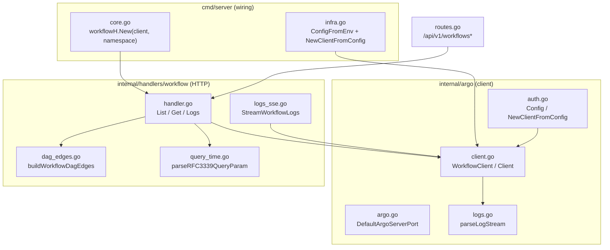
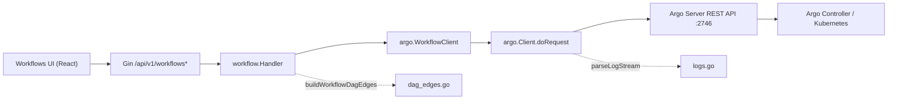
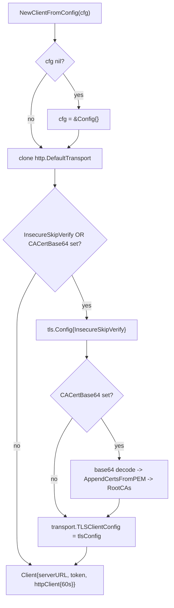
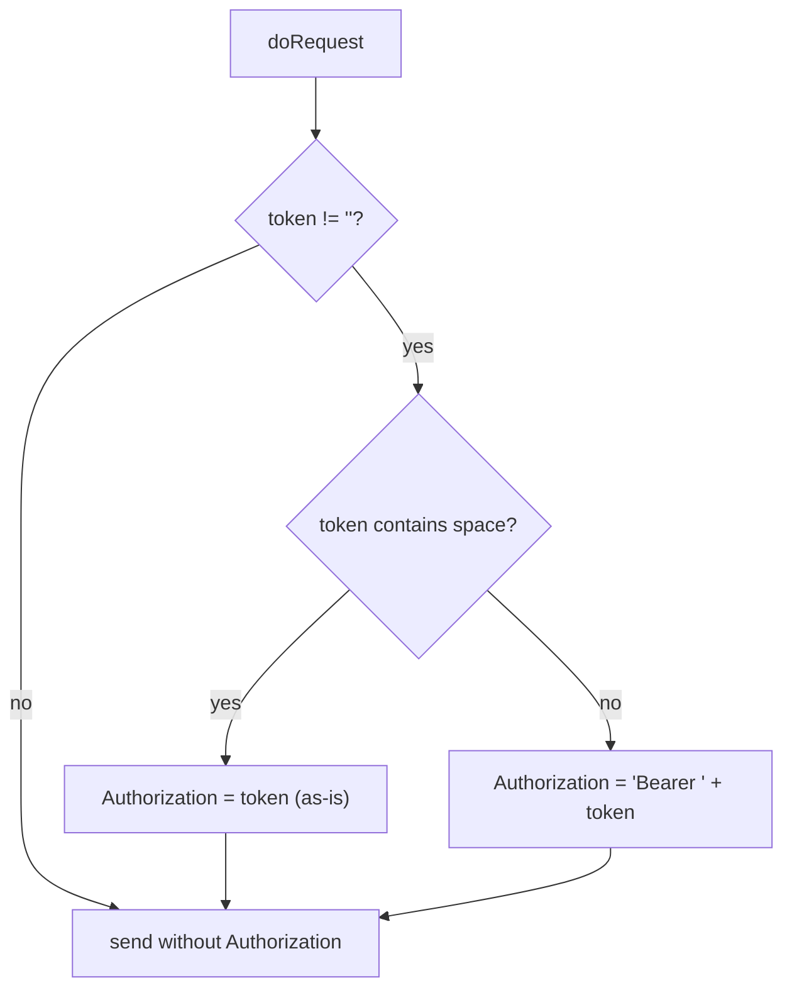
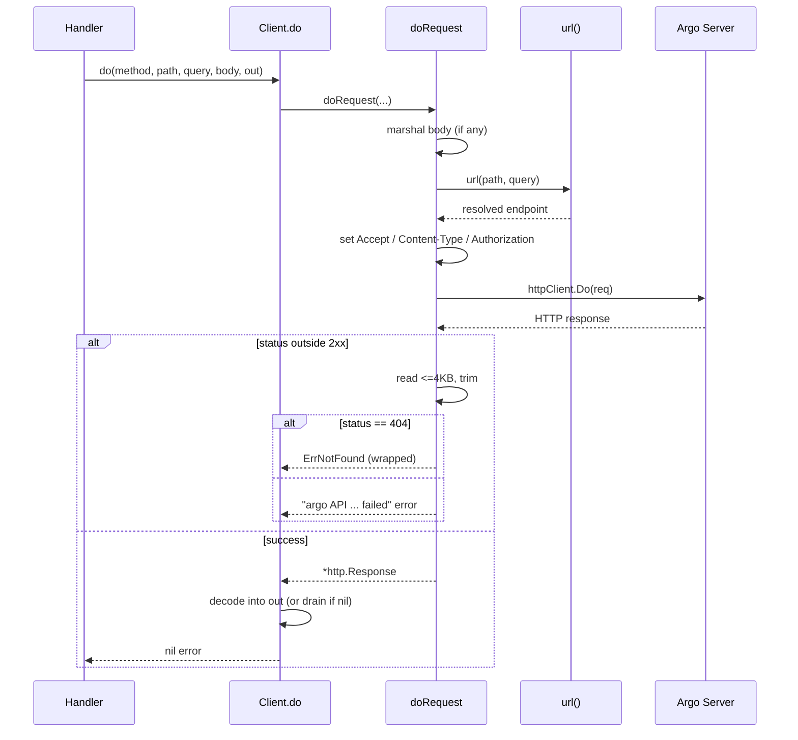
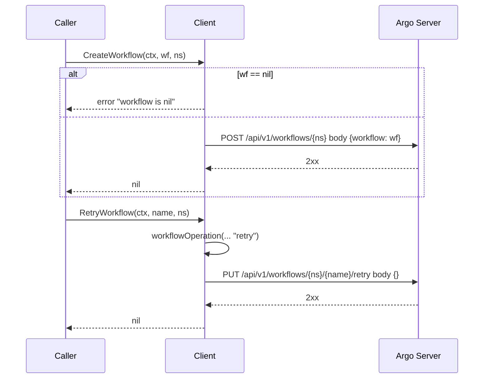
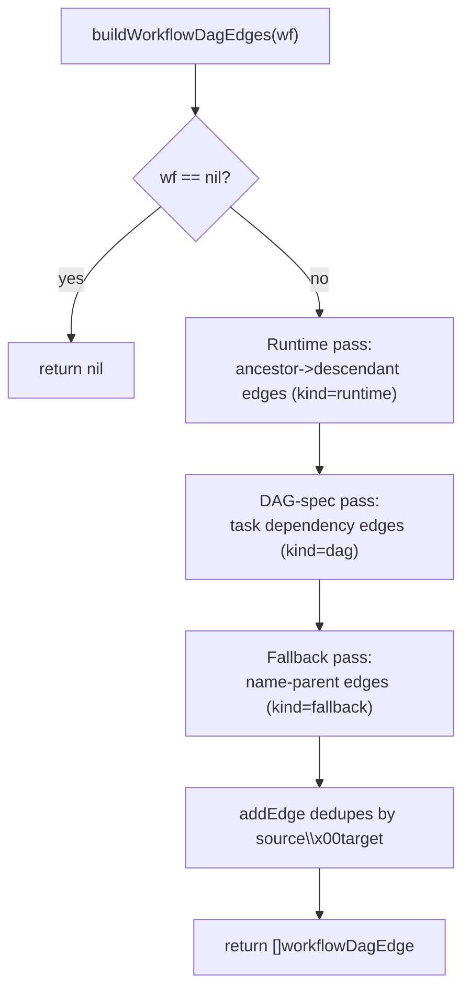
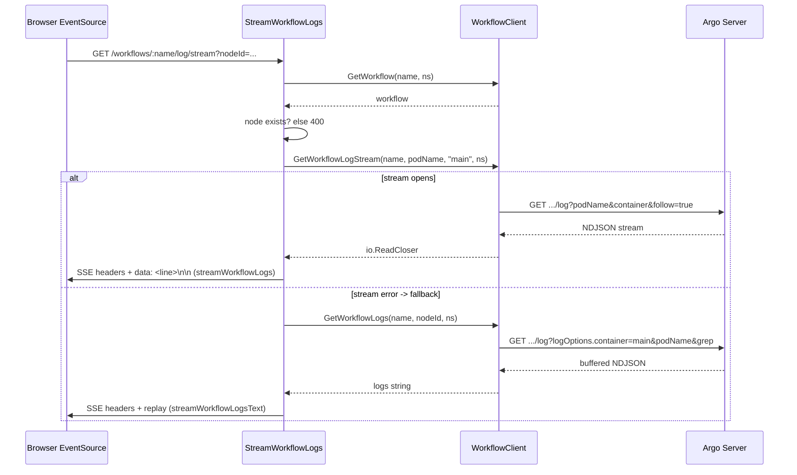
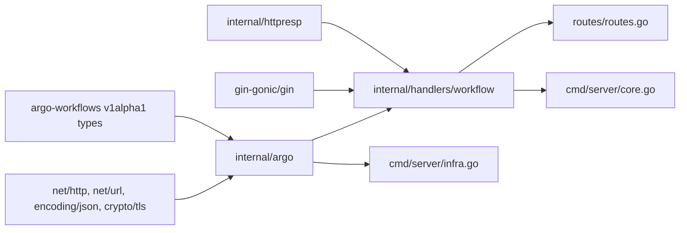

# Argo Integration

<cite>
**Referenced Files in This Document**

- [backend/internal/argo/argo.go](file://backend/internal/argo/argo.go)
- [backend/internal/argo/client.go](file://backend/internal/argo/client.go)
- [backend/internal/argo/auth.go](file://backend/internal/argo/auth.go)
- [backend/internal/argo/logs.go](file://backend/internal/argo/logs.go)
- [backend/internal/handlers/workflow/handler.go](file://backend/internal/handlers/workflow/handler.go)
- [backend/internal/handlers/workflow/dag_edges.go](file://backend/internal/handlers/workflow/dag_edges.go)
- [backend/internal/handlers/workflow/logs_sse.go](file://backend/internal/handlers/workflow/logs_sse.go)
- [backend/internal/handlers/workflow/query_time.go](file://backend/internal/handlers/workflow/query_time.go)
- [backend/cmd/server/infra.go](file://backend/cmd/server/infra.go)
- [backend/cmd/server/core.go](file://backend/cmd/server/core.go)
- [backend/routes/routes.go](file://backend/routes/routes.go)
- [docs/review/argo-integration-research.md](file://docs/review/argo-integration-research.md)
</cite>

## Table of Contents
1. [Introduction](#introduction)
2. [Project Structure](#project-structure)
3. [Core Components](#core-components)
4. [Architecture Overview](#architecture-overview)
5. [Detailed Component Analysis](#detailed-component-analysis)
6. [Dependency Analysis](#dependency-analysis)
7. [Performance Considerations](#performance-considerations)
8. [Troubleshooting Guide](#troubleshooting-guide)
9. [Conclusion](#conclusion)
10. [Appendices](#appendices)

## Introduction

The Argo integration is the backend bridge between cyber-databrew and an
[Argo Workflows](https://argo-workflows.readthedocs.io/) control plane. It
implements **Pattern A** from the integration research — a *full custom UI via a
Go backend proxy* — in which the React frontend never talks to the Argo Server
directly. Instead, the Go backend authenticates to the Argo Server once (with a
bearer token and optional custom TLS trust), wraps the Argo REST API behind a
small typed Go interface, and re-shapes Argo's responses into the lean JSON that
the Workflows UI consumes.

Two distinct layers make up the integration:

- **The Argo client** (`internal/argo`) — a pure HTTP client for the Argo Server
  v1 REST API. It owns connection configuration, authentication, request
  marshalling, error normalization, and the parsing of Argo's NDJSON log stream
  format. It exposes a single `WorkflowClient` interface covering the full
  lifecycle (create, list, get, status, delete, the lifecycle operations, and
  two log-retrieval variants).
- **The workflow read handlers** (`internal/handlers/workflow`) — Gin HTTP
  handlers that back the Workflows UI. They list workflows with server-side
  filtering, return a single workflow's detail (nodes plus a derived DAG edge
  set), serve node logs as plain text, and stream pod logs over Server-Sent
  Events with a non-streaming fallback.

The rationale, competitive context, and the architectural alternatives that were
rejected (iframe embedding, hybrid deep-linking) are documented in the research
note. The chosen approach gives full control of UX, a single backend origin (no
CORS), and unified auth, at the cost of re-implementing list, detail, DAG, and
log views in the platform.

**Section sources**
- [docs/review/argo-integration-research.md](file://docs/review/argo-integration-research.md#L8-L96)
- [backend/internal/argo/argo.go](file://backend/internal/argo/argo.go#L1-L5)
- [backend/internal/argo/client.go](file://backend/internal/argo/client.go#L20-L42)

## Project Structure

The integration spans two packages plus the wiring in `cmd/server` and the route
table. The `internal/argo` package is deliberately small and dependency-light —
it imports the Argo `v1alpha1` types for the workflow object model but otherwise
relies only on the Go standard library. The `internal/handlers/workflow` package
depends on `internal/argo` (via the `WorkflowClient` interface) and on the shared
`httpresp` helper for consistent error envelopes.

**Diagram sources**
- [backend/cmd/server/infra.go](file://backend/cmd/server/infra.go#L128-L133)
- [backend/cmd/server/core.go](file://backend/cmd/server/core.go#L116-L132)
- [backend/internal/argo/auth.go](file://backend/internal/argo/auth.go#L22-L60)
- [backend/internal/argo/client.go](file://backend/internal/argo/client.go#L20-L42)
- [backend/routes/routes.go](file://backend/routes/routes.go#L343-L346)

**Section sources**
- [backend/internal/argo/argo.go](file://backend/internal/argo/argo.go#L1-L5)
- [backend/internal/handlers/workflow/handler.go](file://backend/internal/handlers/workflow/handler.go#L1-L24)

## Core Components

### The `WorkflowClient` interface

`WorkflowClient` is the single abstraction the rest of the backend programs
against. It is implemented by `Client`, and it is what the workflow handlers
depend on (which also makes the handlers trivially testable with a fake). It
covers the full surface the platform needs:

- Lifecycle: `CreateWorkflow`, `DeleteWorkflow`, the operation set
  (`StopWorkflow`, `RetryWorkflow`, `ResubmitWorkflow`, `SuspendWorkflow`,
  `ResumeWorkflow`, `TerminateWorkflow`).
- Reads: `ListWorkflows`, `GetWorkflow`, `GetWorkflowStatus`.
- Logs: `GetWorkflowLogs` (buffered, returns a string) and
  `GetWorkflowLogStream` (live `io.ReadCloser`).

`ErrNotFound` is the sentinel error returned when the Argo Server answers `404`;
handlers test for it with `errors.Is` to map to a `WORKFLOW_NOT_FOUND` response.

**Section sources**
- [backend/internal/argo/client.go](file://backend/internal/argo/client.go#L17-L35)

### The `Client` and its configuration

`Client` holds three fields: the resolved `serverURL`, the bearer `token`, and an
`*http.Client`. It is never constructed directly by callers — `NewClientFromConfig`
builds it from a `Config`, which `ConfigFromEnv` populates from environment
variables. `DefaultArgoServerPort` (`"2746"`) documents the conventional Argo
Server HTTPS port.

**Section sources**
- [backend/internal/argo/client.go](file://backend/internal/argo/client.go#L37-L42)
- [backend/internal/argo/auth.go](file://backend/internal/argo/auth.go#L14-L60)
- [backend/internal/argo/argo.go](file://backend/internal/argo/argo.go#L4-L5)

### The workflow `Handler`

`Handler` wraps a `WorkflowClient` plus a default `namespace`. It exposes the
read endpoints that back the Workflows UI — `ListWorkflows`, `GetWorkflow`,
`GetWorkflowLogs`, and the SSE `StreamWorkflowLogs` — as well as the
lifecycle-operation handlers that all delegate to a shared `workflowOperation`
helper.

**Section sources**
- [backend/internal/handlers/workflow/handler.go](file://backend/internal/handlers/workflow/handler.go#L17-L24)
- [backend/internal/handlers/workflow/handler.go](file://backend/internal/handlers/workflow/handler.go#L251-L269)

## Architecture Overview

The frontend issues requests to `/api/v1/workflows*`. Gin routes them to the
`Handler`, which calls the `WorkflowClient`. The `Client` resolves the target
URL, attaches the bearer token, performs the HTTP call against the Argo Server,
and decodes the response. Workflow detail responses are post-processed locally
(node projection plus DAG edge inference); logs are parsed from Argo's NDJSON
stream format. The frontend therefore sees only platform-shaped JSON and SSE.

The registered read routes are `GET /workflows`, `GET /workflows/:name/logs`, and
`GET /workflows/:name`. Note that `:name/logs` is registered *before* `:name` so
that Gin matches the more specific suffix first.

**Diagram sources**
- [backend/routes/routes.go](file://backend/routes/routes.go#L343-L346)
- [backend/internal/handlers/workflow/handler.go](file://backend/internal/handlers/workflow/handler.go#L27-L213)
- [backend/internal/argo/client.go](file://backend/internal/argo/client.go#L164-L235)

**Section sources**
- [backend/routes/routes.go](file://backend/routes/routes.go#L343-L346)
- [backend/cmd/server/core.go](file://backend/cmd/server/core.go#L116-L132)

## Detailed Component Analysis

### Authentication and client construction

`ConfigFromEnv` reads four variables: `ARGO_SERVER_URL`, a token from the first
non-empty of `ARGO_AUTH_TOKEN` / `ARGO_TOKEN`, `ARGO_INSECURE_SKIP_VERIFY`
(parsed as a bool), and `ARGO_CA_CERT_BASE64` (a base64-encoded CA PEM bundle).
`NewClientFromConfig` then constructs the transport:

- The base transport is a clone of `http.DefaultTransport`.
- A custom `tls.Config` is installed **only** when `InsecureSkipVerify` is set or
  a CA cert is provided. When a CA cert is present, it is base64-decoded and
  appended to a pool seeded from the system roots (falling back to a fresh pool),
  and that pool becomes `RootCAs`. Decode or append failures are silently ignored
  — the client falls back to default verification.
- The server URL is trimmed of whitespace and any trailing slash; the token is
  trimmed; the HTTP client is given a fixed **60-second timeout**.

At request time `doRequest` attaches the credential via `authorizationHeader`,
which prepends `"Bearer "` unless the token already contains a space (allowing a
pre-formatted scheme to pass through unchanged). The header is only set when the
token is non-empty.

**Diagram sources**
- [backend/internal/argo/auth.go](file://backend/internal/argo/auth.go#L32-L60)
- [backend/internal/argo/client.go](file://backend/internal/argo/client.go#L210-L212)
- [backend/internal/argo/client.go](file://backend/internal/argo/client.go#L261-L266)

**Section sources**
- [backend/internal/argo/auth.go](file://backend/internal/argo/auth.go#L14-L78)
- [backend/internal/argo/client.go](file://backend/internal/argo/client.go#L237-L266)

### Request execution, URL resolution, and error normalization

All calls funnel through `doRequest`. It guards against a nil client and an empty
server URL, JSON-marshals the body when present, resolves the endpoint via the
`url` helper, builds a context-bound request, sets `Accept: application/json`
(and `Content-Type` when there is a body), attaches auth, and executes against
`c.httpClient` (falling back to `http.DefaultClient` if none is set).

The `url` helper parses the configured base and the API path independently, then
uses `base.ResolveReference(pathURL)` to combine them, encoding query values only
when present. Paths are produced by two small builders: `workflowPath(namespace)`
yields `/api/v1/workflows/{namespace}` with the namespace path-escaped, and
`workflowNamePath(namespace, name)` appends the path-escaped name.

Response handling is centralized: any status outside the 2xx range is treated as
an error. The body is read up to a 4 KB limit, trimmed, and used as the message
(falling back to the HTTP status text when empty). A `404` is wrapped as
`ErrNotFound`; everything else becomes a descriptive `argo API <method> <path>
failed` error. The `do` wrapper decodes a successful body into `out`, or drains
and discards it when `out` is nil.

**Diagram sources**
- [backend/internal/argo/client.go](file://backend/internal/argo/client.go#L164-L235)
- [backend/internal/argo/client.go](file://backend/internal/argo/client.go#L237-L259)

**Section sources**
- [backend/internal/argo/client.go](file://backend/internal/argo/client.go#L164-L266)

### Workflow submission and lifecycle operations

`CreateWorkflow` rejects a nil workflow and otherwise `POST`s to
`workflowPath(namespace)` with a body of `{"workflow": wf}`, matching the Argo
Server `WorkflowCreateRequest` shape. `DeleteWorkflow` issues a `DELETE` against
`workflowNamePath`. `StopWorkflow` `PUT`s to `.../stop` with an empty JSON body;
the remaining operations (`retry`, `resubmit`, `suspend`, `resume`, `terminate`)
all route through the private `workflowOperation` helper, which `PUT`s to
`workflowNamePath + "/" + operation` with an empty body. `GetWorkflowStatus` is a
thin convenience that fetches the workflow and returns `Status.Phase`, returning
`WorkflowUnknown` on error.

**Diagram sources**
- [backend/internal/argo/client.go](file://backend/internal/argo/client.go#L44-L123)

**Section sources**
- [backend/internal/argo/client.go](file://backend/internal/argo/client.go#L44-L123)

### Listing workflows with server-side filtering

`ListWorkflows` on the client sets `listOptions.labelSelector` only when a
selector is supplied and decodes into a `wfv1.WorkflowList`, returning `Items`.
The handler, however, currently passes an **empty** selector and performs all
filtering in Go after fetching the namespace's workflows. The handler reads four
query inputs:

- `name` — case-insensitive substring match against the workflow name.
- `status` — exact match against `Status.Phase`.
- `label` (repeatable) — each `key=value` pair is parsed via `strings.Cut`;
  malformed or empty pairs are skipped, and every remaining pair must match a
  label on the workflow.
- `createdAfter` / `finishedBefore` — RFC3339 timestamps parsed by
  `parseRFC3339QueryParam`; a parse failure writes a `400` and aborts.

For `finishedBefore`, workflows that have not finished are excluded entirely. The
surviving workflows are projected into a compact `item` shape carrying `name`,
`status`, `nodeCount` (length of `Status.Nodes`), `createdAt`, optional
`finishedAt`, and `labels`. Timestamps are formatted as
`2006-01-02T15:04:05Z`. The response is `{"items": [...]}`.

**Section sources**
- [backend/internal/argo/client.go](file://backend/internal/argo/client.go#L68-L80)
- [backend/internal/handlers/workflow/handler.go](file://backend/internal/handlers/workflow/handler.go#L27-L117)
- [backend/internal/handlers/workflow/query_time.go](file://backend/internal/handlers/workflow/query_time.go#L12-L26)

### Workflow detail and DAG edge inference

`GetWorkflow` (handler) requires a non-empty `:name`, calls the client's
`GetWorkflow`, and maps `ErrNotFound` to `WORKFLOW_NOT_FOUND` (404), other errors
to a 500. On success it projects each `Status.Nodes` entry into a `nodeItem`
carrying id, name, display name, type, template name, phase, optional message,
inputs/outputs, resources duration, host node, progress, estimated duration,
children, and optional started/finished timestamps. The top-level response adds
`message`, `edges` (from `buildWorkflowDagEdges`), `createdAt`, `labels`,
`estimatedDuration`, `progress`, and an optional `finishedAt`.

`buildWorkflowDagEdges` reconstructs a renderable DAG from the runtime node graph,
because Argo's raw `Children` links include hidden boundary/retry nodes that the
UI should not draw. It builds edges from three sources, de-duplicated by a
`source\x00target` key via `addEdge` (which also drops self-edges and empty
endpoints):

1. **Runtime edges** (`kind: "runtime"`) — for each node's children, it collapses
   the source to its `nearestVisibleAncestorID` and the child to its
   `nearestVisibleDescendantID`, skipping invisible intermediates.
2. **DAG-spec edges** (`kind: "dag"`) — from each template's `DAG.Tasks`
   dependencies, mapped to visible node IDs via `workflowTaskVisibleNodeIDs`
   (which indexes by display name, template name, and the trailing name segment).
3. **Fallback edges** (`kind: "fallback"`) — for each displayable node, it walks
   up the dotted name hierarchy to the `nearestVisibleNameParentID`.

`isWorkflowDagDisplayableNode` is the visibility predicate: a node is shown when
its phase is `Skipped`/`Omitted` or its type is `pod`/`template`, and it is not a
synthetic root-DAG node.

**Diagram sources**
- [backend/internal/handlers/workflow/dag_edges.go](file://backend/internal/handlers/workflow/dag_edges.go#L17-L88)
- [backend/internal/handlers/workflow/dag_edges.go](file://backend/internal/handlers/workflow/dag_edges.go#L99-L115)

**Section sources**
- [backend/internal/handlers/workflow/handler.go](file://backend/internal/handlers/workflow/handler.go#L119-L198)
- [backend/internal/handlers/workflow/dag_edges.go](file://backend/internal/handlers/workflow/dag_edges.go#L1-L216)

### Log retrieval — buffered and streaming

The client offers two log paths against the Argo Server `.../log` endpoint:

- `GetWorkflowLogs` sets `logOptions.container=main` and `podName=<nodeId>`, and
  when `nodeId` is non-empty also sets a `grep=<nodeId>` filter. It reads the full
  response and parses it via `parseLogStream`, returning a single string.
- `GetWorkflowLogStream` sets `podName`, `container`, and `follow=true`, then
  returns the raw `resp.Body` as an `io.ReadCloser` for live consumption — the
  caller owns closing it.

`parseLogStream` handles Argo's NDJSON log envelope. It trims the input,
returning early on empty. It first tries `parseLogJSONValues`, which streams
`json.Decoder` over concatenated JSON values; if any value decodes it returns the
accumulated content (a mid-stream decode error returns what was parsed so far
without surfacing the error). Otherwise it falls back to `parseLogLines`, which
scans line-by-line (with a 10 MB max buffer) and `json.Unmarshal`s each non-empty
line, surfacing a decode error here. Both paths feed `appendLogEntry`, which skips
empty content and prefixes each line with the pod name when present. Each log
envelope is `{"result": {"content": ..., "podName": ...}}`.

The SSE handler `StreamWorkflowLogs` (in `logs_sse.go`) requires `:name` and a
`nodeId` query, fetches the workflow, verifies the node exists (else 400), and
opens `GetWorkflowLogStream` using the node id as the pod name and the
`main` container. On a successful stream it sets SSE headers
(`Content-Type: text/event-stream`, `Cache-Control: no-cache`,
`Connection: keep-alive`, `X-Accel-Buffering: no`) and pumps via
`streamWorkflowLogs`. If opening the live stream fails it **falls back** to the
buffered `GetWorkflowLogs` and replays it over the same SSE framing via
`streamWorkflowLogsText`. The line extractor `extractLogLine` strips an optional
`data:` prefix, unmarshals the JSON envelope (passing the raw line through if it
is not JSON), skips empty content, and trims a trailing newline;
`writeWorkflowLogSSE` writes each line as `data: <line>\n\n`. The pump aborts when
the request context is cancelled.

The buffered `GET /workflows/:name/logs` endpoint (`GetWorkflowLogs` handler)
requires both `:name` and a `nodeId` query, returning `{"logs": "..."}` as plain
JSON (not SSE).

**Diagram sources**
- [backend/internal/handlers/workflow/logs_sse.go](file://backend/internal/handlers/workflow/logs_sse.go#L100-L162)
- [backend/internal/argo/client.go](file://backend/internal/argo/client.go#L125-L162)

**Section sources**
- [backend/internal/argo/client.go](file://backend/internal/argo/client.go#L125-L162)
- [backend/internal/argo/logs.go](file://backend/internal/argo/logs.go#L12-L85)
- [backend/internal/handlers/workflow/logs_sse.go](file://backend/internal/handlers/workflow/logs_sse.go#L24-L162)

### Namespace resolution

Every handler resolves the effective namespace through `namespaceFor`, which
prefers a per-request `namespace` set in the Gin context (e.g. by upstream
middleware/multi-tenancy) and falls back to the handler's default namespace. This
matches the research note's *single shared namespace with label-based isolation*
recommendation, while leaving room for per-tenant namespace override.

**Section sources**
- [backend/internal/handlers/workflow/handler.go](file://backend/internal/handlers/workflow/handler.go#L264-L269)
- [docs/review/argo-integration-research.md](file://docs/review/argo-integration-research.md#L266-L278)

## Dependency Analysis

The client depends only on the standard library plus the Argo `v1alpha1` types
for the workflow object model. The handlers depend on the `argo` package through
the `WorkflowClient` interface, on `gin` for HTTP, and on `httpresp` for error
envelopes. Wiring happens in `cmd/server`: `infra.go` builds the client from env,
and `core.go` constructs the handler with the client and the configured
`ArgoWorkflowsNamespace`. The route table exposes the read endpoints.

**Diagram sources**
- [backend/internal/argo/client.go](file://backend/internal/argo/client.go#L1-L15)
- [backend/internal/handlers/workflow/handler.go](file://backend/internal/handlers/workflow/handler.go#L1-L15)
- [backend/cmd/server/infra.go](file://backend/cmd/server/infra.go#L128-L133)

**Section sources**
- [backend/cmd/server/core.go](file://backend/cmd/server/core.go#L116-L132)
- [backend/routes/routes.go](file://backend/routes/routes.go#L343-L346)

## Performance Considerations

- **Client-side filtering of the full list.** `ListWorkflows` is called with an
  empty label selector, so the entire namespace is fetched and filtered in Go on
  every list request. The research note flags exactly this risk (etcd object
  size, slow listing) and recommends pushing `labelSelector` to the server and
  using the workflow archive for history. Today filtering is in-process.
- **Fixed 60-second HTTP timeout.** Suitable for list/detail/buffered-log calls.
  The live log stream uses the same client and timeout, so very long-lived
  follow streams are bounded by it.
- **Log buffer ceiling.** Both `parseLogLines` and `streamWorkflowLogs` cap the
  scanner at a 10 MB line buffer, preventing unbounded memory growth on
  pathological single-line payloads.
- **DAG edge computation.** `buildWorkflowDagEdges` sorts node IDs on each pass
  and performs ancestor/descendant walks; cost grows with node count but is
  bounded per request and de-duplicated.
- **SSE buffering.** The `X-Accel-Buffering: no` header disables proxy buffering
  so log lines reach the browser promptly; lines are emitted as compact
  single-line `data:` frames, matching the research note's SSE guidance.

**Section sources**
- [backend/internal/handlers/workflow/handler.go](file://backend/internal/handlers/workflow/handler.go#L49-L53)
- [backend/internal/argo/auth.go](file://backend/internal/argo/auth.go#L58-L58)
- [backend/internal/handlers/workflow/logs_sse.go](file://backend/internal/handlers/workflow/logs_sse.go#L54-L55)
- [docs/review/argo-integration-research.md](file://docs/review/argo-integration-research.md#L317-L352)

## Troubleshooting Guide

- **`argo server URL is empty` / nil client errors.** `doRequest` returns these
  before any HTTP call when the client is nil or `ARGO_SERVER_URL` is unset.
  Confirm `ARGO_SERVER_URL` is exported; `infra.go` logs `server_url_set` at
  startup to indicate whether it was configured.
- **`401`/`403` from Argo.** The bearer token is missing or wrong. Set
  `ARGO_AUTH_TOKEN` (or `ARGO_TOKEN`). If you pass a pre-formatted scheme, include
  a space so `authorizationHeader` passes it through verbatim; otherwise it is
  prefixed with `Bearer `.
- **TLS verification failures against a private endpoint.** Provide the CA bundle
  via `ARGO_CA_CERT_BASE64` (base64-encoded PEM), or, for development only, set
  `ARGO_INSECURE_SKIP_VERIFY=true`. A malformed CA bundle is silently ignored and
  the client falls back to default verification, which can masquerade as an auth
  problem.
- **`WORKFLOW_NOT_FOUND` (404).** The client wraps Argo's `404` as `ErrNotFound`,
  which `GetWorkflow` maps to this code. Check the workflow name and namespace —
  the effective namespace is the request-context override or the configured
  default.
- **`workflow node not found` (400) on log stream.** `StreamWorkflowLogs`
  verifies `nodeId` exists in `Status.Nodes` before streaming. A stale node id
  from the UI triggers this.
- **Empty or garbled logs.** Argo may emit either concatenated JSON values or
  newline-delimited JSON; `parseLogStream` tries both. Non-JSON lines in the SSE
  path are passed through raw, so unexpected output usually means the upstream log
  format changed.
- **Log stream falls back to a one-shot replay.** When `GetWorkflowLogStream`
  fails, the handler silently switches to the buffered `GetWorkflowLogs` and
  replays it over SSE — the connection looks like SSE but does not follow new
  output.

**Section sources**
- [backend/internal/argo/client.go](file://backend/internal/argo/client.go#L181-L235)
- [backend/internal/argo/auth.go](file://backend/internal/argo/auth.go#L38-L53)
- [backend/internal/handlers/workflow/handler.go](file://backend/internal/handlers/workflow/handler.go#L120-L134)
- [backend/internal/handlers/workflow/logs_sse.go](file://backend/internal/handlers/workflow/logs_sse.go#L110-L151)

## Conclusion

The Argo integration cleanly separates a dependency-light HTTP client from the
HTTP handlers that shape Argo data for the UI. The client centralizes auth, URL
resolution, error normalization, and log parsing behind one `WorkflowClient`
interface; the handlers add server-side list filtering, a derived DAG edge model,
and dual-mode log delivery (buffered JSON plus SSE with a graceful fallback). The
design realizes the recommended *full custom UI via backend proxy* pattern,
keeping the Argo Server reachable only through the platform backend. The most
notable area for future tightening is pushing list filtering to the server via
`labelSelector` and the workflow archive, as called out in the research note.

## Appendices

### Registered read endpoints

| Method | Path | Handler | Notes |
|--------|------|---------|-------|
| GET | `/api/v1/workflows` | `ListWorkflows` | Filters: `name`, `status`, `label` (repeatable), `createdAfter`, `finishedBefore` |
| GET | `/api/v1/workflows/:name/logs` | `GetWorkflowLogs` | Requires `nodeId`; returns `{"logs": ...}` (registered before `:name`) |
| GET | `/api/v1/workflows/:name` | `GetWorkflow` | Returns nodes + derived `edges`; `404` -> `WORKFLOW_NOT_FOUND` |

The `StreamWorkflowLogs` SSE handler exists in `logs_sse.go` for
`GET /api/v1/workflows/:name/log/stream?nodeId=xxx`; the lifecycle operation and
SSE routes are not wired in the read-only route block above.

**Section sources**
- [backend/routes/routes.go](file://backend/routes/routes.go#L343-L346)
- [backend/internal/handlers/workflow/logs_sse.go](file://backend/internal/handlers/workflow/logs_sse.go#L98-L100)

### Argo client configuration (environment variables)

| Variable | Field | Meaning |
|----------|-------|---------|
| `ARGO_SERVER_URL` | `ServerURL` | Argo Server base URL (trailing slash trimmed) |
| `ARGO_AUTH_TOKEN` / `ARGO_TOKEN` | `Token` | Bearer token (first non-empty wins) |
| `ARGO_INSECURE_SKIP_VERIFY` | `InsecureSkipVerify` | Disable TLS verification (parsed as bool) |
| `ARGO_CA_CERT_BASE64` | `CACertBase64` | Base64-encoded CA PEM appended to the trust pool |

`DefaultArgoServerPort` is `"2746"`.

**Section sources**
- [backend/internal/argo/auth.go](file://backend/internal/argo/auth.go#L14-L30)
- [backend/internal/argo/argo.go](file://backend/internal/argo/argo.go#L4-L5)

### `WorkflowClient` interface (method summary)

| Method | Argo call | Notes |
|--------|-----------|-------|
| `CreateWorkflow` | `POST /workflows/{ns}` | Body `{workflow: wf}` |
| `GetWorkflow` | `GET /workflows/{ns}/{name}` | Decodes full `wfv1.Workflow` |
| `GetWorkflowStatus` | (via `GetWorkflow`) | Returns `Status.Phase` |
| `ListWorkflows` | `GET /workflows/{ns}` | Optional `listOptions.labelSelector` |
| `DeleteWorkflow` | `DELETE /workflows/{ns}/{name}` | |
| `StopWorkflow` | `PUT .../stop` | Empty body |
| `RetryWorkflow` / `ResubmitWorkflow` / `SuspendWorkflow` / `ResumeWorkflow` / `TerminateWorkflow` | `PUT .../<op>` | Via `workflowOperation` |
| `GetWorkflowLogs` | `GET .../log` | Buffered; `logOptions.container=main`, `podName`, `grep` |
| `GetWorkflowLogStream` | `GET .../log?follow=true` | Live `io.ReadCloser` |

**Section sources**
- [backend/internal/argo/client.go](file://backend/internal/argo/client.go#L20-L162)
