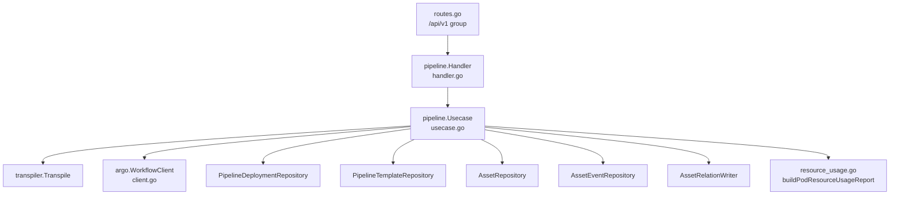
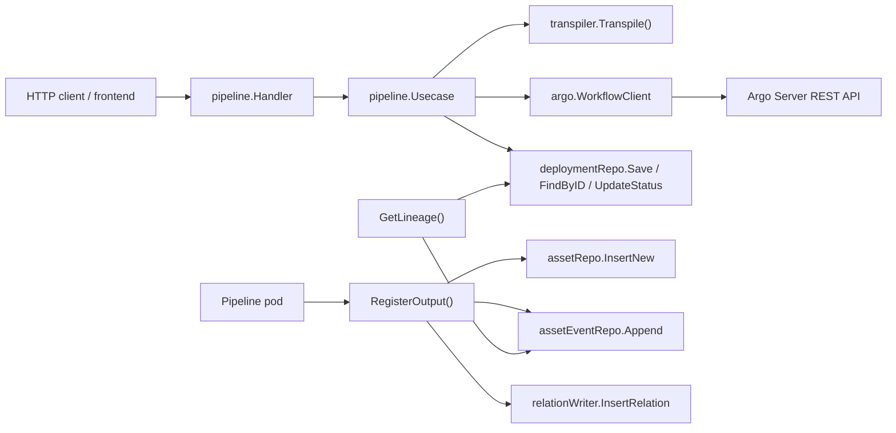
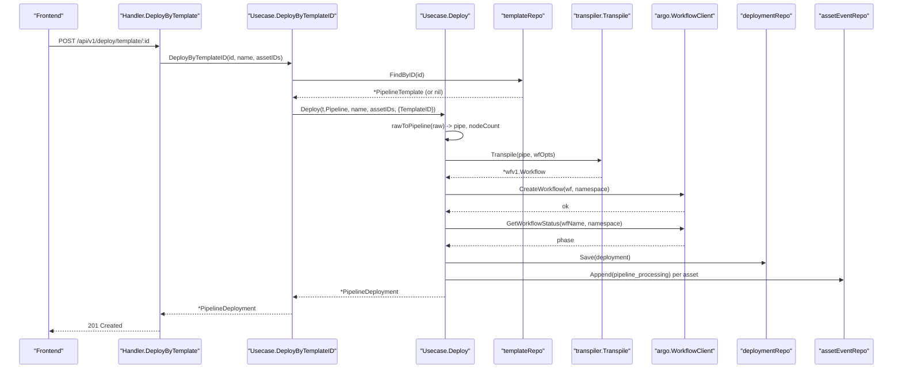
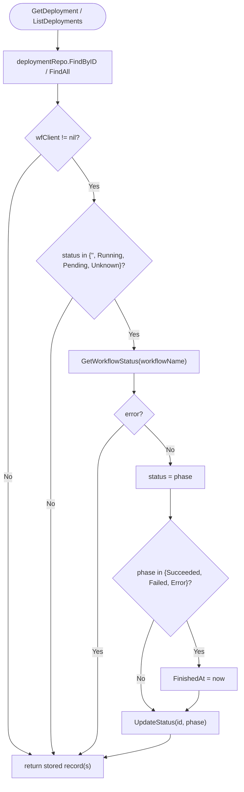
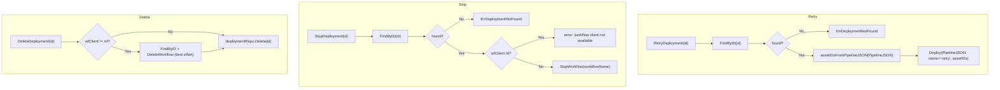
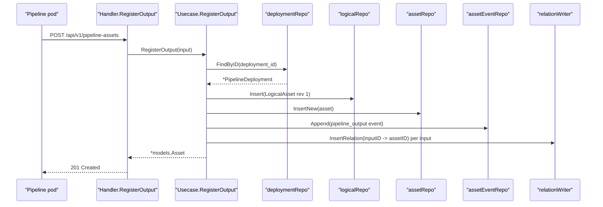
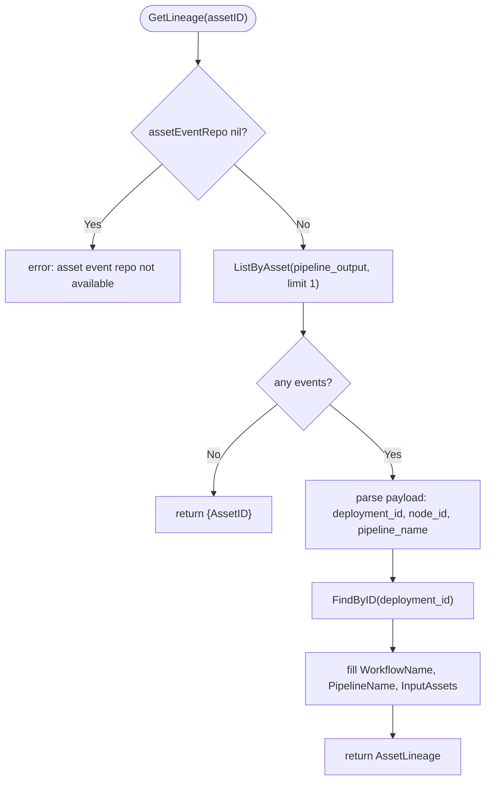
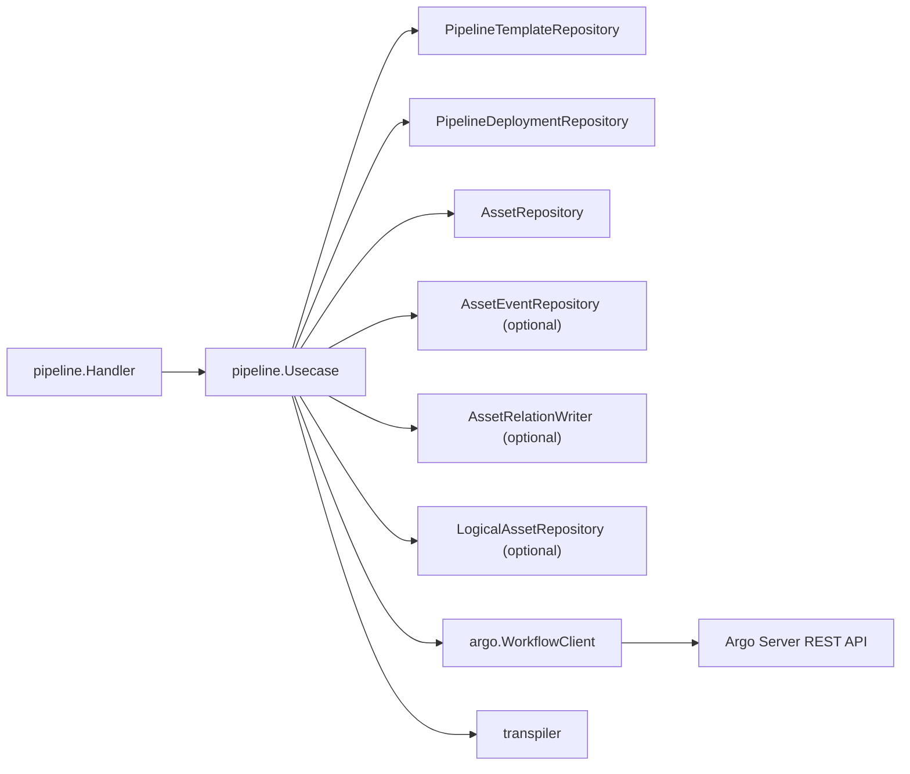

# Deployments

<cite>
**Referenced Files in This Document**

- [backend/internal/handlers/pipeline/handler.go](file://backend/internal/handlers/pipeline/handler.go)
- [backend/internal/usecase/pipeline/usecase.go](file://backend/internal/usecase/pipeline/usecase.go)
- [backend/internal/usecase/pipeline/resource_usage.go](file://backend/internal/usecase/pipeline/resource_usage.go)
- [backend/internal/usecase/pipeline/versioning.go](file://backend/internal/usecase/pipeline/versioning.go)
- [backend/internal/argo/client.go](file://backend/internal/argo/client.go)
- [backend/internal/models/pipeline.go](file://backend/internal/models/pipeline.go)
- [backend/routes/routes.go](file://backend/routes/routes.go)
</cite>

## Table of Contents
1. [Introduction](#introduction)
2. [Project Structure](#project-structure)
3. [Core Components](#core-components)
4. [Architecture Overview](#architecture-overview)
5. [Detailed Component Analysis](#detailed-component-analysis)
6. [Dependency Analysis](#dependency-analysis)
7. [Performance Considerations](#performance-considerations)
8. [Troubleshooting Guide](#troubleshooting-guide)
9. [Conclusion](#conclusion)
10. [Appendices](#appendices)

## Introduction

A **deployment** in cyber-databrew is a single run of a pipeline definition that
has been transpiled into an Argo Workflow and submitted to the workflow engine.
Where a *template* (`PipelineTemplate`) is a reusable, versioned pipeline
definition, a *deployment* (`PipelineDeployment`) is the concrete execution
record: it captures the target workflow name, the current run status, the
rendered Argo manifest, a snapshot of the pipeline JSON, and (optionally) the
template it originated from.

The deployment subsystem is responsible for the full lifecycle of a pipeline
run. It accepts a pipeline either inline (`POST /api/v1/deploy`) or by reference
to a stored template (`POST /api/v1/deploy/template/:id`); transpiles it into an
Argo Workflow; submits the workflow to the Argo Server; tracks its phase by
polling Argo on read; and exposes lifecycle operations to retry, stop, delete,
and persist a deployment back into a template. It also closes the data loop:
pipeline containers call back to register their output assets
(`POST /api/v1/pipeline-assets`), and the subsystem records `asset_events` and
`asset_relations` so that the provenance of any produced asset can later be
queried via `GET /api/v1/assets/:id/pipeline-lineage`.

The primary consumers are the pipeline-builder frontend (which deploys and polls
deployments), the running pipeline pods (which call back to register outputs),
and operators inspecting resource usage or lineage of derived assets.

**Section sources**
- [backend/internal/handlers/pipeline/handler.go](file://backend/internal/handlers/pipeline/handler.go#L110-L163)
- [backend/internal/usecase/pipeline/usecase.go](file://backend/internal/usecase/pipeline/usecase.go#L32-L47)
- [backend/internal/models/pipeline.go](file://backend/internal/models/pipeline.go#L18-L33)

## Project Structure

The deployment feature is split across three layers — HTTP routing, the gin
handler, and the usecase — plus the Argo REST client that the usecase delegates
to for workflow operations.

- **`backend/routes/routes.go`** — wires every deployment endpoint onto the
  `/api/v1` group, mapping each route to a `Handler` method.
- **`backend/internal/handlers/pipeline/handler.go`** — the gin `Handler`.
  It binds and validates request bodies/params, calls the usecase, and maps
  usecase sentinel errors to HTTP status codes via `mapDeployError`.
- **`backend/internal/usecase/pipeline/usecase.go`** — the `Usecase`
  orchestrator. It owns deploy/transpile/submit, status refresh, retry/stop/
  delete, output registration, lineage, and template diff/save logic.
- **`backend/internal/usecase/pipeline/resource_usage.go`** — builds the
  per-pod resource-usage report from a live Argo `Workflow` plus the stored
  manifest.
- **`backend/internal/usecase/pipeline/versioning.go`** — seeds a
  `logical_assets` revision row when a pipeline output asset is registered.
- **`backend/internal/argo/client.go`** — the `WorkflowClient` interface and the
  REST `Client` implementation that talks to the Argo Server.
- **`backend/internal/models/pipeline.go`** — the `PipelineTemplate` and
  `PipelineDeployment` persistence models.

**Diagram sources**
- [backend/routes/routes.go](file://backend/routes/routes.go#L315-L332)
- [backend/internal/usecase/pipeline/usecase.go](file://backend/internal/usecase/pipeline/usecase.go#L32-L85)

**Section sources**
- [backend/routes/routes.go](file://backend/routes/routes.go#L315-L332)
- [backend/internal/usecase/pipeline/usecase.go](file://backend/internal/usecase/pipeline/usecase.go#L1-L85)
- [backend/internal/usecase/pipeline/resource_usage.go](file://backend/internal/usecase/pipeline/resource_usage.go#L1-L47)
- [backend/internal/usecase/pipeline/versioning.go](file://backend/internal/usecase/pipeline/versioning.go#L1-L25)

## Core Components

### The `Usecase` orchestrator

`Usecase` is the central type. It is constructed by `New` with the template
repository, deployment repository, asset repository, an `argo.WorkflowClient`,
and the target Kubernetes namespace. Three optional collaborators are wired in
after construction via setters: `SetAssetEventRepo` (lineage events),
`SetRelationWriter` (input→output asset relations), and `SetLogicalAssetRepo`
(logical-asset revision seeding for pipeline outputs). Each optional collaborator
is nil-guarded at every call site, so the subsystem degrades gracefully when a
dependency is not configured.

### Sentinel errors

The usecase defines a fixed set of sentinel errors that the handler layer
inspects with `errors.Is` to choose an HTTP status:

- `ErrTemplateNotFound`
- `ErrDeploymentNotFound`
- `ErrAssetNotFound`
- `ErrInvalidArgument`
- `ErrWorkflowUnavailable` — returned when the Argo client is nil or its server
  URL is empty.

### The `PipelineDeployment` model

A deployment record carries: `ID`, optional `TemplateID`, `PipelineName`,
`WorkflowName`, `Status`, `NodeCount`, optional `Manifest` (rendered Argo YAML),
`PipelineJSON` (the pipeline snapshot, which also holds embedded
`_input_asset_ids` for lineage), `CreatedAt`, `UpdatedAt`, and optional
`FinishedAt`.

### The `WorkflowClient` interface

The usecase never speaks HTTP directly. It depends on the `argo.WorkflowClient`
interface, whose deployment-relevant methods are `CreateWorkflow`,
`GetWorkflowStatus`, `GetWorkflow`, `DeleteWorkflow`, and `StopWorkflow`. The
concrete `Client` implements these against the Argo Server REST API.

**Section sources**
- [backend/internal/usecase/pipeline/usecase.go](file://backend/internal/usecase/pipeline/usecase.go#L23-L85)
- [backend/internal/models/pipeline.go](file://backend/internal/models/pipeline.go#L18-L33)
- [backend/internal/argo/client.go](file://backend/internal/argo/client.go#L20-L35)

## Architecture Overview

A deployment request flows from the gin router into the handler, which validates
input and calls the usecase. The usecase marshals the pipeline, transpiles it to
an Argo `Workflow`, optionally validates referenced asset IDs, submits the
workflow to Argo, persists the deployment record, and emits side-effect events.
Status is not pushed by Argo; instead it is *pulled* lazily on every read
(`GetDeployment` / `ListDeployments`) and written back to the repository.

**Diagram sources**
- [backend/internal/usecase/pipeline/usecase.go](file://backend/internal/usecase/pipeline/usecase.go#L137-L303)
- [backend/internal/usecase/pipeline/usecase.go](file://backend/internal/usecase/pipeline/usecase.go#L452-L591)

**Section sources**
- [backend/internal/usecase/pipeline/usecase.go](file://backend/internal/usecase/pipeline/usecase.go#L132-L303)

## Detailed Component Analysis

### Deploying a pipeline (inline and by template)

There are two entry points. `Deploy` (`POST /api/v1/deploy`) accepts a raw
pipeline map, an optional `name` override, and an optional list of `asset_ids`.
`DeployByTemplateID` (`POST /api/v1/deploy/template/:id`) loads a stored template
by ID, defaults the name to the template's name when none is supplied, and then
delegates to `Deploy`, passing the originating template ID through
`DeployOptions.TemplateID` so the resulting deployment records its lineage to the
template.

The `Deploy` handler additionally parses a `dryRun` query parameter. When
`dryRun=true`, the usecase transpiles and renders the manifest but does **not**
submit to Argo or persist anything; it returns a synthetic deployment with status
`"Preview"` and HTTP `200`. A real deployment returns HTTP `201`.

Inside `Deploy`, the sequence is:

1. Marshal the pipeline map to JSON and parse it into a `transpiler.Pipeline`
   via `rawToPipeline`, which also yields the node count.
2. Compute the workflow name (`pipeName + "-" + first 6 chars of a new UUID`) and
   a fresh deployment UUID.
3. If `asset_ids` are present and an `assetRepo` is configured, validate that
   every asset exists; a missing asset yields `ErrAssetNotFound`.
4. Build workflow-level params and global env vars. `PIPELINE_DEPLOYMENT_ID` is
   always injected. When assets are present, `ASSET_IDS`, `ASSET_COUNT`, and per-
   asset `ASSET_<i>_ID` / `ASSET_<i>_STORAGE_URI` / `ASSET_<i>_TYPE` env vars are
   added, plus an `asset_ids` workflow param.
5. Transpile to an Argo `Workflow` with a 3600-second TTL after completion, then
   marshal it to a YAML manifest string.
6. If not a dry run: fail with `ErrWorkflowUnavailable` when the client is nil;
   otherwise `CreateWorkflow`, then `GetWorkflowStatus` to seed the initial
   status (defaulting to `"Pending"`).
7. Persist the deployment. Embed `_input_asset_ids` into the pipeline JSON
   snapshot for later lineage queries, and append a `pipeline_processing`
   `asset_event` per input asset.

**Diagram sources**
- [backend/internal/handlers/pipeline/handler.go](file://backend/internal/handlers/pipeline/handler.go#L143-L163)
- [backend/internal/usecase/pipeline/usecase.go](file://backend/internal/usecase/pipeline/usecase.go#L137-L318)

**Section sources**
- [backend/internal/handlers/pipeline/handler.go](file://backend/internal/handlers/pipeline/handler.go#L110-L163)
- [backend/internal/usecase/pipeline/usecase.go](file://backend/internal/usecase/pipeline/usecase.go#L132-L318)

### Deployment tracking and lazy status refresh

Argo is the source of truth for run status, but the deployment subsystem does not
subscribe to events. Instead, both `GetDeployment` and `ListDeployments` refresh
status on read for deployments whose stored status is considered "active" — empty,
`Running`, `Pending`, or `Unknown`. For each such deployment the usecase calls
`GetWorkflowStatus`; on success it overwrites the in-memory status, sets
`FinishedAt` when the phase is terminal (`Succeeded`, `Failed`, or `Error`), and
persists the new status via `UpdateStatus`.

`ListDeployments` caps the number of Argo polls per call at
`maxActiveDeploymentStatusRefresh` (50) to avoid an N+1 storm when many active
deployments exist. The per-deployment `UpdateStatus` write is best-effort; its
error is logged through `logPipelineSideEffect` rather than failing the request.

**Diagram sources**
- [backend/internal/usecase/pipeline/usecase.go](file://backend/internal/usecase/pipeline/usecase.go#L341-L395)

**Section sources**
- [backend/internal/handlers/pipeline/handler.go](file://backend/internal/handlers/pipeline/handler.go#L165-L196)
- [backend/internal/usecase/pipeline/usecase.go](file://backend/internal/usecase/pipeline/usecase.go#L339-L395)

### Retry, stop, and delete operations

These three lifecycle operations all live on the `Usecase` and are exposed
through dedicated routes.

- **Retry** (`POST /api/v1/deployments/:id/retry` → `RetryDeployment`): loads the
  deployment, returns `ErrDeploymentNotFound` when absent, extracts the original
  input asset IDs from the stored pipeline JSON via
  `assetIDsFromPipelineJSON`, and re-runs `Deploy` with the same pipeline JSON
  and a `"-retry"`-suffixed name. Retry therefore creates a brand-new deployment
  and workflow rather than re-running the existing Argo object.
- **Stop** (`POST /api/v1/deployments/:id/stop` → `StopDeployment`): loads the
  deployment, requires a workflow client (otherwise `"workflow client not
  available"`), and calls `StopWorkflow`, which hits the Argo Server `…/stop`
  endpoint. The handler returns `{"message": "workflow stopped"}`.
- **Delete** (`DELETE /api/v1/deployments/:id` → `DeleteDeployment`): when a
  workflow client is configured, it first best-effort deletes the underlying
  Argo workflow (`DeleteWorkflow`, error logged, not fatal), then removes the
  deployment record from the repository.

**Diagram sources**
- [backend/internal/usecase/pipeline/usecase.go](file://backend/internal/usecase/pipeline/usecase.go#L397-L434)

**Section sources**
- [backend/internal/handlers/pipeline/handler.go](file://backend/internal/handlers/pipeline/handler.go#L198-L264)
- [backend/internal/usecase/pipeline/usecase.go](file://backend/internal/usecase/pipeline/usecase.go#L397-L434)

### Saving a deployment back into a template

`POST /api/v1/deployments/:id/save-template` (`SaveFromDeployment`) promotes a
deployment's captured pipeline JSON back into a reusable template. The usecase
loads the deployment, errors with `ErrDeploymentNotFound` if missing, rejects
deployments that have no pipeline JSON, defaults the new template name to
`<pipelineName>-from-deployment`, and then calls `SaveTemplate`, which assigns the
next version number. The handler returns the new template with HTTP `201`.

**Section sources**
- [backend/internal/handlers/pipeline/handler.go](file://backend/internal/handlers/pipeline/handler.go#L266-L289)
- [backend/internal/usecase/pipeline/usecase.go](file://backend/internal/usecase/pipeline/usecase.go#L320-L337)

### Output asset registration

While a pipeline pod runs, it receives the `PIPELINE_DEPLOYMENT_ID` env var that
`Deploy` injected. When a step produces a result, the container calls back to
`POST /api/v1/pipeline-assets` (`RegisterOutput`) with a
`RegisterPipelineOutputInput` body containing the `deployment_id`, optional
`node_id`, optional `asset_id`, `storage_uri`, `asset_type`, and optional `files`
and `metadata`. The handler rejects a request with an empty `deployment_id`.

`RegisterOutput`:

1. Validates the deployment exists (`ErrDeploymentNotFound` otherwise).
2. Generates an asset ID if none was supplied, and builds a `models.Asset`.
3. Seeds a `logical_assets` revision row via `seedPipelineOutputVersion`
   (revision 1, current) when a `logicalRepo` is configured.
4. Inserts the asset with `assetRepo.InsertNew`.
5. Appends a `pipeline_output` `asset_event` (best effort) carrying the
   deployment ID, node ID, and pipeline name.
6. When a relation writer is configured, reads `_input_asset_ids` from the
   deployment's pipeline JSON and inserts a `pipeline_output` relation from each
   input asset to the new output asset (best effort).

**Diagram sources**
- [backend/internal/usecase/pipeline/usecase.go](file://backend/internal/usecase/pipeline/usecase.go#L436-L515)
- [backend/internal/usecase/pipeline/versioning.go](file://backend/internal/usecase/pipeline/versioning.go#L10-L25)

**Section sources**
- [backend/internal/handlers/pipeline/handler.go](file://backend/internal/handlers/pipeline/handler.go#L332-L354)
- [backend/internal/usecase/pipeline/usecase.go](file://backend/internal/usecase/pipeline/usecase.go#L436-L515)
- [backend/internal/usecase/pipeline/versioning.go](file://backend/internal/usecase/pipeline/versioning.go#L1-L25)

### Pipeline lineage

`GET /api/v1/assets/:id/pipeline-lineage` (`GetLineage`) answers "which pipeline
run and step produced this asset?". It requires an `assetEventRepo`; when none is
configured it errors. The usecase queries the most recent `pipeline_output` event
for the asset (limit 1). If there is no such event, it returns an
`AssetLineage` carrying only the asset ID.

When an event exists, it parses the event payload for `deployment_id`, `node_id`,
and `pipeline_name`, and records `ProducedAt` from the event timestamp. It then
loads the referenced deployment to fill in the workflow name and, when missing,
the pipeline name, and extracts the upstream `_input_asset_ids` from the
deployment's pipeline JSON into `InputAssets`. The resulting `AssetLineage`
therefore links a derived asset to its run, step, workflow, and the input assets
that fed the run.

**Diagram sources**
- [backend/internal/usecase/pipeline/usecase.go](file://backend/internal/usecase/pipeline/usecase.go#L519-L591)

**Section sources**
- [backend/internal/handlers/pipeline/handler.go](file://backend/internal/handlers/pipeline/handler.go#L356-L369)
- [backend/internal/usecase/pipeline/usecase.go](file://backend/internal/usecase/pipeline/usecase.go#L517-L591)

### Resource usage reporting

`GET /api/v1/deployments/:id/resources` (`GetResourceUsage`) returns a
`ResourceUsageReport` describing per-pod runtime resource consumption for a
deployment. The usecase loads the deployment (`ErrDeploymentNotFound` otherwise),
seeds the report from the stored status, and — when a workflow client and
workflow name are present — fetches the full live `Workflow` via `GetWorkflow`.
It overrides the report status with the live phase and delegates to
`buildPodResourceUsageReport`.

`buildPodResourceUsageReport` (in `resource_usage.go`) iterates the workflow's
status nodes, keeps only `NodeTypePod` nodes, derives `CPUUsage`/`MemoryUsage`
from each node's `ResourcesDuration`, and joins per-template CPU/memory
request and limit values parsed out of the stored manifest by
`templateResourcesFromManifest`.

**Section sources**
- [backend/internal/handlers/pipeline/handler.go](file://backend/internal/handlers/pipeline/handler.go#L291-L309)
- [backend/internal/usecase/pipeline/usecase.go](file://backend/internal/usecase/pipeline/usecase.go#L593-L646)
- [backend/internal/usecase/pipeline/resource_usage.go](file://backend/internal/usecase/pipeline/resource_usage.go#L19-L99)

### Error mapping at the handler layer

The handler centralizes deploy error mapping in `mapDeployError`:
`ErrTemplateNotFound` → 404, `ErrAssetNotFound` → 400,
`ErrWorkflowUnavailable` → 503, and anything else → 500. The retry, stop,
save-template, resources, and register-output handlers each map
`ErrDeploymentNotFound` → 404 inline and fall through to 500 for other errors.

**Section sources**
- [backend/internal/handlers/pipeline/handler.go](file://backend/internal/handlers/pipeline/handler.go#L213-L227)

## Dependency Analysis

The usecase depends on five repository interfaces, the Argo workflow client, and
the transpiler. Three of those repositories (`assetEventRepo`, `relationWriter`,
`logicalRepo`) are optional and nil-guarded.

**Diagram sources**
- [backend/internal/usecase/pipeline/usecase.go](file://backend/internal/usecase/pipeline/usecase.go#L33-L62)
- [backend/internal/argo/client.go](file://backend/internal/argo/client.go#L20-L35)

**Section sources**
- [backend/internal/usecase/pipeline/usecase.go](file://backend/internal/usecase/pipeline/usecase.go#L33-L85)
- [backend/internal/argo/client.go](file://backend/internal/argo/client.go#L20-L93)

## Performance Considerations

- **Capped status refresh.** `ListDeployments` polls Argo only for active
  deployments and stops after `maxActiveDeploymentStatusRefresh` (50) polls per
  request, bounding the per-request fan-out. Each poll is a synchronous round
  trip to the Argo Server, so a list with many active deployments still incurs up
  to 50 sequential calls.
- **Lazy, write-back status model.** Terminal statuses are persisted once via
  `UpdateStatus`, after which the deployment is no longer "active" and is skipped
  on subsequent reads — so cost decays as runs complete.
- **Best-effort side effects.** Event appends, relation inserts, status writes,
  and workflow deletes are logged on failure rather than failing the primary
  request, keeping the hot path resilient.
- **Asset validation cost on deploy.** When `asset_ids` are supplied, `Deploy`
  performs one `assetRepo.Get` per asset for existence validation and again per
  asset when enriching env vars, i.e. up to two lookups per input asset.
- **Manifest re-parsing for resource usage.** `GetResourceUsage` re-unmarshals
  the stored manifest YAML to recover per-template resource requests/limits; this
  is on-demand and only when the endpoint is called.

**Section sources**
- [backend/internal/usecase/pipeline/usecase.go](file://backend/internal/usecase/pipeline/usecase.go#L341-L372)
- [backend/internal/usecase/pipeline/usecase.go](file://backend/internal/usecase/pipeline/usecase.go#L169-L208)
- [backend/internal/usecase/pipeline/resource_usage.go](file://backend/internal/usecase/pipeline/resource_usage.go#L62-L92)

## Troubleshooting Guide

- **503 on deploy ("workflow service unavailable").** The Argo client is nil or
  its server URL is empty. `Deploy` returns `ErrWorkflowUnavailable` when
  `wfClient == nil`, and also wraps the error when `CreateWorkflow` reports
  `"argo server URL is empty"`. Verify the Argo Server URL/token configuration.
- **400 "asset not found" on deploy.** One of the supplied `asset_ids` does not
  resolve in `assetRepo`. The error message includes the offending
  `asset_id=...`.
- **404 "deployment not found" on retry/stop/resources/save-template/register.**
  The deployment ID does not exist. These operations all begin with `FindByID`
  and return `ErrDeploymentNotFound`.
- **Status stuck at Pending/Running.** Status only advances when a read endpoint
  polls Argo and Argo returns a phase. If `GetWorkflowStatus` errors, the stored
  status is left unchanged (the error path is silent on read). Confirm the
  workflow still exists in Argo under the deployment's `WorkflowName`.
- **Empty lineage / "asset event repo not available".** `GetLineage` needs
  `assetEventRepo`; if it is unset the endpoint errors. If it is set but no
  `pipeline_output` event exists for the asset, lineage returns only the asset
  ID — confirm the producing pod actually called `POST /api/v1/pipeline-assets`.
- **Missing input→output relations.** `relationWriter` must be configured and the
  deployment's pipeline JSON must contain `_input_asset_ids` (populated by
  `Deploy` only when the original deploy passed `asset_ids`).
- **Stop returns 500 with "workflow client not available".** `StopDeployment`
  requires a non-nil workflow client even though the deployment record exists.

**Section sources**
- [backend/internal/usecase/pipeline/usecase.go](file://backend/internal/usecase/pipeline/usecase.go#L246-L256)
- [backend/internal/usecase/pipeline/usecase.go](file://backend/internal/usecase/pipeline/usecase.go#L408-L434)
- [backend/internal/usecase/pipeline/usecase.go](file://backend/internal/usecase/pipeline/usecase.go#L519-L545)
- [backend/internal/handlers/pipeline/handler.go](file://backend/internal/handlers/pipeline/handler.go#L213-L264)

## Conclusion

The deployment subsystem turns a pipeline definition into a tracked Argo Workflow
run and manages its entire lifecycle: deploy (inline, by template, or dry-run
preview), lazy write-back status tracking, retry/stop/delete, promotion back into
a template, output-asset registration, and lineage. The handler is a thin
validate-and-map layer; the usecase holds all orchestration and delegates
workflow operations through the `argo.WorkflowClient` interface. Optional
repositories make the event/relation/logical-asset features additive rather than
mandatory, and best-effort side effects keep the primary request path resilient.

## Appendices

### API definitions

| Method | Path | Handler | Usecase |
| --- | --- | --- | --- |
| POST | `/api/v1/deploy` (optional `?dryRun=`) | `Deploy` | `Deploy` |
| POST | `/api/v1/deploy/template/:id` | `DeployByTemplate` | `DeployByTemplateID` |
| GET | `/api/v1/deployments` | `ListDeployments` | `ListDeployments` |
| GET | `/api/v1/deployments/:id` | `GetDeployment` | `GetDeployment` |
| GET | `/api/v1/deployments/:id/resources` | `GetResourceUsage` | `GetResourceUsage` |
| POST | `/api/v1/deployments/:id/retry` | `RetryDeployment` | `RetryDeployment` |
| POST | `/api/v1/deployments/:id/stop` | `StopDeployment` | `StopDeployment` |
| POST | `/api/v1/deployments/:id/save-template` | `SaveFromDeployment` | `SaveFromDeployment` |
| DELETE | `/api/v1/deployments/:id` | `DeleteDeployment` | `DeleteDeployment` |
| POST | `/api/v1/pipeline-assets` | `RegisterOutput` | `RegisterOutput` |
| GET | `/api/v1/assets/:id/pipeline-lineage` | `GetLineage` | `GetLineage` |

**Section sources**
- [backend/routes/routes.go](file://backend/routes/routes.go#L315-L332)
- [backend/internal/handlers/pipeline/handler.go](file://backend/internal/handlers/pipeline/handler.go#L110-L369)

### Deployment status values

`Deploy` seeds `"Pending"` (or `"Preview"` for dry runs) and otherwise mirrors the
Argo `WorkflowPhase` returned by `GetWorkflowStatus`. The terminal phases that set
`FinishedAt` are `Succeeded`, `Failed`, and `Error`; the active phases refreshed on
read are the empty string, `Running`, `Pending`, and `Unknown`.

**Section sources**
- [backend/internal/usecase/pipeline/usecase.go](file://backend/internal/usecase/pipeline/usecase.go#L232-L260)
- [backend/internal/usecase/pipeline/usecase.go](file://backend/internal/usecase/pipeline/usecase.go#L357-L368)

### Injected workflow environment variables

| Variable | Source | Condition |
| --- | --- | --- |
| `PIPELINE_DEPLOYMENT_ID` | new deployment UUID | always |
| `ASSET_IDS` | comma-joined `asset_ids` | when assets present |
| `ASSET_COUNT` | count of `asset_ids` | when assets present |
| `ASSET_<i>_ID` | i-th asset id | when assets present |
| `ASSET_<i>_STORAGE_URI` | i-th asset `StorageURI` | when asset resolves & non-empty |
| `ASSET_<i>_TYPE` | i-th asset `AssetType` | when asset resolves & non-empty |

The `asset_ids` value is also added as a workflow-level `transpiler.Param`.

**Section sources**
- [backend/internal/usecase/pipeline/usecase.go](file://backend/internal/usecase/pipeline/usecase.go#L179-L217)

## 2026-07 Update (PR #270): Pipeline P2

`Pipeline` deploys now carry an `executionTarget?: ExecutionTarget` so a single
backend can dispatch to the cyber-databrew-dev, video-proc-dev, and
video-proc-prod namespaces without requiring a separate deployment per target
(see [Argo Integration](argo-integration.md) and
[Architecture → Execution Targets](../architecture/deployment-architecture.md)).

The new
[backend/internal/usecase/pipeline/scheduling.go](file://backend/internal/usecase/pipeline/scheduling.go)
hides the target lookup behind a single helper (`ResolveTarget`); callers in
the usecase layer no longer reach into the registry directly. New
[backend/internal/handlers/pipeline/batch_handler.go](file://backend/internal/handlers/pipeline/batch_handler.go)
exposes the `/runs/batch` endpoint used by the `grace-sync` service to create
batches from external video sets. The complementary frontend
[Frontend/src/components/pipeline/DeployPanel.tsx](file://Frontend/src/components/pipeline/DeployPanel.tsx)
now includes the target selector and asset-binding UI that surface these new
fields to operators.
