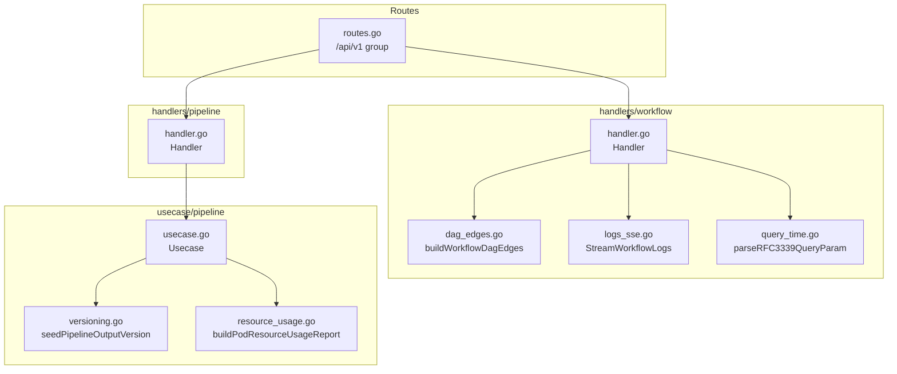
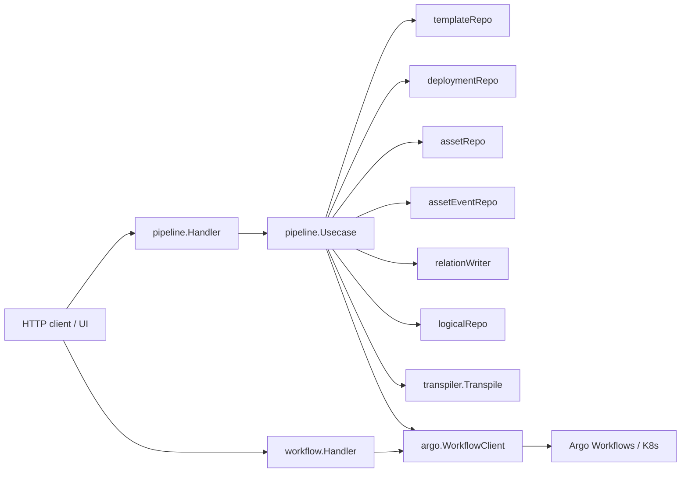
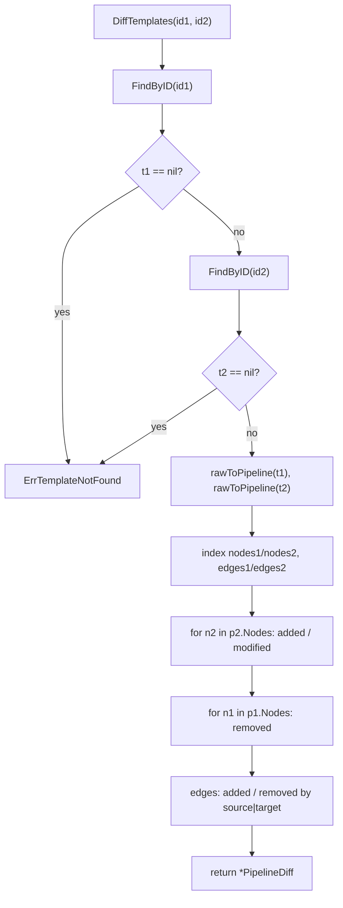
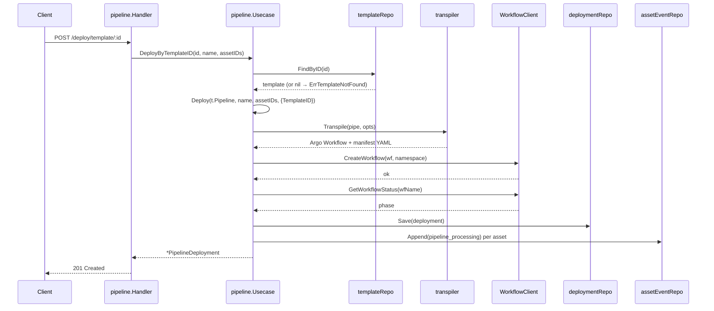
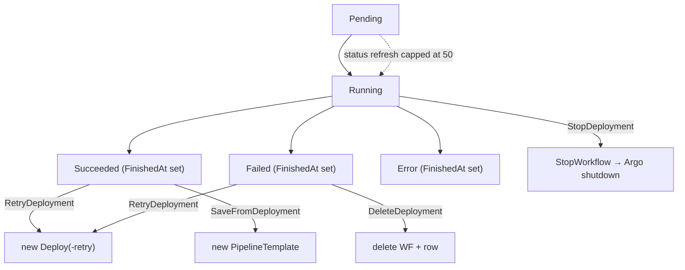
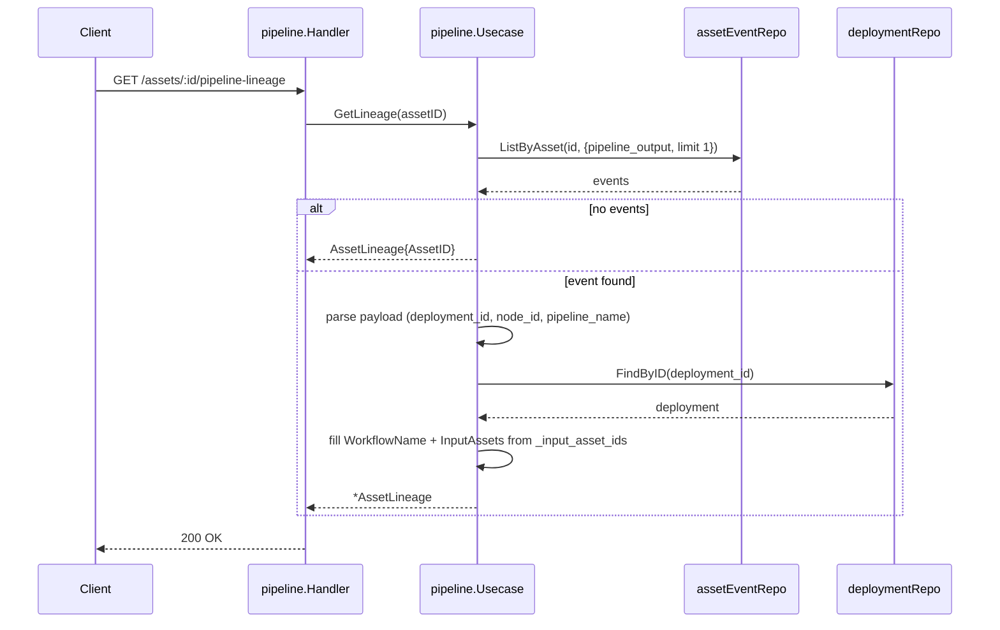
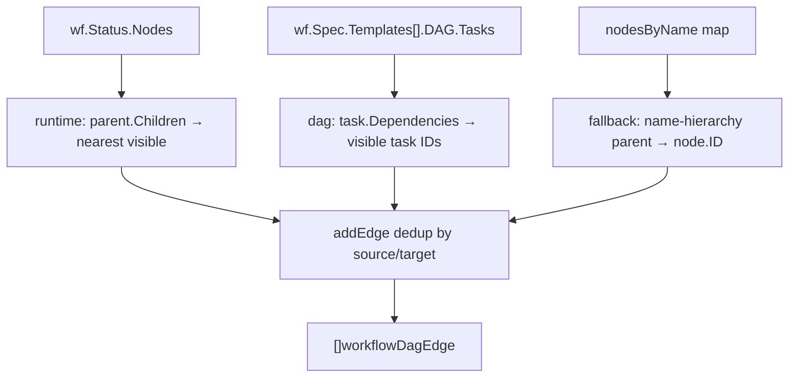
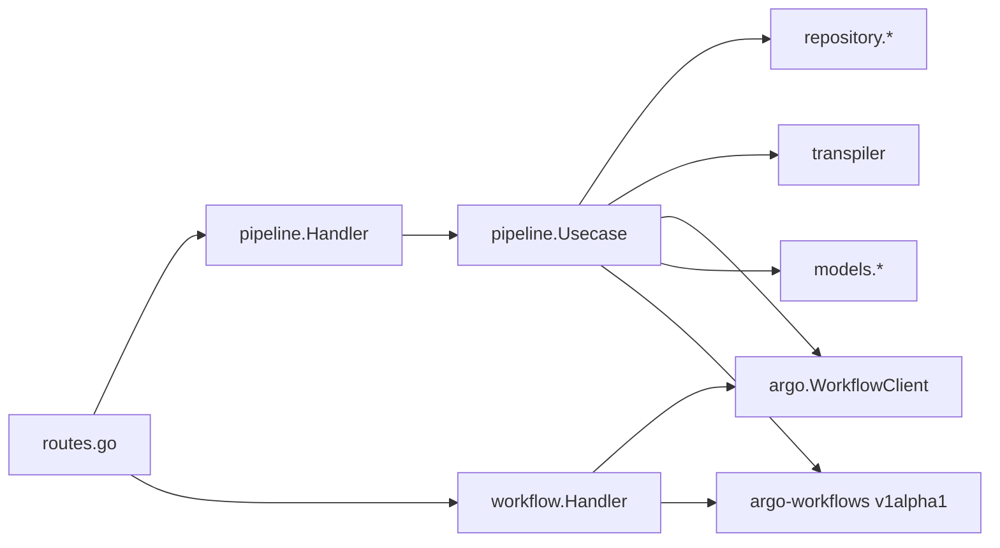

# Pipeline & Workflows Module

<cite>
**Referenced Files in This Document**

- [backend/internal/handlers/pipeline/handler.go](file://backend/internal/handlers/pipeline/handler.go)
- [backend/internal/usecase/pipeline/usecase.go](file://backend/internal/usecase/pipeline/usecase.go)
- [backend/internal/usecase/pipeline/versioning.go](file://backend/internal/usecase/pipeline/versioning.go)
- [backend/internal/usecase/pipeline/resource_usage.go](file://backend/internal/usecase/pipeline/resource_usage.go)
- [backend/internal/handlers/workflow/handler.go](file://backend/internal/handlers/workflow/handler.go)
- [backend/internal/handlers/workflow/dag_edges.go](file://backend/internal/handlers/workflow/dag_edges.go)
- [backend/internal/handlers/workflow/logs_sse.go](file://backend/internal/handlers/workflow/logs_sse.go)
- [backend/internal/handlers/workflow/query_time.go](file://backend/internal/handlers/workflow/query_time.go)
- [backend/routes/routes.go](file://backend/routes/routes.go)
</cite>

## Table of Contents
1. [Introduction](#introduction)
2. [Project Structure](#project-structure)
3. [Core Components](#core-components)
4. [Architecture Overview](#architecture-overview)
5. [Detailed Component Analysis](#detailed-component-analysis)
6. [Dependency Analysis](#dependency-analysis)
7. [Performance Considerations](#performance-considerations)
8. [Troubleshooting Guide](#troubleshooting-guide)
9. [Conclusion](#conclusion)
10. [Appendices](#appendices)

## Introduction

The Pipeline & Workflows module is the orchestration layer of cyber-databrew. It turns
a user-authored *pipeline* (a node/edge graph of containerized processing steps) into a
running Argo Workflow on Kubernetes, then tracks the resulting *deployment* through its
lifecycle, registers the assets it produces, and answers lineage questions about how an
asset came to exist.

The module is split into two cooperating handler packages and one usecase package:

- The **pipeline** package (`internal/handlers/pipeline` + `internal/usecase/pipeline`)
  owns the durable domain: pipeline *templates* (named, versioned snapshots of a pipeline
  graph), template *diffing*, *deployments* (a submitted workflow run plus its persisted
  manifest and pipeline JSON), deployment lifecycle operations (retry / stop / delete /
  save-as-template), pipeline *output asset registration*, and pipeline *lineage*.
- The **workflow** package (`internal/handlers/workflow`) is a thin, read-and-control
  facade over the live Argo Workflow engine: it lists and inspects workflows, reconstructs
  the runtime DAG of edges between visible nodes, exposes pod logs (including a Server-Sent
  Events stream), and proxies workflow control operations (retry, resubmit, suspend, stop,
  resume, terminate, delete).

The split matters: the pipeline usecase is the *source of truth* for deployments that the
product created, persisting a `PipelineDeployment` record and its rendered manifest. The
workflow handler is *stateless* — it reads whatever Argo currently holds for a workflow
name and never writes to the application database.

**Section sources**
- [backend/internal/handlers/pipeline/handler.go](file://backend/internal/handlers/pipeline/handler.go#L1-L42)
- [backend/internal/usecase/pipeline/usecase.go](file://backend/internal/usecase/pipeline/usecase.go#L32-L85)
- [backend/internal/handlers/workflow/handler.go](file://backend/internal/handlers/workflow/handler.go#L17-L24)

## Project Structure

The module's files cluster into three responsibilities — HTTP binding for pipelines, HTTP
binding for workflows, and the pipeline domain logic — wired together at the route layer.

**Diagram sources**
- [backend/routes/routes.go](file://backend/routes/routes.go#L315-L346)
- [backend/internal/handlers/pipeline/handler.go](file://backend/internal/handlers/pipeline/handler.go#L16-L22)
- [backend/internal/handlers/workflow/handler.go](file://backend/internal/handlers/workflow/handler.go#L17-L24)
- [backend/internal/usecase/pipeline/usecase.go](file://backend/internal/usecase/pipeline/usecase.go#L32-L85)

Key files and their roles:

- **`handlers/pipeline/handler.go`** — Gin handlers for templates, deploy, deployments,
  diff, output registration, and lineage. Each handler validates input, calls the usecase,
  and maps domain errors to HTTP codes via `mapDeployError`.
- **`usecase/pipeline/usecase.go`** — the `Usecase` aggregate. Holds repository
  dependencies and the Argo `WorkflowClient`, and implements all business operations.
- **`usecase/pipeline/versioning.go`** — `seedPipelineOutputVersion`, which seeds a
  `logical_assets` row (revision 1, current) when a pipeline output asset is registered.
- **`usecase/pipeline/resource_usage.go`** — pure functions that merge a live workflow's
  per-pod `ResourcesDuration` with the resource requests/limits parsed from the persisted
  manifest.
- **`handlers/workflow/handler.go`** — workflow listing/get plus control proxies.
- **`handlers/workflow/dag_edges.go`** — reconstructs display edges between visible nodes.
- **`handlers/workflow/logs_sse.go`** — SSE log streaming with a text fallback.
- **`handlers/workflow/query_time.go`** — RFC3339 query-param parsing for time filters.

**Section sources**
- [backend/routes/routes.go](file://backend/routes/routes.go#L315-L346)
- [backend/internal/usecase/pipeline/versioning.go](file://backend/internal/usecase/pipeline/versioning.go#L10-L25)
- [backend/internal/usecase/pipeline/resource_usage.go](file://backend/internal/usecase/pipeline/resource_usage.go#L19-L47)

## Core Components

### Pipeline Handler

`Handler` wraps a single `*pipelineUC.Usecase`. Its endpoints fall into five families:
templates (`SaveTemplate`, `ListTemplates`, `GetTemplate`, `DeleteTemplate`,
`ListVersions`, `DiffTemplates`), deploy (`Deploy`, `DeployByTemplate`), deployments
(`ListDeployments`, `GetDeployment`, `DeleteDeployment`, `RetryDeployment`,
`StopDeployment`, `SaveFromDeployment`, `GetResourceUsage`), output registration
(`RegisterOutput`), and lineage (`GetLineage`). The handler is deliberately thin — its
only logic beyond binding is `mapDeployError`, which translates sentinel errors into HTTP
statuses.

**Section sources**
- [backend/internal/handlers/pipeline/handler.go](file://backend/internal/handlers/pipeline/handler.go#L16-L22)
- [backend/internal/handlers/pipeline/handler.go](file://backend/internal/handlers/pipeline/handler.go#L213-L227)

### Pipeline Usecase

`Usecase` is the domain aggregate. It holds a template repository, a deployment repository,
an asset repository, the Argo `WorkflowClient`, a namespace, and three optional
collaborators wired through setters: an asset-event repository (`SetAssetEventRepo`), an
asset-relation writer (`SetRelationWriter`), and a logical-asset repository
(`SetLogicalAssetRepo`). The optional collaborators back lineage and relation features and
are nil-guarded everywhere, so the core deploy path works without them.

**Section sources**
- [backend/internal/usecase/pipeline/usecase.go](file://backend/internal/usecase/pipeline/usecase.go#L32-L85)

### Sentinel Errors

Five sentinel errors drive HTTP mapping: `ErrTemplateNotFound`, `ErrDeploymentNotFound`,
`ErrAssetNotFound`, `ErrInvalidArgument`, and `ErrWorkflowUnavailable`. The handler uses
`errors.Is` against these to choose between 404, 400, 503, and 500.

**Section sources**
- [backend/internal/usecase/pipeline/usecase.go](file://backend/internal/usecase/pipeline/usecase.go#L23-L30)

### Workflow Handler

The workflow `Handler` holds only an `argo.WorkflowClient` and a default namespace. Every
operation resolves its effective namespace through `namespaceFor`, which prefers a
per-request `namespace` set in the Gin context, falling back to the handler default. Six
control endpoints share a single `workflowOperation` helper that takes a
`func(context.Context, string, string) error` and returns `{"message": "ok"}`.

**Section sources**
- [backend/internal/handlers/workflow/handler.go](file://backend/internal/handlers/workflow/handler.go#L17-L24)
- [backend/internal/handlers/workflow/handler.go](file://backend/internal/handlers/workflow/handler.go#L251-L269)

## Architecture Overview

The module sits between the HTTP API and three downstream systems: the application
database (templates, deployments, assets, events, relations), the transpiler (pipeline
graph → Argo Workflow manifest), and the Argo Workflow engine on Kubernetes.

**Diagram sources**
- [backend/internal/usecase/pipeline/usecase.go](file://backend/internal/usecase/pipeline/usecase.go#L32-L42)
- [backend/internal/usecase/pipeline/usecase.go](file://backend/internal/usecase/pipeline/usecase.go#L210-L256)
- [backend/internal/handlers/workflow/handler.go](file://backend/internal/handlers/workflow/handler.go#L17-L24)

A deployment travels left-to-right: the handler binds a request, the usecase validates
assets and transpiles the graph, submits the manifest to Argo, persists the
`PipelineDeployment`, and emits side-effect events. Subsequent reads (list/get) lazily
refresh status from Argo and write the refreshed status back to the deployment repository.

## Detailed Component Analysis

### Templates, Versions, and Diff

`SaveTemplate` auto-versions: it calls `templateRepo.GetNextVersion(name)` and stores a
new `PipelineTemplate` with a fresh UUID, the resolved version, the raw pipeline map, and
a derived `NodeCount` (read from `pipeline["nodes"]` if present). `ListVersions` returns
all rows for a name; the handler routes `/pipelines/:id/versions` to it but treats the
path segment as the template *name*. `DiffTemplates` compares two templates by ID.

The diff is purely structural. Both pipelines are marshaled back to JSON and re-parsed via
`rawToPipeline` into `transpiler.Pipeline` values, then nodes and edges are indexed into
maps. A node present in the second but not the first is *added*; present in both but with a
differing canonical map (compared by `mapsEqual`, which marshals both sides to JSON) is
*modified*; present in the first only is *removed*. Edges are keyed by `source|target` and
classified added/removed the same way. The result is a `PipelineDiff` of
`AddedNodes`/`RemovedNodes`/`ModifiedNodes` plus `AddedEdges`/`RemovedEdges`.

**Diagram sources**
- [backend/internal/usecase/pipeline/usecase.go](file://backend/internal/usecase/pipeline/usecase.go#L674-L766)

**Section sources**
- [backend/internal/usecase/pipeline/usecase.go](file://backend/internal/usecase/pipeline/usecase.go#L89-L130)
- [backend/internal/usecase/pipeline/usecase.go](file://backend/internal/usecase/pipeline/usecase.go#L648-L828)
- [backend/internal/handlers/pipeline/handler.go](file://backend/internal/handlers/pipeline/handler.go#L24-L108)
- [backend/internal/handlers/pipeline/handler.go](file://backend/internal/handlers/pipeline/handler.go#L311-L330)

### Deploy and Deploy-by-Template

`Deploy` is the heart of the module. Given a raw pipeline map, an optional name override,
and an optional set of input asset IDs, it:

1. Marshals the pipeline map and parses it into a `transpiler.Pipeline` (capturing
   `nodeCount`).
2. Resolves the workflow name as `pipeName + "-" + first 6 chars of a UUID`, and mints a
   deployment ID.
3. Validates every supplied asset ID against `assetRepo.Get`; a missing asset yields
   `ErrAssetNotFound` (mapped to HTTP 400).
4. Assembles workflow-level params and global env vars. A `PIPELINE_DEPLOYMENT_ID` env var
   is always injected; when asset IDs are present it adds `ASSET_IDS`, `ASSET_COUNT`, and
   per-asset `ASSET_<i>_ID` / `ASSET_<i>_STORAGE_URI` / `ASSET_<i>_TYPE` vars.
5. Transpiles to an Argo `Workflow` with a 3600s TTL, marshals it to YAML for the persisted
   `Manifest`.
6. If `DryRun`, returns a `Preview` deployment with the manifest but never touches Argo or
   the database.
7. Otherwise requires a non-nil `wfClient` (else `ErrWorkflowUnavailable`), calls
   `CreateWorkflow`, then `GetWorkflowStatus` to seed the status (defaulting to `Pending`).
8. Persists the `PipelineDeployment`, stamping `TemplateID` when deployed from a template,
   and embedding `_input_asset_ids` into the stored `PipelineJSON` for later lineage.
9. Emits a `pipeline_processing` asset event per input asset (best-effort, nil-guarded).

`DeployByTemplateID` is a thin wrapper: it loads the template by ID (404 via
`ErrTemplateNotFound` when missing), defaults the name to the template name, and calls
`Deploy` with `DeployOptions{TemplateID: templateID}` so the resulting deployment records
its provenance.

**Diagram sources**
- [backend/internal/handlers/pipeline/handler.go](file://backend/internal/handlers/pipeline/handler.go#L143-L163)
- [backend/internal/usecase/pipeline/usecase.go](file://backend/internal/usecase/pipeline/usecase.go#L137-L318)

**Section sources**
- [backend/internal/handlers/pipeline/handler.go](file://backend/internal/handlers/pipeline/handler.go#L110-L163)
- [backend/internal/usecase/pipeline/usecase.go](file://backend/internal/usecase/pipeline/usecase.go#L132-L318)

### Deployment Tracking and Lifecycle

Deployment reads lazily reconcile state with Argo. `ListDeployments` fetches all rows, then
for each row whose status is empty/`Running`/`Pending`/`Unknown` it polls
`GetWorkflowStatus`, updates the in-memory status, sets `FinishedAt` on terminal phases
(`Succeeded`/`Failed`/`Error`), and persists the new status via `UpdateStatus`. To avoid
poll storms, refreshes are capped at `maxActiveDeploymentStatusRefresh = 50` per call.
`GetDeployment` applies the same refresh logic to a single record.

`DeleteDeployment` best-effort deletes the underlying Argo workflow (when a client is
configured) before deleting the deployment row. `RetryDeployment` reads the saved
deployment, recovers input asset IDs from the persisted `_input_asset_ids` via
`assetIDsFromPipelineJSON`, and re-runs `Deploy` with a `-retry` name suffix.
`StopDeployment` requires a workflow client and calls `StopWorkflow`. `SaveFromDeployment`
turns a deployment's `PipelineJSON` into a new template, defaulting the name to
`<pipeline>-from-deployment`.

**Diagram sources**
- [backend/internal/usecase/pipeline/usecase.go](file://backend/internal/usecase/pipeline/usecase.go#L341-L434)

**Section sources**
- [backend/internal/usecase/pipeline/usecase.go](file://backend/internal/usecase/pipeline/usecase.go#L339-L434)
- [backend/internal/handlers/pipeline/handler.go](file://backend/internal/handlers/pipeline/handler.go#L165-L309)

### Output Asset Registration and Logical Versioning

`RegisterOutput` is the callback endpoint pipeline containers hit (using the injected
`PIPELINE_DEPLOYMENT_ID`) to register a step result as a new asset. The handler binds a
`RegisterPipelineOutputInput`, requires `deployment_id`, and delegates to the usecase. The
usecase validates the deployment exists (`ErrDeploymentNotFound` → 404), assigns an asset
ID (generating a UUID when absent), and builds a `models.Asset` from the storage URI, type,
files, and metadata. It then calls `seedPipelineOutputVersion`, which — when a logical-asset
repo is wired — sets the asset's `LogicalAssetID` to its own ID with `Revision = 1` and
`IsCurrent = true`, and inserts a matching `logical_assets` row (current revision 1, total 1).
After `InsertNew`, it appends a `pipeline_output` asset event for lineage and, when a
relation writer is present, inserts `pipeline_output` relations from each input asset (read
from the deployment's `_input_asset_ids`) to the new output asset.

**Section sources**
- [backend/internal/handlers/pipeline/handler.go](file://backend/internal/handlers/pipeline/handler.go#L332-L354)
- [backend/internal/usecase/pipeline/usecase.go](file://backend/internal/usecase/pipeline/usecase.go#L436-L515)
- [backend/internal/usecase/pipeline/versioning.go](file://backend/internal/usecase/pipeline/versioning.go#L10-L25)

### Pipeline Lineage

`GetLineage` answers "which run and step produced this asset". It requires the asset-event
repo (else an error). It lists the single most-recent `pipeline_output` event for the asset
(`Limit: 1`). With no event it returns a bare `AssetLineage{AssetID}`. Otherwise it sets
`ProducedAt` from the event timestamp and unpacks `deployment_id`, `node_id`, and
`pipeline_name` from the event payload, then loads the deployment to fill in
`WorkflowName`, default `PipelineName`, and the `InputAssets` list extracted from
`_input_asset_ids` (handling both `[]interface{}` and `[]string` shapes).

**Diagram sources**
- [backend/internal/usecase/pipeline/usecase.go](file://backend/internal/usecase/pipeline/usecase.go#L530-L591)

**Section sources**
- [backend/internal/handlers/pipeline/handler.go](file://backend/internal/handlers/pipeline/handler.go#L356-L369)
- [backend/internal/usecase/pipeline/usecase.go](file://backend/internal/usecase/pipeline/usecase.go#L517-L591)

### Resource Usage Reporting

`GetResourceUsage` loads the deployment, then (when a workflow client exists and the
workflow name is set) fetches the live workflow and overrides the report status with the
live phase. The pod table is built by `buildPodResourceUsageReport`: it iterates
`wf.Status.Nodes`, keeps only `NodeTypePod` entries, derives a pod name from the node ID
(falling back to the node name), reads CPU/memory *usage* from the node's
`ResourcesDuration` via `formatResourcesDuration`, and merges *requests/limits* parsed from
the persisted manifest by `templateResourcesFromManifest` (keyed by template name, reading
either the Container or Script resources). `quantityString` renders zero quantities as
empty strings.

**Section sources**
- [backend/internal/usecase/pipeline/usecase.go](file://backend/internal/usecase/pipeline/usecase.go#L593-L646)
- [backend/internal/usecase/pipeline/resource_usage.go](file://backend/internal/usecase/pipeline/resource_usage.go#L19-L99)

### Argo Workflow Reads and DAG Reconstruction

The workflow handler is read/control only. `ListWorkflows` fetches all workflows in the
namespace and applies in-memory filters: case-insensitive name substring, exact status
phase, `label` key=value pairs (parsed by splitting on `=`), `createdAfter`, and
`finishedBefore` — the two time filters are parsed by `parseRFC3339QueryParam`, which
returns a parsed time, a "given" flag, and an "ok" flag, emitting a 400 on malformed
RFC3339. Each surviving workflow is projected to a compact item with name, status,
`nodeCount`, timestamps, and labels.

`GetWorkflow` projects the full node list and attaches the reconstructed DAG via
`buildWorkflowDagEdges`. Edge reconstruction is non-trivial because Argo's node tree
includes structural (boundary/DAG) nodes the UI should not show. It builds edges from three
sources: runtime parent→child links collapsed to the nearest *visible* ancestor/descendant
(kind `runtime`); declared DAG task dependencies resolved to visible node IDs (kind `dag`);
and a name-hierarchy fallback to the nearest visible name-parent (kind `fallback`). A node
is "displayable" when it has a meaningful phase (Skipped/Omitted) or is a pod/template node,
and is not the root DAG node. Edges are deduplicated by `source\x00target`.

**Diagram sources**
- [backend/internal/handlers/workflow/dag_edges.go](file://backend/internal/handlers/workflow/dag_edges.go#L17-L88)

**Section sources**
- [backend/internal/handlers/workflow/handler.go](file://backend/internal/handlers/workflow/handler.go#L26-L198)
- [backend/internal/handlers/workflow/dag_edges.go](file://backend/internal/handlers/workflow/dag_edges.go#L17-L216)
- [backend/internal/handlers/workflow/query_time.go](file://backend/internal/handlers/workflow/query_time.go#L12-L26)

### Workflow Logs and SSE Streaming

`GetWorkflowLogs` returns the full log buffer for a `name`+`nodeId` pair as JSON.
`StreamWorkflowLogs` is the SSE variant: it validates the node exists in the workflow,
opens a log stream against the `main` container, and streams parsed lines as
`data: <line>\n\n`. Each upstream chunk is parsed by `extractLogLine`, which strips a
`data:` prefix and unmarshals a `workflowLogStreamEntry`, emitting the `result.content`
(passing raw text through when it is not JSON). When the stream cannot be opened, it falls
back to fetching the full logs once and replaying them via `streamWorkflowLogsText`. SSE
headers (`text/event-stream`, `no-cache`, `keep-alive`, `X-Accel-Buffering: no`) are set
before streaming, and the scanner uses a 10 MB max line buffer.

**Section sources**
- [backend/internal/handlers/workflow/handler.go](file://backend/internal/handlers/workflow/handler.go#L200-L214)
- [backend/internal/handlers/workflow/logs_sse.go](file://backend/internal/handlers/workflow/logs_sse.go#L15-L162)

## Dependency Analysis

**Diagram sources**
- [backend/internal/usecase/pipeline/usecase.go](file://backend/internal/usecase/pipeline/usecase.go#L1-L42)
- [backend/internal/handlers/workflow/handler.go](file://backend/internal/handlers/workflow/handler.go#L1-L24)
- [backend/internal/handlers/pipeline/handler.go](file://backend/internal/handlers/pipeline/handler.go#L1-L22)

Outbound dependencies:

- **`repository.*`** — `PipelineTemplateRepository`, `PipelineDeploymentRepository`,
  `AssetRepository`, plus optional `AssetEventRepository`, `AssetRelationWriter`, and
  `LogicalAssetRepository`.
- **`transpiler`** — converts the pipeline graph into an Argo `Workflow` and provides the
  `Pipeline`, `Node`, `Param`, and `EnvVar` types used by deploy and diff.
- **`argo.WorkflowClient`** — `CreateWorkflow`, `GetWorkflowStatus`, `GetWorkflow`,
  `DeleteWorkflow`, `StopWorkflow`, plus list/log/control methods used by the workflow
  handler.
- **`argo-workflows v1alpha1` (`wfv1`)** — the Kubernetes workflow types read directly by
  the workflow handler and the resource-usage builder.

Inbound dependency: only `routes.go` wires the handlers into the `/api/v1` group.

**Section sources**
- [backend/internal/usecase/pipeline/usecase.go](file://backend/internal/usecase/pipeline/usecase.go#L1-L42)
- [backend/routes/routes.go](file://backend/routes/routes.go#L315-L346)

## Performance Considerations

- **Status-refresh cap (N+1 guard).** `ListDeployments` polls Argo only for non-terminal
  rows and stops after `maxActiveDeploymentStatusRefresh = 50` polls, bounding the per-call
  fan-out to the workflow engine.
- **Per-asset lookups during deploy.** `Deploy` calls `assetRepo.Get` once for validation
  and again while assembling env vars for each asset ID; large asset sets multiply these
  reads.
- **In-memory workflow filtering.** `ListWorkflows` fetches the whole namespace and filters
  in Go, so result size scales with total workflows, not the filter.
- **DAG reconstruction cost.** `buildWorkflowDagEdges` repeatedly calls `sortedNodeIDs`
  (each an O(n log n) sort) and performs name-based parent searches; cost grows with node
  count on very large workflows.
- **SSE buffering.** The log scanner allocates up to a 10 MB line buffer and sets
  `X-Accel-Buffering: no` so proxies forward chunks immediately.
- **Best-effort side effects.** Event and relation writes are logged-and-ignored on failure
  (`logPipelineSideEffect`), so they never block or fail a deploy/register response.

**Section sources**
- [backend/internal/usecase/pipeline/usecase.go](file://backend/internal/usecase/pipeline/usecase.go#L341-L372)
- [backend/internal/usecase/pipeline/usecase.go](file://backend/internal/usecase/pipeline/usecase.go#L170-L208)
- [backend/internal/handlers/workflow/handler.go](file://backend/internal/handlers/workflow/handler.go#L49-L88)
- [backend/internal/handlers/workflow/logs_sse.go](file://backend/internal/handlers/workflow/logs_sse.go#L54-L55)

## Troubleshooting Guide

- **503 on deploy** — `ErrWorkflowUnavailable`: the Argo client is nil or the server URL is
  empty ("argo server URL is empty"). Verify Argo configuration before deploying.
- **400 with `asset_id=...`** — `ErrAssetNotFound`: a supplied asset ID failed validation in
  the pre-flight loop. Confirm the asset exists.
- **404 on deploy-by-template / save-template / lineage targets** — `ErrTemplateNotFound`
  or `ErrDeploymentNotFound` from `mapDeployError` or the per-handler `errors.Is` checks.
- **Deployment status stuck at Pending/Unknown** — the lazy refresh only runs when a
  workflow client exists; a list call may also hit the 50-poll cap before reaching the row.
- **Empty `pods` in resource usage** — no workflow client, an empty workflow name, or no
  `NodeTypePod` nodes; request/limit columns stay blank when the manifest template name
  doesn't match the node's `TemplateName`.
- **Empty lineage** — `GetLineage` needs the asset-event repo wired; without a
  `pipeline_output` event it returns just the asset ID.
- **SSE stream falls back to a single text replay** — the live log stream could not be
  opened, so `GetWorkflowLogs` is replayed once via `streamWorkflowLogsText`.
- **`invalid <name>: must be RFC3339`** — a `createdAfter`/`finishedBefore` query value was
  not RFC3339.

**Section sources**
- [backend/internal/handlers/pipeline/handler.go](file://backend/internal/handlers/pipeline/handler.go#L213-L227)
- [backend/internal/usecase/pipeline/usecase.go](file://backend/internal/usecase/pipeline/usecase.go#L246-L256)
- [backend/internal/handlers/workflow/logs_sse.go](file://backend/internal/handlers/workflow/logs_sse.go#L123-L151)
- [backend/internal/handlers/workflow/query_time.go](file://backend/internal/handlers/workflow/query_time.go#L17-L24)

## Conclusion

The Pipeline & Workflows module cleanly separates a durable, product-owned domain
(templates, deployments, outputs, lineage) from a stateless control facade over Argo. The
pipeline usecase centralizes transpilation, submission, lazy status reconciliation, and the
best-effort event/relation side effects that power lineage, while the workflow handler
provides safe reads and controlled operations over the live engine. The design favors
nil-guarded optional collaborators and bounded fan-out, so the core deploy path stays
robust even when auxiliary features are not wired.

## Appendices

### API Endpoints

| Method | Path | Handler |
| --- | --- | --- |
| POST | `/api/v1/pipelines` | `SaveTemplate` |
| GET | `/api/v1/pipelines` | `ListTemplates` |
| GET | `/api/v1/pipelines/:id` | `GetTemplate` |
| DELETE | `/api/v1/pipelines/:id` | `DeleteTemplate` |
| GET | `/api/v1/pipelines/:id/versions` | `ListVersions` |
| GET | `/api/v1/pipelines/:id/diff/:id2` | `DiffTemplates` |
| POST | `/api/v1/deploy` | `Deploy` |
| POST | `/api/v1/deploy/template/:id` | `DeployByTemplate` |
| GET | `/api/v1/deployments` | `ListDeployments` |
| GET | `/api/v1/deployments/:id` | `GetDeployment` |
| GET | `/api/v1/deployments/:id/resources` | `GetResourceUsage` |
| POST | `/api/v1/deployments/:id/retry` | `RetryDeployment` |
| POST | `/api/v1/deployments/:id/stop` | `StopDeployment` |
| POST | `/api/v1/deployments/:id/save-template` | `SaveFromDeployment` |
| DELETE | `/api/v1/deployments/:id` | `DeleteDeployment` |
| POST | `/api/v1/pipeline-assets` | `RegisterOutput` |
| GET | `/api/v1/assets/:id/pipeline-lineage` | `GetLineage` |
| GET | `/api/v1/workflows` | `ListWorkflows` |
| GET | `/api/v1/workflows/:name` | `GetWorkflow` |
| GET | `/api/v1/workflows/:name/logs` | `GetWorkflowLogs` |

**Section sources**
- [backend/routes/routes.go](file://backend/routes/routes.go#L315-L346)
- [backend/internal/handlers/workflow/logs_sse.go](file://backend/internal/handlers/workflow/logs_sse.go#L98-L100)

### Sentinel Errors and HTTP Mapping

| Error | HTTP status (via mapDeployError) |
| --- | --- |
| `ErrTemplateNotFound` | 404 `ASSET_NOT_FOUND` |
| `ErrAssetNotFound` | 400 `INVALID_ARGUMENT` |
| `ErrWorkflowUnavailable` | 503 `SERVICE_UNAVAILABLE` |
| `ErrDeploymentNotFound` | 404 (per-handler `errors.Is`) |
| (other) | 500 Internal |

**Section sources**
- [backend/internal/usecase/pipeline/usecase.go](file://backend/internal/usecase/pipeline/usecase.go#L23-L30)
- [backend/internal/handlers/pipeline/handler.go](file://backend/internal/handlers/pipeline/handler.go#L213-L227)

### Injected Workflow Environment Variables

| Variable | Set when | Source |
| --- | --- | --- |
| `PIPELINE_DEPLOYMENT_ID` | always | deployment ID |
| `ASSET_IDS` | asset IDs present | comma-joined IDs |
| `ASSET_COUNT` | asset IDs present | count |
| `ASSET_<i>_ID` | per asset | asset ID |
| `ASSET_<i>_STORAGE_URI` | per asset, if non-empty | asset storage URI |
| `ASSET_<i>_TYPE` | per asset, if non-empty | asset type |

**Section sources**
- [backend/internal/usecase/pipeline/usecase.go](file://backend/internal/usecase/pipeline/usecase.go#L179-L208)
