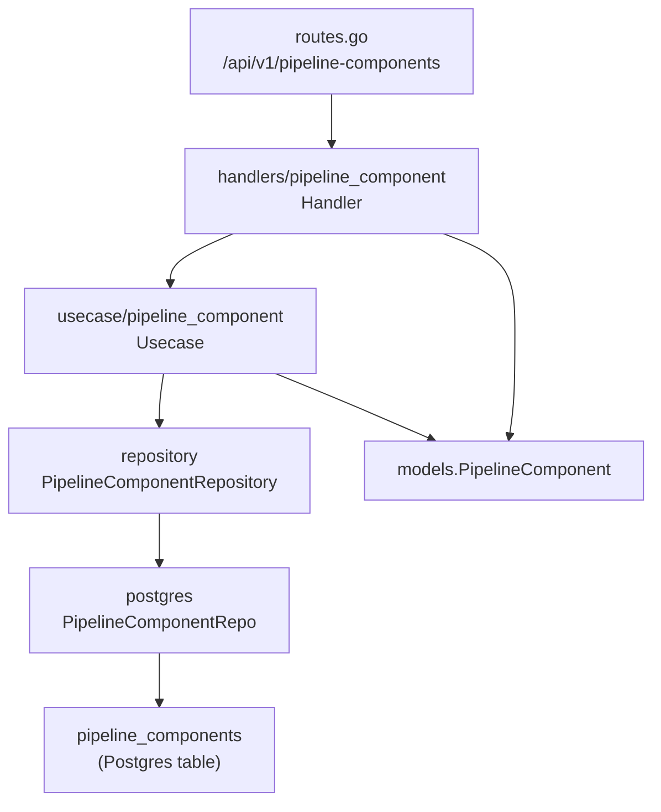
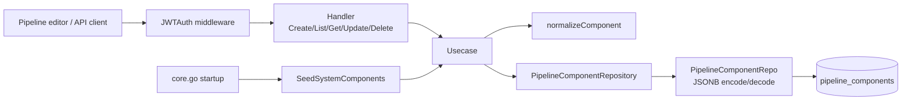
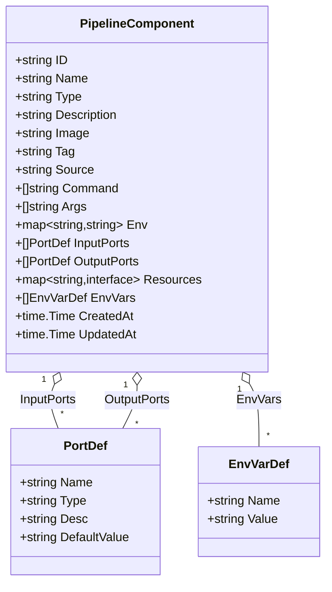
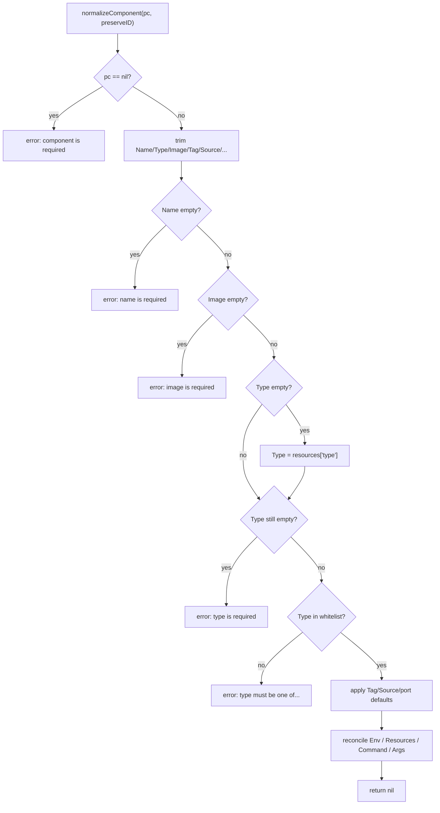
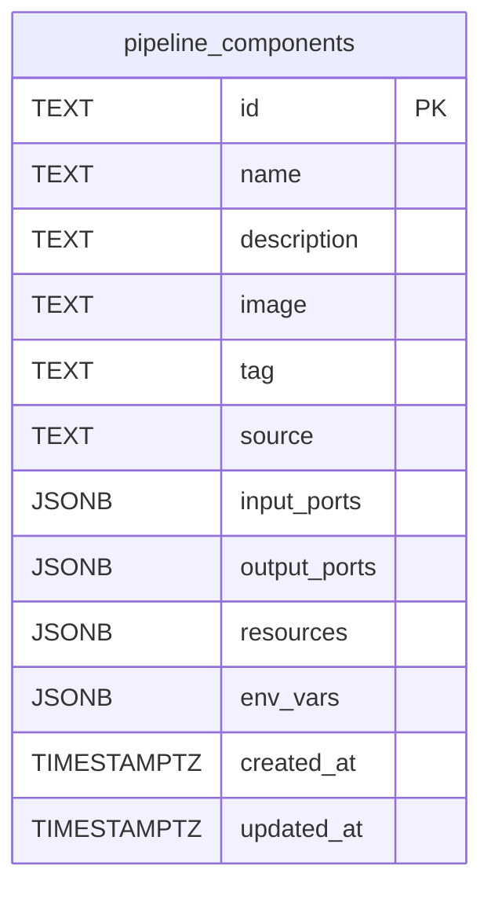
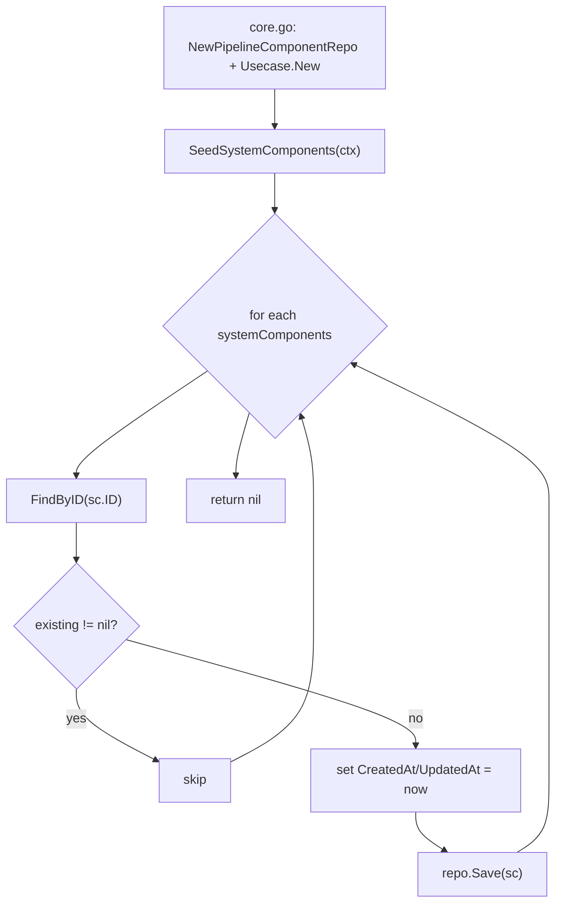
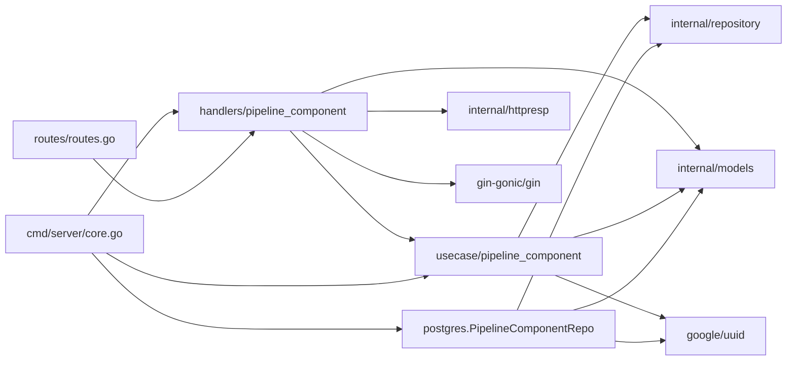

# Pipeline Components

<cite>
**Referenced Files in This Document**

- [backend/internal/models/pipeline_component.go](file://backend/internal/models/pipeline_component.go)
- [backend/internal/usecase/pipeline_component/usecase.go](file://backend/internal/usecase/pipeline_component/usecase.go)
- [backend/internal/postgres/pipeline_component_repo.go](file://backend/internal/postgres/pipeline_component_repo.go)
- [backend/internal/repository/pipeline_component_repository.go](file://backend/internal/repository/pipeline_component_repository.go)
- [backend/internal/handlers/pipeline_component/handler.go](file://backend/internal/handlers/pipeline_component/handler.go)
- [backend/migrations/040_pipeline_components.sql](file://backend/migrations/040_pipeline_components.sql)
- [backend/routes/routes.go](file://backend/routes/routes.go)
- [backend/cmd/server/core.go](file://backend/cmd/server/core.go)
- [docs/review/component-definition.md](file://docs/review/component-definition.md)
</cite>

## Table of Contents
1. [Introduction](#introduction)
2. [Project Structure](#project-structure)
3. [Core Components](#core-components)
4. [Architecture Overview](#architecture-overview)
5. [Detailed Component Analysis](#detailed-component-analysis)
6. [Dependency Analysis](#dependency-analysis)
7. [Performance Considerations](#performance-considerations)
8. [Troubleshooting Guide](#troubleshooting-guide)
9. [Conclusion](#conclusion)
10. [Appendices](#appendices)

## Introduction

A **pipeline component** is a reusable, registered building block that a user
can drag onto the DAG canvas and wire into a pipeline template. Conceptually a
component is a Docker image plus a port contract: it declares its input ports,
its output ports, and the runtime knobs (command, args, environment variables,
resource requests) needed to run the image as a single workflow step. When the
pipeline transpiler turns a template into an Argo Workflow, each node in the DAG
references a component, and the component's image/command/args/ports become the
fields of an Argo `container` (or `script`) template.

This page documents the component **registry** — the slice of the system that
owns the component catalogue. It covers the `PipelineComponent` data model, the
CRUD use case that enforces the registry's invariants (required fields, type
whitelist, system-vs-custom protection), the PostgreSQL repository that persists
components as a row with JSONB columns, the REST handler that exposes the
registry under `/api/v1/pipeline-components`, and the seeding of built-in
"system" components at server startup. It also explains how components compose
into pipeline templates and where the `container`/`script` execution-mode design
is heading.

The registry is consumed by the pipeline editor (frontend) when populating the
component palette, and by the pipeline template/transpiler subsystem when
resolving a node's component definition into an executable step.

**Section sources**
- [backend/internal/models/pipeline_component.go](file://backend/internal/models/pipeline_component.go#L1-L38)
- [backend/internal/handlers/pipeline_component/handler.go](file://backend/internal/handlers/pipeline_component/handler.go#L1-L19)
- [docs/review/component-definition.md](file://docs/review/component-definition.md#L1-L35)

## Project Structure

The component registry is a clean four-layer vertical slice. Each layer lives in
its own package and depends only on the layer below through an interface, so the
PostgreSQL implementation can be swapped without touching the use case.

- **Model** — `backend/internal/models/pipeline_component.go` defines
  `PipelineComponent`, `PortDef`, and `EnvVarDef`. These are the wire types
  (JSON tags) and the persisted shape.
- **Repository interface** — `backend/internal/repository/pipeline_component_repository.go`
  declares `PipelineComponentRepository` and the `ComponentFilter` value object.
- **Use case** — `backend/internal/usecase/pipeline_component/usecase.go` holds
  the business rules: normalization/validation, ID/timestamp assignment, the
  system-component guards, and the startup seeder.
- **PostgreSQL repository** — `backend/internal/postgres/pipeline_component_repo.go`
  implements the interface against the `pipeline_components` table, marshalling
  ports/resources/env to JSONB and re-hydrating derived fields on read.
- **HTTP handler** — `backend/internal/handlers/pipeline_component/handler.go`
  adapts Gin requests to the use case and maps domain errors to HTTP codes.
- **Schema** — `backend/migrations/040_pipeline_components.sql` creates the
  table and the `name` / `source` indexes.
- **Wiring** — `backend/cmd/server/core.go` constructs the repo → use case →
  handler chain and seeds system components; `backend/routes/routes.go`
  registers the five REST routes.



**Diagram sources**
- [backend/routes/routes.go](file://backend/routes/routes.go#L334-L341)
- [backend/internal/handlers/pipeline_component/handler.go](file://backend/internal/handlers/pipeline_component/handler.go#L13-L19)
- [backend/internal/usecase/pipeline_component/usecase.go](file://backend/internal/usecase/pipeline_component/usecase.go#L16-L24)
- [backend/internal/repository/pipeline_component_repository.go](file://backend/internal/repository/pipeline_component_repository.go#L15-L22)
- [backend/internal/postgres/pipeline_component_repo.go](file://backend/internal/postgres/pipeline_component_repo.go#L17-L25)

**Section sources**
- [backend/cmd/server/core.go](file://backend/cmd/server/core.go#L103-L109)
- [backend/migrations/040_pipeline_components.sql](file://backend/migrations/040_pipeline_components.sql#L1-L17)

## Core Components

### The `PipelineComponent` model

`PipelineComponent` is the single domain entity of this slice. It captures both
the image identity (`Image`, `Tag`), the execution recipe (`Command`, `Args`,
`Env`, `Resources`), and the I/O contract (`InputPorts`, `OutputPorts`). The
`Source` field distinguishes built-in `system` components from user-created
`custom` components, which drives the protection rules in the use case. `EnvVars`
is a list-shaped mirror of the `Env` map used for stable serialization and for
frontend editing.

```go
type PipelineComponent struct {
    ID          string
    Name        string
    Type        string
    Description string
    Image       string
    Tag         string
    Source      string
    Command     []string
    Args        []string
    Env         map[string]string
    InputPorts  []PortDef
    OutputPorts []PortDef
    Resources   map[string]interface{}
    EnvVars     []EnvVarDef
    CreatedAt   time.Time
    UpdatedAt   time.Time
}
```

`PortDef` carries `Name`, `Type`, an optional `Desc`, and an optional
`DefaultValue` for input ports (feature F2.10). `EnvVarDef` is a `Name`/`Value`
pair.

**Section sources**
- [backend/internal/models/pipeline_component.go](file://backend/internal/models/pipeline_component.go#L5-L37)

### The repository contract

`PipelineComponentRepository` is the persistence boundary. It is deliberately
small — five methods — and the use case depends only on this interface, never on
the PostgreSQL package. `ComponentFilter` is an optional value object passed to
`FindAll` to support name search (`Query`) and `Source` filtering.

```go
type PipelineComponentRepository interface {
    Save(ctx, c) error
    FindAll(ctx, filter *ComponentFilter) ([]models.PipelineComponent, error)
    FindByID(ctx, id) (*models.PipelineComponent, error)
    Update(ctx, c) error
    Delete(ctx, id) error
}
```

Note `FindByID` returns `(nil, nil)` for a missing row rather than an error,
which is the contract the use case relies on to distinguish "not found" from a
database failure.

**Section sources**
- [backend/internal/repository/pipeline_component_repository.go](file://backend/internal/repository/pipeline_component_repository.go#L9-L22)
- [backend/internal/postgres/pipeline_component_repo.go](file://backend/internal/postgres/pipeline_component_repo.go#L195-L209)

### The use case

`Usecase` wraps a `PipelineComponentRepository` and exposes `Create`, `List`,
`Get`, `Update`, `Delete`, and `SeedSystemComponents`. All write paths funnel
through `normalizeComponent`, which is the single place where invariants are
enforced and derived fields are reconciled.

**Section sources**
- [backend/internal/usecase/pipeline_component/usecase.go](file://backend/internal/usecase/pipeline_component/usecase.go#L16-L91)

### The HTTP handler

`Handler` binds the use case to five Gin endpoints and translates use-case
errors to HTTP status codes via `writeComponentError`. Bodies bind into a
`models.PipelineComponent` directly, so the JSON tags on the model define the
request/response schema.

**Section sources**
- [backend/internal/handlers/pipeline_component/handler.go](file://backend/internal/handlers/pipeline_component/handler.go#L13-L116)

## Architecture Overview

A request enters through the Gin router, is authenticated by the JWT middleware
on the `/api/v1` group, and is dispatched to a `Handler` method. The handler
unmarshals the body (or reads path/query params), calls the use case, and
serializes the result. The use case normalizes the payload, applies registry
invariants, and calls the repository. The repository marshals the component's
JSONB columns and runs the SQL. On read, the repository scans the row and
re-hydrates the in-memory derived fields (`Type`, `Command`, `Args`, `Env`) from
the `resources` JSON blob so callers always see a fully-populated model.



**Diagram sources**
- [backend/routes/routes.go](file://backend/routes/routes.go#L189-L189)
- [backend/routes/routes.go](file://backend/routes/routes.go#L334-L341)
- [backend/internal/handlers/pipeline_component/handler.go](file://backend/internal/handlers/pipeline_component/handler.go#L21-L102)
- [backend/internal/usecase/pipeline_component/usecase.go](file://backend/internal/usecase/pipeline_component/usecase.go#L27-L91)
- [backend/cmd/server/core.go](file://backend/cmd/server/core.go#L104-L109)

## Detailed Component Analysis

### Component model and its relationships

The model is a flat aggregate: one `PipelineComponent` owns slices of `PortDef`
(once for inputs, once for outputs) and a slice of `EnvVarDef`. The `Env` map and
`EnvVars` slice are two representations of the same data, kept in sync by the use
case and repository.



**Diagram sources**
- [backend/internal/models/pipeline_component.go](file://backend/internal/models/pipeline_component.go#L5-L37)

**Section sources**
- [backend/internal/models/pipeline_component.go](file://backend/internal/models/pipeline_component.go#L1-L38)

### Normalization and validation

`normalizeComponent` is the heart of the registry's correctness. It is called by
both `Create` (with `preserveID == false`) and `Update` (with
`preserveID == true`). It performs:

- **Trimming** of all string fields.
- **Required-field checks**: `Name` and `Image` must be non-empty.
- **Type resolution and whitelist**: if `Type` is empty it is read from
  `resources["type"]`; the resolved type must be one of `container`, `script`,
  `resource`, or `suspend` (the `validComponentTypes` set), otherwise an error
  is returned.
- **Defaults**: empty `Tag` becomes `latest`; empty `Source` becomes `custom`;
  nil `InputPorts`/`OutputPorts` become empty slices.
- **Env reconciliation**: if `Env` is nil but `EnvVars` is present, the map is
  built from the slice; conversely `EnvVars` is rebuilt from the map.
- **Resources reconciliation**: `resources["type"]` is always set to `Type`, and
  `command`/`args`/`env` are round-tripped between the top-level fields and the
  `Resources` blob so both representations stay consistent.



**Diagram sources**
- [backend/internal/usecase/pipeline_component/usecase.go](file://backend/internal/usecase/pipeline_component/usecase.go#L93-L168)

**Section sources**
- [backend/internal/usecase/pipeline_component/usecase.go](file://backend/internal/usecase/pipeline_component/usecase.go#L93-L214)

### CRUD lifecycle

The use case methods are thin orchestrators around normalization and the
repository:

- **Create** normalizes, mints a fresh UUID, stamps `CreatedAt`/`UpdatedAt` to
  `time.Now().UTC()`, and calls `Save`.
- **List** builds a `ComponentFilter` only when `query` or `source` is non-empty,
  then delegates to `FindAll`.
- **Get** is a pass-through to `FindByID`.
- **Update** normalizes, fetches the existing row, rejects unknown IDs, blocks
  converting a `system` component to non-system, preserves the original
  `CreatedAt`, and calls `Update`.
- **Delete** fetches the existing row, rejects unknown IDs, blocks deletion of
  `system` components, and calls `Delete`.

```mermaid
sequenceDiagram
  participant C as Client
  participant H as Handler
  participant U as Usecase
  participant R as PipelineComponentRepo
  participant DB as pipeline_components

  C->>H: POST /api/v1/pipeline-components (JSON body)
  H->>H: ShouldBindJSON -> PipelineComponent
  H->>U: Create(ctx, pc)
  U->>U: normalizeComponent(pc, false)
  U->>U: pc.ID = uuid.New(); set timestamps
  U->>R: Save(ctx, pc)
  R->>R: json.Marshal ports/resources/env_vars
  R->>DB: INSERT INTO pipeline_components (...)
  DB-->>R: ok
  R-->>U: nil
  U-->>H: created component
  H-->>C: 201 Created (component JSON)

  C->>H: PUT /api/v1/pipeline-components/:id
  H->>U: Update(ctx, pc with ID=:id)
  U->>U: normalizeComponent(pc, true)
  U->>R: FindByID(ctx, id)
  R->>DB: SELECT ... WHERE id=$1
  DB-->>R: row / no rows
  R-->>U: existing / nil
  alt not found
    U-->>H: error "component not found"
    H-->>C: 404 component not found
  else system -> custom
    U-->>H: error "system components cannot be converted"
    H-->>C: 400 invalid argument
  else ok
    U->>U: pc.CreatedAt = existing.CreatedAt
    U->>R: Update(ctx, pc)
    R->>DB: UPDATE ... WHERE id=$1
    U-->>H: nil
    H-->>C: 200 (component JSON)
  end

  C->>H: DELETE /api/v1/pipeline-components/:id
  H->>U: Delete(ctx, id)
  U->>R: FindByID(ctx, id)
  alt system component
    U-->>H: error "system components cannot be deleted"
    H-->>C: 400 invalid argument
  else ok
    U->>R: Delete(ctx, id)
    R->>DB: DELETE WHERE id=$1
    H-->>C: 204 No Content
  end
```

**Diagram sources**
- [backend/internal/handlers/pipeline_component/handler.go](file://backend/internal/handlers/pipeline_component/handler.go#L21-L102)
- [backend/internal/usecase/pipeline_component/usecase.go](file://backend/internal/usecase/pipeline_component/usecase.go#L27-L91)
- [backend/internal/postgres/pipeline_component_repo.go](file://backend/internal/postgres/pipeline_component_repo.go#L121-L247)

**Section sources**
- [backend/internal/usecase/pipeline_component/usecase.go](file://backend/internal/usecase/pipeline_component/usecase.go#L27-L91)
- [backend/internal/handlers/pipeline_component/handler.go](file://backend/internal/handlers/pipeline_component/handler.go#L21-L102)

### Persistence and JSONB hydration

`PipelineComponentRepo` maps the model onto a single row. The four
variable-shape fields — `input_ports`, `output_ports`, `resources`, `env_vars` —
are stored as JSONB; the scalar fields map to dedicated columns. Note the column
list does **not** include `type`, `command`, or `args` as columns: those are
derived fields, carried inside the `resources` JSON blob and re-materialized on
read by `hydrateComponentDerivedFields`.

`scanPipelineComponent` reads the row, unmarshals each JSONB column, calls
`hydrateComponentDerivedFields`, and guarantees non-nil port slices.
`hydrateComponentDerivedFields` defaults `Type` to `container` when neither the
column nor `resources["type"]` provides one, and rebuilds `Command`, `Args`, and
`Env` from the `resources` blob (and from `EnvVars`) when the in-memory fields
are empty. `stringSliceFromJSONValue` tolerates both `[]string` and
`[]interface{}` shapes that JSON decoding can produce.

`Save` defensively assigns a UUID and timestamps if missing (the use case
normally sets them first), then runs a parameterized `INSERT` casting the four
JSON args with `::jsonb`. `Update` runs the matching `UPDATE ... WHERE id=$1` and
refreshes `UpdatedAt`. `Delete` is a single `DELETE WHERE id=$1`.



**Diagram sources**
- [backend/migrations/040_pipeline_components.sql](file://backend/migrations/040_pipeline_components.sql#L1-L13)

**Section sources**
- [backend/internal/postgres/pipeline_component_repo.go](file://backend/internal/postgres/pipeline_component_repo.go#L29-L153)
- [backend/internal/postgres/pipeline_component_repo.go](file://backend/internal/postgres/pipeline_component_repo.go#L211-L247)

### System component seeding

At startup `core.go` builds the repo → use case → handler chain and calls
`SeedSystemComponents`. The use case holds a static `systemComponents` slice —
currently a single `Pass Through` component (`sys-pass-through`, image
`busybox:latest`, one `input` asset port and one `output` asset port) used for
testing DAG wiring. Seeding is **idempotent**: for each system component it calls
`FindByID` and skips any that already exist, so restarts never duplicate rows. A
seeding error is logged as a warning rather than aborting startup.



**Diagram sources**
- [backend/internal/usecase/pipeline_component/usecase.go](file://backend/internal/usecase/pipeline_component/usecase.go#L216-L250)
- [backend/cmd/server/core.go](file://backend/cmd/server/core.go#L103-L109)

**Section sources**
- [backend/internal/usecase/pipeline_component/usecase.go](file://backend/internal/usecase/pipeline_component/usecase.go#L216-L250)

### How components compose into pipeline templates

A component is a *definition*; a pipeline template references components from the
registry inside its DAG nodes. When the pipeline transpiler renders a template
into an Argo Workflow, each node's component supplies the image, command, args,
env, resources, and the input/output port contract that becomes the Argo
template's `container` (or `script`) spec and its `inputs`/`outputs.parameters`.
The component's `OutputPorts` correspond to declared output parameters, wired via
`valueFrom.path: /tmp/outputs/<name>`.

The `Type` whitelist (`container`, `script`, `resource`, `suspend`) reflects the
intended execution modes. The design review in
`docs/review/component-definition.md` records the decision to support both a
default **`container`** mode (pre-built images, with `mkdir -p /tmp/outputs`
auto-injected when the command is `sh -c` and outputs are declared) and a
**`script`** mode (inline `source:` body executed by an interpreter), deferring a
fully opaque Docker-image registry mode to a later phase. The registry stores the
type today; the transpiler-side dispatch on that type is described in that review
document.

**Section sources**
- [docs/review/component-definition.md](file://docs/review/component-definition.md#L1-L160)
- [backend/internal/usecase/pipeline_component/usecase.go](file://backend/internal/usecase/pipeline_component/usecase.go#L93-L98)

## Dependency Analysis

The slice depends downward only: handler → use case → repository interface →
PostgreSQL implementation → database. The use case additionally imports
`github.com/google/uuid` (ID generation) and the `models`/`repository` packages.
The handler imports the shared `httpresp` helper for consistent error envelopes
and Gin for HTTP plumbing. There are no inbound dependencies from other domain
packages on the component use case — composition into pipelines happens through
the persisted data (templates reference component IDs), not through a Go-level
call into this package.



**Diagram sources**
- [backend/internal/handlers/pipeline_component/handler.go](file://backend/internal/handlers/pipeline_component/handler.go#L1-L19)
- [backend/internal/usecase/pipeline_component/usecase.go](file://backend/internal/usecase/pipeline_component/usecase.go#L1-L24)
- [backend/internal/postgres/pipeline_component_repo.go](file://backend/internal/postgres/pipeline_component_repo.go#L1-L27)
- [backend/cmd/server/core.go](file://backend/cmd/server/core.go#L103-L109)

**Section sources**
- [backend/internal/repository/pipeline_component_repository.go](file://backend/internal/repository/pipeline_component_repository.go#L1-L22)
- [backend/routes/routes.go](file://backend/routes/routes.go#L334-L341)

## Performance Considerations

- **Indexes.** Migration `040` creates `idx_pipeline_components_name` and
  `idx_pipeline_components_source`. `FindAll` orders by `name ASC` and filters on
  `name ILIKE` and/or `source = $n`, so both filter paths are index-backed (the
  `source` equality filter directly; the `ILIKE '%...%'` leading-wildcard search
  cannot use the b-tree index for the match itself but the `ORDER BY name`
  benefits from `idx_pipeline_components_name`).
- **No pagination.** `FindAll` returns the entire (filtered) catalogue in one
  query. The component registry is expected to be small (tens to low hundreds of
  rows), so unbounded listing is acceptable; if the catalogue grows large,
  pagination would need to be added to both the repository and handler.
- **JSONB round-trips.** Every read unmarshals four JSONB columns and runs
  `hydrateComponentDerivedFields`. This is cheap per row but scales linearly with
  the result set; the derived-field reconciliation is pure in-memory work.
- **Seeding cost.** `SeedSystemComponents` issues one `FindByID` per system
  component on every startup. With a single system component this is negligible.
- **No caching layer.** Each request hits PostgreSQL; there is no in-process
  cache of the component list.

**Section sources**
- [backend/migrations/040_pipeline_components.sql](file://backend/migrations/040_pipeline_components.sql#L15-L16)
- [backend/internal/postgres/pipeline_component_repo.go](file://backend/internal/postgres/pipeline_component_repo.go#L155-L193)

## Troubleshooting Guide

#### "type must be one of: container, script, resource, suspend" (HTTP 400)
The submitted component has an empty or invalid `type`. The use case resolves
`type` from the body, falling back to `resources["type"]`, then validates against
the `validComponentTypes` whitelist. Send one of the four allowed values.

#### "name is required" / "image is required" (HTTP 400)
`normalizeComponent` trims and rejects empty `Name` or `Image`. Both are
mandatory for every component regardless of type.

#### "component not found" (HTTP 404)
`Update`/`Delete`/`Get` could not locate the ID. The repository's `FindByID`
returns `(nil, nil)` for a missing row; the use case turns that into a not-found
error. Verify the ID and that the row exists.

#### "system components cannot be deleted" / "...cannot be converted to custom" (HTTP 400)
The protection guards on rows with `source == "system"`. Built-in components
(e.g. `sys-pass-through`) are immutable in identity: they cannot be deleted, and
an update may not flip their `source` away from `system`. Clone the component as
a `custom` one instead.

#### Component reappears after deletion
You likely deleted a *system* component's row directly in the database; the next
startup re-seeds it via `SeedSystemComponents`. System components are meant to be
permanent.

#### Derived fields (`type`/`command`/`args`/`env`) look empty on read
These are not stored as columns — they live inside the `resources` JSONB and are
rehydrated by `hydrateComponentDerivedFields`. If they are missing, inspect the
`resources` blob: `type` defaults to `container`, and `command`/`args`/`env` are
only populated if present in `resources`.

#### Seeding logs a warning at startup
`core.go` logs `seed system components` as a warning and continues. Inspect the
wrapped error (typically a database connectivity or constraint problem) — the API
still starts, but the system component may be absent until the issue is resolved.

**Section sources**
- [backend/internal/usecase/pipeline_component/usecase.go](file://backend/internal/usecase/pipeline_component/usecase.go#L60-L168)
- [backend/internal/handlers/pipeline_component/handler.go](file://backend/internal/handlers/pipeline_component/handler.go#L104-L116)
- [backend/internal/postgres/pipeline_component_repo.go](file://backend/internal/postgres/pipeline_component_repo.go#L68-L102)

## Conclusion

The pipeline component registry is a compact, well-layered CRUD slice with a few
sharp business rules: a required `name`/`image`/`type` (type from a four-value
whitelist), system-vs-custom protection, idempotent startup seeding, and a
JSONB-backed persistence model that hydrates derived execution fields on read. A
component is the unit users compose into pipeline templates; the transpiler later
turns each referenced component into an Argo `container`/`script` step. The
registry deliberately stays small and unpaginated, trusting that the component
catalogue remains modest, and leaves the richer execution-mode behaviour
(`container` vs `script`, output-directory injection) to the transpiler as
documented in the component-definition design review.

## Appendices

### A. REST API

All routes are registered under the JWT-protected `/api/v1` group and are gated
by a non-nil `pipelineComponentHandler`.

| Method | Path | Handler | Success | Body |
|--------|------|---------|---------|------|
| POST | `/api/v1/pipeline-components` | `CreateComponent` | 201 | component JSON |
| GET | `/api/v1/pipeline-components?q=&source=` | `ListComponents` | 200 | `{ "items": [...] }` |
| GET | `/api/v1/pipeline-components/:id` | `GetComponent` | 200 | component JSON |
| PUT | `/api/v1/pipeline-components/:id` | `UpdateComponent` | 200 | component JSON |
| DELETE | `/api/v1/pipeline-components/:id` | `DeleteComponent` | 204 | (empty) |

**Section sources**
- [backend/routes/routes.go](file://backend/routes/routes.go#L334-L341)
- [backend/internal/handlers/pipeline_component/handler.go](file://backend/internal/handlers/pipeline_component/handler.go#L21-L102)

### B. Component type whitelist

| Type | Meaning |
|------|---------|
| `container` | Default; runs a pre-built image as an Argo container template. |
| `script` | Inline script body executed by an interpreter (Argo script template). |
| `resource` | Kubernetes resource operation step. |
| `suspend` | Suspend/approval step. |

**Section sources**
- [backend/internal/usecase/pipeline_component/usecase.go](file://backend/internal/usecase/pipeline_component/usecase.go#L93-L98)

### C. Persisted columns and defaults

| Column | Type | Default | Notes |
|--------|------|---------|-------|
| `id` | TEXT | — | Primary key (UUID for custom, `sys-*` for system). |
| `name` | TEXT | — | NOT NULL; indexed. |
| `description` | TEXT | `''` | NOT NULL. |
| `image` | TEXT | — | NOT NULL. |
| `tag` | TEXT | `'latest'` | NOT NULL. |
| `source` | TEXT | `'custom'` | NOT NULL; indexed; `'system'` is protected. |
| `input_ports` | JSONB | `'[]'` | Array of `PortDef`. |
| `output_ports` | JSONB | `'[]'` | Array of `PortDef`. |
| `resources` | JSONB | — | Carries `type`, `command`, `args`, `env` derived fields. |
| `env_vars` | JSONB | — | Array of `EnvVarDef`. |
| `created_at` | TIMESTAMPTZ | `NOW()` | Preserved across updates. |
| `updated_at` | TIMESTAMPTZ | `NOW()` | Refreshed on every write. |

**Section sources**
- [backend/migrations/040_pipeline_components.sql](file://backend/migrations/040_pipeline_components.sql#L1-L17)
- [backend/internal/postgres/pipeline_component_repo.go](file://backend/internal/postgres/pipeline_component_repo.go#L29-L30)
