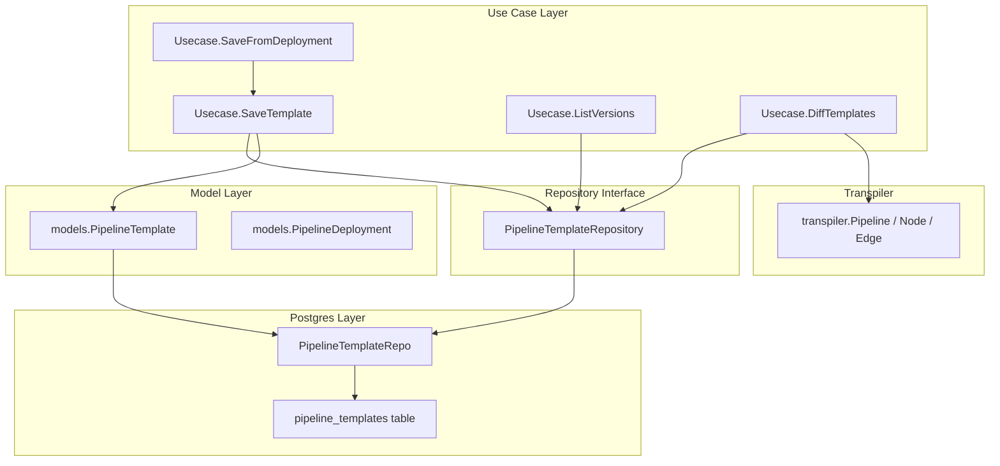
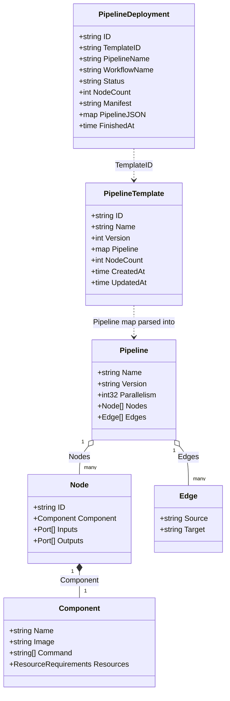
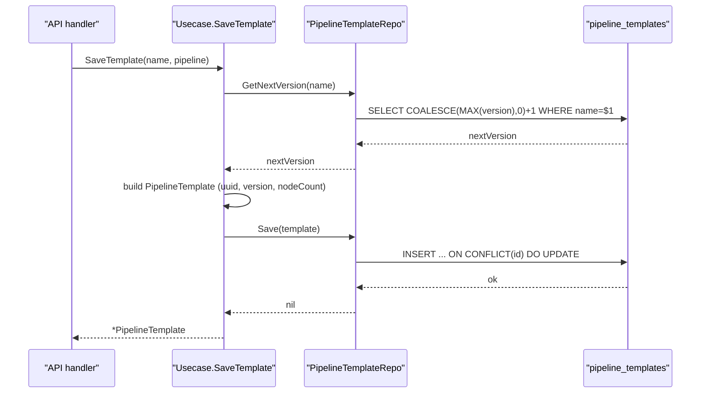
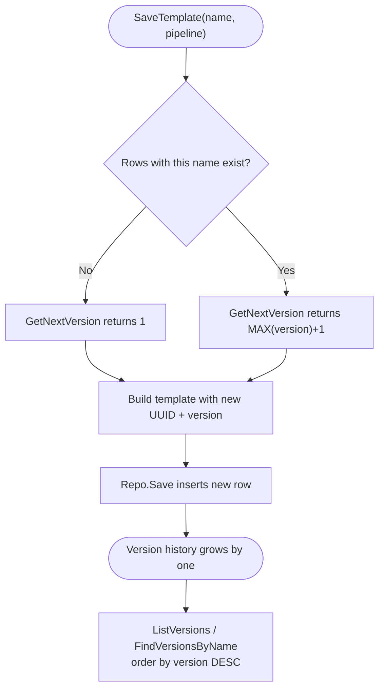
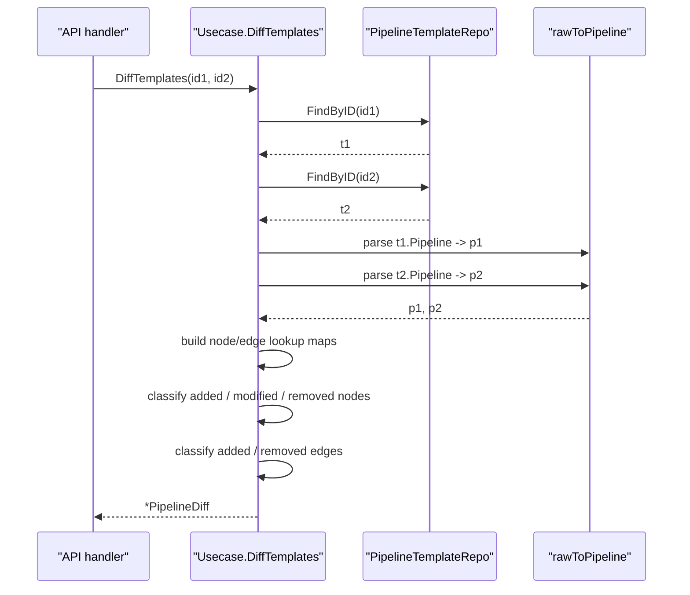
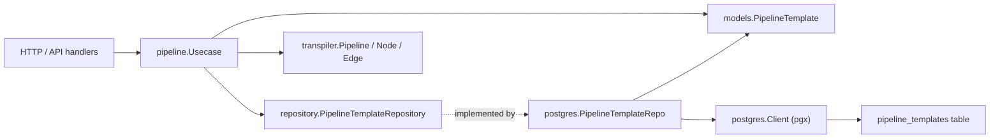

# Pipeline Templates

<cite>
**Referenced Files in This Document**

- [backend/internal/models/pipeline.go](file://backend/internal/models/pipeline.go)
- [backend/internal/usecase/pipeline/usecase.go](file://backend/internal/usecase/pipeline/usecase.go)
- [backend/internal/usecase/pipeline/versioning.go](file://backend/internal/usecase/pipeline/versioning.go)
- [backend/internal/usecase/pipeline/resource_usage.go](file://backend/internal/usecase/pipeline/resource_usage.go)
- [backend/internal/postgres/pipeline_repo.go](file://backend/internal/postgres/pipeline_repo.go)
- [backend/internal/repository/pipeline_repository.go](file://backend/internal/repository/pipeline_repository.go)
- [backend/internal/transpiler/pipeline.go](file://backend/internal/transpiler/pipeline.go)
</cite>

## Table of Contents
1. [Introduction](#introduction)
2. [Project Structure](#project-structure)
3. [Core Components](#core-components)
4. [Architecture Overview](#architecture-overview)
5. [Detailed Component Analysis](#detailed-component-analysis)
6. [Dependency Analysis](#dependency-analysis)
7. [Performance Considerations](#performance-considerations)
8. [Troubleshooting Guide](#troubleshooting-guide)
9. [Conclusion](#conclusion)
10. [Appendices](#appendices)

## Introduction

A **pipeline template** is a reusable, versioned snapshot of a pipeline DAG. Users
design a pipeline in the editor (or generate one programmatically), then **save**
it under a human-friendly name. Every save under the same name produces a new
**version** rather than overwriting the previous one, so the full edit history of a
named pipeline is preserved and any prior version can be re-deployed or compared.

Templates are the durable, *design-time* counterpart to **deployments**, which are
*run-time* records of a pipeline submitted to the Argo workflow engine. A template
carries no execution state; it holds only the pipeline definition (`pipeline`
JSONB), a derived `node_count`, and audit timestamps. The `Usecase` layer exposes
operations to save a template, list a template's version history, fetch or delete a
specific version, derive a new template from an existing deployment, and compute a
structural **diff** between any two template versions.

This page documents the template model, the save-and-version lifecycle, the
PostgreSQL persistence layer, and the structural diff algorithm. Deployment,
lineage, and resource-usage concerns share the same `Usecase` and are referenced
where they intersect with templates.

**Section sources**
- [backend/internal/models/pipeline.go](file://backend/internal/models/pipeline.go#L1-L33)
- [backend/internal/usecase/pipeline/usecase.go](file://backend/internal/usecase/pipeline/usecase.go#L87-L130)

## Project Structure

Pipeline-template logic spans three layers of the backend:

- **Model** — `models.PipelineTemplate` and `models.PipelineDeployment` define the
  data shapes that cross every layer. Templates and deployments live in the same
  file because they are two faces of the same pipeline lifecycle.
- **Use case** — `usecase/pipeline` orchestrates template management. `usecase.go`
  holds the template CRUD methods, the deploy path, the `SaveFromDeployment`
  bridge, and the `DiffTemplates` algorithm. `versioning.go` and `resource_usage.go`
  are sibling helpers (asset-output versioning and per-pod resource reporting) that
  share the package but are not template-specific.
- **Persistence** — `postgres/pipeline_repo.go` implements the
  `PipelineTemplateRepository` and `PipelineDeploymentRepository` interfaces defined
  in `repository/pipeline_repository.go`, mapping templates to the
  `pipeline_templates` table.

The pipeline DAG itself (nodes, edges, components, ports) is defined by the
`transpiler` package; the template stores that DAG as opaque JSON, and the diff
algorithm re-parses it into `transpiler.Pipeline` to compare structure.



**Diagram sources**
- [backend/internal/models/pipeline.go](file://backend/internal/models/pipeline.go#L8-L33)
- [backend/internal/usecase/pipeline/usecase.go](file://backend/internal/usecase/pipeline/usecase.go#L89-L130)
- [backend/internal/repository/pipeline_repository.go](file://backend/internal/repository/pipeline_repository.go#L11-L34)
- [backend/internal/postgres/pipeline_repo.go](file://backend/internal/postgres/pipeline_repo.go#L16-L24)

**Section sources**
- [backend/internal/models/pipeline.go](file://backend/internal/models/pipeline.go#L1-L33)
- [backend/internal/usecase/pipeline/usecase.go](file://backend/internal/usecase/pipeline/usecase.go#L1-L130)
- [backend/internal/postgres/pipeline_repo.go](file://backend/internal/postgres/pipeline_repo.go#L1-L169)

## Core Components

#### The PipelineTemplate model

`PipelineTemplate` is a flat struct serialised to JSON for the API and to JSONB for
storage. The `Pipeline` field is an untyped `map[string]interface{}` so the model
never has to track the evolving DAG schema — the template store is intentionally
schema-agnostic about pipeline internals.

| Field | JSON | Type | Notes |
| --- | --- | --- | --- |
| `ID` | `id` | `string` | UUID assigned at save time |
| `Name` | `name` | `string` | Logical template name; shared across versions |
| `Version` | `version` | `int` | Auto-incremented per name |
| `Pipeline` | `pipeline` | `map[string]interface{}` | Full DAG definition |
| `NodeCount` | `nodeCount` | `int` | Derived from `pipeline["nodes"]` length |
| `CreatedAt` | `createdAt` | `time.Time` | Set on first save |
| `UpdatedAt` | `updatedAt` | `time.Time` | Touched on every save |

The sibling `PipelineDeployment` model adds run-time fields — `TemplateID` (the
template it was deployed from, if any), `WorkflowName`, `Status`, `Manifest`, and
`FinishedAt` — but reuses the same `PipelineJSON` snapshot pattern.

#### The Usecase template API

`Usecase` is the single orchestration point. Its template-facing methods are:

- `SaveTemplate(ctx, name, pipeline)` — version, derive node count, persist.
- `ListVersions(ctx, name)` — every version of a name, newest first.
- `ListTemplates(ctx)` — all templates.
- `GetTemplate(ctx, id)` / `DeleteTemplate(ctx, id)` — single-version access.
- `SaveFromDeployment(ctx, deploymentID, templateName)` — promote a run's
  `PipelineJSON` snapshot back into a new template version.
- `DiffTemplates(ctx, id1, id2)` — structural diff of two versions.

The usecase depends only on the `PipelineTemplateRepository` interface for these
operations, keeping it free of SQL.

#### The repository contract

`PipelineTemplateRepository` declares `Save`, `FindAll`, `FindByID`,
`FindVersionsByName`, `GetNextVersion`, and `Delete`. The Postgres implementation
`PipelineTemplateRepo` satisfies it (the compile-time assertion
`var _ repository.PipelineTemplateRepository = (*PipelineTemplateRepo)(nil)`
enforces this).

**Section sources**
- [backend/internal/models/pipeline.go](file://backend/internal/models/pipeline.go#L5-L33)
- [backend/internal/usecase/pipeline/usecase.go](file://backend/internal/usecase/pipeline/usecase.go#L87-L130)
- [backend/internal/usecase/pipeline/usecase.go](file://backend/internal/usecase/pipeline/usecase.go#L320-L337)
- [backend/internal/repository/pipeline_repository.go](file://backend/internal/repository/pipeline_repository.go#L9-L34)
- [backend/internal/postgres/pipeline_repo.go](file://backend/internal/postgres/pipeline_repo.go#L16-L24)

## Architecture Overview

The model that ties templates, deployments, and the underlying DAG together is best
seen as a class diagram. `PipelineTemplate` and `PipelineDeployment` are linked by
the optional `TemplateID` pointer; both carry an untyped JSON map for the pipeline.
The diff algorithm re-hydrates that map into the strongly-typed `transpiler`
structures.



**Diagram sources**
- [backend/internal/models/pipeline.go](file://backend/internal/models/pipeline.go#L8-L33)
- [backend/internal/transpiler/pipeline.go](file://backend/internal/transpiler/pipeline.go#L5-L85)

**Section sources**
- [backend/internal/models/pipeline.go](file://backend/internal/models/pipeline.go#L1-L33)
- [backend/internal/transpiler/pipeline.go](file://backend/internal/transpiler/pipeline.go#L1-L90)

## Detailed Component Analysis

### Saving a template

`SaveTemplate` is the entry point for persisting a pipeline definition. Its flow:

1. Ask the repository for the next version under `name` via `GetNextVersion`.
2. Build a `PipelineTemplate` with a fresh UUID, the resolved version, the supplied
   `pipeline` map, and `CreatedAt`/`UpdatedAt` set to the current UTC time.
3. Derive `NodeCount` by type-asserting `pipeline["nodes"]` to `[]interface{}` and
   taking its length. If `nodes` is absent or not a slice, `NodeCount` stays `0`.
4. Persist via `templateRepo.Save`, wrapping any error with context.

Because each save allocates a new `ID` and a new `Version`, saves are **append-only
at the logical level**: nothing existing is mutated. (At the row level the
`Save` SQL is an upsert keyed on `ID`, but since `SaveTemplate` always generates a
fresh UUID, the `ON CONFLICT` branch is reached only when an explicit existing `ID`
is re-saved — not on the normal create path.)



**Diagram sources**
- [backend/internal/usecase/pipeline/usecase.go](file://backend/internal/usecase/pipeline/usecase.go#L89-L110)
- [backend/internal/postgres/pipeline_repo.go](file://backend/internal/postgres/pipeline_repo.go#L49-L85)
- [backend/internal/postgres/pipeline_repo.go](file://backend/internal/postgres/pipeline_repo.go#L160-L169)

**Section sources**
- [backend/internal/usecase/pipeline/usecase.go](file://backend/internal/usecase/pipeline/usecase.go#L89-L110)
- [backend/internal/postgres/pipeline_repo.go](file://backend/internal/postgres/pipeline_repo.go#L47-L85)

### Saving a template from a deployment

`SaveFromDeployment` bridges the run-time and design-time worlds. A user who has a
working deployment can promote its exact `PipelineJSON` back into a reusable
template:

1. Load the deployment by ID; return `ErrDeploymentNotFound` if absent.
2. Reject the call if the deployment has no `PipelineJSON` snapshot.
3. Default the template name to `<pipelineName>-from-deployment` when the caller
   passes an empty name.
4. Delegate to `SaveTemplate`, which assigns a fresh version under that name.

This means a template created from a deployment participates in the same
auto-versioning scheme as any directly-saved template.

**Section sources**
- [backend/internal/usecase/pipeline/usecase.go](file://backend/internal/usecase/pipeline/usecase.go#L320-L337)

### Version history and version allocation

Versioning is entirely repository-driven. There is no separate version table; a
version is just another `pipeline_templates` row sharing the same `name`.

- `GetNextVersion` runs `SELECT COALESCE(MAX(version), 0) + 1 FROM
  pipeline_templates WHERE name = $1`. For a brand-new name this yields `1`.
- `FindVersionsByName` returns every row with that name, ordered `version DESC`, so
  the newest version is first.

`ListVersions` on the usecase is a thin pass-through to `FindVersionsByName`.



**Diagram sources**
- [backend/internal/usecase/pipeline/usecase.go](file://backend/internal/usecase/pipeline/usecase.go#L89-L115)
- [backend/internal/postgres/pipeline_repo.go](file://backend/internal/postgres/pipeline_repo.go#L136-L169)

**Section sources**
- [backend/internal/usecase/pipeline/usecase.go](file://backend/internal/usecase/pipeline/usecase.go#L112-L130)
- [backend/internal/postgres/pipeline_repo.go](file://backend/internal/postgres/pipeline_repo.go#L136-L169)

### Reading, listing, and deleting templates

The remaining template reads map directly onto repository methods:

- `ListTemplates` → `FindAll`, returning every template ordered by `created_at
  DESC`. (Note: the interface doc-comment describes "latest version of each", but
  the Postgres `FindAll` query returns *all* rows ordered by `created_at DESC`; it
  does not de-duplicate by name.)
- `GetTemplate(id)` → `FindByID`, which returns `(nil, nil)` when no row matches so
  callers can distinguish "not found" from a hard error.
- `DeleteTemplate(id)` → `Delete`, a no-op when the row is absent.

`scanPipelineTemplate` is the shared row mapper for all read paths. It unmarshals
the `pipeline` JSONB into the `Pipeline` map and substitutes an empty map when the
column is null, so consumers never receive a `nil` pipeline.

**Section sources**
- [backend/internal/usecase/pipeline/usecase.go](file://backend/internal/usecase/pipeline/usecase.go#L117-L130)
- [backend/internal/postgres/pipeline_repo.go](file://backend/internal/postgres/pipeline_repo.go#L28-L134)

### Diffing two template versions

`DiffTemplates(id1, id2)` produces a **structural** diff — added, removed, and
modified nodes plus added and removed edges — between two templates (typically two
versions of the same name, though any two IDs are accepted).

The algorithm:

1. Load both templates by ID; a missing one yields `ErrTemplateNotFound`.
2. Marshal each template's `Pipeline` map back to JSON and parse it through
   `rawToPipeline` into a typed `transpiler.Pipeline` (`Nodes`, `Edges`).
3. Build lookup maps: `nodes1`/`nodes2` keyed by node `ID` (value is the node
   rendered via `nodeToMap`), and `edges1`/`edges2` keyed by `Source|Target`.
4. **Added / modified nodes**: iterate `p2.Nodes`. If a node ID is absent from
   `nodes1`, it is *added*. If present but `mapsEqual` reports the rendered maps
   differ, it is *modified*.
5. **Removed nodes**: iterate `p1.Nodes`; any ID absent from `nodes2` is *removed*.
6. **Added / removed edges**: compare the two edge key sets symmetrically.

Equality is determined by `mapsEqual`, which marshals both node maps to JSON and
compares the byte strings — a deterministic but ordering-sensitive comparison
(Go's `encoding/json` sorts map keys, so semantically equal maps compare equal).
`nodeToMap` includes `id`, `component` (name/image/command/resources), `inputs`,
and `outputs`; only these fields participate in modification detection.



**Diagram sources**
- [backend/internal/usecase/pipeline/usecase.go](file://backend/internal/usecase/pipeline/usecase.go#L673-L766)
- [backend/internal/usecase/pipeline/usecase.go](file://backend/internal/usecase/pipeline/usecase.go#L832-L838)

**Section sources**
- [backend/internal/usecase/pipeline/usecase.go](file://backend/internal/usecase/pipeline/usecase.go#L648-L828)
- [backend/internal/transpiler/pipeline.go](file://backend/internal/transpiler/pipeline.go#L5-L90)

### Persistence layer details

`PipelineTemplateRepo` owns the SQL. The `Save` statement is an upsert:

```sql
INSERT INTO pipeline_templates (id, name, version, pipeline, node_count, created_at, updated_at)
VALUES ($1, $2, $7, $3::jsonb, $4, $5, $6)
ON CONFLICT (id) DO UPDATE SET ...
```

Note the parameter ordering: `version` is bound to `$7` (passed last in the `Exec`
argument list) while `pipeline` casts `$3` to `jsonb`. `Save` also defensively
assigns a UUID if `ID` is empty, sets `CreatedAt` when zero, always refreshes
`UpdatedAt`, and substitutes `{}` when the marshalled pipeline is empty so the
JSONB column is never null.

The shared `pipelineTemplateSelectCols` constant (`id, name, version, pipeline,
node_count, created_at, updated_at`) is reused by `FindAll`, `FindByID`, and
`FindVersionsByName` to keep the column list and the `scanPipelineTemplate` field
order in lockstep.

**Section sources**
- [backend/internal/postgres/pipeline_repo.go](file://backend/internal/postgres/pipeline_repo.go#L26-L169)

## Dependency Analysis

The template subsystem has a clean, layered dependency graph. The usecase depends
on the repository *interface*, not the Postgres implementation; the diff path is
the only place that reaches into the `transpiler` types.



- **`models`** is dependency-free (only `time`); every layer imports it.
- **`Usecase`** imports `models`, `repository`, `transpiler`, `argo`, and `uuid`.
  Its template methods touch only `models`, `repository`, and (for diff)
  `transpiler`.
- **`PipelineTemplateRepo`** imports `models`, `repository`, `uuid`, and the
  Postgres `Client`. It is wired to the interface via the compile-time assertion.
- The **diff** path is the sole consumer of `transpiler` from the template flow; it
  re-parses stored JSON rather than persisting typed DAGs.

**Diagram sources**
- [backend/internal/usecase/pipeline/usecase.go](file://backend/internal/usecase/pipeline/usecase.go#L1-L42)
- [backend/internal/postgres/pipeline_repo.go](file://backend/internal/postgres/pipeline_repo.go#L1-L24)
- [backend/internal/repository/pipeline_repository.go](file://backend/internal/repository/pipeline_repository.go#L1-L34)

**Section sources**
- [backend/internal/usecase/pipeline/usecase.go](file://backend/internal/usecase/pipeline/usecase.go#L1-L62)
- [backend/internal/postgres/pipeline_repo.go](file://backend/internal/postgres/pipeline_repo.go#L1-L24)
- [backend/internal/models/pipeline.go](file://backend/internal/models/pipeline.go#L1-L3)

## Performance Considerations

#### Version allocation and the read-then-write race

`GetNextVersion` and the subsequent `Save` are two separate statements, not a single
atomic upsert. Two concurrent `SaveTemplate` calls for the *same* name could each
read the same `MAX(version)` and attempt to write the same version number. Because
each call uses a distinct generated `ID`, the `ON CONFLICT (id)` clause will not
catch the collision; the result would be two rows with the same `(name, version)`.
A unique constraint on `(name, version)` or wrapping both statements in a
transaction would close this window. Under normal single-editor usage the window is
negligible.

#### JSONB payload size

The entire pipeline DAG is stored as JSONB in the `pipeline` column. Large DAGs (or
embedded inline script `source` bodies on components) inflate row size and the diff
cost, since `DiffTemplates` marshals and re-parses both pipelines and JSON-marshals
every node twice through `mapsEqual` / `nodeToMap`. For typical pipelines this is
trivial, but the diff is O(N) marshal operations over node count.

#### Listing and indexing

`FindAll` (`ORDER BY created_at DESC`) and `FindVersionsByName` (`WHERE name = $1
ORDER BY version DESC`) are unbounded reads with no `LIMIT`. An index on `name`
benefits both `FindVersionsByName` and `GetNextVersion`; without one, version
allocation degrades to a full-table `MAX` scan as the table grows.

#### Deployment status refresh (adjacent)

While not a template path, `ListDeployments` caps active-status Argo refreshes at
`maxActiveDeploymentStatusRefresh` (50) to avoid an N+1 storm of workflow-status
calls — a useful pattern when a list view shows templates alongside their
deployments.

**Section sources**
- [backend/internal/usecase/pipeline/usecase.go](file://backend/internal/usecase/pipeline/usecase.go#L89-L110)
- [backend/internal/usecase/pipeline/usecase.go](file://backend/internal/usecase/pipeline/usecase.go#L341-L372)
- [backend/internal/postgres/pipeline_repo.go](file://backend/internal/postgres/pipeline_repo.go#L87-L169)

## Troubleshooting Guide

#### `template not found` from a diff or deploy

`DiffTemplates` and `DeployByTemplateID` return `ErrTemplateNotFound` when
`FindByID` yields `(nil, nil)`. This means the supplied ID does not exist — confirm
you passed a template **ID** (UUID), not a template **name**, and that the version
was not deleted.

#### A node shows as "modified" when it looks identical

Modification is decided by `mapsEqual`, which compares the JSON serialisation of
`nodeToMap` output. `nodeToMap` only includes `id`, `component`
(name/image/command/resources), `inputs`, and `outputs`. A change to any of these —
including a reordered `command` slice — registers as modified; changes to fields
*outside* this projection (for example a node's `sub_nodes` or `volume_mounts`) are
**not** detected by the diff.

#### Two rows with the same version

If duplicate `(name, version)` rows appear, suspect the concurrent
`GetNextVersion`/`Save` race described under Performance. The `Save` upsert keys
only on `ID`, so it cannot prevent this; resolve by adding a `(name, version)`
unique constraint and reconciling duplicates.

#### `nodeCount` is zero for a non-empty pipeline

`SaveTemplate` derives `NodeCount` only from `pipeline["nodes"].([]interface{})`. If
the saved JSON uses a different key or the value is not a JSON array of objects, the
count silently stays `0` even though the DAG has nodes.

#### Empty or null pipeline on read

`scanPipelineTemplate` substitutes an empty map when the JSONB is null, and `Save`
writes `{}` rather than null. A persistently empty `pipeline` therefore points to an
empty payload supplied at save time, not a read-side defect.

**Section sources**
- [backend/internal/usecase/pipeline/usecase.go](file://backend/internal/usecase/pipeline/usecase.go#L103-L105)
- [backend/internal/usecase/pipeline/usecase.go](file://backend/internal/usecase/pipeline/usecase.go#L674-L688)
- [backend/internal/usecase/pipeline/usecase.go](file://backend/internal/usecase/pipeline/usecase.go#L768-L828)
- [backend/internal/postgres/pipeline_repo.go](file://backend/internal/postgres/pipeline_repo.go#L28-L85)

## Conclusion

Pipeline templates give cyber-databrew a durable, versioned library of pipeline
designs. The model is deliberately thin — a name, an auto-incrementing version, an
opaque JSONB DAG, and timestamps — which keeps the persistence layer schema-stable
as the pipeline format evolves. Versioning is achieved without a dedicated version
table by computing the next version from `MAX(version)` per name. The structural
diff re-hydrates stored JSON into typed `transpiler` DAGs and classifies node and
edge changes, powering version-comparison features in the editor. Templates also
interoperate with deployments via `TemplateID`, `DeployByTemplateID`, and
`SaveFromDeployment`, closing the loop between design-time and run-time.

## Appendices

### Appendix A — PipelineTemplateRepository methods

| Method | SQL behaviour | Usecase caller |
| --- | --- | --- |
| `Save` | upsert on `id`; assigns UUID/timestamps; `{}` for null JSONB | `SaveTemplate` |
| `FindAll` | `ORDER BY created_at DESC`, all rows | `ListTemplates` |
| `FindByID` | single row; `(nil,nil)` if absent | `GetTemplate`, `DiffTemplates`, `DeployByTemplateID` |
| `FindVersionsByName` | `WHERE name=$1 ORDER BY version DESC` | `ListVersions` |
| `GetNextVersion` | `COALESCE(MAX(version),0)+1 WHERE name=$1` | `SaveTemplate` |
| `Delete` | `DELETE WHERE id=$1`; no-op if absent | `DeleteTemplate` |

### Appendix B — PipelineDiff result shape

| Field | JSON | Element type | Meaning |
| --- | --- | --- | --- |
| `AddedNodes` | `added_nodes` | `DiffNode` | In v2, not v1 |
| `RemovedNodes` | `removed_nodes` | `DiffNode` | In v1, not v2 |
| `ModifiedNodes` | `modified_nodes` | `DiffNode` | Same ID, different projection |
| `AddedEdges` | `added_edges` | `DiffEdge` | `Source|Target` only in v2 |
| `RemovedEdges` | `removed_edges` | `DiffEdge` | `Source|Target` only in v1 |

`DiffNode` carries `id`, optional `component`, `inputs`, and `outputs`; `DiffEdge`
carries `source` and `target`.

**Section sources**
- [backend/internal/usecase/pipeline/usecase.go](file://backend/internal/usecase/pipeline/usecase.go#L650-L671)
- [backend/internal/postgres/pipeline_repo.go](file://backend/internal/postgres/pipeline_repo.go#L47-L169)

### Appendix C — Tables touched

| Table | Columns | Owner |
| --- | --- | --- |
| `pipeline_templates` | `id, name, version, pipeline, node_count, created_at, updated_at` | `PipelineTemplateRepo` |
| `pipeline_deployments` | `id, template_id, pipeline_name, workflow_name, status, node_count, manifest, pipeline_json, created_at, updated_at, finished_at` | `PipelineDeploymentRepo` |

**Section sources**
- [backend/internal/postgres/pipeline_repo.go](file://backend/internal/postgres/pipeline_repo.go#L26-L26)
- [backend/internal/postgres/pipeline_repo.go](file://backend/internal/postgres/pipeline_repo.go#L187-L188)
</content>
</invoke>
