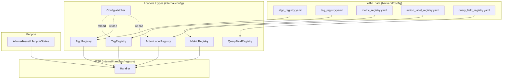
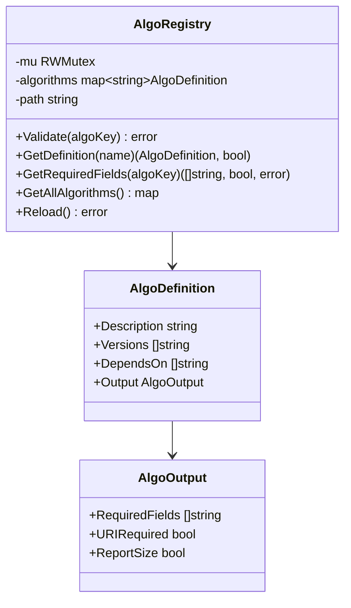
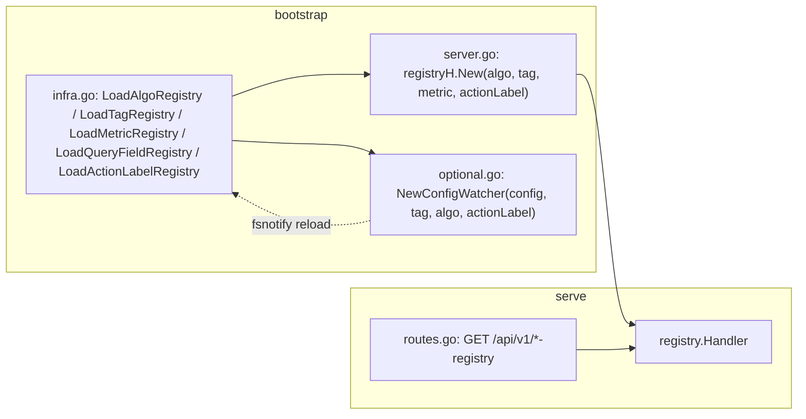
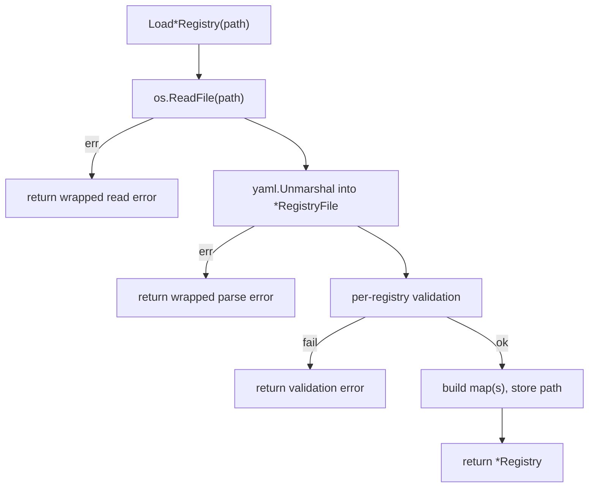
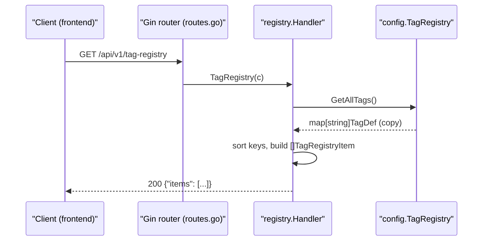
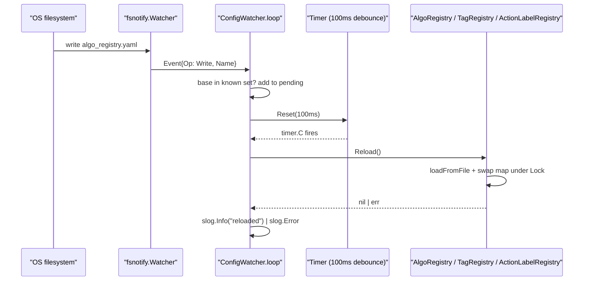
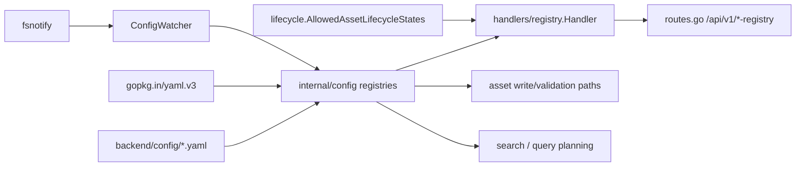

# Registry Module

<cite>
**Referenced Files in This Document**

- [backend/internal/handlers/registry/handler.go](file://backend/internal/handlers/registry/handler.go)
- [backend/internal/config/action_label_registry.go](file://backend/internal/config/action_label_registry.go)
- [backend/internal/config/algo_registry.go](file://backend/internal/config/algo_registry.go)
- [backend/internal/config/config.go](file://backend/internal/config/config.go)
- [backend/internal/config/metric_registry.go](file://backend/internal/config/metric_registry.go)
- [backend/internal/config/query_field_registry.go](file://backend/internal/config/query_field_registry.go)
- [backend/internal/config/tag_registry.go](file://backend/internal/config/tag_registry.go)
- [backend/internal/config/watcher.go](file://backend/internal/config/watcher.go)
- [backend/internal/lifecycle/states.go](file://backend/internal/lifecycle/states.go)
- [backend/cmd/server/infra.go](file://backend/cmd/server/infra.go)
- [backend/cmd/server/optional.go](file://backend/cmd/server/optional.go)
- [backend/cmd/server/server.go](file://backend/cmd/server/server.go)
- [backend/routes/routes.go](file://backend/routes/routes.go)
- [backend/config/action_label_registry.yaml](file://backend/config/action_label_registry.yaml)
- [backend/config/algo_registry.yaml](file://backend/config/algo_registry.yaml)
- [backend/config/metric_registry.yaml](file://backend/config/metric_registry.yaml)
- [backend/config/query_field_registry.yaml](file://backend/config/query_field_registry.yaml)
- [backend/config/tag_registry.yaml](file://backend/config/tag_registry.yaml)
</cite>

## Table of Contents
1. [Introduction](#introduction)
2. [Project Structure](#project-structure)
3. [Core Components](#core-components)
4. [Architecture Overview](#architecture-overview)
5. [Detailed Component Analysis](#detailed-component-analysis)
6. [Dependency Analysis](#dependency-analysis)
7. [Performance Considerations](#performance-considerations)
8. [Troubleshooting Guide](#troubleshooting-guide)
9. [Conclusion](#conclusion)
10. [Appendices](#appendices)

## Introduction

The **Registry module** is the cyber-databrew backend's source of truth for the
controlled vocabularies and contracts that constrain user- and worker-supplied
data. Rather than hard-coding which algorithms exist, which tag keys are legal,
which metrics may be queried, or which action labels an annotation may carry,
the platform reads these definitions from a small set of **YAML files under
`backend/config/`** and loads them into typed, concurrency-safe in-memory
registries at process start. The same registries are then exposed read-only to
the frontend through a thin HTTP handler so that clients can render dropdowns,
validate forms, and present human-readable labels without duplicating the
backend's rules.

There are five registries plus one static enum:

- **Algo registry** — registered algorithms, their versions, dependencies, and
  per-algorithm output contracts (`required_fields`, `uri_required`).
- **Tag registry** — known tag keys with their value rules (enum / string),
  plus a `tag_sources[]` contract governing who may write each source and which
  identity fields they must supply.
- **Metric registry** — metric definitions used by evaluation and search,
  including the `queryable` flag and aggregation defaults.
- **Action-label registry** — the allowed `primary_labels` and `labels` for
  action annotations.
- **Query-field registry** — per-resource field capability matrix describing
  which engines (postgres / elasticsearch) may filter, sort, or facet on each
  field.
- **Lifecycle states** — a compiled-in slice mirroring the PostgreSQL
  `chk_lifecycle_state` CHECK constraint, served for client convenience.

The registries serve two audiences. Backend write paths call `Validate*`
methods to reject illegal algorithm keys, tag values, source contracts, and
action labels before they reach the database. The frontend consumes the
read-only endpoints under `/api/v1/*-registry` to drive its UI. A **config
watcher** keeps a subset of the registries hot-reloadable so operators can edit
the YAML in place without restarting the server.

**Section sources**
- [backend/internal/handlers/registry/handler.go](file://backend/internal/handlers/registry/handler.go#L1-L140)
- [backend/cmd/server/infra.go](file://backend/cmd/server/infra.go#L49-L74)

## Project Structure

The module is split across three areas: the **loaders/types** under
`backend/internal/config/`, the **YAML data** under `backend/config/`, and the
**HTTP handler** under `backend/internal/handlers/registry/`. Wiring lives in
`backend/cmd/server/` (construction and watcher start) and `backend/routes/`
(route registration).

**Diagram sources**
- [backend/internal/handlers/registry/handler.go](file://backend/internal/handlers/registry/handler.go#L13-L33)
- [backend/internal/config/watcher.go](file://backend/internal/config/watcher.go#L13-L43)
- [backend/cmd/server/infra.go](file://backend/cmd/server/infra.go#L49-L74)

Key files:

- `backend/internal/config/algo_registry.go` — `AlgoRegistry`, `AlgoDefinition`,
  `AlgoOutput`, loader, `Validate`, `GetRequiredFields`, `GetAllAlgorithms`.
- `backend/internal/config/tag_registry.go` — `TagRegistry`, `TagDef`,
  `TagSourceDef`, loader, `Validate`, `ValidateSource`, `ShouldPropagate`.
- `backend/internal/config/metric_registry.go` — `MetricRegistry`,
  `MetricDefinition`, loader, `IsQueryable`, `Get`, `All`.
- `backend/internal/config/action_label_registry.go` — `ActionLabelRegistry`,
  loader, `Validate`, `PrimaryLabels`, `Labels`.
- `backend/internal/config/query_field_registry.go` — `QueryFieldRegistry`,
  `QueryFieldDefinition`, loader, `Get`, `ResourceFields`, `EnginesFor`.
- `backend/internal/config/watcher.go` — `ConfigWatcher` fsnotify loop.
- `backend/internal/handlers/registry/handler.go` — read-only HTTP handler.
- `backend/internal/lifecycle/states.go` — `AllowedAssetLifecycleStates`.

**Section sources**
- [backend/internal/config/algo_registry.go](file://backend/internal/config/algo_registry.go#L1-L47)
- [backend/internal/config/tag_registry.go](file://backend/internal/config/tag_registry.go#L1-L54)
- [backend/internal/config/query_field_registry.go](file://backend/internal/config/query_field_registry.go#L1-L58)

## Core Components

### The five registry types

Each registry follows the same shape: a struct embedding a `sync.RWMutex`, one
or more maps holding the parsed definitions, and the `path` of the YAML file it
was loaded from (so it can be re-read on reload). A package-level `Load*`
constructor reads and parses the file once; a lower-case `load*FromFile` helper
does the actual `os.ReadFile` + `yaml.Unmarshal` + validation and is reused by
`Reload`.

`AlgoRegistry` stores `map[string]AlgoDefinition` keyed by algorithm name. An
`AlgoDefinition` carries a `Versions` list, a `DependsOn` list of `name@version`
keys, and an `AlgoOutput` describing the output contract.

**Diagram sources**
- [backend/internal/config/algo_registry.go](file://backend/internal/config/algo_registry.go#L12-L47)

`TagRegistry` holds two maps: `tags` keyed by tag key (`TagDef`) and `sources`
keyed by source type (`TagSourceDef`). `TagDef.Type` is either `"enum"` (then
`Values` lists the allowed values) or `"string"` (then `MaxLength` bounds the
length). `TagDef.Propagation` is `"none"` by default or `"descendants"` to
trigger parent→child tag propagation (CYB-1068).

`MetricRegistry` maps metric `Key` → `MetricDefinition`. The YAML lists metrics
as a sequence; the loader re-keys them by `Key`. `MetricDefinition` doubles as
both the YAML and JSON shape (it carries both `yaml:` and `json:` tags), so the
handler can return the parsed struct verbatim.

`ActionLabelRegistry` stores two sets (`map[string]struct{}`) — `primaryLabels`
and `labels` — for O(1) membership checks during validation, while exposing
sorted slices for the API.

`QueryFieldRegistry` is two levels deep: `resources` maps a resource name (e.g.
`assets`) to a map of field name → `QueryFieldDefinition`. Each definition lists
the engines that may `filter`, `sort`, and `facet` on that field;
`SupportedEngines()` deduplicates and sorts the union.

**Section sources**
- [backend/internal/config/tag_registry.go](file://backend/internal/config/tag_registry.go#L11-L44)
- [backend/internal/config/metric_registry.go](file://backend/internal/config/metric_registry.go#L11-L33)
- [backend/internal/config/action_label_registry.go](file://backend/internal/config/action_label_registry.go#L12-L22)
- [backend/internal/config/query_field_registry.go](file://backend/internal/config/query_field_registry.go#L13-L50)

### The HTTP handler

`registry.Handler` holds pointers to four of the registries — algo, tag, metric,
and action-label — injected through `New`. The query-field registry is not part
of this handler (its capabilities are consumed internally by search/query code,
not exposed through these endpoints). Each handler method reads its registry's
snapshot accessor and serializes a stable JSON shape.

**Section sources**
- [backend/internal/handlers/registry/handler.go](file://backend/internal/handlers/registry/handler.go#L13-L63)

### Static lifecycle states

`lifecycle.AllowedAssetLifecycleStates` is a compiled-in `[]string` that mirrors
the PostgreSQL `chk_lifecycle_state` CHECK constraint in display order. It is the
one "registry" that is not YAML-backed; the `LifecycleStates` handler returns it
directly so clients share the backend's canonical ordering.

**Section sources**
- [backend/internal/lifecycle/states.go](file://backend/internal/lifecycle/states.go#L1-L17)
- [backend/internal/handlers/registry/handler.go](file://backend/internal/handlers/registry/handler.go#L107-L112)

## Architecture Overview

Registries are loaded eagerly during server bootstrap in
`backend/cmd/server/infra.go`. The algo and tag registries are **required** — a
load failure calls `os.Exit(1)`. The metric registry is also fatal on failure.
The query-field and action-label registries are **best-effort**: on failure they
log a warning and fall back to `nil`, and the consuming code degrades gracefully
(query fields fall back to postgres-only defaults; action-label validation is
disabled). The loaded registries are passed to `registry.New(...)` in
`backend/cmd/server/server.go`, and their routes are mounted in
`backend/routes/routes.go`.

**Diagram sources**
- [backend/cmd/server/infra.go](file://backend/cmd/server/infra.go#L49-L74)
- [backend/cmd/server/server.go](file://backend/cmd/server/server.go#L13-L46)
- [backend/cmd/server/optional.go](file://backend/cmd/server/optional.go#L405-L411)
- [backend/routes/routes.go](file://backend/routes/routes.go#L239-L244)

**Section sources**
- [backend/cmd/server/infra.go](file://backend/cmd/server/infra.go#L49-L74)
- [backend/routes/routes.go](file://backend/routes/routes.go#L239-L244)

## Detailed Component Analysis

### Registry loading and validation

Every loader funnels through a private `load*FromFile` helper so the
load-once and reload paths share identical parsing and validation. The pattern
is: `os.ReadFile`, wrap any read error with the registry name; `yaml.Unmarshal`
into a file-shaped struct; validate; return the in-memory map.

Validation differs per registry and is enforced at load time so a malformed file
fails fast rather than producing silent gaps:

- **Algo**: every algorithm must have a non-empty `Versions` list, else
  `algo_registry: algorithm %q has empty version list`.
- **Tag**: `tag_sources[]` entries with an empty `source` are skipped; sources
  are re-keyed by `source`.
- **Metric**: metrics are re-keyed by `Key`; no other validation.
- **Action-label**: `labels` must be non-empty (`labels must not be empty`);
  both lists become membership sets.
- **Query-field**: must have at least one resource; each resource must have at
  least one field; field names must be non-empty and unique within a resource;
  each field must declare at least one engine across filter/sort/facet.

**Diagram sources**
- [backend/internal/config/algo_registry.go](file://backend/internal/config/algo_registry.go#L41-L68)
- [backend/internal/config/query_field_registry.go](file://backend/internal/config/query_field_registry.go#L52-L95)

**Section sources**
- [backend/internal/config/algo_registry.go](file://backend/internal/config/algo_registry.go#L41-L103)
- [backend/internal/config/tag_registry.go](file://backend/internal/config/tag_registry.go#L46-L116)
- [backend/internal/config/action_label_registry.go](file://backend/internal/config/action_label_registry.go#L24-L88)
- [backend/internal/config/query_field_registry.go](file://backend/internal/config/query_field_registry.go#L52-L95)

### The algo-key contract

The algo registry encodes the platform's `name@version` key convention.
`parseAlgoKey` splits on the **last** `@`, rejecting keys with no separator, a
leading `@`, or a trailing `@`. `Validate` first parses, then checks the name is
registered, then checks the version is in that algorithm's `Versions` list.
`GetRequiredFields` resolves an algo key to its output contract
(`RequiredFields`, `URIRequired`) so the asset write path can enforce that
worker outputs carry the mandated fields. `GetAllAlgorithms` returns a defensive
copy of the map, which the handler iterates to flatten each algorithm into one
JSON item per version.

**Section sources**
- [backend/internal/config/algo_registry.go](file://backend/internal/config/algo_registry.go#L82-L154)
- [backend/internal/handlers/registry/handler.go](file://backend/internal/handlers/registry/handler.go#L43-L63)

### Tag value and source contracts

`TagRegistry.Validate(key, value)` enforces enum membership or string length
depending on `TagDef.Type`, returning a descriptive error that includes the
allowed values for enums. `ValidateSource` enforces the per-source identity
contract for `asset_tags` writes: an unknown source returns `ErrUnknownSource`
(translated to HTTP 422 by callers), and a registered source missing a required
identity field returns `ErrSourceContract`. A deliberate back-compat rule:
when the registry has **no** `tag_sources` block at all (`len(r.sources) == 0`),
`ValidateSource` returns `nil` so environments that have not yet configured
sources are not blocked. `ShouldPropagate` reports whether a key is registered
with `propagation: descendants` (CYB-1068), driving parent→child tag
propagation.

**Section sources**
- [backend/internal/config/tag_registry.go](file://backend/internal/config/tag_registry.go#L90-L192)

### Query-field engine capability matrix

`QueryFieldDefinition.SupportedEngines()` unions the filter/sort/facet engine
lists, skipping empty strings and deduplicating, then sorts the result.
`Get(resource, field)` returns a single field's definition; `ResourceFields`
returns all fields for a resource sorted by name; `EnginesFor` returns a cloned
sorted engine list for a field. This registry lets query planners decide whether
a requested filter/sort/facet can be served by Postgres, Elasticsearch, or both
for a given resource and field.

**Section sources**
- [backend/internal/config/query_field_registry.go](file://backend/internal/config/query_field_registry.go#L20-L37)
- [backend/internal/config/query_field_registry.go](file://backend/internal/config/query_field_registry.go#L108-L144)

### Serving a registry read

The HTTP methods are thin and defensive. `AlgoRegistry` flattens each algorithm
into one item per version, defaulting a `nil` `DependsOn` to an empty slice so
the JSON is always an array. `TagRegistry` sorts keys for a deterministic order
and only emits `Values` for enum types and `MaxLength` when positive.
`MetricRegistry` and `ActionLabelRegistry` guard against a `nil` registry
(returning empty payloads) so the endpoints still respond when the best-effort
load failed at bootstrap.

**Diagram sources**
- [backend/internal/handlers/registry/handler.go](file://backend/internal/handlers/registry/handler.go#L74-L105)
- [backend/internal/config/tag_registry.go](file://backend/internal/config/tag_registry.go#L118-L127)
- [backend/routes/routes.go](file://backend/routes/routes.go#L239-L244)

**Section sources**
- [backend/internal/handlers/registry/handler.go](file://backend/internal/handlers/registry/handler.go#L43-L140)

### The config watcher (hot reload)

`ConfigWatcher` wraps an `fsnotify.Watcher` added to the `config` directory and
holds references to the **tag, algo, and action-label** registries — the three
that support hot reload. (Metric and query-field registries are not watched and
require a restart to pick up changes.) `NewConfigWatcher` starts a `loop`
goroutine and returns; `Stop` closes the `done` channel, closes the watcher, and
waits for the goroutine to exit.

The loop debounces rapid saves: it only reacts to `Write`/`Create` ops on the
three known basenames, collects pending file names in a set, and resets a
100 ms timer. When the timer fires, it calls the matching registry's `Reload()`,
logging success or failure. A reload that fails (e.g. invalid YAML) is logged
and leaves the previous good snapshot in place, because `Reload` only swaps the
internal map after a successful parse.

**Diagram sources**
- [backend/internal/config/watcher.go](file://backend/internal/config/watcher.go#L45-L107)
- [backend/internal/config/algo_registry.go](file://backend/internal/config/algo_registry.go#L70-L80)

**Section sources**
- [backend/internal/config/watcher.go](file://backend/internal/config/watcher.go#L13-L114)
- [backend/cmd/server/optional.go](file://backend/cmd/server/optional.go#L405-L411)

## Dependency Analysis

The registries depend only on the standard library plus `gopkg.in/yaml.v3` for
parsing and `github.com/fsnotify/fsnotify` for the watcher. They have no
database or network dependencies, which keeps load deterministic and the read
endpoints cheap. Downstream, the registries are consumed by the asset write
paths (algo/tag/source/action-label validation), by search/query planning
(query-field capabilities), and by the frontend through the read endpoints.

**Diagram sources**
- [backend/internal/config/watcher.go](file://backend/internal/config/watcher.go#L1-L43)
- [backend/internal/handlers/registry/handler.go](file://backend/internal/handlers/registry/handler.go#L1-L33)

**Section sources**
- [backend/internal/config/metric_registry.go](file://backend/internal/config/metric_registry.go#L1-L9)
- [backend/internal/config/query_field_registry.go](file://backend/internal/config/query_field_registry.go#L1-L11)
- [backend/cmd/server/server.go](file://backend/cmd/server/server.go#L13-L46)

## Performance Considerations

- **Read-mostly, lock-light.** All accessors take `RWMutex.RLock`, so concurrent
  reads (validation calls and HTTP serves) do not contend. Writes happen only on
  `Reload`, which holds the write lock for the duration of a single map swap —
  the parse happens *before* the lock is taken, so the critical section is
  minimal.
- **Defensive copies.** `GetAllAlgorithms` and `GetAllTags` return shallow copies
  of their maps so callers can iterate without holding the lock. For these small
  registries (tens of entries) the copy cost is negligible.
- **In-memory, no I/O on the hot path.** Validation and read endpoints never
  touch disk; the only file I/O is at load and on debounced reload. The 100 ms
  debounce coalesces editor "save storms" into a single re-parse.
- **Handler serialization.** `TagRegistry`, `MetricRegistry`,
  `ActionLabelRegistry`, and `LifecycleStates` produce sorted output for stable,
  diff-friendly responses; sorting is O(n log n) over a small n per request.
- **Best-effort registries.** Because query-field and action-label loads are
  non-fatal, a bad file degrades a feature rather than blocking startup, but it
  also means a typo can silently disable validation — see Troubleshooting.

**Section sources**
- [backend/internal/config/algo_registry.go](file://backend/internal/config/algo_registry.go#L135-L145)
- [backend/internal/config/tag_registry.go](file://backend/internal/config/tag_registry.go#L118-L127)
- [backend/internal/config/watcher.go](file://backend/internal/config/watcher.go#L45-L72)

## Troubleshooting Guide

- **Server exits at startup with `failed to load algo registry` / `tag registry`
  / `metric registry`.** These three loads are fatal (`os.Exit(1)`). Check the
  YAML for syntax errors and the per-registry validation rules (algorithms with
  empty `versions`, malformed YAML). The error message is prefixed with the
  registry name and wraps the underlying read/parse error.
- **Action-label validation silently disabled.** If
  `action_label_registry.yaml` fails to load (e.g. empty `labels`), the server
  logs `failed to load action label registry; action label validation disabled`
  and sets the registry to `nil`. The handler then returns empty `primary_labels`
  / `labels`, and the write path skips validation.
- **Query fields fall back to postgres-only.** A bad `query_field_registry.yaml`
  logs `failed to load query field registry; ... fall back to postgres-only
  defaults` and disables the capability matrix.
- **Edited YAML didn't take effect.** Only tag, algo, and action-label files are
  watched; metric and query-field changes require a restart. Confirm the file
  basename matches exactly (`algo_registry.yaml`, `tag_registry.yaml`,
  `action_label_registry.yaml`) — the watcher ignores any other name. Look for
  `..._registry reloaded` (success) or `... reload failed` (the previous snapshot
  is retained on parse error).
- **Tag write rejected with 422 unknown source.** The `source_type` is not in
  `tag_sources[]`. Note that if the whole `tag_sources` block is absent,
  validation is skipped entirely (back-compat).
- **Algo key rejected.** Ensure the format is `<name>@<version>` with both parts
  registered; `parseAlgoKey` rejects missing/leading/trailing `@`.

**Section sources**
- [backend/cmd/server/infra.go](file://backend/cmd/server/infra.go#L49-L74)
- [backend/internal/config/action_label_registry.go](file://backend/internal/config/action_label_registry.go#L36-L59)
- [backend/internal/config/tag_registry.go](file://backend/internal/config/tag_registry.go#L129-L173)
- [backend/internal/config/watcher.go](file://backend/internal/config/watcher.go#L65-L107)

## Conclusion

The Registry module centralizes the platform's controlled vocabularies in
small, validated YAML files and exposes them through typed, lock-safe in-memory
registries. It serves a dual role — enforcing contracts on backend write and
query paths, and feeding the frontend canonical lists for its UI — while a
debounced fsnotify watcher keeps the tag, algo, and action-label registries
hot-reloadable. Fatal loads (algo, tag, metric) guard correctness at boot;
best-effort loads (query-field, action-label) trade strictness for resilience.

## Appendices

### A. Read-only registry endpoints

| Method | Path | Handler | Response shape |
| --- | --- | --- | --- |
| GET | `/api/v1/algo-registry` | `AlgoRegistry` | `{"items": [{key, name, version, depends_on}]}` |
| GET | `/api/v1/tag-registry` | `TagRegistry` | `{"items": [{key, description?, type, values?, max_length?}]}` |
| GET | `/api/v1/metric-registry` | `MetricRegistry` | `{"items": [MetricDefinition...]}` (sorted by key) |
| GET | `/api/v1/action-label-registry` | `ActionLabelRegistry` | `{"primary_labels": [...], "labels": [...]}` |
| GET | `/api/v1/lifecycle-states` | `LifecycleStates` | `{"items": [...]}` |

**Section sources**
- [backend/routes/routes.go](file://backend/routes/routes.go#L239-L244)
- [backend/internal/handlers/registry/handler.go](file://backend/internal/handlers/registry/handler.go#L35-L140)

### B. YAML file shapes and validation rules

| File | Top-level keys | Validation |
| --- | --- | --- |
| `algo_registry.yaml` | `algorithms{}` (`description`, `versions`, `depends_on`, `output{required_fields, uri_required, report_size}`) | non-empty `versions` per algorithm |
| `tag_registry.yaml` | `tag_sources[]`, `tags{}` (`type`, `values`, `max_length`, `propagation`) | sources with empty `source` skipped |
| `metric_registry.yaml` | `metrics[]` (`key`, `display_name`, `metric_type`, `queryable`, ...) | re-keyed by `key` |
| `action_label_registry.yaml` | `primary_labels[]`, `labels[]` | `labels` non-empty |
| `query_field_registry.yaml` | `schema_version`, `resources{<name>{fields[]}}` | ≥1 resource, ≥1 field/resource, unique non-empty field names, ≥1 engine/field |

**Section sources**
- [backend/config/algo_registry.yaml](file://backend/config/algo_registry.yaml#L1-L49)
- [backend/config/tag_registry.yaml](file://backend/config/tag_registry.yaml#L16-L74)
- [backend/config/metric_registry.yaml](file://backend/config/metric_registry.yaml#L1-L40)
- [backend/config/action_label_registry.yaml](file://backend/config/action_label_registry.yaml#L1-L32)
- [backend/config/query_field_registry.yaml](file://backend/config/query_field_registry.yaml#L1-L51)

### C. Lifecycle states (compiled-in)

`created`, `processing`, `ready`, `delivered`, `archived`, `superseded`,
`failed`, `rejected` — exact set and order matching the PostgreSQL
`chk_lifecycle_state` CHECK constraint.

**Section sources**
- [backend/internal/lifecycle/states.go](file://backend/internal/lifecycle/states.go#L6-L17)
