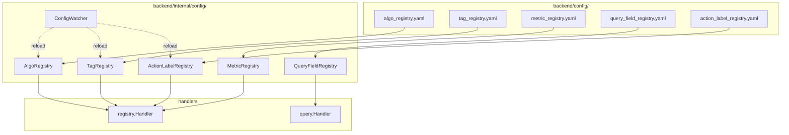
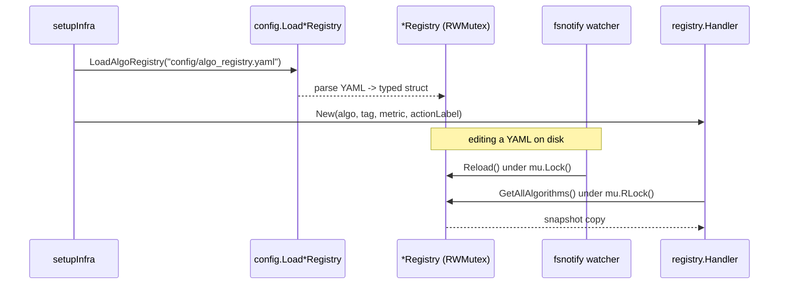
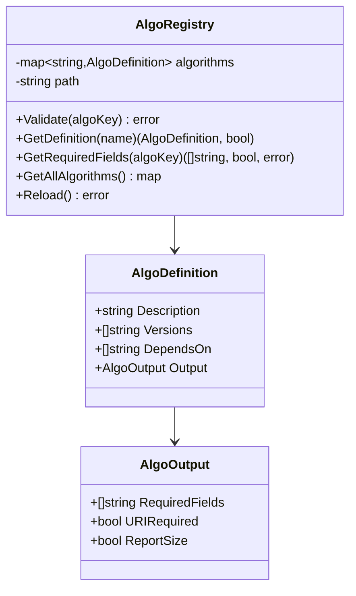
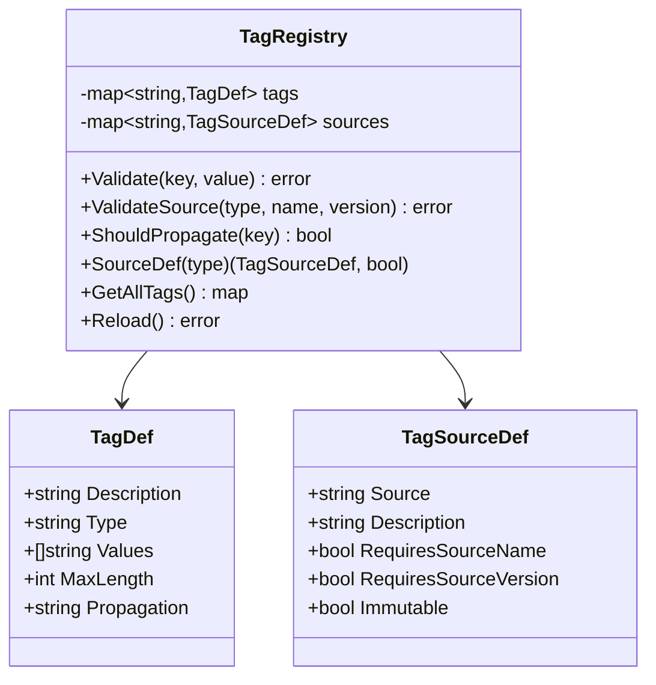
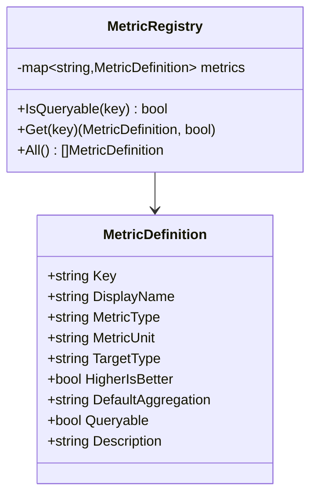
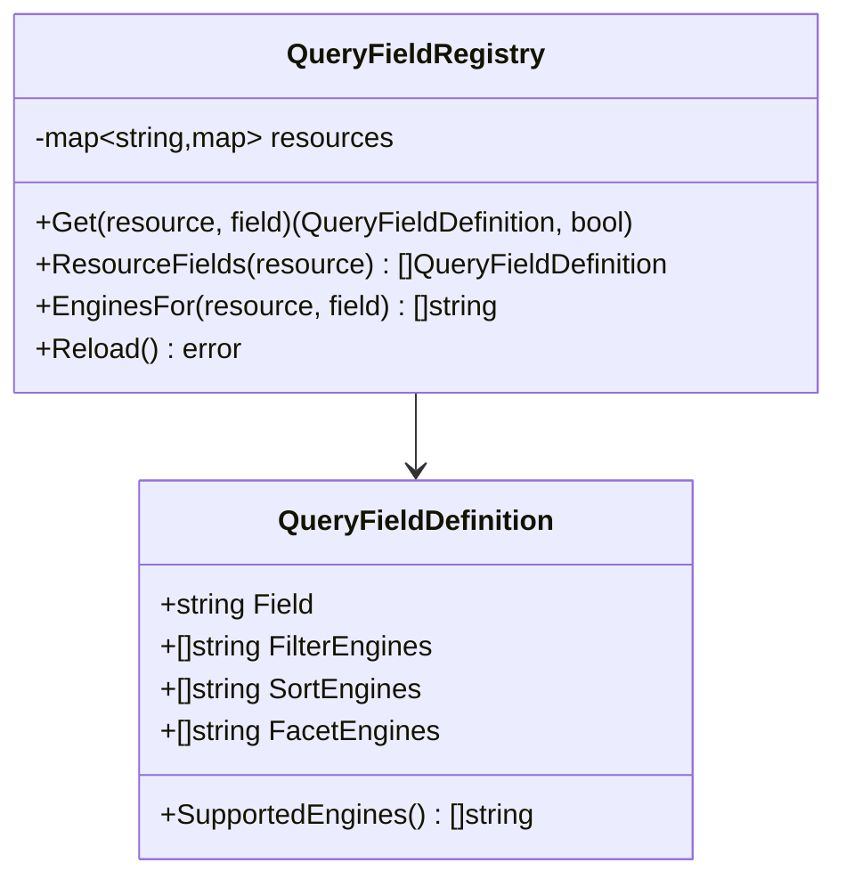
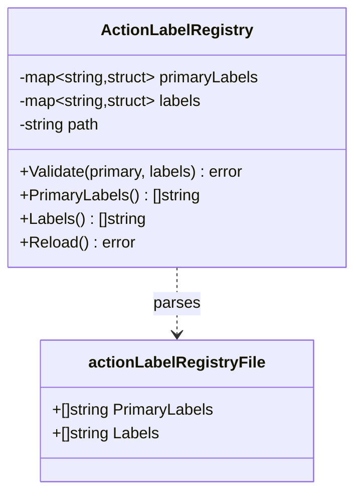
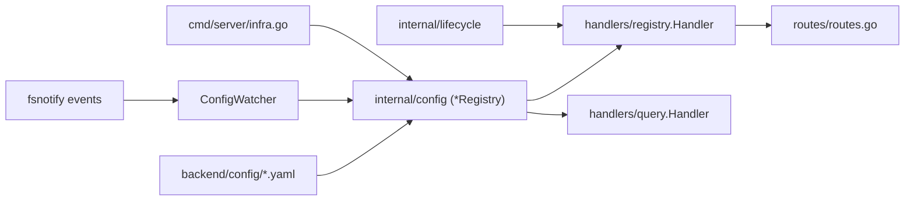

# Registry Types

<cite>
**Referenced Files in This Document**

- [backend/config/algo_registry.yaml](file://backend/config/algo_registry.yaml)
- [backend/config/tag_registry.yaml](file://backend/config/tag_registry.yaml)
- [backend/config/metric_registry.yaml](file://backend/config/metric_registry.yaml)
- [backend/config/query_field_registry.yaml](file://backend/config/query_field_registry.yaml)
- [backend/config/action_label_registry.yaml](file://backend/config/action_label_registry.yaml)
- [backend/internal/config/algo_registry.go](file://backend/internal/config/algo_registry.go)
- [backend/internal/config/tag_registry.go](file://backend/internal/config/tag_registry.go)
- [backend/internal/config/metric_registry.go](file://backend/internal/config/metric_registry.go)
- [backend/internal/config/query_field_registry.go](file://backend/internal/config/query_field_registry.go)
- [backend/internal/config/action_label_registry.go](file://backend/internal/config/action_label_registry.go)
- [backend/internal/config/watcher.go](file://backend/internal/config/watcher.go)
- [backend/internal/handlers/registry/handler.go](file://backend/internal/handlers/registry/handler.go)
- [backend/internal/handlers/query/handler.go](file://backend/internal/handlers/query/handler.go)
- [backend/cmd/server/infra.go](file://backend/cmd/server/infra.go)
- [backend/routes/routes.go](file://backend/routes/routes.go)
</cite>

## Table of Contents
1. [Introduction](#introduction)
2. [Project Structure](#project-structure)
3. [Core Components](#core-components)
4. [Architecture Overview](#architecture-overview)
5. [Detailed Component Analysis](#detailed-component-analysis)
6. [Dependency Analysis](#dependency-analysis)
7. [Performance Considerations](#performance-considerations)
8. [Troubleshooting Guide](#troubleshooting-guide)
9. [Conclusion](#conclusion)
10. [Appendices](#appendices)

## Introduction

The cyber-databrew backend externalizes five domain vocabularies into
declarative YAML files that ship under `backend/config/`. Each file is a
**registry** — a flat catalog of the legal values, shapes, and contracts for one
slice of the platform's data model. The registries answer questions such as
"which algorithm versions may write output?", "what tag keys exist and what
values are legal?", "which metrics may a saved query reference?", "which engines
can filter or sort a given field?", and "what action labels are permitted?".

Centralizing these vocabularies in configuration rather than code has three
goals. First, it decouples the rules from the binary: a registry can change
without a recompile, and three of the five registries hot-reload on file change
(see [Architecture Overview](#architecture-overview)). Second, it gives the
frontend a single read-only source of truth — four of the registries are served
verbatim over `GET /api/v1/*-registry` endpoints so dropdowns and validators in
the UI stay in lockstep with the backend. Third, it concentrates validation: an
ingest or tag write is checked against the registry before it touches the
database, so invalid algorithm keys, unknown tag values, or unregistered action
labels are rejected at the edge rather than corrupting stored state.

Each registry is loaded once at startup in `backend/cmd/server/infra.go`, parsed
into a typed Go struct in `backend/internal/config/`, and held behind a
read-write mutex so that hot-reload swaps are atomic with respect to concurrent
readers.

**Section sources**
- [backend/cmd/server/infra.go](file://backend/cmd/server/infra.go#L49-L74)
- [backend/routes/routes.go](file://backend/routes/routes.go#L239-L244)

## Project Structure

The registry feature spans three layers: the YAML data under
`backend/config/`, the loader/validator structs under
`backend/internal/config/`, and the HTTP surface under
`backend/internal/handlers/`. The wiring that binds them lives in
`backend/cmd/server/infra.go` (loading) and `backend/routes/routes.go`
(routing).

- **`backend/config/*.yaml`** — the five registry source files. These are the
  authoritative data; everything downstream is derived from them.
- **`backend/internal/config/*_registry.go`** — one loader file per registry. Each
  defines a typed `*Definition`/`*Def` struct, a private `*RegistryFile`
  top-level unmarshal target, a `Load*Registry(path)` constructor, accessor
  methods, and (for the hot-reloadable ones) a `Reload()` method.
- **`backend/internal/config/watcher.go`** — `ConfigWatcher`, an `fsnotify`-based
  goroutine that reloads the tag, algo, and action-label registries when their
  files change on disk.
- **`backend/internal/handlers/registry/handler.go`** — the read-only HTTP handler
  that serves the algo, tag, metric, and action-label registries as JSON.
- **`backend/internal/handlers/query/handler.go`** — the only consumer of the
  query-field registry; it has no dedicated endpoint and is read internally to
  decorate field capabilities.

**Diagram sources**
- [backend/internal/config/watcher.go](file://backend/internal/config/watcher.go#L24-L43)
- [backend/internal/handlers/registry/handler.go](file://backend/internal/handlers/registry/handler.go#L13-L33)

**Section sources**
- [backend/cmd/server/infra.go](file://backend/cmd/server/infra.go#L49-L74)
- [backend/internal/handlers/query/handler.go](file://backend/internal/handlers/query/handler.go#L29-L36)

## Core Components

Every registry follows the same three-part pattern: a YAML file, a typed loader
with an unexported `*RegistryFile` unmarshal struct, and a set of read-side
accessors guarded by `sync.RWMutex`. The five registries differ only in their
schema and in which surfaces consume them.

| Registry | YAML file | Loader struct | Top-level shape | Served at | Hot-reload |
| --- | --- | --- | --- | --- | --- |
| Algorithm | `algo_registry.yaml` | `AlgoRegistry` | map `algorithms{}` | `GET /api/v1/algo-registry` | yes |
| Tag | `tag_registry.yaml` | `TagRegistry` | `tag_sources[]` + `tags{}` | `GET /api/v1/tag-registry` | yes |
| Metric | `metric_registry.yaml` | `MetricRegistry` | list `metrics[]` | `GET /api/v1/metric-registry` | no |
| Query field | `query_field_registry.yaml` | `QueryFieldRegistry` | `resources{}.fields[]` | internal only | no (`Reload()` exists) |
| Action label | `action_label_registry.yaml` | `ActionLabelRegistry` | `primary_labels[]` + `labels[]` | `GET /api/v1/action-label-registry` | yes |

The algorithm and query-field registries also act as **validators**:
`AlgoRegistry.Validate` rejects an ill-formed or unregistered `name@version`
key, `TagRegistry.Validate`/`ValidateSource` enforce tag value rules and
per-source identity contracts, and `ActionLabelRegistry.Validate` rejects
unregistered labels. The metric registry exposes `IsQueryable` so the query
layer can refuse non-queryable metric keys.

**Section sources**
- [backend/internal/config/algo_registry.go](file://backend/internal/config/algo_registry.go#L27-L47)
- [backend/internal/config/tag_registry.go](file://backend/internal/config/tag_registry.go#L32-L54)
- [backend/internal/config/metric_registry.go](file://backend/internal/config/metric_registry.go#L24-L42)
- [backend/internal/config/query_field_registry.go](file://backend/internal/config/query_field_registry.go#L39-L58)
- [backend/internal/config/action_label_registry.go](file://backend/internal/config/action_label_registry.go#L12-L34)

## Architecture Overview

At process start `setupInfra` loads each registry from its fixed
`config/*.yaml` path. The algorithm, tag, and metric registries are loaded
fatally — a parse error calls `os.Exit(1)`. The query-field and action-label
registries are loaded best-effort: a failure logs a warning and leaves a `nil`
registry, in which case the consumers fall back to safe defaults (postgres-only
field capabilities, and disabled action-label validation respectively).

Once loaded, three of the five loaders are registered with a `ConfigWatcher`,
which watches the config directory through `fsnotify` and reloads the matching
registry when `algo_registry.yaml`, `tag_registry.yaml`, or
`action_label_registry.yaml` is written or created. Reloads are debounced by
100ms to coalesce rapid saves, and each loader swaps its internal map under a
write lock so concurrent readers always observe a consistent snapshot.

**Diagram sources**
- [backend/cmd/server/infra.go](file://backend/cmd/server/infra.go#L49-L74)
- [backend/internal/config/watcher.go](file://backend/internal/config/watcher.go#L45-L107)
- [backend/internal/handlers/registry/handler.go](file://backend/internal/handlers/registry/handler.go#L21-L33)

**Section sources**
- [backend/cmd/server/infra.go](file://backend/cmd/server/infra.go#L49-L74)
- [backend/internal/config/watcher.go](file://backend/internal/config/watcher.go#L24-L114)

## Detailed Component Analysis

#### Algorithm Registry

`algo_registry.yaml` is a map keyed by algorithm name (`hand_tracking`,
`head_tracking`, `body_tracking`, `deface`, `action_annotation`,
`env_analysis`). Each entry carries a human `description`, a list of legal
`versions`, a `depends_on` list of `name@version` prerequisites, and an `output`
block declaring `required_fields`, `uri_required`, and `report_size`. The
`action_annotation` entry illustrates the dependency model: it depends on
`hand_tracking@1.2.0`, `head_tracking@1.0.0`, and `body_tracking@1.0.0`.

The loader parses this into `map[string]AlgoDefinition`, where `AlgoDefinition`
embeds an `AlgoOutput` for the output contract. At load time the loader rejects
any algorithm whose `versions` list is empty. The registry is referenced as a
`name@version` *key*; `parseAlgoKey` splits on the last `@`, and `Validate`
confirms both the name and the version are registered.
`GetRequiredFields(algoKey)` returns the output contract used during ingest to
verify an algorithm reported all mandatory fields. The HTTP handler flattens the
map into one item per `(name, version)` pair, exposing the synthetic `key`,
`name`, `version`, and `depends_on`.

**Diagram sources**
- [backend/internal/config/algo_registry.go](file://backend/internal/config/algo_registry.go#L12-L37)

**Section sources**
- [backend/config/algo_registry.yaml](file://backend/config/algo_registry.yaml#L1-L49)
- [backend/internal/config/algo_registry.go](file://backend/internal/config/algo_registry.go#L82-L154)
- [backend/internal/handlers/registry/handler.go](file://backend/internal/handlers/registry/handler.go#L35-L63)

#### Tag Registry

`tag_registry.yaml` has two top-level sections. `tag_sources[]` is a list of who
may write into `asset_tags`: each entry names a `source` (`human`, `algo_sdk`,
`rule_engine`, `system`, `compliance`), a `description`, and the identity
contract flags `requires_source_name`, `requires_source_version`, and
`immutable`. `tags{}` is a map keyed by tag key (`priority`, `quality`, `scene`,
`task`, `batch`, `notes`, `compliance.status`, `customer.id`); each value
declares a `type` (`enum` or `string`), an optional `values` list for enums, an
optional `max_length` for strings, and an optional `propagation` mode
(`descendants` propagates the tag to child assets, per CYB-1068).

The loader keeps tags as `map[string]TagDef` and sources as
`map[string]TagSourceDef` keyed by source name. `Validate(key, value)` enforces
enum membership or string length. `ValidateSource` enforces the identity
contract; it returns the typed errors `ErrUnknownSource` and `ErrSourceContract`
(callers map these to HTTP 422), and is permissive when no `tag_sources` block
is configured at all. `ShouldPropagate(key)` returns true only for keys marked
`propagation: descendants`. The HTTP handler emits only the `tags{}` portion,
including `values` for enums and `max_length` for length-bounded strings.

**Diagram sources**
- [backend/internal/config/tag_registry.go](file://backend/internal/config/tag_registry.go#L11-L44)

**Section sources**
- [backend/config/tag_registry.yaml](file://backend/config/tag_registry.yaml#L17-L74)
- [backend/internal/config/tag_registry.go](file://backend/internal/config/tag_registry.go#L90-L192)
- [backend/internal/handlers/registry/handler.go](file://backend/internal/handlers/registry/handler.go#L65-L105)

#### Metric Registry

`metric_registry.yaml` is a single `metrics[]` list. Each entry is fully
flat: `key`, `display_name`, `metric_type` (`ratio` / `count` / `score`),
`metric_unit`, `target_type` (`segment` for all current entries),
`higher_is_better`, `default_aggregation` (`avg` / `sum`), `queryable`, and a
`description`. The file currently registers eight QC metrics including
`good_frames_ratio`, `hand_good_frames`, `qc_score`, `blur_ratio`, and
`occlusion_ratio`.

`MetricDefinition` carries both `yaml` and `json` struct tags, so the same
struct serializes directly to the API response without an intermediate DTO. The
loader folds the list into a `map[string]MetricDefinition` keyed by `key`.
`IsQueryable(key)` gates whether a saved query may reference a metric, `Get`
fetches one definition, and `All()` returns every definition. The HTTP handler
calls `All()`, sorts the slice by key for deterministic output, and returns it;
if the registry is `nil` it returns an empty `items` list rather than 500.

**Diagram sources**
- [backend/internal/config/metric_registry.go](file://backend/internal/config/metric_registry.go#L11-L33)

**Section sources**
- [backend/config/metric_registry.yaml](file://backend/config/metric_registry.yaml#L1-L80)
- [backend/internal/config/metric_registry.go](file://backend/internal/config/metric_registry.go#L60-L85)
- [backend/internal/handlers/registry/handler.go](file://backend/internal/handlers/registry/handler.go#L114-L124)

#### Query Field Registry

`query_field_registry.yaml` describes which query engines can operate on which
fields, per resource. It opens with a `schema_version` and a `resources{}` map
(currently only `assets`). Each resource holds a `fields[]` list where every
entry names a `field` and up to three engine lists: `filter_engines`,
`sort_engines`, and `facet_engines`. Engines are `postgres` and
`elasticsearch`. For example, `owner` is filterable on both engines, sortable on
both, and facetable only on `elasticsearch`, while `asset_id` is postgres-only.

The loader nests resources as `map[string]map[string]QueryFieldDefinition` —
resource → field name → definition. Loading is strict: it rejects an empty
`resources` block, a resource with no fields, an empty field name, duplicate
fields within a resource, and any field that lists zero engines.
`QueryFieldDefinition.SupportedEngines()` deduplicates and sorts the union of the
three engine lists. Unlike the other registries, this one has **no HTTP
endpoint**; it is injected into the query handler, which calls
`EnginesFor(resource, field)` from `fieldCapabilitiesFor` to annotate each
field's capabilities (falling back to the caller-supplied default when the
field is unregistered or the registry is `nil`).

**Diagram sources**
- [backend/internal/config/query_field_registry.go](file://backend/internal/config/query_field_registry.go#L13-L50)

**Section sources**
- [backend/config/query_field_registry.yaml](file://backend/config/query_field_registry.yaml#L1-L51)
- [backend/internal/config/query_field_registry.go](file://backend/internal/config/query_field_registry.go#L60-L144)
- [backend/internal/handlers/query/handler.go](file://backend/internal/handlers/query/handler.go#L392-L408)

#### Action Label Registry

`action_label_registry.yaml` is the simplest registry: two string lists.
`primary_labels[]` enumerates the labels that may be a segment's single primary
action (e.g. `pickup`, `place`, `push`, `pull`, `rotate`, `inspect`, `clean`,
`adjust`), and `labels[]` is the broader vocabulary of all permitted labels —
the primary set plus hand/object/outcome/safety modifiers such as `left_hand`,
`tool`, `success`, and `urgent`.

The loader stores both lists as `map[string]struct{}` sets for O(1) membership
checks, and rejects an empty `labels` list at load time. `Validate(primary,
labels)` checks every label is in the `labels` set and, when a non-empty primary
is supplied, that it is in the `primaryLabels` set. `PrimaryLabels()` and
`Labels()` return sorted copies. The HTTP handler returns both lists; when the
registry is `nil` (best-effort load failed) it returns two empty arrays so the
frontend degrades gracefully.

**Diagram sources**
- [backend/internal/config/action_label_registry.go](file://backend/internal/config/action_label_registry.go#L12-L22)

**Section sources**
- [backend/config/action_label_registry.yaml](file://backend/config/action_label_registry.yaml#L1-L32)
- [backend/internal/config/action_label_registry.go](file://backend/internal/config/action_label_registry.go#L36-L110)
- [backend/internal/handlers/registry/handler.go](file://backend/internal/handlers/registry/handler.go#L126-L140)

## Dependency Analysis

The registries sit between the static YAML data and the runtime surfaces that
consume them. The `config` package depends only on `gopkg.in/yaml.v3` and
`fsnotify`; it has no dependency on the HTTP or database layers, which keeps it
importable from validators, use cases, and handlers without cycles. The
`registry.Handler` depends on four loaders plus `internal/lifecycle` (for the
`/lifecycle-states` endpoint, which is not registry-backed). The query handler
depends on the query-field registry alongside its other collaborators.

**Diagram sources**
- [backend/internal/handlers/registry/handler.go](file://backend/internal/handlers/registry/handler.go#L1-L33)
- [backend/cmd/server/infra.go](file://backend/cmd/server/infra.go#L49-L74)

**Section sources**
- [backend/internal/handlers/registry/handler.go](file://backend/internal/handlers/registry/handler.go#L1-L33)
- [backend/routes/routes.go](file://backend/routes/routes.go#L239-L244)

## Performance Considerations

Registries are small, in-memory maps loaded once at startup, so reads are
effectively free. All accessors take `mu.RLock()`, allowing unbounded concurrent
reads; only the watcher's `Reload()` takes the write lock, and only briefly to
swap the freshly parsed map into place. Accessors that return collections —
`GetAllAlgorithms`, `GetAllTags`, `All`, `ResourceFields`, `PrimaryLabels`,
`Labels` — return defensive copies, so callers cannot mutate registry state and
the lock is released before any serialization work.

The HTTP handlers sort their output on each request (`sort.Strings` /
`sort.Slice`); with the current registry sizes (single-digit to low-tens of
entries) this is negligible and buys deterministic, cache-friendly responses.
The query-field registry is consulted once per field per query in
`fieldCapabilitiesFor`, an O(fields) map lookup with no allocation beyond the
result slice. The file watcher debounces reloads to 100ms, so a burst of editor
saves triggers a single parse rather than one per write event.

**Section sources**
- [backend/internal/config/algo_registry.go](file://backend/internal/config/algo_registry.go#L137-L145)
- [backend/internal/config/watcher.go](file://backend/internal/config/watcher.go#L48-L72)
- [backend/internal/handlers/registry/handler.go](file://backend/internal/handlers/registry/handler.go#L77-L124)

## Troubleshooting Guide

- **Server exits at startup with "failed to load algo/tag/metric registry".**
  These three loaders are fatal. A YAML syntax error, a missing
  `config/*.yaml` file, or — for the algo registry — an algorithm with an empty
  `versions` list will call `os.Exit(1)`. Check the wrapped error string, which
  names the offending file and key.
- **`/api/v1/metric-registry` or `/api/v1/action-label-registry` returns empty
  items.** For action labels this means the best-effort load failed and the
  registry is `nil`; the handler returns empty arrays rather than erroring.
  Inspect startup logs for "failed to load action label registry".
- **Field capabilities always show postgres-only.** The query-field registry
  failed to load (it is best-effort and set to `nil` on error) or the field is
  not listed under its resource; `fieldCapabilitiesFor` then returns the
  fallback. Confirm `config/query_field_registry.yaml` parsed and that the field
  appears under the right resource.
- **Edits to a YAML do not take effect without restart.** Only
  `algo_registry.yaml`, `tag_registry.yaml`, and `action_label_registry.yaml`
  are watched. `metric_registry.yaml` and `query_field_registry.yaml` are not
  registered with the `ConfigWatcher`, so they require a restart even though the
  query-field loader exposes a `Reload()` method.
- **Tag write rejected with 422.** `ValidateSource` returned `ErrUnknownSource`
  (source not in `tag_sources[]`) or `ErrSourceContract` (a registered source
  omitted a required `source_name`/`source_version`). `Validate` separately
  rejects enum values not in `values` or strings over `max_length`.
- **Query field registry refuses to load with "no engines".** Every field must
  declare at least one engine across `filter_engines`, `sort_engines`, or
  `facet_engines`; an entry with all three empty fails the load.

**Section sources**
- [backend/cmd/server/infra.go](file://backend/cmd/server/infra.go#L50-L74)
- [backend/internal/config/algo_registry.go](file://backend/internal/config/algo_registry.go#L60-L65)
- [backend/internal/config/tag_registry.go](file://backend/internal/config/tag_registry.go#L129-L172)
- [backend/internal/config/query_field_registry.go](file://backend/internal/config/query_field_registry.go#L80-L90)
- [backend/internal/config/watcher.go](file://backend/internal/config/watcher.go#L68-L72)

## Conclusion

The five registries give cyber-databrew a uniform, configuration-driven way to
define and enforce its domain vocabularies. Each pairs a small YAML file with a
typed, mutex-guarded loader, and exposes either a read-only HTTP endpoint (algo,
tag, metric, action-label) or an internal accessor (query-field). Three reload
live on file change; all share the same load-once, copy-on-read discipline. The
result is a single source of truth that the backend validates against and the
frontend can fetch, with no recompile needed to add an algorithm version, a tag
value, a metric, a queryable field, or an action label.

## Appendices

### Appendix A — Algorithm Registry fields

| YAML field | Go field | Type | Meaning |
| --- | --- | --- | --- |
| `<map key>` | map key of `algorithms` | string | algorithm name |
| `description` | `AlgoDefinition.Description` | string | human description |
| `versions` | `AlgoDefinition.Versions` | []string | legal versions (must be non-empty) |
| `depends_on` | `AlgoDefinition.DependsOn` | []string | prerequisite `name@version` keys |
| `output.required_fields` | `AlgoOutput.RequiredFields` | []string | fields the output must carry |
| `output.uri_required` | `AlgoOutput.URIRequired` | bool | output must include a URI |
| `output.report_size` | `AlgoOutput.ReportSize` | bool | output size must be reported |

### Appendix B — Tag Registry fields

**`tags{}` entries** (`TagDef`):

| YAML field | Go field | Type | Meaning |
| --- | --- | --- | --- |
| `description` | `Description` | string | human description |
| `type` | `Type` | string | `enum` or `string` |
| `values` | `Values` | []string | allowed values (enum only) |
| `max_length` | `MaxLength` | int | max length (string only; 0 = unlimited) |
| `propagation` | `Propagation` | string | `none` (default) or `descendants` |

**`tag_sources[]` entries** (`TagSourceDef`):

| YAML field | Go field | Type | Meaning |
| --- | --- | --- | --- |
| `source` | `Source` | string | source identifier (map key) |
| `description` | `Description` | string | human description |
| `requires_source_name` | `RequiresSourceName` | bool | write must record source name |
| `requires_source_version` | `RequiresSourceVersion` | bool | write must record source version |
| `immutable` | `Immutable` | bool | assertions are append-only |

### Appendix C — Metric Registry fields (`MetricDefinition`)

| YAML/JSON field | Go field | Type | Meaning |
| --- | --- | --- | --- |
| `key` | `Key` | string | metric identifier (map key) |
| `display_name` | `DisplayName` | string | UI label |
| `metric_type` | `MetricType` | string | `ratio` / `count` / `score` |
| `metric_unit` | `MetricUnit` | string | unit (e.g. `frames`, empty) |
| `target_type` | `TargetType` | string | scope (e.g. `segment`) |
| `higher_is_better` | `HigherIsBetter` | bool | direction of "good" |
| `default_aggregation` | `DefaultAggregation` | string | `avg` / `sum` |
| `queryable` | `Queryable` | bool | may be referenced in queries |
| `description` | `Description` | string | human description |

### Appendix D — Query Field Registry fields

Top-level: `schema_version` (int) and `resources{}` (map of resource →
`fields[]`). Each field entry (`QueryFieldDefinition`):

| YAML/JSON field | Go field | Type | Meaning |
| --- | --- | --- | --- |
| `field` | `Field` | string | field name (unique per resource) |
| `filter_engines` | `FilterEngines` | []string | engines that can filter |
| `sort_engines` | `SortEngines` | []string | engines that can sort |
| `facet_engines` | `FacetEngines` | []string | engines that can facet |

`SupportedEngines()` returns the sorted, deduplicated union of the three lists;
a field with zero engines fails the load.

### Appendix E — Action Label Registry fields (`actionLabelRegistryFile`)

| YAML field | Go field | Type | Meaning |
| --- | --- | --- | --- |
| `primary_labels` | `PrimaryLabels` | []string | labels eligible as the primary action |
| `labels` | `Labels` | []string | full vocabulary of permitted labels (must be non-empty) |

### Appendix F — Registry endpoints

| Endpoint | Handler method | Response shape |
| --- | --- | --- |
| `GET /api/v1/algo-registry` | `Handler.AlgoRegistry` | `{ items: [{ key, name, version, depends_on }] }` |
| `GET /api/v1/tag-registry` | `Handler.TagRegistry` | `{ items: [{ key, description, type, values?, max_length? }] }` |
| `GET /api/v1/metric-registry` | `Handler.MetricRegistry` | `{ items: [MetricDefinition...] }` |
| `GET /api/v1/action-label-registry` | `Handler.ActionLabelRegistry` | `{ primary_labels: [...], labels: [...] }` |
| (internal) query-field | `query.Handler.fieldCapabilitiesFor` | per-field `{ field, engines }` |

**Section sources**
- [backend/internal/handlers/registry/handler.go](file://backend/internal/handlers/registry/handler.go#L35-L140)
- [backend/routes/routes.go](file://backend/routes/routes.go#L239-L244)
- [backend/internal/handlers/query/handler.go](file://backend/internal/handlers/query/handler.go#L392-L408)
