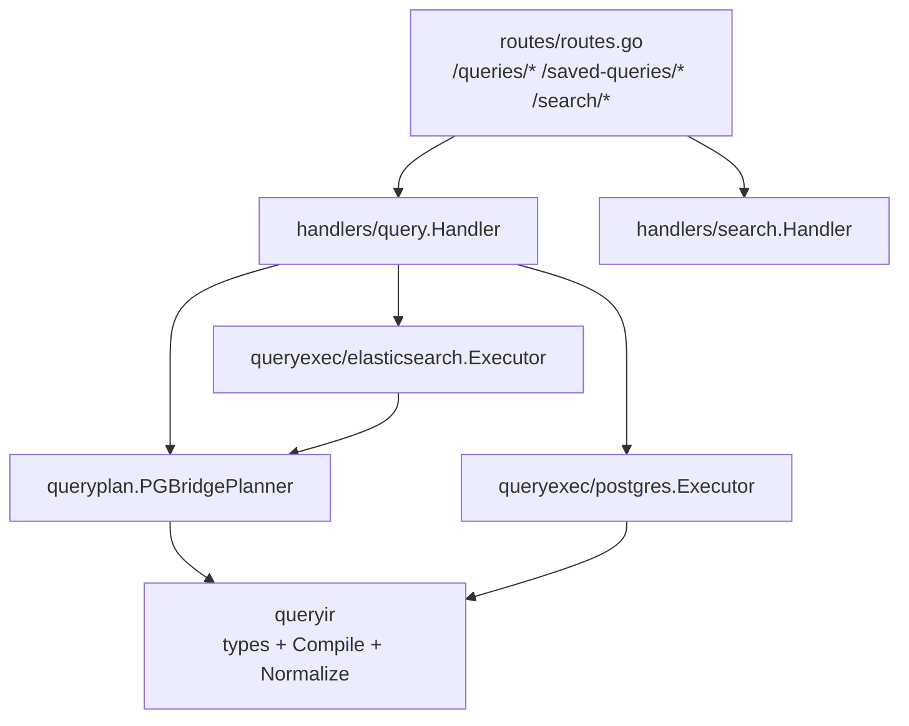
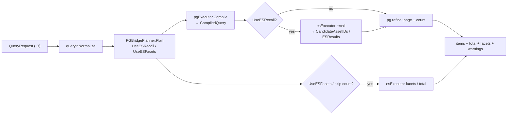
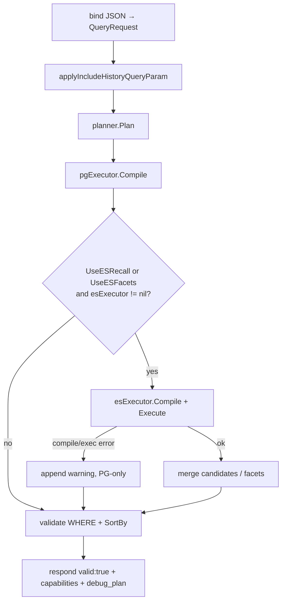
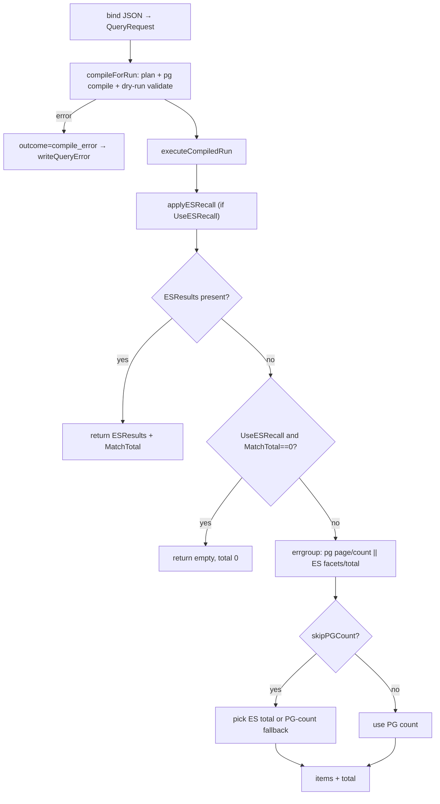
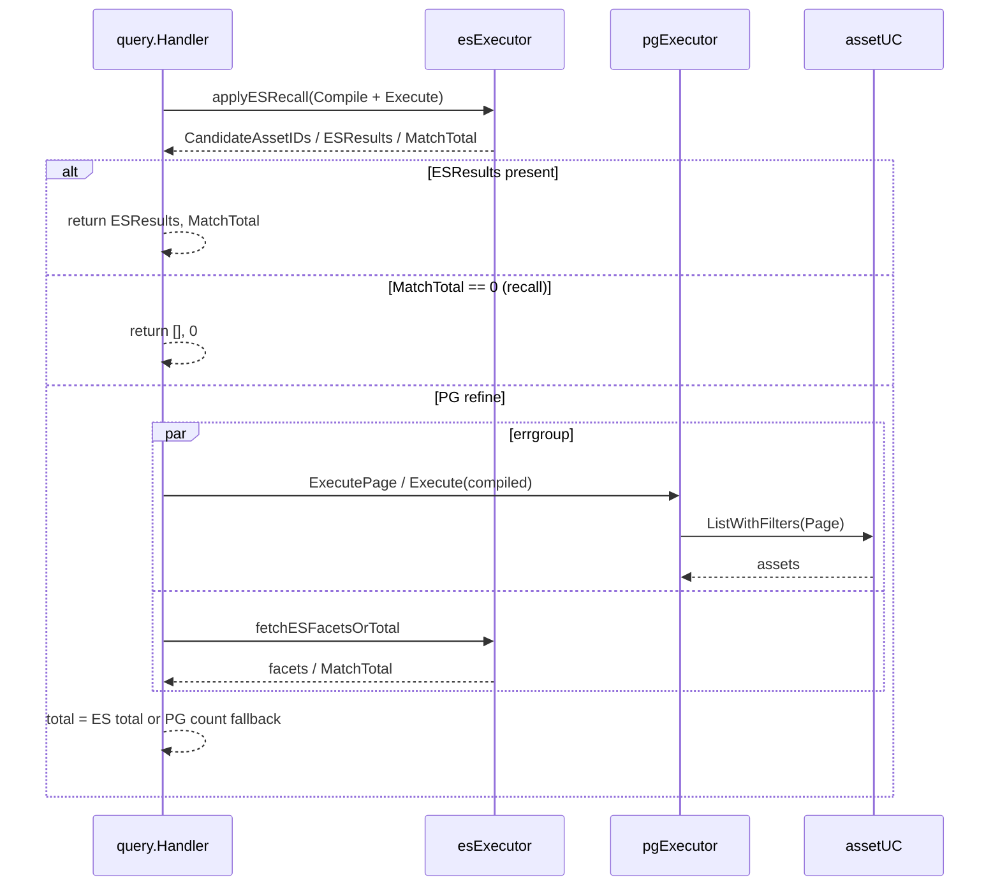
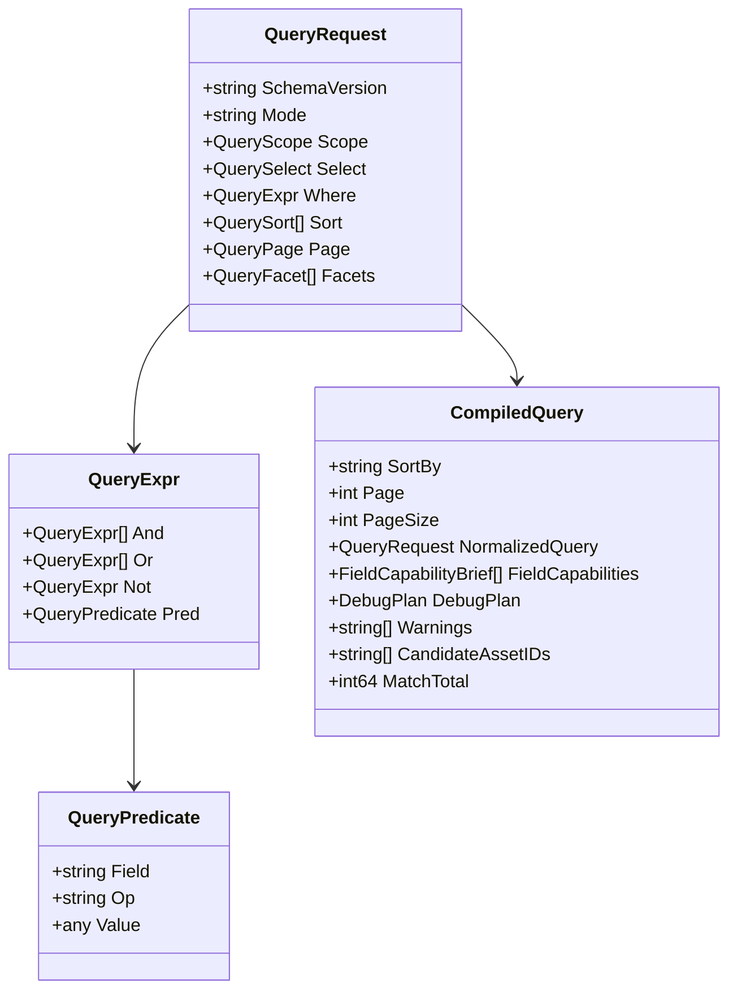
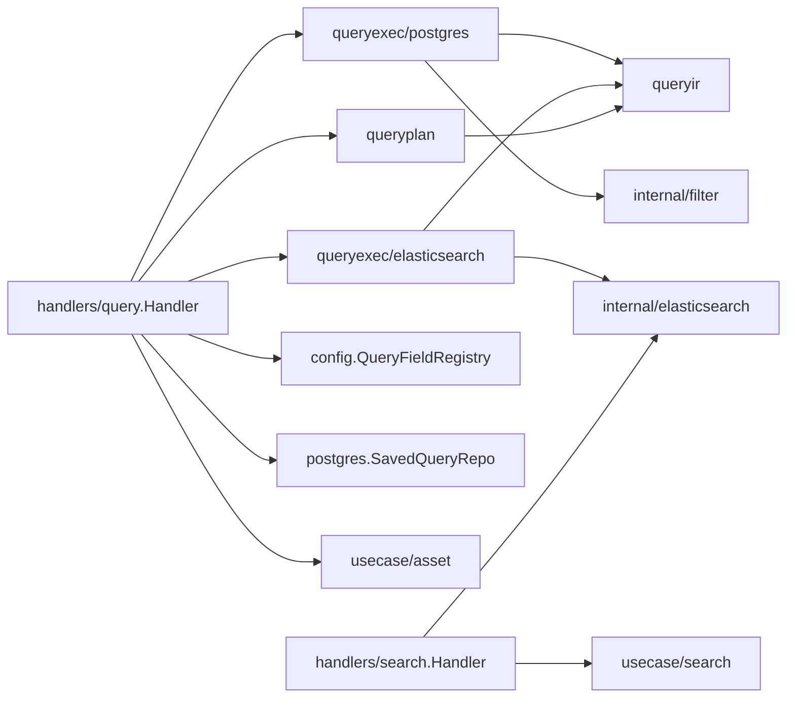

# Search & Query Workbench Module

<cite>
**Referenced Files in This Document**

- [backend/internal/handlers/query/handler.go](file://backend/internal/handlers/query/handler.go)
- [backend/internal/handlers/search/handler.go](file://backend/internal/handlers/search/handler.go)
- [backend/internal/handlers/search/sync_status.go](file://backend/internal/handlers/search/sync_status.go)
- [backend/internal/queryir/compile.go](file://backend/internal/queryir/compile.go)
- [backend/internal/queryir/current_filter.go](file://backend/internal/queryir/current_filter.go)
- [backend/internal/queryir/types.go](file://backend/internal/queryir/types.go)
- [backend/internal/queryplan/planner.go](file://backend/internal/queryplan/planner.go)
- [backend/internal/queryexec/postgres/compile.go](file://backend/internal/queryexec/postgres/compile.go)
- [backend/internal/queryexec/postgres/execute.go](file://backend/internal/queryexec/postgres/execute.go)
- [backend/internal/queryexec/postgres/expr.go](file://backend/internal/queryexec/postgres/expr.go)
- [backend/internal/queryexec/elasticsearch/compile.go](file://backend/internal/queryexec/elasticsearch/compile.go)
- [backend/internal/queryexec/elasticsearch/execute.go](file://backend/internal/queryexec/elasticsearch/execute.go)
- [backend/routes/routes.go](file://backend/routes/routes.go)
</cite>

## Table of Contents
1. [Introduction](#introduction)
2. [Project Structure](#project-structure)
3. [Core Components](#core-components)
4. [Architecture Overview](#architecture-overview)
5. [Detailed Component Analysis](#detailed-component-analysis)
6. [Dependency Analysis](#dependency-analysis)
7. [Performance Considerations](#performance-considerations)
8. [Troubleshooting Guide](#troubleshooting-guide)
9. [Conclusion](#conclusion)
10. [Appendices](#appendices)

## Introduction

The Search & Query Workbench module is the structured-query surface of cyber-databrew. It accepts a single canonical query envelope — the **Query IR** (intermediate representation) — and turns it into asset result rows, totals, facets, and capability hints. The same IR drives two HTTP endpoints: `POST /api/v1/queries/validate`, which compiles and checks a query without running it, and `POST /api/v1/queries/run`, which compiles and executes it. A complementary `saved-queries` CRUD surface persists reusable IR documents, and the `search` handler exposes the sync/health endpoints that report how far the PostgreSQL → Elasticsearch index has fallen behind.

The module exists to give the frontend a stable, engine-agnostic query language while letting the backend choose the cheapest correct execution path. Behind the IR sits a small planner/executor pipeline: a planner decides whether a query needs Elasticsearch recall and/or facets, a PostgreSQL executor compiles the IR into a parameterized `WHERE` clause and runs the page+count, and an Elasticsearch executor performs fulltext recall, facet aggregation, and total counting. This "ES recall + PG refine" split lets fulltext and faceted search ride on Elasticsearch while authoritative row data and exact predicate filtering stay on PostgreSQL.

The primary consumers are the workbench UI (query builder, results grid, facet panel) and any caller persisting saved queries. Operators consume the `search/sync-status` and `search/sync-progress` endpoints to monitor index freshness.

**Section sources**
- [backend/internal/handlers/query/handler.go](file://backend/internal/handlers/query/handler.go#L53-L124)
- [backend/routes/routes.go](file://backend/routes/routes.go#L246-L366)

## Project Structure

The module spans four backend packages plus its route wiring. The HTTP layer lives under `internal/handlers/{query,search}`, the engine-neutral IR under `internal/queryir`, the planning decision under `internal/queryplan`, and the two concrete executors under `internal/queryexec/{postgres,elasticsearch}`.

Key files and their roles:

- **`handlers/query/handler.go`** — the workbench handler. Holds the planner, both executors, and the saved-query repo; implements `Validate`, `Run`, and the saved-query CRUD methods.
- **`handlers/search/handler.go`** — the Elasticsearch-backed search handler. Implements `SearchAssets` (a query-param-driven ES search), `SyncStatus`, and `SyncProgress`.
- **`handlers/search/sync_status.go`** — the `SyncInfo` and `SyncProgress` DTOs reported by the sync endpoints.
- **`queryir/types.go`** — the `QueryRequest` envelope and the `CompiledQuery` output type.
- **`queryir/compile.go`** — `Normalize` and `Compile`: validation, sort/page normalization, and field-capability collection.
- **`queryir/current_filter.go`** — the current-revision-only SQL guard.
- **`queryplan/planner.go`** — `PGBridgePlanner.Plan`: the ES-recall / ES-facet decision.
- **`queryexec/postgres/*`** — compile IR → `WHERE` clause + execute page/count against the asset usecase.
- **`queryexec/elasticsearch/*`** — compile IR → ES search body + execute recall/facets/total.

**Diagram sources**
- [backend/internal/handlers/query/handler.go](file://backend/internal/handlers/query/handler.go#L27-L45)
- [backend/internal/queryplan/planner.go](file://backend/internal/queryplan/planner.go#L16-L51)

**Section sources**
- [backend/internal/handlers/query/handler.go](file://backend/internal/handlers/query/handler.go#L1-L45)
- [backend/routes/routes.go](file://backend/routes/routes.go#L246-L366)

## Core Components

### The query Handler

`query.Handler` aggregates everything the workbench needs: an asset usecase, a `QueryFieldRegistry` for per-resource field capabilities, a `PGBridgePlanner`, a PostgreSQL `Executor`, an Elasticsearch `Executor`, and a `SavedQueryRepo`. The constructor wires the planner with a boolean that is true only when an ES client is present (`esClient != nil`), so the planner never schedules ES work in a PG-only deployment.

**Section sources**
- [backend/internal/handlers/query/handler.go](file://backend/internal/handlers/query/handler.go#L27-L45)

### The Query IR envelope

`QueryRequest` is the canonical v1 envelope: `schema_version`, an optional `mode`, a `scope` (resource + `include_history`), a `select` (projected fields), a recursive `where` expression tree, a `sort` list, a `page` block that accepts both `page/page_size` and `offset/limit`, and a `facets` list. The `where` node is a tagged union — exactly one of `and`, `or`, `not`, or `pred` may be set.

**Section sources**
- [backend/internal/queryir/types.go](file://backend/internal/queryir/types.go#L1-L73)

### CompiledQuery

`Compile` produces a `CompiledQuery`: the normalized request, a resolved `SortBy` string, `Page`/`PageSize`, field capabilities, a `DebugPlan`, and (filled in later by execution) `Facets`, `CandidateAssetIDs`, `MatchTotal`, and `ESResults`. `CandidateAssetIDs` carries the ES recall set into the PG refine; `ESResults` carries full ES `_source` rows when candidate transfer is skipped; `MatchTotal` carries the ES `track_total_hits` count when PG COUNT is skipped.

**Section sources**
- [backend/internal/queryir/types.go](file://backend/internal/queryir/types.go#L75-L106)

### The planner

`PGBridgePlanner.Plan` normalizes the request, re-validates `schema_version`/`scope.resource`, then sets two flags: `UseESRecall` (when the mode is `semantic`/`similar` or the `where` tree contains a `_fulltext` predicate) and `UseESFacets` (when `facets` is non-empty). It also emits the human-readable `DebugPlan` steps.

**Section sources**
- [backend/internal/queryplan/planner.go](file://backend/internal/queryplan/planner.go#L24-L82)

### The executors

The PostgreSQL `Executor.Compile` calls `queryir.Compile` and stamps the plan's steps onto the debug plan. `Execute`/`ExecutePage` build the `WHERE` clause and delegate to the asset usecase (`ListWithFilters` / `ListWithFiltersPage`). The Elasticsearch `Executor.Compile` builds an ES search body via `BuildQueryIRSearchBody`, and `Execute` runs recall (with scroll-based candidate collection), facets, and totals.

**Section sources**
- [backend/internal/queryexec/postgres/compile.go](file://backend/internal/queryexec/postgres/compile.go#L14-L21)
- [backend/internal/queryexec/elasticsearch/compile.go](file://backend/internal/queryexec/elasticsearch/compile.go#L16-L28)

## Architecture Overview

A query flows through four stages: **normalize → plan → compile → execute**. The planner decides whether the cheap PG-only path or the ES-recall + PG-refine path applies. Facets and totals can additionally be served from Elasticsearch in parallel with the PG page fetch.

The design treats Elasticsearch as a **recall and aggregation oracle** and PostgreSQL as the **authoritative refine and projection store**. ES narrows the candidate set (or supplies facet buckets / a total); PG applies exact predicates, the current-revision filter, ordering, and paging, and returns the full asset rows. When ES recall returns zero hits, the handler trusts ES and short-circuits to an empty result rather than falling back to a full PG scan.

**Diagram sources**
- [backend/internal/handlers/query/handler.go](file://backend/internal/handlers/query/handler.go#L184-L364)
- [backend/internal/queryplan/planner.go](file://backend/internal/queryplan/planner.go#L24-L59)

**Section sources**
- [backend/internal/handlers/query/handler.go](file://backend/internal/handlers/query/handler.go#L126-L364)

## Detailed Component Analysis

### Validate endpoint

`Validate` binds the JSON body into a `QueryRequest`, applies the `include_history` query-param override, then calls `compileAndValidate`. On success it returns `valid: true`, the normalized query, warnings, field capabilities (resolved against the registry), and the debug plan. Compile errors are mapped to HTTP status codes by `writeQueryError`.

`compileAndValidate` is the heavier of the two compile paths: besides planning and PG compilation, it eagerly executes ES recall and/or facets when the plan calls for them, so a validate call surfaces ES-availability warnings and real facet buckets without running the PG page. It also dry-runs `BuildExprWhereClause` and `ResolveSortBy` to catch unsupported fields/sorts before claiming the query is valid. Note the deliberate decision (handler.go) to **not** raise a warning when ES recall returns zero candidates — most zero-result cases are genuinely empty filters, so it sets `CandidateAssetIDs = nil` and lets the PG path see "no candidates".

**Diagram sources**
- [backend/internal/handlers/query/handler.go](file://backend/internal/handlers/query/handler.go#L54-L182)

**Section sources**
- [backend/internal/handlers/query/handler.go](file://backend/internal/handlers/query/handler.go#L53-L182)

### Run endpoint

`Run` is instrumented with Prometheus metrics: a total counter and a duration histogram labeled by outcome (`ok`, `bad_request`, `compile_error`, `execute_error`), plus a per-phase histogram (`compile_validate`, `pg_refine`, `es_recall`, `es_facet`, `es_total`). It binds the body, applies `include_history`, calls the lighter `compileForRun` (plan + PG compile + dry-run validation only — no eager ES), then `executeCompiledRun`. The response carries `items`, `total`, paging echoes, `columns`/`column_defs` (derived by `buildResultColumns`), `offset`/`limit`, `facets`, `warnings`, and `debug_plan`.

**Diagram sources**
- [backend/internal/handlers/query/handler.go](file://backend/internal/handlers/query/handler.go#L77-L124)
- [backend/internal/handlers/query/handler.go](file://backend/internal/handlers/query/handler.go#L272-L364)

**Section sources**
- [backend/internal/handlers/query/handler.go](file://backend/internal/handlers/query/handler.go#L77-L124)
- [backend/internal/handlers/query/handler.go](file://backend/internal/handlers/query/handler.go#L184-L364)

### ES recall + PG refine execution

`executeCompiledRun` is the heart of the hybrid path. It first runs `applyESRecall`, which compiles the ES body, executes recall, and copies the result into the compiled query: `CandidateAssetIDs` (or `nil` if zero matched), `ESResults` (normalized via `normalizeESAsset` when present), and `MatchTotal`. Three outcomes follow:

1. **ESResults present** — the recall matched more than 10 000 docs, candidate transfer was skipped, and ES returned first-page `_source` rows directly. The handler returns those rows and `MatchTotal`, skipping PG refine entirely.
2. **ES recall + zero matches** — ES is the authoritative fulltext oracle, so the handler returns an empty result with total 0.
3. **Otherwise** — it runs PG refine. When the count can be skipped (`canSkipPGCount`: no `WHERE` and no candidate narrowing), it fetches the page without COUNT and, in parallel, asks ES for the facets or a count-only total. An `errgroup` runs the PG page and the ES facet/total concurrently.

A subtle correctness note documented inline: `errgroup.WithContext` derives a context cancelled by `Wait()`, so any post-`Wait` PG fallback uses the original `reqCtx`, not the cancelled `ctx`. ES failure inside the group is non-fatal — the code falls back to a PG count and appends an "elasticsearch unavailable; used postgres count" warning.

**Diagram sources**
- [backend/internal/handlers/query/handler.go](file://backend/internal/handlers/query/handler.go#L212-L364)
- [backend/internal/queryexec/elasticsearch/execute.go](file://backend/internal/queryexec/elasticsearch/execute.go#L13-L101)

**Section sources**
- [backend/internal/handlers/query/handler.go](file://backend/internal/handlers/query/handler.go#L202-L364)
- [backend/internal/queryexec/elasticsearch/execute.go](file://backend/internal/queryexec/elasticsearch/execute.go#L13-L121)

### IR compilation and normalization

`Normalize` trims and lowercases scalar fields, defaults `schema_version` to `v1`, normalizes the `where` tree and `sort`, and converts `offset/limit` paging into `page/page_size` (clamping `page_size` to 200). `Compile` then enforces `schema_version == v1` and `scope.resource == assets`, validates the `where` tree (`validateExpr` enforces the exactly-one-of-and/or/not/pred rule and supported leaf operators), compiles the first sort key into a `+/-field` string, and rejects offset values that are not a multiple of limit in bridge mode. It also collects `FieldCapabilities` from the predicate, sort, and facet fields (defaulting every engine to `postgres`).

**Diagram sources**
- [backend/internal/queryir/types.go](file://backend/internal/queryir/types.go#L1-L106)
- [backend/internal/queryir/compile.go](file://backend/internal/queryir/compile.go#L35-L66)

**Section sources**
- [backend/internal/queryir/compile.go](file://backend/internal/queryir/compile.go#L35-L200)
- [backend/internal/queryir/compile.go](file://backend/internal/queryir/compile.go#L202-L331)

### WHERE-clause building and the current-revision guard

`BuildExprWhereClause` walks the `where` tree, mirroring `validateExpr`'s single-kind rule, and recursively assembles parameterized SQL: `buildLogicalClause` joins children with `AND`/`OR`, `Not` wraps with `NOT (...)`, and `buildPredicateClause` serializes a single predicate through the shared `filter` package. The special field `_fulltext` is intercepted by `buildFulltextClause`, which produces an `ILIKE` fan-out over `asset_id`, `mcap_file_id`, `owner`, `reviewer`, `asset_type`, `lifecycle_state`, and a `notes` tag subquery.

`buildListParams` then layers two more constraints onto the user `WHERE`: when `CandidateAssetIDs` is present it appends `asset_id = ANY($n::text[])` (a single array bind to dodge PostgreSQL's 65 535-parameter limit), and unless `include_history` is set it prepends `CurrentRevisionOnlySQL` (`COALESCE(is_current, TRUE) = TRUE`). If candidates were collected but empty, the executor short-circuits to an empty result.

**Section sources**
- [backend/internal/queryexec/postgres/expr.go](file://backend/internal/queryexec/postgres/expr.go#L16-L144)
- [backend/internal/queryexec/postgres/execute.go](file://backend/internal/queryexec/postgres/execute.go#L13-L73)
- [backend/internal/queryir/current_filter.go](file://backend/internal/queryir/current_filter.go#L1-L10)

### Elasticsearch recall scrolling and candidate transfer

`esExecutor.Execute` distinguishes a candidate-collecting recall from a facet/total call via the `collectCandidates` flag. For `match_all` bodies it disables candidate collection (PG refine is equivalent and cheaper). On a real recall it issues one `SearchBodyScroll` call that returns the first page, aggregations, and a scroll context. If the total exceeds `maxRecallCandidateIDs` (10 000), it skips ID transfer entirely, emits a warning, and stashes first-page `_source` rows in `ESResults`. Otherwise it scrolls the remaining IDs into `CandidateAssetIDs`, always clearing the scroll in a deferred call.

**Section sources**
- [backend/internal/queryexec/elasticsearch/execute.go](file://backend/internal/queryexec/elasticsearch/execute.go#L11-L101)

### Saved queries

The saved-query CRUD methods (`ListSavedQueries`, `GetSavedQuery`, `CreateSavedQuery`, `UpdateSavedQuery`, `DeleteSavedQuery`) all guard on a nil repo, returning 503 when saved queries are unavailable. `upsertSavedQuery` binds a name/description/`query_ir_json`/owner body, runs the full `compileAndValidate` on the embedded IR (so an invalid query is never persisted), then stores the **normalized** IR — `Resource` and `SchemaVersion` are taken from the compiled query, and the IR JSON is round-tripped through `json.Marshal`/`Unmarshal` of `NormalizedQuery`. Create returns 201; update returns 200 or 404 when no row matched.

**Section sources**
- [backend/internal/handlers/query/handler.go](file://backend/internal/handlers/query/handler.go#L421-L525)

### Direct Elasticsearch search and sync endpoints

The `search.Handler` provides a parallel, query-param-driven ES search surface. `SearchAssets` (documented for `GET /api/v1/search/assets`) parses `q`, repeated `filter=field:op:value` triples (ops `eq|ne|gt|gte|lt|lte|between|ilike`), pagination, and lineage parameters (`lineage_with`, `lineage_direction`, `lineage_depth` capped at 3, `relation_types` validated against a fixed set), delegates to the search usecase, and flattens hits (injecting `asset_id` from the document `_id`, `_score`, and `_highlight`). It returns 503 when ES is unwired.

`SyncStatus` returns a `SyncInfo` snapshot (or a minimal one derived from whether ES is wired). `SyncProgress` returns the richer `SyncProgress` watermark structure used by operators to gauge PG→ES lag.

In the current route wiring, `routes.go` mounts `search/sync-status` and `search/sync-progress` under the `searchHandler != nil` guard. The `SearchAssets` method is implemented on the handler but is not registered in `routes/routes.go` in this build; reindex/outbox admin operations are mounted separately under `/admin/search/*`.

**Section sources**
- [backend/internal/handlers/search/handler.go](file://backend/internal/handlers/search/handler.go#L38-L247)
- [backend/internal/handlers/search/sync_status.go](file://backend/internal/handlers/search/sync_status.go#L1-L54)
- [backend/routes/routes.go](file://backend/routes/routes.go#L246-L278)

## Dependency Analysis

The query handler depends downward on the planner, both executors, the IR package, the asset usecase, the field registry, and the saved-query repo. The PG executor depends on the shared `filter` package for predicate parsing and sort resolution; the ES executor depends on the core `elasticsearch` client. The planner and both executors all converge on `queryir` types.

Upward, both handlers are constructed and mounted by `routes/routes.go` (query CRUD under `/queries/*` and `/saved-queries/*`; search health under `/search/*`). Search admin reindex jobs are wired through the separate admin handler.

**Diagram sources**
- [backend/internal/handlers/query/handler.go](file://backend/internal/handlers/query/handler.go#L1-L45)
- [backend/internal/handlers/search/handler.go](file://backend/internal/handlers/search/handler.go#L1-L36)

**Section sources**
- [backend/internal/handlers/query/handler.go](file://backend/internal/handlers/query/handler.go#L1-L45)
- [backend/routes/routes.go](file://backend/routes/routes.go#L246-L366)

## Performance Considerations

- **COUNT avoidance.** `canSkipPGCount` skips the expensive `COUNT(*)` whenever there is no `WHERE` predicate and no candidate narrowing; the page is fetched with `ExecutePage`, and the total comes from ES `track_total_hits` (`fetchESFacetsOrTotal` → `CompileCountOnly`, a size-0 ES query). This is the hot path for the unfiltered assets landing grid.
- **Parallel page + total.** When the count is skipped, the PG page fetch and the ES facet/total run concurrently in an `errgroup`, hiding ES latency behind the PG query.
- **Candidate-set bounding.** ES recall transfers at most 10 000 candidate IDs; beyond that it skips transfer and returns ES `_source` rows directly, avoiding both a huge `IN`-list and a redundant PG round trip.
- **Single array bind.** Candidate IDs are bound as one `text[]` parameter (`asset_id = ANY($n::text[])`), sidestepping PostgreSQL's 65 535-parameter ceiling on large recall sets.
- **match_all fast path.** A `match_all` recall disables scroll-based ID collection because PG refine is equivalent and cheaper.
- **Pagination clamp.** `normalizePage` caps `page_size` at 200, and `Compile` rejects offsets that are not a multiple of limit, keeping deep pagination predictable in bridge mode.
- **Index lag.** Because ES totals/facets can lag the authoritative PG data, operators should watch `SeqLag` / `ConsumerLag` from `SyncProgress`; the PG-count fallback guards correctness when ES is unavailable.

**Section sources**
- [backend/internal/handlers/query/handler.go](file://backend/internal/handlers/query/handler.go#L202-L364)
- [backend/internal/queryexec/elasticsearch/execute.go](file://backend/internal/queryexec/elasticsearch/execute.go#L11-L101)
- [backend/internal/queryir/compile.go](file://backend/internal/queryir/compile.go#L51-L53)
- [backend/internal/queryir/compile.go](file://backend/internal/queryir/compile.go#L178-L200)

## Troubleshooting Guide

- **"unsupported schema_version" / "unsupported scope.resource".** `Compile`/`Plan` only accept `schema_version: v1` and `scope.resource: assets`. Any other value fails fast at validate time.
- **"invalid where expression: exactly one of and/or/not/pred must be set".** A `where` node set more than one branch, or an empty node. Each `QueryExpr` is a strict tagged union.
- **"unsupported operator".** A predicate used a leaf operator outside the supported set (`eq, ne, lt, gt, lte, gte, like, ilike, in, nin, contains, between`). `writeQueryError` maps `ErrUnsupportedOperator` to HTTP 422; unknown fields map to 422 as well via `filter.ErrUnknownField`.
- **"invalid page: offset must be a multiple of limit in bridge mode".** When using `offset/limit`, `offset % limit` must be 0.
- **Empty results with a fulltext predicate.** When ES recall returns zero hits, the run short-circuits to an empty result (ES is authoritative for fulltext); there is intentionally no PG-scan fallback and no warning. Confirm the term actually exists and check index freshness via `search/sync-progress`.
- **"elasticsearch unavailable; used postgres count" / "...fell back to postgres-only execution" warnings.** ES compile or execution failed; the query still returns via PG. Verify the ES client is wired (`esClient != nil`) and the cluster is reachable.
- **Saved query returns 503.** The saved-query repo is nil (not configured). All CRUD methods guard on this.
- **`/search/assets` returns 404.** That handler exists but is not mounted in the current `routes.go`; only `search/sync-status` and `search/sync-progress` are wired under the `searchHandler` guard. Structured queries should use `/queries/run`.

**Section sources**
- [backend/internal/queryir/compile.go](file://backend/internal/queryir/compile.go#L35-L66)
- [backend/internal/handlers/query/handler.go](file://backend/internal/handlers/query/handler.go#L410-L419)
- [backend/internal/handlers/query/handler.go](file://backend/internal/handlers/query/handler.go#L154-L173)
- [backend/routes/routes.go](file://backend/routes/routes.go#L246-L366)

## Conclusion

The Search & Query Workbench module centers on one canonical Query IR that compiles into a parameterized PostgreSQL query and, when warranted, an Elasticsearch recall/facet/total. The planner keeps PG-only deployments cheap, the ES recall + PG refine split keeps fulltext fast and row data authoritative, and the COUNT-skip + parallel-total optimizations keep the common grid responsive at scale. Saved queries persist only validated, normalized IR, and the sync endpoints give operators the watermarks they need to reason about index lag.

## Appendices

### API definitions

| Method | Path | Handler | Purpose |
| --- | --- | --- | --- |
| POST | `/api/v1/queries/validate` | `query.Handler.Validate` | Compile + validate IR, return capabilities/warnings/debug plan |
| POST | `/api/v1/queries/run` | `query.Handler.Run` | Compile + execute IR, return items/total/facets |
| GET | `/api/v1/saved-queries` | `query.Handler.ListSavedQueries` | List saved queries |
| POST | `/api/v1/saved-queries` | `query.Handler.CreateSavedQuery` | Create saved query (validates IR first) |
| GET | `/api/v1/saved-queries/:id` | `query.Handler.GetSavedQuery` | Fetch one saved query |
| PATCH | `/api/v1/saved-queries/:id` | `query.Handler.UpdateSavedQuery` | Update saved query |
| DELETE | `/api/v1/saved-queries/:id` | `query.Handler.DeleteSavedQuery` | Delete saved query |
| GET | `/api/v1/search/sync-status` | `search.Handler.SyncStatus` | Index mode / ES availability snapshot |
| GET | `/api/v1/search/sync-progress` | `search.Handler.SyncProgress` | PG→ES lag watermarks |

**Section sources**
- [backend/routes/routes.go](file://backend/routes/routes.go#L246-L366)

### Plan decision rules

| Condition | Effect |
| --- | --- |
| `mode` is `semantic` or `similar` | `UseESRecall = true` |
| `where` contains a `_fulltext` predicate | `UseESRecall = true` |
| `facets` non-empty | `UseESFacets = true` |
| ES client absent (`useElasticsearch == false`) | both flags forced false (PG-only) |

**Section sources**
- [backend/internal/queryplan/planner.go](file://backend/internal/queryplan/planner.go#L24-L82)

### Supported leaf operators

`eq`, `ne`, `lt`, `gt`, `lte`, `gte`, `like`, `ilike`, `in`, `nin`, `contains`, `between` — enforced by `supportedLeafOperators` in `compileLeaf`.

**Section sources**
- [backend/internal/queryir/compile.go](file://backend/internal/queryir/compile.go#L20-L33)
- [backend/internal/queryir/compile.go](file://backend/internal/queryir/compile.go#L68-L85)

### SyncProgress watermark fields (selected)

| Field | Meaning |
| --- | --- |
| `pg_es_gap` / `pg_es_sync_ratio` | Difference / ratio between PG asset count and ES doc count |
| `seq_lag` | `PGMaxEventSeq - OutboxPublishedMaxSeq` — events not yet handed to the bus (primary alert) |
| `consumer_lag` | `OutboxPublishedMaxSeq - ESAppliedMinSeq` — events handed to the bus but not yet applied to ES |
| `outbox_pending_events` / `outbox_pending_claimable` | Pending outbox rows (all / claimable past safety lag) |
| `oldest_pending_age_sec` | Age of the oldest pending outbox row |

**Section sources**
- [backend/internal/handlers/search/sync_status.go](file://backend/internal/handlers/search/sync_status.go#L16-L54)
