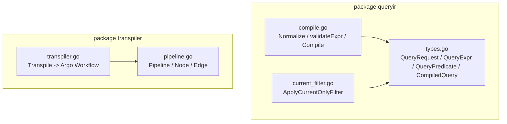
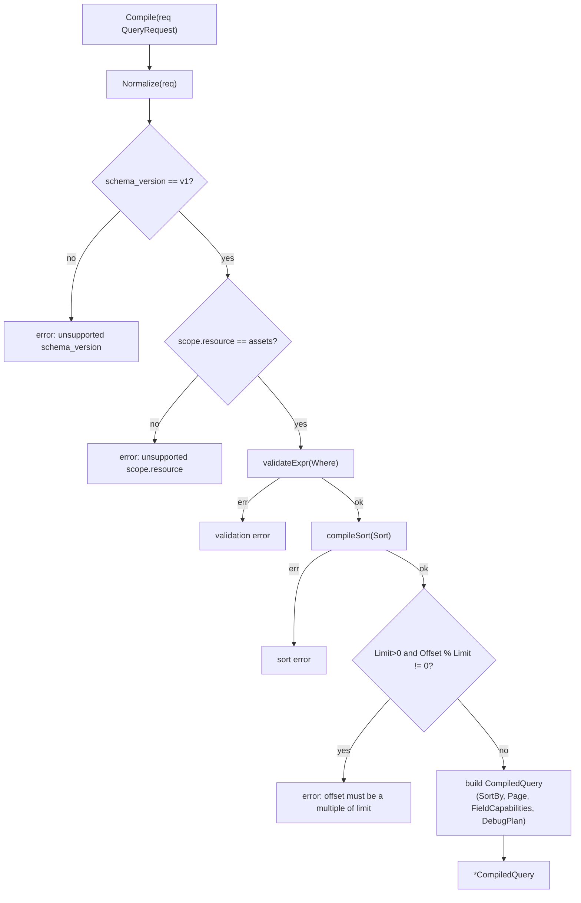
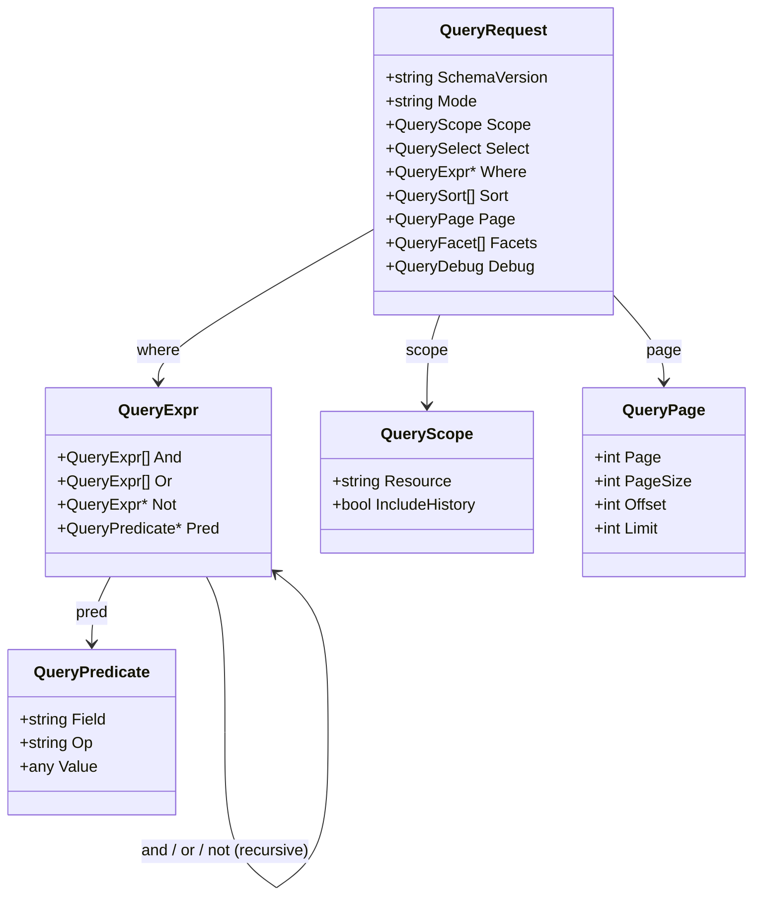
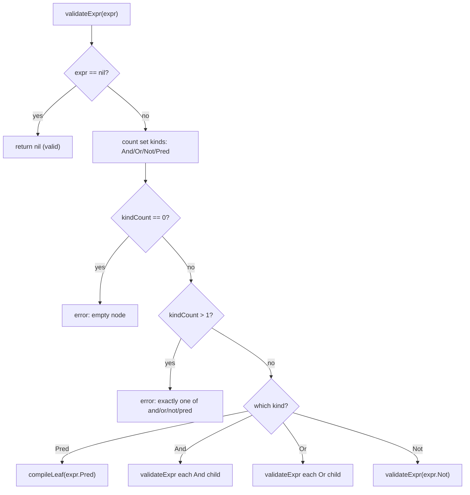
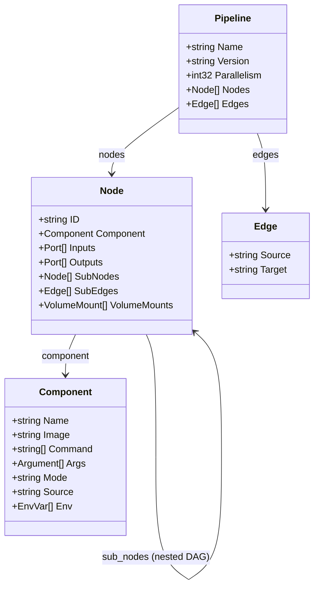
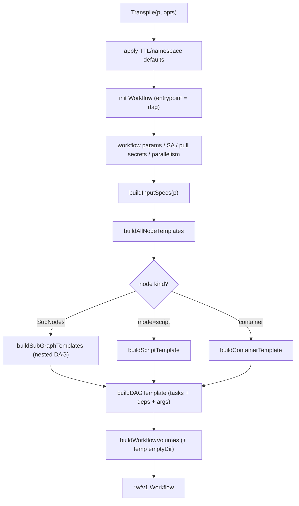
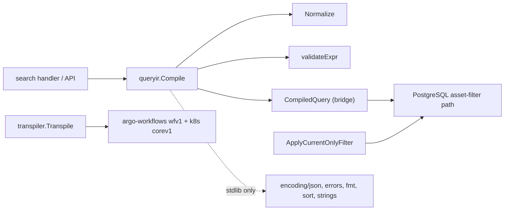

# Query IR

<cite>
**Referenced Files in This Document**

- [backend/internal/queryir/types.go](file://backend/internal/queryir/types.go)
- [backend/internal/queryir/compile.go](file://backend/internal/queryir/compile.go)
- [backend/internal/queryir/current_filter.go](file://backend/internal/queryir/current_filter.go)
- [backend/internal/transpiler/pipeline.go](file://backend/internal/transpiler/pipeline.go)
- [backend/internal/transpiler/transpiler.go](file://backend/internal/transpiler/transpiler.go)
</cite>

## Table of Contents
1. [Introduction](#introduction)
2. [Project Structure](#project-structure)
3. [Core Components](#core-components)
4. [Architecture Overview](#architecture-overview)
5. [Detailed Component Analysis](#detailed-component-analysis)
6. [Dependency Analysis](#dependency-analysis)
7. [Performance Considerations](#performance-considerations)
8. [Troubleshooting Guide](#troubleshooting-guide)
9. [Conclusion](#conclusion)
10. [Appendices](#appendices)

## Introduction

The **Query IR** is the canonical, engine-neutral representation of a search
request inside cyber-databrew. A client never speaks directly to PostgreSQL or
Elasticsearch; instead it submits a versioned `QueryRequest` envelope whose most
important member is the `where` field — a recursively defined boolean expression
tree built from four mutually exclusive node kinds: `and`, `or`, `not`, and
`pred` (a leaf predicate). The IR package validates that tree, normalizes the
whole request to canonical form, and compiles it into a `CompiledQuery` bridge
object that the existing asset-filter path can execute.

Two distinct concerns live under the source files cited for this page:

- `backend/internal/queryir` — the **query intermediate representation**: the
  request envelope, the `and/or/not/pred` expression tree, predicate operators,
  normalization, validation, and the compile-to-bridge step. This is the primary
  subject of the page.
- `backend/internal/transpiler` — a separate **pipeline transpiler** that lowers
  a DAG `Pipeline` definition into an Argo `Workflow` CRD. It is an unrelated but
  structurally analogous "tree-in, lowered-form-out" compiler, and is documented
  here as the secondary component so the two lowering passes can be contrasted.

The Query IR exists to decouple the public, stable query contract from the
physical storage engines behind it. The request schema is explicitly versioned
(`schema_version`), the IR carries a `mode` selector (structured / keyword /
semantic / similar), and the compiler emits a `DebugPlan` describing which engine
will run which step — today always a single PostgreSQL `filter` step.

**Section sources**
- [backend/internal/queryir/types.go](file://backend/internal/queryir/types.go#L1-L59)
- [backend/internal/queryir/compile.go](file://backend/internal/queryir/compile.go#L1-L66)

## Project Structure

The IR lives in a small, self-contained Go package with a sibling transpiler
package. The relevant files and their roles:

- `queryir/types.go` — all wire-level structs: `QueryRequest`, `QueryScope`,
  `QuerySelect`, `QuerySort`, `QueryPage`, `QueryFacet`, `QueryDebug`, the
  `QueryExpr` tree node, the `QueryPredicate` leaf, and the `CompiledQuery`
  bridge output plus its helper types.
- `queryir/compile.go` — the behavior: `Normalize`, `validateExpr`, `Compile`,
  the supported-operator set, value encoding, sort compilation, page
  normalization, and field-capability collection.
- `queryir/current_filter.go` — a tiny helper that decides whether asset queries
  should hide non-current revisions, plus the SQL fragment that enforces it.
- `transpiler/pipeline.go` — the `Pipeline` / `Node` / `Component` / `Edge` /
  `Port` DAG types and the `node.port` reference splitter.
- `transpiler/transpiler.go` — `Transpile` and its helpers that emit the Argo
  `Workflow` (templates, DAG tasks, volumes, retry/timeout).

**Diagram sources**
- [backend/internal/queryir/types.go](file://backend/internal/queryir/types.go#L1-L106)
- [backend/internal/queryir/compile.go](file://backend/internal/queryir/compile.go#L1-L66)
- [backend/internal/queryir/current_filter.go](file://backend/internal/queryir/current_filter.go#L1-L10)
- [backend/internal/transpiler/pipeline.go](file://backend/internal/transpiler/pipeline.go#L1-L91)
- [backend/internal/transpiler/transpiler.go](file://backend/internal/transpiler/transpiler.go#L48-L126)

**Section sources**
- [backend/internal/queryir/types.go](file://backend/internal/queryir/types.go#L1-L106)
- [backend/internal/queryir/compile.go](file://backend/internal/queryir/compile.go#L1-L331)
- [backend/internal/transpiler/pipeline.go](file://backend/internal/transpiler/pipeline.go#L1-L111)

## Core Components

#### The request envelope: `QueryRequest`

`QueryRequest` is the canonical v1 query envelope. It groups every part of a
search request: the schema version, an optional `mode`, the `scope` (which
resource and whether history is included), the `select` field list, the `where`
expression tree, an optional `sort`, paging, optional `facets`, and a `debug`
flag. `schema_version` is the only `binding:"required"` field.

#### The expression tree node: `QueryExpr`

`QueryExpr` is the heart of the IR. It is a sum type encoded as a struct with
four optional members, **exactly one** of which must be set per node:

- `And []QueryExpr` — conjunction of child expressions
- `Or  []QueryExpr` — disjunction of child expressions
- `Not *QueryExpr`  — negation of a single child expression
- `Pred *QueryPredicate` — a leaf comparison

#### The leaf predicate: `QueryPredicate`

A `QueryPredicate` is a `(Field, Op, Value)` triple. `Field` is the target field
name, `Op` is one of the supported operators (see appendix), and `Value` is an
untyped `any` so JSON numbers, strings, booleans, and arrays all round-trip.

#### The compiled bridge output: `CompiledQuery`

`Compile` produces a `CompiledQuery`. It carries `FilterStrings`, the normalized
`SortBy` string, paging (`Page`, `PageSize`), the full `NormalizedQuery`, the
collected `FieldCapabilities`, a `DebugPlan`, `Warnings`, and runtime-only fields
the search handler fills in later (`Facets`, `CandidateAssetIDs`, `MatchTotal`,
and `ESResults`).

**Section sources**
- [backend/internal/queryir/types.go](file://backend/internal/queryir/types.go#L3-L14)
- [backend/internal/queryir/types.go](file://backend/internal/queryir/types.go#L48-L59)
- [backend/internal/queryir/types.go](file://backend/internal/queryir/types.go#L75-L98)

## Architecture Overview

A request flows through three stages: **normalize**, **validate**, **compile**.
`Compile` orchestrates all three. Normalization is applied to the entire request
(trimming, lowercasing `mode` and operators, rebuilding the tree, clamping
paging). Validation walks the tree to enforce the single-kind rule and that every
leaf uses a supported operator. Compilation then derives the bridge sort string,
checks the offset/limit constraint, and assembles the `CompiledQuery`.

**Diagram sources**
- [backend/internal/queryir/compile.go](file://backend/internal/queryir/compile.go#L35-L66)

**Section sources**
- [backend/internal/queryir/compile.go](file://backend/internal/queryir/compile.go#L35-L66)
- [backend/internal/queryir/compile.go](file://backend/internal/queryir/compile.go#L202-L220)

## Detailed Component Analysis

### The `QueryExpr` tree and the single-kind invariant

The class model below mirrors the exact struct fields in `types.go`. `QueryExpr`
holds slices for `And`/`Or`, a pointer for `Not`, and a pointer for `Pred`. The
invariant enforced by `validateExpr` is that exactly one of these four is
populated on any given node; a node with zero set is an "empty node" error, and a
node with two or more set is rejected as ambiguous.

**Diagram sources**
- [backend/internal/queryir/types.go](file://backend/internal/queryir/types.go#L3-L59)

**Section sources**
- [backend/internal/queryir/types.go](file://backend/internal/queryir/types.go#L48-L59)
- [backend/internal/queryir/compile.go](file://backend/internal/queryir/compile.go#L87-L134)

#### Validation walk

`validateExpr` is a recursive descent over the tree. For each node it counts how
many of the four kinds are set (`kindCount`). Zero kinds is rejected as
`empty node`; more than one is rejected with `exactly one of and/or/not/pred must
be set`. When the single set kind is `Pred`, it delegates to `compileLeaf`, which
also validates the field, operator, and value. For `And` and `Or` it iterates
children; for `Not` it recurses into the single child. A `nil` expression (no
`where` at all) is valid and short-circuits to success.

**Diagram sources**
- [backend/internal/queryir/compile.go](file://backend/internal/queryir/compile.go#L87-L134)

**Section sources**
- [backend/internal/queryir/compile.go](file://backend/internal/queryir/compile.go#L87-L134)
- [backend/internal/queryir/compile.go](file://backend/internal/queryir/compile.go#L68-L85)

#### Predicate operators and leaf compilation

`compileLeaf` is where a leaf predicate is checked and lowered. It trims the
field, lowercases and trims the operator, rejects empty field or operator, and
verifies the operator against `supportedLeafOperators`. An unsupported operator
returns `ErrUnsupportedOperator` wrapped with the offending op. The value is then
encoded with `encodeFilterValue`, and the leaf is rendered as the bridge filter
string `field:op:value`.

The supported operator set is fixed: `eq`, `ne`, `lt`, `gt`, `lte`, `gte`,
`like`, `ilike`, `in`, `nin`, `contains`, `between`.

`encodeFilterValue` is type-driven: `nil` becomes the literal `null`; a `string`
is passed through verbatim; a `bool` becomes `true`/`false`; numeric kinds are
`json.Marshal`-ed; and any other type (slices, maps — e.g. for `in`/`between`) is
JSON-encoded as a fallback.

**Section sources**
- [backend/internal/queryir/compile.go](file://backend/internal/queryir/compile.go#L20-L33)
- [backend/internal/queryir/compile.go](file://backend/internal/queryir/compile.go#L68-L85)
- [backend/internal/queryir/compile.go](file://backend/internal/queryir/compile.go#L136-L157)

#### Query modes (structured / keyword / semantic / similar)

`Mode` on the request envelope selects the search strategy. `Normalize`
lowercases and trims it (`compile.go#L208`), making mode comparison
case-insensitive and whitespace-tolerant. The IR treats `mode` as a free-form
string at this layer — the four operational modes (structured, keyword, semantic,
similar) are interpreted by the downstream search engine selection rather than
enumerated here. The compiler's `DebugPlan` records the chosen engine and mode of
each step; the bridge always emits a single `{Engine: "postgres", Mode: "filter"}`
step today.

`IsFulltextMode` (CYB-3713) returns `true` for `"keyword"`, `"semantic"`, and
`"similar"`. When `IsFulltextMode` is true **and** the request carries a non-empty
`Q`, `Normalize` injects a synthetic `{Field: "_fulltext", Op: "ilike", Value: Q}`
predicate into the `where` tree (ANDed with any existing filter). This lets the
top-search-box drive fulltext recall without the caller having to construct
explicit `_fulltext` predicates. `FulltextExtraFields` (`fulltext_fields.go`) is
the single source of truth for which flattened asset columns both the ES and PG
fulltext paths should match — adding a new field there propagates to both engines
without touching the individual builders.

**Section sources**
- [backend/internal/queryir/types.go](file://backend/internal/queryir/types.go#L3-L14)
- [backend/internal/queryir/compile.go](file://backend/internal/queryir/compile.go#L208-L208)
- [backend/internal/queryir/compile.go](file://backend/internal/queryir/compile.go#L61-L63)
- [backend/internal/queryir/fulltext_fields.go](file://backend/internal/queryir/fulltext_fields.go)

#### Normalization

`Normalize` returns a canonicalized copy of the request. It defaults an empty
`schema_version` to `v1`, lowercases/trims `mode`, trims `scope.resource`,
rebuilds the `where` tree through `normalizeExpr`, normalizes the sort list, and
clamps paging via `normalizePage`. `normalizeExpr` recurses, dropping `nil`
children produced along the way and trimming/lowercasing each leaf's field and
op. `normalizePage` implements the offset/limit → page/page_size bridge: when
`Limit > 0` it sets `pageSize = Limit` and derives the 1-based page from
`Offset / Limit`, then applies defaults (`page = 1`, `pageSize = 20`) and a hard
ceiling of `pageSize = 200`.

**Section sources**
- [backend/internal/queryir/compile.go](file://backend/internal/queryir/compile.go#L202-L270)
- [backend/internal/queryir/compile.go](file://backend/internal/queryir/compile.go#L178-L200)

#### Sort compilation

`compileSort` reduces the sort list to a single bridge sort string. With no sort
it defaults to `-created_at` (newest first). Otherwise it takes `sort[0]`,
requires a non-empty field, and maps direction: empty or `asc` yields the bare
field, `desc` yields a `-`-prefixed field, and any other direction is an error.
Only the first sort element is honored by the bridge.

**Section sources**
- [backend/internal/queryir/compile.go](file://backend/internal/queryir/compile.go#L159-L176)

#### Field capability collection

`collectFieldCapabilities` gathers every distinct field referenced by the
request — from the `where` tree (`collectFieldsFromExpr` walks `pred`/`and`/`or`/
`not`), then from `sort` and `facets` — de-duplicates via a `seen` set, sorts the
names, and emits one `FieldCapabilityBrief` per field reporting which engines can
serve it. In the current bridge every field reports `["postgres"]`.

**Section sources**
- [backend/internal/queryir/compile.go](file://backend/internal/queryir/compile.go#L272-L331)
- [backend/internal/queryir/types.go](file://backend/internal/queryir/types.go#L61-L73)

#### Current-revision filtering

`current_filter.go` governs history visibility. `ApplyCurrentOnlyFilter` returns
true when the scope resource is `assets` and `include_history` is false — meaning
non-current revisions should be hidden. The SQL fragment `CurrentRevisionOnlySQL`
(`(COALESCE(is_current, TRUE) = TRUE)`) is appended to PG asset list queries in
that case; the `COALESCE` ensures legacy rows with a `NULL is_current` remain
visible.

**Section sources**
- [backend/internal/queryir/current_filter.go](file://backend/internal/queryir/current_filter.go#L1-L10)

### The pipeline transpiler (secondary component)

The `transpiler` package is a separate lowering pass: it converts a `Pipeline`
DAG definition into an Argo `Workflow` CRD. While unrelated to search, it is the
other compiler cited for this page and follows the same "tree in, lowered form
out" shape, so it is documented here for contrast.

A `Pipeline` has a name, optional version, parallelism cap, a list of `Node`s,
and a list of `Edge`s. A `Node` carries an `ID`, a `Component` (the container/
script spec), optional input/output `Port`s, optional `SubNodes`/`SubEdges` (for
nested sub-graph DAGs), and `VolumeMounts`. An `Edge` connects `node.port`
references, split rightmost-dot-first by `splitRef`.

**Diagram sources**
- [backend/internal/transpiler/pipeline.go](file://backend/internal/transpiler/pipeline.go#L3-L91)

`Transpile` builds the `Workflow`: it defaults TTL to 3600s and namespace to
`default`, sets the entrypoint to `dag`, wires service account / image-pull
secrets / parallelism / workflow params, computes per-node input specs
(`buildInputSpecs`), builds all node templates (`buildAllNodeTemplates`), appends
the DAG template (`buildDAGTemplate`), and collects workflow volumes. Each node
becomes either a container template, a script template (when
`Component.Mode == "script"`), or — when it has `SubNodes` — a nested DAG plus its
sub-node templates (`buildSubGraphTemplates`).

**Diagram sources**
- [backend/internal/transpiler/transpiler.go](file://backend/internal/transpiler/transpiler.go#L48-L126)
- [backend/internal/transpiler/transpiler.go](file://backend/internal/transpiler/transpiler.go#L474-L510)

**Section sources**
- [backend/internal/transpiler/transpiler.go](file://backend/internal/transpiler/transpiler.go#L48-L259)
- [backend/internal/transpiler/transpiler.go](file://backend/internal/transpiler/transpiler.go#L411-L510)
- [backend/internal/transpiler/pipeline.go](file://backend/internal/transpiler/pipeline.go#L1-L111)

## Dependency Analysis

The `queryir` package is intentionally dependency-light: it imports only the Go
standard library (`encoding/json`, `errors`, `fmt`, `sort`, `strings`). It has no
knowledge of PostgreSQL or Elasticsearch — it emits an engine-neutral
`CompiledQuery` bridge that downstream search code consumes. This keeps the
public query contract stable and testable in isolation.

The `transpiler` package depends on the Argo Workflows API
(`argoproj/argo-workflows/v3`) and several Kubernetes API packages (`corev1`,
`resource`, `metav1`, `intstr`) to build the `Workflow` CRD.

**Diagram sources**
- [backend/internal/queryir/compile.go](file://backend/internal/queryir/compile.go#L1-L9)
- [backend/internal/transpiler/transpiler.go](file://backend/internal/transpiler/transpiler.go#L1-L12)

**Section sources**
- [backend/internal/queryir/compile.go](file://backend/internal/queryir/compile.go#L1-L9)
- [backend/internal/queryir/current_filter.go](file://backend/internal/queryir/current_filter.go#L1-L10)
- [backend/internal/transpiler/transpiler.go](file://backend/internal/transpiler/transpiler.go#L1-L12)

## Performance Considerations

- **Bounded paging.** `normalizePage` caps `pageSize` at 200 and defaults it to
  20, preventing pathological full-table scans from oversized page requests.
- **Single-pass tree walks.** Validation, normalization, and field collection are
  each linear in the number of tree nodes; there is no quadratic re-walk. Field
  collection uses a `seen` map to avoid duplicate capability entries.
- **Offset/limit alignment.** In bridge mode the compiler requires
  `offset % limit == 0`, which keeps the offset→page conversion exact and avoids
  partial-page boundaries that would force re-fetching.
- **`-created_at` default sort.** The default sort is descending on `created_at`,
  which should be backed by an index on the assets table for efficient newest-
  first paging.
- **Engine-neutral compile is cheap.** `Compile` does only string and slice work;
  the heavy I/O happens downstream in the PostgreSQL/Elasticsearch path that
  consumes the `CompiledQuery`. The runtime-only `ESResults`/`CandidateAssetIDs`
  fields let the handler skip a PG `COUNT`/refine when ES recall already matched.

**Section sources**
- [backend/internal/queryir/compile.go](file://backend/internal/queryir/compile.go#L178-L200)
- [backend/internal/queryir/compile.go](file://backend/internal/queryir/compile.go#L51-L53)
- [backend/internal/queryir/compile.go](file://backend/internal/queryir/compile.go#L159-L162)
- [backend/internal/queryir/types.go](file://backend/internal/queryir/types.go#L86-L92)

## Troubleshooting Guide

#### `unsupported schema_version "..."`
`Compile` only accepts `v1` (after normalization defaults an empty value to
`v1`). Any other value fails fast. Set `schema_version` to `v1` or omit it.

#### `unsupported scope.resource "..."`
The bridge currently supports only the `assets` resource. Set
`scope.resource` to `assets`.

#### `invalid where expression: empty node`
A `QueryExpr` node has none of `and/or/not/pred` set. Every node must carry
exactly one kind; remove empty objects from the tree.

#### `invalid where expression: exactly one of and/or/not/pred must be set`
A node set two or more kinds (e.g. both `and` and `pred`). Split it into nested
nodes so each node carries a single kind.

#### `unsupported operator "..."`
The predicate `op` is not in the supported set (`eq`, `ne`, `lt`, `gt`, `lte`,
`gte`, `like`, `ilike`, `in`, `nin`, `contains`, `between`). Note that operators
are lowercased during normalization, so casing is not the cause.

#### `missing field in predicate` / `missing operator in predicate`
A leaf predicate has an empty `field` or `op` after trimming. Populate both.

#### `sort[0].field is required` / `unsupported sort direction "..."`
The first sort element has an empty field, or a direction other than
`asc`/`desc` (empty is treated as `asc`). Fix the first sort entry.

#### `invalid page: offset must be a multiple of limit in bridge mode`
When using `offset`/`limit` paging, `offset` must be an exact multiple of
`limit`. Align the offset to a page boundary.

**Section sources**
- [backend/internal/queryir/compile.go](file://backend/internal/queryir/compile.go#L35-L53)
- [backend/internal/queryir/compile.go](file://backend/internal/queryir/compile.go#L68-L85)
- [backend/internal/queryir/compile.go](file://backend/internal/queryir/compile.go#L104-L109)
- [backend/internal/queryir/compile.go](file://backend/internal/queryir/compile.go#L159-L176)

## Conclusion

The Query IR gives cyber-databrew a stable, versioned, engine-neutral contract
for search. Its centerpiece is the `QueryExpr` tree — `and`/`or`/`not`/`pred`
with a strict single-kind-per-node invariant — and a fixed set of leaf
operators. `Normalize`, `validateExpr`, and `Compile` together canonicalize,
validate, and lower a request into a `CompiledQuery` bridge that the existing
PostgreSQL asset-filter path executes, with a `DebugPlan` recording the engine
plan and `FieldCapabilities` reporting which engines can serve each field. The
sibling `transpiler` package performs an analogous lowering for pipeline DAGs
into Argo workflows. The package's standard-library-only footprint keeps the
contract easy to test and evolve as new query modes and engines are added.

## Appendices

### Appendix A — Supported predicate operators

| Operator   | Meaning                          |
|------------|----------------------------------|
| `eq`       | equal                            |
| `ne`       | not equal                        |
| `lt`       | less than                        |
| `gt`       | greater than                     |
| `lte`      | less than or equal               |
| `gte`      | greater than or equal            |
| `like`     | pattern match (case-sensitive)   |
| `ilike`    | pattern match (case-insensitive) |
| `in`       | value in set                     |
| `nin`      | value not in set                 |
| `contains` | collection/substring containment |
| `between`  | range match                      |

**Section sources**
- [backend/internal/queryir/compile.go](file://backend/internal/queryir/compile.go#L20-L33)

### Appendix B — `QueryExpr` node kinds

| Field  | Go type           | Role                         | Validation                          |
|--------|-------------------|------------------------------|-------------------------------------|
| `And`  | `[]QueryExpr`     | conjunction of children      | each child validated recursively    |
| `Or`   | `[]QueryExpr`     | disjunction of children      | each child validated recursively    |
| `Not`  | `*QueryExpr`      | negation of one child        | child validated recursively         |
| `Pred` | `*QueryPredicate` | leaf comparison              | field/op/value via `compileLeaf`    |

Exactly one field must be set per node; zero or more-than-one is rejected.

**Section sources**
- [backend/internal/queryir/types.go](file://backend/internal/queryir/types.go#L48-L59)
- [backend/internal/queryir/compile.go](file://backend/internal/queryir/compile.go#L87-L134)

### Appendix C — Compile constants and the DebugPlan

| Symbol                    | Value                              | Purpose                                  |
|---------------------------|------------------------------------|------------------------------------------|
| `SchemaVersionV1`         | `"v1"`                             | the only accepted schema version         |
| `ResourceAssets`          | `"assets"`                         | the only accepted scope resource         |
| default sort              | `"-created_at"`                    | newest-first when no sort given          |
| default `pageSize`        | `20` (max `200`)                   | paging bounds                            |
| `DebugPlan` bridge step   | `{Engine: "postgres", Mode: "filter"}` | single-step plan emitted by the bridge |
| `CurrentRevisionOnlySQL`  | `(COALESCE(is_current, TRUE) = TRUE)` | hide non-current revisions in PG       |

**Section sources**
- [backend/internal/queryir/compile.go](file://backend/internal/queryir/compile.go#L11-L14)
- [backend/internal/queryir/compile.go](file://backend/internal/queryir/compile.go#L61-L63)
- [backend/internal/queryir/compile.go](file://backend/internal/queryir/compile.go#L159-L162)
- [backend/internal/queryir/current_filter.go](file://backend/internal/queryir/current_filter.go#L1-L5)
</content>
</invoke>
