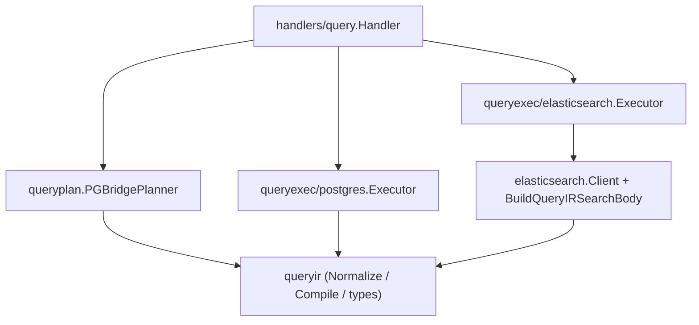
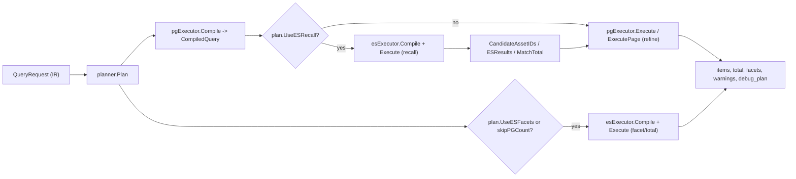
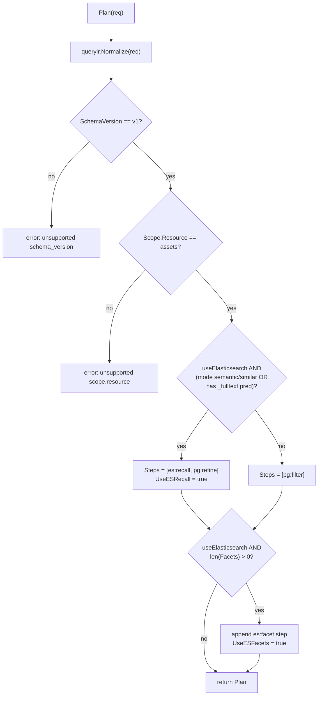
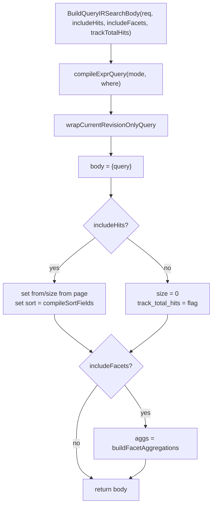
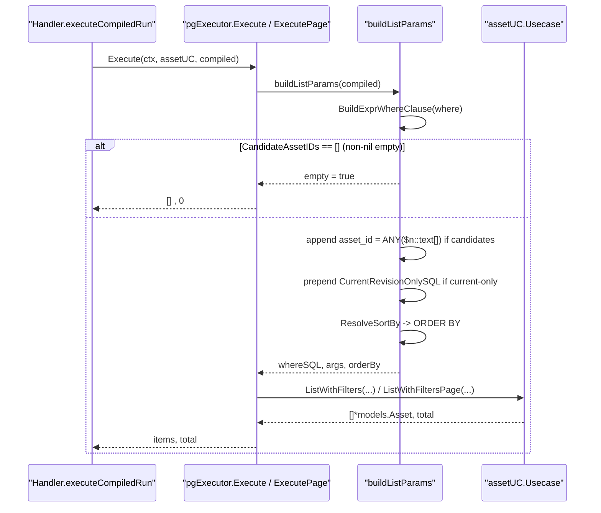
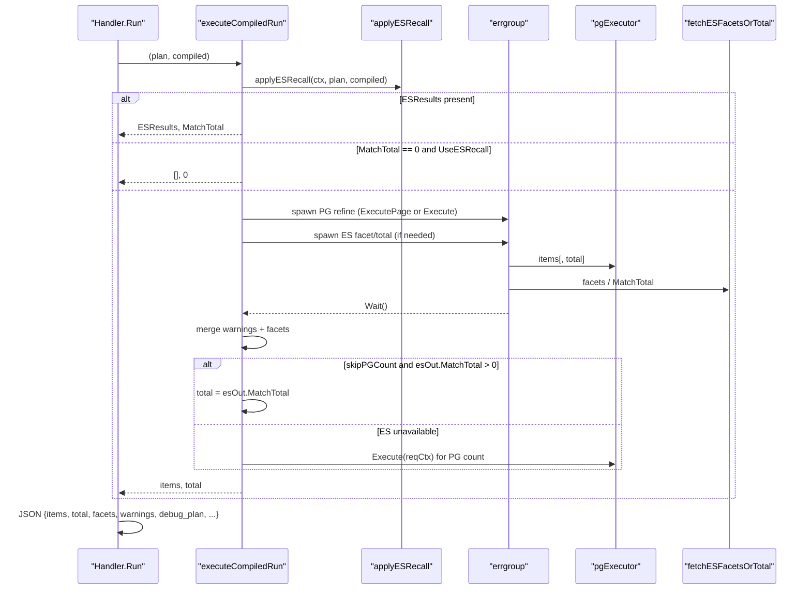
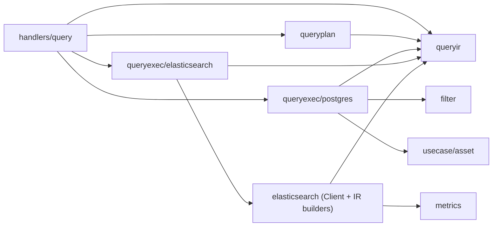

# Query Plan & Execution

<cite>
**Referenced Files in This Document**

- [backend/internal/queryplan/planner.go](file://backend/internal/queryplan/planner.go)
- [backend/internal/queryexec/elasticsearch/compile.go](file://backend/internal/queryexec/elasticsearch/compile.go)
- [backend/internal/queryexec/elasticsearch/execute.go](file://backend/internal/queryexec/elasticsearch/execute.go)
- [backend/internal/queryexec/postgres/compile.go](file://backend/internal/queryexec/postgres/compile.go)
- [backend/internal/queryexec/postgres/execute.go](file://backend/internal/queryexec/postgres/execute.go)
- [backend/internal/queryexec/postgres/expr.go](file://backend/internal/queryexec/postgres/expr.go)
- [backend/internal/elasticsearch/client.go](file://backend/internal/elasticsearch/client.go)
- [backend/internal/elasticsearch/current_filter.go](file://backend/internal/elasticsearch/current_filter.go)
- [backend/internal/elasticsearch/query_ir.go](file://backend/internal/elasticsearch/query_ir.go)
- [backend/internal/queryir/types.go](file://backend/internal/queryir/types.go)
- [backend/internal/queryir/compile.go](file://backend/internal/queryir/compile.go)
- [backend/internal/queryir/current_filter.go](file://backend/internal/queryir/current_filter.go)
- [backend/internal/handlers/query/handler.go](file://backend/internal/handlers/query/handler.go)
</cite>

## Table of Contents
1. [Introduction](#introduction)
2. [Project Structure](#project-structure)
3. [Core Components](#core-components)
4. [Architecture Overview](#architecture-overview)
5. [Detailed Component Analysis](#detailed-component-analysis)
6. [Dependency Analysis](#dependency-analysis)
7. [Performance Considerations](#performance-considerations)
8. [Troubleshooting Guide](#troubleshooting-guide)
9. [Conclusion](#conclusion)
10. [Appendices](#appendices)

## Introduction

The query plan and execution subsystem is the engine that turns a validated
Query IR request (`schema_version: v1`, `scope.resource: assets`) into a
concrete, multi-engine execution: an optional Elasticsearch recall phase
followed by an authoritative PostgreSQL refine phase, with facets, totals,
warnings, and a `debug_plan` echoed back to the caller.

It exists because the platform stores its canonical asset rows in PostgreSQL
but also mirrors them into an Elasticsearch index for full-text search, "more
like this" similarity, and cheap faceting. Neither engine alone serves every
query well: PostgreSQL is the source of truth and handles structured filters,
sorting, and exact counts; Elasticsearch handles fuzzy and semantic recall and
returns aggregations and `track_total_hits` totals far more cheaply than a
`COUNT(*)`. The planner decides, per request, which engine does what, and the
executors carry out each engine's part.

The primary consumer is the query HTTP handler (`POST /query/run` and
`POST /query/validate`), which wires a `PGBridgePlanner`, a PostgreSQL
`Executor`, and an Elasticsearch `Executor` together and orchestrates their
results into the final JSON response.

**Section sources**
- [backend/internal/queryplan/planner.go](file://backend/internal/queryplan/planner.go#L9-L51)
- [backend/internal/handlers/query/handler.go](file://backend/internal/handlers/query/handler.go#L27-L124)

## Project Structure

The subsystem spans four Go packages, each with a narrow responsibility:

- **`internal/queryir`** — the canonical request envelope (`QueryRequest`),
  the compiled intermediate (`CompiledQuery`), and the debug plan types
  (`DebugPlan`, `DebugPlanStep`). It also owns `Normalize`, `Compile`, and the
  current-revision filter helpers shared by both engines.
- **`internal/queryplan`** — the `PGBridgePlanner`, which reads a normalized IR
  and produces a `Plan` describing which engines run and in what `mode`.
- **`internal/queryexec/elasticsearch`** — the ES `Executor`: compiles a plan
  into an ES search body and executes recall / facet / total-only calls.
- **`internal/queryexec/postgres`** — the PG `Executor`: compiles the plan into
  a `CompiledQuery`, builds the `WHERE`/`ORDER BY`, and runs the refine query
  against the asset use case.
- **`internal/elasticsearch`** — the low-level HTTP `Client` plus the pure IR→ES
  body builders (`BuildQueryIRSearchBody`, `compileExprQuery`) and the
  current-revision wrapper.
- **`internal/handlers/query`** — the HTTP `Handler` that owns one instance of
  each executor and the planner and stitches their outputs together.



**Diagram sources**
- [backend/internal/handlers/query/handler.go](file://backend/internal/handlers/query/handler.go#L27-L45)
- [backend/internal/queryexec/elasticsearch/compile.go](file://backend/internal/queryexec/elasticsearch/compile.go#L1-L28)
- [backend/internal/queryexec/postgres/compile.go](file://backend/internal/queryexec/postgres/compile.go#L1-L21)

**Section sources**
- [backend/internal/queryir/types.go](file://backend/internal/queryir/types.go#L1-L106)
- [backend/internal/handlers/query/handler.go](file://backend/internal/handlers/query/handler.go#L1-L45)

## Core Components

#### The `Plan`

`Plan` is the planner's output. It carries the normalized request, the ordered
list of `DebugPlanStep`s, and two booleans that gate Elasticsearch usage:
`UseESRecall` and `UseESFacets`.

```
type Plan struct {
    NormalizedQuery queryir.QueryRequest
    Steps           []queryir.DebugPlanStep
    UseESRecall     bool
    UseESFacets     bool
}
```

The `Steps` slice is exactly what the API returns as `debug_plan.steps`, so the
plan is both a control structure and a piece of observable output.

**Section sources**
- [backend/internal/queryplan/planner.go](file://backend/internal/queryplan/planner.go#L9-L14)
- [backend/internal/queryir/types.go](file://backend/internal/queryir/types.go#L66-L73)

#### The `PGBridgePlanner`

`PGBridgePlanner` is constructed with a single boolean, `useElasticsearch`,
which the handler sets to `esClient != nil`. When no ES client is configured,
the planner can never decide to use ES, and every query is PostgreSQL-only.

**Section sources**
- [backend/internal/queryplan/planner.go](file://backend/internal/queryplan/planner.go#L16-L22)
- [backend/internal/handlers/query/handler.go](file://backend/internal/handlers/query/handler.go#L36-L45)

#### The `CompiledQuery`

`CompiledQuery` is the shared intermediate that flows between both executors and
the handler. It is described in the source as "a v1 bridge to the existing asset
filter path." Its key fields:

| Field | Purpose |
| --- | --- |
| `NormalizedQuery` | The normalized IR; PG builds `WHERE`/`ORDER BY` from it |
| `SortBy` | Compiled sort expression resolved against the filter layer |
| `Page`, `PageSize` | Paging echoed back in the response |
| `DebugPlan` | The steps from the `Plan`, surfaced as `debug_plan` |
| `Warnings` | User-facing fallback notices accumulated during execution |
| `Facets` | `map[string][]FacetBucket` populated from ES aggregations |
| `CandidateAssetIDs` | The ES recall result; refines the PG `WHERE` |
| `MatchTotal` | ES `track_total_hits` total when PG `COUNT` is skipped |
| `ESResults` | Raw ES `_source` hits used directly when candidate transfer is skipped |

A subtle but important invariant: `CandidateAssetIDs == nil` means "no ES recall
was applied" (run PG normally), while a non-nil but empty slice means "ES recall
ran and matched nothing" (return empty). This three-state semantic is honored in
the PG `buildListParams`.

**Section sources**
- [backend/internal/queryir/types.go](file://backend/internal/queryir/types.go#L75-L98)
- [backend/internal/queryexec/postgres/execute.go](file://backend/internal/queryexec/postgres/execute.go#L36-L67)

#### The Elasticsearch and PostgreSQL `Executor`s

Each engine has a thin `Executor`. The ES executor wraps a `*elasticsearch.Client`
and exposes `Compile`, `CompileCountOnly`, and `Execute`. The PG executor is
stateless and exposes `Compile`, `Execute`, and `ExecutePage`.

**Section sources**
- [backend/internal/queryexec/elasticsearch/compile.go](file://backend/internal/queryexec/elasticsearch/compile.go#L8-L28)
- [backend/internal/queryexec/postgres/compile.go](file://backend/internal/queryexec/postgres/compile.go#L8-L21)

## Architecture Overview

The handler drives a fixed pipeline: **plan → PG compile → (ES recall) → PG
refine, with ES facets/total in parallel → assemble response**. The planner is
pure (no I/O); all engine I/O happens in the executors, coordinated by the
handler.



**Diagram sources**
- [backend/internal/handlers/query/handler.go](file://backend/internal/handlers/query/handler.go#L77-L124)
- [backend/internal/handlers/query/handler.go](file://backend/internal/handlers/query/handler.go#L272-L364)

**Section sources**
- [backend/internal/handlers/query/handler.go](file://backend/internal/handlers/query/handler.go#L77-L364)

## Detailed Component Analysis

### Plan compilation from IR

`PGBridgePlanner.Plan` is the entry point. It first calls `queryir.Normalize`
on the request, then enforces the two hard constraints of the v1 bridge: the
schema version must be `v1` and the scope resource must be `assets`. Either
violation returns an error that the handler maps to a `400`.

It then decides two flags:

- **`useRecall`** = `useElasticsearch && shouldUseESRecall(normalized)`.
  `shouldUseESRecall` returns true when `mode` is `"semantic"` or `"similar"`,
  or when the `where` tree contains any predicate on the synthetic `_fulltext`
  field. `hasFulltextPredicate` walks the IR tree recursively across `And`,
  `Or`, and `Not`.
- **`useFacets`** = `useElasticsearch && len(normalized.Facets) > 0`.

Finally it builds the `Steps`. The default plan is a single
`{postgres, filter}` step. When recall is on, the steps become
`{elasticsearch, recall}` then `{postgres, refine}`. When facets are on, an
`{elasticsearch, facet}` step is appended. These steps are purely descriptive
and feed the `debug_plan` output.



**Diagram sources**
- [backend/internal/queryplan/planner.go](file://backend/internal/queryplan/planner.go#L24-L82)

**Section sources**
- [backend/internal/queryplan/planner.go](file://backend/internal/queryplan/planner.go#L24-L82)
- [backend/internal/queryir/compile.go](file://backend/internal/queryir/compile.go#L202-L206)

### PostgreSQL compile

`pgExecutor.Compile` delegates to `queryir.Compile`, which validates the
expression tree, compiles the sort, and validates paging (in bridge mode, an
offset must be a multiple of the limit). It returns a `CompiledQuery` whose
`DebugPlan` defaults to a single `{postgres, filter}` step; the PG executor then
overwrites that with the planner's `Steps`, so the `debug_plan` reflects the
chosen multi-engine plan rather than the compile-time default.

**Section sources**
- [backend/internal/queryexec/postgres/compile.go](file://backend/internal/queryexec/postgres/compile.go#L14-L21)
- [backend/internal/queryir/compile.go](file://backend/internal/queryir/compile.go#L35-L66)

### Elasticsearch compile

`esExecutor.Compile` and `CompileCountOnly` both delegate to
`elasticsearch.BuildQueryIRSearchBody`, differing only in the three boolean
flags they pass: `includeHits`, `includeFacets`, and `trackTotalHits`.

`BuildQueryIRSearchBody` first compiles the `where` tree into an ES query via
`compileExprQuery`, then wraps the result in the current-revision filter via
`wrapCurrentRevisionOnlyQuery`. The compilation is recursive:

- `nil` expression → `match_all`.
- a predicate → `compilePredicateQuery`, which routes `_fulltext` predicates to
  `buildSearchModeQuery` (mode-aware: `semantic` adds `fuzziness: AUTO`,
  `similar` emits a `more_like_this` query) and other predicates through the
  shared `nestedPath` / `buildFilterClause` machinery.
- `And` → `bool.must`, `Or` → `bool.should` with `minimum_should_match: 1`,
  `Not` → `bool.must_not`.

When `includeHits` is true (the recall body), it sets `from`/`size` from the
IR paging (preferring `limit`/`offset`, falling back to `page`/`page_size`) and
a `sort` built by `compileSortFields`. When `includeHits` is false (count-only),
it sets `size: 0` and `track_total_hits` to the flag. Facet aggregations are
attached only when `includeFacets` is set, via `buildFacetAggregations`, which
maps a small allow-list of facet fields to their ES keyword paths.



**Diagram sources**
- [backend/internal/elasticsearch/query_ir.go](file://backend/internal/elasticsearch/query_ir.go#L10-L133)
- [backend/internal/elasticsearch/current_filter.go](file://backend/internal/elasticsearch/current_filter.go#L7-L29)

**Section sources**
- [backend/internal/queryexec/elasticsearch/compile.go](file://backend/internal/queryexec/elasticsearch/compile.go#L16-L28)
- [backend/internal/elasticsearch/query_ir.go](file://backend/internal/elasticsearch/query_ir.go#L10-L186)
- [backend/internal/elasticsearch/current_filter.go](file://backend/internal/elasticsearch/current_filter.go#L1-L29)

### Elasticsearch recall execution

`esExecutor.Execute(ctx, body, collectCandidates)` is the heart of recall. Its
behavior:

1. A nil executor or nil client returns an empty `CompiledQuery` — the handler
   treats this as "ES unavailable" and falls back to PG.
2. If `collectCandidates` is set but the body is a bare `match_all`
   (`isMatchAllQuery`), candidate collection is disabled — scrolling every ID
   for the common assets landing page is pure overhead with no correctness gain.
3. The first ES call is either `SearchBodyScroll` (when collecting candidates,
   opening a 2-minute scroll context) or `SearchBody` (otherwise). Aggregations
   are mapped into `Facets` and the total into `MatchTotal`.
4. If candidates are not being collected, or the total is `0`, it returns
   immediately with just facets/total.
5. If the recall matched **more than `maxRecallCandidateIDs` (10000)** docs, it
   appends a warning, returns the first page's `_source` documents directly as
   `ESResults`, and skips candidate transfer entirely (PG refine would be more
   expensive than just trusting ES).
6. Otherwise it collects IDs from the first page and continues `ScrollNext`
   until it has all IDs up to the total, releasing the scroll via `ClearScroll`
   in a deferred call. The collected IDs become `CandidateAssetIDs`.

```mermaid
sequenceDiagram
  participant H as "Handler.applyESRecall"
  participant E as "esExecutor.Execute"
  participant C as "elasticsearch.Client"
  H->>E: Execute(ctx, body, collectCandidates=true)
  alt body is match_all
    E->>E: collectCandidates = false
  end
  E->>C: SearchBodyScroll(ctx, body)
  C-->>E: SearchResponse{Total, Hits, Aggregations}, scrollID
  E->>E: map Aggregations -> Facets; MatchTotal = Total
  alt Total == 0 or not collecting
    E-->>H: CompiledQuery{Facets, MatchTotal}
  else Total > 10000
    E->>E: append "skipped candidate transfer" warning
    E->>E: ESResults = first page _source
    E-->>H: CompiledQuery{ESResults, MatchTotal, Warnings}
  else Total <= 10000
    E->>E: collect IDs from first page
    loop until len(ids) == Total
      E->>C: ScrollNext(ctx, scrollID)
      C-->>E: page IDs, next scrollID
    end
    E->>C: ClearScroll(ctx, scrollID)
    E-->>H: CompiledQuery{CandidateAssetIDs, Facets, MatchTotal}
  end
```

**Diagram sources**
- [backend/internal/queryexec/elasticsearch/execute.go](file://backend/internal/queryexec/elasticsearch/execute.go#L13-L101)
- [backend/internal/elasticsearch/client.go](file://backend/internal/elasticsearch/client.go#L171-L177)
- [backend/internal/elasticsearch/client.go](file://backend/internal/elasticsearch/client.go#L882-L958)

**Section sources**
- [backend/internal/queryexec/elasticsearch/execute.go](file://backend/internal/queryexec/elasticsearch/execute.go#L11-L121)
- [backend/internal/elasticsearch/client.go](file://backend/internal/elasticsearch/client.go#L131-L177)

### PostgreSQL refine execution

The PG executor turns the `CompiledQuery` (now possibly carrying
`CandidateAssetIDs` from recall) into a SQL `WHERE` + `ORDER BY` and runs it
against the asset use case. `buildListParams` assembles the clause:

1. `BuildExprWhereClause` compiles the IR `where` tree into parameterized SQL.
   Logical nodes recurse; predicates on `_fulltext` route to a dedicated
   `ILIKE`-across-columns clause, while other predicates are serialized and run
   through the shared `filter` parser/validator/builder.
2. If `CandidateAssetIDs` is non-nil and empty, it returns `empty = true` — the
   query short-circuits to zero rows without touching the database.
3. If candidates are present, they are bound as a single `asset_id = ANY($n::text[])`
   clause (one array bind, to avoid PostgreSQL's 65535-parameter limit on large
   ID sets) and `AND`-ed with the `where` SQL.
4. If `ApplyCurrentOnlyFilter` holds (resource is `assets` and history is not
   requested), `CurrentRevisionOnlySQL` (`(COALESCE(is_current, TRUE) = TRUE)`)
   is prepended.
5. `ResolveSortBy` produces the `ORDER BY` clause.

`Execute` runs the list with a `COUNT(*)` total; `ExecutePage` runs it without
the count (used when the total comes from ES instead).



**Diagram sources**
- [backend/internal/queryexec/postgres/execute.go](file://backend/internal/queryexec/postgres/execute.go#L13-L73)
- [backend/internal/queryexec/postgres/expr.go](file://backend/internal/queryexec/postgres/expr.go#L16-L144)
- [backend/internal/queryir/current_filter.go](file://backend/internal/queryir/current_filter.go#L1-L10)

**Section sources**
- [backend/internal/queryexec/postgres/execute.go](file://backend/internal/queryexec/postgres/execute.go#L13-L73)
- [backend/internal/queryexec/postgres/expr.go](file://backend/internal/queryexec/postgres/expr.go#L16-L144)

### Handler orchestration and the response shape

`Handler.Run` binds the JSON body, applies the `include_history` query param,
compiles the plan, and calls `executeCompiledRun`, then assembles the response
with `items`, `total`, `page`, `page_size`, `columns`, `column_defs`, `offset`,
`limit`, `facets`, `warnings`, and `debug_plan`.

`executeCompiledRun` is where the engines meet:

1. `applyESRecall` runs first. It compiles and executes the ES recall body with
   `collectCandidates = true`, copies any warnings, and sets `CandidateAssetIDs`
   (nil when recall matched nothing, so PG defends against index lag with a full
   scan), `ESResults` (normalized via `normalizeESAsset`), and `MatchTotal`.
2. If `ESResults` is non-empty, those documents and `MatchTotal` are returned
   directly — PG refine is skipped because candidate transfer was skipped.
3. If recall ran and `MatchTotal == 0`, it short-circuits to an empty result —
   "ES is the authoritative search oracle for fulltext; if it says 0, trust it."
4. Otherwise it decides `skipPGCount` (`canSkipPGCount`: no `where` and not a
   recall with candidates), and whether ES facets or an ES total-only call is
   needed.
5. PG refine and the optional ES facet/total call run **concurrently** in an
   `errgroup`. The original request context is saved before the errgroup
   because the derived context is cancelled by `Wait()`; any post-`Wait` PG
   fallback uses the saved context to avoid `context canceled`.
6. After `Wait`, ES warnings/facets are merged. When `skipPGCount` is set, the
   total is taken from `esOut.MatchTotal`; if ES is unavailable or returned no
   total, a warning is appended and PG `Execute` is re-run (with the count) on
   the saved context.



**Diagram sources**
- [backend/internal/handlers/query/handler.go](file://backend/internal/handlers/query/handler.go#L77-L124)
- [backend/internal/handlers/query/handler.go](file://backend/internal/handlers/query/handler.go#L202-L364)

**Section sources**
- [backend/internal/handlers/query/handler.go](file://backend/internal/handlers/query/handler.go#L77-L364)

### The `validate` path

`Handler.Validate` reuses `compileAndValidate`, which plans, PG-compiles, and —
when recall or facets are planned — eagerly runs the ES recall/facet call so the
validation response carries real warnings, facets, and field capabilities
without executing the PG refine. It then double-checks that the `where` tree
and sort still compile before returning `valid`, `normalized_query`,
`warnings`, `field_capabilities`, and `debug_plan`.

**Section sources**
- [backend/internal/handlers/query/handler.go](file://backend/internal/handlers/query/handler.go#L53-L74)
- [backend/internal/handlers/query/handler.go](file://backend/internal/handlers/query/handler.go#L126-L182)

## Dependency Analysis

The dependency direction is strictly one-way: the handler depends on the
planner and both executors; the executors depend on `queryir` (shared types and
compile helpers) and, for ES, on the core `elasticsearch` package; nothing in
`queryir`, `queryplan`, or the executors depends back on the handler.



The `elasticsearch` package is shared between the recall path and the legacy
`Search` API; the IR-specific builders (`BuildQueryIRSearchBody`,
`compileExprQuery`, `wrapCurrentRevisionOnlyQuery`) reuse the same low-level
clause builders (`buildFilterClause`, `buildNestedClause`, `buildScalarClause`)
as the legacy `buildSearchBody`, keeping the field-routing rules consistent
across both entry points.

**Diagram sources**
- [backend/internal/handlers/query/handler.go](file://backend/internal/handlers/query/handler.go#L1-L45)
- [backend/internal/queryexec/postgres/execute.go](file://backend/internal/queryexec/postgres/execute.go#L1-L11)
- [backend/internal/queryexec/elasticsearch/execute.go](file://backend/internal/queryexec/elasticsearch/execute.go#L1-L9)

**Section sources**
- [backend/internal/elasticsearch/query_ir.go](file://backend/internal/elasticsearch/query_ir.go#L1-L133)
- [backend/internal/elasticsearch/client.go](file://backend/internal/elasticsearch/client.go#L102-L129)

## Performance Considerations

- **Single first ES call for facets + first page + scroll context.** `Execute`
  opens the scroll on the very first search (`SearchBodyScroll`), so facets, the
  total, the first page of hits, and the scroll cursor all come from one
  round-trip rather than separate calls.
- **`match_all` short-circuit.** A bare `match_all` recall disables candidate
  collection, sparing the cluster a full scroll on the common assets landing
  page where PG can scan just as well.
- **10k candidate ceiling.** When recall matches more than `maxRecallCandidateIDs`,
  candidate transfer is skipped and the first page of ES `_source` is returned
  directly, avoiding both a massive scroll and a huge `ANY(...)` array bind.
- **Single array bind for candidates.** `buildCandidateIDsClause` binds IDs as a
  single `$n::text[]` parameter, sidestepping PostgreSQL's 65535-parameter
  limit on large candidate sets.
- **Parallel refine and total/facet.** PG refine and the ES facet/total call run
  concurrently under an `errgroup`, so the slower of the two — not their sum —
  bounds latency.
- **Skipping `COUNT(*)`.** When there is no `where` and recall did not produce
  candidates, the PG count is skipped (`ExecutePage`) and the total comes from
  ES `track_total_hits`, which is far cheaper than a full table count.
- **Client timeout.** The ES HTTP client uses a 15-second timeout; scroll
  contexts are held for 2 minutes and always cleared on the success path.

**Section sources**
- [backend/internal/queryexec/elasticsearch/execute.go](file://backend/internal/queryexec/elasticsearch/execute.go#L11-L101)
- [backend/internal/queryexec/postgres/execute.go](file://backend/internal/queryexec/postgres/execute.go#L69-L73)
- [backend/internal/handlers/query/handler.go](file://backend/internal/handlers/query/handler.go#L202-L325)
- [backend/internal/elasticsearch/client.go](file://backend/internal/elasticsearch/client.go#L31-L44)

## Troubleshooting Guide

#### Results look stale or miss recently written assets

Recall reads Elasticsearch, which lags PostgreSQL writes. When recall returns
zero candidates the handler deliberately clears `CandidateAssetIDs` to `nil` so
PG runs a full scan as a defense against index lag — but it does **not** emit a
warning, because most "0 results" cases are genuinely empty filters. Real lag is
observable via the `/search/sync-progress` watermark and `elasticsearch_sync_*`
Prometheus metrics, not the query response.

#### A `warnings` entry mentions "fell back to postgres-only execution"

This is emitted when the ES compile is unsupported (`elasticsearch compile
unsupported...`) or the ES call failed (`elasticsearch unavailable...`). The
query still succeeds via PostgreSQL; the warning is informational.

#### Total seems approximate or differs from item count

When `skipPGCount` is true the `total` comes from ES `track_total_hits`
(`esOut.MatchTotal`), not a PG `COUNT(*)`. If ES is unavailable the handler
appends `elasticsearch unavailable; used postgres count` (or
`elasticsearch total unavailable; used postgres count`) and re-runs PG with the
count on the saved request context.

#### A very broad fulltext query returns ES rows instead of PG rows

When recall matches more than 10000 docs, the executor returns ES `_source`
hits directly with the warning `elasticsearch recall matched N docs (> 10000);
skipped candidate transfer and returned elasticsearch results directly`. These
hits are reshaped by `normalizeESAsset` to match the PG asset JSON the frontend
expects.

#### `400 unsupported schema_version` / `unsupported scope.resource`

The planner only accepts `schema_version: v1` and `scope.resource: assets`.
Any other value fails at `Plan` and is surfaced as a bad-request error.

**Section sources**
- [backend/internal/handlers/query/handler.go](file://backend/internal/handlers/query/handler.go#L154-L172)
- [backend/internal/handlers/query/handler.go](file://backend/internal/handlers/query/handler.go#L334-L361)
- [backend/internal/queryexec/elasticsearch/execute.go](file://backend/internal/queryexec/elasticsearch/execute.go#L61-L76)
- [backend/internal/queryplan/planner.go](file://backend/internal/queryplan/planner.go#L24-L31)

## Conclusion

The query plan and execution subsystem cleanly separates *deciding* what to run
(the pure `PGBridgePlanner`) from *running* it (the ES and PG executors), with
the handler as the only stateful coordinator. Elasticsearch acts as a fast,
optional recall and faceting/total oracle; PostgreSQL remains the authoritative
filter, sort, and refine engine. The `CompiledQuery` carries the recall result
(`CandidateAssetIDs`, `ESResults`, `MatchTotal`), the facets, the warnings, and
the `debug_plan` end-to-end, and the handler folds them into a single response
while defending against index lag and ES unavailability at every step.

## Appendices

### `debug_plan` step combinations

| Condition | Steps |
| --- | --- |
| No recall, no facets | `[{postgres, filter}]` |
| Recall on | `[{elasticsearch, recall}, {postgres, refine}]` |
| Facets on (appended) | `... + {elasticsearch, facet}` |

**Section sources**
- [backend/internal/queryplan/planner.go](file://backend/internal/queryplan/planner.go#L35-L44)

### Key constants and thresholds

| Constant | Value | Location |
| --- | --- | --- |
| `maxRecallCandidateIDs` | `10000` | `queryexec/elasticsearch/execute.go` |
| `CurrentRevisionOnlySQL` | `(COALESCE(is_current, TRUE) = TRUE)` | `queryir/current_filter.go` |
| `SchemaVersionV1` | `"v1"` | `queryir/compile.go` |
| `ResourceAssets` | `"assets"` | `queryir/compile.go` |
| ES scroll TTL | `2m` | `elasticsearch/client.go` |
| ES HTTP client timeout | `15s` | `elasticsearch/client.go` |

**Section sources**
- [backend/internal/queryexec/elasticsearch/execute.go](file://backend/internal/queryexec/elasticsearch/execute.go#L11-L11)
- [backend/internal/queryir/current_filter.go](file://backend/internal/queryir/current_filter.go#L5-L5)
- [backend/internal/queryir/compile.go](file://backend/internal/queryir/compile.go#L11-L14)
- [backend/internal/elasticsearch/client.go](file://backend/internal/elasticsearch/client.go#L40-L42)

### Response fields (`POST /query/run`)

| Field | Source |
| --- | --- |
| `items` | PG refine rows or `ESResults` |
| `total` | PG `COUNT(*)` or ES `MatchTotal` |
| `page`, `page_size`, `offset`, `limit` | `CompiledQuery` paging |
| `columns`, `column_defs` | `req.Select.Fields` via `buildResultColumns` |
| `facets` | ES aggregations mapped to `FacetBucket`s |
| `warnings` | accumulated fallback notices |
| `debug_plan` | planner `Steps` |

**Section sources**
- [backend/internal/handlers/query/handler.go](file://backend/internal/handlers/query/handler.go#L109-L123)
- [backend/internal/handlers/query/handler.go](file://backend/internal/handlers/query/handler.go#L366-L390)
