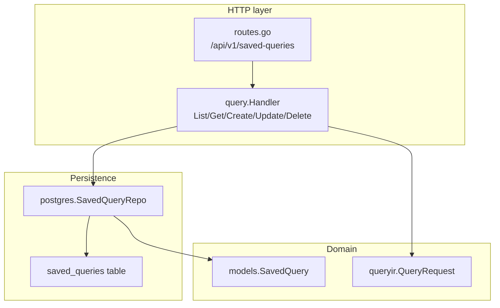
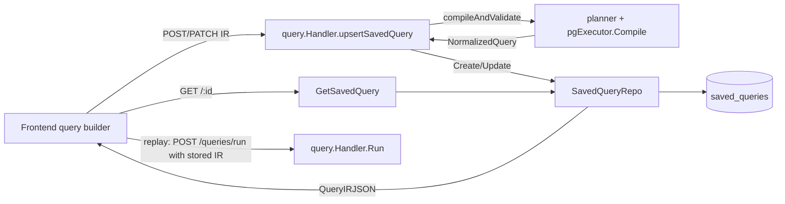
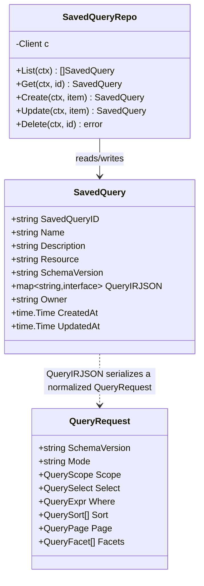
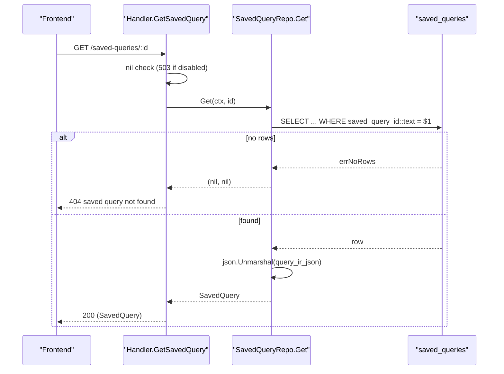
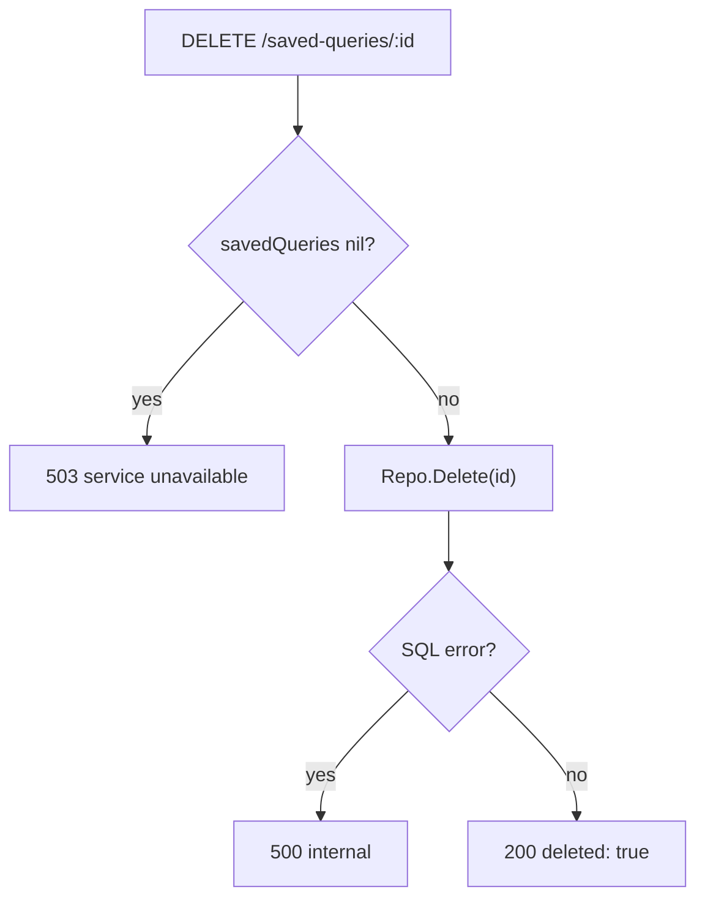
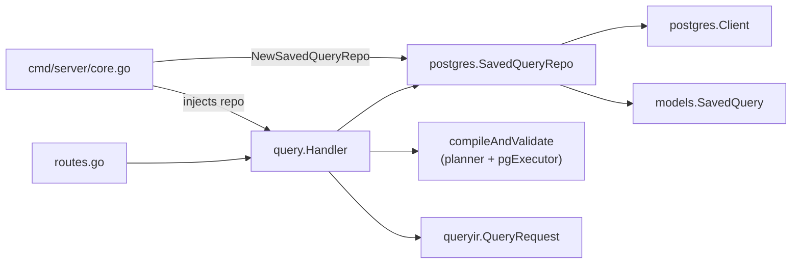

# Saved Queries

<cite>
**Referenced Files in This Document**

- [backend/internal/models/saved_query.go](file://backend/internal/models/saved_query.go)
- [backend/internal/postgres/saved_queries.go](file://backend/internal/postgres/saved_queries.go)
- [backend/internal/handlers/query/handler.go](file://backend/internal/handlers/query/handler.go)
- [backend/routes/routes.go](file://backend/routes/routes.go)
- [backend/internal/queryir/types.go](file://backend/internal/queryir/types.go)
- [backend/migrations/000_initial.sql](file://backend/migrations/000_initial.sql)
- [backend/migrations/archive/026_add_saved_queries.sql](file://backend/migrations/archive/026_add_saved_queries.sql)
- [api/openapi.yaml](file://api/openapi.yaml)
- [backend/cmd/server/core.go](file://backend/cmd/server/core.go)
</cite>

## Table of Contents
1. [Introduction](#introduction)
2. [Project Structure](#project-structure)
3. [Core Components](#core-components)
4. [Architecture Overview](#architecture-overview)
5. [Detailed Component Analysis](#detailed-component-analysis)
6. [Dependency Analysis](#dependency-analysis)
7. [Performance Considerations](#performance-considerations)
8. [Troubleshooting Guide](#troubleshooting-guide)
9. [Conclusion](#conclusion)
10. [Appendices](#appendices)

## Introduction

The **Saved Queries** feature lets users persist a structured query — expressed
in the canonical v1 Query Intermediate Representation (Query IR) — under a stable
identifier, then list, retrieve, replay, edit, or delete it later. It turns an
ephemeral search expression composed in the query builder into a durable,
named artifact that can be re-run against assets at any time.

A saved query is **not** a snapshot of result rows. It stores the *normalized*
query envelope (`schema_version`, `scope`, `select`, `where`, `sort`, `page`,
`facets`) so that replay always reflects the live state of the data. When a user
opens a saved query, the stored IR is fed straight back into the same
`POST /api/v1/queries/run` execution path that powers ad-hoc search, guaranteeing
that replay and freshly-typed queries produce identical results for identical IR.

The feature is intentionally thin: one flat table (`saved_queries`), one
repository (`SavedQueryRepo`), and five HTTP handlers grafted onto the existing
query `Handler`. There is no separate service layer — the handler validates the
incoming IR through the *same* compile/validate routine used by ad-hoc queries
before it ever touches the database, so a malformed or unsupported query can
never be persisted.

**Section sources**
- [backend/internal/models/saved_query.go](file://backend/internal/models/saved_query.go#L1-L15)
- [backend/internal/handlers/query/handler.go](file://backend/internal/handlers/query/handler.go#L421-L525)

## Project Structure

Saved queries are implemented across four layers, each in a single file or a
small slice of one:

- **Model** — `backend/internal/models/saved_query.go` defines the `SavedQuery`
  struct, the wire/DB shape of a persisted query.
- **Persistence** — `backend/internal/postgres/saved_queries.go` defines
  `SavedQueryRepo` with `List`, `Get`, `Create`, `Update`, and `Delete`,
  each a hand-written SQL statement against the `saved_queries` table.
- **HTTP handlers** — `backend/internal/handlers/query/handler.go` hosts the five
  endpoint methods (`ListSavedQueries`, `GetSavedQuery`, `CreateSavedQuery`,
  `UpdateSavedQuery`, `DeleteSavedQuery`) plus the shared `upsertSavedQuery`
  helper. These live on the same `Handler` that serves `/queries/validate`
  and `/queries/run`, so they can reuse `compileAndValidate`.
- **Routing** — `backend/routes/routes.go` registers the five REST routes under
  `/api/v1/saved-queries`.
- **Schema** — the `saved_queries` table and its indexes are defined in
  `backend/migrations/000_initial.sql` (consolidated baseline) and originated in
  `backend/migrations/archive/026_add_saved_queries.sql`.



**Diagram sources**
- [backend/routes/routes.go](file://backend/routes/routes.go#L358-L366)
- [backend/internal/handlers/query/handler.go](file://backend/internal/handlers/query/handler.go#L421-L525)
- [backend/internal/postgres/saved_queries.go](file://backend/internal/postgres/saved_queries.go#L11-L133)

**Section sources**
- [backend/internal/postgres/saved_queries.go](file://backend/internal/postgres/saved_queries.go#L1-L15)
- [backend/routes/routes.go](file://backend/routes/routes.go#L358-L366)

## Core Components

### The `SavedQuery` model

`SavedQuery` is the single domain type for the feature. It carries identity,
human metadata, the engine-relevant discriminators (`Resource`,
`SchemaVersion`), the serialized IR (`QueryIRJSON`), ownership, and timestamps.

| Field | JSON tag | Type | Notes |
| --- | --- | --- | --- |
| `SavedQueryID` | `saved_query_id` | `string` | UUID primary key, server-generated on create |
| `Name` | `name` | `string` | Required, free text |
| `Description` | `description,omitempty` | `string` | Optional |
| `Resource` | `resource` | `string` | Derived from the IR's normalized scope (e.g. `assets`) |
| `SchemaVersion` | `schema_version` | `string` | Derived from the normalized IR (currently `v1`) |
| `QueryIRJSON` | `query_ir_json` | `map[string]interface{}` | The full normalized `QueryRequest` envelope |
| `Owner` | `owner,omitempty` | `string` | Optional owner attribution |
| `CreatedAt` | `created_at` | `time.Time` | Server timestamp |
| `UpdatedAt` | `updated_at` | `time.Time` | Maintained by a DB trigger on update |

Note that `QueryIRJSON` is typed as a generic `map[string]interface{}` rather than
`queryir.QueryRequest`. The model is intentionally schema-agnostic about the IR
body so that the persistence layer can store any JSONB blob; the handler is
responsible for filling it with the *normalized* `QueryRequest` produced by the
compiler (see [Replaying a saved IR](#replaying-a-saved-ir)).

**Section sources**
- [backend/internal/models/saved_query.go](file://backend/internal/models/saved_query.go#L1-L15)

### `SavedQueryRepo` (persistence)

`SavedQueryRepo` wraps the shared postgres `Client` and exposes the five CRUD
operations. Each method is a single SQL statement; there is no ORM. `List` and
`Get` `COALESCE` nullable text columns (`description`, `owner`) to empty strings
so the Go struct never holds a `nil` for those fields, and unmarshal the JSONB
`query_ir_json` column into `QueryIRJSON` only when the byte slice is non-empty.

`Create` and `Update` marshal `QueryIRJSON` to bytes and cast to `jsonb` in SQL
(`$5::jsonb`), and use `NULLIF($n, '')` to translate empty strings back to SQL
`NULL` for `description` and `owner`. Both return the server-managed timestamps
(and, for `Create`, the generated `saved_query_id`) via `RETURNING`.

`Get` and `Update` treat the "no rows" sentinel (`errNoRows`) as a *not-found*
signal by returning `(nil, nil)` rather than an error, letting the handler map
the nil to an HTTP 404.

**Section sources**
- [backend/internal/postgres/saved_queries.go](file://backend/internal/postgres/saved_queries.go#L17-L133)

### Query handler methods

The HTTP surface is five methods on `query.Handler`. The handler holds the repo
as a nullable field `savedQueries`; when it is `nil` (saved queries disabled),
every method short-circuits with HTTP 503. `CreateSavedQuery` and
`UpdateSavedQuery` both delegate to `upsertSavedQuery(c, create bool)`, which is
where IR validation and normalization happen.

**Section sources**
- [backend/internal/handlers/query/handler.go](file://backend/internal/handlers/query/handler.go#L27-L45)
- [backend/internal/handlers/query/handler.go](file://backend/internal/handlers/query/handler.go#L421-L525)

## Architecture Overview

Saved queries sit on top of the same query subsystem that serves ad-hoc search.
The crucial architectural decision is **reuse of `compileAndValidate`**: before
any write, the incoming IR is run through the full planner + compiler used by
`/queries/validate`. This means a saved query is guaranteed to be a valid,
normalized v1 query, and replay is just "run the stored IR through `/queries/run`".



The dependency on `compileAndValidate` is what makes the feature safe: the same
field registry, planner, and PG/ES executors that gate live queries also gate
what may be persisted. The repository never sees an unvalidated IR.

**Diagram sources**
- [backend/internal/handlers/query/handler.go](file://backend/internal/handlers/query/handler.go#L126-L182)
- [backend/internal/handlers/query/handler.go](file://backend/internal/handlers/query/handler.go#L474-L525)
- [backend/internal/postgres/saved_queries.go](file://backend/internal/postgres/saved_queries.go#L87-L128)

**Section sources**
- [backend/internal/handlers/query/handler.go](file://backend/internal/handlers/query/handler.go#L27-L45)
- [backend/internal/handlers/query/handler.go](file://backend/internal/handlers/query/handler.go#L126-L182)

## Detailed Component Analysis

### Data model and relational schema

The `SavedQuery` Go struct maps directly onto the `saved_queries` table. The
table is flat — no foreign keys to assets or users — because a saved query is a
self-contained query envelope, not a join.



The DDL declares `saved_query_id` as a `uuid` with `gen_random_uuid()` default,
`query_ir_json` as a non-null `jsonb`, and `resource`/`schema_version` with
defaults `'assets'` / `'v1'`. Two indexes accelerate the common access patterns
(see [Performance Considerations](#performance-considerations)), and an
`updated_at` trigger keeps the timestamp fresh on every `UPDATE`.

**Diagram sources**
- [backend/internal/models/saved_query.go](file://backend/internal/models/saved_query.go#L5-L15)
- [backend/internal/postgres/saved_queries.go](file://backend/internal/postgres/saved_queries.go#L11-L133)
- [backend/internal/queryir/types.go](file://backend/internal/queryir/types.go#L4-L14)

**Section sources**
- [backend/migrations/000_initial.sql](file://backend/migrations/000_initial.sql#L550-L560)
- [backend/migrations/archive/026_add_saved_queries.sql](file://backend/migrations/archive/026_add_saved_queries.sql#L3-L25)

### Create / Update (upsert) flow

`CreateSavedQuery` and `UpdateSavedQuery` are thin wrappers that call
`upsertSavedQuery` with `create=true` / `create=false` respectively. The helper:

1. Rejects the request with HTTP 503 if `savedQueries` is nil.
2. Binds a request body with `name` (required), `description`, `query_ir_json`
   (a full `queryir.QueryRequest`), and `owner`.
3. Validates and compiles the IR via `compileAndValidate`. Validation errors are
   mapped to HTTP status by `writeQueryError` (422 for unknown field /
   unsupported operator, 400 otherwise).
4. Builds a `SavedQuery`, deriving `Resource` and `SchemaVersion` from the
   *normalized* query (`compiled.NormalizedQuery.Scope.Resource` and
   `.SchemaVersion`) — not from the raw request — and re-serializing the
   normalized query into `QueryIRJSON`.
5. Calls `Create` (returns 201 with the new row) or `Update` (returns 200, or 404
   if the row did not exist).

```mermaid
sequenceDiagram
  participant FE as "Frontend"
  participant H as "Handler.upsertSavedQuery"
  participant V as "compileAndValidate"
  participant Repo as "SavedQueryRepo"
  participant DB as "saved_queries"

  FE->>H: POST /saved-queries (name, query_ir_json, owner)
  H->>H: nil check (503 if disabled)
  H->>H: ShouldBindJSON (400 on bad body)
  H->>V: compileAndValidate(req.QueryIRJSON)
  alt invalid IR
    V-->>H: error
    H-->>FE: 400 / 422 (writeQueryError)
  else valid
    V-->>H: CompiledQuery (NormalizedQuery)
    H->>H: build SavedQuery; Resource/SchemaVersion from normalized; re-marshal IR
    H->>Repo: Create(item)
    Repo->>DB: INSERT ... RETURNING saved_query_id, created_at, updated_at
    DB-->>Repo: id + timestamps
    Repo-->>H: SavedQuery
    H-->>FE: 201 Created (SavedQuery)
  end
```

The same sequence applies to update, except `upsertSavedQuery` sets
`SavedQueryID` from the `:id` path param, calls `Repo.Update`, and returns 404
when the repo reports the row was not found (`updated == nil`).

**Diagram sources**
- [backend/internal/handlers/query/handler.go](file://backend/internal/handlers/query/handler.go#L474-L525)
- [backend/internal/postgres/saved_queries.go](file://backend/internal/postgres/saved_queries.go#L87-L128)

**Section sources**
- [backend/internal/handlers/query/handler.go](file://backend/internal/handlers/query/handler.go#L454-L525)
- [backend/internal/handlers/query/handler.go](file://backend/internal/handlers/query/handler.go#L410-L419)

### List and Get flow

`ListSavedQueries` returns `{ "items": [...] }`, normalizing a nil slice to an
empty array so the client always sees a JSON array. The underlying SQL orders by
`updated_at DESC, saved_query_id DESC`, giving a stable most-recently-edited-first
ordering. `GetSavedQuery` reads a single row by id; a nil result maps to a 404
with the `CodeAssetNotFound` error code, while a DB error maps to 500.



**Diagram sources**
- [backend/internal/handlers/query/handler.go](file://backend/internal/handlers/query/handler.go#L421-L452)
- [backend/internal/postgres/saved_queries.go](file://backend/internal/postgres/saved_queries.go#L17-L85)

**Section sources**
- [backend/internal/handlers/query/handler.go](file://backend/internal/handlers/query/handler.go#L421-L452)
- [backend/internal/postgres/saved_queries.go](file://backend/internal/postgres/saved_queries.go#L17-L85)

### Delete flow

`DeleteSavedQuery` issues an unconditional `DELETE ... WHERE saved_query_id::text
= $1`. The repository's `Delete` returns only an error; it does not report
whether a row was actually removed. As a result the handler always responds with
`200 { "deleted": true }` (provided the SQL itself did not error), even if the
id did not exist — delete is idempotent from the client's perspective.



Note: the OpenAPI document advertises `204` for delete, but the implementation
returns `200` with a JSON body; see [Troubleshooting Guide](#troubleshooting-guide).

**Diagram sources**
- [backend/internal/handlers/query/handler.go](file://backend/internal/handlers/query/handler.go#L462-L472)
- [backend/internal/postgres/saved_queries.go](file://backend/internal/postgres/saved_queries.go#L130-L133)

**Section sources**
- [backend/internal/handlers/query/handler.go](file://backend/internal/handlers/query/handler.go#L462-L472)

### Replaying a saved IR

A saved query is replayed by sending its stored `query_ir_json` back to
`POST /api/v1/queries/run`. Because `upsertSavedQuery` persists the **normalized**
`QueryRequest` (re-marshaled from `compiled.NormalizedQuery`, lines 503–504),
the stored IR is already a clean, defaulted, validated v1 envelope: empty
`schema_version` has been defaulted to `v1`, paging defaults applied, and fields
normalized. Replaying it therefore takes exactly the same code path as a freshly
authored query — `Handler.Run` → `compileForRun` → planner → PG/ES executor —
and yields identical results.

This "store the normalized IR, replay through the live runner" design is what
keeps saved queries fresh: only the *query definition* is stored, never the
result set, so each replay reflects current asset data. The `Resource` and
`SchemaVersion` columns are denormalized copies of fields inside the IR, kept at
the top level purely to support indexing and filtering of the saved-query list
itself (e.g. the `idx_saved_queries_resource_updated` index).

```mermaid
sequenceDiagram
  participant FE as "Frontend"
  participant Get as "GET /saved-queries/:id"
  participant Run as "POST /queries/run"
  participant Exec as "compileForRun + executors"

  FE->>Get: load saved query
  Get-->>FE: SavedQuery.query_ir_json (normalized IR)
  FE->>Run: replay stored query_ir_json
  Run->>Exec: planner.Plan + Compile + execute
  Exec-->>Run: items, total, facets, warnings
  Run-->>FE: live results
```



**Diagram sources**
- [backend/internal/handlers/query/handler.go](file://backend/internal/handlers/query/handler.go#L77-L124)
- [backend/internal/handlers/query/handler.go](file://backend/internal/handlers/query/handler.go#L494-L504)

**Section sources**
- [backend/internal/handlers/query/handler.go](file://backend/internal/handlers/query/handler.go#L494-L525)
- [backend/internal/handlers/query/handler.go](file://backend/internal/handlers/query/handler.go#L77-L124)
- [backend/internal/queryir/types.go](file://backend/internal/queryir/types.go#L3-L46)

## Dependency Analysis

Saved queries depend on a small, well-defined set of components and are depended
on only by the HTTP router.



- The repository is constructed once in `core.go` via
  `postgres.NewSavedQueryRepo(pg)` and injected into the query handler through
  `query.New(...)`.
- The handler reuses the planner/compiler it already owns for ad-hoc queries; it
  does not introduce a new validation path.
- The model depends on `queryir` only conceptually — `QueryIRJSON` is a generic
  map, so there is no compile-time coupling between `models` and `queryir`.

**Diagram sources**
- [backend/cmd/server/core.go](file://backend/cmd/server/core.go#L46-L46)
- [backend/internal/handlers/query/handler.go](file://backend/internal/handlers/query/handler.go#L27-L45)

**Section sources**
- [backend/cmd/server/core.go](file://backend/cmd/server/core.go#L40-L54)
- [backend/routes/routes.go](file://backend/routes/routes.go#L358-L366)

## Performance Considerations

- **List ordering uses an index-friendly sort.** The `List` query orders by
  `updated_at DESC, saved_query_id DESC`. The `idx_saved_queries_resource_updated`
  index `(resource, updated_at DESC)` and the partial
  `idx_saved_queries_owner_updated` index `(owner, updated_at DESC) WHERE owner
  IS NOT NULL` support recency-ordered access; a global `updated_at DESC` sort
  still benefits from the column being indexed within the resource grouping.
- **No pagination on List.** `List` returns *all* saved queries with no `LIMIT`.
  For tenants that accumulate thousands of saved queries this is an unbounded
  scan + sort; the current design assumes the saved-query population is small.
  If it grows, add keyset pagination on `(updated_at, saved_query_id)`.
- **JSONB storage cost.** `query_ir_json` is stored as `jsonb`. Marshaling on
  write and unmarshaling on read are O(size of IR). IR envelopes are small
  (filters, sort, paging), so this is negligible.
- **Validation cost on write.** Every create/update runs `compileAndValidate`,
  which invokes the planner and may even hit Elasticsearch for facet/recall
  compilation. This makes writes heavier than a plain insert but guarantees only
  valid IR is persisted; it is an intentional correctness-over-speed tradeoff.
- **Replay performance equals ad-hoc query performance.** Because replay reuses
  `/queries/run`, all the PG/ES bridge optimizations (ES recall, skip-PG-count,
  parallel facet fetch) apply identically — there is no separate "saved query
  fast path" to maintain.

**Section sources**
- [backend/internal/postgres/saved_queries.go](file://backend/internal/postgres/saved_queries.go#L17-L53)
- [backend/migrations/000_initial.sql](file://backend/migrations/000_initial.sql#L812-L814)
- [backend/internal/handlers/query/handler.go](file://backend/internal/handlers/query/handler.go#L126-L182)

## Troubleshooting Guide

#### HTTP 503 "saved queries unavailable"
Every handler checks `h.savedQueries == nil` and returns 503 if the repository
was not injected. This happens when the server was constructed without a
`SavedQueryRepo` (e.g. no postgres client). Verify `NewSavedQueryRepo(pg)` runs
in `core.go` and that the repo reaches `query.New(...)`.

#### Create/Update returns 400 or 422 instead of persisting
The IR failed `compileAndValidate`. `writeQueryError` maps `ErrUnknownField` and
`ErrUnsupportedOperator` to 422 (`CodeUnsupportedField` / `CodeUnsupportedOperator`)
and everything else to 400 (`CodeInvalidArgument`). Inspect the `query_ir_json`
payload: an unknown field name or an operator not supported for the target
resource is the usual cause. Note the body is bound with `name` `binding:"required"`,
so a missing name also yields 400.

#### Update returns 404 for an id that "exists"
`Update` matches on `saved_query_id::text = $1`. If the id string is malformed or
the row was already deleted, `RETURNING` yields no rows, the repo maps the
`errNoRows` sentinel to `(nil, nil)`, and the handler returns 404
(`CodeAssetNotFound`). Confirm the id with a `GET` first.

#### Delete reports success for a non-existent id
`Delete` does not check rows-affected, so a delete of a missing id still returns
`200 { "deleted": true }`. This is intentional idempotency, not a bug. To confirm
removal, `GET` the id and expect 404.

#### OpenAPI says 204 but the server returns 200
The spec (`api/openapi.yaml`) documents `204` for delete, while the handler
returns `200` with `{ "deleted": true }`. Clients should treat any 2xx as
success rather than asserting on the exact status code; this is a known spec/impl
drift.

#### Replayed query returns different results than when saved
Expected behavior — saved queries store the IR, not results. The data changed
between save and replay. If results differ for *identical* IR with *unchanged*
data, investigate the `/queries/run` path, not the saved-query layer.

**Section sources**
- [backend/internal/handlers/query/handler.go](file://backend/internal/handlers/query/handler.go#L421-L525)
- [backend/internal/postgres/saved_queries.go](file://backend/internal/postgres/saved_queries.go#L104-L133)
- [api/openapi.yaml](file://api/openapi.yaml#L2733-L2743)

## Conclusion

The Saved Queries feature is a deliberately minimal CRUD layer over a single
`saved_queries` table, wrapping the canonical v1 Query IR. Its defining property
is that it persists only the *normalized query definition* — validated through
the exact same compiler that gates ad-hoc queries — and replays it through the
live `/queries/run` runner. This guarantees that a saved query can never hold an
invalid IR, that replay always reflects current data, and that there is no
duplicated query-execution logic to keep in sync. The flat schema, index-backed
recency ordering, and idempotent delete keep the implementation small and
predictable, with the main scaling caveat being the unpaginated `List` endpoint.

## Appendices

### A. REST API surface

| Method | Path | Handler | Success | Notes |
| --- | --- | --- | --- | --- |
| GET | `/api/v1/saved-queries` | `ListSavedQueries` | 200 `{items:[]}` | All rows, `updated_at DESC` |
| POST | `/api/v1/saved-queries` | `CreateSavedQuery` | 201 `SavedQuery` | Validates IR; server-generates id |
| GET | `/api/v1/saved-queries/{id}` | `GetSavedQuery` | 200 `SavedQuery` | 404 if not found |
| PATCH | `/api/v1/saved-queries/{id}` | `UpdateSavedQuery` | 200 `SavedQuery` | 404 if not found |
| DELETE | `/api/v1/saved-queries/{id}` | `DeleteSavedQuery` | 200 `{deleted:true}` | Idempotent (spec lists 204) |

**Section sources**
- [backend/routes/routes.go](file://backend/routes/routes.go#L358-L366)
- [api/openapi.yaml](file://api/openapi.yaml#L2669-L2743)

### B. `UpsertSavedQueryRequest` body

| Field | Required | Description |
| --- | --- | --- |
| `name` | yes | Display name (`binding:"required"`) |
| `description` | no | Free text |
| `query_ir_json` | no | A full `QueryRequest` v1 envelope; validated before persist |
| `owner` | no | Owner attribution; stored as SQL NULL when empty |

**Section sources**
- [backend/internal/handlers/query/handler.go](file://backend/internal/handlers/query/handler.go#L479-L484)
- [api/openapi.yaml](file://api/openapi.yaml#L747-L754)

### C. `SavedQuery` response schema

Mirrors the `SavedQuery` Go struct: `saved_query_id`, `name`, `description`,
`resource`, `schema_version`, `query_ir_json` (a `QueryRequest`), `owner`,
`created_at`, `updated_at`.

**Section sources**
- [api/openapi.yaml](file://api/openapi.yaml#L734-L746)
- [backend/internal/models/saved_query.go](file://backend/internal/models/saved_query.go#L5-L15)

### D. `saved_queries` table DDL (consolidated baseline)

Columns: `saved_query_id uuid PK DEFAULT gen_random_uuid()`, `name text NOT NULL`,
`description text`, `resource text NOT NULL DEFAULT 'assets'`,
`schema_version text NOT NULL DEFAULT 'v1'`, `query_ir_json jsonb NOT NULL`,
`owner text`, `created_at`/`updated_at timestamptz NOT NULL DEFAULT now()`.
Indexes: `idx_saved_queries_resource_updated (resource, updated_at DESC)` and the
partial `idx_saved_queries_owner_updated (owner, updated_at DESC) WHERE owner IS
NOT NULL`. Trigger `trg_saved_queries_updated_at` maintains `updated_at`.

**Section sources**
- [backend/migrations/000_initial.sql](file://backend/migrations/000_initial.sql#L550-L560)
- [backend/migrations/000_initial.sql](file://backend/migrations/000_initial.sql#L812-L848)
- [backend/migrations/archive/026_add_saved_queries.sql](file://backend/migrations/archive/026_add_saved_queries.sql#L3-L25)
