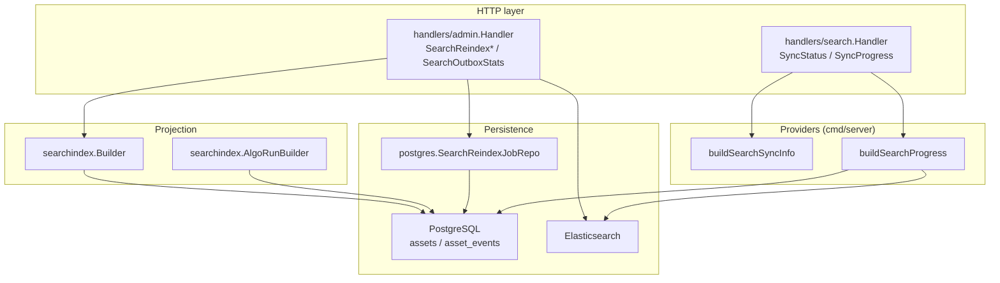
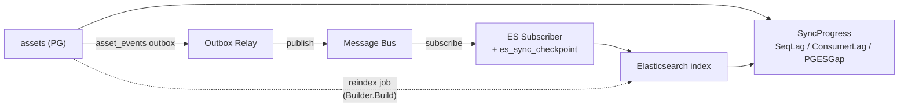
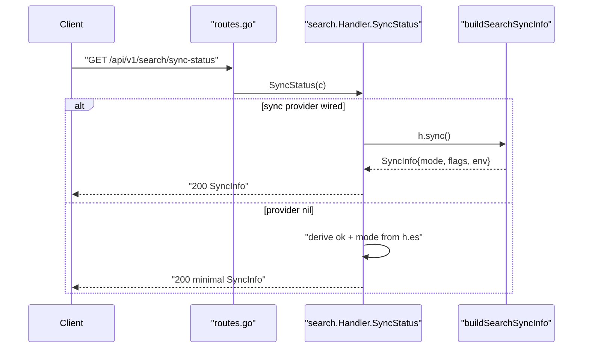
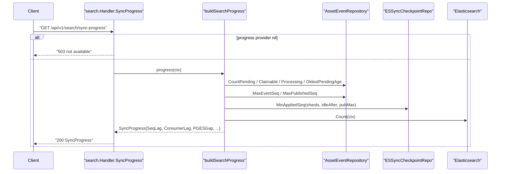
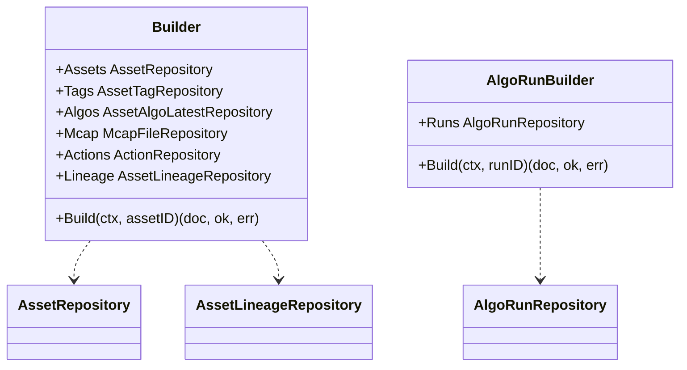
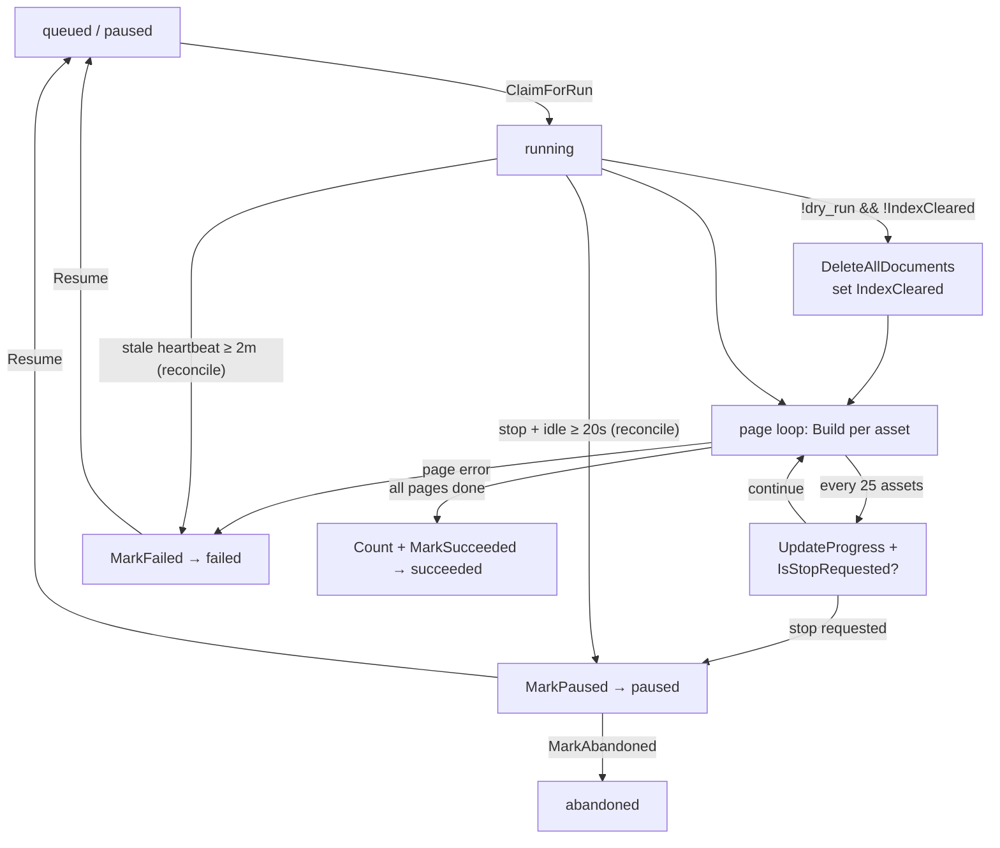
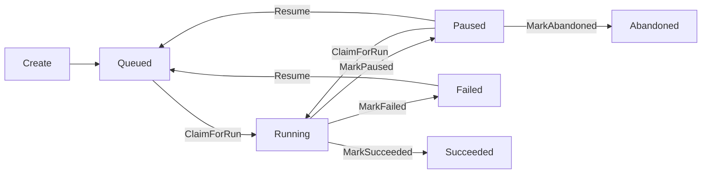
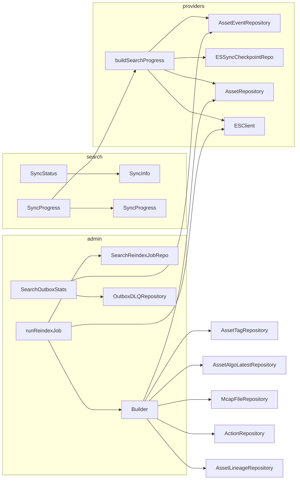

# Sync & Reindex

<cite>
**Referenced Files in This Document**

- [backend/internal/handlers/search/handler.go](file://backend/internal/handlers/search/handler.go)
- [backend/internal/handlers/search/sync_status.go](file://backend/internal/handlers/search/sync_status.go)
- [backend/internal/handlers/admin/reindex.go](file://backend/internal/handlers/admin/reindex.go)
- [backend/internal/handlers/admin/reindex_jobs.go](file://backend/internal/handlers/admin/reindex_jobs.go)
- [backend/internal/handlers/admin/outbox_stats.go](file://backend/internal/handlers/admin/outbox_stats.go)
- [backend/internal/searchindex/builder.go](file://backend/internal/searchindex/builder.go)
- [backend/internal/searchindex/algo_run_builder.go](file://backend/internal/searchindex/algo_run_builder.go)
- [backend/internal/postgres/reindex_job_repo.go](file://backend/internal/postgres/reindex_job_repo.go)
- [backend/internal/repository/search_reindex_job_repository.go](file://backend/internal/repository/search_reindex_job_repository.go)
- [backend/cmd/server/helpers.go](file://backend/cmd/server/helpers.go)
- [backend/routes/routes.go](file://backend/routes/routes.go)
</cite>

## Table of Contents
1. [Introduction](#introduction)
2. [Project Structure](#project-structure)
3. [Core Components](#core-components)
4. [Architecture Overview](#architecture-overview)
5. [Detailed Component Analysis](#detailed-component-analysis)
6. [Dependency Analysis](#dependency-analysis)
7. [Performance Considerations](#performance-considerations)
8. [Troubleshooting Guide](#troubleshooting-guide)
9. [Conclusion](#conclusion)
10. [Appendices](#appendices)

## Introduction

The cyber-databrew search subsystem keeps an Elasticsearch (ES) index in sync with the
authoritative PostgreSQL (PG) asset store. Writes to PG emit rows into a transactional
`asset_events` outbox; a relay publishes those rows to a message bus, and an ES subscriber
applies them to the search index. Because that pipeline is asynchronous and at-least-once,
operators need two capabilities:

1. **Observability** — read-only endpoints that report whether ES is reachable, which sync
   mode is active, and how far ES lags PG (`GET /api/v1/search/sync-status` and
   `GET /api/v1/search/sync-progress`).
2. **Repair** — admin endpoints that rebuild the ES index directly from PG when the index
   drifts, is freshly provisioned, or has a corrupt mapping. The modern repair path is an
   **async, resumable reindex job** (`POST /api/v1/admin/search/reindex-jobs` and its
   lifecycle verbs), supplemented by the legacy **synchronous** `POST /api/v1/admin/search/reindex`.

Both paths share the same **search-index projection**: a `searchindex.Builder` that loads PG
rows for an asset and produces the ES `_source` document. Reindex re-runs that projection over
every asset; the streaming subscriber runs it per changed asset. This document covers the
status/progress endpoints, the admin reindex jobs (dry-run, progress, stop/resume, abandon,
outbox stats), and the projection they drive.

**Section sources**
- [backend/internal/handlers/search/handler.go](file://backend/internal/handlers/search/handler.go#L1-L36)
- [backend/internal/handlers/search/sync_status.go](file://backend/internal/handlers/search/sync_status.go#L1-L54)
- [backend/routes/routes.go](file://backend/routes/routes.go#L246-L278)

## Project Structure

The functionality spans four packages, layered from HTTP down to SQL:

- **`internal/handlers/search`** — public, unauthenticated read endpoints. `handler.go`
  defines the `Handler` with injected `sync func() SyncInfo` and
  `progress func(context.Context) (SyncProgress, error)` providers, plus the
  `SyncStatus`/`SyncProgress` HTTP methods. `sync_status.go` defines the `SyncInfo` and
  `SyncProgress` response DTOs.
- **`internal/handlers/admin`** — admin-token-protected maintenance endpoints. `reindex.go`
  holds the shared `Handler`, request parsing, and the legacy synchronous `SearchReindex`.
  `reindex_jobs.go` holds the async job HTTP verbs and the background runner. `outbox_stats.go`
  holds `SearchOutboxStats`.
- **`internal/searchindex`** — the PG→ES projection. `builder.go` builds the asset document;
  `algo_run_builder.go` builds the `algo_runs` index document.
- **`internal/postgres` + `internal/repository`** — `reindex_job_repo.go` is the SQL-backed
  `SearchReindexJobRepository`; the interface, status enum, and structs live in
  `search_reindex_job_repository.go`.

The providers are constructed in `cmd/server/helpers.go` (`buildSearchSyncInfo`,
`buildSearchProgress`) and routed in `routes/routes.go`.

**Diagram sources**
- [backend/internal/handlers/search/handler.go](file://backend/internal/handlers/search/handler.go#L23-L36)
- [backend/internal/handlers/admin/reindex.go](file://backend/internal/handlers/admin/reindex.go#L19-L66)
- [backend/internal/searchindex/builder.go](file://backend/internal/searchindex/builder.go#L13-L24)
- [backend/cmd/server/helpers.go](file://backend/cmd/server/helpers.go#L25-L140)

**Section sources**
- [backend/routes/routes.go](file://backend/routes/routes.go#L246-L278)
- [backend/cmd/server/helpers.go](file://backend/cmd/server/helpers.go#L1-L46)

## Core Components

#### Search Handler and its providers

`search.Handler` holds the ES client and two function-valued providers injected by `New`. The
providers decouple HTTP serialization from the runtime knowledge of the relay/subscriber. When
`sync` is nil, `SyncStatus` returns a minimal snapshot derived only from whether ES is wired;
when `progress` is nil, `SyncProgress` returns `503`.

#### SyncInfo and SyncProgress DTOs

`SyncInfo` is the static-ish configuration view: ES reachability, whether the outbox relay and
ES subscriber are enabled, the resolved `search_index_mode` (one of `unavailable`,
`outbox_es_subscriber`, `local_reconcile`, `manual`), the environment, and whether admin search
endpoints are enabled. `SyncProgress` is the runtime lag view: PG/ES totals, the `pg_es_gap`,
outbox pending/processing counts, and the sequence-based watermarks (`PGMaxEventSeq`,
`OutboxPublishedMaxSeq`, `SeqLag`, `ESAppliedMinSeq`, `ConsumerLag`).

#### Admin Handler

`admin.Handler` aggregates every repository the reindex pipeline needs (`assets`, `tags`,
`algos`, `mcap`, `actions`, `events`, `dlq`, `jobs`), an ES client, a pre-wired
`searchindex.Builder`, and a `runningJobs` set guarded by `jobMu` to ensure a single in-process
runner per job ID.

#### SearchReindexJob model and repository

`SearchReindexJob` captures durable job state — `Status`, `DryRun`, `PageSize`, `NextPage`
(the resume cursor), `StopRequested`, the running counters, error samples, and timestamps. The
`SearchReindexJobRepository` interface exposes the lifecycle transitions; `SearchReindexJobRepo`
implements them with single-statement, status-guarded SQL `UPDATE`s.

#### The projection builders

`searchindex.Builder.Build` is the single source of truth for an asset's `_source` shape, and
`AlgoRunBuilder.Build` does the same for `algo_runs`. Both return `(doc, ok, err)` where
`ok == false` signals "row gone, delete the ES doc".

**Section sources**
- [backend/internal/handlers/search/handler.go](file://backend/internal/handlers/search/handler.go#L23-L36)
- [backend/internal/handlers/search/sync_status.go](file://backend/internal/handlers/search/sync_status.go#L5-L54)
- [backend/internal/handlers/admin/reindex.go](file://backend/internal/handlers/admin/reindex.go#L19-L66)
- [backend/internal/repository/search_reindex_job_repository.go](file://backend/internal/repository/search_reindex_job_repository.go#L8-L65)
- [backend/internal/searchindex/builder.go](file://backend/internal/searchindex/builder.go#L24-L31)

## Architecture Overview

The PG→ES pipeline has three segments, each surfaced as a distinct lag metric in
`SyncProgress`:

1. **PG → relay/bus** — events written to `asset_events` are picked up by the outbox relay and
   marked `published`. The gap is `SeqLag = PGMaxEventSeq − OutboxPublishedMaxSeq`.
2. **bus → ES** — the ES subscriber consumes published events and advances per-shard
   checkpoints. The gap is `ConsumerLag = OutboxPublishedMaxSeq − ESAppliedMinSeq`.
3. **document totals** — a coarse cross-check: `PGESGap = PostgresAssetsTotal − ElasticsearchDocsTotal`.

Reindex jobs sidestep the bus entirely: they re-run the projection straight from PG into ES and
do **not** move outbox cursors (noted in `SearchReindex`'s doc comment). This makes reindex a
safe, idempotent repair that complements — but is independent of — the streaming path.

**Diagram sources**
- [backend/internal/handlers/search/sync_status.go](file://backend/internal/handlers/search/sync_status.go#L33-L53)
- [backend/cmd/server/helpers.go](file://backend/cmd/server/helpers.go#L48-L139)
- [backend/internal/handlers/admin/reindex.go](file://backend/internal/handlers/admin/reindex.go#L127-L128)

**Section sources**
- [backend/cmd/server/helpers.go](file://backend/cmd/server/helpers.go#L48-L139)

## Detailed Component Analysis

### Sync-status endpoint

`GET /api/v1/search/sync-status` is served by `Handler.SyncStatus`. If a `sync` provider is
present it serializes its `SyncInfo` directly; otherwise it falls back to
`{ElasticsearchOK, SearchIndexMode}` where the mode is `"manual"` when ES is wired and
`"unavailable"` otherwise. The richer provider — `buildSearchSyncInfo` — resolves the mode by
preference: `outbox_es_subscriber` when the subscriber is started, `local_reconcile` in
non-production environments, and `manual` in production without a subscriber.

**Diagram sources**
- [backend/internal/handlers/search/handler.go](file://backend/internal/handlers/search/handler.go#L214-L229)
- [backend/cmd/server/helpers.go](file://backend/cmd/server/helpers.go#L25-L46)

**Section sources**
- [backend/internal/handlers/search/handler.go](file://backend/internal/handlers/search/handler.go#L214-L229)
- [backend/internal/handlers/search/sync_status.go](file://backend/internal/handlers/search/sync_status.go#L5-L14)

### Sync-progress endpoint

`GET /api/v1/search/sync-progress` is served by `Handler.SyncProgress`, which returns `503`
when no `progress` provider is wired and otherwise calls it with the request context. The
provider, `buildSearchProgress`, assembles every lag signal in one pass:

- **Outbox counts** from `assetEventRepo`: `CountPending`, `CountPendingClaimable(safetyLag)`,
  `CountProcessing`, `OldestPendingAge`. The safety lag comes from
  `cfg.OutboxRelaySafetyLagSec` and is echoed back as `OutboxRelaySafetyLagSec`.
- **Sequence watermarks** via an optional type assertion exposing `MaxEventSeq` /
  `MaxPublishedSeq`; `SeqLag` is only set when `pgMax > pubMax`.
- **ES applied watermark** from `ESSyncCheckpointRepo.MinAppliedSeq(shards, idleAfter, pubMax)`;
  `ConsumerLag` is only set when `appliedMin > 0 && pubMax > appliedMin`.
- **Totals** from `assetRepo.ListWithFilters(... page=1, size=1 ...)` for the PG count and
  `esClient.Count` for the ES count, yielding `PGESGap` and `PGESSyncRatio`.

Finally it mirrors the watermarks into Prometheus gauges before returning.

**Diagram sources**
- [backend/internal/handlers/search/handler.go](file://backend/internal/handlers/search/handler.go#L231-L247)
- [backend/cmd/server/helpers.go](file://backend/cmd/server/helpers.go#L48-L139)

**Section sources**
- [backend/internal/handlers/search/handler.go](file://backend/internal/handlers/search/handler.go#L231-L247)
- [backend/internal/handlers/search/sync_status.go](file://backend/internal/handlers/search/sync_status.go#L16-L54)
- [backend/cmd/server/helpers.go](file://backend/cmd/server/helpers.go#L48-L139)

### The search-index projection (Builder)

`searchindex.Builder.Build(ctx, assetID)` is the projection that both reindex and the streaming
subscriber run. It:

1. Loads the asset; returns `ok=false` if missing/soft-deleted so callers delete the ES doc.
2. Copies metadata into `meta` and resolves `lifecycle_state` (falling back to legacy `status`).
3. Builds the base `_source` map with identity, timestamps, owner/reviewer, retention, and
   empty containers for `tags`, `algos`, `mcap`, and the three `lineage_*` arrays.
4. Adds typed-metadata projections per `asset_type` (`dataset`, `annotation_result`,
   `ml_model`, `evaluation_report`) via `addTypedMetadataProjection`.
5. Joins child rows: tags (also flattened into `tags_flat`), latest algos, the mcap
   `recorded_at`, the lineage projection (`GetLineageProjection`), and — when an `Actions`
   repository is wired — the nested `actions[]` array (re-read in full on every projection
   because CDC is at-least-once and reads are idempotent).

`AlgoRunBuilder.Build(ctx, runID)` follows the same `(doc, ok, err)` contract for the
`algo_runs` index, projecting run identity, lifecycle timestamps, summary counters, resource
usage, error fields, external runtime references, and input metadata.

**Diagram sources**
- [backend/internal/searchindex/builder.go](file://backend/internal/searchindex/builder.go#L13-L20)
- [backend/internal/searchindex/algo_run_builder.go](file://backend/internal/searchindex/algo_run_builder.go#L10-L18)

**Section sources**
- [backend/internal/searchindex/builder.go](file://backend/internal/searchindex/builder.go#L24-L241)
- [backend/internal/searchindex/builder.go](file://backend/internal/searchindex/builder.go#L243-L288)
- [backend/internal/searchindex/algo_run_builder.go](file://backend/internal/searchindex/algo_run_builder.go#L18-L131)

### Async reindex jobs — HTTP surface

The async API exposes one create verb plus list/get/stop/resume/abandon verbs, all on
`/api/v1/admin/search/reindex-jobs` and all gated by the admin token middleware:

- **`SearchReindexCreateJob`** parses `{dry_run, page_size}`, rejects the request with `409`
  if `findActiveJob` already returns a queued/running job (preventing concurrent reindex
  storms), then `Create`s a queued job and starts a background runner via `ensureJobRunner`,
  returning `202 Accepted`.
- **`SearchReindexGetJob`** / **`SearchReindexListJobs`** read jobs, running each through
  `reconcileReindexJobState` (and, in the list path, auto-abandoning long-stale paused jobs).
- **`SearchReindexStopJob`** calls `RequestStop`; if the job is still `queued` it pauses it
  immediately for deterministic UX, otherwise the runner pauses itself at the next checkpoint.
- **`SearchReindexResumeJob`** calls `Resume`; on `nil` it distinguishes not-found (`404`) from
  not-resumable (`400`), otherwise restarts the runner from the saved `NextPage`.
- **`SearchReindexAbandonJob`** calls `MarkAbandoned` and returns `{"status":"abandoned"}`.

`reconcileReindexJobState` is the self-healing layer for `running` jobs: if a stop was requested
and the job has been idle ≥ `reindexStopForcePauseAfter` (20s) it is force-paused; if the
heartbeat is stale ≥ `reindexRunningStaleAfter` (2m) with no stop requested it is marked failed
for manual resume.

**Section sources**
- [backend/internal/handlers/admin/reindex_jobs.go](file://backend/internal/handlers/admin/reindex_jobs.go#L19-L26)
- [backend/internal/handlers/admin/reindex_jobs.go](file://backend/internal/handlers/admin/reindex_jobs.go#L54-L129)
- [backend/internal/handlers/admin/reindex_jobs.go](file://backend/internal/handlers/admin/reindex_jobs.go#L131-L301)

### Async reindex jobs — runner and lifecycle

`runReindexJob` is the goroutine launched by `ensureJobRunner`. It first `ClaimForRun`s the job
(transitioning `queued`/`paused` → `running` and clearing `stop_requested`), then loops over
asset pages ordered by `asset_id ASC`. For a non-dry-run with `IndexCleared == false` it first
calls `DeleteAllDocuments` and persists the cleared flag. Per asset it runs `Builder.Build`:
present → index (or count in dry-run); absent → delete (or count in dry-run); error → record a
sample. Every `reindexProgressCheckpointN` (25) scanned assets it persists progress via
`UpdateProgress` and re-checks `IsStopRequested`, pausing if requested. After each page it bumps
`NextPage`; on exhaustion it calls `Count` and `MarkSucceeded`.

**Diagram sources**
- [backend/internal/handlers/admin/reindex_jobs.go](file://backend/internal/handlers/admin/reindex_jobs.go#L303-L574)
- [backend/internal/postgres/reindex_job_repo.go](file://backend/internal/postgres/reindex_job_repo.go#L143-L349)
- [backend/internal/handlers/admin/reindex_jobs.go](file://backend/internal/handlers/admin/reindex_jobs.go#L54-L78)

**Section sources**
- [backend/internal/handlers/admin/reindex_jobs.go](file://backend/internal/handlers/admin/reindex_jobs.go#L303-L574)

### Job repository transitions

Every transition is a single status-guarded SQL `UPDATE ... RETURNING`, so concurrent runners
cannot double-process a job:

- `Create` inserts a `queued` row with `next_page = 1`.
- `ClaimForRun` flips `queued`/`paused` → `running`, clears `stop_requested`, and sets
  `started_at` only if unset (`COALESCE`).
- `RequestStop` sets `stop_requested = TRUE` regardless of status.
- `Resume` flips `queued`/`paused`/`failed` → `queued`, clearing the error and `finished_at`.
- `UpdateProgress` persists the running counters, `next_page` cursor, error samples (JSONB), and
  `index_cleared` flag.
- `MarkPaused` / `MarkFailed` / `MarkSucceeded` are terminal-for-now writes; `MarkAbandoned`
  moves only `paused` → `abandoned`; `MarkFailedByTimeout` sweeps `running` rows idle past a
  cutoff.

**Diagram sources**
- [backend/internal/postgres/reindex_job_repo.go](file://backend/internal/postgres/reindex_job_repo.go#L143-L216)
- [backend/internal/postgres/reindex_job_repo.go](file://backend/internal/postgres/reindex_job_repo.go#L268-L349)

**Section sources**
- [backend/internal/postgres/reindex_job_repo.go](file://backend/internal/postgres/reindex_job_repo.go#L25-L369)
- [backend/internal/repository/search_reindex_job_repository.go](file://backend/internal/repository/search_reindex_job_repository.go#L41-L54)

### Legacy synchronous reindex

`SearchReindex` (`POST /api/v1/admin/search/reindex`) performs the same projection inline within
a single request: optional `DeleteAllDocuments`, then a paged scan that builds, bulk-indexes, or
deletes per asset, returning a `SearchReindexResponse` with totals, duration, capped error
samples, and the final ES doc count. It has no resume or stop semantics and is intended for
small datasets or scripted use; the async job is preferred at scale.

**Section sources**
- [backend/internal/handlers/admin/reindex.go](file://backend/internal/handlers/admin/reindex.go#L127-L237)

### Outbox stats endpoint

`SearchOutboxStats` (`GET /api/v1/admin/search/outbox-stats`) returns
`{publish_state_counts, outbox_dlq_rows}` — `asset_events` grouped by `publish_state` via
`PublishStateCounts`, plus the count of permanently failed events archived in `outbox_dlq` (zero
when no DLQ repository is wired). It returns `503` when the `events` repository is absent and is
the natural companion to `sync-progress` for diagnosing a stuck relay.

**Section sources**
- [backend/internal/handlers/admin/outbox_stats.go](file://backend/internal/handlers/admin/outbox_stats.go#L11-L44)

## Dependency Analysis

The read endpoints depend only on the injected providers and the ES client; the providers in
turn depend on `AssetEventRepository`, `ESSyncCheckpointRepo`, `AssetRepository`, and the ES
client. The admin reindex pipeline depends on the full repository set plus the shared
`searchindex.Builder` and the ES client. The projection depends on the per-entity repositories
it joins.

**Diagram sources**
- [backend/cmd/server/helpers.go](file://backend/cmd/server/helpers.go#L48-L139)
- [backend/internal/handlers/admin/reindex.go](file://backend/internal/handlers/admin/reindex.go#L20-L66)
- [backend/internal/searchindex/builder.go](file://backend/internal/searchindex/builder.go#L13-L20)

**Section sources**
- [backend/internal/handlers/admin/reindex.go](file://backend/internal/handlers/admin/reindex.go#L20-L66)
- [backend/cmd/server/helpers.go](file://backend/cmd/server/helpers.go#L48-L139)

## Performance Considerations

- **O(1) watermarks at scale.** `SyncProgress` deliberately uses `MAX(event_seq)`-style
  watermarks rather than `COUNT(*)` over assets/ES for lag, so `SeqLag`/`ConsumerLag` stay cheap
  even at very large scale (the doc comments cite 50B+ rows). The coarse `PGESGap`/`PGESSyncRatio`
  use a `page=1, size=1` total and a single ES `Count`.
- **Checkpoint shards.** `MinAppliedSeq` takes a configured shard count and an idle threshold so
  `ConsumerLag` is not optimistically advanced when fewer shards have reported than configured;
  `ESAppliedMinSeq` stays `0` on fresh deployments.
- **Reindex paging and bulk.** Both reindex paths page by `asset_id ASC` and bulk-index per page.
  The async runner clamps `page_size` to ≤ 500 (defaulting to 200) and checkpoints every 25
  assets so a stop/crash never loses more than ~25 assets of progress and resumes from
  `next_page`.
- **Single-runner guard.** `ensureJobRunner` plus the `409` active-job rejection prevent
  duplicate runners and concurrent full reindexes that would otherwise hammer PG and ES.
- **Full re-read of `actions[]`.** The projection re-reads up to 1000 actions per asset on every
  build; this is idempotent but is the heaviest join in the projection for action-rich assets.

**Section sources**
- [backend/internal/handlers/search/sync_status.go](file://backend/internal/handlers/search/sync_status.go#L33-L52)
- [backend/cmd/server/helpers.go](file://backend/cmd/server/helpers.go#L97-L133)
- [backend/internal/handlers/admin/reindex_jobs.go](file://backend/internal/handlers/admin/reindex_jobs.go#L19-L26)
- [backend/internal/searchindex/builder.go](file://backend/internal/searchindex/builder.go#L198-L238)

## Troubleshooting Guide

#### `sync-progress` returns 503

The `progress` provider is nil. Confirm `search.New` was called with a non-nil progress
function; check that PG/ES dependencies needed by `buildSearchProgress` are configured.

#### `search_index_mode` is `unavailable` or `manual` unexpectedly

`buildSearchSyncInfo` reports `unavailable` when the ES client is nil, and `manual` in
production without a started subscriber. Verify ES connectivity and that the outbox ES subscriber
started; in non-production the expected mode is `local_reconcile`.

#### `SeqLag` high but `ConsumerLag` zero

The relay has not published events fast enough (PG→bus segment). Inspect `outbox-stats` for a
large `pending`/`processing` count and a growing `outbox_dlq_rows`; check `OldestPendingAgeSec`
against `OutboxRelaySafetyLagSec`.

#### Reindex job stuck in `running`

`reconcileReindexJobState` auto-recovers on the next read: a stale heartbeat (≥ 2m) flips it to
`failed` for manual `Resume`, and a requested stop that does not take effect within 20s
force-pauses it. A separate `MarkFailedByTimeout` sweep also fails long-idle running jobs.

#### Cannot create a new reindex job (`409 Conflict`)

`findActiveJob` found an existing queued/running job. Stop it (`/stop`) — which pauses it — or
let reconciliation transition it, then retry.

#### Job not resumable (`400`)

`Resume` only accepts `queued`/`paused`/`failed`. A `succeeded` or `abandoned` job cannot be
resumed; create a fresh job instead.

**Section sources**
- [backend/internal/handlers/search/handler.go](file://backend/internal/handlers/search/handler.go#L231-L247)
- [backend/cmd/server/helpers.go](file://backend/cmd/server/helpers.go#L25-L46)
- [backend/internal/handlers/admin/reindex_jobs.go](file://backend/internal/handlers/admin/reindex_jobs.go#L54-L78)
- [backend/internal/handlers/admin/reindex_jobs.go](file://backend/internal/handlers/admin/reindex_jobs.go#L258-L286)
- [backend/internal/handlers/admin/outbox_stats.go](file://backend/internal/handlers/admin/outbox_stats.go#L19-L44)

## Conclusion

The sync-and-reindex area gives operators a clean split between observability and repair. The
public `sync-status`/`sync-progress` endpoints expose mode and three-segment lag using cheap,
sequence-based watermarks. The admin reindex jobs provide a durable, resumable, single-runner
repair path with dry-run preview, checkpointed progress, cooperative stop/resume, and
abandonment — backed by status-guarded SQL transitions and a self-healing reconciler. Both
repair paths and the streaming subscriber share one `searchindex.Builder` projection, so the ES
`_source` shape stays consistent regardless of how a document was written.

## Appendices

### Endpoint reference

| Method & path | Handler | Auth | Notes |
| --- | --- | --- | --- |
| `GET /api/v1/search/sync-status` | `search.Handler.SyncStatus` | public | mode + flags |
| `GET /api/v1/search/sync-progress` | `search.Handler.SyncProgress` | public | lag signals; `503` if no provider |
| `POST /api/v1/admin/search/reindex` | `admin.Handler.SearchReindex` | admin token | legacy synchronous |
| `POST /api/v1/admin/search/reindex-jobs` | `SearchReindexCreateJob` | admin token | `202`; `409` if active |
| `GET /api/v1/admin/search/reindex-jobs` | `SearchReindexListJobs` | admin token | recent jobs |
| `GET /api/v1/admin/search/reindex-jobs/:id` | `SearchReindexGetJob` | admin token | one job |
| `POST /api/v1/admin/search/reindex-jobs/:id/stop` | `SearchReindexStopJob` | admin token | cooperative stop |
| `POST /api/v1/admin/search/reindex-jobs/:id/resume` | `SearchReindexResumeJob` | admin token | from `next_page` |
| `POST /api/v1/admin/search/reindex-jobs/:id/abandon` | `SearchReindexAbandonJob` | admin token | paused → abandoned |
| `GET /api/v1/admin/search/outbox-stats` | `SearchOutboxStats` | admin token | publish-state counts + DLQ |

**Section sources**
- [backend/routes/routes.go](file://backend/routes/routes.go#L246-L278)

### `SearchReindexJobStatus` values

| Status | Set by | Meaning |
| --- | --- | --- |
| `queued` | `Create`, `Resume` | created/resumable, awaiting a runner |
| `running` | `ClaimForRun` | actively scanning/indexing |
| `paused` | `MarkPaused` | stopped at a checkpoint; resumable |
| `succeeded` | `MarkSucceeded` | completed all pages |
| `failed` | `MarkFailed`, `MarkFailedByTimeout` | errored / heartbeat stale; resumable |
| `abandoned` | `MarkAbandoned` | paused job retired; terminal |

**Section sources**
- [backend/internal/repository/search_reindex_job_repository.go](file://backend/internal/repository/search_reindex_job_repository.go#L8-L17)
- [backend/internal/postgres/reindex_job_repo.go](file://backend/internal/postgres/reindex_job_repo.go#L143-L369)

### Reconciliation thresholds

| Constant | Value | Effect |
| --- | --- | --- |
| `reindexProgressCheckpointN` | 25 | assets between progress persists / stop checks |
| `reindexStopForcePauseAfter` | 20s | force-pause a stop-requested idle running job |
| `reindexRunningStaleAfter` | 2m | fail a running job with a stale heartbeat |
| `reindexPausedExpireAfter` | 7d | auto-abandon long-paused jobs on list |

**Section sources**
- [backend/internal/handlers/admin/reindex_jobs.go](file://backend/internal/handlers/admin/reindex_jobs.go#L19-L26)
