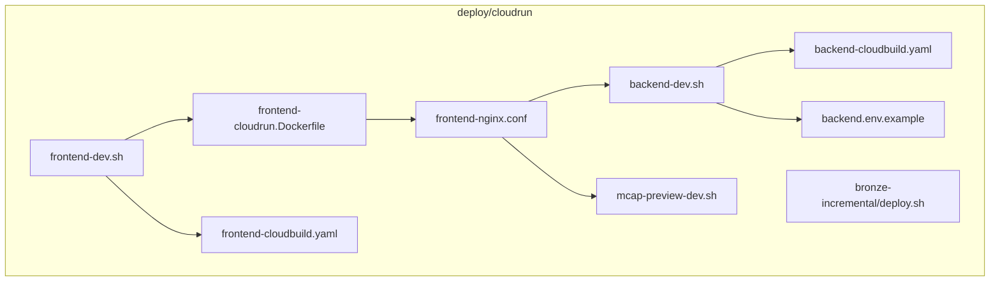
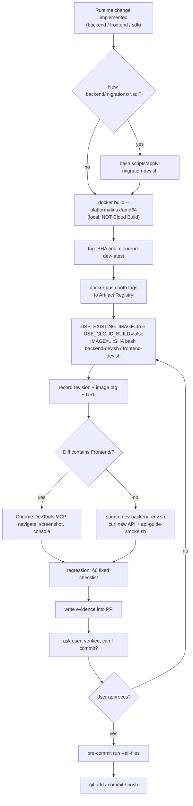
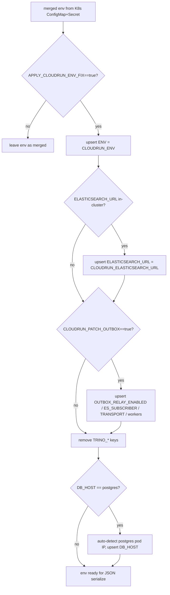
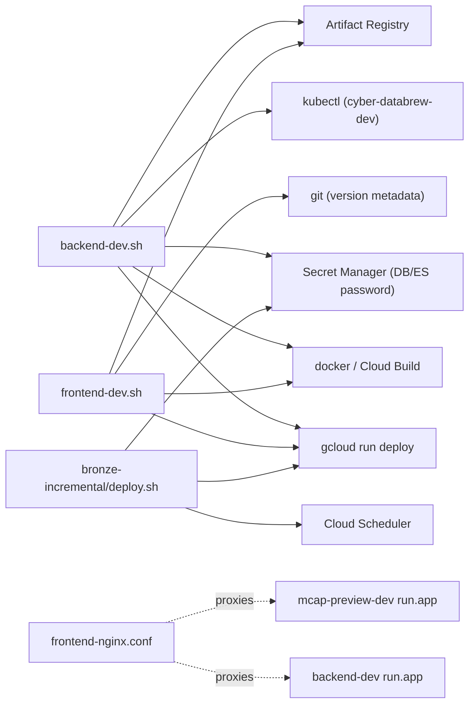

# Cloud Run

<cite>
**Referenced Files in This Document**

- [deploy/cloudrun/README.md](file://deploy/cloudrun/README.md)
- [deploy/cloudrun/backend-cloudbuild.yaml](file://deploy/cloudrun/backend-cloudbuild.yaml)
- [deploy/cloudrun/backend-dev.sh](file://deploy/cloudrun/backend-dev.sh)
- [deploy/cloudrun/backend.env.example](file://deploy/cloudrun/backend.env.example)
- [deploy/cloudrun/bronze-incremental/deploy.sh](file://deploy/cloudrun/bronze-incremental/deploy.sh)
- [deploy/cloudrun/frontend-cloudbuild.yaml](file://deploy/cloudrun/frontend-cloudbuild.yaml)
- [deploy/cloudrun/frontend-cloudrun.Dockerfile](file://deploy/cloudrun/frontend-cloudrun.Dockerfile)
- [deploy/cloudrun/frontend-dev.sh](file://deploy/cloudrun/frontend-dev.sh)
- [deploy/cloudrun/frontend-nginx.conf](file://deploy/cloudrun/frontend-nginx.conf)
- [deploy/cloudrun/mcap-preview-dev.sh](file://deploy/cloudrun/mcap-preview-dev.sh)
- [docs/agents/deploy-before-commit.md](file://docs/agents/deploy-before-commit.md)
- [docs/agents/deploy-verification.md](file://docs/agents/deploy-verification.md)
</cite>

## Table of Contents
1. [Introduction](#introduction)
2. [Project Structure](#project-structure)
3. [Core Components](#core-components)
4. [Architecture Overview](#architecture-overview)
5. [Detailed Component Analysis](#detailed-component-analysis)
6. [Dependency Analysis](#dependency-analysis)
7. [Performance Considerations](#performance-considerations)
8. [Troubleshooting Guide](#troubleshooting-guide)
9. [Conclusion](#conclusion)
10. [Appendices](#appendices)

## Introduction

The Cloud Run deployment surface under `deploy/cloudrun/` is the project's
**dev deployment path**: a small set of bash scripts and Docker/Cloud Build
configurations that build, push, and roll out the backend API, the SPA
frontend, and the auxiliary `mcap-preview` service to Google Cloud Run in
`us-central1` (project `green-valley-442103`). The folder began as a
"non-breaking migration path" out of GKE — deploy a Cloud Run revision first,
verify it through the generated `run.app` URL, and switch ingress traffic
later — and remains the canonical way agents and engineers stand up a dev
revision before merging runtime changes.

This area exists because **passing local `lint`/`test`/`build` is not the same
as a working dev environment**. The deploy scripts capture the non-obvious
glue needed to turn a green local build into a reachable Cloud Run revision:
sourcing config from the GKE `cyber-databrew-dev` namespace, rewriting
in-cluster-only values (Elasticsearch DNS, OUTBOX flags, Postgres host) into
Cloud-Run-reachable equivalents, wiring secrets through Secret Manager, and
emitting the service URL for verification. Two governing documents wrap the
scripts: `deploy-before-commit.md` (the gate that forbids committing runtime
code before a verified dev deploy) and `deploy-verification.md` (the layered
verification procedure run against the deployed revision).

Primary users are AI agents (Claude Code, Cursor, Codex) and backend/frontend
engineers preparing a PR.

**Section sources**
- [deploy/cloudrun/README.md](file://deploy/cloudrun/README.md#L1-L31)
- [docs/agents/deploy-before-commit.md](file://docs/agents/deploy-before-commit.md#L1-L20)
- [docs/agents/deploy-verification.md](file://docs/agents/deploy-verification.md#L1-L7)

## Project Structure

The deploy surface is a flat directory of per-service scripts plus their build
configs, with one nested directory for the bronze-incremental Cloud Run Job.

- **`backend-dev.sh`** — deploys `cyber-databrew-backend-dev`. The most complex
  script: it can build (local Docker or Cloud Build) or reuse an image, source
  env from the GKE ConfigMap/Secret, and patch the merged env for Cloud Run
  reachability before calling `gcloud run deploy`.
- **`backend-cloudbuild.yaml`** — Cloud Build config used only when
  `USE_CLOUD_BUILD=true`; builds `backend/Dockerfile`.
- **`backend.env.example`** — starter template for `ENV_FILE` / `BACKEND_ENV_FILE`
  with PG/ES/BigQuery and runtime flags.
- **`frontend-dev.sh`** — deploys `cyber-databrew-frontend-dev`. Builds a
  two-stage image (SPA base + Cloud-Run nginx wrapper), pushes both, deploys.
- **`frontend-cloudrun.Dockerfile`** — wraps the SPA base image with the
  Cloud-Run nginx config and the Argo UI bundle.
- **`frontend-cloudbuild.yaml`** — Cloud Build config for the nginx wrapper image.
- **`frontend-nginx.conf`** — reverse-proxy rules: `/api/v1/preview/` →
  mcap-preview-dev, `/api/` → backend-dev, SPA fallback to `index.html`.
- **`mcap-preview-dev.sh`** — deploys the `mcap-preview-dev` video-preview service.
- **`bronze-incremental/deploy.sh`** — deploys a Cloud Run **Job** plus a Cloud
  Scheduler trigger for the bronze/silver incremental pipeline.
- **`README.md`** — operational notes (ES/BigQuery internal LB wiring, outbox
  POC, DB host overrides).



**Diagram sources**
- [deploy/cloudrun/backend-dev.sh](file://deploy/cloudrun/backend-dev.sh#L143-L161)
- [deploy/cloudrun/frontend-dev.sh](file://deploy/cloudrun/frontend-dev.sh#L24-L44)
- [deploy/cloudrun/frontend-cloudrun.Dockerfile](file://deploy/cloudrun/frontend-cloudrun.Dockerfile#L1-L6)
- [deploy/cloudrun/frontend-nginx.conf](file://deploy/cloudrun/frontend-nginx.conf#L24-L47)

**Section sources**
- [deploy/cloudrun/README.md](file://deploy/cloudrun/README.md#L1-L31)
- [deploy/cloudrun/backend-dev.sh](file://deploy/cloudrun/backend-dev.sh#L14-L78)

## Core Components

#### `backend-dev.sh` — backend dev deploy

The backend script is parameterized entirely through environment variables with
defaults (`PROJECT_ID=green-valley-442103`, `REGION=us-central1`,
`SERVICE_NAME=cyber-databrew-backend-dev`, and an `IMAGE` defaulting to the
`:cloudrun-dev-latest` tag). Three switches control the build/source behavior:
`USE_CLOUD_BUILD` (default `false`), `USE_EXISTING_IMAGE` (default `false`), and
`SOURCE_K8S_ENV` (default `true`). Resource shape (`CPU`, `MEMORY`,
`MIN_INSTANCES`, `MAX_INSTANCES`, `TIMEOUT`, `CPU_THROTTLING`) and VPC settings
(`VPC_CONNECTOR`, `VPC_EGRESS`) are also overridable.

The script defines helper functions `upsert_env` / `remove_env` to mutate a
flat `KEY=VALUE` file, plus `_elasticsearch_url_is_in_cluster` and
`apply_cloudrun_env_fix` to rewrite cluster-only values. It builds (or reuses)
the image, merges GKE ConfigMap + Secret into a temp env file, applies the
Cloud-Run fixups, serializes to JSON via an inline Python heredoc, and finally
calls `gcloud run deploy` on port 8080, printing the resulting `status.url`.

**Section sources**
- [deploy/cloudrun/backend-dev.sh](file://deploy/cloudrun/backend-dev.sh#L14-L78)
- [deploy/cloudrun/backend-dev.sh](file://deploy/cloudrun/backend-dev.sh#L80-L141)
- [deploy/cloudrun/backend-dev.sh](file://deploy/cloudrun/backend-dev.sh#L263-L308)

#### `frontend-dev.sh` — frontend dev deploy

The frontend script always rebuilds two images: a SPA **base** image
(`Frontend/Dockerfile`, tagged `BASE_IMAGE`, defaulting to `:dev-latest`)
followed by a Cloud-Run **wrapper** image (`frontend-cloudrun.Dockerfile`,
tagged `IMAGE`, defaulting to `:cloudrun-dev-latest`). It auto-derives version
metadata from git (`GIT_SHA`, `GIT_TAG`, `GIT_BRANCH`) and threads them into the
SPA build as `VITE_APP_VERSION` and `VITE_BUILD_REF` build-args. Both images are
pushed, then `gcloud run deploy` rolls out `cyber-databrew-frontend-dev` on
port 80 with `--allow-unauthenticated`.

**Section sources**
- [deploy/cloudrun/frontend-dev.sh](file://deploy/cloudrun/frontend-dev.sh#L1-L66)

#### `deploy-before-commit.md` — the commit gate

This document is the authoritative gate: after implementing a Backend / Frontend
/ SDK / Dagster change, an agent **must not** `git commit` or `git push` until a
fixed sequence has completed and the user explicitly approves. The sequence is
apply migrations → build image locally → push (SHA + `cloudrun-dev-latest`
tags) → deploy with the SHA-tagged image → verify on dev → wait for approval →
run `pre-commit run --all-files`.

**Section sources**
- [docs/agents/deploy-before-commit.md](file://docs/agents/deploy-before-commit.md#L1-L20)
- [docs/agents/deploy-before-commit.md](file://docs/agents/deploy-before-commit.md#L33-L68)

#### `deploy-verification.md` — post-deploy verification

After deploying, the verification doc prescribes a layered procedure against the
**deployed revision** (not local): targeted verification of the changed feature,
regression of neighboring modules, evidence written into the PR, then user
approval. Frontend diffs require Chrome DevTools MCP UI acceptance; backend-only
diffs use API smoke / curl and skip MCP.

**Section sources**
- [docs/agents/deploy-verification.md](file://docs/agents/deploy-verification.md#L1-L29)
- [docs/agents/deploy-verification.md](file://docs/agents/deploy-verification.md#L269-L282)

## Architecture Overview

A dev deploy is the inner build/push/deploy loop wrapped by the
before-commit gate and the post-deploy verification loop. The agent never
commits runtime code until the gate's final approval step passes.



**Diagram sources**
- [docs/agents/deploy-before-commit.md](file://docs/agents/deploy-before-commit.md#L5-L20)
- [docs/agents/deploy-verification.md](file://docs/agents/deploy-verification.md#L11-L20)
- [docs/agents/deploy-verification.md](file://docs/agents/deploy-verification.md#L269-L282)

**Section sources**
- [docs/agents/deploy-before-commit.md](file://docs/agents/deploy-before-commit.md#L1-L31)
- [docs/agents/deploy-verification.md](file://docs/agents/deploy-verification.md#L9-L29)

## Detailed Component Analysis

### Backend deploy script run (sequence)

The recommended dev path skips the script's own build (which defaults to local
Docker because `USE_CLOUD_BUILD=false`) by passing `USE_EXISTING_IMAGE=true` with
a SHA-tagged `IMAGE`. The script then sources the GKE ConfigMap and Secret,
merges any `ENV_FILE`, applies Cloud-Run fixups, serializes the env to JSON, and
deploys.

```mermaid
sequenceDiagram
  participant Caller as "Agent / Engineer"
  participant Script as "backend-dev.sh"
  participant K8s as "kubectl (cyber-databrew-dev)"
  participant Py as "python3 heredoc"
  participant GCloud as "gcloud run deploy"

  Caller->>Script: USE_EXISTING_IMAGE=true IMAGE=...:SHA DB_PASSWORD_SECRET=...
  alt USE_EXISTING_IMAGE != true
    Script->>Script: docker build --platform linux/amd64 + docker push
  else reuse
    Script->>Script: echo "Skipping build and reusing image"
  end
  Script->>K8s: get configmap cyber-databrew-config (go-template KV)
  Script->>K8s: get secret cyber-databrew-secrets (base64 decode each key)
  K8s-->>Script: merged KEY=VALUE env file
  Script->>Script: remove PORT; bind DB_PASSWORD / ES_PASSWORD via --set-secrets
  Script->>Script: apply_cloudrun_env_fix (ENV, ELASTICSEARCH_URL, OUTBOX_*)
  Script->>Script: detect DB_HOST=postgres -> fall back to pod IP
  Script->>Py: write ENV_KV_FILE
  Py-->>Script: ENV_VARS_FILE (JSON)
  Script->>GCloud: run deploy --image ...:SHA --port 8080 --env-vars-file JSON
  GCloud-->>Script: revision deployed
  Script->>GCloud: services describe --format=value(status.url)
  GCloud-->>Caller: https://cyber-databrew-backend-dev-...run.app
```

**Diagram sources**
- [deploy/cloudrun/backend-dev.sh](file://deploy/cloudrun/backend-dev.sh#L143-L178)
- [deploy/cloudrun/backend-dev.sh](file://deploy/cloudrun/backend-dev.sh#L191-L261)
- [deploy/cloudrun/backend-dev.sh](file://deploy/cloudrun/backend-dev.sh#L263-L308)

**Section sources**
- [deploy/cloudrun/backend-dev.sh](file://deploy/cloudrun/backend-dev.sh#L143-L308)

### Cloud Run env normalization (`apply_cloudrun_env_fix`)

GKE ConfigMap/Secret values are written for in-cluster pods, so the script
rewrites the known "footguns" after merge when `APPLY_CLOUDRUN_ENV_FIX=true`
(the default). It forces `ENV` to `CLOUDRUN_ENV` (default `production`), detects
an in-cluster `ELASTICSEARCH_URL` via `_elasticsearch_url_is_in_cluster` and
replaces it with `CLOUDRUN_ELASTICSEARCH_URL` (default `http://10.2.0.10:9200`),
patches the `OUTBOX_*` flags for Cloud Run (relay + internal subscriber enabled,
`OUTBOX_TRANSPORT=internal`, tuned parallelism/workers), and drops any legacy
`TRINO_*` keys. A separate guard detects `DB_HOST=postgres` (cluster DNS) and,
absent a `DB_HOST_OVERRIDE`, auto-falls back to the PostgreSQL pod IP discovered
via `kubectl`.



**Diagram sources**
- [deploy/cloudrun/backend-dev.sh](file://deploy/cloudrun/backend-dev.sh#L99-L141)
- [deploy/cloudrun/backend-dev.sh](file://deploy/cloudrun/backend-dev.sh#L231-L244)

**Section sources**
- [deploy/cloudrun/backend-dev.sh](file://deploy/cloudrun/backend-dev.sh#L57-L141)
- [deploy/cloudrun/backend-dev.sh](file://deploy/cloudrun/backend-dev.sh#L191-L244)

### Secret Manager wiring

Rather than carrying plaintext passwords, the backend script prefers Secret
Manager bindings. When `DB_PASSWORD_SECRET` is set, it removes any plain
`DB_PASSWORD` from the env file and adds
`--set-secrets DB_PASSWORD=<secret>:<version>`; the documented dev secret is
`cyber-databrew-dev-postgres-password`. Elasticsearch follows the same pattern:
`ELASTICSEARCH_PASSWORD_SECRET` binds a secret, an `ELASTICSEARCH_PASSWORD_OVERRIDE`
sets a plain value, and otherwise the script clears the password and emits
`--remove-secrets ELASTICSEARCH_PASSWORD` (the default dev ES manifest is
passwordless).

**Section sources**
- [deploy/cloudrun/backend-dev.sh](file://deploy/cloudrun/backend-dev.sh#L195-L212)
- [deploy/cloudrun/backend-dev.sh](file://deploy/cloudrun/backend-dev.sh#L284-L289)
- [docs/agents/deploy-before-commit.md](file://docs/agents/deploy-before-commit.md#L42-L51)

### Frontend two-image build and nginx routing

The frontend wrapper Dockerfile starts `FROM ${BASE_IMAGE}`, copies
`frontend-nginx.conf` over the default nginx site, and overlays the separately
built Argo Workflows UI bundle into `/argo`. The nginx config implements
longest-prefix routing: `/api/v1/preview/` proxies to the `mcap-preview-dev`
`run.app` host (must precede the generic `/api/` block), `/api/` proxies to the
`cyber-databrew-backend-dev` `run.app` host, hashed `/assets/*` static files are
cached for a year, and everything else falls back to `index.html` for the SPA.
The before-commit doc notes `frontend-dev.sh` always rebuilds; to deploy a
prebuilt SHA image, call `gcloud run deploy` directly on port 80.

**Section sources**
- [deploy/cloudrun/frontend-cloudrun.Dockerfile](file://deploy/cloudrun/frontend-cloudrun.Dockerfile#L1-L6)
- [deploy/cloudrun/frontend-nginx.conf](file://deploy/cloudrun/frontend-nginx.conf#L21-L72)
- [docs/agents/deploy-before-commit.md](file://docs/agents/deploy-before-commit.md#L70-L100)

### Post-deploy verification flow

Verification is layered. Frontend changes (diff touches `Frontend/`) require the
agent to deploy the frontend revision and complete UI acceptance through Chrome
DevTools MCP — navigate the dev URL, follow `tasks.md`, screenshot, and read the
console; "ask the user to click around" is not an acceptable default. Backend
changes use `source scripts/dev-backend-env.sh` to obtain `BASE` and auth
headers, curl the new endpoint (one happy path + one error path), then run the
tiered smoke checks: L0 `go test ./...`, L1 `api-guide-smoke.sh`, L2 the full
contract smoke when handlers/router/middleware/public models change.

**Section sources**
- [docs/agents/deploy-verification.md](file://docs/agents/deploy-verification.md#L32-L65)
- [docs/agents/deploy-verification.md](file://docs/agents/deploy-verification.md#L132-L205)
- [docs/agents/deploy-verification.md](file://docs/agents/deploy-verification.md#L344-L394)

### `mcap-preview-dev.sh` and `bronze-incremental/deploy.sh`

Two auxiliary deploys round out the surface. `mcap-preview-dev.sh` rolls out the
video-preview service on port 8090 with heavier resources (CPU 8, 8Gi, CPU
boost, concurrency 2, 600s timeout) and points `UPSTREAM_BASE_URL` at the
backend-dev `run.app` host. `bronze-incremental/deploy.sh` is the only Cloud Run
**Job**: it builds locally, deploys a job with VPC egress and a Secret-Manager
DB password, then creates or updates a Cloud Scheduler HTTP trigger (default
hourly `0 * * * *`) bound with `run.invoker`.

**Section sources**
- [deploy/cloudrun/mcap-preview-dev.sh](file://deploy/cloudrun/mcap-preview-dev.sh#L1-L41)
- [deploy/cloudrun/bronze-incremental/deploy.sh](file://deploy/cloudrun/bronze-incremental/deploy.sh#L20-L95)

## Dependency Analysis

The scripts depend on external CLIs and a small set of GCP resources, and the
frontend revision depends at runtime on the backend and preview revisions.



The build path explicitly prefers **local `docker build`** over Cloud Build
because the repo has no `.gcloudignore`, so `gcloud builds submit` uploads a
large tarball and is slow. `backend-cloudbuild.yaml` and
`frontend-cloudbuild.yaml` exist only for the `USE_CLOUD_BUILD=true` opt-in.
Verification depends on `scripts/dev-backend-env.sh`, `scripts/api-guide-smoke.sh`,
and `scripts/apply-migration-dev.sh`.

**Diagram sources**
- [deploy/cloudrun/backend-dev.sh](file://deploy/cloudrun/backend-dev.sh#L143-L177)
- [deploy/cloudrun/frontend-dev.sh](file://deploy/cloudrun/frontend-dev.sh#L11-L44)
- [deploy/cloudrun/frontend-nginx.conf](file://deploy/cloudrun/frontend-nginx.conf#L24-L47)

**Section sources**
- [docs/agents/deploy-before-commit.md](file://docs/agents/deploy-before-commit.md#L8-L13)
- [deploy/cloudrun/backend-cloudbuild.yaml](file://deploy/cloudrun/backend-cloudbuild.yaml#L1-L13)
- [deploy/cloudrun/frontend-cloudbuild.yaml](file://deploy/cloudrun/frontend-cloudbuild.yaml#L1-L15)
- [docs/agents/deploy-verification.md](file://docs/agents/deploy-verification.md#L137-L155)

## Performance Considerations

- **Build speed.** Local `docker build` is the default and recommended path;
  Cloud Build is slow here because there is no `.gcloudignore`. Reusing a
  prebuilt image (`USE_EXISTING_IMAGE=true`) avoids rebuilding on every deploy.
- **Platform pinning.** Images must be built `--platform=linux/amd64`; on
  Docker Desktop BuildKit also pass `--output=type=docker`, otherwise Cloud Run
  rejects the multi-platform OCI index with "Container manifest type must
  support amd64/linux".
- **Backend resource shape.** Defaults are CPU 1, 512Mi, min 0 / max 5 instances,
  60s timeout, and `--no-cpu-throttling` (CPU stays allocated for background
  outbox relay/subscriber work). Scaling to zero (min 0) introduces cold-start
  latency — the verification doc tolerates dev cold-start white-screen if noted.
- **mcap-preview.** Provisioned much larger (CPU 8, 8Gi, CPU boost, concurrency
  2, 600s timeout) for fMP4 transcoding of large MCAP files.
- **nginx caching.** Hashed `/assets/*` files are served `immutable` for a year;
  `index.html` is `no-cache, must-revalidate` so SPA shells refresh on deploy.
- **Outbox tuning.** The Cloud-Run env fix raises `OUTBOX_RELAY_BATCH_SIZE` to
  500 (backend default 200) and sets 16 internal subscriber workers / 8 relay
  parallel keys.

**Section sources**
- [docs/agents/deploy-before-commit.md](file://docs/agents/deploy-before-commit.md#L8-L9)
- [deploy/cloudrun/backend-dev.sh](file://deploy/cloudrun/backend-dev.sh#L27-L73)
- [deploy/cloudrun/backend-dev.sh](file://deploy/cloudrun/backend-dev.sh#L264-L295)
- [deploy/cloudrun/mcap-preview-dev.sh](file://deploy/cloudrun/mcap-preview-dev.sh#L18-L33)
- [deploy/cloudrun/frontend-nginx.conf](file://deploy/cloudrun/frontend-nginx.conf#L49-L62)

## Troubleshooting Guide

#### "Container manifest type must support amd64/linux"
The pushed image is a multi-platform OCI index. Rebuild with
`--platform=linux/amd64` and, on Docker Desktop + BuildKit, add
`--output=type=docker` to force a single-platform Docker manifest.

#### Revision fails to start: cannot reach Postgres
The merged env contains `DB_HOST=postgres` (cluster DNS). The script warns and
auto-falls back to the PostgreSQL pod IP, but that IP is ephemeral. Set
`DB_HOST_OVERRIDE` to a stable endpoint (e.g. Cloud SQL private IP) and usually a
`VPC_CONNECTOR`. The dev target DB name is `cyber_databrew_dev`.

#### Elasticsearch or BigQuery unreachable from Cloud Run
In-cluster DNS (`http://elasticsearch:9200`, `http://bigquery:8080`) is not
resolvable from Cloud Run. Expose them via internal LoadBalancer Services, read
the private ILB VIP, attach the `cr-central-conn` connector with
`VPC_EGRESS=private-ranges-only`, and pass `ELASTICSEARCH_URL_OVERRIDE` /
`LAKEHOUSE_BQ_PROJECT_OVERRIDE`. The env fix already rewrites an in-cluster ES
URL to `CLOUDRUN_ELASTICSEARCH_URL` when `APPLY_CLOUDRUN_ENV_FIX=true`.

#### `frontend-dev.sh` deployed a stale SPA bundle
The wrapper Dockerfile defaults `BASE_IMAGE` to `:dev-latest`. Pass an explicit
`BASE_IMAGE` (and `IMAGE`) so the SPA bundle is the one you just built rather
than the registry default.

#### Lakehouse SQL returns `Schema 'robot' does not exist`
Namespace skew: pass `LAKEHOUSE_BQ_DATASET_OVERRIDE` matching the BigLake
Iceberg namespace, or re-apply the lakehouse manifest if BigQuery is on an older
catalog.

#### Pushed to `dev`/feature branch but nothing deployed
That is expected — `.tekton/push-*-cloudrun-dev.yaml` pipelines are gated off.
Use local build + `backend-dev.sh` / `frontend-dev.sh`, or comment
`/deploy-cloudrun-dev` on a PR.

#### Need to roll back a bad dev revision
Fastest is traffic-only: `gcloud run revisions list` then
`gcloud run services update-traffic ... --to-revisions <PREV>=100`. If you
recorded the previous SHA image tag, redeploy it via `backend-dev.sh` with
`USE_EXISTING_IMAGE=true`. Roll back frontend and backend to the same SHA pair.

**Section sources**
- [docs/agents/deploy-before-commit.md](file://docs/agents/deploy-before-commit.md#L8-L9)
- [docs/agents/deploy-before-commit.md](file://docs/agents/deploy-before-commit.md#L128-L153)
- [deploy/cloudrun/backend-dev.sh](file://deploy/cloudrun/backend-dev.sh#L231-L244)
- [deploy/cloudrun/README.md](file://deploy/cloudrun/README.md#L24-L28)
- [deploy/cloudrun/README.md](file://deploy/cloudrun/README.md#L73-L144)

## Conclusion

`deploy/cloudrun/` is a deliberately small, env-var-driven set of scripts that
turn a green local build into a verifiable Cloud Run dev revision. The backend
script carries most of the complexity — sourcing and rewriting GKE-sourced env
for Cloud-Run reachability and binding secrets — while the frontend script
handles the two-stage SPA + nginx image. Wrapping them, `deploy-before-commit.md`
enforces a strict order (build locally → push SHA-tagged image → deploy → verify
→ approval → commit) and `deploy-verification.md` defines the layered, against-the-revision
verification. Following both is the difference between a commit that *looks* done
and a dev revision that actually works.

## Appendices

### Appendix A — backend-dev.sh key variables

| Variable | Default | Purpose |
|----------|---------|---------|
| `USE_CLOUD_BUILD` | `false` | Build via Cloud Build instead of local docker |
| `USE_EXISTING_IMAGE` | `false` | Skip build, deploy provided `IMAGE` |
| `SOURCE_K8S_ENV` | `true` | Merge GKE ConfigMap + Secret into env |
| `DB_PASSWORD_SECRET` | _(empty)_ | Bind `DB_PASSWORD` from Secret Manager |
| `APPLY_CLOUDRUN_ENV_FIX` | `true` | Rewrite ENV/ES/OUTBOX after merge |
| `CLOUDRUN_ELASTICSEARCH_URL` | `http://10.2.0.10:9200` | Replacement ES URL |
| `VPC_CONNECTOR` / `VPC_EGRESS` | _(empty)_ / `private-ranges-only` | Private egress |
| `CPU` / `MEMORY` | `1` / `512Mi` | Container resources |

**Section sources**
- [deploy/cloudrun/backend-dev.sh](file://deploy/cloudrun/backend-dev.sh#L14-L73)

### Appendix B — default services and image tags

| Service | Cloud Run service name | Default image tag | Port |
|---------|------------------------|-------------------|------|
| Backend | `cyber-databrew-backend-dev` | `cyber-databrew-backend:cloudrun-dev-latest` | 8080 |
| Frontend (SPA base) | — | `cyber-databrew-frontend:dev-latest` | — |
| Frontend (Cloud Run) | `cyber-databrew-frontend-dev` | `cyber-databrew-frontend:cloudrun-dev-latest` | 80 |
| mcap-preview | `mcap-preview-dev` | `mcap-preview:dev-latest` | 8090 |
| bronze-incremental | `bronze-incremental` (Job) | `bronze-incremental:dev-latest` | — |

**Section sources**
- [deploy/cloudrun/backend-dev.sh](file://deploy/cloudrun/backend-dev.sh#L14-L17)
- [deploy/cloudrun/frontend-dev.sh](file://deploy/cloudrun/frontend-dev.sh#L4-L8)
- [deploy/cloudrun/mcap-preview-dev.sh](file://deploy/cloudrun/mcap-preview-dev.sh#L4-L7)
- [deploy/cloudrun/bronze-incremental/deploy.sh](file://deploy/cloudrun/bronze-incremental/deploy.sh#L22-L30)

### Appendix C — env template keys (backend.env.example)

The starter template seeds `ENV=production`, `PORT=8080`,
`STORAGE_BACKEND=postgres`, PG connection (`DB_HOST`/`DB_PORT`/`DB_USER`/`DB_NAME`),
search/lakehouse (`ELASTICSEARCH_URL`, `LAKEHOUSE_BACKEND=bigquery`,
`LAKEHOUSE_BQ_*`), auth/messaging (`DATABREW_TOKEN`, `PUBSUB_PROJECT`,
`TOPIC_ASSET_EVENTS`, `OUTBOX_TRANSPORT=internal`), and runtime tuning
(`LOG_LEVEL`, `LOG_FORMAT`, `CB_ENABLED`, `RATE_LIMIT_RPS=0`).

**Section sources**
- [deploy/cloudrun/backend.env.example](file://deploy/cloudrun/backend.env.example#L1-L45)
</content>
</invoke>
