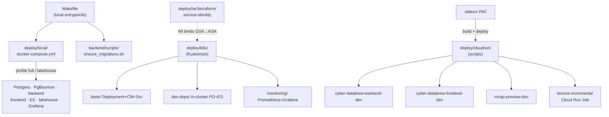
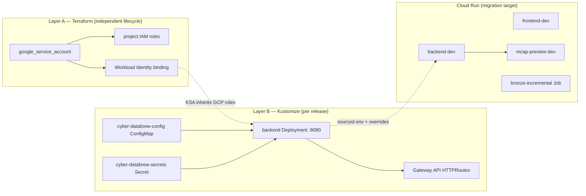
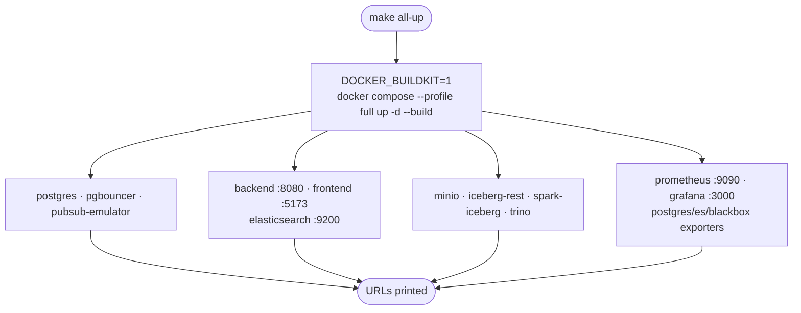
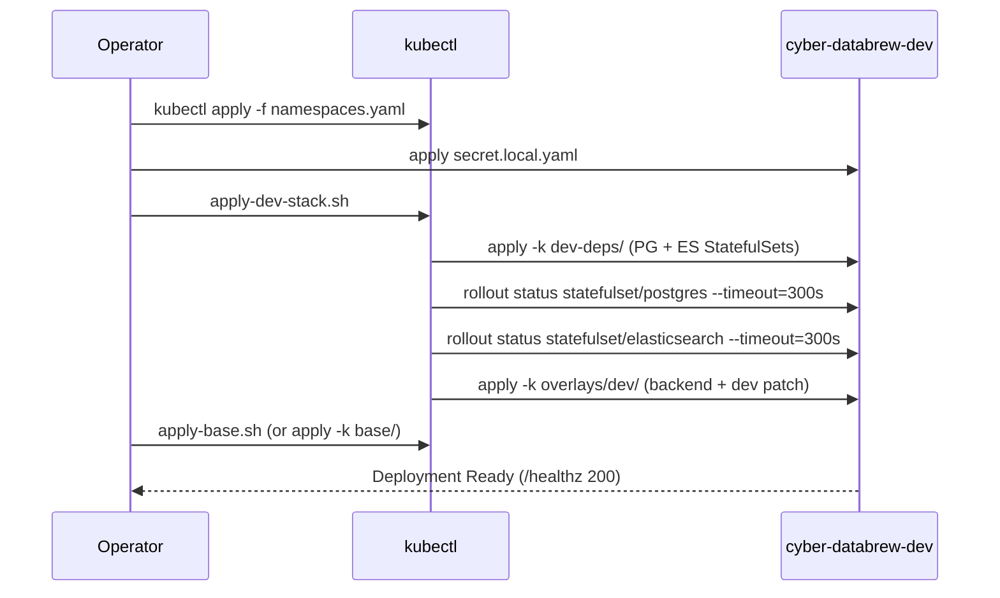
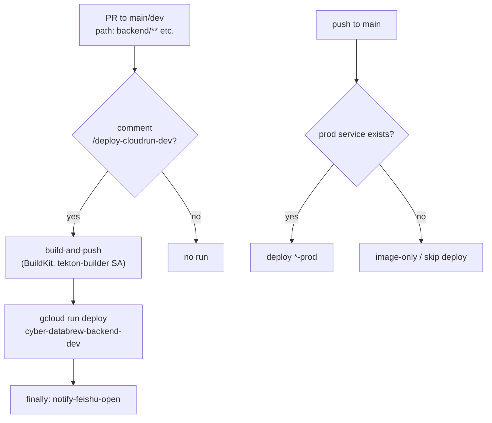
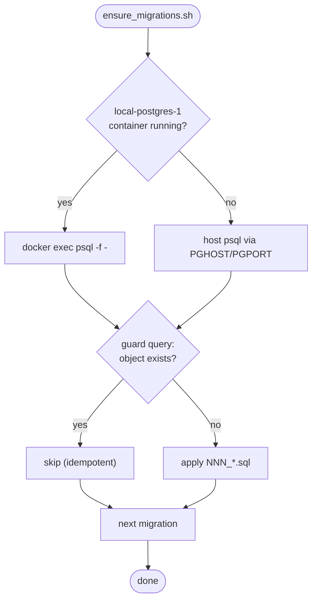
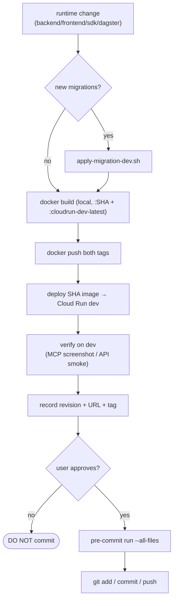
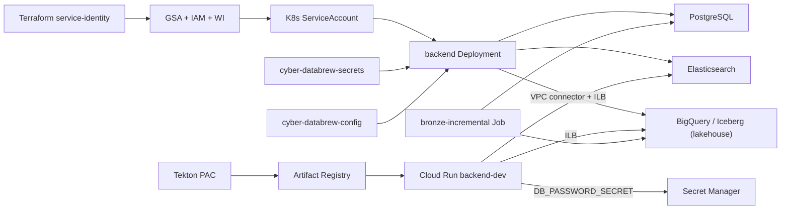

# Deployment & Operations

<cite>
**Referenced Files in This Document**

- [Makefile](file://Makefile)
- [deploy/local/README.md](file://deploy/local/README.md)
- [deploy/local/docker-compose.yml](file://deploy/local/docker-compose.yml)
- [deploy/k8s/README.md](file://deploy/k8s/README.md)
- [deploy/k8s/apply-base.sh](file://deploy/k8s/apply-base.sh)
- [deploy/k8s/apply-dev-stack.sh](file://deploy/k8s/apply-dev-stack.sh)
- [deploy/k8s/diagnose.sh](file://deploy/k8s/diagnose.sh)
- [deploy/k8s/base/deployment.yaml](file://deploy/k8s/base/deployment.yaml)
- [deploy/k8s/monitoring/kustomization.yaml](file://deploy/k8s/monitoring/kustomization.yaml)
- [deploy/cloudrun/README.md](file://deploy/cloudrun/README.md)
- [deploy/cloudrun/backend-dev.sh](file://deploy/cloudrun/backend-dev.sh)
- [deploy/cloudrun/frontend-dev.sh](file://deploy/cloudrun/frontend-dev.sh)
- [deploy/cloudrun/mcap-preview-dev.sh](file://deploy/cloudrun/mcap-preview-dev.sh)
- [deploy/cloudrun/bronze-incremental/main.py](file://deploy/cloudrun/bronze-incremental/main.py)
- [deploy/iac/terraform/README.md](file://deploy/iac/terraform/README.md)
- [deploy/iac/terraform/service-identity/modules/service_identity/main.tf](file://deploy/iac/terraform/service-identity/modules/service_identity/main.tf)
- [.tekton/README.md](file://.tekton/README.md)
- [.tekton/deploy-cloudrun-dev.yaml](file://.tekton/deploy-cloudrun-dev.yaml)
- [backend/scripts/ensure_migrations.sh](file://backend/scripts/ensure_migrations.sh)
- [docs/agents/deploy-before-commit.md](file://docs/agents/deploy-before-commit.md)
</cite>

## Table of Contents
1. [Introduction](#introduction)
2. [Project Structure](#project-structure)
3. [Core Components](#core-components)
4. [Architecture Overview](#architecture-overview)
5. [Detailed Component Analysis](#detailed-component-analysis)
6. [Dependency Analysis](#dependency-analysis)
7. [Performance Considerations](#performance-considerations)
8. [Troubleshooting Guide](#troubleshooting-guide)
9. [Conclusion](#conclusion)
10. [Appendices](#appendices)

## Introduction

The `deploy/` tree and the root `Makefile` together describe every way the
`cyber-databrew` platform runs outside a developer's IDE: a single-host **Docker
Compose** stack for local development and remote VMs, a **Kubernetes**
(Kustomize) deployment for the GKE dev cluster, an incremental **Cloud Run**
migration path for the backend, frontend, MCAP-preview, and Bronze ingestion,
**Terraform** for the long-lived service-identity layer, and **Tekton**
Pipelines-as-Code for build-and-deploy automation triggered by git events.

This page is the operations overview. It maps each deployment target to the
files that define it, shows how the layers relate, and documents the two
operational runbooks that cut across all targets: the **migrations runbook**
(applying SQL DDL to a database that already exists) and the
**deploy → verify → commit gate** that every AI agent and human must follow
before committing runtime code. Detail pages for individual targets live
alongside this index under `deploy/`'s own READMEs, which are cited throughout.

The audience is anyone who deploys, debugs, or extends the runtime: backend and
frontend engineers running the stack locally, on-call operators diagnosing a
GKE rollout, and agents executing the `deploy-before-commit` workflow.

**Section sources**
- [deploy/k8s/README.md](file://deploy/k8s/README.md#L1-L23)
- [deploy/cloudrun/README.md](file://deploy/cloudrun/README.md#L1-L19)
- [deploy/iac/terraform/README.md](file://deploy/iac/terraform/README.md#L1-L21)

## Project Structure

Deployment artifacts are split by **target environment**, each self-contained
with its own scripts and config templates:

- **`deploy/local/`** — one `docker-compose.yml` with Compose **profiles**
  (`full`, `lakehouse`) selecting optional stacks. Holds Postgres, PgBouncer, a
  Pub/Sub emulator, backend, frontend, the MinIO + Iceberg REST + Spark
  lakehouse, Elasticsearch, and a Prometheus/Grafana/blackbox monitoring stack.
  Helper trees: `elasticsearch/` (index init scripts), `iceberg/` (notebooks and
  smoke tests), `loadtest/` (k6), `monitoring/`, `pgbouncer/`, `trino/`.
- **`deploy/k8s/`** — Kustomize bases and overlays for GKE. `base/` is the
  backend Deployment + ConfigMap + Service; `dev-deps/` runs in-cluster Postgres
  and Elasticsearch; `frontend/`, `gateway/` (Gateway API routes), `monitoring/`
  (Prometheus + Grafana), `lakehouse-gcs/` and `lakehouse-minio/`, `jobs/`
  (backfill / smoke Jobs), and `overlays/dev/`. Shell helpers `apply-base.sh`,
  `apply-dev-stack.sh`, and `diagnose.sh` wrap the `kubectl apply -k` calls.
- **`deploy/cloudrun/`** — incremental GKE → Cloud Run migration scripts.
  `backend-dev.sh` and `frontend-dev.sh` deploy dev to Cloud Run. `backend-prod.sh`
  (CYB-4427) wraps `backend-dev.sh`, exporting prod overrides (empty Argo
  `ARGO_SERVER_URL` to trigger CRD mode, prod ES ILB IP, prod GSA, prod DB), so
  both environments share one deploy path. All use Cloud Build for image
  pre-staging. `bronze-incremental/` is a Cloud Run **Job** for Postgres →
  Iceberg Bronze ingestion.
- **`deploy/iac/terraform/`** — Layer A infrastructure: the `service-identity`
  stack (GSA + IAM + Workload Identity) plus org-aligned lint/secret-scan config.
- **`.tekton/`** — Pipelines-as-Code definitions read by the PAC controller on
  the cluster, firing PipelineRuns on PRs, comments, and pushes to `main`.

The root **`Makefile`** is the human entry point for local infra (`dev-up`,
`all-up`, `iceberg-up`), migrations (`local-migrate`), seeding, and local CI.

**Diagram sources**
- [Makefile](file://Makefile#L1-L88)
- [deploy/local/docker-compose.yml](file://deploy/local/docker-compose.yml#L11-L462)
- [deploy/k8s/README.md](file://deploy/k8s/README.md#L1-L62)
- [deploy/cloudrun/README.md](file://deploy/cloudrun/README.md#L1-L19)
- [deploy/iac/terraform/README.md](file://deploy/iac/terraform/README.md#L9-L36)
- [.tekton/README.md](file://.tekton/README.md#L1-L23)

**Section sources**
- [deploy/local/README.md](file://deploy/local/README.md#L1-L13)
- [deploy/k8s/README.md](file://deploy/k8s/README.md#L1-L62)
- [deploy/cloudrun/README.md](file://deploy/cloudrun/README.md#L1-L19)

## Core Components

The operations surface comprises five deployment targets plus two cross-cutting
runbooks.

- **Local Compose** — `deploy/local/docker-compose.yml` defines all services.
  The base profile (no flag) brings up `postgres`, `pgbouncer`, and
  `pubsub-emulator`; `--profile full` adds `backend`, `frontend`,
  `elasticsearch`, the lakehouse, and the monitoring exporters; `--profile
  lakehouse` brings up only `minio`, `iceberg-rest`, `spark-iceberg`, and Trino.
  Named volumes (`pgdata`, `elasticsearch-data`, `prometheus-data`, …) persist
  data across restarts.
- **Kubernetes base** — `deploy/k8s/base/deployment.yaml` runs the Gin API
  server container `api` on port 8080, pulling env from the
  `cyber-databrew-config` ConfigMap and `cyber-databrew-secrets` Secret, with
  `/healthz` readiness and liveness probes and Prometheus scrape annotations.
- **Cloud Run scripts** — `backend-dev.sh` is the richest: it can build locally
  or via Cloud Build, source env from the GKE ConfigMap/Secret, and apply a long
  list of `*_OVERRIDE` knobs so a cluster-internal config can run on serverless.
  `frontend-dev.sh` builds the two-stage SPA + nginx image; `mcap-preview-dev.sh`
  deploys the high-CPU preview proxy.
- **Bronze Cloud Run Job** — `bronze-incremental/main.py` is a scheduled
  Postgres → Iceberg append job that uses the Bronze table's own
  `MAX(event_seq)` as its cursor (no separate checkpoint store).
- **Terraform service-identity** — `service_identity/main.tf` provisions one
  Google service account per workload, attaches project IAM roles, and binds the
  matching Kubernetes ServiceAccount via Workload Identity.
- **Migrations runbook** — `backend/scripts/ensure_migrations.sh` applies SQL
  files that postdate an existing Postgres data volume.
- **Deploy gate** — `docs/agents/deploy-before-commit.md` is the required
  build → push → deploy → verify → approve sequence before any runtime commit.

**Section sources**
- [deploy/local/docker-compose.yml](file://deploy/local/docker-compose.yml#L11-L462)
- [deploy/k8s/base/deployment.yaml](file://deploy/k8s/base/deployment.yaml#L16-L65)
- [deploy/cloudrun/backend-dev.sh](file://deploy/cloudrun/backend-dev.sh#L14-L78)
- [deploy/cloudrun/bronze-incremental/main.py](file://deploy/cloudrun/bronze-incremental/main.py#L1-L26)
- [deploy/iac/terraform/service-identity/modules/service_identity/main.tf](file://deploy/iac/terraform/service-identity/modules/service_identity/main.tf#L16-L36)

## Architecture Overview

The deployment layers form a deliberate two-layer split. **Layer A**
(Terraform, `deploy/iac/`) owns resources whose lifecycle is independent of
application releases — service accounts, IAM, Workload Identity. **Layer B**
(Kustomize, `deploy/k8s/`) owns the application manifests reconciled by
`kubectl`. Cloud Run is a parallel, **non-breaking** migration target: services
are deployed to Cloud Run first, verified against their generated `run.app` URL,
and only later have ingress traffic switched over. Local Compose mirrors the
same service topology for development without any cloud dependency.

**Diagram sources**
- [deploy/iac/terraform/README.md](file://deploy/iac/terraform/README.md#L1-L21)
- [deploy/iac/terraform/service-identity/modules/service_identity/main.tf](file://deploy/iac/terraform/service-identity/modules/service_identity/main.tf#L16-L36)
- [deploy/k8s/base/deployment.yaml](file://deploy/k8s/base/deployment.yaml#L42-L65)
- [deploy/cloudrun/README.md](file://deploy/cloudrun/README.md#L14-L23)

**Section sources**
- [deploy/iac/terraform/README.md](file://deploy/iac/terraform/README.md#L1-L83)
- [deploy/cloudrun/README.md](file://deploy/cloudrun/README.md#L1-L23)

## Detailed Component Analysis

### Local Docker Compose

There is exactly one Compose file; optional stacks are selected with Compose v2
profiles rather than separate files. The `Makefile` wraps the common
invocations: `dev-up` runs `docker compose up -d` (base services only); `all-up`
sets `DOCKER_BUILDKIT=1` and runs `--profile full up -d --build`, printing the
service URLs (frontend `:5173`, backend `:8080`, Trino `:8082`, ES `:9200`,
Prometheus `:9090`, Grafana `:3000`); `iceberg-up` brings up only the lakehouse
profile. `all-reset-volumes` tears everything down with `-v`, wiping the Postgres
data volume so the next `all-up` re-runs initdb + DDL migrations.

For day-to-day frontend/backend work the README recommends **not** rebuilding
containers: run the backend on the host (`cd backend && go run ./cmd/server` on
`:8080`) and the Vite dev server (`npm run dev` on `:5173`, proxying `/api`).
`--profile full` is reserved for when the nginx-packaged frontend container,
Elasticsearch, lakehouse, or monitoring stack are needed.

**Diagram sources**
- [Makefile](file://Makefile#L4-L88)
- [deploy/local/docker-compose.yml](file://deploy/local/docker-compose.yml#L11-L462)

**Section sources**
- [deploy/local/README.md](file://deploy/local/README.md#L1-L45)
- [Makefile](file://Makefile#L3-L88)
- [deploy/local/docker-compose.yml](file://deploy/local/docker-compose.yml#L11-L462)

### Kubernetes (GKE) deployment

Two prerequisites gate any base apply: the namespace (`kubectl apply -f
deploy/k8s/namespaces.yaml`) and the `cyber-databrew-secrets` Secret (copied from
`base/secret.example.yaml` to a gitignored `secret.local.yaml`). `apply-base.sh`
defaults the namespace to `cyber-databrew-dev`, verifies the Secret exists unless
`SKIP_SECRET_CHECK=1`, supports `DRY_RUN=1`, and ultimately runs `kubectl apply
-n <ns> -k base/`. The backend Deployment mounts env via `envFrom`
(`cyber-databrew-config` ConfigMap + `cyber-databrew-secrets` Secret), exposes
`http` on 8080, and uses `GET /healthz` for both readiness and liveness probes.

`apply-dev-stack.sh` brings up a fully in-cluster environment: it applies
`dev-deps/` (Postgres + Elasticsearch StatefulSets), waits for both StatefulSet
rollouts with a 300s timeout, then applies `overlays/dev/` (base manifests plus a
dev config patch that points `ELASTICSEARCH_URL` at the in-cluster Service).
Migrations are **not** auto-applied by this script — see the migrations runbook.

**Diagram sources**
- [deploy/k8s/apply-dev-stack.sh](file://deploy/k8s/apply-dev-stack.sh#L11-L20)
- [deploy/k8s/apply-base.sh](file://deploy/k8s/apply-base.sh#L11-L38)
- [deploy/k8s/base/deployment.yaml](file://deploy/k8s/base/deployment.yaml#L42-L65)

**Section sources**
- [deploy/k8s/README.md](file://deploy/k8s/README.md#L1-L98)
- [deploy/k8s/apply-base.sh](file://deploy/k8s/apply-base.sh#L1-L38)
- [deploy/k8s/apply-dev-stack.sh](file://deploy/k8s/apply-dev-stack.sh#L1-L20)
- [deploy/k8s/base/deployment.yaml](file://deploy/k8s/base/deployment.yaml#L1-L65)

### Cloud Run dev migration

`backend-dev.sh` is the central migration script. Its defaults target project
`green-valley-442103`, region `us-central1`, service
`cyber-databrew-backend-dev`, image `:cloudrun-dev-latest`, and 1 CPU / 512Mi /
0–5 instances / 60s timeout. By default it sources env from the GKE
`cyber-databrew-config` ConfigMap and `cyber-databrew-secrets` Secret
(`SOURCE_K8S_ENV=true`), then applies `APPLY_CLOUDRUN_ENV_FIX` rewrites because
cluster-internal values (Service DNS names like `DB_HOST=postgres` or
`http://elasticsearch:9200`, `ENV=development`, disabled outbox) are not valid on
serverless. A large family of explicit `*_OVERRIDE` variables and
`DB_PASSWORD_SECRET` / `ELASTICSEARCH_PASSWORD_SECRET` (Secret Manager bindings)
let an operator force the correct topology without editing the source config.

Reaching in-cluster dependencies from Cloud Run requires exposing them via
**internal LoadBalancers** (`elasticsearch-ilb`, `bigquery-ilb`) and attaching
**Serverless VPC Access** (`VPC_CONNECTOR=cr-central-conn`,
`VPC_EGRESS=private-ranges-only`). The README documents the full ES and BigQuery
wiring plus a Pub/Sub outbox POC toggle (`CLOUDRUN_OUTBOX_TRANSPORT=pubsub`) with
a one-line rollback to `internal`.

`frontend-dev.sh` builds the SPA base image (with `VITE_APP_VERSION` /
`VITE_BUILD_REF` git args), then the Cloud Run wrapper image from
`frontend-cloudrun.Dockerfile`, pushes both, and deploys on port 80.
`mcap-preview-dev.sh` deploys the preview proxy with 8 CPU / 8Gi / `--cpu-boost`
/ concurrency 2 / 600s timeout, pointing `UPSTREAM_BASE_URL` at the dev backend.

**Section sources**
- [deploy/cloudrun/backend-dev.sh](file://deploy/cloudrun/backend-dev.sh#L14-L78)
- [deploy/cloudrun/frontend-dev.sh](file://deploy/cloudrun/frontend-dev.sh#L4-L66)
- [deploy/cloudrun/mcap-preview-dev.sh](file://deploy/cloudrun/mcap-preview-dev.sh#L4-L41)
- [deploy/cloudrun/README.md](file://deploy/cloudrun/README.md#L1-L179)

### Bronze incremental ingestion Job

`bronze-incremental/main.py` is a Cloud Run Job triggered every five minutes by
Cloud Scheduler. It reads its cursor as `MAX(event_seq)` directly from the Bronze
Iceberg table — the table is its own checkpoint store — then pulls
`asset_events` with `event_seq > cursor` from Postgres in `BATCH_SIZE` chunks
until the table drains or `JOB_DEADLINE_SEC` elapses, appending each batch via
PyIceberg `table.append`. Iceberg commits are atomic, so a mid-run crash leaves a
clean state for the next tick. The design deliberately accepts up to ~10%
duplicate rows on backfill (BigLake REST returns 429 mid-commit and PyIceberg's
retry re-appends), because the cursor is unaffected and Silver dedupes on
`event_id`. This batch approach avoids the millions of tiny parquet files a
per-message Pub/Sub subscriber would produce.

**Section sources**
- [deploy/cloudrun/bronze-incremental/main.py](file://deploy/cloudrun/bronze-incremental/main.py#L1-L40)

### Terraform service-identity (Layer A)

The `service_identity` module pins `google ~> 7.29.0` and creates one
`google_service_account` per workload, fans `var.project_roles` into
`google_project_iam_member` bindings, and — when `var.kubernetes_sa_name` is set
— binds `roles/iam.workloadIdentityUser` so the in-cluster KSA
(`<project>.svc.id.goog[<namespace>/<ksa>]`) inherits the GSA's GCP roles.
Provider config lives only in `environments/<env>/main.tf`; state is per-stack
per-env in GCS (`terraform_staging_state_store` for dev). Secrets stay out of
tfvars and are written by humans/CI via `gcloud secrets versions add`. Org-aligned
quality gates (`.tflint.hcl`, gitleaks, detect-secrets, pre-commit) run on every
commit.

**Section sources**
- [deploy/iac/terraform/service-identity/modules/service_identity/main.tf](file://deploy/iac/terraform/service-identity/modules/service_identity/main.tf#L1-L36)
- [deploy/iac/terraform/README.md](file://deploy/iac/terraform/README.md#L1-L83)

### Tekton Pipelines-as-Code

The PAC controller in the `pipelines-as-code` namespace reads `.tekton/` and
fires a PipelineRun on matching git events. The active matrix: a **manual**
backend deploy triggered by the PR comment `/deploy-cloudrun-dev`
(`deploy-cloudrun-dev.yaml`), and push-to-`main` prod deploys for backend and
frontend that run only if the prod service already exists. The push-based
`*-cloudrun-dev.yaml` templates are intentionally **disabled**
(`on-cel-expression: false`) — dev deploys use the local scripts or the PR
comment. `deploy-cloudrun-dev.yaml` triggers only on PRs targeting `main`/`dev`
with path changes under `backend/**`, `deploy/cloudrun/**`, or the pipeline file
itself; it runs on the `tekton-builder` SA, uses a BuildKit `build-and-push`
task, and deploys with no `--set-env-vars` so existing revision env and Secret
Manager bindings are preserved. Several pipelines end with a `finally`
`notify-feishu-open` task that prints `SKIP` and exits 0 if its Secret is absent.

**Diagram sources**
- [.tekton/deploy-cloudrun-dev.yaml](file://.tekton/deploy-cloudrun-dev.yaml#L18-L57)
- [.tekton/README.md](file://.tekton/README.md#L9-L23)

**Section sources**
- [.tekton/README.md](file://.tekton/README.md#L1-L118)
- [.tekton/deploy-cloudrun-dev.yaml](file://.tekton/deploy-cloudrun-dev.yaml#L1-L60)

### Migrations runbook

`backend/scripts/ensure_migrations.sh` exists because
`docker-entrypoint-initdb.d` only runs on an empty Postgres volume; a database
that predates a new migration file would otherwise miss it. The script auto-detects
whether the local Docker `local-postgres-1` container is running (piping SQL via
stdin since host paths are not visible inside the container) or falls back to a
host `psql` using `PGHOST`/`PGPORT`/`PGUSER`/`PGPASSWORD`/`PGDATABASE`. Each
`apply_if_missing` runs a guard query (e.g. `information_schema.tables` for
`asset_metrics`, `actions`, `saved_queries`, `algo_runs`) and skips the file if
the object already exists, making the script idempotent. It is invoked via `make
local-migrate`. For GKE, the README directs operators to `kubectl port-forward`
to `svc/postgres` and run the same script. For the deploy gate, new
`backend/migrations/*.sql` must be applied to dev with
`scripts/apply-migration-dev.sh` **before** building/deploying.

**Diagram sources**
- [backend/scripts/ensure_migrations.sh](file://backend/scripts/ensure_migrations.sh#L15-L83)

**Section sources**
- [backend/scripts/ensure_migrations.sh](file://backend/scripts/ensure_migrations.sh#L1-L83)
- [Makefile](file://Makefile#L37-L44)
- [deploy/k8s/README.md](file://deploy/k8s/README.md#L62-L63)

### Deploy → verify → commit gate

`docs/agents/deploy-before-commit.md` is mandatory for all AI agents when
changing Backend / Frontend / SDK / Dagster runtime code. The sequence: apply any
new migrations to dev first; build the image **locally** with `docker build`
(not Cloud Build, since the repo has no `.gcloudignore`), tagging with the git
SHA **and** `cloudrun-dev-latest`; push both tags; deploy the **SHA-tagged**
image to Cloud Run dev via `USE_EXISTING_IMAGE=true USE_CLOUD_BUILD=false`;
verify on dev (frontend diffs require Chrome DevTools MCP screenshot + console
verification; backend/SDK use API smoke/curl); record the revision name, URL, and
image tag; then ask the user for explicit approval; run `pre-commit run
--all-files`; and only then `git add` / `commit` / `push`. The doc also defines
the rollback paths (traffic-only revision switch, or redeploy of a recorded SHA)
and the exceptions where the gate does not apply (pure docs, CI/Tekton YAML,
ignore files, test-only changes).

**Diagram sources**
- [docs/agents/deploy-before-commit.md](file://docs/agents/deploy-before-commit.md#L5-L20)

**Section sources**
- [docs/agents/deploy-before-commit.md](file://docs/agents/deploy-before-commit.md#L1-L163)

## Dependency Analysis

The deployment targets share a small set of upstream dependencies and a strict
ordering between layers.

Key dependency facts drawn from the sources:

- The backend's runtime env keys match `backend/.env.example` and
  `backend/internal/config/config.go`; both the ConfigMap and Cloud Run merges
  follow that contract.
- Cloud Run cannot resolve cluster Service DNS, so ES and BigQuery must be
  exposed via internal LoadBalancers and reached through `cr-central-conn` with
  `private-ranges-only` egress.
- Layer A (Terraform) must apply before Layer B can use Workload Identity; the
  IaC README fixes the dev bootstrap order (`service-identity/` first).
- Tekton build pipelines depend on reusable tasks in `tekton-pipelines`
  (`buildkit`, `retag-image`, `git-clone`) and Artifact Registry push IAM.

**Section sources**
- [deploy/k8s/base/deployment.yaml](file://deploy/k8s/base/deployment.yaml#L42-L65)
- [deploy/cloudrun/README.md](file://deploy/cloudrun/README.md#L73-L144)
- [deploy/iac/terraform/README.md](file://deploy/iac/terraform/README.md#L73-L83)
- [.tekton/README.md](file://.tekton/README.md#L24-L33)

## Performance Considerations

- **BuildKit cache mounts.** `make all-up` sets `DOCKER_BUILDKIT=1` so the
  Frontend/backend Dockerfiles' cache mounts are honored; rebuild only the
  service that changed (`docker compose build frontend`) and avoid `--no-cache`.
  Slow-network mirrors are configurable (`NPM_REGISTRY`, `GOPROXY`).
- **Batch Iceberg appends.** The Bronze Job appends in `BATCH_SIZE` chunks rather
  than per message specifically to avoid millions of tiny parquet files; 5-minute
  scheduler lag is an accepted analytics trade-off.
- **Cloud Run sizing.** Backend defaults to 1 CPU / 512Mi / 0–5 instances;
  `mcap-preview-dev` is provisioned far heavier (8 CPU / 8Gi, `--cpu-boost`,
  concurrency 2) because preview rendering is CPU-bound. Min instances 0 means
  cold starts are accepted for dev.
- **Outbox relay tuning.** `backend-dev.sh` exposes
  `CLOUDRUN_OUTBOX_RELAY_PARALLEL_KEYS`, `CLOUDRUN_OUTBOX_INTERNAL_SUBSCRIBER_WORKERS`,
  and `CLOUDRUN_OUTBOX_RELAY_BATCH_SIZE` (default 500) to scale relay throughput.
- **Local non-container loop.** Running backend on the host plus the Vite dev
  server avoids container rebuilds entirely for the common edit/test cycle.

**Section sources**
- [deploy/local/README.md](file://deploy/local/README.md#L5-L31)
- [deploy/cloudrun/backend-dev.sh](file://deploy/cloudrun/backend-dev.sh#L27-L73)
- [deploy/cloudrun/mcap-preview-dev.sh](file://deploy/cloudrun/mcap-preview-dev.sh#L18-L33)
- [deploy/cloudrun/bronze-incremental/main.py](file://deploy/cloudrun/bronze-incremental/main.py#L1-L26)

## Troubleshooting Guide

For GKE pods that are not Ready or are crash-looping, run the one-shot
diagnostic from repo root: `K8S_NAMESPACE=cyber-databrew-dev
./deploy/k8s/diagnose.sh`. It prints the current context, namespace status, the
backend Deployment, pods (by `app.kubernetes.io/name=cyber-databrew`), recent
events, the first pod's describe + last 120 log lines from the `api` container,
and the image in the Deployment spec. The README maps common symptoms:

| Symptom | Likely cause |
|---------|-------------|
| `ImagePullBackOff` | Registry auth / wrong tag / image only on laptop — fix `docker-credential-gcloud` / Artifact Registry IAM |
| `CrashLoopBackOff` with postgres errors | `DB_HOST` / firewall / Cloud SQL authorized networks / Private Service Connect |
| `CreateContainerConfigError` | `cyber-databrew-secrets` missing or misnamed |

Cloud Run specific failure modes from the README:

- `DB_HOST=postgres` sourced from K8s fails on Cloud Run (cluster-internal DNS);
  set `DB_HOST_OVERRIDE`. The script also auto-falls back to the Postgres pod IP
  as a temporary migration convenience.
- `Container manifest type must support amd64/linux` — pass
  `--platform=linux/amd64` and `--output=type=docker` to force a single-platform
  Docker manifest (see the deploy gate).
- `Schema 'robot' does not exist` — BigQuery revision is on an older Nessie-only
  catalog; re-apply `lakehouse-gcs/` and restart BigQuery, or fix the
  `LAKEHOUSE_BQ_DATASET_OVERRIDE` namespace skew.

Local Compose: on macOS-to-Linux copies, strip AppleDouble `._*` sidecar files
under `bigquery/catalog/` (`find deploy/local -name '._*' -delete`) or BigQuery
fails to start; on a full-stack VM, point Prometheus at the `backend:8080`
service name instead of `host.docker.internal:8080`.

**Section sources**
- [deploy/k8s/diagnose.sh](file://deploy/k8s/diagnose.sh#L1-L41)
- [deploy/k8s/README.md](file://deploy/k8s/README.md#L175-L190)
- [deploy/cloudrun/README.md](file://deploy/cloudrun/README.md#L63-L144)
- [deploy/local/README.md](file://deploy/local/README.md#L46-L78)
- [docs/agents/deploy-before-commit.md](file://docs/agents/deploy-before-commit.md#L8-L11)

## Conclusion

Operations for `cyber-databrew` are organized into five deployment targets and
two cross-cutting runbooks. Local Compose provides a complete dev mirror,
Kubernetes/Kustomize is the GKE deployment with a strict secret-then-base apply
order, Cloud Run is a non-breaking migration target wired through VPC connectors
and Secret Manager, Terraform owns the independent service-identity layer, and
Tekton automates build-and-deploy on git events. Every runtime change funnels
through the migrations runbook and the deploy → verify → commit gate, which makes
a verified dev deploy — not a green local build — the precondition for committing.

## Appendices

### Make targets (operations-relevant)

| Target | Effect |
|--------|--------|
| `dev-up` / `dev-down` | base Compose services up / full teardown |
| `all-up` / `all-down` | full profile up (BuildKit) / down |
| `all-reset-volumes` | full + lakehouse down `-v` (wipes Postgres) |
| `iceberg-up` / `iceberg-down` | lakehouse profile only |
| `local-migrate` | run `ensure_migrations.sh` |
| `local-dev-seed` | optional demo rows |
| `ci-local` / `ci-local-full` | local CI mirror before push |

### Cloud Run service defaults

| Service | Image default | CPU / Mem | Instances |
|---------|---------------|-----------|-----------|
| `cyber-databrew-backend-dev` | `…/cyber-databrew-backend:cloudrun-dev-latest` | 1 / 512Mi | 0–5 |
| `cyber-databrew-frontend-dev` | `…/cyber-databrew-frontend:cloudrun-dev-latest` | 1 / 512Mi | 0–5 |
| `mcap-preview-dev` | `…/video-proc-images/mcap-preview:dev-latest` | 8 / 8Gi | 0–10 |

### Monitoring resources (`deploy/k8s/monitoring/`)

The monitoring Kustomization wires Prometheus (configmap + deployment +
service), the Elasticsearch exporter, a GCPBackendPolicy + HealthCheckPolicy,
Grafana (datasource + dashboard provider + deployment + service), a
ReferenceGrant, and a generated `cyber-databrew-grafana-dashboards` ConfigMap
holding six dashboards: backend, lakehouse, local, outbox, search, and
elasticsearch-cluster observability.

**Section sources**
- [Makefile](file://Makefile#L3-L153)
- [deploy/cloudrun/backend-dev.sh](file://deploy/cloudrun/backend-dev.sh#L14-L17)
- [deploy/cloudrun/frontend-dev.sh](file://deploy/cloudrun/frontend-dev.sh#L4-L8)
- [deploy/cloudrun/mcap-preview-dev.sh](file://deploy/cloudrun/mcap-preview-dev.sh#L4-L7)
- [deploy/k8s/monitoring/kustomization.yaml](file://deploy/k8s/monitoring/kustomization.yaml#L1-L26)
