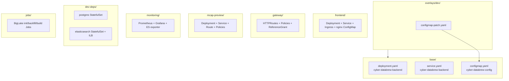
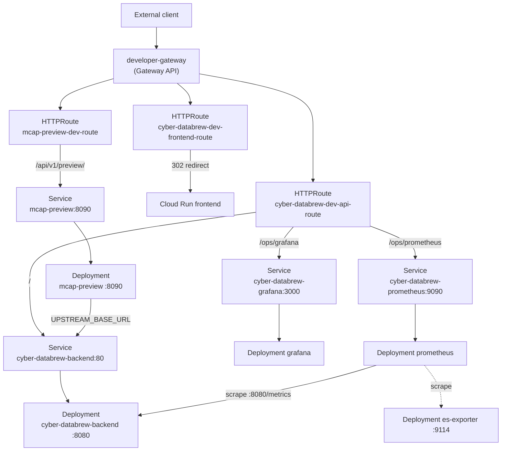
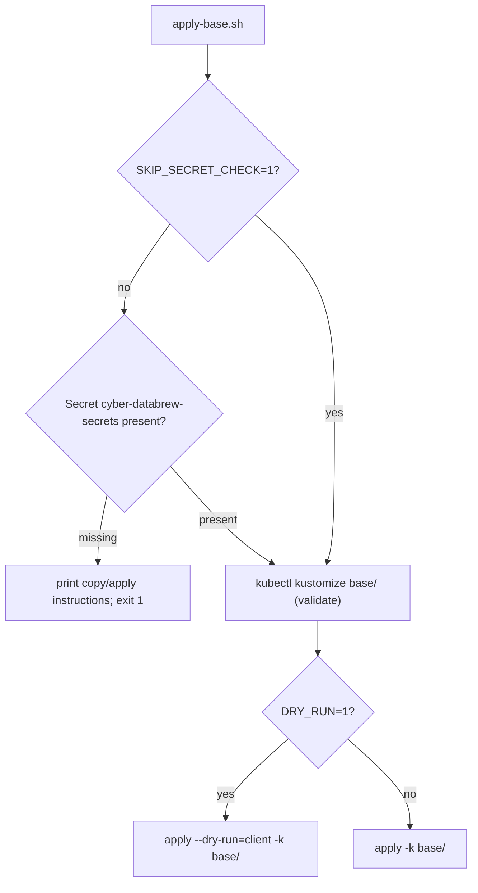
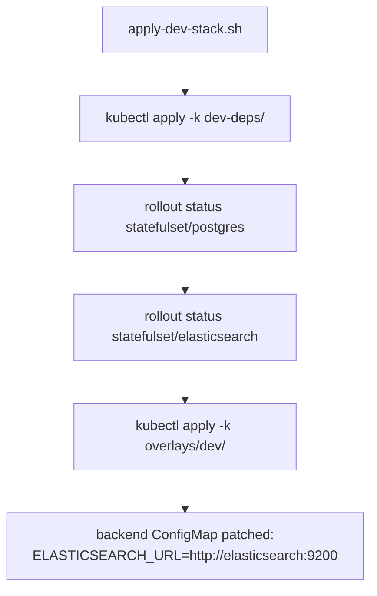
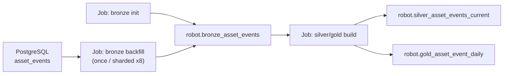
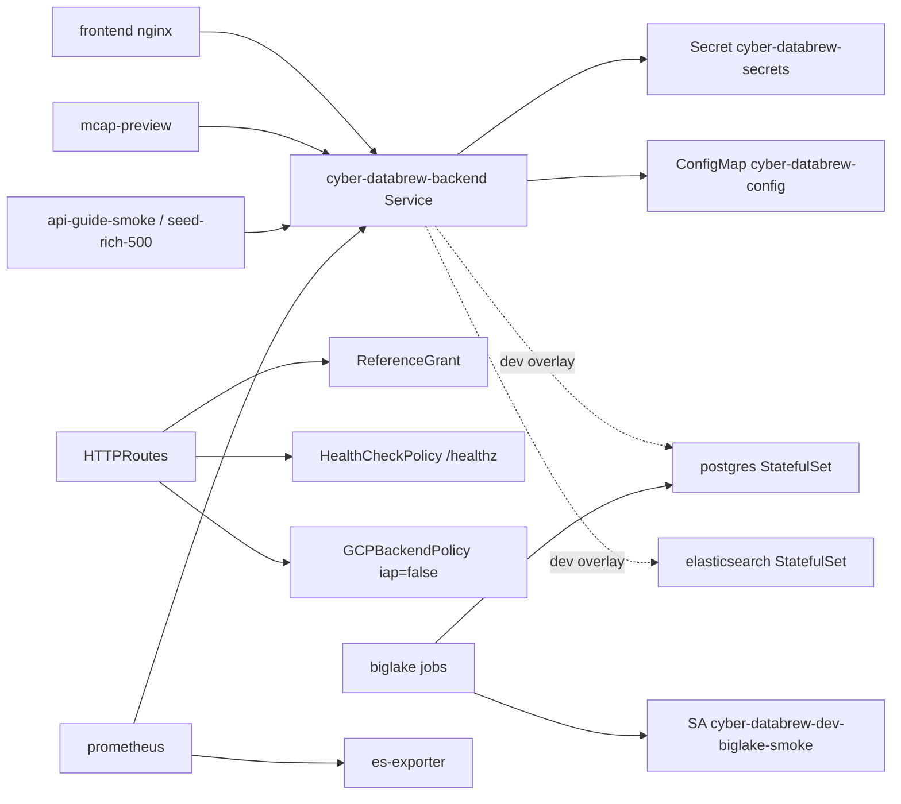

# Kubernetes

<cite>
**Referenced Files in This Document**

- [deploy/k8s/README.md](file://deploy/k8s/README.md)
- [deploy/k8s/namespaces.yaml](file://deploy/k8s/namespaces.yaml)
- [deploy/k8s/apply-base.sh](file://deploy/k8s/apply-base.sh)
- [deploy/k8s/apply-dev-stack.sh](file://deploy/k8s/apply-dev-stack.sh)
- [deploy/k8s/diagnose.sh](file://deploy/k8s/diagnose.sh)
- [deploy/k8s/base/kustomization.yaml](file://deploy/k8s/base/kustomization.yaml)
- [deploy/k8s/base/configmap.yaml](file://deploy/k8s/base/configmap.yaml)
- [deploy/k8s/base/deployment.yaml](file://deploy/k8s/base/deployment.yaml)
- [deploy/k8s/base/service.yaml](file://deploy/k8s/base/service.yaml)
- [deploy/k8s/base/secret.example.yaml](file://deploy/k8s/base/secret.example.yaml)
- [deploy/k8s/frontend/deployment.yaml](file://deploy/k8s/frontend/deployment.yaml)
- [deploy/k8s/frontend/service.yaml](file://deploy/k8s/frontend/service.yaml)
- [deploy/k8s/frontend/ingress.yaml](file://deploy/k8s/frontend/ingress.yaml)
- [deploy/k8s/frontend/nginx-config.yaml](file://deploy/k8s/frontend/nginx-config.yaml)
- [deploy/k8s/frontend/kustomization.yaml](file://deploy/k8s/frontend/kustomization.yaml)
- [deploy/k8s/gateway/kustomization.yaml](file://deploy/k8s/gateway/kustomization.yaml)
- [deploy/k8s/gateway/frontend-route.yaml](file://deploy/k8s/gateway/frontend-route.yaml)
- [deploy/k8s/gateway/backend-route.yaml](file://deploy/k8s/gateway/backend-route.yaml)
- [deploy/k8s/gateway/backend-backend-policy.yaml](file://deploy/k8s/gateway/backend-backend-policy.yaml)
- [deploy/k8s/gateway/frontend-backend-policy.yaml](file://deploy/k8s/gateway/frontend-backend-policy.yaml)
- [deploy/k8s/gateway/backend-healthcheck-policy.yaml](file://deploy/k8s/gateway/backend-healthcheck-policy.yaml)
- [deploy/k8s/gateway/reference-grant.yaml](file://deploy/k8s/gateway/reference-grant.yaml)
- [deploy/k8s/mcap-preview/deployment.yaml](file://deploy/k8s/mcap-preview/deployment.yaml)
- [deploy/k8s/mcap-preview/configmap.yaml](file://deploy/k8s/mcap-preview/configmap.yaml)
- [deploy/k8s/mcap-preview/service.yaml](file://deploy/k8s/mcap-preview/service.yaml)
- [deploy/k8s/mcap-preview/route.yaml](file://deploy/k8s/mcap-preview/route.yaml)
- [deploy/k8s/mcap-preview/kustomization.yaml](file://deploy/k8s/mcap-preview/kustomization.yaml)
- [deploy/k8s/mcap-preview/backend-healthcheck-policy.yaml](file://deploy/k8s/mcap-preview/backend-healthcheck-policy.yaml)
- [deploy/k8s/monitoring/kustomization.yaml](file://deploy/k8s/monitoring/kustomization.yaml)
- [deploy/k8s/monitoring/prometheus-deployment.yaml](file://deploy/k8s/monitoring/prometheus-deployment.yaml)
- [deploy/k8s/monitoring/prometheus-service.yaml](file://deploy/k8s/monitoring/prometheus-service.yaml)
- [deploy/k8s/monitoring/grafana-deployment.yaml](file://deploy/k8s/monitoring/grafana-deployment.yaml)
- [deploy/k8s/monitoring/backend-policy.yaml](file://deploy/k8s/monitoring/backend-policy.yaml)
- [deploy/k8s/monitoring/healthcheck-policy.yaml](file://deploy/k8s/monitoring/healthcheck-policy.yaml)
- [deploy/k8s/monitoring/elasticsearch-exporter.yaml](file://deploy/k8s/monitoring/elasticsearch-exporter.yaml)
- [deploy/k8s/dev-deps/kustomization.yaml](file://deploy/k8s/dev-deps/kustomization.yaml)
- [deploy/k8s/dev-deps/postgres.yaml](file://deploy/k8s/dev-deps/postgres.yaml)
- [deploy/k8s/dev-deps/elasticsearch.yaml](file://deploy/k8s/dev-deps/elasticsearch.yaml)
- [deploy/k8s/dev-deps/elasticsearch-internal-lb.yaml](file://deploy/k8s/dev-deps/elasticsearch-internal-lb.yaml)
- [deploy/k8s/overlays/dev/kustomization.yaml](file://deploy/k8s/overlays/dev/kustomization.yaml)
- [deploy/k8s/overlays/dev/configmap-patch.yaml](file://deploy/k8s/overlays/dev/configmap-patch.yaml)
- [deploy/k8s/jobs/biglake-bronze-asset-events-init.yaml](file://deploy/k8s/jobs/biglake-bronze-asset-events-init.yaml)
- [deploy/k8s/jobs/biglake-bronze-asset-events-backfill-once.yaml](file://deploy/k8s/jobs/biglake-bronze-asset-events-backfill-once.yaml)
- [deploy/k8s/jobs/biglake-bronze-asset-events-backfill-sharded-once.yaml](file://deploy/k8s/jobs/biglake-bronze-asset-events-backfill-sharded-once.yaml)
- [deploy/k8s/jobs/biglake-silver-gold-build-once.yaml](file://deploy/k8s/jobs/biglake-silver-gold-build-once.yaml)
- [deploy/k8s/jobs/api-guide-smoke-job.yaml](file://deploy/k8s/jobs/api-guide-smoke-job.yaml)
- [deploy/k8s/jobs/seed-rich-500-pod.yaml](file://deploy/k8s/jobs/seed-rich-500-pod.yaml)
</cite>

## Table of Contents
1. [Introduction](#introduction)
2. [Project Structure](#project-structure)
3. [Core Components](#core-components)
4. [Architecture Overview](#architecture-overview)
5. [Detailed Component Analysis](#detailed-component-analysis)
6. [Dependency Analysis](#dependency-analysis)
7. [Performance Considerations](#performance-considerations)
8. [Troubleshooting Guide](#troubleshooting-guide)
9. [Conclusion](#conclusion)
10. [Appendices](#appendices)

## Introduction

The `deploy/k8s/` tree is the Kubernetes deployment surface of cyber-databrew. It
packages every cluster-side workload — the Go API backend, the React/Nginx
frontend, the `mcap-preview` streaming microservice, the Prometheus/Grafana
observability stack, in-cluster development dependencies (PostgreSQL,
Elasticsearch), and one-off lakehouse build jobs — as [Kustomize](https://kustomize.io)
bundles applied to a GKE cluster, with the [Gateway API](https://gateway-api.sigs.k8s.io)
fronting external traffic.

The design is deliberately layered. A small `base/` overlay holds the canonical
backend `Deployment` + `Service` + `ConfigMap` that both `dev` and `prod`
namespaces share, while the `overlays/dev/` overlay patches it for in-cluster
dependencies. Each peripheral concern (frontend, gateway, mcap-preview,
monitoring, dev-deps) is its own self-contained directory with its own
`kustomization.yaml`, so an operator applies exactly the slices a given
environment needs. Two namespaces — `cyber-databrew-dev` and
`cyber-databrew-prod` — receive these slices through CI rollouts (PR
`/deploy-dev` for dev, merge-to-`main` promotion for prod).

This page is the reference for that topology: what each workload is, how the
Gateway API routes external hostnames to in-cluster `Service`s, how the dev
overlay differs from base, and how the batch `Job`s seed and build the
Iceberg lakehouse.

**Section sources**
- [deploy/k8s/README.md](file://deploy/k8s/README.md#L1-L23)
- [deploy/k8s/namespaces.yaml](file://deploy/k8s/namespaces.yaml#L1-L19)

## Project Structure

The directory groups manifests by concern; each group is an independent
Kustomize target applied with `kubectl apply -k <dir>`.

- **`base/`** — the backend `Deployment`, `ClusterIP` `Service`, non-sensitive
  `ConfigMap` (`cyber-databrew-config`), and a `secret.example.yaml` template
  for the required `cyber-databrew-secrets`. The `kustomization.yaml` lists only
  `configmap.yaml`, `deployment.yaml`, `service.yaml`.
- **`overlays/dev/`** — references `../../base` and applies `configmap-patch.yaml`
  to point the backend at the in-cluster Elasticsearch (`http://elasticsearch:9200`).
- **`frontend/`** — Nginx-served React SPA `Deployment` + `Service` + GCE
  `Ingress` + a `ConfigMap` carrying the Nginx `default.conf` reverse proxy.
- **`gateway/`** — Gateway API resources (`HTTPRoute`, `ReferenceGrant`,
  `GCPBackendPolicy`, `HealthCheckPolicy`) that bind `*.cyberorigin.ai`
  hostnames on the shared `developer-gateway` to backend/frontend `Service`s.
- **`mcap-preview/`** — the MCAP preview microservice `Deployment` + `Service` +
  `ConfigMap`, plus its own gateway plumbing for the `/api/v1/preview/` path.
- **`monitoring/`** — Prometheus, Grafana, the Elasticsearch exporter, their
  `Service`s, and gateway policies for the `/ops/grafana` and `/ops/prometheus`
  paths. Grafana dashboards are loaded via a `configMapGenerator`.
- **`dev-deps/`** — PostgreSQL and Elasticsearch `StatefulSet`s (with PVCs) plus
  an internal `LoadBalancer` (`elasticsearch-ilb`) for VPC callers.
- **`prod-deps/`** (CYB-4427) — the prod counterpart of `dev-deps/`, but
  **Elasticsearch only** (prod Postgres is CloudSQL, not in-cluster): the ES
  `StatefulSet` + headless `Service` + internal `LoadBalancer` (`elasticsearch-ilb`,
  IP `10.2.0.33`, which `backend-prod.sh` sets as `ELASTICSEARCH_URL`). Its
  `kustomization.yaml` pins `namespace: cyber-databrew-prod`, so
  `kubectl apply -k deploy/k8s/prod-deps/` lands it there. Prod ES was never
  deployed before CYB-4427 — asset search silently fell back to the Postgres
  count until it existed.
- **`jobs/`** — one-off `Job`/`Pod` manifests that initialise, backfill, and
  build the BigLake Iceberg lakehouse tables, and run smoke/seed tasks.
- **`namespaces.yaml`** — the two namespaces.
- **`apply-base.sh` / `apply-dev-stack.sh` / `diagnose.sh`** — operator scripts.

**Diagram sources**
- [deploy/k8s/base/kustomization.yaml](file://deploy/k8s/base/kustomization.yaml#L1-L8)
- [deploy/k8s/overlays/dev/kustomization.yaml](file://deploy/k8s/overlays/dev/kustomization.yaml#L1-L6)
- [deploy/k8s/frontend/kustomization.yaml](file://deploy/k8s/frontend/kustomization.yaml#L1-L7)
- [deploy/k8s/gateway/kustomization.yaml](file://deploy/k8s/gateway/kustomization.yaml#L1-L9)
- [deploy/k8s/mcap-preview/kustomization.yaml](file://deploy/k8s/mcap-preview/kustomization.yaml#L1-L16)
- [deploy/k8s/monitoring/kustomization.yaml](file://deploy/k8s/monitoring/kustomization.yaml#L1-L25)
- [deploy/k8s/dev-deps/kustomization.yaml](file://deploy/k8s/dev-deps/kustomization.yaml#L1-L6)

**Section sources**
- [deploy/k8s/README.md](file://deploy/k8s/README.md#L1-L190)
- [deploy/k8s/namespaces.yaml](file://deploy/k8s/namespaces.yaml#L1-L19)

## Core Components

The cluster runs a small set of long-lived workloads plus a family of short-lived
batch jobs. The table below enumerates every workload object defined under
`deploy/k8s/`, its Kubernetes kind, and its purpose.

| Workload | Kind | Source | Purpose |
|----------|------|--------|---------|
| `cyber-databrew-backend` | Deployment | [base/deployment.yaml](file://deploy/k8s/base/deployment.yaml#L16-L66) | Gin API server (`backend/cmd/server`); serves `/api/v1` + `/healthz`, scraped on `:8080/metrics` |
| `cyber-databrew-backend` | Service (ClusterIP) | [base/service.yaml](file://deploy/k8s/base/service.yaml#L3-L19) | Port 80 → container `http` (8080); LB/Gateway backend |
| `cyber-databrew-config` | ConfigMap | [base/configmap.yaml](file://deploy/k8s/base/configmap.yaml#L3-L46) | Non-sensitive backend env defaults |
| `cyber-databrew-secrets` | Secret | [base/secret.example.yaml](file://deploy/k8s/base/secret.example.yaml#L14-L28) | DB creds + `DATABREW_TOKEN` (operator-provided) |
| `cyber-databrew-frontend` | Deployment | [frontend/deployment.yaml](file://deploy/k8s/frontend/deployment.yaml#L1-L48) | Nginx SPA host; mounts custom `default.conf` |
| `cyber-databrew-frontend` | Service (ClusterIP) | [frontend/service.yaml](file://deploy/k8s/frontend/service.yaml#L1-L17) | Port 80 → container `http` |
| `cyber-databrew-frontend` | Ingress (gce) | [frontend/ingress.yaml](file://deploy/k8s/frontend/ingress.yaml#L1-L21) | GCE L7 ingress for the SPA host |
| `cyber-databrew-frontend-nginx` | ConfigMap | [frontend/nginx-config.yaml](file://deploy/k8s/frontend/nginx-config.yaml#L1-L43) | Nginx reverse-proxy + SPA fallback |
| `mcap-preview` | Deployment | [mcap-preview/deployment.yaml](file://deploy/k8s/mcap-preview/deployment.yaml#L9-L64) | MCAP segment preview/transcode service on `:8090` |
| `mcap-preview` | Service (ClusterIP) | [mcap-preview/service.yaml](file://deploy/k8s/mcap-preview/service.yaml#L1-L17) | Port 8090 → container `http` |
| `mcap-preview-config` | ConfigMap | [mcap-preview/configmap.yaml](file://deploy/k8s/mcap-preview/configmap.yaml#L3-L17) | Upstream URL + GCS page-cache tuning |
| `cyber-databrew-prometheus` | Deployment | [monitoring/prometheus-deployment.yaml](file://deploy/k8s/monitoring/prometheus-deployment.yaml#L1-L43) | Metrics scraper served under `/ops/prometheus` |
| `cyber-databrew-grafana` | Deployment | [monitoring/grafana-deployment.yaml](file://deploy/k8s/monitoring/grafana-deployment.yaml#L1-L57) | Dashboards served under `/ops/grafana` |
| `cyber-databrew-elasticsearch-exporter` | Deployment + Service | [monitoring/elasticsearch-exporter.yaml](file://deploy/k8s/monitoring/elasticsearch-exporter.yaml#L20-L85) | Exposes ES cluster metrics on `:9114` |
| `postgres` | StatefulSet + Service | [dev-deps/postgres.yaml](file://deploy/k8s/dev-deps/postgres.yaml#L1-L73) | In-cluster Postgres 16 with 20Gi PVC (dev only) |
| `elasticsearch` | StatefulSet + Service | [dev-deps/elasticsearch.yaml](file://deploy/k8s/dev-deps/elasticsearch.yaml#L1-L89) | Single-node ES 8.13.4, no auth, 30Gi PVC (dev only) |
| `elasticsearch-ilb` | Service (Internal LB) | [dev-deps/elasticsearch-internal-lb.yaml](file://deploy/k8s/dev-deps/elasticsearch-internal-lb.yaml#L4-L24) | VPC-internal access to ES :9200 |
| `biglake-bronze-asset-events-init` | Job | [jobs/biglake-bronze-asset-events-init.yaml](file://deploy/k8s/jobs/biglake-bronze-asset-events-init.yaml#L121-L169) | Create `robot.bronze_asset_events` Iceberg table |
| `biglake-bronze-asset-events-backfill-once` | Job | [jobs/biglake-bronze-asset-events-backfill-once.yaml](file://deploy/k8s/jobs/biglake-bronze-asset-events-backfill-once.yaml#L267-L348) | Copy PG `asset_events` → Bronze |
| `biglake-bronze-asset-events-backfill-sharded-once` | Job (Indexed) | [jobs/biglake-bronze-asset-events-backfill-sharded-once.yaml](file://deploy/k8s/jobs/biglake-bronze-asset-events-backfill-sharded-once.yaml#L19-L105) | 8-shard parallel backfill |
| `biglake-silver-gold-build-once` | Job | [jobs/biglake-silver-gold-build-once.yaml](file://deploy/k8s/jobs/biglake-silver-gold-build-once.yaml#L223-L271) | Build Silver/Gold tables from Bronze |
| `api-guide-smoke` | Job | [jobs/api-guide-smoke-job.yaml](file://deploy/k8s/jobs/api-guide-smoke-job.yaml#L5-L41) | In-cluster API smoke against ClusterIP |
| `seed-rich-500` | Pod | [jobs/seed-rich-500-pod.yaml](file://deploy/k8s/jobs/seed-rich-500-pod.yaml#L1-L39) | Seed 500 rich datasets via API |

**Section sources**
- [deploy/k8s/base/deployment.yaml](file://deploy/k8s/base/deployment.yaml#L16-L66)
- [deploy/k8s/base/service.yaml](file://deploy/k8s/base/service.yaml#L1-L19)
- [deploy/k8s/frontend/deployment.yaml](file://deploy/k8s/frontend/deployment.yaml#L1-L48)
- [deploy/k8s/mcap-preview/deployment.yaml](file://deploy/k8s/mcap-preview/deployment.yaml#L9-L64)
- [deploy/k8s/monitoring/prometheus-deployment.yaml](file://deploy/k8s/monitoring/prometheus-deployment.yaml#L1-L43)
- [deploy/k8s/monitoring/grafana-deployment.yaml](file://deploy/k8s/monitoring/grafana-deployment.yaml#L1-L57)

## Architecture Overview

External traffic enters through the shared `developer-gateway` (a Gateway API
`Gateway` living in the `developer-gateway` namespace, owned outside this repo).
The repo's `HTTPRoute`s — also created in `developer-gateway` — dispatch by
hostname and path prefix to `Service`s in `cyber-databrew-dev`. Because the
routes live in a different namespace than the target `Service`s, a
`ReferenceGrant` in `cyber-databrew-dev` authorises the cross-namespace
`backendRef`s. `GCPBackendPolicy` objects govern IAP per backend, and
`HealthCheckPolicy` objects pin the GKE LB health check to `/healthz` (the Go
servers return 404 on `/`).

The frontend host (`cyber-databrew-dev.cyberorigin.ai`) is, in the dev gateway,
a 302 redirect to the Cloud Run frontend, while the API host
(`api-cyber-databrew-dev.cyberorigin.ai`) routes `/ops/grafana`,
`/ops/prometheus`, `/api/v1/preview/`, and the catch-all `/` to in-cluster
`Service`s. Inside the cluster, the frontend Nginx and the `mcap-preview`
service both call the backend `Service` over `ClusterIP`.

**Diagram sources**
- [deploy/k8s/gateway/frontend-route.yaml](file://deploy/k8s/gateway/frontend-route.yaml#L1-L25)
- [deploy/k8s/gateway/backend-route.yaml](file://deploy/k8s/gateway/backend-route.yaml#L1-L44)
- [deploy/k8s/mcap-preview/route.yaml](file://deploy/k8s/mcap-preview/route.yaml#L8-L31)
- [deploy/k8s/mcap-preview/configmap.yaml](file://deploy/k8s/mcap-preview/configmap.yaml#L11-L13)
- [deploy/k8s/base/deployment.yaml](file://deploy/k8s/base/deployment.yaml#L35-L47)

**Section sources**
- [deploy/k8s/README.md](file://deploy/k8s/README.md#L100-L173)
- [deploy/k8s/gateway/backend-route.yaml](file://deploy/k8s/gateway/backend-route.yaml#L1-L44)
- [deploy/k8s/gateway/reference-grant.yaml](file://deploy/k8s/gateway/reference-grant.yaml#L1-L17)

## Detailed Component Analysis

### Backend base bundle

The backend `Deployment` runs a single replica of the Gin API server image from
Artifact Registry. It injects environment from both `cyber-databrew-config`
(via `configMapRef`) and `cyber-databrew-secrets` (via `secretRef`), exposes a
named `http` port on container 8080, and uses identical readiness/liveness
probes hitting `GET /healthz`. Prometheus scrape annotations on the pod template
(`prometheus.io/scrape: "true"`, port 8080, path `/metrics`) make it scrapeable.
A commented `serviceAccountName` shows where to wire Workload Identity.

The `ConfigMap` holds the full non-sensitive environment surface: `ENV`, `PORT`,
`STORAGE_BACKEND=postgres`, lakehouse toggles (`LAKEHOUSE_BACKEND: "none"` by
default), the empty `ELASTICSEARCH_URL` (filled by the dev overlay), GCS/PubSub
project IDs, logging, and the extensive `OUTBOX_*` relay tuning (batch sizes,
intervals, lease/retry, internal subscriber worker counts). The `Service` is a
plain `ClusterIP` mapping port 80 to the container's `http` target port.

`apply-base.sh` wraps `kubectl apply -k base/`. It first verifies the
`cyber-databrew-secrets` Secret exists in the target namespace (unless
`SKIP_SECRET_CHECK=1`), supports a client-side `DRY_RUN=1`, and defaults the
namespace to `cyber-databrew-dev`.

**Diagram sources**
- [deploy/k8s/apply-base.sh](file://deploy/k8s/apply-base.sh#L9-L38)

**Section sources**
- [deploy/k8s/base/deployment.yaml](file://deploy/k8s/base/deployment.yaml#L16-L66)
- [deploy/k8s/base/configmap.yaml](file://deploy/k8s/base/configmap.yaml#L3-L46)
- [deploy/k8s/base/service.yaml](file://deploy/k8s/base/service.yaml#L1-L19)
- [deploy/k8s/base/secret.example.yaml](file://deploy/k8s/base/secret.example.yaml#L1-L28)

### Frontend bundle and Nginx proxy

The frontend `Deployment` runs the SPA Nginx image (`imagePullPolicy: Always`)
on port 80, with `/`-based readiness/liveness probes, and mounts the
`cyber-databrew-frontend-nginx` `ConfigMap` at `/etc/nginx/conf.d/default.conf`
via `subPath`. The Nginx config encodes three behaviours: it proxies
`/api/v1/preview/` to the Cloud Run mcap-preview service (rewriting `Host`,
forwarding the session cookie as `X-Databrew-Token`, 600s timeouts, buffering
off); proxies `/api/` to the in-cluster `cyber-databrew-backend` Service; and
serves the React SPA with `try_files … /index.html` deep-link fallback for both
`/assets/` and `/`. The `Ingress` uses `ingressClassName: gce` with a
placeholder host (`cyber-databrew-dev.example.com`).

**Section sources**
- [deploy/k8s/frontend/deployment.yaml](file://deploy/k8s/frontend/deployment.yaml#L1-L48)
- [deploy/k8s/frontend/nginx-config.yaml](file://deploy/k8s/frontend/nginx-config.yaml#L9-L42)
- [deploy/k8s/frontend/ingress.yaml](file://deploy/k8s/frontend/ingress.yaml#L1-L21)
- [deploy/k8s/frontend/service.yaml](file://deploy/k8s/frontend/service.yaml#L1-L17)

### Gateway API plumbing

The `gateway/` kustomization assembles the frontend route, the API route, a
`ReferenceGrant`, two `GCPBackendPolicy` objects, and a `HealthCheckPolicy`.

- **`cyber-databrew-dev-frontend-route`** matches `/` on
  `cyber-databrew-dev.cyberorigin.ai` and applies a `RequestRedirect` filter to
  the Cloud Run frontend hostname (302).
- **`cyber-databrew-dev-api-route`** on `api-cyber-databrew-dev.cyberorigin.ai`
  has three rules: `/ops/grafana` → `cyber-databrew-grafana:3000`,
  `/ops/prometheus` → `cyber-databrew-prometheus:9090`, and `/` →
  `cyber-databrew-backend:80`, all in `cyber-databrew-dev`.
- **`ReferenceGrant`** (`allow-developer-gateway-http-routes`) lets `HTTPRoute`s
  from `developer-gateway` reference the `cyber-databrew-frontend` and
  `cyber-databrew-backend` Services.
- **`GCPBackendPolicy`** for API and frontend both set `iap.enabled: false`
  (API IAP is off for integration testing; the frontend `clientID` is filled
  only when IAP is enabled).
- **`HealthCheckPolicy`** pins the API LB health check to `GET /healthz` on the
  serving port, because the Go backend returns 404 on `/` (which otherwise made
  the NEG UNHEALTHY and triggered "fault filter abort").

The IaC-style `bootstrap-like-iac.sh` is the recommended driver: it ensures
Certificate Manager DNS auth/cert/cert-map entries, prints Cloudflare records,
and applies the route/grant/policy set idempotently.

**Section sources**
- [deploy/k8s/gateway/kustomization.yaml](file://deploy/k8s/gateway/kustomization.yaml#L1-L9)
- [deploy/k8s/gateway/frontend-route.yaml](file://deploy/k8s/gateway/frontend-route.yaml#L1-L25)
- [deploy/k8s/gateway/backend-route.yaml](file://deploy/k8s/gateway/backend-route.yaml#L1-L44)
- [deploy/k8s/gateway/backend-backend-policy.yaml](file://deploy/k8s/gateway/backend-backend-policy.yaml#L1-L14)
- [deploy/k8s/gateway/frontend-backend-policy.yaml](file://deploy/k8s/gateway/frontend-backend-policy.yaml#L1-L14)
- [deploy/k8s/gateway/backend-healthcheck-policy.yaml](file://deploy/k8s/gateway/backend-healthcheck-policy.yaml#L1-L19)
- [deploy/k8s/gateway/reference-grant.yaml](file://deploy/k8s/gateway/reference-grant.yaml#L1-L17)

### mcap-preview microservice

`mcap-preview` is a preview/streaming service for MCAP video segments. It calls
the backend (`UPSTREAM_BASE_URL: http://cyber-databrew-backend:80`) for an
asset's MCAP locator, then reads MCAP summaries from GCS using page-cached Range
reads (`GCS_PAGE_SIZE_BYTES`, `GCS_PAGE_CACHE_BYTES`) and passes the
`X-Databrew-Token` through (`DATABREW_TOKEN_PASSTHROUGH: "true"`). It listens on
`:8090` with `/healthz` probes.

Because it transcodes HEVC→H264 with ffmpeg, the container reserves generous CPU:
`requests.cpu: 3000m` / `limits.cpu: 3500m` on a 4-vCPU node (leaving headroom
for kube-system), and `1Gi`/`2Gi` memory to absorb several concurrent ffmpeg
invocations whose work detaches from the request. Its own `kustomization.yaml`
bundles the `Deployment`, `Service`, `ConfigMap`, an `HTTPRoute`
(`mcap-preview-dev-route`, matching `/api/v1/preview/` on the API host →
`mcap-preview:8090`), a `GCPBackendPolicy`, a `HealthCheckPolicy` (`/healthz`),
and a `ReferenceGrant`.

**Section sources**
- [deploy/k8s/mcap-preview/deployment.yaml](file://deploy/k8s/mcap-preview/deployment.yaml#L1-L64)
- [deploy/k8s/mcap-preview/configmap.yaml](file://deploy/k8s/mcap-preview/configmap.yaml#L1-L17)
- [deploy/k8s/mcap-preview/route.yaml](file://deploy/k8s/mcap-preview/route.yaml#L1-L31)
- [deploy/k8s/mcap-preview/kustomization.yaml](file://deploy/k8s/mcap-preview/kustomization.yaml#L1-L16)
- [deploy/k8s/mcap-preview/backend-healthcheck-policy.yaml](file://deploy/k8s/mcap-preview/backend-healthcheck-policy.yaml#L1-L19)

### Monitoring stack

The monitoring kustomization wires Prometheus, Grafana, and an Elasticsearch
exporter, plus their gateway policies. A `configMapGenerator`
(`disableNameSuffixHash: true`) loads six dashboard JSON files into
`cyber-databrew-grafana-dashboards`.

- **Prometheus** runs `prom/prometheus:v2.53.0` with
  `--web.external-url=/ops/prometheus` and `--web.route-prefix=/ops/prometheus`
  so it serves correctly behind the gateway path; config is mounted from
  `cyber-databrew-prometheus-config` and TSDB data on an `emptyDir`.
- **Grafana** runs `grafana/grafana:11.2.0` with
  `GF_SERVER_ROOT_URL=.../ops/grafana/` and `GF_SERVER_SERVE_FROM_SUB_PATH=true`,
  mounting datasource, dashboard-provider, and dashboards ConfigMaps; admin
  credentials are inline `admin/admin` (dev).
- **Elasticsearch exporter** runs
  `quay.io/prometheuscommunity/elasticsearch-exporter:v1.9.0` against
  `http://elasticsearch:9200`, exposing `:9114/metrics`, with optional ES
  credentials sourced from `cyber-databrew-secrets`.

The `GCPBackendPolicy` objects keep IAP off for Grafana/Prometheus, and the
`HealthCheckPolicy` objects point the LB checks at `/api/health` (Grafana) and
`/ops/prometheus/-/healthy` (Prometheus).

**Section sources**
- [deploy/k8s/monitoring/kustomization.yaml](file://deploy/k8s/monitoring/kustomization.yaml#L1-L25)
- [deploy/k8s/monitoring/prometheus-deployment.yaml](file://deploy/k8s/monitoring/prometheus-deployment.yaml#L20-L43)
- [deploy/k8s/monitoring/grafana-deployment.yaml](file://deploy/k8s/monitoring/grafana-deployment.yaml#L20-L57)
- [deploy/k8s/monitoring/elasticsearch-exporter.yaml](file://deploy/k8s/monitoring/elasticsearch-exporter.yaml#L40-L85)
- [deploy/k8s/monitoring/backend-policy.yaml](file://deploy/k8s/monitoring/backend-policy.yaml#L1-L26)
- [deploy/k8s/monitoring/healthcheck-policy.yaml](file://deploy/k8s/monitoring/healthcheck-policy.yaml#L1-L31)

### Dev dependencies and the dev overlay

The `dev-deps/` kustomization stands up in-cluster Postgres and Elasticsearch so
a test namespace needs no managed dependencies. Postgres is a `StatefulSet`
(image `postgres:16-alpine`, DB `cyber_databrew_dev`, user/password
`postgres/postgres`, `pg_isready` probes, 20Gi PVC). Elasticsearch is a
single-node `StatefulSet` (`elasticsearch:8.13.4`, security disabled,
`-Xms512m -Xmx512m`, an init container fixing data-dir ownership, `_cluster/health`
probes, 30Gi PVC). An `elasticsearch-ilb` internal `LoadBalancer` exposes ES on
the VPC for callers such as Cloud Run with Serverless VPC Access, deliberately
omitting `loadBalancerSourceRanges` so GCP health-check ranges succeed.

The `overlays/dev/` kustomization references `../../base` and patches the backend
`ConfigMap` to set `ELASTICSEARCH_URL: "http://elasticsearch:9200"`.
`apply-dev-stack.sh` applies `dev-deps/`, waits for both StatefulSets to roll
out (`--timeout=300s`), then applies `overlays/dev/`.

**Diagram sources**
- [deploy/k8s/apply-dev-stack.sh](file://deploy/k8s/apply-dev-stack.sh#L11-L20)
- [deploy/k8s/overlays/dev/configmap-patch.yaml](file://deploy/k8s/overlays/dev/configmap-patch.yaml#L1-L7)

**Section sources**
- [deploy/k8s/dev-deps/postgres.yaml](file://deploy/k8s/dev-deps/postgres.yaml#L17-L73)
- [deploy/k8s/dev-deps/elasticsearch.yaml](file://deploy/k8s/dev-deps/elasticsearch.yaml#L17-L89)
- [deploy/k8s/dev-deps/elasticsearch-internal-lb.yaml](file://deploy/k8s/dev-deps/elasticsearch-internal-lb.yaml#L1-L24)
- [deploy/k8s/overlays/dev/kustomization.yaml](file://deploy/k8s/overlays/dev/kustomization.yaml#L1-L6)

### Batch jobs and the lakehouse pipeline

The `jobs/` directory holds one-off `Job`/`Pod` manifests that build the BigLake
Iceberg lakehouse (warehouse `gs://cyber-databrew-iceberg-warehouse-prod`,
namespace `robot`, REST catalog `biglake`). They authenticate preferentially via
Workload Identity using the `cyber-databrew-dev-biglake-smoke` ServiceAccount
(annotated to a GCP SA), falling back to an optional `biglake-user-token` secret
key `ACCESS_TOKEN`. The pipeline runs in three stages:

1. **init** — `biglake-bronze-asset-events-init` creates the namespace and the
   24-column `robot.bronze_asset_events` Iceberg table (schema mirrors the PG
   `asset_events`, with `_ingested_at` / `_source_file` ingestion columns).
2. **backfill** — `biglake-bronze-asset-events-backfill-once` reads PG
   `asset_events` above `bronze_max_seq` in 5000-row batches and appends to
   Bronze with retry/backoff. The sharded variant
   (`...-backfill-sharded-once`) is an `Indexed` Job (`completions: 8`,
   `parallelism: 8`, `BATCH_SIZE=20000`) reusing the same ConfigMap script,
   deriving `SHARD_INDEX` from the job-completion-index annotation.
3. **build** — `biglake-silver-gold-build-once` reads Bronze, derives the Silver
   current-state table (`silver_asset_events_current`, latest event per
   `asset_id`) and the Gold daily aggregate (`gold_asset_event_daily`), dropping
   and recreating each for a deterministic one-shot snapshot.

All three install `pyiceberg[pyarrow,gcsfs]` at runtime on `python:3.11-slim`,
set `backoffLimit: 1`, `restartPolicy: Never`, and `ttlSecondsAfterFinished: 86400`.
Two supporting workloads round out the directory:
`api-guide-smoke` (a `Job` running `scripts/api-guide-smoke.sh` against the
ClusterIP service) and `seed-rich-500` (a `Pod` seeding 500 datasets via the API).

**Diagram sources**
- [deploy/k8s/jobs/biglake-bronze-asset-events-init.yaml](file://deploy/k8s/jobs/biglake-bronze-asset-events-init.yaml#L71-L119)
- [deploy/k8s/jobs/biglake-bronze-asset-events-backfill-once.yaml](file://deploy/k8s/jobs/biglake-bronze-asset-events-backfill-once.yaml#L107-L137)
- [deploy/k8s/jobs/biglake-silver-gold-build-once.yaml](file://deploy/k8s/jobs/biglake-silver-gold-build-once.yaml#L81-L106)

**Section sources**
- [deploy/k8s/jobs/biglake-bronze-asset-events-init.yaml](file://deploy/k8s/jobs/biglake-bronze-asset-events-init.yaml#L1-L169)
- [deploy/k8s/jobs/biglake-bronze-asset-events-backfill-once.yaml](file://deploy/k8s/jobs/biglake-bronze-asset-events-backfill-once.yaml#L1-L348)
- [deploy/k8s/jobs/biglake-bronze-asset-events-backfill-sharded-once.yaml](file://deploy/k8s/jobs/biglake-bronze-asset-events-backfill-sharded-once.yaml#L19-L105)
- [deploy/k8s/jobs/biglake-silver-gold-build-once.yaml](file://deploy/k8s/jobs/biglake-silver-gold-build-once.yaml#L1-L272)
- [deploy/k8s/jobs/api-guide-smoke-job.yaml](file://deploy/k8s/jobs/api-guide-smoke-job.yaml#L1-L41)
- [deploy/k8s/jobs/seed-rich-500-pod.yaml](file://deploy/k8s/jobs/seed-rich-500-pod.yaml#L1-L39)

## Dependency Analysis

The backend is the hub: the frontend Nginx, `mcap-preview`, and the smoke/seed
jobs all call the `cyber-databrew-backend` Service. The backend depends on
`cyber-databrew-secrets` (DB + token) and `cyber-databrew-config`; in dev it
also depends on the in-cluster `postgres` and `elasticsearch` StatefulSets via
the dev overlay patch. The Gateway routes depend on the `ReferenceGrant` to
cross the namespace boundary, and on the `HealthCheckPolicy`/`GCPBackendPolicy`
to make the LB NEGs healthy and IAP-correct. The lakehouse jobs depend on the
PG `asset_events` table and the GCS warehouse bucket, authenticated through the
`cyber-databrew-dev-biglake-smoke` ServiceAccount.

**Diagram sources**
- [deploy/k8s/frontend/nginx-config.yaml](file://deploy/k8s/frontend/nginx-config.yaml#L28-L32)
- [deploy/k8s/mcap-preview/configmap.yaml](file://deploy/k8s/mcap-preview/configmap.yaml#L11-L13)
- [deploy/k8s/jobs/api-guide-smoke-job.yaml](file://deploy/k8s/jobs/api-guide-smoke-job.yaml#L26-L32)

**Section sources**
- [deploy/k8s/base/deployment.yaml](file://deploy/k8s/base/deployment.yaml#L48-L52)
- [deploy/k8s/overlays/dev/configmap-patch.yaml](file://deploy/k8s/overlays/dev/configmap-patch.yaml#L1-L7)
- [deploy/k8s/jobs/biglake-bronze-asset-events-backfill-once.yaml](file://deploy/k8s/jobs/biglake-bronze-asset-events-backfill-once.yaml#L284-L320)

## Performance Considerations

- **Single replicas.** The backend, frontend, mcap-preview, Prometheus, and
  Grafana all default to `replicas: 1`. They are vertically sized for dev;
  horizontal scaling is an operator choice not encoded here.
- **mcap-preview CPU.** Transcoding is CPU-bound, so the pod reserves 3 vCPU and
  caps at 3.5 vCPU on a 4-vCPU node, with 1–2Gi memory to hold several
  concurrent ffmpeg + MCAP page-cache working sets. This is the dominant
  scheduling constraint in the namespace.
- **GCS page caching.** mcap-preview reads MCAP summaries via 1 MiB Range pages
  (`GCS_PAGE_SIZE_BYTES`) with a 64 MiB cache (`GCS_PAGE_CACHE_BYTES`),
  amortising repeated reads of the same asset.
- **Outbox relay tuning.** The backend ConfigMap exposes batch sizes, intervals,
  lease/retry, and internal subscriber worker counts that govern event-relay
  throughput without rebuilding the image.
- **Sharded backfill.** The Indexed Job runs 8 parallel shards with 20000-row
  batches and append-retry/backoff, since concurrent Iceberg writers can
  conflict on commit.
- **emptyDir for metrics.** Prometheus TSDB and Grafana data use `emptyDir`,
  so observability state is ephemeral across pod restarts.

**Section sources**
- [deploy/k8s/mcap-preview/deployment.yaml](file://deploy/k8s/mcap-preview/deployment.yaml#L52-L63)
- [deploy/k8s/base/configmap.yaml](file://deploy/k8s/base/configmap.yaml#L29-L44)
- [deploy/k8s/jobs/biglake-bronze-asset-events-backfill-sharded-once.yaml](file://deploy/k8s/jobs/biglake-bronze-asset-events-backfill-sharded-once.yaml#L26-L30)

## Troubleshooting Guide

`diagnose.sh` is the first stop for backend pod issues. With `K8S_NAMESPACE` set
it prints the kube context, namespace existence, the `cyber-databrew-backend`
deployment, pods (by `app.kubernetes.io/name=cyber-databrew`), recent events,
the first pod's describe/conditions, the last 120 log lines of the `api`
container, and the deployment's image. The README's table maps the common
failure modes:

| Symptom | Likely cause |
|---------|--------------|
| `ImagePullBackOff` | Registry auth, wrong tag, or image only on laptop — fix Artifact Registry IAM / `docker-credential-gcloud` |
| `CrashLoopBackOff` with postgres errors in logs | `DB_HOST` / firewall / Cloud SQL authorized networks / PSC |
| `CreateContainerConfigError` | `cyber-databrew-secrets` missing or misnamed |

Gateway-specific gotcha: GKE's default LB health check uses `GET /`, which the Go
backend and mcap-preview answer with 404, marking the NEG UNHEALTHY and serving
"fault filter abort". The `HealthCheckPolicy` objects fix this by pinning the
check to `/healthz`. Validate routes with `kubectl -n developer-gateway get
httproute …` and policies/grants with `kubectl -n cyber-databrew-dev get
gcpbackendpolicy referencegrant`. For dev, `apply-dev-stack.sh` rollout waits
surface StatefulSet failures early; note the README warns that Postgres
migrations are **not** auto-applied by that script.

**Section sources**
- [deploy/k8s/diagnose.sh](file://deploy/k8s/diagnose.sh#L1-L41)
- [deploy/k8s/README.md](file://deploy/k8s/README.md#L60-L64)
- [deploy/k8s/README.md](file://deploy/k8s/README.md#L175-L190)
- [deploy/k8s/gateway/backend-healthcheck-policy.yaml](file://deploy/k8s/gateway/backend-healthcheck-policy.yaml#L1-L19)

## Conclusion

The Kubernetes layer is a set of small, composable Kustomize bundles: a shared
backend `base/`, a `dev/` overlay for in-cluster dependencies, and independent
slices for the frontend, the shared Gateway API exposure, the mcap-preview
microservice, the monitoring stack, dev dependencies, and the one-off lakehouse
jobs. External traffic flows through the `developer-gateway` via `HTTPRoute`s
gated by `ReferenceGrant` and tuned with `HealthCheckPolicy`/`GCPBackendPolicy`;
inside the cluster everything converges on the `cyber-databrew-backend`
`ClusterIP` Service. Operator scripts (`apply-base.sh`, `apply-dev-stack.sh`,
`diagnose.sh`) keep the workflow reproducible and debuggable.

## Appendices

### Namespaces

| Namespace | Component label | Promotion path |
|-----------|-----------------|----------------|
| `cyber-databrew-dev` | `dev` | PR `/deploy-dev` rollouts |
| `cyber-databrew-prod` | `prod` | merge → `main` promote rollouts |

**Section sources**
- [deploy/k8s/namespaces.yaml](file://deploy/k8s/namespaces.yaml#L1-L19)

### Operator scripts and env vars

| Script | Key env vars | Effect |
|--------|--------------|--------|
| `apply-base.sh` | `K8S_NAMESPACE`, `DRY_RUN`, `SKIP_SECRET_CHECK` | Apply `base/` after verifying the Secret |
| `apply-dev-stack.sh` | `K8S_NAMESPACE` | Apply `dev-deps/`, await rollout, apply `overlays/dev/` |
| `diagnose.sh` | `K8S_NAMESPACE` | One-shot backend diagnostics dump |

**Section sources**
- [deploy/k8s/apply-base.sh](file://deploy/k8s/apply-base.sh#L1-L39)
- [deploy/k8s/apply-dev-stack.sh](file://deploy/k8s/apply-dev-stack.sh#L1-L21)
- [deploy/k8s/diagnose.sh](file://deploy/k8s/diagnose.sh#L1-L41)

### Secret keys (`cyber-databrew-secrets`)

| Key | Purpose |
|-----|---------|
| `DB_HOST`, `DB_PORT`, `DB_USER`, `DB_PASSWORD`, `DB_NAME` | PostgreSQL connection |
| `DATABREW_TOKEN` | Static phase-0 API auth token |

**Section sources**
- [deploy/k8s/base/secret.example.yaml](file://deploy/k8s/base/secret.example.yaml#L22-L28)
