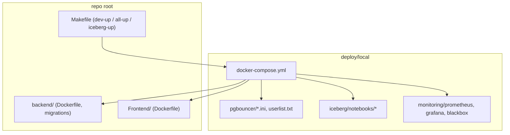
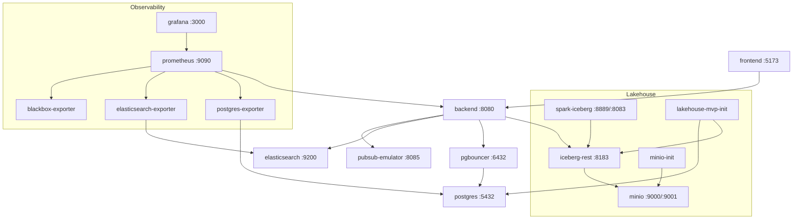
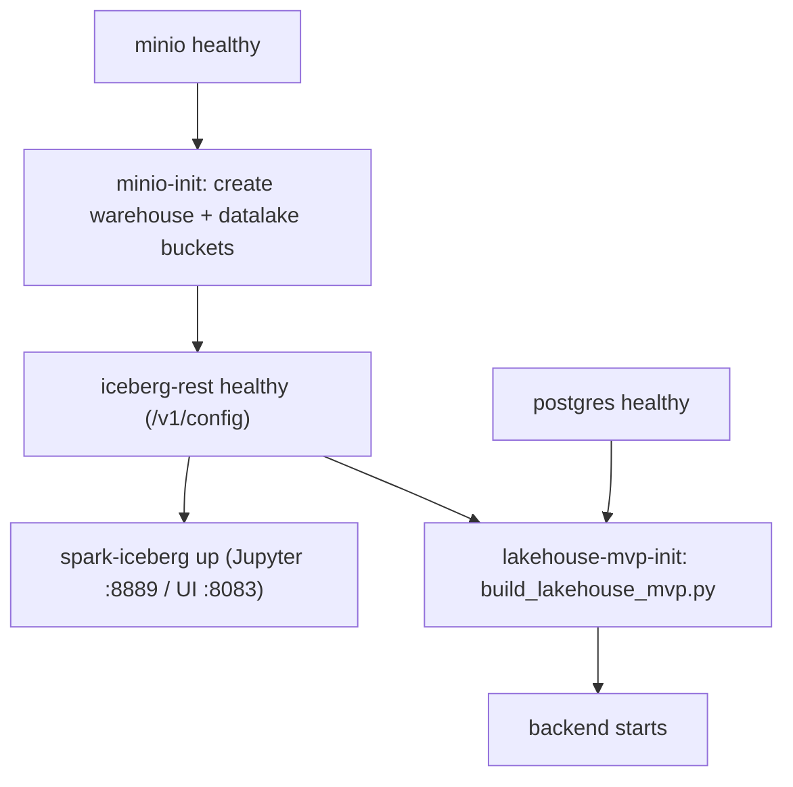
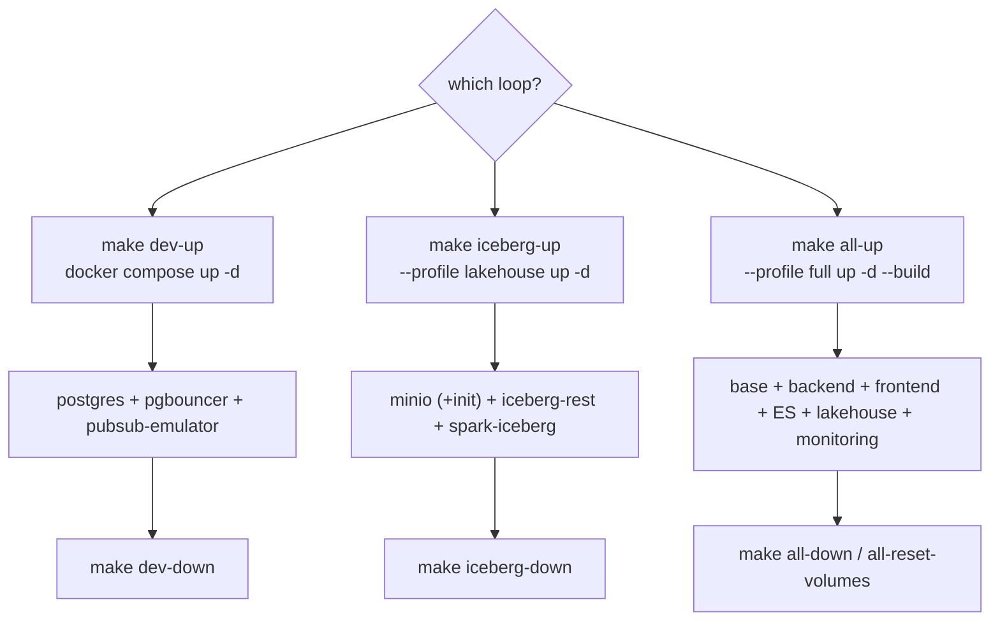
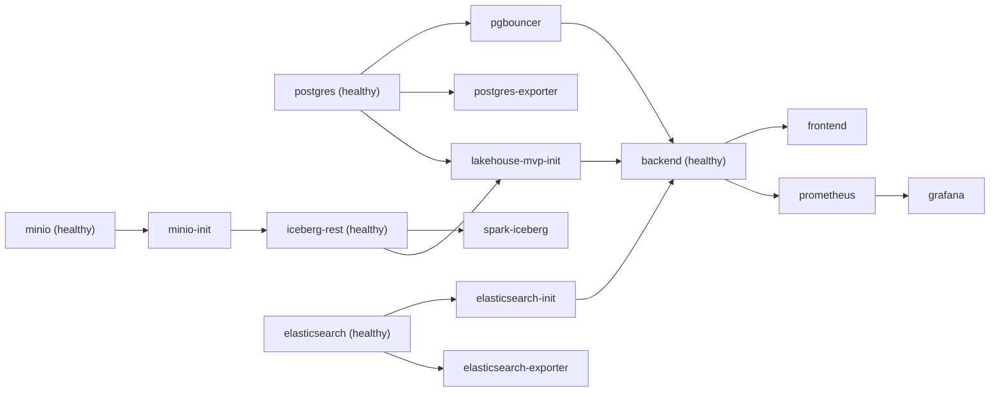

# Local Compose

<cite>
**Referenced Files in This Document**

- [deploy/local/docker-compose.yml](file://deploy/local/docker-compose.yml)
- [deploy/local/README.md](file://deploy/local/README.md)
- [Makefile](file://Makefile)
</cite>

## Table of Contents
1. [Introduction](#introduction)
2. [Project Structure](#project-structure)
3. [Core Components](#core-components)
4. [Architecture Overview](#architecture-overview)
5. [Detailed Component Analysis](#detailed-component-analysis)
6. [Dependency Analysis](#dependency-analysis)
7. [Performance Considerations](#performance-considerations)
8. [Troubleshooting Guide](#troubleshooting-guide)
9. [Conclusion](#conclusion)
10. [Appendices](#appendices)

## Introduction

The local Docker Compose stack is the single source of truth for running
cyber-databrew on a developer laptop or a disposable Linux VM. There is exactly
**one** Compose file — `deploy/local/docker-compose.yml` — and every optional
piece of the stack is gated behind a Compose **profile** (`full` or `lakehouse`)
rather than living in a separate file. The base (unprofiled) services form the
minimal data layer that backend code needs: a logical-replication-enabled
Postgres, a PgBouncer connection pooler in front of it, and a Google Pub/Sub
emulator. Everything else — the Go backend, the React frontend, Elasticsearch,
the Iceberg/MinIO lakehouse, and the Prometheus/Grafana observability tier — is
opt-in.

This design lets the most common day-to-day loop stay fast: a developer brings
up only Postgres + PgBouncer + the Pub/Sub emulator with `make dev-up`, runs the
backend and Vite frontend on the host, and only reaches for `--profile full`
when an integration test or a demo needs the nginx-packaged frontend, search,
the lakehouse, or dashboards (see [README.md](file://deploy/local/README.md#L5-L13)).

The profiles map onto three `make` targets — `dev-up`, `all-up`, and
`iceberg-up` — each documented below. This page describes every service the
Compose file actually defines, its image, its published host port, the profile
that activates it, and the dependency edges that determine bring-up order.

**Section sources**
- [deploy/local/docker-compose.yml](file://deploy/local/docker-compose.yml#L1-L11)
- [deploy/local/README.md](file://deploy/local/README.md#L1-L13)
- [Makefile](file://Makefile#L3-L8)

## Project Structure

The local deployment lives entirely under `deploy/local/`. The Compose file
references sibling project directories (`../../backend`, `../../Frontend`) for
image builds and bind-mounts a number of config trees from inside `deploy/local`
itself.

- `deploy/local/docker-compose.yml` — the only Compose file; all services and
  profiles live here.
- `deploy/local/README.md` — operator runbook: profiles, port table, BuildKit
  tips, and the remote-VM git-clone workflow.
- `deploy/local/pgbouncer/` — `pgbouncer.ini` and `userlist.txt`, mounted
  read-only into the PgBouncer container.
- `deploy/local/iceberg/notebooks/` — Spark/Jupyter notebooks plus the
  `build_lakehouse_mvp.py` script run by `lakehouse-mvp-init`.
- `deploy/local/monitoring/` — `prometheus/prometheus.yml`, the Grafana
  provisioning trees, and `blackbox/blackbox.yml`, all bind-mounted.
- `../../backend/migrations` — DDL applied by Postgres' init hook on first boot.
- `Makefile` (repo root) — the `dev-up` / `all-up` / `iceberg-up` targets and
  their teardown counterparts wrap the raw `docker compose` invocations.

**Diagram sources**
- [deploy/local/docker-compose.yml](file://deploy/local/docker-compose.yml#L29-L31)
- [deploy/local/docker-compose.yml](file://deploy/local/docker-compose.yml#L42-L44)
- [deploy/local/docker-compose.yml](file://deploy/local/docker-compose.yml#L62-L64)
- [Makefile](file://Makefile#L4-L18)

**Section sources**
- [deploy/local/docker-compose.yml](file://deploy/local/docker-compose.yml#L11-L463)
- [deploy/local/README.md](file://deploy/local/README.md#L1-L13)

## Core Components

The Compose file groups services into five labelled blocks: a Data Layer, the
Go backend, the React/nginx frontend, the Iceberg lakehouse stack, an
Elasticsearch search tier, and an Observability tier. Each service, its image,
its published host port (host-side of the `ports:` mapping), the profile that
enables it, and its purpose are summarised below. Only services that are
literally defined in `docker-compose.yml` appear here.

| Service | Image | Host port(s) | Profile | Purpose |
|---------|-------|--------------|---------|---------|
| `postgres` | `postgres:16-alpine` | 5432 | base | Primary OLTP store; started with `wal_level=logical` and replication slots so CDC works; runs `backend/migrations/*.sql` on first boot. |
| `pgbouncer` | `edoburu/pgbouncer:latest` | 6432 | base | Connection pooler in front of Postgres; the backend connects through it. |
| `pubsub-emulator` | `gcr.io/google.com/cloudsdktool/google-cloud-cli:emulators` | 8085 | base | Local Google Pub/Sub emulator for event publishing. |
| `backend` | built from `../../backend/Dockerfile` | 8080 | `full` | Go API server (`./server`); waits for PgBouncer, ES init, and lakehouse init before serving. |
| `frontend` | built from `../../Frontend/Dockerfile` | 5173 (→80) | `full` | React app served by nginx; container port 80 published as 5173. |
| `minio` | `minio/minio:latest` | 9000, 9001 | `full`, `lakehouse` | S3-compatible object store; 9000 = API, 9001 = console; aliased as `warehouse.minio`. |
| `minio-init` | `minio/mc:latest` | — | `full`, `lakehouse` | One-shot job that creates the `warehouse` and `datalake` buckets. |
| `iceberg-rest` | `apache/iceberg-rest-fixture:latest` | 8183 (→8181) | `full`, `lakehouse` | Iceberg REST catalog backed by the MinIO `s3://warehouse/` bucket. |
| `spark-iceberg` | `tabulario/spark-iceberg:latest` | 8889 (→8888), 8083 (→8080) | `full`, `lakehouse` | Spark + Jupyter; 8889 = notebook, 8083 = Spark UI. |
| `lakehouse-mvp-init` | `tabulario/spark-iceberg:latest` | — | `full` | One-shot job that runs `build_lakehouse_mvp.py` to seed the MVP lakehouse. |
| `elasticsearch` | `docker.elastic.co/elasticsearch/elasticsearch:8.13.4` | 9200 | `full` | Single-node ES (security disabled) backing asset search. |
| `elasticsearch-init` | `curlimages/curl:8.7.1` | — | `full` | One-shot job that creates/updates the `assets` index mapping. |
| `postgres-exporter` | `prometheuscommunity/postgres-exporter:latest` | — | `full` | Exports Postgres metrics for Prometheus. |
| `elasticsearch-exporter` | `quay.io/prometheuscommunity/elasticsearch-exporter:latest` | — | `full` | Exports ES cluster/index metrics. |
| `blackbox-exporter` | `quay.io/prometheus/blackbox-exporter:latest` | — | `full` | Probes endpoints (HTTP/TCP) for Prometheus. |
| `prometheus` | `prom/prometheus:latest` | 9090 | `full` | Scrapes the backend and the exporters. |
| `grafana` | `grafana/grafana:latest` | 3000 | `full` | Dashboards over Prometheus; provisioned datasources/dashboards; login `admin`/`admin`. |

> Note: the `make all-up` and `make iceberg-up` echo lines advertise a
> "Trino" / "BigQuery" service on `:8082`, and the backend sets
> `LAKEHOUSE_BACKEND=bigquery`. There is **no** Trino/BigQuery service defined in
> this Compose file — `LAKEHOUSE_BACKEND` is backend configuration, and the
> `:8082` line in the Makefile is informational only and does not correspond to a
> published port in `docker-compose.yml`.

**Section sources**
- [deploy/local/docker-compose.yml](file://deploy/local/docker-compose.yml#L12-L56)
- [deploy/local/docker-compose.yml](file://deploy/local/docker-compose.yml#L58-L126)
- [deploy/local/docker-compose.yml](file://deploy/local/docker-compose.yml#L128-L243)
- [deploy/local/docker-compose.yml](file://deploy/local/docker-compose.yml#L245-L266)
- [deploy/local/docker-compose.yml](file://deploy/local/docker-compose.yml#L382-L454)
- [Makefile](file://Makefile#L17-L24)
- [Makefile](file://Makefile#L62-L68)

## Architecture Overview

When the `full` profile is active every tier is connected through the default
Compose bridge network. The frontend reaches the backend; the backend reaches
PgBouncer (which fronts Postgres), Elasticsearch, the Pub/Sub emulator, and the
Iceberg REST catalog; the lakehouse tier (MinIO + Iceberg REST + Spark) backs
the lakehouse data; and the observability tier scrapes the backend and the data
exporters.

**Diagram sources**
- [deploy/local/docker-compose.yml](file://deploy/local/docker-compose.yml#L85-L93)
- [deploy/local/docker-compose.yml](file://deploy/local/docker-compose.yml#L123-L126)
- [deploy/local/docker-compose.yml](file://deploy/local/docker-compose.yml#L160-L231)
- [deploy/local/docker-compose.yml](file://deploy/local/docker-compose.yml#L389-L453)

**Section sources**
- [deploy/local/docker-compose.yml](file://deploy/local/docker-compose.yml#L58-L463)

## Detailed Component Analysis

### Data Layer (base profile)

The three unprofiled services start with a plain `docker compose up -d`
(`make dev-up`). They are the only services that run without a profile, which
makes them the cheap, always-on foundation.

`postgres` runs `postgres:16-alpine` and overrides the default command to set
`wal_level=logical`, `max_wal_senders=10`, and `max_replication_slots=10` so
logical replication / CDC works locally. It publishes `5432:5432`, sets the
`cyber_databrew_dev` database with `postgres`/`postgres` credentials, persists
data in the `pgdata` named volume, and bind-mounts `../../backend/migrations`
into `/docker-entrypoint-initdb.d` so DDL runs on first boot. Its healthcheck is
`pg_isready -U postgres`, which downstream services depend on.

`pgbouncer` runs `edoburu/pgbouncer:latest`, publishes `6432:6432`, and mounts
`./pgbouncer/pgbouncer.ini` and `./pgbouncer/userlist.txt` read-only. It
`depends_on` Postgres being `service_healthy`. The backend points
`DB_HOST=pgbouncer` / `DB_PORT=6432` rather than talking to Postgres directly.

`pubsub-emulator` runs the Google Cloud CLI emulators image, launches
`gcloud beta emulators pubsub start --host-port=0.0.0.0:8085`, and publishes
`8085:8085`.

**Section sources**
- [deploy/local/docker-compose.yml](file://deploy/local/docker-compose.yml#L12-L56)

### Backend service (full profile)

The `backend` service is built from `../../backend/Dockerfile` with a `GOPROXY`
build arg (default `https://proxy.golang.org,direct`). It publishes `8080:8080`
and is configured entirely through environment variables: `STORAGE_BACKEND=postgres`,
`DB_HOST=pgbouncer`, `DB_PORT=6432`, `ELASTICSEARCH_URL=http://elasticsearch:9200`,
and `LAKEHOUSE_BACKEND=bigquery` with the BigQuery catalog/dataset names.

Its `depends_on` block is the heart of the `full` bring-up ordering: it waits
for `pgbouncer` to be started, `postgres` to be healthy, `elasticsearch-init` to
have completed successfully, and `lakehouse-mvp-init` to have completed
successfully. Its `command` additionally polls `nc -z pgbouncer 6432` in a loop
before `exec ./server`, and its healthcheck hits `/healthz`. The frontend in
turn waits on the backend being healthy.

**Section sources**
- [deploy/local/docker-compose.yml](file://deploy/local/docker-compose.yml#L58-L126)

### Frontend service (full profile)

`frontend` is built from `../../Frontend/Dockerfile` with `VITE_API_BASE_URL`
(empty by default) and an `NPM_REGISTRY` build arg. The container serves the
built app on port 80, published to the host as `5173`. It `depends_on` the
backend being `service_healthy`. For everyday UI work the README recommends
running Vite directly on the host (`npm run dev` on `:5173`, proxying `/api` to
`:8080`) instead of building this container — see
[README.md](file://deploy/local/README.md#L5-L13).

**Section sources**
- [deploy/local/docker-compose.yml](file://deploy/local/docker-compose.yml#L110-L126)
- [deploy/local/README.md](file://deploy/local/README.md#L5-L13)

### Iceberg / lakehouse stack (full + lakehouse profiles)

The lakehouse tier is annotated with ADR-001 (Polaris is the production catalog;
the local stack uses `iceberg-rest-fixture`). Four of its services share the
`full` and `lakehouse` profiles; `lakehouse-mvp-init` is `full`-only.

- `minio` serves object storage at `9000` (API) and `9001` (console), with root
  user `admin`/`password`, the `iceberg-minio-data` volume, and a network alias
  `warehouse.minio`. Healthcheck hits `/minio/health/live`.
- `minio-init` (`minio/mc`) waits for MinIO health, then `mc mb` creates the
  `warehouse` and `datalake` buckets; it is a `restart: "no"` one-shot.
- `iceberg-rest` publishes `8183:8181`, points `CATALOG_WAREHOUSE=s3://warehouse/`
  at the MinIO endpoint, and depends on `minio-init` completing. Healthcheck
  hits `/v1/config`.
- `spark-iceberg` publishes `8889:8888` (Jupyter) and `8083:8080` (Spark UI),
  depends on `iceberg-rest` healthy and `minio-init` complete, and mounts the
  notebooks directory.
- `lakehouse-mvp-init` runs `python .../build_lakehouse_mvp.py` once after
  Postgres and Iceberg REST are healthy and `minio-init` is complete; the backend
  waits on it.

**Diagram sources**
- [deploy/local/docker-compose.yml](file://deploy/local/docker-compose.yml#L155-L243)
- [deploy/local/docker-compose.yml](file://deploy/local/docker-compose.yml#L85-L93)

**Section sources**
- [deploy/local/docker-compose.yml](file://deploy/local/docker-compose.yml#L128-L243)

### Elasticsearch tier (full profile)

`elasticsearch` runs `8.13.4` as a single node with security disabled and a
512 MB heap, publishing `9200:9200` and persisting to `elasticsearch-data`. Its
healthcheck hits `/_cluster/health`.

`elasticsearch-init` (`curlimages/curl:8.7.1`) is a `restart: "no"` one-shot
that, after ES is healthy, idempotently creates the `assets` index: if the index
already exists it only PUTs a mapping update for the `owner`/`reviewer` fields;
otherwise it creates the index with one shard, zero replicas, and the full asset
mapping (keyword/date/long fields plus nested `tags`/`algos` and a `mcap`
object). The backend depends on this job completing successfully.

**Section sources**
- [deploy/local/docker-compose.yml](file://deploy/local/docker-compose.yml#L245-L380)

### Observability tier (full profile)

Three exporters feed Prometheus, which Grafana visualises:

- `postgres-exporter` reads `cyber_databrew_dev` via a `DATA_SOURCE_NAME` DSN and
  depends on Postgres being healthy.
- `elasticsearch-exporter` scrapes `http://elasticsearch:9200` with `--es.all`
  and `--es.indices`, depending on ES healthy.
- `blackbox-exporter` mounts `./monitoring/blackbox/blackbox.yml` for endpoint
  probing.
- `prometheus` publishes `9090:9090`, mounts `prometheus.yml`, enables the
  lifecycle API, and `depends_on` the backend and all three exporters. On a
  Linux VM the README notes a one-time `sed` to point its scrape target at
  `backend:8080` instead of `host.docker.internal:8080`.
- `grafana` publishes `3000:3000`, provisions datasources/dashboards from the
  `monitoring/grafana` trees, and depends on Prometheus.

**Section sources**
- [deploy/local/docker-compose.yml](file://deploy/local/docker-compose.yml#L382-L454)
- [deploy/local/README.md](file://deploy/local/README.md#L74-L78)

### Bring-up profiles and make targets

The three profiles map to make targets that wrap `docker compose`:

| Target | Underlying command | Brings up |
|--------|--------------------|-----------|
| `make dev-up` | `docker compose up -d` | base only: postgres, pgbouncer, pubsub-emulator |
| `make all-up` | `DOCKER_BUILDKIT=1 docker compose --profile full up -d --build` | the entire product stack |
| `make iceberg-up` | `docker compose --profile lakehouse up -d` | minio, minio-init, iceberg-rest, spark-iceberg |
| `make dev-down` | `--profile full --profile lakehouse down` then `down` | tear down everything in the file |
| `make all-down` | `--profile full down` | stop the full stack (Postgres stays) |
| `make all-reset-volumes` | `down -v` across profiles | destructive: removes named volumes |
| `make iceberg-down` | `--profile lakehouse down` | stop the lakehouse only |

**Diagram sources**
- [Makefile](file://Makefile#L4-L18)
- [Makefile](file://Makefile#L62-L71)

**Section sources**
- [Makefile](file://Makefile#L3-L75)
- [deploy/local/README.md](file://deploy/local/README.md#L15-L30)

## Dependency Analysis

The `depends_on` edges in the Compose file define a strict bring-up order under
the `full` profile. Postgres' healthcheck is the root dependency: PgBouncer,
`postgres-exporter`, and `lakehouse-mvp-init` all wait on it. The lakehouse
init chain (`minio` → `minio-init` → `iceberg-rest` → `lakehouse-mvp-init`) and
the ES chain (`elasticsearch` → `elasticsearch-init`) both gate the backend,
which in turn gates the frontend and is scraped by Prometheus.

**Diagram sources**
- [deploy/local/docker-compose.yml](file://deploy/local/docker-compose.yml#L45-L48)
- [deploy/local/docker-compose.yml](file://deploy/local/docker-compose.yml#L85-L93)
- [deploy/local/docker-compose.yml](file://deploy/local/docker-compose.yml#L123-L126)
- [deploy/local/docker-compose.yml](file://deploy/local/docker-compose.yml#L160-L231)
- [deploy/local/docker-compose.yml](file://deploy/local/docker-compose.yml#L389-L453)

**Section sources**
- [deploy/local/docker-compose.yml](file://deploy/local/docker-compose.yml#L45-L93)
- [deploy/local/docker-compose.yml](file://deploy/local/docker-compose.yml#L160-L243)
- [deploy/local/docker-compose.yml](file://deploy/local/docker-compose.yml#L268-L453)

## Performance Considerations

- **PgBouncer in the path.** The backend connects through PgBouncer
  (`DB_HOST=pgbouncer:6432`) rather than directly to Postgres, pooling
  connections so the API server does not exhaust Postgres' backend slots under
  load.
- **Elasticsearch heap.** ES is pinned to a 512 MB heap (`ES_JAVA_OPTS=-Xms512m -Xmx512m`)
  and runs single-node with zero replicas — appropriate for a laptop but the
  first thing to raise if search is slow or ES OOMs.
- **BuildKit cache mounts.** `make all-up` sets `DOCKER_BUILDKIT=1`; the
  backend and frontend Dockerfiles use cache mounts so Go module and npm installs
  are cached across rebuilds. The README advises rebuilding only the changed
  service (`docker compose build frontend`) and avoiding `--no-cache`.
- **Slow networks.** `GOPROXY` and `NPM_REGISTRY` build args let users in
  China / behind slow links swap in faster mirrors
  (`goproxy.cn`, `registry.npmmirror.com`).
- **One-shot init jobs.** `minio-init`, `elasticsearch-init`, and
  `lakehouse-mvp-init` are `restart: "no"`; they run once and the backend gates on
  their successful completion, so a failed init blocks the whole `full` stack
  rather than silently degrading it.

**Section sources**
- [deploy/local/docker-compose.yml](file://deploy/local/docker-compose.yml#L73-L78)
- [deploy/local/docker-compose.yml](file://deploy/local/docker-compose.yml#L249-L266)
- [deploy/local/README.md](file://deploy/local/README.md#L25-L30)

## Troubleshooting Guide

- **Backend never becomes healthy / hangs on startup.** It blocks on its
  `depends_on` (PgBouncer started, Postgres healthy, `elasticsearch-init` and
  `lakehouse-mvp-init` completed). Check those init jobs first — a failed
  `elasticsearch-init` or `lakehouse-mvp-init` will stall the backend
  indefinitely. The backend also loops on `nc -z pgbouncer 6432` before exec.
- **AppleDouble files break the lakehouse on a Linux VM.** Copying `deploy/local`
  from macOS via `tar` can produce `._*` sidecar files; run
  `find deploy/local -name '._*' -delete` before `docker compose up`.
- **Prometheus shows the backend down on a VM.** The checked-in
  `prometheus.yml` scrapes `host.docker.internal:8080` (for a host-run backend).
  On a VM running the full stack, `sed -i 's/host.docker.internal:8080/backend:8080/g'`
  the config (README §First-time setup step 4).
- **Migrations not applied after adding a new SQL file.** The init mount only
  runs DDL on a *fresh* data dir. Use `make local-migrate` to apply migrations
  missing from an existing volume, and `make local-dev-seed` for optional demo
  rows.
- **Resetting data.** `make all-reset-volumes` (or `docker compose down -v`)
  removes the named volumes (`pgdata`, ES, MinIO, Prometheus, Grafana) — this is
  destructive and wipes Postgres data.
- **"Trino/BigQuery :8082" not reachable.** That line in the make echo output is
  informational; no such service is published by this Compose file.

**Section sources**
- [deploy/local/docker-compose.yml](file://deploy/local/docker-compose.yml#L85-L102)
- [deploy/local/README.md](file://deploy/local/README.md#L46-L51)
- [deploy/local/README.md](file://deploy/local/README.md#L74-L78)
- [Makefile](file://Makefile#L37-L44)

## Conclusion

The local stack is intentionally a single Compose file with three profiles. The
base profile (`make dev-up`) gives the always-on data layer; `make iceberg-up`
adds the MinIO/Iceberg/Spark lakehouse; and `make all-up` builds and runs the
full product — backend, frontend, Elasticsearch, lakehouse, and the
Prometheus/Grafana observability tier — with a `depends_on` graph that enforces
correct bring-up order. Understanding which services belong to which profile,
and which init jobs gate the backend, is the key to diagnosing local bring-up
problems quickly.

## Appendices

### Named volumes

| Volume | Used by |
|--------|---------|
| `pgdata` | postgres |
| `iceberg-minio-data` | minio |
| `iceberg-rest-data` | iceberg-rest |
| `elasticsearch-data` | elasticsearch |
| `prometheus-data` | prometheus |
| `grafana-data` | grafana |

**Section sources**
- [deploy/local/docker-compose.yml](file://deploy/local/docker-compose.yml#L456-L462)

### Profile membership quick reference

| Profile | Services activated |
|---------|--------------------|
| base (no profile) | postgres, pgbouncer, pubsub-emulator |
| `lakehouse` | minio, minio-init, iceberg-rest, spark-iceberg |
| `full` | base + backend, frontend, minio, minio-init, iceberg-rest, spark-iceberg, lakehouse-mvp-init, elasticsearch, elasticsearch-init, postgres-exporter, elasticsearch-exporter, blackbox-exporter, prometheus, grafana |

**Section sources**
- [deploy/local/docker-compose.yml](file://deploy/local/docker-compose.yml#L59-L61)
- [deploy/local/docker-compose.yml](file://deploy/local/docker-compose.yml#L130-L132)
- [deploy/local/docker-compose.yml](file://deploy/local/docker-compose.yml#L221-L224)
- [deploy/local/docker-compose.yml](file://deploy/local/docker-compose.yml#L246-L271)
- [deploy/local/docker-compose.yml](file://deploy/local/docker-compose.yml#L383-L439)

### Key backend environment variables

| Variable | Value | Meaning |
|----------|-------|---------|
| `STORAGE_BACKEND` | `postgres` | Primary store selector |
| `DB_HOST` / `DB_PORT` | `pgbouncer` / `6432` | Connects through the pooler |
| `DB_NAME` | `cyber_databrew_dev` | Database name |
| `ELASTICSEARCH_URL` | `http://elasticsearch:9200` | Search backend |
| `LAKEHOUSE_BACKEND` | `bigquery` | Lakehouse backend selector (config, not a Compose service) |

**Section sources**
- [deploy/local/docker-compose.yml](file://deploy/local/docker-compose.yml#L70-L84)
