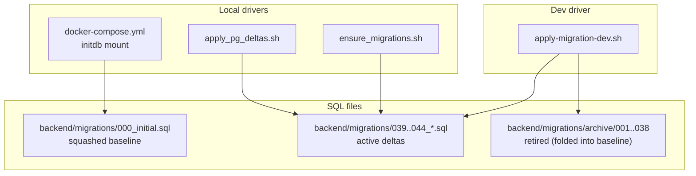
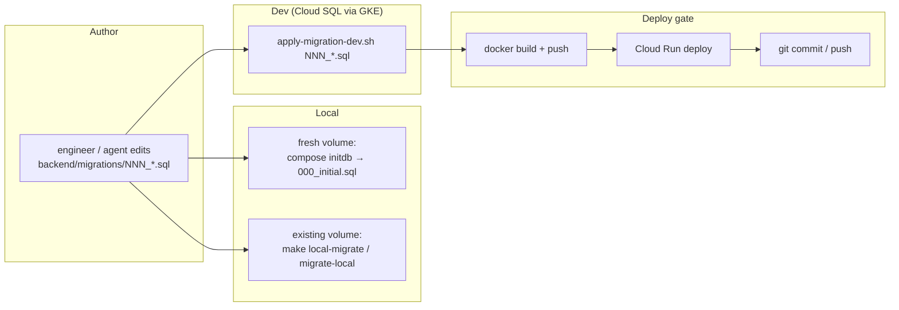
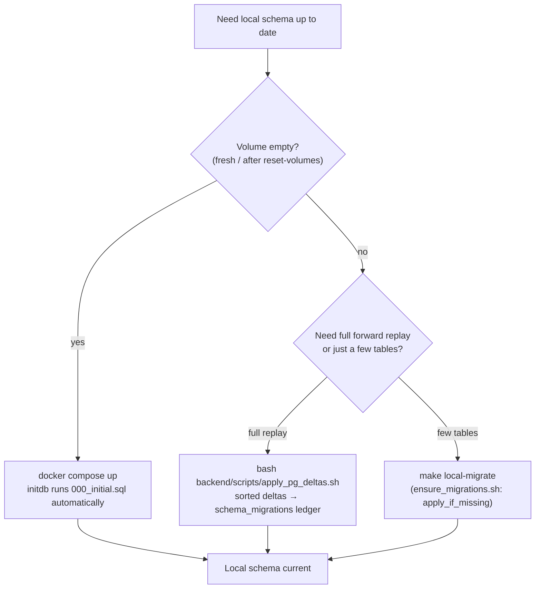
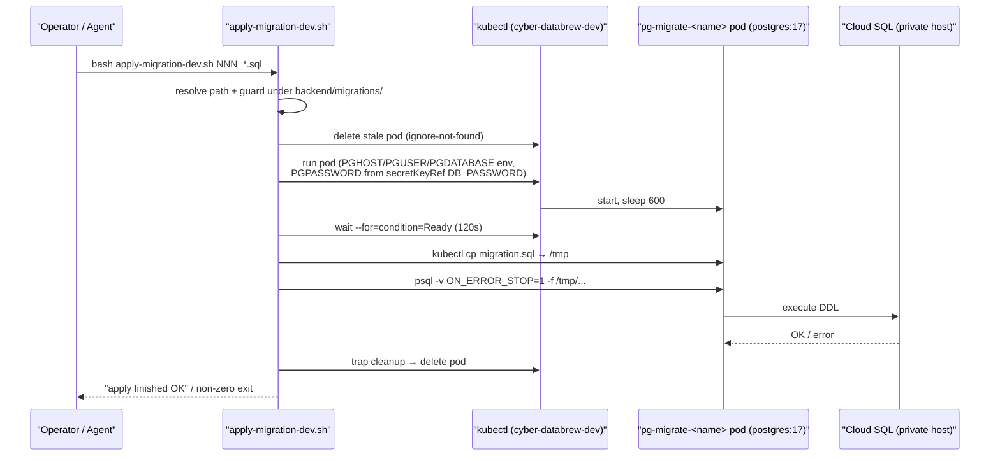
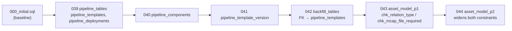
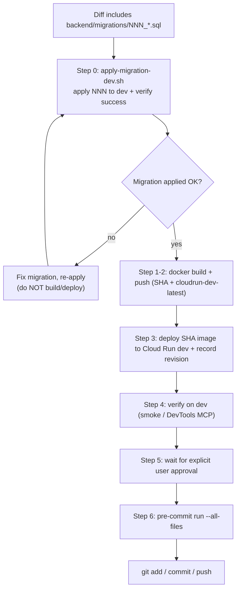
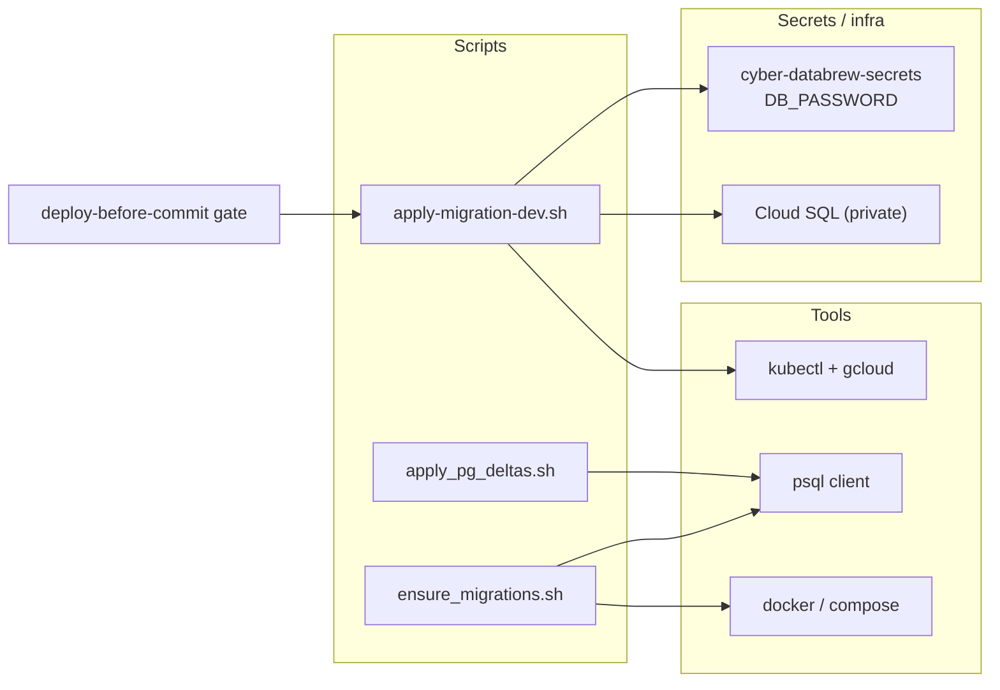

# Migrations Runbook

<cite>
**Referenced Files in This Document**

- [scripts/apply-migration-dev.sh](file://scripts/apply-migration-dev.sh)
- [backend/scripts/ensure_migrations.sh](file://backend/scripts/ensure_migrations.sh)
- [backend/scripts/apply_pg_deltas.sh](file://backend/scripts/apply_pg_deltas.sh)
- [backend/Makefile](file://backend/Makefile)
- [Makefile](file://Makefile)
- [deploy/local/docker-compose.yml](file://deploy/local/docker-compose.yml)
- [docs/agents/deploy-before-commit.md](file://docs/agents/deploy-before-commit.md)
- [backend/migrations/000_initial.sql](file://backend/migrations/000_initial.sql)
- [backend/migrations/039_pipeline_tables.sql](file://backend/migrations/039_pipeline_tables.sql)
- [backend/migrations/040_pipeline_components.sql](file://backend/migrations/040_pipeline_components.sql)
- [backend/migrations/042_pipeline_template_version.sql](file://backend/migrations/042_pipeline_template_version.sql)
- [backend/migrations/043_backfill_tables.sql](file://backend/migrations/043_backfill_tables.sql)
- [backend/migrations/044_asset_model_expansion_p1.sql](file://backend/migrations/044_asset_model_expansion_p1.sql)
- [backend/migrations/045_asset_model_p2.sql](file://backend/migrations/045_asset_model_p2.sql)
</cite>

## Table of Contents
1. [Introduction](#introduction)
2. [Project Structure](#project-structure)
3. [Core Components](#core-components)
4. [Architecture Overview](#architecture-overview)
5. [Detailed Component Analysis](#detailed-component-analysis)
6. [Dependency Analysis](#dependency-analysis)
7. [Performance Considerations](#performance-considerations)
8. [Troubleshooting Guide](#troubleshooting-guide)
9. [Conclusion](#conclusion)
10. [Appendices](#appendices)

## Introduction

This runbook describes how cyber-databrew applies PostgreSQL schema migrations
in two environments — a developer's **local** Docker stack and the shared
**dev** Cloud SQL instance — and the operational rule that governs the order
of those two actions relative to a code deploy.

The migration model in this repository is deliberately simple. There is no
embedded migration framework that runs at server startup; instead, SQL files
under `backend/migrations/` are applied by **shell scripts and Makefile
targets**, each tuned for a specific environment. On a fresh database the
single squashed baseline `000_initial.sql` is executed by the Postgres
container's `docker-entrypoint-initdb.d` mount. On an existing database, only
the incremental deltas committed after the squash are replayed. Against dev,
a single SQL file is shipped into a throwaway pod on the GKE network that can
reach the private Cloud SQL host.

The most important operational invariant — enforced by the
deploy-before-commit gate — is that **a migration must be applied to dev
*before* deploying any code that depends on it**, and before any
`git commit` / `git push`. A backend revision that queries a table or column
that does not yet exist on dev will crash on the first request; ordering the
migration first prevents that class of outage.

This page is for backend engineers, on-call operators, and any AI agent that
edits files under `backend/migrations/`.

**Section sources**
- [scripts/apply-migration-dev.sh](file://scripts/apply-migration-dev.sh#L1-L9)
- [backend/scripts/apply_pg_deltas.sh](file://backend/scripts/apply_pg_deltas.sh#L1-L12)
- [docs/agents/deploy-before-commit.md](file://docs/agents/deploy-before-commit.md#L1-L7)

## Project Structure

Migration assets are split across a SQL directory and a small set of driver
scripts. The SQL lives under `backend/migrations/`; the drivers live in both
`backend/scripts/` (local-oriented) and `scripts/` (dev-oriented), and are
surfaced through Makefile targets at the repo root and inside `backend/`.

- **`backend/migrations/000_initial.sql`** — the squashed baseline. It is the
  single source of truth for a *fresh* database: extensions, functions,
  tables, indexes, and constraints squashed from 36 prior incremental
  migrations.
- **`backend/migrations/0NN_*.sql`** — the *active* incremental deltas added
  after the squash. At the time of writing these are `039`–`044`.
- **`backend/migrations/archive/0NN_*.sql`** — the historical migrations
  (`001`–`038`) that were folded into `000_initial.sql` and retired. They are
  retained for provenance and for the few cases where a delta script still
  references one (e.g. `013_drop_cf_legacy_columns.sql`).
- **`scripts/apply-migration-dev.sh`** — applies **one** migration file to the
  dev Cloud SQL instance through a temporary GKE pod.
- **`backend/scripts/apply_pg_deltas.sh`** — replays *all* post-squash deltas
  on an existing database, tracking applied files in a `schema_migrations`
  table.
- **`backend/scripts/ensure_migrations.sh`** — a targeted "apply if missing"
  helper for a handful of tables, used when a running local Postgres predates
  a newly-added migration file.
- **`Makefile` / `backend/Makefile`** — expose the local entry points
  (`local-migrate`, `migrate-local`).
- **`deploy/local/docker-compose.yml`** — mounts `backend/migrations/` into the
  Postgres init directory so a brand-new volume bootstraps from the baseline.



**Diagram sources**
- [deploy/local/docker-compose.yml](file://deploy/local/docker-compose.yml#L29-L31)
- [backend/scripts/apply_pg_deltas.sh](file://backend/scripts/apply_pg_deltas.sh#L58-L80)
- [scripts/apply-migration-dev.sh](file://scripts/apply-migration-dev.sh#L26-L43)

**Section sources**
- [backend/migrations/000_initial.sql](file://backend/migrations/000_initial.sql#L1-L4)
- [backend/scripts/apply_pg_deltas.sh](file://backend/scripts/apply_pg_deltas.sh#L1-L16)
- [Makefile](file://Makefile#L37-L44)
- [backend/Makefile](file://backend/Makefile#L45-L47)

## Core Components

There are four cooperating components in the migration toolchain. Each owns one
environment or one failure scenario.

#### The squashed baseline (`000_initial.sql`)

`000_initial.sql` is the full current schema, squashed from 36 incremental
migrations into a single file. Its header states explicitly that it is the
single source of truth for fresh deployments and that it is executed
automatically on first `docker-compose up` via the
`/docker-entrypoint-initdb.d` mount. It begins by enabling the `pgcrypto`
extension and defining helper functions such as `asset_algo_statuses`,
`event_retention_cleanup`, and `set_updated_at` before creating tables.

Because the baseline is replayed only on an *empty* data volume, it never runs
against a database that already contains data — that is the job of the delta
and ensure scripts described below.

#### The dev applier (`apply-migration-dev.sh`)

`apply-migration-dev.sh` applies exactly one `backend/migrations/*.sql` file to
the dev PostgreSQL instance. Dev Postgres is a *private* Cloud SQL instance
reachable only from inside the GKE network, so the script spins up a temporary
`postgres:17` pod in the `cyber-databrew-dev` namespace, copies the SQL file
into it, and runs `psql -v ON_ERROR_STOP=1 -f` from inside the cluster. The pod
is deleted on exit via a `trap`.

#### The delta replayer (`apply_pg_deltas.sh`)

`apply_pg_deltas.sh` applies all post-squash deltas to an *existing* database
in sorted order, skipping `000_initial.sql`. Unlike the other two scripts it
maintains a `schema_migrations` ledger table and records each applied file, so
re-running it is idempotent at the file granularity.

#### The "ensure" helper (`ensure_migrations.sh`)

`ensure_migrations.sh` handles the narrow case where a local Postgres volume
already existed before a new migration file was added — meaning the initdb hook
never ran for it. It checks for the presence of specific tables and applies the
corresponding SQL file only if missing, working through either a running
`local-postgres-1` Docker container or a direct `psql` connection.

**Section sources**
- [backend/migrations/000_initial.sql](file://backend/migrations/000_initial.sql#L1-L31)
- [scripts/apply-migration-dev.sh](file://scripts/apply-migration-dev.sh#L1-L73)
- [backend/scripts/apply_pg_deltas.sh](file://backend/scripts/apply_pg_deltas.sh#L24-L74)
- [backend/scripts/ensure_migrations.sh](file://backend/scripts/ensure_migrations.sh#L1-L83)

## Architecture Overview

The toolchain has no shared runtime; each path is an independent script
invocation. What ties them together is the **migration ordering contract** and
the choice of applier per environment. A fresh local database is bootstrapped
by Compose from the baseline; an existing local database is patched forward by
deltas or the ensure helper; dev is patched one file at a time by the dev
applier ahead of any code deploy.



The right-hand chain encodes the central rule: the migration is applied to dev
**first**, then the image is built and deployed, and only after verified
deploy may the change be committed. This is step 0 of the deploy-before-commit
gate.

**Diagram sources**
- [deploy/local/docker-compose.yml](file://deploy/local/docker-compose.yml#L29-L31)
- [Makefile](file://Makefile#L37-L44)
- [scripts/apply-migration-dev.sh](file://scripts/apply-migration-dev.sh#L55-L72)
- [docs/agents/deploy-before-commit.md](file://docs/agents/deploy-before-commit.md#L5-L20)

**Section sources**
- [docs/agents/deploy-before-commit.md](file://docs/agents/deploy-before-commit.md#L5-L20)

## Detailed Component Analysis

### Applying migrations locally

There are three distinct local situations, and the correct tool differs for
each. Picking the wrong one is the most common source of "table does not exist"
confusion on a developer machine.

**1. Fresh database (empty volume).** When the Postgres data volume is empty —
a brand-new checkout, or after `make all-reset-volumes` — the Compose service
mounts `backend/migrations/` at `/docker-entrypoint-initdb.d`. The official
Postgres image runs every `*.sql` file in that directory in lexical order on
first boot, so `000_initial.sql` (and any sibling `0NN_*.sql` deltas present in
the directory) executes automatically. No manual command is required. The
compose header documents this: Postgres init runs `backend/migrations/*.sql`
(DDL only; optional demo rows come from `make local-dev-seed`).

**2. Existing database, new file added.** The initdb hook runs *only* on an
empty volume, so adding a new migration file to an already-populated local
database requires a manual replay. The repo-root target `make local-migrate`
runs `ensure_migrations.sh`, which applies a hard-coded set of tables only if
they are missing. For a complete forward replay of every post-squash delta,
`apply_pg_deltas.sh` walks `backend/migrations/*.sql` (skipping the baseline) in
sorted order and records each file in `schema_migrations`.

> Note: `backend/Makefile`'s `migrate-local` target documents itself as a
> replay of incremental SQL via `scripts/apply_pg_deltas.sh`, but the actual
> committed script lives at `backend/scripts/apply_pg_deltas.sh`. Run that path
> directly (or use the repo-root `make local-migrate`) if the `backend/`
> relative path is not present in your checkout.

**3. Selective repair.** `ensure_migrations.sh` is the lightweight option when
you only need a couple of tables (it checks `asset_metrics`, `actions`,
`saved_queries`, `algo_runs`). It auto-detects a running `local-postgres-1`
container and otherwise falls back to a `psql` connection driven by the
`PGHOST`/`PGPORT`/`PGUSER`/`PGPASSWORD`/`PGDATABASE` environment variables,
defaulting to `127.0.0.1:5432` and database `cyber_databrew_dev`.



**Diagram sources**
- [deploy/local/docker-compose.yml](file://deploy/local/docker-compose.yml#L1-L31)
- [Makefile](file://Makefile#L37-L44)
- [backend/scripts/apply_pg_deltas.sh](file://backend/scripts/apply_pg_deltas.sh#L56-L80)
- [backend/scripts/ensure_migrations.sh](file://backend/scripts/ensure_migrations.sh#L47-L83)

**Section sources**
- [Makefile](file://Makefile#L29-L44)
- [backend/Makefile](file://backend/Makefile#L45-L47)
- [deploy/local/docker-compose.yml](file://deploy/local/docker-compose.yml#L1-L36)
- [backend/scripts/apply_pg_deltas.sh](file://backend/scripts/apply_pg_deltas.sh#L24-L82)
- [backend/scripts/ensure_migrations.sh](file://backend/scripts/ensure_migrations.sh#L15-L83)

### Applying migrations to dev (`apply-migration-dev.sh`)

The dev applier is the only supported way to mutate the dev schema. Its design
follows from the fact that the dev database is a private Cloud SQL instance: the
script never connects from the operator's laptop directly, it runs `psql` from a
pod *inside* the GKE cluster that already has network reach to the private host.

The invocation accepts either a path or a bare filename:

```bash
bash scripts/apply-migration-dev.sh backend/migrations/045_asset_model_p2.sql
# or, with overridable namespace:
K8S_NAMESPACE=cyber-databrew-dev bash scripts/apply-migration-dev.sh 045_asset_model_p2.sql
```

Resolution logic: the script accepts the argument verbatim if it is a file,
otherwise it tries `backend/migrations/<arg>` and then
`backend/migrations/archive/<arg>`. It then enforces a guard that the resolved
path lies under `backend/migrations/`, refusing anything outside that tree.
This is a safety rail that prevents an operator from accidentally streaming an
arbitrary host file into dev.

Connection parameters are all environment-overridable but ship with dev
defaults: namespace `cyber-databrew-dev`, secret `cyber-databrew-secrets`, host
`172.27.160.7`, port `5432`, user `postgres`, database `cyber_databrew_dev`. The
password is never passed on the command line — it is injected into the pod via a
`secretKeyRef` reading `DB_PASSWORD` from the secret.

Pod naming derives a K8s-safe name from the migration basename
(`pg-migrate-<lowercased, underscores→hyphens>`), because K8s object names must
be lowercase RFC 1123 with no underscores. The script deletes any stale pod with
that name, runs a fresh `postgres:17` pod with a `sleep 600` command, waits up
to 120s for readiness, copies the SQL file in with `kubectl cp`, and executes it
with `psql -v ON_ERROR_STOP=1 -f`. A `trap cleanup EXIT` guarantees the pod is
deleted whether the apply succeeds or fails.



**Diagram sources**
- [scripts/apply-migration-dev.sh](file://scripts/apply-migration-dev.sh#L25-L72)

**Section sources**
- [scripts/apply-migration-dev.sh](file://scripts/apply-migration-dev.sh#L9-L72)

### Migration ordering and the squash boundary

Ordering is purely lexical by filename, and the three-digit numeric prefix is
what makes lexical order match intended order. Two boundaries matter:

- **The squash boundary.** Everything from `001`–`038` was folded into
  `000_initial.sql` and moved to `backend/migrations/archive/`. The delta
  replayer explicitly `continue`s past `000_initial.sql` so the baseline is
  never double-applied, and it iterates the remaining `*.sql` in sorted order.
  As a result the active set begins at `039`.
- **The active deltas (`039`–`044`).** These are applied on top of the
  baseline. Their dependencies are real: `043_backfill_tables.sql` declares
  `template_id TEXT NOT NULL REFERENCES pipeline_templates(id)`, which only
  exists because `039_pipeline_tables.sql` created `pipeline_templates`. A
  backfill table cannot be created before the pipeline tables. Likewise
  `045_asset_model_p2.sql` re-declares the `chk_relation_type` and
  `chk_mcap_file_required` constraints that `044_asset_model_expansion_p1.sql`
  first introduced, broadening the allowed `relation_type` and `asset_type`
  sets — `044` must run after `043`.

Because numeric prefixes drive ordering, **always allocate the next free
number** for a new migration; never reuse or interleave a lower number after a
higher one has been applied to dev.



**Diagram sources**
- [backend/migrations/039_pipeline_tables.sql](file://backend/migrations/039_pipeline_tables.sql#L5-L26)
- [backend/migrations/043_backfill_tables.sql](file://backend/migrations/043_backfill_tables.sql#L4-L15)
- [backend/migrations/044_asset_model_expansion_p1.sql](file://backend/migrations/044_asset_model_expansion_p1.sql#L3-L22)
- [backend/migrations/045_asset_model_p2.sql](file://backend/migrations/045_asset_model_p2.sql#L3-L37)

**Section sources**
- [backend/scripts/apply_pg_deltas.sh](file://backend/scripts/apply_pg_deltas.sh#L58-L80)
- [backend/migrations/039_pipeline_tables.sql](file://backend/migrations/039_pipeline_tables.sql#L1-L26)
- [backend/migrations/043_backfill_tables.sql](file://backend/migrations/043_backfill_tables.sql#L1-L35)
- [backend/migrations/044_asset_model_expansion_p1.sql](file://backend/migrations/044_asset_model_expansion_p1.sql#L1-L22)
- [backend/migrations/045_asset_model_p2.sql](file://backend/migrations/045_asset_model_p2.sql#L1-L37)

### The dev-before-deploy rule

This is the operationally critical section. The deploy-before-commit gate makes
applying migrations **step 0** — it runs *before* building, deploying, or
committing any runtime change. The gate's wording: if the diff includes new
files under `backend/migrations/*.sql`, apply them to dev **before**
building/deploying with
`bash scripts/apply-migration-dev.sh "$(pwd)/backend/migrations/NNN_name.sql"`,
and verify the migration succeeded before proceeding.

The rationale is a strict happens-before relationship between schema and code.
A Cloud Run revision that references a not-yet-existing table or column fails on
first use; the migration must therefore land on dev first so that the new code
finds the schema it expects. Conversely a *destructive* migration (dropping a
column) must be sequenced the other way — deploy code that stops using the
column first, then drop it — but the gate's default and the common
additive case is **migration first, then deploy, then commit**.



**Diagram sources**
- [docs/agents/deploy-before-commit.md](file://docs/agents/deploy-before-commit.md#L5-L20)

**Section sources**
- [docs/agents/deploy-before-commit.md](file://docs/agents/deploy-before-commit.md#L1-L20)
- [scripts/apply-migration-dev.sh](file://scripts/apply-migration-dev.sh#L1-L8)

## Dependency Analysis

The migration toolchain depends on a small set of external tools and on the
schema dependencies between SQL files. It is depended upon by the backend
service (which expects the schema to exist) and by the deploy gate (which
sequences it).

- **`apply-migration-dev.sh`** depends on `kubectl` pointed at a context that
  can reach `cyber-databrew-dev`, on the `cyber-databrew-secrets` secret holding
  `DB_PASSWORD`, and on a `postgres:17` image being pullable inside the cluster.
- **`apply_pg_deltas.sh`** depends on a local `psql` client and on a reachable
  Postgres (via `DATABASE_URL` or the `PG*` defaults). It owns the
  `schema_migrations` ledger.
- **`ensure_migrations.sh`** depends on either a running `local-postgres-1`
  Docker container or a `psql` client.
- **The Compose initdb path** depends only on Docker Compose mounting
  `backend/migrations/` into `/docker-entrypoint-initdb.d`.



**Diagram sources**
- [scripts/apply-migration-dev.sh](file://scripts/apply-migration-dev.sh#L8-L18)
- [backend/scripts/apply_pg_deltas.sh](file://backend/scripts/apply_pg_deltas.sh#L17-L22)
- [backend/scripts/ensure_migrations.sh](file://backend/scripts/ensure_migrations.sh#L15-L23)
- [docs/agents/deploy-before-commit.md](file://docs/agents/deploy-before-commit.md#L7-L7)

**Section sources**
- [scripts/apply-migration-dev.sh](file://scripts/apply-migration-dev.sh#L8-L18)
- [backend/scripts/apply_pg_deltas.sh](file://backend/scripts/apply_pg_deltas.sh#L14-L22)
- [backend/scripts/ensure_migrations.sh](file://backend/scripts/ensure_migrations.sh#L15-L45)

## Performance Considerations

- **`ON_ERROR_STOP=1` everywhere.** Every applier runs `psql` with
  `-v ON_ERROR_STOP=1`, so a failing statement aborts the file rather than
  leaving a half-applied migration. Keep migrations transactional and idempotent
  (`IF NOT EXISTS`, `DROP CONSTRAINT IF EXISTS ... ADD CONSTRAINT`) so a retry
  after a partial failure is safe — the active deltas already follow this style.
- **Idempotent indexes.** `043_backfill_tables.sql` uses
  `CREATE INDEX IF NOT EXISTS`, so re-applying it does not error and does not
  rebuild existing indexes.
- **Ledger-based skip.** `apply_pg_deltas.sh` records applied files in
  `schema_migrations` and skips already-applied entries, avoiding redundant
  re-execution on repeated local replays.
- **Throwaway pod cost on dev.** Each `apply-migration-dev.sh` run starts and
  waits up to 120s for a fresh `postgres:17` pod, then tears it down. This is
  intentional isolation, not a hot path — apply files one at a time rather than
  expecting batch throughput.
- **Lock duration on dev.** `ALTER TABLE ... ADD CONSTRAINT` (as in `043`/`044`)
  takes a table lock while validating existing rows. On a large dev table this
  can block writes; prefer applying such migrations during low-traffic windows.

**Section sources**
- [scripts/apply-migration-dev.sh](file://scripts/apply-migration-dev.sh#L66-L72)
- [backend/scripts/apply_pg_deltas.sh](file://backend/scripts/apply_pg_deltas.sh#L24-L53)
- [backend/migrations/043_backfill_tables.sql](file://backend/migrations/043_backfill_tables.sql#L17-L34)

## Troubleshooting Guide

#### "table/column does not exist" after deploy

The code was deployed before the migration was applied to dev. This is the exact
failure the gate's step 0 prevents. Apply the migration with
`apply-migration-dev.sh`, confirm "apply finished OK", then redeploy. Going
forward, always run step 0 first.

#### `migration not found: <arg>`

The dev applier could not resolve the argument as a file, nor under
`backend/migrations/`, nor under `backend/migrations/archive/`. Pass an absolute
path (the gate recommends `"$(pwd)/backend/migrations/NNN_name.sql"`) or a bare
filename that actually exists in one of those two directories.

#### `refusing path outside backend/migrations/: <path>`

The guard rejected a resolved path that does not live under
`backend/migrations/`. Move the SQL into `backend/migrations/` (or its
`archive/`) before applying — the dev applier deliberately will not stream
arbitrary host files into dev.

#### Pod never becomes Ready / `wait ... timed out`

`kubectl wait --for=condition=Ready` exceeded 120s. Check that your `kubectl`
context targets `cyber-databrew-dev`, that the `postgres:17` image is pullable,
and that the namespace can schedule the pod. The `trap` still cleans up the pod;
re-run after fixing context or quota.

#### `psql: password authentication failed`

The pod reads `PGPASSWORD` from `secretKeyRef` `DB_PASSWORD` in
`cyber-databrew-secrets`. Verify the secret exists in the namespace and carries
the correct key; the host/user/database can be overridden via `DEV_PG_*` env
vars if dev defaults have changed.

#### Local table missing after `git pull`

The Postgres volume predates a newly-added migration; the initdb hook only runs
on an empty volume. Run `make local-migrate` (ensure helper) or
`bash backend/scripts/apply_pg_deltas.sh` for a full forward replay. As a last
resort, `make all-reset-volumes` wipes the volume so the baseline re-runs from
scratch — but this destroys all local data.

#### Delta re-applied unexpectedly

`apply_pg_deltas.sh` keys idempotency on the `schema_migrations` ledger. If a
delta re-runs, its ledger row is missing — check whether the ledger table was
dropped or the database was reset. The Compose initdb path and the dev applier
do **not** consult the ledger, so they will re-run files they are given.

**Section sources**
- [scripts/apply-migration-dev.sh](file://scripts/apply-migration-dev.sh#L20-L66)
- [backend/scripts/apply_pg_deltas.sh](file://backend/scripts/apply_pg_deltas.sh#L33-L53)
- [backend/scripts/ensure_migrations.sh](file://backend/scripts/ensure_migrations.sh#L16-L45)
- [Makefile](file://Makefile#L29-L44)
- [docs/agents/deploy-before-commit.md](file://docs/agents/deploy-before-commit.md#L7-L7)

## Conclusion

Migrations in cyber-databrew are driven by SQL files and shell scripts rather
than an in-process framework. Fresh local databases bootstrap from the squashed
baseline through Compose initdb; existing local databases are patched forward by
`apply_pg_deltas.sh` or `ensure_migrations.sh`; dev is mutated one file at a time
by `apply-migration-dev.sh` running inside a throwaway GKE pod. Ordering follows
the numeric filename prefix and respects real schema dependencies (e.g. `042`'s
foreign key into `039`'s tables, `044` widening `043`'s constraints). Above all,
a migration must reach dev **before** the code that depends on it is deployed,
and before any commit — that is step 0 of the deploy-before-commit gate, and the
single rule that prevents the most common schema-related outage.

## Appendices

### Appendix A — Command quick reference

| Goal | Command |
|------|---------|
| Fresh local schema | `cd deploy/local && docker compose up -d` (initdb runs `000_initial.sql`) |
| Existing local: ensure key tables | `make local-migrate` (runs `ensure_migrations.sh`) |
| Existing local: full forward replay | `bash backend/scripts/apply_pg_deltas.sh` |
| Apply one file to dev | `bash scripts/apply-migration-dev.sh backend/migrations/NNN_name.sql` |
| Apply one file to dev (explicit ns) | `K8S_NAMESPACE=cyber-databrew-dev bash scripts/apply-migration-dev.sh NNN_name.sql` |
| Reset local volume (destructive) | `make all-reset-volumes` |

**Section sources**
- [Makefile](file://Makefile#L29-L44)
- [scripts/apply-migration-dev.sh](file://scripts/apply-migration-dev.sh#L4-L6)
- [deploy/local/docker-compose.yml](file://deploy/local/docker-compose.yml#L1-L9)

### Appendix B — `apply-migration-dev.sh` environment variables

| Variable | Default | Purpose |
|----------|---------|---------|
| `K8S_NAMESPACE` | `cyber-databrew-dev` | Namespace to run the migrate pod in |
| `K8S_SECRET` | `cyber-databrew-secrets` | Secret holding `DB_PASSWORD` |
| `DEV_PG_HOST` | `172.27.160.7` | Private Cloud SQL host |
| `DEV_PG_PORT` | `5432` | Postgres port |
| `DEV_PG_USER` | `postgres` | Connecting user |
| `DEV_PG_DATABASE` | `cyber_databrew_dev` | Target database |
| `MIGRATE_POD_PREFIX` | `pg-migrate` | Prefix for the throwaway pod name |

**Section sources**
- [scripts/apply-migration-dev.sh](file://scripts/apply-migration-dev.sh#L12-L18)

### Appendix C — Active migration set (post-squash)

| File | Summary |
|------|---------|
| `000_initial.sql` | Squashed baseline: extensions, functions, all tables/indexes/constraints |
| `039_pipeline_tables.sql` | `pipeline_templates`, `pipeline_deployments` |
| `040_pipeline_components.sql` | Pipeline component definitions |
| `042_pipeline_template_version.sql` | Pipeline template versioning |
| `043_backfill_tables.sql` | `backfill_jobs`, `backfill_items` (FK → `pipeline_templates`) |
| `044_asset_model_expansion_p1.sql` | Widen `chk_relation_type` / `chk_mcap_file_required` (dataset, annotation) |
| `045_asset_model_p2.sql` | Further widen both constraints (`ml_model`, `evaluation_report`) + `asset_relations.metadata` |

**Section sources**
- [backend/migrations/000_initial.sql](file://backend/migrations/000_initial.sql#L1-L4)
- [backend/migrations/039_pipeline_tables.sql](file://backend/migrations/039_pipeline_tables.sql#L1-L26)
- [backend/migrations/043_backfill_tables.sql](file://backend/migrations/043_backfill_tables.sql#L1-L34)
- [backend/migrations/044_asset_model_expansion_p1.sql](file://backend/migrations/044_asset_model_expansion_p1.sql#L1-L22)
- [backend/migrations/045_asset_model_p2.sql](file://backend/migrations/045_asset_model_p2.sql#L1-L37)
