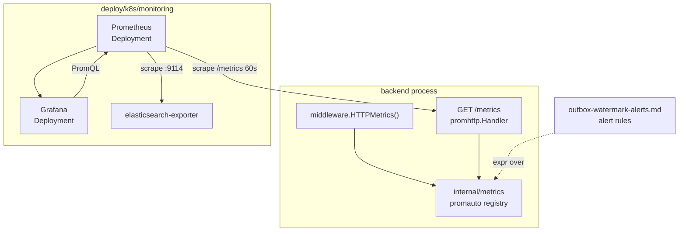
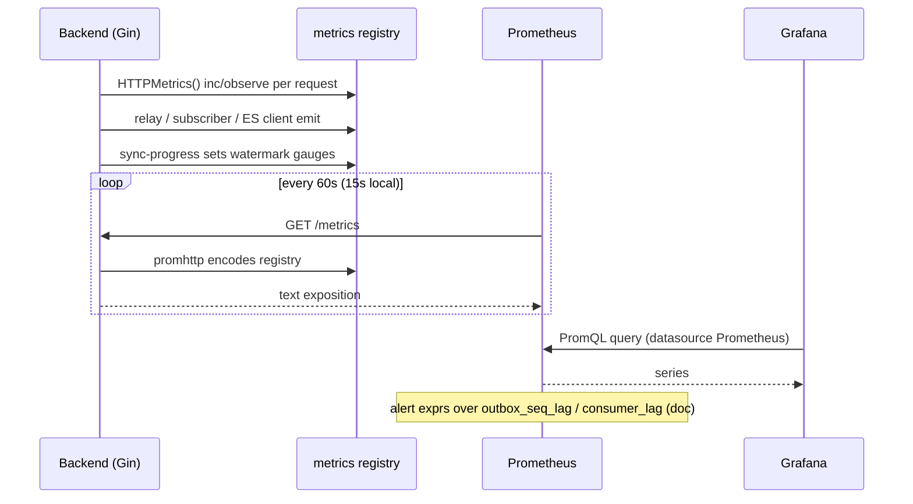
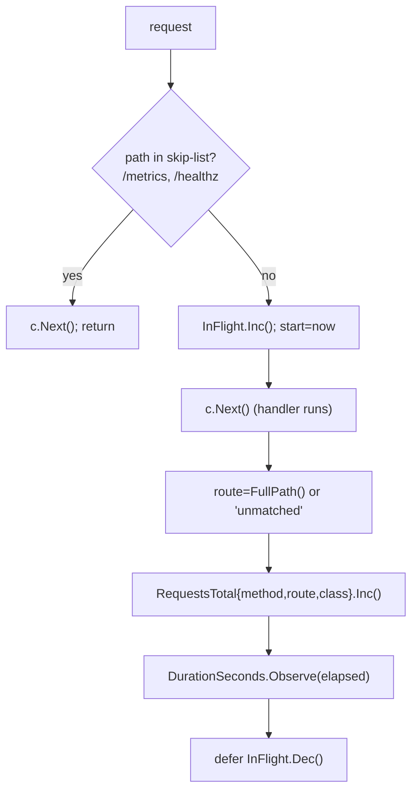
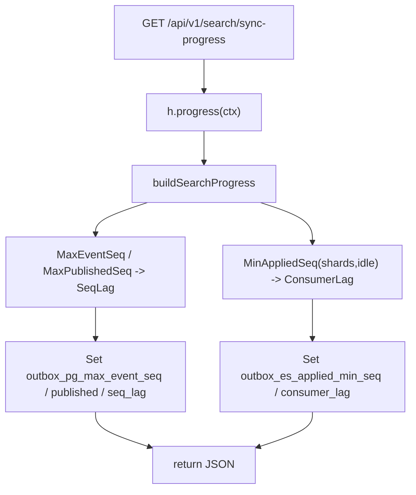
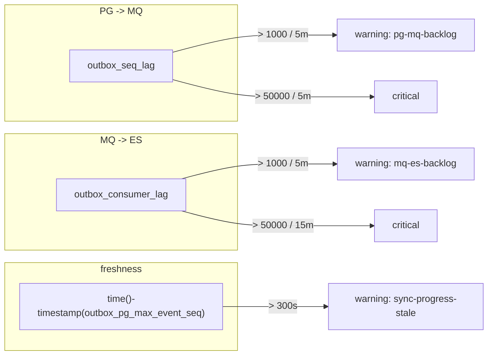
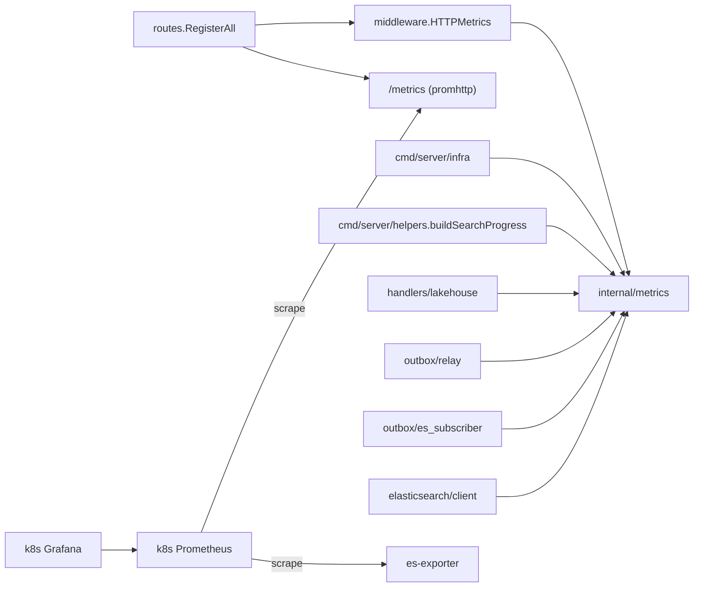

# Monitoring

<cite>
**Referenced Files in This Document**

- [backend/internal/metrics/backend.go](file://backend/internal/metrics/backend.go)
- [backend/internal/middleware/metrics.go](file://backend/internal/middleware/metrics.go)
- [backend/routes/routes.go](file://backend/routes/routes.go)
- [backend/cmd/server/infra.go](file://backend/cmd/server/infra.go)
- [backend/cmd/server/helpers.go](file://backend/cmd/server/helpers.go)
- [backend/internal/handlers/search/handler.go](file://backend/internal/handlers/search/handler.go)
- [backend/internal/handlers/lakehouse/handler.go](file://backend/internal/handlers/lakehouse/handler.go)
- [backend/internal/outbox/relay.go](file://backend/internal/outbox/relay.go)
- [backend/internal/outbox/es_subscriber.go](file://backend/internal/outbox/es_subscriber.go)
- [backend/internal/elasticsearch/client.go](file://backend/internal/elasticsearch/client.go)
- [deploy/k8s/monitoring/prometheus-configmap.yaml](file://deploy/k8s/monitoring/prometheus-configmap.yaml)
- [deploy/k8s/monitoring/prometheus-deployment.yaml](file://deploy/k8s/monitoring/prometheus-deployment.yaml)
- [deploy/k8s/monitoring/prometheus-service.yaml](file://deploy/k8s/monitoring/prometheus-service.yaml)
- [deploy/k8s/monitoring/elasticsearch-exporter.yaml](file://deploy/k8s/monitoring/elasticsearch-exporter.yaml)
- [deploy/k8s/monitoring/grafana-deployment.yaml](file://deploy/k8s/monitoring/grafana-deployment.yaml)
- [deploy/k8s/monitoring/grafana-datasource-configmap.yaml](file://deploy/k8s/monitoring/grafana-datasource-configmap.yaml)
- [deploy/k8s/monitoring/grafana-dashboard-provider-configmap.yaml](file://deploy/k8s/monitoring/grafana-dashboard-provider-configmap.yaml)
- [deploy/k8s/monitoring/kustomization.yaml](file://deploy/k8s/monitoring/kustomization.yaml)
- [deploy/k8s/monitoring/backend-policy.yaml](file://deploy/k8s/monitoring/backend-policy.yaml)
- [deploy/k8s/monitoring/healthcheck-policy.yaml](file://deploy/k8s/monitoring/healthcheck-policy.yaml)
- [deploy/k8s/monitoring/reference-grant.yaml](file://deploy/k8s/monitoring/reference-grant.yaml)
- [deploy/local/monitoring/prometheus/prometheus.yml](file://deploy/local/monitoring/prometheus/prometheus.yml)
- [deploy/local/docker-compose.yml](file://deploy/local/docker-compose.yml)
- [docs/review/outbox-watermark-alerts.md](file://docs/review/outbox-watermark-alerts.md)
</cite>

## Table of Contents
1. [Introduction](#introduction)
2. [Project Structure](#project-structure)
3. [Core Components](#core-components)
4. [Architecture Overview](#architecture-overview)
5. [Detailed Component Analysis](#detailed-component-analysis)
6. [Dependency Analysis](#dependency-analysis)
7. [Performance Considerations](#performance-considerations)
8. [Troubleshooting Guide](#troubleshooting-guide)
9. [Conclusion](#conclusion)
10. [Appendices](#appendices)

## Introduction

The cyber-databrew backend is instrumented as a first-class Prometheus
target. A single in-process metrics registry (the `internal/metrics`
package) declares every counter, histogram and gauge the service exports;
an HTTP middleware records request-level signals on the hot path; and a
plain `/metrics` endpoint exposes the registry in the Prometheus text
format. On top of that registry sit two scrape stacks — a Kubernetes
monitoring overlay (`deploy/k8s/monitoring`) for the dev cluster and a
Docker Compose stack (`deploy/local`) for laptops — plus Grafana for
dashboards and a documented (but intentionally un-enforced) set of alert
rules centred on the **PG → MQ → ES** and **PG → Iceberg (Bronze)**
data-sync watermarks.

This page is the reference for that monitoring surface: how metrics are
declared and emitted, how `/metrics` is wired into the Gin router, how
Prometheus and Grafana are deployed and scrape the backend, and which
alerts the outbox/lakehouse watermarks are designed to drive.

The audience is whoever is on call for the data pipeline or who needs to
add a new metric or dashboard panel.

**Section sources**
- [backend/internal/metrics/backend.go](file://backend/internal/metrics/backend.go#L1-L304)
- [backend/routes/routes.go](file://backend/routes/routes.go#L74-L100)
- [docs/review/outbox-watermark-alerts.md](file://docs/review/outbox-watermark-alerts.md#L1-L52)

## Project Structure

Monitoring spans application code (metric declaration and emission) and
deployment manifests (scrape config and dashboards). The relevant files:

- **`backend/internal/metrics/backend.go`** — the single source of truth
  for every exported metric. All collectors are package-level `var`s
  registered through `promauto`, so importing the package is enough to
  register them with the default Prometheus registry.
- **`backend/internal/middleware/metrics.go`** — the `HTTPMetrics()` Gin
  middleware that records request count, latency and in-flight gauge per
  route.
- **`backend/routes/routes.go`** — installs the middleware and mounts
  `GET /metrics` (and the `/healthz`, `/readyz`, `/version` infra
  endpoints) before any auth or circuit-breaker gate.
- **`backend/cmd/server/infra.go`** — sets the `backend_dependency_up`
  gauge as Postgres, lakehouse and Elasticsearch come up at boot.
- **`backend/cmd/server/helpers.go`** — `buildSearchProgress` refreshes
  the five outbox watermark gauges whenever sync-progress is computed.
- **`backend/internal/handlers/lakehouse/handler.go`** — refreshes the
  three Bronze watermark gauges on the lakehouse sync-progress path.
- **`backend/internal/outbox/*.go`** and
  **`backend/internal/elasticsearch/client.go`** — emit the relay,
  subscriber and Elasticsearch-client metrics.
- **`deploy/k8s/monitoring/`** — the Kustomize overlay for the dev
  cluster: Prometheus, Grafana, the Elasticsearch exporter, gateway
  policies and the provisioned dashboards.
- **`deploy/local/`** — a Docker Compose stack with the same Prometheus +
  Grafana pair plus blackbox / postgres / es exporters for local runs.
- **`docs/review/outbox-watermark-alerts.md`** — the alert-threshold
  design doc for the watermark gauges.

**Diagram sources**
- [backend/routes/routes.go](file://backend/routes/routes.go#L74-L100)
- [deploy/k8s/monitoring/prometheus-configmap.yaml](file://deploy/k8s/monitoring/prometheus-configmap.yaml#L14-L31)
- [deploy/k8s/monitoring/kustomization.yaml](file://deploy/k8s/monitoring/kustomization.yaml#L1-L25)

**Section sources**
- [backend/internal/metrics/backend.go](file://backend/internal/metrics/backend.go#L1-L40)
- [deploy/k8s/monitoring/kustomization.yaml](file://deploy/k8s/monitoring/kustomization.yaml#L1-L25)
- [deploy/local/docker-compose.yml](file://deploy/local/docker-compose.yml#L383-L453)

## Core Components

### The metrics registry

`internal/metrics/backend.go` declares every collector as a package-level
`var` initialised with `promauto.New*`, which both constructs the
collector and registers it with the global default registry. There is no
manual registry wiring; importing the package anywhere in the backend is
sufficient. The collectors fall into families:

- **HTTP**: `backend_http_requests_total` (counter, by `method`/`route`/
  `status_class`), `backend_http_request_duration_seconds` (histogram,
  default buckets) and `backend_http_in_flight_requests` (gauge).
- **Dependency health**: `backend_dependency_up` (gauge vec, by
  `dependency`).
- **Elasticsearch client**: `backend_elasticsearch_requests_total` and
  `backend_elasticsearch_request_duration_seconds` (by `operation`/
  `outcome`).
- **Eval write path**: `backend_eval_write_*`, `backend_eval_metric_*`.
- **Lakehouse sync check**: `backend_lakehouse_sync_*` gauges.
- **Outbox relay / subscriber**: `outbox_relay_*`,
  `outbox_subscriber_*`, `outbox_internal_bus_depth`, `outbox_pending_events`,
  `outbox_event_lag_seconds`.
- **Outbox watermarks** (PG → MQ → ES): `outbox_pg_max_event_seq`,
  `outbox_published_max_seq`, `outbox_seq_lag`,
  `outbox_es_applied_min_seq`, `outbox_consumer_lag`.
- **Lakehouse Bronze watermarks** (PG → Iceberg):
  `lakehouse_bronze_max_event_seq`, `lakehouse_bronze_lag_events`,
  `lakehouse_bronze_last_ingested_unix_seconds`.
- **Query run**: `backend_query_run_*`.

**Section sources**
- [backend/internal/metrics/backend.go](file://backend/internal/metrics/backend.go#L8-L304)

### The HTTP metrics middleware

`HTTPMetrics()` returns a Gin handler that wraps every request. It skips
`/metrics` and `/healthz` (so the scrape itself and liveness probes do
not inflate counts), increments the in-flight gauge, times the request
across `c.Next()`, and on completion records the request counter and
latency histogram labelled by HTTP method, the matched route template
(`c.FullPath()`, or `"unmatched"` when no route matched) and a status
class bucket (`2xx`, `4xx`, `5xx`, …, or `unknown` for a non-positive
status). Using the route template rather than the raw path keeps label
cardinality bounded.

**Section sources**
- [backend/internal/middleware/metrics.go](file://backend/internal/middleware/metrics.go#L12-L51)

### The `/metrics` endpoint

`routes.go` mounts the standard Prometheus HTTP handler at `GET /metrics`
via `gin.WrapH(promhttp.Handler())`. It is registered alongside the other
infrastructure endpoints (`/healthz`, `/readyz`, `/version`) and, by
design, **before** the circuit breaker is attached — the comment notes
that infra endpoints must stay reachable when the breaker is open. The
`HTTPMetrics()` middleware is installed early in the global middleware
chain (after `RequestID`, before `RequestGuard`/logging).

**Section sources**
- [backend/routes/routes.go](file://backend/routes/routes.go#L74-L101)

### The dev-cluster monitoring overlay

`deploy/k8s/monitoring` is a Kustomize package that deploys Prometheus, a
community Elasticsearch exporter, and Grafana with provisioned datasource,
dashboard provider and six dashboard JSON files, plus GKE gateway policies
(disable IAP and define LB health checks) and a `ReferenceGrant` letting
the developer gateway route to the Grafana/Prometheus Services.

**Section sources**
- [deploy/k8s/monitoring/kustomization.yaml](file://deploy/k8s/monitoring/kustomization.yaml#L1-L25)
- [deploy/k8s/monitoring/prometheus-deployment.yaml](file://deploy/k8s/monitoring/prometheus-deployment.yaml#L20-L43)
- [deploy/k8s/monitoring/grafana-deployment.yaml](file://deploy/k8s/monitoring/grafana-deployment.yaml#L20-L57)

## Architecture Overview

Metrics flow in three stages: emission (in-process), scrape (Prometheus
pull), and visualisation/alerting (Grafana and alert rules over PromQL).
On the dev cluster the backend Service is scraped at `/metrics` every 60s,
the Elasticsearch exporter at `:9114`, and Prometheus self-scrapes through
its sub-path. Grafana reads from Prometheus through an in-cluster
ClusterIP Service.

**Diagram sources**
- [backend/internal/middleware/metrics.go](file://backend/internal/middleware/metrics.go#L12-L35)
- [backend/cmd/server/helpers.go](file://backend/cmd/server/helpers.go#L134-L139)
- [deploy/k8s/monitoring/prometheus-configmap.yaml](file://deploy/k8s/monitoring/prometheus-configmap.yaml#L9-L31)
- [deploy/k8s/monitoring/grafana-datasource-configmap.yaml](file://deploy/k8s/monitoring/grafana-datasource-configmap.yaml#L9-L18)

## Detailed Component Analysis

### HTTP request instrumentation

The hot-path instrumentation is deliberately small. The middleware does
not allocate per request beyond the label-value lookups; the in-flight
gauge is incremented before and decremented in a `defer` so it is
correct even if a downstream handler panics. The skip-list keeps probe
and scrape traffic out of the request counters.

**Diagram sources**
- [backend/internal/middleware/metrics.go](file://backend/internal/middleware/metrics.go#L12-L51)

**Section sources**
- [backend/internal/middleware/metrics.go](file://backend/internal/middleware/metrics.go#L12-L51)
- [backend/internal/metrics/backend.go](file://backend/internal/metrics/backend.go#L8-L31)

### Dependency-up gauge

At startup `infra.go` pre-seeds `backend_dependency_up` to `0` for
`postgres`, `lakehouse` and `elasticsearch`, then flips each to `1` as the
corresponding client connects successfully. This gives a clean
boot-readiness signal in dashboards: a dependency that never reaches `1`
is one that failed to initialise (Elasticsearch in particular is optional,
so it can legitimately stay `0`).

**Section sources**
- [backend/cmd/server/infra.go](file://backend/cmd/server/infra.go#L44-L143)

### Outbox watermark gauges

The five PG → MQ → ES watermark gauges are not push-driven from the relay;
they are recomputed lazily whenever the search sync-progress is built.
`buildSearchProgress` reads `MAX(event_seq)` and `MAX(event_seq) WHERE
publish_state='published'` from the asset-events repo, computes `SeqLag`,
then reads the minimum applied checkpoint across the ES sync-checkpoint
shards (with idle-shard advance) to derive `ConsumerLag`. The last five
lines of the function `Set()` the gauges from the computed
`SyncProgress`. The handler `SyncProgress` (mounted at
`GET /api/v1/search/sync-progress`) simply invokes the provider and
returns the JSON, so any caller of that endpoint also refreshes the gauges.

The design doc stresses the refresh cadence: gauges only re-compute when
`/sync-progress` is invoked, so prod relies on the frontend dashboard
poll plus a Cloud Monitoring uptime check / cron hitting the endpoint
every ~60s to keep scrape freshness under a minute. A frozen gauge is
itself a documented alert condition (`outbox-sync-progress-stale`).

**Diagram sources**
- [backend/internal/handlers/search/handler.go](file://backend/internal/handlers/search/handler.go#L231-L247)
- [backend/cmd/server/helpers.go](file://backend/cmd/server/helpers.go#L78-L139)

**Section sources**
- [backend/cmd/server/helpers.go](file://backend/cmd/server/helpers.go#L48-L140)
- [backend/internal/handlers/search/handler.go](file://backend/internal/handlers/search/handler.go#L231-L247)
- [docs/review/outbox-watermark-alerts.md](file://docs/review/outbox-watermark-alerts.md#L12-L26)

### Lakehouse Bronze watermark gauges

The PG → Iceberg companion uses the same lazy-refresh pattern on the
lakehouse handler's sync-progress path: `lakehouse_bronze_max_event_seq`,
`lakehouse_bronze_lag_events` (derived from `outbox_published_max_seq`)
and `lakehouse_bronze_last_ingested_unix_seconds` are `Set()` after the
Bronze progress is computed; the last-ingested gauge is only set when a
non-zero ingest timestamp exists.

**Section sources**
- [backend/internal/handlers/lakehouse/handler.go](file://backend/internal/handlers/lakehouse/handler.go#L255-L261)
- [docs/review/outbox-watermark-alerts.md](file://docs/review/outbox-watermark-alerts.md#L107-L130)

### Relay, subscriber and Elasticsearch-client metrics

The outbox relay emits flush duration, configured parallel keys, a
published counter (by ordering-key kind) and event-lag-seconds; the ES
subscriber emits batch size, per-op handle duration and an ES-error
counter (by `conflict`/`other`). The Elasticsearch client wraps each
operation (`search`, `scroll_search`, `scroll_next`, `bulk_index`,
`delete_document`, `ping`, …) with a requests counter and latency
histogram labelled by `operation` and `outcome`.

**Section sources**
- [backend/internal/outbox/relay.go](file://backend/internal/outbox/relay.go#L120-L224)
- [backend/internal/outbox/es_subscriber.go](file://backend/internal/outbox/es_subscriber.go#L117-L147)
- [backend/internal/elasticsearch/client.go](file://backend/internal/elasticsearch/client.go#L720-L1094)

### Prometheus scrape configuration

On the dev cluster Prometheus runs `prom/prometheus:v2.53.0`, served under
the sub-path `/ops/prometheus` (`--web.external-url` / `--web.route-prefix`)
so it can sit behind the developer gateway. Its config defines three
scrape jobs at a 60s global interval: `prometheus` self-scrape (under its
sub-path metrics path), `backend` against the in-cluster backend Service
at `/metrics`, and `elasticsearch` against the exporter Service at
`:9114`. Storage is an `emptyDir`, so dev metrics are ephemeral.

The local Compose Prometheus uses a 15s interval and adds blackbox-probe
jobs (iceberg-rest TCP, frontend HTTP, pgbouncer TCP) plus a
postgres-exporter job, scraping the host-bound backend at
`host.docker.internal:8080/metrics`.

**Section sources**
- [deploy/k8s/monitoring/prometheus-configmap.yaml](file://deploy/k8s/monitoring/prometheus-configmap.yaml#L9-L31)
- [deploy/k8s/monitoring/prometheus-deployment.yaml](file://deploy/k8s/monitoring/prometheus-deployment.yaml#L20-L43)
- [deploy/local/monitoring/prometheus/prometheus.yml](file://deploy/local/monitoring/prometheus/prometheus.yml#L1-L67)

### Grafana provisioning and the Elasticsearch exporter

Grafana runs `grafana/grafana:11.2.0`, served from the `/ops/grafana/`
sub-path, with the Prometheus datasource (`uid: prometheus`, pointing at
the in-cluster Prometheus Service), a file-based dashboard provider, and
six dashboards generated into a ConfigMap by the kustomization
(`backend-`, `lakehouse-`, `local-`, `outbox-`, `search-observability`
and `elasticsearch-cluster`). The Elasticsearch exporter
(`prometheuscommunity/elasticsearch-exporter:v1.9.0`) scrapes the
in-cluster Elasticsearch with `--es.all --es.indices --es.shards` and
optional credentials from `cyber-databrew-secrets`.

**Section sources**
- [deploy/k8s/monitoring/grafana-deployment.yaml](file://deploy/k8s/monitoring/grafana-deployment.yaml#L20-L57)
- [deploy/k8s/monitoring/grafana-datasource-configmap.yaml](file://deploy/k8s/monitoring/grafana-datasource-configmap.yaml#L9-L18)
- [deploy/k8s/monitoring/grafana-dashboard-provider-configmap.yaml](file://deploy/k8s/monitoring/grafana-dashboard-provider-configmap.yaml#L9-L19)
- [deploy/k8s/monitoring/kustomization.yaml](file://deploy/k8s/monitoring/kustomization.yaml#L17-L25)
- [deploy/k8s/monitoring/elasticsearch-exporter.yaml](file://deploy/k8s/monitoring/elasticsearch-exporter.yaml#L40-L84)

### Alerting (outbox & lakehouse watermarks)

Alerting is documented in `docs/review/outbox-watermark-alerts.md` as
recommended, not-yet-enforced rules. They sit over the watermark gauges:
`outbox_seq_lag` drives PG→MQ backlog alerts, `outbox_consumer_lag` drives
MQ→ES backlog alerts, gauge-staleness catches a frozen `/sync-progress`,
and the Bronze gauges drive PG→Iceberg staleness/backlog alerts. The doc
includes a Cloud Monitoring `rules.yaml` fragment and explicitly lists
non-alert conditions (e.g. `outbox_es_applied_min_seq == 0` during cold
start). See the [Appendices](#appendices) for the full table.

**Diagram sources**
- [docs/review/outbox-watermark-alerts.md](file://docs/review/outbox-watermark-alerts.md#L33-L46)

**Section sources**
- [docs/review/outbox-watermark-alerts.md](file://docs/review/outbox-watermark-alerts.md#L27-L105)

## Dependency Analysis

The monitoring surface depends on a small, well-bounded set of pieces:

- The application side depends only on the `prometheus/client_golang`
  library (`prometheus`, `promauto`, `promhttp`). The registry is the
  default global registry; importing `internal/metrics` is the only
  coupling required to register collectors.
- The infrastructure side (Prometheus, Grafana, exporter) depends on the
  backend Service name/port and on the gateway policies/`ReferenceGrant`
  to be reachable through the dev gateway. Nothing in the backend depends
  back on Prometheus — if Prometheus is down, the backend is unaffected
  and metrics simply accumulate in memory until the next scrape.

**Section sources**
- [backend/routes/routes.go](file://backend/routes/routes.go#L74-L100)
- [backend/internal/metrics/backend.go](file://backend/internal/metrics/backend.go#L1-L7)
- [deploy/k8s/monitoring/backend-policy.yaml](file://deploy/k8s/monitoring/backend-policy.yaml#L1-L25)
- [deploy/k8s/monitoring/reference-grant.yaml](file://deploy/k8s/monitoring/reference-grant.yaml#L1-L16)

## Performance Considerations

- **Label cardinality.** HTTP metrics use the route *template*
  (`c.FullPath()`) and a status *class* (`2xx`/`4xx`/`5xx`) rather than
  the raw path or exact status code, which keeps the series count bounded
  by `routes × methods × classes`. Unmatched requests collapse to a
  single `"unmatched"` route series.
- **Hot-path cost.** The middleware does two map lookups, one
  `Inc()`/`Observe()` pair and a gauge inc/dec per request; histograms use
  Prometheus default buckets. `/metrics` and `/healthz` are skipped to
  avoid self-inflation.
- **Watermark refresh is lazy and query-bound.** The five outbox gauges
  and three Bronze gauges only refresh on a sync-progress call, and that
  call runs two `MAX` queries plus a shard-min query against Postgres. The
  alert doc warns that frequent polling adds Postgres connection-pool
  pressure; the recommended cadence is ~60s, not per-request. A stale
  gauge is expected if nothing hits the endpoint.
- **Scrape interval.** Dev cluster scrapes at 60s, local at 15s; rate-based
  PromQL must account for the coarser dev interval. Prometheus dev storage
  is an `emptyDir`, so restarting the pod loses history.
- **Exporter overhead.** The Elasticsearch exporter requests `25m` CPU /
  `48Mi` memory and uses a 15s ES timeout; `--es.shards`/`--es.all` can be
  expensive on large clusters.

**Section sources**
- [backend/internal/middleware/metrics.go](file://backend/internal/middleware/metrics.go#L25-L51)
- [backend/cmd/server/helpers.go](file://backend/cmd/server/helpers.go#L78-L138)
- [deploy/k8s/monitoring/prometheus-configmap.yaml](file://deploy/k8s/monitoring/prometheus-configmap.yaml#L10-L31)
- [deploy/k8s/monitoring/elasticsearch-exporter.yaml](file://deploy/k8s/monitoring/elasticsearch-exporter.yaml#L55-L72)

## Troubleshooting Guide

- **`/metrics` returns 404 or is unreachable.** Confirm `GET /metrics` is
  mounted (it is registered before auth/circuit-breaker, so a 401/503 there
  is a misconfiguration). On the cluster, check the backend Service DNS in
  the scrape config and the gateway `ReferenceGrant`/backend policies.
- **Backend target shows `down` in Prometheus.** Verify the Service name
  `cyber-databrew-backend...svc.cluster.local:80` resolves and that the
  pod is serving `/metrics`; locally verify the backend is bound to
  `:8080` reachable as `host.docker.internal`.
- **Watermark gauges are flat / `outbox_seq_lag` never moves.** The gauges
  only refresh when `/api/v1/search/sync-progress` is called. If no
  poller/uptime check is hitting it, the gauges are frozen — this is the
  `outbox-sync-progress-stale` condition. Add or restore the 60s poll.
- **`outbox_es_applied_min_seq == 0`.** Expected during cold start until
  every checkpoint shard reports; the doc explicitly says **not** to alert
  on this.
- **`backend_dependency_up{dependency="elasticsearch"} == 0`.** Legitimate
  when Elasticsearch is not configured (it is optional); only investigate
  if ES is expected to be up.
- **Grafana shows no data.** Check the provisioned datasource points at
  `http://cyber-databrew-prometheus:9090` and that Grafana is served from
  the `/ops/grafana/` sub-path so panel/datasource proxying works behind
  the gateway.
- **Bronze staleness alert firing.** Per the runbook stubs, list the
  `bronze-incremental` Cloud Run Job executions; if Postgres is empty or
  wedged, check `/api/v1/search/sync-progress` (the upstream) first.

**Section sources**
- [backend/routes/routes.go](file://backend/routes/routes.go#L84-L100)
- [backend/cmd/server/helpers.go](file://backend/cmd/server/helpers.go#L134-L138)
- [deploy/k8s/monitoring/grafana-datasource-configmap.yaml](file://deploy/k8s/monitoring/grafana-datasource-configmap.yaml#L9-L18)
- [docs/review/outbox-watermark-alerts.md](file://docs/review/outbox-watermark-alerts.md#L48-L105)

## Conclusion

Monitoring in cyber-databrew is built around one in-process Prometheus
registry, a lightweight HTTP middleware, and a plain `/metrics` endpoint,
scraped by a Prometheus + Grafana stack on both the dev cluster and local
Compose. The most operationally important signals are the outbox and
Bronze **watermark gauges**, which are lazily refreshed by the
sync-progress endpoints and underpin the documented backlog/staleness
alerts. The key invariant for on-call is that those gauges must be polled
on a fixed cadence — a frozen gauge blinds every other watermark alert.

## Appendices

### Appendix A — Key exported metrics

| Metric | Type | Labels | Meaning |
|---|---|---|---|
| `backend_http_requests_total` | counter | method, route, status_class | HTTP requests handled |
| `backend_http_request_duration_seconds` | histogram | method, route, status_class | Request latency |
| `backend_http_in_flight_requests` | gauge | — | Concurrent in-flight requests |
| `backend_dependency_up` | gauge | dependency | 1=up, 0=down per dependency |
| `backend_elasticsearch_requests_total` | counter | operation, outcome | ES client calls |
| `backend_elasticsearch_request_duration_seconds` | histogram | operation, outcome | ES client latency |
| `outbox_pending_events` | gauge | transport | Pending outbox events |
| `outbox_relay_published_total` | counter | ordering_key_kind | Events published by relay |
| `outbox_relay_flush_duration_seconds` | histogram | — | Relay flush cycle time |
| `outbox_subscriber_es_errors_total` | counter | kind (conflict/other) | ES write errors in subscriber |
| `outbox_event_lag_seconds` | histogram | — | Create→publish lag |
| `outbox_pg_max_event_seq` | gauge | — | MAX(event_seq) (PG high-water) |
| `outbox_published_max_seq` | gauge | — | MAX published event_seq |
| `outbox_seq_lag` | gauge | — | pg_max − published (PG→MQ backlog) |
| `outbox_es_applied_min_seq` | gauge | — | MIN applied checkpoint across shards |
| `outbox_consumer_lag` | gauge | — | published − es_applied (MQ→ES backlog) |
| `lakehouse_bronze_max_event_seq` | gauge | — | Bronze high-water mark |
| `lakehouse_bronze_lag_events` | gauge | — | published − bronze_max |
| `lakehouse_bronze_last_ingested_unix_seconds` | gauge | — | MAX(_ingested_at) epoch |
| `backend_query_run_requests_total` | counter | outcome | /queries/run requests |

**Section sources**
- [backend/internal/metrics/backend.go](file://backend/internal/metrics/backend.go#L8-L304)

### Appendix B — Recommended alert thresholds (from the design doc)

| Alert | Condition | Severity |
|---|---|---|
| `outbox-pg-mq-backlog` | `outbox_seq_lag > 1000` for 5m | warning |
| `outbox-pg-mq-backlog-critical` | `outbox_seq_lag > 50000` for 5m | critical |
| `outbox-mq-es-backlog` | `outbox_consumer_lag > 1000` for 5m | warning |
| `outbox-mq-es-backlog-critical` | `outbox_consumer_lag > 50000` for 15m | critical |
| `outbox-sync-progress-stale` | `time() - timestamp(outbox_pg_max_event_seq) > 300` | warning |
| `outbox-no-events-flowing` | `rate(outbox_pg_max_event_seq[15m]) == 0` (prod) | info |
| `lakehouse-bronze-stale` | `time() - lakehouse_bronze_last_ingested_unix_seconds > 600` for 5m | warning |
| `lakehouse-bronze-stale-critical` | same `> 1800` for 5m | critical |
| `lakehouse-bronze-backlog` | `lakehouse_bronze_lag_events > 5000` for 15m | warning |
| `lakehouse-bronze-backlog-critical` | `lakehouse_bronze_lag_events > 50000` for 15m | critical |

These are recommendations, not enforced rules; see the doc for rationale
and the Cloud Monitoring `rules.yaml` fragments.

**Section sources**
- [docs/review/outbox-watermark-alerts.md](file://docs/review/outbox-watermark-alerts.md#L33-L46)
- [docs/review/outbox-watermark-alerts.md](file://docs/review/outbox-watermark-alerts.md#L122-L167)

### Appendix C — Scrape jobs and endpoints

| Job (dev cluster) | Target | Path | Interval |
|---|---|---|---|
| `prometheus` | `localhost:9090` | `/ops/prometheus/metrics` | 60s |
| `backend` | `cyber-databrew-backend…svc:80` | `/metrics` | 60s |
| `elasticsearch` | `…elasticsearch-exporter…svc:9114` | `/metrics` | 60s |

Local Compose adds `postgres-exporter` (`:9187`), `elasticsearch-exporter`
(`:9114`) and blackbox probe jobs (iceberg-rest TCP, frontend HTTP,
pgbouncer TCP), scraping the backend at `host.docker.internal:8080`.

**Section sources**
- [deploy/k8s/monitoring/prometheus-configmap.yaml](file://deploy/k8s/monitoring/prometheus-configmap.yaml#L14-L31)
- [deploy/k8s/monitoring/prometheus-service.yaml](file://deploy/k8s/monitoring/prometheus-service.yaml#L8-L16)
- [deploy/local/monitoring/prometheus/prometheus.yml](file://deploy/local/monitoring/prometheus/prometheus.yml#L5-L67)
