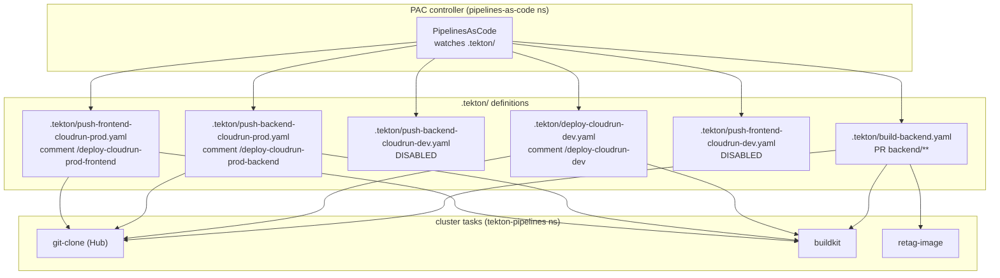
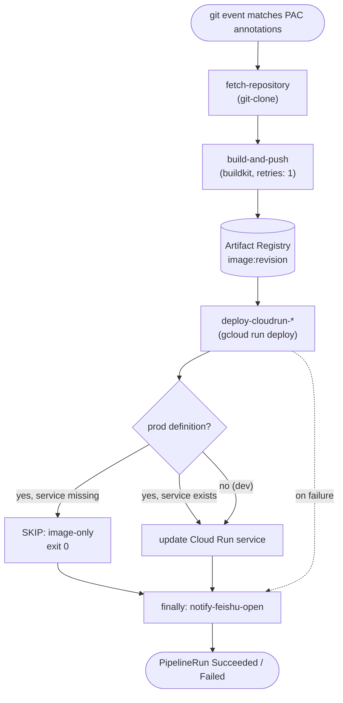
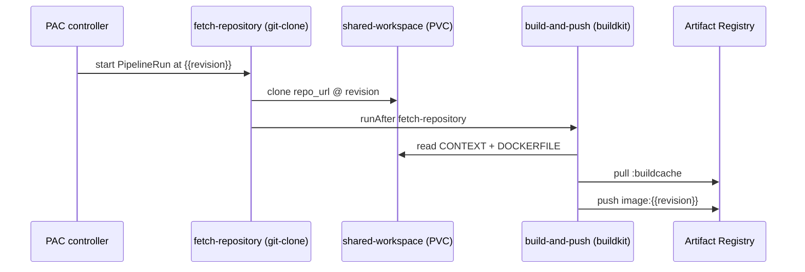
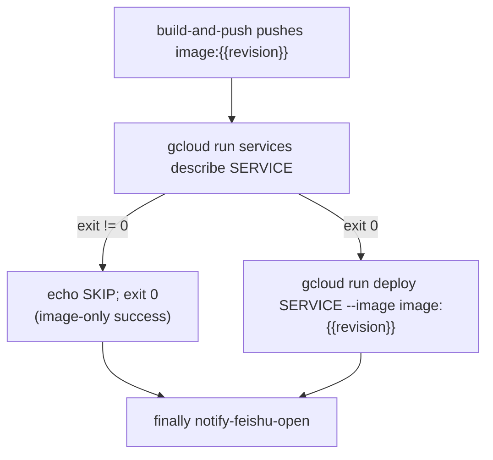
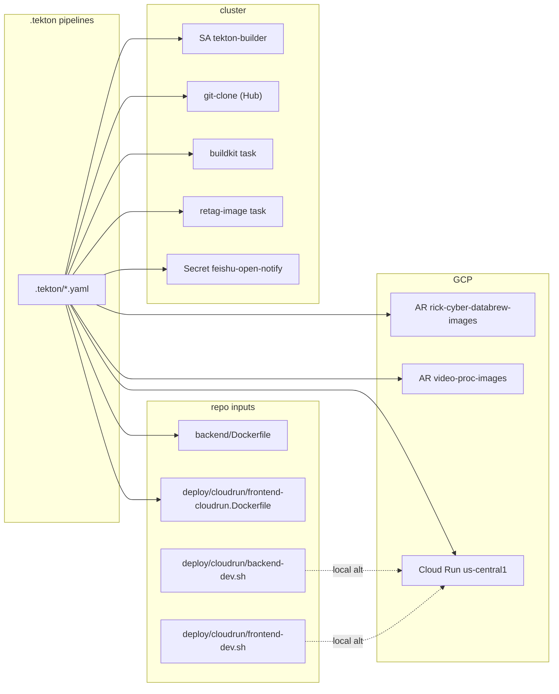

# Tekton CI/CD

<cite>
**Referenced Files in This Document**

- [.tekton/README.md](file://.tekton/README.md)
- [.tekton/build-backend.yaml](file://.tekton/build-backend.yaml)
- [.tekton/deploy-cloudrun-dev.yaml](file://.tekton/deploy-cloudrun-dev.yaml)
- [.tekton/push-backend-cloudrun-dev.yaml](file://.tekton/push-backend-cloudrun-dev.yaml)
- [.tekton/push-backend-cloudrun-prod.yaml](file://.tekton/push-backend-cloudrun-prod.yaml)
- [.tekton/push-frontend-cloudrun-dev.yaml](file://.tekton/push-frontend-cloudrun-dev.yaml)
- [.tekton/push-frontend-cloudrun-prod.yaml](file://.tekton/push-frontend-cloudrun-prod.yaml)
</cite>

## Table of Contents
1. [Introduction](#introduction)
2. [Project Structure](#project-structure)
3. [Core Components](#core-components)
4. [Architecture Overview](#architecture-overview)
5. [Detailed Component Analysis](#detailed-component-analysis)
6. [Dependency Analysis](#dependency-analysis)
7. [Performance Considerations](#performance-considerations)
8. [Troubleshooting Guide](#troubleshooting-guide)
9. [Conclusion](#conclusion)
10. [Appendices](#appendices)

## Introduction

The `.tekton/` directory holds the **Pipelines-as-Code (PAC)** definitions that
drive continuous integration and deployment for `cyber-databrew`. The PAC
controller runs in the `pipelines-as-code` namespace of the cluster, watches
this directory through the repository's GitHub App installation, and fires a
`PipelineRun` whenever a git event matches a definition's annotations. Each
definition is a self-contained `PipelineRun` object that inlines its
`pipelineSpec`, so there are no separately-installed `Pipeline` resources to
maintain — the file you commit *is* the pipeline.

The pattern mirrors the reusable-task layout from
[CyberOrigin2077/tekton-playground](https://github.com/CyberOrigin2077/tekton-playground).
All builds use a shared **BuildKit** task and all image retags use a shared
**retag-image** task, both resolved from the cluster `tekton-pipelines`
namespace. The source checkout uses the Tekton Hub **git-clone** task. The
target audience is anyone shipping a backend or frontend change: developers open
a PR, optionally comment a slash command to deploy to Cloud Run, and (for prod)
maintainers comment a prod-deploy command on a PR that targets `main`.

Two pipelines build container images into Google Artifact Registry, four build
*and* deploy to **Cloud Run**, and every Cloud Run pipeline ends with a
best-effort **Feishu (Lark)** completion notification in a `finally` block.

**Section sources**
- [.tekton/README.md](file://.tekton/README.md#L1-L33)
- [.tekton/build-backend.yaml](file://.tekton/build-backend.yaml#L1-L20)

## Project Structure

The directory is flat: one `README.md` plus seven `PipelineRun` YAML files. Each
YAML file is a single `apiVersion: tekton.dev/v1beta1`, `kind: PipelineRun`
object whose PAC behaviour is encoded entirely in `metadata.annotations`.

- `README.md` — the human-facing index: the pipeline matrix (current and TODO),
  prerequisites, the Feishu Secret setup, and the tag taxonomy.
- `build-backend.yaml` — PR-triggered backend image build (no deploy).
- `deploy-cloudrun-dev.yaml` — PR-comment-triggered build + deploy to the dev
  backend Cloud Run service.
- `push-backend-cloudrun-dev.yaml` — build + deploy dev backend; **disabled**
  template (`on-cel-expression: false`), kept as a re-enable reference.
- `push-backend-cloudrun-prod.yaml` — build + conditional deploy to the prod
  backend Cloud Run service, triggered by a PR comment on a `main`-targeted PR.
- `push-frontend-cloudrun-dev.yaml` — build + deploy dev frontend; **disabled**
  template (`on-cel-expression: false`).
- `push-frontend-cloudrun-prod.yaml` — build + conditional deploy to the prod
  frontend Cloud Run service, triggered by a PR comment on a `main`-targeted PR.



**Diagram sources**
- [.tekton/build-backend.yaml](file://.tekton/build-backend.yaml#L14-L120)
- [.tekton/deploy-cloudrun-dev.yaml](file://.tekton/deploy-cloudrun-dev.yaml#L22-L146)
- [.tekton/push-backend-cloudrun-prod.yaml](file://.tekton/push-backend-cloudrun-prod.yaml#L16-L146)
- [.tekton/push-frontend-cloudrun-prod.yaml](file://.tekton/push-frontend-cloudrun-prod.yaml#L13-L138)

**Section sources**
- [.tekton/README.md](file://.tekton/README.md#L8-L23)

## Core Components

Every pipeline in this directory is built from the same small set of building
blocks. Understanding these five concepts is enough to read any of the files.

#### PAC trigger annotations

PAC selects which `PipelineRun` to start by reading
`pipelinesascode.tekton.dev/*` annotations. The annotations actually used in
this repo are:

- `on-event` — e.g. `"[pull_request]"`, restricting the pipeline to PR events
  ([build-backend.yaml#L15](file://.tekton/build-backend.yaml#L15)).
- `on-target-branch` — e.g. `"[main]"` or `"[main, dev]"`
  ([deploy-cloudrun-dev.yaml#L25](file://.tekton/deploy-cloudrun-dev.yaml#L25)).
- `on-path-change` — glob list of paths that gate the trigger
  ([build-backend.yaml#L17](file://.tekton/build-backend.yaml#L17)).
- `on-comment` — a regex over PR comments, used for the manual deploys
  ([deploy-cloudrun-dev.yaml#L23](file://.tekton/deploy-cloudrun-dev.yaml#L23)).
- `on-cel-expression: "false"` — hard-disables a definition; PAC never starts it
  ([push-backend-cloudrun-dev.yaml#L22](file://.tekton/push-backend-cloudrun-dev.yaml#L22)).
- `target-namespace`, `task`, `max-keep-runs` — operational settings (always
  `tekton-pipelines`, `git-clone`, and a small run-retention cap).

#### Service account and pod scheduling

All runs execute as `serviceAccountName: tekton-builder`
([build-backend.yaml#L22](file://.tekton/build-backend.yaml#L22)) with a pod
`fsGroup: 65532`. The `build-and-push` task is pinned to the warm build pool via
a `nodeSelector` of `build-pool-tier: warm` and a matching `NoSchedule`
toleration ([build-backend.yaml#L28-L35](file://.tekton/build-backend.yaml#L28-L35)),
keeping image builds off general workload nodes.

#### Workspaces

Two workspaces are wired into every pipeline: a `shared-workspace` backed by a
1Gi `volumeClaimTemplate` (the cloned source, shared between fetch and build),
and `pac-gitauth`, a secret-backed workspace holding the per-run git credential
`{{git_auth_secret}}` ([build-backend.yaml#L47-L57](file://.tekton/build-backend.yaml#L47-L57)).

#### Cluster-resolved tasks

`git-clone` is referenced by name (Tekton Hub task pre-installed), while
`buildkit` and `retag-image` are pulled with the **cluster resolver** from the
`tekton-pipelines` namespace ([build-backend.yaml#L81-L89](file://.tekton/build-backend.yaml#L81-L89)).
This keeps the heavy task logic central and versioned outside the repo.

#### Inline deploy and notify steps

The Cloud Run deploy and the Feishu notify are **inline `taskSpec`** steps, not
cluster tasks. The deploy step runs `gcloud run deploy` from the
`google-cloud-cli:slim` image
([deploy-cloudrun-dev.yaml#L118-L146](file://.tekton/deploy-cloudrun-dev.yaml#L118-L146));
the notify step runs an embedded Python script from `python:3.12-alpine` in the
`finally` block ([deploy-cloudrun-dev.yaml#L147-L277](file://.tekton/deploy-cloudrun-dev.yaml#L147-L277)).

**Section sources**
- [.tekton/build-backend.yaml](file://.tekton/build-backend.yaml#L14-L120)
- [.tekton/deploy-cloudrun-dev.yaml](file://.tekton/deploy-cloudrun-dev.yaml#L22-L146)
- [.tekton/push-backend-cloudrun-dev.yaml](file://.tekton/push-backend-cloudrun-dev.yaml#L20-L25)

## Architecture Overview

The general shape of every pipeline is a linear chain — `fetch-repository` →
`build-and-push` → (optional) `deploy-cloudrun-*` — followed by a `finally`
notifier. `build-backend.yaml` is the exception: it appends a `tag-pr` step
instead of a deploy and has no notifier.

Stages flow as follows for a deploying pipeline:



**Diagram sources**
- [.tekton/deploy-cloudrun-dev.yaml](file://.tekton/deploy-cloudrun-dev.yaml#L74-L146)
- [.tekton/push-backend-cloudrun-prod.yaml](file://.tekton/push-backend-cloudrun-prod.yaml#L107-L146)

The build path is identical across pipelines: BuildKit reads a `DOCKERFILE` and
`CONTEXT`, tags the result `image:{{revision}}` (the commit SHA), and uses a
`:buildcache` image in the same repository as a registry cache for fast
incremental builds. The deploy path varies only in service name, port, and
`max-instances`. The prod pipelines wrap their deploy in a
`gcloud run services describe` guard so a missing service degrades to an
image-only success rather than a failure.

**Section sources**
- [.tekton/build-backend.yaml](file://.tekton/build-backend.yaml#L62-L120)
- [.tekton/push-backend-cloudrun-prod.yaml](file://.tekton/push-backend-cloudrun-prod.yaml#L107-L128)

## Detailed Component Analysis

### Pipeline matrix

The table below lists the **shipped** definitions in `.tekton/`, the actual
trigger encoded in their annotations, and what they do. (Several rows in the
README's matrix are aspirational TODOs — `build-frontend.yaml`,
`promote-*.yaml`, `apply-*-iac.yaml` — and are **not** present in the directory.)

| File | Trigger (from annotations) | Tasks | Outcome |
|---|---|---|---|
| `build-backend.yaml` | PR to `main`, paths `backend/**` or self | `fetch-repository`, `build-and-push`, `tag-pr` | Build backend image `:<sha>` and retag `:pr-<N>-<sha>`; no deploy |
| `deploy-cloudrun-dev.yaml` | PR comment `/deploy-cloudrun-dev` on PR → `main` or `dev`, paths gated | `fetch-repository`, `build-and-push`, `deploy-cloudrun-dev`, finally `notify-feishu-open` | Build backend image and deploy `cyber-databrew-backend-dev` |
| `push-backend-cloudrun-dev.yaml` | `on-cel-expression: false` (**disabled**) | `fetch-repository`, `build-and-push`, `deploy-cloudrun-dev`, finally `notify-feishu-open` | Template only; PAC never fires it |
| `push-backend-cloudrun-prod.yaml` | PR comment `/deploy-cloudrun-prod-backend` on PR → `main` | `fetch-repository`, `build-and-push`, `deploy-cloudrun-prod`, finally `notify-feishu-open` | Build backend image; deploy `cyber-databrew-backend-prod` if it exists, else image-only |
| `push-frontend-cloudrun-dev.yaml` | `on-cel-expression: false` (**disabled**) | `fetch-repository`, `build-and-push`, `deploy-cloudrun-dev`, finally `notify-feishu-open` | Template only; PAC never fires it |
| `push-frontend-cloudrun-prod.yaml` | PR comment `/deploy-cloudrun-prod-frontend` on PR → `main` | `fetch-repository`, `build-and-push`, `deploy-cloudrun-prod`, finally `notify-feishu-open` | Build frontend image; deploy `cyber-databrew-frontend-prod` if it exists, else image-only |

**Section sources**
- [.tekton/build-backend.yaml](file://.tekton/build-backend.yaml#L13-L20)
- [.tekton/deploy-cloudrun-dev.yaml](file://.tekton/deploy-cloudrun-dev.yaml#L20-L29)
- [.tekton/push-backend-cloudrun-dev.yaml](file://.tekton/push-backend-cloudrun-dev.yaml#L19-L25)
- [.tekton/push-backend-cloudrun-prod.yaml](file://.tekton/push-backend-cloudrun-prod.yaml#L14-L21)
- [.tekton/push-frontend-cloudrun-dev.yaml](file://.tekton/push-frontend-cloudrun-dev.yaml#L11-L17)
- [.tekton/push-frontend-cloudrun-prod.yaml](file://.tekton/push-frontend-cloudrun-prod.yaml#L11-L18)

### Tasks → purpose

The same task vocabulary recurs across the pipelines. The following table maps
each pipeline task to its purpose and source.

| Task | Kind | Purpose |
|---|---|---|
| `fetch-repository` | `taskRef: git-clone` (Hub) | Clone `{{repo_url}}` at `{{revision}}` into `shared-workspace`, authenticated via `pac-gitauth` |
| `build-and-push` | cluster `buildkit` task, `retries: 1` | Build the Dockerfile against its context and push `image:{{revision}}` to Artifact Registry, using a `:buildcache` registry cache |
| `tag-pr` | cluster `retag-image` task | (build-backend only) Retag `:<sha>` as `:pr-<pull_request_number>-<sha>` |
| `deploy-cloudrun-dev` | inline `taskSpec` (gcloud-cli) | `gcloud run deploy` to the dev Cloud Run service |
| `deploy-cloudrun-prod` | inline `taskSpec` (gcloud-cli) | Guarded `gcloud run deploy` to the prod service; SKIP image-only if the service is absent |
| `notify-feishu-open` | inline `taskSpec` in `finally` (python) | Best-effort Feishu completion message with aggregate status; SKIP exit 0 if the Secret is missing |

**Section sources**
- [.tekton/build-backend.yaml](file://.tekton/build-backend.yaml#L62-L120)
- [.tekton/push-backend-cloudrun-prod.yaml](file://.tekton/push-backend-cloudrun-prod.yaml#L66-L146)

### build-and-push (BuildKit)

The build task is the cost center of CI. It is scheduled onto the warm build
pool, requests `cpu: "2"` / `memory: 6Gi` for the build step and `10Gi`
ephemeral storage for the `buildkitd` sidecar
([build-backend.yaml#L36-L46](file://.tekton/build-backend.yaml#L36-L46)), and
runs with one retry. Its four parameters are:

- `IMAGE` — the fully-qualified target tag, always `…:{{revision}}`.
- `DOCKERFILE` — `backend/Dockerfile` for backend pipelines,
  `deploy/cloudrun/frontend-cloudrun.Dockerfile` for frontend.
- `CONTEXT` — `backend` for backend, `.` (repo root) for frontend.
- `CACHE_IMAGE` — the `:buildcache` tag used as a remote layer cache.

A key registry detail: the **backend** image lands in the
`rick-cyber-databrew-images` Artifact Registry repo
([build-backend.yaml#L95](file://.tekton/build-backend.yaml#L95)), while the
**frontend** image lands in `video-proc-images`
([push-frontend-cloudrun-dev.yaml#L95](file://.tekton/push-frontend-cloudrun-dev.yaml#L95)).
Both live under project `green-valley-442103`, region `us-central1`.



**Diagram sources**
- [.tekton/build-backend.yaml](file://.tekton/build-backend.yaml#L63-L101)

**Section sources**
- [.tekton/build-backend.yaml](file://.tekton/build-backend.yaml#L77-L101)
- [.tekton/push-frontend-cloudrun-dev.yaml](file://.tekton/push-frontend-cloudrun-dev.yaml#L77-L101)

### tag-pr (build-backend only)

`build-backend.yaml` is the only pipeline that promotes the freshly built image
with a second tag. After the build, `tag-pr` invokes the cluster `retag-image`
task with `SOURCE_IMAGE` of `…:{{revision}}` and a `TARGET_IMAGES` of
`…:pr-{{pull_request_number}}-{{revision}}`
([build-backend.yaml#L103-L119](file://.tekton/build-backend.yaml#L103-L119)).
This gives reviewers a stable, PR-scoped tag to pull without a deploy.

**Section sources**
- [.tekton/build-backend.yaml](file://.tekton/build-backend.yaml#L103-L119)

### deploy-cloudrun-dev (PR-comment build + deploy)

`deploy-cloudrun-dev.yaml` is the everyday developer deploy. It is gated on a PR
comment matching `^(/deploy-cloudrun-dev)$`
([deploy-cloudrun-dev.yaml#L23](file://.tekton/deploy-cloudrun-dev.yaml#L23)),
on `pull_request` events targeting `main` or `dev`, and on path changes under
`backend/**`, `deploy/cloudrun/**`, or the definition itself. It sets explicit
timeouts (`pipeline: 3h0m0s`, `tasks: 2h30m0s`) and keeps up to 8 runs.

The inline deploy step is hard-coded to project `green-valley-442103`, region
`us-central1`, and service `cyber-databrew-backend-dev`, deploying
`image:{{revision}}` on `--port 8080`. The flags mirror the live service:
`--min-instances 0 --max-instances 5 --cpu 1 --memory 512Mi --timeout 60
--concurrency 80 --no-cpu-throttling --cpu-boost`, attached to VPC connector
`cr-central-conn` with `--vpc-egress=private-ranges-only`
([deploy-cloudrun-dev.yaml#L130-L146](file://.tekton/deploy-cloudrun-dev.yaml#L130-L146)).
There is deliberately **no `--set-env-vars`**, so env and Secret Manager
bindings on the existing revision are preserved across rollouts
([deploy-cloudrun-dev.yaml#L14-L16](file://.tekton/deploy-cloudrun-dev.yaml#L14-L16)).

**Section sources**
- [.tekton/deploy-cloudrun-dev.yaml](file://.tekton/deploy-cloudrun-dev.yaml#L1-L146)

### Disabled push templates (dev)

`push-backend-cloudrun-dev.yaml` and `push-frontend-cloudrun-dev.yaml` carry
`on-cel-expression: "false"`, which means PAC evaluates the gate to false and
never starts them ([push-backend-cloudrun-dev.yaml#L21-L25](file://.tekton/push-backend-cloudrun-dev.yaml#L21-L25)).
They exist as ready-to-enable references: auto-deploy on `git push` was switched
off as a team policy (pre-2026-05-22) in favour of the PR-comment path and local
scripts (`deploy/cloudrun/backend-dev.sh`, `deploy/cloudrun/frontend-dev.sh`).
Re-enabling means restoring the CEL block from git history. Their task graph is
otherwise identical to the dev deploy: `fetch-repository` → `build-and-push` →
`deploy-cloudrun-dev` → finally `notify-feishu-open`.

**Section sources**
- [.tekton/push-backend-cloudrun-dev.yaml](file://.tekton/push-backend-cloudrun-dev.yaml#L1-L25)
- [.tekton/push-frontend-cloudrun-dev.yaml](file://.tekton/push-frontend-cloudrun-dev.yaml#L1-L17)

### Prod deploy pipelines (guarded)

The two prod definitions (`push-backend-cloudrun-prod.yaml`,
`push-frontend-cloudrun-prod.yaml`) are, despite the `push-` filename, triggered
by **PR comments** — `/deploy-cloudrun-prod-backend` and
`/deploy-cloudrun-prod-frontend` respectively — on a PR that targets `main`
([push-backend-cloudrun-prod.yaml#L16-L18](file://.tekton/push-backend-cloudrun-prod.yaml#L16-L18),
[push-frontend-cloudrun-prod.yaml#L13-L15](file://.tekton/push-frontend-cloudrun-prod.yaml#L13-L15)).
They do **not** run on push/merge. Commenting on an already-merged PR is
supported.

Their distinguishing feature is the guard in the deploy step: before deploying
they run `gcloud run services describe "${SERVICE}"`, and if that fails they
print `SKIP: Cloud Run service '…' not found; image pushed to Artifact Registry
only.` and `exit 0`
([push-backend-cloudrun-prod.yaml#L122-L128](file://.tekton/push-backend-cloudrun-prod.yaml#L122-L128)).
When the service exists, the backend prod deploy uses the same runtime shape as
dev but `--max-instances 10`
([push-backend-cloudrun-prod.yaml#L130-L146](file://.tekton/push-backend-cloudrun-prod.yaml#L130-L146)).
The frontend prod deploy targets `--port 80` with a trimmed flag set (no VPC
connector, no concurrency/CPU-boost flags)
([push-frontend-cloudrun-prod.yaml#L127-L138](file://.tekton/push-frontend-cloudrun-prod.yaml#L127-L138)).



**Diagram sources**
- [.tekton/push-backend-cloudrun-prod.yaml](file://.tekton/push-backend-cloudrun-prod.yaml#L115-L146)

**Section sources**
- [.tekton/push-backend-cloudrun-prod.yaml](file://.tekton/push-backend-cloudrun-prod.yaml#L1-L146)
- [.tekton/push-frontend-cloudrun-prod.yaml](file://.tekton/push-frontend-cloudrun-prod.yaml#L1-L138)

### notify-feishu-open (finally)

Every Cloud Run pipeline ends with a `finally` task that posts a completion
message to Feishu (Lark). Because it sits in `finally`, it runs regardless of
whether the deploy succeeded or failed, and it carries the aggregate
`$(tasks.status)`, the `$(context.pipelineRun.name)`, a fixed `pipeline-label`,
and a Chinese `notify-deploy-line` that explains what an aggregate `Succeeded`
means for that specific service
([deploy-cloudrun-dev.yaml#L148-L163](file://.tekton/deploy-cloudrun-dev.yaml#L148-L163)).

Credentials come from the `feishu-open-notify` Secret in `tekton-pipelines`,
read as **optional** env vars. The step supports two delivery modes and prefers
the webhook when both are present:

1. **Custom-bot webhook** — if `webhook_url` is set, POST a `text` message
   directly to it.
2. **Open Platform app** — otherwise, if `app_id` + `app_secret` + `chat_id`
   are all set, fetch a `tenant_access_token` and POST to
   `/open-apis/im/v1/messages?receive_id_type=chat_id`.

If neither credential set is present, the step prints `SKIP:` and `exit 0`, so a
missing Secret never fails the PipelineRun
([deploy-cloudrun-dev.yaml#L200-L210](file://.tekton/deploy-cloudrun-dev.yaml#L200-L210)).
The message body also embeds a deep link to the Tekton dashboard at
`https://tekton.cyberorigin.ai/#/namespaces/tekton-pipelines/pipelineruns/<name>`
([deploy-cloudrun-dev.yaml#L229](file://.tekton/deploy-cloudrun-dev.yaml#L229)).

```mermaid
sequenceDiagram
  participant F as notify-feishu-open (finally)
  participant S as Secret feishu-open-notify
  participant W as Feishu webhook
  participant API as Feishu Open API
  F->>S: read webhook_url / app_id / app_secret / chat_id (optional)
  alt webhook_url present
    F->>W: POST text message
  else app keys present
    F->>API: POST tenant_access_token/internal
    API-->>F: tenant_access_token
    F->>API: POST im/v1/messages (Bearer token)
  else neither present
    F->>F: echo SKIP; exit 0
  end
```

**Diagram sources**
- [.tekton/deploy-cloudrun-dev.yaml](file://.tekton/deploy-cloudrun-dev.yaml#L196-L276)

**Section sources**
- [.tekton/deploy-cloudrun-dev.yaml](file://.tekton/deploy-cloudrun-dev.yaml#L147-L277)
- [.tekton/README.md](file://.tekton/README.md#L35-L106)

## Dependency Analysis

These pipelines depend on cluster-side infrastructure that lives outside the
repo, and on repo-side build inputs that live inside it.



**Diagram sources**
- [.tekton/build-backend.yaml](file://.tekton/build-backend.yaml#L18-L101)
- [.tekton/push-frontend-cloudrun-dev.yaml](file://.tekton/push-frontend-cloudrun-dev.yaml#L96-L101)
- [.tekton/README.md](file://.tekton/README.md#L24-L33)

Cluster prerequisites, per the README: the PAC controller in `pipelines-as-code`
is running; the reusable `buildkit`, `retag-image`, and `git-clone` tasks exist
in `tekton-pipelines`; and the GitHub App is installed so PAC receives webhooks
([README.md#L24-L33](file://.tekton/README.md#L24-L33)). The `tekton-builder`
service account must hold Artifact Registry push, Cloud Run deploy
(`roles/run.admin`), and `iam.serviceAccountUser`/`actAs` on the runtime service
account ([deploy-cloudrun-dev.yaml#L9-L12](file://.tekton/deploy-cloudrun-dev.yaml#L9-L12),
[push-frontend-cloudrun-dev.yaml#L6](file://.tekton/push-frontend-cloudrun-dev.yaml#L6)).

GitHub Actions in `.github/workflows/` cover a separate, complementary CI layer
(lint, integration tests, schema checks, Feishu PR/CI notifications) and do not
build or deploy images; that responsibility belongs entirely to Tekton/PAC.

**Section sources**
- [.tekton/README.md](file://.tekton/README.md#L24-L33)
- [.tekton/deploy-cloudrun-dev.yaml](file://.tekton/deploy-cloudrun-dev.yaml#L9-L16)

## Performance Considerations

- **Warm build pool.** Pinning `build-and-push` to `build-pool-tier: warm`
  nodes avoids cold-start node provisioning on the critical path
  ([build-backend.yaml#L28-L35](file://.tekton/build-backend.yaml#L28-L35)).
- **Registry layer cache.** Every build passes a `CACHE_IMAGE` `:buildcache`
  tag, so BuildKit reuses unchanged layers across runs instead of rebuilding
  from scratch ([build-backend.yaml#L100-L101](file://.tekton/build-backend.yaml#L100-L101)).
- **Right-sized build resources.** The build step requests 2 CPU / 6Gi memory
  with a 10Gi ephemeral-storage sidecar — generous enough to avoid OOM/eviction
  mid-build but bounded ([build-backend.yaml#L36-L46](file://.tekton/build-backend.yaml#L36-L46)).
- **Retry on transient build failures.** `build-and-push` sets `retries: 1`,
  absorbing one flaky build (e.g. a registry blip) without a re-trigger
  ([build-backend.yaml#L78](file://.tekton/build-backend.yaml#L78)).
- **Path-gated triggers.** `on-path-change` keeps backend builds from firing on
  unrelated changes, reducing wasted runs
  ([build-backend.yaml#L17](file://.tekton/build-backend.yaml#L17)).
- **Run retention.** `max-keep-runs` (3 for builds, 8 for deploys) caps stored
  PipelineRuns so the namespace does not accumulate history
  ([build-backend.yaml#L20](file://.tekton/build-backend.yaml#L20),
  [deploy-cloudrun-dev.yaml#L29](file://.tekton/deploy-cloudrun-dev.yaml#L29)).
- **Generous timeouts.** Deploy pipelines allow up to a 3h pipeline / 2h30m task
  budget, accommodating slow first-time builds without killing the run
  ([deploy-cloudrun-dev.yaml#L56-L58](file://.tekton/deploy-cloudrun-dev.yaml#L56-L58)).
- **Scale-to-zero services.** All Cloud Run targets use `--min-instances 0`,
  trading cold starts (mitigated by `--cpu-boost`) for zero idle cost
  ([deploy-cloudrun-dev.yaml#L137-L144](file://.tekton/deploy-cloudrun-dev.yaml#L137-L144)).

**Section sources**
- [.tekton/build-backend.yaml](file://.tekton/build-backend.yaml#L26-L101)
- [.tekton/deploy-cloudrun-dev.yaml](file://.tekton/deploy-cloudrun-dev.yaml#L56-L146)

## Troubleshooting Guide

#### A pipeline never starts

Check the annotations against the actual event. A PR comment deploy requires the
comment to match the regex *exactly* (`^(/deploy-cloudrun-dev)$` and friends) and
the PR to target the right branch; the dev `push-*` templates are intentionally
disabled (`on-cel-expression: false`) and will never fire
([push-backend-cloudrun-dev.yaml#L22](file://.tekton/push-backend-cloudrun-dev.yaml#L22)).
For `build-backend.yaml`, the change must touch `backend/**` or the file itself
on a PR to `main` ([build-backend.yaml#L15-L17](file://.tekton/build-backend.yaml#L15-L17)).

#### Build fails to push the image

Confirm `tekton-builder` has Artifact Registry push on the right repo —
backend uses `rick-cyber-databrew-images`, frontend uses `video-proc-images`
([build-backend.yaml#L95](file://.tekton/build-backend.yaml#L95),
[push-frontend-cloudrun-prod.yaml#L96](file://.tekton/push-frontend-cloudrun-prod.yaml#L96)).
Mixing them up is a common cause of a 403 on push. Also verify the warm build
pool has schedulable capacity for a 2-CPU/6Gi pod.

#### Deploy step fails on Cloud Run

The dev deploy assumes the service already exists and has no existence guard, so
a missing `cyber-databrew-backend-dev` fails the run; create it first (or run
`deploy/cloudrun/backend-dev.sh`). Permission errors usually mean
`tekton-builder` lacks `roles/run.admin` or `iam.serviceAccountUser` on the
runtime SA ([deploy-cloudrun-dev.yaml#L9-L12](file://.tekton/deploy-cloudrun-dev.yaml#L9-L12)).

#### Prod deploy "succeeds" but nothing changed

That is by design: if the prod service does not exist, the guard prints `SKIP`
and exits 0, so the image is pushed but no service is updated
([push-backend-cloudrun-prod.yaml#L122-L128](file://.tekton/push-backend-cloudrun-prod.yaml#L122-L128)).
Read the `gcloud` step log to confirm whether it skipped or deployed.

#### No Feishu notification arrived

The notifier is best-effort. If the `feishu-open-notify` Secret is absent or
incomplete, it logs `SKIP` and exits 0 — the PipelineRun still succeeds
([deploy-cloudrun-dev.yaml#L203-L210](file://.tekton/deploy-cloudrun-dev.yaml#L203-L210)).
Create the Secret with either a `webhook_url` (Option A) or the
`app_id`+`app_secret`+`chat_id` triple (Option B); if both are present, the
webhook wins ([README.md#L42-L86](file://.tekton/README.md#L42-L86)).

#### Env vars or secrets disappeared after deploy

They should not: none of the deploy steps pass `--set-env-vars`, so existing
revision env and Secret Manager bindings are preserved on rollout. If they
vanished, a manual deploy or `*-dev.sh` invocation likely overwrote them
([deploy-cloudrun-dev.yaml#L14-L16](file://.tekton/deploy-cloudrun-dev.yaml#L14-L16)).

**Section sources**
- [.tekton/push-backend-cloudrun-prod.yaml](file://.tekton/push-backend-cloudrun-prod.yaml#L122-L146)
- [.tekton/deploy-cloudrun-dev.yaml](file://.tekton/deploy-cloudrun-dev.yaml#L9-L16)
- [.tekton/README.md](file://.tekton/README.md#L35-L106)

## Conclusion

`.tekton/` implements a compact, Pipelines-as-Code CI/CD surface for
`cyber-databrew`: a PR build pipeline for the backend, PR-comment-gated build +
deploy pipelines for dev and prod Cloud Run services, and disabled
push-templates kept as re-enable references. Every pipeline shares the same
spine — `git-clone` → cluster `buildkit` → optional inline `gcloud run deploy` —
and every deploying pipeline closes with a best-effort Feishu notification that
can never fail the run. The design favours explicit, manual deploys (PR comments
and local scripts) over automatic push deploys, and degrades gracefully when a
prod service or notification Secret is not yet provisioned. Several richer
pipelines (frontend build, promote, IaC apply) are documented as TODOs in the
README but are not yet present in the directory.

## Appendices

### Trigger annotation reference

| Annotation | Value(s) seen in `.tekton/` |
|---|---|
| `on-event` | `"[pull_request]"` |
| `on-target-branch` | `"[main]"`, `"[main, dev]"` |
| `on-path-change` | `"[backend/**, .tekton/build-backend.yaml]"`, `"[backend/**, deploy/cloudrun/**, .tekton/deploy-cloudrun-dev.yaml]"` |
| `on-comment` | `^(/deploy-cloudrun-dev)$`, `^(/deploy-cloudrun-prod-backend)$`, `^(/deploy-cloudrun-prod-frontend)$` |
| `on-cel-expression` | `"false"` (disabled templates) |
| `target-namespace` | `"tekton-pipelines"` |
| `task` | `"git-clone"` |
| `max-keep-runs` | `"3"` (build), `"8"` (deploys) |

### Image registry reference

| Component | Project | Repo | Image | Cache tag |
|---|---|---|---|---|
| Backend | `green-valley-442103` | `rick-cyber-databrew-images` | `cyber-databrew-backend:{{revision}}` | `:buildcache` |
| Frontend | `green-valley-442103` | `video-proc-images` | `cyber-databrew-frontend:{{revision}}` | `:buildcache` |

### Cloud Run deploy target reference

| Pipeline | Service | Port | max-instances | VPC connector |
|---|---|---|---|---|
| `deploy-cloudrun-dev.yaml` | `cyber-databrew-backend-dev` | 8080 | 5 | `cr-central-conn` |
| `push-backend-cloudrun-dev.yaml` (disabled) | `cyber-databrew-backend-dev` | 8080 | 5 | `cr-central-conn` |
| `push-backend-cloudrun-prod.yaml` | `cyber-databrew-backend-prod` | 8080 | 10 | `cr-central-conn` |
| `push-frontend-cloudrun-dev.yaml` (disabled) | `cyber-databrew-frontend-dev` | 80 | 5 | none |
| `push-frontend-cloudrun-prod.yaml` | `cyber-databrew-frontend-prod` | 80 | 10 | none |

### Feishu Secret keys (`feishu-open-notify`, `tekton-pipelines` ns)

| Key | Mode | Meaning |
|---|---|---|
| `webhook_url` | A (wins if both) | Full custom-bot webhook URL |
| `app_id` | B | Feishu app ID |
| `app_secret` | B | App secret |
| `chat_id` | B | Target group chat ID (`oc_...`) |

**Section sources**
- [.tekton/build-backend.yaml](file://.tekton/build-backend.yaml#L15-L119)
- [.tekton/push-frontend-cloudrun-prod.yaml](file://.tekton/push-frontend-cloudrun-prod.yaml#L14-L138)
- [.tekton/README.md](file://.tekton/README.md#L42-L106)
</content>

## 2026-07 Update (PR #270): Tekton → GitHub Actions

**Tekton is retired.** The whole `.tekton/` tree is deleted (7 files, ~1,589
lines). The `tekton-builder` and `tekton-catalog-runner` service accounts
remain in the GCP project but no new pipeline YAML is consumed.

**GitHub Actions is the new CI.** Three workflow files replace Tekton:

- [.github/workflows/deploy-dev.yml](file://.github/workflows/deploy-dev.yml) —
  path-filtered deploy of `backend/` and `services/mcap-preview/` to Cloud Run
  on push to `dev`. Uses `dorny/paths-filter@v3` so unrelated pushes don't
  redeploy. Frontend dev is intentionally excluded — the Cloudflare GitHub App
  integration owns the frontend deploy.
- [.github/workflows/deploy-prod.yml](file://.github/workflows/deploy-prod.yml) —
  production deploys.
- [.github/workflows/preview-cloudrun.yml](file://.github/workflows/preview-cloudrun.yml) —
  per-PR preview environments.

**Auth model.** The workflows use OIDC (`id-token: write`) with Workload
Identity. The deploy steps still run as `cyber-databrew-dev@…` against the dev
project, and `K8S_USE_METADATA_TOKEN=true` enables token auto-refresh. The
[Cloud Run runbook](cloud-run.md) documents the env-var contract in detail.
The legacy `K8S_BEARER_TOKEN` static-token approach is **deprecated** — do not
revert to it.

**VM deploy path.** The local
[deploy/cloudrun/backend-dev.sh](file://deploy/cloudrun/backend-dev.sh) script
still exists for direct-from-VM deploys. It now sources secrets via
`--set-secrets=GRACE_PASSWORD=grace-api-dev:AUTH_PASSWORD:latest` and references
GCP Secret Manager rather than embedding any value inline.
</invoke>
