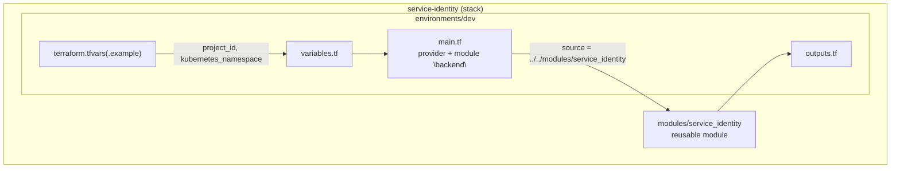
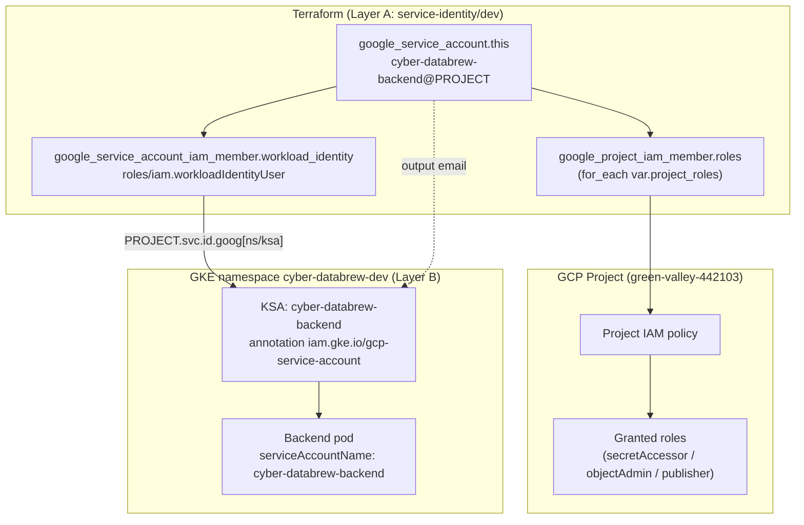
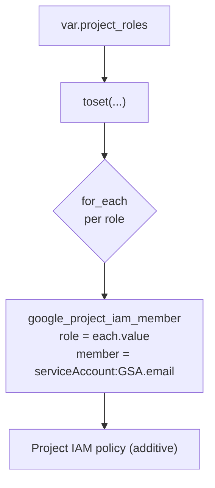
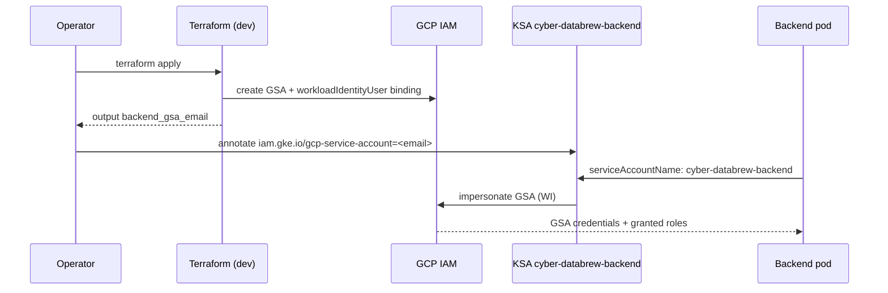
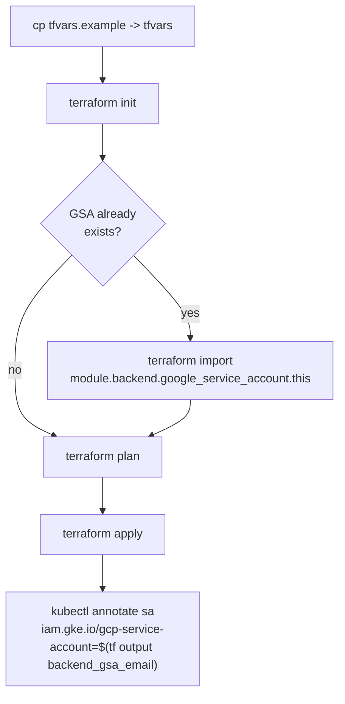
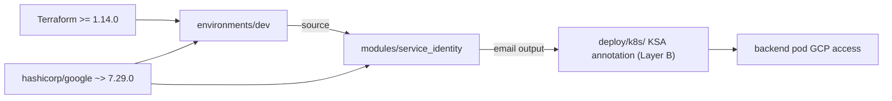

# Terraform

<cite>
**Referenced Files in This Document**

- [deploy/iac/terraform/README.md](file://deploy/iac/terraform/README.md)
- [deploy/iac/terraform/service-identity/.gitignore](file://deploy/iac/terraform/service-identity/.gitignore)
- [deploy/iac/terraform/service-identity/environments/dev/README.md](file://deploy/iac/terraform/service-identity/environments/dev/README.md)
- [deploy/iac/terraform/service-identity/environments/dev/main.tf](file://deploy/iac/terraform/service-identity/environments/dev/main.tf)
- [deploy/iac/terraform/service-identity/environments/dev/outputs.tf](file://deploy/iac/terraform/service-identity/environments/dev/outputs.tf)
- [deploy/iac/terraform/service-identity/environments/dev/terraform.tfvars.example](file://deploy/iac/terraform/service-identity/environments/dev/terraform.tfvars.example)
- [deploy/iac/terraform/service-identity/environments/dev/variables.tf](file://deploy/iac/terraform/service-identity/environments/dev/variables.tf)
- [deploy/iac/terraform/service-identity/modules/service_identity/main.tf](file://deploy/iac/terraform/service-identity/modules/service_identity/main.tf)
- [deploy/iac/terraform/service-identity/modules/service_identity/outputs.tf](file://deploy/iac/terraform/service-identity/modules/service_identity/outputs.tf)
- [deploy/iac/terraform/service-identity/modules/service_identity/variables.tf](file://deploy/iac/terraform/service-identity/modules/service_identity/variables.tf)
</cite>

## Table of Contents
1. [Introduction](#introduction)
2. [Project Structure](#project-structure)
3. [Core Components](#core-components)
4. [Architecture Overview](#architecture-overview)
5. [Detailed Component Analysis](#detailed-component-analysis)
6. [Dependency Analysis](#dependency-analysis)
7. [Performance Considerations](#performance-considerations)
8. [Troubleshooting Guide](#troubleshooting-guide)
9. [Conclusion](#conclusion)
10. [Appendices](#appendices)

## Introduction

The Terraform configuration under `deploy/iac/terraform/` is **Layer A** of the
two-layer deployment model used by `cyber-databrew`. Layer A owns only the
infrastructure whose lifecycle is **independent of application releases** — long
lived GCP identities and IAM. Everything that changes with each application
release (`Deployment`, `Service`, `HTTPRoute`, `GCPBackendPolicy`,
`HealthCheckPolicy`, image tags, replica counts, env values) is deliberately
kept out of Terraform and lives in **Layer B** under `deploy/k8s/`, reconciled by
`kubectl` / Kustomize.

Today the Terraform layer contains exactly one stack — `service-identity` — which
provisions a Google service account (GSA), attaches project-level IAM roles to
it, and binds it to a Kubernetes ServiceAccount (KSA) through **GKE Workload
Identity**. The result is that pods running with
`serviceAccountName: cyber-databrew-backend` in the `cyber-databrew-dev`
namespace automatically impersonate the matching GSA and inherit its GCP roles,
with no exported keys.

The scope is intentionally narrow. The README states the rule plainly: only
release-independent resources belong here, and future stacks such as
`gke-cluster/` or `gateway-ingress/` will each become their own self-contained
stack with its own state and provider configuration rather than being folded into
the existing one.

**Section sources**
- [deploy/iac/terraform/README.md](file://deploy/iac/terraform/README.md#L1-L20)
- [deploy/iac/terraform/README.md](file://deploy/iac/terraform/README.md#L78-L84)

## Project Structure

The directory is organized as a set of independent **stacks**. Each stack is
self-contained: it owns its own modules, its own state, and its own provider
configuration. Stacks never import one another; cross-stack references are passed
through Terraform `output` values, consumed either via a `terraform_remote_state`
data source or copied into K8s manifests by hand.

```
deploy/iac/terraform/
├── README.md                     # Layer-A conventions and apply order
└── service-identity/             # the only stack today (GSA + IAM + Workload Identity)
    ├── .gitignore                # ignores .terraform/, tfstate, tfvars, crash logs
    ├── modules/
    │   └── service_identity/     # reusable module: 1 GSA + IAM + WI binding
    │       ├── main.tf
    │       ├── variables.tf
    │       └── outputs.tf
    └── environments/
        └── dev/                  # concrete per-env instantiation
            ├── main.tf           # provider + module call for the backend workload
            ├── variables.tf
            ├── outputs.tf
            ├── terraform.tfvars.example
            └── README.md         # import + apply runbook for dev
```

The split between `modules/` and `environments/` is enforced by convention:
provider configuration lives **only** in `environments/<env>/main.tf`, never in
`modules/`; modules declare only `required_providers`. State is per-stack-per-env
and stored in GCS following the `cyber-iac` org standard
(`gs://terraform_staging_state_store/.../cyber-databrew/<stack>/` for dev,
`gs://terraform_production_state_store/.../cyber-databrew/<stack>/` for prod).



**Diagram sources**
- [deploy/iac/terraform/service-identity/environments/dev/main.tf](file://deploy/iac/terraform/service-identity/environments/dev/main.tf#L22-L42)
- [deploy/iac/terraform/service-identity/modules/service_identity/main.tf](file://deploy/iac/terraform/service-identity/modules/service_identity/main.tf#L1-L37)

**Section sources**
- [deploy/iac/terraform/README.md](file://deploy/iac/terraform/README.md#L9-L51)
- [deploy/iac/terraform/service-identity/.gitignore](file://deploy/iac/terraform/service-identity/.gitignore#L1-L7)

## Core Components

The stack is built from a single reusable module instantiated once per logical
workload. The module declares three Terraform resources and three outputs; the
dev environment wires the module to concrete values and re-exports one output.

#### The `service_identity` module

The module pins `required_version = ">= 1.14.0"` and the
`hashicorp/google` provider at `~> 7.29.0`, then declares three resources:

| Terraform resource | Type | Purpose |
| --- | --- | --- |
| `google_service_account.this` | `google_service_account` | Creates one GCP service account per logical workload, identified by `account_id` in `project_id`. |
| `google_project_iam_member.roles` | `google_project_iam_member` (for_each) | Grants each project-level IAM role in `var.project_roles` to the GSA, one membership per role. |
| `google_service_account_iam_member.workload_identity` | `google_service_account_iam_member` (count) | Binds the in-cluster KSA to the GSA via `roles/iam.workloadIdentityUser`; skipped when `kubernetes_sa_name` is empty. |

The Workload Identity member string is constructed as
`serviceAccount:${var.project_id}.svc.id.goog[${var.kubernetes_namespace}/${var.kubernetes_sa_name}]`,
which is the GKE Workload Identity principal format that ties a Kubernetes SA in
a namespace to a Google SA.

#### Module variables

The module exposes seven input variables. Two are required (`project_id`,
`account_id`); the rest carry defaults that make the IAM grant and the Workload
Identity binding opt-in.

| Variable | Type | Default | Role |
| --- | --- | --- | --- |
| `project_id` | string | — | GCP project id the GSA and IAM live in. |
| `account_id` | string | — | Left side of the GSA email; immutable once applied. |
| `display_name` | string | `""` | Human-readable GSA display name. |
| `description` | string | `""` | GSA description. |
| `project_roles` | list(string) | `[]` | Project-level IAM roles to grant. |
| `kubernetes_namespace` | string | `""` | Namespace hosting the bound KSA. |
| `kubernetes_sa_name` | string | `""` | KSA to bind; **empty disables** the WI binding. |

#### Module outputs

The module emits the three values that Layer B needs to consume the identity:
`email` (used as the `iam.gke.io/gcp-service-account` annotation on the KSA),
`name` (the fully qualified `projects/.../serviceAccounts/...` form), and
`unique_id` (the stable numeric id).

#### The dev environment

`environments/dev/main.tf` configures the `google` provider with
`project = var.project_id` and calls the module once as `module "backend"`. It
hard-codes `account_id = "cyber-databrew-backend"`, sets a dev display name, and
binds the KSA `cyber-databrew-backend` in `var.kubernetes_namespace`. The
`project_roles` list is present but fully commented out — least-privilege roles
(`secretmanager.secretAccessor`, `storage.objectAdmin`, `pubsub.publisher`) are
shown as candidates to be trimmed and enabled deliberately. A trailing comment
marks where additional workloads (frontend, dagster, mcap-tool) would be added as
further `module` blocks.

**Section sources**
- [deploy/iac/terraform/service-identity/modules/service_identity/main.tf](file://deploy/iac/terraform/service-identity/modules/service_identity/main.tf#L1-L37)
- [deploy/iac/terraform/service-identity/modules/service_identity/variables.tf](file://deploy/iac/terraform/service-identity/modules/service_identity/variables.tf#L1-L39)
- [deploy/iac/terraform/service-identity/modules/service_identity/outputs.tf](file://deploy/iac/terraform/service-identity/modules/service_identity/outputs.tf#L1-L14)
- [deploy/iac/terraform/service-identity/environments/dev/main.tf](file://deploy/iac/terraform/service-identity/environments/dev/main.tf#L22-L42)

## Architecture Overview

The provisioned infrastructure is small but tightly coupled across the GCP and
Kubernetes boundary. The module creates a GSA, hangs project IAM roles off it,
and establishes a Workload Identity trust relationship so a named KSA can
impersonate the GSA. The diagram below shows the GCP resources the stack
provisions and how they connect to the in-cluster identity.



The dashed edge represents the **manual hand-off** between layers: Terraform
outputs `backend_gsa_email`, which an operator copies onto the KSA as the
`iam.gke.io/gcp-service-account` annotation. Layer A owns only the identity and
its GCP-side IAM; the KSA object itself is defined in `deploy/k8s/`.

> **Gateway note.** Unlike some stacks, the HTTP ingress gateway is **not** a
> Terraform-managed resource in this repository. `HTTPRoute`,
> `GCPBackendPolicy`, and `HealthCheckPolicy` live under `deploy/k8s/gateway/`
> (Layer B) and are explicitly called out as out of scope for Terraform in the
> Layer-A README.

**Diagram sources**
- [deploy/iac/terraform/service-identity/modules/service_identity/main.tf](file://deploy/iac/terraform/service-identity/modules/service_identity/main.tf#L16-L36)
- [deploy/iac/terraform/service-identity/environments/dev/main.tf](file://deploy/iac/terraform/service-identity/environments/dev/main.tf#L22-L39)
- [deploy/iac/terraform/service-identity/environments/dev/README.md](file://deploy/iac/terraform/service-identity/environments/dev/README.md#L24-L34)

**Section sources**
- [deploy/iac/terraform/service-identity/modules/service_identity/main.tf](file://deploy/iac/terraform/service-identity/modules/service_identity/main.tf#L12-L36)
- [deploy/iac/terraform/README.md](file://deploy/iac/terraform/README.md#L78-L84)

## Detailed Component Analysis

### The service account resource

`google_service_account.this` is the anchor of the stack. It is created in
`var.project_id` with `account_id`, `display_name`, and `description` taken
directly from module inputs. Because the `account_id` becomes the immutable left
half of the SA email (`<account_id>@<project>.iam.gserviceaccount.com`), the
README warns that names are stable and changing `account_id` (or any `*_name`
variable) forces resource recreation — they should be treated as immutable once
applied.

**Section sources**
- [deploy/iac/terraform/service-identity/modules/service_identity/main.tf](file://deploy/iac/terraform/service-identity/modules/service_identity/main.tf#L12-L21)
- [deploy/iac/terraform/README.md](file://deploy/iac/terraform/README.md#L49-L51)

### Project IAM bindings

`google_project_iam_member.roles` uses `for_each = toset(var.project_roles)` to
create one IAM membership per role, each granting `each.value` to
`serviceAccount:${google_service_account.this.email}` at the project level. The
use of `google_project_iam_member` (additive, per-(role, member) membership)
rather than `google_project_iam_binding` or `google_project_iam_policy` is
deliberate: it is non-authoritative, so Terraform manages only the memberships it
declares and never clobbers other members of the same role. With the default
empty list and the commented-out dev roles, **no roles are granted until
explicitly enabled**, enforcing least privilege by default.



**Diagram sources**
- [deploy/iac/terraform/service-identity/modules/service_identity/main.tf](file://deploy/iac/terraform/service-identity/modules/service_identity/main.tf#L23-L28)

**Section sources**
- [deploy/iac/terraform/service-identity/modules/service_identity/main.tf](file://deploy/iac/terraform/service-identity/modules/service_identity/main.tf#L23-L28)
- [deploy/iac/terraform/service-identity/environments/dev/main.tf](file://deploy/iac/terraform/service-identity/environments/dev/main.tf#L30-L35)

### Workload Identity binding

`google_service_account_iam_member.workload_identity` is guarded by
`count = var.kubernetes_sa_name == "" ? 0 : 1`, so the binding only exists when a
KSA name is supplied. When enabled, it grants `roles/iam.workloadIdentityUser` on
the GSA (`service_account_id = google_service_account.this.name`) to the GKE
Workload Identity principal
`serviceAccount:${var.project_id}.svc.id.goog[${var.kubernetes_namespace}/${var.kubernetes_sa_name}]`.

This is the trust half of Workload Identity: it lets the KSA *act as* the GSA.
The complementary half — the `iam.gke.io/gcp-service-account` annotation on the
KSA — is applied in Layer B (see the dev README), and the GSA `email` output is
the value copied into that annotation.



**Diagram sources**
- [deploy/iac/terraform/service-identity/modules/service_identity/main.tf](file://deploy/iac/terraform/service-identity/modules/service_identity/main.tf#L30-L36)
- [deploy/iac/terraform/service-identity/environments/dev/README.md](file://deploy/iac/terraform/service-identity/environments/dev/README.md#L24-L31)

**Section sources**
- [deploy/iac/terraform/service-identity/modules/service_identity/main.tf](file://deploy/iac/terraform/service-identity/modules/service_identity/main.tf#L30-L36)
- [deploy/iac/terraform/service-identity/environments/dev/outputs.tf](file://deploy/iac/terraform/service-identity/environments/dev/outputs.tf#L1-L4)

### Variables and tfvars

The dev environment declares two variables: `project_id` (required) and
`kubernetes_namespace` (default `cyber-databrew-dev`). Concrete values are
supplied via `terraform.tfvars`, which is gitignored; only
`terraform.tfvars.example` is committed, pinning `project_id = "green-valley-442103"`
and `kubernetes_namespace = "cyber-databrew-dev"` as the dev reference values.
Per the README convention, **secrets are never placed in tfvars** — they are
sourced from Secret Manager via a `data` source with an optional `TF_VAR_*`
override.

**Section sources**
- [deploy/iac/terraform/service-identity/environments/dev/variables.tf](file://deploy/iac/terraform/service-identity/environments/dev/variables.tf#L1-L11)
- [deploy/iac/terraform/service-identity/environments/dev/terraform.tfvars.example](file://deploy/iac/terraform/service-identity/environments/dev/terraform.tfvars.example#L1-L2)
- [deploy/iac/terraform/README.md](file://deploy/iac/terraform/README.md#L46-L47)

### Backend / state management

The dev `main.tf` ships with the GCS backend block **commented out** and an
example showing `bucket = "tf-state-cyber-databrew"` with
`prefix = "envs/dev/service-identity"`; a comment notes a remote backend should
be enabled before going to prod. Until then state is local and gitignored
(`terraform.tfstate`, `terraform.tfstate.backup`, `.terraform/`,
`.terraform.lock.hcl`). The README documents the org-standard GCS state
locations that the prod backend should target.

**Section sources**
- [deploy/iac/terraform/service-identity/environments/dev/main.tf](file://deploy/iac/terraform/service-identity/environments/dev/main.tf#L1-L20)
- [deploy/iac/terraform/service-identity/.gitignore](file://deploy/iac/terraform/service-identity/.gitignore#L1-L7)
- [deploy/iac/terraform/README.md](file://deploy/iac/terraform/README.md#L42-L45)

### Apply and import workflow

The dev README is the runbook. Because the backend GSA may already exist
(manually created), the recommended flow imports the existing resource into state
before applying, so Terraform takes over the live object rather than failing on a
duplicate:

```bash
cp terraform.tfvars.example terraform.tfvars
terraform init
terraform import \
  module.backend.google_service_account.this \
  projects/green-valley-442103/serviceAccounts/cyber-databrew-backend@green-valley-442103.iam.gserviceaccount.com
terraform plan
terraform apply
```

If the GSA does not already exist, the import step is skipped and `terraform apply`
creates it. After apply, the KSA is annotated with the GSA email via
`terraform output -raw backend_gsa_email`.



**Diagram sources**
- [deploy/iac/terraform/service-identity/environments/dev/README.md](file://deploy/iac/terraform/service-identity/environments/dev/README.md#L7-L31)

**Section sources**
- [deploy/iac/terraform/service-identity/environments/dev/README.md](file://deploy/iac/terraform/service-identity/environments/dev/README.md#L1-L34)
- [deploy/iac/terraform/README.md](file://deploy/iac/terraform/README.md#L48-L48)

## Dependency Analysis

The stack depends on the `hashicorp/google` provider (`~> 7.29.0`) and Terraform
`>= 1.14.0`, declared identically in both the module and the dev environment. The
environment depends on the module via `source = "../../modules/service_identity"`.
Downstream, Layer B (the `deploy/k8s/` manifests) depends on this stack's
`backend_gsa_email` output for the KSA annotation, and the running backend pod
ultimately depends on the granted project IAM roles for its GCP access.



**Diagram sources**
- [deploy/iac/terraform/service-identity/environments/dev/main.tf](file://deploy/iac/terraform/service-identity/environments/dev/main.tf#L1-L23)
- [deploy/iac/terraform/service-identity/modules/service_identity/main.tf](file://deploy/iac/terraform/service-identity/modules/service_identity/main.tf#L1-L10)

**Section sources**
- [deploy/iac/terraform/service-identity/environments/dev/main.tf](file://deploy/iac/terraform/service-identity/environments/dev/main.tf#L1-L42)
- [deploy/iac/terraform/service-identity/environments/dev/outputs.tf](file://deploy/iac/terraform/service-identity/environments/dev/outputs.tf#L1-L4)

## Performance Considerations

Terraform "performance" here is about plan/apply behavior and identity hygiene
rather than runtime latency:

- **Additive IAM via `for_each`.** Using `google_project_iam_member` keyed by role
  means adding or removing a role touches only that one membership, producing
  minimal, readable plans and avoiding policy-wide diffs.
- **Immutable names.** `account_id` and the WI member string are derived from
  inputs; changing them forces destroy/recreate of the GSA and re-binding. Treat
  them as fixed to avoid disruptive applies.
- **Least privilege by default.** `project_roles` defaults to `[]` and the dev
  roles are commented out, so the GSA starts with no project roles and grows only
  as needed.
- **Per-stack-per-env state.** Independent state files keep plans scoped and fast,
  and prevent unrelated stacks from contending on a single state lock.

**Section sources**
- [deploy/iac/terraform/service-identity/modules/service_identity/main.tf](file://deploy/iac/terraform/service-identity/modules/service_identity/main.tf#L23-L28)
- [deploy/iac/terraform/README.md](file://deploy/iac/terraform/README.md#L42-L51)

## Troubleshooting Guide

#### `terraform apply` fails with "already exists" on the service account

The GSA was created manually and is not in Terraform state. Run the
`terraform import` command from the dev README to adopt the existing resource,
then re-run `plan`/`apply`.

#### Pods cannot access GCP resources despite a green apply

Check both halves of Workload Identity. Terraform owns the
`workloadIdentityUser` binding; the **KSA annotation**
(`iam.gke.io/gcp-service-account=<email>`) is applied separately in Layer B. If the
annotation is missing or stale, re-run the `kubectl annotate` step with
`terraform output -raw backend_gsa_email`.

#### WI binding silently not created

The binding is gated on `kubernetes_sa_name != ""`. If `kubernetes_sa_name` is
empty (the module default), `count` evaluates to 0 and no binding is made. Confirm
the environment passes a non-empty KSA name.

#### Permission denied on a GCP API

`project_roles` defaults to empty and the dev list is commented out, so the GSA
may have no roles. Uncomment / add the needed least-privilege role in
`environments/dev/main.tf` and re-apply.

#### Plan wants to destroy and recreate the GSA

A change to `account_id` (the immutable name) triggers recreation. Revert the name
change or accept the recreation deliberately, knowing the email and any dependent
annotations change.

**Section sources**
- [deploy/iac/terraform/service-identity/environments/dev/README.md](file://deploy/iac/terraform/service-identity/environments/dev/README.md#L7-L34)
- [deploy/iac/terraform/service-identity/modules/service_identity/main.tf](file://deploy/iac/terraform/service-identity/modules/service_identity/main.tf#L30-L36)
- [deploy/iac/terraform/service-identity/environments/dev/main.tf](file://deploy/iac/terraform/service-identity/environments/dev/main.tf#L30-L38)

## Conclusion

The Terraform layer of `cyber-databrew` is a focused, single-purpose
infrastructure-as-code surface: one reusable `service_identity` module, one `dev`
environment that instantiates it for the backend workload, and a clean two-layer
split that keeps release-coupled Kubernetes objects out of Terraform. It
provisions a GCP service account, additive project IAM memberships, and a GKE
Workload Identity binding, exporting the GSA email so the cluster-side KSA can
impersonate it without keys. The structure is built to grow — additional
workloads become extra module blocks, and future concerns (cluster, gateway
ingress) become sibling stacks — while preserving per-stack state isolation and
least-privilege defaults.

## Appendices

### Appendix A — Terraform resources at a glance

| Resource address | Provider type | Created when | Key attributes |
| --- | --- | --- | --- |
| `module.backend.google_service_account.this` | `google_service_account` | always | `account_id = cyber-databrew-backend`, `project = var.project_id` |
| `module.backend.google_project_iam_member.roles["<role>"]` | `google_project_iam_member` | one per `project_roles` entry | `role`, `member = serviceAccount:<gsa-email>` |
| `module.backend.google_service_account_iam_member.workload_identity[0]` | `google_service_account_iam_member` | `kubernetes_sa_name != ""` | `role = roles/iam.workloadIdentityUser`, WI principal member |

### Appendix B — Module inputs / outputs

Inputs: `project_id`, `account_id`, `display_name`, `description`,
`project_roles`, `kubernetes_namespace`, `kubernetes_sa_name`.
Outputs: `email`, `name`, `unique_id`. The dev environment re-exports
`module.backend.email` as `backend_gsa_email`.

**Section sources**
- [deploy/iac/terraform/service-identity/modules/service_identity/variables.tf](file://deploy/iac/terraform/service-identity/modules/service_identity/variables.tf#L1-L39)
- [deploy/iac/terraform/service-identity/modules/service_identity/outputs.tf](file://deploy/iac/terraform/service-identity/modules/service_identity/outputs.tf#L1-L14)
- [deploy/iac/terraform/service-identity/environments/dev/outputs.tf](file://deploy/iac/terraform/service-identity/environments/dev/outputs.tf#L1-L4)

### Appendix C — Conventions and quality gates

State lives in GCS per-stack-per-env; secrets stay in Secret Manager, not tfvars;
names are immutable once applied. Repo-root tooling mirrors the `cyber-iac` org:
`.tflint.hcl` (TFLint + `tflint-ruleset-google`), `.gitleaks.toml` /
`.gitleaksignore`, `.secrets.baseline` (detect-secrets), and
`.pre-commit-config.yaml` wiring `terraform_fmt` / `terraform_validate` /
`terraform_tflint`. Apply order for dev bootstrap is `service-identity/` first,
then future `gke-cluster/` and `gateway-ingress/` stacks.

**Section sources**
- [deploy/iac/terraform/README.md](file://deploy/iac/terraform/README.md#L38-L77)
