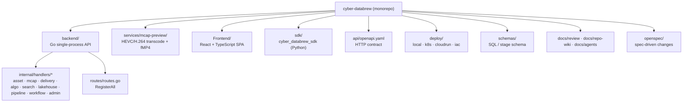
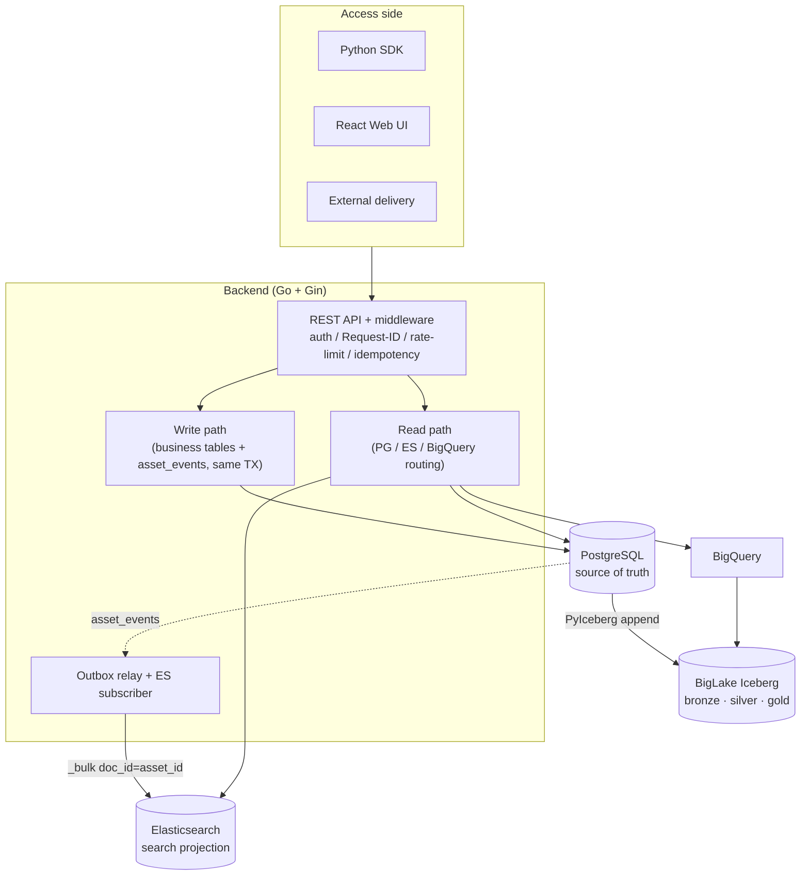
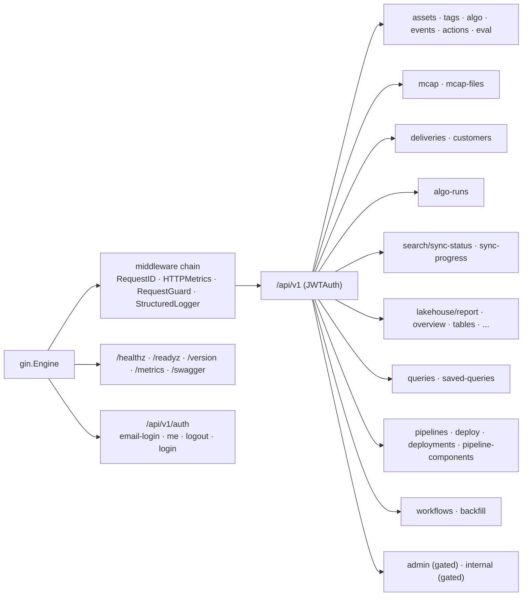
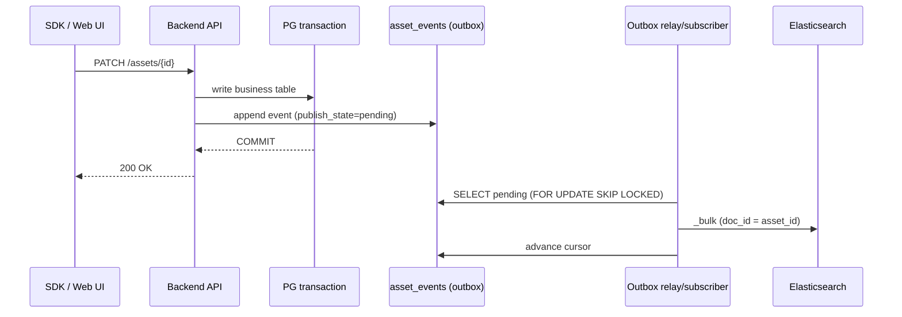
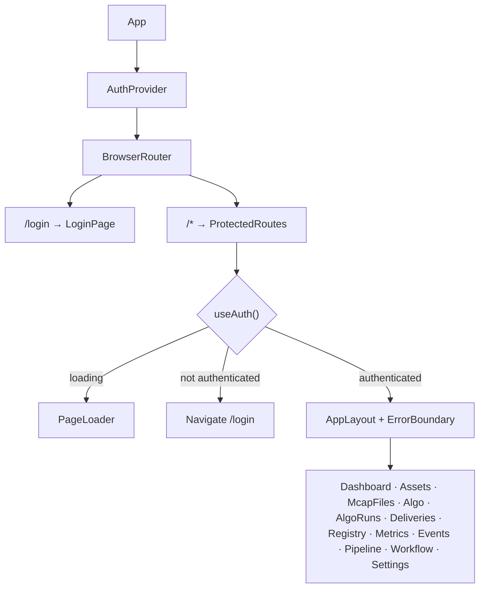
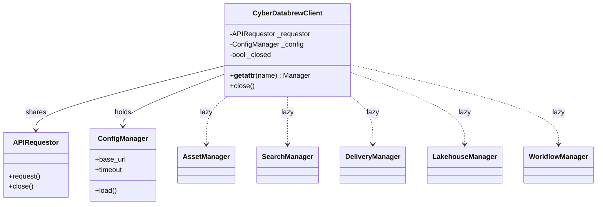
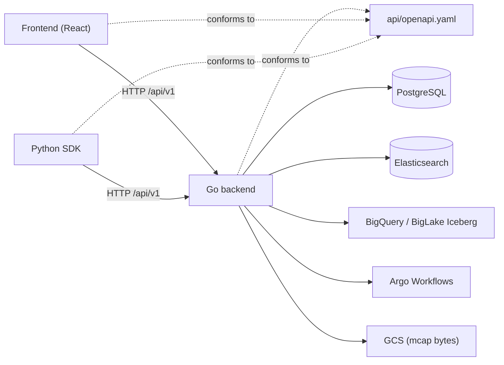

# Project Overview

<cite>
**Referenced Files in This Document**

- [README.md](file://README.md)
- [backend/cmd/server/main.go](file://backend/cmd/server/main.go)
- [backend/cmd/server/server.go](file://backend/cmd/server/server.go)
- [backend/routes/routes.go](file://backend/routes/routes.go)
- [Frontend/src/App.tsx](file://Frontend/src/App.tsx)
- [sdk/src/cyber_databrew_sdk/client.py](file://sdk/src/cyber_databrew_sdk/client.py)
- [api/openapi.yaml](file://api/openapi.yaml)
- [docs/review/data-platform-design.md](file://docs/review/data-platform-design.md)
- [Makefile](file://Makefile)
</cite>

## Table of Contents
1. [Introduction](#introduction)
2. [Project Structure](#project-structure)
3. [Core Components](#core-components)
4. [Architecture Overview](#architecture-overview)
5. [Detailed Component Analysis](#detailed-component-analysis)
6. [Dependency Analysis](#dependency-analysis)
7. [Performance Considerations](#performance-considerations)
8. [Troubleshooting Guide](#troubleshooting-guide)
9. [Conclusion](#conclusion)
10. [Appendices](#appendices)

## Introduction

`cyber-databrew` (the *data-platform*) is a backend, web, and SDK monorepo for
managing **video / multimodal robotics assets**: their metadata, algorithm
processing state, search/query, and delivery to downstream consumers. The
canonical data form is the **MCAP** file (the Foxglove container format that
carries sensor + video multimodal time series); the entire pipeline — from data
collection through algorithm processing to delivery — is organized around MCAP.

The platform serves two user roles: internal algorithm engineers (who produce
and consume processed data) and external customers (who receive delivered
artifacts). Its mandate is therefore two-fold — **asset-as-data management** and
**processing + delivery**. Because the robot fleet is expected to broaden beyond
autonomous vehicles to manipulators, humanoids, quadrupeds, and indoor
navigation, domain-semantic fields (`city`, `weather`, `scenario_type`) are kept
out of the primary tables and pushed into a unified tag system.

Architecturally the platform follows a layered "source-of-truth + projections"
model: **PostgreSQL** is the authoritative online store; **Elasticsearch** is a
search projection; **BigQuery + BigLake-managed Iceberg** form the analytical
lakehouse; and a **transactional outbox** (`asset_events`) with relay/subscriber
workers drives the asynchronous synchronization between them. The repository
README pins the current runtime baseline at **2.0: PostgreSQL + Elasticsearch +
BigQuery + Outbox CDC**.

**Section sources**
- [README.md](file://README.md#L1-L40)
- [docs/review/data-platform-design.md](file://docs/review/data-platform-design.md#L1-L67)

## Project Structure

The repository is a monorepo with one Go backend process, a React frontend, a
Python SDK, deployment manifests, and a heavy documentation/spec tree. The
top-level layout described in the README maps directly to the runtime
components.



**Diagram sources**
- [README.md](file://README.md#L18-L40)
- [backend/cmd/server/main.go](file://backend/cmd/server/main.go#L8-L30)
- [backend/routes/routes.go](file://backend/routes/routes.go#L44-L68)

Key paths:

- **`backend/`** — the Go API covering assets, mcap, deliveries, algo, search,
  lakehouse, and admin domains. The entrypoint is `backend/cmd/server`.
- **`services/mcap-preview/`** — an independent Go service that transcodes
  HEVC/H.264 and streams fMP4 for preview.
- **`Frontend/`** — a React + TypeScript SPA providing the asset-discovery
  workbench (card view, facets, preview pane, dashboard).
- **`sdk/`** — the Python SDK package `cyber_databrew_sdk`, built on `httpx` and
  `pydantic`.
- **`api/openapi.yaml`** — the HTTP contract, kept aligned with the
  implementation.
- **`deploy/`** — Docker Compose (`local/`), Kubernetes manifests (`k8s/`),
  Cloud Run scripts (`cloudrun/`), and Terraform IaC (`iac/terraform/`).
- **`docs/review/`** — the design/review document package; `docs/repo-wiki/` is
  this wiki; `docs/agents/` holds AI-collaboration rules.
- **`openspec/`** — spec-driven development changes (proposal/design/tasks per
  change).

**Section sources**
- [README.md](file://README.md#L18-L40)
- [Makefile](file://Makefile#L90-L162)

## Core Components

The system is composed of four runtime artifacts plus a set of storage/derive
backends. The Go backend is the gravitational center: a single process that
wires every domain handler, registers all routes, and routes reads/writes across
PostgreSQL, Elasticsearch, and BigQuery.

- **Go API server** (`backend/cmd/server`). `main()` performs layered wiring:
  `setupInfra` → `setupCore` → `setupOptional` → `runServer`. The `infra` struct
  owns the config, PostgreSQL client, Elasticsearch client, a lakehouse
  `Querier`, and the YAML-backed registries (algo, tag, metric, query-field,
  action-label).
- **Repositories** (`coreRepos`) — PostgreSQL-backed implementations for assets,
  asset tags, the `asset_algo_latest` projection, `asset_events`, MCAP files,
  deliveries, actions, saved queries, and idempotency.
- **HTTP handlers** (`coreHandlers`) — per-domain handlers (asset, algo, mcap,
  delivery, customer, delivery-rule, algo-run, eval, action, query, workflow,
  pipeline, pipeline-component, backfill) plus an asset use case.
- **Optional components** (`optional`) — admin/purge handlers, the outbox
  relay + Elasticsearch subscriber, search sync/progress functions, and a config
  watcher.
- **React frontend** (`Frontend/src/App.tsx`) — a router-driven SPA with lazy
  pages, an `AuthProvider` gate, and an `AppLayout` shell.
- **Python SDK** (`sdk/src/cyber_databrew_sdk/client.py`) — a `CyberDatabrewClient`
  facade exposing lazily-loaded domain managers over a shared `APIRequestor`.

**Section sources**
- [backend/cmd/server/main.go](file://backend/cmd/server/main.go#L32-L128)
- [backend/routes/routes.go](file://backend/routes/routes.go#L44-L68)
- [Frontend/src/App.tsx](file://Frontend/src/App.tsx#L44-L104)
- [sdk/src/cyber_databrew_sdk/client.py](file://sdk/src/cyber_databrew_sdk/client.py#L30-L73)

## Architecture Overview

The platform is layered into an online business layer (PostgreSQL), a search
layer (Elasticsearch), an Iceberg/BigQuery lakehouse, and the asynchronous
derive channel that connects them. The backend is the only writer of the
authoritative store; every asset change writes the business table and appends an
`asset_events` row in the same transaction, after which independent workers
project the event to downstream sinks.



**Diagram sources**
- [docs/review/data-platform-design.md](file://docs/review/data-platform-design.md#L104-L153)
- [backend/cmd/server/main.go](file://backend/cmd/server/main.go#L35-L106)
- [backend/routes/routes.go](file://backend/routes/routes.go#L74-L100)

The layer responsibilities, per the design document, are:

| Layer | Component | Responsibility |
| --- | --- | --- |
| Online business | PostgreSQL | Point queries, transactions, current-state filters, state machines, idempotency; authoritative source of truth |
| Search | Elasticsearch | Fuzzy/full-text query, multi-field filters, facets, asset discovery |
| Lakehouse | Iceberg | Historical facts, training sets, audit replay, statistics, recompute |
| Query | BigQuery | Reads Iceberg for complex analytics and offline reports |
| Async derive | Outbox relay/subscriber | PG change → ES / lakehouse synchronization (minute-level latency) |

**Section sources**
- [docs/review/data-platform-design.md](file://docs/review/data-platform-design.md#L140-L153)
- [README.md](file://README.md#L7-L17)

## Detailed Component Analysis

### Backend wiring and lifecycle

`main()` constructs the process in four phases and defers the shutdown of each
layer. `infra` aggregates the long-lived infrastructure clients and registries;
`coreRepos` and `coreHandlers` group the repositories and HTTP handlers; and
`optional` holds components not required for the core API (admin, purge, the
outbox cancel function, search sync functions, and the config watcher).

```mermaid
sequenceDiagram
  participant Main as main()
  participant Inf as setupInfra
  participant Core as setupCore
  participant Opt as setupOptional
  participant Srv as runServer

  Main->>Inf: build config, PG, ES, lakehouse, registries
  Inf-->>Main: infra
  Main->>Core: construct repos + handlers (uses infra)
  Core-->>Main: coreHandlers
  Main->>Opt: admin/purge, outbox relay+subscriber, config watcher
  Opt-->>Main: optional
  Main->>Srv: runServer(infra, core, opt)
  Srv->>Srv: gin.New(), routes.RegisterAll(...)
  Srv->>Srv: r.Run(":" + cfg.Port)
```

**Diagram sources**
- [backend/cmd/server/main.go](file://backend/cmd/server/main.go#L119-L128)
- [backend/cmd/server/server.go](file://backend/cmd/server/server.go#L21-L68)

The `infra.close()`, `optional.close()`, and the deferred `inf.close()` in
`main` ensure the GCS client, PG pool, lakehouse querier, outbox worker, and
config watcher are all torn down on exit.

**Section sources**
- [backend/cmd/server/main.go](file://backend/cmd/server/main.go#L51-L128)
- [backend/cmd/server/server.go](file://backend/cmd/server/server.go#L21-L68)

### Route registration and the API surface

`routes.RegisterAll` is the single place all domains are mounted. It installs a
global middleware chain (`RequestID`, `HTTPMetrics`, `RequestGuard`,
`StructuredLogger`), optionally enables a rate limiter and a circuit breaker, and
exposes unauthenticated infrastructure endpoints `/healthz`, `/readyz`,
`/version`, `/metrics`, and `/swagger/*any`. All `/api/v1` routes are protected
by `JWTAuth`. Auth itself supports email login (domain-restricted, issues a
`databrew_session` cookie), a `/me` and `/logout` pair, and a legacy
static-token `/login` for SDK backward compatibility.



**Diagram sources**
- [backend/routes/routes.go](file://backend/routes/routes.go#L74-L367)

Notable route groups:

- **Assets** — CRUD plus `:id/deliveries`, `:id/mcap-locator`,
  `:id/foxglove-source`, `:id/events`, `:id/lineage`, `:id/timeline`, tags, and
  the custom batch method `POST /assets:batch_get`.
- **Algorithm lifecycle** — legacy per-asset `algo/:algo_key/start|finish|reset`
  and the first-class `algo-runs` resource with `start`, `finish`, `cancel`, and
  `affected-assets`.
- **MCAP** — `mcap/upload/finalize`, `mcap/:id/messages`, and `mcap-files`
  metadata with `:id/bytes` (GET and HEAD).
- **Deliveries** — commit, list, get, items, and per-customer listing.
- **Lakehouse** — report, status, sync-status, sync-progress, failure-clusters,
  overview, asset-growth, tables, event-daily, event-type-share,
  quality-distribution, and customer-replay.
- **Pipeline / workflow** — pipeline templates and deployments, Argo workflow
  monitoring, and backfill jobs.
- **Admin / internal** — reindex jobs, outbox stats, hard delete and batch
  delete, all gated behind `adminRoutesEnabled` and an admin token.

**Section sources**
- [backend/routes/routes.go](file://backend/routes/routes.go#L96-L373)
- [api/openapi.yaml](file://api/openapi.yaml#L1956-L2604)

### Asset lifecycle and the transactional outbox

The write path is the heart of the platform. Any tag-or-state change (e.g.
`PATCH /assets/{id}`) writes the business table and appends an `asset_events`
row with `publish_state='pending'` in the **same** PostgreSQL transaction. After
commit, an independent outbox worker drains pending events and projects them to
the Elasticsearch sink (and, in the broader design, to lakehouse/vector sinks).



**Diagram sources**
- [docs/review/data-platform-design.md](file://docs/review/data-platform-design.md#L1336-L1368)

This gives strong consistency (business + event rows commit or roll back
together), non-blocking writes (downstream stalls do not affect online writes),
replayability (consumers resume by `event_seq`), and multi-consumer fan-out (ES,
Iceberg, vector each consume the same stream independently). In `main.go` the
relay and ES subscriber are tracked by `optional.outboxRelayStarted` and
`optional.outboxESSubscriberStarted`, and stopped through `optional.outboxCancel`.

**Section sources**
- [docs/review/data-platform-design.md](file://docs/review/data-platform-design.md#L1310-L1368)
- [backend/cmd/server/main.go](file://backend/cmd/server/main.go#L96-L115)

### Frontend SPA

`App.tsx` is the SPA root. It wraps everything in an `AuthProvider`, then a
`BrowserRouter`. Pages are code-split via `lazy()` to keep the initial bundle
small, and a `PageLoader` Suspense fallback covers their load. `ProtectedRoutes`
reads `useAuth()`; while loading it shows the loader, when unauthenticated it
redirects to `/login`, and otherwise it renders the `AppLayout` shell with an
`ErrorBoundary` around the route table.



**Diagram sources**
- [Frontend/src/App.tsx](file://Frontend/src/App.tsx#L44-L104)

The route table maps to backend domains: `/dashboard`, `/assets` and
`/assets/:id`, `/mcap-files`, `/algo`, `/algo-runs` and `/algo-runs/:run_id`,
`/deliveries` and `/deliveries/:id`, `/registry`, `/metrics`, `/events`,
`/pipeline` (with `/components` and `/workflows` redirecting into its tabs),
`/workflows/:name`, and `/settings`. Several legacy paths (`/lakehouse`,
`/tags`, `/components`, `/workflows`) redirect to their current homes.

**Section sources**
- [Frontend/src/App.tsx](file://Frontend/src/App.tsx#L16-L104)

### Python SDK facade

`CyberDatabrewClient` is a Stripe-style facade. On construction it resolves
config (env vars, config files, and remote discovery via `GET
/api/v1/sdk-config`), resolves auth (`X-Databrew-Token` and/or `X-User-Email`
headers), and creates a single shared `APIRequestor`. Domain managers are
declared in the `_managers` map and instantiated lazily through `__getattr__` on
first attribute access, then cached on the instance.



**Diagram sources**
- [sdk/src/cyber_databrew_sdk/client.py](file://sdk/src/cyber_databrew_sdk/client.py#L30-L165)

The registered managers cover assets, storage, delivery, algo_runs, search,
queries, customers, lakehouse, events, registry, audit, actions, eval_metrics,
admin_search, workflows, and pipeline_components — mirroring the backend domains.
The client is a context manager and closes the underlying HTTP client on exit.

**Section sources**
- [sdk/src/cyber_databrew_sdk/client.py](file://sdk/src/cyber_databrew_sdk/client.py#L30-L188)

## Dependency Analysis

The four artifacts converge on a single HTTP contract: `api/openapi.yaml`. The
frontend and SDK are both clients of the Go backend; the backend depends on
PostgreSQL (required), Elasticsearch and BigQuery/Iceberg (optional derive
backends), and Argo Workflows for pipeline orchestration.



**Diagram sources**
- [backend/cmd/server/main.go](file://backend/cmd/server/main.go#L6-L49)
- [backend/routes/routes.go](file://backend/routes/routes.go#L189-L367)
- [sdk/src/cyber_databrew_sdk/client.py](file://sdk/src/cyber_databrew_sdk/client.py#L30-L50)
- [api/openapi.yaml](file://api/openapi.yaml#L1-L64)

Backend imports in `main.go` make the dependency surface explicit: `argo`
(workflow client), `elasticsearch`, `lakehouse` (a `Querier`), `postgres`, the
`config` registries, and `cloud.google.com/go/storage` for the optional GCS-backed
MCAP byte source. The `infra` struct carries each of these so that every handler
is constructed against the same set of clients.

**Section sources**
- [backend/cmd/server/main.go](file://backend/cmd/server/main.go#L6-L49)
- [api/openapi.yaml](file://api/openapi.yaml#L55-L76)

## Performance Considerations

- **Write path stays on PG.** Online point queries, transactions, and state
  machine transitions target PostgreSQL with a `< 200 ms P99` budget for
  tag/state changes; analytical scans are explicitly off-loaded to BigQuery +
  Iceberg and must not hit PG.
- **Search/analytics are projections.** Fuzzy/full-text/facet queries are served
  by Elasticsearch, and complex analytics by BigQuery over Iceberg, so the OLTP
  store is never the bottleneck for discovery or reporting.
- **Outbox draining is batched and lock-skipping.** The worker uses `FOR UPDATE
  SKIP LOCKED LIMIT 1000` on the pending events, advancing a per-sink cursor by
  `event_seq` — minute-level latency by design, not seconds.
- **Lakehouse ingestion is batched.** The current implementation appends to
  BigLake-managed Iceberg directly via PyIceberg (5–10 minute batches), avoiding
  the staging/MERGE two-stage blueprint reserved for self-hosted catalogs.
- **Frontend bundle is code-split.** Every page is `lazy()`-loaded behind
  `Suspense` to keep the initial bundle small.
- **SDK shares one client.** A single `APIRequestor` (and thus one `httpx.Client`
  connection pool) is shared by all managers; managers are imported lazily so
  unused domains cost nothing.
- **Backend protections.** Optional rate limiting (`RATE_LIMIT_RPS`) and a
  circuit breaker scoped to `/api/v1` (leaving `/healthz`, `/readyz`, `/metrics`
  reachable when open) bound load under stress.

**Section sources**
- [docs/review/data-platform-design.md](file://docs/review/data-platform-design.md#L56-L65)
- [docs/review/data-platform-design.md](file://docs/review/data-platform-design.md#L1133-L1133)
- [backend/routes/routes.go](file://backend/routes/routes.go#L79-L94)
- [Frontend/src/App.tsx](file://Frontend/src/App.tsx#L15-L31)

## Troubleshooting Guide

- **`/readyz` returns 503.** The readiness probe times out after 5s and pings
  PG; if `pgPing` is nil (PG not configured) or the ping errors, it reports `pg`
  unhealthy and returns `503`. The lakehouse block is informational only and
  does not flip readiness.
- **Search results are stale.** ES is a projection driven by the outbox; if the
  relay/subscriber is not running (`outboxRelayStarted` /
  `outboxESSubscriberStarted` false) or the cursor stalled, recent PG changes
  will not appear in search. Check `GET /api/v1/search/sync-status` and
  `sync-progress`, and admin `search/outbox-stats`.
- **401 on `/api/v1/*`.** All API routes require `JWTAuth`. Provide
  `X-Databrew-Token` (SDK) or a valid `databrew_session` cookie. Email login is
  rejected when the email domain does not match `AllowedDomain`.
- **Admin / internal routes 404 or 403.** They are only mounted when
  `adminRoutesEnabled` is true and require the admin token; in production
  `ADMIN_TOKEN` must be set or the internal group is disabled.
- **Local stack will not come up.** Use `make dev-up` for the minimal stack
  (Postgres on 5432, PgBouncer 6432, PubSub emulator 8085) or `make all-up` for
  the full stack (frontend 5173, backend 8080, ES 9200). Migrations run on first
  init; apply missing ones with `make local-migrate`.
- **SDK cannot reach the API.** The default `base_url` is `http://localhost:8080`
  (overridable via `CYBER_DATABREW_BASE_URL`); the client also attempts remote
  config discovery at `GET /api/v1/sdk-config` during construction.

**Section sources**
- [backend/routes/routes.go](file://backend/routes/routes.go#L381-L417)
- [backend/routes/routes.go](file://backend/routes/routes.go#L103-L106)
- [backend/cmd/server/main.go](file://backend/cmd/server/main.go#L96-L115)
- [Makefile](file://Makefile#L4-L24)
- [sdk/src/cyber_databrew_sdk/client.py](file://sdk/src/cyber_databrew_sdk/client.py#L99-L146)

## Conclusion

`cyber-databrew` is a monorepo data platform that treats robotics MCAP assets as
first-class data: a Go single-process backend wires every domain handler and
routes reads and writes across a PostgreSQL source of truth, an Elasticsearch
search projection, and a BigQuery/Iceberg lakehouse, kept in sync by a
transactional outbox. A React SPA and a Python SDK both consume the same
`/api/v1` contract defined in `api/openapi.yaml`. The layered "write to PG +
append event, derive everything else asynchronously" model is the unifying idea
across the codebase — understanding it explains the route groups, the SDK
managers, the frontend pages, and the deploy topology alike.

## Appendices

### A. Runtime snapshot (from README)

| Component | State |
| --- | --- |
| Storage | PostgreSQL (`STORAGE_BACKEND=postgres`) |
| Service | Go single process (`backend/cmd/server`) |
| Search | Elasticsearch (outbox relay/subscriber driven) |
| Lakehouse | BigQuery + BigLake-managed Iceberg |
| Async sync | Outbox: `asset_events` + relay/subscriber |
| Preview | mcap-preview service (HEVC/H.264 + fMP4) |

**Section sources**
- [README.md](file://README.md#L7-L17)

### B. Selected API path groups (`api/openapi.yaml`)

| Domain | Representative paths |
| --- | --- |
| Auth | `/api/v1/auth/login`, `/api/v1/auth/me`, `/api/v1/auth/logout` |
| Assets | `/api/v1/assets`, `/api/v1/assets/{id}`, `/api/v1/assets:batch_get` |
| Algo lifecycle | `/api/v1/assets/{id}/algo/{algo_key}/start|finish|reset` |
| Algo runs | `/api/v1/algo-runs`, `/api/v1/algo-runs/{run_id}/start|finish|cancel` |
| Queries | `/api/v1/queries/validate`, `/api/v1/queries/run`, `/api/v1/saved-queries` |
| Deliveries | `/api/v1/deliveries`, `/api/v1/deliveries/{id}/commit|cancel|retry|ack` |
| MCAP | `/api/v1/mcap-files`, `/api/v1/mcap-files/{id}/bytes`, `/api/v1/mcap/{id}/messages` |
| Search | `/api/v1/search/sync-status`, `/api/v1/search/sync-progress` |
| Lakehouse | `/api/v1/lakehouse/report`, `/overview`, `/tables`, `/customer-replay` |
| Pipeline | `/api/v1/pipelines`, `/api/v1/pipelines/{id}/versions` |
| Workflows | `/api/v1/workflows`, `/api/v1/workflows/{name}`, `/{name}/logs` |
| Backfill | `/api/v1/backfill`, `/api/v1/backfill/{id}/pause|resume` |

**Section sources**
- [api/openapi.yaml](file://api/openapi.yaml#L1909-L3501)
- [api/openapi.yaml](file://api/openapi.yaml#L3739-L4965)

### C. Security schemes (`api/openapi.yaml`)

| Scheme | Type | Header |
| --- | --- | --- |
| `DatabrewToken` | apiKey | `X-Databrew-Token` |
| `AdminToken` | apiKey | `X-Admin-Token` |

The shared parameters include `X-Request-ID` (optional) and `Idempotency-Key`
(required where declared).

**Section sources**
- [api/openapi.yaml](file://api/openapi.yaml#L55-L76)

### D. Common Makefile targets

| Target | Effect |
| --- | --- |
| `make dev-up` / `dev-down` | Minimal compose: Postgres + PgBouncer + emulators |
| `make all-up` / `all-down` | Full stack (frontend, backend, PG, ES, Iceberg, monitoring) |
| `make backend-run` | Start the API (`cd backend && make run-server`) |
| `make backend-test` | `go test ./...` |
| `make test` | Backend + SDK unit tests |
| `make iceberg-up` / `iceberg-down` | Standalone lakehouse compose (Spark, MinIO, Trino) |
| `make frontend-dev` | Vite dev server |

**Section sources**
- [Makefile](file://Makefile#L4-L67)
- [Makefile](file://Makefile#L100-L162)
