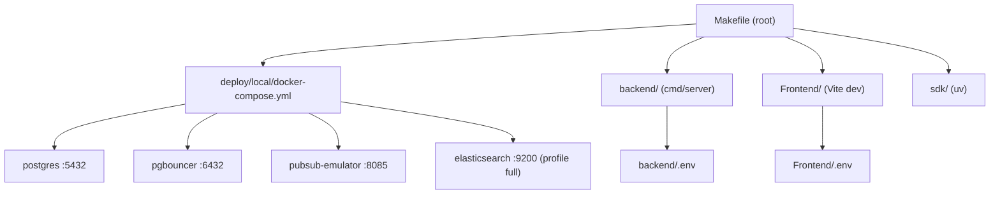
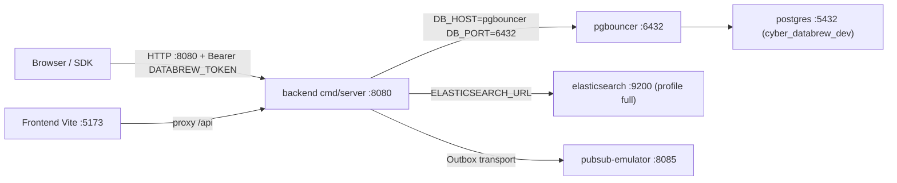
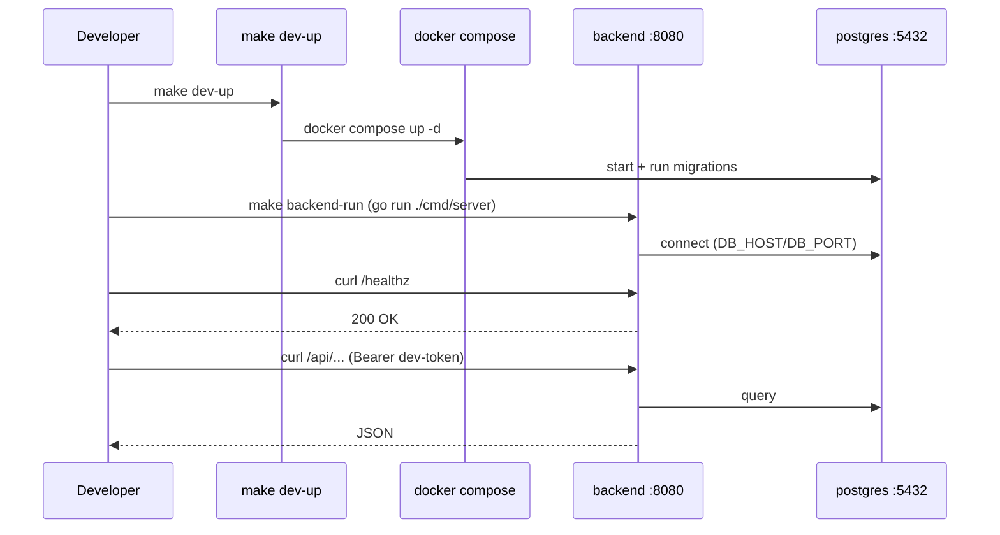
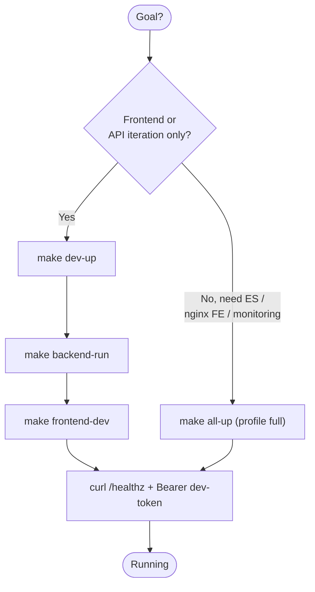
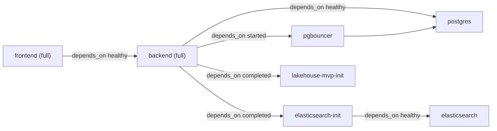

# Quick Start

<cite>
**Referenced Files in This Document**
- [README.md](file://README.md)
- [Makefile](file://Makefile)
- [backend/Makefile](file://backend/Makefile)
- [deploy/local/README.md](file://deploy/local/README.md)
- [deploy/local/docker-compose.yml](file://deploy/local/docker-compose.yml)
- [backend/.env.example](file://backend/.env.example)
- [Frontend/.env.example](file://Frontend/.env.example)
</cite>

## Table of Contents
1. [Introduction](#introduction)
2. [Project Structure](#project-structure)
3. [Core Components](#core-components)
4. [Architecture Overview](#architecture-overview)
5. [Detailed Component Analysis](#detailed-component-analysis)
6. [Dependency Analysis](#dependency-analysis)
7. [Performance Considerations](#performance-considerations)
8. [Troubleshooting Guide](#troubleshooting-guide)
9. [Conclusion](#conclusion)
10. [Appendices](#appendices)

## Introduction

This page is a from-zero, end-to-end walkthrough for bringing up `cyber-databrew`
on a local workstation and issuing a first authenticated API call. It targets a
developer who has just cloned the repository and wants a running backend, a
running frontend, and a successful round-trip through the HTTP API or the Python
SDK — without yet caring about Cloud Run, GKE, or the lakehouse internals.

`cyber-databrew` is a single-process Go backend plus a React/TypeScript frontend
and a Python SDK, organized around video / multimodal **asset metadata, algorithm
state, search, and delivery**. The local development surface is driven almost
entirely by `make` targets at the repository root, which in turn wrap a single
Docker Compose file selected through Compose **profiles**. The minimal dependency
set is PostgreSQL (plus PgBouncer and a Pub/Sub emulator); the full stack layers
on Elasticsearch, the Iceberg lakehouse, and Grafana/Prometheus.

The guarantees this page relies on:

- The root `Makefile` exposes `dev-up`, `all-up`, `backend-run`, `frontend-dev`,
  and the SDK targets used below.
- A single Compose file (`deploy/local/docker-compose.yml`) drives every local
  service; optional stacks are gated by the `full` and `lakehouse` profiles.
- The backend reads its configuration from `backend/.env`, seeded from
  `backend/.env.example`; the frontend reads `Frontend/.env` from
  `Frontend/.env.example`.
- Phase 0 authentication is a single static bearer token (`DATABREW_TOKEN`),
  defaulting to `dev-token` in the Compose backend.

**Section sources**
- [README.md](file://README.md#L1-L40)
- [README.md](file://README.md#L310-L366)
- [Makefile](file://Makefile#L1-L26)

## Project Structure

The pieces a Quick Start touches live in five top-level locations. The root
`Makefile` is the operator entry point; everything else is reached through it.

- `Makefile` — root orchestration: local infra (`dev-up`/`all-up`), backend,
  SDK, frontend, and lakehouse targets.
- `deploy/local/docker-compose.yml` — the single Compose file; Postgres,
  PgBouncer, Pub/Sub emulator are the base, with `full` and `lakehouse` profiles.
- `deploy/local/README.md` — operator notes on profiles, ports, and rebuilds.
- `backend/` — the Go API server (`backend/cmd/server`) with its own `Makefile`
  (`run-server`, `build`, `test`) and `backend/.env.example`.
- `Frontend/` — the Vite/React dev server and `Frontend/.env.example`.
- `sdk/` — the Python SDK (`cyber_databrew_sdk`), driven via `uv`.



**Diagram sources**
- [Makefile](file://Makefile#L1-L126)
- [deploy/local/docker-compose.yml](file://deploy/local/docker-compose.yml#L11-L57)

**Section sources**
- [README.md](file://README.md#L18-L40)
- [Makefile](file://Makefile#L1-L126)
- [deploy/local/README.md](file://deploy/local/README.md#L1-L24)

## Core Components

The Quick Start path is built from a small, fixed set of components. Each maps
to a real make target or service definition.

| Component | Where it is defined | Brings up |
|-----------|---------------------|-----------|
| Minimal infra (`make dev-up`) | [Makefile](file://Makefile#L4-L8) | Postgres :5432, PgBouncer :6432, Pub/Sub emulator :8085 |
| Full stack (`make all-up`) | [Makefile](file://Makefile#L17-L24) | Backend :8080, frontend :5173, ES :9200, lakehouse, Grafana/Prometheus |
| Backend run (`make backend-run`) | [Makefile](file://Makefile#L100-L101) → [backend/Makefile](file://backend/Makefile#L12-L13) | `go run ./cmd/server` on :8080 |
| Frontend dev (`make frontend-dev`) | [Makefile](file://Makefile#L117-L118) | Vite dev server on :5173 |
| SDK install/test | [Makefile](file://Makefile#L104-L111) | `uv sync --dev`, `uv run pytest` |
| Backend config | [backend/.env.example](file://backend/.env.example#L1-L33) | `ENV`, `PORT`, `STORAGE_BACKEND`, `DB_*`, `DATABREW_TOKEN`, `ELASTICSEARCH_URL` |
| Frontend config | [Frontend/.env.example](file://Frontend/.env.example#L1-L10) | `VITE_API_BASE_URL`, `VITE_DEV_ACCESS_TOKEN`, `VITE_MCAP_PREVIEW_BASE_URL` |

Two run modes coexist, and the Quick Start uses both depending on the goal:

1. **Host-process mode** (recommended day-to-day): infra in Compose via
   `make dev-up`, then the backend and frontend run directly on the host with
   `make backend-run` / `make frontend-dev`. Vite proxies `/api` to
   `http://localhost:8080`. See [deploy/local/README.md](file://deploy/local/README.md#L5-L13).
2. **Full-container mode**: `make all-up` builds and runs everything inside
   Compose under the `full` profile, including the nginx-packaged frontend and
   Elasticsearch. See [Makefile](file://Makefile#L17-L24).

**Section sources**
- [Makefile](file://Makefile#L4-L118)
- [backend/Makefile](file://backend/Makefile#L12-L16)
- [backend/.env.example](file://backend/.env.example#L1-L33)
- [Frontend/.env.example](file://Frontend/.env.example#L1-L10)

## Architecture Overview

Locally, the request path is: browser or SDK → backend `:8080` →
PgBouncer `:6432` → Postgres `:5432`, with the `full` profile adding
Elasticsearch `:9200` for search and the Pub/Sub emulator for the Outbox
transport. In host-process mode, the frontend Vite server proxies `/api` to the
host backend rather than going through nginx.



In the Compose backend service the database host is `pgbouncer:6432`, while a
host-run backend points `DB_HOST=localhost`, `DB_PORT=5432` directly at Postgres.
Both are documented in `backend/.env.example`.

**Diagram sources**
- [deploy/local/docker-compose.yml](file://deploy/local/docker-compose.yml#L59-L108)
- [backend/.env.example](file://backend/.env.example#L10-L33)

**Section sources**
- [deploy/local/README.md](file://deploy/local/README.md#L5-L44)
- [deploy/local/docker-compose.yml](file://deploy/local/docker-compose.yml#L11-L108)
- [backend/.env.example](file://backend/.env.example#L1-L33)

## Detailed Component Analysis

The following subsections are the actual step-by-step path. Run every command
from the **repository root** unless stated otherwise.

#### Prerequisites

Before anything else, confirm the toolchain. Targets resolve as follows:

- **Docker + Docker Compose v2+** — every local service is a Compose profile;
  `make dev-up` runs `docker compose up -d` from `deploy/local`. See
  [Makefile](file://Makefile#L4-L8) and [deploy/local/README.md](file://deploy/local/README.md#L1-L3).
- **Go** — `make backend-run` delegates to `cd backend && make run-server`,
  which is `go run ./cmd/server`. See
  [backend/Makefile](file://backend/Makefile#L12-L13).
- **Node + npm** — `make frontend-dev` runs `cd Frontend && npm run dev`. See
  [Makefile](file://Makefile#L117-L118).
- **uv** (for the Python SDK) — `make sdk-install` runs `cd sdk && uv sync --dev`.
  See [Makefile](file://Makefile#L104-L105).

Clone and open the repository root (not a subdirectory):

```bash
git clone https://github.com/CyberOrigin2077/cyber-databrew.git
cd cyber-databrew
git checkout main
```

**Section sources**
- [README.md](file://README.md#L64-L93)
- [Makefile](file://Makefile#L4-L8)
- [backend/Makefile](file://backend/Makefile#L12-L13)

#### Local dependencies (make dev-up)

Bring up the minimal dependency set — PostgreSQL, PgBouncer, and the Pub/Sub
emulator:

```bash
make dev-up
```

This runs `docker compose up -d` inside `deploy/local` and prints the bound
ports:

```
PostgreSQL:       localhost:5432
PgBouncer:        localhost:6432
PubSub emulator:  localhost:8085
```

On first start, Postgres executes the DDL in `backend/migrations` (mounted at
`/docker-entrypoint-initdb.d`); this creates schema only, no demo rows. The
database name is `cyber_databrew_dev`, user/password `postgres`/`postgres`. To
insert optional demo rows afterwards, run `make local-dev-seed`. If you add new
migration files to an existing data directory, apply them with `make local-migrate`.

Tear the infra down with `make dev-down`, which stops the `full` and `lakehouse`
profiles and then the base services.

**Section sources**
- [Makefile](file://Makefile#L4-L12)
- [Makefile](file://Makefile#L39-L44)
- [deploy/local/docker-compose.yml](file://deploy/local/docker-compose.yml#L13-L57)

#### Run the backend

With infra up, configure and start the backend on the host:

```bash
cp backend/.env.example backend/.env
make backend-run
```

`make backend-run` delegates to `cd backend && make run-server`, i.e.
`go run ./cmd/server`, listening on `:8080`.

Key values in `backend/.env` for a host-run backend (defaults from
`backend/.env.example` already work against `make dev-up`):

| Variable | Default | Purpose |
|----------|---------|---------|
| `ENV` | `development` | Runtime environment |
| `PORT` | `8080` | HTTP listen port |
| `STORAGE_BACKEND` | `postgres` | Only `postgres` is supported |
| `DB_HOST` | `localhost` | Direct Postgres host (use `pgbouncer` when running in Compose) |
| `DB_PORT` | `5432` | Direct Postgres port (`6432` via PgBouncer) |
| `DB_USER` / `DB_PASSWORD` | `postgres` / `postgres` | Credentials |
| `DB_NAME` | `cyber_databrew_dev` | Database name |
| `DATABREW_TOKEN` | `dev-token` | Phase 0 static bearer token |
| `ELASTICSEARCH_URL` | `http://localhost:9200` | Search layer (only meaningful when ES is up) |
| `LAKEHOUSE_BACKEND` | `bigquery` | Set to `none` to skip the lakehouse query layer locally |

A host-run backend connects directly to Postgres on `localhost:5432`, so the
`DB_HOST=localhost` / `DB_PORT=5432` defaults are correct. If you instead route
through PgBouncer, uncomment the `DB_HOST=pgbouncer` / `DB_PORT=6432` block.

**Section sources**
- [README.md](file://README.md#L320-L328)
- [Makefile](file://Makefile#L100-L101)
- [backend/Makefile](file://backend/Makefile#L10-L16)
- [backend/.env.example](file://backend/.env.example#L1-L33)

#### Run the frontend

In a second terminal, install dependencies and start the Vite dev server:

```bash
make frontend-install
make frontend-dev
```

`make frontend-install` runs `cd Frontend && npm install`; `make frontend-dev`
runs `cd Frontend && npm run dev`. Vite serves on `:5173` and proxies `/api` to
`http://localhost:8080` (override with `VITE_API_BASE_URL` if your backend lives
elsewhere). Copy and edit the frontend env if needed:

```bash
cp Frontend/.env.example Frontend/.env
```

| Variable | Default | Purpose |
|----------|---------|---------|
| `VITE_API_BASE_URL` | `http://localhost:8080` | Backend base URL |
| `VITE_DEV_ACCESS_TOKEN` | _(empty)_ | Dev-only auto-login token; pre-fills the Login page |
| `VITE_MCAP_PREVIEW_BASE_URL` | _(empty)_ | mcap-preview base; empty = same-origin |

Setting `VITE_DEV_ACCESS_TOKEN=dev-token` lets the frontend auto-login against a
backend started with the default `DATABREW_TOKEN`.

**Section sources**
- [README.md](file://README.md#L355-L360)
- [Makefile](file://Makefile#L114-L118)
- [deploy/local/README.md](file://deploy/local/README.md#L9-L11)
- [Frontend/.env.example](file://Frontend/.env.example#L1-L10)

#### Use the SDK

The Python SDK is an alternative client to the same `:8080` API. Install and run
its unit tests:

```bash
make sdk-install
make sdk-test
```

`make sdk-install` runs `cd sdk && uv sync --dev`; `make sdk-test` runs
`cd sdk && uv run pytest tests/unit/`; `make sdk-lint` runs
`cd sdk && uv run ruff check src/`. The SDK package is `cyber_databrew_sdk`
(httpx + pydantic). For full SDK usage and client construction, see
[`sdk/README.md`](file://sdk/README.md); this page only covers installing and
testing it as part of local bring-up.

**Section sources**
- [Makefile](file://Makefile#L104-L111)
- [README.md](file://README.md#L25-L25)

#### First API call

With the backend on `:8080`, verify liveness and then make an authenticated
request. The health endpoint requires no token (it backs the Compose backend
healthcheck):

```bash
curl -s http://127.0.0.1:8080/healthz
```

The Compose backend healthcheck polls exactly this endpoint
(`wget -qO- http://localhost:8080/healthz`), so a `200` here mirrors what
Compose uses to mark the backend healthy.

For an authenticated call, pass the Phase 0 static token. The default value in
both `backend/.env.example` and the Compose backend service is `dev-token`:

```bash
curl -s -H "Authorization: Bearer dev-token" http://127.0.0.1:8080/api/...
```

> The exact resource paths live in `api/openapi.yaml` and `docs/review/api-guide.md`;
> this page does not enumerate endpoints. The load-bearing fact is the auth shape
> (a single static bearer token, `DATABREW_TOKEN=dev-token`) and the base URL
> (`:8080`). The repository ships `make smoke-local` and `make api-guide-smoke`
> for scripted API smoke tests once data exists.



**Diagram sources**
- [Makefile](file://Makefile#L4-L8)
- [Makefile](file://Makefile#L100-L101)
- [deploy/local/docker-compose.yml](file://deploy/local/docker-compose.yml#L94-L108)

**Section sources**
- [deploy/local/docker-compose.yml](file://deploy/local/docker-compose.yml#L70-L108)
- [backend/.env.example](file://backend/.env.example#L104-L105)
- [Makefile](file://Makefile#L164-L174)

#### Full local stack

When you need the nginx-packaged frontend, Elasticsearch, the lakehouse, and the
Grafana/Prometheus observability stack in containers, use the `full` profile:

```bash
make all-up
```

This runs `DOCKER_BUILDKIT=1 docker compose --profile full up -d --build` and
prints the bound endpoints:

```
Frontend: http://localhost:5173
Backend:  http://localhost:8080
Trino:    http://localhost:8082
ES:       http://localhost:9200
Prom:     http://localhost:9090
Grafana:  http://localhost:3000  (admin / admin)
```

Under the `full` profile the backend service uses container-internal config:
`DB_HOST=pgbouncer`, `DB_PORT=6432`, `DATABREW_TOKEN=dev-token`,
`ELASTICSEARCH_URL=http://elasticsearch:9200`. It also waits on
`elasticsearch-init` (which creates the `assets` index mapping) and
`lakehouse-mvp-init` before starting.

Stop the full stack but keep Postgres running with `make all-down`. To wipe all
named volumes (Postgres data, ES indices, …) use `make all-reset-volumes` — this
is destructive. For the lakehouse on its own (MinIO, Iceberg REST, Spark,
Jupyter) use `make iceberg-up` / `make iceberg-down`.



**Diagram sources**
- [Makefile](file://Makefile#L4-L24)
- [Makefile](file://Makefile#L100-L118)

**Section sources**
- [README.md](file://README.md#L330-L340)
- [Makefile](file://Makefile#L17-L35)
- [deploy/local/docker-compose.yml](file://deploy/local/docker-compose.yml#L59-L108)
- [deploy/local/docker-compose.yml](file://deploy/local/docker-compose.yml#L268-L380)

## Dependency Analysis

The Quick Start dependency graph is shallow but ordered. The backend depends on
Postgres (directly or via PgBouncer); in the `full` profile it additionally
depends on Elasticsearch being healthy and on the ES/lakehouse init jobs
completing successfully. The frontend depends on the backend healthcheck.



Host-process mode short-circuits most of this: only `make dev-up` (Postgres +
PgBouncer + Pub/Sub emulator) is required, and the host backend/frontend are
started independently. The make-level dependencies are also explicit:
`make backend-run` → `backend/Makefile run-server`; `make test` →
`backend-test sdk-test`; `make build` → `backend-build frontend-build`.

**Diagram sources**
- [deploy/local/docker-compose.yml](file://deploy/local/docker-compose.yml#L85-L126)

**Section sources**
- [Makefile](file://Makefile#L91-L122)
- [Makefile](file://Makefile#L155-L159)
- [deploy/local/docker-compose.yml](file://deploy/local/docker-compose.yml#L38-L126)

## Performance Considerations

- **Image rebuilds.** `make all-up` enables BuildKit (`DOCKER_BUILDKIT=1`) so the
  cache mounts in `Frontend/Dockerfile` and `backend/Dockerfile` are used. For
  incremental work, rebuild only the changed service (e.g.
  `cd deploy/local && docker compose build frontend`) and avoid `--no-cache`
  unless debugging. See [deploy/local/README.md](file://deploy/local/README.md#L25-L30).
- **Prefer host-process mode.** For frontend or API iteration, `make dev-up` plus
  host `make backend-run` / `make frontend-dev` avoids container rebuilds
  entirely; `--profile full` is only for ES, the nginx frontend, lakehouse, or
  monitoring. See [deploy/local/README.md](file://deploy/local/README.md#L5-L13).
- **Slow / China networks.** Set `NPM_REGISTRY=https://registry.npmmirror.com`
  and `GOPROXY=https://goproxy.cn,direct` before building images; the Compose
  build args read these. See [Makefile](file://Makefile#L14-L16) and
  [deploy/local/docker-compose.yml](file://deploy/local/docker-compose.yml#L62-L120).
- **Elasticsearch heap.** The local ES container is pinned to a small heap
  (`ES_JAVA_OPTS=-Xms512m -Xmx512m`); it is single-node with security disabled —
  fine for development, not for load testing.
- **Connection pooling.** Routing the backend through PgBouncer (`:6432`) mirrors
  the production connection model; the Compose backend already does this.

**Section sources**
- [Makefile](file://Makefile#L14-L24)
- [deploy/local/README.md](file://deploy/local/README.md#L25-L30)
- [deploy/local/docker-compose.yml](file://deploy/local/docker-compose.yml#L246-L266)

## Troubleshooting Guide

| Symptom | Likely cause | Fix |
|---------|--------------|-----|
| `make backend-run` cannot connect to DB | Infra not up, or wrong host/port | Run `make dev-up`; confirm `DB_HOST=localhost`, `DB_PORT=5432` for a host backend ([backend/.env.example](file://backend/.env.example#L10-L19)) |
| Backend starts but tables are missing | First-boot migrations did not run / volume reused | Migrations run only on a fresh data dir; apply deltas with `make local-migrate` ([Makefile](file://Makefile#L39-L41)) |
| `/healthz` returns nothing | Backend not listening or wrong port | Confirm `PORT=8080`; the Compose healthcheck polls `http://localhost:8080/healthz` ([deploy/local/docker-compose.yml](file://deploy/local/docker-compose.yml#L103-L107)) |
| 401 / unauthorized on API call | Missing or wrong bearer token | Send `Authorization: Bearer dev-token` matching `DATABREW_TOKEN` ([backend/.env.example](file://backend/.env.example#L104-L105)) |
| Frontend cannot reach API | Backend down or wrong base URL | Start backend; set `VITE_API_BASE_URL=http://localhost:8080` ([Frontend/.env.example](file://Frontend/.env.example#L1-L1)) |
| `full` backend stuck "waiting for pgbouncer" | PgBouncer not yet reachable | The backend command loops on `nc -z pgbouncer 6432`; wait for Postgres/PgBouncer health ([deploy/local/docker-compose.yml](file://deploy/local/docker-compose.yml#L94-L102)) |
| `make all-up` backend never becomes healthy | `elasticsearch-init` or `lakehouse-mvp-init` failed | Inspect `make all-logs`; both must complete before backend starts ([deploy/local/docker-compose.yml](file://deploy/local/docker-compose.yml#L85-L93)) |
| `make sdk-install` fails | `uv` not installed | Install `uv`; `test-full` skips `sdk-test` when `uv` is absent ([Makefile](file://Makefile#L157-L159)) |
| Stray `._*` files break BigQuery startup | macOS AppleDouble sidecars | `find deploy/local -name '._*' -delete` before `docker compose up` ([deploy/local/README.md](file://deploy/local/README.md#L46-L52)) |

To wipe and start clean: `make all-reset-volumes` removes all named volumes
(Postgres data wiped), after which `make all-up` re-runs initdb and migrations.

**Section sources**
- [Makefile](file://Makefile#L29-L44)
- [deploy/local/docker-compose.yml](file://deploy/local/docker-compose.yml#L85-L108)
- [deploy/local/README.md](file://deploy/local/README.md#L46-L52)
- [backend/.env.example](file://backend/.env.example#L10-L105)

## Conclusion

The shortest path to a running `cyber-databrew` is three commands plus config:
`make dev-up`, `cp backend/.env.example backend/.env && make backend-run`, and
`make frontend-dev` in a second terminal — then verify with
`curl /healthz` and an authenticated call carrying `Authorization: Bearer
dev-token`. Reach for `make all-up` only when you need Elasticsearch, the
nginx-packaged frontend, the lakehouse, or the monitoring stack. Every command on
this page is a real root or backend `make` target, and every environment variable
exists in the committed `.env.example` files or the Compose service definitions.

## Appendices

### Appendix A — Quick Start make targets

| Target | Definition | Effect |
|--------|-----------|--------|
| `make dev-up` | [Makefile](file://Makefile#L4-L8) | Postgres + PgBouncer + Pub/Sub emulator |
| `make dev-down` | [Makefile](file://Makefile#L10-L12) | Stop all profiles + base services |
| `make all-up` | [Makefile](file://Makefile#L17-L24) | Full stack (`--profile full`, builds images) |
| `make all-down` | [Makefile](file://Makefile#L26-L27) | Stop `full` profile, keep Postgres |
| `make all-reset-volumes` | [Makefile](file://Makefile#L32-L35) | Tear down + remove named volumes (destructive) |
| `make local-migrate` | [Makefile](file://Makefile#L39-L41) | Apply missing SQL migrations |
| `make local-dev-seed` | [Makefile](file://Makefile#L43-L44) | Insert optional demo rows |
| `make backend-run` | [Makefile](file://Makefile#L100-L101) | `go run ./cmd/server` (:8080) |
| `make backend-test` | [Makefile](file://Makefile#L97-L98) | `go test ./...` |
| `make frontend-install` | [Makefile](file://Makefile#L114-L115) | `npm install` |
| `make frontend-dev` | [Makefile](file://Makefile#L117-L118) | Vite dev server (:5173) |
| `make sdk-install` | [Makefile](file://Makefile#L104-L105) | `uv sync --dev` |
| `make sdk-test` | [Makefile](file://Makefile#L107-L108) | `uv run pytest tests/unit/` |
| `make test` | [Makefile](file://Makefile#L155-L155) | `backend-test sdk-test` |
| `make iceberg-up` / `iceberg-down` | [Makefile](file://Makefile#L62-L71) | Lakehouse-only profile |

### Appendix B — Backend environment keys (Quick Start subset)

| Key | Default | Source |
|-----|---------|--------|
| `ENV` | `development` | [backend/.env.example](file://backend/.env.example#L5-L5) |
| `PORT` | `8080` | [backend/.env.example](file://backend/.env.example#L6-L6) |
| `STORAGE_BACKEND` | `postgres` | [backend/.env.example](file://backend/.env.example#L8-L8) |
| `DB_HOST` | `localhost` | [backend/.env.example](file://backend/.env.example#L12-L12) |
| `DB_PORT` | `5432` | [backend/.env.example](file://backend/.env.example#L13-L13) |
| `DB_USER` | `postgres` | [backend/.env.example](file://backend/.env.example#L17-L17) |
| `DB_PASSWORD` | `postgres` | [backend/.env.example](file://backend/.env.example#L18-L18) |
| `DB_NAME` | `cyber_databrew_dev` | [backend/.env.example](file://backend/.env.example#L19-L19) |
| `LAKEHOUSE_BACKEND` | `bigquery` | [backend/.env.example](file://backend/.env.example#L24-L24) |
| `ELASTICSEARCH_URL` | `http://localhost:9200` | [backend/.env.example](file://backend/.env.example#L33-L33) |
| `DATABREW_TOKEN` | `dev-token` | [backend/.env.example](file://backend/.env.example#L105-L105) |

### Appendix C — Frontend environment keys

| Key | Default | Source |
|-----|---------|--------|
| `VITE_API_BASE_URL` | `http://localhost:8080` | [Frontend/.env.example](file://Frontend/.env.example#L1-L1) |
| `VITE_DEV_ACCESS_TOKEN` | _(empty)_ | [Frontend/.env.example](file://Frontend/.env.example#L2-L4) |
| `VITE_MCAP_PREVIEW_BASE_URL` | _(empty)_ | [Frontend/.env.example](file://Frontend/.env.example#L5-L10) |

### Appendix D — Local ports

| Service | Host port | Source |
|---------|-----------|--------|
| Postgres | 5432 | [deploy/local/docker-compose.yml](file://deploy/local/docker-compose.yml#L23-L24) |
| PgBouncer | 6432 | [deploy/local/docker-compose.yml](file://deploy/local/docker-compose.yml#L40-L41) |
| Pub/Sub emulator | 8085 | [deploy/local/docker-compose.yml](file://deploy/local/docker-compose.yml#L53-L54) |
| Backend (`full`) | 8080 | [deploy/local/docker-compose.yml](file://deploy/local/docker-compose.yml#L68-L69) |
| Frontend (`full`) | 5173 | [deploy/local/docker-compose.yml](file://deploy/local/docker-compose.yml#L121-L122) |
| Elasticsearch (`full`) | 9200 | [deploy/local/docker-compose.yml](file://deploy/local/docker-compose.yml#L250-L251) |
| Grafana (`full`) | 3000 | [deploy/local/docker-compose.yml](file://deploy/local/docker-compose.yml#L441-L442) |
| Prometheus (`full`) | 9090 | [deploy/local/docker-compose.yml](file://deploy/local/docker-compose.yml#L421-L422) |
