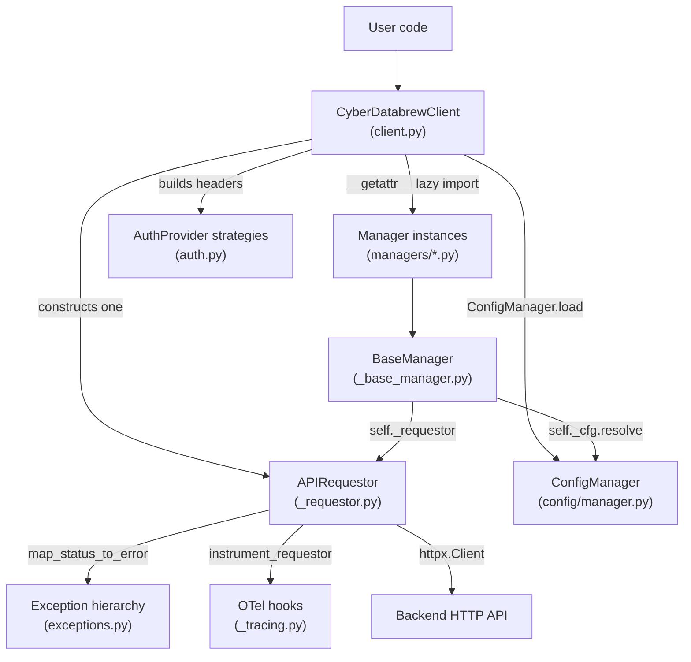
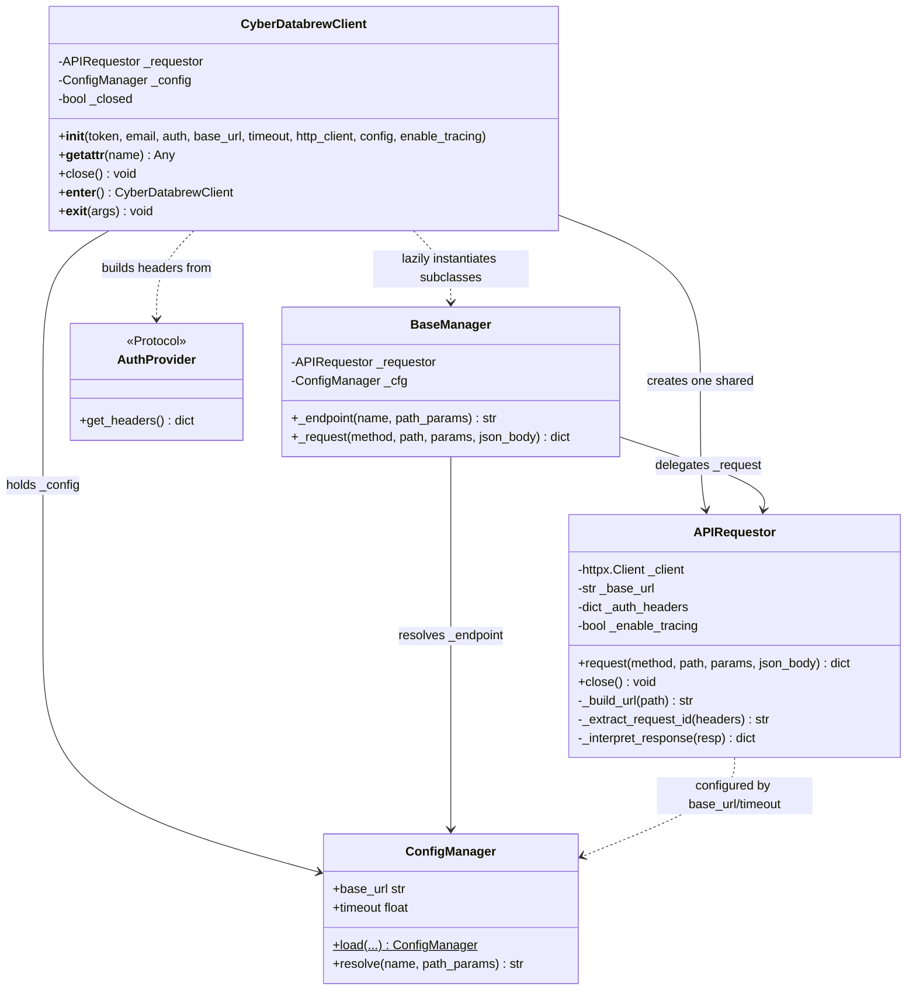
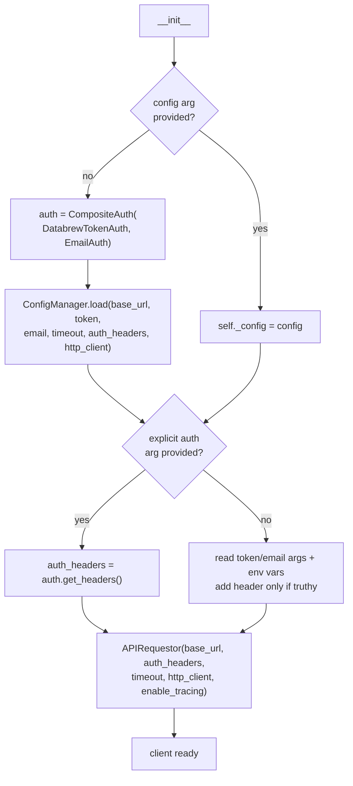
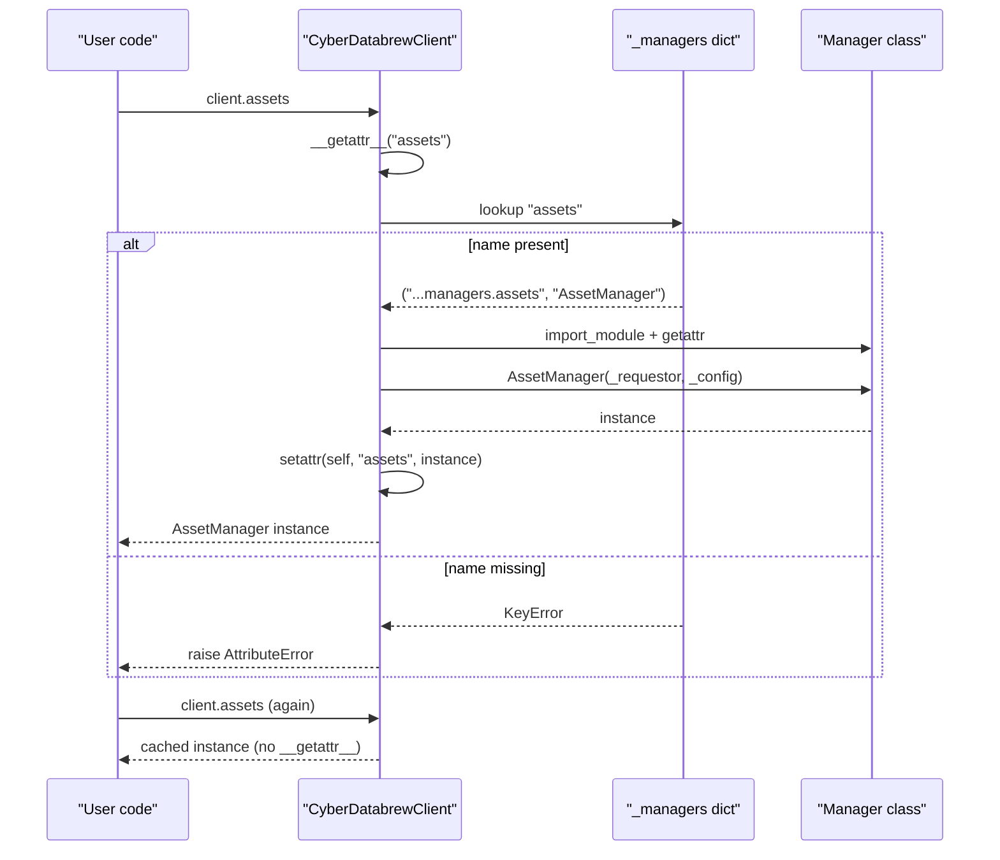
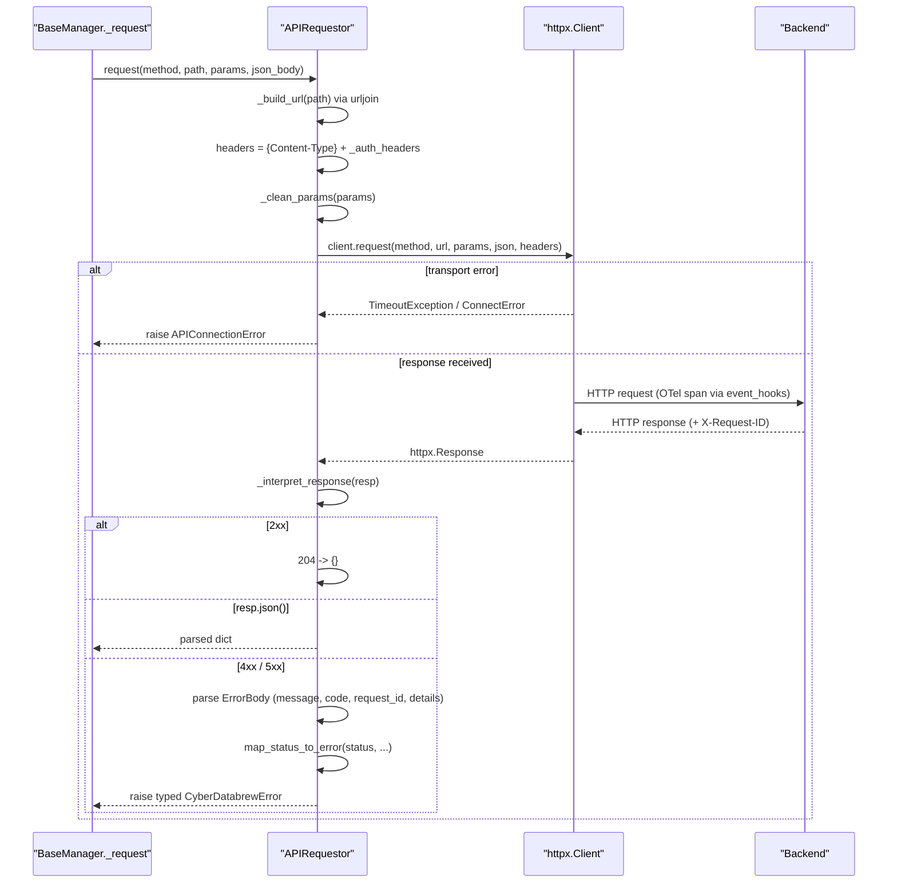
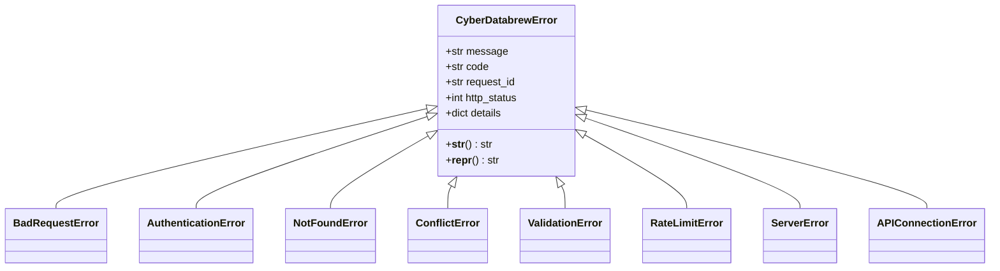
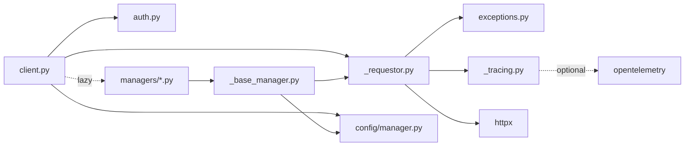

# Client & Requestor

<cite>
**Referenced Files in This Document**

- [sdk/src/cyber_databrew_sdk/client.py](file://sdk/src/cyber_databrew_sdk/client.py)
- [sdk/src/cyber_databrew_sdk/_requestor.py](file://sdk/src/cyber_databrew_sdk/_requestor.py)
- [sdk/src/cyber_databrew_sdk/_base_manager.py](file://sdk/src/cyber_databrew_sdk/_base_manager.py)
- [sdk/src/cyber_databrew_sdk/exceptions.py](file://sdk/src/cyber_databrew_sdk/exceptions.py)
- [sdk/src/cyber_databrew_sdk/_tracing.py](file://sdk/src/cyber_databrew_sdk/_tracing.py)
- [sdk/src/cyber_databrew_sdk/auth.py](file://sdk/src/cyber_databrew_sdk/auth.py)
- [sdk/src/cyber_databrew_sdk/config/manager.py](file://sdk/src/cyber_databrew_sdk/config/manager.py)
</cite>

## Table of Contents
1. [Introduction](#introduction)
2. [Project Structure](#project-structure)
3. [Core Components](#core-components)
4. [Architecture Overview](#architecture-overview)
5. [Detailed Component Analysis](#detailed-component-analysis)
6. [Dependency Analysis](#dependency-analysis)
7. [Performance Considerations](#performance-considerations)
8. [Troubleshooting Guide](#troubleshooting-guide)
9. [Conclusion](#conclusion)
10. [Appendices](#appendices)

## Introduction

The **client and requestor layer** is the spine of the cyber-databrew Python SDK. It provides the single object that user code instantiates — `CyberDatabrewClient` — and the single object through which every HTTP call physically leaves the process — `APIRequestor`. Between those two sits `BaseManager`, the common parent for the SDK's eleven semantic managers (assets, storage, delivery, and so on).

The design is borrowed directly from Stripe's Python SDK. `CyberDatabrewClient` is the analogue of Stripe's `StripeClient`: a thin facade that constructs one shared requestor and then lazily materializes service objects on first attribute access. `APIRequestor` is the analogue of Stripe's `_APIRequestor`: the one place where transport, header injection, error mapping, and response parsing happen. `BaseManager` mirrors Stripe's `StripeService`: a stateless accessor that holds a reference to the shared requestor and the SDK config, and delegates every call through `self._request()`.

This separation exists so that there is exactly one HTTP client, one set of authentication headers, and one error-mapping policy across the whole SDK, regardless of how many managers a caller touches. Users of the SDK interact almost exclusively with `CyberDatabrewClient` and the managers it exposes; the requestor and base manager are internal (underscore-prefixed) and are documented here for contributors and advanced integrators.

**Section sources**
- [sdk/src/cyber_databrew_sdk/client.py](file://sdk/src/cyber_databrew_sdk/client.py#L1-L73)
- [sdk/src/cyber_databrew_sdk/_requestor.py](file://sdk/src/cyber_databrew_sdk/_requestor.py#L1-L33)
- [sdk/src/cyber_databrew_sdk/_base_manager.py](file://sdk/src/cyber_databrew_sdk/_base_manager.py#L1-L17)

## Project Structure

The layer is implemented in three small modules under `sdk/src/cyber_databrew_sdk/`, supported by three collaborator modules (`auth.py`, `config/manager.py`, `exceptions.py`) and an optional tracing module (`_tracing.py`).

- **`client.py`** — defines `CyberDatabrewClient` (aliased as `CyberDatabrew`) and the module-level `_managers` registry mapping each public attribute name to a `(module_path, class_name)` pair. This is the user-facing entry point.
- **`_requestor.py`** — defines `APIRequestor`, the shared HTTP engine, plus the `_clean_params` helper that strips `None` query parameters.
- **`_base_manager.py`** — defines `BaseManager`, the parent class every manager extends; provides `_endpoint()` (name → URL path resolution via config) and `_request()` (delegation to the requestor).
- **`auth.py`** — defines the `AuthProvider` protocol and the concrete `DatabrewTokenAuth`, `EmailAuth`, and `CompositeAuth` strategies that produce request headers.
- **`config/manager.py`** — defines `ConfigManager`, whose `load()` classmethod merges env vars, files, and remote discovery, and whose `resolve()` turns endpoint names into paths.
- **`exceptions.py`** — defines the `CyberDatabrewError` hierarchy and the `map_status_to_error` factory used by the requestor.
- **`_tracing.py`** — optional OpenTelemetry instrumentation attached to the httpx client.

**Diagram sources**
- [sdk/src/cyber_databrew_sdk/client.py](file://sdk/src/cyber_databrew_sdk/client.py#L30-L165)
- [sdk/src/cyber_databrew_sdk/_requestor.py](file://sdk/src/cyber_databrew_sdk/_requestor.py#L39-L103)
- [sdk/src/cyber_databrew_sdk/_base_manager.py](file://sdk/src/cyber_databrew_sdk/_base_manager.py#L19-L52)

**Section sources**
- [sdk/src/cyber_databrew_sdk/client.py](file://sdk/src/cyber_databrew_sdk/client.py#L30-L50)
- [sdk/src/cyber_databrew_sdk/_requestor.py](file://sdk/src/cyber_databrew_sdk/_requestor.py#L1-L26)
- [sdk/src/cyber_databrew_sdk/_base_manager.py](file://sdk/src/cyber_databrew_sdk/_base_manager.py#L1-L17)

## Core Components

There are three core types in this layer plus two factory functions.

#### `CyberDatabrewClient`

The facade. Its constructor resolves configuration, resolves authentication headers, and builds the single shared `APIRequestor`. After construction it carries three declared attributes — `_requestor`, `_config`, and `_closed` — and exposes managers purely through `__getattr__`. The `_managers` dict at module scope is the authoritative list of the eleven managers and the import target for each. The class is also a context manager (`__enter__`/`__exit__`) and closes its requestor on `__del__`.

#### `APIRequestor`

The single request engine. It owns an `httpx.Client`, a normalized `_base_url` (trailing slash stripped), and an `_auth_headers` dict. Its public surface is `request(method, path, ...)` and `close()`. Internally, `_build_url` joins base + path with `urljoin`, `_extract_request_id` pulls `X-Request-ID` from response headers, and `_interpret_response` decides between returning parsed JSON and raising a typed exception.

#### `BaseManager`

The stateless parent. It stores `_requestor` and `_cfg`, exposes `_endpoint(name, **path_params)` to resolve endpoint names through config, and `_request(...)` as a thin override hook that delegates straight to `APIRequestor.request`. Managers are deliberately stateless accessors (the OpenAI/Stripe pattern), not domain objects with cached state.

#### `map_status_to_error` and `_clean_params`

`map_status_to_error` (in `exceptions.py`) is the factory that turns an HTTP status and a parsed `ErrorBody` into a typed exception. `_clean_params` (in `_requestor.py`) removes `None` query parameters before they reach httpx.

**Section sources**
- [sdk/src/cyber_databrew_sdk/client.py](file://sdk/src/cyber_databrew_sdk/client.py#L53-L188)
- [sdk/src/cyber_databrew_sdk/_requestor.py](file://sdk/src/cyber_databrew_sdk/_requestor.py#L28-L142)
- [sdk/src/cyber_databrew_sdk/_base_manager.py](file://sdk/src/cyber_databrew_sdk/_base_manager.py#L19-L52)
- [sdk/src/cyber_databrew_sdk/exceptions.py](file://sdk/src/cyber_databrew_sdk/exceptions.py#L119-L156)

## Architecture Overview

The three types form a one-to-many fan-out: one client builds one requestor, and every manager (created on demand) is handed a reference to that same requestor and the same config. There is no per-manager HTTP client and no per-call client construction.

**Diagram sources**
- [sdk/src/cyber_databrew_sdk/client.py](file://sdk/src/cyber_databrew_sdk/client.py#L53-L188)
- [sdk/src/cyber_databrew_sdk/_requestor.py](file://sdk/src/cyber_databrew_sdk/_requestor.py#L28-L142)
- [sdk/src/cyber_databrew_sdk/_base_manager.py](file://sdk/src/cyber_databrew_sdk/_base_manager.py#L19-L52)
- [sdk/src/cyber_databrew_sdk/auth.py](file://sdk/src/cyber_databrew_sdk/auth.py#L14-L21)
- [sdk/src/cyber_databrew_sdk/config/manager.py](file://sdk/src/cyber_databrew_sdk/config/manager.py#L154-L164)

**Section sources**
- [sdk/src/cyber_databrew_sdk/client.py](file://sdk/src/cyber_databrew_sdk/client.py#L75-L146)
- [sdk/src/cyber_databrew_sdk/_base_manager.py](file://sdk/src/cyber_databrew_sdk/_base_manager.py#L25-L37)

## Detailed Component Analysis

### Client construction and configuration resolution

The constructor runs a fixed three-step sequence. First it resolves configuration: if the caller passed a pre-built `ConfigManager` it is used verbatim; otherwise the client builds default auth headers (a `CompositeAuth` wrapping `DatabrewTokenAuth` and `EmailAuth`) and calls `ConfigManager.load(...)`, forwarding `base_url`, `token`, `email`, `timeout`, the computed `auth_headers`, and any injected `http_client`. Those auth headers matter here because remote config discovery (`GET /api/v1/sdk-config`) must itself be authenticated.

Second it resolves authentication for normal requests. If an explicit `AuthProvider` was supplied, its `get_headers()` wins. Otherwise the client builds headers inline from `token`/`email` arguments, falling back to the `CYBER_DATABREW_TOKEN`, then `DATABREW_TOKEN`, then `CYBER_DATABREW_EMAIL` environment variables, and only adds a header when the corresponding value is truthy.

Third it constructs the one shared `APIRequestor`, passing `self._config.base_url`, the resolved `auth_headers`, `self._config.timeout`, the optional `http_client`, and the `enable_tracing` flag.

**Diagram sources**
- [sdk/src/cyber_databrew_sdk/client.py](file://sdk/src/cyber_databrew_sdk/client.py#L107-L146)

**Section sources**
- [sdk/src/cyber_databrew_sdk/client.py](file://sdk/src/cyber_databrew_sdk/client.py#L79-L146)
- [sdk/src/cyber_databrew_sdk/auth.py](file://sdk/src/cyber_databrew_sdk/auth.py#L24-L74)
- [sdk/src/cyber_databrew_sdk/config/manager.py](file://sdk/src/cyber_databrew_sdk/config/manager.py#L73-L164)

### Lazy manager access via `__getattr__`

Managers are not created in `__init__`. Instead, `__getattr__` fires only for attributes Python could not find normally. It looks the requested name up in the module-level `_managers` dict; a miss raises `AttributeError` with the standard message, which preserves correct semantics for genuinely unknown attributes (and keeps tools like `hasattr` honest). On a hit, it imports the target module with `import_module`, fetches the manager class with `getattr`, instantiates it with `(self._requestor, self._config)`, and — crucially — caches the instance back onto the client via `setattr(self, name, instance)`. Because the attribute now exists on the instance, subsequent accesses bypass `__getattr__` entirely, so each manager is imported and built at most once.

This achieves three goals from the Stripe `V1Services` pattern: managers (and their transitive imports) are only paid for when used; all managers share the one requestor and config; and the eleven-manager surface stays declarative in a single dict rather than scattered across constructor assignments.

**Diagram sources**
- [sdk/src/cyber_databrew_sdk/client.py](file://sdk/src/cyber_databrew_sdk/client.py#L152-L165)

**Section sources**
- [sdk/src/cyber_databrew_sdk/client.py](file://sdk/src/cyber_databrew_sdk/client.py#L30-L50)
- [sdk/src/cyber_databrew_sdk/client.py](file://sdk/src/cyber_databrew_sdk/client.py#L148-L165)

### The APIRequestor request path

`request(method, path, *, params, json_body)` is the single transport entry point. It builds the absolute URL, assembles headers by starting from a fixed `Content-Type: application/json` and merging the auth headers, then calls `self._client.request(...)` with the cleaned query params (`_clean_params` drops `None` values) and the JSON body. Two httpx exception classes are caught and re-raised as the SDK's own `APIConnectionError`: `httpx.TimeoutException` becomes a "Request timed out" connection error and `httpx.ConnectError` becomes a "Connection failed" connection error. Any successful or error HTTP response is handed to `_interpret_response`.

**Diagram sources**
- [sdk/src/cyber_databrew_sdk/_requestor.py](file://sdk/src/cyber_databrew_sdk/_requestor.py#L66-L134)
- [sdk/src/cyber_databrew_sdk/exceptions.py](file://sdk/src/cyber_databrew_sdk/exceptions.py#L119-L156)

**Section sources**
- [sdk/src/cyber_databrew_sdk/_requestor.py](file://sdk/src/cyber_databrew_sdk/_requestor.py#L66-L142)

### Authentication headers

The header set sent on every request is the merge of a constant `Content-Type` and the requestor's `_auth_headers`. Those auth headers come from one of two sources, decided in the client constructor. The pluggable path uses an `AuthProvider` (a `Protocol` with a single `get_headers()` method). `DatabrewTokenAuth` emits `X-Databrew-Token` (token resolved from argument or the `CYBER_DATABREW_TOKEN`/`DATABREW_TOKEN` env vars). `EmailAuth` emits `X-User-Email`, which is explicitly audit-only and not a security credential. `CompositeAuth` merges several providers, with later providers overriding earlier ones on key conflict and empty-valued headers filtered out. The default composite is `CompositeAuth(DatabrewTokenAuth(token), EmailAuth(email))`. The inline fallback path (no `AuthProvider`) reproduces the same two headers directly from arguments and env vars.

**Section sources**
- [sdk/src/cyber_databrew_sdk/auth.py](file://sdk/src/cyber_databrew_sdk/auth.py#L14-L74)
- [sdk/src/cyber_databrew_sdk/client.py](file://sdk/src/cyber_databrew_sdk/client.py#L113-L137)
- [sdk/src/cyber_databrew_sdk/_requestor.py](file://sdk/src/cyber_databrew_sdk/_requestor.py#L81-L84)

### Retries

A precise note for contributors: the requestor as implemented does **not** perform automatic retries or backoff. The only resilience behavior in the transport path is exception translation — `httpx.TimeoutException` and `httpx.ConnectError` are converted to `APIConnectionError` rather than being retried. There is no retry loop, no retry-count parameter, and no `429`/`5xx` re-attempt logic in `_requestor.py`. Callers that need retries must wrap calls themselves or inject an `httpx.Client` configured with a retrying transport. Documenting this absence is deliberate so the page does not overstate behavior the code does not have.

**Section sources**
- [sdk/src/cyber_databrew_sdk/_requestor.py](file://sdk/src/cyber_databrew_sdk/_requestor.py#L86-L103)

### Response interpretation and error mapping

`_interpret_response` first extracts a request id from the response headers (`X-Request-ID`, case-insensitive). On success it short-circuits `204 No Content` to an empty dict and otherwise returns `resp.json()`. On failure it parses the backend `ErrorBody` envelope — the same shape the backend emits (`{"code", "message", "request_id", "details"}`) — defaulting to an empty dict if the body is not valid JSON. It then derives `message` (body message, else raw text, else `HTTP <status>`), `code`, and `details`, and lets a body-supplied `request_id` take precedence over the header value. Finally it calls `map_status_to_error`, which selects a typed exception by status code:

| Status | Exception |
| --- | --- |
| 400, 414 | `BadRequestError` |
| 401, 403 | `AuthenticationError` |
| 404 | `NotFoundError` |
| 409 | `ConflictError` |
| 422 | `ValidationError` |
| 429 | `RateLimitError` |
| 500–599 | `ServerError` |
| anything else | base `CyberDatabrewError` |

Every exception carries `message`, `code`, `request_id`, `http_status`, and `details`, so callers can branch on the backend `code` (for example `CONCURRENT_CONFLICT` versus `DUPLICATE_ASSET_ID`) without string parsing. `__str__` prefixes the request id when present, which makes logged errors traceable end to end.

**Diagram sources**
- [sdk/src/cyber_databrew_sdk/exceptions.py](file://sdk/src/cyber_databrew_sdk/exceptions.py#L19-L116)

**Section sources**
- [sdk/src/cyber_databrew_sdk/_requestor.py](file://sdk/src/cyber_databrew_sdk/_requestor.py#L105-L134)
- [sdk/src/cyber_databrew_sdk/exceptions.py](file://sdk/src/cyber_databrew_sdk/exceptions.py#L19-L156)

### Tracing

When `enable_tracing` is true (the default), the requestor calls `instrument_requestor(self._client)` during construction. That helper is a no-op unless `opentelemetry-api` is installed (the `[otel]` extra). When OTel is present it appends httpx `event_hooks`: the request hook starts a `CLIENT`-kind span named `"<METHOD> <path>"` with `http.request.method`, `url.full`, and `url.path` attributes and stashes the span in `request.extensions["_otel_span"]`; the response hook adds `http.response.status_code` and `http.request_id` (from `X-Request-ID`), marks the span `ERROR` for status ≥ 400 and `OK` otherwise, then ends it; an optional exception hook records `error.type`/`error.message` when httpx supports the `"exception"` hook. Hooks are appended, not replaced, so instrumentation is safe to apply more than once.

**Section sources**
- [sdk/src/cyber_databrew_sdk/_requestor.py](file://sdk/src/cyber_databrew_sdk/_requestor.py#L51-L55)
- [sdk/src/cyber_databrew_sdk/_tracing.py](file://sdk/src/cyber_databrew_sdk/_tracing.py#L37-L104)

### BaseManager: endpoint resolution and delegation

Every concrete manager extends `BaseManager`, which is constructed with the shared `(requestor, config)`. Managers express endpoints by name rather than hard-coded paths: `_endpoint("asset_get", asset_id="abc")` calls `self._cfg.resolve(...)` and returns a concrete path such as `/api/v1/assets/abc`. This indirection lets endpoint paths be driven by config (including remote discovery) rather than baked into the manager. The `_request(...)` method is intentionally a one-line delegation to `APIRequestor.request`; it exists as an override seam so a subclass can add pre/post-processing (progress bars, auto-pagination, parameter flattening) without bypassing the shared requestor.

**Section sources**
- [sdk/src/cyber_databrew_sdk/_base_manager.py](file://sdk/src/cyber_databrew_sdk/_base_manager.py#L19-L52)
- [sdk/src/cyber_databrew_sdk/config/manager.py](file://sdk/src/cyber_databrew_sdk/config/manager.py#L154-L164)

## Dependency Analysis

The layer depends downward on `httpx` for transport, `ConfigManager` for base URL / timeout / endpoint resolution, the `AuthProvider` strategies for headers, the exception module for error typing, and optionally OpenTelemetry for tracing. The eleven managers depend upward on `BaseManager` and, through it, on the requestor. Nothing in this layer depends on a specific manager, which is what keeps the `_managers` registry purely declarative.

**Diagram sources**
- [sdk/src/cyber_databrew_sdk/client.py](file://sdk/src/cyber_databrew_sdk/client.py#L19-L23)
- [sdk/src/cyber_databrew_sdk/_requestor.py](file://sdk/src/cyber_databrew_sdk/_requestor.py#L14-L25)
- [sdk/src/cyber_databrew_sdk/_base_manager.py](file://sdk/src/cyber_databrew_sdk/_base_manager.py#L11-L16)

**Section sources**
- [sdk/src/cyber_databrew_sdk/client.py](file://sdk/src/cyber_databrew_sdk/client.py#L12-L23)
- [sdk/src/cyber_databrew_sdk/_requestor.py](file://sdk/src/cyber_databrew_sdk/_requestor.py#L14-L25)
- [sdk/src/cyber_databrew_sdk/_tracing.py](file://sdk/src/cyber_databrew_sdk/_tracing.py#L15-L31)

## Performance Considerations

- **One shared HTTP client.** A single `httpx.Client` backs the whole SDK, so connection pooling and keep-alive are reused across all managers and calls. Creating a fresh client per request is avoided entirely.
- **Lazy, cached managers.** `__getattr__` defers both the `import_module` cost and instantiation until a manager is first used, and `setattr` caches the result so each manager is built once. Touching `client.assets` repeatedly costs a plain attribute lookup after the first access.
- **Param sanitization.** `_clean_params` strips `None` query params before they reach httpx, avoiding spurious `key=None` query strings.
- **`204` short-circuit.** `_interpret_response` returns `{}` for `204` without attempting `resp.json()`, avoiding a parse on empty bodies.
- **Tracing overhead.** OTel hooks add per-request span work only when OpenTelemetry is installed and `enable_tracing` is true; otherwise `instrument_requestor` returns immediately.
- **No retry amplification.** Because there is no built-in retry loop, a single logical call maps to exactly one HTTP attempt — predictable latency, but the caller owns resilience.

**Section sources**
- [sdk/src/cyber_databrew_sdk/_requestor.py](file://sdk/src/cyber_databrew_sdk/_requestor.py#L48-L55)
- [sdk/src/cyber_databrew_sdk/_requestor.py](file://sdk/src/cyber_databrew_sdk/_requestor.py#L109-L141)
- [sdk/src/cyber_databrew_sdk/client.py](file://sdk/src/cyber_databrew_sdk/client.py#L152-L165)

## Troubleshooting Guide

#### `AttributeError: 'CyberDatabrewClient' object has no attribute '<x>'`
The attribute name is not a key in the `_managers` dict. Check spelling against the eleven registered names (for example `assets`, `algo_runs`, `pipeline_components`). The same error is also raised for any genuinely unknown attribute, which is intended.

#### `APIConnectionError: Request timed out` / `Connection failed`
The transport layer caught `httpx.TimeoutException` or `httpx.ConnectError`. Verify the base URL is reachable and increase `timeout` (constructor argument or config). Remember there is no automatic retry — transient blips surface immediately.

#### `AuthenticationError` (401/403)
The token header was missing or rejected. Confirm a token reached `_auth_headers`: pass `token=...`, set `CYBER_DATABREW_TOKEN` (or `DATABREW_TOKEN`), or supply a custom `AuthProvider`. Note `X-User-Email` is audit-only and never satisfies authentication on its own.

#### Wrong base URL or stale endpoints
Base URL and timeout come from `ConfigManager`, which merges env vars, files, and remote discovery (`GET /api/v1/sdk-config`). To pin behavior, build a `ConfigManager` explicitly and pass `config=...`; in that mode the `base_url`/`timeout`/`token`/`email` arguments are ignored in favor of the config (an explicit `auth` still applies).

#### Spans not appearing
Tracing is a no-op unless `opentelemetry-api` is installed and `enable_tracing` is true. Install the `[otel]` extra and confirm an exporter/tracer provider is configured in the host process.

#### Reading `request_id` from a failure
Every `CyberDatabrewError` exposes `.request_id` (body value preferred over the `X-Request-ID` header) plus `.code`, `.http_status`, and `.details`. Branch on `.code` for backend-specific handling.

**Section sources**
- [sdk/src/cyber_databrew_sdk/client.py](file://sdk/src/cyber_databrew_sdk/client.py#L152-L165)
- [sdk/src/cyber_databrew_sdk/_requestor.py](file://sdk/src/cyber_databrew_sdk/_requestor.py#L86-L134)
- [sdk/src/cyber_databrew_sdk/exceptions.py](file://sdk/src/cyber_databrew_sdk/exceptions.py#L28-L56)
- [sdk/src/cyber_databrew_sdk/config/manager.py](file://sdk/src/cyber_databrew_sdk/config/manager.py#L73-L164)

## Conclusion

The client and requestor layer applies a disciplined facade-plus-shared-engine pattern: `CyberDatabrewClient` resolves config and auth, builds exactly one `APIRequestor`, and exposes managers lazily through `__getattr__`; `BaseManager` gives every manager uniform endpoint resolution and a single delegation seam; and `APIRequestor` centralizes header injection, transport, response parsing, error mapping, and optional tracing. The result is one HTTP client, one auth policy, and one error taxonomy across the SDK. The notable boundary to keep in mind is the absence of built-in retries — resilience is the caller's responsibility or must be supplied via an injected httpx transport.

## Appendices

### Registered managers (`_managers`)

| Attribute | Module | Class |
| --- | --- | --- |
| `assets` | `cyber_databrew_sdk.managers.assets` | `AssetManager` |
| `storage` | `cyber_databrew_sdk.managers.storage` | `StorageManager` |
| `delivery` | `cyber_databrew_sdk.managers.delivery` | `DeliveryManager` |
| `algo_runs` | `cyber_databrew_sdk.managers.algo_runs` | `AlgoRunManager` |
| `search` | `cyber_databrew_sdk.managers.search` | `SearchManager` |
| `queries` | `cyber_databrew_sdk.managers.queries` | `QueryManager` |
| `customers` | `cyber_databrew_sdk.managers.customers` | `CustomerManager` |
| `lakehouse` | `cyber_databrew_sdk.managers.lakehouse` | `LakehouseManager` |
| `events` | `cyber_databrew_sdk.managers.events` | `EventManager` |
| `registry` | `cyber_databrew_sdk.managers.registry` | `RegistryManager` |
| `audit` | `cyber_databrew_sdk.managers.audit` | `AuditManager` |
| `actions` | `cyber_databrew_sdk.managers.actions` | `ActionManager` |
| `eval_metrics` | `cyber_databrew_sdk.managers.eval_metrics` | `EvalMetricsManager` |
| `admin_search` | `cyber_databrew_sdk.managers.admin_search` | `AdminSearchManager` |
| `workflows` | `cyber_databrew_sdk.managers.workflows` | `WorkflowManager` |
| `pipeline_components` | `cyber_databrew_sdk.managers.pipeline_components` | `PipelineComponentManager` |

### Constructor arguments (`CyberDatabrewClient.__init__`)

| Argument | Default source | Purpose |
| --- | --- | --- |
| `token` | `CYBER_DATABREW_TOKEN`, then `DATABREW_TOKEN` | `X-Databrew-Token` value |
| `email` | `CYBER_DATABREW_EMAIL` | `X-User-Email` (audit-only) |
| `auth` | `CompositeAuth(token, email)` | custom `AuthProvider`, overrides token/email |
| `base_url` | `CYBER_DATABREW_BASE_URL` / `http://localhost:8080` | API base URL |
| `timeout` | `30.0` | request timeout (seconds) |
| `http_client` | new `httpx.Client` | injectable client (testing) |
| `config` | built via `ConfigManager.load` | pre-built config (overrides url/timeout/token/email) |
| `enable_tracing` | `True` | attach OTel hooks when available |

### Status → exception mapping

See the table in [Response interpretation and error mapping](#response-interpretation-and-error-mapping). Backed by `_STATUS_TO_ERROR` and `map_status_to_error`.

**Section sources**
- [sdk/src/cyber_databrew_sdk/client.py](file://sdk/src/cyber_databrew_sdk/client.py#L30-L50)
- [sdk/src/cyber_databrew_sdk/client.py](file://sdk/src/cyber_databrew_sdk/client.py#L79-L106)
- [sdk/src/cyber_databrew_sdk/exceptions.py](file://sdk/src/cyber_databrew_sdk/exceptions.py#L107-L156)
