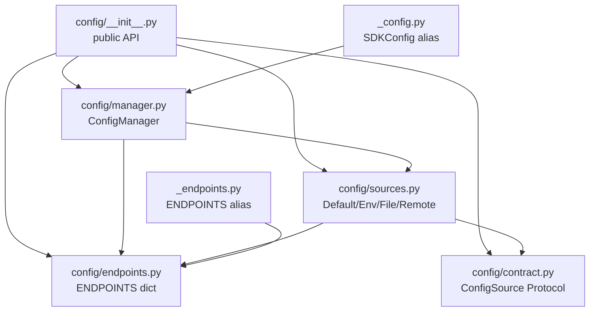
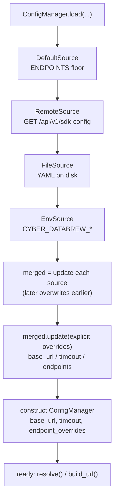
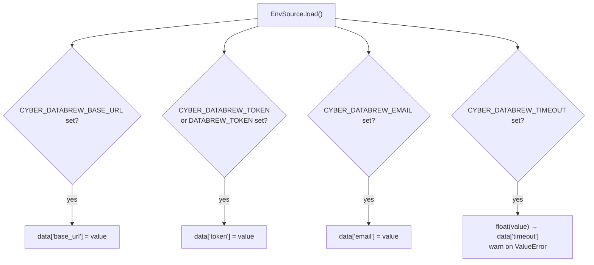
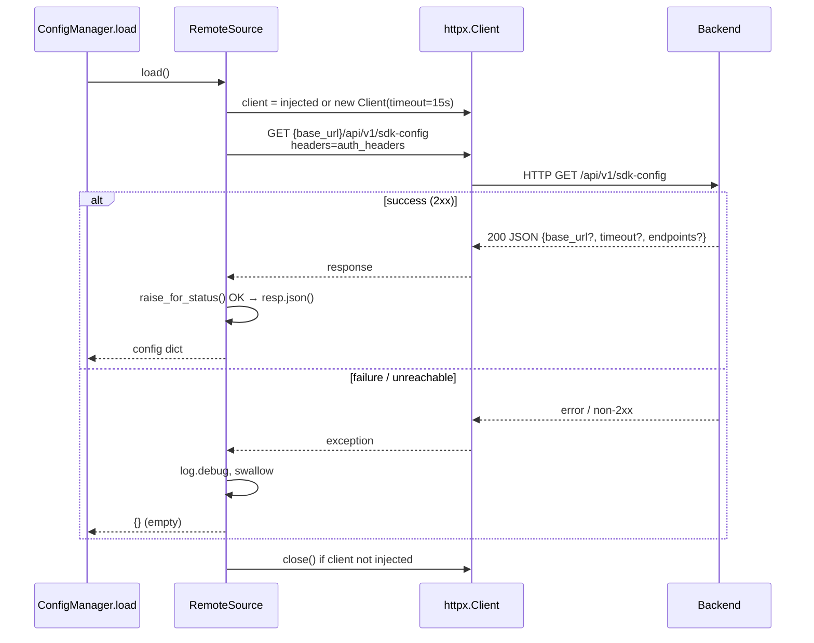
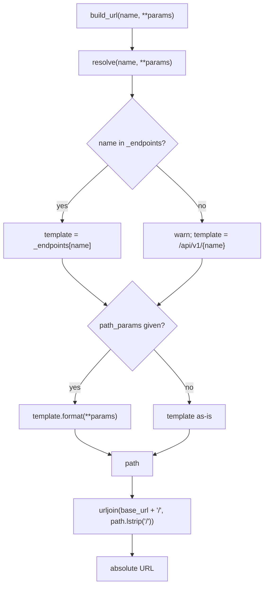
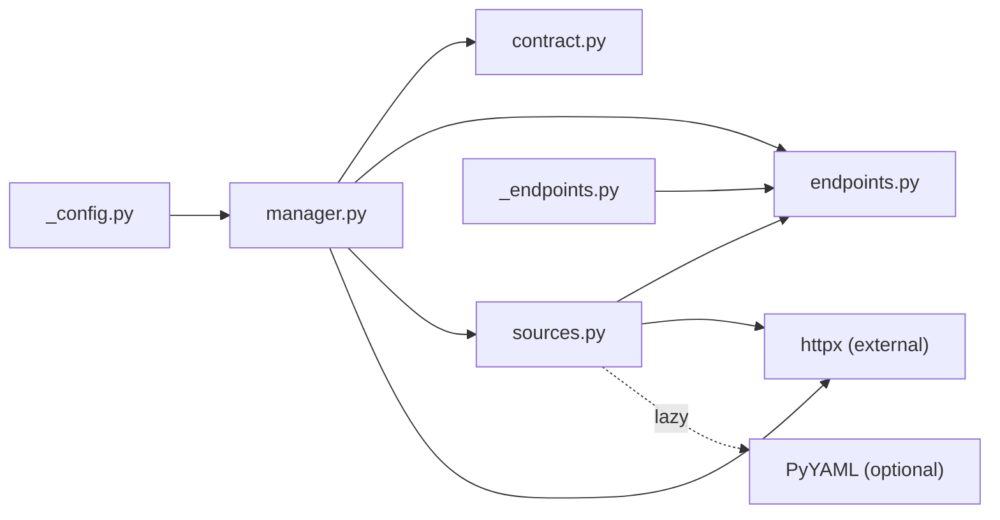

# Configuration Resolution

<cite>
**Referenced Files in This Document**

- [sdk/src/cyber_databrew_sdk/config/__init__.py](file://sdk/src/cyber_databrew_sdk/config/__init__.py)
- [sdk/src/cyber_databrew_sdk/config/contract.py](file://sdk/src/cyber_databrew_sdk/config/contract.py)
- [sdk/src/cyber_databrew_sdk/config/endpoints.py](file://sdk/src/cyber_databrew_sdk/config/endpoints.py)
- [sdk/src/cyber_databrew_sdk/config/manager.py](file://sdk/src/cyber_databrew_sdk/config/manager.py)
- [sdk/src/cyber_databrew_sdk/config/sources.py](file://sdk/src/cyber_databrew_sdk/config/sources.py)
- [sdk/src/cyber_databrew_sdk/_config.py](file://sdk/src/cyber_databrew_sdk/_config.py)
- [sdk/src/cyber_databrew_sdk/_endpoints.py](file://sdk/src/cyber_databrew_sdk/_endpoints.py)
</cite>

## Table of Contents
1. [Introduction](#introduction)
2. [Project Structure](#project-structure)
3. [Core Components](#core-components)
4. [Architecture Overview](#architecture-overview)
5. [Detailed Component Analysis](#detailed-component-analysis)
6. [Dependency Analysis](#dependency-analysis)
7. [Performance Considerations](#performance-considerations)
8. [Troubleshooting Guide](#troubleshooting-guide)
9. [Conclusion](#conclusion)
10. [Appendices](#appendices)

## Introduction

The `cyber_databrew_sdk.config` package is the single subsystem responsible for
answering two questions every time a client is constructed: **where does the API
live** (the `base_url` and request `timeout`) and **what is the URL path for a
given logical operation** (the endpoint registry). Rather than hard-coding these
answers in each domain manager, the SDK funnels all of them through one
`ConfigManager` that merges several independent configuration sources in a
strict, documented priority order.

The design goal is layered overridability. A developer can run against
`http://localhost:8080` with zero configuration, point a deployed application at
production purely through environment variables, pin a base URL and per-endpoint
overrides in a YAML file, or let the backend itself advertise its current
endpoint map through a remote discovery call — all without touching SDK code.
Each origin is modeled as an interchangeable `ConfigSource`, so the precedence
chain is data, not branching logic.

The package also defines a cross-language `ConfigSource` Protocol so that SDKs in
other languages can implement the same contract, and it keeps two backward-compat
shims (`_config.py`, `_endpoints.py`) alive for code written against the older
flat module layout.

**Section sources**
- [sdk/src/cyber_databrew_sdk/config/__init__.py](file://sdk/src/cyber_databrew_sdk/config/__init__.py#L1-L33)
- [sdk/src/cyber_databrew_sdk/config/manager.py](file://sdk/src/cyber_databrew_sdk/config/manager.py#L37-L51)

## Project Structure

The configuration subsystem lives under `sdk/src/cyber_databrew_sdk/config/` and
is split by responsibility. The package `__init__.py` re-exports the public API
so callers import everything from `cyber_databrew_sdk.config`.

- **`__init__.py`** — public surface. Re-exports `ConfigManager`, `ConfigSource`,
  the four built-in sources, and the `ENDPOINTS` registry, and declares `__all__`.
- **`contract.py`** — the `ConfigSource` Protocol: the cross-language interface
  that every source implements (`source_name` attribute + `load()` method).
- **`endpoints.py`** — the `ENDPOINTS` dict: the built-in, authoritative map of
  logical endpoint names to URL path templates (the source of truth for defaults).
- **`sources.py`** — the four concrete `ConfigSource` implementations:
  `DefaultSource`, `EnvSource`, `FileSource`, `RemoteSource`.
- **`manager.py`** — `ConfigManager`: assembles the sources, merges them, applies
  explicit overrides, and exposes `resolve()` / `build_url()` / `refresh()`.

Two shims sit one level up, in the SDK root, for backward compatibility:

- **`_config.py`** — re-exports `ConfigManager` under the legacy name `SDKConfig`.
- **`_endpoints.py`** — re-exports the `ENDPOINTS` dict from its new home.



**Diagram sources**
- [sdk/src/cyber_databrew_sdk/config/__init__.py](file://sdk/src/cyber_databrew_sdk/config/__init__.py#L19-L32)
- [sdk/src/cyber_databrew_sdk/config/manager.py](file://sdk/src/cyber_databrew_sdk/config/manager.py#L30-L32)
- [sdk/src/cyber_databrew_sdk/config/sources.py](file://sdk/src/cyber_databrew_sdk/config/sources.py#L18-L18)
- [sdk/src/cyber_databrew_sdk/_config.py](file://sdk/src/cyber_databrew_sdk/_config.py#L1-L8)
- [sdk/src/cyber_databrew_sdk/_endpoints.py](file://sdk/src/cyber_databrew_sdk/_endpoints.py#L1-L8)

**Section sources**
- [sdk/src/cyber_databrew_sdk/config/__init__.py](file://sdk/src/cyber_databrew_sdk/config/__init__.py#L1-L33)
- [sdk/src/cyber_databrew_sdk/_config.py](file://sdk/src/cyber_databrew_sdk/_config.py#L1-L8)
- [sdk/src/cyber_databrew_sdk/_endpoints.py](file://sdk/src/cyber_databrew_sdk/_endpoints.py#L1-L8)

## Core Components

### `ConfigSource` (Protocol)

`ConfigSource` is a `@runtime_checkable` `Protocol` defining the universal source
contract. Every source exposes a `source_name: str` attribute (used in debug
logging) and a `load() -> dict[str, Any]` method. `load()` may return a partial
dict containing any of `base_url`, `timeout`, and `endpoints`, and the manager is
responsible for merging the partial dicts. Modeling the contract as a Protocol
(rather than an ABC) means an object only needs the right shape to qualify as a
source — this is what makes the system extensible across SDK languages.

### `ENDPOINTS` registry

`ENDPOINTS` is a flat `dict[str, str]` mapping a logical endpoint name in the
form `{domain}_{action}` to a URL path template. Templates use `str.format`
placeholders such as `{asset_id}` for parameter substitution. This dict is the
**single source of truth** for default paths — domain managers never hard-code
paths, they ask the `ConfigManager` to resolve a name. Domains covered include
assets, storage/MCAP, deliveries, algo runs, search, queries, customers,
lakehouse analytics, events, registries, audit, actions, eval/metrics, admin
reindex jobs, workflows, pipeline components, and the bootstrap `sdk_config`
endpoint itself.

### Built-in sources

- **`DefaultSource`** — returns `{"endpoints": dict(ENDPOINTS)}`; the lowest-priority
  floor that guarantees a working endpoint map even offline.
- **`EnvSource`** — reads `CYBER_DATABREW_*` environment variables (with a
  `DATABREW_TOKEN` fallback for the token).
- **`FileSource`** — loads a YAML file from a fixed search path.
- **`RemoteSource`** — performs `GET /api/v1/sdk-config` against the backend.

### `ConfigManager`

The orchestrator. `ConfigManager.load(...)` is the builder that wires the sources
together; the instance then exposes `base_url`, `timeout`, `resolve()`,
`build_url()`, and `refresh()`.

**Section sources**
- [sdk/src/cyber_databrew_sdk/config/contract.py](file://sdk/src/cyber_databrew_sdk/config/contract.py#L13-L34)
- [sdk/src/cyber_databrew_sdk/config/endpoints.py](file://sdk/src/cyber_databrew_sdk/config/endpoints.py#L11-L142)
- [sdk/src/cyber_databrew_sdk/config/sources.py](file://sdk/src/cyber_databrew_sdk/config/sources.py#L25-L156)
- [sdk/src/cyber_databrew_sdk/config/manager.py](file://sdk/src/cyber_databrew_sdk/config/manager.py#L37-L217)

## Architecture Overview

Configuration resolution is a two-phase pipeline. **Phase one (merge)** runs once
inside `ConfigManager.load()`: every source's `load()` is called, the resulting
partial dicts are merged in priority order, and explicit constructor overrides
are applied last. **Phase two (resolve)** happens on demand whenever a domain
manager needs a URL: `resolve()` looks up an endpoint name in the merged endpoint
map and formats its placeholders, and `build_url()` joins that path onto the
resolved `base_url`.

The documented precedence (highest wins) is: explicit constructor args →
environment variables → config file → remote discovery → built-in defaults. This
is implemented by ordering the source list lowest-priority-first and merging with
`dict.update()`, so later entries overwrite earlier ones, and then calling
`merged.update(overrides)` for the explicit arguments at the very end.



**Diagram sources**
- [sdk/src/cyber_databrew_sdk/config/manager.py](file://sdk/src/cyber_databrew_sdk/config/manager.py#L97-L150)

**Section sources**
- [sdk/src/cyber_databrew_sdk/config/manager.py](file://sdk/src/cyber_databrew_sdk/config/manager.py#L37-L150)

## Detailed Component Analysis

### Precedence chain and the merge algorithm

The precedence chain is built in `ConfigManager.load()`. Although the docstring
lists priority from highest to lowest, the implementation assembles the source
list in the **opposite** order — lowest priority first — precisely because the
merge uses sequential `dict.update()` where the last writer wins:

```python
sources: list[ConfigSource] = [
    DefaultSource(),
    RemoteSource(bootstrap_base, auth_headers, http_client=http_client),
    FileSource(),
    EnvSource(),
]

merged: dict[str, Any] = {}
for source in sources:
    data = source.load()
    merged.update(data)

merged.update(overrides)
```

So `DefaultSource` lays down the endpoint floor, `RemoteSource` may overwrite it
with backend-advertised values, `FileSource` may overwrite those, `EnvSource`
overwrites again, and finally the explicit `overrides` dict (built from the
`base_url`, `timeout`, and `endpoint_overrides` arguments) wins over everything.

Note that the **whole** value for a key is replaced, not deep-merged. If
`EnvSource` returns `{"base_url": ...}` it does not touch the `endpoints` map; but
if two sources both supply `endpoints`, the later source's `endpoints` dict
replaces the earlier one wholesale rather than being key-merged. The endpoint
floor therefore comes from whichever single highest-priority source provides an
`endpoints` key — in practice `DefaultSource` always supplies the full map, and
remote/file/override sources that supply `endpoints` are expected to be complete
or are reconciled through `endpoint_overrides` at construction time.

After merging, the manager is constructed with `base_url` defaulting to
`http://localhost:8080`, `timeout` coerced to `float` (default `30.0`), and
`endpoint_overrides` taken from `merged.get("endpoints") or {}`. The constructor's
`_rebuild()` then layers those overrides on top of a fresh copy of `ENDPOINTS`,
which is the final guard ensuring no built-in endpoint is ever lost.

**Section sources**
- [sdk/src/cyber_databrew_sdk/config/manager.py](file://sdk/src/cyber_databrew_sdk/config/manager.py#L53-L150)

### `EnvSource` — environment variables

`EnvSource` reads variables under a configurable prefix that defaults to
`CYBER_DATABREW`. It maps four logical settings and includes a legacy fallback for
the token. Only keys that are actually present are added to the returned dict, so
absent variables never clobber lower-priority sources. The timeout is parsed with
`float()`; a non-numeric value is logged as a warning and skipped rather than
raising.



**Diagram sources**
- [sdk/src/cyber_databrew_sdk/config/sources.py](file://sdk/src/cyber_databrew_sdk/config/sources.py#L50-L72)

**Section sources**
- [sdk/src/cyber_databrew_sdk/config/sources.py](file://sdk/src/cyber_databrew_sdk/config/sources.py#L34-L72)

### `FileSource` — YAML on disk

`FileSource` accepts an optional explicit `path`. When none is given, `_find()`
walks a fixed candidate list in order and returns the first existing file:
`./.cyber-databrew.yaml` (current working directory) then
`~/.cyber-databrew/config.yaml` (user home). The class docstring also lists the
explicit `path` argument as the first-priority location.

`load()` returns an empty dict if no file was found. It imports `yaml` lazily; if
PyYAML is not installed it emits a warning suggesting `uv add pyyaml` and returns
an empty dict instead of crashing. Parse and I/O errors are likewise caught and
logged, degrading to an empty dict so a malformed file never breaks client
construction. A successfully parsed file may contribute any of `base_url`,
`timeout`, or `endpoints` (the YAML is returned verbatim, `or {}` guarding a
`None`/empty document).

**Section sources**
- [sdk/src/cyber_databrew_sdk/config/sources.py](file://sdk/src/cyber_databrew_sdk/config/sources.py#L75-L119)

### `RemoteSource` — backend discovery

`RemoteSource` performs the remote discovery call. It is constructed with a
bootstrap `base_url`, optional `auth_headers`, and an optional injected
`httpx.Client` (used by tests). `load()` joins the constant
`_CONFIG_ENDPOINT = "/api/v1/sdk-config"` onto the base URL, issues a `GET` with
the auth headers, raises for non-2xx status, and returns the parsed JSON body.

Crucially the whole call is wrapped in a broad `try/except`: any failure —
connection error, timeout, non-2xx, bad JSON — is logged at debug level and the
source returns an empty dict. This makes remote discovery strictly optional and
non-fatal; the SDK falls back to file/env/defaults transparently when the backend
is unreachable. When no client was injected, a short-lived `httpx.Client` with a
15-second timeout is created and closed in a `finally` block.



**Diagram sources**
- [sdk/src/cyber_databrew_sdk/config/sources.py](file://sdk/src/cyber_databrew_sdk/config/sources.py#L122-L156)
- [sdk/src/cyber_databrew_sdk/config/manager.py](file://sdk/src/cyber_databrew_sdk/config/manager.py#L106-L133)

**Section sources**
- [sdk/src/cyber_databrew_sdk/config/sources.py](file://sdk/src/cyber_databrew_sdk/config/sources.py#L122-L156)

### Auth-header bootstrap for remote discovery

Before the `RemoteSource` can authenticate its discovery call, `load()`
constructs auth headers. If the caller did not pass `auth_headers`, it derives
them from the `token` and `email` arguments, falling back to the environment:
`CYBER_DATABREW_TOKEN` (or `DATABREW_TOKEN`) becomes the `X-Databrew-Token` header
and `CYBER_DATABREW_EMAIL` becomes the `X-User-Email` header. Either header is
only added when its value is present. The bootstrap base URL for the remote call
is resolved independently as `base_url` argument → `CYBER_DATABREW_BASE_URL` →
`http://localhost:8080`.

**Section sources**
- [sdk/src/cyber_databrew_sdk/config/manager.py](file://sdk/src/cyber_databrew_sdk/config/manager.py#L106-L125)

### Endpoint resolution: `resolve()` and `build_url()`

Once built, the manager turns logical names into URLs. `resolve(name, **params)`
looks the name up in the merged endpoint map. If the name is unknown it logs a
warning and falls back to `/api/v1/{name}`, so a missing registry entry degrades
gracefully rather than raising. When path parameters are supplied, the template is
`str.format`-substituted (e.g. `asset_get` with `asset_id="abc"` →
`/api/v1/assets/abc`). `build_url()` resolves the path and `urljoin`s it onto
`base_url + "/"` after stripping the leading slash, producing an absolute URL.



**Diagram sources**
- [sdk/src/cyber_databrew_sdk/config/manager.py](file://sdk/src/cyber_databrew_sdk/config/manager.py#L164-L188)

**Section sources**
- [sdk/src/cyber_databrew_sdk/config/manager.py](file://sdk/src/cyber_databrew_sdk/config/manager.py#L154-L188)

### Runtime refresh

`refresh()` lets a long-lived client pick up newly deployed endpoints without
being rebuilt. It instantiates a fresh `RemoteSource` (using the passed
`base_url`/`auth_headers` or the current base URL), calls `load()`, and — only if
the response contains a dict under `endpoints` — merges those into
`_endpoint_overrides` and calls `_rebuild()`. The count of merged overrides is
logged at info level. Note that `refresh()` updates endpoints only; it does not
re-derive `base_url` or `timeout`.

**Section sources**
- [sdk/src/cyber_databrew_sdk/config/manager.py](file://sdk/src/cyber_databrew_sdk/config/manager.py#L192-L210)

## Dependency Analysis

The subsystem's only third-party runtime dependency is `httpx` (for the remote
fetch), with PyYAML as an optional dependency consumed lazily by `FileSource`.
Internally the dependency graph is acyclic: `manager.py` depends on `contract`,
`endpoints`, and `sources`; `sources.py` depends on `endpoints` (for the default
map) and `contract` (structurally); `endpoints` and `contract` have no internal
dependencies. The two root-level shims depend on the new package, never the
reverse.



**Diagram sources**
- [sdk/src/cyber_databrew_sdk/config/manager.py](file://sdk/src/cyber_databrew_sdk/config/manager.py#L21-L32)
- [sdk/src/cyber_databrew_sdk/config/sources.py](file://sdk/src/cyber_databrew_sdk/config/sources.py#L8-L18)

**Section sources**
- [sdk/src/cyber_databrew_sdk/config/manager.py](file://sdk/src/cyber_databrew_sdk/config/manager.py#L21-L32)
- [sdk/src/cyber_databrew_sdk/config/sources.py](file://sdk/src/cyber_databrew_sdk/config/sources.py#L8-L18)
- [sdk/src/cyber_databrew_sdk/_config.py](file://sdk/src/cyber_databrew_sdk/_config.py#L6-L6)
- [sdk/src/cyber_databrew_sdk/_endpoints.py](file://sdk/src/cyber_databrew_sdk/_endpoints.py#L6-L6)

## Performance Considerations

- **One-time merge.** All four sources are loaded exactly once per
  `ConfigManager.load()`. Only `RemoteSource` performs network I/O; `DefaultSource`
  and `EnvSource` are in-memory and `FileSource` is a single small file read.
- **Remote fetch latency.** The remote call uses a 15-second timeout when the
  manager creates its own client. Because the call is wrapped in a try/except that
  swallows all errors, an unreachable backend costs at most that timeout before
  falling back to defaults; consider injecting a client or supplying configuration
  via env/file in latency-sensitive startup paths.
- **Resolution is cheap.** `resolve()` is a dict lookup plus an optional
  `str.format`; `build_url()` adds a `urljoin`. There is no per-call I/O, so domain
  managers may resolve URLs freely on hot paths.
- **Lazy YAML import.** PyYAML is imported only inside `FileSource.load()`, so the
  dependency is not paid unless a config file is actually present.
- **`refresh()` cost.** A `refresh()` triggers another remote round trip; call it
  deliberately (e.g. after a known backend deploy), not on every request.

**Section sources**
- [sdk/src/cyber_databrew_sdk/config/sources.py](file://sdk/src/cyber_databrew_sdk/config/sources.py#L100-L156)
- [sdk/src/cyber_databrew_sdk/config/manager.py](file://sdk/src/cyber_databrew_sdk/config/manager.py#L135-L188)

## Troubleshooting Guide

- **My env var is being ignored.** Confirm the exact name and prefix. Only the
  four mapped variables are read (`CYBER_DATABREW_BASE_URL`,
  `CYBER_DATABREW_TOKEN` / `DATABREW_TOKEN`, `CYBER_DATABREW_EMAIL`,
  `CYBER_DATABREW_TIMEOUT`). Anything else is not consumed. Remember explicit
  constructor arguments override env vars.
- **`CYBER_DATABREW_TIMEOUT` has no effect.** A non-numeric value is rejected by
  `float()` and logged as `Invalid CYBER_DATABREW_TIMEOUT`; the timeout falls back
  to lower-priority sources or the `30.0` default.
- **My config file is not loaded.** Check it sits at `./.cyber-databrew.yaml` or
  `~/.cyber-databrew/config.yaml` (or pass an explicit `path` to `FileSource`).
  If PyYAML is missing, the file is skipped with a warning — install it. Malformed
  YAML is caught and logged, then ignored.
- **Remote endpoints never apply.** The remote fetch is silent on failure (debug
  log only). Enable debug logging to see `Remote config fetch failed (...)`.
  Verify the bootstrap base URL and that auth headers (`X-Databrew-Token`,
  `X-User-Email`) are derivable from your token/email or env.
- **`Unknown endpoint` warning.** `resolve()` got a name not in the registry and
  fell back to `/api/v1/{name}`. Add the endpoint to `ENDPOINTS` or supply it via
  `endpoint_overrides` / remote config.
- **Wrong base URL despite env.** Explicit `base_url=` to `load()` wins over
  `CYBER_DATABREW_BASE_URL`; if neither is set the default `http://localhost:8080`
  is used.
- **Debugging the merge.** Each source's contribution is logged at debug level as
  `Config source <name> → <data>`, which shows exactly what each layer added.

**Section sources**
- [sdk/src/cyber_databrew_sdk/config/sources.py](file://sdk/src/cyber_databrew_sdk/config/sources.py#L34-L156)
- [sdk/src/cyber_databrew_sdk/config/manager.py](file://sdk/src/cyber_databrew_sdk/config/manager.py#L97-L188)

## Conclusion

Configuration resolution in the cyber-databrew SDK is a deliberately small,
data-driven pipeline: four interchangeable `ConfigSource` implementations are
merged in a fixed lowest-to-highest order, explicit constructor arguments win
last, and the resulting endpoint map drives `resolve()` / `build_url()`. The
contract is a language-neutral Protocol, the default endpoint registry is the one
authoritative path map, and every external interaction (remote fetch, YAML load,
PyYAML import) degrades gracefully to defaults. The result is a system that is
zero-config by default, fully overridable in production, and safe under partial
failure.

## Appendices

### Appendix A — Configuration precedence (highest wins)

| Rank | Source | Implementation | Contributes |
| ---- | ------ | -------------- | ----------- |
| 1 (highest) | Explicit constructor args | `ConfigManager.load(...)` `overrides` | `base_url`, `timeout`, `endpoints` |
| 2 | Environment variables | `EnvSource` | `base_url`, `token`, `email`, `timeout` |
| 3 | Config file (YAML) | `FileSource` | any of `base_url`, `timeout`, `endpoints` |
| 4 | Remote discovery | `RemoteSource` (`GET /api/v1/sdk-config`) | server-advertised `base_url`, `timeout`, `endpoints` |
| 5 (lowest) | Built-in defaults | `DefaultSource` | full `ENDPOINTS` map |

### Appendix B — Environment variables

| Variable | Maps to | Notes |
| -------- | ------- | ----- |
| `CYBER_DATABREW_BASE_URL` | `base_url` | Also used as bootstrap base URL for remote discovery |
| `CYBER_DATABREW_TOKEN` | `token` → `X-Databrew-Token` header | Falls back to `DATABREW_TOKEN` |
| `DATABREW_TOKEN` | `token` (fallback) | Legacy alias for the token |
| `CYBER_DATABREW_EMAIL` | `email` → `X-User-Email` header | |
| `CYBER_DATABREW_TIMEOUT` | `timeout` (float) | Non-numeric values are warned and ignored |

The default prefix is `CYBER_DATABREW`; `EnvSource` accepts a custom prefix via
its constructor.

**Section sources**
- [sdk/src/cyber_databrew_sdk/config/sources.py](file://sdk/src/cyber_databrew_sdk/config/sources.py#L34-L72)
- [sdk/src/cyber_databrew_sdk/config/manager.py](file://sdk/src/cyber_databrew_sdk/config/manager.py#L106-L125)

### Appendix C — Config file search path (first found wins)

| Order | Location |
| ----- | -------- |
| 1 | Explicit `path` argument to `FileSource(path=...)` |
| 2 | `./.cyber-databrew.yaml` (current working directory) |
| 3 | `~/.cyber-databrew/config.yaml` (user home) |

File format is YAML; recognized top-level keys are `base_url`, `timeout`, and
`endpoints`.

**Section sources**
- [sdk/src/cyber_databrew_sdk/config/sources.py](file://sdk/src/cyber_databrew_sdk/config/sources.py#L75-L98)

### Appendix D — Endpoint registry domains

The `ENDPOINTS` dict groups logical names by domain. Names follow `{domain}_{action}`
and values are `str.format` path templates.

| Domain | Example name | Template |
| ------ | ------------ | -------- |
| Assets | `asset_get` | `/api/v1/assets/{asset_id}` |
| Storage / MCAP | `storage_mcap_download` | `/api/v1/mcap-files/{mcap_file_id}/bytes` |
| Delivery | `delivery_commit` | `/api/v1/deliveries/{delivery_id}/commit` |
| Algo Runs | `algo_run_start` | `/api/v1/algo-runs/{run_id}/start` |
| Search | `search_assets` | `/api/v1/search/assets` |
| Queries | `query_run` | `/api/v1/queries/run` |
| Customers | `customer_get` | `/api/v1/customers/{customer_id}` |
| Lakehouse | `lakehouse_overview` | `/api/v1/lakehouse/overview` |
| Events | `event_stream_asset` | `/api/v1/assets/{asset_id}/events/stream` |
| Registry | `registry_algos` | `/api/v1/algo-registry` |
| Audit | `audit_search` | `/api/v1/audit/search` |
| Actions | `action_update` | `/api/v1/assets/{asset_id}/actions/{action_id}` |
| Eval / Metrics | `metric_search` | `/api/v1/metrics:search` |
| Admin reindex | `admin_search_reindex_job_get` | `/api/v1/admin/search/reindex-jobs/{job_id}` |
| Workflows | `workflow_logs` | `/api/v1/workflows/{workflow_name}/logs` |
| Pipeline components | `pipeline_component_get` | `/api/v1/pipeline-components/{component_id}` |
| SDK Config | `sdk_config` | `/api/v1/sdk-config` |

**Section sources**
- [sdk/src/cyber_databrew_sdk/config/endpoints.py](file://sdk/src/cyber_databrew_sdk/config/endpoints.py#L11-L142)

### Appendix E — Public API (`config/__init__.py`)

`from cyber_databrew_sdk.config import ...` exposes: `ENDPOINTS`, `ConfigManager`,
`ConfigSource`, `DefaultSource`, `EnvSource`, `FileSource`, `RemoteSource`.
Legacy imports remain available: `from cyber_databrew_sdk._config import SDKConfig`
(alias of `ConfigManager`) and `from cyber_databrew_sdk._endpoints import ENDPOINTS`.

**Section sources**
- [sdk/src/cyber_databrew_sdk/config/__init__.py](file://sdk/src/cyber_databrew_sdk/config/__init__.py#L19-L32)
- [sdk/src/cyber_databrew_sdk/_config.py](file://sdk/src/cyber_databrew_sdk/_config.py#L1-L8)
- [sdk/src/cyber_databrew_sdk/_endpoints.py](file://sdk/src/cyber_databrew_sdk/_endpoints.py#L1-L8)
