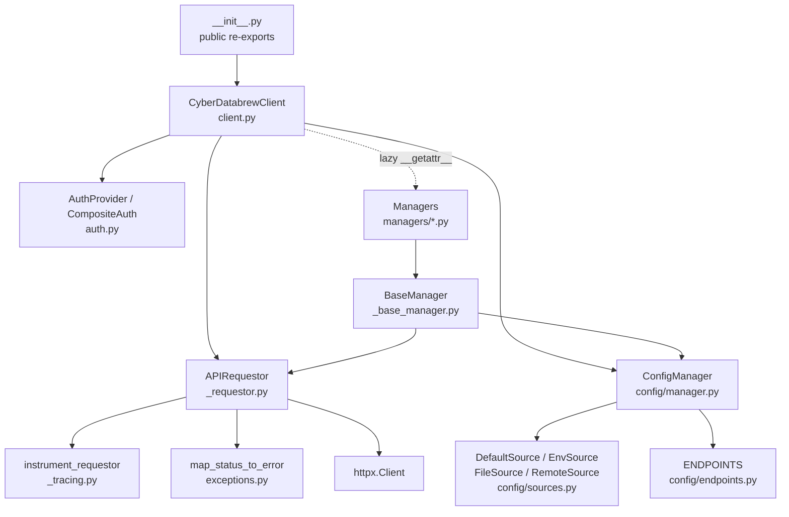
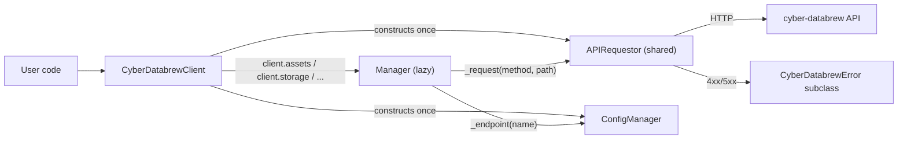
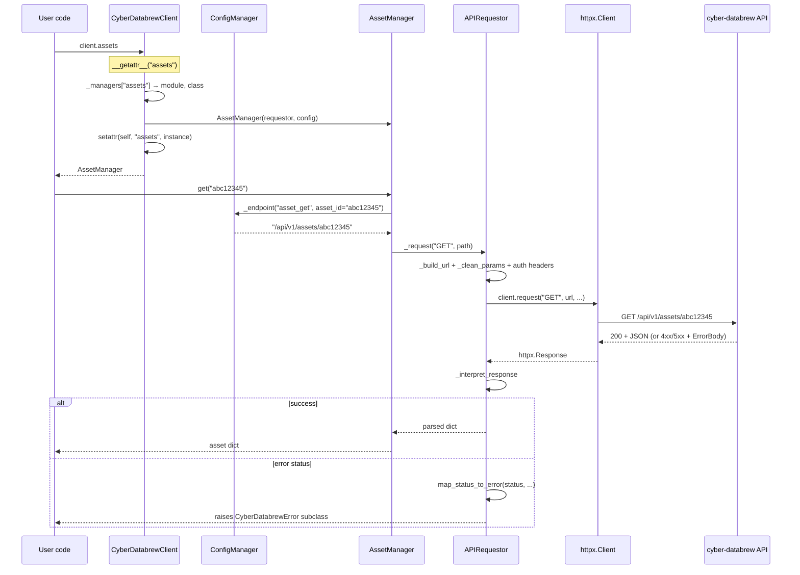
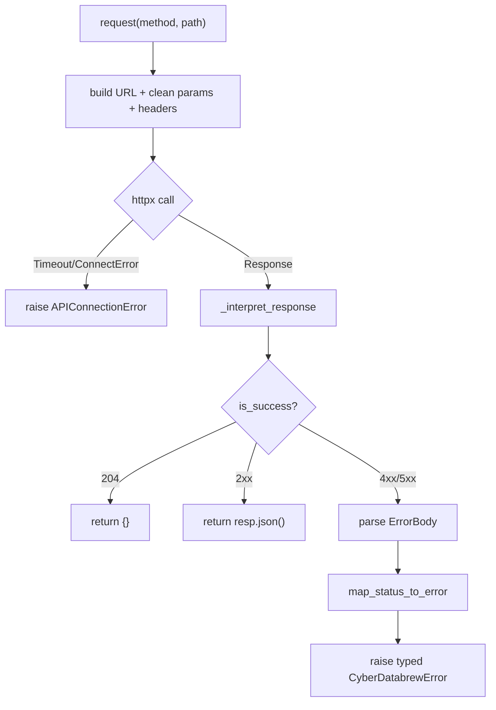
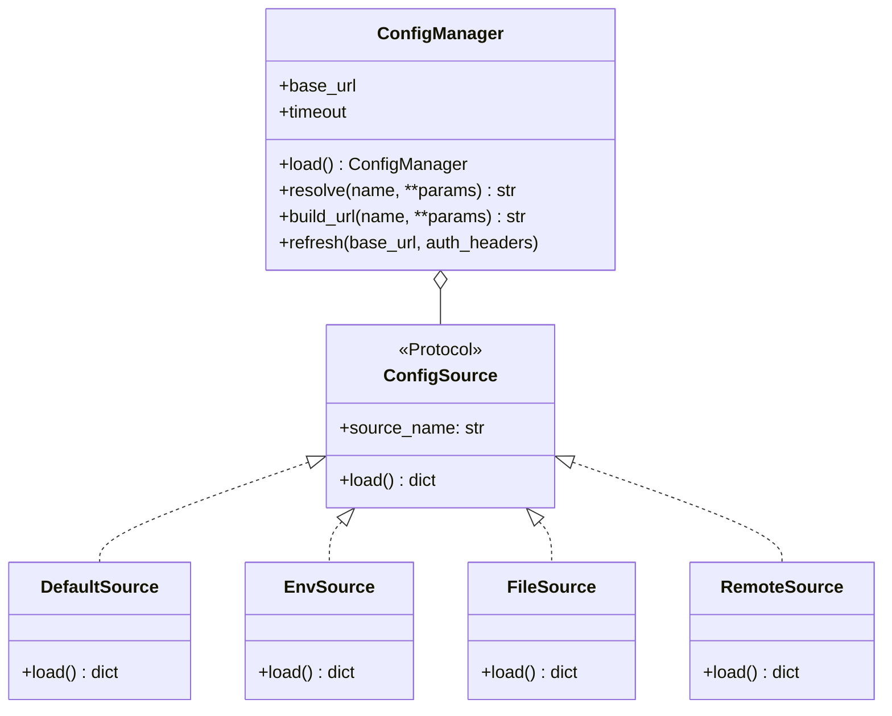
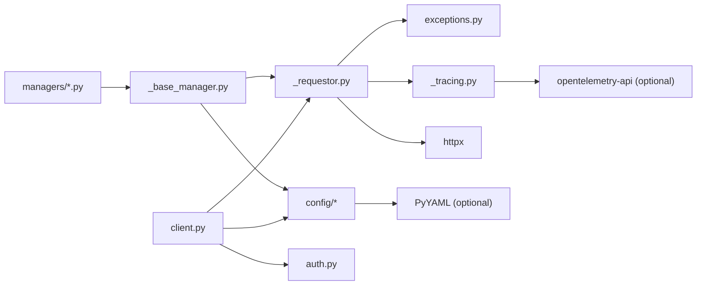

# SDK Guide

<cite>
**Referenced Files in This Document**

- [sdk/README.md](file://sdk/README.md)
- [sdk/src/cyber_databrew_sdk/__init__.py](file://sdk/src/cyber_databrew_sdk/__init__.py)
- [sdk/src/cyber_databrew_sdk/client.py](file://sdk/src/cyber_databrew_sdk/client.py)
- [sdk/src/cyber_databrew_sdk/_requestor.py](file://sdk/src/cyber_databrew_sdk/_requestor.py)
- [sdk/src/cyber_databrew_sdk/_base_manager.py](file://sdk/src/cyber_databrew_sdk/_base_manager.py)
- [sdk/src/cyber_databrew_sdk/auth.py](file://sdk/src/cyber_databrew_sdk/auth.py)
- [sdk/src/cyber_databrew_sdk/exceptions.py](file://sdk/src/cyber_databrew_sdk/exceptions.py)
- [sdk/src/cyber_databrew_sdk/_tracing.py](file://sdk/src/cyber_databrew_sdk/_tracing.py)
- [sdk/src/cyber_databrew_sdk/config/manager.py](file://sdk/src/cyber_databrew_sdk/config/manager.py)
- [sdk/src/cyber_databrew_sdk/config/sources.py](file://sdk/src/cyber_databrew_sdk/config/sources.py)
- [sdk/src/cyber_databrew_sdk/config/contract.py](file://sdk/src/cyber_databrew_sdk/config/contract.py)
- [sdk/src/cyber_databrew_sdk/config/endpoints.py](file://sdk/src/cyber_databrew_sdk/config/endpoints.py)
- [sdk/src/cyber_databrew_sdk/managers/assets.py](file://sdk/src/cyber_databrew_sdk/managers/assets.py)
</cite>

## Table of Contents
1. [Introduction](#introduction)
2. [Project Structure](#project-structure)
3. [Core Components](#core-components)
4. [Architecture Overview](#architecture-overview)
5. [Detailed Component Analysis](#detailed-component-analysis)
6. [Dependency Analysis](#dependency-analysis)
7. [Performance Considerations](#performance-considerations)
8. [Troubleshooting Guide](#troubleshooting-guide)
9. [Conclusion](#conclusion)
10. [Appendices](#appendices)

## Introduction

The `cyber_databrew_sdk` package is the official Python client for the
cyber-databrew data platform. It gives algorithm engineers and back-office
tooling a typed, ergonomic facade over the platform's HTTP API: asset
management, MCAP file storage, delivery orchestration, algorithm runs,
lakehouse reporting, events, registries, audit, and the Query IR engine are
all reachable through a single client object.

The design borrows directly from mature commercial SDKs. The README and
in-code docstrings name the lineage explicitly: the top-level client is
adapted from Stripe's `StripeClient`, the request engine from Stripe's
`_APIRequestor`, the per-domain managers from Stripe's `StripeService`, and
the status-to-exception factory from OpenAI's `_make_status_error`. The
result is a small, predictable surface area: one client, a shared request
engine, and a set of stateless "managers" — one per API domain — that are
lazily instantiated on first access.

The stack is intentionally thin. HTTP transport is `httpx`, configuration
files are parsed with optional PyYAML, and observability is optional
OpenTelemetry. The SDK targets Python 3.11+ and is distributed from a private
Google Artifact Registry repository.

**Section sources**
- [sdk/README.md](file://sdk/README.md#L1-L68)
- [sdk/src/cyber_databrew_sdk/client.py](file://sdk/src/cyber_databrew_sdk/client.py#L1-L73)
- [sdk/src/cyber_databrew_sdk/__init__.py](file://sdk/src/cyber_databrew_sdk/__init__.py#L1-L23)

## Project Structure

The package lives under `sdk/src/cyber_databrew_sdk/`. It separates the
public facade (`client.py`), the request engine (`_requestor.py`), the
configuration subsystem (`config/`), the per-domain managers (`managers/`),
the typed exception hierarchy (`exceptions.py`), pluggable authentication
(`auth.py`), and optional tracing (`_tracing.py`).

- **`__init__.py`** — public re-exports: `CyberDatabrewClient` (plus the
  `CyberDatabrew` alias), `ConfigManager`, the auth providers, and the full
  exception set. It also keeps backward-compat aliases (`AssetClientSDK`,
  `DatabrewClient`, `DataCurationClient`) resolved via PEP 562 module
  `__getattr__` with a `DeprecationWarning`.
- **`client.py`** — `CyberDatabrewClient`, the central facade. Holds a single
  shared `APIRequestor` and a `ConfigManager`; lazily imports and instantiates
  managers through `__getattr__`.
- **`_requestor.py`** — `APIRequestor`, the one place where HTTP actually
  happens. Builds URLs, injects auth headers, sanitizes params, and maps
  responses to either parsed JSON or typed exceptions.
- **`_base_manager.py`** — `BaseManager`, the shared parent of every manager.
  Resolves endpoint names through config and delegates to the requestor.
- **`managers/`** — one module per API domain (`assets.py`, `storage.py`,
  `delivery.py`, `algo_runs.py`, `customers.py`, `lakehouse.py`, `events.py`,
  `registry.py`, `audit.py`, `search.py`, `queries.py`, plus `actions.py`,
  `eval_metrics.py`, `admin_search.py`, `workflows.py`,
  `pipeline_components.py`).
- **`config/`** — the configuration subsystem: `ConfigManager` (`manager.py`),
  the `ConfigSource` protocol (`contract.py`), four built-in sources
  (`sources.py`), and the endpoint registry (`endpoints.py`).
- **`auth.py`** — `AuthProvider` protocol with `DatabrewTokenAuth`,
  `EmailAuth`, and `CompositeAuth` implementations.
- **`exceptions.py`** — `CyberDatabrewError` and its subclasses plus the
  `map_status_to_error` factory.
- **`_tracing.py`** — optional OpenTelemetry hooks attached to the `httpx`
  client.



**Diagram sources**
- [sdk/src/cyber_databrew_sdk/client.py](file://sdk/src/cyber_databrew_sdk/client.py#L30-L165)
- [sdk/src/cyber_databrew_sdk/_base_manager.py](file://sdk/src/cyber_databrew_sdk/_base_manager.py#L19-L52)
- [sdk/src/cyber_databrew_sdk/config/manager.py](file://sdk/src/cyber_databrew_sdk/config/manager.py#L37-L150)

**Section sources**
- [sdk/src/cyber_databrew_sdk/client.py](file://sdk/src/cyber_databrew_sdk/client.py#L27-L73)
- [sdk/src/cyber_databrew_sdk/__init__.py](file://sdk/src/cyber_databrew_sdk/__init__.py#L1-L61)
- [sdk/README.md](file://sdk/README.md#L377-L402)

## Core Components

The SDK is built from five collaborating pieces. Each has a single
responsibility, and the boundaries are deliberate.

#### CyberDatabrewClient — the facade

`CyberDatabrewClient` is the only object users construct. Its constructor
accepts `token`, `email`, an optional `auth` provider, `base_url`, `timeout`,
an injectable `http_client`, a pre-built `config`, and an `enable_tracing`
flag. Initialization runs three steps: resolve config (either the supplied
`ConfigManager` or one built via `ConfigManager.load`), resolve auth headers
(explicit `auth` wins, otherwise token/email from args or environment), and
create the single shared `APIRequestor`. A module-level `_managers` dict maps
each attribute name to its `(module_path, class_name)` pair so managers can be
imported lazily.

#### APIRequestor — the request engine

`APIRequestor` is the single place where HTTP happens. It rstrips the base
URL, owns the `httpx.Client`, joins paths via `urljoin`, strips `None` query
params, injects `Content-Type: application/json` plus the auth headers, and
catches `httpx.TimeoutException` / `httpx.ConnectError` into
`APIConnectionError`. The `_interpret_response` method returns `{}` for 204,
parses JSON on success, and otherwise reads the backend `ErrorBody`
(`message`, `code`, `request_id`, `details`) and raises a typed exception via
`map_status_to_error`.

#### BaseManager and the managers

Every manager subclasses `BaseManager`, which stores the shared requestor and
config. `BaseManager._endpoint(name, **path_params)` resolves a logical
endpoint name to a path through `ConfigManager.resolve`, and
`BaseManager._request(...)` is a thin wrapper over the requestor that
subclasses can override. Managers are stateless accessors — they hold no
cached domain state, matching the OpenAI/Stripe service pattern noted in the
module docstring.

#### ConfigManager — configuration resolution

`ConfigManager` merges multiple `ConfigSource` implementations in a strict
priority order and resolves endpoint names to paths. `load()` is the builder
used by the client; `resolve()` / `build_url()` translate logical names to
paths/URLs; `refresh()` re-fetches the remote source at runtime.

#### Exceptions and auth

`exceptions.py` defines `CyberDatabrewError` and subclasses keyed by HTTP
status, with `map_status_to_error` as the factory. `auth.py` defines the
`AuthProvider` protocol and three concrete strategies composed by
`CompositeAuth`.

**Section sources**
- [sdk/src/cyber_databrew_sdk/client.py](file://sdk/src/cyber_databrew_sdk/client.py#L79-L165)
- [sdk/src/cyber_databrew_sdk/_requestor.py](file://sdk/src/cyber_databrew_sdk/_requestor.py#L28-L141)
- [sdk/src/cyber_databrew_sdk/_base_manager.py](file://sdk/src/cyber_databrew_sdk/_base_manager.py#L19-L52)
- [sdk/src/cyber_databrew_sdk/config/manager.py](file://sdk/src/cyber_databrew_sdk/config/manager.py#L37-L150)
- [sdk/src/cyber_databrew_sdk/auth.py](file://sdk/src/cyber_databrew_sdk/auth.py#L14-L74)

## Architecture Overview

The runtime architecture is a hub-and-spoke. The client constructs exactly one
`APIRequestor` (the hub) and shares it with every manager (the spokes). A
manager call resolves its endpoint through the `ConfigManager`, then delegates
the HTTP work to the shared requestor, which talks to `httpx` and converts the
result into either parsed JSON or a typed exception.



The key invariant: there is one HTTP client per `CyberDatabrewClient`, so
connection pooling, timeout, and tracing are configured once and reused across
all domains. Closing the client (explicitly, via context manager, or `__del__`)
closes that single underlying `httpx.Client`.

**Diagram sources**
- [sdk/src/cyber_databrew_sdk/client.py](file://sdk/src/cyber_databrew_sdk/client.py#L139-L165)
- [sdk/src/cyber_databrew_sdk/_base_manager.py](file://sdk/src/cyber_databrew_sdk/_base_manager.py#L29-L52)
- [sdk/src/cyber_databrew_sdk/_requestor.py](file://sdk/src/cyber_databrew_sdk/_requestor.py#L66-L134)

**Section sources**
- [sdk/src/cyber_databrew_sdk/client.py](file://sdk/src/cyber_databrew_sdk/client.py#L74-L185)
- [sdk/src/cyber_databrew_sdk/_requestor.py](file://sdk/src/cyber_databrew_sdk/_requestor.py#L28-L103)

## Detailed Component Analysis

### Lazy manager access

The facade never imports a manager module until that domain is first touched.
`CyberDatabrewClient.__getattr__` looks the attribute up in the module-level
`_managers` dict; unknown names raise `AttributeError`. On a hit it
`import_module`s the manager module, fetches the class, instantiates it with
the shared requestor and config, and — crucially — `setattr`s the instance
back onto the client. Because `__getattr__` only fires for missing attributes,
the second access reads the cached instance directly, so the import and
construction cost is paid at most once per domain.

This is why the README can advertise "all 11 managers are lazily loaded on
first access" while the `_managers` map actually registers more than a dozen
domains, including the newer `actions`, `eval_metrics`, `admin_search`,
`workflows`, and `pipeline_components` managers.



**Diagram sources**
- [sdk/src/cyber_databrew_sdk/client.py](file://sdk/src/cyber_databrew_sdk/client.py#L152-L165)
- [sdk/src/cyber_databrew_sdk/managers/assets.py](file://sdk/src/cyber_databrew_sdk/managers/assets.py#L17-L19)
- [sdk/src/cyber_databrew_sdk/_base_manager.py](file://sdk/src/cyber_databrew_sdk/_base_manager.py#L29-L52)
- [sdk/src/cyber_databrew_sdk/_requestor.py](file://sdk/src/cyber_databrew_sdk/_requestor.py#L66-L134)

**Section sources**
- [sdk/src/cyber_databrew_sdk/client.py](file://sdk/src/cyber_databrew_sdk/client.py#L30-L50)
- [sdk/src/cyber_databrew_sdk/client.py](file://sdk/src/cyber_databrew_sdk/client.py#L148-L165)

### The request engine and error mapping

`APIRequestor.request` always builds a fresh header dict (constant
`Content-Type` plus the stored auth headers), so per-call header mutation can
never leak across requests. Query params pass through `_clean_params`, which
drops `None` values — this is the "Stripe-style sanitization" that lets
managers pass optional filters as keyword args without manually pruning them
(see `AssetManager.list_all`, which forwards `status`, `tag`, `mcap_file_id`,
`page`, and `page_size` unconditionally).

`_interpret_response` is the success/error fork. A 204 yields `{}`; any other
2xx yields `resp.json()`. On a non-success status it tries to parse the body,
extracts `message` / `code` / `details`, and gives the body's `request_id`
precedence over the `X-Request-ID` header before calling
`map_status_to_error`.



**Diagram sources**
- [sdk/src/cyber_databrew_sdk/_requestor.py](file://sdk/src/cyber_databrew_sdk/_requestor.py#L66-L141)
- [sdk/src/cyber_databrew_sdk/exceptions.py](file://sdk/src/cyber_databrew_sdk/exceptions.py#L119-L156)

**Section sources**
- [sdk/src/cyber_databrew_sdk/_requestor.py](file://sdk/src/cyber_databrew_sdk/_requestor.py#L57-L141)
- [sdk/src/cyber_databrew_sdk/exceptions.py](file://sdk/src/cyber_databrew_sdk/exceptions.py#L107-L156)

### Configuration resolution

`ConfigManager.load` assembles four sources in ascending priority —
`DefaultSource`, `RemoteSource`, `FileSource`, `EnvSource` — merges them in
that order so later sources override earlier ones, then applies explicit
constructor overrides last. The bootstrap base URL for the remote fetch comes
from the explicit arg, then `CYBER_DATABREW_BASE_URL`, then
`http://localhost:8080`. Auth headers for the remote call are derived from the
supplied token/email or the corresponding env vars.

Endpoint resolution is data-driven: `ENDPOINTS` in `config/endpoints.py` is a
flat dict of logical name → path template (e.g. `asset_get` →
`/api/v1/assets/{asset_id}`). `resolve()` looks the name up, falls back to
`/api/v1/{name}` with a warning if unknown, and applies `str.format` with the
path params. `refresh()` re-runs only the `RemoteSource` and merges any
returned `endpoints` overrides — this backs the README's "remote config hot
reload" via `client._config.refresh(...)`.



**Diagram sources**
- [sdk/src/cyber_databrew_sdk/config/contract.py](file://sdk/src/cyber_databrew_sdk/config/contract.py#L13-L34)
- [sdk/src/cyber_databrew_sdk/config/sources.py](file://sdk/src/cyber_databrew_sdk/config/sources.py#L25-L156)
- [sdk/src/cyber_databrew_sdk/config/manager.py](file://sdk/src/cyber_databrew_sdk/config/manager.py#L37-L210)

**Section sources**
- [sdk/src/cyber_databrew_sdk/config/manager.py](file://sdk/src/cyber_databrew_sdk/config/manager.py#L72-L210)
- [sdk/src/cyber_databrew_sdk/config/sources.py](file://sdk/src/cyber_databrew_sdk/config/sources.py#L22-L156)
- [sdk/src/cyber_databrew_sdk/config/endpoints.py](file://sdk/src/cyber_databrew_sdk/config/endpoints.py#L11-L30)

### Authentication strategies

Auth is a pluggable `Protocol`: any object with `get_headers() -> dict[str,
str]` is an `AuthProvider`. `DatabrewTokenAuth` emits `X-Databrew-Token`
(token from arg, then `CYBER_DATABREW_TOKEN`, then `DATABREW_TOKEN`).
`EmailAuth` emits the audit-only `X-User-Email` header (it is explicitly not a
security credential). `CompositeAuth` merges several providers, with later
providers overriding earlier ones and empty values filtered out — this is what
the client uses by default: `CompositeAuth(DatabrewTokenAuth(token),
EmailAuth(email))`. A backward-compat alias `GraceTokenAuth = DatabrewTokenAuth`
is exported from the package root.

**Section sources**
- [sdk/src/cyber_databrew_sdk/auth.py](file://sdk/src/cyber_databrew_sdk/auth.py#L14-L74)
- [sdk/src/cyber_databrew_sdk/client.py](file://sdk/src/cyber_databrew_sdk/client.py#L113-L137)
- [sdk/src/cyber_databrew_sdk/__init__.py](file://sdk/src/cyber_databrew_sdk/__init__.py#L21-L22)

### Optional tracing

When `opentelemetry-api` is installed and `enable_tracing` is true (the
default), `instrument_requestor` appends `request`/`response` (and, on httpx
0.28+, `exception`) hooks to the `httpx.Client`. The request hook opens a
CLIENT span named `"{method} {path}"` with method/URL attributes and stashes
it on `request.extensions["_otel_span"]`; the response hook records the status
code and `X-Request-ID`, marks 4xx/5xx as error, and ends the span. If
OpenTelemetry is absent the function is a no-op, so tracing carries no hard
dependency.

**Section sources**
- [sdk/src/cyber_databrew_sdk/_tracing.py](file://sdk/src/cyber_databrew_sdk/_tracing.py#L15-L104)
- [sdk/src/cyber_databrew_sdk/_requestor.py](file://sdk/src/cyber_databrew_sdk/_requestor.py#L47-L55)

## Dependency Analysis

The SDK's external runtime dependency surface is deliberately small: `httpx`
for transport, optional `PyYAML` for the config file, and optional
`opentelemetry-api` for tracing. Internally, the dependency graph flows in one
direction — managers depend on the base manager, which depends on the
requestor and config; nothing depends back on the managers.



The platform side is reached only through `httpx` and only via `APIRequestor`,
which means swapping the transport (e.g. injecting a custom `httpx.Client` for
tests) is a single constructor argument on either the client or
`ConfigManager.load`.

**Diagram sources**
- [sdk/src/cyber_databrew_sdk/_requestor.py](file://sdk/src/cyber_databrew_sdk/_requestor.py#L14-L25)
- [sdk/src/cyber_databrew_sdk/_base_manager.py](file://sdk/src/cyber_databrew_sdk/_base_manager.py#L11-L17)
- [sdk/src/cyber_databrew_sdk/config/sources.py](file://sdk/src/cyber_databrew_sdk/config/sources.py#L100-L156)

**Section sources**
- [sdk/src/cyber_databrew_sdk/client.py](file://sdk/src/cyber_databrew_sdk/client.py#L12-L23)
- [sdk/src/cyber_databrew_sdk/_tracing.py](file://sdk/src/cyber_databrew_sdk/_tracing.py#L11-L31)

## Performance Considerations

- **One client, one connection pool.** Every manager shares a single
  `APIRequestor` and therefore a single `httpx.Client`, so HTTP keep-alive and
  pooling are reused across all domains. Construct one `CyberDatabrewClient`
  and keep it; do not create a client per call.
- **Lazy manager loading.** Manager modules are imported only on first
  attribute access and then cached on the instance via `setattr`, so import
  cost is paid once and unused domains never load.
- **Remote-config cost at startup.** `ConfigManager.load` performs a
  `GET /api/v1/sdk-config` during construction (15s default timeout in the
  remote source's own client). The fetch fails silently to defaults, but it is
  a network round trip on every client creation — another reason to reuse one
  client. Inject an `http_client` to control or stub this.
- **Param sanitization.** `_clean_params` drops `None` query params before the
  request, so optional filters add no empty query string keys.
- **Context-manager lifecycle.** Using the client as a context manager (or
  relying on `__del__`) closes the underlying HTTP client promptly, releasing
  sockets.

**Section sources**
- [sdk/src/cyber_databrew_sdk/client.py](file://sdk/src/cyber_databrew_sdk/client.py#L139-L184)
- [sdk/src/cyber_databrew_sdk/config/sources.py](file://sdk/src/cyber_databrew_sdk/config/sources.py#L141-L156)
- [sdk/src/cyber_databrew_sdk/_requestor.py](file://sdk/src/cyber_databrew_sdk/_requestor.py#L137-L141)

## Troubleshooting Guide

- **`AttributeError: 'CyberDatabrewClient' object has no attribute 'X'`** — the
  domain name `X` is not in the `_managers` map. Check the spelling against the
  registered keys in `client.py`.
- **`AuthenticationError` (401/403)** — token missing or invalid. Confirm
  `token`/`CYBER_DATABREW_TOKEN`/`DATABREW_TOKEN` is set; the
  `X-Databrew-Token` header is what the backend checks. `X-User-Email` is
  audit-only and never authenticates.
- **`APIConnectionError`** — a timeout, DNS failure, or refused connection. The
  requestor wraps `httpx.TimeoutException`/`ConnectError` into this exception;
  verify `base_url` and network reachability. Raise `timeout` if requests are
  legitimately slow.
- **Wrong base URL / endpoints unexpectedly remapped** — config precedence is
  defaults < remote < file < env < explicit args. An env var
  (`CYBER_DATABREW_BASE_URL`) or `~/.cyber-databrew/config.yaml` may be
  overriding your intent. Pass `base_url=` explicitly to win.
- **Config file ignored** — `FileSource` silently skips if PyYAML is not
  installed (logs a warning) or if no file is found at the searched locations.
- **Stale endpoints after a backend deploy** — call
  `client._config.refresh(...)` to re-fetch remote endpoint overrides without
  rebuilding the client.
- **`request_id` in error messages** — `CyberDatabrewError.__str__` prefixes
  `Request <id>:` when present; quote that id when reporting backend issues.

**Section sources**
- [sdk/src/cyber_databrew_sdk/client.py](file://sdk/src/cyber_databrew_sdk/client.py#L152-L159)
- [sdk/src/cyber_databrew_sdk/_requestor.py](file://sdk/src/cyber_databrew_sdk/_requestor.py#L94-L101)
- [sdk/src/cyber_databrew_sdk/exceptions.py](file://sdk/src/cyber_databrew_sdk/exceptions.py#L44-L47)
- [sdk/src/cyber_databrew_sdk/config/sources.py](file://sdk/src/cyber_databrew_sdk/config/sources.py#L100-L119)

## Conclusion

The cyber-databrew Python SDK is a thin, predictable client built on three
ideas: a single shared `APIRequestor` for all HTTP, lazily instantiated
stateless managers for each API domain, and a layered `ConfigManager` that
merges defaults, remote discovery, config files, and environment in a strict
priority order. Errors map cleanly to a typed exception hierarchy carrying the
backend's `code`/`request_id`/`details`, and observability is optional via
OpenTelemetry. The architecture keeps the public surface tiny — one client and
one attribute per domain — while leaving every transport, auth, and config
decision injectable for testing and customization.

## Appendices

### Managers registered in the client

| Attribute | Module / class | Domain |
|-----------|----------------|--------|
| `assets` | `managers.assets.AssetManager` | Asset CRUD, tags, lineage, favorites |
| `storage` | `managers.storage.StorageManager` | MCAP files, download, upload finalize |
| `delivery` | `managers.delivery.DeliveryManager` | Drafts, commit, cancel, acknowledge |
| `algo_runs` | `managers.algo_runs.AlgoRunManager` | Algorithm run lifecycle |
| `search` | `managers.search.SearchManager` | ES sync status |
| `queries` | `managers.queries.QueryManager` | Query IR validate/run/save |
| `customers` | `managers.customers.CustomerManager` | Customer CRUD |
| `lakehouse` | `managers.lakehouse.LakehouseManager` | Lakehouse report/status/tables |
| `events` | `managers.events.EventManager` | Event list, SSE stream |
| `registry` | `managers.registry.RegistryManager` | Read-only registries |
| `audit` | `managers.audit.AuditManager` | Audit search |
| `actions` | `managers.actions.ActionManager` | Actions |
| `eval_metrics` | `managers.eval_metrics.EvalMetricsManager` | Evaluation metrics |
| `admin_search` | `managers.admin_search.AdminSearchManager` | Admin search |
| `workflows` | `managers.workflows.WorkflowManager` | Workflows |
| `pipeline_components` | `managers.pipeline_components.PipelineComponentManager` | Pipeline components |

**Section sources**
- [sdk/src/cyber_databrew_sdk/client.py](file://sdk/src/cyber_databrew_sdk/client.py#L30-L50)

### Exception hierarchy and status mapping

| HTTP status | Exception |
|-------------|-----------|
| 400, 414 | `BadRequestError` |
| 401, 403 | `AuthenticationError` |
| 404 | `NotFoundError` |
| 409 | `ConflictError` |
| 422 | `ValidationError` |
| 429 | `RateLimitError` |
| 5xx | `ServerError` |
| other | `CyberDatabrewError` |
| network | `APIConnectionError` |

All exceptions derive from `CyberDatabrewError` and carry `message`, `code`,
`request_id`, `http_status`, and `details`.

**Section sources**
- [sdk/src/cyber_databrew_sdk/exceptions.py](file://sdk/src/cyber_databrew_sdk/exceptions.py#L19-L156)

### Configuration keys and precedence

Priority (highest first): explicit constructor args → environment variables
→ config file → remote discovery → built-in defaults.

| Key | Env var | Default |
|-----|---------|---------|
| `base_url` | `CYBER_DATABREW_BASE_URL` | `http://localhost:8080` |
| `token` | `CYBER_DATABREW_TOKEN` / `DATABREW_TOKEN` | (none) |
| `email` | `CYBER_DATABREW_EMAIL` | (none) |
| `timeout` | `CYBER_DATABREW_TIMEOUT` | `30.0` |
| `endpoints` | — | `ENDPOINTS` in `config/endpoints.py` |

Config file search order: `./.cyber-databrew.yaml`, then
`~/.cyber-databrew/config.yaml`. Remote discovery endpoint:
`GET /api/v1/sdk-config`.

**Section sources**
- [sdk/src/cyber_databrew_sdk/config/manager.py](file://sdk/src/cyber_databrew_sdk/config/manager.py#L37-L150)
- [sdk/src/cyber_databrew_sdk/config/sources.py](file://sdk/src/cyber_databrew_sdk/config/sources.py#L34-L98)
- [sdk/README.md](file://sdk/README.md#L73-L118)

### Install and usage quickstart

Install from the private Artifact Registry:

```bash
pip install --extra-index-url \
  https://us-central1-python.pkg.dev/green-valley-442103/python-packages/simple/ \
  cyber-databrew-sdk
```

Minimal usage with the recommended context-manager form:

```python
from cyber_databrew_sdk import CyberDatabrewClient

with CyberDatabrewClient(base_url="...", token="g-xxx") as client:
    asset = client.assets.get("asset-id-xxx")
    print(asset)
```

**Section sources**
- [sdk/README.md](file://sdk/README.md#L16-L34)
- [sdk/README.md](file://sdk/README.md#L356-L364)
- [sdk/src/cyber_databrew_sdk/client.py](file://sdk/src/cyber_databrew_sdk/client.py#L171-L184)
</content>
</invoke>
