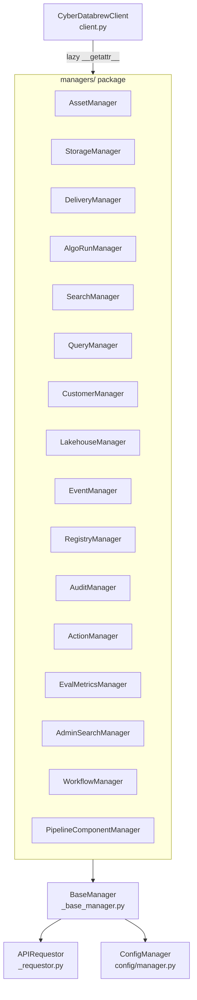
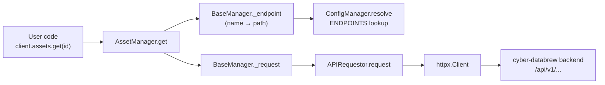
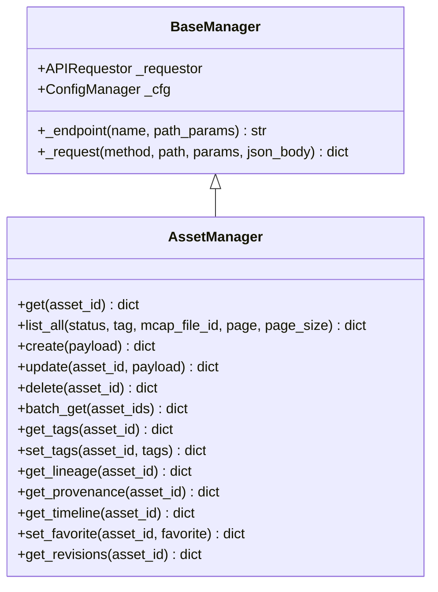
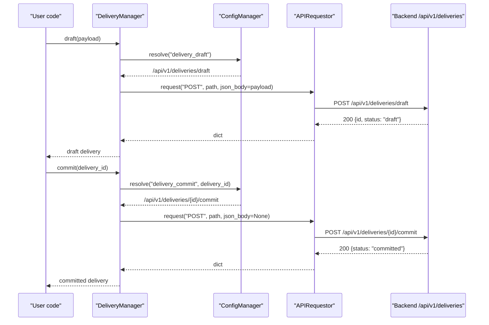
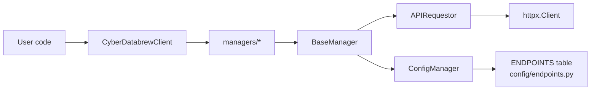

# Managers

<cite>
**Referenced Files in This Document**

- [sdk/src/cyber_databrew_sdk/managers/__init__.py](file://sdk/src/cyber_databrew_sdk/managers/__init__.py)
- [sdk/src/cyber_databrew_sdk/managers/actions.py](file://sdk/src/cyber_databrew_sdk/managers/actions.py)
- [sdk/src/cyber_databrew_sdk/managers/admin_search.py](file://sdk/src/cyber_databrew_sdk/managers/admin_search.py)
- [sdk/src/cyber_databrew_sdk/managers/algo_runs.py](file://sdk/src/cyber_databrew_sdk/managers/algo_runs.py)
- [sdk/src/cyber_databrew_sdk/managers/assets.py](file://sdk/src/cyber_databrew_sdk/managers/assets.py)
- [sdk/src/cyber_databrew_sdk/managers/audit.py](file://sdk/src/cyber_databrew_sdk/managers/audit.py)
- [sdk/src/cyber_databrew_sdk/managers/customers.py](file://sdk/src/cyber_databrew_sdk/managers/customers.py)
- [sdk/src/cyber_databrew_sdk/managers/delivery.py](file://sdk/src/cyber_databrew_sdk/managers/delivery.py)
- [sdk/src/cyber_databrew_sdk/managers/eval_metrics.py](file://sdk/src/cyber_databrew_sdk/managers/eval_metrics.py)
- [sdk/src/cyber_databrew_sdk/managers/events.py](file://sdk/src/cyber_databrew_sdk/managers/events.py)
- [sdk/src/cyber_databrew_sdk/managers/lakehouse.py](file://sdk/src/cyber_databrew_sdk/managers/lakehouse.py)
- [sdk/src/cyber_databrew_sdk/managers/pipeline_components.py](file://sdk/src/cyber_databrew_sdk/managers/pipeline_components.py)
- [sdk/src/cyber_databrew_sdk/managers/queries.py](file://sdk/src/cyber_databrew_sdk/managers/queries.py)
- [sdk/src/cyber_databrew_sdk/managers/registry.py](file://sdk/src/cyber_databrew_sdk/managers/registry.py)
- [sdk/src/cyber_databrew_sdk/managers/search.py](file://sdk/src/cyber_databrew_sdk/managers/search.py)
- [sdk/src/cyber_databrew_sdk/managers/storage.py](file://sdk/src/cyber_databrew_sdk/managers/storage.py)
- [sdk/src/cyber_databrew_sdk/managers/workflows.py](file://sdk/src/cyber_databrew_sdk/managers/workflows.py)
- [sdk/src/cyber_databrew_sdk/_base_manager.py](file://sdk/src/cyber_databrew_sdk/_base_manager.py)
- [sdk/src/cyber_databrew_sdk/client.py](file://sdk/src/cyber_databrew_sdk/client.py)
- [sdk/src/cyber_databrew_sdk/_requestor.py](file://sdk/src/cyber_databrew_sdk/_requestor.py)
- [sdk/src/cyber_databrew_sdk/config/manager.py](file://sdk/src/cyber_databrew_sdk/config/manager.py)
- [sdk/src/cyber_databrew_sdk/config/endpoints.py](file://sdk/src/cyber_databrew_sdk/config/endpoints.py)
</cite>

## Table of Contents
1. [Introduction](#introduction)
2. [Project Structure](#project-structure)
3. [Core Components](#core-components)
4. [Architecture Overview](#architecture-overview)
5. [Detailed Component Analysis](#detailed-component-analysis)
6. [Dependency Analysis](#dependency-analysis)
7. [Performance Considerations](#performance-considerations)
8. [Troubleshooting Guide](#troubleshooting-guide)
9. [Conclusion](#conclusion)
10. [Appendices](#appendices)

## Introduction

The **managers** are the per-domain client classes that make up the public,
ergonomic surface of the cyber-databrew Python SDK. Each manager wraps one
business domain — assets, deliveries, search, workflows, and so on — and exposes
a small set of high-level methods (`get`, `list`, `create`, `commit`, `cancel`,
…) that map cleanly onto backend HTTP endpoints. They are the layer a consumer
of the SDK actually touches: a user writes `client.assets.get("abc12345")` or
`client.delivery.draft(payload)` and never deals with URL construction, auth
headers, or response parsing directly.

The design is explicitly **adapted from Stripe's per-resource service modules**
(for example `_customer_service.py`) and from the OpenAI/Stripe pattern of
stateless accessors. As the package docstring states, "each manager is
stateless — holds only a reference to the shared `APIRequestor`." Managers do
not cache domain state, do not own connections, and do not maintain
per-resource objects; they are thin, predictable translators from a method call
into an HTTP request. All shared mechanics — auth, base URL, timeouts, JSON
parsing, typed exceptions — live one layer below, in the `APIRequestor`, and
endpoint name → URL resolution lives in the `ConfigManager`.

This separation means the managers themselves are small and almost entirely
declarative: a method names an endpoint, supplies path parameters and a body or
query params, and returns the parsed JSON dict. The page that follows surveys
every manager, the resource it owns, its key methods, the pagination
convention, and the way method calls flow down to the backend.

**Section sources**
- [sdk/src/cyber_databrew_sdk/managers/__init__.py](file://sdk/src/cyber_databrew_sdk/managers/__init__.py#L1-L5)
- [sdk/src/cyber_databrew_sdk/_base_manager.py](file://sdk/src/cyber_databrew_sdk/_base_manager.py#L1-L52)
- [sdk/src/cyber_databrew_sdk/client.py](file://sdk/src/cyber_databrew_sdk/client.py#L1-L73)

## Project Structure

All managers live in a single package, `sdk/src/cyber_databrew_sdk/managers/`.
Each module defines exactly one manager class that subclasses `BaseManager`. The
package `__init__.py` carries only a docstring; managers are never imported
eagerly — the top-level `CyberDatabrewClient` imports each one lazily on first
attribute access (the Stripe `__getattr__` + `_subservices` pattern).

**Diagram sources**
- [sdk/src/cyber_databrew_sdk/client.py](file://sdk/src/cyber_databrew_sdk/client.py#L30-L50)
- [sdk/src/cyber_databrew_sdk/_base_manager.py](file://sdk/src/cyber_databrew_sdk/_base_manager.py#L19-L52)

The file layout maps one-to-one onto the domains:

- `actions.py` — child asset annotations ("actions").
- `admin_search.py` — Elasticsearch reindex admin operations and reindex jobs.
- `algo_runs.py` — first-class algorithm run lifecycle.
- `assets.py` — asset CRUD plus tags, favorites, lineage, provenance, timeline.
- `audit.py` — operation audit search and lineage search.
- `customers.py` — delivery customer CRUD.
- `delivery.py` — delivery lifecycle (create, draft → commit, cancel, ack, …).
- `eval_metrics.py` — evaluation results and quality metrics.
- `events.py` — asset events and an SSE stream.
- `lakehouse.py` — lakehouse health, metrics, and growth reports.
- `pipeline_components.py` — reusable pipeline component registry CRUD.
- `queries.py` — query validate/run plus saved-query CRUD.
- `registry.py` — read-only registries (algos, tags, metrics, action labels, lifecycle states).
- `search.py` — Elasticsearch-backed asset search plus search sync status/progress.
- `storage.py` — MCAP file download through the backend proxy.
- `workflows.py` — Argo workflow monitoring and operations.

**Section sources**
- [sdk/src/cyber_databrew_sdk/managers/__init__.py](file://sdk/src/cyber_databrew_sdk/managers/__init__.py#L1-L5)
- [sdk/src/cyber_databrew_sdk/client.py](file://sdk/src/cyber_databrew_sdk/client.py#L30-L50)

## Core Components

The manager layer rests on three core building blocks.

#### BaseManager

`BaseManager` is the shared superclass for every manager. It stores two
references — the shared `APIRequestor` and the `ConfigManager` — and provides two
helpers. `_endpoint(name, **path_params)` resolves a logical endpoint name (e.g.
`"asset_get"`) into a concrete URL path by delegating to `self._cfg.resolve(...)`,
so a call like `self._endpoint("asset_get", asset_id="abc")` yields
`/api/v1/assets/abc`. `_request(method, path, *, params, json_body)` is a thin
wrapper that delegates to `APIRequestor.request(...)`; its docstring explicitly
notes it exists so subclasses can override for pre/post-processing such as
progress bars, auto-pagination, or parameter flattening.

**Section sources**
- [sdk/src/cyber_databrew_sdk/_base_manager.py](file://sdk/src/cyber_databrew_sdk/_base_manager.py#L19-L52)

#### CyberDatabrewClient and lazy wiring

The top-level `CyberDatabrewClient` is the facade. It builds a single shared
`APIRequestor` and a `ConfigManager`, then exposes each manager as an attribute.
The mapping lives in the module-level `_managers` dict, which maps an attribute
name to a `(module_path, class_name)` tuple. The `__getattr__` hook imports the
module, instantiates the manager with the shared requestor and config, caches it
on the instance via `setattr`, and returns it — so each manager is imported and
constructed at most once, on first access.

**Section sources**
- [sdk/src/cyber_databrew_sdk/client.py](file://sdk/src/cyber_databrew_sdk/client.py#L30-L50)
- [sdk/src/cyber_databrew_sdk/client.py](file://sdk/src/cyber_databrew_sdk/client.py#L152-L165)

#### APIRequestor and ConfigManager

`APIRequestor.request(...)` is where the actual HTTP call happens: it builds the
full URL, merges `Content-Type` with the auth headers, sanitizes query params,
invokes the underlying `httpx` client, and interprets the response (raising typed
exceptions on error, returning `{}` on `204`, and parsed JSON otherwise).
`ConfigManager.resolve(...)` performs the endpoint-name → path-template lookup
against the `ENDPOINTS` table, formatting placeholders such as `{asset_id}` and
falling back to `/api/v1/{name}` with a warning for unknown names.

**Section sources**
- [sdk/src/cyber_databrew_sdk/_requestor.py](file://sdk/src/cyber_databrew_sdk/_requestor.py#L66-L103)
- [sdk/src/cyber_databrew_sdk/config/manager.py](file://sdk/src/cyber_databrew_sdk/config/manager.py#L164-L188)

## Architecture Overview

Every manager method follows the same shape. It selects an HTTP verb, names an
endpoint, optionally supplies path params, query params (`params=`), or a JSON
body (`json_body=`), and returns the parsed dict. The endpoint name is resolved
through config; the request is executed through the shared requestor. Nothing in
the manager knows about base URLs, auth, or transport — those are injected once at
client construction and reused for the lifetime of the client.

**Diagram sources**
- [sdk/src/cyber_databrew_sdk/_base_manager.py](file://sdk/src/cyber_databrew_sdk/_base_manager.py#L29-L52)
- [sdk/src/cyber_databrew_sdk/_requestor.py](file://sdk/src/cyber_databrew_sdk/_requestor.py#L66-L103)
- [sdk/src/cyber_databrew_sdk/config/manager.py](file://sdk/src/cyber_databrew_sdk/config/manager.py#L164-L188)

The full catalog of managers, the resource each owns, the client attribute name,
and a sample of key methods is shown below.

| Manager | Client attr | Resource / domain | Key methods |
| --- | --- | --- | --- |
| `AssetManager` | `assets` | Assets, tags, lineage, provenance, timeline | `get`, `list_all`, `create`, `update`, `delete`, `batch_get`, `get_tags`, `set_tags`, `get_lineage`, `set_favorite` |
| `StorageManager` | `storage` | MCAP files (backend proxy) | `list_files`, `get_file_info`, `download_mcap`, `download_asset_mcap`, `open_mcap`, `finalize_upload`, `get_messages` |
| `DeliveryManager` | `delivery` | Deliveries lifecycle + rules | `get`, `list`, `create`, `draft`, `commit`, `cancel`, `retry`, `ack`, `add_items`, `list_rules` |
| `AlgoRunManager` | `algo_runs` | Algorithm run lifecycle | `get`, `list`, `create`, `start`, `finish`, `cancel`, `get_affected_assets` |
| `SearchManager` | `search` | Asset search + sync status | `assets`, `get_sync_status`, `get_sync_progress` |
| `QueryManager` | `queries` | Query exec + saved queries | `validate`, `run`, `list_saved`, `get_saved`, `create_saved`, `update_saved`, `delete_saved` |
| `CustomerManager` | `customers` | Delivery customers | `list`, `get`, `create`, `update` |
| `LakehouseManager` | `lakehouse` | Lakehouse health/metrics | `get_report`, `get_status`, `get_tables`, `get_overview`, `get_asset_growth`, `get_sync_status` |
| `EventManager` | `events` | Asset/system events + SSE | `list_global`, `list_for_asset`, `stream_for_asset` |
| `RegistryManager` | `registry` | Read-only registries | `list_algos`, `list_tags`, `list_metrics`, `list_action_labels`, `list_lifecycle_states` |
| `AuditManager` | `audit` | Audit + lineage search | `search`, `lineage_search` |
| `ActionManager` | `actions` | Asset action annotations | `list`, `create`, `update`, `delete` |
| `EvalMetricsManager` | `eval_metrics` | Eval results + quality metrics | `report_eval_result`, `list_eval_results`, `list_metrics`, `get_registry`, `search_by_metrics` |
| `AdminSearchManager` | `admin_search` | ES reindex jobs (admin) | `reindex`, `create_reindex_job`, `list_reindex_jobs`, `get_reindex_job`, `stop_reindex_job`, `resume_reindex_job`, `abandon_reindex_job` |
| `WorkflowManager` | `workflows` | Argo workflows | `list`, `get`, `logs`, `retry`, `resubmit`, `suspend`, `resume`, `terminate`, `delete` |
| `PipelineComponentManager` | `pipeline_components` | Pipeline component registry | `list`, `get`, `create`, `update`, `delete` |

**Section sources**
- [sdk/src/cyber_databrew_sdk/client.py](file://sdk/src/cyber_databrew_sdk/client.py#L30-L50)
- [sdk/src/cyber_databrew_sdk/managers/assets.py](file://sdk/src/cyber_databrew_sdk/managers/assets.py#L10-L118)
- [sdk/src/cyber_databrew_sdk/managers/delivery.py](file://sdk/src/cyber_databrew_sdk/managers/delivery.py#L10-L108)
- [sdk/src/cyber_databrew_sdk/managers/workflows.py](file://sdk/src/cyber_databrew_sdk/managers/workflows.py#L10-L45)

## Detailed Component Analysis

### AssetManager — the canonical CRUD + sub-resource manager

`AssetManager` is the richest and most representative manager. It groups its
methods into CRUD, tags, lineage/provenance/timeline, and miscellaneous helpers.
The CRUD methods are the archetype for the whole layer: `get(asset_id)` issues a
`GET` to `asset_get`; `create(payload)` `POST`s a body to `asset_create`;
`update(asset_id, payload)` `PATCH`es `asset_update`; `delete(asset_id)` `DELETE`s
`asset_delete`. `batch_get(asset_ids)` `POST`s `{"ids": asset_ids}` to
`asset_batch_get`. The list method, `list_all`, is keyword-only and carries the
SDK's standard pagination contract — `page: int = 1, page_size: int = 20` — plus
optional `status`, `tag`, and `mcap_file_id` filters; all of these flow through
the `params=` dict, and `None` values are stripped by the requestor before the
request leaves the process.

**Diagram sources**
- [sdk/src/cyber_databrew_sdk/_base_manager.py](file://sdk/src/cyber_databrew_sdk/_base_manager.py#L19-L52)
- [sdk/src/cyber_databrew_sdk/managers/assets.py](file://sdk/src/cyber_databrew_sdk/managers/assets.py#L10-L118)

The tag methods (`get_tags`, `set_tags`, `get_tag`, `delete_tag`,
`get_tag_history`) show how sub-resources are addressed: the asset id plus an
optional key are passed as path params (`asset_tags_get` takes both `asset_id`
and `key`). The lineage/provenance/timeline trio and the misc helpers
(`get_mcap_locator`, `get_foxglove_source`, `get_deliveries`, `get_events`,
`record_view`, `set_favorite`, `get_revisions`) are all single-`GET`/`POST`
read or action methods over derived asset data.

**Section sources**
- [sdk/src/cyber_databrew_sdk/managers/assets.py](file://sdk/src/cyber_databrew_sdk/managers/assets.py#L17-L118)

### DeliveryManager — multi-step lifecycle

`DeliveryManager` is the clearest example of a manager that models a lifecycle
rather than plain CRUD. It supports both the legacy single-step path —
`create(payload)` against `delivery_create` — and the two-step C2 flow:
`draft(payload)` against `delivery_draft` returns a draft delivery, then
`commit(delivery_id, payload=None)` against `delivery_commit` finalizes it. The
lifecycle verbs `cancel`, `retry`, and `ack` each `POST` to their respective
endpoints with only the delivery id as a path param. Items are managed through
`get_items` and `add_items`, and `list_for_customer(customer_id, ...)` provides a
customer-scoped, paginated listing. Pre-delivery compliance gates are exposed via
`list_rules` and `create_rule`.

**Diagram sources**
- [sdk/src/cyber_databrew_sdk/managers/delivery.py](file://sdk/src/cyber_databrew_sdk/managers/delivery.py#L50-L56)
- [sdk/src/cyber_databrew_sdk/_requestor.py](file://sdk/src/cyber_databrew_sdk/_requestor.py#L66-L103)
- [sdk/src/cyber_databrew_sdk/config/manager.py](file://sdk/src/cyber_databrew_sdk/config/manager.py#L164-L188)

**Section sources**
- [sdk/src/cyber_databrew_sdk/managers/delivery.py](file://sdk/src/cyber_databrew_sdk/managers/delivery.py#L10-L108)

### AlgoRunManager — explicit state transitions

`AlgoRunManager` models an algorithm run as a state machine driven by explicit
transition calls. After `create(payload)`, a run is advanced through `start`,
`finish` (with an optional result payload), and `cancel`, each a `POST` keyed on
`run_id`. `get(run_id)` reads a single run, `get_affected_assets(run_id)` returns
the assets a run touched, and `list(...)` is a keyword-only paginated listing
filtered by `asset_id`, `algo_key`, and `status`.

**Section sources**
- [sdk/src/cyber_databrew_sdk/managers/algo_runs.py](file://sdk/src/cyber_databrew_sdk/managers/algo_runs.py#L10-L50)

### WorkflowManager — operation helper pattern

`WorkflowManager` controls Argo workflows. Beyond `list`, `get`, `logs`, and
`delete`, it groups the imperative operations — `retry`, `resubmit`, `suspend`,
`resume`, `terminate` — through a private `_operation(endpoint, workflow_name)`
helper that issues a `POST` to the named endpoint with `workflow_name` as the
sole path param. This is a compact example of a manager factoring out a repeated
call shape. `logs(workflow_name, node_id)` is the only method that passes a query
param (`nodeId`).

**Section sources**
- [sdk/src/cyber_databrew_sdk/managers/workflows.py](file://sdk/src/cyber_databrew_sdk/managers/workflows.py#L10-L45)

### SearchManager — rich query parameters and list normalization

`SearchManager.assets(...)` accepts a broad keyword-only signature for
full-text and lineage-aware search: `q`, `mode`, `filter` (a list), `page`,
`page_size`, `lineage_with`, `lineage_direction`, `lineage_depth`, and
`relation_types` (a list). It builds the base `params` dict, then conditionally
adds `filter` and joins `relation_types` into a comma-separated string before
issuing the `GET` to `search_assets`. `get_sync_status` and `get_sync_progress`
report Elasticsearch sync state. This manager is the read counterpart to the
admin-only `AdminSearchManager`, which manages the reindex jobs that populate
the search index.

**Section sources**
- [sdk/src/cyber_databrew_sdk/managers/search.py](file://sdk/src/cyber_databrew_sdk/managers/search.py#L13-L46)
- [sdk/src/cyber_databrew_sdk/managers/admin_search.py](file://sdk/src/cyber_databrew_sdk/managers/admin_search.py#L13-L63)

### StorageManager — streaming and the only transport-aware manager

`StorageManager` is the exception that proves the rule: most managers never
touch transport, but storage downloads need streaming and redirect-following, so
this manager reaches into `self._cfg.build_url(...)` and the requestor's
`_client`/`_auth_headers` directly. `download_mcap(mcap_file_id, output_path)`
streams a `GET` with `follow_redirects=True` (the backend issues a 302 to a
signed GCS URL), writing bytes to disk in 8 KiB chunks and returning the resolved
`Path`. `download_asset_mcap(asset_id, output_path)` is a two-step convenience:
it resolves the asset's MCAP locator via `asset_mcap_locator`, extracts
`mcap_file_id`, and delegates to `download_mcap`. `open_mcap(mcap_file_id)`
returns an in-memory `BytesIO` (with a docstring caution to prefer streaming for
large files). The class docstring is explicit that storage "never accesses GCS
directly — all operations go through the backend for centralized auth and audit."

**Section sources**
- [sdk/src/cyber_databrew_sdk/managers/storage.py](file://sdk/src/cyber_databrew_sdk/managers/storage.py#L11-L92)

### QueryManager and the saved-query pattern

`QueryManager` separates execution from persistence. `validate(payload)` checks a
query without running it; `run(payload)` executes and returns results. The saved
query CRUD set (`list_saved`, `get_saved`, `create_saved`, `update_saved`,
`delete_saved`) follows the standard CRUD verbs keyed on `query_id`, with
`list_saved` carrying the `page`/`page_size` pagination defaults.

**Section sources**
- [sdk/src/cyber_databrew_sdk/managers/queries.py](file://sdk/src/cyber_databrew_sdk/managers/queries.py#L17-L51)

### Read-only and reporting managers

Several managers are read-only. `RegistryManager` exposes five list endpoints
(`list_algos`, `list_tags`, `list_metrics`, `list_action_labels`,
`list_lifecycle_states`), each a parameterless `GET`. `LakehouseManager` is a
broad reporting surface — `get_report` takes optional `time_from`/`time_to`, and
the remaining methods (`get_status`, `get_tables`, `get_overview`,
`get_event_daily`, `get_event_type_share`, `get_asset_growth`, `get_sync_status`,
`get_sync_progress`, `get_failure_clusters`, `get_quality_distribution`,
`get_customer_replay`) are parameterless `GET`s over precomputed metrics.

**Section sources**
- [sdk/src/cyber_databrew_sdk/managers/registry.py](file://sdk/src/cyber_databrew_sdk/managers/registry.py#L13-L31)
- [sdk/src/cyber_databrew_sdk/managers/lakehouse.py](file://sdk/src/cyber_databrew_sdk/managers/lakehouse.py#L13-L63)

### Annotation, audit, events, eval, and customers

`ActionManager` manages asset-scoped action annotations with `list`, `create`,
`update`, `delete`, all keyed on `asset_id` (and `action_id` for update/delete).
`AuditManager` exposes `search(...)` (filterable by `actor`, `event_type`,
`asset_id`, `run_id`, time range) and `lineage_search(asset_id, ...)`; both use
cursor-based pagination via `limit`/`cursor` rather than the `page`/`page_size`
convention. `EventManager` provides `list_global`, `list_for_asset`, and
`stream_for_asset` (an SSE stream). `EvalMetricsManager` covers
`report_eval_result`, `list_eval_results`, `list_metrics`, `get_registry`, and
`search_by_metrics`. `CustomerManager` is a plain CRUD manager (`list`, `get`,
`create`, `update`). `PipelineComponentManager` is CRUD over reusable pipeline
components, with `update` using `PUT` and an optional `q`/`source` filter on
`list`.

**Section sources**
- [sdk/src/cyber_databrew_sdk/managers/actions.py](file://sdk/src/cyber_databrew_sdk/managers/actions.py#L10-L38)
- [sdk/src/cyber_databrew_sdk/managers/audit.py](file://sdk/src/cyber_databrew_sdk/managers/audit.py#L13-L57)
- [sdk/src/cyber_databrew_sdk/managers/events.py](file://sdk/src/cyber_databrew_sdk/managers/events.py#L13-L48)
- [sdk/src/cyber_databrew_sdk/managers/eval_metrics.py](file://sdk/src/cyber_databrew_sdk/managers/eval_metrics.py#L13-L45)
- [sdk/src/cyber_databrew_sdk/managers/customers.py](file://sdk/src/cyber_databrew_sdk/managers/customers.py#L13-L36)
- [sdk/src/cyber_databrew_sdk/managers/pipeline_components.py](file://sdk/src/cyber_databrew_sdk/managers/pipeline_components.py#L13-L50)

## Dependency Analysis

Managers sit at the top of a short, one-directional dependency chain. They
depend on `BaseManager`, which depends on the `APIRequestor` (transport) and the
`ConfigManager` (endpoint resolution). Nothing depends on the managers except the
`CyberDatabrewClient` facade and, through it, user code. There are no
manager-to-manager dependencies — each is independent — which is what allows the
lazy `__getattr__` loading to instantiate them in any order.

**Diagram sources**
- [sdk/src/cyber_databrew_sdk/_base_manager.py](file://sdk/src/cyber_databrew_sdk/_base_manager.py#L11-L27)
- [sdk/src/cyber_databrew_sdk/client.py](file://sdk/src/cyber_databrew_sdk/client.py#L152-L165)
- [sdk/src/cyber_databrew_sdk/config/manager.py](file://sdk/src/cyber_databrew_sdk/config/manager.py#L164-L188)

The only mild coupling is in `StorageManager`, which reaches past
`BaseManager._request` into `self._requestor._client` and
`self._requestor._auth_headers` and into `self._cfg.build_url` to perform
streaming downloads. This is a deliberate exception for binary transfer, not a
general pattern.

**Section sources**
- [sdk/src/cyber_databrew_sdk/managers/storage.py](file://sdk/src/cyber_databrew_sdk/managers/storage.py#L40-L84)
- [sdk/src/cyber_databrew_sdk/config/manager.py](file://sdk/src/cyber_databrew_sdk/config/manager.py#L185-L188)

## Performance Considerations

- **Lazy manager instantiation.** Managers are imported and constructed only on
  first attribute access and then cached on the client instance, so an
  application that uses only `client.assets` never imports the other fifteen
  modules.
- **Shared requestor / connection reuse.** All managers share one `APIRequestor`
  and therefore one underlying `httpx.Client`, so HTTP connections are pooled and
  reused across domains rather than re-established per manager.
- **Pagination.** Listing methods default to `page=1, page_size=20`
  (`assets.list_all`, `delivery.list`, `customers.list`, `events.list_global`,
  `queries.list_saved`, `storage.list_files`, `algo_runs.list`). Callers must
  iterate pages explicitly — there is no built-in auto-pagination, though
  `BaseManager._request`'s docstring notes that auto-pagination is an intended
  override point. `AuditManager` instead uses cursor-based pagination
  (`limit`/`cursor`).
- **Param sanitization.** `APIRequestor` strips `None`-valued query params via
  `_clean_params`, so passing the default `None` filters does not pollute the
  query string or trigger spurious cache misses on the backend.
- **Streaming downloads.** `StorageManager.download_mcap` streams in 8 KiB chunks
  and follows the backend's 302 redirect, avoiding loading whole MCAP files into
  memory; `open_mcap` buffers fully in memory and is therefore best reserved for
  small files.

**Section sources**
- [sdk/src/cyber_databrew_sdk/client.py](file://sdk/src/cyber_databrew_sdk/client.py#L139-L165)
- [sdk/src/cyber_databrew_sdk/_requestor.py](file://sdk/src/cyber_databrew_sdk/_requestor.py#L137-L141)
- [sdk/src/cyber_databrew_sdk/managers/storage.py](file://sdk/src/cyber_databrew_sdk/managers/storage.py#L30-L84)

## Troubleshooting Guide

- **`AttributeError: ... object has no attribute '<name>'`.** The client's
  `__getattr__` raises this when the attribute is not a key in the `_managers`
  dict. Check spelling against the client-attr column in the catalog table (e.g.
  `algo_runs`, not `algoruns`).
- **Requests hit `/api/v1/<name>` unexpectedly.** `ConfigManager.resolve` logs a
  warning and falls back to `/api/v1/{name}` when an endpoint name is unknown. A
  404 plus an "Unknown endpoint" warning usually means the endpoint name passed to
  `_endpoint(...)` is not present in the `ENDPOINTS` table or in remote overrides.
- **`KeyError` on `mcap_file_id` in `download_asset_mcap`.** That method reads
  `locator["mcap_file_id"]` from the asset's MCAP locator response; if the asset
  has no associated MCAP file the locator will lack that key.
- **A `list` filter seems ignored.** Filters default to `None` and are stripped
  before the request, so an unset filter is simply not sent. Confirm the value is
  actually being passed.
- **Connection or timeout errors.** These surface as `APIConnectionError` from
  the requestor (raised on `httpx.TimeoutException` / `ConnectError`); they
  originate in transport, not in the manager.

**Section sources**
- [sdk/src/cyber_databrew_sdk/client.py](file://sdk/src/cyber_databrew_sdk/client.py#L152-L165)
- [sdk/src/cyber_databrew_sdk/config/manager.py](file://sdk/src/cyber_databrew_sdk/config/manager.py#L177-L183)
- [sdk/src/cyber_databrew_sdk/managers/storage.py](file://sdk/src/cyber_databrew_sdk/managers/storage.py#L57-L67)
- [sdk/src/cyber_databrew_sdk/_requestor.py](file://sdk/src/cyber_databrew_sdk/_requestor.py#L94-L101)

## Conclusion

The managers are a thin, uniform, stateless layer that turns ergonomic method
calls into backend HTTP requests. They share a single `APIRequestor` and
`ConfigManager`, resolve endpoint names through config, and return parsed JSON
dicts. The patterns are consistent across domains — CRUD verbs, keyword-only
paginated listings, lifecycle transition methods, and read-only reporting — with
`StorageManager` the single deliberate transport-aware exception for streaming
MCAP downloads. Because each manager is independent and lazily loaded, the layer
scales to sixteen domains with negligible import or memory cost.

## Appendices

### Appendix A — Endpoint resolution example

`BaseManager._endpoint("asset_get", asset_id="abc")` resolves through
`ConfigManager.resolve`, which looks up the `ENDPOINTS` template and formats it.
Verified entries include:

| Endpoint name | Template |
| --- | --- |
| `asset_get` | `/api/v1/assets/{asset_id}` |
| `asset_list` | `/api/v1/assets` |
| `delivery_draft` | `/api/v1/deliveries/draft` |
| `search_assets` | `/api/v1/search/assets` |

**Section sources**
- [sdk/src/cyber_databrew_sdk/config/endpoints.py](file://sdk/src/cyber_databrew_sdk/config/endpoints.py#L13-L63)
- [sdk/src/cyber_databrew_sdk/_base_manager.py](file://sdk/src/cyber_databrew_sdk/_base_manager.py#L29-L37)

### Appendix B — Pagination conventions

| Convention | Managers using it | Params |
| --- | --- | --- |
| Page-based (default) | assets, delivery, customers, events, queries, storage, algo_runs | `page=1`, `page_size=20` |
| Cursor-based | audit | `limit=50`, `cursor` |
| None / filter-only | search (`page`/`page_size` optional, default `None`), pipeline_components (`q`/`source`) | varies |

**Section sources**
- [sdk/src/cyber_databrew_sdk/managers/assets.py](file://sdk/src/cyber_databrew_sdk/managers/assets.py#L21-L41)
- [sdk/src/cyber_databrew_sdk/managers/audit.py](file://sdk/src/cyber_databrew_sdk/managers/audit.py#L13-L39)
- [sdk/src/cyber_databrew_sdk/managers/search.py](file://sdk/src/cyber_databrew_sdk/managers/search.py#L13-L40)
