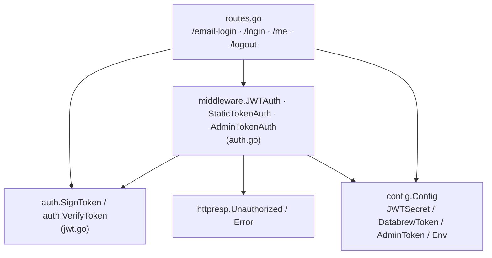
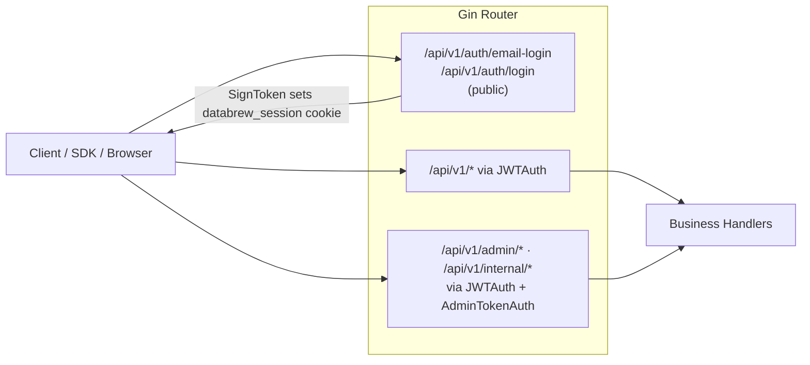
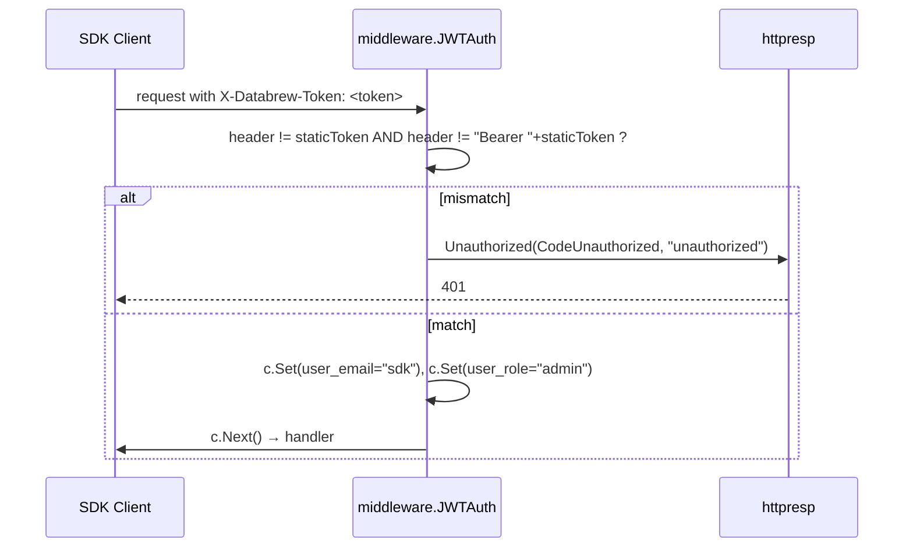
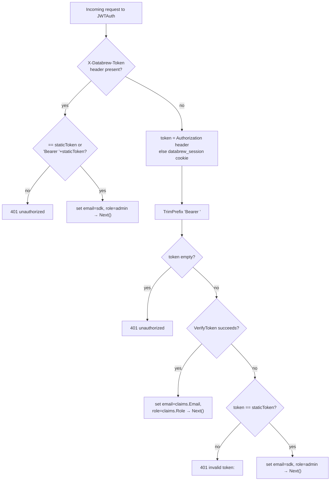
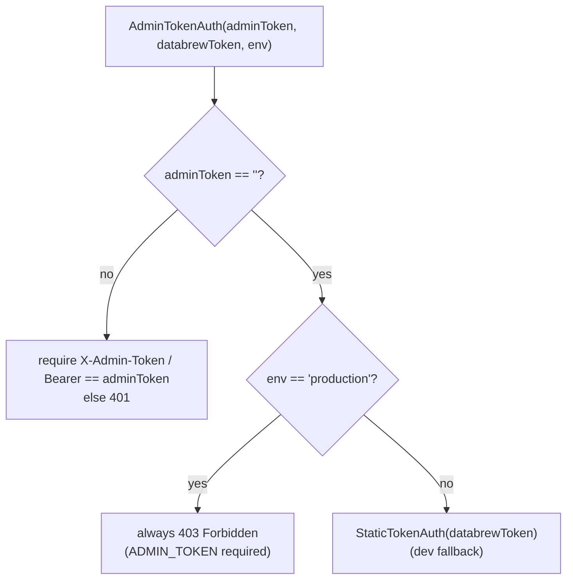
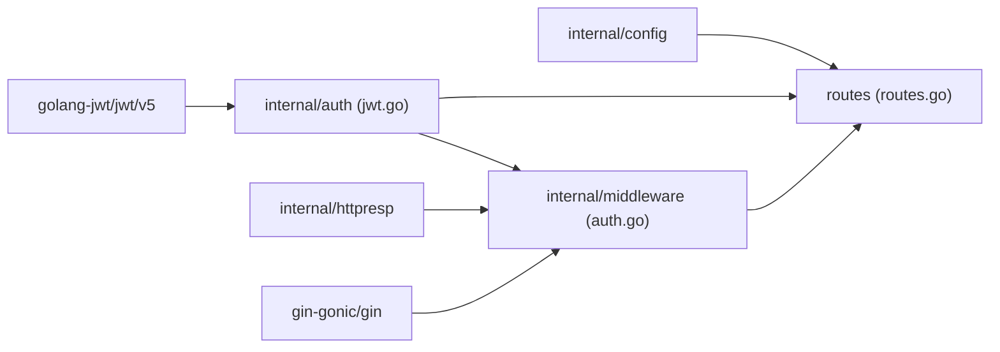

# Authentication Mechanism

<cite>
**Referenced Files in This Document**

- [backend/internal/auth/jwt.go](file://backend/internal/auth/jwt.go)
- [backend/internal/middleware/auth.go](file://backend/internal/middleware/auth.go)
- [backend/routes/routes.go](file://backend/routes/routes.go)
- [backend/internal/config/config.go](file://backend/internal/config/config.go)
- [backend/internal/httpresp/response.go](file://backend/internal/httpresp/response.go)
</cite>

## Table of Contents
1. [Introduction](#introduction)
2. [Project Structure](#project-structure)
3. [Core Components](#core-components)
4. [Architecture Overview](#architecture-overview)
5. [Detailed Component Analysis](#detailed-component-analysis)
6. [Dependency Analysis](#dependency-analysis)
7. [Performance Considerations](#performance-considerations)
8. [Troubleshooting Guide](#troubleshooting-guide)
9. [Conclusion](#conclusion)
10. [Appendices](#appendices)

## Introduction

The cyber-databrew backend authenticates every protected HTTP request through a
small, layered mechanism that has evolved across deployment phases. The system
recognizes **four credential shapes**, all resolved by a single Gin middleware:

1. A **stateless JWT** signed with HMAC-SHA256 (`HS256`), carrying the caller's
   email and role. This is the primary credential for browser sessions and the
   modern API surface.
2. A **legacy static token** (the `DATABREW_TOKEN`, historically `GRACE_TOKEN`),
   accepted via the `X-Databrew-Token` header or as a `Bearer` token, preserved
   for backward compatibility with the SDK.
3. A **session cookie** (`databrew_session`) that simply carries the JWT inside
   an `HttpOnly` cookie so the frontend never has to store the token in JS.
4. A separate **admin token** (`ADMIN_TOKEN`) guarding privileged reindex and
   hard-delete routes, accepted via the `X-Admin-Token` header or `Bearer`.

The design goal is a single decision point — the `JWTAuth` middleware — that can
admit either a freshly minted JWT or a legacy SDK token without forcing existing
integrations to migrate. JWT issuance happens only at login time, in the route
layer; the auth package itself is intentionally tiny and owns just signing and
verification.

This page documents how tokens are issued, how they are verified, the precedence
between the credential types, the cookie semantics, and how the admin tier
overlays on top of the base authentication.

**Section sources**
- [backend/internal/auth/jwt.go](file://backend/internal/auth/jwt.go#L1-L50)
- [backend/internal/middleware/auth.go](file://backend/internal/middleware/auth.go#L1-L124)
- [backend/routes/routes.go](file://backend/routes/routes.go#L107-L187)

## Project Structure

Authentication concerns are split across four cooperating locations. The `auth`
package is a leaf library with no project dependencies; the `middleware` package
consumes it; the `routes` package wires both into the HTTP server and owns the
login/logout endpoints that mint and clear credentials; `config` supplies the
secrets and environment flags.

- **`backend/internal/auth/jwt.go`** — the cryptographic core. Defines the
  `Claims` type and the two functions `SignToken` and `VerifyToken`. It depends
  only on `github.com/golang-jwt/jwt/v5`.
- **`backend/internal/middleware/auth.go`** — the request-time gatekeepers:
  `StaticTokenAuth`, `JWTAuth`, and `AdminTokenAuth`. These are Gin
  `HandlerFunc` factories that read headers/cookies and either set user context
  or abort with `401`/`403`.
- **`backend/routes/routes.go`** — wiring. Registers the public login routes
  (`/email-login`, `/login`), the protected `/me` and `/logout`, applies
  `JWTAuth` to the entire `/api/v1` group, and overlays `AdminTokenAuth` on the
  admin/internal sub-groups.
- **`backend/internal/config/config.go`** — supplies `DatabrewToken`,
  `JWTSecret`, `AllowedDomain`, `AdminToken`, and `Env`, plus the
  `AdminRoutesEnabled()` policy helper.
- **`backend/internal/httpresp/response.go`** — the standard `Unauthorized` and
  `Error` helpers the middleware uses to emit consistent failure envelopes.



**Diagram sources**
- [backend/internal/auth/jwt.go](file://backend/internal/auth/jwt.go#L17-L50)
- [backend/internal/middleware/auth.go](file://backend/internal/middleware/auth.go#L21-L124)
- [backend/routes/routes.go](file://backend/routes/routes.go#L103-L189)

**Section sources**
- [backend/internal/config/config.go](file://backend/internal/config/config.go#L34-L37)
- [backend/internal/config/config.go](file://backend/internal/config/config.go#L119-L135)
- [backend/routes/routes.go](file://backend/routes/routes.go#L107-L189)

## Core Components

### The Claims type

`Claims` extends the standard `jwt.RegisteredClaims` with two custom fields:
`Email` and `Role`. The registered portion carries `Issuer`, `Subject`,
`IssuedAt`, and `ExpiresAt`. The custom fields are what downstream handlers read
out of the Gin context after authentication.

```go
type Claims struct {
    Email string `json:"email"`
    Role  string `json:"role"`
    jwt.RegisteredClaims
}
```

### SignToken — issuance

`SignToken(secret, email, role, ttl)` builds a `Claims` value with the fixed
issuer `cyber-databrew`, sets `Subject` to the email, stamps `IssuedAt` from the
current time, and computes `ExpiresAt` as `now + ttl`. It then signs with
`jwt.SigningMethodHS256` and returns the compact serialized string. There is no
key rotation or `kid` handling — a single shared HMAC secret is used.

### VerifyToken — verification

`VerifyToken(secret, tokenString)` parses the token into a `*Claims` using a
keyfunc that **rejects any algorithm that is not HMAC**. This is the critical
defense against the classic `alg=none` and RS256→HS256 confusion attacks: the
keyfunc type-asserts `t.Method.(*jwt.SigningMethodHMAC)` and errors out with
`unexpected signing method` otherwise. After parsing, it re-checks both the type
assertion on the claims and `token.Valid` (which encompasses expiry and
signature validity) before returning the claims.

### The middleware factories

- `StaticTokenAuth(token)` — a "Phase 0 placeholder" that admits a request only
  if the supplied credential exactly matches `token` (raw or `Bearer`-prefixed).
- `JWTAuth(staticToken, jwtSecret)` — the main gate; tries static token, then
  JWT, then falls back to legacy static token.
- `AdminTokenAuth(adminToken, databrewToken, env)` — privileged gate keyed on
  `X-Admin-Token` with an environment-sensitive fallback.

### Context keys

After a successful authentication, the middleware sets two Gin context values
under the constants `CtxKeyEmail` (`"user_email"`) and `CtxKeyRole`
(`"user_role"`). Handlers read these to identify the caller; the `/me` endpoint
echoes them back.

**Section sources**
- [backend/internal/auth/jwt.go](file://backend/internal/auth/jwt.go#L10-L50)
- [backend/internal/middleware/auth.go](file://backend/internal/middleware/auth.go#L14-L124)

## Architecture Overview

The authentication layer is a thin band between Gin's router and the business
handlers. Every entry under `/api/v1` first passes through `JWTAuth`; admin and
internal sub-groups additionally pass through `AdminTokenAuth`. Login endpoints
under `/api/v1/auth` are public (no `JWTAuth`) because they must run before any
credential exists — they are the only places that call `SignToken`.



The key architectural property is **fallthrough credential resolution**: a
single middleware accepts multiple credential shapes so the legacy SDK (static
token) and the modern frontend (JWT cookie) can share one protected route group.

**Diagram sources**
- [backend/routes/routes.go](file://backend/routes/routes.go#L107-L189)
- [backend/routes/routes.go](file://backend/routes/routes.go#L267-L282)

**Section sources**
- [backend/routes/routes.go](file://backend/routes/routes.go#L96-L189)
- [backend/routes/routes.go](file://backend/routes/routes.go#L267-L282)

## Detailed Component Analysis

### JWT issuance and verification flow

The JWT lifecycle has two distinct moments. **Issuance** happens at login: the
route validates the email domain against `AllowedDomain`, calls `SignToken` with
role `"user"` and a 24-hour TTL, and writes the resulting JWT into the
`databrew_session` cookie (also returning the email and role in the JSON body).
**Verification** happens on every protected request inside `JWTAuth`, which
extracts the token from the `Authorization` header (stripping the `Bearer `
prefix) or, failing that, from the cookie, then calls `VerifyToken`.

```mermaid
sequenceDiagram
  participant C as Client
  participant R as routes.go (/email-login)
  participant A as auth.SignToken
  participant M as middleware.JWTAuth
  participant V as auth.VerifyToken

  C->>R: POST /api/v1/auth/email-login {email}
  R->>R: normalize email, check domain == AllowedDomain
  R->>A: SignToken(JWTSecret, email, "user", 24h)
  A->>A: build Claims(HS256, iss=cyber-databrew, exp=now+24h)
  A-->>R: signed JWT string
  R->>C: Set-Cookie databrew_session=<jwt> (HttpOnly); {authenticated,email,role}

  Note over C,M: later, on a protected request
  C->>M: GET /api/v1/... (cookie or Authorization: Bearer <jwt>)
  M->>M: read Authorization, else databrew_session cookie; TrimPrefix "Bearer "
  M->>V: VerifyToken(JWTSecret, tokenStr)
  V->>V: assert HMAC signing method, check token.Valid + expiry
  V-->>M: *Claims (email, role)
  M->>M: c.Set(user_email), c.Set(user_role); c.Next()
```

**Diagram sources**
- [backend/routes/routes.go](file://backend/routes/routes.go#L110-L142)
- [backend/internal/auth/jwt.go](file://backend/internal/auth/jwt.go#L17-L50)
- [backend/internal/middleware/auth.go](file://backend/internal/middleware/auth.go#L64-L96)

**Section sources**
- [backend/routes/routes.go](file://backend/routes/routes.go#L107-L187)
- [backend/internal/auth/jwt.go](file://backend/internal/auth/jwt.go#L17-L50)
- [backend/internal/middleware/auth.go](file://backend/internal/middleware/auth.go#L49-L97)

### Static-token verification (legacy SDK path)

The static token is the original Phase 0 credential. Two middleware functions
handle it. The standalone `StaticTokenAuth` reads, in order, the
`X-Databrew-Token` header, then `Authorization`, then the `databrew_session`
cookie, and admits the request only if the value equals the configured token
either raw or as `Bearer <token>`. Inside `JWTAuth`, the static-token branch is
prioritized: if `X-Databrew-Token` is present at all, it is checked directly and
the request is tagged as the synthetic user `email="sdk"`, `role="admin"`.



A second fallback exists: even when no `X-Databrew-Token` header is present, if a
token arrives in the `Authorization` header / cookie but fails JWT verification,
`JWTAuth` compares the raw string against `staticToken` and, on a match, admits
it as the `sdk`/`admin` synthetic user. This is what lets an SDK that sends the
static token as a bare `Authorization` value still work.

**Diagram sources**
- [backend/internal/middleware/auth.go](file://backend/internal/middleware/auth.go#L51-L62)
- [backend/internal/httpresp/response.go](file://backend/internal/httpresp/response.go#L39-L46)

**Section sources**
- [backend/internal/middleware/auth.go](file://backend/internal/middleware/auth.go#L20-L97)

### Credential precedence — the auth decision

`JWTAuth` resolves credentials in a fixed order. The decision logic is:



The precedence is therefore: **(1)** explicit `X-Databrew-Token` static token,
**(2)** valid JWT from header or cookie, **(3)** legacy static token presented in
the `Authorization`/cookie slot. Any failure path emits a `401` via
`httpresp.Unauthorized`; the JWT-failure-then-static-mismatch path includes the
underlying verification error in the message (`invalid token: <err>`).

**Diagram sources**
- [backend/internal/middleware/auth.go](file://backend/internal/middleware/auth.go#L49-L97)

**Section sources**
- [backend/internal/middleware/auth.go](file://backend/internal/middleware/auth.go#L41-L97)

### Session cookie semantics

The `databrew_session` cookie is the browser transport for the JWT. Both login
endpoints set it with the same parameters: name `databrew_session`, the JWT as
value, a max-age of `86400` seconds (24 hours, matching the token TTL), path
`/`, empty domain, the `secure` flag bound to `secureSessionCookie` (which is
`true` only when `Env == "production"`), and `HttpOnly = true`. SameSite is set
to `Lax` via `c.SetSameSite(http.SameSiteLaxMode)`.

Logout clears the cookie by re-setting `databrew_session` to an empty value with
a max-age of `-1` (immediate expiry), preserving the same path, secure, and
`HttpOnly` flags. Because the JWT is stateless, logout is purely a client-cookie
operation — there is no server-side session store or revocation list, so a token
that has already been copied out of the cookie remains valid until its `exp`.

**Section sources**
- [backend/routes/routes.go](file://backend/routes/routes.go#L135-L158)
- [backend/routes/routes.go](file://backend/routes/routes.go#L184-L186)

### Admin token and route gating

`AdminTokenAuth(adminToken, databrewToken, env)` protects the privileged admin
and internal route groups. Its behavior depends on whether `ADMIN_TOKEN` is set:

- If `adminToken == ""` **and** `env == "production"`, it returns a handler that
  unconditionally aborts with `403 Forbidden` (`admin routes require ADMIN_TOKEN
  in production`).
- If `adminToken == ""` **and** non-production, it falls back to
  `StaticTokenAuth(databrewToken)` — dev convenience so admin routes work with
  the same dev token.
- If `adminToken != ""`, it requires the value in the `X-Admin-Token` header (or
  `Authorization`), matching raw or `Bearer`-prefixed, else `401`.

Whether the admin/internal routes are even mounted is governed by
`Config.AdminRoutesEnabled()`: routes mount if `AdminToken` is set, or if the
environment is not production. In `routes.go`, the `/api/v1/admin` and
`/api/v1/internal` groups (plus `/internal/commit-segments`) are registered only
when `adminRoutesEnabled` is true, and each is wrapped with `adminAuth`. Because
these sub-groups live under `/api/v1`, every admin request passes `JWTAuth`
first and `AdminTokenAuth` second — a two-layer check.



**Diagram sources**
- [backend/internal/middleware/auth.go](file://backend/internal/middleware/auth.go#L99-L124)
- [backend/internal/config/config.go](file://backend/internal/config/config.go#L224-L231)

**Section sources**
- [backend/internal/middleware/auth.go](file://backend/internal/middleware/auth.go#L99-L124)
- [backend/internal/config/config.go](file://backend/internal/config/config.go#L119-L231)
- [backend/routes/routes.go](file://backend/routes/routes.go#L103-L104)
- [backend/routes/routes.go](file://backend/routes/routes.go#L267-L371)

### Login endpoints

Two public login routes mint sessions:

- **`POST /api/v1/auth/email-login`** — accepts `{email}`, normalizes it
  (trim + lowercase), validates it contains `@`, and checks the domain equals
  `cfg.AllowedDomain` (default `cyberorigin.ai`). On success it signs a
  `role="user"` JWT and sets the cookie. There is no password or external
  identity provider — domain membership is the sole gate.
- **`POST /api/v1/auth/login`** — the legacy SDK login. Accepts `{token}`,
  compares it to `cfg.DatabrewToken`, and on a match signs a JWT for the
  synthetic principal `email="legacy"`, `role="admin"`, setting the same cookie.

Both return `{authenticated: true, ...}` on success and an `error` body with the
appropriate status (`400` for bad input, `401` for domain/token rejection,
`500` if signing fails) otherwise.

**Section sources**
- [backend/routes/routes.go](file://backend/routes/routes.go#L107-L187)
- [backend/internal/config/config.go](file://backend/internal/config/config.go#L165-L167)

## Dependency Analysis

The auth core is deliberately dependency-light: `jwt.go` imports only `fmt`,
`time`, and `github.com/golang-jwt/jwt/v5`. Everything else fans out from there.



- `internal/auth` is consumed by `internal/middleware` (`VerifyToken`) and by
  `routes` (`SignToken`).
- `internal/middleware` depends on `internal/auth`, `internal/httpresp`, and
  Gin.
- `routes` ties together `config`, `auth`, and `middleware`, and is the only
  caller of `SignToken`.

**Diagram sources**
- [backend/internal/auth/jwt.go](file://backend/internal/auth/jwt.go#L1-L8)
- [backend/internal/middleware/auth.go](file://backend/internal/middleware/auth.go#L1-L12)

**Section sources**
- [backend/internal/auth/jwt.go](file://backend/internal/auth/jwt.go#L1-L50)
- [backend/internal/middleware/auth.go](file://backend/internal/middleware/auth.go#L1-L12)
- [backend/routes/routes.go](file://backend/routes/routes.go#L130-L189)

## Performance Considerations

Authentication is on the hot path of every protected request, so its cost
matters. The good news is that the design is **stateless and allocation-light**:

- **No database or network round-trip.** Both `SignToken` and `VerifyToken`
  operate purely on the in-process HMAC secret; there is no session store, no
  Redis, no token introspection endpoint. Verification is a single HMAC-SHA256
  computation plus claim parsing.
- **Static-token fast path.** When `X-Databrew-Token` is present, `JWTAuth`
  short-circuits before any JWT parsing — a couple of string comparisons. This
  keeps the SDK path cheap.
- **No caching is needed or used.** Because verification is cheap and the secret
  is static, there is no token-validation cache; this also means no cache
  invalidation concerns.
- **Cookie vs header.** Reading the cookie is marginally more work than reading a
  header, but both are O(1) map lookups in Gin.

The main scaling caveat is unrelated to CPU: because tokens are stateless with a
fixed 24-hour TTL and no revocation list, there is no way to forcibly invalidate
a leaked token before expiry — a correctness/security trade-off, not a
throughput one.

**Section sources**
- [backend/internal/auth/jwt.go](file://backend/internal/auth/jwt.go#L17-L50)
- [backend/internal/middleware/auth.go](file://backend/internal/middleware/auth.go#L49-L97)

## Troubleshooting Guide

**`401 unauthorized` on a protected route.** The request reached `JWTAuth` with
no usable credential. Check, in order: is the `databrew_session` cookie being
sent (browsers drop it if `Secure` is set but the request is plain HTTP, which
happens when `Env=production` but TLS is terminated incorrectly)? Is the
`Authorization` header present and `Bearer`-prefixed? If using the SDK, is
`X-Databrew-Token` set to exactly the configured `DATABREW_TOKEN`?

**`401 invalid token: <err>`.** This message means a token was present in the
`Authorization`/cookie slot, JWT verification failed, **and** it did not match
the static token either. The embedded `<err>` distinguishes causes: `token is
expired` (past the 24-hour TTL), `signature is invalid` (the `JWT_SECRET` used to
sign differs from the one verifying — common after a secret rotation or a
mismatched dev vs prod env), or `unexpected signing method` (a token signed with
something other than HMAC was presented).

**`email domain not allowed` on `/email-login`.** The email's domain does not
equal `cfg.AllowedDomain`. Confirm `ALLOWED_DOMAIN` (default `cyberorigin.ai`)
matches the user's address; an empty `AllowedDomain` rejects everything.

**`403 admin routes require ADMIN_TOKEN in production`.** You hit an admin route
in a production build with `ADMIN_TOKEN` unset. Either set `ADMIN_TOKEN`, or note
that in production the routes should also be unmounted (`AdminRoutesEnabled()`
returns true only when `AdminToken` is set in production).

**Admin route returns 404 instead of 401/403.** The route was never mounted —
`AdminRoutesEnabled()` was false (production with no `ADMIN_TOKEN`).

**SDK works in dev but not prod.** In dev, `AdminTokenAuth` falls back to the
`DATABREW_TOKEN`; in production it requires the distinct `ADMIN_TOKEN`. Configure
the admin token explicitly for prod.

**Section sources**
- [backend/internal/middleware/auth.go](file://backend/internal/middleware/auth.go#L33-L124)
- [backend/routes/routes.go](file://backend/routes/routes.go#L118-L130)
- [backend/internal/config/config.go](file://backend/internal/config/config.go#L224-L231)
- [backend/internal/httpresp/response.go](file://backend/internal/httpresp/response.go#L26-L46)

## Conclusion

cyber-databrew's authentication is a compact, stateless, multi-credential system.
A single `auth` package signs and verifies HS256 JWTs with email/role claims; a
single `JWTAuth` middleware resolves credentials in a fixed precedence — explicit
static token, then JWT (header or `HttpOnly` cookie), then legacy static-token
fallback — so the modern frontend and the legacy SDK share one protected route
group. A separate `AdminTokenAuth` layer, gated by `ADMIN_TOKEN` and the
environment, fences off privileged reindex and hard-delete routes. The
verification path defends against algorithm-confusion attacks by rejecting any
non-HMAC signing method. The principal trade-off is the absence of server-side
revocation: tokens live for their 24-hour TTL regardless of logout.

## Appendices

### Credential types

| Credential | Transport | Verified by | Resulting principal |
| --- | --- | --- | --- |
| JWT | `Authorization: Bearer <jwt>` or `databrew_session` cookie | `auth.VerifyToken` | `claims.Email` / `claims.Role` |
| Static token | `X-Databrew-Token` header, or `Authorization` / cookie | string compare vs `DatabrewToken` | `email="sdk"`, `role="admin"` |
| Admin token | `X-Admin-Token` header or `Authorization` | string compare vs `AdminToken` | (admin route access) |

### JWT claims

| Field | Source | Value |
| --- | --- | --- |
| `email` (custom) | `SignToken` arg | login email or `legacy` |
| `role` (custom) | `SignToken` arg | `user` (email-login) / `admin` (legacy login) |
| `iss` | constant | `cyber-databrew` |
| `sub` | `SignToken` arg | email |
| `iat` | `SignToken` | now |
| `exp` | `SignToken` | now + TTL (24h at call sites) |

### Configuration keys

| Config field | Env var | Default | Purpose |
| --- | --- | --- | --- |
| `DatabrewToken` | `DATABREW_TOKEN` (or `GRACE_TOKEN`) | `dev-token` | legacy static token / dev admin fallback |
| `JWTSecret` | `JWT_SECRET` | `dev-jwt-secret` | HS256 signing/verification secret |
| `AllowedDomain` | `ALLOWED_DOMAIN` | `cyberorigin.ai` | email-login domain allowlist |
| `AdminToken` | `ADMIN_TOKEN` | `""` (empty) | admin-route credential; gates route mounting |
| `Env` | `ENV` | `development` | controls cookie `Secure`, admin fallback, route mounting |

### Context keys

| Constant | String value | Set by |
| --- | --- | --- |
| `CtxKeyEmail` | `user_email` | `JWTAuth` on success |
| `CtxKeyRole` | `user_role` | `JWTAuth` on success |

### Endpoint summary

| Method & path | Auth | Effect |
| --- | --- | --- |
| `POST /api/v1/auth/email-login` | public | validate domain → sign `user` JWT → set cookie |
| `POST /api/v1/auth/login` | public | match `DatabrewToken` → sign `legacy`/`admin` JWT → set cookie |
| `GET /api/v1/auth/me` | `JWTAuth` | echo `email`/`role` from context |
| `POST /api/v1/auth/logout` | `JWTAuth` | clear `databrew_session` cookie |
| `/api/v1/*` | `JWTAuth` | protected API surface |
| `/api/v1/admin/*`, `/api/v1/internal/*` | `JWTAuth` + `AdminTokenAuth` | privileged ops (mounted only if enabled) |

**Section sources**
- [backend/internal/auth/jwt.go](file://backend/internal/auth/jwt.go#L10-L50)
- [backend/internal/config/config.go](file://backend/internal/config/config.go#L34-L37)
- [backend/internal/config/config.go](file://backend/internal/config/config.go#L119-L231)
- [backend/internal/middleware/auth.go](file://backend/internal/middleware/auth.go#L14-L18)
- [backend/routes/routes.go](file://backend/routes/routes.go#L107-L282)
