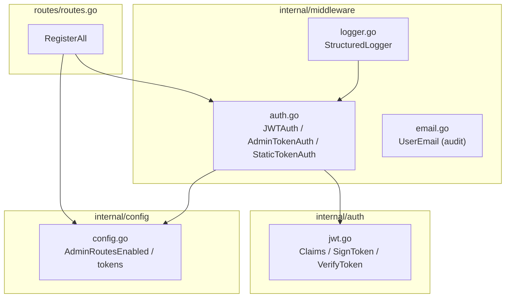
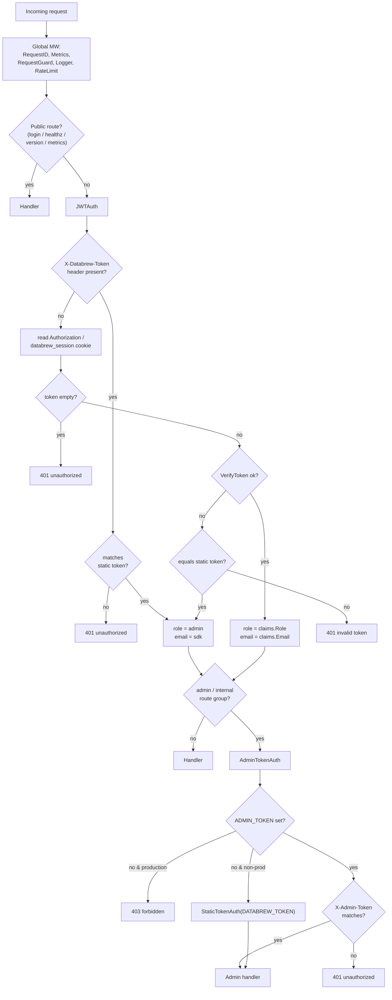
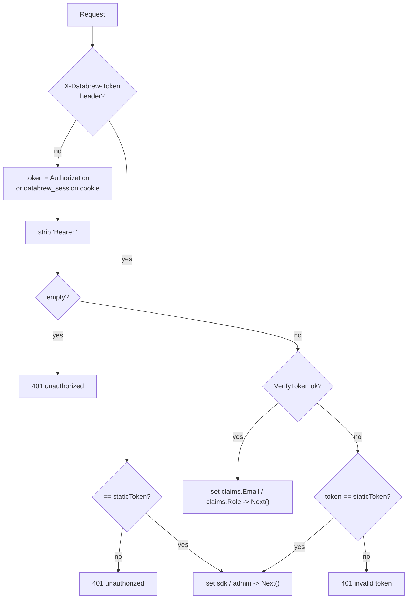
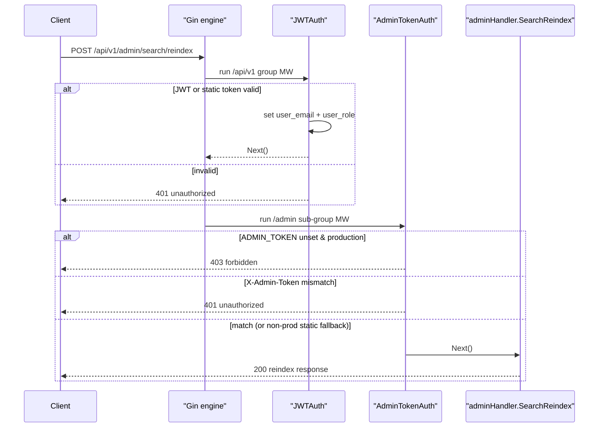
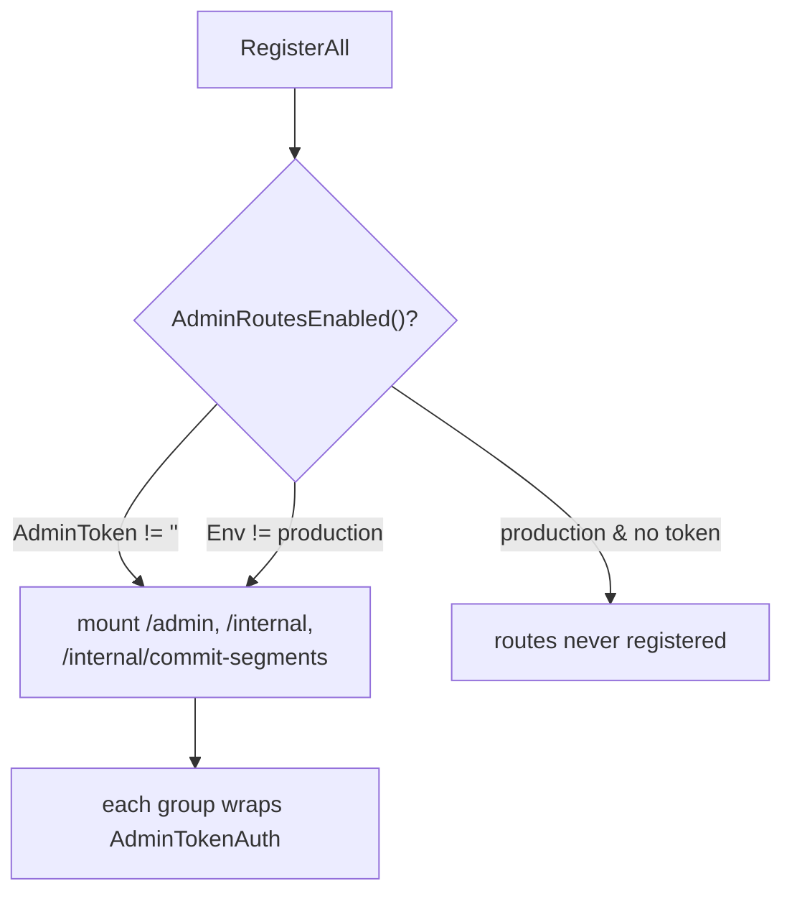
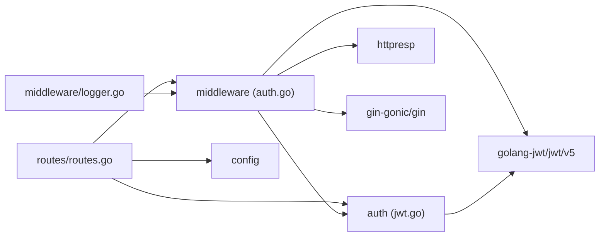

# Authorization & Roles

<cite>
**Referenced Files in This Document**

- [backend/internal/middleware/auth.go](file://backend/internal/middleware/auth.go)
- [backend/internal/middleware/email.go](file://backend/internal/middleware/email.go)
- [backend/internal/middleware/logger.go](file://backend/internal/middleware/logger.go)
- [backend/internal/middleware/request_guard.go](file://backend/internal/middleware/request_guard.go)
- [backend/internal/auth/jwt.go](file://backend/internal/auth/jwt.go)
- [backend/routes/routes.go](file://backend/routes/routes.go)
- [backend/internal/handlers/admin/reindex.go](file://backend/internal/handlers/admin/reindex.go)
- [backend/internal/config/config.go](file://backend/internal/config/config.go)
- [backend/internal/httpresp/response.go](file://backend/internal/httpresp/response.go)
- [backend/internal/httpresp/codes.go](file://backend/internal/httpresp/codes.go)
</cite>

## Table of Contents
1. [Introduction](#introduction)
2. [Project Structure](#project-structure)
3. [Core Components](#core-components)
4. [Architecture Overview](#architecture-overview)
5. [Detailed Component Analysis](#detailed-component-analysis)
6. [Dependency Analysis](#dependency-analysis)
7. [Performance Considerations](#performance-considerations)
8. [Troubleshooting Guide](#troubleshooting-guide)
9. [Conclusion](#conclusion)
10. [Appendices](#appendices)

## Introduction

This page documents how `cyber-databrew` authenticates callers and decides what
they are allowed to do. The system uses a deliberately small authorization
model that has grown out of an early static-token phase into a hybrid scheme:

- A **JWT session** carrying an `email` and a `role` claim, minted by an
  email-login endpoint that is gated by a single allowed email domain.
- A **legacy static token** (`DATABREW_TOKEN`) for the Python SDK and
  service-to-service calls, which is mapped onto a synthetic `admin` identity.
- A **separate admin token** (`ADMIN_TOKEN`), checked at a second, stricter
  gate in front of privileged reindex / hard-delete / internal routes.

The role model is intentionally minimal. Only two role strings are ever
produced by the codebase: `"user"` (issued to a successfully email-authenticated
human) and `"admin"` (issued to the static-token / SDK identity). There is no
role-based row filtering or data scoping in the handlers — the role is set on
the request context and surfaced through the `/api/v1/auth/me` endpoint, but
privilege escalation for sensitive operations is enforced by *token possession*
(`ADMIN_TOKEN`) rather than by inspecting the JWT role claim. Understanding that
distinction is the key to reasoning about this area correctly.

The audience for this page is anyone wiring new routes, debugging a `401`/`403`
response, or reviewing the security posture of an environment before it is
promoted to production.

**Section sources**
- [backend/internal/middleware/auth.go](file://backend/internal/middleware/auth.go#L41-L124)
- [backend/routes/routes.go](file://backend/routes/routes.go#L107-L187)
- [backend/internal/auth/jwt.go](file://backend/internal/auth/jwt.go#L10-L32)

## Project Structure

Authorization logic lives in three cooperating locations: the JWT primitives in
`internal/auth`, the Gin middleware in `internal/middleware`, and the route
wiring in `routes/routes.go` that decides which middleware guards which group.

- **`backend/internal/auth/jwt.go`** — the `Claims` struct (`Email`, `Role`,
  plus the standard `RegisteredClaims`) and the `SignToken` / `VerifyToken`
  pair. This is the only place that defines the token shape and the HS256
  signing/verification contract.
- **`backend/internal/middleware/auth.go`** — three Gin middlewares:
  `StaticTokenAuth` (the original Phase 0 placeholder), `JWTAuth` (the primary
  session gate), and `AdminTokenAuth` (the privileged gate). It also declares
  the context keys `CtxKeyEmail = "user_email"` and `CtxKeyRole = "user_role"`.
- **`backend/internal/middleware/email.go`** — `UserEmail`, an *audit-trail*
  middleware that copies an `X-User-Email` request header into the context. It
  is independent of authentication and exists so SDK clients can attribute
  actions to a human even when authenticating with the shared static token.
- **`backend/routes/routes.go`** — `RegisterAll`, which attaches `JWTAuth` to
  the whole `/api/v1` tree, attaches `AdminTokenAuth` to the `/admin` and
  `/internal` sub-groups, and conditionally mounts those privileged groups
  based on `cfg.AdminRoutesEnabled()`.
- **`backend/internal/config/config.go`** — the `DatabrewToken`, `JWTSecret`,
  `AllowedDomain`, `AdminToken`, and `Env` settings, plus the
  `AdminRoutesEnabled()` policy method.
- **`backend/internal/handlers/admin/reindex.go`** — a second, handler-local
  `AdminTokenAuth` helper used by admin reindex scripts (accepts the token via
  an `admin_token` query parameter as well as the `X-Admin-Token` header).

**Diagram sources**
- [backend/routes/routes.go](file://backend/routes/routes.go#L44-L373)
- [backend/internal/middleware/auth.go](file://backend/internal/middleware/auth.go#L14-L124)
- [backend/internal/auth/jwt.go](file://backend/internal/auth/jwt.go#L1-L50)

**Section sources**
- [backend/internal/middleware/auth.go](file://backend/internal/middleware/auth.go#L1-L124)
- [backend/internal/auth/jwt.go](file://backend/internal/auth/jwt.go#L1-L50)
- [backend/internal/middleware/email.go](file://backend/internal/middleware/email.go#L1-L33)
- [backend/routes/routes.go](file://backend/routes/routes.go#L44-L373)
- [backend/internal/config/config.go](file://backend/internal/config/config.go#L34-L37)

## Core Components

### JWT claims and token lifecycle

`Claims` embeds `jwt.RegisteredClaims` and adds two custom fields, `Email` and
`Role`. `SignToken` builds a claim set with issuer `cyber-databrew`, subject
equal to the email, an `IssuedAt`, and an `ExpiresAt` derived from the supplied
TTL, then signs it with HS256 using the shared secret. `VerifyToken` parses the
token, explicitly rejects any non-HMAC signing method (a guard against the
classic `alg` confusion attack), and returns the typed `*Claims` only when the
token is structurally valid and `token.Valid` is true.

The TTL used by the login routes is 24 hours, and the same value is mirrored
into the `databrew_session` cookie max-age (`86400` seconds).

**Section sources**
- [backend/internal/auth/jwt.go](file://backend/internal/auth/jwt.go#L10-L50)
- [backend/routes/routes.go](file://backend/routes/routes.go#L130-L136)

### The role context keys

`CtxKeyEmail` and `CtxKeyRole` are the canonical Gin context keys (`"user_email"`
and `"user_role"`). Every authentication path sets both: a verified JWT sets
them from the claims, while every static-token / SDK path sets `user_email`
to the literal `"sdk"` and `user_role` to `"admin"`. The structured logger reads
`CtxKeyEmail` to enrich each access-log line with the acting user.

**Section sources**
- [backend/internal/middleware/auth.go](file://backend/internal/middleware/auth.go#L14-L18)
- [backend/internal/middleware/logger.go](file://backend/internal/middleware/logger.go#L24-L37)

### JWTAuth — the primary session gate

`JWTAuth` is the gate for the entire `/api/v1` tree. It resolves credentials in
a fixed priority order and short-circuits as soon as one path succeeds. Its
distinguishing behaviour is that it accepts *both* a verifiable JWT and the
legacy static token, mapping the latter onto the synthetic `sdk`/`admin`
identity so that older SDK clients keep working without a login round-trip.

**Section sources**
- [backend/internal/middleware/auth.go](file://backend/internal/middleware/auth.go#L41-L97)

### AdminTokenAuth — the privileged gate

`AdminTokenAuth` is a second gate, applied only to the `/admin`, `/internal`,
and `/internal/commit-segments` route groups. It checks the `X-Admin-Token`
header (falling back to `Authorization`) against the configured `ADMIN_TOKEN`.
When `ADMIN_TOKEN` is unset, behaviour depends on the environment: production
returns a hard `403` for every admin request, while non-production falls back
to guarding with the ordinary `DATABREW_TOKEN` via `StaticTokenAuth`.

**Section sources**
- [backend/internal/middleware/auth.go](file://backend/internal/middleware/auth.go#L99-L124)

### Domain allowlist at login

The only place the role `"user"` is minted is `POST /api/v1/auth/email-login`.
Before signing a token it normalises the email (trim + lowercase), validates a
minimal shape (`@` present), extracts the domain after the last `@`, and rejects
the request with `401` unless the domain exactly equals `cfg.AllowedDomain`. An
empty `AllowedDomain` denies all logins. This domain check — not the role — is
the actual admission control for human sessions.

**Section sources**
- [backend/routes/routes.go](file://backend/routes/routes.go#L110-L142)
- [backend/internal/config/config.go](file://backend/internal/config/config.go#L37)

## Architecture Overview

A request passes through a fixed middleware stack before reaching a handler.
Global middleware (request id, metrics, request guard, structured logger, and
optional rate limit) run for every request. Authentication is then layered per
route group: the `/api/v1` group carries `JWTAuth`; the privileged
`/api/v1/admin` and `/api/v1/internal` sub-groups additionally carry
`AdminTokenAuth`; the `/api/v1/auth/email-login`, `/login`, `/healthz`,
`/readyz`, `/version`, `/metrics`, and `/swagger` routes are public.

**Diagram sources**
- [backend/internal/middleware/auth.go](file://backend/internal/middleware/auth.go#L41-L124)
- [backend/routes/routes.go](file://backend/routes/routes.go#L74-L102)
- [backend/routes/routes.go](file://backend/routes/routes.go#L189-L285)

**Section sources**
- [backend/routes/routes.go](file://backend/routes/routes.go#L74-L373)
- [backend/internal/middleware/auth.go](file://backend/internal/middleware/auth.go#L41-L124)

## Detailed Component Analysis

### JWTAuth credential resolution

`JWTAuth(staticToken, jwtSecret string)` returns a closure that runs per
request. Its resolution order is precisely:

1. **`X-Databrew-Token` header** — if present, it is compared (bare or with a
   `Bearer ` prefix) against `staticToken`. A mismatch aborts with `401`. A
   match sets `user_email = "sdk"` and `user_role = "admin"` and returns
   immediately. This is the legacy SDK path and never produces a JWT.
2. **`Authorization` header, else `databrew_session` cookie** — the chosen value
   is stripped of a leading `Bearer ` prefix. An empty result aborts with `401`.
3. **JWT verification** — `auth.VerifyToken` is called. On success the handler
   sets `user_email` / `user_role` from the claims and proceeds.
4. **Static-token fallback** — if verification fails, the raw token is compared
   one last time against `staticToken`. A mismatch aborts with
   `invalid token: <err>`; a match again yields the `sdk`/`admin` identity.

The dual acceptance of JWT and static token on the same path is the most
important subtlety here: a caller presenting the raw `DATABREW_TOKEN` as a
`Bearer` value is treated as a full `admin`.

**Diagram sources**
- [backend/internal/middleware/auth.go](file://backend/internal/middleware/auth.go#L49-L97)

**Section sources**
- [backend/internal/middleware/auth.go](file://backend/internal/middleware/auth.go#L49-L97)

### A role-guarded admin route end to end

The sequence below traces a privileged request to a reindex route. Both the
`/api/v1` group's `JWTAuth` and the `/admin` sub-group's `AdminTokenAuth` run in
order; the handler executes only when both gates pass.

**Diagram sources**
- [backend/routes/routes.go](file://backend/routes/routes.go#L189-L278)
- [backend/internal/middleware/auth.go](file://backend/internal/middleware/auth.go#L99-L124)

**Section sources**
- [backend/routes/routes.go](file://backend/routes/routes.go#L267-L285)
- [backend/internal/middleware/auth.go](file://backend/internal/middleware/auth.go#L99-L124)
- [backend/internal/handlers/admin/reindex.go](file://backend/internal/handlers/admin/reindex.go#L239-L257)

### Conditional mounting of privileged routes

Privileged groups are not merely guarded — in production they are *not mounted
at all* unless `ADMIN_TOKEN` is configured. `RegisterAll` reads
`cfg.AdminRoutesEnabled()` once and uses it as the guard around the `/admin`,
`/internal`, and `/internal/commit-segments` registrations. `AdminRoutesEnabled`
returns `true` whenever `AdminToken` is non-empty, and otherwise returns
`true` only for non-production environments. The net effect is two independent
layers of defence in production: the route must be mounted (requires
`ADMIN_TOKEN`) *and* the request must present the matching token.

**Diagram sources**
- [backend/internal/config/config.go](file://backend/internal/config/config.go#L224-L231)
- [backend/routes/routes.go](file://backend/routes/routes.go#L103-L104)
- [backend/routes/routes.go](file://backend/routes/routes.go#L267-L285)

**Section sources**
- [backend/internal/config/config.go](file://backend/internal/config/config.go#L120-L231)
- [backend/routes/routes.go](file://backend/routes/routes.go#L103-L104)
- [backend/routes/routes.go](file://backend/routes/routes.go#L267-L372)

### Login flows and cookie issuance

There are two login endpoints, both public:

- **`POST /api/v1/auth/email-login`** — the human path. After the domain check
  it signs a 24-hour token with role `"user"` and writes a `databrew_session`
  cookie. The cookie is `HttpOnly`, `SameSite=Lax`, and `Secure` only when
  `cfg.Env == "production"` (`secureSessionCookie`). The JSON response echoes
  `email` and `role: "user"`.
- **`POST /api/v1/auth/login`** — the legacy SDK path. It compares the posted
  token to `DATABREW_TOKEN` and, on match, signs a token for subject `"legacy"`
  with role `"admin"`, again writing the session cookie. This is the second
  place `admin` is produced.

The protected sub-group `authProtected` (guarded by `JWTAuth`) exposes
`GET /me` (returns the context `email`/`role`) and `POST /logout` (clears the
cookie with a negative max-age).

**Section sources**
- [backend/routes/routes.go](file://backend/routes/routes.go#L107-L187)

### The audit-only email middleware

`UserEmail()` is *not* an authentication middleware. It reads the optional
`X-User-Email` header and, only when non-empty, stores it under the same
`"user_email"` context key for audit attribution. `UserEmailFromContext`
retrieves it, returning the empty string when absent so handlers can
distinguish "not provided" from "provided and empty". Note the key collision:
both `email.go` and `auth.go` use the literal `"user_email"`, so whichever
middleware runs last wins for that key.

**Section sources**
- [backend/internal/middleware/email.go](file://backend/internal/middleware/email.go#L7-L33)
- [backend/internal/middleware/auth.go](file://backend/internal/middleware/auth.go#L14-L18)

### The handler-local admin token helper

`internal/handlers/admin/reindex.go` defines its own `AdminTokenAuth(expected
string)` distinct from the middleware package version. It additionally accepts
the token via the `admin_token` query parameter (convenient for one-shot
scripts and curl), and when `expected` is empty it returns `404 admin disabled`
rather than `403`. The routes registered in `RegisterAll` use the *middleware*
variant, so this helper is the alternative wiring used by standalone reindex
entry points.

**Section sources**
- [backend/internal/handlers/admin/reindex.go](file://backend/internal/handlers/admin/reindex.go#L239-L257)

## Dependency Analysis

The authorization stack depends on a small, well-contained set of packages.

- **`golang-jwt/jwt/v5`** provides the signing and parsing primitives used by
  `SignToken`/`VerifyToken`.
- **`internal/httpresp`** standardises the error envelope; the middlewares emit
  `Unauthorized` (`401`) and `Error` (`403`/`414`) with codes such as
  `CodeUnauthorized` and `CodeURITooLong`.
- **`internal/config`** supplies `DatabrewToken`, `JWTSecret`, `AllowedDomain`,
  `AdminToken`, `Env`, and the `AdminRoutesEnabled()` policy.
- **`gin-gonic/gin`** is the HTTP framework; all guards are `gin.HandlerFunc`.

Downstream, the `StructuredLogger` reads the email key, and every `/api/v1`
handler relies on `JWTAuth` having admitted the request — but, importantly, no
handler reads `CtxKeyRole` to make an authorization decision. There is currently
no role-based data scoping or row-level filtering in the handler or use-case
layers.

**Section sources**
- [backend/internal/middleware/auth.go](file://backend/internal/middleware/auth.go#L1-L124)
- [backend/internal/auth/jwt.go](file://backend/internal/auth/jwt.go#L1-L50)
- [backend/internal/httpresp/response.go](file://backend/internal/httpresp/response.go#L26-L45)
- [backend/internal/httpresp/codes.go](file://backend/internal/httpresp/codes.go#L24-L25)

## Performance Considerations

- **Stateless verification.** `JWTAuth` performs an HMAC-SHA256 verification per
  request with no database or network lookup, so the per-request cost is a
  single symmetric-crypto operation. There is no session store and therefore no
  cache-invalidation or revocation lookup on the hot path.
- **Short-circuit ordering.** The static-token header check runs first and
  returns before any JWT parsing, so the highest-volume SDK traffic skips the
  more expensive parse path.
- **No token caching.** Verification is repeated on every request; because it is
  cheap and stateless, there is no caching layer, which keeps the design simple
  at the cost of redundant parse work for chatty clients.
- **Guard placement.** `AdminTokenAuth` only runs for the small set of admin /
  internal routes, so the extra header comparison never touches the common API
  surface.
- **Request guard.** `RequestGuard(2048)` rejects oversized URIs early (`414`)
  before auth, bounding work spent on abusive requests.

**Section sources**
- [backend/internal/middleware/auth.go](file://backend/internal/middleware/auth.go#L49-L97)
- [backend/internal/middleware/request_guard.go](file://backend/internal/middleware/request_guard.go#L11-L23)

## Troubleshooting Guide

#### Every API call returns 401 "unauthorized"

No credential resolved. Confirm one of: an `X-Databrew-Token` header equal to
`DATABREW_TOKEN`, an `Authorization: Bearer <jwt>` header, or a
`databrew_session` cookie. An empty token after stripping `Bearer ` is treated
as unauthorized.

**Section sources**
- [backend/internal/middleware/auth.go](file://backend/internal/middleware/auth.go#L64-L77)

#### 401 "invalid token: ..." with a JWT

The JWT failed `VerifyToken` and did not match the static token fallback. Common
causes: a wrong or rotated `JWT_SECRET`, an expired token (TTL is 24h), or a
token signed with a non-HMAC algorithm (explicitly rejected). The error message
includes the underlying parse error.

**Section sources**
- [backend/internal/middleware/auth.go](file://backend/internal/middleware/auth.go#L79-L92)
- [backend/internal/auth/jwt.go](file://backend/internal/auth/jwt.go#L35-L49)

#### Login returns 401 "email domain not allowed"

The email's domain does not match `ALLOWED_DOMAIN`, or `ALLOWED_DOMAIN` is
empty (which denies all logins). The domain is the substring after the last
`@`; the comparison is exact and case-sensitive after lowercasing the address.

**Section sources**
- [backend/routes/routes.go](file://backend/routes/routes.go#L118-L128)
- [backend/internal/config/config.go](file://backend/internal/config/config.go#L37)

#### Admin route returns 403 "admin routes require ADMIN_TOKEN in production"

The deployment is `production` and `ADMIN_TOKEN` is unset. Note that in
production the privileged groups are also conditionally unmounted, so depending
on configuration a `404` (route never registered) is also possible. Set
`ADMIN_TOKEN` to enable these routes.

**Section sources**
- [backend/internal/middleware/auth.go](file://backend/internal/middleware/auth.go#L102-L111)
- [backend/internal/config/config.go](file://backend/internal/config/config.go#L224-L231)
- [backend/routes/routes.go](file://backend/routes/routes.go#L267-L285)

#### Admin route returns 401 "unauthorized" with a valid session

Passing `JWTAuth` is not enough for admin routes. The `X-Admin-Token` header
must equal `ADMIN_TOKEN`. A regular `user` JWT does not satisfy `AdminTokenAuth`.

**Section sources**
- [backend/internal/middleware/auth.go](file://backend/internal/middleware/auth.go#L112-L123)

#### Session cookie not sent by the browser over HTTPS proxies

The `databrew_session` cookie is marked `Secure` only when `Env == "production"`.
In a non-production deployment served over plain HTTP behind a TLS-terminating
proxy this is expected; verify `Env` and the proxy's forwarded scheme.

**Section sources**
- [backend/routes/routes.go](file://backend/routes/routes.go#L105-L136)

## Conclusion

`cyber-databrew` implements a compact authentication model: a stateless HS256
JWT carrying `email` and `role`, a domain-allowlisted email login that mints
`user` sessions, and a legacy static token that maps onto an `admin` SDK
identity. Authorization for sensitive operations is enforced by a *second*
token (`ADMIN_TOKEN`) at the `AdminTokenAuth` gate and by conditionally
unmounting privileged routes in production — not by inspecting the JWT role
claim. The role is recorded and surfaced (via `/me` and the access log) but is
not, at present, used for data filtering or per-handler privilege checks. Anyone
adding a privileged endpoint should place it inside the `adminRoutesEnabled`
groups so it inherits both defence layers, and should treat the static-token
acceptance inside `JWTAuth` as granting full `admin`-equivalent access.

## Appendices

### Role values produced by the codebase

| Role string | Produced by | Notes |
| --- | --- | --- |
| `user` | `POST /api/v1/auth/email-login` after domain check | Human session, 24h TTL |
| `admin` | `POST /api/v1/auth/login` (legacy token); `JWTAuth` static-token paths | Synthetic SDK / legacy identity |

**Section sources**
- [backend/routes/routes.go](file://backend/routes/routes.go#L130-L186)
- [backend/internal/middleware/auth.go](file://backend/internal/middleware/auth.go#L58-L94)

### Context keys

| Key | Constant | Set by | Read by |
| --- | --- | --- | --- |
| `user_email` | `CtxKeyEmail` / `emailKey` | `JWTAuth`, `UserEmail` | `StructuredLogger`, `/me`, `UserEmailFromContext` |
| `user_role` | `CtxKeyRole` | `JWTAuth` | `/me` |

**Section sources**
- [backend/internal/middleware/auth.go](file://backend/internal/middleware/auth.go#L14-L18)
- [backend/internal/middleware/email.go](file://backend/internal/middleware/email.go#L7-L33)

### Auth-relevant configuration keys

| Field | Env var | Default | Purpose |
| --- | --- | --- | --- |
| `DatabrewToken` | `DATABREW_TOKEN` (or `GRACE_TOKEN`) | `dev-token` | Static SDK / service token |
| `JWTSecret` | `JWT_SECRET` | `dev-jwt-secret` | HS256 signing secret |
| `AllowedDomain` | `ALLOWED_DOMAIN` | `cyberorigin.ai` | Email-login domain allowlist |
| `AdminToken` | `ADMIN_TOKEN` | `""` | Privileged-route gate / mount switch |
| `Env` | — | — | `production` toggles `Secure` cookie and strict admin policy |

**Section sources**
- [backend/internal/config/config.go](file://backend/internal/config/config.go#L34-L37)
- [backend/internal/config/config.go](file://backend/internal/config/config.go#L120-L231)

### HTTP response codes used by the auth layer

| Code constant | Value | Emitted on |
| --- | --- | --- |
| `CodeUnauthorized` | `UNAUTHORIZED` | Failed JWT / static / admin token check |
| `CodeURITooLong` | `URI_TOO_LONG` | `RequestGuard` URI overflow (`414`) |

**Section sources**
- [backend/internal/httpresp/codes.go](file://backend/internal/httpresp/codes.go#L24-L25)
- [backend/internal/httpresp/response.go](file://backend/internal/httpresp/response.go#L26-L45)
</content>
</invoke>
