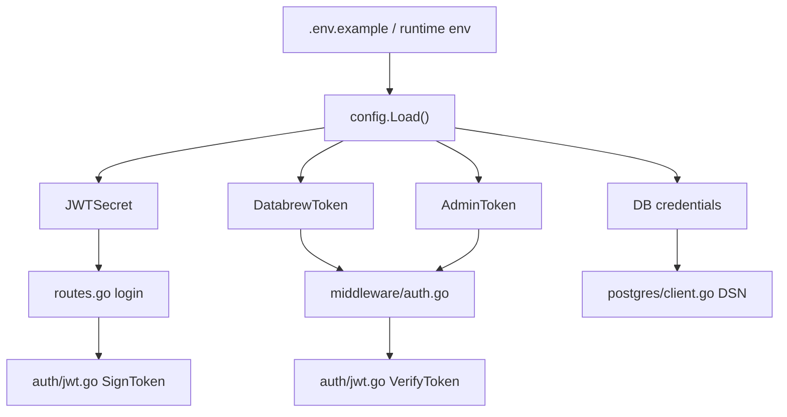
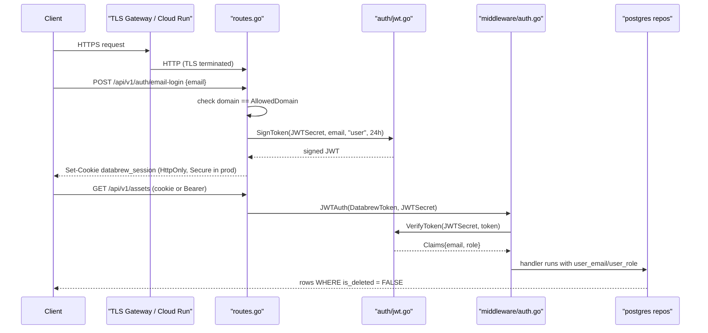
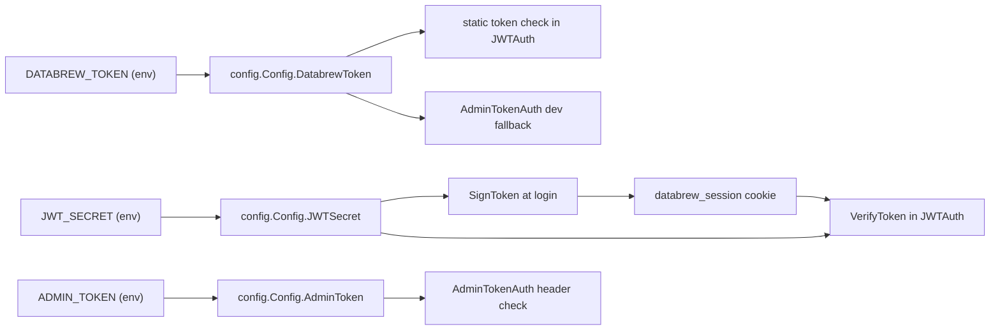
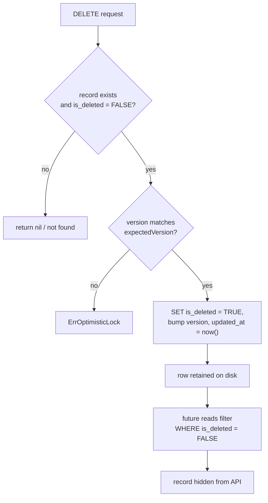
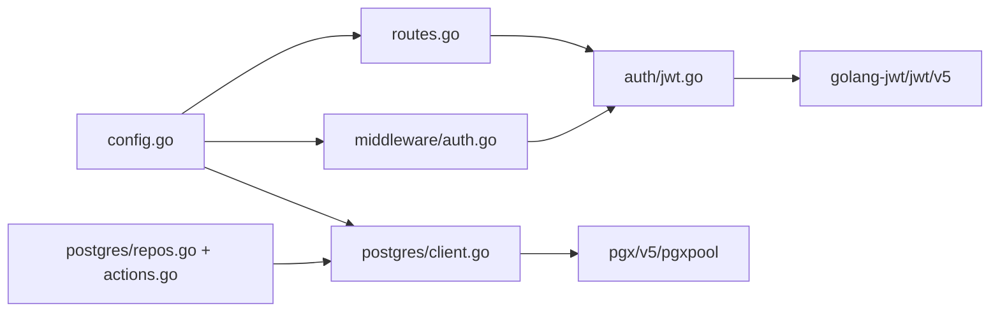

# Data Protection

<cite>
**Referenced Files in This Document**

- [backend/internal/auth/jwt.go](file://backend/internal/auth/jwt.go)
- [backend/internal/middleware/auth.go](file://backend/internal/middleware/auth.go)
- [backend/internal/config/config.go](file://backend/internal/config/config.go)
- [backend/internal/postgres/client.go](file://backend/internal/postgres/client.go)
- [backend/internal/postgres/actions.go](file://backend/internal/postgres/actions.go)
- [backend/internal/postgres/repos.go](file://backend/internal/postgres/repos.go)
- [backend/routes/routes.go](file://backend/routes/routes.go)
- [backend/cmd/server/infra.go](file://backend/cmd/server/infra.go)
- [backend/.env.example](file://backend/.env.example)
</cite>

## Table of Contents
1. [Introduction](#introduction)
2. [Project Structure](#project-structure)
3. [Core Components](#core-components)
4. [Architecture Overview](#architecture-overview)
5. [Detailed Component Analysis](#detailed-component-analysis)
6. [Dependency Analysis](#dependency-analysis)
7. [Performance Considerations](#performance-considerations)
8. [Troubleshooting Guide](#troubleshooting-guide)
9. [Conclusion](#conclusion)
10. [Appendices](#appendices)

## Introduction

Data protection in cyber-databrew rests on three pillars that together govern how
credentials enter the process, how callers are authenticated, and how records are
removed without being physically destroyed:

1. **Secret configuration is environment-only.** Every secret — the JWT signing
   secret, the static `DATABREW_TOKEN`, the privileged `ADMIN_TOKEN`, PostgreSQL
   credentials, and optional Elasticsearch HTTP Basic credentials — is read from
   process environment variables at startup. The repository ships only a
   non-secret template (`backend/.env.example`) with placeholder values; no real
   secret is ever committed. In production the operator supplies an env file
   (referenced by `BACKEND_ENV_FILE`) or injects variables directly into the
   Cloud Run / container runtime.
2. **Authentication is token-based.** A session is either a HMAC-SHA256 signed JWT
   (issued after email-domain login) or a legacy static bearer token used by the
   SDK. Both are verified by Gin middleware on every protected route.
3. **Deletes are soft.** User-visible records — assets, actions, deliveries,
   logical assets — are never physically removed by the API. Instead an
   `is_deleted` boolean column is flipped to `TRUE`, and every read query filters
   on `is_deleted = FALSE`. This preserves audit history and lineage while hiding
   the record from normal traffic.

This page is the reference for backend engineers and operators who need to know
exactly where secrets come from, how a token is minted and checked, what the
sensitive environment variables are, and how the soft-delete model protects data
from accidental loss. Transport encryption (TLS) is terminated upstream by the
ingress gateway / Cloud Run, so the application itself speaks plaintext HTTP and
sets the session cookie `Secure` flag based on environment.

**Section sources**
- [backend/internal/config/config.go](file://backend/internal/config/config.go#L137-L238)
- [backend/.env.example](file://backend/.env.example#L1-L126)

## Project Structure

The data-protection surface area is small and deliberately concentrated. The
relevant files are:

- **`backend/internal/auth/jwt.go`** — the pure cryptographic core. Defines the
  `Claims` type and the `SignToken` / `VerifyToken` functions over HMAC-SHA256.
  It is dependency-free apart from `golang-jwt/jwt/v5` and never reads the
  environment itself; the secret is passed in by the caller.
- **`backend/internal/middleware/auth.go`** — Gin middleware that wires tokens
  into request handling: `StaticTokenAuth`, `JWTAuth`, and `AdminTokenAuth`.
- **`backend/internal/config/config.go`** — the single place where secrets are
  read from the environment via `getenv`, including their dev-only fallbacks.
- **`backend/routes/routes.go`** — the login / logout endpoints that mint and
  clear the `databrew_session` cookie, and the place where `secureSessionCookie`
  is derived from `cfg.Env`.
- **`backend/internal/postgres/client.go`** — builds the PostgreSQL DSN from the
  DB credentials and opens the connection pool.
- **`backend/internal/postgres/repos.go`** and **`backend/internal/postgres/actions.go`**
  — implement the soft-delete model (`is_deleted = TRUE`) and the read filters
  (`is_deleted = FALSE`).
- **`backend/cmd/server/infra.go`** — startup wiring; warns when `ADMIN_TOKEN` is
  unset in production.
- **`backend/.env.example`** — the committed, secret-free configuration template.



**Diagram sources**
- [backend/internal/config/config.go](file://backend/internal/config/config.go#L137-L221)
- [backend/routes/routes.go](file://backend/routes/routes.go#L107-L187)
- [backend/internal/middleware/auth.go](file://backend/internal/middleware/auth.go#L49-L124)
- [backend/internal/postgres/client.go](file://backend/internal/postgres/client.go#L153-L159)

**Section sources**
- [backend/internal/auth/jwt.go](file://backend/internal/auth/jwt.go#L1-L50)
- [backend/internal/config/config.go](file://backend/internal/config/config.go#L9-L135)

## Core Components

#### Claims and JWT primitives

The JWT layer is a 50-line file. `Claims` embeds the standard
`jwt.RegisteredClaims` and adds two application fields, `Email` and `Role`.
`SignToken` builds the claims, sets `Issuer` to `cyber-databrew`, `Subject` to the
email, the issued-at and expiry timestamps, and signs with `HS256`. `VerifyToken`
parses the token, explicitly rejects any signing method that is not HMAC (guarding
against the `alg=none` and RS/HS confusion class of attacks), and returns the
typed claims only when the token is valid.

```go
token := jwt.NewWithClaims(jwt.SigningMethodHS256, claims)
return token.SignedString([]byte(secret))
```

The secret is a `string` argument; the function has no knowledge of where it came
from. This keeps the crypto testable and forces secret provenance to be a config
concern.

**Section sources**
- [backend/internal/auth/jwt.go](file://backend/internal/auth/jwt.go#L10-L50)

#### Authentication middleware

`JWTAuth` is the workhorse mounted on `/api/v1`. It resolves the caller token from
one of three sources in priority order:

1. `X-Databrew-Token` header → matched against the static `DATABREW_TOKEN` (the
   legacy SDK path; on success the context user is `sdk` / role `admin`).
2. `Authorization: Bearer <jwt>` → verified as a JWT.
3. `databrew_session` cookie → verified as a JWT.

If JWT verification fails, the middleware falls back once more to comparing the
raw token against the static token before rejecting the request. On success it
injects `user_email` and `user_role` into the Gin context for downstream
handlers.

`AdminTokenAuth` guards privileged admin/internal routes via the `X-Admin-Token`
header. When `ADMIN_TOKEN` is empty it degrades safely: in production it returns
`403` for every request, and in non-production it falls back to the static
`DATABREW_TOKEN`.

**Section sources**
- [backend/internal/middleware/auth.go](file://backend/internal/middleware/auth.go#L20-L124)

#### Secret configuration loader

`config.Load()` is the single ingress point for every secret. It first optionally
overlays a runtime env file named by `BACKEND_ENV_FILE`, then reads each variable
through the `getenv(key, fallback)` helper. The security-relevant defaults are
dev-only conveniences and must be overridden in production:

- `JWT_SECRET` → fallback `dev-jwt-secret`
- `DATABREW_TOKEN` (with legacy `GRACE_TOKEN` alias) → fallback `dev-token`
- `ADMIN_TOKEN` → fallback empty (routes disabled)
- `DB_PASSWORD` → fallback `postgres`

**Section sources**
- [backend/internal/config/config.go](file://backend/internal/config/config.go#L137-L221)

#### PostgreSQL credential assembly

`postgres.New` composes the DSN from the DB credentials in key=value form
(deliberately not URL form, to tolerate special characters such as `>` and `&` in
the password) and passes it to `NewFromDSN`, which opens a pooled connection. The
DSN currently sets `sslmode=disable`, consistent with TLS being terminated by the
gateway / internal network rather than at the application connection.

**Section sources**
- [backend/internal/postgres/client.go](file://backend/internal/postgres/client.go#L125-L168)

## Architecture Overview

The end-to-end picture spans secret loading, token minting at login, token
verification on each request, and the soft-delete write path. TLS is handled by
the ingress layer before traffic reaches the Gin router.



**Diagram sources**
- [backend/routes/routes.go](file://backend/routes/routes.go#L107-L189)
- [backend/internal/auth/jwt.go](file://backend/internal/auth/jwt.go#L17-L50)
- [backend/internal/middleware/auth.go](file://backend/internal/middleware/auth.go#L49-L97)

## Detailed Component Analysis

### Token and secret flow

Secrets never travel through the codebase as literals. They originate in the
environment, are captured once into the `Config` struct, and are passed by value
into the components that need them. The diagram below traces the JWT secret and
the static tokens from environment to use.



The login handler `POST /api/v1/auth/email-login` validates that the submitted
email's domain equals `cfg.AllowedDomain` (default `cyberorigin.ai`) before
calling `SignToken`. The resulting JWT is written as the `databrew_session`
cookie with `HttpOnly = true`, `SameSite = Lax`, and `Secure = secureSessionCookie`
where `secureSessionCookie := cfg.Env == "production"`. Logout overwrites the same
cookie with an empty value and a negative max-age to clear it. A legacy
`POST /api/v1/auth/login` accepts the static `DATABREW_TOKEN` and mints an
`admin`-role JWT for SDK backward compatibility.

**Diagram sources**
- [backend/internal/config/config.go](file://backend/internal/config/config.go#L165-L213)
- [backend/internal/auth/jwt.go](file://backend/internal/auth/jwt.go#L18-L31)
- [backend/internal/middleware/auth.go](file://backend/internal/middleware/auth.go#L49-L124)

**Section sources**
- [backend/routes/routes.go](file://backend/routes/routes.go#L103-L187)
- [backend/internal/middleware/auth.go](file://backend/internal/middleware/auth.go#L41-L97)

### Secrets are environment-only, never committed

The only configuration file checked into the repository is `backend/.env.example`,
which contains placeholders such as `DATABREW_TOKEN=dev-token`,
`DB_PASSWORD=postgres`, and `your-gcp-project`. These are intentionally inert
development defaults, not real credentials. At runtime the operator supplies real
values either through the process environment (Cloud Run service config, container
`env`) or through a dedicated env file pointed to by `BACKEND_ENV_FILE`, which
`config.Load()` overlays with `godotenv.Overload` before reading any variable.
The local `.env` (if present) is loaded by `godotenv.Load()` during
`setupInfra`, but is git-ignored and never part of the repository.

The startup path also surfaces a defensive warning: when `ENV=production` and
`ADMIN_TOKEN` is empty, the server logs that admin and internal privileged routes
will not be mounted, preventing accidental exposure of unauthenticated admin
endpoints.

**Section sources**
- [backend/.env.example](file://backend/.env.example#L92-L126)
- [backend/internal/config/config.go](file://backend/internal/config/config.go#L137-L143)
- [backend/cmd/server/infra.go](file://backend/cmd/server/infra.go#L25-L42)

### Soft-delete and data retention

No HTTP-facing delete physically removes a row. Each entity exposes a
`SoftDelete` that flips `is_deleted` to `TRUE`, and every standard read filters
`is_deleted = FALSE` so that soft-deleted records become invisible to normal
traffic while remaining on disk for audit, lineage, and recovery.

For assets, `AssetRepo.SoftDelete` additionally sets `lifecycle_state='archived'`
and bumps `updated_at`:

```sql
UPDATE assets SET is_deleted=TRUE, lifecycle_state='archived', updated_at=now() WHERE asset_id=$1
```

For actions, `ActionRepo.SoftDelete` uses optimistic concurrency: it requires the
caller's `expectedVersion` to match, bumps the version, and only flips rows that
are not already deleted. A version mismatch yields `ErrOptimisticLock`; a missing
row yields `nil`.



The read filter is uniform across the schema — assets, actions, deliveries,
logical assets, and mcap-file lookups all carry an `is_deleted = FALSE`
predicate, and list/count queries seed their `WHERE` clause with the same
condition. A separate `GetAll` accessor exists to read assets regardless of
`is_deleted` status, used by internal reconciliation paths.

**Diagram sources**
- [backend/internal/postgres/actions.go](file://backend/internal/postgres/actions.go#L264-L289)
- [backend/internal/postgres/repos.go](file://backend/internal/postgres/repos.go#L502-L510)

**Section sources**
- [backend/internal/postgres/repos.go](file://backend/internal/postgres/repos.go#L237-L510)
- [backend/internal/postgres/actions.go](file://backend/internal/postgres/actions.go#L168-L303)

### Transport encryption (TLS)

The application server speaks plaintext HTTP. TLS is terminated by the upstream
ingress — the API gateway in front of the backend, or Google Cloud Run's managed
HTTPS endpoint. Two consequences are visible in code:

- The session cookie's `Secure` flag is conditional on environment:
  `secureSessionCookie := cfg.Env == "production"`. In production the cookie is
  only sent over HTTPS; in local development over plain HTTP it remains usable.
- The PostgreSQL DSN uses `sslmode=disable`, relying on a trusted internal network
  (e.g. PgBouncer / VPC connector) rather than per-connection TLS. Optional
  Elasticsearch HTTP Basic credentials (`ELASTICSEARCH_USERNAME` /
  `ELASTICSEARCH_PASSWORD`) are likewise carried over the configured
  `ELASTICSEARCH_URL`, which may be `http://` for local clusters or an
  internally-secured endpoint in managed environments.

**Section sources**
- [backend/routes/routes.go](file://backend/routes/routes.go#L105-L106)
- [backend/internal/postgres/client.go](file://backend/internal/postgres/client.go#L153-L159)
- [backend/internal/config/config.go](file://backend/internal/config/config.go#L187-L189)

## Dependency Analysis

The data-protection components form a shallow, one-directional dependency chain:
configuration feeds tokens and credentials into the auth and persistence layers;
nothing flows back into config.



- `auth/jwt.go` depends only on `golang-jwt/jwt/v5`.
- `middleware/auth.go` depends on `auth` and the HTTP response helpers.
- `config.go` depends on `os` and `joho/godotenv`.
- `postgres/client.go` depends on `pgx/v5/pgxpool` and `config`.
- The repositories depend on the postgres client and the domain models.

**Section sources**
- [backend/internal/auth/jwt.go](file://backend/internal/auth/jwt.go#L1-L8)
- [backend/internal/middleware/auth.go](file://backend/internal/middleware/auth.go#L1-L12)
- [backend/internal/config/config.go](file://backend/internal/config/config.go#L1-L7)
- [backend/internal/postgres/client.go](file://backend/internal/postgres/client.go#L1-L20)

## Performance Considerations

- **Token verification is per-request and CPU-cheap.** HMAC-SHA256 verification
  in `VerifyToken` runs on every protected call; it is symmetric and fast, with
  no database round-trip, so it is not a hot-path concern.
- **The static-token path is a constant-time-ish string compare** but currently
  uses plain `!=` comparisons; this is acceptable for the legacy SDK path but is
  noted in Troubleshooting below.
- **Soft-delete keeps tables growing.** Because rows are never physically
  removed, the `is_deleted = FALSE` predicate must remain selective; ensure
  composite indexes lead with the lookup key (e.g. `asset_id`, `delivery_id`,
  `customer_id`) so the filter does not force full scans as deleted rows
  accumulate. List/count queries that seed `WHERE is_deleted = FALSE` benefit
  most.
- **Connection pool sizing** for PostgreSQL is explicit (`MaxConns=20`,
  `MinConns=4`, lifetime 1h) rather than relying on pgx defaults, keeping
  credentialed connections bounded.

**Section sources**
- [backend/internal/postgres/client.go](file://backend/internal/postgres/client.go#L125-L142)
- [backend/internal/postgres/repos.go](file://backend/internal/postgres/repos.go#L1005-L1015)

## Troubleshooting Guide

#### "unauthorized" on every request

Confirm the caller presents one of the three accepted credentials: an
`X-Databrew-Token` header equal to `DATABREW_TOKEN`, an `Authorization: Bearer`
JWT, or a valid `databrew_session` cookie. A mismatched or expired JWT returns
`invalid token: <reason>` from `JWTAuth`.

#### Admin routes return 403 in production

This is by design when `ADMIN_TOKEN` is unset — the startup log emits the warning
in `setupInfra`, and `AdminTokenAuth` returns `403` for production with an empty
admin token. Set `ADMIN_TOKEN` to enable the routes.

#### JWT verification fails after a deploy

A changed `JWT_SECRET` invalidates all previously issued tokens, since the secret
is the HMAC key for both signing and verification. Coordinate secret rotation with
forced re-login (cookies will fail `VerifyToken` and users hit the login flow).

#### "email domain not allowed"

The login email's domain must equal `cfg.AllowedDomain` (default
`cyberorigin.ai`). An empty `ALLOWED_DOMAIN` rejects all emails.

#### Deleted records still appear / disappeared records aren't really gone

Records are soft-deleted. If a "deleted" entity still shows up, a read path is
missing the `is_deleted = FALSE` filter or is using the `GetAll` accessor. If you
need to recover a deleted record, it is still in the table with `is_deleted=TRUE`.

#### PostgreSQL connection refused / auth failed

Verify `DB_HOST`, `DB_PORT`, `DB_USER`, `DB_PASSWORD`, `DB_NAME` in the runtime
environment. The DSN is built in key=value form so special characters in the
password are tolerated; the connection uses `sslmode=disable`, so a TLS-requiring
server will reject it unless fronted by PgBouncer / a non-TLS internal endpoint.

**Section sources**
- [backend/internal/middleware/auth.go](file://backend/internal/middleware/auth.go#L49-L124)
- [backend/routes/routes.go](file://backend/routes/routes.go#L110-L142)
- [backend/cmd/server/infra.go](file://backend/cmd/server/infra.go#L37-L42)

## Conclusion

Data protection in cyber-databrew is intentionally minimal and explicit: secrets
are read once from the environment and never committed (only the `.env.example`
template ships), JWTs are HMAC-signed with `JWT_SECRET` and verified on every
protected request, static and admin tokens cover legacy SDK and privileged paths,
and deletes are logical (`is_deleted`) so data is hidden rather than destroyed.
TLS is delegated to the ingress gateway / Cloud Run, with the session-cookie
`Secure` flag and the disabled libpq SSL mode reflecting that boundary. Operators
must override every dev-default secret in production and set `ADMIN_TOKEN` to
expose privileged routes.

## Appendices

### Sensitive environment variables

| Variable | Purpose | Dev fallback | Production requirement |
| --- | --- | --- | --- |
| `JWT_SECRET` | HMAC-SHA256 key for signing/verifying session JWTs | `dev-jwt-secret` | Must be a strong, unique secret; rotation invalidates all sessions |
| `DATABREW_TOKEN` (alias `GRACE_TOKEN`) | Static bearer token for the legacy SDK path | `dev-token` | Set to a secret value; gates `X-Databrew-Token` |
| `ADMIN_TOKEN` | Token for `X-Admin-Token` privileged routes | empty (routes disabled) | Must be set to mount admin/internal routes |
| `DB_USER` | PostgreSQL user | `postgres` | Set per environment |
| `DB_PASSWORD` | PostgreSQL password | `postgres` | Set to a real secret |
| `DB_HOST` / `DB_PORT` / `DB_NAME` | PostgreSQL connection target | `localhost` / `5432` / `cyber_databrew_dev` | Set per environment / PgBouncer |
| `ELASTICSEARCH_USERNAME` | Optional ES HTTP Basic user | empty | Set when ES security is enabled |
| `ELASTICSEARCH_PASSWORD` | Optional ES HTTP Basic password | empty | Set when ES security is enabled |
| `ALLOWED_DOMAIN` | Email domain allowlist for login | `cyberorigin.ai` | Set to the org domain |
| `BACKEND_ENV_FILE` | Optional runtime env file overlaid before reading vars | empty | Used to inject the secret bundle |
| `GOOGLE_APPLICATION_CREDENTIALS` | Path to GCP service-account key | empty | Provide via mounted secret / workload identity |

> Note: the values shown as fallbacks are the non-secret development defaults from
> `config.Load`; they are not real credentials and must be overridden in any
> deployed environment.

**Section sources**
- [backend/internal/config/config.go](file://backend/internal/config/config.go#L152-L213)
- [backend/.env.example](file://backend/.env.example#L10-L126)

### Authentication entry points

| Route | Auth | Effect |
| --- | --- | --- |
| `POST /api/v1/auth/email-login` | public | Validates email domain, signs a `user`-role JWT, sets `databrew_session` cookie |
| `POST /api/v1/auth/login` | public | Validates static `DATABREW_TOKEN`, signs an `admin`-role JWT (SDK compat) |
| `GET /api/v1/auth/me` | `JWTAuth` | Returns current `email` / `role` from context |
| `POST /api/v1/auth/logout` | `JWTAuth` | Clears the `databrew_session` cookie |
| `/api/v1/*` | `JWTAuth` | Static token, Bearer JWT, or cookie JWT |
| admin / internal routes | `AdminTokenAuth` | `X-Admin-Token` (prod) or static-token fallback (dev) |

**Section sources**
- [backend/routes/routes.go](file://backend/routes/routes.go#L107-L189)
- [backend/internal/middleware/auth.go](file://backend/internal/middleware/auth.go#L20-L124)
