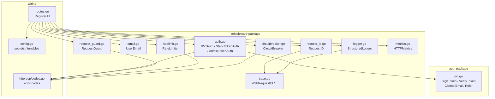
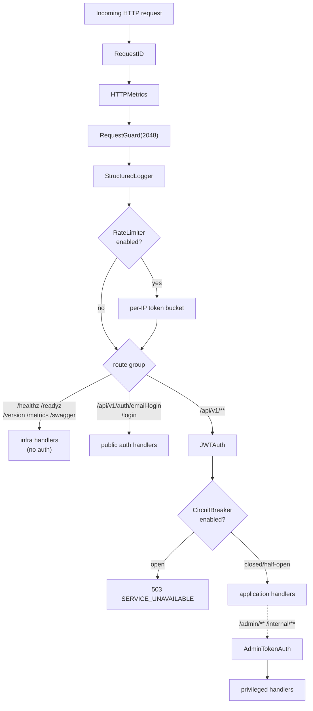
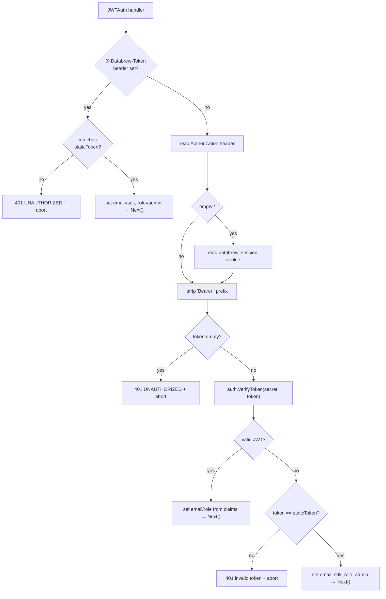
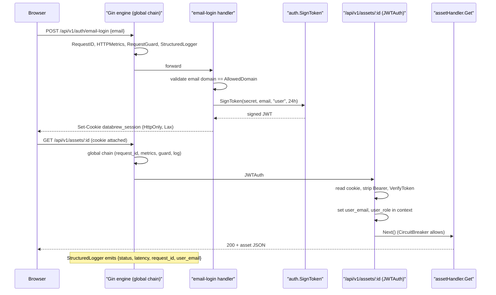
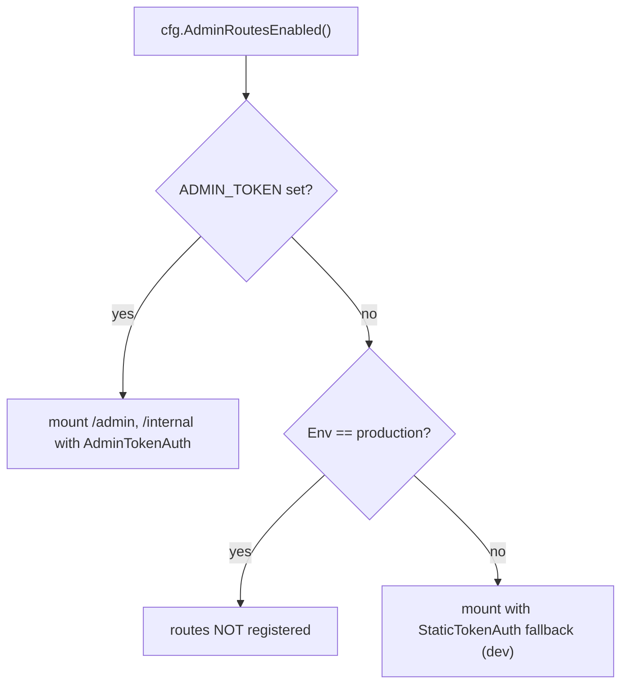
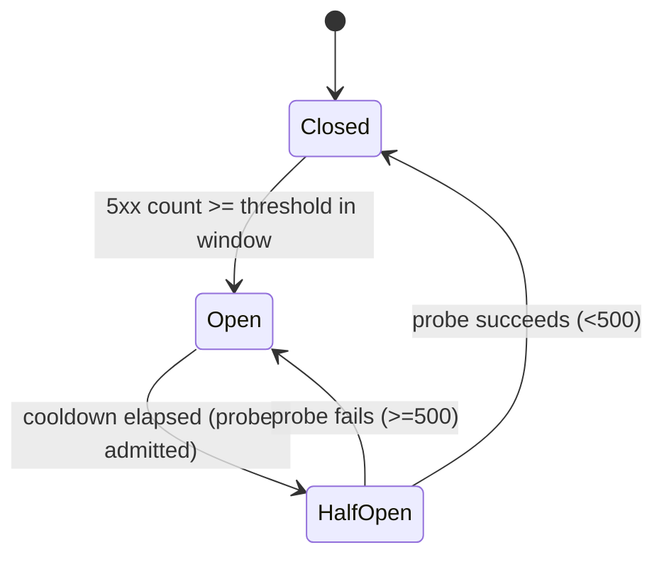
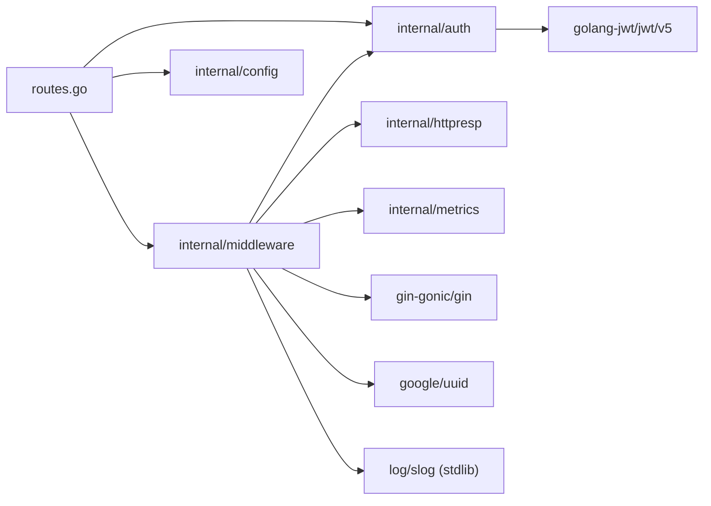

# Security & Authentication

<cite>
**Referenced Files in This Document**

- [backend/internal/auth/jwt.go](file://backend/internal/auth/jwt.go)
- [backend/internal/middleware/auth.go](file://backend/internal/middleware/auth.go)
- [backend/internal/middleware/email.go](file://backend/internal/middleware/email.go)
- [backend/internal/middleware/request_guard.go](file://backend/internal/middleware/request_guard.go)
- [backend/internal/middleware/request_id.go](file://backend/internal/middleware/request_id.go)
- [backend/internal/middleware/ratelimit.go](file://backend/internal/middleware/ratelimit.go)
- [backend/internal/middleware/circuitbreaker.go](file://backend/internal/middleware/circuitbreaker.go)
- [backend/internal/middleware/logger.go](file://backend/internal/middleware/logger.go)
- [backend/internal/middleware/log_setup.go](file://backend/internal/middleware/log_setup.go)
- [backend/internal/middleware/metrics.go](file://backend/internal/middleware/metrics.go)
- [backend/internal/middleware/trace.go](file://backend/internal/middleware/trace.go)
- [backend/routes/routes.go](file://backend/routes/routes.go)
- [backend/internal/config/config.go](file://backend/internal/config/config.go)
- [backend/internal/httpresp/codes.go](file://backend/internal/httpresp/codes.go)
</cite>

## Table of Contents
1. [Introduction](#introduction)
2. [Project Structure](#project-structure)
3. [Core Components](#core-components)
4. [Architecture Overview](#architecture-overview)
5. [Detailed Component Analysis](#detailed-component-analysis)
6. [Dependency Analysis](#dependency-analysis)
7. [Performance Considerations](#performance-considerations)
8. [Troubleshooting Guide](#troubleshooting-guide)
9. [Conclusion](#conclusion)
10. [Appendices](#appendices)

## Introduction

The cyber-databrew backend protects every API surface with a layered security
model built on top of the [Gin](https://github.com/gin-gonic/gin) HTTP
framework. The model has three concerns:

- **Authentication** — proving *who* is calling. The backend accepts three
  credential forms: a signed **JWT** (browser sessions and modern clients), a
  legacy **static token** (the Python SDK and service-to-service callers), and a
  separate **admin token** for privileged operations.
- **Authorization** — deciding *what* a caller may do. Roles (`user`, `admin`,
  `sdk`) are carried in the request context, and privileged route groups are
  gated behind a dedicated admin-token guard that is unmounted entirely in
  production unless explicitly configured.
- **Hardening & data protection** — request-shape guards, per-IP rate limiting,
  a circuit breaker, secure session cookies, structured audit logging, and
  request-ID propagation that together limit abuse and produce a traceable
  audit trail.

This page is the overview of that model. It explains the credential mechanisms,
the role scheme, the order of the middleware chain as wired in `routes.go`, and
the data-protection controls, linking to the detail pages for each area:

- [Authentication mechanism](authentication-mechanism.md) — JWT signing and
  verification, the three-source credential resolution, and the login routes.
- [Authorization and roles](authorization-and-roles.md) — roles, the admin/internal
  route gating, and `AdminRoutesEnabled`.
- [Middleware](middleware.md) — the full middleware catalog and chain order.
- [Data protection](data-protection.md) — cookies, rate limiting, the circuit
  breaker, request guards, and audit logging.

**Section sources**
- [backend/internal/middleware/auth.go](file://backend/internal/middleware/auth.go#L41-L97)
- [backend/routes/routes.go](file://backend/routes/routes.go#L74-L189)

## Project Structure

Security code is concentrated in two packages plus a small set of supporting
files. There is no monolithic "security service"; instead, composable Gin
middleware is assembled in the route wiring layer.

- `backend/internal/auth/` — the cryptographic core. A single file, `jwt.go`,
  defines the `Claims` type and the `SignToken` / `VerifyToken` functions built
  on `github.com/golang-jwt/jwt/v5` with HMAC-SHA256.
- `backend/internal/middleware/` — the request-pipeline guards:
  - `auth.go` — `JWTAuth`, `StaticTokenAuth`, `AdminTokenAuth`, and the context
    keys `CtxKeyEmail` / `CtxKeyRole`.
  - `email.go` — `UserEmail`, an audit-trail header capture.
  - `request_guard.go` — `RequestGuard`, URI-length rejection.
  - `request_id.go` — request-ID generation and `context.Context` propagation.
  - `ratelimit.go` — per-IP token-bucket `RateLimiter`.
  - `circuitbreaker.go` — sliding-window `CircuitBreaker`.
  - `logger.go` — `StructuredLogger`, per-request structured access log.
  - `log_setup.go` — global `slog` configuration.
  - `metrics.go` — `HTTPMetrics`, Prometheus request instrumentation.
  - `trace.go` — `WithRequestID` / `RequestIDFromContext` / `L` helpers.
- `backend/routes/routes.go` — `RegisterAll` assembles the chain and gates the
  protected, admin, and internal route groups.
- `backend/internal/config/config.go` — the security-relevant configuration:
  secrets, the allowed email domain, rate-limit and circuit-breaker tunables,
  and `AdminRoutesEnabled`.
- `backend/internal/httpresp/codes.go` — the stable error codes returned by the
  security middleware (`UNAUTHORIZED`, `URI_TOO_LONG`, `RATE_LIMITED`,
  `SERVICE_UNAVAILABLE`).

**Diagram sources**
- [backend/internal/auth/jwt.go](file://backend/internal/auth/jwt.go#L1-L50)
- [backend/internal/middleware/auth.go](file://backend/internal/middleware/auth.go#L1-L124)
- [backend/routes/routes.go](file://backend/routes/routes.go#L74-L189)

**Section sources**
- [backend/internal/auth/jwt.go](file://backend/internal/auth/jwt.go#L1-L50)
- [backend/internal/middleware/auth.go](file://backend/internal/middleware/auth.go#L1-L124)
- [backend/routes/routes.go](file://backend/routes/routes.go#L1-L373)
- [backend/internal/config/config.go](file://backend/internal/config/config.go#L35-L52)

## Core Components

### JWT signing and verification

`auth.Claims` embeds `jwt.RegisteredClaims` and adds two custom fields, `Email`
and `Role`. `SignToken` builds a token with issuer `cyber-databrew`, subject set
to the email, an issued-at timestamp, and an expiry computed from a caller-supplied
TTL, then signs it with `SigningMethodHS256`. `VerifyToken` parses the token,
**rejects any token whose signing method is not HMAC** (an `alg` confusion
defense), and returns the typed claims only when the token is valid.

**Section sources**
- [backend/internal/auth/jwt.go](file://backend/internal/auth/jwt.go#L10-L50)

### The authentication middleware (`JWTAuth`)

`JWTAuth` is the primary gate for the application API. It resolves credentials
from three sources in priority order and, on success, sets `user_email` and
`user_role` in the Gin context for downstream handlers and logging:

1. `X-Databrew-Token` header → legacy static token (SDK backward compatibility);
   on match the identity is set to `sdk` / `admin`.
2. `Authorization: Bearer <jwt>` header → JWT.
3. `databrew_session` cookie → JWT.

If the bearer/cookie value is not a valid JWT, it falls back to comparing it
against the static token before rejecting with `401 UNAUTHORIZED`.

**Section sources**
- [backend/internal/middleware/auth.go](file://backend/internal/middleware/auth.go#L14-L97)

### The admin guard (`AdminTokenAuth`)

`AdminTokenAuth` protects the `/admin`, `/internal`, and `/internal/commit-segments`
route groups. It checks an `X-Admin-Token` (or `Authorization`) header against
`ADMIN_TOKEN`. When `ADMIN_TOKEN` is unset it degrades safely: in production it
returns `403 Forbidden` for every request, and in non-production it falls back
to the ordinary `databrew` static token via `StaticTokenAuth`.

**Section sources**
- [backend/internal/middleware/auth.go](file://backend/internal/middleware/auth.go#L99-L124)

### Hardening middleware

- `RequestGuard(maxURILen)` rejects over-long request URIs with `414 URI_TOO_LONG`
  (default cap 2048 bytes).
- `RateLimiter` enforces a per-IP token bucket and returns `429 RATE_LIMITED`
  with `Retry-After` / `X-RateLimit-Limit` headers when exhausted.
- `CircuitBreaker` opens on a configurable count of 5xx responses inside a
  sliding window and returns `503 SERVICE_UNAVAILABLE` while open.

**Section sources**
- [backend/internal/middleware/request_guard.go](file://backend/internal/middleware/request_guard.go#L11-L23)
- [backend/internal/middleware/ratelimit.go](file://backend/internal/middleware/ratelimit.go#L89-L104)
- [backend/internal/middleware/circuitbreaker.go](file://backend/internal/middleware/circuitbreaker.go#L126-L146)

### Observability middleware

- `RequestID` reuses a client-supplied `X-Request-ID` or generates a UUID, then
  echoes it as a response header and propagates it into the request
  `context.Context`.
- `StructuredLogger` emits one structured `slog` record per request (method,
  path, status, latency, request ID, client IP, and `user_email` when present),
  skipping `/healthz`.
- `HTTPMetrics` records Prometheus counters and histograms keyed by method,
  route, and status class.

**Section sources**
- [backend/internal/middleware/request_id.go](file://backend/internal/middleware/request_id.go#L11-L27)
- [backend/internal/middleware/logger.go](file://backend/internal/middleware/logger.go#L12-L47)
- [backend/internal/middleware/metrics.go](file://backend/internal/middleware/metrics.go#L12-L44)

## Architecture Overview

`RegisterAll` installs the global middleware in a fixed order, then layers
route-scoped guards on top. The global chain runs for every request; the API
group additionally requires `JWTAuth` and (when enabled) the circuit breaker;
the admin and internal groups add `AdminTokenAuth` on top of that.

The split is deliberate: infrastructure endpoints (`/healthz`, `/readyz`,
`/metrics`) stay reachable even when the circuit breaker is open, because the
breaker is scoped to the `/api/v1` group rather than applied globally.

**Diagram sources**
- [backend/routes/routes.go](file://backend/routes/routes.go#L74-L192)
- [backend/routes/routes.go](file://backend/routes/routes.go#L96-L106)
- [backend/internal/middleware/circuitbreaker.go](file://backend/internal/middleware/circuitbreaker.go#L94-L113)

**Section sources**
- [backend/routes/routes.go](file://backend/routes/routes.go#L74-L192)

## Detailed Component Analysis

### Authentication credential resolution

`JWTAuth` is constructed with both the static token and the JWT secret so it can
serve every supported client without separate routes. The decision logic short-
circuits on the legacy header first, then attempts JWT, then falls back to the
static token comparison.

**Diagram sources**
- [backend/internal/middleware/auth.go](file://backend/internal/middleware/auth.go#L49-L97)

**Section sources**
- [backend/internal/middleware/auth.go](file://backend/internal/middleware/auth.go#L14-L97)
- [backend/internal/auth/jwt.go](file://backend/internal/auth/jwt.go#L34-L50)

### Login and session issuance

Authentication credentials are minted by the public auth routes. `POST
/api/v1/auth/email-login` accepts an email, lowercases and trims it, validates
that it is well-formed and that its domain equals `cfg.AllowedDomain`, then signs
a 24-hour JWT with role `user` and writes it as the `databrew_session` cookie.
The cookie is `HttpOnly`, `SameSite=Lax`, and `Secure` only when the environment
is `production` (`secureSessionCookie`). The legacy `POST /api/v1/auth/login`
exchanges a matching `DATABREW_TOKEN` for an `admin`-role JWT for SDK clients.
The protected sub-group (`/me`, `/logout`) sits behind `JWTAuth`; `logout`
clears the cookie by setting a negative max-age.

**Diagram sources**
- [backend/routes/routes.go](file://backend/routes/routes.go#L108-L189)
- [backend/internal/auth/jwt.go](file://backend/internal/auth/jwt.go#L17-L32)
- [backend/internal/middleware/auth.go](file://backend/internal/middleware/auth.go#L64-L85)

**Section sources**
- [backend/routes/routes.go](file://backend/routes/routes.go#L107-L187)
- [backend/internal/config/config.go](file://backend/internal/config/config.go#L35-L37)

### Authorization and role gating

Roles are coarse-grained strings carried in the context (`user`, `admin`, and
the synthetic `sdk` identity). Application API routes only require *authentication*,
not a specific role; finer authorization happens at the route-group level for
privileged operations. The `/admin` and `/internal` groups are wrapped with
`AdminTokenAuth` and are only mounted when `cfg.AdminRoutesEnabled()` returns
true. That helper returns true whenever `ADMIN_TOKEN` is configured, and
otherwise true only outside production — so in production with no admin token,
the privileged routes are **never registered** at all.

**Diagram sources**
- [backend/internal/config/config.go](file://backend/internal/config/config.go#L224-L231)
- [backend/internal/middleware/auth.go](file://backend/internal/middleware/auth.go#L99-L124)
- [backend/routes/routes.go](file://backend/routes/routes.go#L267-L285)

**Section sources**
- [backend/routes/routes.go](file://backend/routes/routes.go#L103-L106)
- [backend/routes/routes.go](file://backend/routes/routes.go#L267-L285)
- [backend/routes/routes.go](file://backend/routes/routes.go#L369-L372)
- [backend/internal/config/config.go](file://backend/internal/config/config.go#L224-L231)

### Rate limiting and circuit breaking

The `RateLimiter` keeps one token bucket per client IP in an in-memory map
guarded by a mutex, refilling tokens by elapsed-time × RPS up to the burst cap,
and runs a background goroutine that evicts buckets idle for more than five
minutes. It is created only when `RATE_LIMIT_RPS > 0`, otherwise `NewRateLimiter`
returns `nil` and the middleware is skipped entirely.

The `CircuitBreaker` is a three-state machine (`Closed → Open → HalfOpen`).
After each handler returns, the middleware inspects the response status: a 5xx
records an error, and when the error count within the window reaches the
threshold the circuit opens for the cooldown period. After cooldown it admits a
single probe; success closes the circuit and clears the error history.

**Diagram sources**
- [backend/internal/middleware/circuitbreaker.go](file://backend/internal/middleware/circuitbreaker.go#L70-L146)

**Section sources**
- [backend/internal/middleware/ratelimit.go](file://backend/internal/middleware/ratelimit.go#L19-L112)
- [backend/internal/middleware/circuitbreaker.go](file://backend/internal/middleware/circuitbreaker.go#L30-L146)

### Audit trail and request tracing

Two complementary mechanisms produce the audit trail. `UserEmail` captures the
`X-User-Email` header (set by the Python SDK) into the context for handlers that
record *who* performed an action, deliberately leaving the key unset when the
header is absent so callers can distinguish "not provided" from "empty".
`RequestID` and the `trace.go` helpers thread a stable request ID through the
`context.Context`, and `middleware.L(ctx)` returns a `slog.Logger` pre-tagged
with that ID so usecase and repository layers emit correlated logs.

**Section sources**
- [backend/internal/middleware/email.go](file://backend/internal/middleware/email.go#L14-L33)
- [backend/internal/middleware/trace.go](file://backend/internal/middleware/trace.go#L12-L36)
- [backend/internal/middleware/request_id.go](file://backend/internal/middleware/request_id.go#L11-L27)

## Dependency Analysis

The security layer depends on a small set of internal and third-party packages
and is consumed exclusively through the route-wiring layer.

- `internal/middleware` imports `internal/auth` (for `VerifyToken`),
  `internal/httpresp` (for typed error responses), and `internal/metrics`.
- `internal/auth` depends only on `golang-jwt/jwt/v5` and the stdlib.
- `routes.go` is the sole assembler; nothing else imports the middleware to wire
  the chain.

**Section sources**
- [backend/internal/middleware/auth.go](file://backend/internal/middleware/auth.go#L1-L12)
- [backend/internal/auth/jwt.go](file://backend/internal/auth/jwt.go#L1-L8)
- [backend/routes/routes.go](file://backend/routes/routes.go#L3-L38)

## Performance Considerations

- **Rate limiter contention.** All per-IP buckets live under a single mutex, so
  the limiter is O(1) per request but serializes on that lock. The background
  cleanup runs every 60s and evicts buckets idle for 5 minutes, bounding memory.
- **Circuit breaker locking.** `shouldAllow`, `recordError`, and `recordSuccess`
  each take the breaker mutex; the error slice is pruned to the window on every
  record, keeping it small. The breaker is disabled by default (`CB_ENABLED`).
- **JWT verification cost.** HMAC verification is a single hash per request, far
  cheaper than asymmetric verification; there is no token cache, so every
  request re-verifies.
- **Logging and metrics overhead.** `StructuredLogger` and `HTTPMetrics` skip
  `/healthz` (and `/metrics`) to avoid polluting logs/metrics with health-probe
  noise.
- **Scope of expensive guards.** The circuit breaker is attached only to the
  `/api/v1` group, not globally, so infrastructure probes never pay its cost and
  stay reachable when it is open.

**Section sources**
- [backend/internal/middleware/ratelimit.go](file://backend/internal/middleware/ratelimit.go#L49-L87)
- [backend/internal/middleware/circuitbreaker.go](file://backend/internal/middleware/circuitbreaker.go#L70-L113)
- [backend/internal/middleware/logger.go](file://backend/internal/middleware/logger.go#L13-L17)
- [backend/internal/middleware/metrics.go](file://backend/internal/middleware/metrics.go#L37-L44)

## Troubleshooting Guide

- **All API calls return `401 UNAUTHORIZED`.** Confirm the credential source:
  browser sessions need the `databrew_session` cookie; SDK callers send
  `X-Databrew-Token`; bearer callers send `Authorization: Bearer <jwt>`. A JWT
  signed with a different `JWT_SECRET` than the server's will fail
  `VerifyToken` and (unless it equals the static token) be rejected.
- **`email-login` returns `email domain not allowed`.** The email's domain must
  exactly equal `ALLOWED_DOMAIN` (default `cyberorigin.ai`); an empty
  `ALLOWED_DOMAIN` rejects every login.
- **Cookie not sent back by the browser.** In production the cookie is `Secure`,
  so it is only transmitted over HTTPS; it is always `HttpOnly` and `SameSite=Lax`.
- **Admin/internal routes return 404 (not found).** In production with
  `ADMIN_TOKEN` unset, `AdminRoutesEnabled()` is false and those groups are never
  mounted. Set `ADMIN_TOKEN` to register them.
- **Admin routes return `403` in production.** `ADMIN_TOKEN` is unset but routes
  were mounted in a non-production build path — configure `ADMIN_TOKEN`.
- **`429 RATE_LIMITED`.** Per-IP bucket exhausted; honor `Retry-After`. Raise
  `RATE_LIMIT_RPS`/`RATE_LIMIT_BURST` or set RPS to 0 to disable.
- **`503 SERVICE_UNAVAILABLE` on every API call.** The circuit breaker is open
  after repeated 5xx responses; it self-recovers after `CB_COOLDOWN_SEC`. Fix the
  underlying 5xx source.
- **`414 URI_TOO_LONG`.** The request URI exceeds 2048 bytes; shorten query
  parameters.

**Section sources**
- [backend/internal/middleware/auth.go](file://backend/internal/middleware/auth.go#L49-L124)
- [backend/routes/routes.go](file://backend/routes/routes.go#L110-L142)
- [backend/internal/config/config.go](file://backend/internal/config/config.go#L224-L231)
- [backend/internal/httpresp/codes.go](file://backend/internal/httpresp/codes.go#L24-L31)

## Conclusion

cyber-databrew secures its API with a composable Gin middleware chain rather
than a monolithic security service. Authentication accepts JWT, a legacy static
token, and an admin token, resolved in a fixed priority by `JWTAuth`;
authorization is role-aware and enforces privileged operations through an
admin-token guard that is unmounted entirely in unconfigured production.
Surrounding the auth core, request guards, a per-IP rate limiter, a circuit
breaker, secure session cookies, and structured request-ID-tagged logging
provide defense in depth and a usable audit trail. For implementation detail,
follow the per-area pages linked in the introduction.

## Appendices

### Security configuration keys

| Env var | Config field | Default | Purpose |
| --- | --- | --- | --- |
| `DATABREW_TOKEN` (or `GRACE_TOKEN`) | `DatabrewToken` | `dev-token` | Legacy static token for SDK / service callers |
| `JWT_SECRET` | `JWTSecret` | `dev-jwt-secret` | HMAC-SHA256 secret for JWT signing/verification |
| `ALLOWED_DOMAIN` | `AllowedDomain` | `cyberorigin.ai` | Email domain allowlisted for `email-login` |
| `ADMIN_TOKEN` | `AdminToken` | `""` | Admin-token gate for `/admin`, `/internal` |
| `RATE_LIMIT_RPS` | `RateLimitRPS` | `0` (disabled) | Per-IP requests/second |
| `RATE_LIMIT_BURST` | `RateLimitBurst` | `0` (→ RPS×2) | Per-IP burst size |
| `CB_ENABLED` | `CBEnabled` | `false` | Enable the circuit breaker |
| `CB_WINDOW_SEC` | `CBWindowSec` | `60` | Sliding-window length |
| `CB_THRESHOLD` | `CBThreshold` | `10` | 5xx count to trip |
| `CB_COOLDOWN_SEC` | `CBCooldownSec` | `30` | Cooldown before half-open |

**Section sources**
- [backend/internal/config/config.go](file://backend/internal/config/config.go#L35-L52)
- [backend/internal/config/config.go](file://backend/internal/config/config.go#L165-L213)

### Security error codes

| HTTP status | Code constant | Value | Emitted by |
| --- | --- | --- | --- |
| 401 | `CodeUnauthorized` | `UNAUTHORIZED` | `JWTAuth`, `StaticTokenAuth`, `AdminTokenAuth` |
| 403 | `CodeUnauthorized` | `UNAUTHORIZED` | `AdminTokenAuth` (production, no `ADMIN_TOKEN`) |
| 414 | `CodeURITooLong` | `URI_TOO_LONG` | `RequestGuard` |
| 429 | `CodeRateLimited` | `RATE_LIMITED` | `RateLimiter.Middleware` |
| 503 | `CodeServiceUnavailable` | `SERVICE_UNAVAILABLE` | `CircuitBreaker.Middleware` |

**Section sources**
- [backend/internal/httpresp/codes.go](file://backend/internal/httpresp/codes.go#L24-L31)
- [backend/internal/middleware/auth.go](file://backend/internal/middleware/auth.go#L102-L119)
- [backend/internal/middleware/request_guard.go](file://backend/internal/middleware/request_guard.go#L16-L20)
