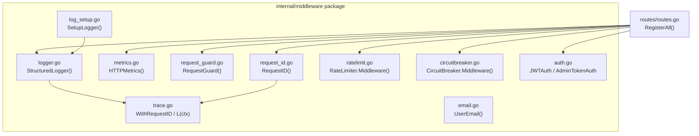
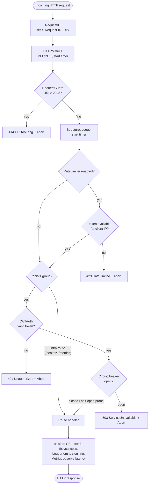
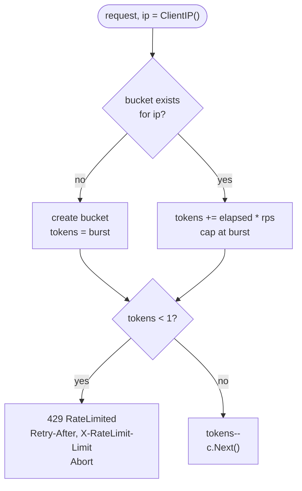
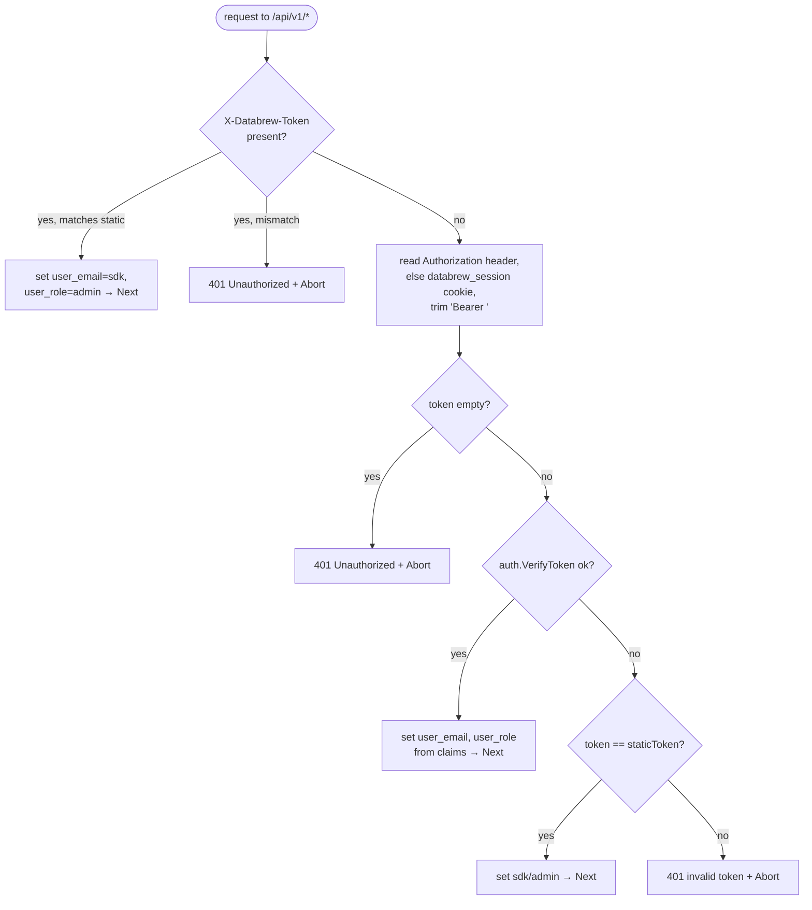
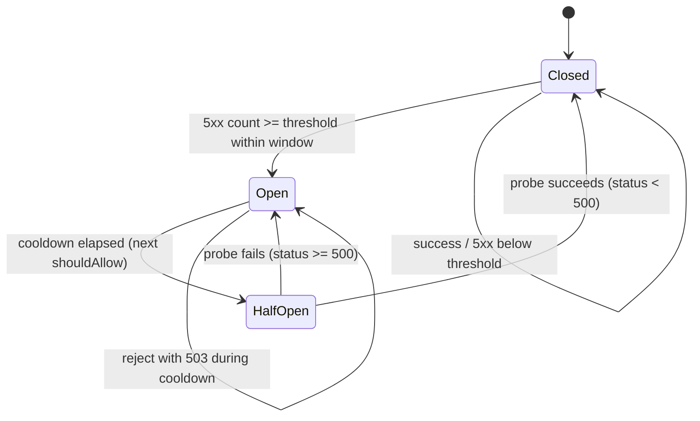
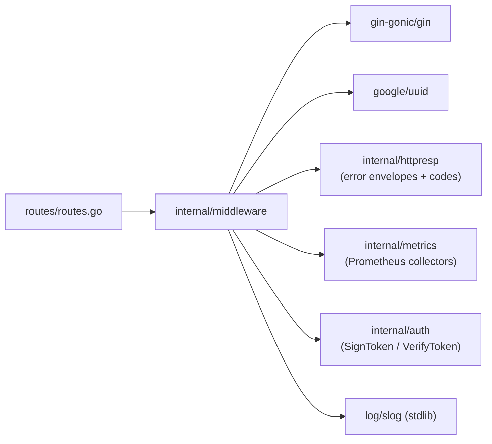

# Middleware

<cite>
**Referenced Files in This Document**

- [backend/internal/middleware/auth.go](file://backend/internal/middleware/auth.go)
- [backend/internal/middleware/circuitbreaker.go](file://backend/internal/middleware/circuitbreaker.go)
- [backend/internal/middleware/email.go](file://backend/internal/middleware/email.go)
- [backend/internal/middleware/log_setup.go](file://backend/internal/middleware/log_setup.go)
- [backend/internal/middleware/logger.go](file://backend/internal/middleware/logger.go)
- [backend/internal/middleware/metrics.go](file://backend/internal/middleware/metrics.go)
- [backend/internal/middleware/ratelimit.go](file://backend/internal/middleware/ratelimit.go)
- [backend/internal/middleware/request_guard.go](file://backend/internal/middleware/request_guard.go)
- [backend/internal/middleware/request_id.go](file://backend/internal/middleware/request_id.go)
- [backend/internal/middleware/trace.go](file://backend/internal/middleware/trace.go)
- [backend/routes/routes.go](file://backend/routes/routes.go)
</cite>

## Table of Contents
1. [Introduction](#introduction)
2. [Project Structure](#project-structure)
3. [Core Components](#core-components)
4. [Architecture Overview](#architecture-overview)
5. [Detailed Component Analysis](#detailed-component-analysis)
6. [Dependency Analysis](#dependency-analysis)
7. [Performance Considerations](#performance-considerations)
8. [Troubleshooting Guide](#troubleshooting-guide)
9. [Conclusion](#conclusion)
10. [Appendices](#appendices)

## Introduction

The backend HTTP server is built on the [Gin](https://github.com/gin-gonic/gin)
web framework. Every inbound request passes through an ordered chain of Gin
middleware before it reaches a route handler, and the chain unwinds in reverse
on the way back out. This middleware layer is where cross-cutting concerns are
implemented: request correlation, Prometheus metrics, abuse guards, structured
access logging, per-IP rate limiting, a service-wide circuit breaker, and
authentication.

The middleware all lives in a single package, `internal/middleware`, and is
wired into the router by `RegisterAll` in `backend/routes/routes.go`. The order
in which `r.Use(...)` is called is significant — it defines the exact sequence
in which middleware executes on each request — so this page documents both
*what* each middleware does and *where* it sits in the chain.

A key design decision is the split between **global** middleware (applied to the
whole engine with `r.Use`, so it covers infrastructure endpoints such as
`/healthz`, `/readyz`, `/metrics`, and `/swagger`) and **route-group** middleware
(applied to a `gin.RouterGroup`, so it covers only API and admin routes). The
circuit breaker and JWT authentication are deliberately scoped to the API group
so that liveness/readiness probes and the metrics scrape remain reachable even
when the application is degraded or the circuit is open.

**Section sources**
- [backend/routes/routes.go](file://backend/routes/routes.go#L74-L104)
- [backend/internal/middleware/request_id.go](file://backend/internal/middleware/request_id.go#L1-L27)
- [backend/internal/middleware/auth.go](file://backend/internal/middleware/auth.go#L1-L124)

## Project Structure

All middleware is contained in the `backend/internal/middleware/` directory.
Each file is small and focused on one concern. There are no sub-packages; the
package is consumed directly by `backend/routes/routes.go`.

- **`request_id.go`** — `RequestID()`: assigns or reuses an `X-Request-ID`,
  stores it in both the Gin context and the standard `context.Context`.
- **`trace.go`** — context plumbing for the request ID: `WithRequestID`,
  `RequestIDFromContext`, and `L(ctx)` for request-scoped structured logging.
  This file is not a middleware itself; it backs `request_id.go`.
- **`metrics.go`** — `HTTPMetrics()`: records Prometheus counters, in-flight
  gauge, and a latency histogram per method/route/status-class.
- **`request_guard.go`** — `RequestGuard(maxURILen)`: rejects oversized request
  URIs with `414`.
- **`logger.go`** — `StructuredLogger()`: emits one `slog` line per request with
  method, path, status, latency, request ID, client IP, and user email.
- **`log_setup.go`** — `SetupLogger(level, format, file)`: a process-startup
  helper (not request middleware) that configures the global `slog` default
  logger used by `logger.go` and `circuitbreaker.go`.
- **`ratelimit.go`** — `RateLimiter` token-bucket limiter and its `Middleware()`.
- **`circuitbreaker.go`** — `CircuitBreaker` sliding-window breaker and its
  `Middleware()`.
- **`auth.go`** — `JWTAuth`, `StaticTokenAuth`, and `AdminTokenAuth`, plus the
  `CtxKeyEmail` / `CtxKeyRole` context keys.
- **`email.go`** — `UserEmail()`: pulls `X-User-Email` into the Gin context for
  audit trails (helper, mounted on specific routes rather than globally).



**Diagram sources**
- [backend/routes/routes.go](file://backend/routes/routes.go#L74-L104)
- [backend/internal/middleware/request_id.go](file://backend/internal/middleware/request_id.go#L11-L27)
- [backend/internal/middleware/trace.go](file://backend/internal/middleware/trace.go#L12-L36)

**Section sources**
- [backend/internal/middleware/request_id.go](file://backend/internal/middleware/request_id.go#L1-L27)
- [backend/internal/middleware/trace.go](file://backend/internal/middleware/trace.go#L1-L36)
- [backend/internal/middleware/metrics.go](file://backend/internal/middleware/metrics.go#L1-L51)
- [backend/internal/middleware/request_guard.go](file://backend/internal/middleware/request_guard.go#L1-L23)
- [backend/internal/middleware/logger.go](file://backend/internal/middleware/logger.go#L1-L47)
- [backend/internal/middleware/log_setup.go](file://backend/internal/middleware/log_setup.go#L1-L61)
- [backend/internal/middleware/ratelimit.go](file://backend/internal/middleware/ratelimit.go#L1-L112)
- [backend/internal/middleware/circuitbreaker.go](file://backend/internal/middleware/circuitbreaker.go#L1-L146)
- [backend/internal/middleware/auth.go](file://backend/internal/middleware/auth.go#L1-L124)
- [backend/internal/middleware/email.go](file://backend/internal/middleware/email.go#L1-L33)

## Core Components

The middleware chain is assembled in `RegisterAll`. The global middleware is
registered first, in this exact order:

```go
r.Use(middleware.RequestID())     // 1
r.Use(middleware.HTTPMetrics())   // 2
r.Use(middleware.RequestGuard(2048)) // 3
r.Use(middleware.StructuredLogger()) // 4
// 5 — rate limiter, only if RATE_LIMIT_RPS is set
if rl := middleware.RateLimitFromConfig(cfg.RateLimitRPS, cfg.RateLimitBurst); rl != nil {
    r.Use(rl.Middleware())
}
```

The circuit breaker and JWT authentication are *not* part of the global chain.
They are bound to the `/api/v1` group:

```go
api := r.Group("/api/v1", middleware.JWTAuth(cfg.DatabrewToken, cfg.JWTSecret))
if cbMiddleware != nil {
    api.Use(cbMiddleware)
}
```

Note that for the API group, JWT auth is passed to `r.Group` as a group
handler (so it runs first within the group), and the circuit breaker is added
afterwards via `api.Use`. Admin and internal sub-groups replace JWT auth with
`AdminTokenAuth` (`api.Group("/admin", adminAuth)` and
`api.Group("/internal", adminAuth)`).

The full effective order for a request hitting `/api/v1/assets/:id` is therefore:

1. `RequestID` (global)
2. `HTTPMetrics` (global)
3. `RequestGuard` (global)
4. `StructuredLogger` (global)
5. `RateLimiter.Middleware` (global, conditional)
6. `JWTAuth` (group handler on `/api/v1`)
7. `CircuitBreaker.Middleware` (group `Use` on `/api/v1`, conditional)
8. route handler

**Section sources**
- [backend/routes/routes.go](file://backend/routes/routes.go#L74-L94)
- [backend/routes/routes.go](file://backend/routes/routes.go#L189-L192)
- [backend/routes/routes.go](file://backend/routes/routes.go#L268-L283)

## Architecture Overview

Gin middleware works as an onion: each middleware runs code, calls `c.Next()`
to descend into the next layer, and may run more code after `Next` returns as
the stack unwinds. `RequestGuard` and `JWTAuth` short-circuit with `c.Abort()`
when a request is invalid, so deeper middleware and the handler never run.
`HTTPMetrics`, `StructuredLogger`, and `CircuitBreaker` all do work *after*
`c.Next()` — they measure latency, log the final status, and inspect the
response code respectively.



**Diagram sources**
- [backend/internal/middleware/request_id.go](file://backend/internal/middleware/request_id.go#L11-L27)
- [backend/internal/middleware/metrics.go](file://backend/internal/middleware/metrics.go#L12-L35)
- [backend/internal/middleware/request_guard.go](file://backend/internal/middleware/request_guard.go#L11-L23)
- [backend/internal/middleware/logger.go](file://backend/internal/middleware/logger.go#L12-L47)
- [backend/internal/middleware/ratelimit.go](file://backend/internal/middleware/ratelimit.go#L91-L104)
- [backend/internal/middleware/auth.go](file://backend/internal/middleware/auth.go#L49-L97)
- [backend/internal/middleware/circuitbreaker.go](file://backend/internal/middleware/circuitbreaker.go#L127-L146)

**Section sources**
- [backend/routes/routes.go](file://backend/routes/routes.go#L74-L192)

## Detailed Component Analysis

#### RequestID

`RequestID()` is the first middleware in the chain so that every subsequent
layer — including the metrics and logging that run on the unwind — can attach
the same correlation ID. It reads the `X-Request-ID` request header; if the
client did not supply one, it generates a fresh UUID via `uuid.NewString()`. The
ID is then:

- stored in the Gin context under the key `"request_id"` (`c.Set`),
- echoed back to the client in the `X-Request-ID` response header,
- injected into the request's `context.Context` via `WithRequestID`, so that
  usecase and repository layers can recover it with
  `middleware.RequestIDFromContext(ctx)` or obtain a request-scoped logger with
  `middleware.L(ctx)`.

The `trace.go` helpers implement the context side: `requestIDKey` is a private
`ctxKey` type to avoid collisions, `WithRequestID`/`RequestIDFromContext`
read/write it, and `L(ctx)` returns `slog.Default().With("request_id", rid)`
(falling back to the bare default logger when no ID is present).

**Section sources**
- [backend/internal/middleware/request_id.go](file://backend/internal/middleware/request_id.go#L11-L27)
- [backend/internal/middleware/trace.go](file://backend/internal/middleware/trace.go#L8-L36)

#### HTTPMetrics

`HTTPMetrics()` is second so it observes latency for essentially the entire
request lifecycle (only `RequestID` precedes it). It skips `/metrics` and
`/healthz` via `shouldSkipMetrics` to avoid self-instrumentation noise. For all
other paths it:

1. increments `metrics.BackendHTTPInFlightRequests` (a gauge) and defers the
   matching `Dec()`,
2. records a start time,
3. calls `c.Next()`,
4. after the handler, computes the labels — `method`, the matched route via
   `c.FullPath()` (or `"unmatched"` when empty), and a status *class* such as
   `"2xx"`/`"5xx"` from `httpStatusClass` — then increments
   `BackendHTTPRequestsTotal` and observes the elapsed seconds into
   `BackendHTTPRequestDurationSeconds`.

Using `c.FullPath()` (the route template, e.g. `/api/v1/assets/:id`) rather than
the raw path keeps Prometheus label cardinality bounded. The status class
collapses individual codes to one-per-hundred buckets for the same reason.

**Section sources**
- [backend/internal/middleware/metrics.go](file://backend/internal/middleware/metrics.go#L12-L51)

#### RequestGuard

`RequestGuard(maxURILen)` is third and is the first hard abuse guard. It
defaults `maxURILen` to `2048` when given a non-positive value, and in
`RegisterAll` it is explicitly constructed with `2048`. On each request it
compares `len(c.Request.RequestURI)` against the limit; if exceeded, it responds
`414` with the `httpresp.CodeURITooLong` error code and calls `c.Abort()`, so
no further middleware or handler runs. The comment notes its purpose: prevent
abuse and avoid unexpected `500` errors from downstream components that choke on
pathological URIs. It is placed before logging and auth so oversized requests
are cheaply rejected.

**Section sources**
- [backend/internal/middleware/request_guard.go](file://backend/internal/middleware/request_guard.go#L11-L23)
- [backend/routes/routes.go](file://backend/routes/routes.go#L76-L76)

#### StructuredLogger

`StructuredLogger()` is fourth. It produces exactly one structured `slog` line
per request, emitted on the unwind after `c.Next()` returns so the final status
and total latency are known. Behaviour:

- `/healthz` is skipped entirely to reduce noise (it returns early before timing).
- It captures `start`, calls `c.Next()`, then computes `latency` rounded to the
  millisecond.
- Attributes logged: `method`, `path`, `status`, `latency`, `request_id` (read
  from the Gin context key set by `RequestID`), and `client_ip`. The
  `user_email` field (from `CtxKeyEmail`) is appended only when a non-empty user
  is present — which happens after `JWTAuth` has run for API routes.
- Log level mirrors the response status: `slog.Error` for `>= 500`, `slog.Warn`
  for `>= 400`, otherwise `slog.Info`.

Because it sits *before* `RateLimiter`, `JWTAuth`, and `CircuitBreaker` in the
chain, it still logs `429`, `401`, and `503` responses produced by those layers
(their `c.Abort()` only stops descent, not the unwind through earlier
middleware).

**Section sources**
- [backend/internal/middleware/logger.go](file://backend/internal/middleware/logger.go#L12-L47)

#### SetupLogger (process startup)

`SetupLogger(level, format, file)` is not a per-request middleware; it is called
once at process startup to configure the global `slog` default logger that
`StructuredLogger` and the circuit breaker write to. It parses the textual
level (`debug`/`info`/`warn`/`warning`/`error`, defaulting to info), selects an
output writer (stdout, or an `io.MultiWriter` of stdout plus an append-mode file
when a path is given), and installs either a JSON or text handler depending on
`format`. It returns a closer function (a no-op when no file was opened) intended
to be `defer`-ed for flushing/closing the log file.

**Section sources**
- [backend/internal/middleware/log_setup.go](file://backend/internal/middleware/log_setup.go#L17-L61)

#### RateLimiter

The rate limiter is fifth and **conditional**: `RateLimitFromConfig` parses
`cfg.RateLimitRPS` and `cfg.RateLimitBurst`, and `NewRateLimiter` returns `nil`
(disabling the layer) when `rps <= 0`. When enabled it is registered globally
with `r.Use(rl.Middleware())`.

It is a **per-IP token bucket**:

- State is a `map[string]*bucket` keyed by `c.ClientIP()`, guarded by a mutex.
- `burst` defaults to `rps * 2` when not positive; a bucket starts full at
  `burst` tokens.
- On each request, `allow` refills the bucket by `elapsed * rps` (capped at
  `burst`), then either consumes one token (allow) or rejects when fewer than
  one token remains.
- On rejection it sets `Retry-After: 1` and `X-RateLimit-Limit` headers and
  responds `429` with `httpresp.CodeRateLimited`, then `c.Abort()`.
- A background goroutine (`cleanup`) runs every 60s and evicts buckets idle for
  more than 5 minutes, bounding memory.



**Diagram sources**
- [backend/internal/middleware/ratelimit.go](file://backend/internal/middleware/ratelimit.go#L63-L104)

**Section sources**
- [backend/internal/middleware/ratelimit.go](file://backend/internal/middleware/ratelimit.go#L19-L112)
- [backend/routes/routes.go](file://backend/routes/routes.go#L79-L82)

#### JWTAuth

Authentication runs as a **group handler** on `/api/v1`, so it executes for API
routes after the global chain but before the route group's circuit breaker.
`JWTAuth(staticToken, jwtSecret)` resolves identity from three sources in
priority order:

1. **`X-Databrew-Token` header** — legacy static-token path for the Python SDK.
   The header must equal `staticToken` (or `"Bearer "+staticToken`); on match it
   sets `user_email = "sdk"` and `user_role = "admin"`.
2. **`Authorization: Bearer <jwt>`** — the `"Bearer "` prefix is trimmed and the
   token is verified with `auth.VerifyToken(jwtSecret, ...)`. On success it sets
   `CtxKeyEmail` and `CtxKeyRole` from the JWT claims.
3. **`databrew_session` cookie** — used as the JWT source when the
   `Authorization` header is absent.

If JWT verification fails, it falls back once to comparing the raw token against
the static `staticToken`; only if that also fails does it return `401`
(`httpresp.CodeUnauthorized`) and `c.Abort()`. The context keys it sets
(`CtxKeyEmail = "user_email"`, `CtxKeyRole = "user_role"`) are what
`StructuredLogger` reads for the `user_email` log field and what handlers read
for authorization.

`StaticTokenAuth(token)` is a simpler Phase-0 variant accepting the token via
`X-Databrew-Token`, `Authorization`, or the `databrew_session` cookie.
`AdminTokenAuth(adminToken, databrewToken, env)` guards `/api/v1/admin`,
`/api/v1/internal`, and `/internal/commit-segments`: it checks `X-Admin-Token`
(or `Authorization`); when `adminToken` is unset it returns a hard `403` in
production but falls back to `StaticTokenAuth(databrewToken)` in non-production.



**Diagram sources**
- [backend/internal/middleware/auth.go](file://backend/internal/middleware/auth.go#L49-L97)

**Section sources**
- [backend/internal/middleware/auth.go](file://backend/internal/middleware/auth.go#L14-L124)
- [backend/routes/routes.go](file://backend/routes/routes.go#L103-L103)
- [backend/routes/routes.go](file://backend/routes/routes.go#L189-L189)
- [backend/routes/routes.go](file://backend/routes/routes.go#L268-L283)

#### CircuitBreaker

The circuit breaker is added with `api.Use(cbMiddleware)` after JWT auth, so it
runs last before API handlers and is **scoped to `/api/v1`** — by design, the
infrastructure endpoints (`/healthz`, `/readyz`, `/metrics`) stay reachable when
the circuit is open. It is also **conditional**: `NewCircuitBreaker` returns
`nil` (no middleware) unless `cfg.CBEnabled == "true"`.

It is a sliding-window breaker with three states:

- **Closed** — normal operation; it records timestamps of `5xx` responses
  (`recordError`) and, when the count within the window reaches `threshold`,
  trips to **Open** and logs a warning.
- **Open** — every request is rejected with `503`
  (`httpresp.CodeServiceUnavailable`) plus a `Retry-After: 30` header, until the
  `cooldown` elapses, at which point the next `shouldAllow` transitions to
  **HalfOpen** and admits a single probe.
- **HalfOpen** — only one probe is allowed through (others are blocked); if that
  probe returns `< 500`, `recordSuccess` closes the circuit and clears the error
  list, otherwise it re-opens.

The post-`Next` block inspects `c.Writer.Status()`: `>= 500` calls
`recordError`, anything else calls `recordSuccess`. `pruneOld` discards error
timestamps older than the window. Configuration comes from env-backed config:
`CB_ENABLED`, `CB_WINDOW_SEC` (default 60), `CB_THRESHOLD` (default 10),
`CB_COOLDOWN_SEC` (default 30), parsed in `RegisterAll` via `atoi(...)`.



**Diagram sources**
- [backend/internal/middleware/circuitbreaker.go](file://backend/internal/middleware/circuitbreaker.go#L70-L146)

**Section sources**
- [backend/internal/middleware/circuitbreaker.go](file://backend/internal/middleware/circuitbreaker.go#L30-L146)
- [backend/routes/routes.go](file://backend/routes/routes.go#L84-L94)
- [backend/routes/routes.go](file://backend/routes/routes.go#L189-L192)

#### UserEmail

`UserEmail()` is a lightweight helper middleware that reads the `X-User-Email`
header (set by the Python SDK or any client for audit purposes) and stores it in
the Gin context under `"user_email"` *only when non-empty*, so handlers can
distinguish "not provided" from "provided and empty". `UserEmailFromContext`
retrieves it, returning the empty string when absent. It is intended to be
mounted on specific routes rather than globally, and shares the `"user_email"`
context key value with `auth.go`'s `CtxKeyEmail`.

**Section sources**
- [backend/internal/middleware/email.go](file://backend/internal/middleware/email.go#L8-L33)

## Dependency Analysis

The middleware package depends on a small set of internal helpers and a couple
of third-party libraries. It is consumed exclusively by `backend/routes/routes.go`.



- `httpresp` provides the standardized error responses and codes used by
  `RequestGuard` (`CodeURITooLong`), `RateLimiter` (`CodeRateLimited`),
  `CircuitBreaker` (`CodeServiceUnavailable`), and `auth` (`CodeUnauthorized`).
- `metrics` provides the Prometheus collectors that `HTTPMetrics` updates.
- `auth` provides `VerifyToken` (used by `JWTAuth`); `routes.go` separately uses
  `auth.SignToken` to mint session tokens at the login endpoints.
- `google/uuid` backs request-ID generation; `log/slog` backs logging.

**Section sources**
- [backend/internal/middleware/auth.go](file://backend/internal/middleware/auth.go#L1-L12)
- [backend/internal/middleware/metrics.go](file://backend/internal/middleware/metrics.go#L1-L10)
- [backend/internal/middleware/request_id.go](file://backend/internal/middleware/request_id.go#L1-L6)
- [backend/routes/routes.go](file://backend/routes/routes.go#L3-L38)

## Performance Considerations

- **Lock contention.** Both `RateLimiter.allow` and the `CircuitBreaker` methods
  take a single package-level `sync.Mutex` per limiter/breaker instance. Under
  very high concurrency these are global serialization points; they are kept
  short (pure arithmetic and slice/map operations) to minimize the critical
  section.
- **Bounded label cardinality.** `HTTPMetrics` labels by `c.FullPath()` (route
  template, not raw path) and by status *class* (`2xx`…`5xx`), preventing an
  unbounded explosion of Prometheus time series from path parameters and exact
  status codes.
- **Bucket eviction.** The rate limiter's background `cleanup` goroutine evicts
  idle (>5 min) buckets every 60s so the per-IP map does not grow without bound.
- **Cheap rejections first.** `RequestGuard` runs before logging, rate limiting,
  and auth, so oversized URIs are rejected with minimal work. The rate limiter
  runs before the (more expensive) JWT verification, shedding load before
  cryptographic work.
- **Logging volume.** `StructuredLogger` skips `/healthz` and `HTTPMetrics`
  skips both `/healthz` and `/metrics`, keeping high-frequency probe/scrape
  traffic out of the logs and metrics.
- **Circuit breaker scope.** Because the breaker is scoped to `/api/v1`, probes
  and scrapes are never blocked by an open circuit, which keeps orchestration
  health checks accurate during incidents.

**Section sources**
- [backend/internal/middleware/ratelimit.go](file://backend/internal/middleware/ratelimit.go#L49-L87)
- [backend/internal/middleware/metrics.go](file://backend/internal/middleware/metrics.go#L25-L51)
- [backend/internal/middleware/circuitbreaker.go](file://backend/internal/middleware/circuitbreaker.go#L70-L113)

## Troubleshooting Guide

- **Every request returns `401`.** Check the token source priority in `JWTAuth`:
  an `X-Databrew-Token` that does not match `staticToken` short-circuits to
  `401` before the JWT path is tried. For browser flows ensure the
  `databrew_session` cookie is being sent; for the SDK ensure the static token
  matches `cfg.DatabrewToken`.
- **Admin routes return `403` in production.** `AdminTokenAuth` returns `403`
  when `ADMIN_TOKEN` (`cfg.AdminToken`) is empty and `env == "production"`. Set
  `ADMIN_TOKEN` (and confirm admin routes are mounted).
- **Sudden `503`s with `Retry-After: 30`.** The circuit breaker is open. It
  trips after `CB_THRESHOLD` (default 10) `5xx` responses within `CB_WINDOW_SEC`
  (default 60s); it recovers after `CB_COOLDOWN_SEC` (default 30s) once a probe
  succeeds. Look for the `circuit breaker OPEN/HALF-OPEN/CLOSED` slog lines.
- **`429` responses under modest load.** The per-IP token bucket is exhausted.
  Inspect `RATE_LIMIT_RPS` / `RATE_LIMIT_BURST`. Note the limiter keys on
  `c.ClientIP()`, so a reverse proxy that collapses many clients to one IP can
  throttle them collectively — verify trusted-proxy configuration.
- **`414` on long query strings.** `RequestGuard` rejects URIs longer than 2048
  bytes. Move large payloads to the request body.
- **Missing `request_id` in logs/downstream.** `request_id` is set by
  `RequestID`; in usecase/repo layers retrieve it via
  `middleware.RequestIDFromContext(ctx)` or log through `middleware.L(ctx)`. If
  it is empty, confirm the request actually passed through the Gin chain.
- **Metrics show a route as `unmatched` / class `unknown`.** `unmatched` means
  `c.FullPath()` was empty (no route matched, e.g. a 404); `unknown` status class
  means `c.Writer.Status()` was `<= 0` (response not yet written).

**Section sources**
- [backend/internal/middleware/auth.go](file://backend/internal/middleware/auth.go#L49-L124)
- [backend/internal/middleware/circuitbreaker.go](file://backend/internal/middleware/circuitbreaker.go#L78-L135)
- [backend/internal/middleware/ratelimit.go](file://backend/internal/middleware/ratelimit.go#L91-L104)
- [backend/internal/middleware/request_guard.go](file://backend/internal/middleware/request_guard.go#L15-L22)
- [backend/internal/middleware/metrics.go](file://backend/internal/middleware/metrics.go#L25-L51)

## Conclusion

The middleware layer is a compact, single-package implementation of the HTTP
cross-cutting concerns for the backend. The order in which `RegisterAll` calls
`r.Use` — `RequestID` → `HTTPMetrics` → `RequestGuard` → `StructuredLogger` →
(optional) `RateLimiter`, followed by group-scoped `JWTAuth` and (optional)
`CircuitBreaker` on `/api/v1` — is deliberate: correlate first, measure broadly,
reject abuse cheaply, log every outcome, throttle before authenticating, and
break the circuit closest to the handlers while leaving infrastructure endpoints
untouched. Each middleware is small enough to reason about in isolation, and the
shared `httpresp`, `metrics`, and `auth` dependencies keep responses, telemetry,
and identity handling consistent across the chain.

## Appendices

### Middleware execution order (effective)

| # | Middleware | Scope | Conditional | Aborts with |
| --- | --- | --- | --- | --- |
| 1 | `RequestID` | global (`r.Use`) | no | — |
| 2 | `HTTPMetrics` | global | no | — |
| 3 | `RequestGuard(2048)` | global | no | `414` URITooLong |
| 4 | `StructuredLogger` | global | no | — |
| 5 | `RateLimiter.Middleware` | global | `RATE_LIMIT_RPS > 0` | `429` RateLimited |
| 6 | `JWTAuth` | `/api/v1` group handler | no | `401` Unauthorized |
| 6' | `AdminTokenAuth` | `/api/v1/admin`, `/api/v1/internal`, `/internal/commit-segments` | no | `401` / `403` |
| 7 | `CircuitBreaker.Middleware` | `/api/v1` (`api.Use`) | `CB_ENABLED == "true"` | `503` ServiceUnavailable |

### Configuration keys

| Env / config | Used by | Default | Effect |
| --- | --- | --- | --- |
| `RATE_LIMIT_RPS` | `RateLimitFromConfig` | unset (disabled) | per-IP tokens/sec; `<= 0` disables |
| `RATE_LIMIT_BURST` | `RateLimitFromConfig` | `RPS * 2` | bucket size |
| `CB_ENABLED` | `NewCircuitBreaker` | `false` | `"true"` enables breaker |
| `CB_WINDOW_SEC` | `NewCircuitBreaker` | `60` | sliding window |
| `CB_THRESHOLD` | `NewCircuitBreaker` | `10` | `5xx` count to trip |
| `CB_COOLDOWN_SEC` | `NewCircuitBreaker` | `30` | open → half-open delay |
| `ADMIN_TOKEN` | `AdminTokenAuth` | unset | required in production |
| `DATABREW_TOKEN` | `JWTAuth` / `AdminTokenAuth` | — | legacy static token |
| `JWT_SECRET` | `JWTAuth` | — | JWT verification key |

### Context keys set by middleware

| Key (value) | Set by | Read by |
| --- | --- | --- |
| `"request_id"` | `RequestID` | `StructuredLogger`, `trace.L` |
| `CtxKeyEmail` (`"user_email"`) | `JWTAuth`, `UserEmail` | `StructuredLogger`, handlers |
| `CtxKeyRole` (`"user_role"`) | `JWTAuth` | handlers |
| `requestIDKey` (ctx.Context) | `RequestID` via `WithRequestID` | `RequestIDFromContext`, `L(ctx)` |

**Section sources**
- [backend/routes/routes.go](file://backend/routes/routes.go#L74-L192)
- [backend/internal/middleware/circuitbreaker.go](file://backend/internal/middleware/circuitbreaker.go#L24-L68)
- [backend/internal/middleware/ratelimit.go](file://backend/internal/middleware/ratelimit.go#L14-L47)
- [backend/internal/middleware/auth.go](file://backend/internal/middleware/auth.go#L14-L18)
- [backend/internal/middleware/trace.go](file://backend/internal/middleware/trace.go#L8-L15)
