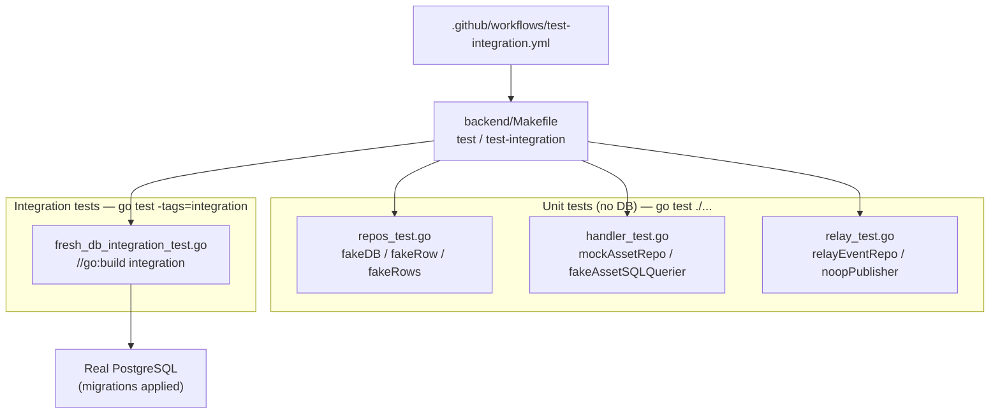
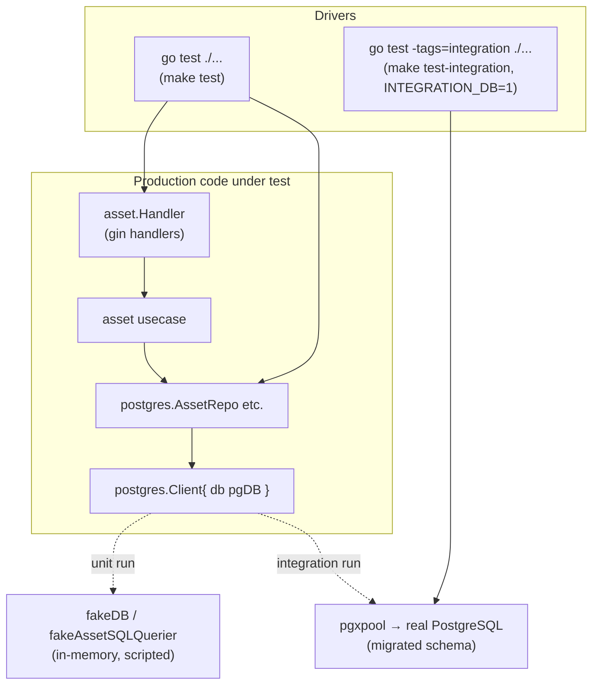
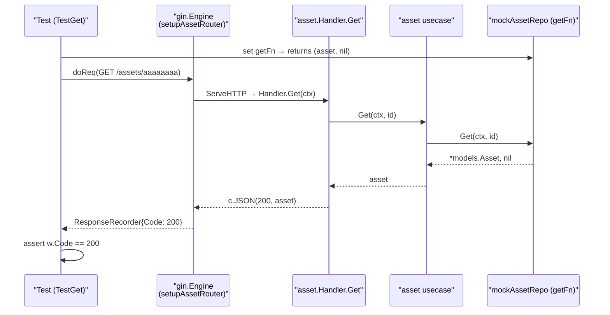
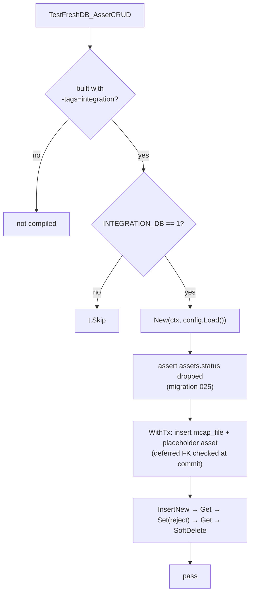
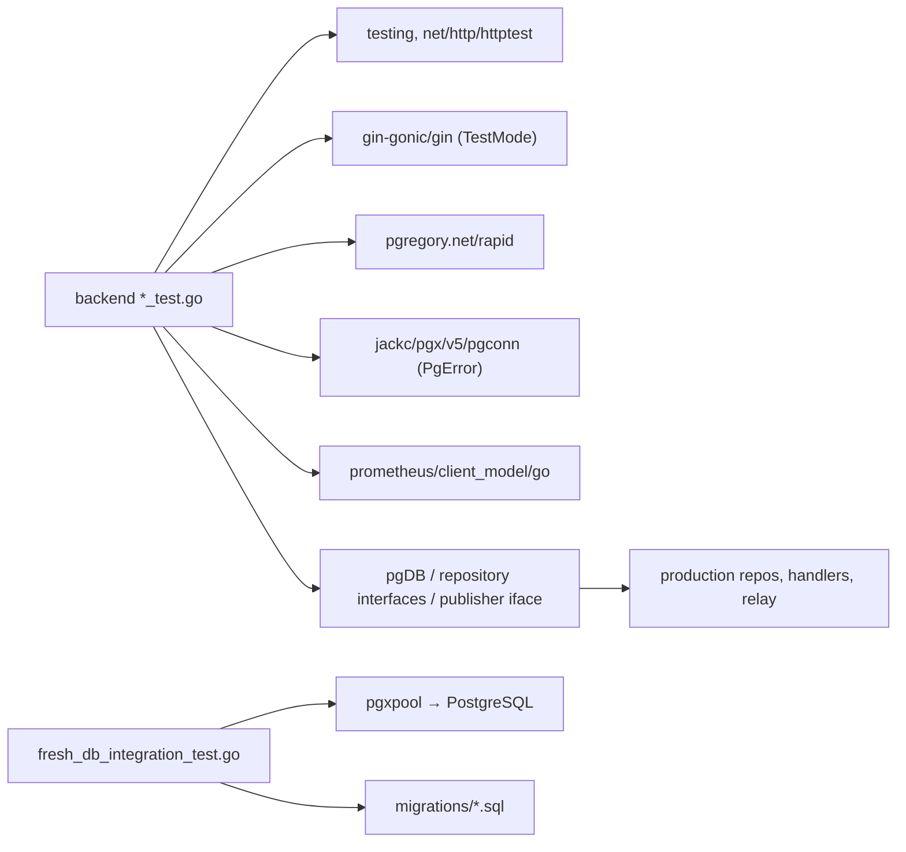

# Backend Tests

<cite>
**Referenced Files in This Document**
- [backend/Makefile](file://backend/Makefile)
- [backend/internal/postgres/client.go](file://backend/internal/postgres/client.go)
- [backend/internal/postgres/repos_test.go](file://backend/internal/postgres/repos_test.go)
- [backend/internal/postgres/fresh_db_integration_test.go](file://backend/internal/postgres/fresh_db_integration_test.go)
- [backend/internal/handlers/asset/handler_test.go](file://backend/internal/handlers/asset/handler_test.go)
- [backend/internal/outbox/relay_test.go](file://backend/internal/outbox/relay_test.go)
- [.github/workflows/test-integration.yml](file://.github/workflows/test-integration.yml)
</cite>

## Table of Contents
1. [Introduction](#introduction)
2. [Project Structure](#project-structure)
3. [Core Components](#core-components)
4. [Architecture Overview](#architecture-overview)
5. [Detailed Component Analysis](#detailed-component-analysis)
6. [Dependency Analysis](#dependency-analysis)
7. [Performance Considerations](#performance-considerations)
8. [Troubleshooting Guide](#troubleshooting-guide)
9. [Conclusion](#conclusion)
10. [Appendices](#appendices)

## Introduction

The backend of `cyber-databrew` is a Go service whose correctness is guarded by two complementary layers of automated tests:

- **Unit tests** that run without any external dependency. They exercise repositories, HTTP handlers, and the outbox relay against hand-written in-memory fakes that satisfy small Go interfaces (`pgDB`, `rowScanner`, `rowsScanner`, repository interfaces, the publisher interface). These tests are fast, hermetic, and run on every `go test ./...`.
- **Integration tests** that run against a *fresh* PostgreSQL instance with every migration applied. They are gated behind the `integration` build tag and an `INTEGRATION_DB=1` environment switch, so they are invisible to the default unit run and only execute when a real database is provisioned (locally or in CI).

The central design choice that makes the unit layer possible is the `pgDB` abstraction in the `postgres` package: repositories never talk to `pgxpool` directly, they talk to a narrow interface that a fake can implement. This lets a repository's SQL-argument marshalling, row-scanning, and error mapping be tested deterministically, while the integration layer verifies that the same code actually round-trips through real PostgreSQL with real migrations, constraints, and deferred foreign keys.

This page documents the conventions, the mock patterns, the table-driven and property-based styles in use, and the `make test` / `make test-integration` targets that drive them.

**Section sources**
- [backend/internal/postgres/client.go](file://backend/internal/postgres/client.go#L16-L46)
- [backend/Makefile](file://backend/Makefile#L15-L19)

## Project Structure

Backend tests live next to the code they cover, following Go's standard `*_test.go` convention. There is no separate `tests/` tree; each package owns its tests in the same directory and the same package, which lets tests reach unexported types (`fakeDB`, `Client.db`, `Handler.pgq`).

- `backend/internal/postgres/repos_test.go` — unit tests for the repository layer. Defines the in-memory `fakeDB`, `fakeRow`, and `fakeRows` mocks plus `capturingDB`/`execTracker` decorators that record the SQL arguments a repository emits.
- `backend/internal/postgres/fresh_db_integration_test.go` — the integration test, guarded by `//go:build integration` and an `INTEGRATION_DB` runtime check. It connects to a real database, asserts migration state, and runs a full asset CRUD cycle.
- `backend/internal/handlers/asset/handler_test.go` — HTTP handler tests. Build a `gin` engine, fire `httptest` requests, and assert status codes and JSON bodies, with repository interfaces mocked by `mockAssetRepo` and SQL access mocked by `fakeAssetSQLQuerier`.
- `backend/internal/outbox/relay_test.go` — outbox relay tests. Mock the event repository (`relayEventRepo`) and the publisher (`noopPublisher`), then assert published/failed bookkeeping and Prometheus metric deltas.
- `backend/Makefile` — the `test` and `test-integration` phony targets.
- `.github/workflows/test-integration.yml` — CI wiring: a `backend` job for unit tests and a `backend-fresh-db` job that boots PostgreSQL, applies migrations, and runs the integration test.

**Diagram sources**
- [backend/Makefile](file://backend/Makefile#L15-L19)
- [backend/internal/postgres/fresh_db_integration_test.go](file://backend/internal/postgres/fresh_db_integration_test.go#L1-L29)
- [.github/workflows/test-integration.yml](file://.github/workflows/test-integration.yml#L23-L90)

**Section sources**
- [backend/internal/postgres/repos_test.go](file://backend/internal/postgres/repos_test.go#L1-L29)
- [backend/internal/handlers/asset/handler_test.go](file://backend/internal/handlers/asset/handler_test.go#L1-L48)
- [backend/internal/outbox/relay_test.go](file://backend/internal/outbox/relay_test.go#L1-L21)

## Core Components

The backend test suite is built from a small set of reusable building blocks.

#### The `pgDB` seam and its fakes

Repositories depend on `pgDB`, a six-method interface (`QueryRow`, `Query`, `Exec`, `ExecResult`, `Ping`, `Close`) that abstracts both a connection pool and an open transaction. `rowScanner` (single-row `Scan`) and `rowsScanner` (`Next`/`Scan`/`Err`/`Close`) abstract result sets. Because a `Client` holds its database behind this interface (`Client{ db pgDB }`), a test can construct `&Client{db: &fakeDB{...}}` and drive any repository without a network connection.

`fakeDB` is the canonical mock: it returns programmed rows, programmed errors, and a configurable `execRowsAffected`, and it records every `Exec` SQL string and argument slice so tests can assert exactly what the repository sent.

#### Repository interface mocks for handlers

Handlers depend on repository *interfaces*, not concrete `postgres` types. `mockAssetRepo` implements `repository.AssetRepository` with per-method function fields (`getFn`, `setFn`, `listWithFiltersFn`, …) so each test can stub only the behavior it cares about and leave the rest as benign no-ops. `mockDeliveryRepoForAsset` implements the full `repository.DeliveryRepository` surface the same way.

#### SQL-querier mock for read-only endpoints

Some asset endpoints (ratings history, the SSE event stream) read directly through a narrow `assetSQLQuerier` rather than the repository. `fakeAssetSQLQuerier` mocks that, supporting a queue of scripted query results (`queries`), call counting, and captured arguments, so streaming/cursor behavior can be tested across multiple round trips.

#### The event-repo and publisher mocks for the relay

`relayEventRepo` implements the full event repository interface but only records `MarkPublished`/`MarkFailed` sequence numbers and returns a programmed pending batch. `noopPublisher` implements the publisher interface and always succeeds, letting relay flush logic be tested without a real Pub/Sub backend.

**Section sources**
- [backend/internal/postgres/client.go](file://backend/internal/postgres/client.go#L19-L46)
- [backend/internal/postgres/repos_test.go](file://backend/internal/postgres/repos_test.go#L19-L58)
- [backend/internal/handlers/asset/handler_test.go](file://backend/internal/handlers/asset/handler_test.go#L29-L48)
- [backend/internal/handlers/asset/handler_test.go](file://backend/internal/handlers/asset/handler_test.go#L174-L227)
- [backend/internal/outbox/relay_test.go](file://backend/internal/outbox/relay_test.go#L16-L64)

## Architecture Overview

The two test layers exercise the same production code through different "bottom" implementations. In the unit layer the bottom is an in-memory fake; in the integration layer the bottom is a real PostgreSQL pool. Everything above the seam — argument building, row scanning, error mapping, optimistic-lock logic, HTTP marshalling — is identical in both runs.

The seam is the `pgDB` interface. `newPool` — a package-level `var` of type `func(ctx, dsn) (pgDB, error)` — is the swap point used by `TestClientNewAndClose` to inject a fake pool and to simulate connect/ping failures without a database.

**Diagram sources**
- [backend/internal/postgres/client.go](file://backend/internal/postgres/client.go#L16-L46)
- [backend/internal/postgres/client.go](file://backend/internal/postgres/client.go#L125-L130)
- [backend/internal/postgres/repos_test.go](file://backend/internal/postgres/repos_test.go#L160-L183)

**Section sources**
- [backend/internal/postgres/client.go](file://backend/internal/postgres/client.go#L16-L62)
- [backend/internal/postgres/repos_test.go](file://backend/internal/postgres/repos_test.go#L160-L183)

## Detailed Component Analysis

### Repository unit tests with in-memory fakes

`repos_test.go` defines `fakeDB`, which implements every `pgDB` method. `QueryRow` returns a configured `fakeRow` (or a not-found `fakeRow{err: errNoRows}` when none is set); `Query` returns configured `fakeRows`; `Exec` appends to `execSQLs`/`execArgs` for later assertion; `ExecResult` returns the programmed `execRowsAffected`. `fakeRow.Scan` and `fakeRows.Scan` use a reflection-based `assign` helper to copy programmed `[]any` values into the repository's scan destinations, handling pointers, nil, and convertible types — this mirrors how `pgx` would populate columns.

A typical repository test constructs the repo over a fake client and walks the full success/error matrix. `TestAssetRepo` is representative: it asserts not-found returns `(nil, nil)`, a scan error propagates, a successful 39-column `Get` populates both legacy and new typed fields, `Set` stamps `Version`/`CreatedAt`, an `Exec` error propagates, and — importantly — a zero-rows-affected `ExecResult` is mapped to `repository.ErrOptimisticLock` (the compare-and-swap miss).

The optimistic-lock contract has dedicated coverage. `TestMergeCfAlgo_Success` asserts the returned version is `old+1`; `TestMergeCfAlgo_OptimisticLockConflict` programs `execRowsAffected: 0` and asserts `errors.Is(err, repository.ErrOptimisticLock)`; `TestMergeCfAlgo_DBError` programs an `execErr` and asserts the wrapped error message contains `MergeCfAlgo`.

#### Argument-capture decorators

To verify that a repository emits the *right* positional arguments in the *right* column order, two thin decorators wrap `fakeDB`:

- `capturingDB` records the last `ExecResult` argument slice in `lastArgs`. `TestProperty6_RealColumnConsistency` uses it to assert that `Set` passes at least 29 args and that specific indices (`lifecycle_state` at 5, `asset_type` at 6, `owner` at 8, …) match the model.
- `execTracker` records *every* `Exec` argument slice in `calls`. `TestProperty8_TagUpsertConsistency` and `TestProperty9_AlgoUpsertConsistency` use it to assert exactly one write occurs and that `asset_id`/`tag_key`/`tag_value` (or the algo positional args) are written in order.

#### Table-driven and property-based styles

The suite mixes both idioms. Table-driven sub-tests use a `cases` slice and `t.Run(tc.name, …)` — for example `TestGet_DurationSecComputedFromDurationMs` iterates `{name, durationMs, wantSec}` rows to verify `DurationSec = DurationMs / 1000`, and `TestGet_SegTypeMirrorsAssetType` iterates the asset-type enum. Property-based tests use `pgregory.net/rapid`: `rapid.Check` draws random owners, durations, lifecycle states, and tag values, then asserts invariants hold for every generated input (e.g. `TestProperty20_OptimisticLockVersionIncrement` checks `newVer == ver+1` on success and `ErrOptimisticLock` on conflict across a range of starting versions).

**Section sources**
- [backend/internal/postgres/repos_test.go](file://backend/internal/postgres/repos_test.go#L19-L149)
- [backend/internal/postgres/repos_test.go](file://backend/internal/postgres/repos_test.go#L204-L295)
- [backend/internal/postgres/repos_test.go](file://backend/internal/postgres/repos_test.go#L487-L530)
- [backend/internal/postgres/repos_test.go](file://backend/internal/postgres/repos_test.go#L641-L773)
- [backend/internal/postgres/repos_test.go](file://backend/internal/postgres/repos_test.go#L941-L1005)
- [backend/internal/postgres/repos_test.go](file://backend/internal/postgres/repos_test.go#L1166-L1227)

### Handler tests with gin and httptest

Handler tests do not start a server; they build a `gin` engine in `gin.TestMode`, register the handler under test, and drive it with `httptest`. Two helpers anchor the package:

- `setupAssetRouter(method, path, fn)` returns a fresh `gin.Engine` with one route bound to the handler under test.
- `doReq(t, r, method, path, body)` JSON-encodes the body, builds an `httptest.NewRequest`, serves it through an `httptest.NewRecorder`, and returns the recorder so the test can assert `w.Code` and unmarshal `w.Body`.

The handler is wired to mocked dependencies via `New(assetUC.New(repo), &mockDeliveryRepoForAsset{})`, where `repo` is a `*mockAssetRepo`. Each test sets only the function fields it needs; for example `TestGet` flips `repo.getFn` between not-found, error, and success closures and asserts 404 / 500 / 200 respectively. `TestList` drives the filter/sort query-string logic, asserting 400 for invalid filters and verifying the resolved `whereSQL`, args, and `OrderByClause` that reach the mock. `TestCreate` exercises validation (400/422) and maps `pgconn.PgError` constraint violations (codes `23514`, `23503`) returned by the mock into 422 responses.

Endpoints that read through `assetSQLQuerier` are tested with `fakeAssetSQLQuerier`. `TestHandleRatingsHistory*` assert the generated SQL (grouping, ordering, `LIKE 'rating.%'`), the bound arguments, and the grouped/sorted JSON envelope, plus the three database-error branches (query error, scan error, row-iteration error) all map to 500. `TestAssetEventsStream` even spins up an `httptest.NewServer` to verify the Server-Sent-Events stream resumes from `Last-Event-ID`, emits `id:`/`event:` lines and a keepalive comment, and rejects malformed headers and missing assets before opening the stream.

**Diagram sources**
- [backend/internal/handlers/asset/handler_test.go](file://backend/internal/handlers/asset/handler_test.go#L229-L274)
- [backend/internal/handlers/asset/handler_test.go](file://backend/internal/handlers/asset/handler_test.go#L180-L221)

**Section sources**
- [backend/internal/handlers/asset/handler_test.go](file://backend/internal/handlers/asset/handler_test.go#L229-L332)
- [backend/internal/handlers/asset/handler_test.go](file://backend/internal/handlers/asset/handler_test.go#L334-L402)
- [backend/internal/handlers/asset/handler_test.go](file://backend/internal/handlers/asset/handler_test.go#L426-L604)
- [backend/internal/handlers/asset/handler_test.go](file://backend/internal/handlers/asset/handler_test.go#L1019-L1129)

### Outbox relay tests with mocked repo and publisher

The relay drains pending asset events and publishes them. `relay_test.go` mocks both collaborators: `relayEventRepo` implements the full event-repository interface but only records `MarkPublished`/`MarkFailed` sequence numbers and returns a scripted `pending` slice (or a `pendingErr`), and `noopPublisher` is a publisher that always succeeds.

The tests cover the relay's decision logic: `TestRelayPublishOne_MarkFailedOnPublishError` checks that a publish error marks the event failed (seq recorded) and the loop continues; `TestRelayPublishOne_SkipWhenRetryExceeded` checks that exceeding `MaxRetries` skips the event without touching either bookkeeping slice; `TestRelayFlushOnce_PropagatesListError` checks that a repo list error bubbles up; and `TestRelayFlushOnce_ParallelKeysMarksPublished` checks that two events on different ordering keys both get marked published under `ParallelOrderingKeys: 8`.

Metric assertions read Prometheus values directly. `TestRelayPublishOne_EmitsPublishedAndLagMetrics` snapshots the published-counter and lag-histogram before publishOne, then asserts a +1 delta after, using the `readCounterValue`/`readHistogramCount` helpers that call `Write(*dto.Metric)` on the collector. Pure helper functions (`orderingKeyFor`, `routingKeyFromPayload`) get small direct assertions in `TestOrderingKeyFor` and `TestRoutingKeyFromPayloadMatchesOrderingKeyFor`.

**Section sources**
- [backend/internal/outbox/relay_test.go](file://backend/internal/outbox/relay_test.go#L16-L64)
- [backend/internal/outbox/relay_test.go](file://backend/internal/outbox/relay_test.go#L66-L176)
- [backend/internal/outbox/relay_test.go](file://backend/internal/outbox/relay_test.go#L178-L233)

### Integration tests against a fresh PostgreSQL

`fresh_db_integration_test.go` carries a `//go:build integration` tag, so it is excluded from the default `go test ./...` and only compiles under `-tags=integration`. At run time it additionally short-circuits with `t.Skip` unless `INTEGRATION_DB=1` is set, so even a tagged build is a no-op without an explicitly provisioned database.

`TestFreshDB_AssetCRUD` connects with `New(ctx, config.Load())`, registers `client.Close` via `t.Cleanup`, and first asserts schema state: it queries `information_schema.columns` to confirm the `assets.status` column has been dropped (i.e. migration 025 ran), failing fast otherwise. It then seeds an `mcap_files` row and a placeholder asset *inside one `WithTx`* — the comment explains migration 038 created a circular FK pair where `fk_mcap_asset` is `DEFERRABLE INITIALLY DEFERRED`, so both rows must be inserted in the same transaction and the deferred FK is checked only at commit. Finally it runs the CRUD cycle: `InsertNew`, `Get` (asserting `LifecycleReady` and the derived `AssetStatusApproved`), an update that flips the lifecycle to `LifecycleRejected`, a re-`Get`, and `SoftDelete`. This is the one test that proves the repository's SQL, the real schema, the migrations, and the deferred-constraint behavior all agree.

**Diagram sources**
- [backend/internal/postgres/fresh_db_integration_test.go](file://backend/internal/postgres/fresh_db_integration_test.go#L1-L29)
- [backend/internal/postgres/fresh_db_integration_test.go](file://backend/internal/postgres/fresh_db_integration_test.go#L52-L127)

**Section sources**
- [backend/internal/postgres/fresh_db_integration_test.go](file://backend/internal/postgres/fresh_db_integration_test.go#L1-L127)

### Make targets and CI wiring

The `backend/Makefile` exposes two test entry points:

- `make test` → `go test ./...` — the hermetic unit run; no tags, no database.
- `make test-integration` → `go test -tags=integration ./...` — compiles the tagged files too; combined with `INTEGRATION_DB=1` and DB env vars it actually hits PostgreSQL.

CI mirrors this split in `test-integration.yml`. The `backend` job runs `go vet ./...` and `go test -v -timeout 300s ./...` (the unit layer). The separate `backend-fresh-db` job declares a `postgres:16-alpine` service, applies every file in `migrations/*.sql` with `psql -v ON_ERROR_STOP=1`, exports `INTEGRATION_DB=1` plus the DB connection env, and runs `go test -tags integration -v -timeout 120s ./internal/postgres/ -run TestFreshDB_AssetCRUD`. A `frontend` job runs separately and is out of scope here.

**Section sources**
- [backend/Makefile](file://backend/Makefile#L1-L19)
- [.github/workflows/test-integration.yml](file://.github/workflows/test-integration.yml#L23-L90)

## Dependency Analysis

The tests depend on a small, deliberately narrow set of seams and third-party libraries.

Key points:

- Unit tests depend only on interfaces and the standard library plus `gin`, `rapid`, `pgconn` (for constructing constraint-violation errors), and the Prometheus DTO (for reading metric values). They never import `pgxpool`.
- The `newPool` package var is the only place the real pool is constructed, and it is overridable, so even the `Client` constructor is unit-testable.
- The integration test is the sole consumer of a real `pgxpool` and the `migrations/*.sql` files, and it is fenced off by both a build tag and a runtime env check.

**Section sources**
- [backend/internal/postgres/client.go](file://backend/internal/postgres/client.go#L125-L130)
- [backend/internal/handlers/asset/handler_test.go](file://backend/internal/handlers/asset/handler_test.go#L1-L27)
- [backend/internal/outbox/relay_test.go](file://backend/internal/outbox/relay_test.go#L1-L14)

## Performance Considerations

- **Unit tests are I/O-free.** Because everything sits behind `pgDB` and repository interfaces, the unit run does no network calls and completes in milliseconds; this is what keeps `make test` fast enough to run on every change and inside the CI `backend` job under a 300s timeout.
- **Property tests amplify coverage at modest cost.** `rapid.Check` runs each property many times with generated inputs. The generators are bounded (e.g. `Int64Range(0, 3_600_000)`, short string patterns) to keep iteration counts cheap while still exploring the input space.
- **Integration cost is isolated.** The expensive parts — booting PostgreSQL, applying all migrations — happen only in the dedicated `backend-fresh-db` CI job (or locally when a developer sets `INTEGRATION_DB=1`). The default developer loop never pays this cost.
- **Transaction batching in the seed.** The integration test seeds two rows in a single `WithTx`, both to satisfy the deferred circular FK and to avoid two separate round trips.

**Section sources**
- [backend/internal/postgres/repos_test.go](file://backend/internal/postgres/repos_test.go#L671-L681)
- [backend/internal/postgres/fresh_db_integration_test.go](file://backend/internal/postgres/fresh_db_integration_test.go#L60-L82)
- [.github/workflows/test-integration.yml](file://.github/workflows/test-integration.yml#L40-L42)

## Troubleshooting Guide

#### Integration test is skipped or "passes" without doing anything
`TestFreshDB_AssetCRUD` calls `t.Skip` unless `INTEGRATION_DB=1`. If you ran `make test` (no tags), the file was not even compiled. Use `make test-integration` *and* export `INTEGRATION_DB=1` with `DB_HOST`/`DB_USER`/`DB_PASSWORD`/`DB_NAME`.

#### `assets.status column still exists; migration 025 must run before this test`
The target database was not migrated up to at least migration 025. Apply all `migrations/*.sql` (the CI job loops over them with `psql -v ON_ERROR_STOP=1`) against a *fresh* database before running the integration test.

#### Seeding fails with a foreign-key error
Migration 038 introduced a circular FK between `mcap_files` and `assets`; `fk_mcap_asset` is `DEFERRABLE INITIALLY DEFERRED` and `fk_assets_mcap` is not. Both rows must be inserted inside one transaction (`WithTx`) so the deferred constraint is validated only at commit. Inserting them in separate transactions will fail.

#### A repository test fails with "scan length mismatch"
`fakeRow`/`fakeRows` require the programmed `[]any` value count to match the destination count exactly. When the repository's SELECT column list changes, update the fake row to the new arity (the comments in `repos_test.go` track the current column counts, e.g. asset `Get` scans 39 columns, list queries 31).

#### A handler test gets the wrong status code
Confirm the relevant `*Fn` field on the mock is set for that test case. Unset function fields fall back to benign defaults (e.g. `mockAssetRepo.Get` returns `(nil, nil)`, which a handler renders as 404). Mapping of `pgconn.PgError` codes to HTTP 422 is asserted in `TestCreate`; replicate that pattern when adding constraint cases.

#### Relay metric assertions are flaky
Prometheus collectors are process-global. Tests snapshot the metric value *before* the action and assert the *delta* (via `readCounterValue`/`readHistogramCount`) rather than an absolute value, so they remain correct regardless of prior test ordering. Follow the same before/after-delta pattern for new metric assertions.

**Section sources**
- [backend/internal/postgres/fresh_db_integration_test.go](file://backend/internal/postgres/fresh_db_integration_test.go#L18-L42)
- [backend/internal/postgres/fresh_db_integration_test.go](file://backend/internal/postgres/fresh_db_integration_test.go#L53-L82)
- [backend/internal/postgres/repos_test.go](file://backend/internal/postgres/repos_test.go#L65-L108)
- [backend/internal/handlers/asset/handler_test.go](file://backend/internal/handlers/asset/handler_test.go#L334-L402)
- [backend/internal/outbox/relay_test.go](file://backend/internal/outbox/relay_test.go#L178-L224)

## Conclusion

Backend testing in `cyber-databrew` is organized around a single architectural seam — the `pgDB` interface and the repository/publisher interfaces above it. That seam makes the bulk of the logic (argument marshalling, row scanning, error mapping, HTTP behavior, relay bookkeeping) testable in fast, hermetic unit tests using hand-written in-memory fakes, with table-driven and `rapid` property-based styles for breadth. A single tag-and-env-gated integration test then closes the loop by running real CRUD against a freshly migrated PostgreSQL, catching the things fakes cannot: migration state, real constraints, and the deferred circular FK. `make test` runs the former on every change; `make test-integration` (and the dedicated CI job) runs the latter when a database is available.

## Appendices

### Make targets

| Target | Command | Scope |
| --- | --- | --- |
| `make test` | `go test ./...` | Unit tests only (no build tag, no DB) |
| `make test-integration` | `go test -tags=integration ./...` | Compiles `//go:build integration` files; needs `INTEGRATION_DB=1` + DB env to actually hit PostgreSQL |

**Section sources**
- [backend/Makefile](file://backend/Makefile#L15-L19)

### Mock and decorator inventory

| Type | File | Implements / wraps | Purpose |
| --- | --- | --- | --- |
| `fakeDB` | repos_test.go | `pgDB` | Scriptable rows/errors; records `Exec` SQL + args |
| `fakeRow` / `fakeRows` | repos_test.go | `rowScanner` / `rowsScanner` | Reflection-based `Scan` of programmed values |
| `capturingDB` | repos_test.go | wraps `fakeDB` | Captures last `ExecResult` args |
| `execTracker` | repos_test.go | wraps `fakeDB` | Captures every `Exec` args slice |
| `mockAssetRepo` | handler_test.go | `repository.AssetRepository` | Per-method function-field stubs |
| `mockDeliveryRepoForAsset` | handler_test.go | `repository.DeliveryRepository` | Benign defaults + `listByAssetFn` |
| `fakeAssetSQLQuerier` / `fakeAssetSQLRows` | handler_test.go | `assetSQLQuerier` | Scripted query queue for ratings/stream |
| `relayEventRepo` | relay_test.go | event repository iface | Records `MarkPublished`/`MarkFailed`; scripted pending |
| `noopPublisher` | relay_test.go | publisher iface | Always-succeed publish |

**Section sources**
- [backend/internal/postgres/repos_test.go](file://backend/internal/postgres/repos_test.go#L19-L58)
- [backend/internal/postgres/repos_test.go](file://backend/internal/postgres/repos_test.go#L749-L773)
- [backend/internal/postgres/repos_test.go](file://backend/internal/postgres/repos_test.go#L1203-L1227)
- [backend/internal/handlers/asset/handler_test.go](file://backend/internal/handlers/asset/handler_test.go#L29-L48)
- [backend/internal/handlers/asset/handler_test.go](file://backend/internal/handlers/asset/handler_test.go#L140-L172)
- [backend/internal/outbox/relay_test.go](file://backend/internal/outbox/relay_test.go#L16-L64)
- [backend/internal/outbox/relay_test.go](file://backend/internal/outbox/relay_test.go#L146-L154)

### Build/run gating for integration tests

| Gate | Mechanism | Effect when not satisfied |
| --- | --- | --- |
| Build tag | `//go:build integration` | File not compiled under plain `go test` |
| Runtime env | `os.Getenv("INTEGRATION_DB") != "1"` | `t.Skip` before any DB access |
| Schema check | `information_schema.columns` query (migration 025) | `t.Fatal` if `assets.status` still present |

**Section sources**
- [backend/internal/postgres/fresh_db_integration_test.go](file://backend/internal/postgres/fresh_db_integration_test.go#L1-L42)
