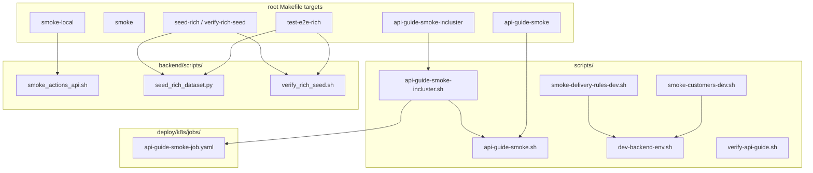
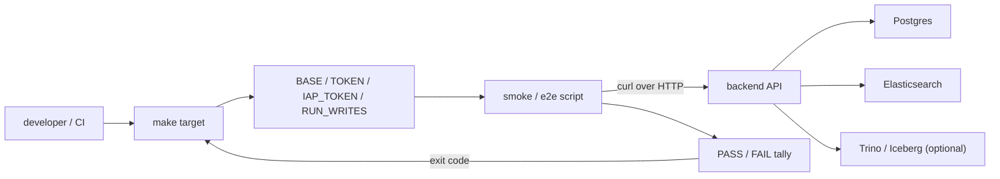
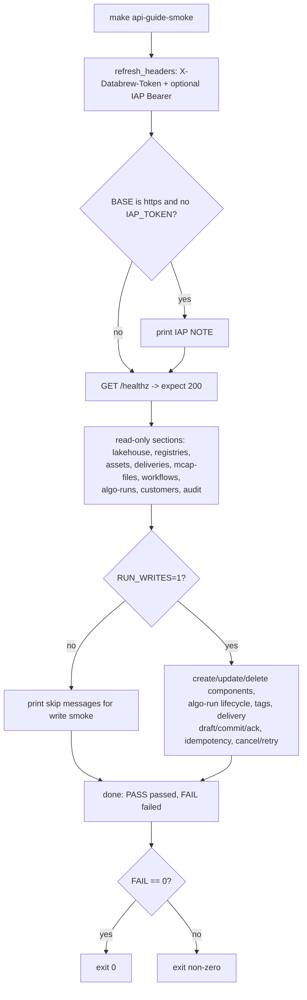
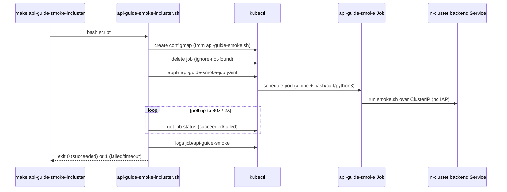
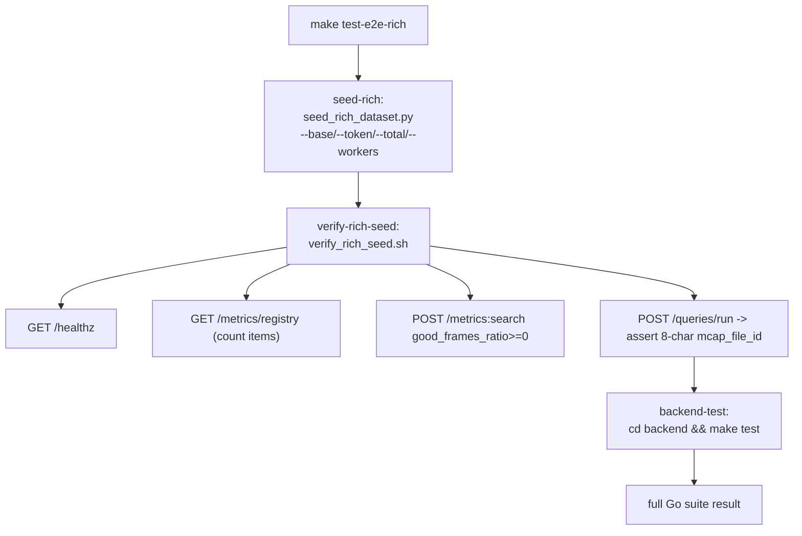
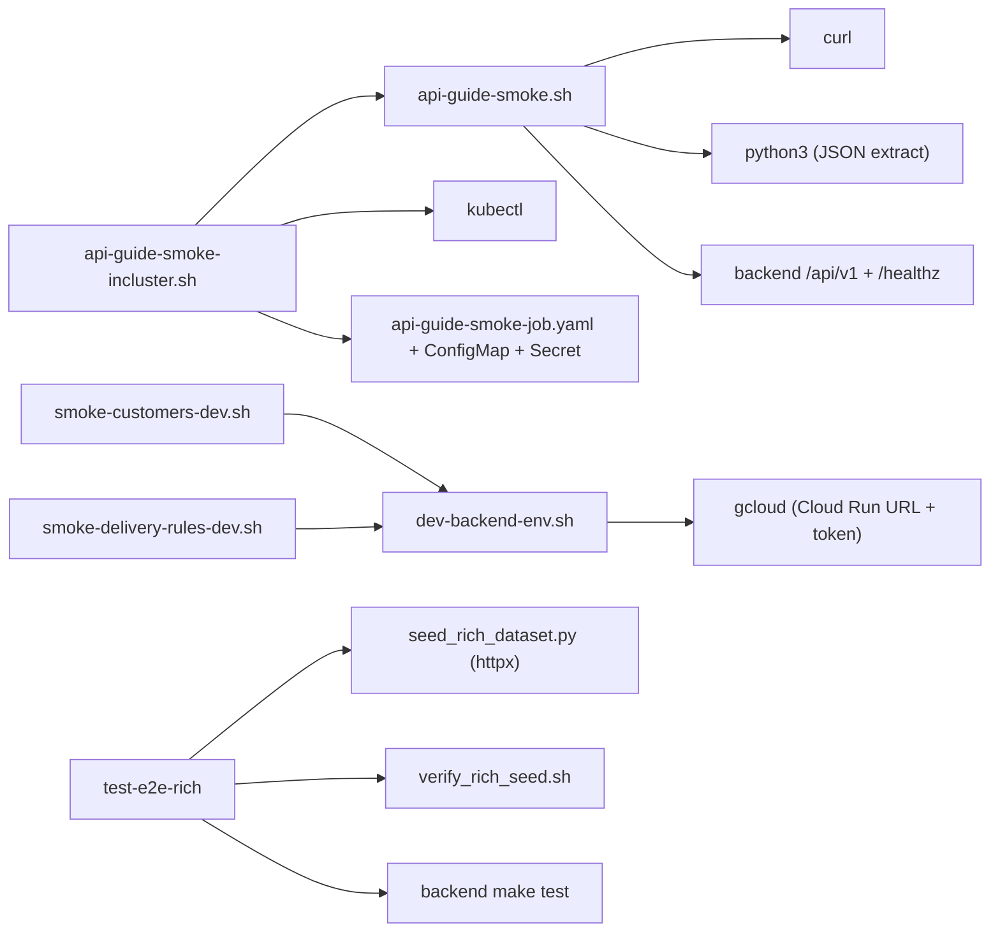

# E2E & Smoke Tests

<cite>
**Referenced Files in This Document**

- [Makefile](file://Makefile)
- [scripts/api-guide-smoke.sh](file://scripts/api-guide-smoke.sh)
- [scripts/api-guide-smoke-incluster.sh](file://scripts/api-guide-smoke-incluster.sh)
- [scripts/smoke-customers-dev.sh](file://scripts/smoke-customers-dev.sh)
- [scripts/smoke-delivery-rules-dev.sh](file://scripts/smoke-delivery-rules-dev.sh)
- [scripts/dev-backend-env.sh](file://scripts/dev-backend-env.sh)
- [scripts/verify-api-guide.sh](file://scripts/verify-api-guide.sh)
- [backend/scripts/smoke_actions_api.sh](file://backend/scripts/smoke_actions_api.sh)
- [backend/scripts/seed_rich_dataset.py](file://backend/scripts/seed_rich_dataset.py)
- [backend/scripts/verify_rich_seed.sh](file://backend/scripts/verify_rich_seed.sh)
- [deploy/k8s/jobs/api-guide-smoke-job.yaml](file://deploy/k8s/jobs/api-guide-smoke-job.yaml)
</cite>

## Table of Contents
1. [Introduction](#introduction)
2. [Project Structure](#project-structure)
3. [Core Components](#core-components)
4. [Architecture Overview](#architecture-overview)
5. [Detailed Component Analysis](#detailed-component-analysis)
6. [Dependency Analysis](#dependency-analysis)
7. [Performance Considerations](#performance-considerations)
8. [Troubleshooting Guide](#troubleshooting-guide)
9. [Conclusion](#conclusion)
10. [Appendices](#appendices)

## Introduction

This page documents the **end-to-end (E2E) and smoke testing** layer of
cyber-databrew. Where the backend unit and integration suites (`make
backend-test`) exercise individual handlers and repositories in isolation,
the E2E/smoke layer drives a **running backend** over HTTP and asserts that
the public API behaves as the API guide promises. These tests are the last
gate before a change is trusted on local Compose, on the GKE dev cluster, or
on the dev Cloud Run service.

Three distinct concerns live here:

- **Smoke** — fast, shallow checks that a backend is *alive and wired
  correctly*. The canonical entry is `scripts/api-guide-smoke.sh`, a curl
  walk through every section of `docs/review/api-guide.md`. Narrower smoke
  scripts exist for the actions API, customers CRUD, and delivery rules.
- **In-cluster smoke** — the same `api-guide-smoke.sh`, but shipped into the
  GKE dev namespace as a Kubernetes `Job` so it runs against the ClusterIP
  Service and bypasses the IAP-protected Gateway.
- **Rich E2E** — `make test-e2e-rich`, which seeds a realistic dataset over
  HTTP, runs a post-seed verification smoke, then runs the full Go test
  suite. This is the heaviest, most representative flow.

All of these are orchestrated from the root `Makefile`, which is the single
place a developer or CI job invokes them.

**Section sources**
- [Makefile](file://Makefile#L164-L188)
- [scripts/api-guide-smoke.sh](file://scripts/api-guide-smoke.sh#L1-L15)

## Project Structure

The testing scripts split across two directories by scope. Repo-wide,
deployment-facing scripts live in `scripts/`; backend-local scripts that
assume a Go backend and Postgres live in `backend/scripts/`.

**Diagram sources**
- [Makefile](file://Makefile#L130-L188)
- [scripts/api-guide-smoke-incluster.sh](file://scripts/api-guide-smoke-incluster.sh#L18-L26)

**Section sources**
- [Makefile](file://Makefile#L1-L1)
- [scripts/api-guide-smoke.sh](file://scripts/api-guide-smoke.sh#L1-L15)
- [backend/scripts/smoke_actions_api.sh](file://backend/scripts/smoke_actions_api.sh#L1-L9)

## Core Components

The layer is built from a small set of self-contained Bash/Python scripts.
Each one exits non-zero on failure so it composes cleanly into `make`
targets and CI pipelines.

#### `scripts/api-guide-smoke.sh` — the canonical smoke

This is the broadest smoke check. It defines a family of curl helper
functions — `get`, `warn_get`, `expect_code_get`, `post`, `post_json`,
`put_json`, `expect_code_post`, `delete`, `expect_code_delete`,
`expect_json_number` — that each issue a request, capture the HTTP status
via `curl -w "\n%{http_code}"`, and tally a global `PASS`/`FAIL` counter.
The script then walks every section of the API guide: health, Lakehouse /
Trino, registries, the pipeline-component registry, assets / search /
deliveries / mcap-files, workflow monitoring, algo-runs, customers, audit
search, and audit lineage search. At the end it prints `done: N passed, M
failed` and exits `[[ "$FAIL" -eq 0 ]]`.

Read-only checks run unconditionally. Mutating checks are gated behind
`RUN_WRITES=1`, which unlocks pipeline-component create/update/delete,
algo-run lifecycle, customer create, mcap-file + asset creation,
multi-source tags, delivery draft/commit/ack, idempotency-key conflict, and
delivery cancel/retry.

**Section sources**
- [scripts/api-guide-smoke.sh](file://scripts/api-guide-smoke.sh#L37-L188)
- [scripts/api-guide-smoke.sh](file://scripts/api-guide-smoke.sh#L190-L234)
- [scripts/api-guide-smoke.sh](file://scripts/api-guide-smoke.sh#L544-L546)

#### `backend/scripts/smoke_actions_api.sh` — `make smoke-local`

The shallowest smoke. It hits `/healthz`, greps for `"status":"ok"`, and —
only when `SEG_ASSET_ID` is set — fetches `GET
/api/v1/assets/$SEG_ASSET_ID/actions` and asserts HTTP 200. `make
smoke-local` first runs `backend/scripts/ensure_migrations.sh`, then invokes
this script with `DATABREW_TOKEN` (default `dev-token`).

**Section sources**
- [backend/scripts/smoke_actions_api.sh](file://backend/scripts/smoke_actions_api.sh#L1-L32)
- [Makefile](file://Makefile#L164-L170)

#### `scripts/smoke-customers-dev.sh` and `scripts/smoke-delivery-rules-dev.sh`

Two targeted smoke scripts aimed at the dev Cloud Run service. Both
`source scripts/dev-backend-env.sh` to resolve `BASE`, `DATABREW_TOKEN`, and
the `API_HDR` curl header array (including the Cloud Run identity token).
`smoke-customers-dev.sh` exercises customer create/read, the
unknown-customer foreign-key guard on `POST /deliveries` (expect 422), and a
`customer_id`-filtered delivery list. `smoke-delivery-rules-dev.sh` creates a
delivery rule in `block` mode, tags an asset `quality=poor`, and asserts that
`POST /deliveries` is blocked with HTTP 422 and a `DELIVERY_RULE_FAILED`
body.

**Section sources**
- [scripts/smoke-customers-dev.sh](file://scripts/smoke-customers-dev.sh#L39-L68)
- [scripts/smoke-delivery-rules-dev.sh](file://scripts/smoke-delivery-rules-dev.sh#L36-L78)
- [scripts/dev-backend-env.sh](file://scripts/dev-backend-env.sh#L9-L46)

#### `backend/scripts/seed_rich_dataset.py` + `verify_rich_seed.sh`

`seed_rich_dataset.py` is the HTTP seeder behind `make seed-rich` and the
first stage of `make test-e2e-rich`. Per asset it POSTs an mcap-file, an
asset with weighted tags, algo-run finishes, deliveries in a long-tail
distribution, and eval-results — defaulting to ~100 assets across 8 worker
threads (`DEFAULT_TOTAL`, `DEFAULT_WORKERS`). `verify_rich_seed.sh` is the
post-seed smoke: `/healthz`, the metrics registry count, a `metrics:search`
on `good_frames_ratio >= 0`, and a `queries/run` that asserts the first
asset carries an 8-character `mcap_file_id`.

**Section sources**
- [backend/scripts/seed_rich_dataset.py](file://backend/scripts/seed_rich_dataset.py#L1-L40)
- [backend/scripts/verify_rich_seed.sh](file://backend/scripts/verify_rich_seed.sh#L1-L25)

#### `deploy/k8s/jobs/api-guide-smoke-job.yaml`

A one-shot Kubernetes `Job` that mounts `api-guide-smoke.sh` from a
ConfigMap, runs it in an `alpine:3.19` pod (after `apk add bash curl
python3`), targets the in-cluster Service URL, and reads `TOKEN` from the
`cyber-databrew-secrets` secret. `backoffLimit: 0` means no retries;
`ttlSecondsAfterFinished: 120` cleans the Job up shortly after it finishes.

**Section sources**
- [deploy/k8s/jobs/api-guide-smoke-job.yaml](file://deploy/k8s/jobs/api-guide-smoke-job.yaml#L1-L41)

## Architecture Overview

Every test path follows the same shape: a `make` target supplies
configuration, a script issues HTTP requests against a backend, and the
script's exit code propagates back up as the gate result. The differences
are *where the backend lives* and *how deep the test goes*.

`BASE` selects the target backend: `http://localhost:8080` for local Compose
(`make all-up`), the in-cluster Service URL for the Job, or the resolved
Cloud Run URL from `dev-backend-env.sh`. When `BASE` is HTTPS and no
`IAP_TOKEN` is set, `api-guide-smoke.sh` prints a NOTE that IAP-protected
hosts will return 302/401.

**Diagram sources**
- [scripts/api-guide-smoke.sh](file://scripts/api-guide-smoke.sh#L17-L31)
- [scripts/api-guide-smoke.sh](file://scripts/api-guide-smoke.sh#L190-L204)

**Section sources**
- [scripts/api-guide-smoke.sh](file://scripts/api-guide-smoke.sh#L17-L31)
- [Makefile](file://Makefile#L172-L178)

## Detailed Component Analysis

### A smoke run end-to-end (`make api-guide-smoke`)

The following flowchart traces a single invocation of the canonical smoke,
showing how the helper functions classify each response and how the run
gates on the final `FAIL` count.

Each helper distinguishes three response classes. `get`/`post` treat any
`2xx` as OK; `expect_code_get`/`expect_code_post` assert an *exact* status
(used for the negative cases such as `unknown asset-type -> 404`, `missing
image -> 400`, `duplicate run_id -> 409`); and `warn_get` downgrades a
non-2xx to a WARN rather than a FAIL for Trino-dependent Lakehouse endpoints
that dev often serves as 503 when `TRINO_DISABLED` is set.

**Diagram sources**
- [scripts/api-guide-smoke.sh](file://scripts/api-guide-smoke.sh#L190-L320)
- [scripts/api-guide-smoke.sh](file://scripts/api-guide-smoke.sh#L376-L546)

**Section sources**
- [scripts/api-guide-smoke.sh](file://scripts/api-guide-smoke.sh#L47-L188)
- [scripts/api-guide-smoke.sh](file://scripts/api-guide-smoke.sh#L207-L229)

### The in-cluster smoke Job

`api-guide-smoke-incluster.sh` is a thin orchestrator: it (re)creates the
`api-guide-smoke-script` ConfigMap from the local `api-guide-smoke.sh`,
deletes any prior `api-guide-smoke` Job, applies the Job manifest, then polls
for up to 90 iterations (2s sleep each) on `.status.succeeded` /
`.status.failed`. On success it dumps the Job logs and exits 0; on failure or
timeout it dumps logs and exits 1. The Job runs the *exact same* smoke
script, so in-cluster coverage never drifts from local coverage.

**Diagram sources**
- [scripts/api-guide-smoke-incluster.sh](file://scripts/api-guide-smoke-incluster.sh#L18-L43)
- [deploy/k8s/jobs/api-guide-smoke-job.yaml](file://deploy/k8s/jobs/api-guide-smoke-job.yaml#L6-L41)

**Section sources**
- [scripts/api-guide-smoke-incluster.sh](file://scripts/api-guide-smoke-incluster.sh#L9-L43)

### The rich E2E flow (`make test-e2e-rich`)

`test-e2e-rich` is a prerequisite chain: `seed-rich verify-rich-seed
backend-test`. It assumes a backend already running (typically `make
all-up`), seeds a realistic dataset over HTTP, smoke-verifies the seed, then
runs the full Go test suite. Because the stages are Make prerequisites, any
stage that exits non-zero aborts the rest.

The seeder's defaults are deliberately small (`DEFAULT_TOTAL = 100`,
`DEFAULT_WORKERS = 8`) so a stray run does not accidentally load a 10k
dataset; heavier datasets are opt-in through `SEED_TOTAL` / `SEED_WORKERS`
or the `--total` / `--workers` flags. A separate `pg-generate-rich` target
loads rich scale directly into Postgres via SQL, independent of this HTTP
flow.

**Diagram sources**
- [Makefile](file://Makefile#L130-L141)
- [backend/scripts/verify_rich_seed.sh](file://backend/scripts/verify_rich_seed.sh#L7-L25)

**Section sources**
- [Makefile](file://Makefile#L128-L141)
- [backend/scripts/seed_rich_dataset.py](file://backend/scripts/seed_rich_dataset.py#L1-L40)

### `verify-api-guide.sh` — the exhaustive sibling

`scripts/verify-api-guide.sh` is a heavier, "exhaustive api-guide.md
verification" variant that shares the same helper idiom (`getc`, `code_of`,
`body_of`, `ok`, `fail`, plus a `note` mechanism that collects doc-drift
remarks). It is invoked directly with `BASE`/`TOKEN` rather than through a
dedicated make target, and is intended for deeper manual verification when
the lightweight smoke is not enough.

**Section sources**
- [scripts/verify-api-guide.sh](file://scripts/verify-api-guide.sh#L1-L30)

## Dependency Analysis

The smoke/E2E layer depends only on a running backend plus standard
command-line tooling; it carries no test framework.

Key runtime dependencies:

- **curl + python3** — every smoke script uses curl for transport and
  python3 for JSON field extraction and shape assertions.
- **gcloud** — `dev-backend-env.sh` resolves the Cloud Run URL and
  `DATABREW_TOKEN` from the deployed service and prints an identity token,
  so the dev-targeted smoke scripts require an authenticated gcloud.
- **kubectl + cluster access** — the in-cluster Job orchestrator needs a
  kube context pointing at the dev cluster, the `cyber-databrew-secrets`
  secret, and the ability to create ConfigMaps and Jobs.
- **httpx** — `seed_rich_dataset.py` requires `pip install httpx`.

**Diagram sources**
- [scripts/api-guide-smoke-incluster.sh](file://scripts/api-guide-smoke-incluster.sh#L11-L26)
- [scripts/dev-backend-env.sh](file://scripts/dev-backend-env.sh#L15-L43)

**Section sources**
- [scripts/api-guide-smoke.sh](file://scripts/api-guide-smoke.sh#L14-L31)
- [scripts/dev-backend-env.sh](file://scripts/dev-backend-env.sh#L1-L46)
- [backend/scripts/seed_rich_dataset.py](file://backend/scripts/seed_rich_dataset.py#L14-L16)

## Performance Considerations

- **Per-request timeouts.** `api-guide-smoke.sh` bounds every call with
  `curl --max-time` (15s health, 25s GET, 30s POST/PUT/DELETE, 3s for the SSE
  stream probe). A hung backend therefore fails fast instead of stalling the
  whole run.
- **Bounded in-cluster wait.** The Job poller caps at 90 iterations of a 2s
  sleep (~3 minutes) before declaring a timeout, so a stuck Job cannot block
  CI indefinitely.
- **Seed concurrency.** `seed_rich_dataset.py` parallelises across worker
  threads (`DEFAULT_WORKERS = 8`) with bounded retries (`MAX_RETRIES = 5`).
  Larger datasets scale with `--workers`; the conservative defaults keep
  laptop and CI runs cheap.
- **Read-only by default.** Write smoke is gated behind `RUN_WRITES=1`, so a
  routine smoke leaves no rows behind and stays fast. Write runs use unique,
  timestamp- or random-suffixed ids to avoid collisions on shared dev data.

**Section sources**
- [scripts/api-guide-smoke.sh](file://scripts/api-guide-smoke.sh#L47-L97)
- [scripts/api-guide-smoke-incluster.sh](file://scripts/api-guide-smoke-incluster.sh#L27-L43)
- [backend/scripts/seed_rich_dataset.py](file://backend/scripts/seed_rich_dataset.py#L36-L40)

## Troubleshooting Guide

#### Health check fails immediately
`smoke: healthz failed` or `FAIL GET /healthz` means the backend is not up or
`BASE` is wrong. For local runs confirm `make all-up` is healthy and `BASE`
is `http://localhost:8080` (or `127.0.0.1:8080`).

#### HTTPS BASE returns 302/401 on everything
The host is IAP-protected and no `IAP_TOKEN` was supplied. The script prints
the NOTE for exactly this case. Supply an OIDC `IAP_TOKEN` whose audience is
the IAP OAuth client id, or target the Cloud Run URL via
`dev-backend-env.sh` instead.

#### Lakehouse endpoints report WARN, not FAIL
`warn_get` deliberately downgrades non-2xx for Trino-dependent endpoints
(`training-assets`, `recompute-candidates`, `tag-timeline`,
`quality-distribution`, `customer-replay`). Dev often runs with
`TRINO_DISABLED`, returning 503; this is tolerated. `lakehouse/report` 404 is
also tolerated until the Iceberg MVP has run.

#### Write smoke is skipped
The `skip ... set RUN_WRITES=1` messages are expected on a read-only run. Set
`RUN_WRITES=1` to exercise create/update/delete, delivery draft/commit/ack,
idempotency, and cancel/retry paths.

#### In-cluster Job times out
The orchestrator dumps `kubectl logs job/api-guide-smoke` on both failure and
timeout. Check that the kube context/namespace are correct, that
`cyber-databrew-secrets` contains `DATABREW_TOKEN`, and that the in-cluster
Service URL resolves.

#### `verify-rich-seed` reports an empty / wrong mcap_file_id
The post-seed check asserts the first asset carries an 8-character
`mcap_file_id` (`short_id_ok`). A failure here usually means the seed did not
complete or the backend stored ids in an unexpected format — re-run
`make seed-rich` and inspect the seeder output.

**Section sources**
- [scripts/api-guide-smoke.sh](file://scripts/api-guide-smoke.sh#L190-L229)
- [scripts/api-guide-smoke-incluster.sh](file://scripts/api-guide-smoke-incluster.sh#L27-L43)
- [backend/scripts/verify_rich_seed.sh](file://backend/scripts/verify_rich_seed.sh#L19-L25)
- [backend/scripts/smoke_actions_api.sh](file://backend/scripts/smoke_actions_api.sh#L11-L29)

## Conclusion

The E2E and smoke layer is intentionally framework-free: plain Bash + curl +
python3 scripts, each exiting non-zero on failure, composed through the root
`Makefile`. `api-guide-smoke.sh` is the heart of it, reused unchanged for
local runs and for the in-cluster Kubernetes Job so coverage never diverges.
The dev-targeted smoke scripts add focused customer and delivery-rule
guarantees, and `test-e2e-rich` provides the deepest path by seeding a
realistic dataset, smoke-verifying it, and running the full Go suite. Used
together, they give a fast "is it alive and contract-correct" signal at every
deployment surface.

## Appendices

### Make targets

| Target | Script(s) invoked | Backend assumption |
| --- | --- | --- |
| `smoke-local` | `ensure_migrations.sh` + `smoke_actions_api.sh` | local backend on :8080 |
| `smoke` | none (prints guidance to use `smoke-local`) | — |
| `api-guide-smoke` | `api-guide-smoke.sh` | any `BASE` |
| `api-guide-smoke-incluster` | `api-guide-smoke-incluster.sh` -> Job -> `api-guide-smoke.sh` | GKE dev cluster |
| `seed-rich` | `seed_rich_dataset.py` | running backend |
| `verify-rich-seed` | `verify_rich_seed.sh` | seeded backend |
| `test-e2e-rich` | seed-rich + verify-rich-seed + backend-test | running backend |

**Section sources**
- [Makefile](file://Makefile#L128-L178)

### Scripts → what they verify

| Script | Verifies |
| --- | --- |
| [api-guide-smoke.sh](file://scripts/api-guide-smoke.sh) | Full API-guide walk: health, Lakehouse/Trino, registries, pipeline components, assets/search/deliveries/mcap-files, workflows, algo-runs, customers, audit; negative status codes; optional write paths under `RUN_WRITES=1` |
| [api-guide-smoke-incluster.sh](file://scripts/api-guide-smoke-incluster.sh) | Same smoke run as a GKE Job against the ClusterIP Service (no IAP); polls Job status and surfaces logs |
| [smoke_actions_api.sh](file://backend/scripts/smoke_actions_api.sh) | `/healthz` is `status: ok`; optional `GET /assets/{id}/actions` returns 200 |
| [smoke-customers-dev.sh](file://scripts/smoke-customers-dev.sh) | Customer create/read; unknown-customer delivery FK guard (422); `customer_id`-filtered delivery list |
| [smoke-delivery-rules-dev.sh](file://scripts/smoke-delivery-rules-dev.sh) | Delivery rule create/list; rule in `block` mode rejects `POST /deliveries` with 422 `DELIVERY_RULE_FAILED` |
| [verify_rich_seed.sh](file://backend/scripts/verify_rich_seed.sh) | Post-seed: health, metrics registry count, `metrics:search`, `queries/run` 8-char `mcap_file_id` |
| [verify-api-guide.sh](file://scripts/verify-api-guide.sh) | Exhaustive api-guide.md verification (deeper manual check; not wired to a make target) |
| [seed_rich_dataset.py](file://backend/scripts/seed_rich_dataset.py) | Not an assertion script — HTTP seeder that creates mcap-files, assets, tags, algo-runs, deliveries, eval-results |

**Section sources**
- [scripts/api-guide-smoke.sh](file://scripts/api-guide-smoke.sh#L190-L546)
- [scripts/smoke-customers-dev.sh](file://scripts/smoke-customers-dev.sh#L39-L68)
- [scripts/smoke-delivery-rules-dev.sh](file://scripts/smoke-delivery-rules-dev.sh#L36-L78)
- [backend/scripts/verify_rich_seed.sh](file://backend/scripts/verify_rich_seed.sh#L1-L25)

### Key environment variables

| Variable | Used by | Effect |
| --- | --- | --- |
| `BASE` | all smoke scripts | Target backend URL (default `http://localhost:8080`) |
| `TOKEN` / `DATABREW_TOKEN` | all smoke scripts | `X-Databrew-Token` header value (default `dev-token`) |
| `IAP_TOKEN` | `api-guide-smoke.sh` | OIDC bearer for IAP-protected hosts |
| `RUN_WRITES` | `api-guide-smoke.sh` | `1` enables mutating smoke paths |
| `SEG_ASSET_ID` | `smoke_actions_api.sh` / `smoke-local` | Enables the actions-list check |
| `ASSET_ID` | dev smoke scripts | Enables delivery / block checks |
| `KUBE_CONTEXT` / `NS` | `api-guide-smoke-incluster.sh` | Target cluster context / namespace |
| `SEED_TOTAL` / `SEED_WORKERS` / `SEED_BASE` / `SEED_TOKEN` | `seed-rich` | Dataset size, concurrency, target, token |

**Section sources**
- [scripts/api-guide-smoke.sh](file://scripts/api-guide-smoke.sh#L17-L31)
- [Makefile](file://Makefile#L128-L178)
- [scripts/api-guide-smoke-incluster.sh](file://scripts/api-guide-smoke-incluster.sh#L11-L16)
</content>
</invoke>
