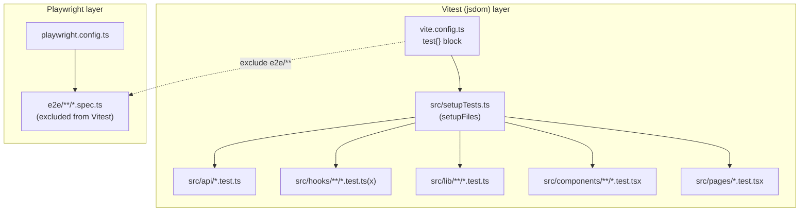
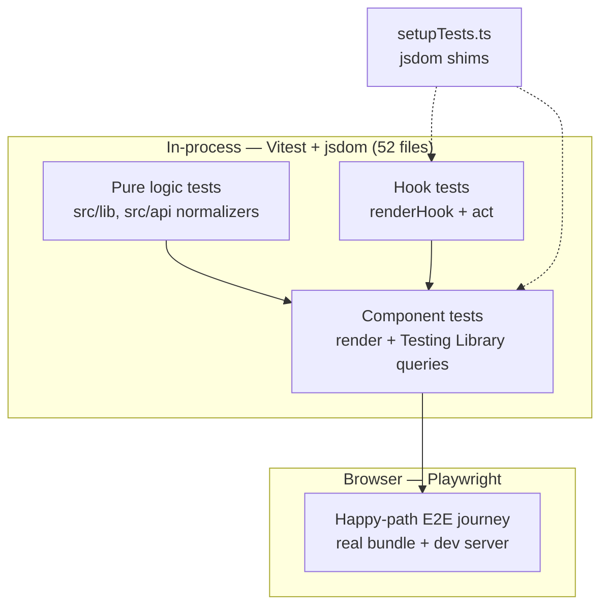
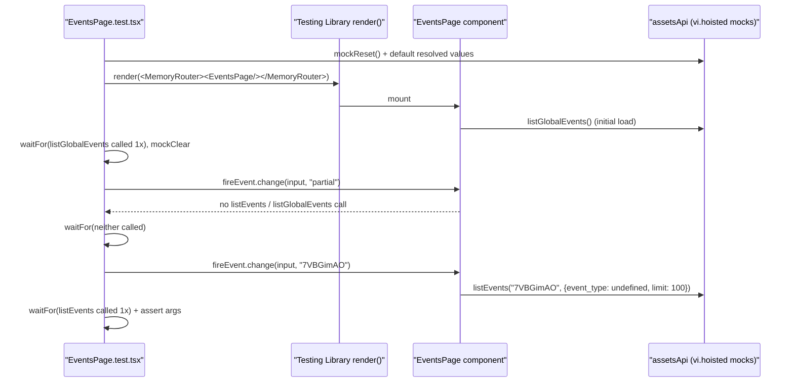
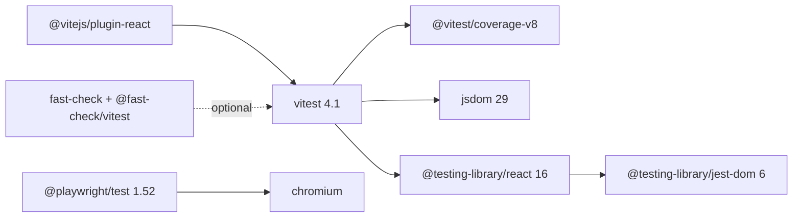

# Frontend Tests

<cite>
**Referenced Files in This Document**

- [Frontend/src/setupTests.ts](file://Frontend/src/setupTests.ts)
- [Frontend/vite.config.ts](file://Frontend/vite.config.ts)
- [Frontend/playwright.config.ts](file://Frontend/playwright.config.ts)
- [Frontend/package.json](file://Frontend/package.json)
- [Frontend/src/pages/EventsPage.test.tsx](file://Frontend/src/pages/EventsPage.test.tsx)
- [Frontend/src/api/search.test.ts](file://Frontend/src/api/search.test.ts)
- [Frontend/src/api/search.ts](file://Frontend/src/api/search.ts)
- [Frontend/src/api/algoRuns.test.ts](file://Frontend/src/api/algoRuns.test.ts)
- [Frontend/src/pages/WorkflowDagView.test.tsx](file://Frontend/src/pages/WorkflowDagView.test.tsx)
- [Frontend/src/pages/WorkflowDagView.tsx](file://Frontend/src/pages/WorkflowDagView.tsx)
- [Frontend/src/hooks/assets/useAssetsQuerySync.test.ts](file://Frontend/src/hooks/assets/useAssetsQuerySync.test.ts)
</cite>

## Table of Contents
1. [Introduction](#introduction)
2. [Project Structure](#project-structure)
3. [Core Components](#core-components)
4. [Architecture Overview](#architecture-overview)
5. [Detailed Component Analysis](#detailed-component-analysis)
6. [Dependency Analysis](#dependency-analysis)
7. [Performance Considerations](#performance-considerations)
8. [Troubleshooting Guide](#troubleshooting-guide)
9. [Conclusion](#conclusion)
10. [Appendices](#appendices)

## Introduction

The cyber-databrew frontend is a React 19 single-page application built with Vite, Ant Design, and `@xyflow/react`. Its automated test suite is split into two distinct layers that run on completely different toolchains:

- **Unit and component tests** run under **Vitest 4** in a `jsdom` environment, using **Testing Library** (`@testing-library/react` plus `@testing-library/jest-dom`). These cover pure functions (URL serialization, DAG element construction, search-hit normalization), custom React hooks (via `renderHook`), and rendered components (via `render` + DOM queries). At the time of writing there are 52 such test files across `src/api`, `src/hooks`, `src/lib`, `src/components`, and `src/pages`.
- **End-to-end (E2E) tests** run under **Playwright** against a real browser (`Desktop Chrome` / chromium) and a live dev server, exercising a happy-path user journey through the running app.

Both layers share the same source tree but are deliberately kept apart: Vitest is configured to **exclude** the `e2e/**` directory so Playwright specs never get picked up by the unit runner, and Playwright is pointed at its own `testDir: "./e2e"`. This page documents how each layer is configured, how the shared `setupTests.ts` shim makes `jsdom` behave like a browser, the conventions the team uses for mocking the API layer, and how to diagnose the common failure modes.

**Section sources**
- [Frontend/package.json](file://Frontend/package.json#L6-L18)
- [Frontend/vite.config.ts](file://Frontend/vite.config.ts#L108-L129)
- [Frontend/playwright.config.ts](file://Frontend/playwright.config.ts#L14-L33)

## Project Structure

Frontend tests are colocated with the code they exercise. A test file lives next to its subject and uses the `.test.ts` / `.test.tsx` suffix, so the unit-test taxonomy mirrors the application taxonomy:

- `src/api/*.test.ts` — tests for the typed API client modules. These validate request shaping (query-string construction, pagination params) and response normalization (mapping backend / Elasticsearch shapes into frontend domain types). Examples: `search.test.ts`, `algoRuns.test.ts`.
- `src/hooks/**/*.test.ts(x)` — tests for custom hooks, driven through Testing Library's `renderHook`. Examples: `useAssetsQuerySync.test.ts`, `useAssetsDiscoveryReducer.test.ts`, `useAssetPreview.test.ts`, `useRetryAllFailed.test.ts`.
- `src/lib/**/*.test.ts` — tests for pure utility / reducer / serialization logic (`assetId.test.ts`, `workflowDag.test.ts`, `assetsDiscoveryReducer.test.ts`, `pipelineContract.test.ts`, …).
- `src/components/**/*.test.tsx` — rendered-component tests for the assets, asset-detail, deliveries, and pipeline feature areas.
- `src/pages/*.test.tsx` — page-level tests (`EventsPage.test.tsx`, `PipelinePage.test.tsx`, `SettingsPage.test.tsx`, `WorkflowDagView.test.tsx`, `useWorkflowDetail.test.tsx`).

Two configuration files and one setup file define the test environment:

- `vite.config.ts` carries the Vitest config inline under the `test` key (Vitest reads the Vite config directly). It declares the `jsdom` environment, `globals: true`, the setup file, the `e2e/**` exclusion, the test timeout, and the per-directory coverage thresholds.
- `playwright.config.ts` defines the E2E project (chromium), the base URL, retries, timeout, and reporters.
- `src/setupTests.ts` is loaded once before any Vitest suite and patches a small set of `jsdom` gaps that Ant Design and `@xyflow/react` would otherwise trip over.



**Diagram sources**
- [Frontend/vite.config.ts](file://Frontend/vite.config.ts#L108-L129)
- [Frontend/playwright.config.ts](file://Frontend/playwright.config.ts#L14-L33)
- [Frontend/src/setupTests.ts](file://Frontend/src/setupTests.ts#L1-L43)

**Section sources**
- [Frontend/package.json](file://Frontend/package.json#L36-L55)
- [Frontend/vite.config.ts](file://Frontend/vite.config.ts#L108-L129)

## Core Components

#### Test scripts

The npm scripts in `package.json` are the canonical entry points:

| Script | Command | Purpose |
| --- | --- | --- |
| `test` | `vitest run` | Single non-watch run of the whole Vitest suite. |
| `test:coverage` | `vitest run --coverage` | Same, with v8 coverage and threshold enforcement. |
| `test:e2e` | `playwright test` | Run the Playwright E2E project. |
| `test:e2e:install` | `playwright install --with-deps chromium` | One-time browser install for E2E. |
| `lint` | `biome check src` | Static lint (not a test, but part of the same gate). |

**Section sources**
- [Frontend/package.json](file://Frontend/package.json#L6-L18)

#### Vitest configuration (the `test` block)

Vitest is configured inside `vite.config.ts`. The salient options are:

- `globals: true` — `describe`, `it`, `expect`, `vi`, `beforeEach`, etc. are available without importing (most test files still import them explicitly from `vitest` for clarity).
- `environment: "jsdom"` — a DOM is simulated in Node so components can render.
- `setupFiles: ["src/setupTests.ts"]` — runs before each test file.
- `exclude: ["e2e/**", "node_modules/**"]` — keeps Playwright specs out of the Vitest run.
- `testTimeout: 10_000` — a 10-second per-test budget.
- `coverage` — v8 provider, `text` / `text-summary` / `lcov` reporters, `src/**/*.{ts,tsx}` included with `main.tsx`, test files, and `.d.ts` excluded, and a **ratcheting threshold** on `src/components/**` (statements 44, branches 34, functions 44, lines 45).

**Section sources**
- [Frontend/vite.config.ts](file://Frontend/vite.config.ts#L108-L129)

#### The shared setup shim (`setupTests.ts`)

`setupTests.ts` does three things, all to make `jsdom` survive code written for a real browser:

1. **Imports the jest-dom matchers for Vitest** — `import "@testing-library/jest-dom/vitest"` adds matchers such as `toBeInTheDocument`, `toHaveValue`, etc.
2. **Mocks `ResizeObserver`** with a no-op `MockResizeObserver` class. `jsdom` has no `ResizeObserver`; Ant Design and `@xyflow/react` reference it on mount, so without this the component tests throw on render.
3. **Silences a known `getComputedStyle` pseudo-element warning** — it wraps `window.getComputedStyle` to delegate to the original, and filters the noisy `"Not implemented: Window's getComputedStyle() method: with pseudo-elements"` console error. Both patches are installed in `beforeAll` and reverted in `afterAll`, so the global state is restored after the suite.

Note that `matchMedia` is **not** patched globally here. Components that need it (e.g. Ant Design responsive widgets in `EventsPage`) define their own `window.matchMedia` mock inside the individual test file.

**Section sources**
- [Frontend/src/setupTests.ts](file://Frontend/src/setupTests.ts#L1-L43)

#### Playwright configuration

`playwright.config.ts` declares a single `chromium` project using `Desktop Chrome` device emulation, a `testDir` of `./e2e`, a 30-second timeout, one retry, and HTML + list reporters writing into `e2e/report`. The base URL defaults to `http://localhost:5173` (overridable with `E2E_BASE_URL`), screenshots are captured only on failure, and traces are recorded `on-first-retry`. The config header documents the run sequence: install the browser, start the dev server, then `npx playwright test`.

**Section sources**
- [Frontend/playwright.config.ts](file://Frontend/playwright.config.ts#L1-L33)

## Architecture Overview

The two test layers form a pyramid. The wide base is fast, in-process Vitest tests that never touch the network or a real browser; the narrow top is a small number of Playwright happy-path journeys that run the real bundle in a real browser. The boundary between them is enforced mechanically by the Vitest `exclude` glob.



The Vitest layer relies on module mocking (`vi.mock`) to cut every API module off from the network: tests assert on the *arguments* passed to a mocked client (request-shaping tests) or feed canned responses back through a mock to assert on rendered output (response-handling tests). The Playwright layer does the opposite — it runs against a fully wired app and dev server and observes real behavior end to end.

**Diagram sources**
- [Frontend/vite.config.ts](file://Frontend/vite.config.ts#L108-L113)
- [Frontend/src/setupTests.ts](file://Frontend/src/setupTests.ts#L16-L34)

**Section sources**
- [Frontend/vite.config.ts](file://Frontend/vite.config.ts#L108-L129)
- [Frontend/playwright.config.ts](file://Frontend/playwright.config.ts#L14-L33)

## Detailed Component Analysis

### Pure API-normalization tests (`search.test.ts`)

`normalizeSearchHitToAsset` is the function that converts a raw Elasticsearch hit (`SearchAssetHit`) into the frontend `Asset` shape (`SearchAssetResult`). Because it is a pure function, its test imports it directly and feeds a fully populated hit, then asserts every derived field. This is the cheapest possible test: no DOM, no mocks, no async.

The test verifies the non-trivial transforms specifically:

- `asset_type` is mirrored into both `asset_type` and the legacy `type` field.
- `duration_ms: 60000` becomes `duration_sec: 60` (divide by 1000).
- `tags_flat` is preferred as the tag source over the `tags` array, producing `tags = { quality: "good" }`.
- `metadata.scene` is surfaced as `env`.
- The `algos[]` array is flattened into a dotted `algo_results` map keyed `name@version:field`, e.g. `hand_tracking@1.2.0:status` and `hand_tracking@1.2.0:reason`.
- `files` defaults to `{}` and `_highlight` is passed through verbatim.

These assertions map directly onto the implementation: tag-source preference lives in `buildTagsMap`, the algo flattening in `buildAlgoResults`, and the field derivations in `normalizeSearchHitToAsset` itself.

**Section sources**
- [Frontend/src/api/search.test.ts](file://Frontend/src/api/search.test.ts#L1-L46)
- [Frontend/src/api/search.ts](file://Frontend/src/api/search.ts#L123-L218)

### API request-shaping tests with module mocking (`algoRuns.test.ts`)

`algoRuns.test.ts` shows the mocking pattern for the *request* side. The HTTP client is replaced wholesale with `vi.mock("./client", …)` exposing a single `getMock = vi.fn()`. The module under test is then imported lazily with a top-level `await import("./algoRuns")` inside the `describe` callback so the mock is in place first.

The test stubs a resolved value, calls `algoRunsApi.list(...)` with pagination and filter params, and asserts the exact composed URL — including URL-encoding of timestamps (`%3A` for `:`):

```
/algo-runs?page=2&page_size=25&algo_name=hand_track&status=failed&started_after=2026-05-22T00%3A00%3A00Z&started_before=2026-05-23T00%3A00%3A00Z
```

This is the canonical way the team tests query-string builders: assert on `getMock`'s call arguments rather than the response.

**Section sources**
- [Frontend/src/api/algoRuns.test.ts](file://Frontend/src/api/algoRuns.test.ts#L1-L32)

### Pure DAG-builder tests (`WorkflowDagView.test.tsx`)

`WorkflowDagView.tsx` exports two pure helpers that are tested without rendering the React component at all: `buildDagElements` (builds the React Flow `nodes`/`edges` from raw Argo workflow node statuses) and `countDisplayableWorkflowNodes`.

The test asserts three behaviors:

1. **Backend-provided edges are preferred** — given a normalized `WorkflowDagEdge` whose endpoints are both displayable, `buildDagElements` returns exactly that edge.
2. **Edges with hidden endpoints are dropped** — an edge whose `source` (`root`) is not a displayable node yields zero edges.
3. **Only displayable nodes are counted** — two `Pod`/templated steps count as 2, while a bare root `DAG` node counts as 0.

Displayability is decided by `isDisplayableNode` (a node must be of type `pod`/`template`, or pass the root-DAG exclusion). Keeping these helpers exported and pure lets the heavy `@xyflow/react` canvas stay untested at the unit level while the graph-construction logic is fully covered.

**Section sources**
- [Frontend/src/pages/WorkflowDagView.test.tsx](file://Frontend/src/pages/WorkflowDagView.test.tsx#L1-L75)
- [Frontend/src/pages/WorkflowDagView.tsx](file://Frontend/src/pages/WorkflowDagView.tsx#L53-L73)
- [Frontend/src/pages/WorkflowDagView.tsx](file://Frontend/src/pages/WorkflowDagView.tsx#L104-L104)

### Hook tests with `renderHook` (`useAssetsQuerySync.test.ts`)

Hook tests drive a hook in isolation through Testing Library's `renderHook` and `act`. `useAssetsQuerySync.test.ts` exercises a hook that synchronizes assets-discovery state with the URL query string. It demonstrates several advanced patterns:

- **Partial module mocking** — `vi.mock("react-router-dom", …)` keeps the real module via `vi.importActual` but overrides `useNavigate` and `useLocation`. The mocked `navigate` writes through to `window.history.pushState` / `replaceState` so the hook's URL behavior can be observed via real history APIs.
- **Spying on history** — `vi.spyOn(window.history, "pushState"|"replaceState")` is set up in `beforeEach` and restored in `afterEach`, letting the test assert *which* history method ran (push vs replace) and with what URL fragment.
- **Hydration semantics** — the suite checks that on mount the hook dispatches `URL_HYDRATE` (parsing `page`, `sort`, `preview`, `preview_topic`, `preview_source`, `time`, `ds`, `ds.*`) and `MARK_URL_HYDRATED`, that it does **not** write the URL before hydration, that filter changes use `replaceState` while page changes use `pushState`, and that a `popstate` re-hydrates.
- **`rerender` for prop transitions** — `renderHook(... , { initialProps })` plus `rerender(newProps)` simulates state changes across renders.

**Section sources**
- [Frontend/src/hooks/assets/useAssetsQuerySync.test.ts](file://Frontend/src/hooks/assets/useAssetsQuerySync.test.ts#L13-L84)
- [Frontend/src/hooks/assets/useAssetsQuerySync.test.ts](file://Frontend/src/hooks/assets/useAssetsQuerySync.test.ts#L86-L210)

### Rendered component tests (`EventsPage.test.tsx`)

`EventsPage.test.tsx` is the prototypical component test and exercises the full render → interact → assert loop. It illustrates the patterns the team uses for page components:

- **Hoisted mocks** — `vi.hoisted(() => ({ listEventsMock, listGlobalEventsMock }))` creates mock functions before `vi.mock("../api/assets", …)` substitutes the assets API with them. Hoisting is required because `vi.mock` is itself hoisted above imports.
- **Per-file `matchMedia` mock** — `EventsPage` uses Ant Design responsive components, so the file defines `window.matchMedia` returning a non-matching media query object (since `setupTests.ts` does not provide one).
- **Router wrapping** — components are wrapped in `<MemoryRouter>` (with `initialEntries` to seed the URL, e.g. `/events?asset_id=...`).
- **`beforeEach` reset** — both mocks are `mockReset()` and given default resolved values each test, so cases stay independent.
- **Queries and assertions** — `screen.getByText`, `getByPlaceholderText`; interaction via `fireEvent.change`; async assertions wrapped in `waitFor`.

A representative behavior under test: the page must **not** call `listEvents` until the Asset ID input holds a full canonical 8-character id. Typing `"partial"` triggers no asset-scoped call; typing `"7VBGimAO"` triggers exactly one `listEvents` call with `{ event_type: undefined, limit: 100 }`.

The sequence below traces that single test through the layers:



**Diagram sources**
- [Frontend/src/pages/EventsPage.test.tsx](file://Frontend/src/pages/EventsPage.test.tsx#L6-L39)
- [Frontend/src/pages/EventsPage.test.tsx](file://Frontend/src/pages/EventsPage.test.tsx#L60-L90)

**Section sources**
- [Frontend/src/pages/EventsPage.test.tsx](file://Frontend/src/pages/EventsPage.test.tsx#L1-L112)

### Playwright E2E journey

The Playwright layer is configured (`testDir: "./e2e"`) for a small set of browser-driven happy-path specs as documented in the config header ("P1-T-5: 前端 E2E（Playwright 1 条 happy-path）"). Specs run against a running dev server at the configured `baseURL`, with one automatic retry and trace capture `on-first-retry` to aid debugging of flaky journeys. Because `vite.config.ts` excludes `e2e/**`, these specs are invisible to `vitest run`; they only execute under `npm run test:e2e`.

**Section sources**
- [Frontend/playwright.config.ts](file://Frontend/playwright.config.ts#L1-L33)
- [Frontend/vite.config.ts](file://Frontend/vite.config.ts#L112-L112)

## Dependency Analysis

The test stack draws on a focused set of devDependencies:



- **Vitest** is the runner; its config piggybacks on `vite.config.ts` and the `@vitejs/plugin-react` plugin, so JSX/TSX transforms match the production build.
- **jsdom** provides the simulated DOM (declared `environment: "jsdom"`).
- **@testing-library/react** supplies `render`, `screen`, `fireEvent`, `waitFor`, `renderHook`, `act`; **@testing-library/jest-dom** adds DOM matchers, registered via the `/vitest` entry in `setupTests.ts`.
- **@vitest/coverage-v8** powers `test:coverage`.
- **@playwright/test** drives the browser layer.
- **fast-check** / **@fast-check/vitest** are available for property-based testing, though they are not yet referenced by any current test file.

**Diagram sources**
- [Frontend/package.json](file://Frontend/package.json#L34-L55)

**Section sources**
- [Frontend/package.json](file://Frontend/package.json#L34-L55)
- [Frontend/src/setupTests.ts](file://Frontend/src/setupTests.ts#L1-L1)

## Performance Considerations

- **Prefer pure-function tests.** The bulk of the suite (the `src/lib` and `src/api` normalizers like `normalizeSearchHitToAsset` and `buildDagElements`) avoids the DOM entirely, which is an order of magnitude faster than a `render`. Exporting pure helpers out of heavy components (as `WorkflowDagView.tsx` does) is the deliberate strategy that keeps the React Flow / dagre canvas out of the unit hot path.
- **Mock the network at the module boundary.** Every API test replaces `./client` or `../api/*` with `vi.fn()` so no real HTTP happens; this both speeds tests and removes flakiness from real I/O.
- **`testTimeout: 10_000`** gives async `waitFor`-driven tests headroom, but a test that approaches it is usually awaiting an event that never fires (see Troubleshooting).
- **Coverage thresholds ratchet.** The `src/components/**` thresholds (statements 44 / branches 34 / functions 44 / lines 45) are intended to be increased over time; new component work should keep coverage above the current floor so `test:coverage` does not fail the gate.
- **E2E is deliberately thin.** Playwright runs a real browser and dev server and is far slower; the suite is kept to happy-path journeys with `retries: 1` to absorb transient flakiness rather than blanket-covering UI states there.

**Section sources**
- [Frontend/vite.config.ts](file://Frontend/vite.config.ts#L113-L128)
- [Frontend/src/pages/WorkflowDagView.test.tsx](file://Frontend/src/pages/WorkflowDagView.test.tsx#L1-L7)

## Troubleshooting Guide

#### `ResizeObserver is not defined` on component render
Ant Design / `@xyflow/react` reference `ResizeObserver`. This is mocked globally in `setupTests.ts`. If you see this error, the test is most likely not loading the setup file (custom Vitest config) — confirm `setupFiles: ["src/setupTests.ts"]` is active.

**Section sources**
- [Frontend/src/setupTests.ts](file://Frontend/src/setupTests.ts#L10-L26)
- [Frontend/vite.config.ts](file://Frontend/vite.config.ts#L111-L111)

#### `matchMedia is not a function`
`setupTests.ts` does **not** patch `matchMedia`. Components using Ant Design responsive widgets must define `window.matchMedia` in their own test file, as `EventsPage.test.tsx` does.

**Section sources**
- [Frontend/src/pages/EventsPage.test.tsx](file://Frontend/src/pages/EventsPage.test.tsx#L18-L31)

#### A mocked module is not actually mocked
`vi.mock` is hoisted above imports. When the mock needs references to local `vi.fn()`s, create them with `vi.hoisted(...)` (see `EventsPage.test.tsx`), or import the module-under-test lazily with `await import(...)` after the mock is declared (see `algoRuns.test.ts`). Defining the mock fn as a plain `const` and referencing it inside `vi.mock` without hoisting will throw an initialization error.

**Section sources**
- [Frontend/src/pages/EventsPage.test.tsx](file://Frontend/src/pages/EventsPage.test.tsx#L6-L16)
- [Frontend/src/api/algoRuns.test.ts](file://Frontend/src/api/algoRuns.test.ts#L3-L12)

#### `waitFor` times out at 10s
The expected call/element never happened. Verify the mock returns a resolved value in `beforeEach` (`mockResolvedValue`) and that the trigger condition is met — e.g. `EventsPage` only calls `listEvents` for a full 8-char canonical id, so a partial value will (correctly) never resolve the assertion.

**Section sources**
- [Frontend/src/pages/EventsPage.test.tsx](file://Frontend/src/pages/EventsPage.test.tsx#L34-L90)

#### History assertions cross-contaminate between tests
`useAssetsQuerySync.test.ts` resets URL state and restores spies in `beforeEach`/`afterEach` (`vi.restoreAllMocks`, reset of `window.history`). When adding history-based tests, follow the same setup/teardown so `pushState`/`replaceState` spies do not leak.

**Section sources**
- [Frontend/src/hooks/assets/useAssetsQuerySync.test.ts](file://Frontend/src/hooks/assets/useAssetsQuerySync.test.ts#L72-L84)

#### Playwright specs being picked up by `vitest run`
They should not be — `vite.config.ts` excludes `e2e/**`. If E2E specs run under Vitest, check that the spec lives under `e2e/` and that the `exclude` glob is intact.

**Section sources**
- [Frontend/vite.config.ts](file://Frontend/vite.config.ts#L112-L112)

## Conclusion

Frontend testing in cyber-databrew is a two-layer strategy: a broad, fast Vitest + Testing Library + jsdom base that mocks the network at the module boundary and favors pure functions, plus a thin Playwright E2E top that drives a real browser. The shared `setupTests.ts` shim closes the jsdom gaps (`ResizeObserver`, `getComputedStyle` noise) that the Ant Design / React Flow UI requires, while per-file mocks handle the rest (`matchMedia`, API modules, the router). Coverage thresholds on `src/components/**` ratchet quality upward over time. The conventions are consistent across the 52 unit-test files — hoisted mocks, `MemoryRouter` wrapping, `renderHook` for hooks, exported pure helpers for heavy components — which makes new tests cheap to write and easy to read.

## Appendices

### Appendix A — Vitest `test` config keys

| Key | Value | Source |
| --- | --- | --- |
| `globals` | `true` | `vite.config.ts#L109` |
| `environment` | `"jsdom"` | `vite.config.ts#L110` |
| `setupFiles` | `["src/setupTests.ts"]` | `vite.config.ts#L111` |
| `exclude` | `["e2e/**", "node_modules/**"]` | `vite.config.ts#L112` |
| `testTimeout` | `10_000` | `vite.config.ts#L113` |
| `coverage.provider` | `"v8"` | `vite.config.ts#L115` |
| `coverage.reporter` | `["text", "text-summary", "lcov"]` | `vite.config.ts#L116` |
| `coverage.thresholds (src/components/**)` | statements 44 / branches 34 / functions 44 / lines 45 | `vite.config.ts#L121-L126` |

**Section sources**
- [Frontend/vite.config.ts](file://Frontend/vite.config.ts#L108-L129)

### Appendix B — Playwright config keys

| Key | Value | Source |
| --- | --- | --- |
| `testDir` | `"./e2e"` | `playwright.config.ts#L15` |
| `outputDir` | `"./e2e/test-results"` | `playwright.config.ts#L16` |
| `timeout` | `30_000` | `playwright.config.ts#L17` |
| `retries` | `1` | `playwright.config.ts#L18` |
| `reporter` | `html` (`e2e/report`) + `list` | `playwright.config.ts#L19` |
| `use.baseURL` | `E2E_BASE_URL` or `http://localhost:5173` | `playwright.config.ts#L22` |
| `use.screenshot` | `"only-on-failure"` | `playwright.config.ts#L23` |
| `use.trace` | `"on-first-retry"` | `playwright.config.ts#L24` |
| `projects` | `chromium` / `Desktop Chrome` | `playwright.config.ts#L27-L32` |

**Section sources**
- [Frontend/playwright.config.ts](file://Frontend/playwright.config.ts#L14-L33)

### Appendix C — Common test-file idioms

| Idiom | Used for | Example |
| --- | --- | --- |
| `vi.hoisted(() => ({...}))` | mock fns referenced inside `vi.mock` | `EventsPage.test.tsx#L6` |
| `vi.mock("../mod", factory)` | swap an API/client module | `EventsPage.test.tsx#L11`, `algoRuns.test.ts#L5` |
| `await vi.importActual(...)` | partial mock keeping real exports | `useAssetsQuerySync.test.ts#L37` |
| `await import("./mod")` | import subject after mock is set | `algoRuns.test.ts#L12` |
| `<MemoryRouter initialEntries={[...]}>` | seed router/URL | `EventsPage.test.tsx#L95` |
| `renderHook(fn, { initialProps })` + `rerender` | hook prop transitions | `useAssetsQuerySync.test.ts#L184-L194` |
| `vi.spyOn(window.history, ...)` | assert push vs replace | `useAssetsQuerySync.test.ts#L75-L76` |
| `waitFor(() => expect(...))` | async DOM/call assertions | `EventsPage.test.tsx#L70-L72` |

**Section sources**
- [Frontend/src/pages/EventsPage.test.tsx](file://Frontend/src/pages/EventsPage.test.tsx#L6-L95)
- [Frontend/src/api/algoRuns.test.ts](file://Frontend/src/api/algoRuns.test.ts#L5-L12)
- [Frontend/src/hooks/assets/useAssetsQuerySync.test.ts](file://Frontend/src/hooks/assets/useAssetsQuerySync.test.ts#L37-L194)
