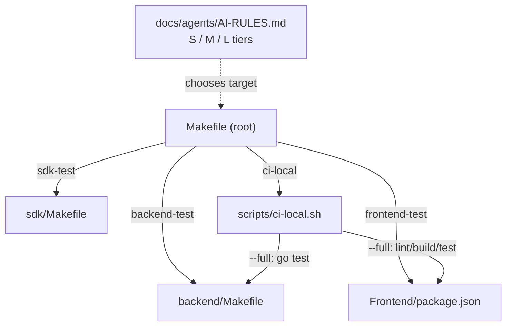
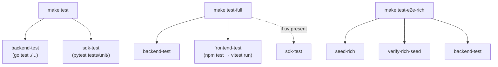
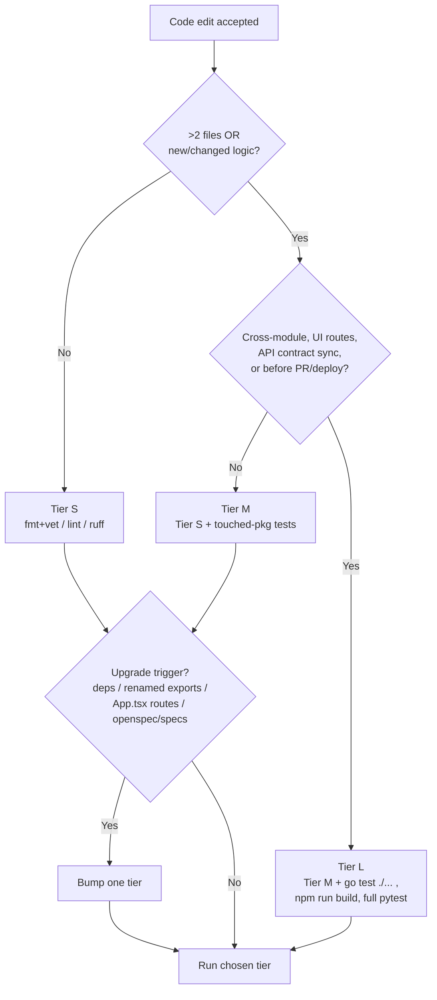
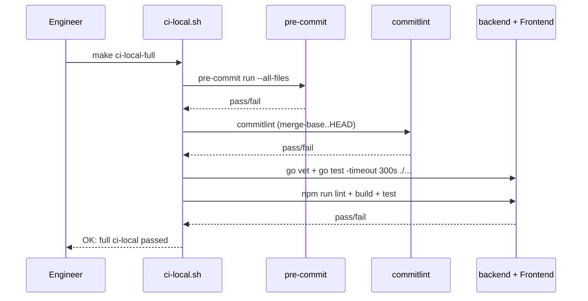
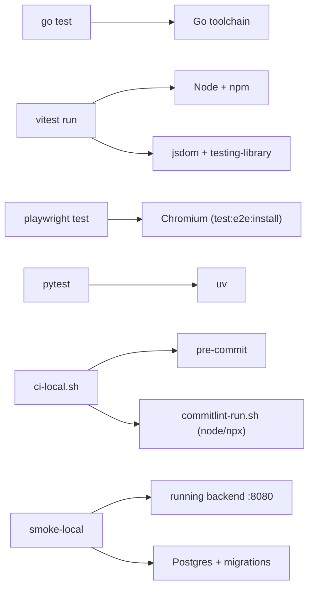

# Testing Strategy

<cite>
**Referenced Files in This Document**

- [backend/Makefile](file://backend/Makefile)
- [Frontend/package.json](file://Frontend/package.json)
- [Makefile](file://Makefile)
- [scripts/ci-local.sh](file://scripts/ci-local.sh)
- [docs/agents/AI-RULES.md](file://docs/agents/AI-RULES.md)
- [Frontend/vite.config.ts](file://Frontend/vite.config.ts)
- [Frontend/playwright.config.ts](file://Frontend/playwright.config.ts)
- [sdk/Makefile](file://sdk/Makefile)
- [backend/internal/postgres/fresh_db_integration_test.go](file://backend/internal/postgres/fresh_db_integration_test.go)
</cite>

## Table of Contents
1. [Introduction](#introduction)
2. [Project Structure](#project-structure)
3. [Core Components](#core-components)
4. [Architecture Overview](#architecture-overview)
5. [Detailed Component Analysis](#detailed-component-analysis)
6. [Dependency Analysis](#dependency-analysis)
7. [Performance Considerations](#performance-considerations)
8. [Troubleshooting Guide](#troubleshooting-guide)
9. [Conclusion](#conclusion)
10. [Appendices](#appendices)

## Introduction

`cyber-databrew` is a polyglot monorepo: a Go backend (`backend/`), a React 19 frontend (`Frontend/`), a Python SDK (`sdk/`), and supporting Python tooling (`dagster/`, seed and smoke scripts). Each language brings its own test runner, so the testing strategy is deliberately layered rather than monolithic. The same intent — "prove the change behaves before it merges" — is expressed through four distinct toolchains:

- **Backend** — Go's built-in `go test`, split into a fast default suite (`go test ./...`) and an opt-in integration suite gated behind the `integration` build tag.
- **Frontend** — Vitest for fast unit/component tests under jsdom, and Playwright for browser end-to-end (e2e) tests driven against a real dev server.
- **SDK** — `pytest`, run via `uv`, split into a unit suite (`tests/unit/`) and an all-tests target (`tests/`).
- **Cross-cutting smoke** — Bash and Python scripts that hit a running backend over HTTP (`smoke-local`, `api-guide-smoke`, `scenario-tags-bulk`), proving the deployed surface, not just the code.

These suites are stitched together by two layers of orchestration. The **root `Makefile`** exposes composite targets (`test`, `test-full`, `frontend-test`, `smoke`, `ci-local`) that fan out to per-module Makefiles. The **`docs/agents/AI-RULES.md`** verification tiers (S / M / L) tell an agent or engineer *which* of those targets to run for a given diff scope — a one-line fix runs `fmt`/`vet`/`lint` (Tier S), while any API contract change forces a full `go test ./...` + frontend `build` (Tier L).

This page is the map of that layering: who runs what, in what order, and which file defines each command.

**Section sources**
- [Makefile](file://Makefile#L1-L1)
- [docs/agents/AI-RULES.md](file://docs/agents/AI-RULES.md#L108-L120)

## Project Structure

Testing configuration is distributed across the modules it serves, with the root `Makefile` acting as the entry point that delegates downward. There is no single "test directory" — each runtime owns its own runner config:

- **`Makefile`** (root) — composite orchestration. Defines `test`, `test-full`, `frontend-test`, `backend-test`, `sdk-test`, `smoke`, `smoke-local`, `api-guide-smoke`, `scenario-tags-bulk`, `ci-local`, and `ci-local-full`. Each delegates to a module Makefile or a script.
- **`backend/Makefile`** — Go targets. `test` runs the default suite; `test-integration` adds the `integration` build tag; `fmt` and `vet` provide the lint-equivalent fast checks.
- **`Frontend/package.json`** — npm scripts. `test` runs Vitest once (`vitest run`); `test:coverage` adds V8 coverage; `test:e2e` runs Playwright; `test:e2e:install` provisions the Chromium browser; `lint` runs Biome.
- **`Frontend/vite.config.ts`** — Vitest configuration block: jsdom environment, `src/setupTests.ts` setup file, a 10s default `testTimeout`, and a coverage baseline with explicit excludes.
- **`Frontend/playwright.config.ts`** — Playwright config: e2e specs live in `./e2e`, the default `baseURL` is `http://localhost:5173` (overridable via `E2E_BASE_URL`), and the browser project is Desktop Chrome.
- **`sdk/Makefile`** — Python targets. `test` runs `pytest tests/unit/`; `test-all` runs `pytest tests/`; `validate` chains `lint → mypy → test → build → smoke-install`.
- **`scripts/ci-local.sh`** — the local CI gate that mirrors GitHub's pre-commit + commitlint checks, with a `--full` mode that additionally runs backend `go test` and frontend lint/build/test.
- **`docs/agents/AI-RULES.md`** — the policy layer defining the S/M/L verification tiers and the "always Tier L before PR/deploy" rule.



**Diagram sources**
- [Makefile](file://Makefile#L97-L162)
- [scripts/ci-local.sh](file://scripts/ci-local.sh#L70-L83)

**Section sources**
- [Makefile](file://Makefile#L90-L201)
- [backend/Makefile](file://backend/Makefile#L15-L19)
- [Frontend/package.json](file://Frontend/package.json#L6-L18)
- [sdk/Makefile](file://sdk/Makefile#L1-L29)

## Core Components

### Backend Go suite

The backend exposes two test targets. The default `test` target compiles and runs every package's `*_test.go` without build tags:

```
test:
	go test ./...
```

The `test-integration` target adds the `integration` build constraint, which compiles tests that are excluded from the default run:

```
test-integration:
	go test -tags=integration ./...
```

Integration tests opt in with a `//go:build integration` directive at the top of the file. For example, `backend/internal/postgres/fresh_db_integration_test.go` begins with that tag, so it only compiles under `make test-integration` — keeping the default `go test ./...` fast and free of database dependencies.

**Section sources**
- [backend/Makefile](file://backend/Makefile#L15-L19)
- [backend/internal/postgres/fresh_db_integration_test.go](file://backend/internal/postgres/fresh_db_integration_test.go#L1-L4)

### Frontend Vitest unit/component suite

The frontend `test` script runs Vitest once and exits (CI-friendly, no watch mode):

```
"test": "vitest run",
"test:coverage": "vitest run --coverage",
```

Vitest is configured inside `Frontend/vite.config.ts` under the `test:` block — it runs in a `jsdom` environment, loads `src/setupTests.ts` before each suite, applies a 10-second default `testTimeout`, and enables V8 coverage with `src/main.tsx`, test files, and `*.d.ts` excluded. Component tests use `@testing-library/react`; property-based tests are available through `@fast-check/vitest` and `fast-check` (declared in `devDependencies`).

**Section sources**
- [Frontend/package.json](file://Frontend/package.json#L10-L11)
- [Frontend/vite.config.ts](file://Frontend/vite.config.ts#L108-L120)
- [Frontend/package.json](file://Frontend/package.json#L34-L55)

### Frontend Playwright e2e suite

Browser e2e tests are run with Playwright:

```
"test:e2e": "playwright test",
"test:e2e:install": "playwright install --with-deps chromium",
```

`Frontend/playwright.config.ts` points `testDir` at `./e2e`, targets `baseURL` `http://localhost:5173` (the Vite dev server) unless `E2E_BASE_URL` overrides it, and runs the Desktop Chrome device profile. The `test:e2e:install` script provisions Chromium with its OS dependencies — required on a fresh machine or CI runner before the first e2e run.

**Section sources**
- [Frontend/package.json](file://Frontend/package.json#L16-L17)
- [Frontend/playwright.config.ts](file://Frontend/playwright.config.ts#L15-L30)

### SDK pytest suite

The SDK uses `pytest` driven through `uv`. The root Makefile's `sdk-test` target runs only the unit suite:

```
sdk-test:
	cd sdk && uv run pytest tests/unit/
```

`sdk/Makefile` offers a finer split: `test` runs `pytest tests/unit/ -v`, while `test-all` runs `pytest tests/ -v` (the full tree). The `validate` target chains `lint → mypy → test → build`, then smoke-installs the built wheel — the SDK's local equivalent of full CI parity. Unit tests cover the client, requestor, endpoints, managers, config, auth, and exceptions modules.

**Section sources**
- [Makefile](file://Makefile#L107-L108)
- [sdk/Makefile](file://sdk/Makefile#L6-L29)

### Smoke tests

Smoke tests prove a *running* backend, not just compiled code:

- `smoke-local` ensures migrations are applied, then runs `backend/scripts/smoke_actions_api.sh` against a backend on `:8080` (`DATABREW_TOKEN` defaults to `dev-token`).
- `smoke` is a guard target that prints guidance to use `smoke-local` (it requires Postgres + backend).
- `api-guide-smoke` runs `scripts/api-guide-smoke.sh` — curl checks aligned with `docs/review/api-guide.md`.
- `scenario-tags-bulk` runs a large-scale API-only scenario (tag → queries/run → delivery) against the hosted dev Cloud Run by default.

**Section sources**
- [Makefile](file://Makefile#L164-L188)

## Architecture Overview

The composite root targets define the fan-out topology. `test` is the minimal cross-language run (backend + SDK); `test-full` adds the frontend unit suite and runs the SDK only when `uv` is installed:

```
test: backend-test sdk-test

test-full: backend-test frontend-test
	@if command -v uv >/dev/null 2>&1; then $(MAKE) sdk-test; else echo "skip sdk-test (uv not installed)"; fi
```

`frontend-test` is its own target (`cd Frontend && npm test`) so it can be invoked independently. `test-e2e-rich` is a heavier composite that seeds a rich dataset, verifies it, then runs the full backend suite (`seed-rich verify-rich-seed backend-test`).



**Diagram sources**
- [Makefile](file://Makefile#L141-L162)

**Section sources**
- [Makefile](file://Makefile#L140-L162)
- [Makefile](file://Makefile#L97-L108)

## Detailed Component Analysis

### Test types, commands, and scope

The full matrix of how to invoke each suite and what it exercises:

| Test type | Command | Defined in | Scope |
|-----------|---------|-----------|-------|
| Backend unit/package | `make test` → `go test ./...` | [backend/Makefile](file://backend/Makefile#L15-L16) | All Go packages, no build tags; fast, no external deps |
| Backend integration | `make test-integration` → `go test -tags=integration ./...` | [backend/Makefile](file://backend/Makefile#L18-L19) | Adds `//go:build integration` tests (e.g. fresh-DB Postgres tests) |
| Backend fast lint | `make fmt && make vet` | [backend/Makefile](file://backend/Makefile#L21-L25) | `go fmt ./...` + `go vet ./...` |
| Frontend unit/component | `npm test` → `vitest run` | [Frontend/package.json](file://Frontend/package.json#L10) | jsdom component + lib tests, single run |
| Frontend coverage | `npm run test:coverage` | [Frontend/package.json](file://Frontend/package.json#L11) | Vitest + V8 coverage report |
| Frontend e2e | `npm run test:e2e` → `playwright test` | [Frontend/package.json](file://Frontend/package.json#L16) | Browser tests in `./e2e` against `:5173` |
| Frontend lint | `npm run lint` → `biome check src` | [Frontend/package.json](file://Frontend/package.json#L13) | Biome static checks |
| SDK unit | `make sdk-test` → `uv run pytest tests/unit/` | [Makefile](file://Makefile#L107-L108) | SDK unit tests (mock HTTP) |
| SDK full | `cd sdk && make test-all` → `pytest tests/` | [sdk/Makefile](file://sdk/Makefile#L9-L10) | Entire SDK test tree |
| SDK lint | `make sdk-lint` → `uv run ruff check src/` | [Makefile](file://Makefile#L110-L111) | Ruff static checks |
| Smoke (local) | `make smoke-local` | [Makefile](file://Makefile#L165-L167) | HTTP smoke vs backend on `:8080` |
| Smoke (api-guide) | `make api-guide-smoke` | [Makefile](file://Makefile#L173-L174) | curl checks aligned with api-guide.md |
| Bulk scenario | `make scenario-tags-bulk` | [Makefile](file://Makefile#L182-L188) | Large API-only tag→delivery flow |
| Local CI quick | `make ci-local` | [Makefile](file://Makefile#L148-L149) | pre-commit + commitlint |
| Local CI full | `make ci-local-full` | [Makefile](file://Makefile#L151-L152) | + backend `go test` + frontend lint/build/test |

**Section sources**
- [backend/Makefile](file://backend/Makefile#L15-L25)
- [Frontend/package.json](file://Frontend/package.json#L6-L18)
- [Makefile](file://Makefile#L104-L188)
- [sdk/Makefile](file://sdk/Makefile#L6-L10)

### Verification tiers (S / M / L)

`docs/agents/AI-RULES.md` defines a three-tier policy so that effort scales with diff scope. The rule is "after each accepted code edit, run the highest tier that applies":

- **Tier S (small)** — ≤2 files, no router/handler/middleware/OpenAPI changes, no shared types. Backend: `make fmt && make vet`. Frontend: `npm run lint`. SDK: `ruff check` on touched paths.
- **Tier M (medium)** — the default for most PRs; new/changed logic, >2 files, or packages that already have tests. Tier S plus the touched-package tests: backend `go test ./internal/foo/...`, frontend `npm run test -- --run`, SDK `pytest` for touched modules.
- **Tier L (large)** — cross-module changes, UI routes, *any* API contract sync, build/config changes, or before PR/deploy. Tier M plus the full suites: backend `go test ./...`, frontend `npm run build`, SDK full `pytest tests/unit/`.

Two hard rules constrain tier selection: **always Tier L before** opening a PR, running deploy verification, or touching off-limits-adjacent code; and several **upgrade triggers** bump one tier — changed `go.mod`/`package.json` deps, renamed exported symbols, modified `App.tsx` routes or shared `components/common/*`, and any edit under `openspec/specs/` (treated as Tier L outright).



**Diagram sources**
- [docs/agents/AI-RULES.md](file://docs/agents/AI-RULES.md#L110-L120)

**Section sources**
- [docs/agents/AI-RULES.md](file://docs/agents/AI-RULES.md#L108-L130)
- [docs/agents/AI-RULES.md](file://docs/agents/AI-RULES.md#L185-L193)

### Local CI flow (`ci-local.sh`)

`scripts/ci-local.sh` is the pre-push gate, mirroring the GitHub pre-commit + commitlint checks for faster feedback. It has three modes, selected by flag:

- **quick** (default) — `pre-commit run --all-files` then commitlint over the `merge-base(origin/main, HEAD)..HEAD` range.
- **`--pre-commit-only`** — stops after pre-commit.
- **`--full`** — adds backend `go vet ./...` + `go test -timeout 300s ./...`, then frontend `npm run lint && npm run build && npm run test`.

It hard-fails early if `pre-commit` is not installed, and resolves the commitlint base from `CI_LOCAL_BASE` / `origin/main` / `main`, with a `CL_LOCAL_RANGE` override for explicit pre-push ranges.



**Diagram sources**
- [scripts/ci-local.sh](file://scripts/ci-local.sh#L31-L85)

**Section sources**
- [scripts/ci-local.sh](file://scripts/ci-local.sh#L10-L85)
- [Makefile](file://Makefile#L148-L152)

## Dependency Analysis

Each suite carries its own toolchain dependency, and the orchestrator targets degrade gracefully when one is missing:



Key dependency facts drawn from the configs:

- The frontend test stack pins Vitest `^4.1.5`, `@vitest/coverage-v8`, `jsdom`, `@testing-library/react`, Playwright `^1.52.0`, and Biome `^2.0.4` in `devDependencies`.
- `test-full` checks `command -v uv` before running `sdk-test`, printing `skip sdk-test (uv not installed)` rather than failing — so the frontend+backend run still succeeds on a machine without `uv`.
- `ci-local.sh` requires `pre-commit` (hard fail with an install hint) and, for `--full`, `go` and `npm`.
- Playwright needs Chromium provisioned via `npm run test:e2e:install` before the first e2e run.
- Smoke tests require a *running* backend and applied migrations; `smoke-local` runs `backend/scripts/ensure_migrations.sh` first.

**Diagram sources**
- [Frontend/package.json](file://Frontend/package.json#L34-L55)
- [Makefile](file://Makefile#L158-L167)

**Section sources**
- [Frontend/package.json](file://Frontend/package.json#L34-L55)
- [Makefile](file://Makefile#L155-L167)
- [scripts/ci-local.sh](file://scripts/ci-local.sh#L33-L36)

## Performance Considerations

- **Default Go suite stays fast** by excluding integration tests behind the `integration` build tag. `go test ./...` compiles only non-tagged tests; the DB-dependent `fresh_db_integration_test.go` and peers compile only under `-tags=integration`. This keeps Tier M backend runs cheap.
- **`go test -timeout 300s`** in `ci-local.sh --full` caps total backend test time at five minutes, preventing a hung test from stalling the local gate.
- **Vitest runs once** (`vitest run`, not watch) for deterministic CI timing, with a 10-second per-test `testTimeout` in `vite.config.ts` so a stuck async assertion fails fast rather than hanging.
- **Tier scaling** is itself a performance control: it explicitly avoids running full `build` on every one-line fix, reserving `go test ./...` and `npm run build` for Tier L (PR/deploy). The "highest tier that applies" rule minimizes wasted CI cycles.
- **`ci-local.sh` quick mode** runs only pre-commit + commitlint (~1–3 min per the script header) for the common case, deferring the heavier `--full` parity run until actually needed.
- **Coverage is opt-in** (`test:coverage`), so the default `npm test` skips V8 instrumentation overhead.

**Section sources**
- [backend/Makefile](file://backend/Makefile#L15-L19)
- [scripts/ci-local.sh](file://scripts/ci-local.sh#L70-L75)
- [Frontend/vite.config.ts](file://Frontend/vite.config.ts#L108-L120)
- [docs/agents/AI-RULES.md](file://docs/agents/AI-RULES.md#L110-L111)

## Troubleshooting Guide

#### `make sdk-test` silently skipped under `test-full`
`test-full` only runs `sdk-test` when `uv` is on `PATH`; otherwise it prints `skip sdk-test (uv not installed)` and continues. If you expected SDK tests to run, install `uv` (`make sdk-install` uses `uv sync --dev`) and re-run, or invoke `cd sdk && make test` directly.

#### `make ci-local` fails immediately with an install hint
The script hard-exits if `pre-commit` is not found. Install it: `pip install pre-commit==3.7.1`, then re-run. For `--full`, also ensure `go` and `npm` are present.

#### commitlint "no base" error
`ci-local.sh` resolves its base from `CI_LOCAL_BASE` → `origin/main` → `main`. If none resolve, it errors and tells you to fetch your base branch (`git fetch origin main && git branch -u origin/main main`) or set `CI_LOCAL_BASE=origin/your-base`. The `subject-case` rule requires the commit subject (first line) to be entirely lower-case.

#### Integration tests don't run under `make test`
That is by design — they carry `//go:build integration`. Run `make test-integration` (`go test -tags=integration ./...`) to include them. They typically need a database (e.g. the fresh-DB Postgres tests).

#### Playwright cannot launch a browser
Run `npm run test:e2e:install` first (`playwright install --with-deps chromium`). Confirm a dev server is reachable at the `baseURL` (`http://localhost:5173`) or set `E2E_BASE_URL` to point at another target.

#### Smoke test 500s or connection refused
`smoke-local` needs a backend on `:8080` and applied migrations. It runs `ensure_migrations.sh` first; if the API still errors, check `DATABREW_TOKEN` (defaults to `dev-token`) and that Postgres is up. Per the field pitfalls, use payloads that satisfy DB CHECK constraints — an invalid value produces a DB error that masks the real failure.

#### Vitest test times out at ~10s
The default `testTimeout` is 10,000 ms (`vite.config.ts`). A genuinely slow async path should be awaited correctly or given an explicit per-test timeout rather than raising the global default.

**Section sources**
- [Makefile](file://Makefile#L155-L167)
- [scripts/ci-local.sh](file://scripts/ci-local.sh#L33-L62)
- [backend/internal/postgres/fresh_db_integration_test.go](file://backend/internal/postgres/fresh_db_integration_test.go#L1-L4)
- [Frontend/playwright.config.ts](file://Frontend/playwright.config.ts#L15-L30)
- [docs/agents/AI-RULES.md](file://docs/agents/AI-RULES.md#L204-L207)

## Conclusion

`cyber-databrew` tests at four layers — Go unit/integration, frontend Vitest + Playwright, SDK pytest, and HTTP smoke — composed by root `Makefile` targets and gated locally by `ci-local.sh`. The S/M/L verification tiers in `docs/agents/AI-RULES.md` turn this into a discipline: run the cheapest check that proves the change, escalate to a full `go test ./...` + frontend `build` whenever an API contract or cross-module surface is touched, and always run Tier L before a PR or deploy. The single most important invariant for new tests is matching the existing split — keep the default suites fast (DB-heavy Go tests behind the `integration` tag; e2e behind Playwright) so the common Tier S/M loop stays quick.

## Appendices

### Appendix A — Composite Make targets

| Target | Expands to | Source |
|--------|-----------|--------|
| `test` | `backend-test sdk-test` | [Makefile](file://Makefile#L155) |
| `test-full` | `backend-test frontend-test` (+ `sdk-test` if `uv`) | [Makefile](file://Makefile#L158-L159) |
| `frontend-test` | `cd Frontend && npm test` | [Makefile](file://Makefile#L161-L162) |
| `backend-test` | `cd backend && make test` | [Makefile](file://Makefile#L97-L98) |
| `sdk-test` | `cd sdk && uv run pytest tests/unit/` | [Makefile](file://Makefile#L107-L108) |
| `test-e2e-rich` | `seed-rich verify-rich-seed backend-test` | [Makefile](file://Makefile#L141) |
| `ci-local` | `bash scripts/ci-local.sh` | [Makefile](file://Makefile#L148-L149) |
| `ci-local-full` | `bash scripts/ci-local.sh --full` | [Makefile](file://Makefile#L151-L152) |

### Appendix B — Per-module test commands

| Module | Unit | Integration / e2e | Lint |
|--------|------|-------------------|------|
| Backend (Go) | `go test ./...` | `go test -tags=integration ./...` | `go fmt ./...` + `go vet ./...` |
| Frontend (TS) | `vitest run` | `playwright test` | `biome check src` |
| SDK (Python) | `pytest tests/unit/` | `pytest tests/` (test-all) | `ruff check src/` |

### Appendix C — Verification tier quick reference

| Tier | Backend | Frontend | SDK |
|------|---------|----------|-----|
| S | `make fmt && make vet` | `npm run lint` | `ruff check src/` (touched) |
| M | + `go test ./path/to/pkg/...` | + `npm run test -- --run` | + `pytest` touched |
| L | + `go test ./...` | + `npm run build` | + full `pytest tests/unit/` |

**Section sources**
- [Makefile](file://Makefile#L97-L162)
- [backend/Makefile](file://backend/Makefile#L15-L25)
- [Frontend/package.json](file://Frontend/package.json#L10-L17)
- [sdk/Makefile](file://sdk/Makefile#L6-L10)
- [docs/agents/AI-RULES.md](file://docs/agents/AI-RULES.md#L189-L193)
