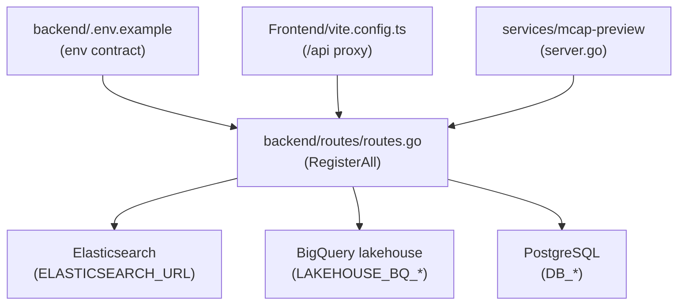
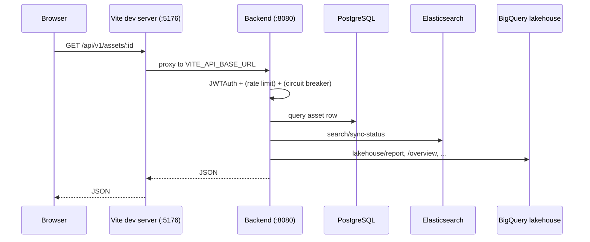
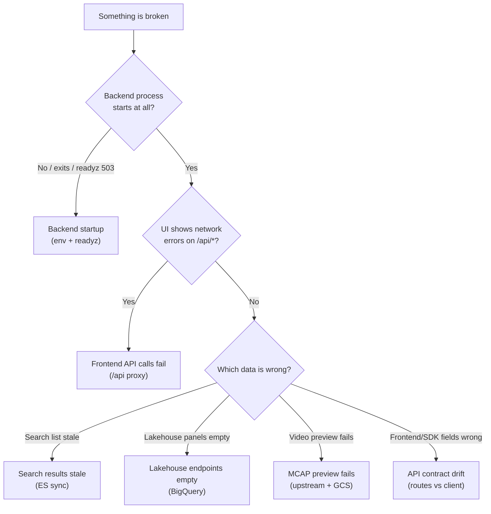
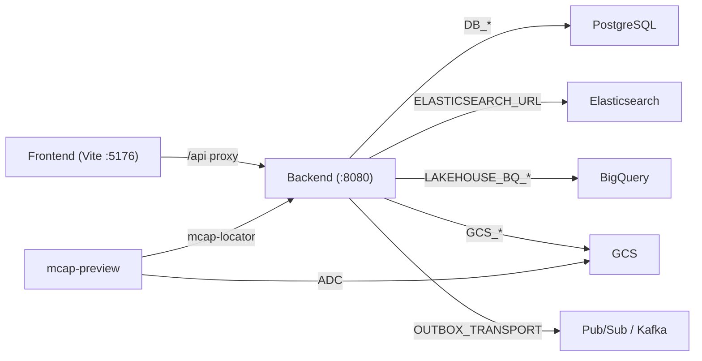

# Troubleshooting

<cite>
**Referenced Files in This Document**
- [backend/.env.example](file://backend/.env.example)
- [Frontend/vite.config.ts](file://Frontend/vite.config.ts)
- [backend/routes/routes.go](file://backend/routes/routes.go)
- [services/mcap-preview/README.md](file://services/mcap-preview/README.md)
- [services/mcap-preview/internal/server/server.go](file://services/mcap-preview/internal/server/server.go)
</cite>

## Table of Contents
1. [Introduction](#introduction)
2. [Project Structure](#project-structure)
3. [Core Components](#core-components)
4. [Architecture Overview](#architecture-overview)
5. [Detailed Component Analysis](#detailed-component-analysis)
6. [Dependency Analysis](#dependency-analysis)
7. [Performance Considerations](#performance-considerations)
8. [Troubleshooting Guide](#troubleshooting-guide)
9. [Conclusion](#conclusion)
10. [Appendices](#appendices)

## Introduction

This page is the operator-facing diagnostic reference for `cyber-databrew`. It
collects the concrete failure modes that surface across the four runtime
subsystems — the Go backend (Gin) under `backend/`, the React/Vite frontend
under `Frontend/`, the Elasticsearch-backed search layer, the BigQuery-backed
lakehouse analytics layer, and the standalone `mcap-preview` Go service under
`services/mcap-preview/` — and ties every symptom back to a real configuration
key, route, or proxy rule in the source tree.

The guiding principle here is *code-grounded diagnosis*: every "check" in this
document points at an environment variable that the process actually reads, an
HTTP route that is actually registered, or a proxy target that the dev server
actually uses. Nothing in this page is a hypothetical knob. When a symptom is
described, the fix references the exact file and line range where the relevant
behavior lives, so an operator can verify the wiring rather than guess at it.

The intended audience is anyone running the stack locally (via the Vite dev
server proxying to a Go backend on `:8080`), anyone running the backend against
real GCP infrastructure (BigQuery, GCS, Pub/Sub, Elasticsearch), and anyone
debugging the `mcap-preview` service either locally or behind the developer
gateway.

**Section sources**
- [backend/.env.example](file://backend/.env.example#L1-L9)
- [Frontend/vite.config.ts](file://Frontend/vite.config.ts#L7-L9)

## Project Structure

The troubleshooting surface spans four directories, each owning one subsystem.
The relevant files are:

- **`backend/.env.example`** — the canonical list of every environment variable
  the backend reads. Server port, storage backend, PostgreSQL connection,
  lakehouse/BigQuery configuration, Elasticsearch URL, the outbox relay/ES
  subscriber transport knobs, GCS buckets, Pub/Sub topics, the static
  `DATABREW_TOKEN`, rate limiting, circuit breaker, and logging all live here.
- **`Frontend/vite.config.ts`** — defines the dev server port (`5176`), the
  `/api` proxy target, and the build chunking. When the UI cannot reach the API,
  the cause is almost always in this proxy block.
- **`backend/routes/routes.go`** — the single `RegisterAll` function that wires
  every HTTP route in the backend process. Health/readiness, auth, assets,
  MCAP, deliveries, registry, search, lakehouse, admin, pipeline, workflow, and
  query routes are all registered here. The exact path of any "404" can be
  confirmed against this file.
- **`services/mcap-preview/README.md`** and
  **`services/mcap-preview/internal/server/server.go`** — the preview service's
  documented endpoints/config plus the actual Gin wiring, token extraction, and
  upstream-locator fetch logic.

**Diagram sources**
- [backend/.env.example](file://backend/.env.example#L21-L36)
- [backend/routes/routes.go](file://backend/routes/routes.go#L44-L102)
- [Frontend/vite.config.ts](file://Frontend/vite.config.ts#L56-L65)
- [services/mcap-preview/internal/server/server.go](file://services/mcap-preview/internal/server/server.go#L98-L103)

**Section sources**
- [backend/.env.example](file://backend/.env.example#L1-L126)
- [backend/routes/routes.go](file://backend/routes/routes.go#L40-L102)

## Core Components

The diagnostic surface depends on four wiring points that every failure scenario
traces back to.

**Health and readiness endpoints.** The backend registers three infrastructure
endpoints that are intentionally outside the API auth and circuit-breaker
groups: `GET /healthz`, `GET /readyz`, and `GET /version`, plus `GET /metrics`
and `GET /swagger/*any`. `readyz` runs a PostgreSQL ping with a 5-second timeout
and reports lakehouse configuration; it returns `503` when PG is unhealthy or
unconfigured. These are the first three things to probe when "the backend is
down".

**The `/api/v1` route group.** Everything functional is mounted under
`/api/v1` behind `middleware.JWTAuth`, and (optionally) the circuit breaker.
Asset, MCAP, delivery, registry, search, lakehouse, pipeline, workflow, and
query routes all hang off this group.

**The Vite `/api` proxy.** The frontend never talks to the backend directly in
dev; it talks to the Vite dev server on port `5176`, which proxies `/api` to
`VITE_API_BASE_URL` (defaulting to `http://localhost:8080`) with
`changeOrigin: true`.

**The mcap-preview upstream call.** The preview service is a thin proxy: it
validates the asset id, extracts a Databrew token, then calls
`{UPSTREAM_BASE_URL}/api/v1/assets/{id}/mcap-locator` upstream and propagates
the upstream status verbatim.

**Section sources**
- [backend/routes/routes.go](file://backend/routes/routes.go#L96-L101)
- [backend/routes/routes.go](file://backend/routes/routes.go#L189-L193)
- [Frontend/vite.config.ts](file://Frontend/vite.config.ts#L56-L65)
- [services/mcap-preview/internal/server/server.go](file://services/mcap-preview/internal/server/server.go#L307-L320)

## Architecture Overview

Requests flow front-to-back through a fixed chain. In local development, the
browser hits the Vite dev server, which proxies `/api/*` to the backend. The
backend authenticates the request, applies optional rate limiting and circuit
breaking, then dispatches to a domain handler that may fan out to PostgreSQL,
Elasticsearch, or BigQuery. The `mcap-preview` service sits beside the backend,
calling it over HTTP to resolve the MCAP locator before reading bytes from GCS.

**Diagram sources**
- [Frontend/vite.config.ts](file://Frontend/vite.config.ts#L56-L65)
- [backend/routes/routes.go](file://backend/routes/routes.go#L74-L94)
- [backend/routes/routes.go](file://backend/routes/routes.go#L189-L265)

**Section sources**
- [backend/routes/routes.go](file://backend/routes/routes.go#L74-L94)

## Detailed Component Analysis

This section enumerates the six dominant failure scenarios. Each one follows a
**symptoms → checks → fix** structure and cites the exact configuration key or
route involved.

### Diagnosis decision tree

Start here. The flowchart routes a symptom to the correct subsection below.

**Diagram sources**
- [backend/routes/routes.go](file://backend/routes/routes.go#L96-L101)
- [Frontend/vite.config.ts](file://Frontend/vite.config.ts#L56-L65)

#### Backend startup

**Symptoms.** The backend process exits on launch, refuses connections on the
expected port, or `GET /readyz` returns `503 Service Unavailable` with a `pg`
check marked `unhealthy`. The UI then shows nothing but proxy errors.

**Checks.**

1. Confirm `PORT` and `ENV`. The default is `PORT=8080` and `ENV=development`.
   If `PORT` is changed, the Vite proxy target must change to match (see
   [Frontend API calls fail](#frontend-api-calls-fail)).
2. Confirm `STORAGE_BACKEND=postgres` — only `postgres` is supported, so a
   different value is a misconfiguration.
3. Verify the PostgreSQL connection variables. For local direct connections use
   `DB_HOST=localhost` / `DB_PORT=5432`; via PgBouncer use `DB_HOST=pgbouncer`
   / `DB_PORT=6432`. Also check `DB_USER`, `DB_PASSWORD`, and `DB_NAME`
   (`cyber_databrew_dev` by default).
4. Probe readiness: `curl -i http://localhost:8080/readyz`. The handler runs a
   PostgreSQL ping under a 5-second timeout; if `pgPing` is nil or returns an
   error, the `pg` check is `unhealthy` and the whole response is `503`.

**Fix.** Bring PostgreSQL up and align the `DB_*` values with it. A `503` from
`/readyz` with `"pg": {"status": "unhealthy"}` is a database connectivity
problem, not an application bug — fix the connection string or start the DB.
`/healthz` (which always returns `200 {"status":"ok"}`) staying green while
`/readyz` is red is the signature of a reachable-but-not-ready backend, i.e.
the process is up but cannot serve data.

**Section sources**
- [backend/.env.example](file://backend/.env.example#L1-L19)
- [backend/routes/routes.go](file://backend/routes/routes.go#L96-L99)
- [backend/routes/routes.go](file://backend/routes/routes.go#L381-L417)

#### Frontend API calls fail

**Symptoms.** The UI loads but every data call fails — network errors, `502`
from the dev server, or requests that never reach the backend. The dev server
banner printed at startup shows the API target it will proxy to.

**Checks.**

1. Read the dev banner. On startup the Vite server prints
   `UI: http://127.0.0.1:<port>/` and `API: <target> (via /api proxy)`. The
   port is fixed at `5176` (`strictPort: true`), so if `5176` is occupied the
   dev server fails to start rather than picking another port.
2. Confirm the proxy target. The proxy target is
   `process.env.VITE_API_BASE_URL || "http://localhost:8080"`. If the backend
   runs on a non-default port, `VITE_API_BASE_URL` must be set, or the proxy
   sends traffic to the wrong place.
3. Confirm the `/api` rule itself. The dev server proxies `/api` to that target
   with `changeOrigin: true`. Calls whose path does not start with `/api` are
   not proxied and will hit the Vite server directly (and 404).
4. If targeting the Cloud Run dev backend, the banner tip points at
   `npm run dev:remote`; using the wrong run mode points the proxy at the local
   `:8080` that is not running.

**Fix.** Either start the backend on `:8080` or set `VITE_API_BASE_URL` to the
correct backend origin before launching Vite. Because `strictPort` is `true`,
free port `5176` if the dev server refuses to start. Verify the resolved target
matches the running backend by reading the printed `API:` line.

**Section sources**
- [Frontend/vite.config.ts](file://Frontend/vite.config.ts#L7-L9)
- [Frontend/vite.config.ts](file://Frontend/vite.config.ts#L24-L48)
- [Frontend/vite.config.ts](file://Frontend/vite.config.ts#L56-L65)

#### Search results stale

**Symptoms.** Newly created or updated assets do not appear in search results,
or appear after a delay. The search index lags the source-of-truth tables in
PostgreSQL.

**Checks.**

1. Confirm Elasticsearch is reachable. The backend uses
   `ELASTICSEARCH_URL=http://localhost:9200`. If the dev cluster runs with
   `xpack.security.enabled=true`, `ELASTICSEARCH_USERNAME` /
   `ELASTICSEARCH_PASSWORD` must be set or every ES call is rejected.
2. Inspect sync state via the registered endpoints. The search handler (when
   wired) exposes `GET /api/v1/search/sync-status` and
   `GET /api/v1/search/sync-progress`. The latter surfaces `consumer_lag`
   derived from the `es_sync_checkpoint` table.
3. Examine the outbox relay + ES subscriber transport. `OUTBOX_TRANSPORT`
   selects `internal` (in-process, default), `pubsub`, or `kafka`. With
   `internal`, `OUTBOX_RELAY_ENABLED` and `OUTBOX_ES_SUBSCRIBER_ENABLED` gate
   whether events flow from the outbox into ES at all; both default to `false`
   in the example, so a stack that never enables them will never index.
4. For throughput stalls, check the subscriber knobs:
   `OUTBOX_INTERNAL_SUBSCRIBER_WORKERS` (default 8, routes by `asset_id` FNV %
   workers so per-asset order is preserved), `OUTBOX_INTERNAL_BUS_BUFFER`
   (default 1024), `OUTBOX_INTERNAL_SUBSCRIBER_BATCH_SIZE` (default 1), and
   `OUTBOX_INTERNAL_SUBSCRIBER_BATCH_WAIT_MS` (default 0).
5. If lag never drains, check `OUTBOX_ES_CHECKPOINT_IDLE_AFTER_SEC` (idle-shard
   advance) and `OUTBOX_ES_CHECKPOINT_SHARDS` (default 16) — these back the
   `consumer_lag` reported by `/search/sync-progress`.

**Fix.** Ensure ES is reachable (and authenticated if security is on), then
enable the relay and subscriber (`OUTBOX_RELAY_ENABLED=true`,
`OUTBOX_ES_SUBSCRIBER_ENABLED=true`) and watch `consumer_lag` via
`/api/v1/search/sync-progress` trend to zero. For persistent backlog, raise
`OUTBOX_INTERNAL_SUBSCRIBER_WORKERS` toward 16–32 and set
`OUTBOX_INTERNAL_SUBSCRIBER_BATCH_SIZE` (e.g. 50) to coalesce events; an admin
reindex (`POST /api/v1/admin/search/reindex`) rebuilds the index when the
checkpoint is unrecoverable.

**Section sources**
- [backend/.env.example](file://backend/.env.example#L32-L90)
- [backend/routes/routes.go](file://backend/routes/routes.go#L246-L250)
- [backend/routes/routes.go](file://backend/routes/routes.go#L267-L278)

#### Lakehouse endpoints empty

**Symptoms.** Analytics panels (overview, asset growth, event-daily, quality
distribution, failure clusters, customer replay) render empty, or the lakehouse
endpoints return empty payloads. `GET /readyz` shows a `lakehouse` check block
but the data panels stay blank.

**Checks.**

1. Confirm the backend selected a lakehouse backend. `LAKEHOUSE_BACKEND` is
   `bigquery` by default but can be `none`; when it is empty or `none`,
   `readyz` does *not* emit the `lakehouse` configured block, and the lakehouse
   handler is effectively disabled.
2. Confirm BigQuery target identifiers. `LAKEHOUSE_BQ_PROJECT` must be set
   (the example ships it empty) and `LAKEHOUSE_BQ_DATASET` defaults to
   `lakehouse_bronze`. A blank project means queries cannot resolve a dataset.
3. Confirm the report file path. `LAKEHOUSE_REPORT_PATH` defaults to
   `../deploy/local/iceberg/notebooks/lakehouse_report.json`. The comment in
   the env file is explicit: when running the backend inside a container this
   host-relative path will not exist and must be overridden or mounted (e.g.
   `/var/lakehouse/lakehouse_report.json`). `GET /api/v1/lakehouse/report`
   reads this file.
4. Confirm the endpoints are actually mounted. The lakehouse routes are only
   registered when `lakehouseHandler != nil`. The registered set includes
   `/lakehouse/report`, `/status`, `/sync-status`, `/sync-progress`,
   `/failure-clusters`, `/overview`, `/asset-growth`, `/tables`,
   `/event-daily`, `/event-type-share`, `/quality-distribution`, and
   `/customer-replay`.
5. Check `readyz` output: when lakehouse is configured, `readyz` echoes the
   resolved `backend`, `project`, and `dataset`, which is the fastest way to
   confirm what the process actually parsed.

**Fix.** Set `LAKEHOUSE_BACKEND=bigquery`, populate `LAKEHOUSE_BQ_PROJECT`, and
ensure `LAKEHOUSE_REPORT_PATH` points at a file that exists in the runtime
(mount it for containers). Verify GCP credentials are present
(`GOOGLE_APPLICATION_CREDENTIALS` or ADC). Then re-probe `/readyz` to confirm
the `lakehouse` block shows the expected `project`/`dataset`, and reload
`/api/v1/lakehouse/overview`.

**Section sources**
- [backend/.env.example](file://backend/.env.example#L21-L30)
- [backend/.env.example](file://backend/.env.example#L122-L123)
- [backend/routes/routes.go](file://backend/routes/routes.go#L252-L265)
- [backend/routes/routes.go](file://backend/routes/routes.go#L402-L409)

#### MCAP preview fails

**Symptoms.** The video preview returns `401`, `503`, `502`, `415`, or `422`;
the manifest endpoint errors; or the upstream call to the backend fails. The
preview service is the `mcap-preview` Go service under `services/mcap-preview/`.

**Checks.**

1. Confirm the token. The preview service extracts a Databrew token from one of
   three transports: the `X-Databrew-Token` header, the `?databrew_token=`
   query param (because an HTML `<video>` element cannot send headers), or the
   `databrew_session` cookie. A missing token yields `401` with
   `missing X-Databrew-Token`.
2. Confirm `UPSTREAM_BASE_URL`. It is required for the manifest and must point
   at the backend root *without* `/api/v1` (e.g.
   `http://cyber-databrew-backend:8080`). When unset, the manifest handler
   returns `503` `upstream not configured`. When the OpenMCAP reader is not
   configured, it returns `503` `mcap reader not configured`.
3. Confirm the upstream locator resolves. The service calls
   `GET {UPSTREAM_BASE_URL}/api/v1/assets/{id}/mcap-locator`. Upstream `4xx`/
   `5xx` are propagated verbatim (status + `code`/`message`/`details`); a pure
   transport failure becomes `502 BadGateway`. So a `404` from preview usually
   means the asset's locator 404'd upstream.
4. Confirm GCS access. The reader uses Application Default Credentials. In GKE,
   the pod's service account needs `roles/storage.objectViewer`. Reader paging
   is tuned via `GCS_PAGE_SIZE_BYTES` (default 1048576) and
   `GCS_PAGE_CACHE_BYTES` (default 67108864).
5. For `segment.mp4` specifically, codec-related errors are expected and
   documented: `415 UNSUPPORTED_PREVIEW_CODEC` when the message `format` is not
   `h264`, `422 PREVIEW_NO_SPS_PPS` when the first IDR lacks SPS/PPS NALUs, and
   `422 NO_PREVIEW_TOPIC` when no `foxglove.CompressedVideo` channel exists.
6. Confirm the asset id shape. The handler enforces `^[A-Za-z0-9_-]{1,128}$`;
   anything else is rejected as `invalid asset id` before any upstream call.

**Fix.** Set `UPSTREAM_BASE_URL` (no `/api/v1` suffix) and pass a valid token
on one of the three accepted transports. For locator `404`s, fix the asset
upstream rather than the preview service. For GCS errors, attach Workload
Identity / ADC with `storage.objectViewer`. `415`/`422` codec errors are
content problems in the source MCAP, not service misconfiguration.

**Section sources**
- [services/mcap-preview/README.md](file://services/mcap-preview/README.md#L117-L131)
- [services/mcap-preview/internal/server/server.go](file://services/mcap-preview/internal/server/server.go#L194-L210)
- [services/mcap-preview/internal/server/server.go](file://services/mcap-preview/internal/server/server.go#L246-L301)
- [services/mcap-preview/internal/server/server.go](file://services/mcap-preview/internal/server/server.go#L307-L348)

#### API contract drift

**Symptoms.** The frontend or SDK calls an endpoint that returns `404`, or a
handler param name does not match the route. New routes appear unreachable, or a
batch/custom-method path is malformed.

**Checks.**

1. Treat `backend/routes/routes.go` as the single source of truth for the wire
   contract. Every route lives inside `RegisterAll`; if a path is not there, it
   does not exist server-side.
2. Watch for conditionally-registered groups. Several route families register
   only when their handler is non-nil: search (`searchHandler != nil`),
   lakehouse (`lakehouseHandler != nil`), eval (`evalHandler != nil`),
   algo-runs, pipeline-components, and backfill. A `404` on these often means
   the handler was not wired in this build, not that the path is wrong.
3. Watch for admin/internal gating. Admin (`/api/v1/admin/...`) and internal
   (`/api/v1/internal/...`, `/internal/commit-segments`) routes register only
   when `adminRoutesEnabled` is true, which depends on `ADMIN_TOKEN` (empty =
   admin routes disabled, per the env comment). These return `404` when
   disabled, not `401`.
4. Mind custom-method syntax. Batch operations use the colon syntax —
   `POST /api/v1/assets:batch_get`, `POST /api/v1/metrics:search`,
   `POST /api/v1/assets:batch_delete`. A client that URL-encodes the colon or
   inserts a slash will miss the route.
5. Confirm the auth surface. Public auth routes are `POST /api/v1/auth/login`,
   `POST /api/v1/auth/email-login`; protected ones are
   `GET /api/v1/auth/me` and `POST /api/v1/auth/logout` behind `JWTAuth`. The
   rest of `/api/v1` is behind `JWTAuth` as a group.

**Fix.** Diff the client's expected path against the registered route literal in
`routes.go`. For conditionally-mounted families, confirm the corresponding
handler is constructed and passed into `RegisterAll`; for admin/internal paths,
set `ADMIN_TOKEN`. Keep custom-method colons unescaped on the wire.

**Section sources**
- [backend/routes/routes.go](file://backend/routes/routes.go#L107-L160)
- [backend/routes/routes.go](file://backend/routes/routes.go#L194-L213)
- [backend/routes/routes.go](file://backend/routes/routes.go#L246-L285)
- [backend/routes/routes.go](file://backend/routes/routes.go#L369-L372)

## Dependency Analysis

The subsystems form a directed dependency graph. The frontend depends on the
backend through the `/api` proxy; the backend depends on PostgreSQL (mandatory),
Elasticsearch (search), BigQuery (lakehouse), GCS (object bytes), and Pub/Sub /
Kafka (outbox transport, optional). The `mcap-preview` service depends on the
backend (for the locator) and on GCS (for MCAP bytes). A fault in a dependency
propagates upward as a visible UI or preview failure.

**Diagram sources**
- [backend/.env.example](file://backend/.env.example#L10-L101)
- [Frontend/vite.config.ts](file://Frontend/vite.config.ts#L56-L65)
- [services/mcap-preview/internal/server/server.go](file://services/mcap-preview/internal/server/server.go#L307-L320)

**Section sources**
- [backend/.env.example](file://backend/.env.example#L10-L101)

## Performance Considerations

Several failures present as performance problems rather than hard errors, and
the relevant tunables are all environment-driven.

- **Search indexing throughput.** The internal subscriber parallelism is set by
  `OUTBOX_INTERNAL_SUBSCRIBER_WORKERS` (default 8), batched by
  `OUTBOX_INTERNAL_SUBSCRIBER_BATCH_SIZE` (default 1; recommend 50 in steady
  state) and `OUTBOX_INTERNAL_SUBSCRIBER_BATCH_WAIT_MS` (default 0; recommend
  25 to coalesce spikes). Raising batch size directly trades latency for
  throughput; per-asset ordering is preserved because routing pins each
  `asset_id` to one worker.
- **Relay batching.** `OUTBOX_RELAY_BATCH_SIZE` (200) and
  `OUTBOX_RELAY_INTERVAL_MS` (500) govern how aggressively the relay drains the
  outbox; `OUTBOX_RELAY_PARALLEL_KEYS` (8) controls concurrent ordering-key
  groups per flush.
- **MCAP preview I/O.** The GCS page-cached reader collapses many small
  read+seek calls into a handful of Range GETs; `GCS_PAGE_SIZE_BYTES` and
  `GCS_PAGE_CACHE_BYTES` size that cache. The in-process reader cache
  (`MCAPReaderCacheTTL`, default 5 minutes) keeps a warmed reader across
  requests; a negative TTL disables it.
- **Rate limiting and circuit breaking.** `RATE_LIMIT_RPS` (per-IP, 0 disables)
  and the circuit breaker (`CB_ENABLED`, `CB_WINDOW_SEC`, `CB_THRESHOLD`,
  `CB_COOLDOWN_SEC`) can themselves cause apparent "failures" (`429`/breaker
  open) under load — the circuit breaker is deliberately scoped to API routes
  only so `/healthz`, `/readyz`, and `/metrics` stay reachable when it is open.

**Section sources**
- [backend/.env.example](file://backend/.env.example#L45-L81)
- [backend/.env.example](file://backend/.env.example#L107-L115)
- [backend/routes/routes.go](file://backend/routes/routes.go#L79-L94)
- [services/mcap-preview/internal/server/server.go](file://services/mcap-preview/internal/server/server.go#L78-L88)

## Troubleshooting Guide

A condensed first-response runbook, ordered by how fast each probe is:

1. **Is the backend ready?** `curl -i http://localhost:8080/healthz` then
   `/readyz`. `healthz` green + `readyz` red = PG connectivity problem.
2. **Is the proxy pointed correctly?** Read the Vite startup banner's `API:`
   line; it prints the resolved `VITE_API_BASE_URL` (or the
   `http://localhost:8080` default).
3. **Is search lagging?** `GET /api/v1/search/sync-progress` and check
   `consumer_lag`; confirm `OUTBOX_RELAY_ENABLED` /
   `OUTBOX_ES_SUBSCRIBER_ENABLED` are on.
4. **Are lakehouse panels empty?** Re-probe `/readyz` for the `lakehouse`
   block; confirm `LAKEHOUSE_BQ_PROJECT` is set and `LAKEHOUSE_REPORT_PATH`
   exists in the runtime.
5. **Does preview fail?** Confirm `UPSTREAM_BASE_URL` (no `/api/v1`) and a token
   on a supported transport; remember `4xx`/`5xx` are passed through from the
   backend locator.
6. **Does a client get a 404?** Diff the path against `routes.go`; check whether
   the handler family is conditionally registered or admin-gated by
   `ADMIN_TOKEN`.

**Section sources**
- [backend/routes/routes.go](file://backend/routes/routes.go#L96-L101)
- [backend/routes/routes.go](file://backend/routes/routes.go#L246-L285)
- [backend/.env.example](file://backend/.env.example#L21-L43)
- [services/mcap-preview/README.md](file://services/mcap-preview/README.md#L117-L131)

## Conclusion

Every failure mode in `cyber-databrew` reduces to a small number of verifiable
wiring points: the `DB_*`/`LAKEHOUSE_*`/`ELASTICSEARCH_URL`/`OUTBOX_*`
environment keys the backend reads, the `/api` proxy target in the Vite config,
the route literals registered in `RegisterAll`, and the `UPSTREAM_BASE_URL` +
token contract of the preview service. When diagnosing, resist guessing — probe
`/healthz`/`/readyz`, read the Vite banner, query the sync-progress endpoints,
and diff against `routes.go`. Each of these is grounded in the source files
cited throughout this page.

## Appendices

### A. Key environment variables (backend)

| Var | Default | Subsystem |
|---|---|---|
| `PORT` | `8080` | Server |
| `ENV` | `development` | Server |
| `STORAGE_BACKEND` | `postgres` | Storage |
| `DB_HOST` / `DB_PORT` | `localhost` / `5432` | PostgreSQL |
| `LAKEHOUSE_BACKEND` | `bigquery` | Lakehouse |
| `LAKEHOUSE_BQ_PROJECT` | *(empty)* | Lakehouse |
| `LAKEHOUSE_BQ_DATASET` | `lakehouse_bronze` | Lakehouse |
| `LAKEHOUSE_REPORT_PATH` | `../deploy/local/iceberg/notebooks/lakehouse_report.json` | Lakehouse |
| `ELASTICSEARCH_URL` | `http://localhost:9200` | Search |
| `OUTBOX_TRANSPORT` | `internal` | Search relay |
| `ADMIN_TOKEN` | *(empty = admin disabled)* | Admin |

**Section sources**
- [backend/.env.example](file://backend/.env.example#L1-L93)

### B. Key health/diagnostic endpoints

| Endpoint | Auth | Purpose |
|---|---|---|
| `GET /healthz` | none | Always `200 {"status":"ok"}` |
| `GET /readyz` | none | PG ping + lakehouse config; `503` if PG unhealthy |
| `GET /version` | none | Build version/commit/time |
| `GET /metrics` | none | Prometheus metrics |
| `GET /api/v1/search/sync-progress` | JWT | `consumer_lag` from `es_sync_checkpoint` |
| `GET /api/v1/lakehouse/report` | JWT | Reads `LAKEHOUSE_REPORT_PATH` |

**Section sources**
- [backend/routes/routes.go](file://backend/routes/routes.go#L96-L101)
- [backend/routes/routes.go](file://backend/routes/routes.go#L246-L265)

### C. mcap-preview config and error codes

| Var | Default | Notes |
|---|---|---|
| `PORT` | `8090` | HTTP listen port |
| `UPSTREAM_BASE_URL` | *(required)* | Backend root, **no** `/api/v1` |
| `DATABREW_TOKEN_PASSTHROUGH` | `true` | Forward token upstream |
| `GCS_PAGE_SIZE_BYTES` | `1048576` | Range reader page size |
| `GCS_PAGE_CACHE_BYTES` | `67108864` | Per-reader cache footprint |

Endpoint-specific errors: `415 UNSUPPORTED_PREVIEW_CODEC`,
`422 PREVIEW_NO_SPS_PPS`, `422 NO_PREVIEW_TOPIC`.

**Section sources**
- [services/mcap-preview/README.md](file://services/mcap-preview/README.md#L117-L131)
- [services/mcap-preview/README.md](file://services/mcap-preview/README.md#L111-L115)
</content>
