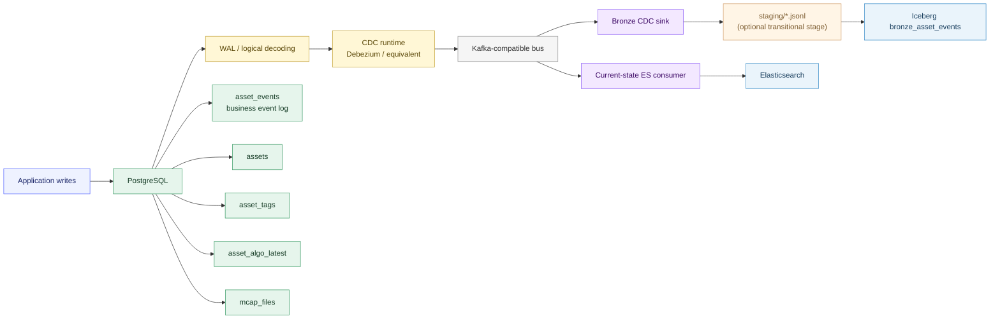

# Design Doc: `asset_events` -> Iceberg Bronze and current-state CDC -> Elasticsearch

| Field | Value |
|---|---|
| Status | Proposed |
| Author | Platform |
| Last updated | 2026-04-30 |
| Scope | Backend sync architecture, CDC pipeline, local Iceberg/MinIO/Trino stack |
| Related | [`data-platform-design.md`](./data-platform-design.md) · [`outbox-worker-design.md`](./outbox-worker-design.md) · [`sql.md`](./sql.md) §4.5 · [`schema-reference.md`](./schema-reference.md) · [`next-steps-tasks.md`](./next-steps-tasks.md) |

---

## 1. Decision

This document defines the **long-term** sync architecture.

The chosen direction is:

1. **Iceberg Bronze consumes `asset_events` from PostgreSQL WAL/CDC**
2. **Elasticsearch consumes current-state table changes from PostgreSQL WAL/CDC**
3. **The current PostgreSQL schema is left intact in the first migration phase**
4. **The current ES app-level worker remains temporarily during migration, but is not the target architecture**

In one sentence:

> **Iceberg = business event history from `asset_events` INSERT CDC**  
> **ES = current-state search documents from `assets + asset_tags + asset_algo_latest + mcap_files` CDC**  
> **Both use WAL/CDC ordering, not SQL polling over `event_seq`.**

This is the target architecture, not the first incremental implementation.

---

## 2. Constraints

### 2.1 Hard constraint

The PostgreSQL schema must not be changed casually.

That means the first long-term migration slice must avoid:

- adding a new `asset_search_projection` table
- rewriting `asset_events` columns immediately
- forcing a cross-table migration before CDC adoption

### 2.2 Current reality

Today the repository already has:

- `asset_events` as the unified business event / outbox table
- `assets`, `asset_tags`, `asset_algo_latest`, `mcap_files` as current-state tables
- an ES-specific `ESWorker`
- a `BronzeSink` JSONL writer and `bronze_merge.py`, but no runtime Bronze producer

---

## 3. Why not app-level SQL polling

The rejected Bronze design was:

- query PostgreSQL directly
- read `asset_events WHERE event_seq > cursor`
- add `created_at < now() - safety_lag`
- write staging files
- advance cursor to the largest observed `event_seq`

This is not a strict no-loss protocol because:

- `event_seq` is allocated by a sequence
- sequence allocation order is **not** commit order
- one transaction can hold `event_seq=100` and commit late
- another can hold `event_seq=101` and commit early
- a polling worker can see `101` first and advance past `100`

No amount of `safety_lag` turns that into a strict no-loss protocol. It only reduces the chance of missing late commits. For Bronze, which is supposed to be replayable history, that is not acceptable as the final design.

Therefore:

> **The Bronze sync path must not derive correctness from SQL polling over `event_seq`.**

Correct ordering must come from:

- PostgreSQL WAL
- logical decoding
- CDC checkpoints (LSN / connector offsets)

Official references:

- PostgreSQL logical decoding  
  https://www.postgresql.org/docs/current/logicaldecoding-explanation.html
- Debezium PostgreSQL connector  
  https://debezium.io/documentation/reference/stable/connectors/postgresql.html

---

## 4. Long-term architecture

---

## 5. Source semantics by sink

### 5.1 Iceberg Bronze source

Bronze consumes:

- `asset_events`
- **INSERT messages only**

Bronze ignores:

- `UPDATE publish_state`
- `UPDATE retry_count`
- `UPDATE last_error`
- `UPDATE published_at`

These are sink-local ES bookkeeping details, not business history facts.

So for Bronze, `asset_events` means:

- one inserted row = one business event
- append-only historical source
- replay / audit / training candidate source

### 5.2 Elasticsearch source

Elasticsearch does **not** consume `asset_events` in the long-term design.

It consumes current-state changes derived from:

- `assets`
- `asset_tags`
- `asset_algo_latest`
- `mcap_files`

This is because ES wants:

- latest document state
- low-latency upsert
- current searchable shape

It does not want:

- historical event replay
- event-history semantics

---

## 6. Component selection

### 6.1 Preferred stack

Preferred long-term stack:

1. **PostgreSQL logical decoding / WAL**
2. **Debezium PostgreSQL connector**
3. **Kafka-compatible durable bus**
4. **Iceberg sink** for `asset_events`
5. **Custom Go ES consumer** for current-state table changes

Why:

- WAL/CDC gives commit-order semantics
- connector offsets own the transport checkpoint
- the bus supports multiple sinks naturally
- Iceberg Bronze can stay append-only
- ES current-state projection remains application-specific

### 6.2 Why not a generic Elasticsearch sink

We intentionally do **not** choose a generic ES sink as the primary ES long-term path because ES documents are not row-shaped.

An ES document depends on multiple current-state tables:

- `assets`
- `asset_tags`
- `asset_algo_latest`
- `mcap_files`

A generic sink would either:

- mirror row changes one table at a time
- or require non-trivial connector-side joins/transforms

The repository already has a correct document builder:

- [backend/internal/searchindex/builder.go](/Users/rick/Databricks4robot-longterm-sync/backend/internal/searchindex/builder.go)

So the lighter and safer design is:

> **CDC tells us which asset IDs are affected**  
> **Go consumer rebuilds the final ES doc using the existing builder**

### 6.3 Acceptable equivalent

If Kafka/Debezium is not the final implementation, the required property is still:

> **commit-ordered WAL-derived change events**

Acceptable equivalents include:

- Flink CDC
- managed CDC services
- cloud-native WAL replication products

The vendor can change. The correctness property cannot.

---

## 7. Data contracts

### 7.1 `asset_events`

In the long-term design, `asset_events` is interpreted as:

- immutable business event log
- `event_seq` = domain dedup key
- `event_seq` is not the transport checkpoint key

Current schema columns such as:

- `publish_state`
- `retry_count`
- `last_error`
- `published_at`

may continue to exist during migration for the ESWorker, but Bronze CDC must ignore those update messages.

### 7.2 `bronze_asset_events`

`bronze_asset_events` stores the immutable event stream with:

- `event_id`
- `event_seq`
- `event_type`
- `aggregate_type`
- `payload_schema_version`
- `asset_id`
- `mcap_file_id`
- `tenant_id`
- `project_id`
- `event_source`
- `event_payload`
- `occurred_at`
- `created_at`

Optional technical metadata:

- `_source_lsn`
- `_cdc_emitted_at`
- `_staging_file`
- `_merged_at`

### 7.3 Current-state CDC contract for ES

The ES consumer treats the following tables as current-state sources:

- `assets`
- `asset_tags`
- `asset_algo_latest`
- `mcap_files`

Affected asset resolution:

- `assets` change -> rebuild that `asset_id`
- `asset_tags` change -> rebuild that `asset_id`
- `asset_algo_latest` change -> rebuild that `asset_id`
- `mcap_files` change -> look up `assets` by `mcap_file_id`, rebuild each affected asset

This contract avoids any PostgreSQL schema change and still gives ES a current-state source of truth.

---

## 8. Bronze sink design

### 8.1 Source

Bronze source is:

- WAL / logical decoding stream
- filtered to `asset_events`
- insert messages only

### 8.2 Transport checkpoint

Checkpoint key is:

- LSN
- or CDC consumer offset

It is explicitly **not**:

- `event_seq`
- `created_at`
- any SQL polling cursor

### 8.3 Write modes

Two acceptable write modes:

#### Mode A: direct sink to Iceberg

- CDC consumer writes directly to `bronze_asset_events`

#### Mode B: staging + merge

- CDC consumer writes staging files
- `bronze_merge.py` merges / appends to Bronze

Because the current repository already has:

- `BronzeSink`
- `bronze_merge.py`

**Mode B is the preferred transitional implementation in this codebase.**

### 8.4 Dedup

Even with CDC, Bronze still dedups by `event_seq`.

Why:

- sink retries
- merge retries
- replay
- restart after partial success

So:

> **LSN / offset = transport checkpoint**  
> **`event_seq` = business dedup key**

---

## 9. Elasticsearch consumer design

### 9.1 Consumer responsibility

The ES consumer:

1. receives CDC events from current-state tables
2. computes affected `asset_id` set
3. rebuilds the final ES document using the existing Go builder
4. upserts or deletes the ES document

It does not:

- replay raw business events
- infer current state from Bronze
- depend on Bronze progress

### 9.2 Why rebuilding in Go is acceptable

The repository already contains a correct current-state document assembler:

- [backend/internal/searchindex/builder.go](/Users/rick/Databricks4robot-longterm-sync/backend/internal/searchindex/builder.go)

Using a Go consumer to call that builder:

- avoids adding a new PostgreSQL projection table
- avoids complex connector-side multi-table transforms
- keeps ES document shape definition close to application code

### 9.3 Long-term reindex semantics

In the long-term design, `reindex` should rebuild ES from current-state tables, not from event replay.

That means:

- `reindex` remains valid even if Bronze is unavailable
- ES and Bronze stay semantically independent

---

## 10. Migration path from the current repository

### Phase 0: keep current ESWorker

Do not break the running ES path.

Current state remains:

- `ESWorker`
- `publish_state='pending'`
- `MarkPublishedAndAdvanceCursor`
- `outbox_dlq`

### Phase 1: bring Bronze online with CDC

First practical slice:

1. start CDC stream from PostgreSQL
2. filter `asset_events`
3. accept INSERT messages only
4. write staging files in commit order
5. run `bronze_merge.py`
6. validate Bronze counts and replay

No PostgreSQL schema change required for this phase.

### Phase 2: build ES CDC consumer alongside ESWorker

Second practical slice:

1. consume current-state table CDC
2. derive affected `asset_id`s
3. rebuild ES docs using `searchindex.Builder`
4. dual-run with the existing ESWorker
5. compare ES output / counts / spot-check documents

No PostgreSQL schema change required for this phase either.

### Phase 3: switch ES primary sync to CDC consumer

After dual-run validation:

- stop using the ESWorker as the primary sync path
- keep `reindex` available
- leave `asset_events` as Bronze history input

### Phase 4: clean up sink-local state coupling

At this stage decide one of:

#### Option A
Keep the current mutable sink bookkeeping in `asset_events` for compatibility, but treat it as legacy implementation detail.

#### Option B
Refactor sink-local bookkeeping entirely out of `asset_events` and make the table fully immutable in storage as well as semantics.

**Option B is the preferred end state, but is not required for the first CDC migration slices.**

---

## 11. What explicitly does not happen in this design

The long-term design does **not** require:

- SQL polling over `event_seq > cursor`
- `created_at < now() - safety_lag`
- a new PostgreSQL `asset_search_projection` table in the first implementation phase
- ES reading from `asset_events`
- Iceberg depending on `publish_state`

---

## 12. Risks and mitigations

| Risk | Impact | Mitigation |
|---|---|---|
| CDC stack is operationally heavier than app-level polling | more infra | introduce after ES MVP is stable |
| `asset_events` still contains mutable sink fields during migration | semantic confusion | Bronze consumes INSERT business events only |
| current-state ES needs multi-table projection | custom logic required | use Go consumer + existing `searchindex.Builder` |
| dual-run period has two ES sync paths | complexity | explicitly treat CDC consumer as shadow mode until validation completes |

---

## 13. Final recommendation

If the requirement is:

> “Do not casually change PostgreSQL schema, but move to a correct long-term architecture”

then the recommended plan is:

1. **Keep `asset_events` for Iceberg Bronze**
2. **Consume `asset_events` from WAL/CDC, INSERT only**
3. **Stop using `asset_events` as the long-term primary source for ES**
4. **Build ES from CDC changes on current-state tables using a custom Go consumer**
5. **Reuse the existing `searchindex.Builder` instead of inventing a new PG projection table immediately**

In one line:

> **Iceberg keeps business event semantics; ES consumes current-state semantics; both become WAL/CDC-driven without forcing immediate PostgreSQL schema change.**
