# 数据平台方案设计

本文是机器人多模态 资产平台的整体方案设计，包含背景、目标、架构、核心表与字段、数据同步机制、API、部署、可靠性、监控与实施计划。

---

## 1. 背景

- **数据形态**：MCAP 文件（Foxglove 容器格式，传感器 + 视频多模态时序），所有数据采集到算法处理都围绕 MCAP。
- **用户角色**：内部算法用户（生产消费）+ 外部客户（接收处理后产物）。
- **平台定性**：**数据资产化管理 + 处理与交付**。
- **机器人形态**：当前以 AV 切入，长期需覆盖机械臂、人形、四足、室内导航 —— 因此行业语义字段（city / weather / scenario_type）**不写入主表**，统一进 tag 系统。

---

## 2. 问题现状

| 问题 | 现状 | 本方案如何解决 |
| --- | --- | --- |
| 资产定义模糊 | 老 grace 系统把 video / 处理状态 / 派生产物揉在一起 | §5.1 重新明确 `mcap_file / asset / segment / file` 概念 |
| 算法用户手工轮代码 | 上下游就绪靠脚本轮询 PG | §5.6.2 outbox + 事件驱动，用户用 SDK 等事件 |
| 缺触发机制 | 没有"上游完成 → 自动触发下游" | §5.6.2 outbox + Worker 事件驱动 |
| Video 是最小粒度 | 业务逻辑直接绑定在 video 实体的接口层 | §5.1 资产化 + §5.5 SDK 抽象，接口层退化为 CRUD |
| 无统一检索 | 多表 JOIN 才能查派生产物/标签/QA | §5.6.1 ES 投影 + §5.2 投影表 |
| 无多模态检索 | 找不到"相似片段" | 3.x 候选：向量检索（具体引擎届时再选型） |

典型业务问题与回答路径：

| 业务问题 | 解决路径 |
| --- | --- |
| 某次训练用了哪些 asset | `training_runs` → `dataset_snapshots.manifest_uri` → Iceberg gold 明细 |
| 某算法版本变更后哪些 asset 要重刷 | Trino 查 Iceberg `gold_recompute_candidates` |
| 某 tag 何时被算法追加 | `asset_events` (event_type=tag_upserted) → Iceberg 长期 |
| 上月所有 MCAP segment 质量分布 | Trino + Iceberg silver/gold |
| 某客户交付能否完整回放 | PG `deliveries.replay_manifest_uri` + Iceberg delivery_items 明细 |

---

## 3. 目标

| 目标 | 落地承诺 |
| --- | --- |
| **算法用户零感知底层** | Python SDK `grace_sdk`，`asset.get(id)` / `asset.stream(topic)` 一行拿到所有 |
| **资产即一等公民** | 主键 `asset_id`；`asset_tags / asset_algo_latest / asset_events` 投影 |
| **统一元数据底座** | PG 主库 + ES 检索 + Iceberg 历史 |
| **事件驱动数据链路** | `asset_events` outbox + Go worker（30s 轮询，分钟级延迟） |
| **多维检索** | Tag 过滤 / 全文 / 向量（Phase 2+） |
| **强追溯/审计** | `asset_events` 全量事件流 |
| **MCAP 原生** | SDK 走 HTTP Range Request 流式读，不下整文件 |

### 3.1 非目标

| 非目标 | 原因 |
| --- | --- |
| 多租户 / RLS / `tenant_id` | 当前是单业务、单实例形态，多租户会显著放大 schema、权限、审计、计费复杂度；2.0 也不引入 |
| 实时秒级湖仓 | Iceberg 入湖按 5–10 min batch 已满足训练 / 分析需求；秒级实时只在 ES 通道兜底，不在湖仓承诺 |
| OLTP 全量替代分析查询 | PG 不背分析负载，分析查询走 Trino + Iceberg；想跑大宽表全量扫描不要打到 PG |
| 自建 CDC 管道 | 不引 Debezium / Kafka / Flink，复杂度回报不成正比；走 Outbox + 自写 Worker 方案 |
| 客户公网 API / 外部租户接入 | 当前无外部入口，所有访问都在内网 + SSO 之内 |
| 多模态向量库 | 3.x 才评估，1.0 / 2.0 不绑定 pgvector / Milvus / Lance 任一选型 |
| 跨区域 / 跨云强一致 | 单区域单云足够；真有跨区域写场景另写独立 ADR |
| 容量规划 / RTO / RPO 数值承诺 | 走独立 Capacity / SRE 文档，本设计不承诺具体数值 |
| Runbook / oncall 轮值 / RACI | 走 SRE 与运营手册，本设计只做架构 |
| 物理性能调优（PG 参数 / JVM / GC 等） | 由运维迭代，不是设计决策 |

> **维护规则**：以上每条由"未来计划"明确转正后，对应"非目标"行删除并迁到 §3 目标 / §9 实施计划。

---

## 4. 整体架构

### 4.1 平台能力总览

下图描述数据采集流程、算法处理与平台服务的整体关系：上游数据采集（grace 数采链路）经过 QA 后落地为有效 segment；触发算法处理；处理结果通过统一抽象服务暴露给算法用户、前端、外部交付。

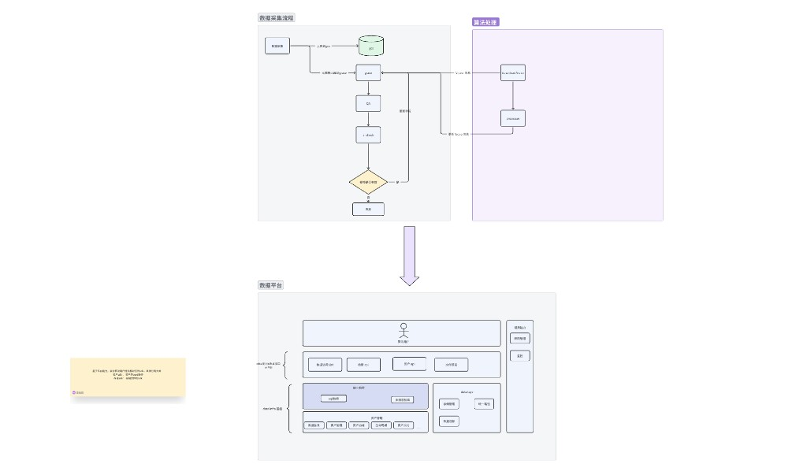

### 4.2 架构演进路线（1.0 → 3.1）

下图描述数据平台从单库直连演进到统一元数据层的四个阶段：

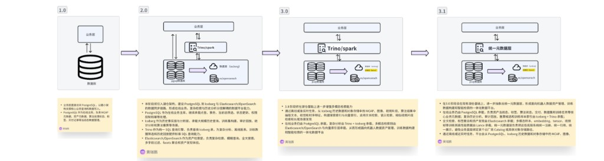

| 阶段 | 形态 | 关键变化 |
| --- | --- | --- |
| 1.0 | 业务层 + PostgreSQL | 单库直连，所有业务/分析共用 PG；`asset_tags / asset_algo_latest / asset_events` 投影 + 事件表已建已用，但无下游同步 |
| 2.0 | + Outbox Worker + Elasticsearch + Iceberg + Trino | 启用 Outbox Worker（30s 纯轮询），PG 事件流推动 ES / Iceberg 派生；检索与分析分流，PG 只承担在线业务 |
| 3.0 | + 统一元数据层（Catalog 抽象） | 跨引擎对象中立注册（catalog_objects）+ 版本引用，业务表不再绑定物理路径或厂商 ID，支持上云不重构 |

当前位置：**1.0**（仅 PostgreSQL 单库 + Backend，2.0 尚未启动）。

| 维度 | 现状（1.0） | 下一步（→ 2.0） |
| --- | --- | --- |
| 主库 | PostgreSQL；`asset_tags / asset_algo_latest` 投影表 + `asset_events` 事件表**已建已用** | 同 PG，继续提升高频 JSONB 字段为标量列 |
| 检索 | 无；列表筛选直接查 PG | 引入 Elasticsearch + 后端 `/api/v1/search/assets` |
| 湖仓 | 无 | 引入 Iceberg REST Catalog + Trino，PG → Bronze → Silver → Gold |
| 数据同步 | `asset_events` 已在线写入，但无下游消费 | 启用 Outbox Worker（30s 纯轮询）同步 ES / Iceberg |
| JSONB 兼容列 | `cf_meta / cf_algo / cf_tag` 保留，仅作兼容 / 回滚路径 | 投影表稳定后逐步停写 |
| 多模态 / Catalog 抽象 | 无 | 3.0 阶段，Phase 2 之后 |

### 4.3 运行时数据流

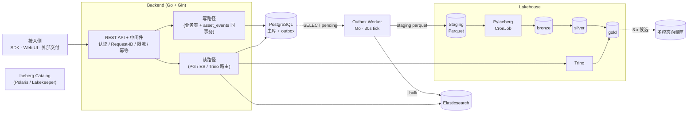
```mermaid
flowchart LR
    Users[接入侧<br>SDK · Web UI · 外部交付]

    subgraph BE["Backend (Go + Gin)"]
        direction TB
        API[REST API + 中间件<br>认证 / Request-ID / 限流 / 幂等]
        WR["写路径<br>(业务表 + asset_events 同事务)"]
        RD["读路径<br>(PG / ES / Trino 路由)"]
        API --> WR
        API --> RD
    end

    PG[(PostgreSQL<br>主库 + outbox)]
    Worker[Outbox Worker<br>Go · 30s tick]
    ES[(Elasticsearch)]

    subgraph Lake[Lakehouse]
        direction LR
        Staging[(Staging<br>Parquet)] --> Cron[PyIceberg<br>CronJob]
        Cron --> Bronze[(bronze)] --> Silver[(silver)] --> Gold[(gold)]
        Trino[Trino] --> Gold
    end
    Catalog["Iceberg Catalog<br>(Polaris / Lakekeeper)"]

    Users --> API
    WR --> PG
    PG -. SELECT pending .-> Worker
    Worker -- _bulk --> ES
    Worker -- staging parquet --> Staging
    RD --> PG
    RD --> ES
    RD --> Trino
    Gold -.->|3.x 候选| Vec[(多模态向量库)]
```

### 4.4 分层职责

| 层级 | 组件 | 职责 |
| --- | --- | --- |
| 在线业务层 | PostgreSQL | 点查、事务、当前态筛选、状态机、权限、幂等；权威主库 |
| 检索层 | Elasticsearch | 模糊查询、全文检索、多字段过滤、facets、资产发现 |
| Catalog 控制面 | Iceberg REST Catalog + PG Platform Catalog | 湖表事务、metadata pointer、跨引擎对象的中立引用 |
| 湖仓层 | Iceberg | 历史事实、训练集、审计回放、统计分析、重算 |
| 查询层 | Trino | 查询 Iceberg，服务复杂分析与离线报表 |
| 计算层（TDO） | PyIceberg + k8s CronJob | 周期性 MERGE / compact / Bronze→Silver→Gold transformation；不引入 Spark / Dagster |
| 异步派生通道 | Outbox + Worker（Go） | PG 主库变更 → ES / 湖仓 / 向量库的事件驱动同步（30s 轮询，分钟级延迟） |
| 多模态层（Phase 3.x 候选） | 待定 | AI 多模态样本处理、向量 / 张量存储；3.x 启动前再选型 |

设计约定：PostgreSQL 表结构先保障在线业务，再通过事件流（`asset_events` outbox）支撑 ES 与 Iceberg；任何外部数据对象都通过中立 Catalog 引用而非物理路径绑定。

---

## 5. 详细设计

### 5.1 资产概念定义

资产化管理的核心：**给每一份回传数据创建唯一 `asset_id`，解析元信息形成资产；元数据 + 原始数据 + 关联数据三段式**。

#### 物理 vs 业务划分

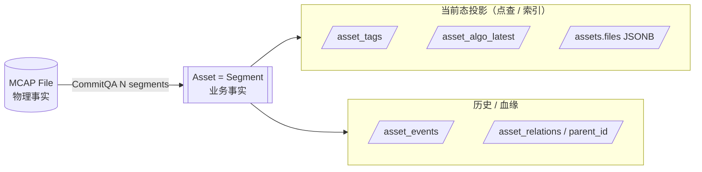
```mermaid
flowchart LR
    MCAP[(MCAP File<br>物理事实)] -->|CommitQA N segments| Asset[[Asset = Segment<br>业务事实]]

    subgraph Cur[当前态投影（点查 / 索引）]
        Tags[/"asset_tags"/]
        Algo[/"asset_algo_latest"/]
        Files[/"assets.files JSONB"/]
    end

    subgraph Hist[历史 / 血缘]
        Events[/"asset_events"/]
        Relations[/"asset_relations / parent_id"/]
    end

    Asset --> Cur
    Asset --> Hist
```

#### 资产分层

| 概念 | 表 | 关系 |
| --- | --- | --- |
| 物理文件 | `mcap_files` | 1 |
| 业务资产 | `assets` (asset_type=segment / clip / frame_set / derived_asset) | 1 → N segment |
| 资产血缘 | `assets.parent_asset_id` 或 `asset_relations` | N → N |
| 派生文件 | `assets.files` JSONB（key=algo@ver, value=URI） | 1 → N |

资产生命周期状态机（`assets.lifecycle_state`）：

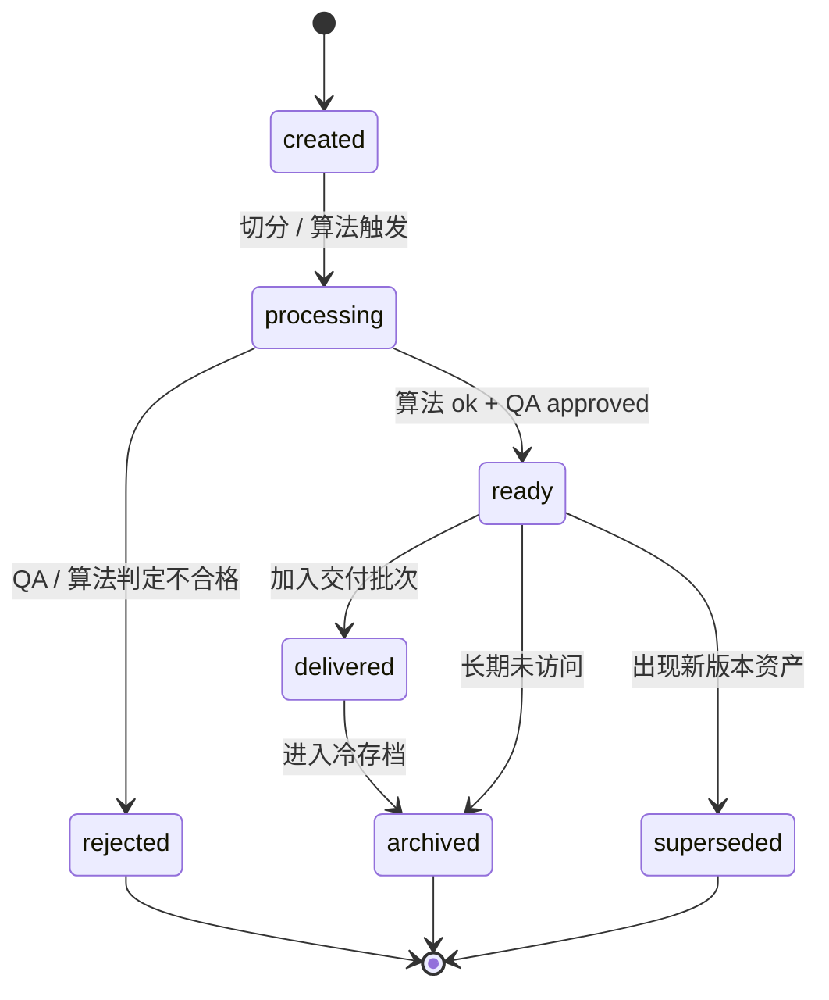
```mermaid
stateDiagram-v2
    [*] --> created
    created --> processing: 切分 / 算法触发
    processing --> ready: 算法 ok + QA approved
    processing --> rejected: QA / 算法判定不合格
    ready --> delivered: 加入交付批次
    ready --> superseded: 出现新版本资产
    delivered --> archived: 进入冷存档
    ready --> archived: 长期未访问
    rejected --> [*]
    archived --> [*]
    superseded --> [*]
```

| 状态 | 含义 |
| --- | --- |
| created | 资产刚建好，未开始处理 |
| processing | 算法/切分流水线在跑 |
| ready | 已就绪，可供检索/交付/训练 |
| rejected | QA 或算法判定不合格 |
| delivered | 已交付给至少一个客户 |
| archived | 进入冷存档，不参与在线检索 |
| superseded | 被新版本资产替代（rework） |

任何状态转移必须**同事务**追加一条 `asset_events`（event_type=`asset_lifecycle_changed`），否则审计链断裂。

---

### 5.2 资产字段设计

#### 5.2.1 表清单与上线优先级

| 表 | 优先级 | 主键 | 一句话职责 |
| --- | --- | --- | --- |
| `mcap_files` | 🟢 Tier 1 已实现 | `mcap_file_id` | 原始 MCAP 文件当前态 |
| `assets` | 🟢 Tier 1 已实现 | `asset_id` | 资产当前态（segment / clip / frame_set / derived_asset） |
| `deliveries` | 🟢 Tier 1 已实现 | `delivery_id` | 客户交付批次当前态 |
| `delivery_items` | 🟢 Tier 1 已实现 | `(delivery_id, asset_id)` | Delivery ↔ Asset M:N 明细 |
| `idempotency_keys` | 🟢 Tier 1 已实现 | `(scope, idem_key)` | API 幂等保护 |
| `asset_tags` | 🟡 Tier 2 上线前 | `(asset_id, tag_key)` | tag 当前态投影，驱动 facet/filter/ES 文档 |
| `asset_algo_latest` | 🟡 Tier 2 上线前 | `(asset_id, algo_name)` | 每 (asset, algo) 最新一行算法状态 |
| `asset_events` | 🟡 Tier 2 上线前 | `event_id`（UNIQUE `event_seq`） | 统一业务事件 / 审计 / outbox |
| `asset_relations` | 🟠 Tier 3 可选 | `(parent_asset_id, child_asset_id, relation_type)` | 多父 / 融合 / 拼接血缘 |
| `datasets` / `dataset_snapshots` | 🔵 Tier 4 Phase 2 | 见后 | 数据集定义与训练快照 |
| `training_runs` | 🔵 Tier 4 Phase 2 | `training_run_id` | 训练任务记录（自包含 catalog 引用） |
| `catalog_objects` / `catalog_object_versions` | 🔵 Tier 4 Phase 2 | 见后 | 中立对象与版本注册 |

⛔ **不做**：`feature_sets / feature_jobs / training_sample_exports` 字段未冻结，落地前重新评审。

#### 5.2.2 字段设计原则（关键四条）

1. **高频过滤字段必须列化**：`asset_type / lifecycle_state / start_timestamp_ns / end_timestamp_ns / duration_ms / created_at` 一律真实列。JSONB 只放低频扩展。
2. **行业语义不焊主表**：视频 的 `city / weather / scenario_type / quality_level` 必须进 `asset_tags`，由统一的 tag 注册表声明。机械臂/人形/四足以同样方式扩展，不需要改主表 schema。
3. **外部数据对象用 Catalog 引用**：训练任务 / 数据集快照 / 导出表都引用 `catalog_name + namespace + object_name + version_ref` 四元组，**不直接绑物理路径或厂商 ID**，避免上云锁死。
4. **本方案不引入多租户能力**：所有表按单实例单业务设计，不带 `tenant_id / project_id`、不做 RLS、不按租户 routing。如未来需要多租户，作为独立专项重新评审，避免现在引入冗余字段。

#### 5.2.3 mcap_files —— 原始 MCAP 文件当前态

| 字段 | 类型 | 必填 | 说明 |
| --- | --- | --- | --- |
| mcap_file_id | UUID | 是 | 文件主键 |
| raw_hash_md5 | TEXT | 否 | 文件 MD5；`is_deleted=FALSE` 范围 UNIQUE，重复 ingest 走幂等 |
| raw_hash_sha256 | TEXT | 否 | 长期内容指纹 |
| mcap_uri | TEXT | 是 | MCAP 对象存储地址 |
| size_bytes | BIGINT | 否 | 文件大小 |
| file_duration_ms | BIGINT | 否 | 文件总时长 |
| start_timestamp_ns / end_timestamp_ns | BIGINT | 否 | 文件起止时间 |
| channel_count / chunk_count | INT | 否 | MCAP 结构摘要 |
| ingest_state | TEXT | 是 | pending / ingesting / ready / failed |
| vendor_id / collector_id / task_id / device_id | TEXT | 否 | 采集 provenance |
| camera_model / data_source / location_id / scene_id / environment_id / collection_method | TEXT | 否 | 采集环境 |
| owner | TEXT | 否 | 数据归属方 |
| retention_tier | TEXT | 否 | hot / warm / cold / archive |
| expire_at | TIMESTAMPTZ | 否 | 过期/可清理时间 |
| metadata | JSONB | 是 | 低频扩展元数据 |
| process_state | JSONB | 是 | 文件级处理状态扩展 |
| is_deleted | BOOLEAN | 是 | 软删除 |
| created_at / updated_at | TIMESTAMPTZ | 是 | 时间戳 |
| version | BIGINT | 是 | 乐观锁版本 |

#### 5.2.4 assets —— 资产当前态

行业相关 facet（city / weather / scenario_type 等）**不进本表**，统一进 `asset_tags`。

| 字段 | 类型 | 必填 | 说明 |
| --- | --- | --- | --- |
| asset_id | UUID | 是 | 资产主键 |
| mcap_file_id | UUID | 是 | 来源 MCAP 文件 ID |
| asset_type | TEXT | 是 | segment / clip / frame_set / derived_asset |
| storage_uri / thumb_uri | TEXT | 否 | 资产/缩略图地址 |
| parent_asset_id / root_asset_id | UUID | 否 | 父/根资产 ID（普通切分用） |
| asset_level | INT | 是 | 资产层级（0=原始） |
| split_method / split_algo_name / split_algo_version / split_run_id / split_reason | TEXT | 否 | 切分 provenance |
| segment_index | INT | 否 | 父资产下片段序号 |
| parent_start_offset_ms / parent_end_offset_ms | BIGINT | 否 | 相对父资产偏移 |
| start_timestamp_ns / end_timestamp_ns / duration_ms | BIGINT | 否 | 时间范围 |
| lifecycle_state | TEXT | 是 | created / processing / ready / rejected / delivered / archived / superseded |
| owner / reviewer | TEXT | 否 | 资产 owner / 审核人 |
| last_delivered_at / last_delivered_to / delivery_count | — | 否 | 交付汇总（冗余，由 delivery usecase 同事务刷新） |
| retention_tier / expire_at | — | 否 | 生命周期 |
| metadata / files | JSONB | 是 | 低频扩展 / 关联文件（key=algo@ver） |
| is_deleted | BOOLEAN | 是 | 软删除 |
| created_at / updated_at | TIMESTAMPTZ | 是 | 时间戳 |
| version | BIGINT | 是 | 乐观锁版本 |

#### 5.2.5 asset_tags —— tag 当前态投影

| 字段 | 类型 | 必填 | 说明 |
| --- | --- | --- | --- |
| asset_id | UUID | 是 | 资产 ID |
| tag_key | TEXT | 是 | tag 名（`tag_registry.yaml` 注册） |
| tag_value | TEXT | 是 | 字符串值 |
| tag_value_num | DOUBLE PRECISION | 否 | 数值型，用于范围过滤 |
| tag_value_bool | BOOLEAN | 否 | 布尔型 |
| tag_type | TEXT | 是 | string / number / bool / enum |
| source_type / source_name / source_version | TEXT | 是/否 | human / algo / rule / system + 来源版本 |
| run_id | TEXT | 否 | 外部批次 |
| confidence | DOUBLE PRECISION | 否 | 置信度 |
| created_at / updated_at | TIMESTAMPTZ | 是 | 时间戳 |

#### 5.2.6 asset_algo_latest —— 算法最新状态投影

| 字段 | 类型 | 必填 | 说明 |
| --- | --- | --- | --- |
| asset_id | UUID | 是 | 资产 ID |
| algo_name / algo_version | TEXT | 是 | 算法标识 |
| status | TEXT | 是 | pending / running / ok / failed / blocked |
| result_tag / result_score | TEXT / DOUBLE | 否 | 算法输出标签与分数 |
| result_summary | JSONB | 是 | 低频结果摘要 |
| run_id / method | TEXT | 否 | 执行批次 / 方式 |
| model_uri / output_uri | TEXT | 否 | 模型 / 输出地址 |
| error_code / error_message | TEXT | 否 | 失败原因 |
| started_at / finished_at | TIMESTAMPTZ | 否 | 起止时间 |
| updated_at | TIMESTAMPTZ | 是 | 更新时间 |

完整算法生命周期写入 `asset_events`，本表仅留每 (asset, algo) 最新一行。

#### 5.2.7 asset_events —— 统一业务事件 / 审计 / outbox

| 字段 | 类型 | 必填 | 说明 |
| --- | --- | --- | --- |
| event_id | UUID | 是 | 事件主键 |
| event_seq | BIGSERIAL | 是 | 单调递增序号，UNIQUE；消费 watermark 用 |
| event_type | TEXT | 是 | 事件类型（见下） |
| payload_schema_version | TEXT | 是 | event_payload schema 版本（v1 / v2 …） |
| asset_id / mcap_file_id | UUID | 否 | 关联实体 |
| event_source | TEXT | 是 | backend / worker / cron / system |
| actor_type / actor_id | TEXT | 否 | user / service / algo / system + 操作者 |
| request_id / idempotency_key / run_id | TEXT | 否 | 追踪 / 幂等 / 批次 |
| occurred_at | TIMESTAMPTZ | 是 | 业务发生时间（仅展示 / 报表用，**不做调度键**） |
| created_at | TIMESTAMPTZ | 是 | 入库时间 |
| publish_state | TEXT | 是 | pending / published / failed |
| published_at | TIMESTAMPTZ | 否 | 同步完成时间 |
| event_payload | JSONB | 是 | 类型相关字段（按 `payload_schema_version` 解析） |

典型事件类型：

`mcap_ingested` · `asset_created` · `asset_updated` · `asset_lifecycle_changed` · `tag_upserted` · `tag_deleted` · `algo_started` · `algo_finished` · `algo_failed` · `delivery_created` · `delivery_item_added` · `delivery_completed` · `dataset_snapshot_created` · `training_run_started` · `training_run_finished`

##### 为什么用 `event_seq` 而不是 `occurred_at`

**消费者按 `event_seq` 严格递增推进 watermark，禁止用任何时间戳做调度键**。原因：

1. **时钟回拨 / 跳变**：NTP 校准、容器迁移、VM 暂停-恢复都会让后写入事件的 `occurred_at` 比前一条早。watermark 推到 t1 之后，再来一条 t1−1ms 的事件就会被永久漏掉。
2. **同一时刻多事件**：毫秒甚至微秒粒度下，并发事务能拿到完全相同的 `occurred_at`。`WHERE ts > $w` 漏，`WHERE ts >= $w` 重复消费，无解。
3. **多副本时钟漂移**：哪怕只有 2~3 个 backend 副本，跨机 NTP 漂移 50–200ms 是常态，跨副本的 `occurred_at` 不能比较顺序。
4. **commit 顺序 ≠ ts 顺序**：事务 A 在 t=100 写事件、慢慢提交到 t=200，事务 B 在 t=150 写并立即 commit。consumer 在 t=160 读到 B、watermark 推到 150 之后，A 提交时已落后 watermark，永远漏。

**`event_seq` 是 PostgreSQL 中央 sequence 生成的全局严格单调递增序号**：

- 平台只有一个事实源（PG 主库），所有 backend 副本 / Worker / 入湖 CronJob 都把事件写到 / 读自同一个 PG 表，`event_seq` 由 PG 单点 sequence 分配。
- 不依赖应用服务器时钟，不依赖副本数。
- 消费者只需要存一个 cursor: 最后一次成功消费到的 `event_seq`，启动时从这个 cursor 续。

##### 一个 BIGSERIAL 必须配套处理的坑

PG sequence 的特性是 **INSERT 时分配号、COMMIT 时才对外可见**。所以可能：

- 事务 A 拿到 `seq=100`，慢，COMMIT 在 t=200
- 事务 B 拿到 `seq=101`，立即 COMMIT 在 t=110
- consumer 在 t=120 扫表只能看到 seq=101，naive 写法 watermark 推到 101 之后，**seq=100 永远丢**

所以 `asset_events` 必须配 **`publish_state` 字段** + **`FOR UPDATE SKIP LOCKED`** 双保险，消费查询固定写法：

```sql
SELECT * FROM asset_events
WHERE publish_state = 'pending'
ORDER BY event_seq
FOR UPDATE SKIP LOCKED
LIMIT 1000;
-- 处理完 ES / 湖仓推送后:
UPDATE asset_events SET publish_state = 'published', published_at = now()
 WHERE event_id = ANY(:processed);
```

- `publish_state='pending'` 保证只读已 commit 的行，未 commit 的事务对其他 session 不可见，自然不会出现"看到 101 漏 100"。
- `FOR UPDATE SKIP LOCKED` 让多 worker 并发拉取互不阻塞，没有锁竞争。

##### 下游消费者推进 cursor 的"safe horizon"协议

⚠️ **关键反直觉点**：多个 Worker 实例并发用 `SKIP LOCKED` 消费时，`publish_state` 被标记为 `published` 的**顺序不等于 `event_seq` 的顺序**。

例如 Worker A 拿到 `seq=100`、Worker B 拿到 `seq=101`；B 处理快、先标 published；如果此时下游 consumer 用 `WHERE publish_state='published' AND event_seq > :cursor` 拉数据，再用 `cursor := max(event_seq)` 推进，**`seq=100` 在 A 完成前会被永久跳过**。

所以下游（Iceberg CronJob、Lance 重建、审计回放、未来任意 batch consumer）**绝不能**用 `max(published event_seq)` 作为 cursor 推进依据。正确协议：

```sql
-- 1. 计算 safe_horizon = 当前没有 in-flight 行的最大 event_seq
WITH h AS (
  SELECT COALESCE(
    (SELECT MIN(event_seq) - 1 FROM asset_events WHERE publish_state IN ('pending','failed')),
    (SELECT COALESCE(MAX(event_seq), 0) FROM asset_events)
  ) AS safe_horizon
)
-- 2. 在 (cursor, safe_horizon] 区间内严格按 event_seq 递增拉取
SELECT * FROM asset_events, h
WHERE event_seq > :cursor
  AND event_seq <= h.safe_horizon
ORDER BY event_seq;

-- 3. 处理完成后，cursor 推进到本批 max(event_seq)（必然 ≤ safe_horizon）
UPDATE outbox_sink_cursors SET last_published_seq = :new_cursor, updated_at = now()
 WHERE sink_name = :sink;
```

`safe_horizon = MIN(pending) − 1` 是"已经连续完成的高水位"，物理上不会跨过任何在飞行（pending / failed）的行；cursor 推进永不越过它，因此**漏消费在协议上不可能**。

每个 sink（ES、iceberg_bronze、vector_lance、audit_replay…）在 `outbox_sink_cursors` 各占一行，互相独立。重建某个 sink 只需把它那一行的 `last_published_seq` 重置回 0 或目标区间起点 −1，不影响其他 sink。

##### 三个时间维度各司其职

- `event_seq` —— 消费 / 同步 / watermark 的**唯一调度键**
- `occurred_at` —— 业务发生时刻，给前端展示、报表、SLA 时长统计
- `created_at` —— DB 入库时刻，给运维 / 审计

##### 适用边界

本设计依赖"事实源是单点 PG"这一前提。如果未来演进到跨地域多活、多事实源并发生成事件，则 `BIGSERIAL` 单点 sequence 不再够用，需切到 HLC（Hybrid Logical Clock）或 Snowflake-id 之类全局有序 ID。这是 3.x 跨地域话题，1.0 / 2.0 不需要考虑。

物理治理：单表行数超过 1000 万后按 `occurred_at` 月分区；retention 默认 90 天，过期后只在 Iceberg 留档。

> **Multi-sink 消费模型**：`asset_events.publish_state` 仅标记"是否已被快速投递通道（Outbox Worker）处理过"，不区分具体 sink。每个 sink（ES / Iceberg / 向量库）各自维护独立的 watermark cursor（存储在 `outbox_sink_cursors` 表或 Worker 内存中）。重放某个 sink 时，只需重置该 sink 的 cursor，不影响其他 sink。

#### 5.2.8 deliveries —— 客户交付批次当前态

| 字段 | 类型 | 必填 | 说明 |
| --- | --- | --- | --- |
| delivery_id | UUID | 是 | 交付批次主键 |
| customer_id / contract_id | TEXT | 是/否 | 客户 / 合同 |
| delivery_type | TEXT | 是 | asset_set / replay / dataset / … |
| status | TEXT | 是 | pending / delivered / accepted / rejected / recalled |
| requested_by / approved_by / delivered_by | TEXT | 否 | 流程参与者 |
| manifest_uri / replay_manifest_uri | TEXT | 否 | 交付清单 / 回放清单 |
| item_count / total_size_bytes | BIGINT | 是/否 | 数量与体积 |
| delivered_at / completed_at | TIMESTAMPTZ | 否 | 时间节点 |
| metadata | JSONB | 是 | 低频扩展 |
| is_deleted | BOOLEAN | 是 | 软删除 |
| created_at / updated_at | TIMESTAMPTZ | 是 | 时间戳 |
| version | BIGINT | 是 | 乐观锁版本 |

#### 5.2.9 delivery_items —— Delivery ↔ Asset 明细

| 字段 | 类型 | 必填 | 说明 |
| --- | --- | --- | --- |
| delivery_id | UUID | 是 | 交付批次 ID |
| asset_id | UUID | 是 | 资产 ID |
| asset_version | BIGINT | 否 | 交付时资产版本（快照） |
| item_state | TEXT | 是 | pending / delivered / failed |
| checksum | TEXT | 否 | 导出文件校验 |
| export_uri | TEXT | 否 | 导出对象地址 |
| created_at | TIMESTAMPTZ | 是 | 创建时间 |

#### 5.2.10 idempotency_keys —— API 幂等

| 字段 | 类型 | 必填 | 说明 |
| --- | --- | --- | --- |
| scope | TEXT | 是 | 幂等域（如 `deliveries.create`） |
| idem_key | TEXT | 是 | 客户端提供的幂等 key |
| resource_type / resource_id | TEXT | 否 | 资源指代 |
| request_hash | TEXT | 否 | 请求 hash |
| response_json | JSONB | 否 | 首次响应缓存 |
| status_code | INT | 否 | 首次响应状态码 |
| created_at | TIMESTAMPTZ | 是 | 创建时间 |
| expires_at | TIMESTAMPTZ | 否 | 过期时间（lifecycle job 清理） |

#### 5.2.11 Phase 2+ 表

> 本期暂不落地，仅给出形态以支持。`datasets / dataset_snapshots` 是 后期真业务场景（可复现训练数据集），定义到字段 + 索引 + 状态机级别；`training_runs / catalog_*` 3.x 才落地，保持简表，详细字段冻结前发独立 ADR。

##### 5.2.11.1 `datasets` —— 数据集定义父表

| 字段 | 类型 | 必填 | 说明 |
| --- | --- | --- | --- |
| dataset_id | UUID | 是 | 主键 |
| name | TEXT | 是 | 数据集名（业务唯一，UNIQUE） |
| description | TEXT | 否 | 用途 / 取数说明 |
| owner | TEXT | 是 | 责任人 |
| dataset_type | TEXT | 是 | training / eval / replay / benchmark |
| status | TEXT | 是 | active / archived（archived 后不再追加 snapshot） |
| created_by / created_at / updated_at | — | 是 | 元信息 |

索引：`UNIQUE (name) WHERE status='active'`、`(owner, status)`。

##### 5.2.11.2 `dataset_snapshots` —— 数据集快照

| 字段 | 类型 | 必填 | 说明 |
| --- | --- | --- | --- |
| dataset_id | UUID | 是 | FK → `datasets` |
| snapshot_id | UUID | 是 | PK 第二段 |
| snapshot_version | INT | 是 | 同 dataset 内单调递增（UNIQUE per dataset_id） |
| created_by | TEXT | 是 | 创建人 |
| query_spec | JSONB | 是 | 取数条件（tags / algo_status / 时间范围 / 来源 dataset） |
| source_query_hash | TEXT | 是 | `query_spec` 的稳定哈希；**幂等键**，相同条件重复触发只创建一份 |
| source_catalog_name / source_namespace / source_object_name / source_object_version_ref | TEXT | 否 | Iceberg 物化时的 catalog 引用四元组 |
| manifest_uri | TEXT | 否 | 物化后的清单文件 URI（asset_id 列表 + 校验和） |
| item_count / total_size_bytes | BIGINT | 否 | 数量与体积 |
| status | TEXT | 是 | building / sealed / archived |
| created_at / updated_at | — | 是 |  |

主键：`(dataset_id, snapshot_id)`。

约束：

- `dataset_snapshots` **被 `training_runs` 软引用过的快照禁止 DELETE**，只允许 `status → archived`（保审计链）。
- `source_query_hash` per-dataset 幂等键：同 hash 重复请求复用已有快照，不创建新版本。
- `status` 状态机不允许回退：

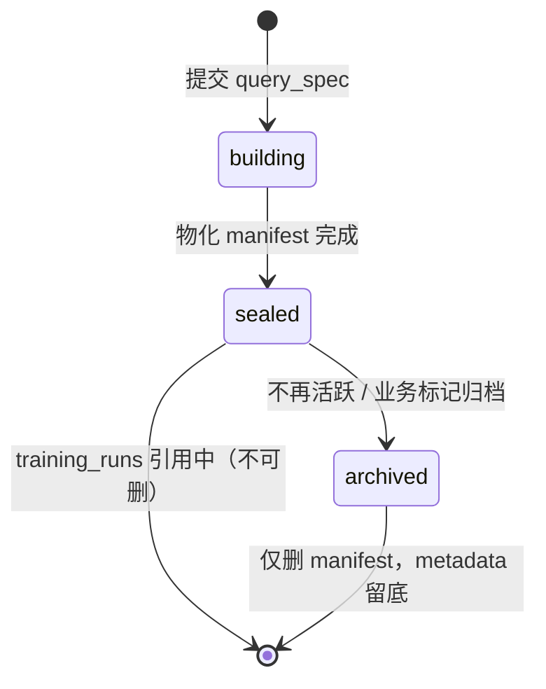
```mermaid
stateDiagram-v2
    [*] --> building: 提交 query_spec
    building --> sealed: 物化 manifest 完成
    sealed --> archived: 不再活跃 / 业务标记归档
    sealed --> [*]: training_runs 引用中（不可删）
    archived --> [*]: 仅删 manifest，metadata 留底
```

索引：`(dataset_id, snapshot_version DESC)`、`UNIQUE (dataset_id, source_query_hash)`、`(status, created_at)`。

归档：`status='archived'` 后保留 metadata 行，物理 manifest 转冷存储；retention 由业务方定，平台不主动删除。

##### 5.2.11.3 其他 Phase 2+ 表（简表）

**`asset_relations`** — 复杂血缘（多父 / 融合 / 拼接 / 采样）：

`parent_asset_id / child_asset_id / relation_type / method / algo_name / algo_version / run_id / parent_start_offset_ms / parent_end_offset_ms / created_at`

**`training_runs`** — 训练任务记录（**软引用 dataset_snapshots，自包含 catalog 引用**）：

`training_run_id / dataset_id / snapshot_id / model_name / model_version / algo_name / code_version / config_uri / data_manifest_uri / data_catalog_name / data_namespace / data_object_name / data_object_version_ref / status / metrics / artifact_uri / started_at / finished_at / created_at / updated_at`

**`catalog_objects`** — 中立对象注册（UNIQUE `(catalog_name, namespace, object_name, object_type)`）：

`object_id / catalog_name / namespace / object_name / object_type / provider / format / storage_uri / external_ref / owner / description / tags / properties / status / created_at / updated_at`

**`catalog_object_versions`** — 对象版本引用：

`object_version_id / object_id / version_ref / version_type / schema_ref / manifest_uri / row_count / size_bytes / checksum / created_by / created_at / properties`

> `training_runs` / `catalog_*` 字段未冻结，3.x 落地前发独立 ADR 重新评审。

---

### 5.3 数据流（读写路径与典型用户场景）

#### 5.3.1 一次资产 mutation 的完整时序

以 `PATCH /api/v1/assets/{id}`（同时改 lifecycle_state、新增 tag、记录算法完成）为典型路径，端到端时序如下：

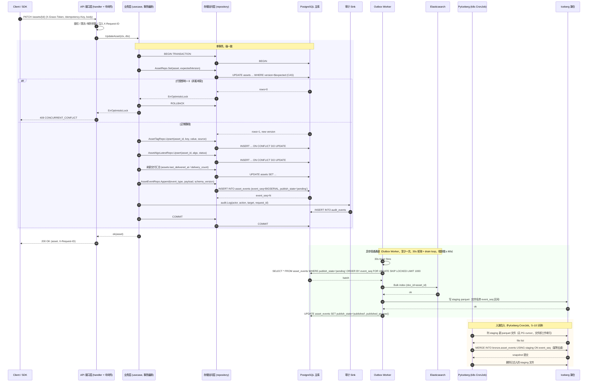
```mermaid
sequenceDiagram
    autonumber
    participant Client as Client / SDK
    participant API as API 接口层 (handler + 中间件)
    participant UC as 业务层 (usecase, 事务编排)
    participant Repo as 存储访问层 (repository)
    participant PG as PostgreSQL 主库
    participant Audit as 审计 Sink
    participant Worker as Outbox Worker
    participant ES as Elasticsearch
    participant Cron as PyIceberg (k8s CronJob)
    participant Lake as Iceberg 湖仓

    Client->>API: PATCH /assets/{id} (X-Grace-Token, Idempotency-Key, body)
    API->>API: 鉴权 / 限流 / 解析参数 / 注入 X-Request-ID
    API->>UC: UpdateAsset(ctx, dto)

    rect rgb(245,245,255)
    note over UC,PG: 单事务，强一致
    UC->>Repo: BEGIN TRANSACTION
    Repo->>PG: BEGIN

    UC->>Repo: AssetRepo.Set(asset, expectedVersion)
    Repo->>PG: UPDATE assets ... WHERE version=$expected (CAS)
    alt 行受影响 = 0（并发冲突）
        PG-->>Repo: rows=0
        Repo-->>UC: ErrOptimisticLock
        UC->>Repo: ROLLBACK
        UC-->>API: ErrOptimisticLock
        API-->>Client: 409 CONCURRENT_CONFLICT
    else 正常路径
        PG-->>Repo: rows=1, new version
        UC->>Repo: AssetTagRepo.Upsert(asset_id, key, value, source)
        Repo->>PG: INSERT ... ON CONFLICT DO UPDATE
        UC->>Repo: AssetAlgoLatestRepo.Upsert(asset_id, algo, status)
        Repo->>PG: INSERT ... ON CONFLICT DO UPDATE
        UC->>Repo: 刷新交付汇总 (assets.last_delivered_at / delivery_count)
        Repo->>PG: UPDATE assets SET ...

        UC->>Repo: AssetEventRepo.Append(event_type, payload, schema_version)
        Repo->>PG: INSERT INTO asset_events (event_seq=BIGSERIAL, publish_state='pending')
        PG-->>Repo: event_seq=N
        UC->>Audit: audit.Log(actor, action, target, request_id)
        Audit->>PG: INSERT INTO audit_events
        UC->>Repo: COMMIT
        Repo->>PG: COMMIT
    end
    end

    UC-->>API: ok(asset)
    API-->>Client: 200 OK (asset, X-Request-ID)

    rect rgb(245,255,245)
    note over Worker,ES: 异步投递通道（Outbox Worker，至少一次，30s 轮询 + drain loop，端到端 ≤ 60s）
    Worker->>Worker: 30s ticker fires
    Worker->>PG: SELECT * FROM asset_events WHERE publish_state='pending' ORDER BY event_seq FOR UPDATE SKIP LOCKED LIMIT 1000
    PG-->>Worker: batch
    Worker->>ES: Bulk index (doc_id=asset_id)
    ES-->>Worker: ok
    Worker->>Lake: 写 staging parquet（文件名带 event_seq 区间）
    Lake-->>Worker: ok
    Worker->>PG: UPDATE asset_events SET publish_state='published', published_at=now()
    end

    rect rgb(255,250,240)
    note over Cron,Lake: 入湖合入（PyIceberg CronJob，5–10 分钟）
    Cron->>Lake: 列 staging 新 parquet 文件（无 PG cursor，文件即工作单元）
    Lake-->>Cron: file list
    Cron->>Lake: MERGE INTO bronze.asset_events USING staging ON event_seq（幂等去重）
    Lake-->>Cron: snapshot 提交
    Cron->>Lake: 删除已合入的 staging 文件
    end


```

#### 5.3.2 关键约定

- **分层职责**
  - 接口层：参数解析、鉴权、限流、`X-Request-ID` 注入、错误码映射。**不直接操作 DB，不持有事务**。
  - 业务层（usecase）：事务边界的**唯一持有者**，组合多个 repo 调用、维护投影表 / 事件表 / 审计的强一致。
  - 存储访问层（repository）：纯 CRUD，不知道业务规则；事务由调用方传入。
- **乐观锁仅用于 `assets` 行内字段**：`assets.version` 走 CAS（`UPDATE ... WHERE version=$expected`），rows=0 直接判 `ErrOptimisticLock`，接口层映射为 `409 CONCURRENT_CONFLICT`。**算法状态变更（`algo.start/finish/reset`）不再触碰 `assets.version`**——它们只写 `asset_algo_latest`（PK = `(asset_id, algo_name)` + `algo_version` 单调守卫）+ `asset_events`，因此同一资产上**多个算法并发完成**互不冲突，彻底消除原 OCC 热点（详见 §5.3.4）。
- **事件强一致**：业务写 + 事件写在**同一事务**内，COMMIT 即对 worker 可见；事件**不依赖 PG trigger / `LISTEN/NOTIFY`**（业务逻辑全部在业务层，PG 只做存储 + 中央 sequence；worker 走 30s 纯轮询，详见 §5.6.2）。
- **outbox 快投递**：Outbox Worker 永远走 `publish_state='pending' + FOR UPDATE SKIP LOCKED`，不要直接按 `event_seq > cursor` 拉。
- **下游增量两条路**：①  入湖路径 = Worker 写 staging parquet → CronJob 处理文件（无 PG cursor，文件即工作单元，按 `event_seq` 在 MERGE INTO 中幂等去重，结构上不可能漏）；② 任何**直查 PG** 的 batch consumer（重建、审计回放、未来 sink）必须用 §5.2.7 的 `safe_horizon` 协议推进，**禁止**用 `max(published event_seq)` 作 watermark（会漏 SKIP LOCKED 并发标 published 的 in-flight 行）。
- **per-sink cursor**：每个 sink 在 `outbox_sink_cursors` 一行；`asset_events.publish_state` 仅服务 Worker 自己的去重。
- **审计强一致**：审计日志通过抽象 Sink 接口注入，由具体存储后端实现，业务层只产出事件不关心落地表。
- **幂等**：写类接口要求 `Idempotency-Key`，命中则跳过整个事务，直接返回上次结果。

#### 5.3.3 算法生命周期写路径 

`POST /assets/{id}/algo/{algo_key}/start|finish|reset` 走的是与上面 PATCH 完全不同的事务：**它只写算法投影 + 事件，绝不进 `assets` 行**。

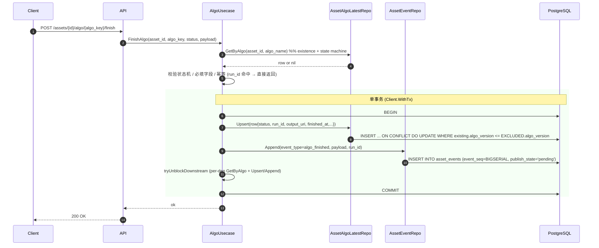
```mermaid
sequenceDiagram
    autonumber
    participant Client
    participant API
    participant UC as AlgoUsecase
    participant ALR as AssetAlgoLatestRepo
    participant EVT as AssetEventRepo
    participant PG as PostgreSQL

    Client->>API: POST /assets/{id}/algo/{algo_key}/finish
    API->>UC: FinishAlgo(asset_id, algo_key, status, payload)

    UC->>ALR: GetByAlgo(asset_id, algo_name)  %% existence + state machine
    ALR-->>UC: row or nil
    UC->>UC: 校验状态机 / 必填字段 / 幂等 (run_id 命中 → 直接返回)

    rect rgb(245,255,245)
    note over UC,PG: 单事务 (Client.WithTx)
    UC->>PG: BEGIN
    UC->>ALR: Upsert(row{status, run_id, output_uri, finished_at,...})
    ALR->>PG: INSERT ... ON CONFLICT DO UPDATE WHERE existing.algo_version <= EXCLUDED.algo_version
    UC->>EVT: Append(event_type=algo_finished, payload, run_id)
    EVT->>PG: INSERT INTO asset_events (event_seq=BIGSERIAL, publish_state='pending')
    UC->>UC: tryUnblockDownstream (per-dep GetByAlgo + Upsert/Append)
    UC->>PG: COMMIT
    end

    UC-->>API: ok
    API-->>Client: 200 OK
```

要点：

- **不读不写 `assets`**。`AssetRepository.Get` 只用作存在性校验（asset 不存在 → 404）。
- **PK + 单调守卫替代 CAS**：`asset_algo_latest` 的 `(asset_id, algo_name)` 主键加 `algo_version` 单调守卫（`ON CONFLICT DO UPDATE WHERE existing.algo_version <= EXCLUDED.algo_version`）保证：① 同一算法同一版本的并发完成 last-writer-wins，状态收敛；② 旧版本不会回滚新版本的状态；③ 不同算法之间彻底解耦，写互不影响。
- **事务包裹投影 + 事件**：`Client.WithTx(ctx, fn)` 保证 `asset_algo_latest.Upsert` 与 `asset_events.Append` 原子提交；下游消费者永远不会看到"投影变了但事件没生成"或反之。
- **下游解锁也在同一事务**：`tryUnblockDownstream` 把因为本次 ok 而依赖满足的下游算法从 `blocked` 转 `pending`，并 emit `algo_unblocked` 事件——全部在同一事务里完成，调度器拉到 pending 时已经能看到完整的事件链。
- **幂等**：finish 输入带 `run_id` 时，若投影行已经是 `ok` 且 `run_id` 匹配，直接返回（不写不发事件），处理调用方重试。
- **事件类型**：`algo_started` / `algo_finished`（status=ok）/ `algo_failed`（status=failed）/ `algo_reset` / `algo_unblocked`，统一 payload schema：`{algo_key, algo_name, algo_version, prev_status, new_status, run_id?, reason?}`。

回归性能影响：旧实现下三算法并发 finish 同一资产会撞 `assets.version` CAS 产生 `409 CONCURRENT_CONFLICT` 风暴，触发客户端重试放大写流量。修正后并发 finish 没有共享行锁，吞吐随并发线性扩展。

#### 5.3.4 读路径概览

读路径不走事件流，按场景路由到对应存储（**目标 2.0 架构**）：

| 场景 | 路径 |
| --- | --- |
| 资产详情（按 id） | PG `assets` + `asset_tags` + `asset_algo_latest`（点查走 PG 最快） |
| 列表筛选（多维 tag / lifecycle / 时间） | ES 多维过滤 + 高亮（PG fallback 兜底） |
| 全文检索（关键字） | ES `_search` |
| 历史 / 审计 / 回放 | PG `asset_events`（按 `event_seq` 范围）+ Iceberg 长期归档 |
| MCAP 段在线预览 | Backend 颁 GCS signed URL，浏览器直拉 GCS |
| 训练数据快照 / 大规模分析 | Trino → Iceberg |

下面对每个典型用户操作给出端到端时序。

#### 5.3.4 场景：用户查询单个资产详情

**入口**：前端资产详情页 → `GET /api/v1/assets/{id}`

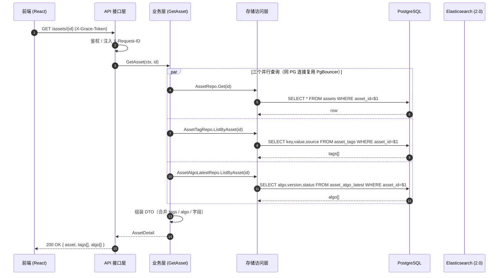
```mermaid
sequenceDiagram
    autonumber
    participant FE as 前端 (React)
    participant API as API 接口层
    participant UC as 业务层 (GetAsset)
    participant Repo as 存储访问层
    participant PG as PostgreSQL
    participant ES as Elasticsearch (2.0)

    FE->>API: GET /assets/{id} (X-Grace-Token)
    API->>API: 鉴权 / 注入 X-Request-ID
    API->>UC: GetAsset(ctx, id)

    par 三个并行查询（同 PG 连接复用 PgBouncer）
        UC->>Repo: AssetRepo.Get(id)
        Repo->>PG: SELECT * FROM assets WHERE asset_id=$1
        PG-->>Repo: row
    and
        UC->>Repo: AssetTagRepo.ListByAsset(id)
        Repo->>PG: SELECT key,value,source FROM asset_tags WHERE asset_id=$1
        PG-->>Repo: tags[]
    and
        UC->>Repo: AssetAlgoLatestRepo.ListByAsset(id)
        Repo->>PG: SELECT algo,version,status FROM asset_algo_latest WHERE asset_id=$1
        PG-->>Repo: algo[]
    end

    UC->>UC: 组装 DTO（合并 tags / algo / 字段）
    UC-->>API: AssetDetail
    API-->>FE: 200 OK { asset, tags[], algo[] }
```

**关键点**：

- 点查全程走 PG，**不经 ES**——PG 单行查询 < 5 ms，ES 反而慢
- 三个表并行查询（业务层 fan-out）后在内存合并，减少串行 RTT
- PgBouncer transaction pool 不影响（每个查询独立短事务）

#### 5.3.5 场景：列表筛选（多维过滤 + 分页）

**入口**：前端资产列表页 → `GET /api/v1/assets?lifecycle_state=ready&tags.scene=highway&owner=alice&page=1&page_size=20`

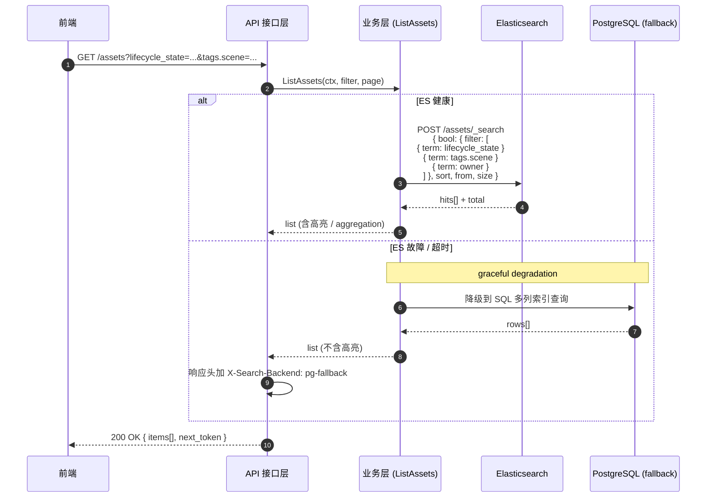
```mermaid
sequenceDiagram
    autonumber
    participant FE as 前端
    participant API as API 接口层
    participant UC as 业务层 (ListAssets)
    participant ES as Elasticsearch
    participant PG as PostgreSQL (fallback)

    FE->>API: GET /assets?lifecycle_state=...&tags.scene=...
    API->>UC: ListAssets(ctx, filter, page)

    alt ES 健康
        UC->>ES: POST /assets/_search<br>{ bool: { filter: [<br>  { term: lifecycle_state }<br>  { term: tags.scene }<br>  { term: owner }<br>] }, sort, from, size }
        ES-->>UC: hits[] + total
        UC-->>API: list (含高亮 / aggregation)
    else ES 故障 / 超时
        Note over UC,PG: graceful degradation
        UC->>PG: 降级到 SQL 多列索引查询
        PG-->>UC: rows[]
        UC-->>API: list (不含高亮)
        API->>API: 响应头加 X-Search-Backend: pg-fallback
    end

    API-->>FE: 200 OK { items[], next_token }
```

**关键点**：

- ES 索引由 outbox 异步同步（详见 §5.6.2），写入 → ES 可见 ≤ 60 s（30s 轮询 + drain loop）
- ES 故障 backend 自动降级到 PG，前端无感
- aggregation（按 tag 分组计数、按 lifecycle 桶分布）走 ES path 提供

#### 5.3.6 场景：全文检索

**入口**：前端搜索框 → `GET /api/v1/search?q=highway+night`

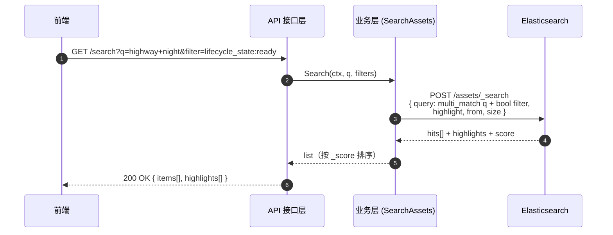
```mermaid
sequenceDiagram
    autonumber
    participant FE as 前端
    participant API as API 接口层
    participant UC as 业务层 (SearchAssets)
    participant ES as Elasticsearch

    FE->>API: GET /search?q=highway+night&filter=lifecycle_state:ready
    API->>UC: Search(ctx, q, filters)
    UC->>ES: POST /assets/_search<br>{ query: multi_match q + bool filter,<br>  highlight, from, size }
    ES-->>UC: hits[] + highlights + score
    UC-->>API: list（按 _score 排序）
    API-->>FE: 200 OK { items[], highlights[] }
```

**ES 索引设计要点**（详见 §5.6.1）：

- 文档 ID = `asset_id`，由 outbox 用 `_bulk index` 写入，重复投递天然幂等
- 字段分四类（详细 mapping 见 `deploy/local/elasticsearch/init-index.sh`）：
  | 类别 | 字段（节选） | 类型 | 说明 |
  | --- | --- | --- | --- |
  | 标识 / 状态 | `asset_id` / `mcap_file_id` / `asset_type` / `lifecycle_state` / `status` / `is_deleted` / `version` / `tenant_id` / `project_id` | `keyword` / `boolean` / `long` | 高频 term filter；`version` 给 reindex 对账与"比某次同步新的资产"查询 |
  | 保留 / 合规 | `retention_tier` / `expire_at` | `keyword` / `date` | "30 天内将过期"、"hot 层资产"等保留 / GDPR 用例 |
  | 时间 / 时长 | `start_timestamp_ns` / `end_timestamp_ns` / `duration_ms` | `long` | 纳秒精度，做 range 查询（"时长 ∈ [9000, 11000]"、"t1 ≤ start ≤ t2"） |
  | 时间 / 时长（聚合用） | `recorded_at` / `created_at` / `updated_at` / `last_delivered_at` | `date` | date_histogram 聚合（按月 / 按小时） |
  | 投影 / 反范式 | `mcap.vendor_id / device_id / camera_model / scene_id / location_id / file_duration_ms / recorded_at / ...` | `keyword` / `long` / `date` | 写入时由 outbox sink 从 `mcap_files` 反范式过来，避免 ES 跨索引 join |
  | 自定义元信息 | `metadata` | `flattened` | PG `metadata` JSONB 兜底字段平铺；用户自定义字段（如 `metadata.weather=rain`）不需要改 mapping 就能查 |
  | Tags（复杂查询） | `tags` | **`nested`** | 每条 tag 一个内嵌 doc，含 `key / value / value_num / value_bool / source_type / source_name / confidence`；支持"算法打的、置信度 ≥ 0.9 的 highway tag"这类查询 |
  | Tags（简单等值） | `tags_flat` | **`flattened`** | 给 90% 的 `tags_flat.scene = "highway"` 等值查询用，写入廉价 |
  | 算法状态 | `algos` | **`nested`** | 多算法组合查询（`hand_tracking.score > 0.8 AND face_blur.status = ok`） |
  | 全文 | `notes` / `owner.text` / `reviewer.text` | `text` | multi_match 全文 |
- **设计取舍**（重要）：
  - 不用 `object + dynamic:true` 表达 tags / algos——首次写入会锁定字段类型，后续类型不一致直接 reject，且无法表达 `source_type / confidence` 等元信息。
  - `tags` 和 `tags_flat` 双写：`flattened` 给简单等值（便宜），`nested` 给复杂组合（可表达"按来源 / 置信度过滤"）。两者由同一份 PG `asset_tags` 投影，存储多约 30%，查询能力跨越式扩展。
  - 时间字段一律 `long`（纳秒），如需按时间桶聚合用派生 ms 字段 `recorded_at`。

**示例查询**：

```json
// 时长 ≈ 10s 且 scene=highway
{ "query": { "bool": { "filter": [
  {"range": {"duration_ms": {"gte": 9000, "lte": 11000}}},
  {"term":  {"tags_flat.scene": "highway"}}
]}}}

// "算法打的、置信度 ≥ 0.9 的 scene=highway"
{ "query": { "nested": { "path": "tags", "query": { "bool": { "must": [
  {"term":  {"tags.key": "scene"}},
  {"term":  {"tags.value": "highway"}},
  {"term":  {"tags.source_type": "algo"}},
  {"range": {"tags.confidence": {"gte": 0.9}}}
]}}}}}
```

#### 5.3.7 场景：MCAP 段在线预览（前端 Webviz / Foxglove 嵌入）

**入口**：前端预览组件 → `GET /api/v1/mcap/{id}/segment-url?start_ns=...&end_ns=...`

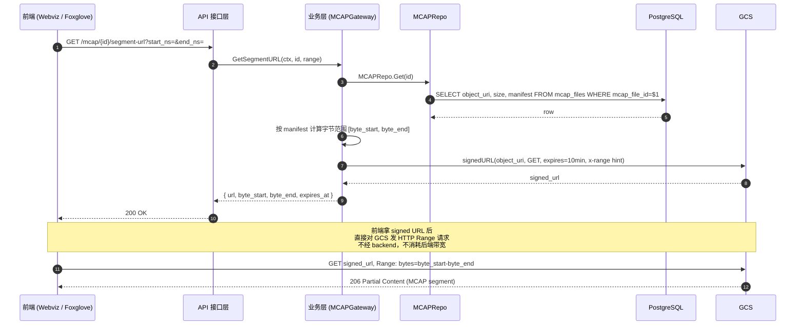
```mermaid
sequenceDiagram
    autonumber
    participant FE as 前端 (Webviz / Foxglove)
    participant API as API 接口层
    participant UC as 业务层 (MCAPGateway)
    participant Repo as MCAPRepo
    participant PG as PostgreSQL
    participant GCS as GCS

    FE->>API: GET /mcap/{id}/segment-url?start_ns=&end_ns=
    API->>UC: GetSegmentURL(ctx, id, range)
    UC->>Repo: MCAPRepo.Get(id)
    Repo->>PG: SELECT object_uri, size, manifest FROM mcap_files WHERE mcap_file_id=$1
    PG-->>Repo: row
    UC->>UC: 按 manifest 计算字节范围 [byte_start, byte_end]
    UC->>GCS: signedURL(object_uri, GET, expires=10min, x-range hint)
    GCS-->>UC: signed_url
    UC-->>API: { url, byte_start, byte_end, expires_at }
    API-->>FE: 200 OK

    Note over FE,GCS: 前端拿 signed URL 后<br>直接对 GCS 发 HTTP Range 请求<br>不经 backend，不消耗后端带宽
    FE->>GCS: GET signed_url, Range: bytes=byte_start-byte_end
    GCS-->>FE: 206 Partial Content (MCAP segment)
```

**关键点**：

- Backend **不当数据通道**——只做鉴权 + 路径解析 + 颁 signed URL，签名 10 min 失效
- 真正的字节流走 浏览器 ↔ GCS，节约 backend 出口带宽
- 跨云时 signed URL 颁发逻辑切换（GCS / S3 / OSS 各自 SDK），`object_uri` 用 `s3://` 抽象不变

#### 5.3.8 场景：训练数据快照查询

**入口**：训练 SDK 或 BI 工具 → `GET /api/v1/lakehouse/datasets/{id}/snapshot/{version}/preview?limit=100`

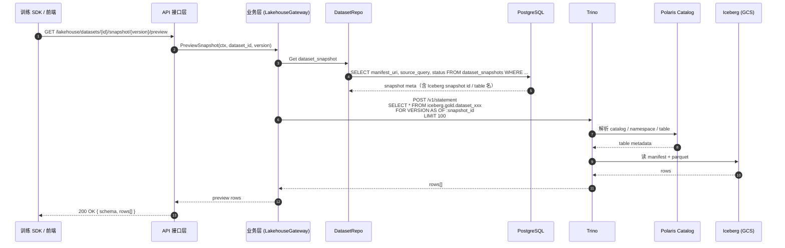
```mermaid
sequenceDiagram
    autonumber
    participant Client as 训练 SDK / 前端
    participant API as API 接口层
    participant UC as 业务层 (LakehouseGateway)
    participant Repo as DatasetRepo
    participant PG as PostgreSQL
    participant Trino as Trino
    participant Cat as Polaris Catalog
    participant Iceberg as Iceberg (GCS)

    Client->>API: GET /lakehouse/datasets/{id}/snapshot/{version}/preview
    API->>UC: PreviewSnapshot(ctx, dataset_id, version)
    UC->>Repo: Get dataset_snapshot
    Repo->>PG: SELECT manifest_uri, source_query, status FROM dataset_snapshots WHERE ...
    PG-->>Repo: snapshot meta（含 Iceberg snapshot id / table 名）

    UC->>Trino: POST /v1/statement<br>SELECT * FROM iceberg.gold.dataset_xxx<br>FOR VERSION AS OF :snapshot_id<br>LIMIT 100
    Trino->>Cat: 解析 catalog / namespace / table
    Cat-->>Trino: table metadata
    Trino->>Iceberg: 读 manifest + parquet
    Iceberg-->>Trino: rows
    Trino-->>UC: rows[]

    UC-->>API: preview rows
    API-->>Client: 200 OK { schema, rows[] }
```

**关键点**：

- `dataset_snapshots` 是 PG 的元数据指针；**真正的数据在 Iceberg**
- `FOR VERSION AS OF` 是 Iceberg time travel，保证训练拿到的就是建集时刻的数据
- Trino 仅作"读"，不写入；MERGE 由 PyIceberg CronJob 异步做（详见 §5.6.2）
- 前端真要交互式探索时，可走专门的 Trino UI（如 SuperSet）；本接口面向程序化拉数

#### 5.3.9 用户场景与服务路径对照表

| 用户场景 | API 入口 | 走哪 | 时延目标 |
| --- | --- | --- | --- |
| 资产详情 | `GET /assets/{id}` | PG（三表并行 fan-out） | < 100 ms P99 |
| 列表筛选 | `GET /assets?...` | ES（PG fallback） | < 300 ms P99 |
| 全文检索 | `GET /search?q=` | ES `_search` | < 500 ms P99 |
| 打 tag / 改状态 | `PATCH /assets/{id}` | PG 同事务（业务表 + outbox `asset_events`） | < 200 ms P99 |
| 提交算法结果 | `POST /assets/{id}/algo/{algo_key}/finish` | PG 同事务 | < 200 ms P99 |
| 在线预览 MCAP | `GET /mcap/{id}/segment-url` | PG meta + GCS signed URL | < 100 ms P99（URL 颁发） |
| 创建 dataset 快照 | `POST /lakehouse/datasets/{id}/snapshots` | PG（元数据）+ PyIceberg async build | 异步，< 30 min |
| 查 dataset 快照 | `GET /lakehouse/.../preview` | Trino → Iceberg time travel | < 5 s P99（首次查询） |
| 查算法历史 / 审计 | `GET /assets/{id}/events` | PG `asset_events` 范围 | < 300 ms P99 |
| 训练拉训练集 | SDK `dataset.iter()` | PyIceberg 直读 GCS | 取决于数据量 |

---

### 5.4 主库选型

#### 当前结论：PostgreSQL only

| 对比项 | PostgreSQL | Bigtable | Spanner / TiDB（未来） |
| --- | --- | --- | --- |
| 事务 | 强 ✅ | 弱（单行原子） | 强 |
| 关系约束 | 原生 FK / UNIQUE / CHECK ✅ | 应用层维护 | 原生 |
| 多条件筛选 | 索引 + WHERE ✅ | 需索引表 | SQL ✅ |
| 写吞吐 | 中高（够 < 10k QPS） | 极强 | 高 |
| 运维 | 低 ✅ | 中（GCP 托管） | 中 |
| 上云锁定 | 无 ✅ | GCP 绑定 | Spanner=GCP / TiDB=自托管 |

**为什么不选 Bigtable**：

1. 项目目前不强绑 GCP，要保留多云可移植性
2. 当前规模（< 100M assets）单实例 PG 足够
3. Bigtable 弱事务 + 弱关系约束，让 `asset_tags / asset_events / training_runs` 这类强引用关系实现起来反而更难
4. 业务真正爆量到 PB 级时再评估 Spanner / TiDB / 切片，**不必现在做**

---

### 5.5 算法用户 SDK（概述）

> **状态**：规划中，不在 1.0 / 2.0 关键路径上。本节仅说明动机与轮廓，详细设计在 SDK 启动专项时单独输出。

#### 5.5.1 解决什么问题

算法同学（CV / 感知 / 标注 / 数据挖掘）日常的诉求是 **「我想拿到符合条件的一批 asset，跑算法，回写结果」**。如果直接给他 REST API + 对象存储路径，他要操心：

| 问题 | 说明 |
| --- | --- |
| 拼 HTTP 请求 / 处理分页 / 错误重试 | 每个项目重复实现一遍 |
| 知道 MCAP 文件具体存哪个桶、哪个路径 | 路径一变全员改代码 |
| 自己管理对象存储 AK/SK | 安全合规风险，泄漏后无法回收 |
| 下载整个 MCAP 才能读其中一帧 | 浪费带宽 + 磁盘 |
| 跑完结果手工传文件 + 手工调 API 注册 | 容易漏注册，平台看不到产物 |
| 跨云迁移 / 上云时改代码 | 算法代码硬编码 `gs://` 或 `s3://`，迁移工作量大 |

**SDK 的目标**：算法代码里**只出现 `asset_id` 和业务字段**，看不到 HTTP / 对象存储 / 路径 / token 这些底层细节。

#### 5.5.2 用户视角的体验（目标形态）

```python
import grace_sdk

client = grace_sdk.Client()   # 认证 / 路由全在内部

# 1) 按条件挑 asset
for asset in client.assets.iter(tags=["rainy", "urban"], algo_status="pending:hand_tracking@1.2.0"):
    # 2) 流式读 MCAP（按需读某 topic 的帧，不下载整文件）
    for frame in asset.stream_frames(topic="/camera/front/image"):
        result = model.predict(frame.image)

    # 3) 回写派生产物（SDK 自动上传 + 注册到 assets.files）
    asset.add_derived_file(kind="sam2_mask", local_path="./output.json")

    # 4) 标记算法完成
    asset.algo("hand_tracking@1.2.0").finish(status="ok", output_uri=...)
```

算法代码里看不到桶名、路径、token、HTTP 端点。

#### 5.5.3 架构说明

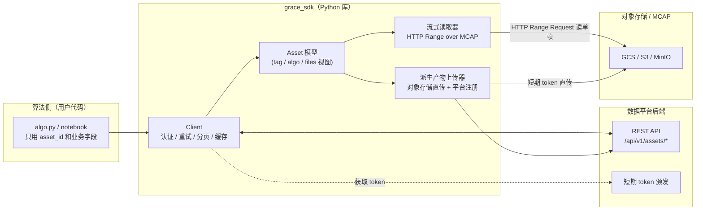
```mermaid
flowchart LR
    subgraph User[算法侧（用户代码）]
        Code[algo.py / notebook<br>只用 asset_id 和业务字段]
    end

    subgraph SDK[grace_sdk（Python 库）]
        Client[Client<br>认证 / 重试 / 分页 / 缓存]
        AssetMod["Asset 模型<br>(tag / algo / files 视图)"]
        Stream[流式读取器<br>HTTP Range over MCAP]
        Upload[派生产物上传器<br>对象存储直传 + 平台注册]
    end

    subgraph Platform[数据平台后端]
        API[REST API<br>/api/v1/assets/*]
        Token[短期 token 颁发]
    end

    subgraph Storage[对象存储 / MCAP]
        Object[GCS / S3 / MinIO]
    end

    Code --> Client
    Client <--> API
    Client --> AssetMod
    AssetMod --> Stream
    AssetMod --> Upload
    Stream -->|HTTP Range Request 读单帧| Object
    Upload -->|短期 token 直传| Object
    Upload --> API
    Client -.获取 token.-> Token
```


1. **Asset 是一等公民**：所有操作挂在 `asset` 对象上（`asset.tags`、`asset.stream_frames(...)`、`asset.algo(...).finish(...)`）；底层 HTTP / 对象存储路径全藏起来。
2. **流式读 MCAP**：用 HTTP Range Request 按需读 topic / 帧，不下载整文件。
3. **派生产物自动注册**：上传走对象存储直传（用平台颁发的短期 token），上传完成后 SDK 自动调 API 注册到 `assets.files`，平台立刻看见这条派生产物。

#### 5.5.4 落地节奏

| 阶段 | 范围 |
| --- | --- |
| 1.0（当前） | **不做**。算法侧直接 curl / requests 调 REST API；够用 |
| 2.0 候选 | 出最小 SDK：`Client + Asset + tag/algo CRUD`，覆盖 80% 场景 |
| 3.x 候选 | 流式读 MCAP、派生产物直传、虚拟路径、本地缓存 |

---

### 5.6 数据索引与同步

> **当前状态（1.0）**：平台只有 PostgreSQL 一份主库，**还没有任何检索引擎或湖仓在线**。本节描述 2.0 / 3.0 的目标形态与同步机制。

#### 5.6.1 索引与衍生存储选型

| 角色 | 引擎 / 组件 | 解决什么 | 落地阶段 |
| --- | --- | --- | --- |
| 主库 / 事实源 | **PostgreSQL** | 资产 / 事件 / 投影表的强一致写入 | 1.0 已落地 |
| 关键字 / 多条件检索 | **Elasticsearch** + go-elasticsearch | tag 组合过滤、全文搜索、facets / 聚合 | 2.0 候选，未启动 |
| 历史 / 分析 / 训练数据集 | **Apache Iceberg** + **Trino**（SQL 查询）+ **PyIceberg**（写入 / MERGE / compact） | 跨月 / 跨年大规模查询、数据集快照、训练复算 | 2.0 候选，未启动 |
| Iceberg 元数据服务 | **Polaris** 或 **Lakekeeper**（独立服务） | 表元数据、版本管理、跨引擎权限 | 2.0 候选 |
| 多模态语义检索 | 待定 | 以图搜图、文本搜片段 | 3.x，启动前再选型 |

设计上"主库存 ID + 关键字段，衍生引擎只做检索 / 分析"——任何衍生存储**丢了都能从 PG 重建**，不允许出现仅存在于 ES / Iceberg 的业务事实。

> **明确不引入**：Spark / Dagster / Kafka / Debezium / Flink / Daft / Lance。同步链路全部基于「自写 Go Outbox Worker（30s 轮询）+ PyIceberg CronJob」，详细技术栈见 §5.11。

#### 5.6.2 数据同步机制：Transactional Outbox

> **详细 worker 设计**见 `docs/review/outbox-worker-design.md`（轮询协议、cursor 推进、drain loop、panic 恢复、metrics、灾难恢复）。本节只描述架构层决策。

##### 这是干嘛的

平台演进到 2.0 后，PG 之外会同时出现 ES（关键字检索）、Iceberg（湖仓）、可能的向量库。任何一次 asset 变更都要让这些下游同步看到。最直接的两种做法都不够好：

- **方案 A：业务代码同步双写**（写完 PG 再写 ES）——任何一次 ES 卡顿都会拖死 API；写 PG 成功而写 ES 失败时，两边数据永远不一致；事务里调外部 IO 也是反模式。
- **方案 B：定时轮询 PG**（每 60s 扫 `assets.updated_at`）——延迟高、漏事件（同一秒多条更新）、无法回放历史变更、状态机审计断链。

**Transactional Outbox** 是这两种方案的折中：业务写 PG 业务表的同时，**在同一个事务里**往一张专门的事件表（就是我们的 `asset_events`，详见 §5.2.7）追加一条事件，事务 COMMIT 之后再让独立的"投递进程"把事件推到下游。

它的好处：

- **强一致**：业务表和事件表同事务，要么都成功要么都回滚，不存在"业务变了但事件没记录"。
- **不阻塞 API**：投递是异步的，下游卡顿不影响在线写。
- **可重放**：事件表是持久的，下游消费者掉线后回来按 `event_seq` 续点，不丢事件；历史故障可以重放任意区间。
- **多消费者**：同一份事件流可以被 ES、Iceberg、向量库各自独立消费，互不干扰。

##### 统一架构：共用骨架 + 可插拔 Sink

ES 和 Iceberg 的同步走**同一套 outbox 投递语义**，差别只在 Sink 实现。

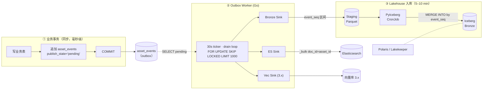
```mermaid
flowchart LR
    subgraph TX[① 业务事务（同步，毫秒级）]
        direction TB
        WT[写业务表] --> WE[追加 asset_events<br>publish_state='pending'] --> CM[COMMIT]
    end

    PG[(asset_events<br>（outbox）)]
    CM --> PG

    subgraph WK["② Outbox Worker (Go)"]
        direction TB
        Loop[30s ticker · drain loop<br>FOR UPDATE SKIP LOCKED LIMIT 1000]
        Loop --> SES[ES Sink]
        Loop --> SLK[Bronze Sink]
        Loop --> SV["Vec Sink (3.x)"]
    end

    PG -. SELECT pending .-> Loop

    ES[(Elasticsearch)]
    Staging[(Staging<br>Parquet)]
    Vec[(向量库 3.x)]
    SES -->|_bulk doc_id=asset_id| ES
    SLK -->|event_seq 区间| Staging
    SV --> Vec

    subgraph Lake[③ Lakehouse 入库（5–10 min）]
        direction LR
        Staging --> Cron[PyIceberg<br>CronJob] -->|MERGE INTO by event_seq| Bronze[(Iceberg<br>Bronze)]
    end
    Catalog[Polaris / Lakekeeper] -.- Bronze
```

##### 两段式入湖说明

| 段 | 谁 | 做什么 | 频率 |
| --- | --- | --- | --- |
| 第 1 段 | **Outbox Worker（Bronze Sink）** | 拉 `publish_state='pending'` 事件（FOR UPDATE SKIP LOCKED）→ ES `_bulk` + 写 staging parquet（文件名带 `event_seq` 区间作幂等键）→ 标 published | 30s 轮询 + drain loop，端到端 ≤ 60s |
| 第 2 段 | **PyIceberg CronJob** | 列 staging **新文件**（不读 PG，无 cursor）→ `MERGE INTO bronze.asset_events USING staging ON event_seq`（幂等去重）→ 删除已合入 staging | 每 5–10 分钟 |

**为什么不让 Worker 直写 Iceberg**：Iceberg 的 metadata 提交、snapshot 推进、并发协调由 PyIceberg 这一层职业选手做，Worker 只负责"事件落到对象存储"，简化职责边界；同时高频小文件直接写 Iceberg 后期 compaction 成本高，staging 攒批一次 MERGE 更紧凑。

**为什么 CronJob 不走 PG cursor**：直接用文件作工作单元，天然按 `event_seq` 全 batch 幂等（MERGE INTO 去重），**无需** `safe_horizon` 计算，**无需**与 Worker 协调推进。Worker 标 published 的乱序问题在这条链路上结构性消失。

##### 三个角色的职责

| 角色 | 谁 | 做什么 |
| --- | --- | --- |
| **生产者** | 业务层 usecase | 业务写 + 事件写**同一事务**，COMMIT 即对 worker 可见。这是平台**唯一**写事件的入口 |
| **投递者** | Outbox Worker（Go，自写 ticker + SQL） | 30s ticker 触发 → drain loop 拉 pending → 调 Sink（ES / Bronze staging）→ 标 published；端到端 ≤ 60s，至少一次语义 |
| **湖仓合入** | PyIceberg k8s CronJob | 周期扫 staging parquet → MERGE INTO Iceberg Bronze；分钟级延迟，幂等去重 |

##### 关键约定

| 维度 | 实现 |
| --- | --- |
| **入口** | usecase 在状态变更时同事务追加 `asset_events`，带 `event_seq BIGSERIAL UNIQUE` 和 `payload_schema_version` |
| **唤醒** | 30s 固定 tick 轮询（纯 polling，不引入 LISTEN/NOTIFY）；事件持久存在 outbox，worker 重启后从 watermark 续；单 tick 内 drain loop 直至排空 |
| **消费并发** | `SELECT ... FOR UPDATE SKIP LOCKED LIMIT 1000`，多 worker 实例可并发拉取互不阻塞 |
| **顺序** | 严格按 `event_seq` 推进，不用 `occurred_at`（详见 §5.2.7） |
| **cursor 推进** | 直查 PG 的下游用 `safe_horizon = MIN(pending) − 1` 协议（§5.2.7）；走 staging 文件的下游不需要 cursor |
| **payload 版本** | 每种 event_type 对应 schema 版本号 `payload_schema_version`；新增字段 minor，破坏性变更 major |
| **幂等** | ES `_bulk` 用 `index` action + doc_id=asset_id，重复投递不产生重复文档；Iceberg 入湖用 `event_seq` 在 MERGE INTO 中去重 |
| **可观测** | `count(*) WHERE publish_state='pending'` → 待投递队列长度 SLO；`max(event_seq) - last_published_seq`（按 sink 取自 `outbox_sink_cursors`）→ 各 sink 同步延迟指标 |
| **物理治理** | `asset_events` 行数 > 1000 万后按 `occurred_at` 月分区；retention 默认 90 天，过期后只在 Iceberg 留档 |

##### 延迟目标（2.0 上线后）

| 下游 | 端到端延迟 |
| --- | --- |
| Elasticsearch | ≤ 60 秒（30s tick + drain loop） |
| Iceberg Bronze | 5–10 分钟（PyIceberg CronJob 周期合入） |
| 向量库（3.x） | < 10 秒（embedding 异步 batch） |

##### 边界与替代方案

- **为什么 1.0 不上**：1.0 还没有 ES / 湖仓 / 向量库，没有"下游"要同步。`asset_events` 表设计可以提前进 schema，但 outbox worker 不需要起。
- **为什么不上 Debezium / Kafka / Flink CDC**：当前规模（事件量 < 100 events/s 预期，consumer 数 ≤ 3）远未触达这些重型 CDC 的收益区。一个自写 worker（ticker + `FOR UPDATE SKIP LOCKED`）在 PG 单库下足够，运维复杂度低一个数量级。如果未来事件量持续 > 1k/s 或 consumer ≥ 5 时再独立评估。
- **为什么不让 backend 直接同步双写 ES / 湖仓**：违反"PG 权威 + 衍生异步"，ES 慢 / 故障会拖死在线 API，且事务内调外部 IO 是反模式。
- **为什么不引入 LISTEN/NOTIFY**：业务 SLA 已放宽到分钟级（≤ 60s），30s 纯轮询足够；引入 NOTIFY 会带来"会话级长连接 / 不能走 PgBouncer transaction pool / 通知丢失需 fallback 轮询"等额外复杂度，收益不抵成本。outbox 持久表本身就是"保底重放"，故障 / 重启情况下不丢事件。详见 `outbox-worker-design.md`。

#### 5.6.4 为什么选 Iceberg / 湖仓是否贴合本场景

##### Lakehouse vs 传统数仓（BigQuery / Snowflake）

| 维度 | 传统数仓 | Lakehouse（Iceberg + Trino） |
| --- | --- | --- |
| 存储成本（每 TB / 月） | $20–25 | $4–8（GCS Standard）；冷分层后再砍一半 |
| 数据所有权 | 在 vendor 内部 | 在自己 GCS bucket |
| 引擎绑定 | 锁死 vendor 自有引擎 | 同一份数据 Trino / Spark / PyIceberg / DuckDB / Daft 都能读 |
| Schema evolution | 部分支持 | 原生（含字段重命名、reorder） |
| Snapshot / time travel | 部分（需付费保留） | 原生 |
| 跨云迁移 | 几乎不可能 | bucket 搬走即可 |
| Dataset = 不可变快照 | 不天然 | Iceberg snapshot 直接对应 |

##### 表格式三选一

| 维度 | **Iceberg ✅** | Delta | Hudi |
| --- | --- | --- | --- |
| 主导方 | Apache（中立，原 Netflix） | Databricks | Uber |
| 引擎中立性 | **最强**（Trino / Spark / Flink / PyIceberg / Daft / DuckDB / Snowflake / BigQuery 一等支持） | 偏 Spark / Databricks | 偏 Spark |
| Catalog 模型 | REST Catalog（Polaris / Lakekeeper / Glue / Nessie） | Unity Catalog / 文件级 | Hive Metastore |
| 社区与生态 | 最活、增长最快 | 活（绑 Databricks） | 活但收窄 |
| 我们的卡点 | 0 | Databricks 锁定味重 | 引擎选择窄 |

##### 我们的场景与 Iceberg 的契合度

| 场景特征 | 契合度 |
| --- | --- |
| 写入是 outbox 5–10 min batch，不要求秒级 | ✅ Iceberg copy-on-write / merge-on-read 都适合 batch |
| Schema 会演进（PG 字段加列、JSONB 提升为列） | ✅ Iceberg schema evolution 是核心特性 |
| 训练数据集 = 不可变 snapshot（`dataset_snapshots`） | ✅ 直接对应 Iceberg snapshot id |
| 多引擎读（Trino 给业务、PyIceberg 给训练 SDK、未来 Daft 给特征工程） | ✅ Iceberg 的强项 |
| 对象存储是 GCS | ✅ Iceberg 通过 S3 协议（GCS interop）原生支持 |
| 时空回溯（昨天某 asset 的状态） | ✅ time travel |
| 点查 / 高频小事务 | ❌ 不在 Iceberg 责任范围，归 PG / ES（已分流） |

**结论**：Iceberg 完美贴合"分析 + 训练 + 历史"场景；剩下"OLTP + 点查 + 全文检索"由 PG / ES 承担，分工清晰。

---

### 5.7 数据可视化（TODO）

候选：[Webviz](https://github.com/cruise-automation/webviz) / Foxglove Studio 嵌入。

集成方式：前端按 `asset_id` 拉取 manifest，传给 viewer 做 segment 在线预览。

不在 MVP 范围。

---

### 5.8 平台 API 设计

API 设计约定：

| 维度 | 约定 |
| --- | --- |
| Auth | `X-Grace-Token`（短期），后续切 OIDC / mTLS |
| Tracing | `X-Request-ID` 中间件，全链路串联 |
| Idempotency | `POST /api/v1/deliveries` 必须带 `Idempotency-Key` |
| 乐观锁 | `PATCH /api/v1/assets/{id}` 冲突返回 `409 CONCURRENT_CONFLICT`，客户端重试 |
| 错误格式 | 统一 envelope：`{ code, message, request_id, details }` |
| 分页 | `page / page_size / next_token` |

主要 endpoint 清单（v1，**节选**——完整 use case 与 API 矩阵见 `use-cases.md`）：

| 编号 | Group | Method + Path | 用途 / 关键约束 |
| --- | --- | --- | --- |
| A1 | Asset | `POST /api/v1/assets` | 注册新资产；同事务追加 `asset_created` 事件 |
| A3 | Asset | `GET /api/v1/assets/{id}` | 详情（基础 + tags + algo 合并），PG 三表 fan-out |
| A4 | Asset | `PATCH /api/v1/assets/{id}` | 部分更新；`If-Match: version` 乐观锁，冲突 `409` |
| A5 | Asset | `GET /api/v1/assets` | 列表筛选 + 分页（多维 filter，走 ES，PG fallback） |
| A7 | Asset | `PATCH /api/v1/assets/{id}/lifecycle` | 生命周期切换（仅状态机定义的转移） |
| A10 | Asset | `GET /api/v1/assets/{id}/events` | 资产事件历史 / 时间线 |
| B1 | Tag | `POST /api/v1/assets/{id}/tags` | upsert tag；按 `tag_registry` 校验 key/value |
| B3 | Tag | `POST /api/v1/tags:bulk` | 批量打 tag（≤ 500 资产） |
| B4 | Tag | `GET /api/v1/tags/registry` | 查 tag 注册表（来自 `tag_registry.yaml`） |
| C1 | MCAP | `POST /api/v1/mcap` | 登记 MCAP 元数据（`raw_hash_md5` UNIQUE） |
| C2 | MCAP | `GET /api/v1/mcap/{id}` | MCAP 详情（含 manifest） |
| C4 | MCAP | `GET /api/v1/mcap/{id}/segment-url` | 颁 GCS signed URL，浏览器直拉 |
| D1 | Algo | `GET /api/v1/algo/{name}/pending` | Worker 拉待处理资产（按 `depends_on`）；**目标态 convenience API，非 v1 主口径** |
| D2a | Algo | `POST /api/v1/assets/{id}/algo/{algo_key}/start` | 启动算法；`pending → running`，同事务写投影 + 追加 `algo_started` 事件 |
| D2b | Algo | `POST /api/v1/assets/{id}/algo/{algo_key}/finish` | 完成算法（ok/failed）；同事务写投影 + 追加 `algo_finished` / `algo_failed` 事件 |
| D2c | Algo | `POST /api/v1/assets/{id}/algo/{algo_key}/reset` | 重置为 pending（仅 ok/failed 可重置） |
| D4 | Algo | `GET /api/v1/assets/{id}/algo` | 资产的所有算法状态（投影读） |
| D6 | Algo | `POST /api/v1/algo/{name}:replay` | 回放（按 asset_id 列表 / 区间）；**目标态 convenience API** |
| D7 | Algo | `GET /api/v1/algo/registry` | 算法注册表 |
| E1 | Delivery | `POST /api/v1/deliveries` | 创建交付，**必须带 `Idempotency-Key`** |
| E2 | Delivery | `GET /api/v1/deliveries/{id}` | 交付详情 |
| E5 | Delivery | `POST /api/v1/deliveries/{id}:cancel` | 取消（仅 `pending/in_progress`） |
| E6 | Delivery | `POST /api/v1/deliveries/{id}:retry` | 重试失败项 |
| E7 | Delivery | `POST /api/v1/deliveries/{id}/ack` | 客户回执（独立鉴权入口） |
| F1 | Search | `GET /api/v1/search` | 全文检索 + 多维 filter + 高亮（ES） |
| F3 | Search | `GET /api/v1/search/agg` | 聚合（按 tag / lifecycle / owner 分桶） |
| G2 | Event | `GET /api/v1/events` | 全局事件流（按 `event_seq` 拉，下游订阅风格） |
| G3 | Audit | `GET /api/v1/audit` | 审计查询（`actor / action / target`） |
| H1 | Dataset | `POST /api/v1/datasets` | 创建 dataset（query 语义） |
| H4 | Dataset | `POST /api/v1/datasets/{id}/snapshots` | 触发快照构建（异步 → PyIceberg） |
| H7 | Dataset | `GET /api/v1/datasets/{id}/snapshots/{ver}/preview` | 快照采样预览（Trino time travel） |
| H8 | Dataset | `POST /api/v1/datasets/{id}/snapshots/{ver}:archive` | **不可硬删**，仅归档 |
| I1 | Training | `POST /api/v1/training-runs` | 注册训练任务（引用 dataset + snapshot） |
| I3 | Training | `GET /api/v1/training-runs/{id}` | 训练详情（含 lineage） |
| J1 | Lakehouse | `POST /api/v1/lakehouse/query` | 受限 SQL 自助查询（30s 超时） |
| J2 | Lakehouse | `GET /api/v1/lakehouse/recompute-candidates` | 重算候选（Trino） |
| M1 | Ops | `GET /healthz` `/readyz` | K8s 探针 |
| M2 | Ops | `GET /metrics` | Prometheus（GMP 抓取） |
| M3 | Ops | `POST /admin/search/reindex` | 强制重建 ES 索引（按 `from_seq`） |
| M5 | Ops | `POST /admin/outbox/{sink}/watermark` | 重置 outbox watermark / DLQ |

> 编号对齐 `use-cases.md`（A 资产 / B Tag / C MCAP / D 算法 / E 交付 / F 检索 / G 事件审计 / H 数据集 / I 训练 / J Lakehouse / M 运维）。**约 65 个端点的全集 + 角色 / 关键约束 / 开发优先级**见该文档。

#### 5.8.1 API 版本治理与字段退役流程

API 整体走 `/api/v1` 大版本，字段级别允许小版本演进。**新旧字段并存窗口、退役时间线、破坏性变更流程**遵循下表：

| 维度 | 规则 |
| --- | --- |
| 兼容窗口 | 任何旧字段保留至少 **90 天 + 一个完整发版周期**，过窗口才允许从响应中移除 |
| 新字段引入 | 同时返回新旧字段；OpenAPI 用 `deprecated: true` 标旧字段 |
| 旧字段读 | 兼容窗口内继续接受旧字段作为筛选 / 排序入参（后端内部映射到新字段） |
| 破坏性变更 | 必须走「公告 → 双写 → 切读 → 停写」四步，每步至少 30 天 |
| 废弃公告 | API 文档维护"已废弃字段"清单，写明截止日期；release notes 同步标注 |
| SDK 同步 | SDK 主版本号跟 API v1 同步；字段映射在 SDK 内部做，调用方升级 SDK 自动拿到新字段 |

实例：当前在迁移的字段对照表：

| 旧 | 新 | 当前阶段 | 计划停写日期 |
| --- | --- | --- | --- |
| `status` | `lifecycle_state` | 双写中 | 2.0 上线后 90 天 |
| `type` | `asset_type` | 双写中 | 2.0 上线后 90 天 |
| `duration_sec` | `duration_ms` | 双写中（后端计算：`duration_ms = (end_timestamp_ns - start_timestamp_ns) / 1_000_000`，API 同时返回两个字段） | 2.0 上线后 90 天 |
| `cf_algo` JSONB | `asset_algo_latest` 投影 | **已切换**——后端只读写投影表；`cf_algo` 保留为兼容/回滚路径（只读不写） | 投影表稳定 60 天后 drop cf_algo |
| `cf_tag` JSONB | `asset_tags` 投影 | **已切换**——后端只读写投影表；`cf_tag` 保留为兼容/回滚路径（只读不写） | 投影表稳定 60 天后 drop cf_tag |
| `asset_algo_events` | `asset_events` | **已切换**——新事件只入 `asset_events`；老表保留只读 | 6 个月后 drop |

#### 5.8.2 代表性用户场景

> 完整 use case 清单（全部角色 × 全部业务域，约 65 项）见 `use-cases.md`。本节抽 6 个最有代表性的场景，每个配 mermaid 时序图，覆盖核心写路径 / 读路径 / 异步事件 / 跨域协作。

##### 5.8.2.0 角色 × 业务域全景图

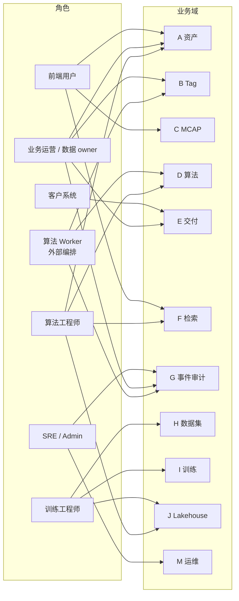
```mermaid
flowchart LR
    subgraph Roles[角色]
        AlgoEng[算法工程师]
        AlgoWorker[算法 Worker<br>外部编排]
        BizOps[业务运营 / 数据 owner]
        TrainEng[训练工程师]
        FE[前端用户]
        SRE[SRE / Admin]
        Customer[客户系统]
    end

    subgraph Domains[业务域]
        A[A 资产]
        B[B Tag]
        C[C MCAP]
        D[D 算法]
        E[E 交付]
        F[F 检索]
        G[G 事件审计]
        H[H 数据集]
        I[I 训练]
        J[J Lakehouse]
        M[M 运维]
    end

    AlgoEng --> A & D & F & J
    AlgoWorker --> D & B & G
    BizOps --> A & B & E & G
    TrainEng --> H & I & J
    FE --> A & C & F
    SRE --> G & M
    Customer --> E
```

每条线代表"角色经常触发的写 / 读路径"；同一域可被多角色访问。

##### 场景 1：算法 Worker 拉待处理资产并提交结果（D1 + D2）

- **角色**：算法 worker（Ray batch / k8s job / 任意外部编排器，平台不绑定）
- **触发**：算法注册表声明 `depends_on=[mcap_ingested]`，新 MCAP 落地后该算法资产进入 pending
- **关键性**：worker 完全 stateless；同事务写投影 + 事件，下游 ES / Iceberg 异步同步
- **SLO**：D2 写入 < 200 ms P99；下游可见 ≤ 60 s（ES），≤ 10 min（Iceberg Bronze）

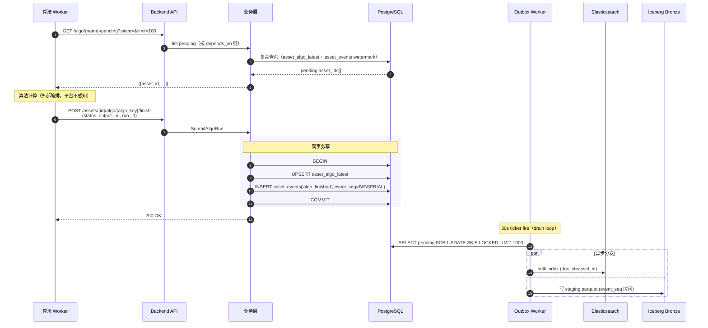
```mermaid
sequenceDiagram
    autonumber
    participant W as 算法 Worker
    participant API as Backend API
    participant UC as 业务层
    participant PG as PostgreSQL
    participant Out as Outbox Worker
    participant ES as Elasticsearch
    participant Lake as Iceberg Bronze

    W->>API: GET /algo/{name}/pending?since=&limit=100
    API->>UC: list pending（按 depends_on 链）
    UC->>PG: 复合查询（asset_algo_latest + asset_events watermark）
    PG-->>UC: pending asset_ids[]
    UC-->>W: [{asset_id, ...}]

    Note over W: 算法计算（外部编排，平台不感知）

    W->>API: POST /assets/{id}/algo/{algo_key}/finish<br>(status, output_uri, run_id)
    API->>UC: SubmitAlgoRun

    rect rgb(245,245,255)
    Note over UC,PG: 同事务写
    UC->>PG: BEGIN
    UC->>PG: UPSERT asset_algo_latest
    UC->>PG: INSERT asset_events('algo_finished', event_seq=BIGSERIAL)
    UC->>PG: COMMIT
    end

    UC-->>W: 200 OK

    Note over Out: 30s ticker fire（drain loop）
    Out->>PG: SELECT pending FOR UPDATE SKIP LOCKED LIMIT 1000
    par 异步分发
        Out->>ES: bulk index (doc_id=asset_id)
    and
        Out->>Lake: 写 staging parquet (event_seq 区间)
    end
```

##### 场景 2：业务用户创建一次客户交付（E1 系列）

- **角色**：业务运营 / 客户经理
- **关键性**：`Idempotency-Key` 命中**跳过整个事务**直接返回首次结果——同 key 重发绝不会双发
- **SLO**：E1 创建 < 200 ms P99；幂等性 100%

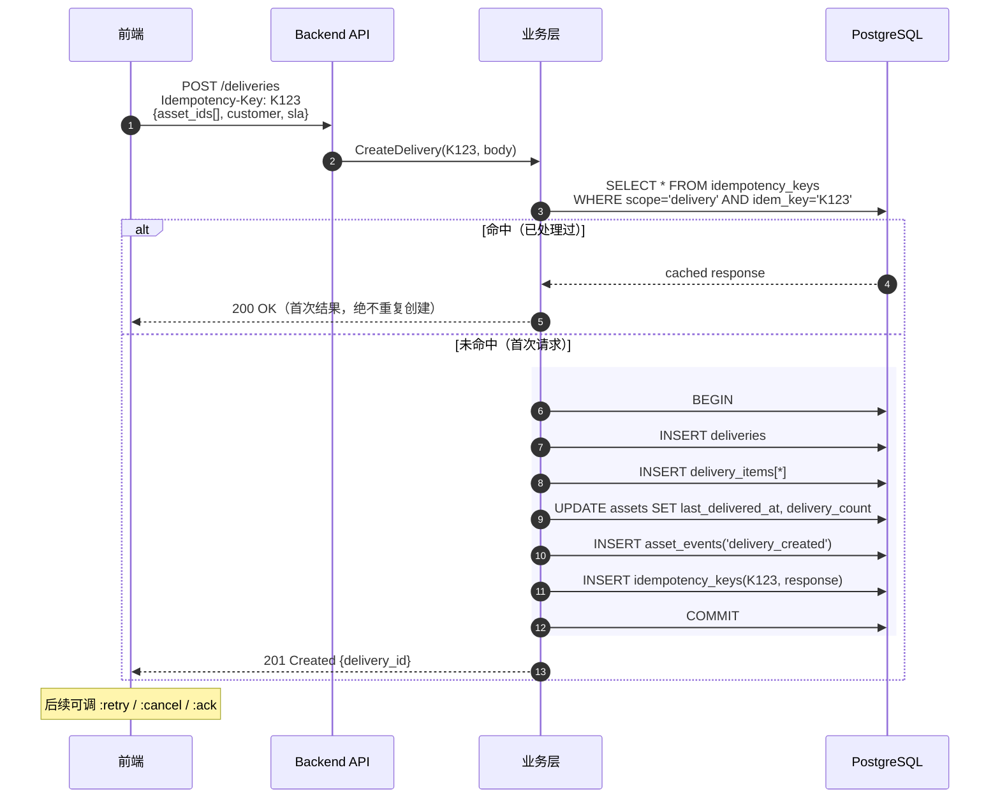
```mermaid
sequenceDiagram
    autonumber
    participant FE as 前端
    participant API as Backend API
    participant UC as 业务层
    participant PG as PostgreSQL

    FE->>API: POST /deliveries<br>Idempotency-Key: K123<br>{asset_ids[], customer, sla}
    API->>UC: CreateDelivery(K123, body)
    UC->>PG: SELECT * FROM idempotency_keys<br>WHERE scope='delivery' AND idem_key='K123'

    alt 命中（已处理过）
        PG-->>UC: cached response
        UC-->>FE: 200 OK（首次结果，绝不重复创建）
    else 未命中（首次请求）
        rect rgb(245,245,255)
        UC->>PG: BEGIN
        UC->>PG: INSERT deliveries
        UC->>PG: INSERT delivery_items[*]
        UC->>PG: UPDATE assets SET last_delivered_at, delivery_count
        UC->>PG: INSERT asset_events('delivery_created')
        UC->>PG: INSERT idempotency_keys(K123, response)
        UC->>PG: COMMIT
        end
        UC-->>FE: 201 Created {delivery_id}
    end

    Note over FE: 后续可调 :retry / :cancel / :ack
```

##### 场景 3：训练工程师建数据集快照并启动训练（H1–H4 + I1）

- **角色**：训练工程师 / Data Scientist
- **关键性**：`dataset_snapshot` 一旦被引用**不可硬删**（仅 archived），训练审计链不断；训练拉数据**绕开 backend**，PyIceberg → GCS 直读
- **SLO**：H4 异步快照 < 30 min；I1 注册 < 200 ms

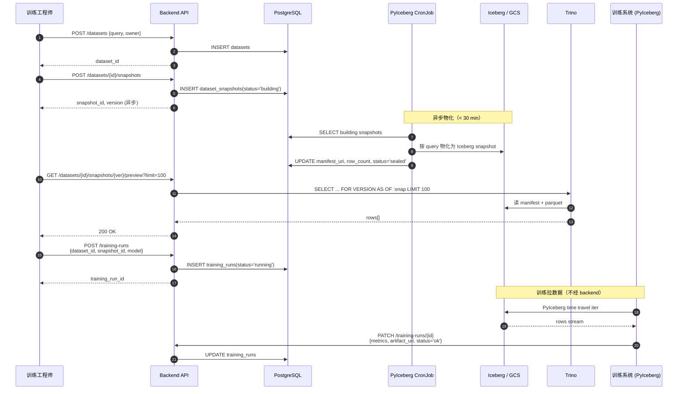
```mermaid
sequenceDiagram
    autonumber
    participant TE as 训练工程师
    participant API as Backend API
    participant PG as PostgreSQL
    participant Cron as PyIceberg CronJob
    participant Iceberg as Iceberg / GCS
    participant Trino as Trino
    participant SDK as 训练系统 (PyIceberg)

    TE->>API: POST /datasets {query, owner}
    API->>PG: INSERT datasets
    API-->>TE: dataset_id

    TE->>API: POST /datasets/{id}/snapshots
    API->>PG: INSERT dataset_snapshots(status='building')
    API-->>TE: snapshot_id, version (异步)

    Note over Cron,Iceberg: 异步物化（< 30 min）
    Cron->>PG: SELECT building snapshots
    Cron->>Iceberg: 按 query 物化为 Iceberg snapshot
    Cron->>PG: UPDATE manifest_uri, row_count, status='sealed'

    TE->>API: GET /datasets/{id}/snapshots/{ver}/preview?limit=100
    API->>Trino: SELECT ... FOR VERSION AS OF :snap LIMIT 100
    Trino->>Iceberg: 读 manifest + parquet
    Trino-->>API: rows[]
    API-->>TE: 200 OK

    TE->>API: POST /training-runs<br>{dataset_id, snapshot_id, model}
    API->>PG: INSERT training_runs(status='running')
    API-->>TE: training_run_id

    Note over SDK,Iceberg: 训练拉数据（不经 backend）
    SDK->>Iceberg: PyIceberg time travel iter
    Iceberg-->>SDK: rows stream

    SDK->>API: PATCH /training-runs/{id}<br>{metrics, artifact_uri, status='ok'}
    API->>PG: UPDATE training_runs
```

##### 场景 4：前端用户在线预览 MCAP 片段（C4）

- **角色**：前端最终用户（业务 / 算法）
- **关键性**：Backend **不当数据通道**——只颁 GCS signed URL（10 min 过期）；预览流量随用户增长不打到 backend

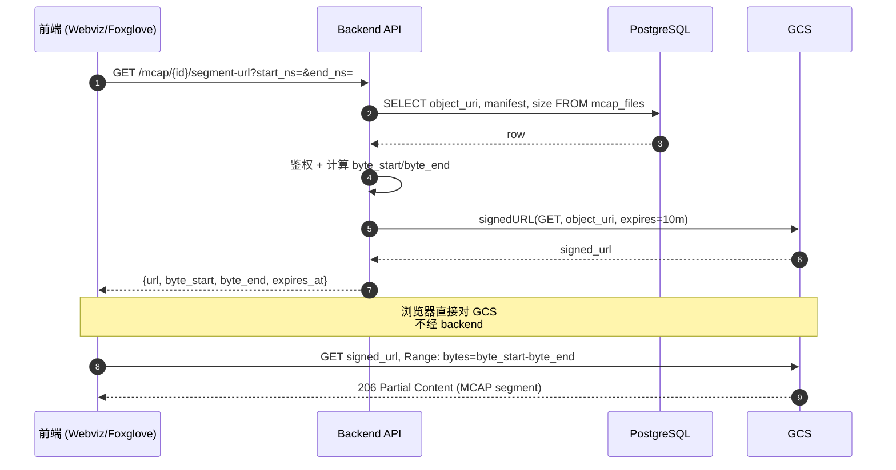
```mermaid
sequenceDiagram
    autonumber
    participant FE as 前端 (Webviz/Foxglove)
    participant API as Backend API
    participant PG as PostgreSQL
    participant GCS as GCS

    FE->>API: GET /mcap/{id}/segment-url?start_ns=&end_ns=
    API->>PG: SELECT object_uri, manifest, size FROM mcap_files
    PG-->>API: row
    API->>API: 鉴权 + 计算 byte_start/byte_end
    API->>GCS: signedURL(GET, object_uri, expires=10m)
    GCS-->>API: signed_url
    API-->>FE: {url, byte_start, byte_end, expires_at}

    Note over FE,GCS: 浏览器直接对 GCS<br>不经 backend
    FE->>GCS: GET signed_url, Range: bytes=byte_start-byte_end
    GCS-->>FE: 206 Partial Content (MCAP segment)
```

##### 场景 5：业务用户通过搜索定位资产并改 tag（F1 → B3）

- **角色**：数据 owner / 标注负责人
- **关键性**：搜索 + 写 + 异步同步形成闭环；用户 ~2 s 内看到 tag 在 ES 反映
- **SLO**：F1 < 500 ms；B3 30 条规模 < 1 s；ES 反映 ≤ 60 s

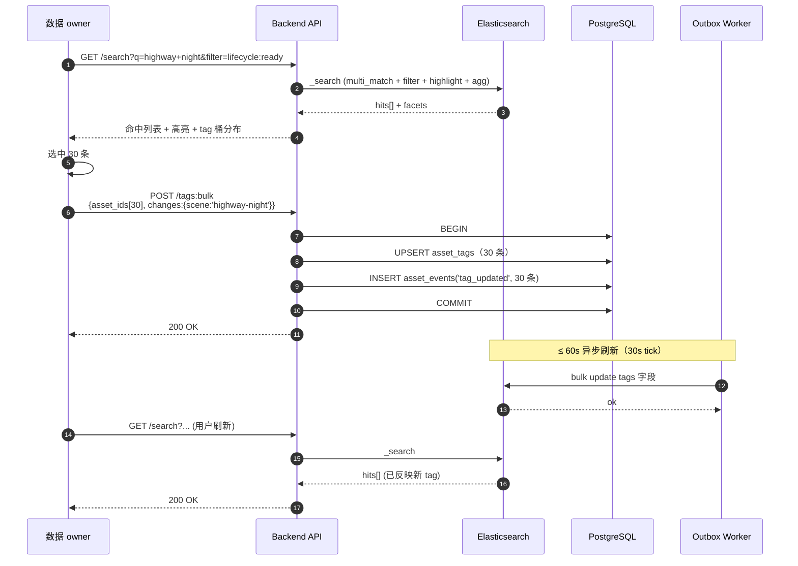
```mermaid
sequenceDiagram
    autonumber
    participant U as 数据 owner
    participant API as Backend API
    participant ES as Elasticsearch
    participant PG as PostgreSQL
    participant Out as Outbox Worker

    U->>API: GET /search?q=highway+night&filter=lifecycle:ready
    API->>ES: _search (multi_match + filter + highlight + agg)
    ES-->>API: hits[] + facets
    API-->>U: 命中列表 + 高亮 + tag 桶分布

    U->>U: 选中 30 条

    U->>API: POST /tags:bulk<br>{asset_ids[30], changes:{scene:'highway-night'}}
    API->>PG: BEGIN
    API->>PG: UPSERT asset_tags（30 条）
    API->>PG: INSERT asset_events('tag_updated', 30 条)
    API->>PG: COMMIT
    API-->>U: 200 OK

    Note over Out,ES: ≤ 60s 异步刷新（30s tick）
    Out->>ES: bulk update tags 字段
    ES-->>Out: ok

    U->>API: GET /search?... (用户刷新)
    API->>ES: _search
    ES-->>API: hits[] (已反映新 tag)
    API-->>U: 200 OK
```

##### 场景 6：SRE 重放某区间事件以重建 ES 索引（M3 / G4）

- **角色**：SRE / 平台运维
- **触发**：ES 集群异常 / schema 升级 / 某段时间事件丢失
- **关键性**：事件持久化在 PG outbox 表，**任意区间随时可重放**——doc_id=asset_id 天然幂等，重放不产生重复文档

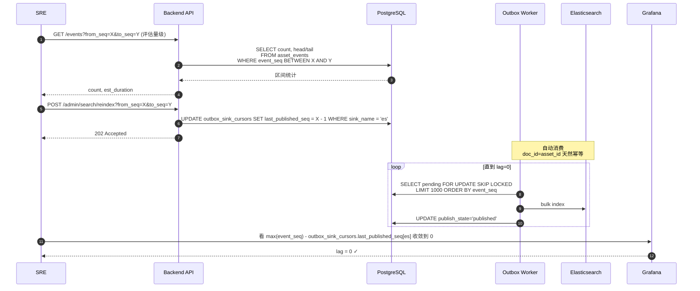
```mermaid
sequenceDiagram
    autonumber
    participant SRE as SRE
    participant API as Backend API
    participant PG as PostgreSQL
    participant Out as Outbox Worker
    participant ES as Elasticsearch
    participant Graf as Grafana

    SRE->>API: GET /events?from_seq=X&to_seq=Y (评估量级)
    API->>PG: SELECT count, head/tail<br>FROM asset_events<br>WHERE event_seq BETWEEN X AND Y
    PG-->>API: 区间统计
    API-->>SRE: count, est_duration

    SRE->>API: POST /admin/search/reindex?from_seq=X&to_seq=Y
    API->>PG: UPDATE outbox_sink_cursors SET last_published_seq = X - 1 WHERE sink_name = 'es'
    API-->>SRE: 202 Accepted

    Note over Out,ES: 自动消费<br>doc_id=asset_id 天然幂等
    loop 直到 lag=0
        Out->>PG: SELECT pending FOR UPDATE SKIP LOCKED<br>LIMIT 1000 ORDER BY event_seq
        Out->>ES: bulk index
        Out->>PG: UPDATE publish_state='published'
    end

    SRE->>Graf: 看 max(event_seq) - outbox_sink_cursors.last_published_seq[es] 收敛到 0
    Graf-->>SRE: lag = 0 ✓
```

---

### 5.9 事件契约与 Schema 演进

> outbox 起来后，多个下游（ES / Iceberg / 向量库 / 审计）同时消费 `asset_events`。如果 producer 自由改 payload，下游会逐个崩。本节给出事件契约清单与版本演进规则。

#### 5.9.1 事件清单

| event_type | producer | 主要 consumer | 幂等键 | 端到端延迟 SLO |
| --- | --- | --- | --- | --- |
| `mcap_ingested` | Backend | ES, Iceberg | `mcap_file_id` | ES ≤ 60s, Lake 10min |
| `asset_created` | Backend | ES, Iceberg | `asset_id` | ES ≤ 60s, Lake 10min |
| `asset_updated` | Backend | ES, Iceberg | `(asset_id, version)` | 同上 |
| `asset_lifecycle_changed` | Backend | ES, Iceberg, Audit | `(asset_id, version)` | 同上 |
| `tag_upserted` | Backend, Algo Worker | ES, Iceberg | `(asset_id, tag_key)` | 同上 |
| `tag_deleted` | Backend | ES, Iceberg | `(asset_id, tag_key, deleted_at_ms)` | 同上 |
| `algo_started` | Backend | Iceberg, Audit | `(asset_id, algo_name, algo_version, run_id)` | Lake 10min |
| `algo_finished` | Backend | ES, Iceberg, Audit | 同上 | 同上 |
| `algo_failed` | Backend | ES, Iceberg, Audit, Alert | 同上 | 同上 |
| `delivery_created` | Backend | ES, Iceberg, Audit | `delivery_id` | 同上 |
| `delivery_item_added` | Backend | Iceberg | `(delivery_id, asset_id)` | Lake 10min |
| `delivery_completed` | Backend | ES, Iceberg, Audit | `delivery_id` | 同上 |
| `dataset_snapshot_created` | Backend | Iceberg, Audit | `(dataset_id, snapshot_id)` | Lake 10min |
| `training_run_started` / `training_run_finished` | Training Platform | Iceberg, Audit | `training_run_id` | Lake 10min |

#### 5.9.2 Payload schema 与版本规则

每个 `event_type` 的 payload 由独立的 JSON Schema 定义；事件表里 `payload_schema_version` 字段标注当前 payload 的 major.minor 版本。

| 变更类型 | 处理 |
| --- | --- |
| 新增可选字段 / 新增枚举值 / 放宽约束 | **minor + 1**，consumer 不需改动 |
| 改字段语义 / 改字段类型 / 删字段 / 收紧枚举值 | **major + 1**，进入双写期：producer 同时发 vN 和 v(N+1)；所有 consumer 升级到 v(N+1) 后停发 vN |
| 改 event_type 名 / 拆分 event_type | 视同 major，新旧 event_type 并行至少一个版本周期 |

Producer 必须保证：

- payload 的字段含义和 consumer 能对齐到具体 schema 版本；
- 任何 major bump **先公告 + 双写**，再让 consumer 切读。

Consumer 必须保证：

- 解析时按 `payload_schema_version` 选择正确的 schema 版本；
- 看到未知 minor 版本（往前兼容）能继续工作；看到未知 major 版本走 DLQ（详见 §5.10）。

#### 5.9.3 Schema 注册位置

事件 schema 文件以 JSON Schema 形式与代码同仓维护，路径与 producer / consumer 都已知；详细路径与 CI 检查（PR 改 producer 必须改 schema）放在工程实施 ADR 中，本设计文档不固化路径。

---

### 5.10 一致性与补偿机制

> outbox 给的是"业务表 + 事件表强一致"，但下游投递天然是异步、可能失败。本节明确**每条链路的语义、重试策略、死信消息处理、人工补偿入口**。

#### 5.10.1 各链路投递语义

| 链路 | 语义 | 排序保证 | 重复处理 |
| --- | --- | --- | --- |
| 业务写 → `asset_events` | **exactly-once**（同事务） | `event_seq` 全局严格单调 | 不存在重复（事务保证） |
| `asset_events` → Elasticsearch | **at-least-once** | 单 asset 内按 `event_seq` 顺序 | ES `_bulk` 用 `index` action + `doc_id=asset_id`，重复投递结果幂等 |
| `asset_events` → Iceberg（Bronze Sink → staging → PyIceberg MERGE） | **at-least-once** | 按 `event_seq` 严格递增 | staging parquet 文件名带 `event_seq` 区间；PyIceberg `MERGE INTO ... ON event_seq = ...` 去重 |
| `asset_events` → 向量库（3.x） | **at-least-once** | 按 `event_seq` | 向量库 upsert by `(asset_id, embedding_version)` |
| Backend → audit_events | **exactly-once**（同事务） | 时间序 | 不存在重复 |

平台**不承诺**全局 exactly-once（代价过高），承诺的是"业务事实在 PG 强一致 + 下游最终一致 + 投递幂等"。

#### 5.10.2 失败重试策略

| 失败类型 | 重试 | 退避 | 上限 |
| --- | --- | --- | --- |
| 临时网络 / 5xx | 自动重试 | 指数退避 1s → 30s → 5min → 1h | 24 小时内重试不限次 |
| 4xx 业务错误（schema 不匹配 / 不可路由） | **不重试**，直接进 DLQ | — | — |
| ES `429`（背压） | 自动重试 | 指数退避 + 减小 batch size | 持续超过 1 小时升级告警 |
| consumer 进程崩溃 | `FOR UPDATE SKIP LOCKED` 释放锁，下一轮被其他 worker 拿走 | — | — |

#### 5.10.3 死信消息（Dead Letter Queue）

任何事件被同一 consumer 重试 ≥ 5 次仍失败 → 标记为死信消息：

- `asset_events.publish_state` 设为 `failed`，写入 `last_error`、`retry_count` 字段；
- 不再被快速 worker 拉取，避免堵塞队列；
- 触发告警，人工介入；
- 修复后通过运维接口将 `publish_state` 重置为 `pending`，重新投递。

下游不要求实现独立 DLQ 表；**`asset_events` 自身就是 DLQ**（凭 `publish_state='failed'` 过滤）。

```mermaid
flowchart LR
    Event[(pending)] --> Pull[Worker 拉取<br>SKIP LOCKED] --> Push[推下游<br>ES / Lake / Vec]
    Push --> OK{投递成功?}
    OK -- 是 --> Mark[(published)]
    OK -- 否 --> ErrType{失败类型}
    ErrType -->|5xx / 网络| Backoff[退避 1s → 1h<br>retry++]
    Backoff --> LimitCheck{retry ≥ 5?}
    LimitCheck -- 否 --> Event
    LimitCheck -- 是 --> DLQ
    ErrType -->|4xx / schema 错| DLQ["failed (DLQ)<br>+ last_error"]
    DLQ --> Alert[告警] --> Admin[POST /admin/retry] --> Event
```

#### 5.10.4 对账与回放

| 场景 | 机制 |
| --- | --- |
| ES 文档与 PG 不一致（如索引被误删） | 运维触发 reindex：从 `event_seq=0` 起按事件流重建 ES |
| 湖仓数据丢失 / Bronze 表损坏 | PyIceberg 回放脚本：指定 `event_seq` 区间从 PG 重新生成 staging parquet → MERGE 进 Bronze（按 `event_seq` 去重，幂等安全） |
| 个别 asset 状态可疑 | 运维查 `asset_events WHERE asset_id=...` 看完整事件流，必要时回放该 asset 的事件子集 |
| 定期对账 | 每日 schedule job 比对 PG `assets` 主表与 ES `assets` 索引的 (asset_id, version) 集合，差异 > 阈值告警 |

#### 5.10.5 人工补偿入口

平台暴露一组运维 API（仅平台 owner 可调，需审计）：

- **重投单条事件**：`POST /admin/events/{event_id}/republish`
- **重置 publish_state**：`POST /admin/events/{event_id}/retry`
- **批量回放区间**：`POST /admin/events/replay {from_seq, to_seq, target=es|lake}`

所有人工补偿动作都写一条 `audit_events`，`actor_type='admin'`、附上事件批次范围与原因。

---

### 5.11 开源技术栈选型

> 本节明确列出**所有外部依赖**，避免评审环节再问"具体用什么"。整体原则：**用尽量少的开源组件构建完整能力，运维复杂度优先**。

#### 5.11.1 选型一览

| 角色 | 选型 | 仓库 | 备注 |
| --- | --- | --- | --- |
| 主库 | **PostgreSQL 16+** | postgres/postgres | 标准托管 PG（CloudSQL / RDS / Aliyun RDS） |
| Outbox Worker | **自写 ticker + SQL**（Go 标准库） | 本仓 `backend/internal/outbox/`（Phase 2 引入） | 30s 轮询 + `FOR UPDATE SKIP LOCKED` + drain loop；自写 ~300 行可控，不引入第三方 job queue（评估过 river，对当前 SLA 与 sink 数 ≤ 3 收益不抵复杂度）；详见 `outbox-worker-design.md` |
| ES 客户端 | **go-elasticsearch**（Go 官方） | [elastic/go-elasticsearch](https://github.com/elastic/go-elasticsearch) | 直接调 `_bulk` API，几十行代码接通 |
| Iceberg 写入 / MERGE / compact | **PyIceberg**（Python 官方） | [apache/iceberg-python](https://github.com/apache/iceberg-python) | 不需要 JVM / Spark；CronJob 跑 Python 脚本即可；适合 1.0 / 2.0 规模 |
| Iceberg REST Catalog | **Polaris**（首选）或 **Lakekeeper**（轻量替代） | [apache/polaris](https://github.com/apache/polaris) / [lakekeeper/lakekeeper](https://github.com/lakekeeper/lakekeeper) | 独立服务；2026 中后期 Polaris 成熟前可先用 Lakekeeper |
| SQL 查询 Iceberg | **Trino** | [trinodb/trino](https://github.com/trinodb/trino) | 仅作"读"——backend `/api/v1/lakehouse/*` 通过 Trino HTTP API 查 Iceberg |
| 对象存储 | **MinIO**（本地 / 私有）/ S3 / GCS | minio/minio | warehouse + staging 桶 |
| 调度 | **Kubernetes CronJob** | k8s 原生 | 触发 PyIceberg MERGE / 对账脚本；不引入额外编排器 |
| 检索引擎 | **Elasticsearch 8.x** | elastic/elasticsearch | 标准托管或自建 |
| 检索 client / 索引模板 | go-elasticsearch + JSON mapping 文件 | — | 部署期一次性建 index |

#### 5.11.2 明确不引入

| 组件 | 原因 |
| --- | --- |
| **Dagster** | DAG / lineage 能力当前用不上；纯调度需求 k8s CronJob 已足够；引入 Dagster 后 ops 成本增加一倍 |
| **Apache Spark** | PyIceberg 在 1.0 / 2.0 规模下足以承担 MERGE / compact；引入 Spark 需要单独运维 JVM 集群 |
| **Apache Kafka / Pulsar** | 单一事件源 + 少量 consumer 不需要消息总线；`asset_events` outbox + 30s 轮询 worker 已具备消息持久化、回放、多消费者特性 |
| **Debezium** | CDC 收益主要来自跨系统、低代码采集；本平台 producer 全部由 Backend 同事务写 `asset_events`，比 CDC 语义更强（exactly-once 入 outbox） |
| **Apache Flink / Flink CDC** | Streaming 计算能力当前没有需求；同步链路是"事件→Sink"的简单形态，不需要 CEP / window / state 等 Flink 强项 |
| **Daft / Lance** | 多模态向量场景在 3.x 才出现；那时再独立选型 |
| **Apache Airflow / Argo / Prefect** | 同 Dagster 理由 |

#### 5.11.3 升级触发条件

如果未来出现以下情况，按编号触发独立选型 ADR：

| 触发条件 | 候选升级路径 |
| --- | --- |
| 事件持续 > 1k events/s | 自写 worker → 维持，但 PG outbox 表分库 / 评估 Debezium / 多 worker 并发拉取 |
| outbox consumer ≥ 5 个 | 评估引入消息总线（Kafka / NATS）作 fan-out |
| Bronze MERGE 单批 > 1000 万行 / 跑 > 30 分钟 | PyIceberg → Spark + Iceberg Connector 评估 |
| Bronze→Silver→Gold transformation 出现 ≥ 5 步 DAG 依赖 | k8s CronJob → 评估 Dagster / Argo Workflows |
| 算法 job 链式触发 + 长事务 + 重试控制 | 引入 Temporal（不必走 Dagster） |
| 多模态 / 向量检索成为核心需求 | 独立选型，候选：pgvector / Milvus / Qdrant / Lance |

每个升级触发都是**独立 ADR**，不在本设计文档承诺。

---

### 5.12 容量与扩展边界

> 长期目标资产量可能达 **10 亿（10⁹）级**。本节说明当前架构在不同规模下的健康度、瓶颈层在哪、什么时候动哪一刀，以及为什么"现在不上分布式 SQL"。

#### 5.12.1 关键洞察：10B 资产 ≠ 10B 在 PG

整体架构天然把数据**按热度分流**——PG 只承担在线热数据，归档 / 历史下沉 Iceberg：

```mermaid
flowchart LR
    Total[10 亿资产<br>（5 年累计）]
    Total --> Hot[在线热数据<br>最近 12 个月活跃<br>~1–3 B 行]
    Total --> Cold[归档冷数据<br>archived / superseded<br>~7–9 B 行]
    Hot --> PG[(PostgreSQL<br>主库 + 投影 + outbox)]
    Cold --> Iceberg[(Iceberg 历史层<br>对象存储 + 列存)]
    PG -. outbox 持续下沉 .-> Iceberg
```

**结论**：10 亿这个数字真正落到 PG 的可能只有 1–3 亿（取决于热数据保留策略），其余全在 Iceberg。这是当前架构最大的扩展性来源——无论后续 PG 选什么形态，瓶颈点都不是"全量 10B"。

---

### 5.13 Alternatives Considered（汇总）

> 设计过程中评估过的主要替代方案与未选用原因。详细对比见各自小节，本节做导航。

| 决策点 | 最终选用 | 评估过的替代 | 未选用原因（一句话） | 详细出处 |
| --- | --- | --- | --- | --- |
| 主库 | PostgreSQL | MySQL / Bigtable / ClickHouse / Spanner / CockroachDB | OLTP 成熟度 + 事务 + JSONB + outbox 同事务原子写；ClickHouse 不适合 OLTP；NewSQL 共识延迟过高、单位成本 3–10× | §5.4 / §5.12 |
| 表格式 | Iceberg | Delta Lake / Hudi / 裸 Parquet | 引擎中立性最强；Delta 偏 Databricks，Hudi 引擎窄；裸 Parquet 无 ACID / snapshot | §5.6.4 |
| 同步机制 | Outbox + 自写 Worker（30s 轮询） | Debezium + Kafka / Flink CDC / 业务双写 / 定时扫 `updated_at` | 当前事件量 < 100 events/s，重型 CDC 收益不抵复杂度；双写违反 PG 权威；扫 `updated_at` 漏事件不能回放（outbox 表则可重放） | §5.6.2 |
| 编排 | k8s CronJob + PyIceberg | Dagster / Airflow / Prefect / Temporal / Argo | 当前唯一周期任务是 5–10 min PyIceberg MERGE，CronJob 足够；编排器收益要等 DAG / 多任务依赖出现 | §5.11 / §9 |
| Iceberg Catalog | Polaris / Lakekeeper（自建） | Glue / Unity Catalog / Nessie / BigLake metadata | 自建保证跨云零绑定；托管 Catalog 锁定云厂商 | §5.6.4 / §6.4.1 |
| 计算引擎 | Trino | BigQuery / Spark / Athena | BigQuery 锁定 GCP 且贵；Spark 重运维；Trino 多源联邦 + 与 Iceberg 一等支持 | §5.6.1 / §6.4.1 |
| 主键 | 应用层生成 UUID（PostgreSQL `uuid`） | 数据库自增 / Snowflake ID | 不自增避免暴露业务量；Snowflake 需独立服务；UUID 版本不作为本方案评审基线 | Backend `idgen` |
| 连接池 | PgBouncer | Pgpool / 应用内池 / pgcat | PG 生态标准；pgcat 当前不需要；应用内池在 N pod 下耗光 PG 连接 | §6.3 |
| PG 扩展路径（10 B） | Citus / Aurora Limitless（PG-wire 兼容分片） | Spanner / CockroachDB / TiDB / Vitess（MySQL） | PG-wire 兼容 → backend 0 改动；NewSQL 延迟成本高 | §5.12 |
| 监控告警栈 | GMP + Cloud Monitoring + 飞书 webhook | Self-hosted Prometheus + Alertmanager / Datadog / NewRelic | 1.0 阶段省运维优先；PromQL 通用，跨云退路成本低；商业 APM 成本高 | §8.3 |
| 多租户 | **不引入** | RLS / `tenant_id` 列 / schema-per-tenant | 单业务形态，多租户复杂度回报不成正比 | §3.1 / §5.2.2 |
| 多模态向量库（3.x） | 待定 | pgvector / Milvus / Qdrant / Lance | 业务需求未到，避免过早绑定 | §3.1 / §5.11.3 |

---

## 6. 服务部署资源

### 6.1 本地开发

```bash
make all-up    # docker-compose: PG / MinIO / Iceberg REST / Trino / ES / Backend / Frontend
make all-down
make all-logs  # 查看任一服务日志
```

依赖容器：PostgreSQL 16、Elasticsearch 8.x、MinIO（S3 兼容）、Iceberg REST Catalog（Polaris 或 Lakekeeper）、Trino、Backend、Frontend。本地开发默认全套自动起，资源占用约 4 GB RAM。

> 不再依赖 Spark / Dagster；PyIceberg MERGE 在本地以一次性 Python 脚本（或 docker-compose 一次性 task）触发即可。

### 6.2 生产部署形态（建议）

| 组件 | 形态 | 备注 |
| --- | --- | --- |
| Backend (Go) | Kubernetes Deployment，HPA 按 CPU 扩 | 单镜像，仅对接 PostgreSQL（经 PgBouncer） |
| Outbox Worker（Go） | 起步：Backend 进程内 goroutine（`OUTBOX_WORKER_ENABLED=true`）；后续：独立 K8s Deployment | 自写 ticker + `FOR UPDATE SKIP LOCKED`；多实例可并发拉取；30s 轮询，无 LISTEN/NOTIFY 长连接 |
| **PgBouncer** | K8s Deployment（独立 Pod，2 副本） | transaction pooling，收敛 backend 横扩后的 PG 连接数 |
| PostgreSQL | 云托管（CloudSQL / RDS / Aliyun RDS） | 主从 + PITR |
| Elasticsearch | 云托管（Elastic Cloud / 阿里云 ES） | 单 cluster |
| Iceberg REST Catalog | **Polaris** 或 **Lakekeeper**（K8s Deployment） | 上云时由托管 catalog 替换，业务表不动 |
| 对象存储（warehouse + staging） | S3 / GCS / OSS / MinIO | 双 bucket：`warehouse` 给 Iceberg、`staging` 给 outbox 中转 |
| PyIceberg CronJob | K8s CronJob（Python 镜像） | 周期触发 MERGE INTO Bronze + 周期 compact |
| Trino | 容器化，按需扩 worker | 仅作"读"，服务 `/api/v1/lakehouse/*` |
| 多模态（Phase 3.x 候选） | 启动前再选型 | 不在 2.0 范围 |

### 6.3 数据库接入层（PgBouncer）

Backend 横向扩容后，每个 pod 自带连接池（默认 25–50 个 conn），N 个 pod 直连 PG 会很快耗尽 `max_connections`。前置 **PgBouncer**（C 写的轻量连接池代理，单二进制几 MB）把 N×连接池收敛到一个全局池，是 PG 生态的标准做法。

**拓扑**：

```mermaid
flowchart LR
    subgraph App[应用层]
        BE[Backend × N<br>每 pod pool ≈ 25]
        Worker["Outbox Worker<br>Go · 30s tick"]
    end

    PgB[(PgBouncer<br>transaction pool<br>≈ 100 conn)]
    PG[(PostgreSQL<br>primary)]

    BE -->|业务读写<br>:6432| PgB
    Worker -->|轮询 + FOR UPDATE SKIP LOCKED<br>:6432| PgB
    PgB -->|池化连接<br>:5432| PG
```

**关键约定**：

| 项 | 配置 |
| --- | --- |
| pool 模式 | `transaction`（事务级复用，最高效） |
| 默认参数 | `max_client_conn=1000`、`default_pool_size=25`、`reserve_pool=10` |
| 例外通道 | 当前**无例外**——Outbox Worker 走 30s 轮询，所有连接均经 PgBouncer transaction pool（不依赖 LISTEN/NOTIFY 的会话级状态） |
| 不能用的 PG 特性 | session-level prepared statement、`SET LOCAL` 之外的 `SET`、临时表跨事务、advisory lock 跨事务（业务层已规避） |
| 故障恢复 | PgBouncer 是无状态进程，挂了自动重启不影响数据；2 副本 + K8s service 即可 |

**Phase 1 部署成本**：docker-compose 加 1 个 service、K8s 加 1 个 Deployment + Service，backend 仅改 `DB_HOST/DB_PORT` 指向 PgBouncer，**业务代码 0 改动**。

### 6.4 GCP 部署资源与成本估算

> 当前生产环境跑在 GCP 单 region（asia-east1 / us-central1），原则：**能用 GCP 托管服务就用，少自运维**；同时所有选型保留跨云退路（K8s + 标准 PG wire + S3 协议 + OSS 表格式）。

#### 6.4.1 选型原则

| 类别 | 选型 | 取舍 |
| --- | --- | --- |
| 容器编排 | **GKE Autopilot** | 节点免运维，按 pod 计费；规模上去后再切 Standard + Spot |
| 主库 | **Cloud SQL for PostgreSQL（HA + PITR）** | 主从 + 自动故障转移 + 7 天 PITR 全托管；不锁定（标准 PG wire） |
| 对象存储 | **GCS Standard / Nearline / Coldline 分层** | archived 资产自动转 Nearline 省 60%；通过 S3 interop 端点访问，不绑 GCS SDK |
| 搜索 | **2.0 起自建 ES on GKE**（3 节点） | 比 Elastic Cloud 省 30–50%；规模小不上托管 |
| Iceberg Catalog | **Polaris 自建 on GKE** | 全开源、轻量，跨云迁移 0 成本（不用 BigLake metadata） |
| 计算 | **Trino on GKE**（夜间 KEDA 缩到 0 worker） | 不用 BigQuery，避免锁定 + 成本翻倍 |
| Secret 管理 | **GCP Secret Manager + External Secrets Operator** | 注入到 K8s secret，代码层只读 env，跨云时换 ESO 后端即可 |
| 监控指标 | **Google Managed Service for Prometheus（GMP）** | 协议兼容 OSS Prometheus，PromQL 通用，自运维 0 |
| 告警 + 看板 | **Cloud Monitoring + Grafana on GKE** | 告警引擎用 Cloud Monitoring（接 GMP），看板继续用 Grafana（PromQL 通用） |
| 通知通道 | **飞书自定义机器人 webhook** | Cloud Monitoring 直接 POST webhook，无需 Alertmanager 自建 |
| 日志 | **Cloud Logging（GKE 自动接入）** | 0 配置 |
| TLS 证书 | **cert-manager + Let's Encrypt** | 不绑 Google-managed-cert，跨云通用 |

#### 6.4.2 1.0 阶段成本（生产，月度 USD）

| 组件 | 规格 | GCP 服务 | 月成本 |
| --- | --- | --- | --- |
| Backend × 3 副本 | 各 1 vCPU / 1 GB | GKE Autopilot | $80–120 |
| Frontend × 2 副本 | 各 0.5 vCPU / 512 MB | GKE Autopilot | $30 |
| **PostgreSQL HA** | 2 vCPU / 8 GB / 100 GB SSD | Cloud SQL `db-custom-2-8192` HA | $280–350 |
| PgBouncer × 2 | 各 0.25 vCPU / 256 MB | GKE Autopilot | $20 |
| Load Balancer + Ingress | HTTPS LB + cert-manager | GCP HTTPS LB | $25 |
| GCS（MCAP + derived） | ~1 TB Standard | GCS | $20 |
| 网络出口 | 100–500 GB | egress | $20–60 |
| GMP + Cloud Monitoring | 指标 + 告警 + 日志 | 托管 | $30–50 |
| Grafana | 1 vCPU / 2 GB | GKE Autopilot | $20 |
| **小计** |  |  | **$525–700 / 月** |

#### 6.4.3 2.0 阶段成本增量

| 增量组件 | 规格 | 月成本 |
| --- | --- | --- |
| Outbox Worker × 2 | 各 0.5 vCPU / 512 MB | $30 |
| **Elasticsearch × 3** | 各 2 vCPU / 8 GB / 200 GB（自建） | $400–500 |
| Iceberg REST Catalog（Polaris）× 2 + 后端 PG | 各 0.5 vCPU / 1 GB | $80 |
| GCS warehouse + staging | 5–20 TB（含冷分层） | $100–400 |
| Trino coordinator + 3 worker | 4 vCPU / 16 GB ×4（夜间缩到 0） | $400–700 |
| PyIceberg CronJob | 短任务计费 | $20 |
| **2.0 增量** |  | **+$1030–1730 / 月** |
| **2.0 总计** |  | **$1555–2430 / 月** |

#### 6.4.4 控成本要点

| 手段 | 节省 | 说明 |
| --- | --- | --- |
| GKE Autopilot 起步 | 节点 0 运维 | 流量平稳期更划算；规模上来后切 Standard + Spot |
| Cloud SQL 单 region HA | 不开异地 | 1.0 阶段够用；DR 等业务真要再加 |
| Trino off-hours 缩 0 | -60% Trino 成本 | KEDA 按队列长度自动缩容 |
| ES 自建 | -30~50% | 接受 oncall 成本换钱 |
| GCS 冷分层 | -60~80% archived | `archived/superseded` 自动转 Nearline / Coldline |
| 同 region 部署 | egress ≈ 0 | Backend / Trino / PyIceberg 与 GCS 同 region |
| 预留实例 / CUD | -20~30% | 1 年 / 3 年承诺折扣，2.0 稳定后再上 |

---

## 7. 冗余与可靠性

| 故障域 | 影响 | 应对 |
| --- | --- | --- |
| Backend 单实例挂 | API 不可用 | 至少 3 副本 + K8s 健康检查 |
| PG 单点故障 | 全平台不可写 | 云托管主从 + 自动故障转移 + PITR；下游 ES/Iceberg 异步派生不影响主库可用性 |
| ES 故障 | 检索降级，列表页用 PG fallback | `search` handler 已实现 graceful degradation |
| Outbox worker 全挂 | 事件堆积，ES/湖仓延迟 | `publish_state='pending'` 监控 + 自动重启；事件不丢（持久化在 PG） |
| PyIceberg CronJob 失败 | 入湖延迟 | k8s 自动重试；staging parquet 不丢，下次 CronJob 一并 MERGE；积压超 30 分钟告警 |
| 对象存储故障 | 文件读写失败 | 多 region 副本（云端） |
| Iceberg metadata 损坏 | 历史查询失败 | snapshot 多副本 + Polaris/Glue 备份 |

数据层面：

- **同事务保证**：业务变更 + 事件追加原子；不会出现"业务写了事件没写"
- **事件重放**：从任意 `event_seq` 重新消费，可重建 ES / 湖仓
- **快照不可硬删**：`dataset_snapshots` 被引用后只能 archived，审计链不断

### 7.1 安全与合规（设计责任范围）

> 容量预算 / RTO/RPO / oncall runbook / RACI 不在本设计文档承载，由独立的 Capacity ADR / SRE 文档 / 运维手册跟进。本节只覆盖设计责任：**权限模型、密钥管理、数据分级、删除 SLA**。

#### 7.1.1 权限模型

| 主体 | 当前（1.0） | 目标（2.0+） |
| --- | --- | --- |
| 算法 / 内部用户 | 静态 `X-Grace-Token`（短期） | OIDC（公司 SSO）+ JWT，scope 按业务域 |
| 服务间调用（Backend ↔ Worker ↔ CronJob ↔ Trino） | 同 token | mTLS + 服务身份 |
| 客户外部访问 | n/a（无外部入口） | 不在本方案范围 |

授权层级（自上而下）：

1. **租户层**：本方案不引入多租户（详见 §5.2.2 #4）。
2. **业务域层**：按 `owner` / `project_id`-like 字段做软隔离；2.0 起在 API 网关层做 RBAC。
3. **资产层**：按 `assets.owner` 做读写鉴权；交付批次按 `deliveries.requested_by / approved_by` 做四眼审批。
4. **运维层**：`/admin/*` 路径单独 token，所有调用必入 audit。

#### 7.1.2 密钥与凭据

| 类别 | 存放 | 轮换 |
| --- | --- | --- |
| PG 连接串 / GCS AK/SK | K8s Secret（生产）/ `.env`（本地） | 季度轮换；上云后切 Secret Manager / Vault |
| API token (`X-Grace-Token`) | 颁发方持久化在 PG `api_tokens` 表（哈希存储） | 7 天有效，可吊销 |
| 对象存储**直传 token**（SDK 用） | Backend 短期签发 STS / Signed URL | 1 小时有效，用完即弃 |
| PyIceberg CronJob / Worker 任务凭据 | Workload Identity（GKE）/ IRSA（EKS） | 平台级，无需手动管理 |

**禁止**：算法代码 / 配置文件中出现长期 AK/SK；CI 凭据走 OIDC federation。

#### 7.1.3 数据分级与处理

| 级别 | 内容 | 处理 |
| --- | --- | --- |
| L1 公开 | 算法名 / 版本号 / dataset 名 | 无特殊限制 |
| L2 内部 | asset 元数据 / tag / lifecycle / 算法结果 | 内部 SSO 可读，业务域隔离 |
| L3 受限 | 客户合同 / 交付清单 / `deliveries` 详情 | 仅交付链 owner + 审批人；脱敏后才能进湖仓 |
| L4 敏感（PII） | MCAP 中的人脸 / 车牌 / 语音 / 位置（如出现） | 默认假定存在，进入入湖前必须经过 `deface` / 脱敏算法；不脱敏的原始 MCAP 不出对象存储桶 |

#### 7.1.4 删除与 retention

| 数据 | 默认 retention | 删除路径 |
| --- | --- | --- |
| `assets` / `mcap_files` | `retention_tier` 决定（hot / warm / cold / archive） | 软删 → `expire_at` 到期后由后台 job 物理清理（含对象存储） |
| `asset_events` | 90 天 | 超期后只在 Iceberg 留档，PG 物理清理 |
| `dataset_snapshots` | 永久（被引用过的） | 不可硬删，仅 archived |
| `audit_events` | ≥ 1 年 | 监管要求决定，本设计承诺不少于 1 年 |
| **PII 用户删除请求**（GDPR / 个保法） | **30 天 SLA** | 触发 `delete-by-subject` 工作流：①PG 软删 ②对象存储覆盖删除 ③ES 标 `deleted=true` 后下次 reindex 物理清掉 ④Iceberg 通过 `MERGE INTO ... WHEN MATCHED THEN DELETE` 物化删除 ⑤回执给申请方 |

> PII 删除链路的详细实施（识别 → 关联 → 删除 → 回执）作为独立合规文档 owner，本节只承诺 SLA 与设计骨架。

#### 7.1.5 审计

所有写操作 + 所有 `/admin/*` 调用 + 所有跨域数据导出都进 `audit_events`：

- `actor_type / actor_id`（user / service / admin / system）
- `action`（create / update / delete / replay / export）
- `target`（asset_id / delivery_id / event_seq 区间）
- `request_id`（与 API 调用链路串）
- 不可篡改：审计表只允许 INSERT，业务代码无 UPDATE / DELETE 权限
- **训练记录自包含**：`training_runs` 不依赖 catalog FK，跨系统迁移零成本

### 7.2 外部依赖与 SLA

> 所有外部依赖在不可用时的影响、降级路径、跨云退路。**只列设计层影响**，具体监控规则见 §8。

| 依赖 | 用途 | 上游 SLA（参考） | 不可用影响 | 降级 / 容错 | 跨云退路 |
| --- | --- | --- | --- | --- | --- |
| **GCP Cloud SQL（PG）** | 主库 | 99.95%（HA） | 全平台不可写，API 5xx | 故障转移 < 60 s；PITR 7 天；只读副本提供降级读 | 镜像到 RDS / AlloyDB / 自建 PG，标准 wire 协议 |
| **GCP GCS** | MCAP / Iceberg warehouse / staging | 99.95% Standard | 文件读写失败、湖仓入库阻塞 | 多 region 副本（双写）；staging 对象写入失败时 Worker 重试退避 | S3 协议抽象，可换 S3 / OSS / MinIO |
| **GKE Autopilot** | 容器编排 | 99.95%（区域）/ 99.5%（Autopilot pod） | Pod 调度失败 | 多 zone 节点池；HPA + PDB | 任意 K8s 集群（EKS / AKS / 自建） |
| **GCP HTTPS Load Balancer** | 入口 LB | 99.99% | 入口不可达 | 健康检查自动剔除；多 zone backend | 任意 Ingress Controller（nginx / Cilium） |
| **GMP + Cloud Monitoring** | 指标 + 告警 | 99.95% | 告警可能延迟或丢，业务不受影响 | 关键指标在 Grafana dashboard 兜底；email fallback | 切回自建 Prometheus + Alertmanager（PromQL 通用） |
| **Cloud Logging** | 日志聚合 | 99.95% | 日志短期不可查，业务不受影响 | 容器层 stdout/stderr 仍在；Pod 内可临时 kubectl logs | 切 Loki / ELK |
| **Polaris / Lakekeeper（自建）** | Iceberg Catalog | 自定 | 湖仓写入受阻；Trino 查询失败 | 2 副本 + 后端 PG 高可用；Worker 入湖暂停，事件留 staging | 已是自建，无需退路；可换 Glue（如果接受锁定） |
| **Elasticsearch（2.0 自建）** | 关键字检索 | 自定 | 检索降级，列表页用 PG fallback | `search` handler 已实现 graceful degradation | 自建，可迁 Elastic Cloud / OpenSearch |
| **Let's Encrypt（cert-manager） ** | TLS 证书 | 99.9% | 新证书签发失败 | 老证书未到期前业务正常；存量 90 天周期，运维有 14 天窗口 | ZeroSSL / 自有 CA |
| **飞书自定义机器人** | 告警通知 | 飞书自身可用性 | 告警送达延迟 | email 通道作为 fallback；P0 走多渠道 | 切 Slack / Teams webhook |
| **GitHub（CI / 镜像源）** | 部署 | 99.9% | 新版本发不出，存量服务不受影响 | 关键镜像本地缓存（Artifact Registry） | GitLab / Gitea |

---

## 8. 监控告警

### 8.1 必备指标

| 类别 | 指标 | 阈值建议 |
| --- | --- | --- |
| API | P99 latency / error rate / RPS | P99 < 500ms / errors < 1% |
| API | 限流 / 熔断触发数 | 任何触发都告警 |
| PG | TPS / 连接数 / 复制延迟 / 长事务 | 长事务 > 30s 告警 |
| Outbox | `publish_state='pending'` 队列长度 | > 10k 告警 |
| Outbox | event_seq lag（max - watermark） | > 5min 告警 |
| ES | 索引延迟 / cluster health | yellow 30min / red 立刻 |
| ES | bulk error rate | > 0.1% 告警 |
| PyIceberg CronJob | 失败次数 / 完成时间 / staging 文件积压 | 连续失败 ≥ 2 次或积压 > 30 分钟告警 |
| Iceberg | snapshot 数量 / metadata 大小 | snapshot > 1000 提示 compact |
| 对象存储 | 4xx/5xx rate / 流量异常 | 模型 anomaly |

### 8.2 业务级 SLO

- API 可用性 ≥ 99.9%（月度）
- 资产从写入到 ES 可见 ≤ 2s（P99）
- 资产从写入到 Iceberg 可见 ≤ 10min（schedule 周期）
- 交付幂等性 100%（同 `Idempotency-Key` 必返回首次结果）

### 8.3 告警栈选型（GCP 托管路线）

> 原则：**用 GCP 现成的，少自运维**；同时通过协议兼容（PromQL）保留跨云退路。

```mermaid
flowchart LR
    subgraph K8s[GKE 集群]
        BE[Backend / Worker / Trino / ES] -->|/metrics| GMP[Managed Service<br>for Prometheus]
        GF[Grafana]
    end

    GMP --> CM[Cloud Monitoring<br>告警引擎]
    GMP --> GF
    CL[Cloud Logging] --> CM

    CM -->|webhook| FS["飞书自定义机器人<br>(P0 / P1 / P2 不同群)"]
    CM -->|email| ML["邮件 fallback"]
```

| 组件 | 选型 | 自运维成本 | 跨云迁移成本 |
| --- | --- | --- | --- |
| 指标采集 | **GMP**（Google Managed Service for Prometheus） | 0 | 低（PromQL / Prometheus 协议通用，切自建 Prometheus 即可） |
| 日志聚合 | **Cloud Logging** | 0（GKE 自动接入） | 中（切到 Loki / ELK） |
| 告警引擎 | **Cloud Monitoring Alerting** | 0 | 低（告警规则可导出 / 重写为 Alertmanager） |
| 看板 | **Grafana on GKE**（接 GMP 数据源） | 极低 | 0（看板 dashboard JSON 通用） |
| 通知通道 | **飞书自定义机器人 webhook** | 0 | 0 |
| 链路追踪（2.0） | **Cloud Trace + OpenTelemetry** | 0 | 低（OTLP 协议通用） |

**为什么不用 self-hosted Prometheus + Alertmanager**：1.0 阶段团队规模小、跨云需求未触发；GMP 全兼容 PromQL，未来真要换零成本切回 OSS。Cloud Monitoring 告警规则也可导出为 YAML 备份。

### 8.4 告警分级与飞书路由

| 级别 | 响应 SLA | 通道 | 典型场景 |
| --- | --- | --- | --- |
| **P0**（业务中断） | 5 分钟 | **飞书"P0 紧急"群（@所有人）+ 飞书电话**（通过机器人 webhook + 飞书呼叫卡片） | API 全挂、PG primary 不可写、ES cluster red、对象存储不可访问 |
| **P1**（功能降级） | 30 分钟 | **飞书"告警"群** + email | outbox 队列 > 10 k、`event_seq` lag > 5 min、PyIceberg CronJob 连续失败 ≥ 2 次、PgBouncer 连接池打满 |
| **P2**（次日跟进） | 工作时间 | **飞书"日报"群** + Grafana 红黄标注 | snapshot 数 > 1000 待 compact、慢查询、磁盘 70% 水位 |

**接入做法（飞书自定义机器人，3 步）**：

1. 飞书群创建"自定义机器人"，拿到 webhook URL；
2. Cloud Monitoring 创建 Notification Channel → Webhook → 粘 URL；
3. 告警 Policy 关联 channel；payload 用飞书富文本卡片格式（含 alert name、severity、runbook link、dashboard link）。

**约定**：

- 告警写**症状不写原因**："API P99 > 500 ms" 而不是 "PG CPU 高"
- 每条 P0/P1 告警必须挂 runbook 链接（runbook 写在独立 SRE 文档，本文档不承载）
- Silence / 抑制规则在 Cloud Monitoring 里维护，定期审计避免长期屏蔽掉真问题

---

## 9. 实施计划

> **任务分解**（P0/P1、前后端、测试、DoD）→ [`next-steps-tasks.md`](./next-steps-tasks.md)。**Worker 工程** → [`outbox-worker-design.md`](./outbox-worker-design.md)。本节只给**阶段顺序**与**闸口**。

**Phase 0（已达）**：单进程 Backend + PG；`asset_events` + 投影表；mutation 同事务 append。DDL：`schemas/pg-phase0.sql`。

**Phase 1（收口 → 2.0）**：标量列 + backfill → Outbox + ES → Iceberg Bronze（PyIceberg + REST Catalog）→ `lifecycle_state` 主消费 → PgBouncer + 可观测。

**Phase 2+**：数据集 / Catalog / 向量库 / 重型 CDC / 编排器 —— **仅业务触发后排期**（§5.11.3、`use-cases.md`）。

**显式不做**：不重复罗列，见 §5.11.2「不引入清单」（容量 / oncall / RACI 走独立 ADR）。

### 9.1 Phase Gate（验收 + 回滚）

上线前逐项过闸。**具体 SQL / 开关**由运维 ADR。共性：schema 分步演进；下游可 feature-flag 关闭；事实表不回滚，派生层可从 `asset_events` 重放。

#### 9.1.1 1.0 → 2.0（ES + outbox）

| 维度 | 验收摘要 | 回滚要点 |
| --- | --- | --- |
| Schema 字段提升 | 新旧字段一致率 100%；旧字段读流量 < 5% | 停切换、读路径回旧字段 |
| `asset_events` outbox | 24h 投递成功率 > 99.9%；端到端 P99 ≤ 60s | 关 worker；事件积在 PG |
| ES 检索 | `/search/assets` 成功率 > 99%；与 PG 一致率 > 99.9% | 关 ES 入口，PG fallback |
| 投影表 | 7d 写入零异常；backfill 一致率 100% | 暂停路径，从 `asset_events` 重放投影 |
| `lifecycle_state` | 列表筛选新字段流量 ≥ 80%（双写满窗后） | 前端筛回 `status` |

#### 9.1.2 2.0 → 3.x（Iceberg + Trino）

| 维度 | 验收摘要 | 回滚要点 |
| --- | --- | --- |
| Iceberg 入湖 | Bronze 延迟 P99 < 10 min；PG vs Bronze 行数一致 > 99.9% | 停 CronJob；outbox 不丢 |
| Trino | `/lakehouse/*` 有真实调用；查询 P99 < 30s | 关 Trino 入口 |
| `datasets` / snapshots | snapshot 幂等；引用快照不可硬删 | 停 API 写路径 |

---

## 10. 交叉关注点（Cross-cutting Concerns）映射

> 按 Google 设计文档模板列出的交叉关注点，本节做"覆盖性导航"，避免评审者翻全文找。**不重复展开**，只指向落地章节。

| 关注点 | 是否覆盖 | 落地章节 | 一句话总结 |
| --- | --- | --- | --- |
| 基础设施 | ✅ | §6.1 / §6.2 / §6.4 | GKE Autopilot + Cloud SQL + GCS + GMP，原则"用 GCP 托管，少自运维"，全套保留跨云退路 |
| 可扩展性 | ✅ | §5.12 / §6.4.4 | 1.0 单库 PG → 2.0 月分区 + 归档 → 3.x 触达触发线后 PG-wire 兼容分片（Citus / Aurora Limitless）；ES / Iceberg / Trino 横扩友好 |
| 数据完整性 | ✅ | §5.6.2 / §5.10 / §7 | 业务表 + `asset_events` 同事务原子写；下游消费按 `event_seq` 推进 watermark；`dataset_snapshots` 不可硬删；事件可重放 |
| 延迟 | ✅ | §5.6.2（同步延迟）/ §8.2（业务 SLO） | API P99 < 500 ms；写入到 ES ≤ 60 s（30s tick + drain）；写入到 Iceberg ≤ 10 min |
| 冗余 & 可靠性 | ✅ | §7 故障域应对表 | 业务异步派生与主库解耦；ES 故障走 PG fallback；Worker 全挂事件不丢 |
| 稳定性（SLO / 监控） | ✅ | §8 | API 可用性 ≥ 99.9%；GMP + Cloud Monitoring + 飞书告警 |
| 外部依赖 | ✅ | §7.2 | 11 类外部依赖逐项列出 SLA / 影响 / 降级 / 跨云退路 |
| 安全 & 隐私 | ⏸ 暂缓 | — | 本轮设计评审范围外，独立合规 / 安全文档跟进（PII / GDPR / 鉴权 / 密钥管理） |

---

## 11. 风险与未决事项

### 11.1 风险闭环表

每条风险必须有 owner、关闭标准、最迟决议时间。owner 字段允许写"待定"，但评审通过后须在两周内补齐。

| 编号 | 议题 | 影响 | 当前默认 | Owner | 关闭标准 | 最迟决议 | 状态 |
| --- | --- | --- | --- | --- | --- | --- | --- |
| R1 | 业务表如何引用 `catalog_objects` | 训练审计可移植性 | 软引用四元组 | 待定（Backend + Data 联合） | ADR 通过 + `training_runs` schema 冻结 | Phase 2 启动前 | open |
| R2 | Outbox worker 部署形态（进程内 vs 独立 service） | 运维复杂度 | Phase 1 进程内，Phase 2 独立 | 待定（Backend） | 进程内 worker 跑过 90 天稳定性数据 | Phase 2 切换前 | open |
| R3 | `lifecycle_state` 的 CHECK 约束 | 状态机非法转移 | 应用层校验 | 待定（Backend） | 状态机 6 个月无新增变更 + 加 CHECK 约束 | 2.0 上线后 6 个月 | open |
| R4 | 上云 Catalog 选型（Polaris vs Gravitino vs 云原生） | 跨引擎事务 / 元数据 | 暂不绑定，靠 catalog_objects 抽象 | 待定（架构组） | 选型 ADR + 迁移 PoC 通过 | 上云前 | open |
| R5 | PII / GDPR 删除链路 | 合规 | 软删 + retention_tier 标注；删除 SLA 30 天（§7.1.4） | 待定（合规 + 平台） | 独立合规文档发布 + 链路 PoC 通过 | 客户外部数据接入前 | open |
| R6 | 事件 schema 演进 CI 守门 | 多 consumer 漂移风险 | PR 改 producer 必须改 schema；细节走工程 ADR | 待定（Backend + Data） | CI 检查上线 + 至少 1 次 major bump 演练 | 2.0 outbox 上线前 | open |
| R7 | `asset_algo_latest` 已启用，监控投影一致性 | 投影表与 `asset_events` 的一致性 | 1.0 已上线；后端 `AlgoUsecase` 以 `asset_algo_latest` + `asset_events` 为准写路径 | 待定（Backend） | 一致性监控 + 定期对账 job 上线，连续 30 天无未处理 P1+ 告警 | 2.0 outbox 上线前 | open |
| R8 | PG 单库容量上限 / 何时分库 / 选哪条路 | 10 B 长期目标下的扩展边界 | 1.0–2.0 单库 + 分区 + 归档；3.x 触达触发线后启动分库 ADR，首选 PG-wire 兼容方案（Citus / Aurora Limitless） | 待定（架构组 + Backend） | 触发线监控上线 + 触达后独立 ADR 通过 | 热数据 > 1 B **或** WPS > 3 k **或** 单分区 > 500 M 任一触达 | open |

### 11.2 风险闭环节奏

- 每月 1 次平台例会过一遍 R1–R8 进度；任何状态变更（open → in-progress → closed）写入 changelog。
- 新增风险（含评审中发现的）按 R-N 顺序追加，永不复用编号。
- "已关闭"的风险保留在表中（`状态=closed`）作历史，不删除。
