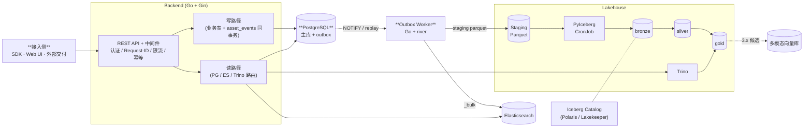
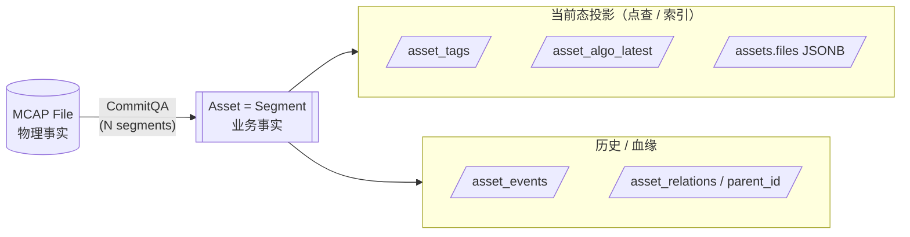
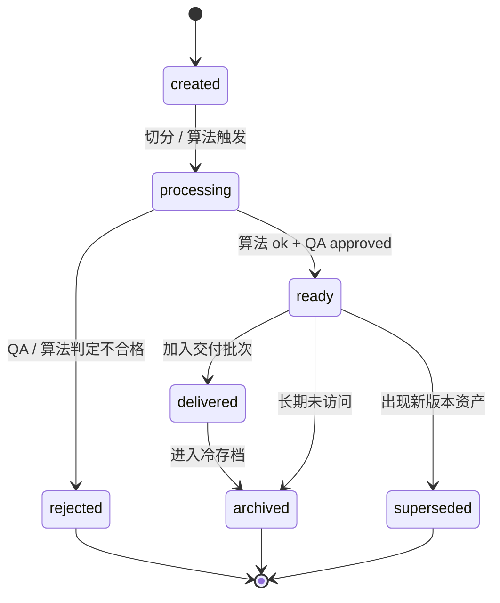
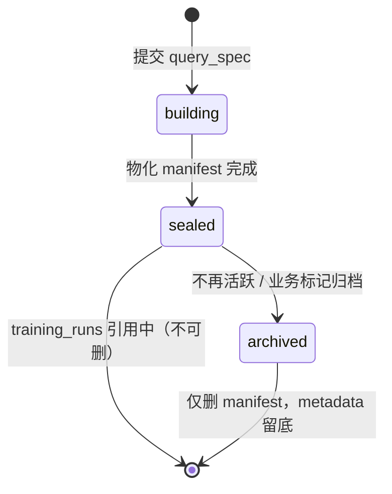
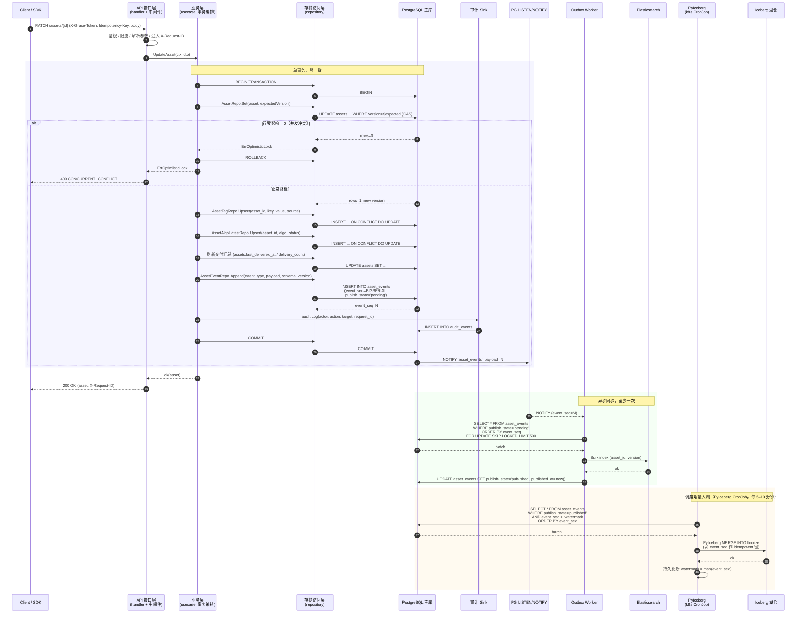
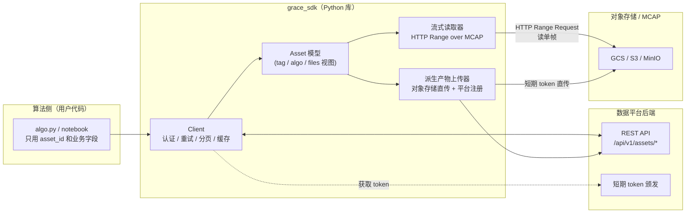
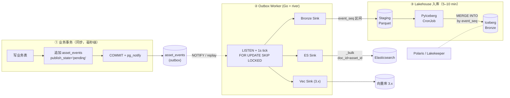
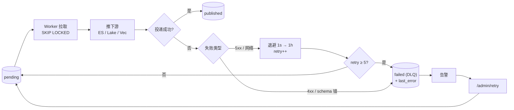
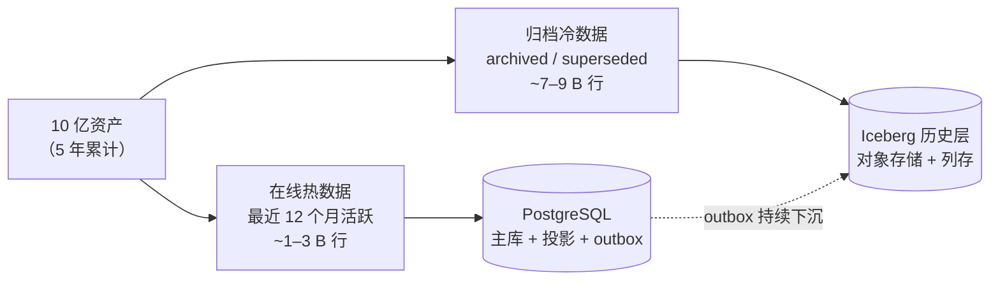

# 数据平台方案设计

本文是机器人多模态资产平台（Databricks4robot）的整体方案设计，包含背景、目标、架构、核心表与字段、数据同步机制、API、部署、可靠性、监控与实施计划。

---

## 1. 背景

- **数据形态**：MCAP 文件（Foxglove 容器格式，传感器 + 视频多模态时序），所有数据采集到算法处理都围绕 MCAP。
- **用户角色**：内部算法用户（生产消费）+ 外部客户（接收处理后产物）。
- **平台定性**：**数据资产化管理 + 处理与交付**。
- **机器人形态**：当前以 AV 切入，长期需覆盖机械臂、人形、四足、室内导航 —— 因此行业语义字段（city / weather / scenario_type）**不焊进主表**，统一进 tag 系统。

---

## 2. 问题现状

| 问题 | 现状 | 本方案如何解决 |
|------|------|----------------|
| 资产定义模糊 | 老 grace 系统把 video / 处理状态 / 派生产物揉在一起 | §5.1 重新明确 `mcap_file / asset / segment / file` 概念 |
| 算法用户手工轮代码 | 上下游就绪靠脚本轮询 PG | §5.6.2 outbox + 事件驱动，用户用 SDK 等事件 |
| 缺触发机制 | 没有"上游完成 → 自动触发下游" | §5.6.2 outbox + Worker 事件驱动 |
| Video 是最小粒度 | 业务逻辑直接绑定在 video 实体的接口层 | §5.1 资产化 + §5.5 SDK 抽象，接口层退化为 CRUD |
| 无统一检索 | 多表 JOIN 才能查派生产物/标签/QA | §5.6.1 ES 投影 + §5.2 投影表 |
| 无多模态检索 | 找不到"相似片段" | 3.x 候选：向量检索（具体引擎届时再选型） |

典型业务问题与回答路径：

| 业务问题 | 答这条问题的路径 |
|----------|------------------|
| 某次训练用了哪些 asset | `training_runs` → `dataset_snapshots.manifest_uri` → Iceberg gold 明细 |
| 某算法版本变更后哪些 asset 要重刷 | Trino 查 Iceberg `gold_recompute_candidates` |
| 某 tag 何时被算法追加 | `asset_events` (event_type=tag_upserted) → Iceberg 长期 |
| 上月所有 MCAP segment 质量分布 | Trino + Iceberg silver/gold |
| 某客户交付能否完整回放 | PG `deliveries.replay_manifest_uri` + Iceberg delivery_items 明细 |

---

## 3. 目标

| 目标 | 落地承诺 |
|------|----------|
| **算法用户零感知底层** | Python SDK `grace_sdk`，`asset.get(id)` / `asset.stream(topic)` 一行拿到所有 |
| **资产即一等公民** | 主键 `asset_id`；`asset_tags / asset_algo_latest / asset_events` 投影 |
| **统一元数据底座** | PG 主库 + ES 检索 + Iceberg 历史；Catalog 抽象支持上云不绑定厂商 |
| **事件驱动数据链路** | `asset_events` outbox + Go worker，PG `LISTEN/NOTIFY` 实时唤醒 |
| **多维检索** | Tag 过滤 / 全文 / 向量（Phase 2+） |
| **强追溯/审计** | `asset_events` 全量事件流；`training_runs` 自包含 catalog 引用 |
| **MCAP 原生** | SDK 走 HTTP Range Request 流式读，不下整文件 |

---

## 4. 整体架构

### 4.1 平台能力总览

下图描述数据采集流程、算法处理与平台服务的整体关系：上游数据采集（grace 数采链路）经过 QA 后落地为有效 segment；触发算法处理；处理结果通过统一抽象服务暴露给算法用户、前端、外部交付。


### 4.2 架构演进路线（1.0 → 3.1）

下图描述数据平台从单库直连演进到统一元数据层的四个阶段：


| 阶段 | 形态 | 关键变化 |
|------|------|----------|
| 1.0 | 业务层 + PostgreSQL | 单库直连，所有业务/分析共用 PG |
| 2.0 | + Iceberg + Elasticsearch + Trino | 引入湖仓与检索层，PG 只承担在线业务；分析与全文检索分流 |
| 3.0 | 全链路事件驱动 | 引入 outbox + 同步机制，PG 通过事件流推动 ES / Iceberg 派生；多消费者并行 |
| 3.1 | + 统一元数据层（Catalog 抽象） | 跨引擎对象中立注册（catalog_objects）+ 版本引用，业务表不再绑定物理路径或厂商 ID，支持上云不重构 |

当前位置：**1.0**（仅 PostgreSQL 单库 + Backend，2.0 尚未启动）。

| 维度 | 现状（1.0） | 下一步（→ 2.0） |
|------|--------------|-----------------|
| 主库 | PostgreSQL（含 `cf_meta / cf_algo / cf_tag` JSONB 过渡列） | 同 PG，但提升高频字段为真实列 + 引入 `asset_tags / asset_algo_latest` 投影表 |
| 检索 | 无；列表筛选直接查 PG | 引入 Elasticsearch + 后端 `/api/v1/search/assets` |
| 湖仓 | 无 | 引入 Iceberg REST Catalog + Trino，PG → Bronze → Silver → Gold |
| 数据同步 | 无（所有读写都走 PG） | 引入 `asset_events` outbox + Go worker + LISTEN/NOTIFY |
| 多模态 / Catalog 抽象 | 无 | 3.1 阶段，Phase 2 之后 |

> 注：仓库里目前已有 Iceberg / ES / Trino 的本地 `docker-compose` 脚手架代码，但它们**尚未真正接入业务写路径**，因此架构基线仍按 1.0 评审。本设计文档即是从 1.0 → 2.0 → 3.0 的演进规划。

### 4.3 运行时数据流



### 4.4 分层职责

| 层级 | 组件 | 职责 |
|------|------|------|
| 在线业务层 | PostgreSQL | 点查、事务、当前态筛选、状态机、权限、幂等；权威主库 |
| 检索层 | Elasticsearch | 模糊查询、全文检索、多字段过滤、facets、资产发现 |
| Catalog 控制面 | Iceberg REST Catalog + PG Platform Catalog | 湖表事务、metadata pointer、跨引擎对象的中立引用 |
| 湖仓层 | Iceberg | 历史事实、训练集、审计回放、统计分析、重算 |
| 查询层 | Trino | 查询 Iceberg，服务复杂分析与离线报表 |
| 计算层 | PyIceberg + k8s CronJob | 周期性 MERGE / compact / Bronze→Silver→Gold transformation；不引入 Spark / Dagster |
| 异步派生通道 | Outbox + Worker（Go + river） | PG 主库变更 → ES / 湖仓 / 向量库的事件驱动同步 |
| 多模态层（Phase 3.x 候选） | 待定 | AI 多模态样本处理、向量 / 张量存储；3.x 启动前再选型 |

设计约定：PostgreSQL 表结构先保障在线业务，再通过事件流（`asset_events` outbox）支撑 ES 与 Iceberg；任何外部数据对象都通过中立 Catalog 引用而非物理路径绑定。

---

## 5. 详细设计

### 5.1 资产概念定义

资产化管理的核心：**给每一份回传数据创建唯一 `asset_id`，解析元信息形成资产；元数据 + 原始数据 + 关联数据三段式**。

#### 物理 vs 业务划分



#### 资产分层

| 概念 | 表 | 关系 |
|------|----|------|
| 物理文件 | `mcap_files` | 1 |
| 业务资产 | `assets` (asset_type=segment / clip / frame_set / derived_asset) | 1 → N segment |
| 资产血缘 | `assets.parent_asset_id` 或 `asset_relations` | N → N |
| 派生文件 | `assets.files` JSONB（key=algo@ver, value=URI） | 1 → N |

资产生命周期状态机（`assets.lifecycle_state`）：



| 状态 | 含义 |
|------|------|
| created | 资产刚建好，未开始处理 |
| processing | 算法/切分流水线在跑 |
| ready | 已就绪，可供检索/交付/训练 |
| rejected | QA 或算法判定不合格 |
| delivered | 已交付给至少一个客户 |
| archived | 进入冷存档，不参与在线检索 |
| superseded | 被新版本资产替代（rework） |

任何状态转移必须**同事务**追加一条 `asset_events`（event_type=`asset_lifecycle_changed`），否则审计链断裂。

---

### 5.2 资产字段设计

#### 5.2.1 表清单与上线优先级

| 表 | 优先级 | 主键 | 一句话职责 |
|----|--------|------|------------|
| `mcap_files` | 🟢 Tier 1 已实现 | `mcap_file_id` | 原始 MCAP 文件当前态 |
| `assets` | 🟢 Tier 1 已实现 | `asset_id` | 资产当前态（segment / clip / frame_set / derived_asset） |
| `deliveries` | 🟢 Tier 1 已实现 | `delivery_id` | 客户交付批次当前态 |
| `delivery_items` | 🟢 Tier 1 已实现 | `(delivery_id, asset_id)` | Delivery ↔ Asset M:N 明细 |
| `idempotency_keys` | 🟢 Tier 1 已实现 | `(scope, idem_key)` | API 幂等保护 |
| `asset_tags` | 🟡 Tier 2 上线前 | `(asset_id, tag_key)` | tag 当前态投影，驱动 facet/filter/ES 文档 |
| `asset_algo_latest` | 🟡 Tier 2 上线前 | `(asset_id, algo_name)` | 每 (asset, algo) 最新一行算法状态 |
| `asset_events` | 🟡 Tier 2 上线前 | `event_id`（UNIQUE `event_seq`） | 统一业务事件 / 审计 / outbox |
| `asset_relations` | 🟠 Tier 3 可选 | `(parent_asset_id, child_asset_id, relation_type)` | 多父 / 融合 / 拼接血缘 |
| `datasets` / `dataset_snapshots` | 🔵 Tier 4 Phase 2 | 见后 | 数据集定义与训练快照 |
| `training_runs` | 🔵 Tier 4 Phase 2 | `training_run_id` | 训练任务记录（自包含 catalog 引用） |
| `catalog_objects` / `catalog_object_versions` | 🔵 Tier 4 Phase 2 | 见后 | 中立对象与版本注册 |

⛔ **不做**：`feature_sets / feature_jobs / training_sample_exports` 字段未冻结，落地前重新评审。

#### 5.2.2 字段设计原则（关键五条）

1. **高频过滤字段必须列化**：`asset_type / lifecycle_state / start_timestamp_ns / end_timestamp_ns / duration_ms / created_at` 一律真实列。JSONB 只放低频扩展。
2. **行业语义不焊主表**：AV 的 `city / weather / scenario_type / quality_level` 必须进 `asset_tags`，由统一的 tag 注册表声明。机械臂/人形/四足以同样方式扩展，不需要改主表 schema。
3. **外部数据对象用 Catalog 引用**：训练任务 / 数据集快照 / 导出表都引用 `catalog_name + namespace + object_name + version_ref` 四元组，**不直接绑物理路径或厂商 ID**，避免上云锁死。
4. **本方案不引入多租户能力**：所有表按单实例单业务设计，不带 `tenant_id / project_id`、不做 RLS、不按租户 routing。如未来需要多租户，作为独立专项重新评审，避免现在引入冗余字段。
5. **主键统一用 UUIDv7（时序主键）**：所有 `*_id` 列类型仍是 `UUID`，但生成时用 v7（48 bit 时间前缀 + 80 bit 随机），由应用层（Backend `idgen` 包）统一颁发；存量 v4 与新增 v7 在 PG 中共存，不 backfill。详见 §5.12.6。

#### 5.2.3 mcap_files —— 原始 MCAP 文件当前态

| 字段 | 类型 | 必填 | 说明 |
|------|------|------|------|
| mcap_file_id | UUID | 是 | 文件主键 |
| raw_hash_md5 | TEXT | 否 | 文件 MD5；`is_deleted=FALSE` 范围 UNIQUE，重复 ingest 走幂等 |
| raw_hash_sha256 | TEXT | 否 | 长期内容指纹 |
| mcap_uri | TEXT | 是 | MCAP 对象存储地址 |
| size_bytes | BIGINT | 否 | 文件大小 |
| file_duration_ms | BIGINT | 否 | 文件总时长 |
| start_timestamp_ns / end_timestamp_ns | BIGINT | 否 | 文件起止时间 |
| channel_count / chunk_count | INT | 否 | MCAP 结构摘要 |
| ingest_state | TEXT | 是 | pending / ingesting / ready / failed |
| vendor_id / collector_id / task_id / device_id | TEXT | 否 | 采集 provenance |
| camera_model / data_source / location_id / scene_id / environment_id / collection_method | TEXT | 否 | 采集环境 |
| owner | TEXT | 否 | 数据归属方 |
| retention_tier | TEXT | 否 | hot / warm / cold / archive |
| expire_at | TIMESTAMPTZ | 否 | 过期/可清理时间 |
| metadata | JSONB | 是 | 低频扩展元数据 |
| process_state | JSONB | 是 | 文件级处理状态扩展 |
| is_deleted | BOOLEAN | 是 | 软删除 |
| created_at / updated_at | TIMESTAMPTZ | 是 | 时间戳 |
| version | BIGINT | 是 | 乐观锁版本 |

#### 5.2.4 assets —— 资产当前态

行业相关 facet（city / weather / scenario_type 等）**不进本表**，统一进 `asset_tags`。

| 字段 | 类型 | 必填 | 说明 |
|------|------|------|------|
| asset_id | UUID | 是 | 资产主键 |
| mcap_file_id | UUID | 是 | 来源 MCAP 文件 ID |
| asset_type | TEXT | 是 | segment / clip / frame_set / derived_asset |
| storage_uri / thumb_uri | TEXT | 否 | 资产/缩略图地址 |
| parent_asset_id / root_asset_id | UUID | 否 | 父/根资产 ID（普通切分用） |
| asset_level | INT | 是 | 资产层级（0=原始） |
| split_method / split_algo_name / split_algo_version / split_run_id / split_reason | TEXT | 否 | 切分 provenance |
| segment_index | INT | 否 | 父资产下片段序号 |
| parent_start_offset_ms / parent_end_offset_ms | BIGINT | 否 | 相对父资产偏移 |
| start_timestamp_ns / end_timestamp_ns / duration_ms | BIGINT | 否 | 时间范围 |
| lifecycle_state | TEXT | 是 | created / processing / ready / rejected / delivered / archived / superseded |
| owner / reviewer | TEXT | 否 | 资产 owner / 审核人 |
| last_delivered_at / last_delivered_to / delivery_count | — | 否 | 交付汇总（冗余，由 delivery usecase 同事务刷新） |
| retention_tier / expire_at | — | 否 | 生命周期 |
| metadata / files | JSONB | 是 | 低频扩展 / 关联文件（key=algo@ver） |
| is_deleted | BOOLEAN | 是 | 软删除 |
| created_at / updated_at | TIMESTAMPTZ | 是 | 时间戳 |
| version | BIGINT | 是 | 乐观锁版本 |

#### 5.2.5 asset_tags —— tag 当前态投影

| 字段 | 类型 | 必填 | 说明 |
|------|------|------|------|
| asset_id | UUID | 是 | 资产 ID |
| tag_key | TEXT | 是 | tag 名（`tag_registry.yaml` 注册） |
| tag_value | TEXT | 是 | 字符串值 |
| tag_value_num | DOUBLE PRECISION | 否 | 数值型，用于范围过滤 |
| tag_value_bool | BOOLEAN | 否 | 布尔型 |
| tag_type | TEXT | 是 | string / number / bool / enum |
| source_type / source_name / source_version | TEXT | 是/否 | human / algo / rule / system + 来源版本 |
| run_id | TEXT | 否 | 外部批次 |
| confidence | DOUBLE PRECISION | 否 | 置信度 |
| created_at / updated_at | TIMESTAMPTZ | 是 | 时间戳 |

#### 5.2.6 asset_algo_latest —— 算法最新状态投影

| 字段 | 类型 | 必填 | 说明 |
|------|------|------|------|
| asset_id | UUID | 是 | 资产 ID |
| algo_name / algo_version | TEXT | 是 | 算法标识 |
| status | TEXT | 是 | pending / running / ok / failed / blocked / skipped |
| result_tag / result_score | TEXT / DOUBLE | 否 | 算法输出标签与分数 |
| result_summary | JSONB | 是 | 低频结果摘要 |
| run_id / method | TEXT | 否 | 执行批次 / 方式 |
| model_uri / output_uri | TEXT | 否 | 模型 / 输出地址 |
| error_code / error_message | TEXT | 否 | 失败原因 |
| started_at / finished_at | TIMESTAMPTZ | 否 | 起止时间 |
| updated_at | TIMESTAMPTZ | 是 | 更新时间 |

完整算法生命周期写入 `asset_events`，本表仅留每 (asset, algo) 最新一行。

#### 5.2.7 asset_events —— 统一业务事件 / 审计 / outbox

| 字段 | 类型 | 必填 | 说明 |
|------|------|------|------|
| event_id | UUID | 是 | 事件主键 |
| event_seq | BIGSERIAL | 是 | 单调递增序号，UNIQUE；消费 watermark 用 |
| event_type | TEXT | 是 | 事件类型（见下） |
| payload_schema_version | TEXT | 是 | event_payload schema 版本（v1 / v2 …） |
| asset_id / mcap_file_id | UUID | 否 | 关联实体 |
| event_source | TEXT | 是 | backend / worker / cron / system |
| actor_type / actor_id | TEXT | 否 | user / service / algo / system + 操作者 |
| request_id / idempotency_key / run_id | TEXT | 否 | 追踪 / 幂等 / 批次 |
| occurred_at | TIMESTAMPTZ | 是 | 业务发生时间（仅展示 / 报表用，**不做调度键**） |
| created_at | TIMESTAMPTZ | 是 | 入库时间 |
| publish_state | TEXT | 是 | pending / published / failed |
| published_at | TIMESTAMPTZ | 否 | 同步完成时间 |
| event_payload | JSONB | 是 | 类型相关字段（按 `payload_schema_version` 解析） |

典型事件类型：
`mcap_ingested` · `asset_created` · `asset_updated` · `asset_lifecycle_changed` · `tag_upserted` · `tag_deleted` · `algo_started` · `algo_finished` · `algo_failed` · `delivery_created` · `delivery_item_added` · `delivery_completed` · `dataset_snapshot_created` · `training_run_started` · `training_run_finished`

##### 为什么用 `event_seq` 而不是 `occurred_at`

**消费者按 `event_seq` 严格递增推进 watermark，禁止用任何时间戳做调度键**。原因：

1. **时钟回拨 / 跳变**：NTP 校准、容器迁移、VM 暂停-恢复都会让后写入事件的 `occurred_at` 比前一条早。watermark 推到 t1 之后，再来一条 t1−1ms 的事件就会被永久漏掉。
2. **同一时刻多事件**：毫秒甚至微秒粒度下，并发事务能拿到完全相同的 `occurred_at`。`WHERE ts > $w` 漏，`WHERE ts >= $w` 重复消费，无解。
3. **多副本时钟漂移**：哪怕只有 2~3 个 backend 副本，跨机 NTP 漂移 50–200ms 是常态，跨副本的 `occurred_at` 不能比较顺序。
4. **commit 顺序 ≠ ts 顺序**：事务 A 在 t=100 写事件、慢慢提交到 t=200，事务 B 在 t=150 写并立即 commit。consumer 在 t=160 读到 B、watermark 推到 150 之后，A 提交时已落后 watermark，永远漏。

**`event_seq` 是 PostgreSQL 中央 sequence 生成的全局严格单调递增序号**：

- 平台只有一个事实源（PG 主库），所有 backend 副本 / Worker / 入湖 CronJob 都把事件写到 / 读自同一个 PG 表，`event_seq` 由 PG 单点 sequence 分配。
- 不依赖应用服务器时钟，不依赖副本数。
- 消费者只需要存一个 cursor: 最后一次成功消费到的 `event_seq`，启动时从这个 cursor 续。

##### 一个 BIGSERIAL 必须配套处理的坑

PG sequence 的特性是 **INSERT 时分配号、COMMIT 时才对外可见**。所以可能：
- 事务 A 拿到 `seq=100`，慢，COMMIT 在 t=200
- 事务 B 拿到 `seq=101`，立即 COMMIT 在 t=110
- consumer 在 t=120 扫表只能看到 seq=101，naive 写法 watermark 推到 101 之后，**seq=100 永远丢**

所以 `asset_events` 必须配 **`publish_state` 字段** + **`FOR UPDATE SKIP LOCKED`** 双保险，消费查询固定写法：

```sql
SELECT * FROM asset_events
WHERE publish_state = 'pending'
ORDER BY event_seq
FOR UPDATE SKIP LOCKED
LIMIT 500;
-- 处理完 ES / 湖仓推送后:
UPDATE asset_events SET publish_state = 'published', published_at = now()
 WHERE event_id = ANY(:processed);
```

- `publish_state='pending'` 保证只读已 commit 的行，未 commit 的事务对其他 session 不可见，自然不会出现"看到 101 漏 100"。
- `FOR UPDATE SKIP LOCKED` 让多 worker 并发拉取互不阻塞，没有锁竞争。
- 下游（PyIceberg 入湖 CronJob、审计回放）的 watermark 才是"已 published 的最大 `event_seq`"——这一层永远不会读到 commit 顺序异常的 gap。

##### 三个时间维度各司其职

- `event_seq` —— 消费 / 同步 / watermark 的**唯一调度键**
- `occurred_at` —— 业务发生时刻，给前端展示、报表、SLA 时长统计
- `created_at` —— DB 入库时刻，给运维 / 审计

##### 适用边界

本设计依赖"事实源是单点 PG"这一前提。如果未来演进到跨地域多活、多事实源并发生成事件，则 `BIGSERIAL` 单点 sequence 不再够用，需切到 HLC（Hybrid Logical Clock）或 Snowflake-id 之类全局有序 ID。这是 3.x 跨地域话题，1.0 / 2.0 不需要考虑。

物理治理：单表行数超过 1000 万后按 `occurred_at` 月分区；retention 默认 90 天，过期后只在 Iceberg 留档。

#### 5.2.8 deliveries —— 客户交付批次当前态

| 字段 | 类型 | 必填 | 说明 |
|------|------|------|------|
| delivery_id | UUID | 是 | 交付批次主键 |
| customer_id / contract_id | TEXT | 是/否 | 客户 / 合同 |
| delivery_type | TEXT | 是 | asset_set / replay / dataset / … |
| status | TEXT | 是 | pending / delivered / accepted / rejected / recalled |
| requested_by / approved_by / delivered_by | TEXT | 否 | 流程参与者 |
| manifest_uri / replay_manifest_uri | TEXT | 否 | 交付清单 / 回放清单 |
| item_count / total_size_bytes | BIGINT | 是/否 | 数量与体积 |
| delivered_at / completed_at | TIMESTAMPTZ | 否 | 时间节点 |
| metadata | JSONB | 是 | 低频扩展 |
| is_deleted | BOOLEAN | 是 | 软删除 |
| created_at / updated_at | TIMESTAMPTZ | 是 | 时间戳 |
| version | BIGINT | 是 | 乐观锁版本 |

#### 5.2.9 delivery_items —— Delivery ↔ Asset 明细

| 字段 | 类型 | 必填 | 说明 |
|------|------|------|------|
| delivery_id | UUID | 是 | 交付批次 ID |
| asset_id | UUID | 是 | 资产 ID |
| asset_version | BIGINT | 否 | 交付时资产版本（快照） |
| item_state | TEXT | 是 | pending / delivered / failed |
| checksum | TEXT | 否 | 导出文件校验 |
| export_uri | TEXT | 否 | 导出对象地址 |
| created_at | TIMESTAMPTZ | 是 | 创建时间 |

#### 5.2.10 idempotency_keys —— API 幂等

| 字段 | 类型 | 必填 | 说明 |
|------|------|------|------|
| scope | TEXT | 是 | 幂等域（如 `deliveries.create`） |
| idem_key | TEXT | 是 | 客户端提供的幂等 key |
| resource_type / resource_id | TEXT | 否 | 资源指代 |
| request_hash | TEXT | 否 | 请求 hash |
| response_json | JSONB | 否 | 首次响应缓存 |
| status_code | INT | 否 | 首次响应状态码 |
| created_at | TIMESTAMPTZ | 是 | 创建时间 |
| expires_at | TIMESTAMPTZ | 否 | 过期时间（lifecycle job 清理） |

#### 5.2.11 Phase 2+ 表

> 本期暂不落地，仅给出形态以支持评审拍板。`datasets / dataset_snapshots` 是 2.0 第一个真业务场景（可复现训练数据集），定义到字段 + 索引 + 状态机级别；`training_runs / catalog_*` 3.x 才落地，保持简表，详细字段冻结前发独立 ADR。

##### 5.2.11.1 `datasets` —— 数据集定义父表

| 字段 | 类型 | 必填 | 说明 |
|------|------|------|------|
| dataset_id | UUID | 是 | 主键 |
| name | TEXT | 是 | 数据集名（业务唯一，UNIQUE） |
| description | TEXT | 否 | 用途 / 取数说明 |
| owner | TEXT | 是 | 责任人 |
| dataset_type | TEXT | 是 | training / eval / replay / benchmark |
| status | TEXT | 是 | active / archived（archived 后不再追加 snapshot） |
| created_by / created_at / updated_at | — | 是 | 元信息 |

索引：`UNIQUE (name) WHERE status='active'`、`(owner, status)`。

##### 5.2.11.2 `dataset_snapshots` —— 数据集快照

| 字段 | 类型 | 必填 | 说明 |
|------|------|------|------|
| dataset_id | UUID | 是 | FK → `datasets` |
| snapshot_id | UUID | 是 | PK 第二段 |
| snapshot_version | INT | 是 | 同 dataset 内单调递增（UNIQUE per dataset_id） |
| created_by | TEXT | 是 | 创建人 |
| query_spec | JSONB | 是 | 取数条件（tags / algo_status / 时间范围 / 来源 dataset） |
| source_query_hash | TEXT | 是 | `query_spec` 的稳定哈希；**幂等键**，相同条件重复触发只创建一份 |
| source_catalog_name / source_namespace / source_object_name / source_object_version_ref | TEXT | 否 | Iceberg 物化时的 catalog 引用四元组 |
| manifest_uri | TEXT | 否 | 物化后的清单文件 URI（asset_id 列表 + 校验和） |
| item_count / total_size_bytes | BIGINT | 否 | 数量与体积 |
| status | TEXT | 是 | building / sealed / archived |
| created_at / updated_at | — | 是 | |

主键：`(dataset_id, snapshot_id)`。

约束：
- `dataset_snapshots` **被 `training_runs` 软引用过的快照禁止 DELETE**，只允许 `status → archived`（保审计链）。
- `source_query_hash` 全局幂等键：同 hash 重复请求复用已有快照，不创建新版本。
- `status` 状态机不允许回退：



索引：`(dataset_id, snapshot_version DESC)`、`UNIQUE (dataset_id, source_query_hash)`、`(status, created_at)`。

归档：`status='archived'` 后保留 metadata 行，物理 manifest 转冷存储；retention 由业务方定，平台不主动删除。

##### 5.2.11.3 其他 Phase 2+ 表（简表）

**`asset_relations`** — 复杂血缘（多父 / 融合 / 拼接 / 采样）：
`parent_asset_id / child_asset_id / relation_type / method / algo_name / algo_version / run_id / parent_start_offset_ms / parent_end_offset_ms / created_at`

**`training_runs`** — 训练任务记录（**软引用 dataset_snapshots，自包含 catalog 引用**）：
`training_run_id / dataset_id / snapshot_id / model_name / model_version / algo_name / code_version / config_uri / data_manifest_uri / data_catalog_name / data_namespace / data_object_name / data_object_version_ref / status / metrics / artifact_uri / started_at / finished_at / created_at / updated_at`

**`catalog_objects`** — 中立对象注册（UNIQUE `(catalog_name, namespace, object_name, object_type)`）：
`object_id / catalog_name / namespace / object_name / object_type / provider / format / storage_uri / external_ref / owner / description / tags / properties / status / created_at / updated_at`

**`catalog_object_versions`** — 对象版本引用：
`object_version_id / object_id / version_ref / version_type / schema_ref / manifest_uri / row_count / size_bytes / checksum / created_by / created_at / properties`

> `training_runs` / `catalog_*` 字段未冻结，3.x 落地前发独立 ADR 重新评审。

---

### 5.3 数据流与写路径

#### 5.3.1 一次资产 mutation 的完整时序

以 `PATCH /api/v1/assets/{id}`（同时改 lifecycle_state、新增 tag、记录算法完成）为典型路径，端到端时序如下：



#### 5.3.2 关键约定

- **分层职责**
  - 接口层：参数解析、鉴权、限流、`X-Request-ID` 注入、错误码映射。**不直接操作 DB，不持有事务**。
  - 业务层（usecase）：事务边界的**唯一持有者**，组合多个 repo 调用、维护投影表 / 事件表 / 审计的强一致。
  - 存储访问层（repository）：纯 CRUD，不知道业务规则；事务由调用方传入。
- **乐观锁**：`assets.version` 走 CAS（`UPDATE ... WHERE version=$expected`），rows=0 直接判 `ErrOptimisticLock`，接口层映射为 `409 CONCURRENT_CONFLICT`。
- **事件强一致**：业务写 + 事件写在**同一事务**内，COMMIT 之后才发 `NOTIFY`；事件**不依赖 PG trigger**（业务逻辑全部在业务层，PG 只做存储 + 中央 sequence）。
- **outbox 消费规则**：worker 永远走 `publish_state='pending' + FOR UPDATE SKIP LOCKED`，不要直接按 `event_seq > watermark` 拉（避坑 §5.2.7）。
- **下游增量**：PyIceberg 入湖 CronJob 等下游用 `event_seq` 作 watermark，且只读 `publish_state='published'` 的记录。
- **审计强一致**：审计日志通过抽象 Sink 接口注入，由具体存储后端实现，业务层只产出事件不关心落地表。
- **幂等**：写类接口要求 `Idempotency-Key`，命中则跳过整个事务，直接返回上次结果。

#### 5.3.3 读路径

读路径不走事件流，直接走主库 + 必要投影：

| 场景 | 路径 |
|------|------|
| 资产详情 / 列表（按 owner / lifecycle_state / 时间范围） | API 接口层 → 业务层 → `assets` + `asset_tags` 投影 |
| 关键字 / 跨字段全文搜索 | API 接口层 → Elasticsearch 索引（由 outbox 同步） |
| 历史轨迹 / 审计 / 回放 | API 接口层 → `asset_events`（按 `event_seq` 范围） |
| 大规模分析 / 训练数据集筛选 | Trino → Iceberg gold（由 PyIceberg CronJob 增量入湖） |

---

### 5.4 主库选型

#### 当前结论：PostgreSQL only

| 对比项 | PostgreSQL | Bigtable | Spanner / TiDB（未来） |
|--------|------------|----------|------------------------|
| 事务 | 强 ✅ | 弱（单行原子） | 强 |
| 关系约束 | 原生 FK / UNIQUE / CHECK ✅ | 应用层维护 | 原生 |
| 多条件筛选 | 索引 + WHERE ✅ | 需索引表 | SQL ✅ |
| 写吞吐 | 中高（够 < 10k QPS） | 极强 | 高 |
| 运维 | 低 ✅ | 中（GCP 托管） | 中 |
| 上云锁定 | 无 ✅ | GCP 绑定 | Spanner=GCP / TiDB=自托管 |

**为什么不选 Bigtable**：
1. 项目目前不强绑 GCP，要保留多云可移植性
2. 当前规模（< 100M assets）单实例 PG 足够
3. Bigtable 弱事务 + 弱关系约束，让 `asset_tags / asset_events / training_runs` 这类强引用关系实现起来反而更难
4. 业务真正爆量到 PB 级时再评估 Spanner / TiDB / 切片，**不必现在做**

---

### 5.5 算法用户 SDK（概述）

> **状态**：规划中，不在 1.0 / 2.0 关键路径上。本节仅说明动机与轮廓，详细设计在 SDK 启动专项时单独输出。

#### 5.5.1 解决什么问题

算法同学（CV / 感知 / 标注 / 数据挖掘）日常的诉求是 **「我想拿到符合条件的一批 asset，跑算法，回写结果」**。如果直接给他 REST API + 对象存储路径，他要操心：

| 烦恼 | 说明 |
|------|------|
| 拼 HTTP 请求 / 处理分页 / 错误重试 | 每个项目重复实现一遍 |
| 知道 MCAP 文件具体存哪个桶、哪个路径 | 路径一变全员改代码 |
| 自己管理对象存储 AK/SK | 安全合规风险，泄漏后无法回收 |
| 下载整个 MCAP 才能读其中一帧 | 浪费带宽 + 磁盘 |
| 跑完结果手工传文件 + 手工调 API 注册 | 容易漏注册，平台看不到产物 |
| 跨云迁移 / 上云时改代码 | 算法代码硬编码 `gs://` 或 `s3://`，迁移工作量大 |

**SDK 的目标**：算法代码里**只出现 `asset_id` 和业务字段**，看不到 HTTP / 对象存储 / 路径 / token 这些底层细节。

#### 5.5.2 用户视角的体验（目标形态）

```python
import grace_sdk

client = grace_sdk.Client()   # 认证 / 路由全在内部

# 1) 按条件挑 asset
for asset in client.assets.iter(tags=["rainy", "urban"], algo_status="pending:hand_tracking@1.2.0"):
    # 2) 流式读 MCAP（按需读某 topic 的帧，不下载整文件）
    for frame in asset.stream_frames(topic="/camera/front/image"):
        result = model.predict(frame.image)

    # 3) 回写派生产物（SDK 自动上传 + 注册到 assets.files）
    asset.add_derived_file(kind="sam2_mask", local_path="./output.json")

    # 4) 标记算法完成
    asset.algo("hand_tracking@1.2.0").finish(status="ok", result_uri=...)
```

算法代码里看不到桶名、路径、token、HTTP 端点。

#### 5.5.3 架构说明



三件事：
1. **Asset 是一等公民**：所有操作挂在 `asset` 对象上（`asset.tags`、`asset.stream_frames(...)`、`asset.algo(...).finish(...)`）；底层 HTTP / 对象存储路径全藏起来。
2. **流式读 MCAP**：用 HTTP Range Request 按需读 topic / 帧，不下载整文件。
3. **派生产物自动注册**：上传走对象存储直传（用平台颁发的短期 token），上传完成后 SDK 自动调 API 注册到 `assets.files`，平台立刻看见这条派生产物。

#### 5.5.4 落地节奏

| 阶段 | 范围 |
|------|------|
| 1.0（当前） | **不做**。算法侧直接 curl / requests 调 REST API；够用 |
| 2.0 候选 | 出最小 SDK：`Client + Asset + tag/algo CRUD`，覆盖 80% 场景 |
| 3.x 候选 | 流式读 MCAP、派生产物直传、虚拟路径、本地缓存 |

---

### 5.6 数据索引与同步

> **当前状态（1.0）**：平台只有 PostgreSQL 一份主库，**还没有任何检索引擎或湖仓在线**。本节描述 2.0 / 3.0 的目标形态与同步机制，作为评审基线。

#### 5.6.1 索引与衍生存储选型

| 角色 | 引擎 / 组件 | 解决什么 | 落地阶段 |
|------|-------------|----------|----------|
| 主库 / 事实源 | **PostgreSQL** | 资产 / 事件 / 投影表的强一致写入 | 1.0 已落地 |
| 关键字 / 多条件检索 | **Elasticsearch** + go-elasticsearch | tag 组合过滤、全文搜索、facets / 聚合 | 2.0 候选，未启动 |
| 历史 / 分析 / 训练数据集 | **Apache Iceberg** + **Trino**（SQL 查询）+ **PyIceberg**（写入 / MERGE / compact） | 跨月 / 跨年大规模查询、数据集快照、训练复算 | 2.0 候选，未启动 |
| Iceberg 元数据服务 | **Polaris** 或 **Lakekeeper**（独立服务） | 表元数据、版本管理、跨引擎权限 | 2.0 候选 |
| 多模态语义检索 | 待定 | 以图搜图、文本搜片段 | 3.x，启动前再选型 |

设计上"主库存 ID + 关键字段，衍生引擎只做检索 / 分析"——任何衍生存储**丢了都能从 PG 重建**，不允许出现仅存在于 ES / Iceberg 的业务事实。

> **明确不引入**：Spark / Dagster / Kafka / Debezium / Flink / Daft / Lance。同步链路全部基于「Go Worker（river）+ PyIceberg CronJob」，详细技术栈见 §5.11。

#### 5.6.2 数据同步机制：Transactional Outbox

##### 这是干嘛的

平台演进到 2.0 后，PG 之外会同时出现 ES（关键字检索）、Iceberg（湖仓）、可能的向量库。任何一次 asset 变更都要让这些下游同步看到。最直接的两种做法都不够好：

- **方案 A：业务代码同步双写**（写完 PG 再写 ES）——任何一次 ES 卡顿都会拖死 API；写 PG 成功而写 ES 失败时，两边数据永远不一致；事务里调外部 IO 也是反模式。
- **方案 B：定时轮询 PG**（每 60s 扫 `assets.updated_at`）——延迟高、漏事件（同一秒多条更新）、无法回放历史变更、状态机审计断链。

**Transactional Outbox** 是这两种方案的折中：业务写 PG 业务表的同时，**在同一个事务里**往一张专门的事件表（就是我们的 `asset_events`，详见 §5.2.7）追加一条事件，事务 COMMIT 之后再让独立的"投递进程"把事件推到下游。

它的好处：

- **强一致**：业务表和事件表同事务，要么都成功要么都回滚，不存在"业务变了但事件没记录"。
- **不阻塞 API**：投递是异步的，下游卡顿不影响在线写。
- **可重放**：事件表是持久的，下游消费者掉线后回来按 `event_seq` 续点，不丢事件；历史故障可以重放任意区间。
- **多消费者**：同一份事件流可以被 ES、Iceberg、向量库各自独立消费，互不干扰。

##### 统一架构：共用骨架 + 可插拔 Sink

ES 和 Iceberg 的同步走**同一套 outbox 投递语义**，差别只在 Sink 实现。



##### 两段式入湖说明

| 段 | 谁 | 做什么 | 频率 |
|----|----|--------|------|
| 第 1 段 | **Outbox Worker（Bronze Sink）** | 拉 pending 事件 → 写 staging parquet（文件名带 `event_seq` 区间作幂等键）→ 标 published | 实时（NOTIFY 触发，秒级） |
| 第 2 段 | **PyIceberg CronJob** | 扫 staging 新 parquet → `MERGE INTO bronze.asset_events USING staging ...`（按 `event_seq` 去重）→ 删已合入 staging | 每 5–10 分钟 |

**为什么不让 Worker 直写 Iceberg**：Iceberg 的 metadata 提交、snapshot 推进、并发协调由 PyIceberg 这一层职业选手做，Worker 只负责"事件落到对象存储"，简化职责边界；同时高频小文件直接写 Iceberg 后期 compaction 成本高，staging 攒批一次 MERGE 更紧凑。

##### 三个角色的职责

| 角色 | 谁 | 做什么 |
|------|----|--------|
| **生产者** | 业务层 usecase | 业务写 + 事件写**同一事务**，COMMIT 后发 NOTIFY。这是平台**唯一**写事件的入口 |
| **快投递者** | Outbox Worker（Go + river） | 收 NOTIFY → 拉 pending 事件 → 调 Sink（ES / Bronze staging）→ 标 published；亚秒级延迟，至少一次语义 |
| **湖仓合入** | PyIceberg k8s CronJob | 周期扫 staging parquet → MERGE INTO Iceberg Bronze；分钟级延迟，幂等去重 |

##### 关键约定

| 维度 | 实现 |
|------|------|
| **入口** | usecase 在状态变更时同事务追加 `asset_events`，带 `event_seq BIGSERIAL UNIQUE` 和 `payload_schema_version` |
| **唤醒** | PG `LISTEN/NOTIFY` 亚秒级；listener 断线期间丢通知不要紧，事件持久存在 outbox，重连后按 watermark 续 |
| **消费并发** | `SELECT ... FOR UPDATE SKIP LOCKED LIMIT 500`，多 worker 实例可并发拉取互不阻塞 |
| **顺序** | 严格按 `event_seq` 推进，不用 `occurred_at`（详见 §5.2.7） |
| **payload 版本** | 每种 event_type 对应 schema 版本号 `payload_schema_version`；新增字段 minor，破坏性变更 major |
| **幂等** | ES `_bulk` 用 `index` action + doc_id=asset_id，重复投递不产生重复文档；Iceberg 入湖用 `event_seq` 作 idempotent 键 |
| **可观测** | `count(*) WHERE publish_state='pending'` → 待投递队列长度 SLO；`max(event_seq) - watermark` → 同步延迟指标 |
| **物理治理** | `asset_events` 行数 > 1000 万后按 `occurred_at` 月分区；retention 默认 90 天，过期后只在 Iceberg 留档 |

##### 延迟目标（2.0 上线后）

| 下游 | 端到端延迟 |
|------|------------|
| Elasticsearch | < 1 秒（NOTIFY 唤醒 + worker 直接投递） |
| Iceberg Bronze | 5–10 分钟（PyIceberg CronJob 周期合入） |
| 向量库（3.x） | < 10 秒（embedding 异步 batch） |

##### 边界与替代方案

- **为什么 1.0 不上**：1.0 还没有 ES / 湖仓 / 向量库，没有"下游"要同步。`asset_events` 表设计可以提前进 schema，但 outbox worker 不需要起。
- **为什么不上 Debezium / Kafka / Flink CDC**：当前规模（事件量 < 100 events/s 预期，consumer 数 ≤ 3）远未触达这些重型 CDC 的收益区。river 这套自建 worker 在 PG 单库 + 单 NOTIFY 通道下足够，运维复杂度低一个数量级。如果未来事件量持续 > 1k/s 或 consumer ≥ 5 时再独立评估。
- **为什么不让 backend 直接同步双写 ES / 湖仓**：违反"PG 权威 + 衍生异步"，ES 慢 / 故障会拖死在线 API，且事务内调外部 IO 是反模式。
- **为什么不只用 LISTEN/NOTIFY**：NOTIFY 只是"快速唤醒"，listener 断线期间通知**永久丢失**且无法 replay；outbox 持久表才是"保底重放"。两者组合：NOTIFY 让正常情况下延迟 < 1s，outbox 让故障 / 重启情况下不丢事件。

---

### 5.7 数据可视化（TODO）

候选：[Webviz](https://github.com/cruise-automation/webviz) / Foxglove Studio 嵌入。
集成方式：前端按 `asset_id` 拉取 manifest，传给 viewer 做 segment 在线预览。

不在 MVP 范围。

---

### 5.8 平台 API 设计

API 设计约定：

| 维度 | 约定 |
|------|------|
| Auth | `X-Grace-Token`（短期），后续切 OIDC / mTLS |
| Tracing | `X-Request-ID` 中间件，全链路串联 |
| Idempotency | `POST /api/v1/deliveries` 必须带 `Idempotency-Key` |
| 乐观锁 | `PATCH /api/v1/assets/{id}` 冲突返回 `409 CONCURRENT_CONFLICT`，客户端重试 |
| 错误格式 | 统一 envelope：`{ code, message, request_id, details }` |
| 分页 | `page / page_size / next_token` |

主要 endpoint 清单（v1）：

| Group | Method + Path | 用途 |
|-------|---------------|------|
| Asset | `GET /api/v1/assets` | 资产列表（基础筛选 + 分页） |
| Asset | `GET /api/v1/assets/{id}` | 资产详情 |
| Asset | `PATCH /api/v1/assets/{id}` | 更新资产（带乐观锁 version） |
| Asset | `POST /api/v1/assets/{id}/algo/{algo}/start` | 触发算法运行 |
| Asset | `POST /api/v1/assets/{id}/algo/{algo}/finish` | 算法完成回写 |
| Asset | `POST /api/v1/assets/{id}/tags` | upsert tag |
| Asset | `DELETE /api/v1/assets/{id}/tags/{key}` | 删除 tag |
| MCAP | `POST /api/v1/mcap` | 注册 MCAP 文件 |
| MCAP | `GET /api/v1/mcap/{id}` | MCAP 详情 |
| MCAP | `GET /api/v1/mcap` | MCAP 列表（按 ingest_state / owner 过滤） |
| Delivery | `POST /api/v1/deliveries` | 创建交付（必填 `Idempotency-Key`） |
| Delivery | `GET /api/v1/deliveries/{id}` | 交付详情 |
| Delivery | `POST /api/v1/deliveries/{id}/items` | 添加交付明细 |
| Delivery | `POST /api/v1/deliveries/{id}/complete` | 完成交付 |
| Search | `GET /api/v1/search/assets` | ES 复杂检索 + facets，ES 故障时 fallback PG |
| Lakehouse | `GET /api/v1/lakehouse/training-snapshots` | 训练快照查询（Trino） |
| Lakehouse | `GET /api/v1/lakehouse/recompute-candidates` | 重算候选（Trino） |
| Health | `GET /healthz` / `GET /readyz` | K8s 探针 |

#### 5.8.1 API 版本治理与字段退役流程

API 整体走 `/api/v1` 大版本，字段级别允许小版本演进。**新旧字段并存窗口、退役时间线、破坏性变更流程**遵循下表：

| 维度 | 规则 |
|------|------|
| 兼容窗口 | 任何旧字段保留至少 **90 天 + 一个完整发版周期**，过窗口才允许从响应中移除 |
| 新字段引入 | 同时返回新旧字段；OpenAPI 用 `deprecated: true` 标旧字段 |
| 旧字段读 | 兼容窗口内继续接受旧字段作为筛选 / 排序入参（后端内部映射到新字段） |
| 破坏性变更 | 必须走「公告 → 双写 → 切读 → 停写」四步，每步至少 30 天 |
| 废弃公告 | 在 `api-guide.md` 新增"已废弃字段"章节，写明截止日期 |
| SDK 同步 | SDK 主版本号跟 API v1 同步；字段映射在 SDK 内部做，调用方升级 SDK 自动拿到新字段 |

实例：当前在迁移的字段对照表（详见 `api-guide.md` 顶部「字段命名口径」一节）：

| 旧 | 新 | 当前阶段 | 计划停写日期 |
|----|----|---------|--------------|
| `status` | `lifecycle_state` | 双写中 | 2.0 上线后 90 天 |
| `type` | `asset_type` | 双写中 | 2.0 上线后 90 天 |
| `duration_sec` | `duration_ms` | 双写中（后端自动单位换算） | 2.0 上线后 90 天 |
| `cf_algo` JSONB | `asset_algo_latest` 投影 | 2.0 起双写 | 投影表稳定 60 天后停写 cf_algo |
| `cf_tag` JSONB | `asset_tags` 投影 | 2.0 起双写 | 投影表稳定 60 天后停写 cf_tag |
| `asset_algo_events` | `asset_events` | 2.0 起新事件只入 `asset_events` | 老表保留只读 6 个月后 drop |

---

### 5.9 事件契约与 Schema 演进

> outbox 起来后，多个下游（ES / Iceberg / 向量库 / 审计）同时消费 `asset_events`。如果 producer 自由改 payload，下游会逐个崩。本节给出事件契约清单与版本演进规则。

#### 5.9.1 事件清单

| event_type | producer | 主要 consumer | 幂等键 | 端到端延迟 SLO |
|------------|----------|---------------|--------|----------------|
| `mcap_ingested` | Backend | ES, Iceberg | `mcap_file_id` | ES < 1s, Lake 10min |
| `asset_created` | Backend | ES, Iceberg | `asset_id` | ES < 1s, Lake 10min |
| `asset_updated` | Backend | ES, Iceberg | `(asset_id, version)` | 同上 |
| `asset_lifecycle_changed` | Backend | ES, Iceberg, Audit | `(asset_id, version)` | 同上 |
| `tag_upserted` | Backend, Algo Worker | ES, Iceberg | `(asset_id, tag_key)` | 同上 |
| `tag_deleted` | Backend | ES, Iceberg | `(asset_id, tag_key, deleted_at_ms)` | 同上 |
| `algo_started` | Backend | Iceberg, Audit | `(asset_id, algo_name, algo_version, run_id)` | Lake 10min |
| `algo_finished` | Backend | ES, Iceberg, Audit | 同上 | 同上 |
| `algo_failed` | Backend | ES, Iceberg, Audit, Alert | 同上 | 同上 |
| `delivery_created` | Backend | ES, Iceberg, Audit | `delivery_id` | 同上 |
| `delivery_item_added` | Backend | Iceberg | `(delivery_id, asset_id)` | Lake 10min |
| `delivery_completed` | Backend | ES, Iceberg, Audit | `delivery_id` | 同上 |
| `dataset_snapshot_created` | Backend | Iceberg, Audit | `(dataset_id, snapshot_id)` | Lake 10min |
| `training_run_started` / `training_run_finished` | Training Platform | Iceberg, Audit | `training_run_id` | Lake 10min |

#### 5.9.2 Payload schema 与版本规则

每个 `event_type` 的 payload 由独立的 JSON Schema 定义；事件表里 `payload_schema_version` 字段标注当前 payload 的 major.minor 版本。

| 变更类型 | 处理 |
|----------|------|
| 新增可选字段 / 新增枚举值 / 放宽约束 | **minor + 1**，consumer 不需改动 |
| 改字段语义 / 改字段类型 / 删字段 / 收紧枚举值 | **major + 1**，进入双写期：producer 同时发 vN 和 v(N+1)；所有 consumer 升级到 v(N+1) 后停发 vN |
| 改 event_type 名 / 拆分 event_type | 视同 major，新旧 event_type 并行至少一个版本周期 |

Producer 必须保证：
- payload 的字段含义和 consumer 能对齐到具体 schema 版本；
- 任何 major bump **先公告 + 双写**，再让 consumer 切读。

Consumer 必须保证：
- 解析时按 `payload_schema_version` 选择正确的 schema 版本；
- 看到未知 minor 版本（往前兼容）能继续工作；看到未知 major 版本走 DLQ（详见 §5.10）。

#### 5.9.3 Schema 注册位置

事件 schema 文件以 JSON Schema 形式与代码同仓维护，路径与 producer / consumer 都已知；详细路径与 CI 检查（PR 改 producer 必须改 schema）放在工程实施 ADR 中，本设计文档不固化路径。

---

### 5.10 一致性与补偿机制

> outbox 给的是"业务表 + 事件表强一致"，但下游投递天然是异步、可能失败。本节明确**每条链路的语义、重试策略、毒消息处理、人工补偿入口**。

#### 5.10.1 各链路投递语义

| 链路 | 语义 | 排序保证 | 重复处理 |
|------|------|----------|----------|
| 业务写 → `asset_events` | **exactly-once**（同事务） | `event_seq` 全局严格单调 | 不存在重复（事务保证） |
| `asset_events` → Elasticsearch | **at-least-once** | 单 asset 内按 `event_seq` 顺序 | ES `_bulk` 用 `index` action + `doc_id=asset_id`，重复投递结果幂等 |
| `asset_events` → Iceberg（Bronze Sink → staging → PyIceberg MERGE） | **at-least-once** | 按 `event_seq` 严格递增 | staging parquet 文件名带 `event_seq` 区间；PyIceberg `MERGE INTO ... ON event_seq = ...` 去重 |
| `asset_events` → 向量库（3.x） | **at-least-once** | 按 `event_seq` | 向量库 upsert by `(asset_id, embedding_version)` |
| Backend → audit_events | **exactly-once**（同事务） | 时间序 | 不存在重复 |

平台**不承诺**全局 exactly-once（代价过高），承诺的是"业务事实在 PG 强一致 + 下游最终一致 + 投递幂等"。

#### 5.10.2 失败重试策略

| 失败类型 | 重试 | 退避 | 上限 |
|----------|------|------|------|
| 临时网络 / 5xx | 自动重试 | 指数退避 1s → 30s → 5min → 1h | 24 小时内重试不限次 |
| 4xx 业务错误（schema 不匹配 / 不可路由） | **不重试**，直接进 DLQ | — | — |
| ES `429`（背压） | 自动重试 | 指数退避 + 减小 batch size | 持续超过 1 小时升级告警 |
| consumer 进程崩溃 | `FOR UPDATE SKIP LOCKED` 释放锁，下一轮被其他 worker 拿走 | — | — |

#### 5.10.3 毒消息（Dead Letter Queue）

任何事件被同一 consumer 重试 ≥ 5 次仍失败 → 标记为毒消息：

- `asset_events.publish_state` 设为 `failed`，写入 `last_error`、`retry_count` 字段；
- 不再被快速 worker 拉取，避免堵塞队列；
- 触发告警，人工介入；
- 修复后通过运维接口将 `publish_state` 重置为 `pending`，重新投递。

下游不要求实现独立 DLQ 表；**`asset_events` 自身就是 DLQ**（凭 `publish_state='failed'` 过滤）。



#### 5.10.4 对账与回放

| 场景 | 机制 |
|------|------|
| ES 文档与 PG 不一致（如索引被误删） | 运维触发 reindex：从 `event_seq=0` 起按事件流重建 ES |
| 湖仓数据丢失 / Bronze 表损坏 | PyIceberg 回放脚本：指定 `event_seq` 区间从 PG 重新生成 staging parquet → MERGE 进 Bronze（按 `event_seq` 去重，幂等安全） |
| 个别 asset 状态可疑 | 运维查 `asset_events WHERE asset_id=...` 看完整事件流，必要时回放该 asset 的事件子集 |
| 定期对账 | 每日 schedule job 比对 PG `assets` 主表与 ES `assets` 索引的 (asset_id, version) 集合，差异 > 阈值告警 |

#### 5.10.5 人工补偿入口

平台暴露一组运维 API（仅平台 owner 可调，需审计）：

- **重投单条事件**：`POST /admin/events/{event_id}/republish`
- **重置 publish_state**：`POST /admin/events/{event_id}/retry`
- **批量回放区间**：`POST /admin/events/replay {from_seq, to_seq, target=es|lake}`

所有人工补偿动作都写一条 `audit_events`，`actor_type='admin'`、附上事件批次范围与原因。

---

### 5.11 开源技术栈选型

> 本节明确列出**所有外部依赖**，避免评审环节再问"具体用什么"。整体原则：**用尽量少的开源组件构建完整能力，运维复杂度优先**。

#### 5.11.1 选型一览

| 角色 | 选型 | 仓库 | 备注 |
|------|------|------|------|
| 主库 | **PostgreSQL 16+** | postgres/postgres | 标准托管 PG（CloudSQL / RDS / Aliyun RDS） |
| Outbox / Worker 框架 | **river**（Go） | [riverqueue/river](https://github.com/riverqueue/river) | PG-backed job queue，原生支持 LISTEN/NOTIFY + SKIP LOCKED + 重试 + 退避 + DLQ；与 `asset_events` 设计契合 |
| ES 客户端 | **go-elasticsearch**（Go 官方） | [elastic/go-elasticsearch](https://github.com/elastic/go-elasticsearch) | 直接调 `_bulk` API，几十行代码接通 |
| Iceberg 写入 / MERGE / compact | **PyIceberg**（Python 官方） | [apache/iceberg-python](https://github.com/apache/iceberg-python) | 不需要 JVM / Spark；CronJob 跑 Python 脚本即可；适合 1.0 / 2.0 规模 |
| Iceberg REST Catalog | **Polaris**（首选）或 **Lakekeeper**（轻量替代） | [apache/polaris](https://github.com/apache/polaris) / [lakekeeper/lakekeeper](https://github.com/lakekeeper/lakekeeper) | 独立服务；2026 中后期 Polaris 成熟前可先用 Lakekeeper |
| SQL 查询 Iceberg | **Trino** | [trinodb/trino](https://github.com/trinodb/trino) | 仅作"读"——backend `/api/v1/lakehouse/*` 通过 Trino HTTP API 查 Iceberg |
| 对象存储 | **MinIO**（本地 / 私有）/ S3 / GCS | minio/minio | warehouse + staging 桶 |
| 调度 | **Kubernetes CronJob** | k8s 原生 | 触发 PyIceberg MERGE / 对账脚本；不引入额外编排器 |
| 检索引擎 | **Elasticsearch 8.x** | elastic/elasticsearch | 标准托管或自建 |
| 检索 client / 索引模板 | go-elasticsearch + JSON mapping 文件 | — | 部署期一次性建 index |

#### 5.11.2 明确不引入

| 组件 | 原因 |
|------|------|
| **Dagster** | DAG / lineage 能力当前用不上；纯调度需求 k8s CronJob 已足够；引入 Dagster 后 ops 成本增加一倍 |
| **Apache Spark** | PyIceberg 在 1.0 / 2.0 规模下足以承担 MERGE / compact；引入 Spark 需要单独运维 JVM 集群 |
| **Apache Kafka / Pulsar** | 单一事件源 + 少量 consumer 不需要消息总线；PG `LISTEN/NOTIFY` + `asset_events` outbox 已具备消息持久化、回放、多消费者特性 |
| **Debezium** | CDC 收益主要来自跨系统、低代码采集；本平台 producer 全部由 Backend 同事务写 `asset_events`，比 CDC 语义更强（exactly-once 入 outbox） |
| **Apache Flink / Flink CDC** | Streaming 计算能力当前没有需求；同步链路是"事件→Sink"的简单形态，不需要 CEP / window / state 等 Flink 强项 |
| **Daft / Lance** | 多模态向量场景在 3.x 才出现；那时再独立选型 |
| **Apache Airflow / Argo / Prefect** | 同 Dagster 理由 |

#### 5.11.3 升级触发条件

如果未来出现以下情况，按编号触发独立选型 ADR：

| 触发条件 | 候选升级路径 |
|----------|--------------|
| 事件持续 > 1k events/s | river → 维持，但 PG outbox 表分库 / Debezium 评估 |
| outbox consumer ≥ 5 个 | 评估引入消息总线（Kafka / NATS）作 fan-out |
| Bronze MERGE 单批 > 1000 万行 / 跑 > 30 分钟 | PyIceberg → Spark + Iceberg Connector 评估 |
| Bronze→Silver→Gold transformation 出现 ≥ 5 步 DAG 依赖 | k8s CronJob → 评估 Dagster / Argo Workflows |
| 算法 job 链式触发 + 长事务 + 重试控制 | 引入 Temporal（不必走 Dagster） |
| 多模态 / 向量检索成为核心需求 | 独立选型，候选：pgvector / Milvus / Qdrant / Lance |

每个升级触发都是**独立 ADR**，不在本设计文档承诺。

---

### 5.12 容量与扩展边界

> 长期目标资产量可能达 **10 亿（10⁹）级**。本节说明当前架构在不同规模下的健康度、瓶颈层在哪、什么时候动哪一刀，以及为什么"现在不上分布式 SQL"。

#### 5.12.1 关键洞察：10B 资产 ≠ 10B 在 PG

整体架构天然把数据**按热度分流**——PG 只承担在线热数据，归档 / 历史下沉 Iceberg：



**结论**：10 亿这个数字真正落到 PG 的可能只有 1–3 亿（取决于热数据保留策略），其余全在 Iceberg。这是当前架构最大的扩展性来源——无论后续 PG 选什么形态，瓶颈点都不是"全量 10B"。

#### 5.12.2 各层容量健康度

| 数据层 | 1 M（1.0） | 100 M（2.0） | 1 B（3.x） | **10 B（长期）** |
|--------|-----------|--------------|-----------|------------------|
| PG `assets` | 单表 | 月分区 | 月分区 + UUIDv7 | **必须分库**（Citus / Aurora Limitless） |
| PG `asset_events` outbox | 单表 | 月分区 + 90 天归档 | 月分区 + 7–30 天归档 | 跟随 `assets` 分库；老事件只在 Iceberg 留档 |
| PG `asset_tags`、`asset_algo_latest` | 单表 | 单表 | hash 分区 | 跟随 `assets` 分库 |
| Elasticsearch `assets` | 单 index | 单 index 多分片 | 按时间 / asset_type 拆 index | 多 cluster 或冷热分层 |
| Iceberg Bronze/Silver/Gold | ✅ | ✅ | ✅ | ✅（Iceberg 的舒适区） |
| Trino | 几 worker | 10–20 worker | 30+ worker | 独立 BI 集群 |

**真正的瓶颈在 PG，不在外围**：ES / Iceberg / Trino / Outbox Worker 都横扩友好。

#### 5.12.3 为什么 1.0 不直接上分布式 SQL

直接结论：**早做"10B 兼容"赚一倍，早做"10B 当下就跑"亏十倍**。

| 维度 | PG 单库 | Spanner / Cockroach / TiDB |
|------|---------|----------------------------|
| 单事务延迟 | 0.5–2 ms | 5–20 ms（共识协议下限） |
| 单位存储成本 | 1× | 3–10× |
| DDL 变更速度 | 秒级 | 分钟到小时级 |
| 运维门槛 | 单 DBA + 标准 PG | 多副本 / 多区域协调 + 节点编排 |
| 生态成熟度 | 30 年驱动 / ORM / 工具 | 新方言、踩坑成本高 |
| 项目前 2–3 年实际数据量 | 大概率 < 100 M | — |

**业界经验**：Stripe / GitHub / Notion 全部 PG 起步，撑到几十 B 行后才分片或部分迁；Discord 早期直上 Cassandra，后期反而花大力气补关系型功能债。

10B 是**约束**，不是 1.0 当下需求。把它当约束，落到设计原则就是下一节"早做兼容"。

#### 5.12.4 早做的兼容动作（成本为 0–1 个迭代，红利数量级）

| 动作 | 现在做的成本 | 不做的代价（10B 时） |
|------|--------------|---------------------|
| repository 接口分层（handler 不感知存储） | 0（已经做了） | 切分库时要重写一半 backend |
| outbox + 衍生异步（PG 不存全量分析） | 0（已规划） | PG 单库被分析查询拖死 |
| **UUIDv7 时序主键**（详见 §5.12.6） | 几行代码，1.0 切便宜 | B-tree 局部性恶化，10B 时索引性能崩溃 |
| 表分区 + 归档下沉 | 1 个迭代 | 10B 时备份 / 故障恢复进入"天"级 |
| 投影表分离（hot field 不在主表） | 已做 | hot row 撕裂导致 PG hot path 性能不可救 |

**这五条全部已经在 §5.x 兜住了**——也就是说当前架构是"按 1.0 跑，但骨架按 10B 设计"。

#### 5.12.5 PG 主库升级路径（最现实选项）

| 阶段 | 主库形态 | 触发线 | 应用层改动 |
|------|----------|--------|-----------|
| 1.0（当前） | 单库 PG（PostgreSQL 16/17） | — | — |
| 2.0 | 单库 PG + 月分区 + 90 天 outbox 归档 | — | repo 兼容分区表 |
| 3.x（早期） | 单库 PG 垂直升级（Aurora / AlloyDB / RDS xlarge） | 热数据 > 1 B **或** WPS > 3 k | 0（托管升级） |
| **3.x（10B 接近时）** | **PG + Citus** 或 **AWS Aurora Limitless**（PG wire 兼容分片） | 热数据 > 3 B **或** 单分区 > 500 M **或** WPS > 5 k | repo 加 distribution key（`asset_id`） |
| 真要全球强一致 | 评估 Spanner / CockroachDB（独立 ADR） | 出现跨区域写场景 | 中等改造 |

**为什么首选 Citus / Aurora Limitless**：

- PG wire 兼容 → backend 代码 ≈ 0 改动；
- outbox / 投影 / event_seq 模型不变（每个分片各自一套 outbox + Worker，`event_seq` 改 `(shard_id, local_seq)`）；
- 工程团队继续用熟悉的 PG 工具链（pg_dump / pg_basebackup / extension 生态）。

**为什么不上 Spanner / Cockroach**：

写一致性需求是单区域、单实例的，没必要付分布式共识的延迟税；当前外围（ES / Iceberg / Trino）已经把 80% 的读流量从 PG 卸下来，主库不是真瓶颈。

#### 5.12.6 UUIDv7：现在就该换

当前所有主键用 UUIDv4（纯随机）。建议**1.0 阶段就切 UUIDv7（时序前缀 + 随机后缀）**，理由如下。

| 维度 | UUIDv4（现状） | UUIDv7（建议） |
|------|----------------|----------------|
| 结构 | 128 bit 全随机 | 48 bit Unix ms 时间前缀 + 80 bit 随机 |
| B-tree 写入 | 完全随机 → page 频繁 split / 缓存 miss | 接近 append-only → 顺序写、缓存命中高 |
| 索引体积（10B 量级实测对比） | 100% baseline | **缩小 30–50%** |
| 写 IOPS（高频 insert 场景） | 100% baseline | **降 30–60%** |
| range scan（按时间排序）| 全表扫 | PK 自带时间序，命中性极好 |
| 全局唯一性 / 碰撞率 | ✅ | ✅（同样 122 bit 随机量） |
| API / SDK 兼容 | UUID 字符串 | UUID 字符串（同长度，同正则） |
| 隐私（暴露创建时间） | 不暴露 | 暴露毫秒级时间戳（内部系统不敏感） |

**支持情况（2026 年）**：

| 层 | 支持方式 |
|----|----------|
| PostgreSQL 17 | 内置 `uuidv7()` 函数 |
| PostgreSQL 16 及以下 | extension 或 app 端生成 |
| Go | `github.com/google/uuid` v1.6+ `uuid.NewV7()` |
| Python | `uuid6` / `uuid_utils` |

**切换计划**：

| 步骤 | 动作 | 风险 |
|------|------|------|
| 1. 应用侧切换 | Backend 在新建实体时改用 `uuid.NewV7()` | 0（PK 列 `UUID` 类型不变） |
| 2. SDK 透明 | API 返回 / 入参不变（仍是字符串 UUID） | 0 |
| 3. 老数据 | 不 backfill；存量 v4 与新增 v7 共存 | 0（数据层不区分两种 UUID） |
| 4. 收益累积 | 随新数据写入，PG 索引局部性逐步改善 | — |

**为什么早做**：

- 现在切：几行代码 + 0 数据迁移；
- 1 B 时切：还能受益但大部分历史数据已是 v4，索引膨胀已发生；
- 10 B 时切：来不及——索引已经无法救回，只能配合分库一起重建。

> **决策**：UUIDv7 切换列入 §9.2 Phase 1 任务清单（成本极低，红利长期可见）。

#### 5.12.7 真正会撞到的运维边界

按经验值估算 10 B 资产规模下的物理量级（每行 ~1 KB，索引 ~3×，每资产 ~20 个事件，事件 90 天归档）：

| 项 | 10 B 时体量 | 单库 PG 状态 |
|----|-------------|--------------|
| `assets` 数据 + 索引 | ~10 TB + 30 TB | 单节点边缘，需垂直扩 + 分区 |
| `asset_events` 在线 | ~5 B 行（90 天滚动）| 必须按月分区 + 多分区并发查询 |
| 写 IOPS 峰值 | 10–20 k WPS | 单实例上限附近，需读写分离 |
| 备份 / 故障恢复 RTO | PITR 数小时；物理 dump 数天 | **不可接受 → 必须分库** |

**所以分库的真正驱动力不是"读写性能"，而是"故障恢复 RTO"**——单库 10 TB 的恢复时间通常超过业务可承受窗口。这条会写进独立 SRE 文档（详见 §7.1 开篇说明），不在本文档承诺具体数值。

---

## 6. 服务部署资源

### 6.1 本地开发

```bash
make all-up    # docker-compose: PG / MinIO / Iceberg REST / Trino / ES / Backend / Frontend
make all-down
make all-logs  # 查看任一服务日志
```

依赖容器：PostgreSQL 16、Elasticsearch 8.x、MinIO（S3 兼容）、Iceberg REST Catalog（Polaris 或 Lakekeeper）、Trino、Backend、Frontend。本地开发默认全套自动起，资源占用约 4 GB RAM。

> 不再依赖 Spark / Dagster；PyIceberg MERGE 在本地以一次性 Python 脚本（或 docker-compose 一次性 task）触发即可。

### 6.2 生产部署形态（建议）

| 组件 | 形态 | 备注 |
|------|------|------|
| Backend (Go) | Kubernetes Deployment，HPA 按 CPU 扩 | 单镜像，仅对接 PostgreSQL |
| Outbox Worker（Go + river） | 起步：Backend 进程内 goroutine；后续：独立 K8s Deployment | 多实例靠 `FOR UPDATE SKIP LOCKED` 协调；river 内置告警 / 重试 / DLQ |
| PostgreSQL | 云托管（CloudSQL / RDS / Aliyun RDS） | 主从 + PITR |
| Elasticsearch | 云托管（Elastic Cloud / 阿里云 ES） | 单 cluster |
| Iceberg REST Catalog | **Polaris** 或 **Lakekeeper**（K8s Deployment） | 上云时由托管 catalog 替换，业务表不动 |
| 对象存储（warehouse + staging） | S3 / GCS / OSS / MinIO | 双 bucket：`warehouse` 给 Iceberg、`staging` 给 outbox 中转 |
| PyIceberg CronJob | K8s CronJob（Python 镜像） | 周期触发 MERGE INTO Bronze + 周期 compact |
| Trino | 容器化，按需扩 worker | 仅作"读"，服务 `/api/v1/lakehouse/*` |
| 多模态（Phase 3.x 候选） | 启动前再选型 | 不在 2.0 范围 |

---

## 7. 冗余与可靠性

| 故障域 | 影响 | 应对 |
|--------|------|------|
| Backend 单实例挂 | API 不可用 | 至少 3 副本 + K8s 健康检查 |
| PG 单点故障 | 全平台不可写 | 云托管主从 + 自动故障转移 + PITR；下游 ES/Iceberg 异步派生不影响主库可用性 |
| ES 故障 | 检索降级，列表页用 PG fallback | `search` handler 已实现 graceful degradation |
| Outbox worker 全挂 | 事件堆积，ES/湖仓延迟 | `publish_state='pending'` 监控 + 自动重启；事件不丢（持久化在 PG） |
| PyIceberg CronJob 失败 | 入湖延迟 | k8s 自动重试；staging parquet 不丢，下次 CronJob 一并 MERGE；积压超 30 分钟告警 |
| 对象存储故障 | 文件读写失败 | 多 region 副本（云端） |
| Iceberg metadata 损坏 | 历史查询失败 | snapshot 多副本 + Polaris/Glue 备份 |

数据层面：
- **同事务保证**：业务变更 + 事件追加原子；不会出现"业务写了事件没写"
- **事件重放**：从任意 `event_seq` 重新消费，可重建 ES / 湖仓
- **快照不可硬删**：`dataset_snapshots` 被引用后只能 archived，审计链不断

### 7.1 安全与合规（设计责任范围）

> 容量预算 / RTO/RPO / oncall runbook / RACI 不在本设计文档承载，由独立的 Capacity ADR / SRE 文档 / 运维手册跟进。本节只覆盖设计责任：**权限模型、密钥管理、数据分级、删除 SLA**。

#### 7.1.1 权限模型

| 主体 | 当前（1.0） | 目标（2.0+） |
|------|-------------|--------------|
| 算法 / 内部用户 | 静态 `X-Grace-Token`（短期） | OIDC（公司 SSO）+ JWT，scope 按业务域 |
| 服务间调用（Backend ↔ Worker ↔ CronJob ↔ Trino） | 同 token | mTLS + 服务身份 |
| 客户外部访问 | n/a（无外部入口） | 不在本方案范围 |

授权层级（自上而下）：
1. **租户层**：本方案不引入多租户（详见 §5.2.2 #4）。
2. **业务域层**：按 `owner` / `project_id`-like 字段做软隔离；2.0 起在 API 网关层做 RBAC。
3. **资产层**：按 `assets.owner` 做读写鉴权；交付批次按 `deliveries.requested_by / approved_by` 做四眼审批。
4. **运维层**：`/admin/*` 路径单独 token，所有调用必入 audit。

#### 7.1.2 密钥与凭据

| 类别 | 存放 | 轮换 |
|------|------|------|
| PG 连接串 / GCS AK/SK | K8s Secret（生产）/ `.env`（本地） | 季度轮换；上云后切 Secret Manager / Vault |
| API token (`X-Grace-Token`) | 颁发方持久化在 PG `api_tokens` 表（哈希存储） | 7 天有效，可吊销 |
| 对象存储**直传 token**（SDK 用） | Backend 短期签发 STS / Signed URL | 1 小时有效，用完即弃 |
| PyIceberg CronJob / Worker 任务凭据 | Workload Identity（GKE）/ IRSA（EKS） | 平台级，无需手动管理 |

**禁止**：算法代码 / 配置文件中出现长期 AK/SK；CI 凭据走 OIDC federation。

#### 7.1.3 数据分级与处理

| 级别 | 内容 | 处理 |
|------|------|------|
| L1 公开 | 算法名 / 版本号 / dataset 名 | 无特殊限制 |
| L2 内部 | asset 元数据 / tag / lifecycle / 算法结果 | 内部 SSO 可读，业务域隔离 |
| L3 受限 | 客户合同 / 交付清单 / `deliveries` 详情 | 仅交付链 owner + 审批人；脱敏后才能进湖仓 |
| L4 敏感（PII） | MCAP 中的人脸 / 车牌 / 语音 / 位置（如出现） | 默认假定存在，进入入湖前必须经过 `deface` / 脱敏算法；不脱敏的原始 MCAP 不出对象存储桶 |

#### 7.1.4 删除与 retention

| 数据 | 默认 retention | 删除路径 |
|------|---------------|----------|
| `assets` / `mcap_files` | `retention_tier` 决定（hot / warm / cold / archive） | 软删 → `expire_at` 到期后由后台 job 物理清理（含对象存储） |
| `asset_events` | 90 天 | 超期后只在 Iceberg 留档，PG 物理清理 |
| `dataset_snapshots` | 永久（被引用过的） | 不可硬删，仅 archived |
| `audit_events` | ≥ 1 年 | 监管要求决定，本设计承诺不少于 1 年 |
| **PII 用户删除请求**（GDPR / 个保法） | **30 天 SLA** | 触发 `delete-by-subject` 工作流：①PG 软删 ②对象存储覆盖删除 ③ES 标 `deleted=true` 后下次 reindex 物理清掉 ④Iceberg 通过 `MERGE INTO ... WHEN MATCHED THEN DELETE` 物化删除 ⑤回执给申请方 |

> PII 删除链路的详细实施（识别 → 关联 → 删除 → 回执）作为独立合规文档 owner，本节只承诺 SLA 与设计骨架。

#### 7.1.5 审计

所有写操作 + 所有 `/admin/*` 调用 + 所有跨域数据导出都进 `audit_events`：
- `actor_type / actor_id`（user / service / admin / system）
- `action`（create / update / delete / replay / export）
- `target`（asset_id / delivery_id / event_seq 区间）
- `request_id`（与 API 调用链路串）
- 不可篡改：审计表只允许 INSERT，业务代码无 UPDATE / DELETE 权限
- **训练记录自包含**：`training_runs` 不依赖 catalog FK，跨系统迁移零成本

---

## 8. 监控告警

### 8.1 必备指标

| 类别 | 指标 | 阈值建议 |
|------|------|----------|
| API | P99 latency / error rate / RPS | P99 < 500ms / errors < 1% |
| API | 限流 / 熔断触发数 | 任何触发都告警 |
| PG | TPS / 连接数 / 复制延迟 / 长事务 | 长事务 > 30s 告警 |
| Outbox | `publish_state='pending'` 队列长度 | > 10k 告警 |
| Outbox | event_seq lag（max - watermark） | > 5min 告警 |
| ES | 索引延迟 / cluster health | yellow 30min / red 立刻 |
| ES | bulk error rate | > 0.1% 告警 |
| PyIceberg CronJob | 失败次数 / 完成时间 / staging 文件积压 | 连续失败 ≥ 2 次或积压 > 30 分钟告警 |
| Iceberg | snapshot 数量 / metadata 大小 | snapshot > 1000 提示 compact |
| 对象存储 | 4xx/5xx rate / 流量异常 | 模型 anomaly |

### 8.2 业务级 SLO

- API 可用性 ≥ 99.9%（月度）
- 资产从写入到 ES 可见 ≤ 2s（P99）
- 资产从写入到 Iceberg 可见 ≤ 10min（schedule 周期）
- 交付幂等性 100%（同 `Idempotency-Key` 必返回首次结果）

---

## 9. 实施计划

### 9.1 Phase 0（已完成）

- [x] Backend 单进程 + 分层架构（接口层 / 业务层 / 存储层）
- [x] PG schema：`mcap_files / assets / deliveries / delivery_items / asset_algo_events / idempotency_keys`
- [x] 主库统一收敛到 PostgreSQL，移除 Bigtable 运行时
- [x] 检索引擎选型确认为 Elasticsearch
- [x] Audit 模块与具体存储后端解耦（注入式 Sink 抽象）
- [x] 资产 OCC 乐观锁（version 字段 + CAS），写冲突映射 HTTP 409
- [x] 目标 schema 蓝图与可执行 DDL
- [x] 全表字段速查与上线优先级

### 9.2 Phase 1（上线前必须，1–3 个迭代）

按依赖顺序：

1. **Schema 字段提升**
   - `assets / mcap_files` 加 `asset_type / lifecycle_state / end_timestamp_ns / duration_ms / owner / retention_tier / expire_at`
   - 现有数据 backfill

2. **新建 `asset_events` 表**（带 `event_seq BIGSERIAL UNIQUE` + `payload_schema_version`）
   - DDL 迁移
   - schemas/events/*.json schema registry 雏形

3. **Backend 写路径接 outbox**
   - `asset / mcap / delivery / tag / algo` 所有 mutation 同事务追加 events
   - `pg_notify` 唤醒
   - 单元测试覆盖

4. **新建投影表 `asset_tags / asset_algo_latest`** + 进入双写期
   - 写 cf_tag/cf_algo 同时 upsert 投影表
   - cf_* 历史数据 backfill
   - 前端 facet/filter 切到投影表 + `tag_registry.yaml`

5. **Outbox Worker（Go + river）**
   - 引入 [river](https://github.com/riverqueue/river) 做 PG 后端 job queue
   - 起步：Backend 进程内 goroutine（最简）；后续抽离为独立 K8s Deployment
   - LISTEN/NOTIFY + 1s tick 兜底；`FOR UPDATE SKIP LOCKED` 并发安全
   - Sink 接口：`ES Sink`（go-elasticsearch `_bulk`）+ `Bronze Sink`（写 staging parquet）
   - 监控指标接 Prometheus

6. **Iceberg 入湖（PyIceberg + Polaris/Lakekeeper）**
   - 部署 Polaris（首选）或 Lakekeeper 作 Iceberg REST Catalog
   - PyIceberg CronJob：每 5–10 分钟扫 staging parquet → `MERGE INTO bronze.asset_events`（按 `event_seq` 去重）
   - PyIceberg compact CronJob（独立周期）：合并小文件、过期 snapshot 清理
   - 不引入 Spark / Dagster

7. **`assets.lifecycle_state` 切换**
   - 与 `status` 双写
   - 前端列表过滤切到 `lifecycle_state`
   - 老 `status` 退役

8. **UUIDv7 主键切换**（详见 §5.12.6）
   - Backend 新建实体改用 `uuid.NewV7()`（`github.com/google/uuid` v1.6+）
   - 存量 v4 数据不 backfill，与新增 v7 共存
   - 0 数据迁移、0 API 改动；越早切红利越长

9. **可观测性**
   - Prometheus + Grafana dashboard（API / Outbox / PG / ES / PyIceberg CronJob）
   - 关键告警接 PagerDuty 或同等

### 9.3 Phase 2+（按业务节奏）

| 能力 | 触发条件 |
|------|----------|
| `datasets / dataset_snapshots / training_runs` | 第一个真训练任务接入 |
| `catalog_objects / catalog_object_versions` | 出现多 provider 数据对象 |
| 多模态向量库选型 | 多模态检索成为核心需求（候选：pgvector / Milvus / Qdrant，不再绑定 Lance） |
| 升级到 Spark / Debezium / Flink CDC | 见 §5.11.3 升级触发条件，按指标拍板独立 ADR |
| 引入 Dagster / Argo / Temporal | 真出现"算法 job 链式 / 多步 DAG / lineage 可视化"需求时 |

### 9.4 不做（明确排除）

- ❌ 在 PG 重写血缘系统（用 OpenLineage / Marquez）
- ❌ 在 PG 重写权限引擎（用 Backend RBAC + Cloud IAM / Ranger）
- ❌ 在 PG 重写质量系统（用应用层 + Iceberg 表约束，不引入 Great Expectations）
- ❌ 短期上 Bigtable / Spanner（PG 够用）
- ❌ **Spark / Dagster / Kafka / Debezium / Flink / Daft / Lance**（详见 §5.11.2 不引入清单与升级触发条件）
- ❌ `feature_sets / feature_jobs / training_sample_exports`（字段未冻结）
- ❌ 多租户 / RLS（不在本方案范围；如未来需要，作为独立专项重新设计）
- ❌ 容量预算 / 成本模型 / RTO/RPO 量化 / oncall runbook / RACI（由独立 Capacity ADR / SRE 文档承载，详见 §7.1 开篇说明）

### 9.5 Phase Gate（验收 + 回滚）

每个阶段上线前必须通过下表所列闸口；任何一项验收不通过禁止进下一阶段。回滚动作只描述操作类别，不写具体 SQL（具体 SQL / 服务开关由运维 ADR 维护）。

#### 9.5.1 1.0 → 2.0 闸口（启用 ES + outbox）

| 维度 | 上线前置 | 验收指标 | 回滚触发 | 回滚动作 |
|------|----------|----------|----------|----------|
| Schema 字段提升 | DDL 迁移 + backfill 脚本就绪 + 双写一周无差异 | 新旧字段一致率 100%；旧字段读流量 < 5% | backfill 不一致率 > 0.1% | 暂停字段切换；新字段读路径关闭，全部回退到旧字段 |
| `asset_events` outbox | 表已建 + worker 部署 + ES 索引就绪 | event 投递成功率 > 99.9%（24 小时观察）；P99 延迟 < 2s | 投递失败率 > 1% 持续 1 小时 | 关闭 worker；事件继续累积在 PG（不丢），后续修复重启 |
| ES 检索接入 | `/api/v1/search/assets` 上线 + fallback PG 验证 | ES 查询成功率 > 99%；查询结果与 PG 一致率 > 99.9% | ES 故障导致 fallback PG 触发率 > 5% 持续 30 分钟 | 流量直接切回 PG 查询，关闭 ES 检索入口 |
| 投影表 `asset_tags / asset_algo_latest` | 双写期已运行 ≥ 30 天 + 数据一致 | cf_tag/cf_algo 与投影表一致率 100%（每日对账） | 投影表落后 > 1000 行或一致性 < 99.9% | 读路径切回 cf_tag/cf_algo JSONB；保留双写但暂停切读 |
| `lifecycle_state` 切换 | 与 `status` 双写 ≥ 30 天 + 前端切流验证 | 前端列表过滤 lifecycle_state 流量 ≥ 80% | 用户报错率上升或筛选结果异常 | 前端筛选条件回切到 status；后端继续双写 |
| **UUIDv7 主键切换** | `idgen.NewID()` 上线 + 所有 repo 改完 + go test 全过 | 新建实体 100% 用 v7；存量 v4 兼容读写无报错；PK 索引行为与 v4 完全一致 | 出现 UUID 解析 / 序列化问题（罕见） | 一行代码切回 `uuid.NewRandom()`（即 v4），数据无需迁移 |

#### 9.5.2 2.0 → 3.x 闸口（启用 Iceberg + Trino，PyIceberg 入湖）

| 维度 | 上线前置 | 验收指标 | 回滚触发 | 回滚动作 |
|------|----------|----------|----------|----------|
| Iceberg 入湖 | Bronze 表就绪 + Polaris/Lakekeeper Catalog 部署 + PyIceberg CronJob 干运行 ≥ 一周 | 增量入湖延迟 P99 < 10 min；行数对账 PG vs Bronze 一致率 > 99.9% | CronJob 失败率 > 5% 或积压 > 30 min 持续 6 小时 | 关闭 CronJob；事件保留在 PG outbox（不丢），后续修复重启 |
| Trino 查询 | `/api/v1/lakehouse/*` 上线 + 至少 1 个真实使用场景验证 | 训练快照查询 P99 < 30 s；并发 ≥ 5 路稳定 | 查询超时率 > 10% | 关闭 Trino 入口，查询请求降级为"暂不可用" |
| `datasets / dataset_snapshots` 落地 | 表 DDL + API 上线 + 第一个真训练任务接入 | snapshot 创建幂等率 100%；被引用快照硬删拦截率 100% | 出现引用断链 | 紧急回滚 API 写路径，已创建 snapshot 不影响 |

#### 9.5.3 通用回滚原则

- **数据层**：所有 schema 变更走 `add column → 双写 → 切读 → drop column` 四步，每步可独立回退；不允许"一次提交不可逆"的 DDL。
- **服务层**：所有新接入的下游（ES / Iceberg / 向量库）必须有"关闭该下游"的开关（feature flag），关闭后业务能继续在 PG 上跑。
- **事件层**：outbox 是单点扇出 + 持久化，关闭任何下游 worker 都不丢事件；恢复后从最后 watermark 续投。
- **回滚不丢事实数据**：所有回滚动作仅影响"派生 / 投影 / 索引"层，**主事实（PG `assets / mcap_files / asset_events / deliveries`）不参与回滚**。

---

## 10. 风险与未决事项

### 10.1 风险闭环表

每条风险必须有 owner、关闭标准、最迟决议时间。owner 字段允许写"待定"，但评审通过后须在两周内补齐。

| 编号 | 议题 | 影响 | 当前默认 | Owner | 关闭标准 | 最迟决议 | 状态 |
|------|------|------|----------|-------|----------|----------|------|
| R1 | 业务表如何引用 `catalog_objects` | 训练审计可移植性 | 软引用四元组 | 待定（Backend + Data 联合） | ADR 通过 + `training_runs` schema 冻结 | Phase 2 启动前 | open |
| R2 | Outbox worker 部署形态（进程内 vs 独立 service） | 运维复杂度 | Phase 1 进程内，Phase 2 独立 | 待定（Backend） | 进程内 worker 跑过 90 天稳定性数据 | Phase 2 切换前 | open |
| R3 | `lifecycle_state` 的 CHECK 约束 | 状态机非法转移 | 应用层校验 | 待定（Backend） | 状态机 6 个月无新增变更 + 加 CHECK 约束 | 2.0 上线后 6 个月 | open |
| R4 | 上云 Catalog 选型（Polaris vs Gravitino vs 云原生） | 跨引擎事务 / 元数据 | 暂不绑定，靠 catalog_objects 抽象 | 待定（架构组） | 选型 ADR + 迁移 PoC 通过 | 上云前 | open |
| R5 | PII / GDPR 删除链路 | 合规 | 软删 + retention_tier 标注；删除 SLA 30 天（§7.1.4） | 待定（合规 + 平台） | 独立合规文档发布 + 链路 PoC 通过 | 客户外部数据接入前 | open |
| R6 | 事件 schema 演进 CI 守门 | 多 consumer 漂移风险 | PR 改 producer 必须改 schema；细节走工程 ADR | 待定（Backend + Data） | CI 检查上线 + 至少 1 次 major bump 演练 | 2.0 outbox 上线前 | open |
| R7 | `asset_algo_latest` 启用时机 | 检索性能 vs 双写复杂度 | 1.0 不上；触发条件见 §5.6 | 待定（Backend） | asset 量过 500 万 / "按算法+状态批量找 asset" 真接入 / ES 同步要稳 任一触发 | 触发后 1 个迭代内 | open |
| R8 | PG 单库容量上限 / 何时分库 / 选哪条路 | 10 B 长期目标下的扩展边界 | 1.0–2.0 单库 + 分区 + 归档；3.x 触达触发线后启动分库 ADR，首选 Citus / Aurora Limitless（详见 §5.12.5） | 待定（架构组 + Backend） | 触发线监控上线 + 触达后独立 ADR 通过 | 热数据 > 1 B **或** WPS > 3 k **或** 单分区 > 500 M 任一触达 | open |

### 10.2 风险闭环节奏

- 每月 1 次平台例会过一遍 R1–R7 进度；任何状态变更（open → in-progress → closed）写入 changelog。
- 新增风险（含评审中发现的）按 R-N 顺序追加，永不复用编号。
- "已关闭"的风险保留在表中（`状态=closed`）作历史，不删除。

