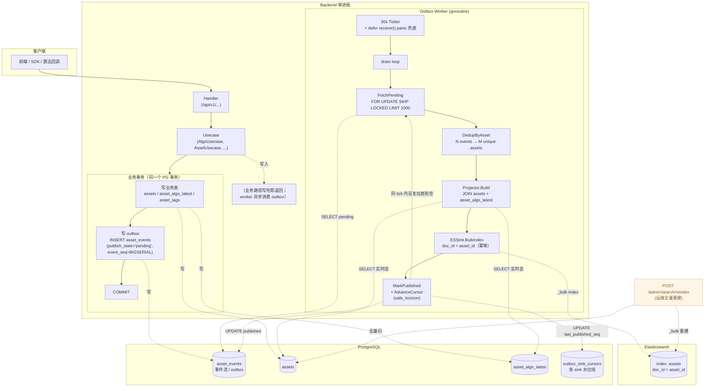
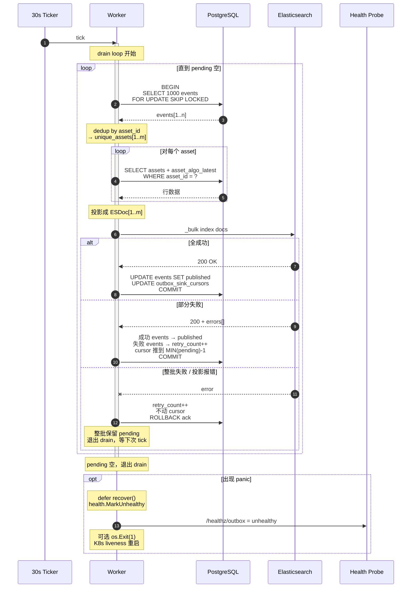
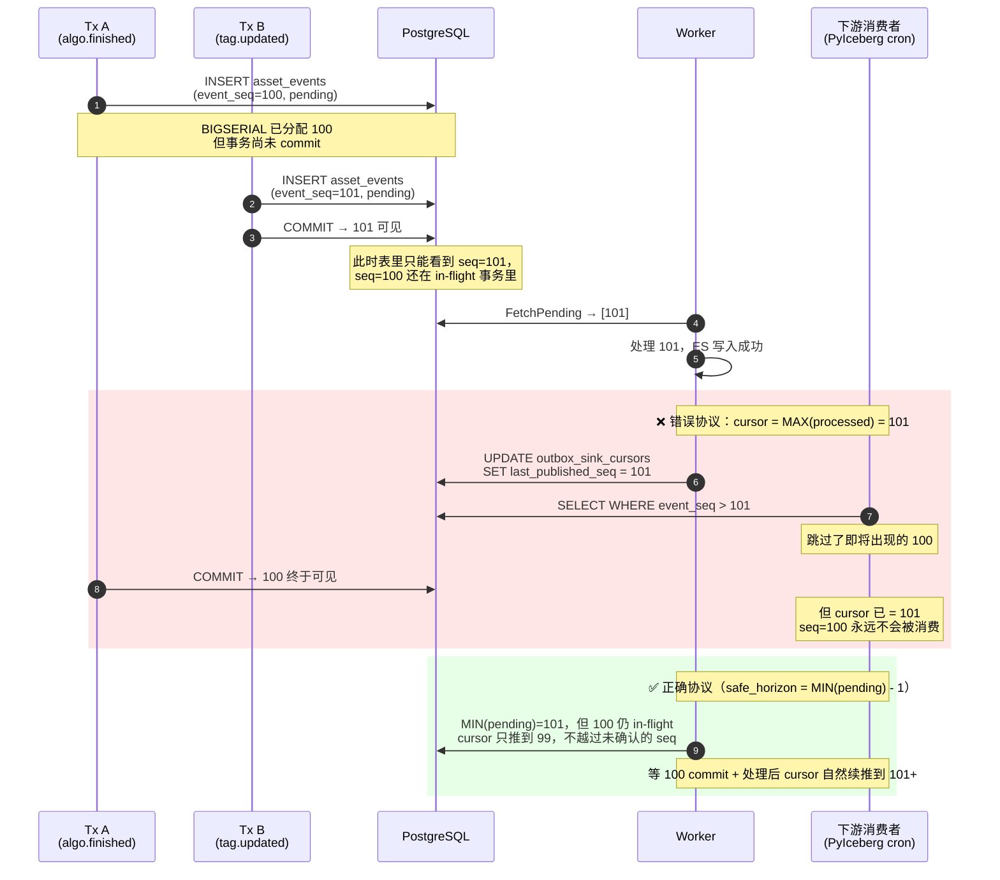
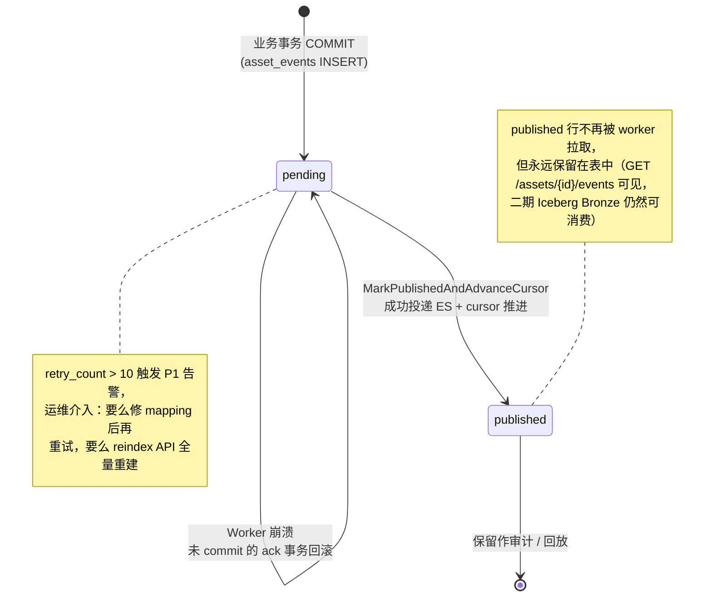

# Outbox Worker MVP 设计

> Scope：把 `asset_events` outbox 持久化事件流以**分钟级**延迟同步到
> Elasticsearch `assets` 索引。本文档是 `data-platform-design.md §5.6.2`
> 的工程落地版本，定义 MVP 的代码边界、并发模型、cursor 协议与验收标准。
>
> 同步路径采用**纯轮询**（单 worker、tick=30s），不使用 PG LISTEN/NOTIFY。
> 决策依据见 §16.1。

> Status：DRAFT，待评审。MVP 仅含 ES Sink；Iceberg Bronze staging Sink
> 列入二期。

---

## 1. 目标与非目标

### 1.1 目标

| # | 描述 | 验收 |
|---|------|------|
| G1 | PG `asset_events` 写入后，对应 asset 在 ES 可查时延 P99 < 60 s（tick 上限 + drain）| 集成测试，每秒 50 events 持续 60 s |
| G2 | Worker 重启不丢事件 | 杀 worker 后写 1k events 再重启，ES 最终全量到位 |
| G3 | 同一 asset 多次更新合并为最少 ES 写次数 | 1k events × 100 asset → ≤ 100 次 BulkIndex doc |
| G4 | ES 索引误删后可从任意 `event_seq` 重放重建 | reindex API 从 0 重放，doc 数与 PG `assets` 一致 |
| G5 | Cursor 推进不丢事件（即使并发 worker 标 `published` 顺序乱） | 注入乱序 ack，验证 `safe_horizon` 推进单调 |

### 1.2 非目标（MVP 不做）

- Iceberg Bronze staging Sink（二期）
- 多 worker 实例 SKIP LOCKED 并发拉取（先单 worker，预留接口）
- 向量库 Sink（3.x）
- 把 `asset.create / asset.update / tag.set` 业务侧补 `Append`（独立改动，不属于 worker 范畴）
- DLQ 表（先用 `retry_count` + 告警 + 人工 reindex 兜底）
- Web UI 监控（先靠 metrics + Feishu 告警）

---

## 2. 总体架构

### 2.1 数据流总览



> 关键：**没有 PG trigger，没有 LISTEN/NOTIFY，没有任何 PG → backend 的主动通道**。
> 业务事务 commit 后，事件静静躺在 `asset_events.publish_state='pending'`，
> 等下一次 tick（最多 30s）被 worker 拉走。

### 2.2 Worker 单次 Tick 的时序



---

## 3. 同步触发：纯轮询

### 3.1 为什么不用 LISTEN/NOTIFY

详见 §16.1。一句话：1 分钟延迟 SLA 下，NOTIFY 没有任何收益，反而引入：
- PG 端 `pg_notify_queue_usage` 灌满风险（业务事务可能因 trigger 失败而回滚）
- 持久 listener 连接 + 重连逻辑
- 必须保留 tick 兜底 ⇒ 等于两套代码

### 3.2 Schema 改动：零

`asset_events` 表既有 schema 已足够，本设计不需要新增任何 trigger / function / column。
worker 完全靠"按 tick 拉 `publish_state='pending'`"驱动。

---

## 4. Cursor 推进协议（safe_horizon）

### 4.1 为什么不能用 `MAX(本批 event_seq)`

参见 `data-platform-design.md §5.2.7` Issue 1 修复。简述：

- `event_seq BIGSERIAL` 是 INSERT 取号、COMMIT 才可见
- 多 worker 并发处理时，`publish_state='pending' → 'published'` 标记顺序与 `event_seq` 顺序无关
- 如果 worker 用 `MAX(本批 event_seq)` 推进 cursor，会越过尚未 commit / 尚未 ack 的更小 seq，**永久漏事件**

下图直观展示这个 race（关键是 `event_seq` 取号顺序 ≠ commit 顺序）：



> 注意上图是为了说明协议正确性的极端 race；本设计是单 worker，`SKIP LOCKED` 保证不会同时拉到同 seq。但 BIGSERIAL 的 commit-ordering 风险**与 worker 数无关**——只要存在并发的业务事务，就需要 `safe_horizon`。

### 4.2 协议：`safe_horizon = MIN(pending) - 1`

`asset_events.publish_state` 二态：`pending`（默认）→ `published`（worker 投递成功）。

每次推进 `outbox_sink_cursors.last_published_seq` 时执行：

```sql
-- 同事务内：
UPDATE asset_events
   SET publish_state='published', published_at=now()
 WHERE event_id = ANY(:processed_ids);

-- 推进 cursor 到"连续已发布的最大 seq"
UPDATE outbox_sink_cursors
   SET last_published_seq = COALESCE(
         (SELECT MIN(event_seq) - 1
            FROM asset_events
           WHERE publish_state = 'pending'),
         (SELECT MAX(event_seq) FROM asset_events)
       ),
       updated_at = now()
 WHERE sink_name = 'es_assets'
   AND last_published_seq < <计算值>;  -- 单调守卫
```

含义：
- 如果还有 pending 事件，`safe_horizon = MIN(pending) - 1`，cursor 永远不越过最小未确认事件
- 如果没有 pending，cursor = 当前最大 seq
- WHERE 守卫确保 cursor **单调**——并发 worker / 乱序 ack 都不能让它倒退

实现上抽出独立函数便于测试：

```go
// repo.ComputeSafeHorizon 返回应推进到的 cursor 值
//   - 若有 pending → MIN(event_seq WHERE pending) - 1
//   - 若无 pending → MAX(event_seq) 全表
func (r *OutboxRepo) ComputeSafeHorizon(ctx context.Context) (int64, error)
```

### 4.3 cursor 用途

仅供**直接消费 PG 的下游**（如未来的 PyIceberg CronJob、reindex API）使用。**ES Sink 自己不依赖 cursor**——它靠 `publish_state='pending'` 直接驱动，cursor 只是"对外可见的水位线"。

---

## 5. Worker 主循环

### 5.1 伪代码

```go
func (w *Worker) Run(ctx context.Context) (err error) {
    // 顶层 panic 兜底：goroutine panic 不会带崩主进程，但 outbox 会静悄悄死掉
    // 而 /healthz 仍报健康。recover 后置 health = unhealthy，可选让进程
    // os.Exit(1) 由 K8s liveness 自动重启容器。
    defer func() {
        if r := recover(); r != nil {
            log.Error("outbox worker panic", "recover", r, "stack", debug.Stack())
            w.health.MarkUnhealthy("panic: " + fmt.Sprint(r))
            err = fmt.Errorf("outbox worker panicked: %v", r)
            if w.cfg.FatalOnPanic {
                os.Exit(1)
            }
        }
    }()

    ticker := time.NewTicker(w.cfg.TickInterval) // 默认 30s
    defer ticker.Stop()

    for {
        select {
        case <-ctx.Done():
            return ctx.Err()
        case <-ticker.C:
        }

        // drain loop：同一个 tick 内一直拉到 pending 空再退出，
        // 保证 burst 写入不会被 30s 节奏限流。
        for {
            done, err := w.processBatch(ctx)
            if err != nil {
                log.Warn("processBatch failed", "err", err)
                break // 退到外层等下次 tick 重试
            }
            if done {
                break // 本轮 pending 已空
            }
        }
    }
}

// processBatch 处理一批；返回 (done=true) 表示当前 pending 已空。
func (w *Worker) processBatch(ctx context.Context) (done bool, err error) {
    // 1. 拉一批 pending（FOR UPDATE SKIP LOCKED 保证当前 worker 独占）
    events := w.repo.FetchPending(ctx, w.cfg.BatchSize)
    if len(events) == 0 { return true, nil }

    // 2. 按 asset_id 去重（同一 asset 取最大 event_seq）
    //    docToEvents 反向映射：asset_id → 该 asset 关联的所有 event_id
    assetIDs, docToEvents := dedupByAssetID(events)

    // 3. fan-out 投影
    docs := make([]ESDoc, 0, len(assetIDs))
    failedAssets := map[string]error{}
    for _, aid := range assetIDs {
        doc, err := w.projector.Build(ctx, aid)
        if err != nil {
            failedAssets[aid] = err
            continue
        }
        docs = append(docs, doc)
    }

    // 4. ES BulkIndex（doc_id=asset_id 幂等）
    bulkResult, err := w.esSink.BulkIndex(ctx, docs)
    if err != nil {
        // 整批失败：retry_count++，整批不标 published，下次 tick 重试
        w.repo.IncrementRetry(ctx, eventIDs(events), err.Error())
        return false, err
    }

    // 5. 计算"哪些 events 可以标 published"
    //    - ES bulk 部分失败的 doc → 对应 events 保留 pending 等下次重试
    //    - 投影失败的 asset → 对应 events 也保留 pending（projection 临时故障应自愈）
    //    - 其它 events → 标 published
    publishable, deferred := splitByOutcome(events, docToEvents, bulkResult, failedAssets)
    if len(deferred) > 0 {
        w.repo.IncrementRetry(ctx, deferred, "partial failure or projection error")
        w.metrics.BulkPartialFailureTotal.Inc()
    }

    // 6. 同事务：标 published + 推进 cursor（safe_horizon 自动跳过 deferred）
    if err := w.repo.MarkPublishedAndAdvanceCursor(ctx, publishable, "es_assets"); err != nil {
        return false, err
    }
    // batch 满 → 还可能有更多 pending；batch 未满 → pending 已空可退出 drain
    return len(events) < w.cfg.BatchSize, nil
}
```

### 5.2 关键不变量

| 不变量 | 实现 |
|---|---|
| 单 worker 独占 batch | `SELECT … FOR UPDATE SKIP LOCKED LIMIT N`（即使是单 worker，SKIP LOCKED 也能让"reindex API 临时启起的并行任务"不冲突） |
| 整批原子 ack | `MarkPublishedAndAdvanceCursor` 在单事务内更新 `asset_events` 与 `outbox_sink_cursors` |
| **ES 写失败不丢事件** | 整批失败 → 全部保留 pending，下次 tick 重试；**部分失败 → 失败 doc 对应的 events 保留 pending**，其余正常 ack；`safe_horizon` 协议保证 cursor 不越过这些 deferred events |
| 投影失败不丢事件 | `Projector.Build` 失败 → 该 asset 对应 events 保留 pending，下次 tick 重试；不会因为单条投影错误把整批吞掉 |
| Tick 错过 / 进程暂停不丢事件 | `asset_events` 是持久事件源；下一次 tick 自然补上。即便 worker 死 1 小时，事件全部安全堆在 `pending` |
| Worker 崩溃不丢事件 | 未 commit 的事务回滚，事件仍 `publish_state='pending'`，重启后重新拉 |
| Worker panic 不静悄悄死 | 顶层 `recover` → 健康降级 + 可选 `os.Exit(1)` 让 K8s liveness 重启 |
| Burst 场景不被 tick 节奏限流 | drain loop 在同一 tick 内反复 fetch 直到 pending 空，不靠下一次 tick 推进 |

### 5.3 单条 event 的状态生命周期



---

## 6. Doc 投影（fan-out）

### 6.1 输入与输出

```go
// 输入：asset_id
// 输出：ES doc，shape 与 elasticsearch-init 的 mapping 严格对齐

func (p *Projector) Build(ctx context.Context, assetID string) (ESDoc, error) {
    asset, err := p.assetRepo.Get(ctx, assetID)
    if err != nil { return nil, err }
    if asset == nil {
        // 资产已软删除：返回 tombstone 让 ES 删除该 doc
        return ESDoc{ID: assetID, Tombstone: true}, nil
    }

    algos, err := p.algoLatestRepo.ListByAsset(ctx, assetID)
    if err != nil { return nil, err }

    return projectToESDoc(asset, algos), nil
}
```

### 6.2 字段映射

| ES 字段 | 来源 | 说明 |
|---|---|---|
| `asset_id` | `assets.asset_id` | doc_id |
| `mcap_file_id` | `assets.mcap_file_id` | |
| `segment_locator` | `assets.segment_locator` | |
| `status` | `assets.status` | |
| `env` / `task` / `owner` / `reviewer` / `notes` / `batch` | 优先 `assets.<col>`（提升列），缺省退到 `assets.cf_meta->>field`（兼容期）| |
| `duration_sec` | `assets.duration_ms / 1000.0` | float |
| `delivery_count` | `assets.delivery_count` | int |
| `tag_priority` / `tag_quality` | `assets.cf_tag->>priority` / `quality` | 兼容期；将来切到 `asset_tags` 表 |
| `tags` | `assets.cf_tag` 整体 JSONB | dynamic object |
| `algo_summary` | `asset_algo_latest` 多行聚合 → `{algo_name: {status, version, output_uri, finished_at}}` | dynamic object |
| `created_at` / `updated_at` | `assets.<col>` | date |

### 6.3 Tombstone 处理

软删除（`assets.is_deleted=true`）时，`AssetRepo.Get` 返回 nil（已经过滤）。Projector 输出 tombstone marker → ES Sink 调 `DELETE /assets/_doc/<asset_id>` 而非 BulkIndex。

---

## 7. ES Sink 与 Mapping 自检

### 7.1 启动期幂等 mapping 校验

Worker 启动时执行：

```go
func (s *ESSink) EnsureMapping(ctx context.Context) error {
    exists, err := s.client.IndexExists(ctx, "assets")
    if !exists {
        return s.client.CreateIndex(ctx, "assets", embeddedMappingJSON)
    }
    // 索引已存在：检查 mapping 关键字段
    actual, _ := s.client.GetMapping(ctx, "assets")
    // 强校验：字段存在 + 类型匹配。只有"完整 + 类型对齐"才算可写。
    required := map[string]string{
        "asset_id":      "keyword",
        "updated_at":    "date",
        "duration_sec":  "float",
        "tags":          "object",
        "algo_summary":  "object",
        "is_deleted":    "boolean",
    }
    if missing := mappingDiff(actual, required); len(missing) > 0 {
        log.Warn("ES mapping incomplete or type mismatch; skipping auto-fix to avoid data loss",
            "missing_or_wrong", missing)
        s.health.MarkDegraded("es_mapping_mismatch")
        // 不自动 DELETE+PUT，记录告警让运维触发 reindex API
    }
    return nil
}
```

设计选择：**绝不自动 DELETE 索引**——即使 mapping 不全也只告警，由人工触发 `POST /admin/search/reindex?rebuild_index=true` 显式重建。这避免"启动期误删生产索引"的灾难场景。`mappingDiff` 同时校验字段缺失与类型不一致（如生产被人手 PUT 成 `keyword` 而 worker 期望 `date`），避免静默数据破坏。

> Mapping JSON embed 在 `backend/internal/outbox/sink_es_mapping.json`，与
> `deploy/local/elasticsearch/init-index.sh` 同源同义。CI 加一个 test
> assert 两份内容字节对齐，避免漂移。

### 7.2 BulkIndex 调用

复用现有 `backend/internal/elasticsearch/client.go:BulkIndex`，添加：
- 批大小上限：100 docs / batch（ES `_bulk` body 不超过 5 MB 经验值）
- 超时：15s（已是 `Client.httpClient.Timeout`）
- 部分失败：记录失败 doc_id 列表，整批仍标 published

---

## 8. 数据结构对齐（schema 已存在）

仅为评审方便重述。**不需要改 schema**。

### `asset_events`（`001_init.sql` 第 200–230 行）

| 列 | 类型 | worker 用途 |
|---|---|---|
| `event_id` | UUID PK | 标 published 时的目标 |
| `event_seq` | BIGSERIAL UNIQUE | 顺序、cursor、回放 |
| `event_type` | TEXT | 投影时可选过滤（MVP 不用，全部触发 doc 重建） |
| `aggregate_type` | TEXT, DEFAULT 'asset' | **MVP worker 不用**，但是未来 Iceberg / 多 sink 的 fan-out 路由 key（按 aggregate_type 分到不同 Bronze 表）。索引 `idx_asset_events_aggregate_time` 已建 |
| `asset_id` | UUID | dedup 与投影主键 |
| `publish_state` | TEXT, DEFAULT 'pending' | 'pending' → 'published'（二态）|
| `published_at` | TIMESTAMPTZ | ack 时间 |
| `retry_count` | INT | 失败计数 |
| `last_error` | TEXT | 最近一次失败原因 |
| `event_payload` | JSONB | MVP 不用（fan-out 直接读 PG），保留给将来 schema replay |

### `outbox_sink_cursors`

| 列 | worker 用途 |
|---|---|
| `sink_name` PK | MVP 写死 `'es_assets'` |
| `last_published_seq` | 单调推进的水位线 |
| `updated_at` | 监控 stale cursor |

---

## 9. 错误与重试策略

| 失败类型 | 行为 | 上限 / 退避 |
|---|---|---|
| PG `FetchPending` 失败（连接抖动 / 死锁） | 指数退避：1s → 2s → 5s → 10s（封顶），不退出循环 | 持续 > 1 min 触发 P1（`outbox_fetch_deadlock_total`）|
| 单条 doc 投影失败（PG 中查不到 asset 等异常）| log warn，**对应 events 保留 pending**，其它继续；下次 tick 重试 | retry_count > 10 触发 P1 告警 |
| ES BulkIndex 整批失败 | `retry_count++`，整批不标 published，下次 tick 重试 | retry_count > 10 触发 P1 告警 |
| **ES BulkIndex 部分失败** | **失败 doc 对应 events 保留 pending**（详见 §5.1 步骤 5），成功 doc 对应 events 标 published；safe_horizon 自动停在最早的 pending | 同上 retry_count > 10 |
| Tombstone DELETE 失败 | 单独计数（`outbox_tombstone_failure_total`）+ 保留 pending；ES 文档仍存在不算业务错误（搜索结果过滤 `is_deleted=true` 仍可兜底）| WARN |
| `MarkPublishedAndAdvanceCursor` 事务失败（典型：与 reindex 并发死锁） | 死锁 → 重试 3 次（间隔 200ms）；其他错误 → log + 保持 pending | `outbox_cursor_deadlock_total` rate > 0.05/s 触发 WARN |
| Worker panic | 顶层 recover + 健康降级 + （可选）`os.Exit(1)` → K8s liveness 重启 | — |

> MVP **不实现 DLQ 表**。`retry_count > 10` 的事件继续 pending，等待人工
> 介入。`outbox_oldest_pending_age_seconds` 是真正反映滞后的指标，
> 持续超阈值时由运维评估：通常等 worker 自然 drain 即可；极端长 gap
> （比如 ES 宕数天后恢复）下若觉得 pending 太多想加速，直接调一次
> `POST /admin/search/reindex` 全量重建即可，不需要复杂的"跳过状态机"。

---

## 10. 配置

| 环境变量 | 含义 | MVP 默认 |
|---|---|---|
| `OUTBOX_WORKER_ENABLED` | 是否启动 worker goroutine | `false`（开发期手动开） |
| `OUTBOX_BATCH_SIZE` | 每批拉取事件上限。**默认 1000**——hot asset 场景下一次拉光，避免 drain 多轮重复投影同一 doc | `1000` |
| `OUTBOX_TICK_INTERVAL` | 轮询间隔；端到端延迟上限 ≈ 此值 + drain time | `30s` |
| `OUTBOX_RETRY_LIMIT` | 触发告警的 retry_count 阈值 | `10` |
| `OUTBOX_FATAL_ON_PANIC` | worker panic 时是否 `os.Exit(1)` 让 K8s 重启容器 | `true`（生产）/ `false`（本地）|
| `ELASTICSEARCH_URL` | ES 地址 | 现有 |
| `ELASTICSEARCH_INDEX` | 索引名 | `assets` |

加到 `backend/.env.example` 与 `internal/config/config.go`。

---

## 11. 可观测性

### 11.1 Metrics（Prometheus 风格命名，先写日志结构化输出）

| 指标 | 类型 | 含义 | 告警阈值 |
|---|---|---|---|
| `outbox_worker_batch_size` | histogram | 每轮拉取事件数 | — |
| `outbox_worker_batch_duration_ms` | histogram | 单轮处理耗时 | P99 > 5 s 持续 5 min |
| `outbox_worker_pending_total` | gauge（每分钟采样）| `count(*) WHERE publish_state='pending'` | WARN > 10 000 / P1 > 100 000 持续 5 min |
| `outbox_oldest_pending_age_seconds` | gauge | `now() - MIN(occurred_at) WHERE publish_state='pending'`，**这是真正反映"延迟"的指标** | WARN > 5 min / P1 > 1 h / P0 > 24 h |
| `outbox_worker_retry_max` | gauge | `MAX(retry_count) WHERE publish_state='pending'` | WARN > 5 持续 10 min |
| `outbox_sink_lag_seq` | gauge | `MAX(event_seq) - last_published_seq` | WARN > 10 000 持续 5 min |
| `outbox_es_bulk_failures_total` | counter | ES bulk **整批**失败次数 | rate > 0.1/s |
| `outbox_bulk_partial_failure_total` | counter | ES bulk **部分**失败次数（≥ 1 doc 失败）| rate > 0.5/s 持续 5 min |
| `outbox_tombstone_failure_total` | counter | DELETE doc 失败 | WARN |
| `outbox_fetch_deadlock_total` | counter | `FetchPending` 死锁次数 | WARN rate > 0.05/s |
| `outbox_cursor_deadlock_total` | counter | `MarkPublishedAndAdvanceCursor` 死锁次数 | WARN rate > 0.05/s |

### 11.2 关键日志（INFO/WARN）

```
{"level":"info","msg":"outbox batch processed","events":127,"docs":48,"duration_ms":312,"sink":"es_assets"}
{"level":"warn","msg":"projection failed","asset_id":"...","err":"asset not found","action":"skipped"}
{"level":"warn","msg":"es bulk partial failure","failed_ids":["..."],"total":50,"sink":"es_assets"}
{"level":"error","msg":"es bulk total failure","err":"...","retry_count":3,"action":"retry_next_tick"}
```

---

## 12. 测试策略

### 12.1 单元测试

| 文件 | 覆盖 |
|---|---|
| `outbox/projection_test.go` | `BuildAssetDoc`：含 algo 多行聚合、tombstone、cf_meta 兼容回退 |
| `outbox/cursor_test.go` | `safe_horizon` 计算：注入乱序 ack 验证 cursor 单调 |
| `outbox/worker_test.go` | 主循环：mock repo + sink，验证去重 / batch 行为 |

### 12.2 集成测试（Postgres + ES 真实容器）

| 测试 | 验收 |
|---|---|
| `TestE2E_Notify_HappyPath` | 写 1 个 event → < 2 s 内 ES 可查 |
| `TestE2E_DedupBatch` | 同 asset 写 100 events → ES 实际 BulkIndex doc 数 = 1 |
| `TestE2E_RestartReplay` | 写 100 events → 杀 worker → 再写 100 → 重启 → ES 最终 200 |
| `TestE2E_ConcurrentAck_NoSeqGap` | 模拟乱序 publish 标记 → cursor 永不越过 MIN(pending) - 1 |
| `TestE2E_ESDown_Backpressure` | ES 容器停掉 30 s → 期间事件累积在 pending → ES 恢复后全量到位 |

放在 `backend/internal/outbox/integration_test.go`，用 testcontainers-go 起 PG + ES，build tag `//go:build integration` 隔离。

---

## 13. 文件布局

```
backend/internal/outbox/
├── worker.go              # Run + processBatch 主循环（~120 行）
├── projection.go          # BuildAssetDoc + 字段映射（~80 行）
├── sink_es.go             # ESSink (BulkIndex + DeleteDoc + EnsureMapping)（~80 行）
├── sink_es_mapping.json   # 与 init-index.sh 同源
├── repo.go                # OutboxRepo: FetchPending / MarkPublishedAndAdvanceCursor / IncrementRetry（~120 行）
├── config.go              # 环境变量解析（~30 行）
└── *_test.go
```

`main.go` 接线（伪代码）：

```go
if cfg.OutboxWorkerEnabled {
    worker := outbox.NewWorker(pgClient, esClient, assetRepo, algoLatestRepo, cfg.Outbox)
    go func() {
        if err := worker.Run(ctx); err != nil {
            log.Error("outbox worker exited", err)
        }
    }()
}
```

---

## 14. Reindex API（同步交付，~50 行）

为 G4、mapping 漂移、长 gap 恢复三个场景兜底——**全量基于 `assets` 表重建 ES**。

```
POST /admin/search/reindex
Body: { "rebuild_index": false, "dry_run": false }
权限：独立 ADMIN_TOKEN，不与 X-Grace-Token 共享
```

执行步骤：

1. 可选 rebuild：`rebuild_index=true` 时先 `DELETE /assets` + `PUT /assets` with mapping
2. `SELECT asset_id FROM assets WHERE is_deleted=false ORDER BY asset_id` 分页扫
3. 每页调 `projection.Build(asset_id)` + `BulkIndex`，失败累计返回不中断
4. **不动 outbox cursor / publish_state**——这是"基于源表的全量重建"，与事件流并行

返回：

```json
{ "rebuild_index": true, "reindexed_assets": 10248, "failed_assets": ["uuid-..."], "duration_ms": 42510 }
```

> 设计要点：
> - reindex 期间 worker 继续正常消费 outbox，doc_id 幂等保证两路写入不冲突
>   （后写者赢，最终态都来自同一个 `assets` 源，结果一致）
> - 长 gap 恢复时只需调一次 `reindex` 把 ES 拉回当前态，pending 中"过时事件"
>   被 worker 重新处理时也只是 BulkIndex 同样的最终态，**不会回退数据**
> - 不实现"从 `event_seq` 重放事件流"——保留给二期

---

## 15. 验收清单（合并入 PR 必过）

- [ ] `go build ./... && go vet ./... && go test ./...` 全过
- [ ] 集成测试 5 个 case 全过
- [ ] `OUTBOX_WORKER_ENABLED=false` 时 backend 行为与现状完全一致（回滚保险）
- [ ] `OUTBOX_WORKER_ENABLED=true` 启动后，对 5 个 seed asset 调一次 `POST /admin/search/reindex` → ES `_count` = 5
- [ ] 触发 `algo.start` → ≤ 60 s 内 ES doc 的 `algo_summary` 出现该 algo（一次 tick + drain 余量）
- [ ] 杀 worker / 杀 ES 容器 / 重启 backend 三种故障注入手动验证一遍
- [ ] `metrics_summary.md` 增加 outbox 指标说明
- [ ] `data-platform-design.md §5.6.2` 末尾加一行链接到本文档

---

## 16. 风险与开放问题

### 16.1 为什么不用 LISTEN/NOTIFY（决策记录）

| 维度 | 纯 polling（本设计）| LISTEN/NOTIFY |
|---|---|---|
| 端到端延迟 P50 / P99 | ~15s / ~30s | ~100ms / ~2s |
| 延迟是否在 SLA 内（1 min）| ✅ | ✅ |
| PG 端开销 | 0 | trigger × 每事务 + `pg_notify` 调用 |
| PG `pg_notify_queue_usage` 风险 | 无 | listener 卡住会灌满 SLRU 队列 → **trigger 报错 → 业务事务回滚** |
| 持久 listener 连接 | 无 | 占用 1 个 PG slot；网络抖断后需重连逻辑 |
| 必须保留 tick 兜底 | ✅（本身就是 tick）| ✅（NOTIFY 不可靠）→ 等于两套机制 |
| 代码复杂度 | ~25 行 | ~50 行（含 listener 重连）|
| 故障域 | 1（worker）| 2（worker + listener）|

**结论**：1 分钟 SLA 下，NOTIFY 唯一收益是"trickle 场景首批省 30 秒"——burst 和 hot-asset 场景都被 drain time 吸收，没有可观测的差别。但它引入业务事务被 trigger 拖累的真实风险。**直接砍掉**。

### 16.2 风险登记

| 风险 | 缓解 |
|---|---|
| `MIN(event_seq) WHERE pending` 在 `asset_events` 行数大时变慢 | `idx_asset_events_publish_pending` 部分索引（`WHERE publish_state='pending'`）已存在，EXPLAIN 验证后再上线 |
| ES Sink 部分失败 | 失败 doc 对应 events 保留 pending，safe_horizon 自动等待重试 |
| 长 gap 恢复（ES 宕数天）期间 pending 累积 | 不影响 PG 主路径写入；恢复后 worker 自然 drain；若想加速，调一次 `POST /admin/search/reindex` 全量重建即可。指标 `outbox_oldest_pending_age_seconds` 是 SLO 主依据 |
| **Hot asset**（同 asset 短时间被密集更新）| dedup by asset_id 已是天然防护：N 行 → 1 doc。`OUTBOX_BATCH_SIZE` 默认 **1000**（不是 200）专门为此场景——一次拉完 hot asset 所有 pending，drain 内只投影 1 次写 1 次。业务侧应在 API 层加 `Idempotency-Key` + 单 asset 限流（建议 10/s）从根上抑制 |
| Worker goroutine panic 不带崩主进程，但 panic 后不再消费 | 顶层 `recover` → `health.MarkUnhealthy` + 可选 `os.Exit(1)`；K8s liveness probe 检查 `/healthz/outbox`，自动重启容器 |
| Mapping 漂移（init-index.sh vs sink_es_mapping.json）| CI assertion 字节比对，diff 必失败 |
| 事件 payload schema 演进 | MVP 不读 payload；二期"从 event_seq 重放"开始才需要 `payload_schema_version` 兼容矩阵 |

### 16.3 开放问题（评审时定）

1. **Reindex API 鉴权**：内网 IP allowlist vs 独立 admin token？倾向独立 token（`ADMIN_TOKEN` env），便于本地开发。
2. **Worker 启动是否阻塞 backend `/healthz`**：MVP 倾向"非阻塞"——worker 故障不影响 API。但需要单独的 `/healthz/outbox` 端点供 ops 检查。
3. **何时切 Debezium / Kafka**：触发条件登记在路线图，不是现在的事。触发条件至少满足两条：(a) 持续写入 ≥ 5k TPS；(b) sink 数量 ≥ 3。当前仅 1 个 sink，远未到。

---

## 17. 上线节奏

| 阶段 | 内容 | 退出条件 |
|---|---|---|
| Phase 0 | 本设计文档评审通过 | 评审 sign-off |
| Phase 1 | 代码 + 单元测试 + 集成测试 | PR 合入 main |
| Phase 2 | 本地 docker compose 全链路验证 | 手动 5 min smoke 全过 |
| Phase 3 | 默认 `OUTBOX_WORKER_ENABLED=false` 部署到 staging | 24h 无回退 |
| Phase 4 | staging 切 `true`，观察 24 h | metrics 全绿，告警 0 |
| Phase 5 | 生产灰度（10% → 100%）| 灰度期间无 P1 |

回滚方案：任何阶段出问题 → `OUTBOX_WORKER_ENABLED=false` 一键关闭，业务事务侧不受影响（事件继续累积在 PG，问题修复后开 worker 自然追上）。
