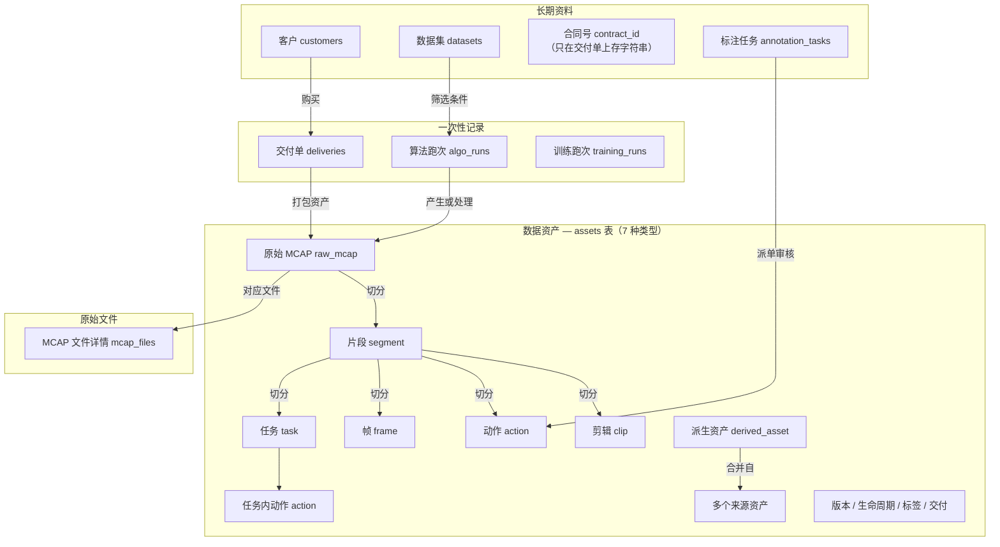

# DataBrew 业务建模总览

| 字段 | 值 |
|------|----|
| 状态 | 业务模型顶层导览（权威入口）|
| 日期 | 2026-05-21 |
| 表结构细节 | [`schema.md`](./schema.md) |
| 分模块设计 | [`design/*.md`](./design/)（6 篇）|
| 历史版本 | [`archive/`](./archive/) |

---

## 0. 这份文档是干什么的

> **帮你看懂 DataBrew 里有哪些「东西」、它们怎么关联、对应哪些数据库表。**
>
> 需要建表语句、字段细节、API 时，再去看 [`schema.md`](./schema.md) 和 `design/` 里的分篇设计。

**怎么读：**

- **快速了解**：读本文 §1–§3，约 15 分钟
- **深入某个模块**：本文 + 对应的 `design/*.md`
- **写代码 / 改表**：`design/*.md` + [`schema.md`](./schema.md)

---

## 1. 平台里的 4 类「东西」

DataBrew 把所有业务对象分成 **4 类**。分类看的是**这东西会不会变、怎么变**——跟「卖不卖钱」无关（卖不卖是另一回事）。

| 类型 | 怎么认 | 例子 | 平台怎么处理 | 在 `assets` 主表吗 |
|------|--------|------|-------------|------------------|
| **原始文件** | 外面录进来的，文件内容本身改不了 | `mcap_files`（MCAP 文件信息） | 只读、不分版本 | ✗（挂在 raw_mcap 资产下面，一对一补充信息）|
| **数据资产** | 可以切分、组合、打标、卖；同一逻辑物可以有 v1/v2/v3 | raw_mcap、segment、clip、action、frame、task、derived_asset | 版本管理、生命周期、标签、交付、搜索 | ✓ |
| **一次性记录** | 事情发生了就记一笔，记录本身不再改 | 算法跑次 `algo_runs`、交付单 `deliveries` | 只追加、用状态字段推进流程 | ✗ 独立表 |
| **长期资料** | 长期存在、会被反复引用，可以改资料但不需要 v1/v2 | 客户 `customers`、数据集 `datasets` | 可改、不分版本、本身不直接交付 | ✗ 独立表 |

> `annotation_tasks`（标注任务）归**长期资料**：任务可以改、可以重新派，跟「算法跑次」「交付单」那种记完就不改的不一样。详见 [`design/annotation-tasks-p1.5.md`](./design/annotation-tasks-p1.5.md)。

> **raw_mcap 特殊说明**：原始 MCAP 也在 `assets` 表里，但版本相关字段对它基本固定（永远 v1、不会被新版本替换）。文件入库进度看 `mcap_files` 上的状态，资产业务状态看 `assets` 上的生命周期字段——两套状态各管各的。

### 1.1 为什么不用「能不能卖」来分类

商业模式会变。**分类必须跟卖不卖脱钩**，否则商业策略一变，数据库就要大改。

### 1.2 只有「数据资产」才享有的能力

在 `assets` 表里的东西：多版本、生命周期、打标签、交付给客户、进搜索，以及标签/算法结果/指标/评估/操作日志/关系等配套表。客户、算法跑次、原始文件信息等不需要这套。

---

## 2. 实体关系大图



**关键关系（白话）：**
- 每个 raw_mcap 资产对应一条 `mcap_files` 文件记录
- 客户 → 交付单；交付单里列出具体卖了哪些资产
- 算法跑次会产生或处理资产；相关结果写在标签、算法结果等表里，并关联 run_id
- 标注任务派给标注员，产出的 action 会挂到对应任务
- 数据集、训练跑次通过清单文件间接引用资产

---

## 3. 数据表清单

DataBrew **「管资产 → 跑算法 → 打标签 → 卖给客户」** 主链路用到的数据库表，分三层：

| 层次 | 包含什么 | 一句话 |
|------|---------|--------|
| **核心表** | `assets` / `logical_assets` / `mcap_files` / `algo_runs` / `customers` / `actions` | 资产、文件、算法跑次、客户 |
| **资产附属表** | `asset_tags` / `asset_algo_latest` / `asset_metrics` / `asset_eval_results` / `asset_events` / `asset_relations` | 标签、算法结果、指标、评估、操作日志、关系 |
| **交付相关** | `deliveries` / `delivery_items` / `delivery_rules` | 订单、卖了什么、能不能卖 |

> 交付相关算 3 张表，加上前面 12 张，主链路共 **15 张表**。

#### 核心表（6 张 + 1 张扩展）

| # | 表 | 干什么 | 例子 |
|---|----|--------|------|
| 1 | `assets` | 所有数据资产的**主登记簿**：clip、segment、action、raw_mcap 等 | 某 30 秒 clip、某 10 分钟 segment |
| 2 | `logical_assets` | **版本总控**：同一 clip 现在第几版、共几版（不存 clip 内容本身）| clipA 从 v1 升到 v2 |
| 3 | `mcap_files` | 原始 MCAP **文件详情**：路径、格式、校验码、入库进度等 | `recording_20250521.mcap` 入库信息 |
| 4 | `algo_runs` | **算法跑了一次**的记录：输入、输出、状态；记完不改 | hand_track 批量跑完，run_id `R001` |
| 5 | `customers` | **客户资料**：名称、区域、合规要求、联系人等 | `cust_alpha`（不要含个人敏感信息的客户）|
| 6 | `actions` | **动作类资产**的专属补充：时间窗、来自哪次算法跑次等 | segment 上 12:00–12:05 的「抓取」动作 |

#### 资产附属表（6 张）

| # | 表 | 干什么 | 例子 |
|---|----|--------|------|
| 7 | `asset_tags` | **标签**（键值对），人工、算法、规则各写各的，可共存 | `场景=厨房`、`算法版本=2.0` |
| 8 | `asset_algo_latest` | 每个资产**最新算法处理结果** | segment 当前是 hand_track v2.0 的结果 |
| 9 | `asset_metrics` | **单个数字指标**（质量分、时长等）| 质量分 0.92 |
| 10 | `asset_eval_results` | **完整评估报告**（比 metrics 更详细）| hand_track 评估 JSON |
| 11 | `asset_events` | **操作日志**：谁创建、切分、打标、交付、升版本 | 「用户 A 把 clipA 升到 v2」|
| 12 | `asset_relations` | 资产之间的**关系**：谁从谁切来、谁合并了谁 | 派生资产 X 来自 segment A、B |

#### 交付相关（3 张表）

| # | 表 | 干什么 | 例子 |
|---|----|--------|------|
| 13a | `deliveries` | **交付订单**：卖给谁、进度到哪了；合同号暂存字符串 | 给 cust_alpha 打包 500 个 clip |
| 13b | `delivery_items` | 订单里**具体哪些资产、哪一版**；客户拿到的是快照 | 订单含 clipA_v2、clipB_v1 |
| 13c | `delivery_rules` | **交付前检查规则**：含敏感标签的不能卖给某类客户等 | 含个人信息的资产禁止交付 |

> 主链路共 **15 张表**。版本升级流程、`logical_assets` 举例见 [`schema.md` §3](./schema.md#3-logical_assetsb-路由协调)；建表细节见 [`schema.md`](./schema.md)。

#### 其他表

| 表 | 干什么 | 详见 |
|----|--------|------|
| `annotation_tasks` | 标注任务派发、审核 | [`design/annotation-tasks-p1.5.md`](./design/annotation-tasks-p1.5.md) |
| `datasets` / `dataset_snapshots` / `training_runs` | 机器学习数据集与训练记录 | `schemas/pg-phase0.sql` |
| `asset_usage_stats` / `asset_favorites` | 浏览统计、用户收藏 | `schema.md` |

#### 两个数据库辅助功能（不是表）

| 名字 | 干什么 |
|------|--------|
| `asset_relations_readable` | 查资产关系时，把字段名改成「主语 / 关系 / 宾语」，更好懂 |
| `trg_logical_assets_type_immutable` | 防止有人误改版本总控里的资产类型（clip 不能改成 action）|

### 3.1 文档 vs 现网：差在哪

> 本文描述的是**目标设计**。现网代码和表结构大约只完成了一半。**别默认文档 = 线上已有。**

| 设计里有 | 现网 | 严重程度 | 说明 |
|---------|------|---------|------|
| `logical_assets` 表 | 没有 | 高 | 需要新建 |
| `algo_runs` 表 | 没有 | 高 | 需要新建 + 改 API |
| `customers` 表 | 没有（交付单上客户 ID 只是字符串）| 高 | 需要新建 + 关联交付单 |
| `delivery_rules` 表 | 没有 | 中 | 交付校验会受影响 |
| 资产版本三字段 | 没有 | 高 | 需要改表 + 改搜索 + 改 API |
| `asset_tags` 支持多来源 | 主键设计不对 | 高 | 需要改表结构（破坏性）|
| 写入校验逻辑 | 没有 | 高 | 需要开发 |
| 搜索索引含版本字段 | 没有 | 高 | 需要改搜索同步 |

**结论**：不是小修小补，大致 **3–4 周**量级。工程量见 [schema.md §17.6](./schema.md#176-总工程量)。

---

## 4. 分篇设计文档

6 篇独立文档，每篇讲一个模块。需要细节时点开看。

### 4.1 建议阅读顺序

```
① 资产层级与切分          ← 有哪些资产、怎么切
② 资产多版本              ← v1/v2/v3 怎么管
③ 算法跑次                ← 算法跑了什么、留下什么
④ 标签与评估              ← 怎么打标、评分
⑤ 客户与交付              ← 怎么卖给客户
⑥ 标注任务（草稿）        ← 标注队流程
```

### 4.2 文档清单

| # | 文档 | 讲什么 | 状态 |
|---|------|--------|------|
| 1 | [`asset-hierarchy-and-derivatives`](./design/asset-hierarchy-and-derivatives.md) | 7 种资产类型、切分层级、文件与资产关系 | 已定稿 |
| 2 | [`asset-versioning`](./design/asset-versioning.md) | 多版本、升级流程、算法产物对应规则 | 已定稿 |
| 3 | [`algo-runs`](./design/algo-runs.md) | 算法跑次记录、与资产和标签的关联 | 已定稿 |
| 4 | [`asset-tagging`](./design/asset-tagging.md) | 标签、指标、评估怎么分、怎么存 | 已定稿 |
| 5 | [`customers-and-deliveries`](./design/customers-and-deliveries.md) | 客户资料、交付订单、交付规则 | 已定稿 |
| 6 | [`annotation-tasks-p1.5`](./design/annotation-tasks-p1.5.md) | 标注任务派发与审核 | 草稿 |

---

## 5. 已定的重要决策（摘要）

完整决策记录在各自 design 文档里。这里只列**结论**，方便快速对齐：

| 决策 | 结论 |
|------|------|
| 对象分 4 类 | 原始文件 / 数据资产 / 一次性记录 / 长期资料 |
| raw_mcap | 进资产主表；文件详情放 `mcap_files` 补充表 |
| 算法跑次 | 独立表 `algo_runs`，记完不改 |
| 资产多版本 | 同一 clip 可有 v1/v2；由算法 SDK 指定是否属于同一逻辑资产 |
| 客户 | 独立 `customers` 表，交付单关联客户 |
| 合同 | 暂不建表，交付单上存合同号字符串 |
| 标签 | 同一标签 key 允许多来源各写一条 |
| 数据集 / 训练 | 不进资产主表，用独立表 + 清单文件 |

---

## 6. 目录结构

```
docs/review/unified-asset-catalog/
├── README.md          ← 本文（总览）
├── schema.md          ← 建表细节
├── design/            ← 6 篇分模块设计
└── archive/           ← 历史版本
```

---

## 7. 一句话总结

> DataBrew 管四类对象：**原始文件、数据资产、一次性记录、长期资料**。
>
> 主链路 **15 张表**：登记资产 → 记算法跑次 → 打标签 → 交付给客户。
>
> 核心设计：**补客户表和算法跑次表、资产支持多版本、原始 MCAP 进资产主表**。
>
> 现网大约完成一半，按本文落地大约还需 **3–4 周**。

---

## 附录：名词对照

| 中文 | 表/类型名 | 属于哪类 |
|------|----------|---------|
| 原始 MCAP | raw_mcap | 数据资产 |
| 片段 | segment | 数据资产 |
| 剪辑 | clip | 数据资产 |
| 动作 | action | 数据资产 |
| 帧 | frame | 数据资产 |
| 任务 | task | 数据资产 |
| 派生资产 | derived_asset | 数据资产 |
| MCAP 文件信息 | mcap_files | 原始文件 |
| 算法跑次 | algo_runs | 一次性记录 |
| 交付单 | deliveries | 一次性记录 |
| 客户 | customers | 长期资料 |
| 数据集 | datasets | 长期资料 |
| 标注任务 | annotation_tasks | 长期资料 |
