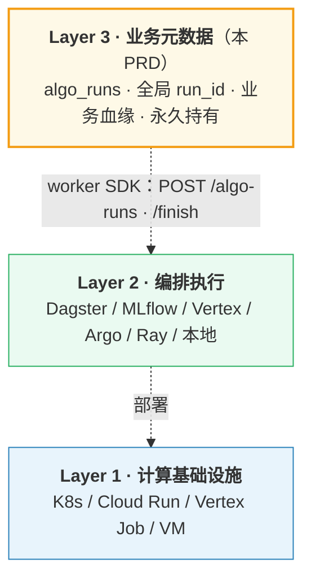

# 算法运行（algo_runs）一等实体设计

| 字段 | 值 |
|------|----|
| 状态 | Active（P1）|
| 关联 | `../README.md` §6 / `../schema.md` §5 / `../../algo-lifecycle-and-data-model.md`（既有的 asset_algo_latest 投影模型）|
| 决策来源 | rev.12 决策 1（B1/B2/Q1.1/Q1.2/Q1.3） + Q1.4-1.5（运行流） |

---

## 1. 业务问题（Why）

### 1.1 痛点

「**3 个月前那次 hand_track@2.0 重跑：用了什么参数？影响了哪些 asset？花了多少 GPU？哪些失败了？**」 → **现在答不出**。

**现网痕迹（说明需求已经存在）：**
- `asset_algo_latest.run_id` TEXT（散落，无 外键）
- `actions.run_id` TEXT
- `asset_eval_results.run_id` TEXT
- `asset_events.system_metadata->>'run_id'`
- **4 张表都建了 run_id 索引**，说明早就在反查
- **但没有正向入口**：无 `algo_runs` 表 / 无 `GET /algo-runs/{id}` API
- run-level 元数据（params / inputs / GPU 时长 / 失败原因 / 资源消耗）**没地方存**，散在 `result_summary` JSONB / event payload 里

### 1.2 与现有 `asset_algo_latest` 的关系

**`asset_algo_latest` 是「per asset 的算法当前态投影」**（详见 `../../algo-lifecycle-and-data-model.md`）：
- PK: `(asset_id, algo_name)`
- 每个资产 × 每个算法 = 1 行（覆盖式 upsert，单调 algo_version 守卫）
- 业务用：「这个 asset 上 hand_track 当前是什么状态/版本」

**`algo_runs` 是「per run 的执行事件实体」**（rev.12 新增，本文档定义）：
- PK: `run_id`
- 每次算法启动 = 1 行
- 业务用：「这次 run 跑了什么 / 影响哪些 asset / 花了多少资源」

→ **两者互补，不冲突**。algo_runs 是「跑」，asset_algo_latest 是「跑完后留在 asset 上的痕迹」。

### 1.3 本 PRD 边界：元数据登记，不管执行

**`algo_runs` 只管「业务必要的元数据登记」，不管 worker 在哪跑、怎么调度、怎么重试**。这是有意识的分层：



**核心契约**：worker 通过 SDK 调用 `POST /algo-runs/start` 拿全局 `run_id` → 跑算法（任意运行时）→ `POST /algo-runs/{id}/finish` 回写状态。底下 Layer 1/2 用什么完全不影响 Layer 3 的设计。

#### 「锚点 + 外链」字段（rev.13 候选）

为支持任意编排平台，建议在 `algo_runs` 加 3 个字段：

```sql
ALTER TABLE algo_runs ADD COLUMN
  external_runtime TEXT,        -- 'dagster' | 'mlflow' | 'vertex' | 'argo' | 'ray' | 'local' | NULL
  external_run_id  TEXT,        -- 平台原始 ID（UUID / URN / 自定义 ID）
  external_url     TEXT;        -- 跳转链接（点过去看详细 logs / metric 曲线 / pod 状态）
```

业务方查 `algo_runs` 看业务必要字段，点 `external_url` 跳外部平台看执行细节。

#### 为什么不直接用平台 ID 而要在 PG 留锚点

| 问题 | 直接用平台 ID | 用 algo_runs 锚点 |
|---|---|---|
| 多平台并存（K8s + Vertex + 本地）| run_id 格式各不同，`asset_relations.metadata.run_id` 无法统一 | ✅ 全局 16 位 ID 统一命名空间 |
| 外部平台数据保留期到（Vertex 30-90 天）| 历史血缘断 | ✅ 业务必要字段永久在 PG |
| 换平台（MLflow → Dagster）| 历史 run_id 全部失效 | ✅ external_url 跟着换，run_id 不变 |
| 业务表 FK 约束（`asset_algo_latest.run_id` / `actions.run_id` ...）| 外部 ID 无法做 PG FK | ✅ 强 FK 保证不孤儿 |
| 客户合规（3-7 年追溯）| 外部平台保留期不够 | ✅ PG 永久持有 |

#### 跟 Dagster / MLflow / Marquez 的关系

`algo_runs` **不替代任何外部平台**，是它们的**业务元数据锚点**：

| 工具 | 干啥 | 跟 algo_runs 关系 |
|---|---|---|
| **Dagster / Argo / Airflow / Prefect** | 流水线编排 + 执行 + 内部血缘 | worker 在这运行；通过 SDK 写 PG，PG 存 `external_runtime='dagster'` |
| **MLflow Tracking** | 算法实验跟踪 + metric 曲线 UI | 算法工程师专用 UI；详见 [`mlflow-integration.md`](mlflow-integration.md) |
| **Marquez（OpenLineage）** | 业务血缘可视化 | PG events outbox 投递；详见 [`openlineage-integration.md`](openlineage-integration.md) |
| **Vertex AI / Kubeflow** | 托管 ML 平台 | worker 跑在这，SDK 写 PG |

**理想流**：worker 在 Dagster 跑 → 同时写 PG `algo_runs` + MLflow run + Marquez event → 三个 UI 各看各的，PG 是单一事实源。

---

## 2. 设计原则（How）

### 2.1 algo_runs 是「执行事件」类一等实体

按 `../README.md` §1 的 4 类一等实体分层：

| 实体类型 | 例 | algo_runs 归类 |
|---------|----|--------------|
| 物理事实 | mcap_files | ✗ |
| 业务资产 | assets | ✗（algo_runs 是事件，不演进版本）|
| **执行事件** | deliveries / **algo_runs** | ✓ |
| 业务参考 | customers / datasets | ✗ |

**特征：**
- 一次发生过的动作（不可回滚 / 不可改）
- 不享有 asset 全套机制（无 logical_id / revision / lifecycle / delivery）
- 写完后只读（status 状态机推进，业务字段不改）

### 2.2 run_id 是 16 位 base62

```
^[0-9A-Za-z]{16}$    e.g. "R001abc123def456"
```

- 与 asset_id 8 位风格协调（更长，namespace 更大，防碰撞）
- worker 端 SDK 生成（不依赖平台分配，离线也能跑）
- 不用 UUID 36 位（长丑 + URL 不友好）

### 2.3 输入复现（reproducibility）双策略

| 批量大小 | 策略 |
|---------|------|
| **< 1000 asset** | **物化 `input_asset_ids[]`**（小批量直接保留 ID 列表，100% 精确复现）|
| **≥ 1000 asset** | **只存 `input_filter` JSONB**（按 filter + `started_at` 时间点回查复现）|

→ 平衡 reproducibility 精度与表膨胀。

**反查时必须过滤 soft-deleted asset**（重要）：

```sql
-- ⚠ input_asset_ids 是数组快照；反查时 asset 可能已 soft-delete
-- 正确：必须 LEFT JOIN assets WHERE is_deleted = false 过滤
SELECT a.asset_id, a.is_deleted
FROM algo_runs r
LEFT JOIN unnest(r.input_asset_ids) input_id ON true
LEFT JOIN assets a ON a.asset_id = input_id
WHERE r.run_id = $1
  AND a.is_deleted = false;     -- ⚠ 必加
```

未来若数组膨胀（百万 algo_runs 行宽超 8KB），考虑抽出 `algo_run_inputs` 关联表（P2 评估）；P1 数组够用。

### 2.4 algo_kind 单一 = `processing`（rev.12 撤回多 kind 共表）

rev.10 曾提议 `asset_algo_latest.algo_kind` 多 kind 共表（processing / qa / split / enrichment），rev.12 **撤回**：

| 决策 | 理由 |
|------|------|
| 保单 kind | 减少 PK 维度（PK 是 (asset_id, algo_name) 不带 kind）|
| qa / split / enrichment 真需要时 | 各起专表（如 `asset_qa_latest`）|

但 `algo_runs.algo_kind` **保留** 4 种（描述这次 run 是什么类型），不影响 asset_algo_latest 的 PK。

---

## 3. 数据模型（DDL）

### 3.1 algo_runs 表

```sql
CREATE TABLE algo_runs (
  run_id           TEXT PRIMARY KEY CHECK (run_id ~ '^[0-9A-Za-z]{16}$'),

  -- 算法身份
  algo_name        TEXT NOT NULL,
  algo_version     TEXT NOT NULL,
  algo_kind        TEXT NOT NULL CHECK (algo_kind IN ('processing','split','qa','enrichment')),

  -- 触发与状态
  triggered_by     TEXT NOT NULL,                  -- scheduled_cron | manual:<user_id> | retry_of:<run_id>
  status           TEXT NOT NULL DEFAULT 'pending'
                   CHECK (status IN ('pending','running','ok','failed','cancelled')),

  -- 时间
  started_at       TIMESTAMPTZ,
  finished_at      TIMESTAMPTZ,
  duration_ns      BIGINT GENERATED ALWAYS AS
                   (EXTRACT(EPOCH FROM (finished_at - started_at))::BIGINT * 1000000000) STORED,

  -- 输入快照（reproducibility 核心）
  input_filter     JSONB NOT NULL DEFAULT '{}',
                   -- {"asset_type":"segment", "tag.scenario":"kitchen"}
  input_asset_ids  TEXT[],                          -- 小批量（<1000）物化
  params           JSONB NOT NULL DEFAULT '{}',     -- {"confidence_threshold": 0.8, ...}

  -- 代码与镜像
  code_commit      TEXT,
  image_digest     TEXT,
  pipeline_name    TEXT,
  pipeline_version TEXT,

  -- 输出统计（finish 时回填）
  assets_processed INT,
  assets_succeeded INT,
  assets_failed    INT,
  actions_created  INT,
  metrics_written  INT,

  -- 非 asset 产物（10% 中间副产物 / per-frame 时序数据，C1 决策）
  outputs          JSONB NOT NULL DEFAULT '{}',
                   -- {
                   --   "assets_created": ["clipA_v2","actionB_1"],
                   --   "intermediate_uri": "gs://.../runs/{run_id}/intermediate/",
                   --   "per_frame_data_uri": "gs://.../{run_id}/frames.parquet"
                   -- }

  -- 资源消耗
  cpu_seconds      BIGINT,
  gpu_seconds      BIGINT,
  cost_usd_micros  BIGINT,

  -- 失败信息
  error_class      TEXT,                            -- timeout | oom | algo_internal | input_invalid
  error_message    TEXT,

  -- 系统字段
  tenant_id        TEXT,
  project_id       TEXT,
  created_at       TIMESTAMPTZ NOT NULL DEFAULT now(),
  updated_at       TIMESTAMPTZ NOT NULL DEFAULT now(),
  row_version      BIGINT NOT NULL DEFAULT 1
);

CREATE INDEX idx_algo_runs_algo      ON algo_runs(algo_name, algo_version, started_at DESC);
CREATE INDEX idx_algo_runs_status    ON algo_runs(status) WHERE status IN ('pending','running','failed');
CREATE INDEX idx_algo_runs_started   ON algo_runs(started_at DESC);
CREATE INDEX idx_algo_runs_triggered ON algo_runs(triggered_by) WHERE triggered_by LIKE 'manual:%';
```

### 3.2 子表 run_id 关联（4 强 FK + 1 JSONB 索引）

```sql
ALTER TABLE asset_algo_latest
  ADD CONSTRAINT fk_aal_run FOREIGN KEY (run_id)
  REFERENCES algo_runs(run_id) ON DELETE SET NULL;

ALTER TABLE actions
  ADD CONSTRAINT fk_act_run FOREIGN KEY (run_id)
  REFERENCES algo_runs(run_id) ON DELETE SET NULL;

ALTER TABLE asset_eval_results
  ADD CONSTRAINT fk_eval_run FOREIGN KEY (run_id)
  REFERENCES algo_runs(run_id) ON DELETE SET NULL;

-- asset_events.system_metadata->>'run_id' 保留 JSONB（不强 外键），保 GIN 索引
CREATE INDEX idx_aevents_run ON asset_events ((system_metadata->>'run_id'))
  WHERE system_metadata ? 'run_id';
```

**ON DELETE SET NULL**：未来若手动清理老 algo_runs（如 retention 1 年），不破坏关联表数据。

### 3.3 状态机

```
pending → running → ok
              │
              └──► failed
                       │
                       └──► retry_of: 新 run（pending 起）

cancelled 可从任意非终态进入（人工中断）
```

| 状态 | 含义 | 进入条件 |
|------|------|---------|
| `pending` | 已创建，未启动 | `POST /algo-runs` |
| `running` | 算法执行中 | worker 调 `start` |
| `ok` | 成功完成 | worker 调 `finish` with status=ok |
| `failed` | 失败终态 | worker 调 `finish` with status=failed |
| `cancelled` | 人工取消 | `POST /algo-runs/{id}/cancel` |

---

## 4. API 契约

### 4.1 创建 run（worker 启动时）

```text
POST /api/v1/algo-runs
Idempotency-Key: <uuid>
{
  "run_id": "R001abc123def456",                 ← SDK 生成（client-side ID）
  "algo_name": "hand_track",
  "algo_version": "2.0",
  "algo_kind": "processing",
  "triggered_by": "scheduled_cron",              ← 或 "manual:rick" / "retry_of:R000old1234"
  "input_filter": {"asset_type": "segment", "tag.scenario": "kitchen"},
  "input_asset_ids": ["seg_001","seg_002",...],  ← 可选（小批量物化）
  "params": {"confidence_threshold": 0.8, "model_size": "large"},
  "code_commit": "git:abc123def",
  "image_digest": "sha256:..."
}

← 201 Created
{
  "run_id": "R001abc123def456",
  "status": "pending",
  ...
}
```

### 4.2 启动 / 更新状态

```text
POST /api/v1/algo-runs/R001.../start
→ UPDATE algo_runs SET status='running', started_at=now()

POST /api/v1/algo-runs/R001.../finish
{
  "status": "ok",
  "assets_processed": 1000,
  "assets_succeeded": 998,
  "assets_failed": 2,
  "actions_created": 487,
  "cpu_seconds": 3600,
  "gpu_seconds": 1800,
  "cost_usd_micros": 4500000,
  "outputs": {
    "intermediate_files": ["gs://.../runs/R001/preprocess/"],
    "per_frame_data_uri": "gs://.../R001/frames.parquet"
  }
}
→ UPDATE algo_runs SET status='ok', finished_at=now(), 各统计字段=...

POST /api/v1/algo-runs/R001.../finish
{
  "status": "failed",
  "error_class": "timeout",
  "error_message": "GPU timeout after 7200s",
  "assets_processed": 500,
  "assets_succeeded": 200,
  "assets_failed": 300
}
→ UPDATE algo_runs SET status='failed', ...

POST /api/v1/algo-runs/R001.../cancel
{
  "reason": "manual cancel by ops"
}
→ UPDATE algo_runs SET status='cancelled', ...
```

### 4.3 查询

```text
GET /api/v1/algo-runs/R001abc...
→ 详情（含 params / inputs / 统计 / outputs / 失败信息）

GET /api/v1/algo-runs/R001abc.../affected-assets?page=1&page_size=100
→ UNION 4 张表 run_id 命中：
   asset_algo_latest WHERE run_id=?  ← 算法处理的
   actions           WHERE run_id=?  ← 产生的 action
   asset_eval_results WHERE run_id=? ← 评估结果
   asset_events      WHERE system_metadata->>'run_id'=? ← 审计事件
→ 返回去重后的 asset_id 列表 + 各自处理结果

GET /api/v1/algo-runs?algo_name=hand_track&status=failed&started_after=2026-05-20
→ 列表（监控面板用）

GET /api/v1/algo-runs?triggered_by=manual:rick&time_range=7d
→ rick 手动触发的 run 历史
```

---

## 5. SDK 调用流（完整 worker 端代码）

### 5.1 标准 worker 模式

```python
import databrew_sdk as db

def run_hand_track_batch():
    # ① 启动 run
    run = db.algo_run.create(
        algo_name="hand_track",
        algo_version="2.0",
        algo_kind="processing",
        triggered_by="scheduled_cron",
        input_filter={"asset_type": "segment", "tag.scenario": "kitchen"},
        params={"confidence_threshold": 0.8, "model_size": "large"},
        code_commit=git_commit_hash(),
        image_digest=image_digest(),
    )
    db.algo_run.start(run.run_id)

    # ② 处理每个 asset
    succeeded = []
    failed = []
    actions_created = 0
    intermediate_files = []

    try:
        for segment in db.assets.search(run.input_filter):
            try:
                # 算法处理
                result = hand_track_model.process(segment.storage_uri, params=run.params)

                # 创建产物（必带 run_id）
                new_clip = db.assets.create(
                    asset_type="clip",
                    parent_asset_id=segment.asset_id,
                    storage_uri=f"gs://.../r{result.rev}-{uuid}/video.mp4",
                    run_id=run.run_id,
                    logical_asset_id=result.matched_logical_id,  # SDK 决定 matching
                    payload={...}
                )

                # 同时更新 asset_algo_latest（finish 单 asset 算法状态）
                db.asset_algo_latest.finish(
                    asset_id=segment.asset_id,
                    algo_name="hand_track",
                    algo_version="2.0",
                    run_id=run.run_id,
                    status="ok",
                    output_uri=new_clip.storage_uri
                )

                # 中间产物存 GCS（不进 assets 表）
                intermediate_uri = upload_intermediate(...)
                intermediate_files.append(intermediate_uri)

                succeeded.append(segment.asset_id)
            except Exception as e:
                # 单 asset 失败不阻塞 run
                db.asset_algo_latest.finish(
                    asset_id=segment.asset_id, algo_name="hand_track", algo_version="2.0",
                    run_id=run.run_id, status="failed", error_message=str(e)
                )
                failed.append(segment.asset_id)

        # ③ run 整体完成
        db.algo_run.finish(
            run_id=run.run_id,
            status="ok",
            assets_processed=len(succeeded) + len(failed),
            assets_succeeded=len(succeeded),
            assets_failed=len(failed),
            actions_created=actions_created,
            cpu_seconds=measure_cpu(),
            gpu_seconds=measure_gpu(),
            cost_usd_micros=compute_cost(),
            outputs={
                "intermediate_files": intermediate_files,
                "per_frame_data_uri": "gs://.../{run_id}/frames.parquet"
            }
        )
    except CriticalError as e:
        # run 整体失败
        db.algo_run.finish(
            run_id=run.run_id,
            status="failed",
            error_class="algo_internal",
            error_message=str(e),
            assets_processed=len(succeeded) + len(failed),
            assets_succeeded=len(succeeded),
            assets_failed=len(failed)
        )
```

### 5.2 重试（retry_of）模式

```python
def retry_failed_run(failed_run_id):
    original = db.algo_run.get(failed_run_id)
    affected = db.algo_run.affected_assets(failed_run_id, status="failed")

    # 新 run，input_filter 限定到失败的 asset
    retry = db.algo_run.create(
        algo_name=original.algo_name,
        algo_version=original.algo_version,
        algo_kind=original.algo_kind,
        triggered_by=f"retry_of:{failed_run_id}",            ← 关键
        input_filter={"asset_id": {"in": [a.asset_id for a in affected]}},
        params=original.params,
        code_commit=original.code_commit,
        image_digest=original.image_digest,
    )
    db.algo_run.start(retry.run_id)
    # ... 处理逻辑同上
```

---

## 6. 业务场景 walkthrough

### 6.1 算法人员调试 run

```text
GET /api/v1/algo-runs?status=failed&started_after=2026-05-20
→ [
    {run_id: R005, algo: hand_track@2.0, error_class: 'oom', assets_failed: 47, ...},
    {run_id: R006, algo: action_detector@1.5, error_class: 'timeout', ...}
  ]

GET /api/v1/algo-runs/R005
→ 详情：params={...}, code_commit=abc, image_digest=sha256:..., error_message="GPU OOM at frame 5000"

GET /api/v1/algo-runs/R005/affected-assets?status=failed
→ 47 个失败的 asset_id

→ 算法人员调整 batch_size，retry：
POST /api/v1/algo-runs (retry_of: R005, input_filter: 失败 47 个)
```

### 6.2 合规审计：「这个文件是谁怎么跑出来的」

```sql
-- 客户问："我下载的 clip_xyz.mp4 是哪次 run 跑的？参数是什么？算法版本？"
SELECT
  a.asset_id, a.storage_uri,
  ar.run_id, ar.algo_name, ar.algo_version, ar.params, ar.code_commit, ar.image_digest,
  ar.started_at, ar.finished_at, ar.triggered_by
FROM assets a
JOIN asset_algo_latest aal ON aal.asset_id = a.asset_id
JOIN algo_runs ar          ON ar.run_id    = aal.run_id
WHERE a.asset_id = 'clip_xyz';

→ 返回：3 个月前 R001abc... 跑的，hand_track@2.0，params={...}，git commit abc123def，
  image sha256:..., started 2026-02-15 10:00, finished 2026-02-15 11:30, manual:rick 触发
```

### 6.3 算法成本统计（财务 / 容量规划）

```sql
-- 「上周各算法版本的 GPU 时长 + 成本 + run 次数」
SELECT
  algo_name, algo_version,
  COUNT(*) AS run_count,
  SUM(gpu_seconds) / 3600 AS total_gpu_hours,
  SUM(cost_usd_micros) / 1e6 AS total_cost_usd,
  AVG(assets_succeeded * 1.0 / NULLIF(assets_processed, 0)) AS success_rate
FROM algo_runs
WHERE started_at >= NOW() - INTERVAL '7 days'
  AND status IN ('ok', 'failed')
GROUP BY algo_name, algo_version
ORDER BY total_cost_usd DESC;
```

### 6.4 批量回滚 / 影响分析

```sql
-- 「R001 这次 run 跑的所有 asset，全部标记为 superseded（回滚）」
BEGIN;
  UPDATE assets SET lifecycle_state='superseded', updated_at=now()
  WHERE asset_id IN (
    SELECT DISTINCT asset_id FROM asset_algo_latest WHERE run_id='R001abc...'
  );

  -- 也撤销该 run 写入的 tag
  DELETE FROM asset_tags WHERE run_id='R001abc...';

  -- 标记 run 已回滚
  UPDATE algo_runs SET error_class='rolled_back', error_message='manual rollback by ops:rick'
  WHERE run_id='R001abc...';
COMMIT;
```

---

## 7. 不变式与边界

| # | 规则 | 实现 |
|---|------|------|
| **AR-RUN-1** | `run_id` 格式 `^[0-9A-Za-z]{16}$`，由 SDK 生成 | DB CHECK + SDK helper |
| **AR-RUN-2** | status 状态机：`pending → running → ok/failed`，`cancelled` 可从非终态进入 | Validator |
| **AR-RUN-3** | `finish` 必传统计字段（assets_processed / succeeded / failed）| API Validator |
| **AR-RUN-4** | `algo_kind ∈ {processing, split, qa, enrichment}` | DB CHECK |
| **AR-RUN-5** | failed 时必填 error_class + error_message | API Validator |
| **AR-RUN-6** | `input_asset_ids[]` 大小 ≤ 1000；超过强制走 input_filter | API Validator |
| **AR-RUN-7** | 4 张表的 run_id 必须存在于 algo_runs（外键 enforce）：asset_algo_latest / actions / asset_eval_results / asset_tags；asset_events 内 system_metadata->>'run_id' 是 JSONB 字段不强 FK，由应用层保证写入正确 run_id | DB 外键 + 应用层 |
| **AE6** | `algo_finished` event 同事务写入 algo_runs.finished_at 更新 + asset_events append | AssetWriter |
| **AV1** | asset_events.actor 命名约定：`algo_sdk:<name>@<v>` | AssetWriter Validator |

---

## 8. 与其他模块的关系

| 模块 | 关系 |
|------|------|
| **`asset-hierarchy-and-derivatives.md`** | algo run 产物挂 `derived_from` 边带 `metadata.run_id` |
| **`asset-versioning.md`** | algo run 产物的 logical_asset_id 由 SDK 决定（同 logical = revision；新 logical = 新身份）|
| **`asset-tagging.md`** | algo run 同事务双写 `asset_tags(source=algo_sdk, key=algo.<name>.version, value=<v>, run_id=...)` |
| **`../../algo-lifecycle-and-data-model.md`**（既有）| algo_runs 是「run-level」，asset_algo_latest 是「per asset 当前态」，互补不冲突 |
| **`customers-and-deliveries.md`** | 通过 algo run 反查影响的 asset → 影响的 delivery → 影响的 customer |

---

## 9. 不做的事（Out of Scope）

| 不做的事 项 | 原因 |
|-------|------|
| **algo_kind 多 kind 共表**（rev.10 提议，rev.12 撤回）| 保 `asset_algo_latest` 单 kind；qa / split 真需要时各起专表 |
| **PG outbox → Kafka publish algo_run events** | 现有 asset_events 已是 outbox；P2 真需要再加 |
| **algo_runs 自动 retention（自动删旧 run）**| P1 不自动；保留 audit；P1.5 视容量再加 retention job |
| **跨 run 编排（DAG 依赖）**| 平台不管编排（外部 k8s / Dagster）；algo_runs 只记结果 |
| **algo_runs 是 asset**（即进 assets 表）| 类型错误（执行事件不是数据资产）|
| **per asset 算法重试历史**（已有 asset_events 表达足够）| 不另起 asset_algo_runs_history 表 |

---

## 10. 决策追溯

| 决策 | 来源 |
|------|------|
| algo_runs 一等实体（执行事件类） | rev.12 决策 1（B1）|
| 子表 run_id 关联（4 强 FK + asset_events JSONB 索引）| rev.12 决策 1（B2）|
| run_id 16 位 base62 SDK 生成 | rev.12 决策 1（Q1.2）|
| input_asset_ids 小批量物化（<1000）| rev.12 决策 1（Q1.1）|
| P1 必上（与 logical_assets 同期）| rev.12 决策 1（Q1.3）|
| algo_kind 单 kind = processing（撤回多 kind 共表）| rev.12 修订 |
| outputs JSONB 装中间产物 / per-frame data | rev.12 决策 C1 |
| triggered_by 4 种语义（cron / manual / retry_of）| rev.12 P1 设计 |

---

## 11. 现网迁移策略（rev.12 修订：per-asset → per-run 架构翻转）

> ⚠️ **真翻转，非增量**：现网 algo API 以 `asset` 为中心（`POST /assets/:id/algo/:algo_key/start`），rev.12 设计以 `run` 为中心（`POST /algo-runs`）。两套 API 不兼容，需要明确并存 / 替换策略。

### 11.1 现网 vs rev.12 API 对照

| 维度 | 现网（per-asset）| rev.12（per-run）|
|------|-----------------|-----------------|
| 启动 | `POST /assets/:id/algo/:algo_key/start` | `POST /algo-runs`（先建 run）+ `POST /algo-runs/{id}/start` |
| 完成 | `POST /assets/:id/algo/:algo_key/finish` | `POST /algo-runs/{id}/finish` |
| 影响的 asset | 单 asset（隐含 run_id = ?）| 多 asset（run 显式覆盖 N 个 asset，每个 asset 走 `asset_algo_latest` upsert）|
| run_id 来源 | client 可选 TEXT，无 FK | SDK 必填 16 位 base62，FK to algo_runs |
| run 元数据 | 散在 `result_summary` JSONB | 一等实体 algo_runs 表 |

### 11.2 迁移策略（推荐：并存 6 个月 → 替换）

**Phase 1（与 P1 同期，约 1-2 周）**：
- 新建 `algo_runs` 表 + 新建 `POST /algo-runs/*` 系列 API
- `asset_algo_latest` 加 `run_id` FK + `is_pinned` + `run_inputs` 列
- 新 SDK 走 per-run 路径

> 口径对齐：`schema.md` §17.5 #3 的「5 天」只算 **algo API 翻转核心开发**；这里的 1-2 周包含 SDK 接入、并存期开关、回归与迁移验证。

**Phase 2（并存期，2-6 个月）**：
- 旧 `POST /assets/:id/algo/:algo_key/start` 路径**保留**但内部行为：
  - server 端自动 `INSERT algo_runs` 生成 `run_id`（伪 run，标 `triggered_by='legacy_per_asset_api'`）
  - 标准 finish 流程写 4 张子表
- 给所有现网 worker 团队发迁移通知，提供 SDK 升级指南
- 监控旧 API 调用量，等降到 <5% 后进入 Phase 3

**Phase 3（替换期，1 周）**：
- 旧路径 `410 Gone` + 错误信息指向新 API
- 删除旧 handler 代码

### 11.3 不变式（迁移期）

- **MI1**：并存期所有 algo_runs 行必有 `run_id`，无论来自新旧 API
- **MI2**：`asset_algo_latest.run_id` 是 nullable（旧数据无 run_id 时为 NULL），新写入必非空 + FK
- **MI3**：`triggered_by` 加新值 `legacy_per_asset_api` 标识 Phase 2 自动建的伪 run

### 11.4 涉及代码改动

- `algo_handler.go` —— 新 `/algo-runs` handler；旧 `/assets/:id/algo/*` 改为内部转新逻辑
- `algo_usecase.go` —— 拆 `StartPerAsset` / `StartPerRun` 两套 usecase
- `repos.go` —— 新增 `AlgoRunRepo`；改 `AssetAlgoLatestRepo.Upsert` 接受 `run_id`
- SDK（Python / Go worker SDK）—— 新增 `algo_run.start()` / `.finish()` 调用
