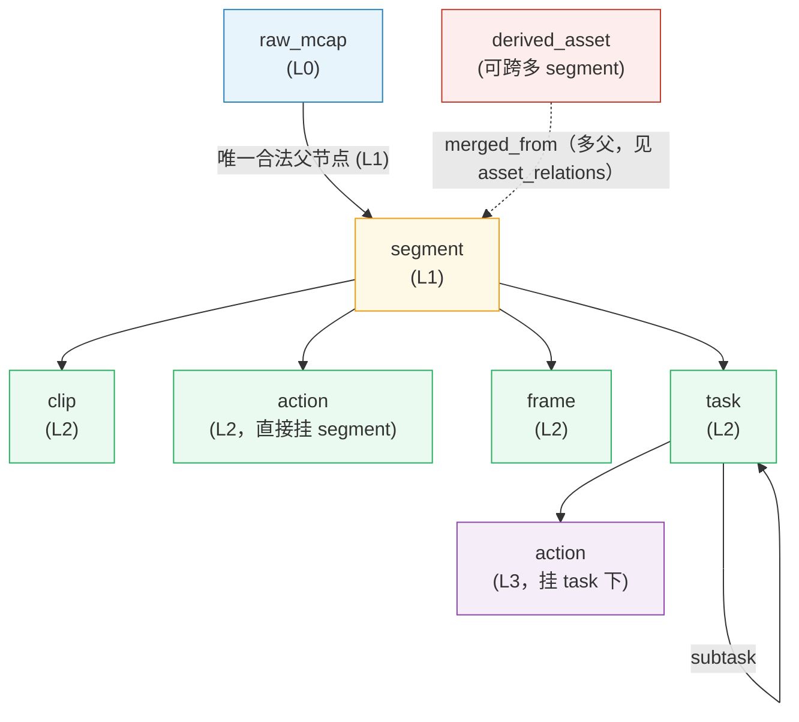
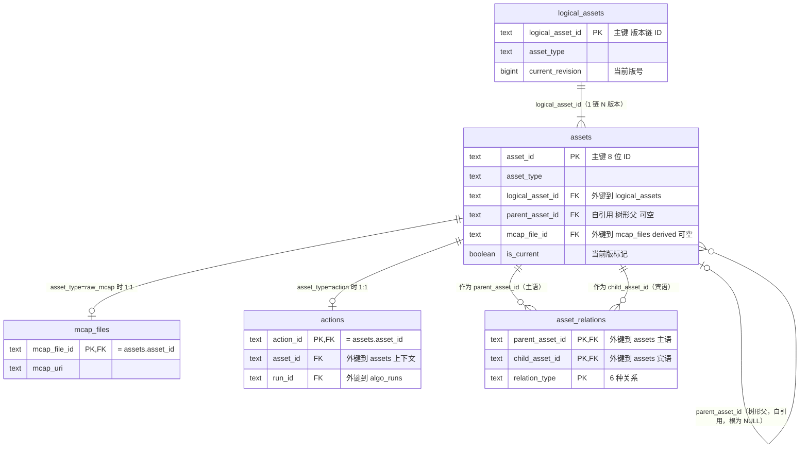

# 资产层级与衍生物设计


| 字段   | 值                                                                |
| ---- | ---------------------------------------------------------------- |
| 状态   | Active（P1）                                                       |
| 关联   | `../README.md` §1-§3 / `../schema.md` §2-§4 / `../schema.md` §12 |
| 决策来源 | rev.12 A1 / A2 / C4 / D 决策                                       |


---

## 1. 业务问题（Why）

DataBrew 上的「数据片段」有多种语义，业务上需要不同处理：


| 业务用法                        | 例                               |
| --------------------------- | ------------------------------- |
| 客户买**原始 MCAP 数据**（不切分）      | raw_mcap → delivery             |
| 客户买**剪辑短片**（高质量切出）          | clip → delivery                 |
| 客户买**动作样本**（带 label）        | action → delivery               |
| 客户买**特定帧 / 帧集**             | frame → delivery                |
| 客户买**任务上下文**（多 action 组合）   | task → delivery                 |
| 客户买**聚合派生品**（跨多 segment 融合） | derived_asset → delivery        |
| 平台**记录但不卖**的物理事实            | mcap_files（raw_mcap 的专用扩展表，1:1） |


---

---

## 2. 设计原则（How）

### 2.1 7 个 asset_type 完整矩阵


| asset_type      | 业务含义                | 默认 materialization         | GCS 产物        | 业务消费             |
| --------------- | ------------------- | -------------------------- | ------------- | ---------------- |
| `raw_mcap`      | 采集原始数据（MCAP 文件）     | `materialized`             | ✓ MCAP 文件     | 卖给要原始数据的客户 / 可切分 |
| `segment`       | MCAP 上的连续时间窗（业务资产根） | `virtual` 主                | 通常无           | 算法处理 / 标注基础单位    |
| `clip`          | segment 切出的子时间窗（本质同 segment，时间上更短） | `virtual` 主，按需 `materialized` | 物化时为子 MCAP 切片（保留多 topic）/ mp4 / 两者 | 给客户的"片段商品" |
| `action`        | 动作时间窗（含 label）      | `virtual` 主                | 通常无           | 给客户的"动作样本"       |
| `frame`         | 单帧 or 帧集合           | `materialized`             | png / parquet | 给客户的"帧样本"        |
| `task`          | 任务边界（含多 action）     | `virtual`                  | 无             | 给客户的"任务样本"       |
| `derived_asset` | 跨多 segment 聚合产物     | `materialized` 或 `virtual` | 视情况           | 给客户的"高级派生品"      |


### 2.2 层级树（固定，schema enforce）

> 下图是 **7 种 `asset_type` 谁可以挂在谁下面**（L0–L3）。所有类型都存在同一张 `assets` 表里，靠 `asset_type` 区分，不是 7 张表。



**读图要点（通俗版）：**

- **实线箭头 = 亲爹关系**。一个 asset 只能有一个亲爹（`assets.parent_asset_id` 字段只放得下一个 ID），但一个爹可以有很多儿子。比如一个 segment 下面可以挂 N 个 clip / frame / task / action，但每个 clip 只认一个 segment 当爹。
- **虚线 = 多爹关系（特殊情况）**。只有 `derived_asset` 这一种类型允许「多个爹」——比如把 3 个 segment 的数据融合成一个聚合产物。一个字段装不下 3 个 ID，所以走另一张表 `asset_relations`（边表）记录多对多关系，类型标 `merged_from`。
- **两条硬规矩**（违反时写入会被服务端拒绝，返回 HTTP 422 错误）：
  - segment 下面**不能**再挂 segment（不允许 segment 嵌套 segment，时间窗就一层）
  - task 下面**只能**挂 action 或子 task，**不能**挂 clip / frame（task 是动作组的容器，不是时间窗）
- **action 可以挂两处**：直接挂 segment 下（叫 L2 action）或挂 task 下（叫 L3 action），二选一。L3 规则写「父=task」**不是**禁止 action 挂 segment，是说「**如果**它挂 task 下，那一定要满足 task 时间窗内」这种细节约束。

**层级不变式（L1-L7）：**

> 「违反」列里的 422 = HTTP 422 错误码（服务端拒绝写入），下同。

| #      | 规则                                                      | 违反                           |
| ------ | ------------------------------------------------------- | ---------------------------- |
| **L1** | segment 父类型必须 = `raw_mcap`                              | 422                          |
| **L2** | clip / frame / task(L2) / action(L2) 父类型必须 = `segment`；task(L3) 父类型必须 = `task` | 422                          |
| **L3** | **若** action 挂 task 下（L3 形态），则父类型必须 = `task` 且时间窗 ⊆ task 时间窗 ⊆ 祖先 segment  | 422 |
| **L4** | 禁止 `segment → segment`（无递归切分）                           | 422                          |
| **L5** | 禁止 task 下挂 clip / frame（允许子 task 递归嵌套）                          | 422                          |
| **L6** | 子资产 `mcap_file_id` 必继承根 segment                         | 422（derived_asset 例外，可 NULL） |
| **L7** | 有父或多父时必须写 `parent_asset_id` 或 `asset_relations` + event | 422                          |


**实施**：`AssetWriteValidator` 在创建 / 更新时同步检查。

### 2.3 物化属性（materialization）


| 值              | 含义            | 业务场景                                 |
| -------------- | ------------- | ------------------------------------ |
| `materialized` | 有 GCS 产物文件    | clip 切出来的 mp4 / frame 的 png          |
| `virtual`      | 无 GCS 产物，纯元数据 | action 仅描述时间窗 / segment 仅描述 mcap 内时段 |


**升级规则（rev.10）：**

- `virtual → materialized` 允许（A 路由原地升级，写 `asset_materialized` event）
- `materialized → virtual` **禁止**（破坏 audit / 数据消失）

**GCS 路径约定：**

```
gs://<bucket>/assets/<logical_asset_id>/r<revision>-<uuid4>/<filename>
```

- UUID 防并发碰撞（异常时不同 worker 不会写同一路径）
- 同 URI 永不覆盖（`ifGenerationMatch=0`）
- 状态机：`pending`（PG 已写，GCS PUT 中）→ `materialized`（PUT 成功）

---

## 3. 数据模型（DDL）

### 3.0 表关系总览（ER 图）

> **范围**：本专题只画 5 张核心表（assets / logical_assets / mcap_files / actions / asset_relations）。交付、标签、算法跑次等其他表去看 [`../schema.md`](../schema.md)。
> **注意**：图画的是 **PRD 第 12 版的目标设计**（北极星），**不是当前生产数据库的真实结构**。现网 `actions` 和 `mcap_files` 还有些字段/约束没改到位，迁移清单见 [`../README.md` §3.1](../README.md#31-文档-vs-现网差在哪)。照着图写查询前先核对一下现网真实表结构。



**ER 图字段补充说明**（图内已用 `"..."` 写了关键注释，下表给业务语义）：

| 表 | 关键字段 | 说明 |
|----|---------|------|
| logical_assets | logical_asset_id | 版本链 ID；asset_type 创建后不可改 |
| assets | asset_id | 8 位 ID；7 种 asset_type 共用此表 |
| assets | parent_asset_id | **树形父**（clip 的爹是 segment）|
| assets | mcap_file_id | 来源 MCAP；derived_asset 可为 NULL |
| mcap_files | mcap_file_id | PK，等于 raw_mcap 行的 asset_id（1 对 1）|
| actions | action_id | PK，等于 action 资产的 asset_id（1 对 1）|
| actions | asset_id | 标注上下文，指向 segment 或 task |
| asset_relations | parent / child | **边的主语 / 宾语**（见下表，≠ 树形 parent）|

**⚠️ 两个「parent」别搞混（最容易画反）：**

| 字段 | 在哪 | 含义 | 例子 |
|------|------|------|------|
| `assets.parent_asset_id` | assets 表 | **树形父节点**（结构上挂在谁下面）| clip.parent = seg_001 |
| `asset_relations.parent_asset_id` | 边表 | **关系的主语**（新东西/容器/新版）| clip 是主语，seg 是宾语 |
| `asset_relations.child_asset_id` | 边表 | **关系的宾语**（来源/被包含者/旧版）| `(clip_xyz, split_from, seg_001)` |

读边：**`parent_asset_id` {relation_type} `child_asset_id`** → 「主语 是什么关系 宾语」
例：`(clip_pqr, derived_from, seg_001)` = clip_pqr 从 seg_001 **算法派生**而来。
同时 `clip_pqr.parent_asset_id = seg_001`（树形上也挂在 segment 下）。**两字段语义不同，名字相似。**

**何时只写 `parent_asset_id`，何时还要写 `asset_relations`：**

| 场景 | assets.parent_asset_id | asset_relations |
|------|------------------------|-----------------|
| 普通单父切分（segment → clip）| ✓ 必填 | 建议写 split_from / derived_from（区分人工 vs 算法）|
| 多父合并（derived_asset）| 通常 NULL 或不表达多父 | ✓ 多条 merged_from |
| 版本升级 v1→v2 | 树形父可能不变 | ✓ revision_of |
| task 包含 action | task 是 action 的树形父 | ✓ contains（可选，与 L3 一致）|

### 3.1 raw_mcap 进 assets + mcap_files 作专用扩展表（1:1）

```sql
-- assets 主表：raw_mcap 作为一个 asset_type
INSERT INTO assets (asset_id, asset_type, logical_asset_id, is_current, ...)
VALUES ('abc12345', 'raw_mcap', 'abc12345', true, ...);   -- 首版 self-ref

-- mcap_files：物理文件细节（asset_type=raw_mcap 时 1:1）
CREATE TABLE mcap_files (
  mcap_file_id     TEXT PRIMARY KEY REFERENCES assets(asset_id)
                   DEFERRABLE INITIALLY DEFERRED,

  -- 物理文件
  mcap_uri         TEXT NOT NULL,
  raw_hash_md5     TEXT,
  raw_hash_sha256  TEXT,
  size_bytes       BIGINT,
  codec            TEXT,

  -- 时间范围
  start_timestamp_ns BIGINT,
  end_timestamp_ns   BIGINT,

  -- MCAP 元数据
  channel_count    INT,
  chunk_count      INT,
  topic_count      INT,
  topic_meta       JSONB DEFAULT '{}',

  -- 摄入状态
  ingest_state     TEXT NOT NULL DEFAULT 'pending',
                   -- pending | indexing | ready | failed
  ingest_error     TEXT,
  ingested_at      TIMESTAMPTZ,

  -- summary 索引（参考 mcap-index-metadata-v1.md）
  summary_index_state TEXT,
  summary_index_uri   TEXT,

  -- 采集 provenance
  vehicle_id       TEXT,
  vendor_id        TEXT,
  device_id        TEXT,
  recorded_at      TIMESTAMPTZ,

  metadata         JSONB NOT NULL DEFAULT '{}',
  process_state    JSONB NOT NULL DEFAULT '{}',
  created_at       TIMESTAMPTZ NOT NULL DEFAULT now(),
  updated_at       TIMESTAMPTZ NOT NULL DEFAULT now()
);

CREATE UNIQUE INDEX uq_mcap_hash_md5     ON mcap_files (raw_hash_md5) WHERE raw_hash_md5 IS NOT NULL;
CREATE INDEX idx_mcap_ingest_state       ON mcap_files (ingest_state);
CREATE INDEX idx_mcap_recorded           ON mcap_files (recorded_at DESC);
CREATE INDEX idx_mcap_vendor_vehicle     ON mcap_files (vendor_id, vehicle_id);
```

**对称性**：`mcap_files`(raw_mcap) 与 `actions`(action) 设计完全对称 —— 都是「某 asset_type 的专用扩展表（1:1）」，PK = `assets.asset_id`（1:1）。

### 3.2 asset_relations 6 种边类型（含新 derived_from）


| relation_type  | parent_asset_id（主语） | child_asset_id（宾语） | 业务含义                                    |
| -------------- | ------------------- | ------------------- | --------------------------------------- |
| `split_from`   | 切出的产物（如 clip）     | 来源（如 segment）      | **人工/规则**切分                         |
| `derived_from` | 算法产物（如 clip/seg）   | 来源 asset            | **算法**跑出（关联 `run_id`）               |
| `contains`     | 容器 task             | 内含 action           | task 包含 L3 action                       |
| `sampled_from` | 采样产物 frame          | 来源 segment          | 采样抽帧（强调采样语义）                        |
| `merged_from`  | 融合产物 derived        | 各来源 asset           | 多源合并（一条来源一行边）                      |
| `revision_of`  | 新版 asset            | 旧版 asset            | 同 logical 版本链                         |


**6 种边 — 读法示例（与上表同一套 parent/child 语义）：**

统一读法：**parent_asset_id（主语）— relation_type — child_asset_id（宾语）**。下面每条写成「主语 is **关系** 宾语」：

| relation_type | 示例（主语 → 宾语） | 一句话 |
|---------------|---------------------|--------|
| `split_from` | `clip_xyz` → `seg_001` | clip 是从 segment **人工/规则切出**的 |
| `derived_from` | `clip_pqr` → `seg_001` | clip 是算法从 segment **跑出**的（边 metadata 带 `run_id`）|
| `contains` | `task_T1` → `action_A1` | task **包含**其下的 action |
| `sampled_from` | `frame_F1` → `seg_001` | frame 是从 segment **采样抽帧**得到的 |
| `merged_from` | `der_001` → `seg_001`；`der_001` → `seg_002` | derived 由多个来源 **合并**（每个来源一行边）|
| `revision_of` | `clipA_v2` → `clipA_v1` | 新版 asset 是旧版的 **revision**（同 logical 链）|

> **注意**：边表方向是「产物 → 来源」（如 clip → segment），与 §2.2 层级树「父 → 子」（segment → clip）**相反**。写边时按上表 parent/child 列填，不要按树形 parent 填反。

**边方向不变式（ER1）：**

> **parent_asset_id** = 主语，**child_asset_id** = 宾语。「parent {relation_type} child」是合法句子，永远朝 parent 方向读。

例：

- `parent='clipA_v2', child='clipA_v1', relation_type='revision_of'`
→ 读作 "clipA_v2 is **revision_of** clipA_v1" ✓
- `parent='clip_X', child='seg_Y', relation_type='derived_from'`
→ 读作 "clip_X is **derived_from** seg_Y"（算法产出）✓

**helper VIEW（自然语言风查询）：**

```sql
CREATE VIEW asset_relations_readable AS
SELECT parent_asset_id AS subject, relation_type AS predicate,
       child_asset_id AS object, metadata, created_at
FROM asset_relations;

-- 用法
SELECT subject, predicate, object FROM asset_relations_readable
WHERE predicate = 'derived_from' AND object = 'seg_Y001';
-- → 哪些资产派生自 seg_Y001？
```

### 3.2.1 `split_from` vs `derived_from` 选择决策表（rev.12 必须明确）

> **真问题**：现网 `assets.split_method` 字段值可以是 `"algo:hand_track@2.0"` —— 算法切分**叫 split**，但 `derived_from` 定义是「算法产出」。算法切出来的 clip 到底走哪条边？

**决策规则**（按 `split_method` 前缀判定）：

| `split_method` 前缀 | 走的边 | 例子 | 是否带 run_id metadata |
|------|------|------|------|
| `algo:*` | **`derived_from`** | `algo:hand_track@2.0` 切出的 clip → `clip is derived_from seg` | ✓ 必带 `run_id` |
| `manual` / `human:*` | **`split_from`** | 运营手切的 clip → `clip is split_from seg` | ✗ |
| `rule:*` | **`split_from`** | rule_engine 自动切（无算法 run）→ `clip is split_from seg` | ✗（rule 无 run_id）|
| 缺失 / `unknown` | **`split_from`**（保守默认）| 历史数据无来源信息 | ✗ |

**逻辑总结**：「**有 `run_id` → `derived_from`；否则 → `split_from`**」。这与「算法产出 vs 人工/规则切分」的语义一致：rule_engine 虽是「算法」但没有 algo_runs 实体（不是 algo SDK 跑出来的，是规则引擎评估出来的），归 `split_from`。

**实施**：`AssetWriter` 创建子 asset 时按上表决定 `relation_type`；`AssetWriteValidator` 校验「`relation_type='derived_from'` ⟹ metadata 必带 `run_id` FK 到 algo_runs」。

### 3.3 `derived_from` 边带 run_id metadata

算法产物的 `derived_from` 边记录算法身份：

```json
{
  "run_id": "R001abc123def456",
  "algo_name": "hand_track",
  "algo_version": "2.0",
  "produced_at": "2026-05-21T10:00:00Z"
}
```

→ 通过 `derived_from` 边可从产物 1 跳查到 algo_run，进行 reproducibility / impact analysis。

详见 `algo-runs.md` §3。

---

## 4. API 契约

### 4.1 创建 raw_mcap（同事务建 assets + mcap_files）

```text
POST /api/v1/mcap-files/upload/finalize
{
  "mcap_uri": "gs://cyb-prod/uploads/2026/05/abc12345.mcap",
  "raw_hash_md5": "...",
  "vehicle_id": "v_001",
  "recorded_at": "2026-05-21T08:00:00Z"
}

→ 同事务：
  INSERT assets       (asset_id='abc12345', asset_type='raw_mcap', logical_asset_id='abc12345', is_current=true)
  INSERT mcap_files   (mcap_file_id='abc12345', mcap_uri='gs://...', ingest_state='pending')
  INSERT asset_events (type='asset_created', actor='ops:rick', ...)
```

> ⚠️ **现网工程量提醒**（rev.12 第二轮 review）：现网 `McapFileRepo.Set`（`repos.go:704`）与 `AssetRepo.InsertNew`（`repos.go:418`）是**两个独立 INSERT**，不在同一事务里；现网 `usecase.Create()` 的 `withMutationTx()` 只包 `assets + asset_tags + asset_algo_latest + asset_events`，**不包 mcap_files**。
>
> 要落地 rev.12，必须重写 `mcap-files/upload/finalize` 的 usecase：合并 `McapFileRepo` 与 `AssetRepo` 进同一 `withMutationTx`。同时 `mcap_files.mcap_file_id` 从独立 PK 改为 FK to `assets.asset_id`（[schema.md §17.2 B2](../schema.md#172-类别-b--已有表改造alter-table)）。**预估工时 2 天**（见 schema.md §17.5 #6）。

### 4.2 创建子资产（layered API）

```text
POST /api/v1/assets/{parent_asset_id}/clips      ← 创建 clip（parent 必须是 segment）
POST /api/v1/assets/{parent_asset_id}/actions    ← 创建 action（L2: parent=segment, L3: parent=task）
POST /api/v1/assets/{parent_asset_id}/frames     ← 创建 frame
POST /api/v1/assets/{parent_asset_id}/tasks      ← 创建 task
```

Validator 检查 L1-L7 不变式；违反 → 422。

### 4.3 layered API 通用形态

```text
POST /api/v1/assets/{parent_id}/<asset_type>s
Idempotency-Key: <uuid>
{
  "start_timestamp_ns": ...,
  "end_timestamp_ns": ...,
  "metadata": {...},
  "split_method": "manual" | "algo:hand_track@2.0" | "rule:quality_filter@1.0",
  "run_id": "R001..."                              // 算法产出时必填（→ derived_from 边带）
}

→ 同事务：
  INSERT assets       (asset_id, asset_type, parent_asset_id, ...)
  INSERT asset_relations (parent=new_id, child=parent_id, type='split_from'|'derived_from')
  INSERT asset_events (type='asset_created', ...)
```

### 4.4 物化升级（virtual → materialized）

```text
POST /api/v1/assets/{id}/materialize
Idempotency-Key: <uuid>
{
  "storage_uri": "gs://cyb-prod/assets/L_clipX/r1-uuid/video.mp4",
  "files": {...}
}

→ 同事务：
  UPDATE assets SET materialization='materialized', storage_uri=..., files=..., updated_at=now()
   WHERE asset_id=? AND materialization='virtual'  -- 保护 M3 不变式（virtual→materialized 单向）
  INSERT asset_events (type='asset_materialized', ...)
```

---

## 5. 业务场景 walkthrough

### 5.1 上传 MCAP + 算法切 segment + 人工切 clip

```text
① 上传 MCAP
   POST /api/v1/mcap-files/upload/finalize
   → assets (raw_mcap='mcap_001') + mcap_files

② 算法启动（segment_extractor@1.0）
   POST /api/v1/algo-runs
   → algo_runs (run_id='R001')

③ 算法跑出 5 个 segment（独立 logical_id，新发现物）
   POST /api/v1/assets/mcap_001/segments (×5)
   → assets (×5 'segment') + asset_relations(parent=seg, child=mcap_001, type='derived_from', metadata={run_id:'R001'})

④ 运营手动切 seg_001 的一段 clip
   POST /api/v1/assets/seg_001/clips
   {storage_uri: 'gs://.../r1-uuid/clip_xyz.mp4', split_method: 'manual'}
   → assets (clip_xyz, materialization='materialized')
   → asset_relations (parent=clip_xyz, child=seg_001, type='split_from')

⑤ 算法在 seg_001 上跑 hand_track@2.0 切出 clip（另一种切法）
   POST /api/v1/algo-runs → R002
   POST /api/v1/assets/seg_001/clips
   {storage_uri: '...', split_method: 'algo:hand_track@2.0', run_id: 'R002'}
   → assets (clip_pqr) + asset_relations(child=seg_001, type='derived_from', metadata={run_id:'R002'})
```

→ **同一 seg_001 可以同时有人工切的 clip_xyz 和算法切的 clip_pqr，通过不同的 relation_type 区分**。

### 5.2 derived_asset 跨多 segment 聚合（multi-source）

```text
algo: cross_segment_summary 在多个 segment 上跑：
  POST /api/v1/algo-runs → R003
  POST /api/v1/assets/null/derived-assets
  {
    source_asset_ids: ['seg_001', 'seg_002', 'seg_003'],
    storage_uri: 'gs://.../summary.parquet'
  }

→ assets (asset_id='der_001', asset_type='derived_asset', mcap_file_id=NULL  ← L6 例外)
→ asset_relations (×3 merged_from 边)：
     (parent='der_001', child='seg_001', type='merged_from', metadata={run_id:'R003'})
     (parent='der_001', child='seg_002', type='merged_from', metadata={run_id:'R003'})
     (parent='der_001', child='seg_003', type='merged_from', metadata={run_id:'R003'})
```

### 5.3 raw_mcap 直接卖给客户

```text
POST /api/v1/deliveries
{customer_id: 'cust_alpha'}
POST /api/v1/deliveries/{id}/items
{
  asset_id: 'mcap_001',
  expected_revision: 1,
  payload_mode: 'materialized'      ← 客户拿到 MCAP 原文件
}
POST /api/v1/deliveries/{id}/commit
→ 客户拿到 gs://cyb-prod/mcap/.../mcap_001.mcap 永久 signed URL
```

→ raw_mcap 进 assets 后，**业务流跟 clip / action 完全一致**，schema 统一。

---

## 6. 不变式与边界

### 6.1 层级（L1-L7）

见 §2.2 表格，由 `AssetWriteValidator` 强制。

### 6.2 物化（M1-M3）


| #      | 规则                                                                                              | 实现        |
| ------ | ----------------------------------------------------------------------------------------------- | --------- |
| **M1** | `materialization='virtual'` ⇒ `storage_uri IS NULL AND files = '{}'`                            | DB CHECK  |
| **M2** | `materialization='materialized'` ⇒ `storage_uri` 符合 `^gs://.+/assets/.+/r\d+-[0-9a-f-]+/.+$` 格式 | Validator |
| **M3** | `materialized → virtual` 禁止                                                                     | Validator |


### 6.3 边方向（ER1）

`asset_relations` 边方向统一：`parent_asset_id` = 主语，`child_asset_id` = 宾语。文档强约定 + helper VIEW 兜底新人困惑。

### 6.4 mcap_files 与 assets 一致性

raw_mcap 创建时**同事务**建 mcap_files 行；mcap_files.mcap_file_id 必须 外键 到 assets.asset_id（DEFERRABLE）。`AssetWriter` 路径强制；缺则事务回滚 422。

### 6.5 AssetWriteValidator 性能边界（rev.12 新增评估）

> **真盲点**（第二轮 review 提出）：L1-L7 层级不变式要求每次写入 INSERT/UPDATE 时校验 parent 元数据（asset_type / 时间窗 / mcap_file_id 继承等），每次写**多 1-3 次 SELECT**。在算法批量产物场景（一次 run 产出 1000+ asset）下，N+1 查询会成为瓶颈。

**P1 接受的代价**：
- 单次写多 1-3 SELECT（parent 元数据查询）—— 简单 PK 查询，命中索引，单次 <1ms
- 高并发场景（>100 QPS 的写入）下，PG 连接池压力上升约 2-4x

**P1.5 优化方向**（不在 P1 范围）：
- **批量 share 父查询**：批量 INSERT 时，先 `SELECT ... WHERE asset_id IN (...)` 一次性拿全部 parent 元数据，再在内存里逐个 validate
- **parent 元数据 in-process cache**（LRU，TTL 5-10s）：高频引用的 segment / raw_mcap 父节点
- **CHECK 约束下沉到 DB**：对部分简单约束（如 L6 mcap_file_id 继承）可考虑用 PG trigger / generated column，省 Go 端 SELECT

**OOS（明确不做）**：
- 不做异步 validate（写完再 validate 然后回滚），破坏 AE1 + 事务原子性
- 不做最终一致 validate（巡检型校验），违反 N1/N2 强约束语义

---

## 7. 与其他模块的关系


| 模块                                | 关系                                                         |
| --------------------------------- | ---------------------------------------------------------- |
| `**asset-versioning.md`**         | 资产可走 B 路由生新版（同 logical_id），`revision_of` 边连接版本链            |
| `**algo-runs.md`**                | 算法产出的 asset 必带 `run_id`，`derived_from` 边 metadata 持 run_id |
| `**asset-tagging.md**`            | 任何 asset_type 都可挂 tag / metric / eval（asset 全套机制）          |
| `**customers-and-deliveries.md**` | 任何 asset_type 都可进 delivery（含 raw_mcap）                     |


---

## 8. 不做的事（Out of Scope）


| 不做的事 项                                 | 原因                                                                          |
| -------------------------------------- | --------------------------------------------------------------------------- |
| **segment → segment 递归切分**（L4）         | 业务上不需要；切再细就用 clip / frame / task 表达                                         |
| **任意 asset_type 互转**（如 clip 改成 action） | asset_type 在 logical_assets 表 immutable（LA1）                                |
| **跨 logical_asset_id 合并**              | 业务无诉求；merged_from 多对一已能表达融合                                                 |
| **frame 集合元素的独立 asset**（一帧一 asset）     | 资产爆炸（segment 内 1 万帧 = 1 万 asset）；P1 用 `frame_kind='set'` + `frame_count` 表达 |


---

## 9. 决策追溯


| 决策                                             | 来源                                      |
| ---------------------------------------------- | --------------------------------------- |
| 7 个 asset_type（含 raw_mcap）                     | rev.12 决策 A2 + D                        |
| raw_mcap 进 assets + mcap_files 作专用扩展表（1:1）     | rev.12 决策 A2（方案 X）                      |
| L1-L7 层级不变式                                    | rev.10 第一轮 grill                        |
| ER1 边方向约定                                      | rev.10 M1 决策（不改列名 + 文档约定 + helper VIEW） |
| `derived_from` 边新增                             | rev.12 决策 C4（区分人工 split_from 与算法产出）     |
| M1-M3 物化不变式                                    | rev.5 初版                                |
| `frame_kind='set'` + `frame_count` 不拆 frame 集合 | rev.7 设计                                |
| `asset_eval_results` 不是 asset_relations 边      | rev.9 §3.6.1 决策                         |
